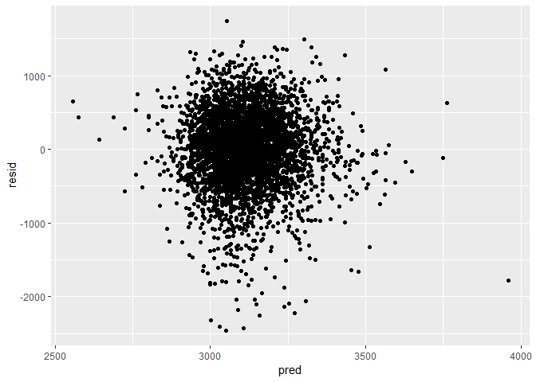
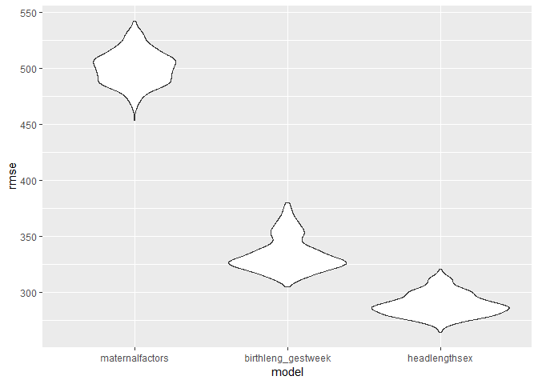

Homework 6
================
Vincent Tam
November 25, 2018

Problem 1 - Homicide Data

    ## -- Attaching packages ----------------------------- tidyverse 1.2.1 --

    ## v ggplot2 3.0.0     v purrr   0.2.5
    ## v tibble  1.4.2     v dplyr   0.7.6
    ## v tidyr   0.8.1     v stringr 1.3.1
    ## v readr   1.1.1     v forcats 0.3.0

    ## -- Conflicts -------------------------------- tidyverse_conflicts() --
    ## x dplyr::filter() masks stats::filter()
    ## x dplyr::lag()    masks stats::lag()

 Problem 2 - Birthweight

    ## Loading required package: nlme

    ## 
    ## Attaching package: 'nlme'

    ## The following object is masked from 'package:dplyr':
    ## 
    ##     collapse

    ## This is mgcv 1.8-25. For overview type 'help("mgcv-package")'.

| term        |  estimate|  p.value|
|:------------|---------:|--------:|
| (Intercept) |  2722.294|        0|
| ppbmi       |   -36.777|        0|
| ppwt        |     9.599|        0|

    ##       bwt    ppbmi ppwt         resid
    ## 1    3629 26.27184  148   452.2324700
    ## 2    3062 21.34485  128  -103.9849320
    ## 3    3345 23.56517  137   174.2794518
    ## 4    3062 21.84508  127   -75.9886474
    ## 5    3374 21.02642  130   177.1056585
    ## 6    3374 18.60030  115   231.8672635
    ## 7    2523 14.27034  105  -682.3850525
    ## 8    2778 21.81089  119  -284.4523377
    ## 9    3515 19.88106  105   515.9623614
    ## 10   3459 24.94123  145   262.0939313
    ## 11   3317 17.26446  110   173.7347882
    ## 12   3459 21.07775  115   407.9815819
    ## 13   3175 23.22115  135    10.8258319
    ## 14   3629 19.19829  126   403.2687109
    ## 15   3544 19.24491  105   521.5663813
    ## 16   2551 17.20085  100  -498.6125154
    ## 17   3232 21.44432  117   175.2646221
    ## 18   3629 23.73717  138   455.0062619
    ## 19   3374 19.23779  130   111.3243645
    ## 20   3345 17.82699  117   155.2285923
    ## 21   3203 22.72121  120   164.4274655
    ## 22   3175 22.01709  128    33.7381624
    ## 23   3175 18.92094  110    92.6555837
    ## 24   2977 20.16133  110   -59.7260182
    ## 25   3685 22.19744  150   339.1885932
    ## 26   3175 18.58882  122   -34.7490962
    ## 27   3629 23.07662  130   507.5063064
    ## 28   2948 13.07137  110  -349.4758359
    ## 29   3345 21.30149  120   254.2140398
    ## 30   3289 19.24726  119   132.2641640
    ## 31   3118 22.51215  135   -72.2493497
    ## 32   3629 16.49563   90   649.4435099
    ## 33   3402 22.64384  140   168.5978751
    ## 34   3827 19.88106  105   827.9623614
    ## 35   3799 21.50106  125   667.5577328
    ## 36   3062 19.84404  119   -72.7879042
    ## 37   3856 23.34593  140   648.4189838
    ## 38   3005 21.97295  140  -253.0756957
    ## 39   3175 19.78098  115    76.2896336
    ## 40   3345 20.41393  115   269.5679065
    ## 41   3600 19.60897  114   504.5628235
    ## 42   3232 31.80969  168    66.9158408
    ## 43   3232 17.71688  103   172.5679143
    ## 44   3175 20.01080  120    36.7457907
    ## 45   3147 20.29700  118    38.4700633
    ## 46   3317 22.53312  131   165.9185924
    ## 47   2948 22.91060  125  -131.6032171
    ## 48   3033 14.05838   95   -84.1881586
    ## 49   3345 19.78098  115   246.2896336
    ## 50   3232 21.02642  130    35.1056585
    ## 51   3317 19.70388  111   253.8509580
    ## 52   3147 21.18820  135   -91.9406148
    ## 53   3118 20.16133  110    81.2739818
    ## 54   3175 28.40151  150    57.3576739
    ## 55   2551 23.07662  130  -570.4936936
    ## 56   3289 21.83513  135    73.8517668
    ## 57   3402 20.40345  130   182.1944657
    ## 58   3487 18.87834  103   470.2832708
    ## 59   3203 18.74893  109   123.9287740
    ## 60   3515 21.47901  121   421.1432944
    ## 61   2920 18.92094  110  -162.3444163
    ## 62   2013 21.16156  143 -1303.7138484
    ## 63   3033 22.75770  145  -244.2107763
    ## 64   2381 21.99418  120  -684.3108176
    ## 65   3118 22.17863  133   -65.3166691
    ## 66   3600 18.99090  121   414.6375545
    ## 67   3402 21.67837  130   229.0823873
    ## 68   3459 19.63259   97   527.6179154
    ## 69   3203 21.15705  123    78.1041129
    ## 70   3289 24.61464  130   224.0708914
    ## 71   3544 17.79159  110   420.1211552
    ## 72   4224 22.51215  135  1033.7506503
    ## 73   3090 23.51269  141  -121.0473918
    ## 74   3912 22.36111  130   764.1917823
    ## 75   3459 20.34431  122   313.8131100
    ## 76   3374 21.65652  122   277.0724791
    ## 77   2778 21.81600  139  -476.2486934
    ## 78   2551 20.37946  126  -631.2912420
    ## 79   3232 19.79476  108   200.9909416
    ## 80   3544 20.16133  110   507.2739818
    ## 81   2920 21.07775  115  -131.0184181
    ## 82   3430 21.97295  140   171.9243043
    ## 83   3799 23.34593  140   591.4189838
    ## 84   2438 23.07662  130  -683.4936936
    ## 85   2977 21.67837  130  -195.9176127
    ## 86   3005 21.07775  115   -46.0184181
    ## 87   2977 23.66793  125   -74.7508565
    ## 88   3118 24.61464  130    53.0708914
    ## 89   3062 16.85683   98    18.9338647
    ## 90   3062 23.90918  139  -115.2669283
    ## 91   3969 18.52006  118   795.1186311
    ## 92   3090 30.84998  185  -273.5662968
    ## 93   3175 27.83348  147    65.2646809
    ## 94   2438 18.04921  115  -724.4002923
    ## 95   2211 16.65940  103  -887.3234384
    ## 96   3572 25.11194  160   237.3839817
    ## 97   3487 18.89356  124   269.2598423
    ## 98   3118 18.32848  100   109.8587105
    ## 99   2778 19.67728  118  -353.3215988
    ## 100  3515 21.45753  145   189.9725536
    ## 101  3487 22.89911  129   368.5771216
    ## 102  2722 21.25134   98  -159.4480739
    ## 103  3799 16.85683   98   755.9338647
    ## 104  3374 17.21871   97   353.8417428
    ## 105  2835 21.32906  124  -293.1690770
    ## 106  3487 27.33692  154   291.8078579
    ## 107  3685 19.40900  120   524.6133718
    ## 108  4791 19.17134  108  1737.0632640
    ## 109  2693 22.70512  132  -461.3545978
    ## 110  2722 20.12500  117  -383.2567465
    ## 111  3459 21.34991  132   254.8040737
    ## 112  3515 21.99418  120   449.6891824
    ## 113  2863 20.01080  120  -275.2542093
    ## 114  3629 20.84458  125   473.4140537
    ## 115  2637 19.52637  110  -423.0782967
    ## 116  3118 25.56136  135    39.8925695
    ## 117  2665 19.61870  125  -535.6704538
    ## 118  2211 21.81600  139 -1043.2486934
    ## 119  3317 22.72159  128   201.6478670
    ## 120  2580 23.34593  140  -627.5810162
    ## 121  3912 19.93260  127   703.6754720
    ## 122  3884 18.60030  115   741.8672635
    ## 123  2126 21.77449  115  -899.3942126
    ## 124  3175 21.77449  115   149.6057874
    ## 125  2778 27.45480  145  -326.4640042
    ## 126  3005 20.54928  105    30.5378663
    ## 127  2750 23.68055  117  -224.4931348
    ## 128  2892 20.82778  110  -120.2159605
    ## 129  3147 19.88106  105   147.9623614
    ## 130  3657 20.21771  125   478.3594800
    ## 131  3090 23.34593  140  -117.5810162
    ## 132  4082 24.26126  150   812.0900916
    ## 133  3090 20.01080  120   -48.2542093
    ## 134  2523 22.50636  115  -475.4782468
    ## 135  2977 22.26376  110    17.5957503
    ## 136  3742 21.03125  134   506.8863871
    ## 137  3090 22.50636  115    91.5217532
    ## 138  3374 19.51053  117   246.1447765
    ## 139  2750 23.22115  135  -414.1741681
    ## 140  3203 20.21771  125    24.3594800
    ## 141  3600 21.17809  127   437.4813730
    ## 142  3090 18.94182  128  -164.3621074
    ## 143  4082 26.68144  170   709.1138207
    ## 144  2098 18.69505  102  -915.8582493
    ## 145  2325 16.86368   95  -689.0166965
    ## 146  3317 19.26495  112   228.1092036
    ## 147  3515 20.08955  128   302.8484700
    ## 148  3685 19.14785  122   495.8105526
    ## 149  3969 21.47901  121   875.1432944
    ## 150  2977 21.99687  136  -241.7990254
    ## 151  3430 18.11507  112   298.8195704
    ## 152  3317 20.84458  125   161.4140537
    ## 153  3515 26.68144  170   142.1138207
    ## 154  3317 21.67307  126   182.2845425
    ## 155  3402 25.84728  155   142.4238434
    ## 156  3856 19.52637  110   795.9217033
    ## 157  3203 17.39622   98   179.7709974
    ## 158  2977 18.74500   99    -6.2236944
    ## 159  1049 22.36111  130 -2098.8082177
    ## 160  3544 18.93434  100   558.1406131
    ## 161  3685 28.27403  135   706.6571583
    ## 162  3799 23.82703  130   705.1043834
    ## 163  2778 20.23642  114  -294.3613481
    ## 164  3742 20.84883  145   394.5864123
    ## 165  3912 22.01154  124   808.9309185
    ## 166  3232 20.21771  125    53.3594800
    ## 167  3685 21.20646  112   667.5127245
    ## 168  3487 19.22779   95   559.9290557
    ## 169  2608 19.26495  112  -480.8907964
    ## 170  2665 20.70294  128  -524.5928268
    ## 171  3515 20.29700  118   406.4700633
    ## 172  2892 22.15318  117  -138.6655974
    ## 173  3175 20.67783  124    22.8804294
    ## 174  3742 17.97935  118   548.2330266
    ## 175  3515 19.60897  114   419.5628235
    ## 176  3033 24.74345  135   -75.1879462
    ## 177  2948 23.09990  122   -95.8438495
    ## 178  3147 19.43696  113    54.8360137
    ## 179  3005 20.17756  121  -136.7205849
    ## 180  3005 18.63881  105   -39.7244299
    ## 181  3232 20.16133  110   195.2739818
    ## 182  3629 17.74847   79   801.1107162
    ## 183  3685 21.65657  107   732.0624255
    ## 184  3430 20.37946  126   247.7087580
    ## 185  2948 19.17134  108  -105.9367360
    ## 186  4252 21.65657  107  1299.0624255
    ## 187  3090 20.82778  110    77.7840395
    ## 188  3203 18.69505  102   189.1417507
    ## 189  3742 20.05890  113   672.7093973
    ## 190  3062 22.17746  121    -6.1692975
    ## 191  3742 20.05890  113   672.7093973
    ## 192  2608 21.77449  115  -417.3942126
    ## 193  2892 21.07775  115  -159.0184181
    ## 194  2325 26.02645  142  -803.1973055
    ## 195  3459 20.29700  118   350.4700633
    ## 196  2693 22.36111  130  -454.8082177
    ## 197  3175 19.96216  102   207.7427003
    ## 198  3714 21.97295  140   455.9243043
    ## 199  3544 23.09348  118   538.3169894
    ## 200  3147 21.17809  127   -15.5186270
    ## 201  3005 18.60030  115  -137.1327365
    ## 202  3770 20.34431  122   624.8131100
    ## 203  3629 19.40900  120   468.6133718
    ## 204  3430 20.25975  107   425.6910465
    ## 205  3345 21.67837  130   172.0823873
    ## 206  3090 25.73930  145   -77.5552239
    ## 207  3969 19.34377  116   844.6110819
    ## 208  3033 17.50945  105   -53.2591390
    ## 209  3317 24.19360  132   217.3874236
    ## 210  3005 17.96191   98     2.5756707
    ## 211  2523 22.17746  121  -545.1692975
    ## 212  3884 19.06162  104   864.4248612
    ## 213  3827 20.01080  120   688.7457907
    ## 214  3317 22.64384  140    83.5978751
    ## 215  3515 20.16133  110   478.2739818
    ## 216  2977 25.44197  130   -57.5022758
    ## 217  2438 19.17933   98  -519.6509246
    ## 218  3714 26.12939  138   627.9856324
    ## 219  2948 19.24491  105   -74.4336187
    ## 220  3005 19.37504   99    44.9474641
    ## 221  3118 21.30149  120    27.2140398
    ## 222  3544 21.83513  135   328.8517668
    ## 223  3203 23.93777  148   -59.6083235
    ## 224  2722 18.34323  110  -381.5908761
    ## 225  2892 19.06162  104  -127.5751388
    ## 226  3544 20.94647  118   459.3556005
    ## 227  3572 40.29532  227   152.6415572
    ## 228  3515 22.87713  133   357.3722123
    ## 229  3402 19.17702  115   281.0774572
    ## 230  3572 20.41723  134   314.3044650
    ## 231  2211 25.97329  151 -1005.5452090
    ## 232  3175 22.64384  140   -58.4021249
    ## 233  3912 24.94123  145   715.0939313
    ## 234  3827 23.39316  136   659.5526420
    ## 235  2948 22.01154  124  -155.0690815
    ## 236  3459 19.57075  100   496.5458527
    ## 237  2778 18.27681  113  -356.8311516
    ## 238  3289 22.44380  143    19.4432281
    ## 239  3374 30.33466  155   279.4575115
    ## 240  3884 22.19744  150   538.1885932
    ## 241  3487 19.51053  117   359.1447765
    ## 242  2948 19.78098  115  -150.7103664
    ## 243  3770 18.87834  103   753.2832708
    ## 244  3005 23.47858  124   -44.1151641
    ## 245  3997 19.17933   98  1039.3490754
    ## 246  3742 24.17024  154   430.3460646
    ## 247  2835 15.57921   85  -130.2640906
    ## 248  3685 22.01709  128   543.7381624
    ## 249  2665 20.21771  125  -513.6405200
    ## 250  2920 20.21771  125  -258.6405200
    ## 251  3090 20.44909  108    83.0553541
    ## 252  4054 23.22115  135   889.8258319
    ## 253  2948 22.34252  118   -85.3012200
    ## 254  3487 18.92378  117   337.5656786
    ## 255  2353 20.84458  125  -802.5859463
    ## 256  1814 22.36111  130 -1333.8082177
    ## 257  3544 22.51215  135   353.7506503
    ## 258  3118 20.34431  122   -27.1868900
    ## 259  3033 26.01404  156  -230.0424617
    ## 260  3969 24.17971  145   744.0872468
    ## 261  2608 19.52637  110  -452.0782967
    ## 262  3827 21.99418  120   761.6891824
    ## 263  3374 16.67566  100   305.0725274
    ## 264  2580 18.57692  108  -495.7980358
    ## 265  3260 19.80776  130    18.2865881
    ## 266  4252 19.70388  111  1188.8509580
    ## 267  3374 19.08552  118   220.9149566
    ## 268  2892 23.01242  138  -308.6483355
    ## 269  3770 21.67837  130   597.0823873
    ## 270  3090 22.51215  135  -100.2493497
    ## 271  3118 19.84234  138  -199.2353416
    ## 272  3062 19.95299  116   -39.9835566
    ## 273  3770 27.49609  170   427.0745953
    ## 274  3175 23.82703  130    81.1043834
    ## 275  3544 22.36111  130   396.1917823
    ## 276  3289 28.64507  188  -184.4546140
    ## 277  3544 17.50945  105   457.7408610
    ## 278  3345 21.02642  130   148.1056585
    ## 279  3232 23.04914  134    71.0990221
    ## 280  3487 18.69505  102   473.1417507
    ## 281  2183 22.15318  117  -847.6655974
    ## 282  3289 21.67837  130   116.0823873
    ## 283  3203 21.99418  120   137.6891824
    ## 284  3997 17.75124  100   967.6294368
    ## 285  3147 19.79476  108   115.9909416
    ## 286  2495 19.88106  105  -504.0376386
    ## 287  3175 20.54120  127   -10.9420346
    ## 288  3487 22.89911  129   368.5771216
    ## 289  3714 22.34252  118   680.6987800
    ## 290  2580 22.15318  117  -450.6655974
    ## 291  3402 21.52782  110   415.5298099
    ## 292  3515 17.92876  101   482.5586914
    ## 293  4111 28.40915  155   945.6424554
    ## 294  3203 22.48210  139   -26.7513323
    ## 295  3005 20.40345  130  -214.8055343
    ## 296  3147 22.50636  115   148.5217532
    ## 297  3402 16.76041  110   240.1973423
    ## 298  3572 21.99418  120   506.6891824
    ## 299  3260 25.01350  150    17.7555804
    ## 300  3147 18.34323  110    43.4091239
    ## 301  3317 19.52637  110   256.9217033
    ## 302  3090 24.17971  145  -134.9127532
    ## 303  3799 20.51107  123   650.3467344
    ## 304  2637 20.44909  108  -369.9446459
    ## 305  3345 17.60894   93   377.5902500
    ## 306  3430 25.01350  150   187.7555804
    ## 307  3374 17.39622   98   350.7709974
    ## 308  2665 25.01350  150  -577.2444196
    ## 309  3005 32.04855  123   280.6643193
    ## 310  3969 20.01080  120   830.7457907
    ## 311  2750 21.26104  116  -303.8768980
    ## 312  3742 19.26495  112   653.1092036
    ## 313  3572 20.54928  105   597.5378663
    ## 314  3629 21.02642  130   432.1056585
    ## 315  3657 17.88889  104   594.2947244
    ## 316  2948 17.34269  104  -134.7928340
    ## 317  2948 20.64102  120  -167.0763168
    ## 318  3572 19.31303  102   580.8692986
    ## 319  2750 21.99687  136  -468.7990254
    ## 320  4082 21.97295  140   823.9243043
    ## 321  2637 21.07775  115  -414.0184181
    ## 322  2920 26.57630  145  -216.7727452
    ## 323  3714 20.71761  140   409.7564437
    ## 324  3487 19.43696  113   394.8360137
    ## 325  3827 21.84512  131   650.6160116
    ## 326  3402 25.01350  150   159.7555804
    ## 327  3685 21.32906  124   556.8309230
    ## 328  3175 22.91060  125    95.3967829
    ## 329  3317 21.99418  120   251.6891824
    ## 330  2977 37.52025  225  -525.2198407
    ## 331  2410 20.51107  123  -738.6532656
    ## 332  3629 19.78098  115   530.2896336
    ## 333  3912 19.50303  128   678.2776493
    ## 334  2637 21.50106  125  -494.4422672
    ## 335  3203 18.34323  110    99.4091239
    ## 336  3572 21.18820  135   333.0593852
    ## 337  2863 21.47901  121  -230.8567056
    ## 338  3260 19.78098  115   161.2896336
    ## 339  3175 23.93777  148   -87.6083235
    ## 340  2070 19.97770  135 -1213.4595959
    ## 341  3685 20.71735  132   457.5403915
    ## 342  3232 20.71119  113   186.6985421
    ## 343  3175 20.29700  118    66.4700633
    ## 344  2778 21.62761  118  -281.5938578
    ## 345  3544 21.63617  142   254.3401493
    ## 346  3714 22.09327  145   412.3535220
    ## 347  2948 23.82703  130  -145.8956166
    ## 348  3260 21.32906  124   131.8309230
    ## 349  3629 20.21771  125   450.3594800
    ## 350  3203 25.87867  160  -103.4176216
    ## 351  3459 18.84350  113   345.0101378
    ## 352  3827 22.93736  155   460.4047031
    ## 353  3232 26.31172  130   229.4847001
    ## 354  3260 20.98504  122   138.3773031
    ## 355  3203 27.51485  165   -91.2394899
    ## 356  1899 20.17756  121 -1242.7205849
    ## 357  3317 16.43943   84   392.9715633
    ## 358  3515 23.85727  126   460.6135210
    ## 359  3260 20.64102  120   144.9236832
    ## 360  3629 18.11507  112   497.8195704
    ## 361  3033 21.83513  135  -182.1482332
    ## 362  3289 22.17746  121   220.8307025
    ## 363  3402 21.67307  126   267.2845425
    ## 364  3856 20.70294  128   666.4071732
    ## 365  4111 23.38549  149   818.4811452
    ## 366  3090 24.17971  145  -134.9127532
    ## 367  2381 16.51282   96  -655.5197552
    ## 368  2608 20.71119  113  -437.3014579
    ## 369  2665 19.24491  105  -357.4336187
    ## 370  2665 18.84935   90  -227.9930405
    ## 371  3317 20.64102  120   201.9236832
    ## 372  3203 21.02642  130     6.1056585
    ## 373  3175 20.01080  120    36.7457907
    ## 374  2835 19.93260  127  -373.3245280
    ## 375  3289 26.57630  145   152.2272548
    ## 376  3232 27.48315  118   387.7572979
    ## 377  2863 19.67728  118  -268.3215988
    ## 378  3969 19.08552  118   815.9149566
    ## 379  3515 20.51107  123   366.3467344
    ## 380  2580 22.51215  135  -610.2493497
    ## 381  3033 22.18905  125   -73.1398269
    ## 382  3147 18.92094  110    64.6555837
    ## 383  2722 18.17648  109  -378.1245008
    ## 384  2920 17.22877   94   -70.9904097
    ## 385  3090 19.52637  110    29.9217033
    ## 386  3033 26.69742  141   -60.9213746
    ## 387  3289 19.26495  112   200.1092036
    ## 388  3289 23.34593  140    81.4189838
    ## 389  3459 22.75770  145   181.7892237
    ## 390  3572 22.28685  142   306.2702300
    ## 391  3033 20.16133  110    -3.7260182
    ## 392  2637 30.73092  190  -778.9409014
    ## 393  2863 20.35358  104  -109.0605224
    ## 394  2608 20.82778  110  -404.2159605
    ## 395  3600 20.16133  110   563.2739818
    ## 396  3090 20.01080  120   -48.2542093
    ## 397  3175 23.54244  150  -121.3458568
    ## 398  3232 19.95299  116   130.0164434
    ## 399  3232 23.82703  130   138.1043834
    ## 400  2126 21.99091  105  -795.4429974
    ## 401  3345 20.94647  118   260.3556005
    ## 402  3005 23.04914  134  -155.9009779
    ## 403  3062 22.34252  118    28.6987800
    ## 404  3799 21.10426  151   403.3850218
    ## 405  3374 21.18820  135   135.0593852
    ## 406  2920 24.65914  126  -104.8959010
    ## 407  3714 19.40900  120   553.6133718
    ## 408  3118 20.21771  125   -60.6405200
    ## 409  3912 20.21771  125   733.3594800
    ## 410  3090 21.84508  127   -47.9886474
    ## 411  2920 20.07040  106   -81.6733310
    ## 412  2977 21.97295  140  -281.0756957
    ## 413  3402 21.65905  138   151.5783086
    ## 414  3487 22.91060  125   407.3967829
    ## 415  3600 20.52790  112   557.5570220
    ## 416  3402 18.63881  105   357.2755701
    ## 417  3544 24.94123  145   347.0939313
    ## 418  2722 22.18905  125  -384.1398269
    ## 419  2750 24.85485  127  -277.2975124
    ## 420  3005 20.64102  120  -110.0763168
    ## 421  2466 23.22115  135  -698.1741681
    ## 422  3005 20.42165  138  -290.9299579
    ## 423  3005 21.30149  120   -85.7859602
    ## 424  3175 17.75796  120   -46.1077850
    ## 425  3515 20.41393  115   439.5679065
    ## 426  3515 17.26446  110   371.7347882
    ## 427  2523 21.99418  120  -542.3108176
    ## 428  3572 18.10627  102   536.4878761
    ## 429  4281 25.58279  163   934.9029055
    ## 430  3714 20.12500  117   608.7432535
    ## 431  3260 20.94647  118   175.3556005
    ## 432  3487 31.77473  179   215.0385942
    ## 433  2296 22.91060  125  -783.6032171
    ## 434  3232 21.15705  123   107.1041129
    ## 435  3402 19.61148  107   373.8494215
    ## 436  3118 20.21771  125   -60.6405200
    ## 437  4252 20.71735  132  1024.5403915
    ## 438  3232 21.44432  117   175.2646221
    ## 439  3742 18.23290  106   672.7483443
    ## 440  3402 21.26104  116   348.1231020
    ## 441  3289 22.11494  113   295.3249758
    ## 442  3997 22.18905  125   890.8601731
    ## 443  2325 19.22779   95  -602.0709443
    ## 444  3941 22.36075  122   869.9722226
    ## 445  3289 21.51161  129   119.5486923
    ## 446  2807 25.80128  150  -406.2720191
    ## 447  3459 28.40199  160   245.3832458
    ## 448  3118 23.04914  134   -42.9009779
    ## 449  3062 20.41393  115   -13.4320935
    ## 450  2778 26.68738  165  -546.6715133
    ## 451  3203 24.37878  160  -158.5795437
    ## 452  2835 18.32848  100  -173.1412895
    ## 453  3856 20.12991  140   530.1422725
    ## 454  3260 19.52637  110   199.9217033
    ## 455  3742 27.18134  163   454.6931908
    ## 456  3742 18.63881  105   697.2755701
    ## 457  2835 19.24491  105  -187.4336187
    ## 458  3884 17.73531  113   729.2537116
    ## 459  3402 29.11351  180    22.5668118
    ## 460  2041 17.50945  105 -1045.2591390
    ## 461  3062 20.46901  119   -49.8031269
    ## 462  3203 21.50106  125    71.5577328
    ## 463  3260 24.08119  140    79.4598818
    ## 464  3317 20.08955  128   104.8484700
    ## 465  2665 20.82778  110  -347.2159605
    ## 466  3062 18.34323  110   -41.5908761
    ## 467  3062 21.13641  108    80.3330322
    ## 468  2438 19.40900  120  -722.3866282
    ## 469  2722 19.60897  114  -373.4371765
    ## 470  3090 20.94372  100   178.0403216
    ## 471  3884 18.67674  112   773.4764432
    ## 472  3090 23.60915  133   -40.7059997
    ## 473  3374 20.64102  120   258.9236832
    ## 474  2977 20.21771  125  -201.6405200
    ## 475  3232 24.26126  150   -37.9099084
    ## 476  4054 18.57692  108   978.2019642
    ## 477  3147 24.74345  135    38.8120538
    ## 478  3629 21.83513  135   413.8517668
    ## 479  3827 21.50106  125   695.5577328
    ## 480  3515 21.50106  125   383.5577328
    ## 481  3260 19.04593  125    38.2642766
    ## 482  3289 23.07662  130   167.5063064
    ## 483  2495 20.51107  123  -653.6532656
    ## 484  2665 18.99383  107  -385.8659207
    ## 485  2637 21.99418  120  -428.3108176
    ## 486  3912 19.22779   95   984.9290557
    ## 487  3033 21.63617  142  -256.6598507
    ## 488  4026 23.45255  145   774.3439833
    ## 489  3969 19.61870  125   768.3295462
    ## 490  3714 22.85511  150   392.3758336
    ## 491  3203 20.34431  122    57.8131100
    ## 492  2381 18.55565   98  -599.5880719
    ## 493  3912 22.19744  150   566.1885932
    ## 494  3487 26.42051  135   440.4896674
    ## 495  3232 22.91060  125   152.3967829
    ## 496  3430 18.74119  123   216.2553381
    ## 497  2835 25.44197  130  -199.5022758
    ## 498  3459 24.08119  140   278.4598818
    ## 499  2778 21.83513  135  -437.1482332
    ## 500  3345 22.54403  123   271.1137427
    ## 501  3430 22.64384  140   196.5978751
    ## 502  3459 19.88139  112   392.7802126
    ## 503  3884 21.67837  130   711.0823873
    ## 504  3572 20.21771  125   393.3594800
    ## 505  2183 19.06162  104  -836.5751388
    ## 506  2948 22.36075  122  -123.0277774
    ## 507  3657 19.50237  103   663.2336760
    ## 508  3459 23.96418  135   322.1524396
    ## 509  3062 25.75009  169  -335.5393553
    ## 510  3629 20.16133  110   592.2739818
    ## 511  2778 25.01350  150  -464.2444196
    ## 512  3317 21.30149  120   226.2140398
    ## 513  3118 20.34431  122   -27.1868900
    ## 514  3572 21.51161  129   402.5486923
    ## 515  2466 23.39316  136  -701.4473580
    ## 516  3232 18.34323  110   128.4091239
    ## 517  3430 21.50106  125   298.5577328
    ## 518  3685 21.30149  120   594.2140398
    ## 519  3685 17.41206   95   691.1511104
    ## 520  2410 21.20646  112  -607.4872755
    ## 521  4167 24.71359  118  1220.9004292
    ## 522  4451 21.02642  130  1254.1056585
    ## 523  3260 20.23978  100   322.1513105
    ## 524  3685 20.98504  122   563.3773031
    ## 525  3572 22.64384  140   338.5978751
    ## 526  3260 24.58474  152   -17.2114226
    ## 527  3629 21.02670  138   355.3222720
    ## 528  2778 21.18820  135  -460.9406148
    ## 529  2835 20.64102  120  -280.0763168
    ## 530  2920 19.88106  105   -79.0376386
    ## 531  3430 25.73930  145   262.4447761
    ## 532  2750 17.61367   90  -188.4380342
    ## 533  3147 17.96191   98   144.5756707
    ## 534  2211 21.99418  120  -854.3108176
    ## 535  2410 20.23642  114  -662.3613481
    ## 536  3090 17.79159  110   -33.8788448
    ## 537  3941 18.92378  117   791.5656786
    ## 538  3459 20.16133  110   422.2739818
    ## 539  3317 23.29318  162  -103.7034836
    ## 540  2466 25.01350  150  -776.2444196
    ## 541  2835 22.87713  133  -322.6277877
    ## 542  3203 24.19360  132   103.3874236
    ## 543  3203 27.22684  130   234.1404773
    ## 544  3345 17.34269  104   262.2071660
    ## 545  3374 20.41393  115   298.5679065
    ## 546  3629 18.83396  120   447.4646268
    ## 547  3090 21.51165  133  -117.8467186
    ## 548  3912 20.29700  118   803.4700633
    ## 549  3572 23.54244  150   275.6541432
    ## 550  3572 18.92094  110   489.6555837
    ## 551  3685 24.74345  135   576.8120538
    ## 552  2892 24.61464  130  -172.9291086
    ## 553  3033 22.54403  123   -40.8862573
    ## 554  3714 29.24145  170   435.2641795
    ## 555  3827 20.08955  128   614.8484700
    ## 556  3685 22.36111  130   537.1917823
    ## 557  4026 31.68376  190   645.1019662
    ## 558  3685 18.28378  103   646.4171307
    ## 559  2948 20.89447  114  -100.1599382
    ## 560  3232 24.19360  132   132.3874236
    ## 561  2892 18.92094  110  -190.3444163
    ## 562  3289 24.61464  130   224.0708914
    ## 563  3515 21.50106  125   383.5577328
    ## 564  3317 18.40491  107   244.4751541
    ## 565  2948 22.50636  115   -50.4782468
    ## 566  2863 20.82778  110  -149.2159605
    ## 567  3289 22.89777  117   285.7186007
    ## 568  4196 19.52637  110  1135.9217033
    ## 569  3969 29.24145  170   690.2641795
    ## 570  2211 22.51215  135  -979.2493497
    ## 571  3600 20.21771  125   421.3594800
    ## 572  2977 22.72159  128  -138.3521330
    ## 573  3118 21.07775  115    66.9815819
    ## 574  3203 21.65652  122   106.0724791
    ## 575  3629 22.34539  134   442.2170259
    ## 576  3487 23.85354  110   586.0635690
    ## 577  3005 31.30555  182  -313.0141015
    ## 578  3005 20.23978  100    67.1513105
    ## 579  3487 25.14062  165   105.4427678
    ## 580  3770 19.93260  127   561.6754720
    ## 581  2835 19.06162  104  -184.5751388
    ## 582  4026 23.34593  140   818.4189838
    ## 583  3118 18.84350  113     4.0101378
    ## 584  3856 20.01080  120   717.7457907
    ## 585  3402 23.22115  135   237.8258319
    ## 586  2580 20.41393  115  -495.4320935
    ## 587  2920 20.23978  100   -17.8486895
    ## 588  2637 20.25975  107  -367.3089535
    ## 589  3742 27.49609  170   399.0745953
    ## 590  3203 18.34323  110    99.4091239
    ## 591  4252 22.09327  145   950.3535220
    ## 592  3742 19.61870  125   541.3295462
    ## 593  2750 18.34323  110  -353.5908761
    ## 594  3827 23.61695  155   485.3981447
    ## 595  3487 17.26446  110   343.7347882
    ## 596  4196 17.37286  101  1143.1142944
    ## 597  3175 22.28685  142   -90.7297700
    ## 598  3175 20.26486  133   -78.7000391
    ## 599  2948 31.99715  210  -613.3564297
    ## 600  3742 22.15861  137   519.5501819
    ## 601  2977 22.91055  121   -64.2082270
    ## 602  3232 22.72121  120   193.4274655
    ## 603  3232 21.63617  142   -57.6598507
    ## 604  3260 25.45726  148    53.2743610
    ## 605  3260 18.04921  115    97.5997077
    ## 606  3203 20.41393  115   127.5679065
    ## 607  3033 21.34485  128  -132.9849320
    ## 608  4252 19.95299  116  1150.0164434
    ## 609  3147 23.45255  145  -104.6560167
    ## 610  2580 20.52790  112  -462.4429780
    ## 611  3714 22.72732  124   637.2552628
    ## 612  2977 18.87834  103   -39.7167292
    ## 613  3430 24.17971  145   205.0872468
    ## 614  3062 21.81089  119    -0.4523377
    ## 615  3345 17.39622   98   321.7709974
    ## 616  2948 22.51215  135  -242.2493497
    ## 617  3685 21.67837  130   512.0823873
    ## 618  3629 34.09098  186   375.0296484
    ## 619  3459 23.34593  140   251.4189838
    ## 620  2495 19.52637  110  -565.0782967
    ## 621  3260 26.02909  133   218.2928901
    ## 622  3629 22.28685  142   363.2702300
    ## 623  3317 19.26495  112   228.1092036
    ## 624  3572 19.67728  118   440.6784012
    ## 625  3515 22.66856  112   551.2846803
    ## 626  2722 20.94647  118  -362.6443995
    ## 627  3685 20.67783  124   532.8804294
    ## 628  3685 20.54120  127   499.0579654
    ## 629  2948 21.17809  127  -214.5186270
    ## 630  3629 21.47901  121   535.1432944
    ## 631  3629 21.67837  130   456.0823873
    ## 632  3005 20.25975  107     0.6910465
    ## 633  3317 18.93434  100   331.1406131
    ## 634  3629 18.60030  115   486.8672635
    ## 635  3118 18.92378  117   -31.4343214
    ## 636  3600 22.36111  130   452.1917823
    ## 637  3289 24.17971  145    64.0872468
    ## 638  3515 23.09389  126   432.5383030
    ## 639  3147 21.58515  114   124.2414100
    ## 640  2665 19.09295  111  -420.6176062
    ## 641  3345 20.44909  108   338.0553541
    ## 642  2665 17.50945  105  -421.2591390
    ## 643  3969 16.27813  110   789.4600655
    ## 644  3232 22.01154  124   128.9309185
    ## 645  3685 21.18820  135   446.0593852
    ## 646  3742 26.66132  155   512.3620305
    ## 647  3827 22.36111  130   679.1917823
    ## 648  3572 23.54244  150   275.6541432
    ## 649  2948 21.83513  135  -267.1482332
    ## 650  3005 19.52637  110   -55.0782967
    ## 651  3770 22.18910  129   625.4649725
    ## 652  3685 20.16133  110   648.2739818
    ## 653  3260 18.63881  105   215.2755701
    ## 654  3912 25.83339  132   872.6945015
    ## 655  3289 23.85354  110   388.0635690
    ## 656  3799 18.51177  101   788.0002306
    ## 657  2495 19.61148  107  -533.1505785
    ## 658  3090 17.75124  100    60.6294368
    ## 659  3629 21.50106  125   497.5577328
    ## 660  3147 19.17134  108    93.0632640
    ## 661  2722 23.17917  139  -482.1147111
    ## 662  3487 27.49272  150   335.9348549
    ## 663  3856 22.64384  140   622.5978751
    ## 664  3459 18.69505  102   445.1417507
    ## 665  3827 21.99418  120   761.6891824
    ## 666  3515 22.36075  122   443.9722226
    ## 667  3005 25.56136  135   -73.1074305
    ## 668  3175 20.84458  125    19.4140537
    ## 669  3572 25.71693  159   269.2331008
    ## 670  3629 18.10627  102   593.4878761
    ## 671  3289 27.51485  165    -5.2394899
    ## 672  2977 19.22779   95    49.9290557
    ## 673  3147 21.47901  121    53.1432944
    ## 674  2863 23.01242  138  -337.6483355
    ## 675  2155 22.92904   88  -568.7546455
    ## 676  4054 19.73249  122   886.3118571
    ## 677  3374 21.67837  130   201.0823873
    ## 678  3203 19.17702  115    82.0774572
    ## 679  3232 24.41719  165  -176.1631478
    ## 680  3657 22.09327  145   355.3535220
    ## 681  2778 21.15705  123  -346.8958871
    ## 682  3459 20.64102  120   343.9236832
    ## 683  2948 18.69505  102   -65.8582493
    ## 684  3118 20.89447  114    69.8400618
    ## 685  3118 23.78667  134   -15.7767451
    ## 686  3317 20.01080  120   178.7457907
    ## 687  3118 19.88139  112    51.7802126
    ## 688  3685 17.71688  103   625.5679143
    ## 689  2693 27.33692  154  -502.1921421
    ## 690  3289 18.74893  109   209.9287740
    ## 691  2381 23.46458  154  -956.6062892
    ## 692  2381 19.97770  135  -902.4595959
    ## 693  3402 25.06996  155   113.8362002
    ## 694  3402 20.71735  132   174.5403915
    ## 695  3402 23.54244  150   105.6541432
    ## 696  3033 17.22877   94    42.0095903
    ## 697  3685 23.85727  126   630.6135210
    ## 698  2835 21.30149  120  -255.7859602
    ## 699  3629 19.04593  125   407.2642766
    ## 700  3714 29.82209  168   475.8170730
    ## 701  2920 21.83513  135  -295.1482332
    ## 702  3175 23.96418  135    38.1524396
    ## 703  2948 20.01080  120  -190.2542093
    ## 704  3515 21.02642  130   318.1056585
    ## 705  2920 17.98763   95   -52.6810649
    ## 706  2948 18.43645  121  -257.7536007
    ## 707  3515 29.28955  165   286.0293791
    ## 708  2977 22.51215  135  -213.2493497
    ## 709  3856 23.22115  135   691.8258319
    ## 710  3062 19.17702  115   -58.9225428
    ## 711  3572 19.04593  125   350.2642766
    ## 712  2948 19.78098  115  -150.7103664
    ## 713  3005 24.32719  155  -310.4809374
    ## 714  3147 23.46046  128    58.8213432
    ## 715  3260 20.70294  128    70.4071732
    ## 716  3147 19.78098  115    48.2896336
    ## 717  2835 19.78098  115  -263.7103664
    ## 718  3374 19.70388  111   310.8509580
    ## 719  1956 17.54487  102 -1100.1588955
    ## 720  3033 18.34323  110   -70.5908761
    ## 721  3203 26.12939  138   116.9856324
    ## 722  3515 22.34252  118   481.6987800
    ## 723  3203 19.17933   98   245.3490754
    ## 724  3289 20.71119  113   243.6985421
    ## 725  3062 20.23642  114   -10.3613481
    ## 726  2495 24.17024  154  -816.6539354
    ## 727  3033 21.33144  140  -248.6687892
    ## 728  2637 19.93260  127  -571.3245280
    ## 729  3118 19.57075  100   155.5458527
    ## 730  3997 21.50106  125   865.5577328
    ## 731  2126 18.92094  110  -956.3444163
    ## 732  1928 20.44909  108 -1078.9446459
    ## 733  3941 26.19298  177   482.9554038
    ## 734  3062 24.99333  132    -8.2004231
    ## 735  3203 21.94091  144   -94.6509123
    ## 736  3118 18.78792   96   165.1522978
    ## 737  2920 22.09327  145  -381.6464780
    ## 738  3515 21.33144  140   233.3312108
    ## 739  3317 30.29495  160   173.0010999
    ## 740  4252 20.41393  115  1176.5679065
    ## 741  3487 20.82778  110   474.7840395
    ## 742  3175 30.99671  148   172.0005849
    ## 743  3374 18.92094  110   291.6555837
    ## 744  3544 19.93260  127   335.6754720
    ## 745  3175 23.48490  120   164.5137670
    ## 746  3459 25.94005  137   375.6212549
    ## 747  3260 24.17971  145    35.0872468
    ## 748  4196 21.78854  143   902.3445836
    ## 749  3544 19.88139  112   477.7802126
    ## 750  3459 21.52782  110   472.5298099
    ## 751  2268 21.50106  125  -863.4422672
    ## 752  3430 19.61148  107   401.8494215
    ## 753  2977 17.73531  113  -177.7462884
    ## 754  3884 19.80776  130   642.2865881
    ## 755  3714 25.80128  150   500.7279809
    ## 756  3175 23.48490  120   164.5137670
    ## 757  3430 26.62687  150   247.0909094
    ## 758  3203 29.27480  135   261.4629652
    ## 759  3033 23.82703  130   -60.8956166
    ## 760  3317 20.98504  122   195.3773031
    ## 761  3856 19.17702  115   735.0774572
    ## 762  3118 21.34991  132   -86.1959263
    ## 763  3515 22.84566  137   317.8179696
    ## 764  2296 17.79159  110  -827.8788448
    ## 765  3515 24.56017  134   409.6705337
    ## 766  3600 21.50106  125   468.5577328
    ## 767  3289 21.07775  115   237.9815819
    ## 768  3090 23.66793  125    38.2491435
    ## 769  2778 23.45255  145  -473.6560167
    ## 770  3600 23.34593  140   392.4189838
    ## 771  3402 21.18820  135   163.0593852
    ## 772  3203 19.61870  125     2.3295462
    ## 773  2722 30.01620  180  -624.2346303
    ## 774  3515 28.84403  115   749.6045039
    ## 775  3260 18.20079   93   314.3571318
    ## 776  2381 19.61148  107  -647.1505785
    ## 777  3203 20.16133  110   166.2739818
    ## 778  3175 22.91060  125    95.3967829
    ## 779  2892 16.98288  105  -213.6249530
    ## 780  2722 19.40900  120  -438.3866282
    ## 781  2722 20.16133  110  -314.7260182
    ## 782  2523 16.75498   80  -351.0264724
    ## 783  2863 24.61464  130  -201.9291086
    ## 784  3317 21.67837  130   144.0823873
    ## 785  3175 17.06515  112     5.2062811
    ## 786  3090 19.34377  116   -34.3889181
    ## 787  4196 21.83513  135   980.8517668
    ## 788  3487 19.24491  105   464.5663813
    ## 789  3203 20.71119  113   157.6985421
    ## 790  3544 19.51053  117   416.1447765
    ## 791  3572 19.98615  143   212.0577388
    ## 792  2807 15.99679   93  -219.7001848
    ## 793  3515 21.50106  125   383.5577328
    ## 794  2126 18.92094  110  -956.3444163
    ## 795  3090 24.74345  135   -18.1879462
    ## 796  3600 19.12369  101   611.5049910
    ## 797  3317 19.70388  111   253.8509580
    ## 798  2977 22.01154  124  -126.0690815
    ## 799  4111 24.14169  136   971.0816942
    ## 800  2580 30.79185  168  -622.5177134
    ## 801  2608 22.87095  113  -357.8709249
    ## 802  3345 29.24145  170    66.2641795
    ## 803  2807 21.65652  122  -289.9275209
    ## 804  3515 22.50636  115   516.5217532
    ## 805  3033 21.34515  136  -209.7676871
    ## 806  2863 20.51107  123  -285.6532656
    ## 807  2551 19.95299  116  -550.9835566
    ## 808  3799 21.99418  120   733.6891824
    ## 809  3572 19.52637  110   511.9217033
    ## 810  3544 18.32848  100   535.8587105
    ## 811  3345 21.30149  120   254.2140398
    ## 812  3345 19.26495  112   256.1092036
    ## 813  3175 21.67837  130     2.0823873
    ## 814  3118 17.04549   93   129.8680702
    ## 815  2070 22.89911  129 -1048.4228784
    ## 816  3118 24.42521  142   -69.0864983
    ## 817  3260 20.84458  125   104.4140537
    ## 818  3232 20.54928  105   257.5378663
    ## 819  3118 21.07775  115    66.9815819
    ## 820  4082 19.06162  104  1062.4248612
    ## 821  2296 20.16133  110  -740.7260182
    ## 822  3175 19.52637  110   114.9217033
    ## 823  2948 20.84458  125  -207.5859463
    ## 824  3260 21.18820  135    21.0593852
    ## 825  3118 20.16133  110    81.2739818
    ## 826  3203 22.72121  120   164.4274655
    ## 827  2296 17.59534   96  -700.7073695
    ## 828  1814 18.84350  113 -1299.9898622
    ## 829  3515 22.84566  137   317.8179696
    ## 830  2750 24.85174  140  -402.2013572
    ## 831  3090 22.36111  130   -57.8082177
    ## 832  2750 22.75770  145  -527.2107763
    ## 833  3856 19.34886  109   798.9925186
    ## 834  3260 19.78098  115   161.2896336
    ## 835  3941 31.68376  190   560.1019662
    ## 836  2693 20.64102  120  -422.0763168
    ## 837  3544 25.01350  150   301.7555804
    ## 838  2722 23.43164  132  -405.6351844
    ## 839  3118 18.00972  108    21.3418046
    ## 840  3572 23.07662  130   450.5063064
    ## 841  3544 22.36111  130   396.1917823
    ## 842  3515 19.67728  118   383.6784012
    ## 843  3033 21.44432  117   -23.7353779
    ## 844  3175 24.31920  137    32.0109488
    ## 845  3289 20.12500  117   183.7432535
    ## 846  3572 21.99418  120   506.6891824
    ## 847  2693 20.94070  107  -286.2653564
    ## 848  3856 21.32906  124   727.8309230
    ## 849  3714 19.08552  118   560.9149566
    ## 850  3600 22.18905  125   493.8601731
    ## 851  2892 22.36075  122  -179.0277774
    ## 852  3118 23.28924  123    71.5204581
    ## 853  1474 25.45726  148 -1732.7256390
    ## 854  4139 19.06162  104  1119.4248612
    ## 855  3175 19.40900  120    14.6133718
    ## 856  3147 21.91924  175  -449.0232325
    ## 857  2580 19.61148  107  -448.1505785
    ## 858  2750 17.02884   99  -296.3393252
    ## 859  2580 20.76896  117  -501.5736542
    ## 860  3657 20.26486  133   403.2999609
    ## 861  3856 22.89911  129   737.5771216
    ## 862  3600 18.92094  110   517.6555837
    ## 863  3374 20.87430  133   142.7133891
    ## 864  1871 19.52637  110 -1189.0782967
    ## 865  3487 31.68376  190   106.1019662
    ## 866  1899 21.84508  127 -1238.9886474
    ## 867  2155 24.37688  133  -947.4710563
    ## 868  4139 20.64102  120  1023.9236832
    ## 869  3147 19.52637  110    86.9217033
    ## 870  4054 24.46343  125  1031.5057103
    ## 871  3742 21.33144  140   460.3312108
    ## 872  3629 21.83403  123   529.0017337
    ## 873  3572 19.23779  130   309.3243645
    ## 874  2693 24.56017  134  -412.3294663
    ## 875  3515 28.02283  148   402.6289885
    ## 876  3289 20.71761  140   -15.2435563
    ## 877  2608 20.64458  102  -334.1598297
    ## 878  3685 23.48490  120   674.5137670
    ## 879  3175 18.87834  103   158.2832708
    ## 880  2637 22.09327  145  -664.6464780
    ## 881  2637 20.25975  107  -367.3089535
    ## 882  3062 20.16133  110    25.2739818
    ## 883  3203 18.34323  110    99.4091239
    ## 884  2325 21.67307  126  -809.7154575
    ## 885  2920 21.33144  140  -361.6687892
    ## 886  3232 22.72732  124   155.2552628
    ## 887  4706 20.12991  140  1380.1422725
    ## 888  3374 24.26126  150   104.0900916
    ## 889  2296 20.41393  115  -779.4320935
    ## 890  2665 20.16133  110  -371.7260182
    ## 891  3260 24.28774  120   279.0402603
    ## 892  3629 20.64102  120   513.9236832
    ## 893  2835 15.44358   87  -154.4505587
    ## 894  3005 22.50636  115     6.5217532
    ## 895  3770 21.30149  120   679.2140398
    ## 896  3742 20.84458  125   586.4140537
    ## 897  3969 19.89423  123   797.6610649
    ## 898  2722 22.51215  135  -468.2493497
    ## 899  2750 16.32276  104  -370.3031289
    ## 900  3402 20.40345  130   182.1944657
    ## 901  3374 21.65652  122   277.0724791
    ## 902  3260 18.28409  120    58.2419650
    ## 903  3374 17.79159  110   250.1211552
    ## 904  2948 22.18905  125  -158.1398269
    ## 905  4026 22.24564  146   720.3579563
    ## 906  3742 22.64384  140   508.5978751
    ## 907  3005 22.28685  142  -260.7297700
    ## 908  2580 17.61367   90  -358.4380342
    ## 909  3317 20.21771  125   138.3594800
    ## 910  3260 19.40900  120    99.6133718
    ## 911  3175 16.34081   95   141.7534350
    ## 912  3430 22.91060  125   350.3967829
    ## 913  3402 20.84458  125   246.4140537
    ## 914  2353 25.23171  156  -938.8145221
    ## 915  3090 21.83513  135  -125.1482332
    ## 916  4026 22.36111  130   878.1917823
    ## 917  3090 25.44197  130    55.4977242
    ## 918  2551 21.45753  145  -774.0274464
    ## 919  3005 22.84566  137  -192.1820304
    ## 920  2410 19.52637  110  -650.0782967
    ## 921  3232 21.30149  120   141.2140398
    ## 922  3572 24.48414  156   252.6920603
    ## 923  3856 21.02642  130   659.1056585
    ## 924  3657 25.84728  155   397.4238434
    ## 925  3260 26.31730  153    36.9084106
    ## 926  3175 22.89911  129    56.5771216
    ## 927  3175 22.54403  123   101.1137427
    ## 928  3941 21.02642  130   744.1056585
    ## 929  2807 19.79476  108  -224.0090584
    ## 930  3487 18.92094  110   404.6555837
    ## 931  2920 19.17702  115  -200.9225428
    ## 932  3430 21.02642  130   233.1056585
    ## 933  3657 22.51215  135   466.7506503
    ## 934  3175 21.91924  112   183.7265872
    ## 935  2920 18.00972  108  -176.6581954
    ## 936  2977 21.99418  120   -88.3108176
    ## 937  2977 20.41393  115   -98.4320935
    ## 938  3118 22.01154  124    14.9309185
    ## 939  2892 20.12500  117  -213.2567465
    ## 940  3770 20.05597  124   595.0102726
    ## 941  2750 22.34539  134  -436.7829741
    ## 942  2580 19.52637  110  -480.0782967
    ## 943  3232 21.34991  132    27.8040737
    ## 944  3062 19.52637  110     1.9217033
    ## 945  3799 19.50303  128   565.2776493
    ## 946  3062 21.81089  119    -0.4523377
    ## 947  3289 22.32035  138    62.8993897
    ## 948  2211 20.63843  109  -798.5802681
    ## 949  2637 22.36075  122  -434.0277774
    ## 950  3657 21.07775  115   605.9815819
    ## 951  3884 24.74345  135   775.8120538
    ## 952  3232 21.01134  126    72.9477487
    ## 953  3459 20.64102  120   343.9236832
    ## 954  2778 19.97770  135  -505.4595959
    ## 955  3714 17.97313  125   452.8099222
    ## 956  3203 20.76896  117   121.4263458
    ## 957  2863 20.71119  113  -182.3014579
    ## 958  3147 22.17746  121    78.8307025
    ## 959  3203 19.24491  105   180.5663813
    ## 960  2920 20.05597  124  -254.9897274
    ## 961  2750 23.67727  160  -637.3792573
    ## 962  2778 29.59097  105   136.0668779
    ## 963  3005 20.81303  121  -113.3495070
    ## 964  2948 29.34823  155  -182.8205782
    ## 965  3459 22.51215  135   268.7506503
    ## 966  2948 20.84458  125  -207.5859463
    ## 967  2778 21.17809  127  -384.5186270
    ## 968  3969 18.00972  108   872.3418046
    ## 969  3430 19.73249  122   262.3118571
    ## 970  3714 20.01080  120   575.7457907
    ## 971  2155 19.67728  118  -976.3215988
    ## 972  4139 23.01242  138   938.3516645
    ## 973  3515 20.37946  126   332.7087580
    ## 974  3118 21.97295  140  -140.0756957
    ## 975  2920 24.74345  135  -188.1879462
    ## 976  3345 21.18820  135   106.0593852
    ## 977  3402 19.78098  115   303.2896336
    ## 978  4054 19.79476  108  1022.9909416
    ## 979  2948 18.67674  112  -162.5235568
    ## 980  4082 19.78098  115   983.2896336
    ## 981  4082 21.63617  142   792.3401493
    ## 982  3515 18.32848  100   506.8587105
    ## 983  3005 21.83513  135  -210.1482332
    ## 984  3402 21.52782  110   415.5298099
    ## 985  4167 20.56960  135   905.3088993
    ## 986  3884 27.52136  160   637.9960800
    ## 987  2977 19.17134  108   -76.9367360
    ## 988  2863 26.68738  165  -461.6715133
    ## 989  3629 20.37946  126   446.7087580
    ## 990  3487 19.17702  115   366.0774572
    ## 991  3402 18.67701  119   224.2916291
    ## 992  2892 18.84935   90    -0.9930405
    ## 993  2722 20.56960  135  -539.6911007
    ## 994  3657 21.99687  136   438.2009746
    ## 995  3289 20.56960  135    27.3088993
    ## 996  4139 20.52790  112  1096.5570220
    ## 997  3941 22.36111  130   793.1917823
    ## 998  3685 20.71735  132   457.5403915
    ## 999  2920 18.67674  112  -190.5235568
    ## 1000 4082 21.18820  135   843.0593852
    ## 1001 3515 21.52782  110   528.5298099
    ## 1002 2948 17.21871   97   -72.1582572
    ## 1003 3544 22.18905  125   437.8601731
    ## 1004 3402 23.00561  160   -10.0811676
    ## 1005 3487 26.68738  165   162.3284867
    ## 1006 3742 20.56960  135   480.3088993
    ## 1007 3345 20.37946  126   162.7087580
    ## 1008 3884 21.20646  112   866.5127245
    ## 1009 3544 19.17702  115   423.0774572
    ## 1010 3402 19.52637  110   341.9217033
    ## 1011 3203 22.32035  138   -23.1006103
    ## 1012 3260 21.77449  115   234.6057874
    ## 1013 3260 20.84458  125   104.4140537
    ## 1014 3289 21.18820  135    50.0593852
    ## 1015 4082 20.29700  118   973.4700633
    ## 1016 4224 20.87433  137   954.3178381
    ## 1017 3345 21.20646  112   327.5127245
    ## 1018 3515 22.72159  128   399.6478670
    ## 1019 3515 20.16133  110   478.2739818
    ## 1020 2693 18.99383  107  -357.8659207
    ## 1021 3232 19.40900  120    71.6133718
    ## 1022 3600 19.50303  128   366.2776493
    ## 1023 3600 24.08119  140   419.4598818
    ## 1024 1928 25.06996  155 -1360.1637998
    ## 1025 3147 29.34823  155    16.1794218
    ## 1026 4082 23.34593  140   874.4189838
    ## 1027 3289 18.06089  105   223.0215342
    ## 1028 3515 17.96191   98   512.5756707
    ## 1029 3118 20.94070  107   138.7346436
    ## 1030 2778 19.51053  117  -349.8552235
    ## 1031 3856 20.84458  125   700.4140537
    ## 1032 2381 22.72159  128  -734.3521330
    ## 1033 4026 19.34377  116   901.6110819
    ## 1034 3175 21.30149  120    84.2140398
    ## 1035 2948 20.21771  125  -230.6405200
    ## 1036 3856 21.02642  130   659.1056585
    ## 1037 3317 19.06162  104   297.4248612
    ## 1038 2637 19.50303  128  -596.7223507
    ## 1039 3033 19.31303  102    41.8692986
    ## 1040 2495 21.99418  120  -570.3108176
    ## 1041 3657 22.34543  151   307.0318292
    ## 1042 3232 33.72736  190   -73.7398846
    ## 1043 3742 18.87834  103   725.2832708
    ## 1044 3912 20.40345  130   692.1944657
    ## 1045 4281 23.34593  140  1073.4189838
    ## 1046 3884 19.80776  130   642.2865881
    ## 1047 3799 22.01188  132   619.1497066
    ## 1048 3289 18.34323  110   185.4091239
    ## 1049 3260 19.67728  118   128.6784012
    ## 1050 3657 21.30149  120   566.2140398
    ## 1051 3629 21.02642  130   432.1056585
    ## 1052 3345 19.42819  106   319.7079014
    ## 1053 3260 20.82778  110   247.7840395
    ## 1054 3770 26.68106  160   493.0921769
    ## 1055 3515 21.01134  126   355.9477487
    ## 1056 3005 20.94070  107    25.7346436
    ## 1057 3317 21.34991  132   112.8040737
    ## 1058 4139 19.89423  123   967.6610649
    ## 1059 3742 19.40900  120   581.6133718
    ## 1060 3714 24.17971  145   489.0872468
    ## 1061 3430 35.50249  200    93.5523816
    ## 1062 3203 18.34323  110    99.4091239
    ## 1063 3232 19.26720  134   -67.9906396
    ## 1064 3799 18.04921  115   636.5997077
    ## 1065 3714 17.80217   85   830.4902789
    ## 1066 2665 20.16133  110  -371.7260182
    ## 1067 3515 21.32906  124   386.8309230
    ## 1068 3317 16.98288  105   211.3750470
    ## 1069 3430 15.39023  104   275.4007550
    ## 1070 3884 20.74499  106   907.1362549
    ## 1071 3515 22.34252  118   481.6987800
    ## 1072 3260 18.81632  106   212.2048247
    ## 1073 2438 19.88139  112  -628.2197874
    ## 1074 2693 16.34081   95  -340.2465650
    ## 1075 3657 23.22115  135   492.8258319
    ## 1076 3799 19.17702  115   678.0774572
    ## 1077 3090 23.12906  143  -154.3544318
    ## 1078 3402 22.51215  135   211.7506503
    ## 1079 3629 21.30149  120   538.2140398
    ## 1080 2920 19.26495  112  -168.8907964
    ## 1081 2750 22.84566  137  -447.1820304
    ## 1082 3515 20.64102  120   399.9236832
    ## 1083 3799 18.92094  110   716.6555837
    ## 1084 2211 18.87834  103  -805.7167292
    ## 1085 2948 22.17746  121  -120.1692975
    ## 1086 3572 20.54120  127   386.0579654
    ## 1087 3118 18.92094  110    35.6555837
    ## 1088 3544 19.50303  128   310.2776493
    ## 1089 3203 22.64384  140   -30.4021249
    ## 1090 3232 26.57756  110   431.2456037
    ## 1091 3062 23.07662  130   -59.4936936
    ## 1092 4082 18.99383  107  1031.1340793
    ## 1093 3289 18.87834  103   272.2832708
    ## 1094 3317 21.07775  115   265.9815819
    ## 1095 3856 21.83513  135   640.8517668
    ## 1096 3147 23.34593  140   -60.5810162
    ## 1097 3629 22.72159  128   513.6478670
    ## 1098 2523 21.34991  132  -681.1959263
    ## 1099 2892 19.40900  120  -268.3866282
    ## 1100 3232 20.52790  112   189.5570220
    ## 1101 3969 20.25975  107   964.6910465
    ## 1102 2948 23.66793  125  -103.7508565
    ## 1103 3515 20.07040  106   513.3266690
    ## 1104 3629 19.61870  125   428.3295462
    ## 1105 3147 22.18905  125    40.8601731
    ## 1106 3345 16.17540   97   286.4715837
    ## 1107 3090 22.85511  150  -231.6241664
    ## 1108 3600 20.29700  118   491.4700633
    ## 1109 3459 19.52637  110   398.9217033
    ## 1110 3374 23.45255  145   122.3439833
    ## 1111 3289 18.40491  107   216.4751541
    ## 1112 3232 23.82703  130   138.1043834
    ## 1113 3969 22.18905  125   862.8601731
    ## 1114 2608 17.00918  102  -467.8601533
    ## 1115 3118 19.83499   98   184.4623805
    ## 1116 3005 20.52790  112   -37.4429780
    ## 1117 3515 21.67837  130   342.0823873
    ## 1118 3572 20.52790  112   529.5570220
    ## 1119 3572 21.02642  130   375.1056585
    ## 1120 2807 19.52637  110  -253.0782967
    ## 1121 3884 19.08552  118   730.9149566
    ## 1122 2722 21.67837  130  -450.9176127
    ## 1123 3430 19.26495  112   341.1092036
    ## 1124 3997 22.36111  130   849.1917823
    ## 1125 3997 21.30149  120   906.2140398
    ## 1126 3118 18.92094  110    35.6555837
    ## 1127 3600 19.17702  115   479.0774572
    ## 1128 3487 23.00561  160    74.9188324
    ## 1129 3969 30.61752  178   664.0786587
    ## 1130 3600 20.40345  130   380.1944657
    ## 1131 3260 20.16133  110   223.2739818
    ## 1132 3374 19.52637  110   313.9217033
    ## 1133 3742 20.29700  118   633.4700633
    ## 1134 3260 23.96418  135   123.1524396
    ## 1135 2807 22.36111  130  -340.8082177
    ## 1136 3685 20.37946  126   502.7087580
    ## 1137 3487 21.34991  132   282.8040737
    ## 1138 3147 20.21771  125   -31.6405200
    ## 1139 2750 19.88106  105  -249.0376386
    ## 1140 3260 21.30149  120   169.2140398
    ## 1141 2580 20.84458  125  -575.5859463
    ## 1142 2835 25.87867  160  -471.4176216
    ## 1143 2693 19.88139  112  -373.2197874
    ## 1144 3572 28.25093  180   160.8436592
    ## 1145 3515 22.75770  145   237.7892237
    ## 1146 3374 21.83513  135   158.8517668
    ## 1147 2948 20.21771  125  -230.6405200
    ## 1148 3969 22.24564  146   663.3579563
    ## 1149 2892 22.01154  124  -211.0690815
    ## 1150 3374 20.40345  130   154.1944657
    ## 1151 3232 20.46901  119   120.1968731
    ## 1152 3742 20.26486  133   488.2999609
    ## 1153 3430 20.34431  122   284.8131100
    ## 1154 3714 33.35133  200   298.4385628
    ## 1155 2863 20.64102  120  -252.0763168
    ## 1156 2381 21.85897  108  -574.0931095
    ## 1157 3459 19.04593  125   237.2642766
    ## 1158 3090 18.93434  100   104.1406131
    ## 1159 3515 34.52892  220   -49.2369156
    ## 1160 2580 17.96191   98  -422.4243293
    ## 1161 3175 21.02642  130   -21.8943415
    ## 1162 3856 22.36111  130   708.1917823
    ## 1163 2835 23.82703  130  -258.8956166
    ## 1164 3856 22.51215  135   665.7506503
    ## 1165 3033 22.32035  138  -193.1006103
    ## 1166 4054 20.84458  125   898.4140537
    ## 1167 3317 19.24491  105   294.5663813
    ## 1168 3345 20.21771  125   166.3594800
    ## 1169 4196 23.04914  134  1035.0990221
    ## 1170 3203 23.67945  142   -11.5136969
    ## 1171 2948 19.06162  104   -71.5751388
    ## 1172 3799 23.34593  140   591.4189838
    ## 1173 2523 20.41393  115  -552.4320935
    ## 1174 3203 22.51215  135    12.7506503
    ## 1175 3487 19.40900  120   326.6133718
    ## 1176 3062 19.73249  122  -105.6881429
    ## 1177 3374 20.94647  118   289.3556005
    ## 1178 3005 21.02670  138  -268.6777280
    ## 1179 3062 17.57836  112   -88.9192860
    ## 1180 3260 21.65652  122   163.0724791
    ## 1181 3175 20.56960  135   -86.6911007
    ## 1182 3203 25.06996  155   -85.1637998
    ## 1183 4196 22.91060  125  1116.3967829
    ## 1184 3515 19.79476  108   483.9909416
    ## 1185 3345 23.96418  135   208.1524396
    ## 1186 3997 19.61870  125   796.3295462
    ## 1187 3033 19.24726  119  -123.7358360
    ## 1188 3175 22.54403  123   101.1137427
    ## 1189 3884 21.97295  140   625.9243043
    ## 1190 2920 21.99418  120  -145.3108176
    ## 1191 3572 20.51107  123   423.3467344
    ## 1192 3289 20.34431  122   143.8131100
    ## 1193 3402 19.61870  125   201.3295462
    ## 1194 2722 21.99418  120  -343.3108176
    ## 1195 3544 22.36111  130   396.1917823
    ## 1196 3402 21.44432  117   345.2646221
    ## 1197 3260 19.63259   97   328.6179154
    ## 1198 3685 19.80776  130   443.2865881
    ## 1199 3289 24.42521  142   101.9135017
    ## 1200 2948 25.29973  125   -43.7374849
    ## 1201 3345 21.30149  120   254.2140398
    ## 1202 2778 18.74119  123  -435.7446619
    ## 1203 3118 21.30149  120    27.2140398
    ## 1204 3175 18.92378  117    25.5656786
    ## 1205 3430 19.88106  105   430.9623614
    ## 1206 3742 25.80128  150   528.7279809
    ## 1207 2920 21.67837  130  -252.9176127
    ## 1208 2977 21.99418  120   -88.3108176
    ## 1209 2892 23.09348  118  -113.6830106
    ## 1210 3657 21.18820  135   418.0593852
    ## 1211 3147 20.84458  125    -8.5859463
    ## 1212 2807 20.08955  128  -405.1515300
    ## 1213 3600 21.34485  128   434.0150680
    ## 1214 2807 20.72197  136  -458.6866664
    ## 1215 2948 23.07662  130  -173.4936936
    ## 1216 3657 20.29700  118   548.4700633
    ## 1217 3005 18.98362   97    49.7506864
    ## 1218 3175 21.52782  110   188.5298099
    ## 1219 4593 19.50303  128  1359.2776493
    ## 1220 4196 17.42141  111  1048.9077160
    ## 1221 2948 19.34886  109  -109.0074814
    ## 1222 3685 22.54408  127   572.7186124
    ## 1223 3289 24.26126  150    19.0900916
    ## 1224 2013 19.50237  103  -980.7663240
    ## 1225 3175 21.26104  116   121.1231020
    ## 1226 2977 18.60030  115  -165.1327365
    ## 1227 3175 19.88139  112   108.7802126
    ## 1228 2665 21.62761  118  -394.5938578
    ## 1229 3345 21.50106  125   213.5577328
    ## 1230 3969 21.97295  140   710.9243043
    ## 1231 2495 20.29700  118  -613.5299367
    ## 1232 3005 20.51107  123  -143.6532656
    ## 1233 3232 22.36111  130    84.1917823
    ## 1234 3203 22.28685  142   -62.7297700
    ## 1235 3714 19.73249  122   546.3118571
    ## 1236 3770 22.48210  139   540.2486677
    ## 1237 3260 21.30149  120   169.2140398
    ## 1238 3033 24.17971  145  -191.9127532
    ## 1239 2807 19.52637  110  -253.0782967
    ## 1240 3544 21.45753  145   218.9725536
    ## 1241 3799 21.50106  125   667.5577328
    ## 1242 3090 19.24491  105    67.5663813
    ## 1243 3175 28.02283  148    62.6289885
    ## 1244 3033 25.90246  170  -368.5349210
    ## 1245 3147 21.44432  117    90.2646221
    ## 1246 3175 21.99418  120   109.6891824
    ## 1247 2438 19.06162  104  -581.5751388
    ## 1248 3005 25.20677  142  -153.3429179
    ## 1249 2977 22.18905  125  -129.1398269
    ## 1250 3345 21.12398  119   257.2847852
    ## 1251 2835 19.78098  115  -263.7103664
    ## 1252 2778 22.64384  140  -455.4021249
    ## 1253 3515 20.52790  112   472.5570220
    ## 1254 3487 23.73717  138   313.0062619
    ## 1255 3260 20.84458  125   104.4140537
    ## 1256 3317 20.41748  142   -17.4800436
    ## 1257 3090 21.77449  115    64.6057874
    ## 1258 2948 23.96418  135  -188.8475604
    ## 1259 3033 28.33570  140     8.9292097
    ## 1260 3629 22.48210  139   399.2486677
    ## 1261 3175 23.43164  132    47.3648156
    ## 1262 2920 20.41393  115  -155.4320935
    ## 1263 3459 22.96732  142   218.2962906
    ## 1264 2807 21.18820  135  -431.9406148
    ## 1265 3742 22.93736  155   375.4047031
    ## 1266 3742 24.08119  140   561.4598818
    ## 1267 3289 21.83513  135    73.8517668
    ## 1268 2807 25.20677  142  -351.3429179
    ## 1269 3260 19.96216  102   292.7427003
    ## 1270 3374 24.17971  145   149.0872468
    ## 1271 3544 19.04593  125   322.2642766
    ## 1272 2948 20.54928  105   -26.4621337
    ## 1273 3175 18.81632  106   127.2048247
    ## 1274 3005 21.50106  125  -126.4422672
    ## 1275 3062 21.51165  133  -145.8467186
    ## 1276 3260 19.17702  115   139.0774572
    ## 1277 2381 17.20085  100  -668.6125154
    ## 1278 3203 19.08552  118    49.9149566
    ## 1279 2835 17.71688  103  -224.4320857
    ## 1280 3203 27.51443  155     4.7370426
    ## 1281 3402 31.38993  200   -85.6966633
    ## 1282 2750 20.64102  120  -365.0763168
    ## 1283 2948 24.32719  155  -367.4809374
    ## 1284 2551 18.84350  113  -562.9898622
    ## 1285 3033 41.28204  240  -474.8591256
    ## 1286 3175 20.01080  120    36.7457907
    ## 1287 3033 22.91464  146  -248.0378485
    ## 1288 3402 21.17809  127   239.4813730
    ## 1289 3147 18.83396  120   -34.5353732
    ## 1290 2098 17.71688  103  -961.4320857
    ## 1291 3430 22.01188  132   250.1497066
    ## 1292 2098 20.07040  106  -903.6733310
    ## 1293 3033 17.75124  100     3.6294368
    ## 1294 3005 23.22115  135  -159.1741681
    ## 1295 2807 19.52637  110  -253.0782967
    ## 1296 3033 21.51161  129  -136.4513077
    ## 1297 2665 19.78098  115  -433.7103664
    ## 1298 3487 21.30149  120   396.2140398
    ## 1299 1956 20.41393  115 -1119.4320935
    ## 1300 3742 33.96576  210   253.0436019
    ## 1301 3118 26.54579   98   431.2676740
    ## 1302 2835 19.17134  108  -218.9367360
    ## 1303 3657 24.74345  135   548.8120538
    ## 1304 2523 18.32848  100  -485.1412895
    ## 1305 3317 22.34252  118   283.6987800
    ## 1306 2551 18.93434  100  -434.8593869
    ## 1307 3005 21.67837  130  -167.9176127
    ## 1308 2977 17.98763   95     4.3189351
    ## 1309 2977 19.76645  101    12.1442414
    ## 1310 2920 21.99418  120  -145.3108176
    ## 1311 2665 19.01026  114  -452.4562374
    ## 1312 2438 19.31303  102  -553.1307014
    ## 1313 3062 17.59534   96    65.2926305
    ## 1314 2892 17.61367   90   -46.4380342
    ## 1315 2807 33.13510  175  -376.5337961
    ## 1316 2665 20.84458  125  -490.5859463
    ## 1317 2863 20.64102  120  -252.0763168
    ## 1318 3544 18.10627  102   508.4878761
    ## 1319 3799 19.34377  116   674.6110819
    ## 1320 1276 20.98504  122 -1845.6226969
    ## 1321 3090 19.88106  105    90.9623614
    ## 1322 2637 19.46175  124  -559.8434514
    ## 1323 3033 24.85485  127     5.7024876
    ## 1324 3175 20.56960  135   -86.6911007
    ## 1325 2211 19.78098  115  -887.7103664
    ## 1326 2523 18.92094  110  -559.3444163
    ## 1327 3572 21.33144  140   290.3312108
    ## 1328 2750 20.64102  120  -365.0763168
    ## 1329 2495 17.39622   98  -528.2290026
    ## 1330 3005 23.22854  148  -283.6918525
    ## 1331 3033 18.92094  110   -49.3444163
    ## 1332 3232 27.73087  182  -217.4813595
    ## 1333 1616 19.88106  105 -1383.0376386
    ## 1334 2835 23.61695  155  -506.6018553
    ## 1335 2977 19.88139  112   -89.2197874
    ## 1336 3232 20.03739   99   296.3068455
    ## 1337 2835 21.30149  120  -255.7859602
    ## 1338 3005 21.52782  110    18.5298099
    ## 1339 2835 22.36111  130  -312.8082177
    ## 1340 3515 21.58515  114   492.2414100
    ## 1341 2381 21.97295  140  -877.0756957
    ## 1342 2410 20.41393  115  -665.4320935
    ## 1343 1503 15.14747   80 -1430.1462039
    ## 1344 2155 18.92094  110  -927.3444163
    ## 1345 3203 19.88139  112   136.7802126
    ## 1346 2523 22.50636  115  -475.4782468
    ## 1347 3572 21.52782  110   585.5298099
    ## 1348 4082 21.84508  127   944.0113526
    ## 1349 3374 25.89669  165    20.2489012
    ## 1350 2693 17.60861   87  -216.8265243
    ## 1351 2325 17.04091   90  -634.5028128
    ## 1352 3175 19.52637  110   114.9217033
    ## 1353 2580 25.06996  155  -708.1637998
    ## 1354 2098 22.72159  128 -1017.3521330
    ## 1355 2381 18.59221   95  -569.4460909
    ## 1356 2580 19.88106  105  -419.0376386
    ## 1357 2268 20.15787  103  -701.6589111
    ## 1358 3005 24.17971  145  -219.9127532
    ## 1359 3203 22.91060  125   123.3967829
    ## 1360 3090 17.59534   96    93.2926305
    ## 1361 3487 19.53375  132   216.0107661
    ## 1362 1701 19.96216  102 -1266.2572997
    ## 1363 2722 27.46618  175  -670.0212599
    ## 1364 2920 20.23978  100   -17.8486895
    ## 1365 2750 22.91060  125  -329.6032171
    ## 1366 3430 20.29700  118   321.4700633
    ## 1367 3289 20.01080  120   150.7457907
    ## 1368 2722 17.71688  103  -337.4320857
    ## 1369 3147 18.14520   99   141.7171904
    ## 1370 2863 20.94647  118  -221.6443995
    ## 1371 3062 21.77449  115    36.6057874
    ## 1372 2551 16.00864   96  -504.0621112
    ## 1373 3033 18.60030  115  -109.1327365
    ## 1374 2438 19.24491  105  -584.4336187
    ## 1375 3203 29.18242  175  -125.9028933
    ## 1376 2948 18.50999  111  -159.0571815
    ## 1377 3941 21.02642  130   744.1056585
    ## 1378 2608 14.55675   90  -442.8633481
    ## 1379 3402 18.92094  110   319.6555837
    ## 1380 1758 21.62761  118 -1301.5938578
    ## 1381 2608 20.51107  123  -540.6532656
    ## 1382 2353 18.06089  105  -712.9784658
    ## 1383 2863 19.50237  103  -130.7663240
    ## 1384 3203 21.12398  119   115.2847852
    ## 1385 2863 19.43696  113  -229.1639863
    ## 1386 3402 15.85069   98   321.9304533
    ## 1387 3005 27.52136   90   430.9403241
    ## 1388 3118 20.16133  110    81.2739818
    ## 1389 2948 22.51215  135  -242.2493497
    ## 1390 3572 16.27813  110   392.4600655
    ## 1391 3345 23.07662  130   223.5063064
    ## 1392 2920 18.92094  110  -162.3444163
    ## 1393 3232 21.30149  120   141.2140398
    ## 1394 2523 18.28378  103  -515.5828693
    ## 1395 2693 17.37286  101  -359.8857056
    ## 1396 3685 23.96418  135   548.1524396
    ## 1397 2580 19.43019   96  -349.2264793
    ## 1398 3629 19.88106  105   629.9623614
    ## 1399 2665 18.04921  115  -497.4002923
    ## 1400 2155 32.29173  165  -963.5584611
    ## 1401 2098 22.15318  117  -932.6655974
    ## 1402 3260 20.64102  120   144.9236832
    ## 1403 2863 19.17933   98   -94.6509246
    ## 1404 2665 24.08119  140  -515.5401182
    ## 1405 3770 22.36111  130   622.1917823
    ## 1406 3487 21.52782  110   500.5298099
    ## 1407 2750 22.72732  124  -326.7447372
    ## 1408 3260 36.12179  210  -149.6634237
    ## 1409 2835 19.95299  116  -266.9835566
    ## 1410 2722 20.59144  116  -356.5029088
    ## 1411 3147 20.21771  125   -31.6405200
    ## 1412 2778 24.74345  135  -330.1879462
    ## 1413 2892 19.78098  115  -206.7103664
    ## 1414 3033 20.64102  120   -82.0763168
    ## 1415 2665 21.02642  130  -531.8943415
    ## 1416 2863 21.32906  124  -265.1690770
    ## 1417 3402 28.38140  165   139.6301299
    ## 1418 2920 18.83396  120  -261.5353732
    ## 1419 3600 23.82703  130   506.1043834
    ## 1420 3515 19.22779   95   587.9290557
    ## 1421 2948 24.67999  148  -287.3117389
    ## 1422 2410 18.60030  115  -732.1327365
    ## 1423 2410 19.17134  108  -643.9367360
    ## 1424 1928 16.86368   95 -1086.0166965
    ## 1425 2977 25.56136  135  -101.1074305
    ## 1426 2296 18.27681  113  -838.8311516
    ## 1427 2835 19.17702  115  -285.9225428
    ## 1428 2977 18.92094  110  -105.3444163
    ## 1429 3118 22.28685  142  -147.7297700
    ## 1430 3799 21.30149  120   708.2140398
    ## 1431 3714 15.69496  100   609.0049144
    ## 1432 2750 20.11250  132  -499.7044734
    ## 1433 3289 21.97295  140    30.9243043
    ## 1434 3459 17.26446  110   315.7347882
    ## 1435 3005 20.64458  102    62.8401703
    ## 1436 3374 21.20646  112   356.5127245
    ## 1437 3629 17.79159  110   505.1211552
    ## 1438 3345 17.79159  110   221.1211552
    ## 1439 2778 22.34252  118  -255.3012200
    ## 1440 3345 16.27813  110   165.4600655
    ## 1441 3799 21.30149  120   708.2140398
    ## 1442 2637 21.47901  121  -456.8567056
    ## 1443 2863 21.52782  110  -123.4701901
    ## 1444 1474 18.81632  106 -1573.7951753
    ## 1445 3118 23.29081  144  -130.0052240
    ## 1446 3232 20.82778  110   219.7840395
    ## 1447 2637 18.59221   95  -313.4460909
    ## 1448 3175 16.76041  110    13.1973423
    ## 1449 3033 18.16923  130  -268.9741930
    ## 1450 3203 24.09951  149   -63.2591158
    ## 1451 3289 21.50106  125   157.5577328
    ## 1452 3459 26.12939  138   372.9856324
    ## 1453 2750 21.44432  117  -306.7353779
    ## 1454 2551 20.54928  105  -423.4621337
    ## 1455 3912 22.87713  133   754.3722123
    ## 1456 2807 19.52637  110  -253.0782967
    ## 1457 2722 25.71693  159  -580.7668992
    ## 1458 2353 22.50636  115  -645.4782468
    ## 1459 2892 22.72121  120  -146.5725345
    ## 1460 2381 25.89669  165  -972.7510988
    ## 1461 2495 17.04091   90  -464.5028128
    ## 1462 3544 17.75124  100   514.6294368
    ## 1463 3289 21.99418  120   223.6891824
    ## 1464 2977 19.06162  104   -42.5751388
    ## 1465 2523 18.39650   94  -425.0444795
    ## 1466 3062 19.14785  122  -127.1894474
    ## 1467 3033 18.92094  110   -49.3444163
    ## 1468 3062 27.86538  162  -190.5503001
    ## 1469 2750 19.88106  105  -249.0376386
    ## 1470 2637 20.16133  110  -399.7260182
    ## 1471 2240 21.99418  120  -825.3108176
    ## 1472 2778 24.94123  145  -418.9060687
    ## 1473 3175 32.18838  170     4.6445262
    ## 1474 2750 18.34323  110  -353.5908761
    ## 1475 2835 21.34991  132  -369.1959263
    ## 1476 3544 18.93434  100   558.1406131
    ## 1477 2807 19.31303  102  -184.1307014
    ## 1478 3090 19.89423  123   -81.3389351
    ## 1479 3232 21.67837  130    59.0823873
    ## 1480 2126 17.75124  100  -903.3705632
    ## 1481 3260 20.23978  100   322.1513105
    ## 1482 3260 28.30480  175  -101.1792964
    ## 1483 3600 22.18910  129   455.4649725
    ## 1484 3147 18.46129  104   105.3463853
    ## 1485 3033 26.57630  145  -103.7727452
    ## 1486 3090 23.04914  134   -70.9009779
    ## 1487 3430 22.18905  125   323.8601731
    ## 1488 2580 20.01080  120  -558.2542093
    ## 1489 2722 19.57075  100  -240.4541473
    ## 1490 2665 25.80128  150  -548.2720191
    ## 1491 2807 18.17697   96  -168.3167573
    ## 1492 3232 17.75124  100   202.6294368
    ## 1493 2637 17.75124  100  -392.3705632
    ## 1494 3260 25.45726  148    53.2743610
    ## 1495 3289 21.30149  120   198.2140398
    ## 1496 3430 25.01350  150   187.7555804
    ## 1497 2807 22.18905  125  -299.1398269
    ## 1498 3232 23.96418  135    95.1524396
    ## 1499 3062 19.61870  125  -138.6704538
    ## 1500 2438 18.17697   96  -537.3167573
    ## 1501 3345 31.99358  186    13.8931383
    ## 1502 1701 19.88139  112 -1365.2197874
    ## 1503 1956 17.98763   95 -1016.6810649
    ## 1504 2155 20.16133  110  -881.7260182
    ## 1505 3175 20.56960  135   -86.6911007
    ## 1506 2608 22.15318  117  -422.6655974
    ## 1507 3175 19.09295  111    89.3823938
    ## 1508 3232 21.96384  116   203.9700950
    ## 1509 2807 19.52637  110  -253.0782967
    ## 1510 3203 17.75124  100   173.6294368
    ## 1511 2381 16.76041  110  -780.8026577
    ## 1512 3374 21.02642  130   177.1056585
    ## 1513 2637 24.28774  120  -343.9597397
    ## 1514 2608 17.37286  101  -444.8857056
    ## 1515 3289 19.24491  105   266.5663813
    ## 1516 3629 20.84458  125   473.4140537
    ## 1517 3374 21.83403  123   274.0017337
    ## 1518 3289 17.77863   97   289.4341506
    ## 1519 2495 19.23779  130  -767.6756355
    ## 1520 3175 23.09389  126    92.5383030
    ## 1521 4139 18.83396  120   957.4646268
    ## 1522 3175 20.16133  110   138.2739818
    ## 1523 2240 20.82778  110  -772.2159605
    ## 1524 3289 18.92094  110   206.6555837
    ## 1525 2296 18.92094  110  -786.3444163
    ## 1526 3487 21.97295  140   228.9243043
    ## 1527 3374 22.18905  125   267.8601731
    ## 1528 3175 18.63881  105   130.2755701
    ## 1529 2920 19.61870  125  -280.6704538
    ## 1530 2948 19.34886  109  -109.0074814
    ## 1531 2665 22.70207  116  -335.8797879
    ## 1532 3345 21.84508  127   207.0113526
    ## 1533 3062 24.26126  150  -207.9099084
    ## 1534 2523 24.61464  130  -541.9291086
    ## 1535 3260 15.84188   95   208.4042291
    ## 1536 3374 23.34593  140   166.4189838
    ## 1537 2863 21.99418  120  -202.3108176
    ## 1538 2977 20.94647  118  -107.6443995
    ## 1539 3203 19.61870  125     2.3295462
    ## 1540 3203 22.64384  140   -30.4021249
    ## 1541 2523 25.68052  154  -733.1097810
    ## 1542 2778 16.09419   85  -168.3244909
    ## 1543 1729 18.49787  125 -1512.8917454
    ## 1544 3430 19.78098  115   331.2896336
    ## 1545 2948 19.97805  109   -85.8675383
    ## 1546 2041 22.36075  122 -1030.0277774
    ## 1547 3232 22.91060  125   152.3967829
    ## 1548 3402 21.32906  124   273.8309230
    ## 1549 3487 21.50210  137   240.4053106
    ## 1550 2551 23.22115  135  -613.1741681
    ## 1551 2778 27.88323  183  -675.4769255
    ## 1552 3317 23.96418  135   180.1524396
    ## 1553 2325 23.07662  130  -796.4936936
    ## 1554 3345 21.77449  115   319.6057874
    ## 1555 2693 20.40345  130  -526.8055343
    ## 1556 3118 23.45255  145  -133.6560167
    ## 1557 4082 21.51161  129   912.5486923
    ## 1558 2693 22.91464  146  -588.0378485
    ## 1559 2523 21.15316  101  -390.8563702
    ## 1560 3402 26.83333  156   169.0888406
    ## 1561 2948 19.40900  120  -212.3866282
    ## 1562 2778 18.92094  110  -304.3444163
    ## 1563 3487 18.63881  105   442.2755701
    ## 1564 2608 20.23978  100  -329.8486895
    ## 1565 3005 20.56960  135  -256.6911007
    ## 1566 2523 16.63513   85  -403.4300480
    ## 1567 3317 21.18820  135    78.0593852
    ## 1568 3147 17.50945  105    60.7408610
    ## 1569 3544 20.21771  125   365.3594800
    ## 1570 2410 27.51443  155  -788.2629574
    ## 1571 2863 19.95299  116  -238.9835566
    ## 1572 3770 27.49272  150   618.9348549
    ## 1573 3289 21.12398  119   201.2847852
    ## 1574 3912 19.24491  105   889.5663813
    ## 1575 2863 24.46343  125  -159.4942897
    ## 1576 3090 27.37685  185  -401.2989190
    ## 1577 3515 42.65811  248   -19.0446464
    ## 1578 3714 21.91924  112   722.7265872
    ## 1579 3345 24.12122  163   -54.8496197
    ## 1580 2155 19.61870  125 -1045.6704538
    ## 1581 2438 17.57373   99  -588.2998178
    ## 1582 2778 23.82703  130  -315.8956166
    ## 1583 3090 19.88106  105    90.9623614
    ## 1584 3203 23.64374  129   111.9628633
    ## 1585 2778 16.86368   95  -236.0166965
    ## 1586 3345 16.76041  110   183.1973423
    ## 1587 2438 17.84296  107  -655.1918197
    ## 1588 2977 19.24491  105   -45.4336187
    ## 1589 2948 20.51107  123  -200.6532656
    ## 1590 2126 28.38140  165 -1136.3698701
    ## 1591 3515 20.41393  115   439.5679065
    ## 1592 3544 21.30149  120   453.2140398
    ## 1593 3317 19.67728  118   185.6784012
    ## 1594 3033 17.75124  100     3.6294368
    ## 1595 1843 34.61493  195 -1478.0937517
    ## 1596 3203 26.66132  155   -26.6379695
    ## 1597 3203 20.82778  110   190.7840395
    ## 1598 3203 18.92094  110   120.6555837
    ## 1599 3005 19.57075  100    42.5458527
    ## 1600 3459 18.06089  105   393.0215342
    ## 1601 3203 19.61870  125     2.3295462
    ## 1602 2778 19.78098  115  -320.7103664
    ## 1603 3118 19.41099  135  -186.3017974
    ## 1604 2013 20.41393  115 -1062.4320935
    ## 1605 3232 20.84883  145  -115.4135877
    ## 1606 3203 18.63881  105   158.2755701
    ## 1607 3374 19.40900  120   213.6133718
    ## 1608 2892 21.67837  130  -280.9176127
    ## 1609 2665 19.93260  127  -543.3245280
    ## 1610 3005 21.44432  117   -51.7353779
    ## 1611 2353 20.64102  120  -762.0763168
    ## 1612 2551 20.82778  110  -461.2159605
    ## 1613 2920 21.50210  137  -326.5946894
    ## 1614 2750 19.88106  105  -249.0376386
    ## 1615 3572 18.92378  117   422.5656786
    ## 1616 3742 28.95177  179   366.2176041
    ## 1617 2722 17.61367   90  -216.4380342
    ## 1618 2750 19.42819  106  -275.2920986
    ## 1619 2353 26.20216  162  -960.7192061
    ## 1620 2835 27.17261  168  -500.6238905
    ## 1621 3005 25.73930  145  -162.5552239
    ## 1622 2353 23.48490  120  -657.4862330
    ## 1623 3260 18.92094  110   177.6555837
    ## 1624 2892 25.80128  150  -321.2720191
    ## 1625 2892 30.10149  175  -403.1017710
    ## 1626 3118 17.46810  108     1.4226699
    ## 1627 3062 23.07662  130   -59.4936936
    ## 1628 2240 20.29700  118  -868.5299367
    ## 1629 2070 20.16133  110  -966.7260182
    ## 1630 3147 19.19829  126   -78.7312891
    ## 1631 3090 22.15861  137  -132.4498181
    ## 1632 2948 18.93434  100   -37.8593869
    ## 1633 2466 22.80558  141  -771.0529172
    ## 1634 2637 19.43696  113  -455.1639863
    ## 1635 3374 24.26126  150   104.0900916
    ## 1636 3203 25.30509  171  -230.1038718
    ## 1637 3118 23.82703  130    24.1043834
    ## 1638 3033 20.70294  128  -156.5928268
    ## 1639 3685 19.52637  110   624.9217033
    ## 1640 3118 17.41959   92   153.2258722
    ## 1641 3402 20.76896  117   320.4263458
    ## 1642 3600 22.33559  103   710.4317775
    ## 1643 3005 22.51215  135  -185.2493497
    ## 1644 3062 21.18820  135  -176.9406148
    ## 1645 2381 19.52637  110  -679.0782967
    ## 1646 3402 17.20382   85   496.4845456
    ## 1647 2948 25.44197  130   -86.5022758
    ## 1648 1956 19.95299  116 -1145.9835566
    ## 1649 3317 18.83396  120   135.4646268
    ## 1650 2466 20.29700  118  -642.5299367
    ## 1651 1673 28.33570  140 -1351.0707903
    ## 1652 2863 19.95299  116  -238.9835566
    ## 1653 3289 24.23596  128   229.3422064
    ## 1654 3147 21.65652  122    50.0724791
    ## 1655 3147 24.92674  136    35.9535739
    ## 1656 3515 25.44197  130   480.4977242
    ## 1657 3289 19.52637  110   228.9217033
    ## 1658 2665 19.17702  115  -455.9225428
    ## 1659 2211 21.77449  115  -814.3942126
    ## 1660 3005 20.64102  120  -110.0763168
    ## 1661 3487 23.34593  140   279.4189838
    ## 1662 2268 18.83396  120  -913.5353732
    ## 1663 2580 23.09348  118  -425.6830106
    ## 1664 3572 19.08552  118   418.9149566
    ## 1665 3118 16.76041  110   -43.8026577
    ## 1666 3345 19.26495  112   256.1092036
    ## 1667 3260 25.38428  143    98.5863367
    ## 1668 3260 19.88139  112   193.7802126
    ## 1669 2381 21.65652  122  -715.9275209
    ## 1670 3799 20.76896  117   717.4263458
    ## 1671 3629 26.88677  142   532.4430028
    ## 1672 3175 21.02642  130   -21.8943415
    ## 1673 2807 22.72121  120  -231.5725345
    ## 1674 3232 17.04091   90   272.4971872
    ## 1675 3289 24.32719  155   -26.4809374
    ## 1676 3827 17.95333  111   699.4703630
    ## 1677 2948 25.20677  142  -210.3429179
    ## 1678 3147 20.40345  130   -72.8055343
    ## 1679 2807 24.26126  150  -462.9099084
    ## 1680 2807 20.64102  120  -308.0763168
    ## 1681 1191 19.88106  105 -1808.0376386
    ## 1682 3515 27.51443  155   316.7370426
    ## 1683 2070 31.95224  180 -1205.0322214
    ## 1684 2466 23.54244  150  -830.3458568
    ## 1685 3289 28.09398  179  -118.3293384
    ## 1686 2098 20.01080  120 -1040.2542093
    ## 1687 2948 18.50999  111  -159.0571815
    ## 1688 3317 25.11194  160   -17.6160183
    ## 1689 3459 20.82778  110   446.7840395
    ## 1690 3714 22.17863  133   530.6833309
    ## 1691 2495 21.30149  120  -595.7859602
    ## 1692 2693 22.53187  119  -342.9369124
    ## 1693 3345 30.17711  170   100.6755124
    ## 1694 3402 19.40900  120   241.6133718
    ## 1695 3005 19.52637  110   -55.0782967
    ## 1696 3487 23.34593  140   279.4189838
    ## 1697 3827 22.18905  125   720.8601731
    ## 1698 3090 19.17933   98   132.3490754
    ## 1699 3600 21.50106  125   468.5577328
    ## 1700 2892 22.31065  114  -104.0766355
    ## 1701 3118 21.02642  130   -78.8943415
    ## 1702 3005 29.14529  144   -27.6930001
    ## 1703 2863 19.24491  105  -159.4336187
    ## 1704 2778 21.52782  110  -208.4701901
    ## 1705 3487 19.95299  116   385.0164434
    ## 1706 3033 21.02642  130  -163.8943415
    ## 1707 3118 29.06944  169  -157.4626306
    ## 1708 2778 24.93779  115  -131.0565097
    ## 1709 3090 22.09327  145  -211.6464780
    ## 1710 1503 21.99418  120 -1562.3108176
    ## 1711 2778 20.16709   93   -95.3279249
    ## 1712 2977 21.25177  105    28.3734954
    ## 1713 2778 23.07662  130  -343.4936936
    ## 1714 3374 23.00561  160   -38.0811676
    ## 1715 3090 24.26126  150  -179.9099084
    ## 1716 3260 22.36213  160  -175.7466531
    ## 1717 3374 22.36111  130   226.1917823
    ## 1718 3232 22.26376  110   272.5957503
    ## 1719 2353 20.05597  124  -821.9897274
    ## 1720 3147 19.67728  118    15.6784012
    ## 1721 1758 18.92094  110 -1324.3444163
    ## 1722 2296 19.17933   98  -661.6509246
    ## 1723 3289 18.17697   96   313.6832427
    ## 1724 3118 18.04921  115   -44.4002923
    ## 1725 2608 19.88139  112  -458.2197874
    ## 1726 2211 15.48077   90  -805.8806145
    ## 1727 3799 18.63881  105   754.2755701
    ## 1728 3203 20.84458  125    47.4140537
    ## 1729 2466 19.88106  105  -533.0376386
    ## 1730 2892 38.70192  225  -566.7612747
    ## 1731 3884 19.67728  118   752.6784012
    ## 1732 2580 23.22115  135  -584.1741681
    ## 1733 2722 17.92876  101  -310.4413086
    ## 1734 2637 22.91060  125  -442.6032171
    ## 1735 2637 19.04593  125  -584.7357234
    ## 1736 3289 20.84458  125   133.4140537
    ## 1737 2551 21.20646  112  -466.4872755
    ## 1738 3033 21.44432  117   -23.7353779
    ## 1739 2240 18.04921  115  -922.4002923
    ## 1740 2778 25.75071  136  -302.7430527
    ## 1741 2410 24.74345  135  -698.1879462
    ## 1742 3912 20.82778  110   899.7840395
    ## 1743 3459 19.57075  100   496.5458527
    ## 1744 2835 22.51215  135  -355.2493497
    ## 1745 3147 18.93434  100   161.1406131
    ## 1746 2892 19.67728  118  -239.3215988
    ## 1747 2070 18.17697   96  -905.3167573
    ## 1748  680 22.18905  125 -2426.1398269
    ## 1749 4337 22.72121  120  1298.4274655
    ## 1750 2608 19.69172  104  -388.4020164
    ## 1751 2722 19.52637  110  -338.0782967
    ## 1752 2637 22.36075  122  -434.0277774
    ## 1753 2013 17.57836  112 -1137.9192860
    ## 1754 1701 18.63881  105 -1343.7244299
    ## 1755 2013 22.18905  125 -1093.1398269
    ## 1756 2296 18.21581   90  -620.2931995
    ## 1757 3657 26.09433  147   483.3032154
    ## 1758 3203 20.64102  120    87.9236832
    ## 1759 3062 18.74500   99    78.7763056
    ## 1760 2920 19.51053  117  -207.8552235
    ## 1761 2750 20.41393  115  -325.4320935
    ## 1762 3799 17.88889  104   736.2947244
    ## 1763 2920 22.91060  125  -159.6032171
    ## 1764 1786 22.01709  128 -1355.2618376
    ## 1765 2807 20.21771  125  -371.6405200
    ## 1766 3260 23.96418  135   123.1524396
    ## 1767 2722 18.52006  118  -451.8813689
    ## 1768 3600 23.09348  118   594.3169894
    ## 1769 3062 18.87834  103    45.2832708
    ## 1770 2722 19.79476  108  -309.0090584
    ## 1771 2750 19.34886  109  -307.0074814
    ## 1772 3572 17.98763   95   599.3189351
    ## 1773 2920 26.09433  147  -253.6967846
    ## 1774 2183 29.24145  170 -1095.7358205
    ## 1775 1219 21.34485  128 -1946.9849320
    ## 1776 3203 21.50106  125    71.5577328
    ## 1777 3345 16.79361  107   213.2157945
    ## 1778 3033 17.20085  100   -16.6125154
    ## 1779 3544 20.63843  109   534.4197319
    ## 1780 2637 20.94647  118  -447.6443995
    ## 1781 2920 19.78098  115  -178.7103664
    ## 1782 2948 19.57075  121  -216.0374205
    ## 1783 3402 20.37946  126   219.7087580
    ## 1784 2863 13.18377   84  -180.7628417
    ## 1785 2523 23.09990  122  -520.8438495
    ## 1786 3459 19.24491  105   436.5663813
    ## 1787 3884 23.22115  135   719.8258319
    ## 1788 2551 21.32906  124  -577.1690770
    ## 1789 3459 18.93434  100   473.1406131
    ## 1790 2807 33.74417  215  -738.1019752
    ## 1791 2863 17.61367   90   -75.4380342
    ## 1792 3572 22.89911  129   453.5771216
    ## 1793 3260 18.32848  100   251.8587105
    ## 1794 2835 15.97612   90  -163.6628647
    ## 1795 2296 18.34323  110  -807.5908761
    ## 1796 3260 18.10627  102   224.4878761
    ## 1797 2863 23.39316  136  -304.4473580
    ## 1798 3005 19.97770  135  -278.4595959
    ## 1799 4224 19.84234  138   906.7646584
    ## 1800 3345 25.89669  165    -8.7510988
    ## 1801 2126 19.63259   97  -805.3820846
    ## 1802 2466 22.17746  121  -602.1692975
    ## 1803 2580 19.57075  121  -584.0374205
    ## 1804 3260 22.89911  129   141.5771216
    ## 1805 3487 19.34886  109   429.9925186
    ## 1806 2807 25.80128  150  -406.2720191
    ## 1807 3062 21.32906  124   -66.1690770
    ## 1808 3544 21.77449  115   518.6057874
    ## 1809 2637 21.58515  114  -385.7585900
    ## 1810 3600 22.28685  142   334.2702300
    ## 1811 2070 19.52637  110  -990.0782967
    ## 1812 2977 19.61870  125  -223.6704538
    ## 1813 1644 21.99418  120 -1421.3108176
    ## 1814 3629 20.76896  117   547.4263458
    ## 1815 3317 16.17540   97   258.4715837
    ## 1816 2637 24.67999  148  -598.3117389
    ## 1817 3260 18.34323  110   156.4091239
    ## 1818 2608 17.79159  110  -515.8788448
    ## 1819 1559 32.75641  173 -1619.2624109
    ## 1820 3459 22.34539  134   272.2170259
    ## 1821 3203 21.18820  135   -35.9406148
    ## 1822 1786 17.67620  106 -1303.7255147
    ## 1823 2523 24.85174  140  -629.2013572
    ## 1824 2750 17.77863   97  -249.5658494
    ## 1825 3118 17.77863   97   118.4341506
    ## 1826 2580 20.25975  107  -424.3089535
    ## 1827 3005 21.26104  116   -48.8768980
    ## 1828 3090 24.42521  142   -97.0864983
    ## 1829 3062 22.91060  125   -17.6032171
    ## 1830 1361 24.84674  149 -1877.7781146
    ## 1831 3062 21.67307  126   -72.7154575
    ## 1832 3345 25.84728  155    85.4238434
    ## 1833 3232 17.50945  105   145.7408610
    ## 1834 3742 22.70512  132   587.6454022
    ## 1835 3374 21.99418  120   308.6891824
    ## 1836 2892 17.96191   98  -110.4243293
    ## 1837 3260 18.06089  105   194.0215342
    ## 1838 3203 20.41723  134   -54.6955350
    ## 1839 3799 36.68646  220   314.1117559
    ## 1840 3147 23.12906  143   -97.3544318
    ## 1841 3203 20.84883  145  -144.4135877
    ## 1842 3090 23.34593  140  -117.5810162
    ## 1843 2863 24.67999  148  -372.3117389
    ## 1844 2863 18.32848  100  -145.1412895
    ## 1845 3232 21.18820  135    -6.9406148
    ## 1846 2750 19.57075  100  -212.4541473
    ## 1847 3657 23.39316  136   489.5526420
    ## 1848 3685 23.73717  138   511.0062619
    ## 1849 2863 31.15842  170  -345.2346732
    ## 1850 3289 30.17711  170    44.6755124
    ## 1851 2495 19.89654   95  -407.4763594
    ## 1852 2750 20.82778  110  -262.2159605
    ## 1853 3374 19.57075  121   209.9625795
    ## 1854 2892 18.28378  103  -146.5828693
    ## 1855 2722 20.64102  120  -393.0763168
    ## 1856 3289 20.46901  119   177.1968731
    ## 1857 2665 18.04921  115  -497.4002923
    ## 1858 2863 20.16133  110  -173.7260182
    ## 1859 1106 21.18820  135 -2132.9406148
    ## 1860 2835 21.99418  120  -230.3108176
    ## 1861 2948 21.02642  130  -248.8943415
    ## 1862 2722 21.01712  111  -292.8515831
    ## 1863 2155 18.63991   89  -736.0964186
    ## 1864 2892 21.81089  119  -170.4523377
    ## 1865 2438 19.17933   98  -519.6509246
    ## 1866 2296 26.62687  150  -886.9090906
    ## 1867 2551 18.69505  102  -462.8582493
    ## 1868 2835 21.30149  120  -255.7859602
    ## 1869 2778 19.52637  110  -282.0782967
    ## 1870 3515 23.88294  118   538.3513303
    ## 1871 3742 25.80128  150   528.7279809
    ## 1872 3459 23.96418  135   322.1524396
    ## 1873 2608 23.43657   97  -183.4817318
    ## 1874 2580 23.09348  118  -425.6830106
    ## 1875 2807 22.01709  128  -334.2618376
    ## 1876 2920 20.82778  110   -92.2159605
    ## 1877 3799 20.01080  120   660.7457907
    ## 1878 3969 26.62687  150   786.0909094
    ## 1879 2948 19.78098  115  -150.7103664
    ## 1880 2183 24.46343  125  -839.4942897
    ## 1881 3374 23.09389  126   291.5383030
    ## 1882 3600 23.27717  127   514.6798231
    ## 1883 3203 21.67307  126    68.2845425
    ## 1884 3033 21.67837  130  -139.9176127
    ## 1885 3289 25.91682  146   118.3740307
    ## 1886 4082 23.22115  135   917.8258319
    ## 1887 2722 27.01740  129  -244.9629008
    ## 1888 3090 18.92094  110     7.6555837
    ## 1889 2325 18.84935   90  -567.9930405
    ## 1890 2920 22.18905  125  -186.1398269
    ## 1891 4082 23.38549  149   789.4811452
    ## 1892 2608 23.48490  120  -402.4862330
    ## 1893 3175 20.37946  126    -7.2912420
    ## 1894 3203 22.72159  128    87.6478670
    ## 1895 3317 28.18797  185  -144.4679867
    ## 1896 3714 19.42819  106   688.7079014
    ## 1897 3232 24.19360  132   132.3874236
    ## 1898 3118 23.96418  135   -18.8475604
    ## 1899 3062 24.74345  135   -46.1879462
    ## 1900 3033 22.54408  127   -79.2813876
    ## 1901 3430 21.83403  123   330.0017337
    ## 1902 3147 18.14520   99   141.7171904
    ## 1903 2750 22.51215  135  -440.2493497
    ## 1904 3374 21.83513  135   158.8517668
    ## 1905 3317 28.40151  150   199.3576739
    ## 1906 3090 18.81632  106    42.2048247
    ## 1907 3090 18.81632  106    42.2048247
    ## 1908 3770 22.28685  142   504.2702300
    ## 1909 2920 23.07662  130  -201.4936936
    ## 1910 3544 19.40900  120   383.6133718
    ## 1911 3203 27.72850  137   185.3958849
    ## 1912 2977 16.51282   96   -59.5197552
    ## 1913 2807 26.22480  134  -237.1087212
    ## 1914 3459 28.13330  139   437.0847447
    ## 1915 3714 19.80776  130   472.2865881
    ## 1916 3317 23.07662  130   195.5063064
    ## 1917 2778 21.18820  135  -460.9406148
    ## 1918 2070 20.23978  100  -867.8486895
    ## 1919 2438 20.82778  110  -574.2159605
    ## 1920 2948 18.06089  105  -117.9784658
    ## 1921 2892 21.20646  112  -125.4872755
    ## 1922 3118 25.29973  125   126.2625151
    ## 1923 3175 21.99687  136   -43.7990254
    ## 1924 3232 23.27717  127   146.6798231
    ## 1925 3260 24.19360  132   160.3874236
    ## 1926 3317 23.82703  130   223.1043834
    ## 1927 2807 18.17648  109  -293.1245008
    ## 1928 3317 19.61148  107   288.8494215
    ## 1929 3317 22.53187  119   281.0630876
    ## 1930 3685 18.63881  105   640.2755701
    ## 1931 2580 25.56136  135  -498.1074305
    ## 1932 2211 15.23674  100  -910.8472804
    ## 1933 2268 21.99418  120  -797.3108176
    ## 1934 2665 19.88106  105  -334.0376386
    ## 1935 3600 24.04661  127   542.9778286
    ## 1936 2608 23.07662  130  -513.4936936
    ## 1937 2750 21.77449  115  -275.3942126
    ## 1938 1814 28.79744  189 -1663.4501095
    ## 1939 3232 33.27332  212  -301.6208990
    ## 1940 3260 21.58515  114   237.2414100
    ## 1941 2495 19.52637  110  -565.0782967
    ## 1942 3657 36.80982  214   234.2438161
    ## 1943 2750 19.24491  105  -272.4336187
    ## 1944 3147 19.78098  115    48.2896336
    ## 1945 2523 18.84350  113  -590.9898622
    ## 1946 1786 19.88139  112 -1280.2197874
    ## 1947 3062 18.67674  112   -48.5235568
    ## 1948 2126 17.75124  100  -903.3705632
    ## 1949 3203 20.25975  107   198.6910465
    ## 1950 3402 18.11507  112   270.8195704
    ## 1951 3459 24.56017  134   353.6705337
    ## 1952 2778 17.02884   99  -268.3393252
    ## 1953 2466 22.31065  114  -530.0766355
    ## 1954 3232 26.48931  154     5.6352207
    ## 1955 3544 24.41719  165   135.8368522
    ## 1956 3544 22.34539  134   357.2170259
    ## 1957 4026 23.56517  137   855.2794518
    ## 1958 3459 21.30149  120   368.2140398
    ## 1959 3430 19.26495  112   341.1092036
    ## 1960 3232 17.02884   99   185.6606748
    ## 1961 3827 24.08528  115   886.5903643
    ## 1962 3997 20.21771  125   818.3594800
    ## 1963 2977 22.51215  135  -213.2493497
    ## 1964 3374 17.75796  120   152.8922150
    ## 1965 3572 19.67728  118   440.6784012
    ## 1966 2948 18.34323  110  -155.5908761
    ## 1967 2778 18.00509   92  -165.2412569
    ## 1968 2750 23.82703  130  -343.8956166
    ## 1969 2722 18.92094  110  -360.3444163
    ## 1970 3374 21.07775  115   322.9815819
    ## 1971 2693 17.60894   93  -274.4097500
    ## 1972 3203 22.66856  112   239.2846803
    ## 1973 3260 18.93434  100   274.1406131
    ## 1974 1644 20.82778  110 -1368.2159605
    ## 1975 3260 21.01134  126   100.9477487
    ## 1976 2722 23.45697  112  -212.7196303
    ## 1977 2892 19.67728  118  -239.3215988
    ## 1978 2863 24.23596  128  -196.6577936
    ## 1979 3005 23.56517  137  -165.7205482
    ## 1980 2183 20.16133  110  -853.7260182
    ## 1981 2551 20.10597   96  -353.3730512
    ## 1982 2778 20.23978  100  -159.8486895
    ## 1983 3005 20.64458  102    62.8401703
    ## 1984 3487 22.18905  125   380.8601731
    ## 1985 2863 20.56960  135  -398.6911007
    ## 1986 2551 28.19055  130  -382.4169561
    ## 1987 3260 20.01080  120   121.7457907
    ## 1988 3033 19.89654   95   130.5236406
    ## 1989 3487 18.34323  110   383.4091239
    ## 1990 3232 19.40900  120    71.6133718
    ## 1991 3118 27.00763  138    64.2848334
    ## 1992 3685 28.74049  142   656.6180699
    ## 1993 2523 17.79828   94  -447.0454424
    ## 1994 2920 26.62687  150  -262.9090906
    ## 1995 2013 20.12568  136 -1274.6163599
    ## 1996 3289 23.56517  137   118.2794518
    ## 1997 2807 20.52790  112  -235.4429780
    ## 1998 3062 15.84621  104   -75.8294381
    ## 1999 3430 21.67307  126   295.2845425
    ## 2000 3175 21.84508  127    37.0113526
    ## 2001 3402 29.32557  160   222.3500559
    ## 2002 2920 20.41393  115  -155.4320935
    ## 2003 2722 19.17702  115  -398.9225428
    ## 2004 3090 20.63843  109    80.4197319
    ## 2005 3685 21.02642  130   488.1056585
    ## 2006 2892 17.98763   95   -80.6810649
    ## 2007 3118 21.77449  115    92.6057874
    ## 2008 3600 25.80128  150   386.7279809
    ## 2009 2325 23.54244  150  -971.3458568
    ## 2010 2778 21.50106  125  -353.4422672
    ## 2011 2722 19.52637  110  -338.0782967
    ## 2012 3147 23.96418  135    10.1524396
    ## 2013 2325 36.84025  201  -971.8475505
    ## 2014 3345 23.07662  130   223.5063064
    ## 2015 3345 19.69172  104   348.5979836
    ## 2016 2637 19.24491  105  -385.4336187
    ## 2017 1928 18.04921  115 -1234.4002923
    ## 2018 3402 18.55565   98   421.4119281
    ## 2019 2438 20.82778  110  -574.2159605
    ## 2020 3374 22.51215  135   183.7506503
    ## 2021 3118 20.05890  113    48.7093973
    ## 2022 3232 20.54120  127    46.0579654
    ## 2023 2637 18.93434  100  -348.8593869
    ## 2024 2211 16.49765  102  -883.6726462
    ## 2025 3005 23.96418  135  -131.8475604
    ## 2026 3062 26.31172  130    59.4847001
    ## 2027 1956 19.17702  115 -1164.9225428
    ## 2028 2835 21.77449  115  -190.3942126
    ## 2029 3118 23.07662  130    -3.4936936
    ## 2030 2778 26.22480  134  -266.1087212
    ## 2031 3175 22.34252  118   141.6987800
    ## 2032 3118 24.89493  123   130.5735851
    ## 2033 1446 19.78098  115 -1652.7103664
    ## 2034 3118 17.04091   90   158.4971872
    ## 2035 2240 16.49563   90  -739.5564901
    ## 2036 2920 21.99418  120  -145.3108176
    ## 2037 2155 20.94647  118  -929.6443995
    ## 2038 2041 17.61367   90  -897.4380342
    ## 2039 4054 25.01350  150   811.7555804
    ## 2040 3317 20.16133  110   280.2739818
    ## 2041 2466 20.64102  120  -649.0763168
    ## 2042 2495 20.70294  128  -694.5928268
    ## 2043 3005 20.29700  118  -103.5299367
    ## 2044 3657 21.17809  127   494.4813730
    ## 2045 2296 20.41393  115  -779.4320935
    ## 2046 2863 20.01080  120  -275.2542093
    ## 2047 2977 18.92094  110  -105.3444163
    ## 2048 3459 21.65905  138   208.5783086
    ## 2049 3685 20.35358  104   712.9394776
    ## 2050 2892 20.44909  108  -114.9446459
    ## 2051 2835 19.04593  125  -386.7357234
    ## 2052 3090 21.20646  112    72.5127245
    ## 2053 3685 17.59534   96   688.2926305
    ## 2054 2807 18.10627  102  -228.5121239
    ## 2055 3317 19.88139  112   250.7802126
    ## 2056 2863 21.50106  125  -268.4422672
    ## 2057 3487 18.87834  103   470.2832708
    ## 2058 3459 21.97295  140   200.9243043
    ## 2059 2750 19.78098  115  -348.7103664
    ## 2060 3629 23.96418  135   492.1524396
    ## 2061 3260 18.67674  112   149.4764432
    ## 2062 2835 20.40345  130  -384.8055343
    ## 2063 3289 19.40900  120   128.6133718
    ## 2064 3118 20.82778  110   105.7840395
    ## 2065 3572 19.06162  104   552.4248612
    ## 2066 3203 20.29700  118    94.4700633
    ## 2067 3402 20.94647  118   317.3556005
    ## 2068 3203 17.30636  107    90.0734621
    ## 2069 3402 17.06515  112   232.2062811
    ## 2070 2807 23.43164  132  -320.6351844
    ## 2071 4791 22.09327  145  1489.3535220
    ## 2072 3062 22.91060  125   -17.6032171
    ## 2073 3629 17.62985  109   508.7719475
    ## 2074 2580 16.34215   98  -481.9947919
    ## 2075 2580 26.57630  145  -556.7727452
    ## 2076 2665 19.97805  109  -368.8675383
    ## 2077 2325 20.16133  110  -711.7260182
    ## 2078 2835 19.73249  122  -332.6881429
    ## 2079 3912 22.54408  127   799.7186124
    ## 2080 2353 17.41959   92  -611.7741278
    ## 2081 2863 21.50210  137  -383.5946894
    ## 2082 2608 20.41393  115  -467.4320935
    ## 2083 3232 21.30149  120   141.2140398
    ## 2084 3600 20.21771  125   421.3594800
    ## 2085 3062 20.84458  125   -93.5859463
    ## 2086 3374 16.43943   84   449.9715633
    ## 2087 3657 21.02642  130   460.1056585
    ## 2088 3033 20.84458  125  -122.5859463
    ## 2089 3118 19.93260  127   -90.3245280
    ## 2090 3912 18.92094  110   829.6555837
    ## 2091 3118 22.17746  121    49.8307025
    ## 2092 3175 19.23779  130   -87.6756355
    ## 2093 3827 20.98504  122   705.3773031
    ## 2094 3629 22.19744  150   283.1885932
    ## 2095 3544 24.19360  132   444.3874236
    ## 2096 3430 19.52637  110   369.9217033
    ## 2097 2353 20.16133  110  -683.7260182
    ## 2098 3345 19.57075  100   382.5458527
    ## 2099 3799 18.34323  110   695.4091239
    ## 2100 3544 21.65652  122   447.0724791
    ## 2101 3856 21.67837  130   683.0823873
    ## 2102 2807 16.66222   88  -147.2314983
    ## 2103 3289 21.30149  120   198.2140398
    ## 2104 3203 20.12500  117    97.7432535
    ## 2105 3997 22.78938  154   634.5614672
    ## 2106 3629 21.83513  135   413.8517668
    ## 2107 3657 21.97295  140   398.9243043
    ## 2108 3062 22.36075  122    -9.0277774
    ## 2109 3147 19.80776  130   -94.7134119
    ## 2110 2807 24.08528  115  -133.4096357
    ## 2111 2268 20.84458  125  -887.5859463
    ## 2112 3402 20.56960  135   140.3088993
    ## 2113 3147 25.01350  150   -95.2444196
    ## 2114 3090 21.67837  130   -82.9176127
    ## 2115 4139 21.02670  138   865.3222720
    ## 2116 3742 22.36111  130   594.1917823
    ## 2117 4508 24.79804  158  1181.0379861
    ## 2118 3657 19.68173  133   381.8540025
    ## 2119 3203 22.91060  125   123.3967829
    ## 2120 3515 25.29973  125   523.2625151
    ## 2121 2892 18.67674  112  -218.5235568
    ## 2122 3714 23.34593  140   506.4189838
    ## 2123 3459 18.92378  117   309.5656786
    ## 2124 3742 21.34991  132   537.8040737
    ## 2125 3062 17.84296  107   -31.1918197
    ## 2126 3289 21.58515  114   266.2414100
    ## 2127 3912 22.64384  140   678.5978751
    ## 2128 3345 23.31221  153    11.3892063
    ## 2129 3289 19.79476  108   257.9909416
    ## 2130 2013 19.89423  123 -1158.3389351
    ## 2131 3657 19.40900  120   496.6133718
    ## 2132 3487 19.04593  125   265.2642766
    ## 2133 3459 23.48490  120   448.5137670
    ## 2134 3289 24.37878  160   -72.5795437
    ## 2135 3147 18.84350  113    33.0101378
    ## 2136 3232 23.96418  135    95.1524396
    ## 2137 3969 19.88139  112   902.7802126
    ## 2138 3260 26.57756  110   459.2456037
    ## 2139 3005 21.13641  108    23.3330322
    ## 2140 3402 20.64102  120   286.9236832
    ## 2141 3714 21.83513  135   498.8517668
    ## 2142 3232 16.63666  106   104.0427965
    ## 2143 3374 27.51443  155   175.7370426
    ## 2144 3289 20.71761  140   -15.2435563
    ## 2145 3402 23.56517  137   231.2794518
    ## 2146 3629 20.21771  125   450.3594800
    ## 2147 3912 20.21771  125   733.3594800
    ## 2148 3203 21.52782  110   216.5298099
    ## 2149 3260 19.80776  130    18.2865881
    ## 2150 3175 17.79159  110    51.1211552
    ## 2151 2977 20.40345  130  -242.8055343
    ## 2152 3430 20.54928  105   455.5378663
    ## 2153 3175 20.64102  120    59.9236832
    ## 2154 2948 21.07775  115  -103.0184181
    ## 2155 3799 21.02642  130   602.1056585
    ## 2156 3062 18.04921  115  -100.4002923
    ## 2157 2551 16.95056  108  -584.6112074
    ## 2158 3941 21.07775  115   889.9815819
    ## 2159 3912 21.50106  125   780.5577328
    ## 2160 3062 20.01080  120   -76.2542093
    ## 2161 3969 18.52006  118   795.1186311
    ## 2162 3317 20.71735  132    89.5403915
    ## 2163 2410 25.56136  135  -668.1074305
    ## 2164 3005 28.72542  167  -263.9162502
    ## 2165 2750 19.88106  105  -249.0376386
    ## 2166 3402 24.17971  145   177.0872468
    ## 2167 3515 20.05890  113   445.7093973
    ## 2168 3289 19.52637  110   228.9217033
    ## 2169 3430 27.94897  120   583.6903767
    ## 2170 2892 19.67728  118  -239.3215988
    ## 2171 2637 19.04593  125  -584.7357234
    ## 2172 3005 28.77572  157  -166.0745044
    ## 2173 2863 21.07775  115  -188.0184181
    ## 2174 4224 21.03125  134   988.8863871
    ## 2175 3487 20.40345  130   267.1944657
    ## 2176 3062 20.74499  106    85.1362549
    ## 2177 3260 18.97963  132   -31.3683235
    ## 2178 3572 21.97295  140   313.9243043
    ## 2179 3544 19.73249  122   376.3118571
    ## 2180 3572 21.25177  105   623.3734954
    ## 2181 3657 19.52637  110   596.9217033
    ## 2182 3033 18.92094  110   -49.3444163
    ## 2183 3515 20.82778  110   502.7840395
    ## 2184 3203 22.26376  110   243.5957503
    ## 2185 4309 20.51107  123  1160.3467344
    ## 2186 2835 19.26495  112  -253.8907964
    ## 2187 3515 20.98504  122   393.3773031
    ## 2188 3062 22.36075  122    -9.0277774
    ## 2189 3118 19.26495  112    29.1092036
    ## 2190 2438 23.67727  160  -949.3792573
    ## 2191 3629 20.29700  118   520.4700633
    ## 2192 4281 21.50106  125  1149.5577328
    ## 2193 2155 20.11250  132 -1094.7044734
    ## 2194 3232 17.61367   90   293.5619658
    ## 2195 3374 23.09348  118   368.3169894
    ## 2196 2495 24.74345  135  -613.1879462
    ## 2197 3884 19.73249  122   716.3118571
    ## 2198 3289 26.68106  160    12.0921769
    ## 2199 3515 19.61870  125   314.3295462
    ## 2200 3118 18.60030  115   -24.1327365
    ## 2201 3629 21.97295  140   370.9243043
    ## 2202 2977 22.01188  132  -202.8502934
    ## 2203 3033 20.12991  140  -292.8577275
    ## 2204 3232 20.21771  125    53.3594800
    ## 2205 2807 21.62761  118  -252.5938578
    ## 2206 3033 20.16133  110    -3.7260182
    ## 2207 3402 20.52790  112   359.5570220
    ## 2208 2580 19.17702  115  -540.9225428
    ## 2209 3969 21.18820  135   730.0593852
    ## 2210 3969 20.16133  110   932.2739818
    ## 2211 3459 22.50636  115   460.5217532
    ## 2212 3260 19.88139  112   193.7802126
    ## 2213 3232 18.63881  105   187.2755701
    ## 2214 3402 19.80776  130   160.2865881
    ## 2215 3969 21.18820  135   730.0593852
    ## 2216 3374 21.17809  127   211.4813730
    ## 2217 3345 30.91379  215  -304.1956272
    ## 2218 2807 20.41393  115  -268.4320935
    ## 2219 2155 21.99418  120  -910.3108176
    ## 2220 2466 16.19183   80  -428.7377092
    ## 2221 3459 21.18820  135   220.0593852
    ## 2222 3317 20.34431  122   171.8131100
    ## 2223 3600 19.61870  125   399.3295462
    ## 2224 2580 19.67728  118  -551.3215988
    ## 2225 3657 17.79159  110   533.1211552
    ## 2226 2750 22.36111  130  -397.8082177
    ## 2227 2296 20.82778  110  -716.2159605
    ## 2228 2835 17.79159  110  -288.8788448
    ## 2229 2778 20.16133  110  -258.7260182
    ## 2230 3402 23.34593  140   194.4189838
    ## 2231 2948 23.22115  135  -216.1741681
    ## 2232 2807 19.78098  115  -291.7103664
    ## 2233 3544 23.07662  130   422.5063064
    ## 2234 2920 17.79828   94   -50.0454424
    ## 2235 2722 20.21771  125  -456.6405200
    ## 2236 3685 21.50106  125   553.5577328
    ## 2237 2977 16.85683   98   -66.0661353
    ## 2238 2693 18.55565   98  -287.5880719
    ## 2239 2948 18.57692  108  -127.7980358
    ## 2240 3969 22.51215  135   778.7506503
    ## 2241 2551 17.21871   97  -469.1582572
    ## 2242 3544 19.17702  115   423.0774572
    ## 2243 3232 18.67674  112   121.4764432
    ## 2244 3090 22.18905  125   -16.1398269
    ## 2245 3856 25.80128  150   642.7279809
    ## 2246 4026 29.76047  184   631.9637123
    ## 2247 3118 16.86220   92   132.7265501
    ## 2248 2580 20.29700  118  -528.5299367
    ## 2249 4082 23.54244  150   785.6541432
    ## 2250 3572 21.32906  124   443.8309230
    ## 2251 3402 20.40345  130   182.1944657
    ## 2252 2466 21.30149  120  -624.7859602
    ## 2253 3289 21.01134  126   129.9477487
    ## 2254 3147 27.51443  155   -51.2629574
    ## 2255 2637 19.70388  111  -426.1490420
    ## 2256 2977 18.92094  110  -105.3444163
    ## 2257 3799 22.93736  155   432.4047031
    ## 2258 3799 20.01080  120   660.7457907
    ## 2259 3033 20.41393  115   -42.4320935
    ## 2260 3657 18.92094  110   574.6555837
    ## 2261 4082 22.64384  140   848.5978751
    ## 2262 3572 20.76896  117   490.4263458
    ## 2263 3827 22.34539  134   640.2170259
    ## 2264 3232 20.64102  120   116.9236832
    ## 2265 3402 18.60030  115   259.8672635
    ## 2266 4309 21.56776  150   940.0305524
    ## 2267 3742 18.40491  107   669.4751541
    ## 2268 3799 24.08119  140   618.4598818
    ## 2269 3090 19.97805  109    56.1324617
    ## 2270 3657 22.70512  132   502.6454022
    ## 2271 3260 18.60030  115   117.8672635
    ## 2272 3544 20.64102  120   428.9236832
    ## 2273 3203 19.67728  118    71.6784012
    ## 2274 3827 17.52225  115   645.2196539
    ## 2275 3572 20.41393  115   496.5679065
    ## 2276 2948 20.76896  117  -133.5736542
    ## 2277 2750 19.43019   96  -179.2264793
    ## 2278 3969 23.34593  140   761.4189838
    ## 2279 3147 18.36631   97   169.0476205
    ## 2280 3459 20.08955  128   246.8484700
    ## 2281 3714 21.99418  120   648.6891824
    ## 2282 4054 19.40900  120   893.6133718
    ## 2283 3912 22.64384  140   678.5978751
    ## 2284 3856 20.05890  113   786.7093973
    ## 2285 3487 20.70294  128   297.4071732
    ## 2286 3969 20.11250  132   719.2955266
    ## 2287 4224 23.25413  131  1099.4355610
    ## 2288 3657 18.36631   97   679.0476205
    ## 2289 3345 20.12500  117   239.7432535
    ## 2290 2892 25.29331  138  -224.7633859
    ## 2291 2296 19.17933   98  -661.6509246
    ## 2292 4054 20.16133  110  1017.2739818
    ## 2293 3629 17.20085  100   579.3874846
    ## 2294 3912 20.67783  124   759.8804294
    ## 2295 3827 17.52225  115   645.2196539
    ## 2296 3232 19.78098  115   133.2896336
    ## 2297 3487 20.01080  120   348.7457907
    ## 2298 3005 19.78098  115   -93.7103664
    ## 2299 3402 21.48380  141   116.3356451
    ## 2300 3459 30.19487  210  -168.6397674
    ## 2301 3912 21.33144  140   630.3312108
    ## 2302 3260 19.61148  107   231.8494215
    ## 2303 2693 21.20646  112  -324.4872755
    ## 2304 3714 20.70294  128   524.4071732
    ## 2305 3374 18.11507  112   242.8195704
    ## 2306 2778 19.78098  115  -320.7103664
    ## 2307 3714 25.06996  155   425.8362002
    ## 2308 2948 19.17702  115  -172.9225428
    ## 2309 3572 19.61870  125   371.3295462
    ## 2310 3685 19.60897  114   589.5628235
    ## 2311 3005 22.36075  122   -66.0277774
    ## 2312 3232 20.71735  132     4.5403915
    ## 2313 3345 25.68052  154    88.8902190
    ## 2314 2778 21.34485  128  -387.9849320
    ## 2315 3600 23.27717  127   514.6798231
    ## 2316 3799 20.87430  133   567.7133891
    ## 2317 2551 24.85174  140  -601.2013572
    ## 2318 3430 18.83396  120   248.4646268
    ## 2319 3685 21.51165  133   477.1532814
    ## 2320 2381 18.28378  103  -657.5828693
    ## 2321 3118 20.16133  110    81.2739818
    ## 2322 3260 20.64102  120   144.9236832
    ## 2323 3175 21.67307  126    40.2845425
    ## 2324 3600 17.04549   93   611.8680702
    ## 2325 3714 21.62761  118   654.4061422
    ## 2326 3317 21.50210  137    70.4053106
    ## 2327 3033 17.99858   83   175.9123023
    ## 2328 3260 18.32848  100   251.8587105
    ## 2329 3742 23.46046  128   653.8213432
    ## 2330 3487 21.47901  121   393.1432944
    ## 2331 3005 21.52782  110    18.5298099
    ## 2332 2977 19.78098  115  -121.7103664
    ## 2333 3856 22.12990  141   594.0972320
    ## 2334 3544 21.30149  120   453.2140398
    ## 2335 3600 20.94647  118   515.3556005
    ## 2336 3714 27.51443  155   515.7370426
    ## 2337 2807 24.37878  160  -554.5795437
    ## 2338 3317 18.67674  112   206.4764432
    ## 2339 3062 23.22115  135  -102.1741681
    ## 2340 3600 19.61148  107   571.8494215
    ## 2341 4366 19.26495  112  1277.1092036
    ## 2342 3430 23.34593  140   222.4189838
    ## 2343 4564 21.83513  135  1348.8517668
    ## 2344 3345 25.45726  148   138.2743610
    ## 2345 3742 26.57630  145   605.2272548
    ## 2346 3062 19.78098  115   -36.7103664
    ## 2347 2296 23.96418  135  -840.8475604
    ## 2348 3544 26.78443  115   702.8576799
    ## 2349 3402 24.46343  125   379.5057103
    ## 2350 4224 21.30149  120  1133.2140398
    ## 2351 2892 19.52637  110  -168.0782967
    ## 2352 3430 21.33144  140   148.3312108
    ## 2353 2977 19.51053  117  -150.8552235
    ## 2354 3005 21.39581  113   -15.1228976
    ## 2355 3685 19.67728  118   553.6784012
    ## 2356 3147 22.51215  135   -43.2493497
    ## 2357 3799 25.83339  132   759.6945015
    ## 2358 3742 20.52790  112   699.5570220
    ## 2359 3941 20.98504  122   819.3773031
    ## 2360 4649 34.52892  220  1084.7630844
    ## 2361 3402 20.29700  118   293.4700633
    ## 2362 3090 21.20646  112    72.5127245
    ## 2363 3487 20.64102  120   371.9236832
    ## 2364 4337 26.05364  166   979.4218992
    ## 2365 3062 19.73249  122  -105.6881429
    ## 2366 3317 18.93434  100   331.1406131
    ## 2367 3685 19.24491  105   662.5663813
    ## 2368 3090 18.92378  117   -59.4343214
    ## 2369 3402 19.52637  110   341.9217033
    ## 2370 3487 22.09327  145   185.3535220
    ## 2371 2410 20.54928  105  -564.4621337
    ## 2372 4026 23.54244  150   729.6541432
    ## 2373 3572 20.01080  120   433.7457907
    ## 2374 2296 23.25413  131  -828.5644390
    ## 2375 3799 19.31303  102   807.8692986
    ## 2376 3374 19.89423  123   202.6610649
    ## 2377 3118 21.33144  140  -163.6687892
    ## 2378 3232 18.34323  110   128.4091239
    ## 2379 3629 23.97324  162   233.3072146
    ## 2380 3856 20.56040  131   632.3673935
    ## 2381 2977 20.29700  118  -131.5299367
    ## 2382 2807 15.62109   88  -185.5213041
    ## 2383 2466 18.55565   98  -514.5880719
    ## 2384 2807 18.00972  108  -289.6581954
    ## 2385 3175 24.74345  135    66.8120538
    ## 2386 2948 18.06089  105  -117.9784658
    ## 2387 3062 21.15705  123   -62.8958871
    ## 2388 3714 21.84508  127   576.0113526
    ## 2389 3289 19.17702  115   168.0774572
    ## 2390 3572 19.40900  120   411.6133718
    ## 2391 3260 20.40345  130    40.1944657
    ## 2392 3742 21.83513  135   526.8517668
    ## 2393 3515 19.67728  118   383.6784012
    ## 2394 3374 18.92094  110   291.6555837
    ## 2395 3203 21.65652  122   106.0724791
    ## 2396 3629 19.17702  115   508.0774572
    ## 2397 3203 20.01080  120    64.7457907
    ## 2398 2863 21.30149  120  -227.7859602
    ## 2399 3629 20.01080  120   490.7457907
    ## 2400 3799 18.92378  117   649.5656786
    ## 2401 2778 15.94578   87  -192.9810504
    ## 2402 3090 16.68483   97    50.2070549
    ## 2403 2693 23.51269  141  -518.0473918
    ## 2404 3260 19.17702  115   139.0774572
    ## 2405 2835 23.82703  130  -258.8956166
    ## 2406 3487 25.01350  150   244.7555804
    ## 2407 3685 19.30480  123   491.9835506
    ## 2408 3430 18.17697   96   454.6832427
    ## 2409 3969 19.19829  126   743.2687109
    ## 2410 3175 22.18905  125    68.8601731
    ## 2411 3147 19.97805  109   113.1324617
    ## 2412 3629 17.20085  100   579.3874846
    ## 2413 2892 20.16133  110  -144.7260182
    ## 2414 3090 24.26126  150  -179.9099084
    ## 2415 2892 25.18267  133  -180.8361156
    ## 2416 3033 19.24491  105    10.5663813
    ## 2417 3175 17.79159  110    51.1211552
    ## 2418 2863 18.63881  105  -181.7244299
    ## 2419 2778 22.34252  118  -255.3012200
    ## 2420 3374 20.84698  103   429.6846353
    ## 2421 2523 20.81303  121  -595.3495070
    ## 2422 3685 22.82866  109   755.9703754
    ## 2423 2807 20.01080  120  -331.2542093
    ## 2424 2948 21.58515  114   -74.7585900
    ## 2425 3147 21.99418  120    81.6891824
    ## 2426 3232 29.11204  164     6.1001245
    ## 2427 2807 16.04801   82  -112.2252140
    ## 2428 3090 24.28774  120   109.0402603
    ## 2429 3033 30.13895  154   -59.1408772
    ## 2430 2977 20.35358  104     4.9394776
    ## 2431 3118 17.75796  120  -103.1077850
    ## 2432 3799 20.54928  105   824.5378663
    ## 2433 3629 22.15861  137   406.5501819
    ## 2434 2551 26.50808  140  -540.2856822
    ## 2435 3374 22.89777  117   370.7186007
    ## 2436 3118 21.07775  115    66.9815819
    ## 2437 3033 20.16133  110    -3.7260182
    ## 2438 3005 19.17134  108   -48.9367360
    ## 2439 2835 19.80776  130  -406.7134119
    ## 2440 3459 18.34757  135   115.5887618
    ## 2441 3402 26.09433  147   228.3032154
    ## 2442 3714 17.50945  105   627.7408610
    ## 2443 3062 21.72353  111    73.1281985
    ## 2444 3685 24.46343  125   662.5057103
    ## 2445 3912 21.30149  120   821.2140398
    ## 2446 3289 22.36111  130   141.1917823
    ## 2447 3090 22.36111  130   -57.8082177
    ## 2448 2722 23.22115  135  -442.1741681
    ## 2449 2580 19.24491  105  -442.4336187
    ## 2450 2920 21.57203  103     2.3503162
    ## 2451 3005 24.46343  125   -17.4942897
    ## 2452 3147 18.84350  113    33.0101378
    ## 2453 4026 21.13641  108  1044.3330322
    ## 2454 2948 19.40900  120  -212.3866282
    ## 2455 1417 21.77449  115 -1608.3942126
    ## 2456 4252 22.51215  135  1061.7506503
    ## 2457 3317 20.29700  118   208.4700633
    ## 2458 3459 20.38394   94   584.0480453
    ## 2459 3260 25.13247  120   310.1071156
    ## 2460 2977 20.40345  130  -242.8055343
    ## 2461 1758 21.83403  123 -1341.9982663
    ## 2462 3799 21.07775  115   747.9815819
    ## 2463 3997 21.52782  110  1010.5298099
    ## 2464 3203 17.34269  104   120.2071660
    ## 2465 3515 21.85897  108   559.9068905
    ## 2466 3997 24.74345  135   888.8120538
    ## 2467 2863 27.45480  145  -241.4640042
    ## 2468 3033 20.25975  107    28.6910465
    ## 2469 3374 19.88106  105   374.9623614
    ## 2470 3203 20.05597  124    28.0102726
    ## 2471 1786 18.43228   85 -1074.3357572
    ## 2472 2835 20.23978  100  -102.8486895
    ## 2473 3317 22.91060  125   237.3967829
    ## 2474 3175 24.42300  151   -98.5607006
    ## 2475 2835 21.30149  120  -255.7859602
    ## 2476 3118 24.08119  140   -62.5401182
    ## 2477 2693 16.09419   85  -253.3244909
    ## 2478 2892 27.45480  145  -212.4640042
    ## 2479 3374 23.66793  125   322.2491435
    ## 2480 2863 22.70512  132  -291.3545978
    ## 2481 2892 20.54928  105   -82.4621337
    ## 2482 3657 21.34991  132   452.8040737
    ## 2483 2835 21.67837  130  -337.9176127
    ## 2484 3289 20.01080  120   150.7457907
    ## 2485 2807 18.43048   88   -82.1997269
    ## 2486 3175 22.89911  129    56.5771216
    ## 2487 2637 19.89654   95  -265.4763594
    ## 2488 3232 21.99418  120   166.6891824
    ## 2489 2948 21.96384  116   -80.0299050
    ## 2490 2722 23.47815  116  -250.3375299
    ## 2491 2920 24.50409  113    14.1914797
    ## 2492 3062 21.99418  120    -3.3108176
    ## 2493 2977 19.40900  120  -183.3866282
    ## 2494 3118 25.09733  124   128.4180501
    ## 2495 3005 30.32966  135   102.2580061
    ## 2496 2523 21.99687  136  -695.7990254
    ## 2497 2863 18.10627  102  -172.5121239
    ## 2498 3062 16.19183   80   167.2622908
    ## 2499 3260 19.22779   95   332.9290557
    ## 2500 2523 24.07202  123  -494.6910670
    ## 2501 3572 19.51653   90   703.5440942
    ## 2502 1191 18.69505  102 -1822.8582493
    ## 2503 3033 26.57630  145  -103.7727452
    ## 2504 2778 22.01188  132  -401.8502934
    ## 2505 3062 24.59722  143  -128.3596886
    ## 2506 3515 22.34539  134   328.2170259
    ## 2507 3402 23.27575  115   431.8180051
    ## 2508 3203 25.65988  140    80.5196543
    ## 2509 3232 24.01031  131   135.2459035
    ## 2510 2722 21.97295  140  -536.0756957
    ## 2511 3345 19.52637  110   284.9217033
    ## 2512 2580 19.84404  119  -554.7879042
    ## 2513 3487 26.39301  144   353.0857347
    ## 2514 3260 27.93090  138   240.2402797
    ## 2515 3317 25.84728  155    57.4238434
    ## 2516 2778 18.92094  110  -304.3444163
    ## 2517 2807 28.30480  175  -554.1792964
    ## 2518 3714 21.99418  120   648.6891824
    ## 2519 3033 21.07775  115   -18.0184181
    ## 2520 3005 20.01080  120  -133.2542093
    ## 2521 2495 23.45697  112  -439.7196303
    ## 2522 2863 17.71688  103  -196.4320857
    ## 2523 2778 20.54928  105  -196.4621337
    ## 2524 3033 21.03449   97   153.1759559
    ## 2525 3544 20.01080  120   405.7457907
    ## 2526 2637 21.07775  115  -414.0184181
    ## 2527 3459 33.31879  206   -15.3533688
    ## 2528 2466 18.92094  110  -616.3444163
    ## 2529 4054 24.41719  165   645.8368522
    ## 2530 3600 24.92303  119   652.0037371
    ## 2531 2580 18.93434  100  -405.8593869
    ## 2532 3629 25.65988  140   506.5196543
    ## 2533 3118 19.24726  119   -38.7358360
    ## 2534 3345 19.88106  105   345.9623614
    ## 2535 2523 21.02642  130  -673.8943415
    ## 2536 2155 19.24491  105  -867.4336187
    ## 2537 3175 14.55602   82   200.9033081
    ## 2538 3260 21.99418  120   194.6891824
    ## 2539 3317 19.17933   98   359.3490754
    ## 2540 3657 19.26495  112   568.1092036
    ## 2541 3289 18.10627  102   253.4878761
    ## 2542 2637 18.93434  100  -348.8593869
    ## 2543 2495 15.34161   92  -546.1967499
    ## 2544 3402 18.99383  107   351.1340793
    ## 2545 3062 24.42521  142  -125.0864983
    ## 2546 3033 17.61367   90    94.5619658
    ## 2547 3345 21.07775  115   293.9815819
    ## 2548 3856 18.78792   96   903.1522978
    ## 2549 2722 21.32906  124  -406.1690770
    ## 2550 2892 18.74893  109  -187.0712260
    ## 2551 2977 28.38140  165  -285.3698701
    ## 2552 2863 37.18442  190  -315.5986738
    ## 2553 2892 22.51215  135  -298.2493497
    ## 2554 2495 18.78792   96  -457.8477022
    ## 2555 3175 20.86468  129   -18.2436191
    ## 2556 2807 19.78098  115  -291.7103664
    ## 2557 3487 27.00534  157   250.8156504
    ## 2558 2466 22.72121  120  -572.5725345
    ## 2559 2608 18.57692  108  -467.7980358
    ## 2560  907 17.67620  106 -2182.7255147
    ## 2561 2948 23.09389  126  -134.4616970
    ## 2562 3374 18.92094  110   291.6555837
    ## 2563 3147 22.36111  130    -0.8082177
    ## 2564 3997 23.96418  135   860.1524396
    ## 2565 3090 18.32848  100    81.8587105
    ## 2566 3232 23.66793  125   180.2491435
    ## 2567 2863 17.96191   98  -139.4243293
    ## 2568 3317 22.51215  135   126.7506503
    ## 2569 3345 23.22115  135   180.8258319
    ## 2570 1871 19.43019   96 -1058.2264793
    ## 2571 2892 22.50636  115  -106.4782468
    ## 2572 3600 23.48490  120   589.5137670
    ## 2573 2551 24.08119  140  -629.5401182
    ## 2574 3742 24.74345  135   633.8120538
    ## 2575 3062 26.57756  110   261.2456037
    ## 2576 3969 25.73930  145   801.4447761
    ## 2577 2325 24.71306  110  -544.3255842
    ## 2578 3402 25.58834  118   488.0714010
    ## 2579 2807 20.94070  107  -172.2653564
    ## 2580 3515 18.87834  103   498.2832708
    ## 2581 2325 19.17134  108  -728.9367360
    ## 2582 4054 17.04091   90  1094.4971872
    ## 2583 3175 21.51165  133   -32.8467186
    ## 2584 2665 21.62761  118  -394.5938578
    ## 2585 3147 21.25177  105   198.3734954
    ## 2586 2750 23.48490  120  -260.4862330
    ## 2587 2665 17.57373   99  -361.2998178
    ## 2588 3827 27.18134  163   539.6931908
    ## 2589 2948 24.14169  136  -191.9183058
    ## 2590 3175 21.07775  115   123.9815819
    ## 2591 3203 20.16133  110   166.2739818
    ## 2592 3317 21.99418  120   251.6891824
    ## 2593 3884 21.30149  120   793.2140398
    ## 2594 3572 20.16133  110   535.2739818
    ## 2595 3459 24.08528  115   518.5903643
    ## 2596 2438 23.66793  125  -613.7508565
    ## 2597 3629 22.01188  132   449.1497066
    ## 2598 2948 20.24650  129  -267.9785323
    ## 2599 4139 19.52637  110  1078.9217033
    ## 2600 3147 19.24491  105   124.5663813
    ## 2601 2948 20.56960  135  -313.6911007
    ## 2602 3515 21.07775  115   463.9815819
    ## 2603 3430 25.13247  120   480.1071156
    ## 2604 2722 27.34935  159  -520.7307298
    ## 2605 3033 19.17134  108   -20.9367360
    ## 2606 3147 24.74345  135    38.8120538
    ## 2607 2608 20.82778  110  -404.2159605
    ## 2608 2892 21.91924  112   -99.2734128
    ## 2609 3090 24.26126  150  -179.9099084
    ## 2610 2977 23.03810  110    46.0736833
    ## 2611 3232 18.63881  105   187.2755701
    ## 2612 2863 26.31874  139  -225.6500600
    ## 2613 3147 24.71359  118   200.9004292
    ## 2614 3289 24.37688  133   186.5289437
    ## 2615 3147 18.78792   96   194.1522978
    ## 2616 3430 28.38140  165   167.6301299
    ## 2617 2948 19.42819  106   -77.2920986
    ## 2618 3629 27.22684  130   660.1404773
    ## 2619 3402 21.30149  120   311.2140398
    ## 2620 2551 19.24491  105  -471.4336187
    ## 2621 3827 20.05890  113   757.7093973
    ## 2622 2920 19.17933   98   -37.6509246
    ## 2623 3770 26.57630  145   633.2272548
    ## 2624 3459 38.48981  210   136.4262705
    ## 2625 3515 22.89777  117   511.7186007
    ## 2626 3572 21.30149  120   481.2140398
    ## 2627 2438 21.12398  119  -649.7152148
    ## 2628 1871 23.66793  125 -1180.7508565
    ## 2629 3289 20.54120  127   103.0579654
    ## 2630 2580 19.26823   92  -316.7863541
    ## 2631 3062 17.50945  105   -24.2591390
    ## 2632 3005 25.44197  130   -29.5022758
    ## 2633 2948 22.72121  120   -90.5725345
    ## 2634 3402 23.61695  155    60.3981447
    ## 2635 2977 28.30480  175  -384.1792964
    ## 2636 3685 16.66222   88   730.7685017
    ## 2637 3090 19.63259   97   158.6179154
    ## 2638 3289 32.68162  190   -55.1996219
    ## 2639 3289 18.83396  120   107.4646268
    ## 2640 3799 21.18820  135   560.0593852
    ## 2641 3203 19.31303  102   211.8692986
    ## 2642 3175 20.21771  125    -3.6405200
    ## 2643 3657 23.82703  130   563.1043834
    ## 2644 3062 21.52782  110    75.5298099
    ## 2645 3232 21.18820  135    -6.9406148
    ## 2646 2551 20.34431  122  -594.1868900
    ## 2647 2410 21.33211  109  -574.0685788
    ## 2648 2551 18.23290  106  -518.2516557
    ## 2649 2863 19.79476  108  -168.0090584
    ## 2650 3118 25.56136  135    39.8925695
    ## 2651 2608 19.68710   94  -292.5797376
    ## 2652 3005 21.07775  115   -46.0184181
    ## 2653 3459 24.85174  140   306.7986428
    ## 2654 2551 21.34310   95  -298.2757523
    ## 2655 3402 25.56179  144   237.5155215
    ## 2656 3572 30.24200  165   378.0577266
    ## 2657 2637 22.66856  112  -326.7153197
    ## 2658 3175 24.74345  135    66.8120538
    ## 2659 3487 23.60915  133   356.2940003
    ## 2660 3289 24.58013   98   529.9761601
    ## 2661 2183 19.41099  135 -1121.3017974
    ## 2662 2835 23.45255  145  -416.6560167
    ## 2663 3317 22.17746  121   248.8307025
    ## 2664 1814 20.82778  110 -1198.2159605
    ## 2665 2466 18.69505  102  -547.8582493
    ## 2666 3459 22.50636  115   460.5217532
    ## 2667 3289 32.34834  200  -163.4487551
    ## 2668  595 23.47858  124 -2454.1151641
    ## 2669 3317 19.17933   98   359.3490754
    ## 2670 3203 21.18820  135   -35.9406148
    ## 2671 3175 22.50636  115   176.5217532
    ## 2672 3062 19.95299  116   -39.9835566
    ## 2673 2410 20.84698  103  -534.3153647
    ## 2674 3742 21.77449  115   716.6057874
    ## 2675 3289 17.61367   90   350.5619658
    ## 2676 3345 25.65988  140   222.5196543
    ## 2677 2608 19.57075  100  -354.4541473
    ## 2678 3685 25.01350  150   442.7555804
    ## 2679 3062 20.94647  118   -22.6443995
    ## 2680 3090 19.95299  116   -11.9835566
    ## 2681 3232 21.07775  115   180.9815819
    ## 2682 2495 18.21581   90  -421.2931995
    ## 2683 3374 23.85727  126   319.6135210
    ## 2684 3232 20.52790  112   189.5570220
    ## 2685 2863 20.98504  122  -258.6226969
    ## 2686 2835 24.69254  122  -150.2708799
    ## 2687 3317 26.42051  135   270.4896674
    ## 2688 3062 23.07662  130   -59.4936936
    ## 2689 2948 24.04661  127  -109.0221714
    ## 2690 1956 22.15318  117 -1074.6655974
    ## 2691  624 17.75124  100 -2405.3705632
    ## 2692 2977 19.40900  120  -183.3866282
    ## 2693 3118 20.41393  115    42.5679065
    ## 2694 3289 27.59475  141   228.0799997
    ## 2695 3685 19.83499   98   751.4623805
    ## 2696 2835 20.71735  132  -392.4596085
    ## 2697 3629 22.01188  132   449.1497066
    ## 2698 2665 17.34803   80  -187.2156083
    ## 2699 2722 26.27184  148  -454.7675300
    ## 2700 3402 18.93434  100   416.1406131
    ## 2701 1588 22.18905  125 -1518.1398269
    ## 2702 3402 23.22115  135   237.8258319
    ## 2703 3685 26.20216  162   371.2807939
    ## 2704 3005 20.54928  105    30.5378663
    ## 2705 3402 31.24166  165   244.8228482
    ## 2706 2892 20.16133  110  -144.7260182
    ## 2707 3175 19.17134  108   121.0632640
    ## 2708 2098 21.07775  115  -953.0184181
    ## 2709 3770 18.55565   98   789.4119281
    ## 2710 3402 21.07775  115   350.9815819
    ## 2711 3175 21.96384  116   146.9700950
    ## 2712 3062 19.69172  104    65.5979836
    ## 2713 3317 19.57075  121   152.9625795
    ## 2714 3289 21.96384  116   260.9700950
    ## 2715 2863 20.67783  124  -289.1195706
    ## 2716 2013 25.44197  130 -1021.5022758
    ## 2717 3487 27.51485  165   192.7605101
    ## 2718 2523 28.37758  145  -547.5263754
    ## 2719 2807 22.26376  110  -152.4042497
    ## 2720 3175 20.64102  120    59.9236832
    ## 2721 2863 22.84566  137  -334.1820304
    ## 2722 2948 22.26376  110   -11.4042497
    ## 2723 3770 21.83403  123   670.0017337
    ## 2724 3685 27.52136  160   438.9960800
    ## 2725 3090 23.20299  107   193.9356584
    ## 2726 4082 23.07662  130   960.5063064
    ## 2727 3203 18.40491  107   130.4751541
    ## 2728 1814 17.39622   98 -1209.2290026
    ## 2729 2495 22.72732  124  -581.7447372
    ## 2730 3430 27.39904  140   371.4816111
    ## 2731 3118 22.72732  124    41.2552628
    ## 2732 3033 29.24145  170  -245.7358205
    ## 2733 2920 20.64102  120  -195.0763168
    ## 2734 3232 23.27575  115   261.8180051
    ## 2735 3487 20.64458  102   544.8401703
    ## 2736 2977 18.63881  105   -67.7244299
    ## 2737 3175 23.03810  110   244.0736833
    ## 2738 3374 22.15318  117   343.3344026
    ## 2739 2722 19.68710   94  -178.5797376
    ## 2740 2948 20.23978  100    10.1513105
    ## 2741 3941 21.12398  119   853.2847852
    ## 2742 2296 21.34310   95  -553.2757523
    ## 2743 3062 18.69505  102    48.1417507
    ## 2744 3033 16.68617   94    22.0540489
    ## 2745 2977 20.16133  110   -59.7260182
    ## 2746 2523 21.62761  118  -536.5938578
    ## 2747 2693 24.08528  115  -247.4096357
    ## 2748 3260 20.54928  105   285.5378663
    ## 2749 2495 19.09645   85  -340.9092447
    ## 2750 3175 19.50237  103   181.2336760
    ## 2751 2495 21.25177  105  -453.6265046
    ## 2752 3714 24.74345  135   605.8120538
    ## 2753 3203 19.60897  114   107.5628235
    ## 2754 3062 19.17933   98   104.3490754
    ## 2755 2977 24.26126  150  -292.9099084
    ## 2756 3175 23.48490  120   164.5137670
    ## 2757 2155 23.47815  116  -817.3375299
    ## 2758 4082 20.82778  110  1069.7840395
    ## 2759 3147 24.74345  135    38.8120538
    ## 2760 3487 19.51053  117   359.1447765
    ## 2761 2325 27.34935  159  -917.7307298
    ## 2762 3175 26.02205  120   257.8233417
    ## 2763 2863 26.22480  134  -181.1087212
    ## 2764 2807 21.77449  115  -218.3942126
    ## 2765 2041 22.50636  115  -957.4782468
    ## 2766 2778 21.62761  118  -281.5938578
    ## 2767 2438 19.22779   95  -489.0709443
    ## 2768 2920 24.85174  140  -232.2013572
    ## 2769 3118 29.69214  162   -67.3669039
    ## 2770 3459 23.48490  120   448.5137670
    ## 2771 3175 29.92221  185  -222.6870799
    ## 2772 2863 25.45726  148  -343.7256390
    ## 2773 3175 24.23596  128   115.3422064
    ## 2774 3232 19.97805  109   198.1324617
    ## 2775 3799 19.09295  111   713.3823938
    ## 2776 2920 25.56179  144  -244.4844785
    ## 2777 2665 19.67728  118  -466.3215988
    ## 2778 3374 23.66793  125   322.2491435
    ## 2779 2778 22.70512  132  -376.3545978
    ## 2780 3402 22.93736  155    35.4047031
    ## 2781 2977 20.16133  110   -59.7260182
    ## 2782 3487 20.05597  124   312.0102726
    ## 2783 3005 29.24145  170  -273.7358205
    ## 2784 3629 20.59144  116   550.4970912
    ## 2785 2381 21.25177  105  -567.6265046
    ## 2786 3402 19.52637  110   341.9217033
    ## 2787 2892 22.17746  121  -176.1692975
    ## 2788 2863 23.82703  130  -230.8956166
    ## 2789 3090 22.18905  125   -16.1398269
    ## 2790 3175 18.83396  120    -6.5353732
    ## 2791 3005 21.30149  120   -85.7859602
    ## 2792 3289 25.18267  133   216.1638844
    ## 2793 3374 23.31221  153    40.3892063
    ## 2794 3203 21.26104  116   149.1231020
    ## 2795 3374 22.50636  115   375.5217532
    ## 2796 2977 20.89447  114   -71.1599382
    ## 2797 1332 20.74499  106 -1644.8637451
    ## 2798 3033 20.54928  105    58.5378663
    ## 2799 3969 35.22734  180   814.4174393
    ## 2800 3515 25.73930  145   347.4447761
    ## 2801 3374 18.32848  100   365.8587105
    ## 2802 3572 27.15940  153   379.8786033
    ## 2803 3374 22.26376  110   414.5957503
    ## 2804 3232 21.67307  126    97.2845425
    ## 2805 3515 21.99091  105   593.5570026
    ## 2806 2665 17.50945  105  -421.2591390
    ## 2807 2580 22.61922  108  -347.1330031
    ## 2808 2750 26.78443  115   -91.1423201
    ## 2809 2637 17.88889  104  -425.7052756
    ## 2810 3175 19.88106  105   175.9623614
    ## 2811 2920 22.91060  125  -159.6032171
    ## 2812 3374 21.07775  115   322.9815819
    ## 2813 3090 23.03810  110   159.0736833
    ## 2814 3260 23.27717  127   174.6798231
    ## 2815 3175 24.22244  104   345.2258165
    ## 2816 2608 18.67674  112  -502.5235568
    ## 2817 3629 17.20085  100   579.3874846
    ## 2818 2807 16.86220   92  -178.2734499
    ## 2819 3147 24.28774  120   166.0402603
    ## 2820 3118 20.82778  110   105.7840395
    ## 2821 3289 21.67837  130   116.0823873
    ## 2822 2892 25.23171  156  -399.8145221
    ## 2823 3175 23.48490  120   164.5137670
    ## 2824 2183 22.26376  110  -776.4042497
    ## 2825 4366 20.38619  150   953.5757042
    ## 2826 3856 28.38140  165   593.6301299
    ## 2827 2863 20.25975  107  -141.3089535
    ## 2828 3912 26.20216  162   598.2807939
    ## 2829 2863 20.41393  115  -212.4320935
    ## 2830 3033 18.93434  100    47.1406131
    ## 2831 3544 19.61870  125   343.3295462
    ## 2832 2778 19.51053  117  -349.8552235
    ## 2833 3374 27.49272  150   222.9348549
    ## 2834 3203 19.78098  115   104.2896336
    ## 2835 3487 19.40900  120   326.6133718
    ## 2836 4026 29.11351  180   646.5668118
    ## 2837 2778 16.51282   96  -258.5197552
    ## 2838 2835 19.23779  130  -427.6756355
    ## 2839 3657 28.37758  145   586.4736246
    ## 2840 3289 20.41748  142   -45.4800436
    ## 2841 3714 27.52136  160   467.9960800
    ## 2842 3317 26.57630  145   180.2272548
    ## 2843 3062 20.16133  110    25.2739818
    ## 2844 2892 17.30636  107  -220.9265379
    ## 2845 3317 21.26104  116   263.1231020
    ## 2846 2892 19.52637  110  -168.0782967
    ## 2847 3742 20.84458  125   586.4140537
    ## 2848 3459 17.88889  104   396.2947244
    ## 2849 2863 23.09389  126  -219.4616970
    ## 2850 2183 20.44909  108  -823.9446459
    ## 2851 3884 21.07775  115   832.9815819
    ## 2852 2551 21.25177  105  -397.6265046
    ## 2853 2778 23.85727  126  -276.3864790
    ## 2854 3033 19.96216  102    65.7427003
    ## 2855 2693 17.39622   98  -330.2290026
    ## 2856 2126 19.78098  115  -972.7103664
    ## 2857 3629 22.18905  125   522.8601731
    ## 2858 2750 26.48931  154  -476.3647793
    ## 2859 2551 20.98504  122  -570.6226969
    ## 2860 3005 31.95224  180  -270.0322214
    ## 2861 3345 19.78098  115   246.2896336
    ## 2862 3487 21.50106  125   355.5577328
    ## 2863 2807 21.84512  131  -369.3839884
    ## 2864 3374 17.79828   94   403.9545576
    ## 2865 3600 20.26486  133   346.2999609
    ## 2866 3459 23.54244  150   162.6541432
    ## 2867 2830 20.40345  130  -389.8055343
    ## 2868 2580 18.17697   96  -395.3167573
    ## 2869 3884 26.09433  147   710.3032154
    ## 2870 2948 25.73930  145  -219.5552239
    ## 2871 2722 18.93434  100  -263.8593869
    ## 2872 2381 20.84698  103  -563.3153647
    ## 2873 3884 27.49272  150   732.9348549
    ## 2874 3062 18.60030  115   -80.1327365
    ## 2875 3317 19.70388  111   253.8509580
    ## 2876 3402 21.63617  142   112.3401493
    ## 2877 3033 22.17746  121   -35.1692975
    ## 2878 4139 16.98288  105  1033.3750470
    ## 2879 2863 20.01080  120  -275.2542093
    ## 2880 2722 22.72121  120  -316.5725345
    ## 2881 3090 21.81089  119    27.5476623
    ## 2882 2551 22.91060  125  -528.6032171
    ## 2883 3005 19.19829  126  -220.7312891
    ## 2884 3402 22.36075  122   330.9722226
    ## 2885 3118 19.61870  125   -82.6704538
    ## 2886 2325 16.27813  110  -854.5399345
    ## 2887 4309 21.97295  140  1050.9243043
    ## 2888 3459 29.00466  196   -78.0235336
    ## 2889 4337 20.40345  130  1117.1944657
    ## 2890 2750 23.82703  130  -343.8956166
    ## 2891 3941 21.34991  132   736.8040737
    ## 2892 3430 22.51215  135   239.7506503
    ## 2893 3969 19.17702  115   848.0774572
    ## 2894 1049 24.26126  150 -2220.9099084
    ## 2895 2693 13.19651   72  -235.1038868
    ## 2896 2778 17.39622   98  -245.2290026
    ## 2897 2693 22.87713  133  -464.6277877
    ## 2898 3402 18.59221   95   451.5539091
    ## 2899 2920 24.31920  137  -222.9890512
    ## 2900 4196 20.98504  122  1074.3773031
    ## 2901 2863 18.52006  118  -310.8813689
    ## 2902 3033 21.15705  123   -91.8958871
    ## 2903 3572 20.26568  145   203.1395418
    ## 2904 3317 20.94647  118   232.3556005
    ## 2905 2240 20.74499  106  -736.8637451
    ## 2906 3685 28.40199  160   471.3832458
    ## 2907 2410 24.90822  154  -874.5130075
    ## 2908 3856 20.07040  106   854.3266690
    ## 2909 3033 21.58515  114    10.2414100
    ## 2910 3430 21.20646  112   412.5127245
    ## 2911 3062 29.99960  169  -179.2537426
    ## 2912 4593 23.34593  140  1385.4189838
    ## 2913 3345 20.34431  122   199.8131100
    ## 2914 2665 30.10149  175  -630.1017710
    ## 2915 3459 18.60030  115   316.8672635
    ## 2916 1644 17.40621   86 -1263.6709893
    ## 2917 2835 20.84458  125  -320.5859463
    ## 2918 2608 20.12500  117  -497.2567465
    ## 2919 2722 21.07775  115  -329.0184181
    ## 2920 3629 25.65988  140   506.5196543
    ## 2921 3430 22.44380  143   160.4432281
    ## 2922 3402 21.67837  130   229.0823873
    ## 2923 3289 22.54408  127   176.7186124
    ## 2924 2778 18.69505  102  -235.8582493
    ## 2925 3941 22.18905  125   834.8601731
    ## 2926 3487 18.32848  100   478.8587105
    ## 2927 3374 21.83513  135   158.8517668
    ## 2928 3657 21.67837  130   484.0823873
    ## 2929 3572 17.57373   99   545.7001822
    ## 2930 3544 20.71735  132   316.5403915
    ## 2931 3260 19.61870  125    59.3295462
    ## 2932 3062 26.31874  139   -26.6500600
    ## 2933 3374 16.47288   87   422.4041942
    ## 2934 2551 19.61870  125  -649.6704538
    ## 2935 3827 21.30149  120   736.2140398
    ## 2936 3941 24.74345  135   832.8120538
    ## 2937 3600 21.39581  113   579.8771024
    ## 2938 3203 23.67727  160  -184.3792573
    ## 2939 3147 20.64102  120    31.9236832
    ## 2940 2325 21.97295  140  -933.0756957
    ## 2941 3260 17.25421  120    20.3657824
    ## 2942 3459 24.26126  150   189.0900916
    ## 2943 3203 23.07662  130    81.5063064
    ## 2944 3203 38.68754  232  -323.4843283
    ## 2945 2665 21.01358  142  -647.5570844
    ## 2946 3544 17.41959   92   579.2258722
    ## 2947 3402 23.46458  154    64.3937108
    ## 2948 2807 18.21581   90  -109.2931995
    ## 2949 3090 18.60030  115   -52.1327365
    ## 2950 2948 18.92094  110  -134.3444163
    ## 2951 3459 24.08534  119   480.1957953
    ## 2952 2863 19.97770  135  -420.4595959
    ## 2953 3289 21.83403  123   189.0017337
    ## 2954 3600 17.00918  102   524.1398467
    ## 2955 2722 21.18820  135  -516.9406148
    ## 2956 3600 21.32906  124   471.8309230
    ## 2957 3544 29.32557  160   364.3500559
    ## 2958 2778 21.83513  135  -437.1482332
    ## 2959 2863 24.61464  130  -201.9291086
    ## 2960 2325 19.88139  112  -741.2197874
    ## 2961 3090 20.01080  120   -48.2542093
    ## 2962 3147 21.52782  110   160.5298099
    ## 2963 3232 21.17809  127    69.4813730
    ## 2964 3430 32.87885  168   304.2366346
    ## 2965 3033 19.51653   90   164.5440942
    ## 2966 2353 17.82699  117  -836.7714077
    ## 2967 2778 22.18905  125  -328.1398269
    ## 2968 2892 20.84698  103   -52.3153647
    ## 2969 2863 18.92094  110  -219.3444163
    ## 2970 4706 37.32585  217  1273.4242461
    ## 2971 3969 24.14169  136   829.0816942
    ## 2972 3232 20.70294  128    42.4071732
    ## 2973 3232 19.78098  115   133.2896336
    ## 2974 3090 30.24200  165  -103.9422734
    ## 2975 3203 22.32035  138   -23.1006103
    ## 2976 2410 18.92094  110  -672.3444163
    ## 2977 3317 18.92094  110   234.6555837
    ## 2978 2551 18.06089  105  -514.9784658
    ## 2979 3118 20.82778  110   105.7840395
    ## 2980 3005 20.44909  108    -1.9446459
    ## 2981 4394 46.09639  285   631.2353668
    ## 2982 3062 20.59144  116   -16.5029088
    ## 2983 2807 22.36213  160  -628.7466531
    ## 2984 3062 19.78098  115   -36.7103664
    ## 2985 4026 22.09327  145   724.3535220
    ## 2986 3714 21.33144  140   432.3312108
    ## 2987 3232 21.02642  130    35.1056585
    ## 2988 3005 18.46129  104   -36.6536147
    ## 2989 3969 23.09990  122   925.1561505
    ## 2990 3005 24.32719  155  -310.4809374
    ## 2991 4337 20.82778  110  1324.7840395
    ## 2992 2495 24.08119  140  -685.5401182
    ## 2993 2523 23.88294  118  -453.6486697
    ## 2994 2296 21.07775  115  -755.0184181
    ## 2995 3175 18.34323  110    71.4091239
    ## 2996 3402 23.17917  139   197.8852889
    ## 2997 3997 26.52449  169   627.9408226
    ## 2998 3260 17.54487  102   203.8411045
    ## 2999 3062 20.21771  125  -116.6405200
    ## 3000 2977 23.96418  135  -159.8475604
    ## 3001 3289 18.79384  127    38.7947265
    ## 3002 3118 19.77565  126   -86.4975260
    ## 3003 3544 20.40345  130   324.1944657
    ## 3004 2948 19.26495  112  -140.8907964
    ## 3005 3912 20.70294  128   722.4071732
    ## 3006 2863 26.63693  180  -607.5149586
    ## 3007 2948 16.63513   85    21.5699520
    ## 3008 2523 22.18905  125  -583.1398269
    ## 3009 3260 20.23978  100   322.1513105
    ## 3010 3033 23.54244  150  -263.3458568
    ## 3011 2863 21.67837  130  -309.9176127
    ## 3012 3118 21.07775  115    66.9815819
    ## 3013 3175 20.01080  120    36.7457907
    ## 3014 2523 23.22115  135  -641.1741681
    ## 3015 3572 22.51215  135   381.7506503
    ## 3016 3260 17.17594  103   180.6735417
    ## 3017 4252 24.17971  145  1027.0872468
    ## 3018 3459 16.17417  100   371.6288685
    ## 3019 2722 20.35358  104  -250.0605224
    ## 3020 3005 20.64102  120  -110.0763168
    ## 3021 2863 19.17933   98   -94.6509246
    ## 3022 4593 23.61695  155  1251.3981447
    ## 3023 2750 17.98763   95  -222.6810649
    ## 3024 2693 19.17933   98  -264.6509246
    ## 3025 3203 21.07775  115   151.9815819
    ## 3026 3997 20.56960  135   735.3088993
    ## 3027 4026 22.18905  125   919.8601731
    ## 3028 3345 21.18820  135   106.0593852
    ## 3029 3402 24.61464  130   337.0708914
    ## 3030 3487 25.47659  139   367.3781342
    ## 3031 3544 18.63881  105   499.2755701
    ## 3032 2977 24.79804  158  -349.9620139
    ## 3033 2948 22.91060  125  -131.6032171
    ## 3034 3487 25.94005  137   403.6212549
    ## 3035 2863 25.06996  155  -425.1637998
    ## 3036 3005 22.51215  135  -185.2493497
    ## 3037 2807 21.07775  115  -244.0184181
    ## 3038 2835 20.81303  121  -283.3495070
    ## 3039 2835 21.50106  125  -296.4422672
    ## 3040 2977 20.16133  110   -59.7260182
    ## 3041 2637 20.76896  117  -444.5736542
    ## 3042 2608 18.63881  105  -436.7244299
    ## 3043 3090 19.88106  105    90.9623614
    ## 3044 2778 18.83396  120  -403.5353732
    ## 3045 3118 20.01080  120   -20.2542093
    ## 3046 3714 20.40345  130   494.1944657
    ## 3047 3742 21.03125  134   506.8863871
    ## 3048 2693 25.11002  137  -420.9049060
    ## 3049 3147 22.28685  142  -118.7297700
    ## 3050 3487 23.96418  135   350.1524396
    ## 3051 3147 23.66793  125    95.2491435
    ## 3052 3090 24.08119  140   -90.5401182
    ## 3053 3005 23.78667  134  -128.7767451
    ## 3054 2551 22.18910  129  -593.5350275
    ## 3055 3175 22.26376  110   215.5957503
    ## 3056 2977 24.94123  145  -219.9060687
    ## 3057 3515 25.11002  137   401.0950940
    ## 3058 3515 22.64384  140   281.5978751
    ## 3059 2637 27.45480  145  -467.4640042
    ## 3060 3203 21.07775  115   151.9815819
    ## 3061 3459 21.50106  125   327.5577328
    ## 3062 2381 23.66793  125  -670.7508565
    ## 3063 1928 19.83499   98 -1005.5376195
    ## 3064 2807 18.00509   92  -136.2412569
    ## 3065 2863 20.59144  116  -215.5029088
    ## 3066 2948 18.10627  102   -87.5121239
    ## 3067 2977 17.89226  114  -181.5732903
    ## 3068 2977 20.17756  121  -164.7205849
    ## 3069 3175 23.09348  118   169.3169894
    ## 3070 2722 18.74893  109  -357.0712260
    ## 3071 3345 19.55477  136    36.3869745
    ## 3072 3430 25.20677  142   271.6570821
    ## 3073 3033 31.37166  155   -23.4040953
    ## 3074 3260 24.61464  130   195.0708914
    ## 3075 2325 19.52637  110  -735.0782967
    ## 3076 3232 21.67837  130    59.0823873
    ## 3077 2977 20.44218  101    36.9957053
    ## 3078 2353 23.07662  130  -768.4936936
    ## 3079 3090 22.50636  115    91.5217532
    ## 3080 3714 21.50106  125   582.5577328
    ## 3081 3459 23.07662  130   337.5063064
    ## 3082 2778 23.64374  129  -313.0371367
    ## 3083 2296 22.18905  125  -810.1398269
    ## 3084 3317 25.47659  139   197.3781342
    ## 3085 3289 20.41393  115   213.5679065
    ## 3086 3005 18.49787  125  -236.8917454
    ## 3087 2722 17.80938   91  -218.8396455
    ## 3088 2637 20.16133  110  -399.7260182
    ## 3089 2438 26.71651  132  -568.8263699
    ## 3090 1304 21.30149  120 -1786.7859602
    ## 3091 3232 19.52637  110   171.9217033
    ## 3092 2722 21.30149  120  -368.7859602
    ## 3093 2920 18.67701  119  -257.7083709
    ## 3094 3147 28.03739  163  -108.8234900
    ## 3095 2750 17.59534   96  -246.7073695
    ## 3096 2977 22.01709  128  -164.2618376
    ## 3097 1247 25.87867  160 -2059.4176216
    ## 3098 2948 22.70512  132  -206.3545978
    ## 3099 2268 19.17933   98  -689.6509246
    ## 3100 3005 22.18905  125  -101.1398269
    ## 3101 2665 20.17756  121  -476.7205849
    ## 3102 3260 24.74345  135   151.8120538
    ## 3103 3997 28.40788  181   582.0166572
    ## 3104 2693 21.44432  117  -363.7353779
    ## 3105 3175 23.82703  130    81.1043834
    ## 3106 2778 25.24626  129  -254.1006648
    ## 3107 3600 26.68106  160   323.0921769
    ## 3108 2948 17.84296  107  -145.1918197
    ## 3109 4054 22.51215  135   863.7506503
    ## 3110 2977 20.16133  110   -59.7260182
    ## 3111 3941 25.80128  150   727.7279809
    ## 3112 2920 20.05597  124  -254.9897274
    ## 3113 3005 25.01350  150  -237.2444196
    ## 3114 2750 23.77603  147  -508.9576012
    ## 3115 2665 17.97313   80  -164.2259209
    ## 3116 3515 18.63881  105   470.2755701
    ## 3117 3459 21.56776  150    90.0305524
    ## 3118 2495 25.38428  143  -666.4136633
    ## 3119 2722 22.18905  125  -384.1398269
    ## 3120 2807 20.23978  100  -130.8486895
    ## 3121 3515 28.04258  153   355.3594152
    ## 3122 3402 25.87867  160    95.5823784
    ## 3123 3742 20.82778  110   729.7840395
    ## 3124 2977 20.76896  117  -104.5736542
    ## 3125 3657 22.18905  125   550.8601731
    ## 3126 3062 31.95224  180  -213.0322214
    ## 3127  680 20.07040  106 -2321.6733310
    ## 3128 2665 20.16133  110  -371.7260182
    ## 3129 2268 23.43164  132  -859.6351844
    ## 3130 3033 21.07775  115   -18.0184181
    ## 3131 3515 26.62687  150   332.0909094
    ## 3132 3629 17.17594  103   549.6735417
    ## 3133 3062 23.73717  138  -111.9937381
    ## 3134 2920 24.99333  132  -150.2004231
    ## 3135 2778 21.67307  126  -356.7154575
    ## 3136 3203 19.61148  107   174.8494215
    ## 3137 3147 19.17933   98   189.3490754
    ## 3138 2920 19.24726  119  -236.7358360
    ## 3139 3260 24.74345  135   151.8120538
    ## 3140 3033 18.23290  106   -36.2516557
    ## 3141 3430 20.94647  118   345.3556005
    ## 3142 2863 24.08119  140  -317.5401182
    ## 3143 3118 21.07775  115    66.9815819
    ## 3144 2070 19.52637  110  -990.0782967
    ## 3145 3289 19.06162  104   269.4248612
    ## 3146 2977 23.48490  120   -33.4862330
    ## 3147 2807 19.08552  118  -346.0850434
    ## 3148 2608 17.96191   98  -394.4243293
    ## 3149 1729 19.80776  130 -1512.7134119
    ## 3150 2353 24.56017  134  -752.3294663
    ## 3151 2778 26.39301  144  -355.9142653
    ## 3152 1928 23.09990  122 -1115.8438495
    ## 3153 2722 18.36631   97  -255.9523795
    ## 3154 2948 20.17756  121  -193.7205849
    ## 3155 2750 17.38329   83  -129.7164079
    ## 3156 3515 23.96418  135   378.1524396
    ## 3157 3232 21.65652  122   135.0724791
    ## 3158 2551 20.41393  115  -524.4320935
    ## 3159 1106 20.17756  121 -2035.7205849
    ## 3160 2325 19.24491  105  -697.4336187
    ## 3161 3600 25.87867  160   293.5823784
    ## 3162 2920 24.85174  140  -232.2013572
    ## 3163 2778 23.66793  125  -273.7508565
    ## 3164 3402 19.88106  105   402.9623614
    ## 3165 3969 23.34593  140   761.4189838
    ## 3166 3544 21.99418  120   478.6891824
    ## 3167 3317 18.06089  105   251.0215342
    ## 3168 3147 20.94647  118    62.3556005
    ## 3169 3544 23.66793  125   492.2491435
    ## 3170 2722 17.61367   90  -216.4380342
    ## 3171 2041 23.03810  110  -889.9263167
    ## 3172 2778 20.82778  110  -234.2159605
    ## 3173 3317 19.95299  116   215.0164434
    ## 3174 3090 23.56517  137   -80.7205482
    ## 3175 2693 22.01154  124  -410.0690815
    ## 3176 2551 21.99091  105  -370.4429974
    ## 3177 2693 20.23642  114  -379.3613481
    ## 3178 2410 25.01350  150  -832.2444196
    ## 3179 2750 27.52136  160  -496.0039200
    ## 3180 3147 24.74345  135    38.8120538
    ## 3181 3345 23.96418  135   208.1524396
    ## 3182 3005 24.29472  116    62.6937428
    ## 3183 2665 28.03739  163  -590.8234900
    ## 3184 3374 20.41723  134   116.3044650
    ## 3185 3487 19.97770  135   203.5404041
    ## 3186 3430 24.09951  149   163.7408842
    ## 3187 3033 25.13247  120    83.1071156
    ## 3188 1729 21.07775  115 -1322.0184181
    ## 3189 2381 18.99383  107  -669.8659207
    ## 3190 2948 20.34431  122  -197.1868900
    ## 3191 2863 19.17702  115  -257.9225428
    ## 3192 3203 23.90918  139    25.7330717
    ## 3193 3033 27.39904  140   -25.5183889
    ## 3194 2750 33.13510  175  -433.5337961
    ## 3195 3487 19.52637  110   426.9217033
    ## 3196 3005 25.29973  125    13.2625151
    ## 3197 1474 18.00509   92 -1469.2412569
    ## 3198 3062 27.51443  155  -136.2629574
    ## 3199 3203 18.34323  110    99.4091239
    ## 3200 2296 19.57075  100  -666.4541473
    ## 3201 3232 23.82703  130   138.1043834
    ## 3202 3544 31.34171  171   332.9068469
    ## 3203 4224 19.88106  105  1224.9623614
    ## 3204 2892 21.58515  114  -130.7585900
    ## 3205 3033 18.55565   98    52.4119281
    ## 3206 3118 16.17417  100    30.6288685
    ## 3207 3402 23.04914  134   241.0990221
    ## 3208 3203 20.94070  107   223.7346436
    ## 3209 3118 26.20973  143   -13.0557854
    ## 3210 2835 27.45480  145  -269.4640042
    ## 3211 3345 22.50636  115   346.5217532
    ## 3212 2835 23.07662  130  -286.4936936
    ## 3213 3402 23.22115  135   237.8258319
    ## 3214 3345 19.30480  123   151.9835506
    ## 3215 2778 20.16133  110  -258.7260182
    ## 3216 3203 23.77603  147   -55.9576012
    ## 3217 2750 21.99418  120  -315.3108176
    ## 3218 4111 21.62761  118  1051.4061422
    ## 3219 3062 19.52637  110     1.9217033
    ## 3220 2296 18.51177  101  -714.9997694
    ## 3221 3600 22.34539  134   413.2170259
    ## 3222 3062 34.35187  206  -374.3594091
    ## 3223 2835 23.82703  130  -258.8956166
    ## 3224 2863 19.34886  109  -194.0074814
    ## 3225 3203 22.26376  110   243.5957503
    ## 3226 3629 20.01080  120   490.7457907
    ## 3227 2863 20.12500  117  -242.2567465
    ## 3228 3459 29.35612  150   376.4655682
    ## 3229 3402 18.23290  106   332.7483443
    ## 3230 2268 18.74500   99  -715.2236944
    ## 3231 3090 25.05055  128    60.3008766
    ## 3232 2948 19.51053  117  -179.8552235
    ## 3233 3544 21.30149  120   453.2140398
    ## 3234 2807 22.18905  125  -299.1398269
    ## 3235 3175 22.18910  129    30.4649725
    ## 3236 3203 19.52637  110   142.9217033
    ## 3237 2835 18.92094  110  -247.3444163
    ## 3238 1304 21.91924  112 -1687.2734128
    ## 3239 3260 22.75770  145   -17.2107763
    ## 3240 2778 20.82778  110  -234.2159605
    ## 3241 2778 20.71735  132  -449.4596085
    ## 3242 3005 18.06089  105   -60.9784658
    ## 3243 2920 26.83333  156  -312.9111594
    ## 3244 2892 23.07662  130  -229.4936936
    ## 3245 3884 22.72159  128   768.6478670
    ## 3246 3487 18.06089  105   421.0215342
    ## 3247 3289 21.25177  105   340.3734954
    ## 3248 2665 20.94070  107  -314.2653564
    ## 3249 3459 24.85174  140   306.7986428
    ## 3250 2410 19.95299  116  -691.9835566
    ## 3251 3090 20.25975  107    85.6910465
    ## 3252 3402 23.22115  135   237.8258319
    ## 3253 2863 18.93434  100  -122.8593869
    ## 3254 3941 25.44197  130   906.4977242
    ## 3255 2495 20.25975  107  -509.3089535
    ## 3256 1729 19.09295  111 -1356.6176062
    ## 3257 3317 23.45255  145    65.3439833
    ## 3258 3629 30.33651  205    54.5653800
    ## 3259 2948 31.06468  175  -311.6783547
    ## 3260 2863 22.18905  125  -243.1398269
    ## 3261 1871 22.84566  137 -1326.1820304
    ## 3262 2750 19.24726  119  -406.7358360
    ## 3263 2693 21.84508  127  -444.9886474
    ## 3264 3544 26.35956  173   130.4784517
    ## 3265 4337 17.30636  107  1224.0734621
    ## 3266 3147 22.91060  125    67.3967829
    ## 3267 2863 20.82778  110  -149.2159605
    ## 3268 2920 26.27184  148  -256.7675300
    ## 3269 3033 19.57075  100    70.5458527
    ## 3270 3289 20.35358  104   316.9394776
    ## 3271 2920 19.09295  111  -165.6176062
    ## 3272 3005 24.71359  118    58.9004292
    ## 3273 2693 23.82703  130  -400.8956166
    ## 3274 3345 20.67783  124   192.8804294
    ## 3275 3062 21.83513  135  -153.1482332
    ## 3276 2863 19.37504   99   -97.0525359
    ## 3277 2041 23.82703  130 -1052.8956166
    ## 3278 3685 20.37946  126   502.7087580
    ## 3279 2948 29.82043  190  -501.4265019
    ## 3280 3062 20.52790  112    19.5570220
    ## 3281 3289 17.75124  100   259.6294368
    ## 3282 3062 24.65914  126    37.1040990
    ## 3283 3118 23.67945  142   -96.5136969
    ## 3284 2580 27.34935  159  -662.7307298
    ## 3285 2495 18.28378  103  -543.5828693
    ## 3286 2665 19.52637  110  -395.0782967
    ## 3287 3033 19.76645  101    68.1442414
    ## 3288 2580 20.16133  110  -456.7260182
    ## 3289 2807 24.08119  140  -373.5401182
    ## 3290 3062 20.64102  120   -53.0763168
    ## 3291 3147 21.77449  115   121.6057874
    ## 3292 3203 22.15861  137   -19.4498181
    ## 3293 2948 21.83403  123  -151.9982663
    ## 3294 3203 26.09433  147    29.3032154
    ## 3295 2608 20.25975  107  -396.3089535
    ## 3296 3203 20.94647  118   118.3556005
    ## 3297 1474 25.83339  132 -1565.3054985
    ## 3298 3175 21.50210  137   -71.5946894
    ## 3299 2353 23.09990  122  -690.8438495
    ## 3300 3175 19.84404  119    40.2120958
    ## 3301 3005 25.65988  140  -117.4803457
    ## 3302 3118 24.49672  138   -28.0598664
    ## 3303 3657 24.85174  140   504.7986428
    ## 3304 2948 19.95299  116  -153.9835566
    ## 3305 2920 20.84458  125  -235.5859463
    ## 3306 3118 18.10627  102    82.4878761
    ## 3307 3374 23.22115  135   209.8258319
    ## 3308 3118 20.64102  120     2.9236832
    ## 3309 3260 25.01350  150    17.7555804
    ## 3310 2778 17.75124  100  -251.3705632
    ## 3311 3487 20.59144  116   408.4970912
    ## 3312 2977 19.52637  110   -83.0782967
    ## 3313 2807 20.52485   98  -101.1663648
    ## 3314 2438 21.52782  110  -548.4701901
    ## 3315 3118 25.84728  155  -141.5761566
    ## 3316 2892 19.61148  107  -136.1505785
    ## 3317 2807 20.29700  118  -301.5299367
    ## 3318 3090 21.13641  108   108.3330322
    ## 3319 2892 22.85511  150  -429.6241664
    ## 3320 3402 17.59534   96   405.2926305
    ## 3321 2722 18.69505  102  -291.8582493
    ## 3322 3005 22.54403  123   -68.8862573
    ## 3323 3033 17.79159  110   -90.8788448
    ## 3324 3770 23.01242  138   569.3516645
    ## 3325 1644 21.26104  116 -1409.8768980
    ## 3326 3459 18.34323  110   355.4091239
    ## 3327 2466 23.66793  125  -585.7508565
    ## 3328 3090 20.16133  110    53.2739818
    ## 3329 3090 33.72736  190  -215.7398846
    ## 3330 3232 21.99418  120   166.6891824
    ## 3331 3997 22.85511  150   675.3758336
    ## 3332 3260 23.67945  142    45.4863031
    ## 3333 2977 23.45255  145  -274.6560167
    ## 3334 3374 25.50213  126   380.1069099
    ## 3335 2835 22.34252  118  -198.3012200
    ## 3336 2920 23.64374  129  -171.0371367
    ## 3337 3005 24.31920  137  -137.9890512
    ## 3338 3827 24.74345  135   718.8120538
    ## 3339 2977 18.06089  105   -88.9784658
    ## 3340 3005 17.26446  110  -138.2652118
    ## 3341 2551 26.62687  150  -631.9090906
    ## 3342 3147 21.30149  120    56.2140398
    ## 3343 3572 19.73249  122   404.3118571
    ## 3344 1786 21.15705  123 -1338.8958871
    ## 3345 2722 21.81089  119  -340.4523377
    ## 3346 3430 21.02642  130   233.1056585
    ## 3347 2750 19.69172  104  -246.4020164
    ## 3348 2523 21.84508  127  -614.9886474
    ## 3349 3317 37.86868  200    67.5747343
    ## 3350 2155 21.07775  115  -896.0184181
    ## 3351 2693 19.78098  115  -405.7103664
    ## 3352 1843 23.46458  154 -1494.6062892
    ## 3353 2608 20.41393  115  -467.4320935
    ## 3354 2892 22.67891  136  -301.7156548
    ## 3355 2466 18.74500   99  -517.2236944
    ## 3356 3062 20.37946  126  -120.2912420
    ## 3357 1843 20.94070  107 -1136.2653564
    ## 3358 3175 22.18905  125    68.8601731
    ## 3359 3487 29.66348  189    41.4005001
    ## 3360 3062 21.77449  115    36.6057874
    ## 3361 2608 18.10627  102  -427.5121239
    ## 3362 3572 20.40345  130   352.1944657
    ## 3363 3033 29.34823  155   -97.8205782
    ## 3364 3487 17.41959   92   522.2258722
    ## 3365 3232 24.85174  140    79.7986428
    ## 3366 2807 21.39581  113  -213.1228976
    ## 3367 2948 20.23642  114  -124.3613481
    ## 3368 2948 21.84508  127  -189.9886474
    ## 3369 3289 17.20382   85   383.4845456
    ## 3370 3090 24.99333  132    19.7995769
    ## 3371 2750 19.52637  110  -310.0782967
    ## 3372 3062 19.83499   98   128.4623805
    ## 3373 3033 21.44432  117   -23.7353779
    ## 3374 3289 22.17863  133   105.6833309
    ## 3375 3430 23.04914  134   269.0990221
    ## 3376 3997 31.62035  167   834.5515332
    ## 3377 3232 21.26104  116   178.1231020
    ## 3378 2410 17.79828   94  -560.0454424
    ## 3379 3147 17.75124  100   117.6294368
    ## 3380 2523 22.91060  125  -556.6032171
    ## 3381 2608 21.32906  124  -520.1690770
    ## 3382 3544 18.63881  105   499.2755701
    ## 3383 2353 18.00972  108  -743.6581954
    ## 3384 3118 32.83980  185  -172.3860179
    ## 3385 2495 21.12398  119  -592.7152148
    ## 3386 3317 24.99333  132   246.7995769
    ## 3387 3629 19.57075  121   464.9625795
    ## 3388 3714 25.06996  155   425.8362002
    ## 3389 2296 22.36075  122  -775.0277774
    ## 3390 2013 18.78792   96  -939.8477022
    ## 3391 2778 25.11324  146  -422.1792589
    ## 3392 3289 30.76213  196  -183.3885848
    ## 3393 3969 21.18820  135   730.0593852
    ## 3394 4508 19.78098  115  1409.2896336
    ## 3395 4224 20.17756  121  1082.2794151
    ## 3396 3090 20.05890  113    20.7093973
    ## 3397 3005 25.01350  150  -237.2444196
    ## 3398 2835 20.82778  110  -177.2159605
    ## 3399 2410 24.32932   97  -348.6490613
    ## 3400 1417 20.64102  120 -1698.0763168
    ## 3401 3090 20.41393  115    14.5679065
    ## 3402 2750 17.88889  104  -312.7052756
    ## 3403 3459 26.62687  150   276.0909094
    ## 3404 2608 20.16133  110  -428.7260182
    ## 3405 2353 28.40151  150  -764.6423261
    ## 3406 3969 19.34886  109   911.9925186
    ## 3407 3827 20.41393  115   751.5679065
    ## 3408 3827 27.49272  150   675.9348549
    ## 3409 2211 21.25177  105  -737.6265046
    ## 3410 3515 21.07775  115   463.9815819
    ## 3411 2778 20.29700  118  -330.5299367
    ## 3412 3657 27.81957  172   306.7730104
    ## 3413 2920 21.91924  112   -71.2734128
    ## 3414 3062 21.96384  116    33.9700950
    ## 3415 3118 21.72353  111   129.1281985
    ## 3416 2892 19.37504   99   -68.0525359
    ## 3417 3544 23.38549  149   251.4811452
    ## 3418 2977 27.22684  130     8.1404773
    ## 3419 3600 24.26126  150   330.0900916
    ## 3420 2892 18.60030  115  -250.1327365
    ## 3421 2722 22.70512  132  -432.3545978
    ## 3422 2835 31.15842  170  -373.2346732
    ## 3423 3260 28.40199  160    46.3832458
    ## 3424 3260 21.25177  105   311.3734954
    ## 3425 3090 21.52782  110   103.5298099
    ## 3426 2438 22.36111  130  -709.8082177
    ## 3427 2183 25.05055  128  -846.6991234
    ## 3428 3459 23.09348  118   453.3169894
    ## 3429 3289 21.25177  105   340.3734954
    ## 3430 3005 18.79384  127  -245.2052735
    ## 3431 2977 22.15318  117   -53.6655974
    ## 3432 3770 25.62927  149   560.0011711
    ## 3433 3317 18.51177  101   306.0002306
    ## 3434 2863 23.85727  126  -191.3864790
    ## 3435 3317 22.54403  123   243.1137427
    ## 3436 3005 20.16133  110   -31.7260182
    ## 3437 2410 24.67423  139  -739.1306118
    ## 3438 1389 18.36631   97 -1588.9523795
    ## 3439 2183 28.11676  190 -1329.0828091
    ## 3440 3147 18.84935   90   254.0069595
    ## 3441 3033 23.17917  139  -171.1147111
    ## 3442 2920 24.08119  140  -260.5401182
    ## 3443 3430 25.73930  145   262.4447761
    ## 3444 3289 28.40151  150   171.3576739
    ## 3445 2948 17.17594  103  -131.3264583
    ## 3446 2438 17.61367   90  -500.4380342
    ## 3447 2807 28.27403  135  -171.3428417
    ## 3448 2778 20.82778  110  -234.2159605
    ## 3449 2637 24.85174  140  -515.2013572
    ## 3450 2693 23.48490  120  -317.4862330
    ## 3451 2750 22.26376  110  -209.4042497
    ## 3452 3260 26.31172  130   257.4847001
    ## 3453 2863 18.46129  104  -178.6536147
    ## 3454 2580 25.65988  140  -542.4803457
    ## 3455 2693 21.67837  130  -479.9176127
    ## 3456 3062 18.81632  106    14.2048247
    ## 3457 2920 21.99091  105    -1.4429974
    ## 3458 2041 18.55565   98  -939.5880719
    ## 3459 3232 26.68144  170  -140.8861793
    ## 3460 2863 26.57630  145  -273.7727452
    ## 3461 3147 34.05769  198  -223.3851427
    ## 3462 2722 18.55565   98  -258.5880719
    ## 3463 3289 20.05890  113   219.7093973
    ## 3464 2353 28.21217  149  -762.0066337
    ## 3465 2778 23.85727  126  -276.3864790
    ## 3466 2637 23.22115  135  -527.1741681
    ## 3467 2580 20.64458  102  -362.1598297
    ## 3468 2807 20.82778  110  -205.2159605
    ## 3469 2013 22.72159  128 -1102.3521330
    ## 3470 3459 24.31920  137   316.0109488
    ## 3471 2665 22.89911  129  -453.4228784
    ## 3472 3033 28.09398  179  -374.3293384
    ## 3473 2523 22.17746  121  -545.1692975
    ## 3474 3033 27.52136  160  -213.0039200
    ## 3475 3685 24.67423  139   535.8693882
    ## 3476 3374 24.14169  136   234.0816942
    ## 3477 2438 22.51215  135  -752.2493497
    ## 3478 3600 24.17971  145   375.0872468
    ## 3479 3147 20.10597   96   242.6269488
    ## 3480 2863 21.96384  116  -165.0299050
    ## 3481 3203 20.86468  129     9.7563809
    ## 3482 2807 27.49272  150  -344.0651451
    ## 3483 2892 22.54403  123  -181.8862573
    ## 3484 3402 17.75124  100   372.6294368
    ## 3485 2637 18.23290  106  -432.2516557
    ## 3486 2693 19.42819  106  -332.2920986
    ## 3487 3033 22.18905  125   -73.1398269
    ## 3488 3289 23.43164  132   161.3648156
    ## 3489 3005 22.67891  136  -188.7156548
    ## 3490 3430 23.07662  130   308.5063064
    ## 3491 3430 21.15705  123   305.1041129
    ## 3492 4082 21.47901  121   988.1432944
    ## 3493 1984 18.23290  106 -1085.2516557
    ## 3494 3232 18.83396  120    50.4646268
    ## 3495 2296 26.50808  140  -795.2856822
    ## 3496 2580 20.44909  108  -426.9446459
    ## 3497 2863 18.59221   95   -87.4460909
    ## 3498 3430 21.30149  120   339.2140398
    ## 3499 2466 19.84404  119  -668.7879042
    ## 3500 2608 22.17746  121  -460.1692975
    ## 3501 2637 23.09348  118  -368.6830106
    ## 3502 2495 19.88106  105  -504.0376386
    ## 3503 2325 21.13641  108  -656.6669678
    ## 3504 3997 24.94123  145   800.0939313
    ## 3505 2126 19.67728  118 -1005.3215988
    ## 3506 2551 25.80128  150  -662.2720191
    ## 3507 2551 19.52637  110  -509.0782967
    ## 3508 2750 18.74893  109  -329.0712260
    ## 3509 2041 20.05890  113 -1028.2906027
    ## 3510 1644 21.50106  125 -1487.4422672
    ## 3511 2892 20.84458  125  -263.5859463
    ## 3512 3203 32.83980  185   -87.3860179
    ## 3513 2155 17.20085  100  -894.6125154
    ## 3514 3459 32.80247  209   -63.1398224
    ## 3515 2977 23.96418  135  -159.8475604
    ## 3516 2977 23.22115  135  -187.1741681
    ## 3517 2495 20.17756  121  -646.7205849
    ## 3518 3260 19.61148  107   231.8494215
    ## 3519 2665 21.25177  105  -283.6265046
    ## 3520 3090 19.83499   98   156.4623805
    ## 3521 3827 22.91060  125   747.3967829
    ## 3522 2977 19.24491  105   -45.4336187
    ## 3523 3090 22.48210  139  -139.7513323
    ## 3524 3147 23.77603  147  -111.9576012
    ## 3525 3203 22.72732  124   126.2552628
    ## 3526 2693 23.34593  140  -514.5810162
    ## 3527 2863 23.96418  135  -273.8475604
    ## 3528 3090 19.97805  109    56.1324617
    ## 3529 3856 24.79804  158   529.0379861
    ## 3530 2892 22.18905  125  -214.1398269
    ## 3531 3033 22.51215  135  -157.2493497
    ## 3532 3062 20.63843  109    52.4197319
    ## 3533 2693 21.99418  120  -372.3108176
    ## 3534 3317 20.08955  128   104.8484700
    ## 3535 3487 19.93260  127   278.6754720
    ## 3536 2580 19.79476  108  -451.0090584
    ## 3537 2523 26.57630  145  -613.7727452
    ## 3538 3033 22.36111  130  -114.8082177
    ## 3539 2466 21.18820  135  -772.9406148
    ## 3540 2977 21.07775  115   -74.0184181
    ## 3541 2098 20.24650  129 -1117.9785323
    ## 3542 3629 20.71735  132   401.5403915
    ## 3543 2013 23.82703  130 -1080.8956166
    ## 3544 2778 17.75124  100  -251.3705632
    ## 3545 2608 22.31065  114  -388.0766355
    ## 3546 2863 20.54120  127  -322.9420346
    ## 3547 2523 23.66793  125  -528.7508565
    ## 3548 2863 18.00509   92   -80.2412569
    ## 3549 3203 27.00763  138   149.2848334
    ## 3550 3544 17.79159  110   420.1211552
    ## 3551 2693 25.45726  148  -513.7256390
    ## 3552 3203 23.39316  136    35.5526420
    ## 3553 3317 17.61367   90   378.5619658
    ## 3554 3033 22.32035  138  -193.1006103
    ## 3555 2637 20.16133  110  -399.7260182
    ## 3556 2948 21.84508  127  -189.9886474
    ## 3557 2977 29.41346  171  -305.0090107
    ## 3558 2892 19.97805  109  -141.8675383
    ## 3559 2637 20.56960  135  -624.6911007
    ## 3560 2807 27.49272  150  -344.0651451
    ## 3561 3374 18.93434  100   388.1406131
    ## 3562 2977 24.56017  134  -128.3294663
    ## 3563 3090 27.39904  140    31.4816111
    ## 3564 1701 20.01080  120 -1437.2542093
    ## 3565 3033 18.32848  100    24.8587105
    ## 3566 3430 20.16133  110   393.2739818
    ## 3567 3600 21.02642  130   403.1056585
    ## 3568 3402 18.63881  105   357.2755701
    ## 3569 3600 22.17863  133   416.6833309
    ## 3570 3487 20.01080  120   348.7457907
    ## 3571 3600 27.49272  150   448.9348549
    ## 3572 3062 26.31172  130    59.4847001
    ## 3573 2835 20.98504  122  -286.6226969
    ## 3574 2523 22.55037  148  -790.6331052
    ## 3575 3203 20.25975  107   198.6910465
    ## 3576 3090 19.88139  112    23.7802126
    ## 3577 3175 22.70207  116   174.1202121
    ## 3578 3317 32.68162  190   -27.1996219
    ## 3579 3062 19.69172  104    65.5979836
    ## 3580 4139 20.29700  118  1030.4700633
    ## 3581 3289 19.97805  109   255.1324617
    ## 3582 3118 21.30149  120    27.2140398
    ## 3583 2693 18.04921  115  -469.4002923
    ## 3584 2778 27.59475  141  -282.9200003
    ## 3585 2778 20.25975  107  -226.3089535
    ## 3586 3175 22.01709  128    33.7381624
    ## 3587 3005 20.23642  114   -67.3613481
    ## 3588 3289 22.91060  125   209.3967829
    ## 3589 2778 35.37397  193  -495.9797113
    ## 3590 2495 18.10627  102  -540.5121239
    ## 3591 2977 16.51282   96   -59.5197552
    ## 3592 3175 18.34323  110    71.4091239
    ## 3593 3827 19.42819  106   801.7079014
    ## 3594 2693 21.77449  115  -332.3942126
    ## 3595 2948 18.06089  105  -117.9784658
    ## 3596 2722 20.67783  124  -430.1195706
    ## 3597 2750 21.65652  122  -346.9275209
    ## 3598 2807 18.76204  116  -338.7835288
    ## 3599 3345 22.54408  127   232.7186124
    ## 3600 2268 20.21771  125  -910.6405200
    ## 3601 2495 17.02884   99  -551.3393252
    ## 3602 1531 20.82778  110 -1481.2159605
    ## 3603 1247 20.16133  110 -1789.7260182
    ## 3604 2268 19.96216  102  -699.2572997
    ## 3605 3827 22.01709  128   685.7381624
    ## 3606 3062 21.15705  123   -62.8958871
    ## 3607 2750 21.77449  115  -275.3942126
    ## 3608 2722 22.26376  110  -237.4042497
    ## 3609 2892 24.31920  137  -250.9890512
    ## 3610 2637 20.21771  125  -541.6405200
    ## 3611 2637 21.50106  125  -494.4422672
    ## 3612 2551 23.96418  135  -585.8475604
    ## 3613 3544 21.65657  107   591.0624255
    ## 3614 3402 19.52637  110   341.9217033
    ## 3615 3317 28.38140  165    54.6301299
    ## 3616 3600 21.33144  140   318.3312108
    ## 3617 2353 21.02642  130  -843.8943415
    ## 3618 2863 22.91060  125  -216.6032171
    ## 3619 3402 19.52637  110   341.9217033
    ## 3620 3345 21.47901  121   251.1432944
    ## 3621 2438 18.51177  101  -572.9997694
    ## 3622 2098 24.26126  150 -1171.9099084
    ## 3623 3317 20.01080  120   178.7457907
    ## 3624 2580 18.86598   87  -283.5838164
    ## 3625 2637 17.59534   96  -359.7073695
    ## 3626 1162 21.81600  139 -2092.2486934
    ## 3627 3515 23.60915  133   384.2940003
    ## 3628 2948 24.19360  132  -151.6125764
    ## 3629 3289 21.47901  121   195.1432944
    ## 3630 2693 19.52637  110  -367.0782967
    ## 3631 2977 16.67566  100   -91.9274726
    ## 3632  907 25.20677  142 -2251.3429179
    ## 3633 2438 19.01026  114  -679.4562374
    ## 3634 3515 19.52637  110   454.9217033
    ## 3635 3430 21.50106  125   298.5577328
    ## 3636 2722 16.63513   85  -204.4300480
    ## 3637 2665 23.28924  123  -381.4795419
    ## 3638 2126 23.68055  117  -848.4931348
    ## 3639 3062 18.04921  115  -100.4002923
    ## 3640 3487 21.47901  121   393.1432944
    ## 3641 3770 20.16133  110   733.2739818
    ## 3642 2665 19.09295  111  -420.6176062
    ## 3643 3033 22.54403  123   -40.8862573
    ## 3644 3572 23.48490  120   561.5137670
    ## 3645 3317 26.94287  147   174.5102950
    ## 3646 4252 18.23290  106  1182.7483443
    ## 3647 3005 21.83403  123   -94.9982663
    ## 3648 3203 19.17134  108   149.0632640
    ## 3649 2920 24.67423  139  -229.1306118
    ## 3650 3062 17.52225  115  -119.7803461
    ## 3651 3005 23.43164  132  -122.6351844
    ## 3652 2580 19.40900  120  -580.3866282
    ## 3653 3884 19.69172  104   887.5979836
    ## 3654 2325 20.82778  110  -687.2159605
    ## 3655 2523 19.88139  112  -543.2197874
    ## 3656 3147 20.76896  117    65.4263458
    ## 3657 3884 22.18905  125   777.8601731
    ## 3658 3033 20.29700  118   -75.5299367
    ## 3659 3062 23.48490  120    51.5137670
    ## 3660 2750 19.95299  116  -351.9835566
    ## 3661 2693 21.17809  127  -469.5186270
    ## 3662 2835 20.70294  128  -354.5928268
    ## 3663 3572 30.96153  180   260.5322786
    ## 3664 2977 29.41346  171  -305.0090107
    ## 3665 3912 22.15861  137   689.5501819
    ## 3666 3033 21.99418  120   -32.3108176
    ## 3667 3600 22.53312  131   448.9185924
    ## 3668 2722 19.52637  110  -338.0782967
    ## 3669 3289 22.64384  140    55.5978751
    ## 3670 2750 20.54928  105  -224.4621337
    ## 3671 3374 32.35079  194   -20.7633249
    ## 3672 3090 19.06162  104    70.4248612
    ## 3673 2807 21.83513  135  -408.1482332
    ## 3674 3175 15.48077   90   158.1193855
    ## 3675 3572 21.52782  110   585.5298099
    ## 3676 3629 28.38140  165   366.6301299
    ## 3677 3515 19.78098  115   416.2896336
    ## 3678 2665 19.08552  118  -488.0850434
    ## 3679 3402 20.35358  104   429.9394776
    ## 3680 3600 23.22115  135   435.8258319
    ## 3681 3997 22.44380  143   727.4432281
    ## 3682 2070 18.00509   92  -873.2412569
    ## 3683 3629 20.76896  117   547.4263458
    ## 3684 3544 21.07775  115   492.9815819
    ## 3685 2466 20.16133  110  -570.7260182
    ## 3686 2155 20.54928  105  -819.4621337
    ## 3687 2268 21.03125  134  -967.1136129
    ## 3688 3033 20.54928  105    58.5378663
    ## 3689 4366 23.96418  135  1229.1524396
    ## 3690 2722 21.30149  120  -368.7859602
    ## 3691 3118 21.25177  105   169.3734954
    ## 3692 4309 17.75124  100  1279.6294368
    ## 3693 2750 22.91060  125  -329.6032171
    ## 3694 3402 19.14785  122   212.8105526
    ## 3695 3515 18.74500   99   531.7763056
    ## 3696 3175 25.87867  160  -131.4176216
    ## 3697 3487 18.27681  113   352.1688484
    ## 3698 2637 22.72121  120  -401.5725345
    ## 3699 3062 20.23978  100   124.1513105
    ## 3700 2211 20.01080  120  -927.2542093
    ## 3701 3090 19.69172  104    93.5979836
    ## 3702 3090 22.34252  118    56.6987800
    ## 3703 3884 22.67891  136   690.2843452
    ## 3704 2466 20.01080  120  -672.2542093
    ## 3705 3600 21.51161  129   430.5486923
    ## 3706 3374 24.04661  127   316.9778286
    ## 3707 3714 21.30149  120   623.2140398
    ## 3708 3827 19.88139  112   760.7802126
    ## 3709 3544 17.50945  105   457.7408610
    ## 3710 3374 20.41393  115   298.5679065
    ## 3711 2835 20.16133  110  -201.7260182
    ## 3712 3175 19.24491  105   152.5663813
    ## 3713 3402 19.83499   98   468.4623805
    ## 3714 2920 21.77449  115  -105.3942126
    ## 3715 3118 21.30149  120    27.2140398
    ## 3716 3147 22.01709  128     5.7381624
    ## 3717 3487 20.82778  110   474.7840395
    ## 3718 3629 24.94123  145   432.0939313
    ## 3719 2438 18.43855  114  -700.4819443
    ## 3720 1503 25.56136  135 -1575.1074305
    ## 3721 3374 24.08119  140   193.4598818
    ## 3722 3005 20.87430  133  -226.2866109
    ## 3723 3515 27.64414  146   407.9003034
    ## 3724 3005 20.82778  110    -7.2159605
    ## 3725 2892 21.20646  112  -125.4872755
    ## 3726 3459 20.25975  107   454.6910465
    ## 3727 3118 17.04091   90   158.4971872
    ## 3728 3402 18.74500   99   418.7763056
    ## 3729 3317 29.32557  160   137.3500559
    ## 3730 3572 19.83499   98   638.4623805
    ## 3731 3232 20.98504  122   110.3773031
    ## 3732 3544 19.51053  117   416.1447765
    ## 3733 2948 23.48490  120   -62.4862330
    ## 3734 3799 24.19360  132   699.3874236
    ## 3735 3345 20.76896  117   263.4263458
    ## 3736 3600 21.26104  116   546.1231020
    ## 3737 2750 21.83513  135  -465.1482332
    ## 3738 4082 17.50945  105   995.7408610
    ## 3739 4082 20.25975  107  1077.6910465
    ## 3740 2608 21.67837  130  -564.9176127
    ## 3741 3090 22.51215  135  -100.2493497
    ## 3742 3402 20.01080  120   263.7457907
    ## 3743 3884 20.41393  115   808.5679065
    ## 3744 3572 21.58515  114   549.2414100
    ## 3745 3090 19.09295  111     4.3823938
    ## 3746 2466 21.07775  115  -585.0184181
    ## 3747 2892 15.69496  100  -212.9950856
    ## 3748 2381 18.59221   95  -569.4460909
    ## 3749 3289 16.17417  100   201.6288685
    ## 3750 3260 24.19360  132   160.3874236
    ## 3751 1049 23.09389  126 -2033.4616970
    ## 3752 3459 19.17134  108   405.0632640
    ## 3753 2722 20.29700  118  -386.5299367
    ## 3754 2892 22.91060  125  -187.6032171
    ## 3755 3062 20.64458  102   119.8401703
    ## 3756 3033 17.41206   95    39.1511104
    ## 3757 3657 24.08119  140   476.4598818
    ## 3758 2920 20.16133  110  -116.7260182
    ## 3759 2608 18.23290  106  -461.2516557
    ## 3760 3544 23.47858  124   494.8848359
    ## 3761 2126 24.08119  140 -1054.5401182
    ## 3762 3345 20.54928  105   370.5378663
    ## 3763 2892 22.01709  128  -249.2618376
    ## 3764 3345 22.26376  110   385.5957503
    ## 3765 3260 21.34485  128    94.0150680
    ## 3766 2920 22.26376  110   -39.4042497
    ## 3767 3487 17.71688  103   427.5679143
    ## 3768 3090 19.52637  110    29.9217033
    ## 3769 2722 23.22115  135  -442.1741681
    ## 3770 3203 21.07775  115   151.9815819
    ## 3771 3175 29.82043  190  -274.4265019
    ## 3772 3033 19.43696  113   -59.1639863
    ## 3773 3289 20.64102  120   173.9236832
    ## 3774 2438 21.91924  112  -553.2734128
    ## 3775 3827 21.30149  120   736.2140398
    ## 3776 3430 19.40900  120   269.6133718
    ## 3777 2778 19.67728  118  -353.3215988
    ## 3778 2608 22.72732  124  -468.7447372
    ## 3779 2240 20.12500  117  -865.2567465
    ## 3780 2778 18.32848  100  -230.1412895
    ## 3781 3827 22.75770  145   549.7892237
    ## 3782 2637 25.73974  164  -712.9240968
    ## 3783 2211 19.78098  115  -887.7103664
    ## 3784 2580 23.22115  135  -584.1741681
    ## 3785 2977 22.51215  135  -213.2493497
    ## 3786 2495 26.17966  125  -464.3762034
    ## 3787 2892 17.59534   96  -104.7073695
    ## 3788 3033 28.27403  135    54.6571583
    ## 3789 2070 15.17953   70  -765.9753457
    ## 3790 3487 22.53187  119   451.0630876
    ## 3791 3544 20.52790  112   501.5570220
    ## 3792 3317 24.26126  150    47.0900916
    ## 3793 2920 19.24491  105  -102.4336187
    ## 3794 2977 20.64102  120  -138.0763168
    ## 3795 3317 23.39316  136   149.5526420
    ## 3796 4082 19.80776  130   840.2865881
    ## 3797 3430 23.09348  118   424.3169894
    ## 3798 2410 24.74345  135  -698.1879462
    ## 3799 3345 18.34323  110   241.4091239
    ## 3800 1616 19.51653   90 -1252.4559058
    ## 3801 2892 19.52637  110  -168.0782967
    ## 3802 3260 20.63843  109   250.4197319
    ## 3803 3742 20.41393  115   666.5679065
    ## 3804 3487 19.52637  110   426.9217033
    ## 3805 2523 17.98763   95  -449.6810649
    ## 3806 3600 21.07775  115   548.9815819
    ## 3807 3459 22.70512  132   304.6454022
    ## 3808 3459 19.31303  102   467.8692986
    ## 3809 2977 27.98617  143   -88.7231527
    ## 3810 4026 19.57075  100  1063.5458527
    ## 3811 3118 20.35358  104   145.9394776
    ## 3812 2183 19.79476  108  -848.0090584
    ## 3813 3062 27.49272  150   -89.0651451
    ## 3814 3912 18.32848  100   903.8587105
    ## 3815 3317 19.67728  118   185.6784012
    ## 3816 3147 20.52790  112   104.5570220
    ## 3817 3260 22.60075  144   -13.3837743
    ## 3818 3062 25.91682  146  -108.6259693
    ## 3819 3260 21.57203  103   342.3503162
    ## 3820 3742 23.66793  125   690.2491435
    ## 3821 3374 20.34462  111   334.4155019
    ## 3822 3090 19.84404  119   -44.7879042
    ## 3823 3090 24.71359  118   143.9004292
    ## 3824 3005 23.66793  125   -46.7508565
    ## 3825 2807 18.93434  100  -178.8593869
    ## 3826 3799 22.53187  119   763.0630876
    ## 3827 3402 18.04921  115   239.5997077
    ## 3828 3487 21.12398  119   399.2847852
    ## 3829 3600 19.06162  104   580.4248612
    ## 3830 2977 16.86368   95   -37.0166965
    ## 3831 3345 28.40199  160   131.3832458
    ## 3832 3714 18.92094  110   631.6555837
    ## 3833 3600 28.06459  134   623.5538501
    ## 3834 3941 23.45255  145   689.3439833
    ## 3835 2523 18.93434  100  -462.8593869
    ## 3836 2835 20.52790  112  -207.4429780
    ## 3837 3062 23.47858  124    12.8848359
    ## 3838 3175 25.44197  130   140.4977242
    ## 3839 3175 20.25975  107   170.6910465
    ## 3840 3402 20.16133  110   365.2739818
    ## 3841 2438 21.99418  120  -627.3108176
    ## 3842 3260 18.57692  108   184.2019642
    ## 3843 3600 32.33760  188   262.3467582
    ## 3844 4423 21.83513  135  1207.8517668
    ## 3845 3175 23.34593  140   -32.5810162
    ## 3846 2580 21.33211  109  -404.0685788
    ## 3847 2750 17.41206   95  -243.8488896
    ## 3848 1616 15.68895   97 -1460.4187544
    ## 3849 3487 21.30149  120   396.2140398
    ## 3850 3487 20.16133  110   450.2739818
    ## 3851 3147 20.40345  130   -72.8055343
    ## 3852 2325 18.99383  107  -725.8659207
    ## 3853 3402 25.87867  160    95.5823784
    ## 3854 3657 18.46129  104   615.3463853
    ## 3855 3572 19.70388  111   508.8509580
    ## 3856 2693 19.79718   85  -117.1382914
    ## 3857 1814 32.34834  200 -1638.4487551
    ## 3858 3118 20.52790  112    75.5570220
    ## 3859 2977 20.29700  118  -131.5299367
    ## 3860 2863 19.88139  112  -203.2197874
    ## 3861 3374 25.01350  150   131.7555804
    ## 3862 2750 21.03449   97  -129.8240441
    ## 3863 3033 18.60030  115  -109.1327365
    ## 3864 3515 17.41959   92   550.2258722
    ## 3865 4054 20.21771  125   875.3594800
    ## 3866 3345 17.79828   94   374.9545576
    ## 3867 2438 29.35612  150  -644.5344318
    ## 3868 1956 21.51161  129 -1213.4513077
    ## 3869 2778 19.52637  110  -282.0782967
    ## 3870 3997 19.50237  103  1003.2336760
    ## 3871 3289 19.34886  109   231.9925186
    ## 3872 2807 24.26126  150  -462.9099084
    ## 3873 2580 21.15705  123  -544.8958871
    ## 3874 3033 20.01080  120  -105.2542093
    ## 3875 2920 21.63617  142  -369.6598507
    ## 3876 3629 34.22085  238  -119.3526115
    ## 3877 3005 16.09419   85    58.6755091
    ## 3878 2750 27.22684  130  -218.8595227
    ## 3879 3430 26.50808  140   338.7143178
    ## 3880 2835 25.87867  160  -471.4176216
    ## 3881 3912 31.68376  190   531.1019662
    ## 3882 3884 21.97295  140   625.9243043
    ## 3883 3544 19.42819  106   518.7079014
    ## 3884 2977 20.41393  115   -98.4320935
    ## 3885 3289 18.17648  109   188.8754992
    ## 3886 4593 27.52136  160  1346.9960800
    ## 3887 2353 24.04661  127  -704.0221714
    ## 3888 2693 18.28378  103  -345.5828693
    ## 3889 4026 22.87713  133   868.3722123
    ## 3890 2693 19.09295  111  -392.6176062
    ## 3891 3430 23.60915  133   299.2940003
    ## 3892 2948 18.92094  110  -134.3444163
    ## 3893 2438 21.77449  115  -587.3942126
    ## 3894 4111 22.91055  121  1069.7917730
    ## 3895 2835 28.40151  150  -282.6423261
    ## 3896 2466 20.23978  100  -471.8486895
    ## 3897 3714 18.93434  100   728.1406131
    ## 3898 2948 17.59534   96   -48.7073695
    ## 3899 1616 16.17417  100 -1471.3711315
    ## 3900 3062 17.79159  110   -61.8788448
    ## 3901 3374 30.10149  175    78.8982290
    ## 3902 1899 19.96216  102 -1068.2572997
    ## 3903 2693 25.56136  135  -385.1074305
    ## 3904 3147 21.99418  120    81.6891824
    ## 3905 3515 20.98504  122   393.3773031
    ## 3906 2722 20.76896  117  -359.5736542
    ## 3907 3090 23.54244  150  -206.3458568
    ## 3908 3685 22.01188  132   505.1497066
    ## 3909 2580 18.40491  107  -492.5248459
    ## 3910 2892 19.29968   89    25.1681240
    ## 3911 3175 19.52637  110   114.9217033
    ## 3912 2920 20.16133  110  -116.7260182
    ## 3913 3203 18.00509   92   259.7587431
    ## 3914 3005 23.27717  127   -80.3201769
    ## 3915 2240 18.40491  107  -832.5248459
    ## 3916 2098 20.29700  118 -1010.5299367
    ## 3917 3657 17.75124  100   627.6294368
    ## 3918 3033 21.67837  130  -139.9176127
    ## 3919 3657 21.65657  107   704.0624255
    ## 3920 3175 18.92094  110    92.6555837
    ## 3921 3118 17.57373   99    91.7001822
    ## 3922 3714 19.40900  120   553.6133718
    ## 3923 3175 17.41206   95   181.1511104
    ## 3924 3374 25.80128  150   160.7279809
    ## 3925 3685 30.97514  169   479.6238067
    ## 3926 3147 20.84458  125    -8.5859463
    ## 3927 3544 22.72121  120   505.4274655
    ## 3928 2778 18.34323  110  -325.5908761
    ## 3929 2920 22.36111  130  -227.8082177
    ## 3930 2835 20.01080  120  -303.2542093
    ## 3931 2750 18.92094  110  -332.3444163
    ## 3932 2948 24.37878  160  -413.5795437
    ## 3933 3770 18.83396  120   588.4646268
    ## 3934 3260 23.82703  130   166.1043834
    ## 3935 2948 23.84620  143  -269.9800725
    ## 3936 3203 36.65696  200   -90.9890706
    ## 3937 2892 19.96216  102   -75.2572997
    ## 3938 3317 19.08552  118   163.9149566
    ## 3939 3118 34.40763  170    29.2625993
    ## 3940 3884 18.06089  105   818.0215342
    ## 3941 3685 20.76896  117   603.4263458
    ## 3942 3345 20.40345  130   125.1944657
    ## 3943 3600 20.71735  132   372.5403915
    ## 3944 3629 21.50106  125   497.5577328
    ## 3945 2977 19.17933   98    19.3490754
    ## 3946 3629 19.35066  127   399.2732150
    ## 3947 3317 19.61870  125   116.3295462
    ## 3948 3033 20.17756  121  -108.7205849
    ## 3949 3459 23.96418  135   322.1524396
    ## 3950 3374 19.50303  128   140.2776493
    ## 3951 3600 19.89423  123   428.6610649
    ## 3952 3941 24.85174  140   788.7986428
    ## 3953 3033 16.85683   98   -10.0661353
    ## 3954 3600 18.34323  110   496.4091239
    ## 3955 3317 16.17417  100   229.6288685
    ## 3956 3374 18.34323  110   270.4091239
    ## 3957 3912 20.21771  125   733.3594800
    ## 3958 2977 21.32906  124  -151.1690770
    ## 3959 4423 21.67837  130  1250.0823873
    ## 3960 4252 19.83499   98  1318.4623805
    ## 3961 3317 19.97770  135    33.5404041
    ## 3962 3232 20.54120  127    46.0579654
    ## 3963 2920 21.17809  127  -242.5186270
    ## 3964 2296 19.67728  118  -835.3215988
    ## 3965 3941 21.03125  134   705.8863871
    ## 3966 3685 26.75958  146   545.3687749
    ## 3967 3062 21.50106  125   -69.4422672
    ## 3968 3685 19.80776  130   443.2865881
    ## 3969 3232 19.73249  122    64.3118571
    ## 3970 3147 19.69172  104   150.5979836
    ## 3971 3430 23.64374  129   338.9628633
    ## 3972 3345 22.36111  130   197.1917823
    ## 3973 3515 18.27681  113   380.1688484
    ## 3974 2410 19.46175  124  -786.8434514
    ## 3975 3459 20.21771  125   280.3594800
    ## 3976 3827 21.02642  130   630.1056585
    ## 3977 2665 23.07662  130  -456.4936936
    ## 3978 3544 20.01080  120   405.7457907
    ## 3979 3770 20.29700  118   661.4700633
    ## 3980 2948 19.77565  126  -256.4975260
    ## 3981 4111 21.02642  130   914.1056585
    ## 3982 3941 22.75770  145   663.7892237
    ## 3983 3090 18.34323  110   -13.5908761
    ## 3984 3175 21.62761  118   115.4061422
    ## 3985 3742 22.48210  139   512.2486677
    ## 3986 3062 24.08119  140  -118.5401182
    ## 3987 3090 23.34593  140  -117.5810162
    ## 3988 3118 17.50945  105    31.7408610
    ## 3989 3289 18.92094  110   206.6555837
    ## 3990 3770 20.84458  125   614.4140537
    ## 3991 2892 20.63843  109  -117.5802681
    ## 3992 3033 18.92094  110   -49.3444163
    ## 3993 2892 23.67945  142  -322.5136969
    ## 3994 3827 21.99418  120   761.6891824
    ## 3995 3175 20.25975  107   170.6910465
    ## 3996 3147 20.70294  128   -42.5928268
    ## 3997 2778 23.25413  131  -346.5644390
    ## 3998 3629 21.30149  120   538.2140398
    ## 3999 3544 20.01080  120   405.7457907
    ## 4000 3090 20.54928  105   115.5378663
    ## 4001 3742 22.01709  128   600.7381624
    ## 4002 2977 19.17933   98    19.3490754
    ## 4003 3317 20.98504  122   195.3773031
    ## 4004 3374 20.87433  137   104.3178381
    ## 4005 3912 21.65905  138   661.5783086
    ## 4006 3374 18.63881  105   329.2755701
    ## 4007 1814 19.30480  123 -1379.0164494
    ## 4008 4564 20.12500  117  1458.7432535
    ## 4009 3402 18.87834  103   385.2832708
    ## 4010 3572 22.36075  122   500.9722226
    ## 4011 2835 20.60079   95   -41.5759845
    ## 4012 3714 17.79159  110   590.1211552
    ## 4013 2637 21.50106  125  -494.4422672
    ## 4014 2807 19.88139  112  -259.2197874
    ## 4015 2665 21.83513  135  -550.1482332
    ## 4016 2948 20.64102  120  -167.0763168
    ## 4017 3147 23.12906  143   -97.3544318
    ## 4018 2863 20.64102  120  -252.0763168
    ## 4019 2920 20.74499  106   -56.8637451
    ## 4020 3118 20.82778  110   105.7840395
    ## 4021 2863 21.99418  120  -202.3108176
    ## 4022 3345 19.34886  109   287.9925186
    ## 4023 3317 20.84458  125   161.4140537
    ## 4024 3600 18.06089  105   534.0215342
    ## 4025 3827 19.52637  110   766.9217033
    ## 4026 3005 19.78098  115   -93.7103664
    ## 4027 2608 22.50636  115  -390.4782468
    ## 4028 2807 22.72121  120  -231.5725345
    ## 4029 2296 20.94647  118  -788.6443995
    ## 4030 2693 18.34323  110  -410.5908761
    ## 4031 3090 20.64102  120   -25.0763168
    ## 4032 3033 21.44432  117   -23.7353779
    ## 4033 2608 19.17702  115  -512.9225428
    ## 4034 2637 18.59221   95  -313.4460909
    ## 4035 3175 21.99418  120   109.6891824
    ## 4036 3572 19.24491  105   549.5663813
    ## 4037 3118 18.46129  104    76.3463853
    ## 4038 2551 19.09295  111  -534.6176062
    ## 4039 1162 22.50636  115 -1836.4782468
    ## 4040 2551 17.96191   98  -451.4243293
    ## 4041 2693 25.73930  145  -474.5552239
    ## 4042 3600 20.59144  116   521.4970912
    ## 4043 2835 24.51323  147  -396.8454339
    ## 4044 2693 23.22115  135  -471.1741681
    ## 4045 3203 19.17134  108   149.0632640
    ## 4046 3600 19.35066  127   370.2732150
    ## 4047 3685 25.84728  155   425.4238434
    ## 4048 3289 19.24491  105   266.5663813
    ## 4049 4508 22.49341  152  1153.8750651
    ## 4050 3062 15.57921   85    96.7359094
    ## 4051 2126 23.07662  130  -995.4936936
    ## 4052 3714 22.36111  130   566.1917823
    ## 4053 2778 19.78098  115  -320.7103664
    ## 4054 3033 28.37758  145   -37.5263754
    ## 4055 2551 20.98504  122  -570.6226969
    ## 4056 2353 21.26104  116  -700.8768980
    ## 4057 2722 21.91924  112  -269.2734128
    ## 4058 3033 20.16133  110    -3.7260182
    ## 4059 3600 18.11692  126   334.4986941
    ## 4060 2807 23.60915  133  -323.7059997
    ## 4061 2693 21.99418  120  -372.3108176
    ## 4062 2835 20.64102  120  -280.0763168
    ## 4063 3175 20.11250  132   -74.7044734
    ## 4064 2523 17.75124  100  -506.3705632
    ## 4065 3147 20.64102  120    31.9236832
    ## 4066 2438 20.12500  117  -667.2567465
    ## 4067 2438 21.33144  140  -843.6687892
    ## 4068 3232 23.82703  130   138.1043834
    ## 4069 2466 22.54408  127  -646.2813876
    ## 4070 3033 26.18079  157  -233.5088373
    ## 4071 2722 19.57075  100  -240.4541473
    ## 4072 3005 20.98504  122  -116.6226969
    ## 4073 2438 22.36657  126  -671.2105723
    ## 4074 2608 19.60897  114  -487.4371765
    ## 4075 2183 22.34539  134 -1003.7829741
    ## 4076 2608 18.34323  110  -495.5908761
    ## 4077 2863 19.04593  125  -358.7357234
    ## 4078 2523 21.84508  127  -614.9886474
    ## 4079 2211 20.01080  120  -927.2542093
    ## 4080 2778 23.39316  136  -389.4473580
    ## 4081 3402 19.61870  125   201.3295462
    ## 4082 2920 22.72121  120  -118.5725345
    ## 4083 2807 20.41393  115  -268.4320935
    ## 4084 3572 21.34485  128   406.0150680
    ## 4085 3487 18.63881  105   442.2755701
    ## 4086 3118 24.37878  160  -243.5795437
    ## 4087 3799 22.72159  128   683.6478670
    ## 4088 2892 21.65657  107   -60.9375745
    ## 4089 3118 23.45255  145  -133.6560167
    ## 4090 2948 20.94647  118  -136.6443995
    ## 4091 1984 16.17540   97 -1074.5284163
    ## 4092 2296 18.32848  100  -712.1412895
    ## 4093 2835 19.84404  119  -299.7879042
    ## 4094 3033 17.50945  105   -53.2591390
    ## 4095 2807 24.93779  115  -102.0565097
    ## 4096 3912 20.84458  125   756.4140537
    ## 4097 3260 20.03739   99   324.3068455
    ## 4098 2863 18.27681  113  -271.8311516
    ## 4099 3260 21.39581  113   239.8771024
    ## 4100 2296 21.99418  120  -769.3108176
    ## 4101 3317 18.60030  115   174.8672635
    ## 4102 3657 20.68497  148   274.7623171
    ## 4103 3147 21.67837  130   -25.9176127
    ## 4104 3090 25.73930  145   -77.5552239
    ## 4105 2750 20.16133  110  -286.7260182
    ## 4106 3005 19.52637  110   -55.0782967
    ## 4107 3459 23.45255  145   207.3439833
    ## 4108 3090 20.16133  110    53.2739818
    ## 4109 2835 24.56017  134  -270.3294663
    ## 4110 2778 20.64102  120  -337.0763168
    ## 4111 2410 19.61870  125  -790.6704538
    ## 4112 2325 18.34323  110  -778.5908761
    ## 4113 2325 19.17134  108  -728.9367360
    ## 4114 3714 20.40345  130   494.1944657
    ## 4115 2466 20.98504  122  -655.6226969
    ## 4116 3147 34.52892  220  -417.2369156
    ## 4117 3090 23.96418  135   -46.8475604
    ## 4118 2580 16.68617   94  -430.9459511
    ## 4119 2892 21.99418  120  -173.3108176
    ## 4120 2665 20.05890  113  -404.2906027
    ## 4121 3600 22.50636  115   601.5217532
    ## 4122 2381 22.64384  140  -852.4021249
    ## 4123 2920 18.67674  112  -190.5235568
    ## 4124 4139 28.25093  180   727.8436592
    ## 4125 2183 17.41206   95  -810.8488896
    ## 4126 3402 20.01080  120   263.7457907
    ## 4127 3005 19.06162  104   -14.5751388
    ## 4128 2722 24.74345  135  -386.1879462
    ## 4129 3033 21.99418  120   -32.3108176
    ## 4130 3203 21.12398  119   115.2847852
    ## 4131 3430 33.96576  210   -58.9563981
    ## 4132 3374 19.24491  105   351.5663813
    ## 4133 3827 22.01154  124   723.9309185
    ## 4134 2948 24.74345  135  -160.1879462
    ## 4135 2693 16.98288  105  -412.6249530
    ## 4136 3203 23.46046  128   114.8213432
    ## 4137 3203 30.57929  100   645.4107111
    ## 4138 3232 20.27366  137   -59.7731942
    ## 4139 3260 21.30149  120   169.2140398
    ## 4140 2693 22.91060  125  -386.6032171
    ## 4141 2722 21.30149  120  -368.7859602
    ## 4142 2098 18.04921  115 -1064.4002923
    ## 4143 2551 23.73717  138  -622.9937381
    ## 4144 2070 19.88139  112  -996.2197874
    ## 4145 3430 30.27805  130   573.3557004
    ## 4146 3430 20.41393  115   354.5679065
    ## 4147 4054 22.17746  121   985.8307025
    ## 4148 3799 24.08119  140   618.4598818
    ## 4149 2551 18.92094  110  -531.3444163
    ## 4150 2637 21.99418  120  -428.3108176
    ## 4151 3345 19.24491  105   322.5663813
    ## 4152 2863 29.87543  163  -325.2253136
    ## 4153 2268 20.05397   83  -513.4958287
    ## 4154 3600 24.32719  155   284.5190626
    ## 4155 2608 23.93777  148  -654.6083235
    ## 4156 2551 19.89423  123  -620.3389351
    ## 4157 3515 17.79159  110   391.1211552
    ## 4158 2722 20.29700  118  -386.5299367
    ## 4159 3005 18.06089  105   -60.9784658
    ## 4160 2580 21.99418  120  -485.3108176
    ## 4161 2495 18.34323  110  -608.5908761
    ## 4162 3487 19.17702  115   366.0774572
    ## 4163 3317 28.40199  160   103.3832458
    ## 4164 3714 18.60030  115   571.8672635
    ## 4165 3600 21.50106  125   468.5577328
    ## 4166 2183 18.28378  103  -855.5828693
    ## 4167 3090 21.17809  127   -72.5186270
    ## 4168 2580 21.30149  120  -510.7859602
    ## 4169 3402 23.61695  155    60.3981447
    ## 4170 2608 19.69172  104  -388.4020164
    ## 4171 3118 21.84508  127   -19.9886474
    ## 4172 2296 24.31920  137  -846.9890512
    ## 4173 3629 19.78098  115   530.2896336
    ## 4174 2948 18.64585  126  -298.0485094
    ## 4175 2608 17.61367   90  -330.4380342
    ## 4176 3402 22.85511  150    80.3758336
    ## 4177 3402 20.84458  125   246.4140537
    ## 4178 2948 23.34593  140  -259.5810162
    ## 4179 2523 18.32848  100  -485.1412895
    ## 4180 2693 21.17809  127  -469.5186270
    ## 4181 2523 21.26104  116  -530.8768980
    ## 4182 2353 16.27813  110  -826.5399345
    ## 4183 3345 21.63617  142    55.3401493
    ## 4184 3062 22.70512  132   -92.3545978
    ## 4185 2892 19.97770  135  -391.4595959
    ## 4186 1899 22.54403  123 -1174.8862573
    ## 4187 1503 16.17417  100 -1584.3711315
    ## 4188 1247 21.07775  115 -1804.0184181
    ## 4189 3459 19.52637  110   398.9217033
    ## 4190 3260 21.50106  125   128.5577328
    ## 4191 2722 29.35612  150  -360.5344318
    ## 4192 3515 22.36111  130   367.1917823
    ## 4193 3203 21.02642  130     6.1056585
    ## 4194 2807 30.86298  163  -344.9058373
    ## 4195 2807 19.14785  122  -382.1894474
    ## 4196 2722 18.63881  105  -322.7244299
    ## 4197 3090 25.65988  140   -32.4803457
    ## 4198 3374 18.28378  103   335.4171307
    ## 4199 2353 26.68738  165  -971.6715133
    ## 4200 3742 19.61870  125   541.3295462
    ## 4201 2381 19.17702  115  -739.9225428
    ## 4202 3175 23.48490  120   164.5137670
    ## 4203 2693 19.34886  109  -364.0074814
    ## 4204 2722 25.73930  145  -445.5552239
    ## 4205 3090 19.40900  120   -70.3866282
    ## 4206 3544 16.67566  100   475.0725274
    ## 4207 3118 19.52637  110    57.9217033
    ## 4208 2608 22.50636  115  -390.4782468
    ## 4209 3005 21.99418  120   -60.3108176
    ## 4210 2892 26.80438  151  -293.9798360
    ## 4211 3203 20.05597  124    28.0102726
    ## 4212 2466 18.13172  119  -731.7624689
    ## 4213 3062 21.99418  120    -3.3108176
    ## 4214 2977 21.45417  106    26.2179604
    ## 4215 3770 23.84620  143   552.0199275
    ## 4216 3203 20.84458  125    47.4140537
    ## 4217 3175 18.00972  108    78.3418046
    ## 4218 2580 19.52637  110  -480.0782967
    ## 4219 2977 20.82778  110   -35.2159605
    ## 4220 1361 19.67728  118 -1770.3215988
    ## 4221 2948 21.50106  125  -183.4422672
    ## 4222 2892 19.97805  109  -141.8675383
    ## 4223 2835 21.30149  120  -255.7859602
    ## 4224 3005 21.30149  120   -85.7859602
    ## 4225 2948 21.30149  120  -142.7859602
    ## 4226 3090 18.60030  115   -52.1327365
    ## 4227 2863 18.69505  102  -150.8582493
    ## 4228 2892 19.50237  103  -101.7663240
    ## 4229 2892 22.51215  135  -298.2493497
    ## 4230 3147 19.78098  115    48.2896336
    ## 4231 2750 18.67674  112  -360.5235568
    ## 4232 3289 19.40900  120   128.6133718
    ## 4233 2835 19.52637  110  -225.0782967
    ## 4234 2863 17.39622   98  -160.2290026
    ## 4235 2041 22.18905  125 -1065.1398269
    ## 4236 3232 17.26446  110    88.7347882
    ## 4237 3374 25.28525  147   170.5475512
    ## 4238 3203 22.64384  140   -30.4021249
    ## 4239 2977 23.82703  130  -116.8956166
    ## 4240 3118 20.52790  112    75.5570220
    ## 4241 2892 21.52782  110   -94.4701901
    ## 4242 3856 18.28378  103   817.4171307
    ## 4243 2608 25.01350  150  -634.2444196
    ## 4244 3402 25.45726  148   195.2743610
    ## 4245 3203 20.16133  110   166.2739818
    ## 4246 3657 24.34647  146   428.6209418
    ## 4247 2750 17.41206   95  -243.8488896
    ## 4248 3005 30.73092  190  -410.9409014
    ## 4249 2693 21.83513  135  -522.1482332
    ## 4250 3572 25.01350  150   329.7555804
    ## 4251 2948 23.07662  130  -173.4936936
    ## 4252 3147 19.24726  119    -9.7358360
    ## 4253 3345 23.39316  136   177.5526420
    ## 4254 2353 20.01080  120  -785.2542093
    ## 4255 1786 21.32906  124 -1342.1690770
    ## 4256 2807 22.01154  124  -296.0690815
    ## 4257 2948 20.84458  125  -207.5859463
    ## 4258 2977 19.40900  120  -183.3866282
    ## 4259 2722 21.02642  130  -474.8943415
    ## 4260 2778 20.44909  108  -228.9446459
    ## 4261 2807 20.71119  113  -238.3014579
    ## 4262 2551 22.91060  125  -528.6032171
    ## 4263 2523 18.34323  110  -580.5908761
    ## 4264 3657 27.49609  170   314.0745953
    ## 4265 2580 21.99418  120  -485.3108176
    ## 4266 2722 17.79159  110  -401.8788448
    ## 4267 2892 21.28019  148  -468.3470616
    ## 4268 3005 20.01080  120  -133.2542093
    ## 4269 3430 22.70512  132   275.6454022
    ## 4270 2920 18.92094  110  -162.3444163
    ## 4271 3033 18.67701  119  -144.7083709
    ## 4272 2948 19.84404  119  -186.7879042
    ## 4273 2920 22.72159  128  -195.3521330
    ## 4274 3033 19.52637  110   -27.0782967
    ## 4275 2580 17.26446  110  -563.2652118
    ## 4276 3005 18.67674  112  -105.5235568
    ## 4277 2665 19.84404  119  -469.7879042
    ## 4278 2551 18.60030  115  -591.1327365
    ## 4279 2665 24.93779  115  -244.0565097
    ## 4280 2580 17.26446  110  -563.2652118
    ## 4281 2495 21.30149  120  -595.7859602
    ## 4282 2098 18.63881  105  -946.7244299
    ## 4283 3005 20.67783  124  -147.1195706
    ## 4284 2863 17.98763   95  -109.6810649
    ## 4285 3118 21.30149  120    27.2140398
    ## 4286 2495 21.77449  115  -530.3942126
    ## 4287 2948 18.04921  115  -214.4002923
    ## 4288 2863 16.67566  100  -205.9274726
    ## 4289 2551 21.52782  110  -435.4701901
    ## 4290 3459 23.07662  130   337.5063064
    ## 4291 2637 20.72197  136  -628.6866664
    ## 4292 3232 24.26126  150   -37.9099084
    ## 4293 3118 23.45255  145  -133.6560167
    ## 4294 2920 24.94123  145  -276.9060687
    ## 4295 2608 20.16133  110  -428.7260182
    ## 4296 2948 18.92094  110  -134.3444163
    ## 4297 3118 23.96418  135   -18.8475604
    ## 4298 3402 24.61464  130   337.0708914
    ## 4299 2665 20.26486  133  -588.7000391
    ## 4300 2892 20.08955  128  -320.1515300
    ## 4301 3487 24.58474  152   209.7885774
    ## 4302 3345 20.21771  125   166.3594800
    ## 4303 2863 18.34323  110  -240.5908761
    ## 4304 3260 20.94372  100   348.0403216
    ## 4305 3487 19.88106  105   487.9623614
    ## 4306 3062 21.62761  118     2.4061422
    ## 4307 2722 21.62761  118  -337.5938578
    ## 4308 2268 17.17594  103  -811.3264583
    ## 4309 2495 20.34462  111  -544.5844981
    ## 4310 3203 21.16156  143  -113.7138484
    ## 4311 2551 22.50636  115  -447.4782468
    ## 4312 2580 17.75124  100  -449.3705632
    ## 4313 3402 18.28409  120   200.2419650
    ## 4314 3118 17.61367   90   179.5619658
    ## 4315 3005 20.94647  118   -79.6443995
    ## 4316 2693 26.14529  152  -526.8183992
    ## 4317 2807 19.43696  113  -285.1639863
    ## 4318 3487 19.61148  107   458.8494215
    ## 4319 3345 21.91924  112   353.7265872
    ## 4320 2438 31.53963  195  -996.1947931
    ## 4321 2268 20.16133  110  -768.7260182
    ## 4322 2863 22.36111  130  -284.8082177
    ## 4323 3714 20.16133  110   677.2739818
    ## 4324 3969 19.40900  120   808.6133718
    ## 4325 3203 18.40491  107   130.4751541
    ## 4326 3402 19.97770  135   118.5404041
    ## 4327 3090 17.82699  117   -99.7714077
    ## 4328 3005 20.86468  129  -188.2436191
    ## 4329 2183 41.26632  287 -1776.6001233
    ## 4330 3969 18.50999  111   861.9428185
    ## 4331 2495 22.61922  108  -432.1330031
    ## 4332 2155 19.88106  105  -844.0376386
    ## 4333 3062 20.41393  115   -13.4320935
    ## 4334 2948 27.52136  160  -298.0039200
    ## 4335 3147 19.17702  115    26.0774572
    ## 4336 3062 18.46129  104    20.3463853
    ## 4337 3657 21.30149  120   566.2140398
    ## 4338 3147 18.06089  105    81.0215342
    ## 4339 3430 19.73249  122   262.3118571
    ## 4340 3090 21.56776   96   239.3875407
    ## 4341 2268 19.24491  105  -754.4336187
    ## 4342 3232 23.43164  132   104.3648156

    ##       bwt    ppbmi ppwt     pred
    ## 1    3629 26.27184  148 3176.768
    ## 2    3062 21.34485  128 3165.985
    ## 3    3345 23.56517  137 3170.721
    ## 4    3062 21.84508  127 3137.989
    ## 5    3374 21.02642  130 3196.894
    ## 6    3374 18.60030  115 3142.133
    ## 7    2523 14.27034  105 3205.385
    ## 8    2778 21.81089  119 3062.452
    ## 9    3515 19.88106  105 2999.038
    ## 10   3459 24.94123  145 3196.906
    ## 11   3317 17.26446  110 3143.265
    ## 12   3459 21.07775  115 3051.018
    ## 13   3175 23.22115  135 3164.174
    ## 14   3629 19.19829  126 3225.731
    ## 15   3544 19.24491  105 3022.434
    ## 16   2551 17.20085  100 3049.613
    ## 17   3232 21.44432  117 3056.735
    ## 18   3629 23.73717  138 3173.994
    ## 19   3374 19.23779  130 3262.676
    ## 20   3345 17.82699  117 3189.771
    ## 21   3203 22.72121  120 3038.573
    ## 22   3175 22.01709  128 3141.262
    ## 23   3175 18.92094  110 3082.344
    ## 24   2977 20.16133  110 3036.726
    ## 25   3685 22.19744  150 3345.811
    ## 26   3175 18.58882  122 3209.749
    ## 27   3629 23.07662  130 3121.494
    ## 28   2948 13.07137  110 3297.476
    ## 29   3345 21.30149  120 3090.786
    ## 30   3289 19.24726  119 3156.736
    ## 31   3118 22.51215  135 3190.249
    ## 32   3629 16.49563   90 2979.556
    ## 33   3402 22.64384  140 3233.402
    ## 34   3827 19.88106  105 2999.038
    ## 35   3799 21.50106  125 3131.442
    ## 36   3062 19.84404  119 3134.788
    ## 37   3856 23.34593  140 3207.581
    ## 38   3005 21.97295  140 3258.076
    ## 39   3175 19.78098  115 3098.710
    ## 40   3345 20.41393  115 3075.432
    ## 41   3600 19.60897  114 3095.437
    ## 42   3232 31.80969  168 3165.084
    ## 43   3232 17.71688  103 3059.432
    ## 44   3175 20.01080  120 3138.254
    ## 45   3147 20.29700  118 3108.530
    ## 46   3317 22.53312  131 3151.081
    ## 47   2948 22.91060  125 3079.603
    ## 48   3033 14.05838   95 3117.188
    ## 49   3345 19.78098  115 3098.710
    ## 50   3232 21.02642  130 3196.894
    ## 51   3317 19.70388  111 3063.149
    ## 52   3147 21.18820  135 3238.941
    ## 53   3118 20.16133  110 3036.726
    ## 54   3175 28.40151  150 3117.642
    ## 55   2551 23.07662  130 3121.494
    ## 56   3289 21.83513  135 3215.148
    ## 57   3402 20.40345  130 3219.806
    ## 58   3487 18.87834  103 3016.717
    ## 59   3203 18.74893  109 3079.071
    ## 60   3515 21.47901  121 3093.857
    ## 61   2920 18.92094  110 3082.344
    ## 62   2013 21.16156  143 3316.714
    ## 63   3033 22.75770  145 3277.211
    ## 64   2381 21.99418  120 3065.311
    ## 65   3118 22.17863  133 3183.317
    ## 66   3600 18.99090  121 3185.362
    ## 67   3402 21.67837  130 3172.918
    ## 68   3459 19.63259   97 2931.382
    ## 69   3203 21.15705  123 3124.896
    ## 70   3289 24.61464  130 3064.929
    ## 71   3544 17.79159  110 3123.879
    ## 72   4224 22.51215  135 3190.249
    ## 73   3090 23.51269  141 3211.047
    ## 74   3912 22.36111  130 3147.808
    ## 75   3459 20.34431  122 3145.187
    ## 76   3374 21.65652  122 3096.928
    ## 77   2778 21.81600  139 3254.249
    ## 78   2551 20.37946  126 3182.291
    ## 79   3232 19.79476  108 3031.009
    ## 80   3544 20.16133  110 3036.726
    ## 81   2920 21.07775  115 3051.018
    ## 82   3430 21.97295  140 3258.076
    ## 83   3799 23.34593  140 3207.581
    ## 84   2438 23.07662  130 3121.494
    ## 85   2977 21.67837  130 3172.918
    ## 86   3005 21.07775  115 3051.018
    ## 87   2977 23.66793  125 3051.751
    ## 88   3118 24.61464  130 3064.929
    ## 89   3062 16.85683   98 3043.066
    ## 90   3062 23.90918  139 3177.267
    ## 91   3969 18.52006  118 3173.881
    ## 92   3090 30.84998  185 3363.566
    ## 93   3175 27.83348  147 3109.735
    ## 94   2438 18.04921  115 3162.400
    ## 95   2211 16.65940  103 3098.323
    ## 96   3572 25.11194  160 3334.616
    ## 97   3487 18.89356  124 3217.740
    ## 98   3118 18.32848  100 3008.141
    ## 99   2778 19.67728  118 3131.322
    ## 100  3515 21.45753  145 3325.027
    ## 101  3487 22.89911  129 3118.423
    ## 102  2722 21.25134   98 2881.448
    ## 103  3799 16.85683   98 3043.066
    ## 104  3374 17.21871   97 3020.158
    ## 105  2835 21.32906  124 3128.169
    ## 106  3487 27.33692  154 3195.192
    ## 107  3685 19.40900  120 3160.387
    ## 108  4791 19.17134  108 3053.937
    ## 109  2693 22.70512  132 3154.355
    ## 110  2722 20.12500  117 3105.257
    ## 111  3459 21.34991  132 3204.196
    ## 112  3515 21.99418  120 3065.311
    ## 113  2863 20.01080  120 3138.254
    ## 114  3629 20.84458  125 3155.586
    ## 115  2637 19.52637  110 3060.078
    ## 116  3118 25.56136  135 3078.107
    ## 117  2665 19.61870  125 3200.670
    ## 118  2211 21.81600  139 3254.249
    ## 119  3317 22.72159  128 3115.352
    ## 120  2580 23.34593  140 3207.581
    ## 121  3912 19.93260  127 3208.325
    ## 122  3884 18.60030  115 3142.133
    ## 123  2126 21.77449  115 3025.394
    ## 124  3175 21.77449  115 3025.394
    ## 125  2778 27.45480  145 3104.464
    ## 126  3005 20.54928  105 2974.462
    ## 127  2750 23.68055  117 2974.493
    ## 128  2892 20.82778  110 3012.216
    ## 129  3147 19.88106  105 2999.038
    ## 130  3657 20.21771  125 3178.641
    ## 131  3090 23.34593  140 3207.581
    ## 132  4082 24.26126  150 3269.910
    ## 133  3090 20.01080  120 3138.254
    ## 134  2523 22.50636  115 2998.478
    ## 135  2977 22.26376  110 2959.404
    ## 136  3742 21.03125  134 3235.114
    ## 137  3090 22.50636  115 2998.478
    ## 138  3374 19.51053  117 3127.855
    ## 139  2750 23.22115  135 3164.174
    ## 140  3203 20.21771  125 3178.641
    ## 141  3600 21.17809  127 3162.519
    ## 142  3090 18.94182  128 3254.362
    ## 143  4082 26.68144  170 3372.886
    ## 144  2098 18.69505  102 3013.858
    ## 145  2325 16.86368   95 3014.017
    ## 146  3317 19.26495  112 3088.891
    ## 147  3515 20.08955  128 3212.152
    ## 148  3685 19.14785  122 3189.189
    ## 149  3969 21.47901  121 3093.857
    ## 150  2977 21.99687  136 3218.799
    ## 151  3430 18.11507  112 3131.180
    ## 152  3317 20.84458  125 3155.586
    ## 153  3515 26.68144  170 3372.886
    ## 154  3317 21.67307  126 3134.715
    ## 155  3402 25.84728  155 3259.576
    ## 156  3856 19.52637  110 3060.078
    ## 157  3203 17.39622   98 3023.229
    ## 158  2977 18.74500   99 2983.224
    ## 159  1049 22.36111  130 3147.808
    ## 160  3544 18.93434  100 2985.859
    ## 161  3685 28.27403  135 2978.343
    ## 162  3799 23.82703  130 3093.896
    ## 163  2778 20.23642  114 3072.361
    ## 164  3742 20.84883  145 3347.414
    ## 165  3912 22.01154  124 3103.069
    ## 166  3232 20.21771  125 3178.641
    ## 167  3685 21.20646  112 3017.487
    ## 168  3487 19.22779   95 2927.071
    ## 169  2608 19.26495  112 3088.891
    ## 170  2665 20.70294  128 3189.593
    ## 171  3515 20.29700  118 3108.530
    ## 172  2892 22.15318  117 3030.666
    ## 173  3175 20.67783  124 3152.120
    ## 174  3742 17.97935  118 3193.767
    ## 175  3515 19.60897  114 3095.437
    ## 176  3033 24.74345  135 3108.188
    ## 177  2948 23.09990  122 3043.844
    ## 178  3147 19.43696  113 3092.164
    ## 179  3005 20.17756  121 3141.721
    ## 180  3005 18.63881  105 3044.724
    ## 181  3232 20.16133  110 3036.726
    ## 182  3629 17.74847   79 2827.889
    ## 183  3685 21.65657  107 2952.938
    ## 184  3430 20.37946  126 3182.291
    ## 185  2948 19.17134  108 3053.937
    ## 186  4252 21.65657  107 2952.938
    ## 187  3090 20.82778  110 3012.216
    ## 188  3203 18.69505  102 3013.858
    ## 189  3742 20.05890  113 3069.291
    ## 190  3062 22.17746  121 3068.169
    ## 191  3742 20.05890  113 3069.291
    ## 192  2608 21.77449  115 3025.394
    ## 193  2892 21.07775  115 3051.018
    ## 194  2325 26.02645  142 3128.197
    ## 195  3459 20.29700  118 3108.530
    ## 196  2693 22.36111  130 3147.808
    ## 197  3175 19.96216  102 2967.257
    ## 198  3714 21.97295  140 3258.076
    ## 199  3544 23.09348  118 3005.683
    ## 200  3147 21.17809  127 3162.519
    ## 201  3005 18.60030  115 3142.133
    ## 202  3770 20.34431  122 3145.187
    ## 203  3629 19.40900  120 3160.387
    ## 204  3430 20.25975  107 3004.309
    ## 205  3345 21.67837  130 3172.918
    ## 206  3090 25.73930  145 3167.555
    ## 207  3969 19.34377  116 3124.389
    ## 208  3033 17.50945  105 3086.259
    ## 209  3317 24.19360  132 3099.613
    ## 210  3005 17.96191   98 3002.424
    ## 211  2523 22.17746  121 3068.169
    ## 212  3884 19.06162  104 3019.575
    ## 213  3827 20.01080  120 3138.254
    ## 214  3317 22.64384  140 3233.402
    ## 215  3515 20.16133  110 3036.726
    ## 216  2977 25.44197  130 3034.502
    ## 217  2438 19.17933   98 2957.651
    ## 218  3714 26.12939  138 3086.014
    ## 219  2948 19.24491  105 3022.434
    ## 220  3005 19.37504   99 2960.053
    ## 221  3118 21.30149  120 3090.786
    ## 222  3544 21.83513  135 3215.148
    ## 223  3203 23.93777  148 3262.608
    ## 224  2722 18.34323  110 3103.591
    ## 225  2892 19.06162  104 3019.575
    ## 226  3544 20.94647  118 3084.644
    ## 227  3572 40.29532  227 3419.358
    ## 228  3515 22.87713  133 3157.628
    ## 229  3402 19.17702  115 3120.923
    ## 230  3572 20.41723  134 3257.696
    ## 231  2211 25.97329  151 3216.545
    ## 232  3175 22.64384  140 3233.402
    ## 233  3912 24.94123  145 3196.906
    ## 234  3827 23.39316  136 3167.447
    ## 235  2948 22.01154  124 3103.069
    ## 236  3459 19.57075  100 2962.454
    ## 237  2778 18.27681  113 3134.831
    ## 238  3289 22.44380  143 3269.557
    ## 239  3374 30.33466  155 3094.542
    ## 240  3884 22.19744  150 3345.811
    ## 241  3487 19.51053  117 3127.855
    ## 242  2948 19.78098  115 3098.710
    ## 243  3770 18.87834  103 3016.717
    ## 244  3005 23.47858  124 3049.115
    ## 245  3997 19.17933   98 2957.651
    ## 246  3742 24.17024  154 3311.654
    ## 247  2835 15.57921   85 2965.264
    ## 248  3685 22.01709  128 3141.262
    ## 249  2665 20.21771  125 3178.641
    ## 250  2920 20.21771  125 3178.641
    ## 251  3090 20.44909  108 3006.945
    ## 252  4054 23.22115  135 3164.174
    ## 253  2948 22.34252  118 3033.301
    ## 254  3487 18.92378  117 3149.434
    ## 255  2353 20.84458  125 3155.586
    ## 256  1814 22.36111  130 3147.808
    ## 257  3544 22.51215  135 3190.249
    ## 258  3118 20.34431  122 3145.187
    ## 259  3033 26.01404  156 3263.042
    ## 260  3969 24.17971  145 3224.913
    ## 261  2608 19.52637  110 3060.078
    ## 262  3827 21.99418  120 3065.311
    ## 263  3374 16.67566  100 3068.927
    ## 264  2580 18.57692  108 3075.798
    ## 265  3260 19.80776  130 3241.713
    ## 266  4252 19.70388  111 3063.149
    ## 267  3374 19.08552  118 3153.085
    ## 268  2892 23.01242  138 3200.648
    ## 269  3770 21.67837  130 3172.918
    ## 270  3090 22.51215  135 3190.249
    ## 271  3118 19.84234  138 3317.235
    ## 272  3062 19.95299  116 3101.984
    ## 273  3770 27.49609  170 3342.925
    ## 274  3175 23.82703  130 3093.896
    ## 275  3544 22.36111  130 3147.808
    ## 276  3289 28.64507  188 3473.455
    ## 277  3544 17.50945  105 3086.259
    ## 278  3345 21.02642  130 3196.894
    ## 279  3232 23.04914  134 3160.901
    ## 280  3487 18.69505  102 3013.858
    ## 281  2183 22.15318  117 3030.666
    ## 282  3289 21.67837  130 3172.918
    ## 283  3203 21.99418  120 3065.311
    ## 284  3997 17.75124  100 3029.371
    ## 285  3147 19.79476  108 3031.009
    ## 286  2495 19.88106  105 2999.038
    ## 287  3175 20.54120  127 3185.942
    ## 288  3487 22.89911  129 3118.423
    ## 289  3714 22.34252  118 3033.301
    ## 290  2580 22.15318  117 3030.666
    ## 291  3402 21.52782  110 2986.470
    ## 292  3515 17.92876  101 3032.441
    ## 293  4111 28.40915  155 3165.358
    ## 294  3203 22.48210  139 3229.751
    ## 295  3005 20.40345  130 3219.806
    ## 296  3147 22.50636  115 2998.478
    ## 297  3402 16.76041  110 3161.803
    ## 298  3572 21.99418  120 3065.311
    ## 299  3260 25.01350  150 3242.244
    ## 300  3147 18.34323  110 3103.591
    ## 301  3317 19.52637  110 3060.078
    ## 302  3090 24.17971  145 3224.913
    ## 303  3799 20.51107  123 3148.653
    ## 304  2637 20.44909  108 3006.945
    ## 305  3345 17.60894   93 2967.410
    ## 306  3430 25.01350  150 3242.244
    ## 307  3374 17.39622   98 3023.229
    ## 308  2665 25.01350  150 3242.244
    ## 309  3005 32.04855  123 2724.336
    ## 310  3969 20.01080  120 3138.254
    ## 311  2750 21.26104  116 3053.877
    ## 312  3742 19.26495  112 3088.891
    ## 313  3572 20.54928  105 2974.462
    ## 314  3629 21.02642  130 3196.894
    ## 315  3657 17.88889  104 3062.705
    ## 316  2948 17.34269  104 3082.793
    ## 317  2948 20.64102  120 3115.076
    ## 318  3572 19.31303  102 2991.131
    ## 319  2750 21.99687  136 3218.799
    ## 320  4082 21.97295  140 3258.076
    ## 321  2637 21.07775  115 3051.018
    ## 322  2920 26.57630  145 3136.773
    ## 323  3714 20.71761  140 3304.244
    ## 324  3487 19.43696  113 3092.164
    ## 325  3827 21.84512  131 3176.384
    ## 326  3402 25.01350  150 3242.244
    ## 327  3685 21.32906  124 3128.169
    ## 328  3175 22.91060  125 3079.603
    ## 329  3317 21.99418  120 3065.311
    ## 330  2977 37.52025  225 3502.220
    ## 331  2410 20.51107  123 3148.653
    ## 332  3629 19.78098  115 3098.710
    ## 333  3912 19.50303  128 3233.722
    ## 334  2637 21.50106  125 3131.442
    ## 335  3203 18.34323  110 3103.591
    ## 336  3572 21.18820  135 3238.941
    ## 337  2863 21.47901  121 3093.857
    ## 338  3260 19.78098  115 3098.710
    ## 339  3175 23.93777  148 3262.608
    ## 340  2070 19.97770  135 3283.460
    ## 341  3685 20.71735  132 3227.460
    ## 342  3232 20.71119  113 3045.301
    ## 343  3175 20.29700  118 3108.530
    ## 344  2778 21.62761  118 3059.594
    ## 345  3544 21.63617  142 3289.660
    ## 346  3714 22.09327  145 3301.646
    ## 347  2948 23.82703  130 3093.896
    ## 348  3260 21.32906  124 3128.169
    ## 349  3629 20.21771  125 3178.641
    ## 350  3203 25.87867  160 3306.418
    ## 351  3459 18.84350  113 3113.990
    ## 352  3827 22.93736  155 3366.595
    ## 353  3232 26.31172  130 3002.515
    ## 354  3260 20.98504  122 3121.623
    ## 355  3203 27.51485  165 3294.239
    ## 356  1899 20.17756  121 3141.721
    ## 357  3317 16.43943   84 2924.028
    ## 358  3515 23.85727  126 3054.386
    ## 359  3260 20.64102  120 3115.076
    ## 360  3629 18.11507  112 3131.180
    ## 361  3033 21.83513  135 3215.148
    ## 362  3289 22.17746  121 3068.169
    ## 363  3402 21.67307  126 3134.715
    ## 364  3856 20.70294  128 3189.593
    ## 365  4111 23.38549  149 3292.519
    ## 366  3090 24.17971  145 3224.913
    ## 367  2381 16.51282   96 3036.520
    ## 368  2608 20.71119  113 3045.301
    ## 369  2665 19.24491  105 3022.434
    ## 370  2665 18.84935   90 2892.993
    ## 371  3317 20.64102  120 3115.076
    ## 372  3203 21.02642  130 3196.894
    ## 373  3175 20.01080  120 3138.254
    ## 374  2835 19.93260  127 3208.325
    ## 375  3289 26.57630  145 3136.773
    ## 376  3232 27.48315  118 2844.243
    ## 377  2863 19.67728  118 3131.322
    ## 378  3969 19.08552  118 3153.085
    ## 379  3515 20.51107  123 3148.653
    ## 380  2580 22.51215  135 3190.249
    ## 381  3033 22.18905  125 3106.140
    ## 382  3147 18.92094  110 3082.344
    ## 383  2722 18.17648  109 3100.125
    ## 384  2920 17.22877   94 2990.990
    ## 385  3090 19.52637  110 3060.078
    ## 386  3033 26.69742  141 3093.921
    ## 387  3289 19.26495  112 3088.891
    ## 388  3289 23.34593  140 3207.581
    ## 389  3459 22.75770  145 3277.211
    ## 390  3572 22.28685  142 3265.730
    ## 391  3033 20.16133  110 3036.726
    ## 392  2637 30.73092  190 3415.941
    ## 393  2863 20.35358  104 2972.061
    ## 394  2608 20.82778  110 3012.216
    ## 395  3600 20.16133  110 3036.726
    ## 396  3090 20.01080  120 3138.254
    ## 397  3175 23.54244  150 3296.346
    ## 398  3232 19.95299  116 3101.984
    ## 399  3232 23.82703  130 3093.896
    ## 400  2126 21.99091  105 2921.443
    ## 401  3345 20.94647  118 3084.644
    ## 402  3005 23.04914  134 3160.901
    ## 403  3062 22.34252  118 3033.301
    ## 404  3799 21.10426  151 3395.615
    ## 405  3374 21.18820  135 3238.941
    ## 406  2920 24.65914  126 3024.896
    ## 407  3714 19.40900  120 3160.387
    ## 408  3118 20.21771  125 3178.641
    ## 409  3912 20.21771  125 3178.641
    ## 410  3090 21.84508  127 3137.989
    ## 411  2920 20.07040  106 3001.673
    ## 412  2977 21.97295  140 3258.076
    ## 413  3402 21.65905  138 3250.422
    ## 414  3487 22.91060  125 3079.603
    ## 415  3600 20.52790  112 3042.443
    ## 416  3402 18.63881  105 3044.724
    ## 417  3544 24.94123  145 3196.906
    ## 418  2722 22.18905  125 3106.140
    ## 419  2750 24.85485  127 3027.298
    ## 420  3005 20.64102  120 3115.076
    ## 421  2466 23.22115  135 3164.174
    ## 422  3005 20.42165  138 3295.930
    ## 423  3005 21.30149  120 3090.786
    ## 424  3175 17.75796  120 3221.108
    ## 425  3515 20.41393  115 3075.432
    ## 426  3515 17.26446  110 3143.265
    ## 427  2523 21.99418  120 3065.311
    ## 428  3572 18.10627  102 3035.512
    ## 429  4281 25.58279  163 3346.097
    ## 430  3714 20.12500  117 3105.257
    ## 431  3260 20.94647  118 3084.644
    ## 432  3487 31.77473  179 3271.961
    ## 433  2296 22.91060  125 3079.603
    ## 434  3232 21.15705  123 3124.896
    ## 435  3402 19.61148  107 3028.151
    ## 436  3118 20.21771  125 3178.641
    ## 437  4252 20.71735  132 3227.460
    ## 438  3232 21.44432  117 3056.735
    ## 439  3742 18.23290  106 3069.252
    ## 440  3402 21.26104  116 3053.877
    ## 441  3289 22.11494  113 2993.675
    ## 442  3997 22.18905  125 3106.140
    ## 443  2325 19.22779   95 2927.071
    ## 444  3941 22.36075  122 3071.028
    ## 445  3289 21.51161  129 3169.451
    ## 446  2807 25.80128  150 3213.272
    ## 447  3459 28.40199  160 3213.617
    ## 448  3118 23.04914  134 3160.901
    ## 449  3062 20.41393  115 3075.432
    ## 450  2778 26.68738  165 3324.672
    ## 451  3203 24.37878  160 3361.580
    ## 452  2835 18.32848  100 3008.141
    ## 453  3856 20.12991  140 3325.858
    ## 454  3260 19.52637  110 3060.078
    ## 455  3742 27.18134  163 3287.307
    ## 456  3742 18.63881  105 3044.724
    ## 457  2835 19.24491  105 3022.434
    ## 458  3884 17.73531  113 3154.746
    ## 459  3402 29.11351  180 3379.433
    ## 460  2041 17.50945  105 3086.259
    ## 461  3062 20.46901  119 3111.803
    ## 462  3203 21.50106  125 3131.442
    ## 463  3260 24.08119  140 3180.540
    ## 464  3317 20.08955  128 3212.152
    ## 465  2665 20.82778  110 3012.216
    ## 466  3062 18.34323  110 3103.591
    ## 467  3062 21.13641  108 2981.667
    ## 468  2438 19.40900  120 3160.387
    ## 469  2722 19.60897  114 3095.437
    ## 470  3090 20.94372  100 2911.960
    ## 471  3884 18.67674  112 3110.524
    ## 472  3090 23.60915  133 3130.706
    ## 473  3374 20.64102  120 3115.076
    ## 474  2977 20.21771  125 3178.641
    ## 475  3232 24.26126  150 3269.910
    ## 476  4054 18.57692  108 3075.798
    ## 477  3147 24.74345  135 3108.188
    ## 478  3629 21.83513  135 3215.148
    ## 479  3827 21.50106  125 3131.442
    ## 480  3515 21.50106  125 3131.442
    ## 481  3260 19.04593  125 3221.736
    ## 482  3289 23.07662  130 3121.494
    ## 483  2495 20.51107  123 3148.653
    ## 484  2665 18.99383  107 3050.866
    ## 485  2637 21.99418  120 3065.311
    ## 486  3912 19.22779   95 2927.071
    ## 487  3033 21.63617  142 3289.660
    ## 488  4026 23.45255  145 3251.656
    ## 489  3969 19.61870  125 3200.670
    ## 490  3714 22.85511  150 3321.624
    ## 491  3203 20.34431  122 3145.187
    ## 492  2381 18.55565   98 2980.588
    ## 493  3912 22.19744  150 3345.811
    ## 494  3487 26.42051  135 3046.510
    ## 495  3232 22.91060  125 3079.603
    ## 496  3430 18.74119  123 3213.745
    ## 497  2835 25.44197  130 3034.502
    ## 498  3459 24.08119  140 3180.540
    ## 499  2778 21.83513  135 3215.148
    ## 500  3345 22.54403  123 3073.886
    ## 501  3430 22.64384  140 3233.402
    ## 502  3459 19.88139  112 3066.220
    ## 503  3884 21.67837  130 3172.918
    ## 504  3572 20.21771  125 3178.641
    ## 505  2183 19.06162  104 3019.575
    ## 506  2948 22.36075  122 3071.028
    ## 507  3657 19.50237  103 2993.766
    ## 508  3459 23.96418  135 3136.848
    ## 509  3062 25.75009  169 3397.539
    ## 510  3629 20.16133  110 3036.726
    ## 511  2778 25.01350  150 3242.244
    ## 512  3317 21.30149  120 3090.786
    ## 513  3118 20.34431  122 3145.187
    ## 514  3572 21.51161  129 3169.451
    ## 515  2466 23.39316  136 3167.447
    ## 516  3232 18.34323  110 3103.591
    ## 517  3430 21.50106  125 3131.442
    ## 518  3685 21.30149  120 3090.786
    ## 519  3685 17.41206   95 2993.849
    ## 520  2410 21.20646  112 3017.487
    ## 521  4167 24.71359  118 2946.100
    ## 522  4451 21.02642  130 3196.894
    ## 523  3260 20.23978  100 2937.849
    ## 524  3685 20.98504  122 3121.623
    ## 525  3572 22.64384  140 3233.402
    ## 526  3260 24.58474  152 3277.211
    ## 527  3629 21.02670  138 3273.678
    ## 528  2778 21.18820  135 3238.941
    ## 529  2835 20.64102  120 3115.076
    ## 530  2920 19.88106  105 2999.038
    ## 531  3430 25.73930  145 3167.555
    ## 532  2750 17.61367   90 2938.438
    ## 533  3147 17.96191   98 3002.424
    ## 534  2211 21.99418  120 3065.311
    ## 535  2410 20.23642  114 3072.361
    ## 536  3090 17.79159  110 3123.879
    ## 537  3941 18.92378  117 3149.434
    ## 538  3459 20.16133  110 3036.726
    ## 539  3317 23.29318  162 3420.703
    ## 540  2466 25.01350  150 3242.244
    ## 541  2835 22.87713  133 3157.628
    ## 542  3203 24.19360  132 3099.613
    ## 543  3203 27.22684  130 2968.860
    ## 544  3345 17.34269  104 3082.793
    ## 545  3374 20.41393  115 3075.432
    ## 546  3629 18.83396  120 3181.535
    ## 547  3090 21.51165  133 3207.847
    ## 548  3912 20.29700  118 3108.530
    ## 549  3572 23.54244  150 3296.346
    ## 550  3572 18.92094  110 3082.344
    ## 551  3685 24.74345  135 3108.188
    ## 552  2892 24.61464  130 3064.929
    ## 553  3033 22.54403  123 3073.886
    ## 554  3714 29.24145  170 3278.736
    ## 555  3827 20.08955  128 3212.152
    ## 556  3685 22.36111  130 3147.808
    ## 557  4026 31.68376  190 3380.898
    ## 558  3685 18.28378  103 3038.583
    ## 559  2948 20.89447  114 3048.160
    ## 560  3232 24.19360  132 3099.613
    ## 561  2892 18.92094  110 3082.344
    ## 562  3289 24.61464  130 3064.929
    ## 563  3515 21.50106  125 3131.442
    ## 564  3317 18.40491  107 3072.525
    ## 565  2948 22.50636  115 2998.478
    ## 566  2863 20.82778  110 3012.216
    ## 567  3289 22.89777  117 3003.281
    ## 568  4196 19.52637  110 3060.078
    ## 569  3969 29.24145  170 3278.736
    ## 570  2211 22.51215  135 3190.249
    ## 571  3600 20.21771  125 3178.641
    ## 572  2977 22.72159  128 3115.352
    ## 573  3118 21.07775  115 3051.018
    ## 574  3203 21.65652  122 3096.928
    ## 575  3629 22.34539  134 3186.783
    ## 576  3487 23.85354  110 2900.936
    ## 577  3005 31.30555  182 3318.014
    ## 578  3005 20.23978  100 2937.849
    ## 579  3487 25.14062  165 3381.557
    ## 580  3770 19.93260  127 3208.325
    ## 581  2835 19.06162  104 3019.575
    ## 582  4026 23.34593  140 3207.581
    ## 583  3118 18.84350  113 3113.990
    ## 584  3856 20.01080  120 3138.254
    ## 585  3402 23.22115  135 3164.174
    ## 586  2580 20.41393  115 3075.432
    ## 587  2920 20.23978  100 2937.849
    ## 588  2637 20.25975  107 3004.309
    ## 589  3742 27.49609  170 3342.925
    ## 590  3203 18.34323  110 3103.591
    ## 591  4252 22.09327  145 3301.646
    ## 592  3742 19.61870  125 3200.670
    ## 593  2750 18.34323  110 3103.591
    ## 594  3827 23.61695  155 3341.602
    ## 595  3487 17.26446  110 3143.265
    ## 596  4196 17.37286  101 3052.886
    ## 597  3175 22.28685  142 3265.730
    ## 598  3175 20.26486  133 3253.700
    ## 599  2948 31.99715  210 3561.356
    ## 600  3742 22.15861  137 3222.450
    ## 601  2977 22.91055  121 3041.208
    ## 602  3232 22.72121  120 3038.573
    ## 603  3232 21.63617  142 3289.660
    ## 604  3260 25.45726  148 3206.726
    ## 605  3260 18.04921  115 3162.400
    ## 606  3203 20.41393  115 3075.432
    ## 607  3033 21.34485  128 3165.985
    ## 608  4252 19.95299  116 3101.984
    ## 609  3147 23.45255  145 3251.656
    ## 610  2580 20.52790  112 3042.443
    ## 611  3714 22.72732  124 3076.745
    ## 612  2977 18.87834  103 3016.717
    ## 613  3430 24.17971  145 3224.913
    ## 614  3062 21.81089  119 3062.452
    ## 615  3345 17.39622   98 3023.229
    ## 616  2948 22.51215  135 3190.249
    ## 617  3685 21.67837  130 3172.918
    ## 618  3629 34.09098  186 3253.970
    ## 619  3459 23.34593  140 3207.581
    ## 620  2495 19.52637  110 3060.078
    ## 621  3260 26.02909  133 3041.707
    ## 622  3629 22.28685  142 3265.730
    ## 623  3317 19.26495  112 3088.891
    ## 624  3572 19.67728  118 3131.322
    ## 625  3515 22.66856  112 2963.715
    ## 626  2722 20.94647  118 3084.644
    ## 627  3685 20.67783  124 3152.120
    ## 628  3685 20.54120  127 3185.942
    ## 629  2948 21.17809  127 3162.519
    ## 630  3629 21.47901  121 3093.857
    ## 631  3629 21.67837  130 3172.918
    ## 632  3005 20.25975  107 3004.309
    ## 633  3317 18.93434  100 2985.859
    ## 634  3629 18.60030  115 3142.133
    ## 635  3118 18.92378  117 3149.434
    ## 636  3600 22.36111  130 3147.808
    ## 637  3289 24.17971  145 3224.913
    ## 638  3515 23.09389  126 3082.462
    ## 639  3147 21.58515  114 3022.759
    ## 640  2665 19.09295  111 3085.618
    ## 641  3345 20.44909  108 3006.945
    ## 642  2665 17.50945  105 3086.259
    ## 643  3969 16.27813  110 3179.540
    ## 644  3232 22.01154  124 3103.069
    ## 645  3685 21.18820  135 3238.941
    ## 646  3742 26.66132  155 3229.638
    ## 647  3827 22.36111  130 3147.808
    ## 648  3572 23.54244  150 3296.346
    ## 649  2948 21.83513  135 3215.148
    ## 650  3005 19.52637  110 3060.078
    ## 651  3770 22.18910  129 3144.535
    ## 652  3685 20.16133  110 3036.726
    ## 653  3260 18.63881  105 3044.724
    ## 654  3912 25.83339  132 3039.305
    ## 655  3289 23.85354  110 2900.936
    ## 656  3799 18.51177  101 3011.000
    ## 657  2495 19.61148  107 3028.151
    ## 658  3090 17.75124  100 3029.371
    ## 659  3629 21.50106  125 3131.442
    ## 660  3147 19.17134  108 3053.937
    ## 661  2722 23.17917  139 3204.115
    ## 662  3487 27.49272  150 3151.065
    ## 663  3856 22.64384  140 3233.402
    ## 664  3459 18.69505  102 3013.858
    ## 665  3827 21.99418  120 3065.311
    ## 666  3515 22.36075  122 3071.028
    ## 667  3005 25.56136  135 3078.107
    ## 668  3175 20.84458  125 3155.586
    ## 669  3572 25.71693  159 3302.767
    ## 670  3629 18.10627  102 3035.512
    ## 671  3289 27.51485  165 3294.239
    ## 672  2977 19.22779   95 2927.071
    ## 673  3147 21.47901  121 3093.857
    ## 674  2863 23.01242  138 3200.648
    ## 675  2155 22.92904   88 2723.755
    ## 676  4054 19.73249  122 3167.688
    ## 677  3374 21.67837  130 3172.918
    ## 678  3203 19.17702  115 3120.923
    ## 679  3232 24.41719  165 3408.163
    ## 680  3657 22.09327  145 3301.646
    ## 681  2778 21.15705  123 3124.896
    ## 682  3459 20.64102  120 3115.076
    ## 683  2948 18.69505  102 3013.858
    ## 684  3118 20.89447  114 3048.160
    ## 685  3118 23.78667  134 3133.777
    ## 686  3317 20.01080  120 3138.254
    ## 687  3118 19.88139  112 3066.220
    ## 688  3685 17.71688  103 3059.432
    ## 689  2693 27.33692  154 3195.192
    ## 690  3289 18.74893  109 3079.071
    ## 691  2381 23.46458  154 3337.606
    ## 692  2381 19.97770  135 3283.460
    ## 693  3402 25.06996  155 3288.164
    ## 694  3402 20.71735  132 3227.460
    ## 695  3402 23.54244  150 3296.346
    ## 696  3033 17.22877   94 2990.990
    ## 697  3685 23.85727  126 3054.386
    ## 698  2835 21.30149  120 3090.786
    ## 699  3629 19.04593  125 3221.736
    ## 700  3714 29.82209  168 3238.183
    ## 701  2920 21.83513  135 3215.148
    ## 702  3175 23.96418  135 3136.848
    ## 703  2948 20.01080  120 3138.254
    ## 704  3515 21.02642  130 3196.894
    ## 705  2920 17.98763   95 2972.681
    ## 706  2948 18.43645  121 3205.754
    ## 707  3515 29.28955  165 3228.971
    ## 708  2977 22.51215  135 3190.249
    ## 709  3856 23.22115  135 3164.174
    ## 710  3062 19.17702  115 3120.923
    ## 711  3572 19.04593  125 3221.736
    ## 712  2948 19.78098  115 3098.710
    ## 713  3005 24.32719  155 3315.481
    ## 714  3147 23.46046  128 3088.179
    ## 715  3260 20.70294  128 3189.593
    ## 716  3147 19.78098  115 3098.710
    ## 717  2835 19.78098  115 3098.710
    ## 718  3374 19.70388  111 3063.149
    ## 719  1956 17.54487  102 3056.159
    ## 720  3033 18.34323  110 3103.591
    ## 721  3203 26.12939  138 3086.014
    ## 722  3515 22.34252  118 3033.301
    ## 723  3203 19.17933   98 2957.651
    ## 724  3289 20.71119  113 3045.301
    ## 725  3062 20.23642  114 3072.361
    ## 726  2495 24.17024  154 3311.654
    ## 727  3033 21.33144  140 3281.669
    ## 728  2637 19.93260  127 3208.325
    ## 729  3118 19.57075  100 2962.454
    ## 730  3997 21.50106  125 3131.442
    ## 731  2126 18.92094  110 3082.344
    ## 732  1928 20.44909  108 3006.945
    ## 733  3941 26.19298  177 3458.045
    ## 734  3062 24.99333  132 3070.200
    ## 735  3203 21.94091  144 3297.651
    ## 736  3118 18.78792   96 2952.848
    ## 737  2920 22.09327  145 3301.646
    ## 738  3515 21.33144  140 3281.669
    ## 739  3317 30.29495  160 3143.999
    ## 740  4252 20.41393  115 3075.432
    ## 741  3487 20.82778  110 3012.216
    ## 742  3175 30.99671  148 3002.999
    ## 743  3374 18.92094  110 3082.344
    ## 744  3544 19.93260  127 3208.325
    ## 745  3175 23.48490  120 3010.486
    ## 746  3459 25.94005  137 3083.379
    ## 747  3260 24.17971  145 3224.913
    ## 748  4196 21.78854  143 3293.655
    ## 749  3544 19.88139  112 3066.220
    ## 750  3459 21.52782  110 2986.470
    ## 751  2268 21.50106  125 3131.442
    ## 752  3430 19.61148  107 3028.151
    ## 753  2977 17.73531  113 3154.746
    ## 754  3884 19.80776  130 3241.713
    ## 755  3714 25.80128  150 3213.272
    ## 756  3175 23.48490  120 3010.486
    ## 757  3430 26.62687  150 3182.909
    ## 758  3203 29.27480  135 2941.537
    ## 759  3033 23.82703  130 3093.896
    ## 760  3317 20.98504  122 3121.623
    ## 761  3856 19.17702  115 3120.923
    ## 762  3118 21.34991  132 3204.196
    ## 763  3515 22.84566  137 3197.182
    ## 764  2296 17.79159  110 3123.879
    ## 765  3515 24.56017  134 3105.329
    ## 766  3600 21.50106  125 3131.442
    ## 767  3289 21.07775  115 3051.018
    ## 768  3090 23.66793  125 3051.751
    ## 769  2778 23.45255  145 3251.656
    ## 770  3600 23.34593  140 3207.581
    ## 771  3402 21.18820  135 3238.941
    ## 772  3203 19.61870  125 3200.670
    ## 773  2722 30.01620  180 3346.235
    ## 774  3515 28.84403  115 2765.395
    ## 775  3260 18.20079   93 2945.643
    ## 776  2381 19.61148  107 3028.151
    ## 777  3203 20.16133  110 3036.726
    ## 778  3175 22.91060  125 3079.603
    ## 779  2892 16.98288  105 3105.625
    ## 780  2722 19.40900  120 3160.387
    ## 781  2722 20.16133  110 3036.726
    ## 782  2523 16.75498   80 2874.026
    ## 783  2863 24.61464  130 3064.929
    ## 784  3317 21.67837  130 3172.918
    ## 785  3175 17.06515  112 3169.794
    ## 786  3090 19.34377  116 3124.389
    ## 787  4196 21.83513  135 3215.148
    ## 788  3487 19.24491  105 3022.434
    ## 789  3203 20.71119  113 3045.301
    ## 790  3544 19.51053  117 3127.855
    ## 791  3572 19.98615  143 3359.942
    ## 792  2807 15.99679   93 3026.700
    ## 793  3515 21.50106  125 3131.442
    ## 794  2126 18.92094  110 3082.344
    ## 795  3090 24.74345  135 3108.188
    ## 796  3600 19.12369  101 2988.495
    ## 797  3317 19.70388  111 3063.149
    ## 798  2977 22.01154  124 3103.069
    ## 799  4111 24.14169  136 3139.918
    ## 800  2580 30.79185  168 3202.518
    ## 801  2608 22.87095  113 2965.871
    ## 802  3345 29.24145  170 3278.736
    ## 803  2807 21.65652  122 3096.928
    ## 804  3515 22.50636  115 2998.478
    ## 805  3033 21.34515  136 3242.768
    ## 806  2863 20.51107  123 3148.653
    ## 807  2551 19.95299  116 3101.984
    ## 808  3799 21.99418  120 3065.311
    ## 809  3572 19.52637  110 3060.078
    ## 810  3544 18.32848  100 3008.141
    ## 811  3345 21.30149  120 3090.786
    ## 812  3345 19.26495  112 3088.891
    ## 813  3175 21.67837  130 3172.918
    ## 814  3118 17.04549   93 2988.132
    ## 815  2070 22.89911  129 3118.423
    ## 816  3118 24.42521  142 3187.086
    ## 817  3260 20.84458  125 3155.586
    ## 818  3232 20.54928  105 2974.462
    ## 819  3118 21.07775  115 3051.018
    ## 820  4082 19.06162  104 3019.575
    ## 821  2296 20.16133  110 3036.726
    ## 822  3175 19.52637  110 3060.078
    ## 823  2948 20.84458  125 3155.586
    ## 824  3260 21.18820  135 3238.941
    ## 825  3118 20.16133  110 3036.726
    ## 826  3203 22.72121  120 3038.573
    ## 827  2296 17.59534   96 2996.707
    ## 828  1814 18.84350  113 3113.990
    ## 829  3515 22.84566  137 3197.182
    ## 830  2750 24.85174  140 3152.201
    ## 831  3090 22.36111  130 3147.808
    ## 832  2750 22.75770  145 3277.211
    ## 833  3856 19.34886  109 3057.007
    ## 834  3260 19.78098  115 3098.710
    ## 835  3941 31.68376  190 3380.898
    ## 836  2693 20.64102  120 3115.076
    ## 837  3544 25.01350  150 3242.244
    ## 838  2722 23.43164  132 3127.635
    ## 839  3118 18.00972  108 3096.658
    ## 840  3572 23.07662  130 3121.494
    ## 841  3544 22.36111  130 3147.808
    ## 842  3515 19.67728  118 3131.322
    ## 843  3033 21.44432  117 3056.735
    ## 844  3175 24.31920  137 3142.989
    ## 845  3289 20.12500  117 3105.257
    ## 846  3572 21.99418  120 3065.311
    ## 847  2693 20.94070  107 2979.265
    ## 848  3856 21.32906  124 3128.169
    ## 849  3714 19.08552  118 3153.085
    ## 850  3600 22.18905  125 3106.140
    ## 851  2892 22.36075  122 3071.028
    ## 852  3118 23.28924  123 3046.480
    ## 853  1474 25.45726  148 3206.726
    ## 854  4139 19.06162  104 3019.575
    ## 855  3175 19.40900  120 3160.387
    ## 856  3147 21.91924  175 3596.023
    ## 857  2580 19.61148  107 3028.151
    ## 858  2750 17.02884   99 3046.339
    ## 859  2580 20.76896  117 3081.574
    ## 860  3657 20.26486  133 3253.700
    ## 861  3856 22.89911  129 3118.423
    ## 862  3600 18.92094  110 3082.344
    ## 863  3374 20.87430  133 3231.287
    ## 864  1871 19.52637  110 3060.078
    ## 865  3487 31.68376  190 3380.898
    ## 866  1899 21.84508  127 3137.989
    ## 867  2155 24.37688  133 3102.471
    ## 868  4139 20.64102  120 3115.076
    ## 869  3147 19.52637  110 3060.078
    ## 870  4054 24.46343  125 3022.494
    ## 871  3742 21.33144  140 3281.669
    ## 872  3629 21.83403  123 3099.998
    ## 873  3572 19.23779  130 3262.676
    ## 874  2693 24.56017  134 3105.329
    ## 875  3515 28.02283  148 3112.371
    ## 876  3289 20.71761  140 3304.244
    ## 877  2608 20.64458  102 2942.160
    ## 878  3685 23.48490  120 3010.486
    ## 879  3175 18.87834  103 3016.717
    ## 880  2637 22.09327  145 3301.646
    ## 881  2637 20.25975  107 3004.309
    ## 882  3062 20.16133  110 3036.726
    ## 883  3203 18.34323  110 3103.591
    ## 884  2325 21.67307  126 3134.715
    ## 885  2920 21.33144  140 3281.669
    ## 886  3232 22.72732  124 3076.745
    ## 887  4706 20.12991  140 3325.858
    ## 888  3374 24.26126  150 3269.910
    ## 889  2296 20.41393  115 3075.432
    ## 890  2665 20.16133  110 3036.726
    ## 891  3260 24.28774  120 2980.960
    ## 892  3629 20.64102  120 3115.076
    ## 893  2835 15.44358   87 2989.451
    ## 894  3005 22.50636  115 2998.478
    ## 895  3770 21.30149  120 3090.786
    ## 896  3742 20.84458  125 3155.586
    ## 897  3969 19.89423  123 3171.339
    ## 898  2722 22.51215  135 3190.249
    ## 899  2750 16.32276  104 3120.303
    ## 900  3402 20.40345  130 3219.806
    ## 901  3374 21.65652  122 3096.928
    ## 902  3260 18.28409  120 3201.758
    ## 903  3374 17.79159  110 3123.879
    ## 904  2948 22.18905  125 3106.140
    ## 905  4026 22.24564  146 3305.642
    ## 906  3742 22.64384  140 3233.402
    ## 907  3005 22.28685  142 3265.730
    ## 908  2580 17.61367   90 2938.438
    ## 909  3317 20.21771  125 3178.641
    ## 910  3260 19.40900  120 3160.387
    ## 911  3175 16.34081   95 3033.247
    ## 912  3430 22.91060  125 3079.603
    ## 913  3402 20.84458  125 3155.586
    ## 914  2353 25.23171  156 3291.815
    ## 915  3090 21.83513  135 3215.148
    ## 916  4026 22.36111  130 3147.808
    ## 917  3090 25.44197  130 3034.502
    ## 918  2551 21.45753  145 3325.027
    ## 919  3005 22.84566  137 3197.182
    ## 920  2410 19.52637  110 3060.078
    ## 921  3232 21.30149  120 3090.786
    ## 922  3572 24.48414  156 3319.308
    ## 923  3856 21.02642  130 3196.894
    ## 924  3657 25.84728  155 3259.576
    ## 925  3260 26.31730  153 3223.092
    ## 926  3175 22.89911  129 3118.423
    ## 927  3175 22.54403  123 3073.886
    ## 928  3941 21.02642  130 3196.894
    ## 929  2807 19.79476  108 3031.009
    ## 930  3487 18.92094  110 3082.344
    ## 931  2920 19.17702  115 3120.923
    ## 932  3430 21.02642  130 3196.894
    ## 933  3657 22.51215  135 3190.249
    ## 934  3175 21.91924  112 2991.273
    ## 935  2920 18.00972  108 3096.658
    ## 936  2977 21.99418  120 3065.311
    ## 937  2977 20.41393  115 3075.432
    ## 938  3118 22.01154  124 3103.069
    ## 939  2892 20.12500  117 3105.257
    ## 940  3770 20.05597  124 3174.990
    ## 941  2750 22.34539  134 3186.783
    ## 942  2580 19.52637  110 3060.078
    ## 943  3232 21.34991  132 3204.196
    ## 944  3062 19.52637  110 3060.078
    ## 945  3799 19.50303  128 3233.722
    ## 946  3062 21.81089  119 3062.452
    ## 947  3289 22.32035  138 3226.101
    ## 948  2211 20.63843  109 3009.580
    ## 949  2637 22.36075  122 3071.028
    ## 950  3657 21.07775  115 3051.018
    ## 951  3884 24.74345  135 3108.188
    ## 952  3232 21.01134  126 3159.052
    ## 953  3459 20.64102  120 3115.076
    ## 954  2778 19.97770  135 3283.460
    ## 955  3714 17.97313  125 3261.190
    ## 956  3203 20.76896  117 3081.574
    ## 957  2863 20.71119  113 3045.301
    ## 958  3147 22.17746  121 3068.169
    ## 959  3203 19.24491  105 3022.434
    ## 960  2920 20.05597  124 3174.990
    ## 961  2750 23.67727  160 3387.379
    ## 962  2778 29.59097  105 2641.933
    ## 963  3005 20.81303  121 3118.350
    ## 964  2948 29.34823  155 3130.821
    ## 965  3459 22.51215  135 3190.249
    ## 966  2948 20.84458  125 3155.586
    ## 967  2778 21.17809  127 3162.519
    ## 968  3969 18.00972  108 3096.658
    ## 969  3430 19.73249  122 3167.688
    ## 970  3714 20.01080  120 3138.254
    ## 971  2155 19.67728  118 3131.322
    ## 972  4139 23.01242  138 3200.648
    ## 973  3515 20.37946  126 3182.291
    ## 974  3118 21.97295  140 3258.076
    ## 975  2920 24.74345  135 3108.188
    ## 976  3345 21.18820  135 3238.941
    ## 977  3402 19.78098  115 3098.710
    ## 978  4054 19.79476  108 3031.009
    ## 979  2948 18.67674  112 3110.524
    ## 980  4082 19.78098  115 3098.710
    ## 981  4082 21.63617  142 3289.660
    ## 982  3515 18.32848  100 3008.141
    ## 983  3005 21.83513  135 3215.148
    ## 984  3402 21.52782  110 2986.470
    ## 985  4167 20.56960  135 3261.691
    ## 986  3884 27.52136  160 3246.004
    ## 987  2977 19.17134  108 3053.937
    ## 988  2863 26.68738  165 3324.672
    ## 989  3629 20.37946  126 3182.291
    ## 990  3487 19.17702  115 3120.923
    ## 991  3402 18.67701  119 3177.708
    ## 992  2892 18.84935   90 2892.993
    ## 993  2722 20.56960  135 3261.691
    ## 994  3657 21.99687  136 3218.799
    ## 995  3289 20.56960  135 3261.691
    ## 996  4139 20.52790  112 3042.443
    ## 997  3941 22.36111  130 3147.808
    ## 998  3685 20.71735  132 3227.460
    ## 999  2920 18.67674  112 3110.524
    ## 1000 4082 21.18820  135 3238.941
    ## 1001 3515 21.52782  110 2986.470
    ## 1002 2948 17.21871   97 3020.158
    ## 1003 3544 22.18905  125 3106.140
    ## 1004 3402 23.00561  160 3412.081
    ## 1005 3487 26.68738  165 3324.672
    ## 1006 3742 20.56960  135 3261.691
    ## 1007 3345 20.37946  126 3182.291
    ## 1008 3884 21.20646  112 3017.487
    ## 1009 3544 19.17702  115 3120.923
    ## 1010 3402 19.52637  110 3060.078
    ## 1011 3203 22.32035  138 3226.101
    ## 1012 3260 21.77449  115 3025.394
    ## 1013 3260 20.84458  125 3155.586
    ## 1014 3289 21.18820  135 3238.941
    ## 1015 4082 20.29700  118 3108.530
    ## 1016 4224 20.87433  137 3269.682
    ## 1017 3345 21.20646  112 3017.487
    ## 1018 3515 22.72159  128 3115.352
    ## 1019 3515 20.16133  110 3036.726
    ## 1020 2693 18.99383  107 3050.866
    ## 1021 3232 19.40900  120 3160.387
    ## 1022 3600 19.50303  128 3233.722
    ## 1023 3600 24.08119  140 3180.540
    ## 1024 1928 25.06996  155 3288.164
    ## 1025 3147 29.34823  155 3130.821
    ## 1026 4082 23.34593  140 3207.581
    ## 1027 3289 18.06089  105 3065.978
    ## 1028 3515 17.96191   98 3002.424
    ## 1029 3118 20.94070  107 2979.265
    ## 1030 2778 19.51053  117 3127.855
    ## 1031 3856 20.84458  125 3155.586
    ## 1032 2381 22.72159  128 3115.352
    ## 1033 4026 19.34377  116 3124.389
    ## 1034 3175 21.30149  120 3090.786
    ## 1035 2948 20.21771  125 3178.641
    ## 1036 3856 21.02642  130 3196.894
    ## 1037 3317 19.06162  104 3019.575
    ## 1038 2637 19.50303  128 3233.722
    ## 1039 3033 19.31303  102 2991.131
    ## 1040 2495 21.99418  120 3065.311
    ## 1041 3657 22.34543  151 3349.968
    ## 1042 3232 33.72736  190 3305.740
    ## 1043 3742 18.87834  103 3016.717
    ## 1044 3912 20.40345  130 3219.806
    ## 1045 4281 23.34593  140 3207.581
    ## 1046 3884 19.80776  130 3241.713
    ## 1047 3799 22.01188  132 3179.850
    ## 1048 3289 18.34323  110 3103.591
    ## 1049 3260 19.67728  118 3131.322
    ## 1050 3657 21.30149  120 3090.786
    ## 1051 3629 21.02642  130 3196.894
    ## 1052 3345 19.42819  106 3025.292
    ## 1053 3260 20.82778  110 3012.216
    ## 1054 3770 26.68106  160 3276.908
    ## 1055 3515 21.01134  126 3159.052
    ## 1056 3005 20.94070  107 2979.265
    ## 1057 3317 21.34991  132 3204.196
    ## 1058 4139 19.89423  123 3171.339
    ## 1059 3742 19.40900  120 3160.387
    ## 1060 3714 24.17971  145 3224.913
    ## 1061 3430 35.50249  200 3336.448
    ## 1062 3203 18.34323  110 3103.591
    ## 1063 3232 19.26720  134 3299.991
    ## 1064 3799 18.04921  115 3162.400
    ## 1065 3714 17.80217   85 2883.510
    ## 1066 2665 20.16133  110 3036.726
    ## 1067 3515 21.32906  124 3128.169
    ## 1068 3317 16.98288  105 3105.625
    ## 1069 3430 15.39023  104 3154.599
    ## 1070 3884 20.74499  106 2976.864
    ## 1071 3515 22.34252  118 3033.301
    ## 1072 3260 18.81632  106 3047.795
    ## 1073 2438 19.88139  112 3066.220
    ## 1074 2693 16.34081   95 3033.247
    ## 1075 3657 23.22115  135 3164.174
    ## 1076 3799 19.17702  115 3120.923
    ## 1077 3090 23.12906  143 3244.354
    ## 1078 3402 22.51215  135 3190.249
    ## 1079 3629 21.30149  120 3090.786
    ## 1080 2920 19.26495  112 3088.891
    ## 1081 2750 22.84566  137 3197.182
    ## 1082 3515 20.64102  120 3115.076
    ## 1083 3799 18.92094  110 3082.344
    ## 1084 2211 18.87834  103 3016.717
    ## 1085 2948 22.17746  121 3068.169
    ## 1086 3572 20.54120  127 3185.942
    ## 1087 3118 18.92094  110 3082.344
    ## 1088 3544 19.50303  128 3233.722
    ## 1089 3203 22.64384  140 3233.402
    ## 1090 3232 26.57756  110 2800.754
    ## 1091 3062 23.07662  130 3121.494
    ## 1092 4082 18.99383  107 3050.866
    ## 1093 3289 18.87834  103 3016.717
    ## 1094 3317 21.07775  115 3051.018
    ## 1095 3856 21.83513  135 3215.148
    ## 1096 3147 23.34593  140 3207.581
    ## 1097 3629 22.72159  128 3115.352
    ## 1098 2523 21.34991  132 3204.196
    ## 1099 2892 19.40900  120 3160.387
    ## 1100 3232 20.52790  112 3042.443
    ## 1101 3969 20.25975  107 3004.309
    ## 1102 2948 23.66793  125 3051.751
    ## 1103 3515 20.07040  106 3001.673
    ## 1104 3629 19.61870  125 3200.670
    ## 1105 3147 22.18905  125 3106.140
    ## 1106 3345 16.17540   97 3058.528
    ## 1107 3090 22.85511  150 3321.624
    ## 1108 3600 20.29700  118 3108.530
    ## 1109 3459 19.52637  110 3060.078
    ## 1110 3374 23.45255  145 3251.656
    ## 1111 3289 18.40491  107 3072.525
    ## 1112 3232 23.82703  130 3093.896
    ## 1113 3969 22.18905  125 3106.140
    ## 1114 2608 17.00918  102 3075.860
    ## 1115 3118 19.83499   98 2933.538
    ## 1116 3005 20.52790  112 3042.443
    ## 1117 3515 21.67837  130 3172.918
    ## 1118 3572 20.52790  112 3042.443
    ## 1119 3572 21.02642  130 3196.894
    ## 1120 2807 19.52637  110 3060.078
    ## 1121 3884 19.08552  118 3153.085
    ## 1122 2722 21.67837  130 3172.918
    ## 1123 3430 19.26495  112 3088.891
    ## 1124 3997 22.36111  130 3147.808
    ## 1125 3997 21.30149  120 3090.786
    ## 1126 3118 18.92094  110 3082.344
    ## 1127 3600 19.17702  115 3120.923
    ## 1128 3487 23.00561  160 3412.081
    ## 1129 3969 30.61752  178 3304.921
    ## 1130 3600 20.40345  130 3219.806
    ## 1131 3260 20.16133  110 3036.726
    ## 1132 3374 19.52637  110 3060.078
    ## 1133 3742 20.29700  118 3108.530
    ## 1134 3260 23.96418  135 3136.848
    ## 1135 2807 22.36111  130 3147.808
    ## 1136 3685 20.37946  126 3182.291
    ## 1137 3487 21.34991  132 3204.196
    ## 1138 3147 20.21771  125 3178.641
    ## 1139 2750 19.88106  105 2999.038
    ## 1140 3260 21.30149  120 3090.786
    ## 1141 2580 20.84458  125 3155.586
    ## 1142 2835 25.87867  160 3306.418
    ## 1143 2693 19.88139  112 3066.220
    ## 1144 3572 28.25093  180 3411.156
    ## 1145 3515 22.75770  145 3277.211
    ## 1146 3374 21.83513  135 3215.148
    ## 1147 2948 20.21771  125 3178.641
    ## 1148 3969 22.24564  146 3305.642
    ## 1149 2892 22.01154  124 3103.069
    ## 1150 3374 20.40345  130 3219.806
    ## 1151 3232 20.46901  119 3111.803
    ## 1152 3742 20.26486  133 3253.700
    ## 1153 3430 20.34431  122 3145.187
    ## 1154 3714 33.35133  200 3415.561
    ## 1155 2863 20.64102  120 3115.076
    ## 1156 2381 21.85897  108 2955.093
    ## 1157 3459 19.04593  125 3221.736
    ## 1158 3090 18.93434  100 2985.859
    ## 1159 3515 34.52892  220 3564.237
    ## 1160 2580 17.96191   98 3002.424
    ## 1161 3175 21.02642  130 3196.894
    ## 1162 3856 22.36111  130 3147.808
    ## 1163 2835 23.82703  130 3093.896
    ## 1164 3856 22.51215  135 3190.249
    ## 1165 3033 22.32035  138 3226.101
    ## 1166 4054 20.84458  125 3155.586
    ## 1167 3317 19.24491  105 3022.434
    ## 1168 3345 20.21771  125 3178.641
    ## 1169 4196 23.04914  134 3160.901
    ## 1170 3203 23.67945  142 3214.514
    ## 1171 2948 19.06162  104 3019.575
    ## 1172 3799 23.34593  140 3207.581
    ## 1173 2523 20.41393  115 3075.432
    ## 1174 3203 22.51215  135 3190.249
    ## 1175 3487 19.40900  120 3160.387
    ## 1176 3062 19.73249  122 3167.688
    ## 1177 3374 20.94647  118 3084.644
    ## 1178 3005 21.02670  138 3273.678
    ## 1179 3062 17.57836  112 3150.919
    ## 1180 3260 21.65652  122 3096.928
    ## 1181 3175 20.56960  135 3261.691
    ## 1182 3203 25.06996  155 3288.164
    ## 1183 4196 22.91060  125 3079.603
    ## 1184 3515 19.79476  108 3031.009
    ## 1185 3345 23.96418  135 3136.848
    ## 1186 3997 19.61870  125 3200.670
    ## 1187 3033 19.24726  119 3156.736
    ## 1188 3175 22.54403  123 3073.886
    ## 1189 3884 21.97295  140 3258.076
    ## 1190 2920 21.99418  120 3065.311
    ## 1191 3572 20.51107  123 3148.653
    ## 1192 3289 20.34431  122 3145.187
    ## 1193 3402 19.61870  125 3200.670
    ## 1194 2722 21.99418  120 3065.311
    ## 1195 3544 22.36111  130 3147.808
    ## 1196 3402 21.44432  117 3056.735
    ## 1197 3260 19.63259   97 2931.382
    ## 1198 3685 19.80776  130 3241.713
    ## 1199 3289 24.42521  142 3187.086
    ## 1200 2948 25.29973  125 2991.737
    ## 1201 3345 21.30149  120 3090.786
    ## 1202 2778 18.74119  123 3213.745
    ## 1203 3118 21.30149  120 3090.786
    ## 1204 3175 18.92378  117 3149.434
    ## 1205 3430 19.88106  105 2999.038
    ## 1206 3742 25.80128  150 3213.272
    ## 1207 2920 21.67837  130 3172.918
    ## 1208 2977 21.99418  120 3065.311
    ## 1209 2892 23.09348  118 3005.683
    ## 1210 3657 21.18820  135 3238.941
    ## 1211 3147 20.84458  125 3155.586
    ## 1212 2807 20.08955  128 3212.152
    ## 1213 3600 21.34485  128 3165.985
    ## 1214 2807 20.72197  136 3265.687
    ## 1215 2948 23.07662  130 3121.494
    ## 1216 3657 20.29700  118 3108.530
    ## 1217 3005 18.98362   97 2955.249
    ## 1218 3175 21.52782  110 2986.470
    ## 1219 4593 19.50303  128 3233.722
    ## 1220 4196 17.42141  111 3147.092
    ## 1221 2948 19.34886  109 3057.007
    ## 1222 3685 22.54408  127 3112.281
    ## 1223 3289 24.26126  150 3269.910
    ## 1224 2013 19.50237  103 2993.766
    ## 1225 3175 21.26104  116 3053.877
    ## 1226 2977 18.60030  115 3142.133
    ## 1227 3175 19.88139  112 3066.220
    ## 1228 2665 21.62761  118 3059.594
    ## 1229 3345 21.50106  125 3131.442
    ## 1230 3969 21.97295  140 3258.076
    ## 1231 2495 20.29700  118 3108.530
    ## 1232 3005 20.51107  123 3148.653
    ## 1233 3232 22.36111  130 3147.808
    ## 1234 3203 22.28685  142 3265.730
    ## 1235 3714 19.73249  122 3167.688
    ## 1236 3770 22.48210  139 3229.751
    ## 1237 3260 21.30149  120 3090.786
    ## 1238 3033 24.17971  145 3224.913
    ## 1239 2807 19.52637  110 3060.078
    ## 1240 3544 21.45753  145 3325.027
    ## 1241 3799 21.50106  125 3131.442
    ## 1242 3090 19.24491  105 3022.434
    ## 1243 3175 28.02283  148 3112.371
    ## 1244 3033 25.90246  170 3401.535
    ## 1245 3147 21.44432  117 3056.735
    ## 1246 3175 21.99418  120 3065.311
    ## 1247 2438 19.06162  104 3019.575
    ## 1248 3005 25.20677  142 3158.343
    ## 1249 2977 22.18905  125 3106.140
    ## 1250 3345 21.12398  119 3087.715
    ## 1251 2835 19.78098  115 3098.710
    ## 1252 2778 22.64384  140 3233.402
    ## 1253 3515 20.52790  112 3042.443
    ## 1254 3487 23.73717  138 3173.994
    ## 1255 3260 20.84458  125 3155.586
    ## 1256 3317 20.41748  142 3334.480
    ## 1257 3090 21.77449  115 3025.394
    ## 1258 2948 23.96418  135 3136.848
    ## 1259 3033 28.33570  140 3024.071
    ## 1260 3629 22.48210  139 3229.751
    ## 1261 3175 23.43164  132 3127.635
    ## 1262 2920 20.41393  115 3075.432
    ## 1263 3459 22.96732  142 3240.704
    ## 1264 2807 21.18820  135 3238.941
    ## 1265 3742 22.93736  155 3366.595
    ## 1266 3742 24.08119  140 3180.540
    ## 1267 3289 21.83513  135 3215.148
    ## 1268 2807 25.20677  142 3158.343
    ## 1269 3260 19.96216  102 2967.257
    ## 1270 3374 24.17971  145 3224.913
    ## 1271 3544 19.04593  125 3221.736
    ## 1272 2948 20.54928  105 2974.462
    ## 1273 3175 18.81632  106 3047.795
    ## 1274 3005 21.50106  125 3131.442
    ## 1275 3062 21.51165  133 3207.847
    ## 1276 3260 19.17702  115 3120.923
    ## 1277 2381 17.20085  100 3049.613
    ## 1278 3203 19.08552  118 3153.085
    ## 1279 2835 17.71688  103 3059.432
    ## 1280 3203 27.51443  155 3198.263
    ## 1281 3402 31.38993  200 3487.697
    ## 1282 2750 20.64102  120 3115.076
    ## 1283 2948 24.32719  155 3315.481
    ## 1284 2551 18.84350  113 3113.990
    ## 1285 3033 41.28204  240 3507.859
    ## 1286 3175 20.01080  120 3138.254
    ## 1287 3033 22.91464  146 3281.038
    ## 1288 3402 21.17809  127 3162.519
    ## 1289 3147 18.83396  120 3181.535
    ## 1290 2098 17.71688  103 3059.432
    ## 1291 3430 22.01188  132 3179.850
    ## 1292 2098 20.07040  106 3001.673
    ## 1293 3033 17.75124  100 3029.371
    ## 1294 3005 23.22115  135 3164.174
    ## 1295 2807 19.52637  110 3060.078
    ## 1296 3033 21.51161  129 3169.451
    ## 1297 2665 19.78098  115 3098.710
    ## 1298 3487 21.30149  120 3090.786
    ## 1299 1956 20.41393  115 3075.432
    ## 1300 3742 33.96576  210 3488.956
    ## 1301 3118 26.54579   98 2686.732
    ## 1302 2835 19.17134  108 3053.937
    ## 1303 3657 24.74345  135 3108.188
    ## 1304 2523 18.32848  100 3008.141
    ## 1305 3317 22.34252  118 3033.301
    ## 1306 2551 18.93434  100 2985.859
    ## 1307 3005 21.67837  130 3172.918
    ## 1308 2977 17.98763   95 2972.681
    ## 1309 2977 19.76645  101 2964.856
    ## 1310 2920 21.99418  120 3065.311
    ## 1311 2665 19.01026  114 3117.456
    ## 1312 2438 19.31303  102 2991.131
    ## 1313 3062 17.59534   96 2996.707
    ## 1314 2892 17.61367   90 2938.438
    ## 1315 2807 33.13510  175 3183.534
    ## 1316 2665 20.84458  125 3155.586
    ## 1317 2863 20.64102  120 3115.076
    ## 1318 3544 18.10627  102 3035.512
    ## 1319 3799 19.34377  116 3124.389
    ## 1320 1276 20.98504  122 3121.623
    ## 1321 3090 19.88106  105 2999.038
    ## 1322 2637 19.46175  124 3196.843
    ## 1323 3033 24.85485  127 3027.298
    ## 1324 3175 20.56960  135 3261.691
    ## 1325 2211 19.78098  115 3098.710
    ## 1326 2523 18.92094  110 3082.344
    ## 1327 3572 21.33144  140 3281.669
    ## 1328 2750 20.64102  120 3115.076
    ## 1329 2495 17.39622   98 3023.229
    ## 1330 3005 23.22854  148 3288.692
    ## 1331 3033 18.92094  110 3082.344
    ## 1332 3232 27.73087  182 3449.481
    ## 1333 1616 19.88106  105 2999.038
    ## 1334 2835 23.61695  155 3341.602
    ## 1335 2977 19.88139  112 3066.220
    ## 1336 3232 20.03739   99 2935.693
    ## 1337 2835 21.30149  120 3090.786
    ## 1338 3005 21.52782  110 2986.470
    ## 1339 2835 22.36111  130 3147.808
    ## 1340 3515 21.58515  114 3022.759
    ## 1341 2381 21.97295  140 3258.076
    ## 1342 2410 20.41393  115 3075.432
    ## 1343 1503 15.14747   80 2933.146
    ## 1344 2155 18.92094  110 3082.344
    ## 1345 3203 19.88139  112 3066.220
    ## 1346 2523 22.50636  115 2998.478
    ## 1347 3572 21.52782  110 2986.470
    ## 1348 4082 21.84508  127 3137.989
    ## 1349 3374 25.89669  165 3353.751
    ## 1350 2693 17.60861   87 2909.827
    ## 1351 2325 17.04091   90 2959.503
    ## 1352 3175 19.52637  110 3060.078
    ## 1353 2580 25.06996  155 3288.164
    ## 1354 2098 22.72159  128 3115.352
    ## 1355 2381 18.59221   95 2950.446
    ## 1356 2580 19.88106  105 2999.038
    ## 1357 2268 20.15787  103 2969.659
    ## 1358 3005 24.17971  145 3224.913
    ## 1359 3203 22.91060  125 3079.603
    ## 1360 3090 17.59534   96 2996.707
    ## 1361 3487 19.53375  132 3270.989
    ## 1362 1701 19.96216  102 2967.257
    ## 1363 2722 27.46618  175 3392.021
    ## 1364 2920 20.23978  100 2937.849
    ## 1365 2750 22.91060  125 3079.603
    ## 1366 3430 20.29700  118 3108.530
    ## 1367 3289 20.01080  120 3138.254
    ## 1368 2722 17.71688  103 3059.432
    ## 1369 3147 18.14520   99 3005.283
    ## 1370 2863 20.94647  118 3084.644
    ## 1371 3062 21.77449  115 3025.394
    ## 1372 2551 16.00864   96 3055.062
    ## 1373 3033 18.60030  115 3142.133
    ## 1374 2438 19.24491  105 3022.434
    ## 1375 3203 29.18242  175 3328.903
    ## 1376 2948 18.50999  111 3107.057
    ## 1377 3941 21.02642  130 3196.894
    ## 1378 2608 14.55675   90 3050.863
    ## 1379 3402 18.92094  110 3082.344
    ## 1380 1758 21.62761  118 3059.594
    ## 1381 2608 20.51107  123 3148.653
    ## 1382 2353 18.06089  105 3065.978
    ## 1383 2863 19.50237  103 2993.766
    ## 1384 3203 21.12398  119 3087.715
    ## 1385 2863 19.43696  113 3092.164
    ## 1386 3402 15.85069   98 3080.070
    ## 1387 3005 27.52136   90 2574.060
    ## 1388 3118 20.16133  110 3036.726
    ## 1389 2948 22.51215  135 3190.249
    ## 1390 3572 16.27813  110 3179.540
    ## 1391 3345 23.07662  130 3121.494
    ## 1392 2920 18.92094  110 3082.344
    ## 1393 3232 21.30149  120 3090.786
    ## 1394 2523 18.28378  103 3038.583
    ## 1395 2693 17.37286  101 3052.886
    ## 1396 3685 23.96418  135 3136.848
    ## 1397 2580 19.43019   96 2929.226
    ## 1398 3629 19.88106  105 2999.038
    ## 1399 2665 18.04921  115 3162.400
    ## 1400 2155 32.29173  165 3118.558
    ## 1401 2098 22.15318  117 3030.666
    ## 1402 3260 20.64102  120 3115.076
    ## 1403 2863 19.17933   98 2957.651
    ## 1404 2665 24.08119  140 3180.540
    ## 1405 3770 22.36111  130 3147.808
    ## 1406 3487 21.52782  110 2986.470
    ## 1407 2750 22.72732  124 3076.745
    ## 1408 3260 36.12179  210 3409.663
    ## 1409 2835 19.95299  116 3101.984
    ## 1410 2722 20.59144  116 3078.503
    ## 1411 3147 20.21771  125 3178.641
    ## 1412 2778 24.74345  135 3108.188
    ## 1413 2892 19.78098  115 3098.710
    ## 1414 3033 20.64102  120 3115.076
    ## 1415 2665 21.02642  130 3196.894
    ## 1416 2863 21.32906  124 3128.169
    ## 1417 3402 28.38140  165 3262.370
    ## 1418 2920 18.83396  120 3181.535
    ## 1419 3600 23.82703  130 3093.896
    ## 1420 3515 19.22779   95 2927.071
    ## 1421 2948 24.67999  148 3235.312
    ## 1422 2410 18.60030  115 3142.133
    ## 1423 2410 19.17134  108 3053.937
    ## 1424 1928 16.86368   95 3014.017
    ## 1425 2977 25.56136  135 3078.107
    ## 1426 2296 18.27681  113 3134.831
    ## 1427 2835 19.17702  115 3120.923
    ## 1428 2977 18.92094  110 3082.344
    ## 1429 3118 22.28685  142 3265.730
    ## 1430 3799 21.30149  120 3090.786
    ## 1431 3714 15.69496  100 3104.995
    ## 1432 2750 20.11250  132 3249.704
    ## 1433 3289 21.97295  140 3258.076
    ## 1434 3459 17.26446  110 3143.265
    ## 1435 3005 20.64458  102 2942.160
    ## 1436 3374 21.20646  112 3017.487
    ## 1437 3629 17.79159  110 3123.879
    ## 1438 3345 17.79159  110 3123.879
    ## 1439 2778 22.34252  118 3033.301
    ## 1440 3345 16.27813  110 3179.540
    ## 1441 3799 21.30149  120 3090.786
    ## 1442 2637 21.47901  121 3093.857
    ## 1443 2863 21.52782  110 2986.470
    ## 1444 1474 18.81632  106 3047.795
    ## 1445 3118 23.29081  144 3248.005
    ## 1446 3232 20.82778  110 3012.216
    ## 1447 2637 18.59221   95 2950.446
    ## 1448 3175 16.76041  110 3161.803
    ## 1449 3033 18.16923  130 3301.974
    ## 1450 3203 24.09951  149 3266.259
    ## 1451 3289 21.50106  125 3131.442
    ## 1452 3459 26.12939  138 3086.014
    ## 1453 2750 21.44432  117 3056.735
    ## 1454 2551 20.54928  105 2974.462
    ## 1455 3912 22.87713  133 3157.628
    ## 1456 2807 19.52637  110 3060.078
    ## 1457 2722 25.71693  159 3302.767
    ## 1458 2353 22.50636  115 2998.478
    ## 1459 2892 22.72121  120 3038.573
    ## 1460 2381 25.89669  165 3353.751
    ## 1461 2495 17.04091   90 2959.503
    ## 1462 3544 17.75124  100 3029.371
    ## 1463 3289 21.99418  120 3065.311
    ## 1464 2977 19.06162  104 3019.575
    ## 1465 2523 18.39650   94 2948.044
    ## 1466 3062 19.14785  122 3189.189
    ## 1467 3033 18.92094  110 3082.344
    ## 1468 3062 27.86538  162 3252.550
    ## 1469 2750 19.88106  105 2999.038
    ## 1470 2637 20.16133  110 3036.726
    ## 1471 2240 21.99418  120 3065.311
    ## 1472 2778 24.94123  145 3196.906
    ## 1473 3175 32.18838  170 3170.355
    ## 1474 2750 18.34323  110 3103.591
    ## 1475 2835 21.34991  132 3204.196
    ## 1476 3544 18.93434  100 2985.859
    ## 1477 2807 19.31303  102 2991.131
    ## 1478 3090 19.89423  123 3171.339
    ## 1479 3232 21.67837  130 3172.918
    ## 1480 2126 17.75124  100 3029.371
    ## 1481 3260 20.23978  100 2937.849
    ## 1482 3260 28.30480  175 3361.179
    ## 1483 3600 22.18910  129 3144.535
    ## 1484 3147 18.46129  104 3041.654
    ## 1485 3033 26.57630  145 3136.773
    ## 1486 3090 23.04914  134 3160.901
    ## 1487 3430 22.18905  125 3106.140
    ## 1488 2580 20.01080  120 3138.254
    ## 1489 2722 19.57075  100 2962.454
    ## 1490 2665 25.80128  150 3213.272
    ## 1491 2807 18.17697   96 2975.317
    ## 1492 3232 17.75124  100 3029.371
    ## 1493 2637 17.75124  100 3029.371
    ## 1494 3260 25.45726  148 3206.726
    ## 1495 3289 21.30149  120 3090.786
    ## 1496 3430 25.01350  150 3242.244
    ## 1497 2807 22.18905  125 3106.140
    ## 1498 3232 23.96418  135 3136.848
    ## 1499 3062 19.61870  125 3200.670
    ## 1500 2438 18.17697   96 2975.317
    ## 1501 3345 31.99358  186 3331.107
    ## 1502 1701 19.88139  112 3066.220
    ## 1503 1956 17.98763   95 2972.681
    ## 1504 2155 20.16133  110 3036.726
    ## 1505 3175 20.56960  135 3261.691
    ## 1506 2608 22.15318  117 3030.666
    ## 1507 3175 19.09295  111 3085.618
    ## 1508 3232 21.96384  116 3028.030
    ## 1509 2807 19.52637  110 3060.078
    ## 1510 3203 17.75124  100 3029.371
    ## 1511 2381 16.76041  110 3161.803
    ## 1512 3374 21.02642  130 3196.894
    ## 1513 2637 24.28774  120 2980.960
    ## 1514 2608 17.37286  101 3052.886
    ## 1515 3289 19.24491  105 3022.434
    ## 1516 3629 20.84458  125 3155.586
    ## 1517 3374 21.83403  123 3099.998
    ## 1518 3289 17.77863   97 2999.566
    ## 1519 2495 19.23779  130 3262.676
    ## 1520 3175 23.09389  126 3082.462
    ## 1521 4139 18.83396  120 3181.535
    ## 1522 3175 20.16133  110 3036.726
    ## 1523 2240 20.82778  110 3012.216
    ## 1524 3289 18.92094  110 3082.344
    ## 1525 2296 18.92094  110 3082.344
    ## 1526 3487 21.97295  140 3258.076
    ## 1527 3374 22.18905  125 3106.140
    ## 1528 3175 18.63881  105 3044.724
    ## 1529 2920 19.61870  125 3200.670
    ## 1530 2948 19.34886  109 3057.007
    ## 1531 2665 22.70207  116 3000.880
    ## 1532 3345 21.84508  127 3137.989
    ## 1533 3062 24.26126  150 3269.910
    ## 1534 2523 24.61464  130 3064.929
    ## 1535 3260 15.84188   95 3051.596
    ## 1536 3374 23.34593  140 3207.581
    ## 1537 2863 21.99418  120 3065.311
    ## 1538 2977 20.94647  118 3084.644
    ## 1539 3203 19.61870  125 3200.670
    ## 1540 3203 22.64384  140 3233.402
    ## 1541 2523 25.68052  154 3256.110
    ## 1542 2778 16.09419   85 2946.324
    ## 1543 1729 18.49787  125 3241.892
    ## 1544 3430 19.78098  115 3098.710
    ## 1545 2948 19.97805  109 3033.868
    ## 1546 2041 22.36075  122 3071.028
    ## 1547 3232 22.91060  125 3079.603
    ## 1548 3402 21.32906  124 3128.169
    ## 1549 3487 21.50210  137 3246.595
    ## 1550 2551 23.22115  135 3164.174
    ## 1551 2778 27.88323  183 3453.477
    ## 1552 3317 23.96418  135 3136.848
    ## 1553 2325 23.07662  130 3121.494
    ## 1554 3345 21.77449  115 3025.394
    ## 1555 2693 20.40345  130 3219.806
    ## 1556 3118 23.45255  145 3251.656
    ## 1557 4082 21.51161  129 3169.451
    ## 1558 2693 22.91464  146 3281.038
    ## 1559 2523 21.15316  101 2913.856
    ## 1560 3402 26.83333  156 3232.911
    ## 1561 2948 19.40900  120 3160.387
    ## 1562 2778 18.92094  110 3082.344
    ## 1563 3487 18.63881  105 3044.724
    ## 1564 2608 20.23978  100 2937.849
    ## 1565 3005 20.56960  135 3261.691
    ## 1566 2523 16.63513   85 2926.430
    ## 1567 3317 21.18820  135 3238.941
    ## 1568 3147 17.50945  105 3086.259
    ## 1569 3544 20.21771  125 3178.641
    ## 1570 2410 27.51443  155 3198.263
    ## 1571 2863 19.95299  116 3101.984
    ## 1572 3770 27.49272  150 3151.065
    ## 1573 3289 21.12398  119 3087.715
    ## 1574 3912 19.24491  105 3022.434
    ## 1575 2863 24.46343  125 3022.494
    ## 1576 3090 27.37685  185 3491.299
    ## 1577 3515 42.65811  248 3534.045
    ## 1578 3714 21.91924  112 2991.273
    ## 1579 3345 24.12122  163 3399.850
    ## 1580 2155 19.61870  125 3200.670
    ## 1581 2438 17.57373   99 3026.300
    ## 1582 2778 23.82703  130 3093.896
    ## 1583 3090 19.88106  105 2999.038
    ## 1584 3203 23.64374  129 3091.037
    ## 1585 2778 16.86368   95 3014.017
    ## 1586 3345 16.76041  110 3161.803
    ## 1587 2438 17.84296  107 3093.192
    ## 1588 2977 19.24491  105 3022.434
    ## 1589 2948 20.51107  123 3148.653
    ## 1590 2126 28.38140  165 3262.370
    ## 1591 3515 20.41393  115 3075.432
    ## 1592 3544 21.30149  120 3090.786
    ## 1593 3317 19.67728  118 3131.322
    ## 1594 3033 17.75124  100 3029.371
    ## 1595 1843 34.61493  195 3321.094
    ## 1596 3203 26.66132  155 3229.638
    ## 1597 3203 20.82778  110 3012.216
    ## 1598 3203 18.92094  110 3082.344
    ## 1599 3005 19.57075  100 2962.454
    ## 1600 3459 18.06089  105 3065.978
    ## 1601 3203 19.61870  125 3200.670
    ## 1602 2778 19.78098  115 3098.710
    ## 1603 3118 19.41099  135 3304.302
    ## 1604 2013 20.41393  115 3075.432
    ## 1605 3232 20.84883  145 3347.414
    ## 1606 3203 18.63881  105 3044.724
    ## 1607 3374 19.40900  120 3160.387
    ## 1608 2892 21.67837  130 3172.918
    ## 1609 2665 19.93260  127 3208.325
    ## 1610 3005 21.44432  117 3056.735
    ## 1611 2353 20.64102  120 3115.076
    ## 1612 2551 20.82778  110 3012.216
    ## 1613 2920 21.50210  137 3246.595
    ## 1614 2750 19.88106  105 2999.038
    ## 1615 3572 18.92378  117 3149.434
    ## 1616 3742 28.95177  179 3375.782
    ## 1617 2722 17.61367   90 2938.438
    ## 1618 2750 19.42819  106 3025.292
    ## 1619 2353 26.20216  162 3313.719
    ## 1620 2835 27.17261  168 3335.624
    ## 1621 3005 25.73930  145 3167.555
    ## 1622 2353 23.48490  120 3010.486
    ## 1623 3260 18.92094  110 3082.344
    ## 1624 2892 25.80128  150 3213.272
    ## 1625 2892 30.10149  175 3295.102
    ## 1626 3118 17.46810  108 3116.577
    ## 1627 3062 23.07662  130 3121.494
    ## 1628 2240 20.29700  118 3108.530
    ## 1629 2070 20.16133  110 3036.726
    ## 1630 3147 19.19829  126 3225.731
    ## 1631 3090 22.15861  137 3222.450
    ## 1632 2948 18.93434  100 2985.859
    ## 1633 2466 22.80558  141 3237.053
    ## 1634 2637 19.43696  113 3092.164
    ## 1635 3374 24.26126  150 3269.910
    ## 1636 3203 25.30509  171 3433.104
    ## 1637 3118 23.82703  130 3093.896
    ## 1638 3033 20.70294  128 3189.593
    ## 1639 3685 19.52637  110 3060.078
    ## 1640 3118 17.41959   92 2964.774
    ## 1641 3402 20.76896  117 3081.574
    ## 1642 3600 22.33559  103 2889.568
    ## 1643 3005 22.51215  135 3190.249
    ## 1644 3062 21.18820  135 3238.941
    ## 1645 2381 19.52637  110 3060.078
    ## 1646 3402 17.20382   85 2905.515
    ## 1647 2948 25.44197  130 3034.502
    ## 1648 1956 19.95299  116 3101.984
    ## 1649 3317 18.83396  120 3181.535
    ## 1650 2466 20.29700  118 3108.530
    ## 1651 1673 28.33570  140 3024.071
    ## 1652 2863 19.95299  116 3101.984
    ## 1653 3289 24.23596  128 3059.658
    ## 1654 3147 21.65652  122 3096.928
    ## 1655 3147 24.92674  136 3111.046
    ## 1656 3515 25.44197  130 3034.502
    ## 1657 3289 19.52637  110 3060.078
    ## 1658 2665 19.17702  115 3120.923
    ## 1659 2211 21.77449  115 3025.394
    ## 1660 3005 20.64102  120 3115.076
    ## 1661 3487 23.34593  140 3207.581
    ## 1662 2268 18.83396  120 3181.535
    ## 1663 2580 23.09348  118 3005.683
    ## 1664 3572 19.08552  118 3153.085
    ## 1665 3118 16.76041  110 3161.803
    ## 1666 3345 19.26495  112 3088.891
    ## 1667 3260 25.38428  143 3161.414
    ## 1668 3260 19.88139  112 3066.220
    ## 1669 2381 21.65652  122 3096.928
    ## 1670 3799 20.76896  117 3081.574
    ## 1671 3629 26.88677  142 3096.557
    ## 1672 3175 21.02642  130 3196.894
    ## 1673 2807 22.72121  120 3038.573
    ## 1674 3232 17.04091   90 2959.503
    ## 1675 3289 24.32719  155 3315.481
    ## 1676 3827 17.95333  111 3127.530
    ## 1677 2948 25.20677  142 3158.343
    ## 1678 3147 20.40345  130 3219.806
    ## 1679 2807 24.26126  150 3269.910
    ## 1680 2807 20.64102  120 3115.076
    ## 1681 1191 19.88106  105 2999.038
    ## 1682 3515 27.51443  155 3198.263
    ## 1683 2070 31.95224  180 3275.032
    ## 1684 2466 23.54244  150 3296.346
    ## 1685 3289 28.09398  179 3407.329
    ## 1686 2098 20.01080  120 3138.254
    ## 1687 2948 18.50999  111 3107.057
    ## 1688 3317 25.11194  160 3334.616
    ## 1689 3459 20.82778  110 3012.216
    ## 1690 3714 22.17863  133 3183.317
    ## 1691 2495 21.30149  120 3090.786
    ## 1692 2693 22.53187  119 3035.937
    ## 1693 3345 30.17711  170 3244.324
    ## 1694 3402 19.40900  120 3160.387
    ## 1695 3005 19.52637  110 3060.078
    ## 1696 3487 23.34593  140 3207.581
    ## 1697 3827 22.18905  125 3106.140
    ## 1698 3090 19.17933   98 2957.651
    ## 1699 3600 21.50106  125 3131.442
    ## 1700 2892 22.31065  114 2996.077
    ## 1701 3118 21.02642  130 3196.894
    ## 1702 3005 29.14529  144 3032.693
    ## 1703 2863 19.24491  105 3022.434
    ## 1704 2778 21.52782  110 2986.470
    ## 1705 3487 19.95299  116 3101.984
    ## 1706 3033 21.02642  130 3196.894
    ## 1707 3118 29.06944  169 3275.463
    ## 1708 2778 24.93779  115 2909.057
    ## 1709 3090 22.09327  145 3301.646
    ## 1710 1503 21.99418  120 3065.311
    ## 1711 2778 20.16709   93 2873.328
    ## 1712 2977 21.25177  105 2948.627
    ## 1713 2778 23.07662  130 3121.494
    ## 1714 3374 23.00561  160 3412.081
    ## 1715 3090 24.26126  150 3269.910
    ## 1716 3260 22.36213  160 3435.747
    ## 1717 3374 22.36111  130 3147.808
    ## 1718 3232 22.26376  110 2959.404
    ## 1719 2353 20.05597  124 3174.990
    ## 1720 3147 19.67728  118 3131.322
    ## 1721 1758 18.92094  110 3082.344
    ## 1722 2296 19.17933   98 2957.651
    ## 1723 3289 18.17697   96 2975.317
    ## 1724 3118 18.04921  115 3162.400
    ## 1725 2608 19.88139  112 3066.220
    ## 1726 2211 15.48077   90 3016.881
    ## 1727 3799 18.63881  105 3044.724
    ## 1728 3203 20.84458  125 3155.586
    ## 1729 2466 19.88106  105 2999.038
    ## 1730 2892 38.70192  225 3458.761
    ## 1731 3884 19.67728  118 3131.322
    ## 1732 2580 23.22115  135 3164.174
    ## 1733 2722 17.92876  101 3032.441
    ## 1734 2637 22.91060  125 3079.603
    ## 1735 2637 19.04593  125 3221.736
    ## 1736 3289 20.84458  125 3155.586
    ## 1737 2551 21.20646  112 3017.487
    ## 1738 3033 21.44432  117 3056.735
    ## 1739 2240 18.04921  115 3162.400
    ## 1740 2778 25.75071  136 3080.743
    ## 1741 2410 24.74345  135 3108.188
    ## 1742 3912 20.82778  110 3012.216
    ## 1743 3459 19.57075  100 2962.454
    ## 1744 2835 22.51215  135 3190.249
    ## 1745 3147 18.93434  100 2985.859
    ## 1746 2892 19.67728  118 3131.322
    ## 1747 2070 18.17697   96 2975.317
    ## 1748  680 22.18905  125 3106.140
    ## 1749 4337 22.72121  120 3038.573
    ## 1750 2608 19.69172  104 2996.402
    ## 1751 2722 19.52637  110 3060.078
    ## 1752 2637 22.36075  122 3071.028
    ## 1753 2013 17.57836  112 3150.919
    ## 1754 1701 18.63881  105 3044.724
    ## 1755 2013 22.18905  125 3106.140
    ## 1756 2296 18.21581   90 2916.293
    ## 1757 3657 26.09433  147 3173.697
    ## 1758 3203 20.64102  120 3115.076
    ## 1759 3062 18.74500   99 2983.224
    ## 1760 2920 19.51053  117 3127.855
    ## 1761 2750 20.41393  115 3075.432
    ## 1762 3799 17.88889  104 3062.705
    ## 1763 2920 22.91060  125 3079.603
    ## 1764 1786 22.01709  128 3141.262
    ## 1765 2807 20.21771  125 3178.641
    ## 1766 3260 23.96418  135 3136.848
    ## 1767 2722 18.52006  118 3173.881
    ## 1768 3600 23.09348  118 3005.683
    ## 1769 3062 18.87834  103 3016.717
    ## 1770 2722 19.79476  108 3031.009
    ## 1771 2750 19.34886  109 3057.007
    ## 1772 3572 17.98763   95 2972.681
    ## 1773 2920 26.09433  147 3173.697
    ## 1774 2183 29.24145  170 3278.736
    ## 1775 1219 21.34485  128 3165.985
    ## 1776 3203 21.50106  125 3131.442
    ## 1777 3345 16.79361  107 3131.784
    ## 1778 3033 17.20085  100 3049.613
    ## 1779 3544 20.63843  109 3009.580
    ## 1780 2637 20.94647  118 3084.644
    ## 1781 2920 19.78098  115 3098.710
    ## 1782 2948 19.57075  121 3164.037
    ## 1783 3402 20.37946  126 3182.291
    ## 1784 2863 13.18377   84 3043.763
    ## 1785 2523 23.09990  122 3043.844
    ## 1786 3459 19.24491  105 3022.434
    ## 1787 3884 23.22115  135 3164.174
    ## 1788 2551 21.32906  124 3128.169
    ## 1789 3459 18.93434  100 2985.859
    ## 1790 2807 33.74417  215 3545.102
    ## 1791 2863 17.61367   90 2938.438
    ## 1792 3572 22.89911  129 3118.423
    ## 1793 3260 18.32848  100 3008.141
    ## 1794 2835 15.97612   90 2998.663
    ## 1795 2296 18.34323  110 3103.591
    ## 1796 3260 18.10627  102 3035.512
    ## 1797 2863 23.39316  136 3167.447
    ## 1798 3005 19.97770  135 3283.460
    ## 1799 4224 19.84234  138 3317.235
    ## 1800 3345 25.89669  165 3353.751
    ## 1801 2126 19.63259   97 2931.382
    ## 1802 2466 22.17746  121 3068.169
    ## 1803 2580 19.57075  121 3164.037
    ## 1804 3260 22.89911  129 3118.423
    ## 1805 3487 19.34886  109 3057.007
    ## 1806 2807 25.80128  150 3213.272
    ## 1807 3062 21.32906  124 3128.169
    ## 1808 3544 21.77449  115 3025.394
    ## 1809 2637 21.58515  114 3022.759
    ## 1810 3600 22.28685  142 3265.730
    ## 1811 2070 19.52637  110 3060.078
    ## 1812 2977 19.61870  125 3200.670
    ## 1813 1644 21.99418  120 3065.311
    ## 1814 3629 20.76896  117 3081.574
    ## 1815 3317 16.17540   97 3058.528
    ## 1816 2637 24.67999  148 3235.312
    ## 1817 3260 18.34323  110 3103.591
    ## 1818 2608 17.79159  110 3123.879
    ## 1819 1559 32.75641  173 3178.262
    ## 1820 3459 22.34539  134 3186.783
    ## 1821 3203 21.18820  135 3238.941
    ## 1822 1786 17.67620  106 3089.726
    ## 1823 2523 24.85174  140 3152.201
    ## 1824 2750 17.77863   97 2999.566
    ## 1825 3118 17.77863   97 2999.566
    ## 1826 2580 20.25975  107 3004.309
    ## 1827 3005 21.26104  116 3053.877
    ## 1828 3090 24.42521  142 3187.086
    ## 1829 3062 22.91060  125 3079.603
    ## 1830 1361 24.84674  149 3238.778
    ## 1831 3062 21.67307  126 3134.715
    ## 1832 3345 25.84728  155 3259.576
    ## 1833 3232 17.50945  105 3086.259
    ## 1834 3742 22.70512  132 3154.355
    ## 1835 3374 21.99418  120 3065.311
    ## 1836 2892 17.96191   98 3002.424
    ## 1837 3260 18.06089  105 3065.978
    ## 1838 3203 20.41723  134 3257.696
    ## 1839 3799 36.68646  220 3484.888
    ## 1840 3147 23.12906  143 3244.354
    ## 1841 3203 20.84883  145 3347.414
    ## 1842 3090 23.34593  140 3207.581
    ## 1843 2863 24.67999  148 3235.312
    ## 1844 2863 18.32848  100 3008.141
    ## 1845 3232 21.18820  135 3238.941
    ## 1846 2750 19.57075  100 2962.454
    ## 1847 3657 23.39316  136 3167.447
    ## 1848 3685 23.73717  138 3173.994
    ## 1849 2863 31.15842  170 3208.235
    ## 1850 3289 30.17711  170 3244.324
    ## 1851 2495 19.89654   95 2902.476
    ## 1852 2750 20.82778  110 3012.216
    ## 1853 3374 19.57075  121 3164.037
    ## 1854 2892 18.28378  103 3038.583
    ## 1855 2722 20.64102  120 3115.076
    ## 1856 3289 20.46901  119 3111.803
    ## 1857 2665 18.04921  115 3162.400
    ## 1858 2863 20.16133  110 3036.726
    ## 1859 1106 21.18820  135 3238.941
    ## 1860 2835 21.99418  120 3065.311
    ## 1861 2948 21.02642  130 3196.894
    ## 1862 2722 21.01712  111 3014.852
    ## 1863 2155 18.63991   89 2891.096
    ## 1864 2892 21.81089  119 3062.452
    ## 1865 2438 19.17933   98 2957.651
    ## 1866 2296 26.62687  150 3182.909
    ## 1867 2551 18.69505  102 3013.858
    ## 1868 2835 21.30149  120 3090.786
    ## 1869 2778 19.52637  110 3060.078
    ## 1870 3515 23.88294  118 2976.649
    ## 1871 3742 25.80128  150 3213.272
    ## 1872 3459 23.96418  135 3136.848
    ## 1873 2608 23.43657   97 2791.482
    ## 1874 2580 23.09348  118 3005.683
    ## 1875 2807 22.01709  128 3141.262
    ## 1876 2920 20.82778  110 3012.216
    ## 1877 3799 20.01080  120 3138.254
    ## 1878 3969 26.62687  150 3182.909
    ## 1879 2948 19.78098  115 3098.710
    ## 1880 2183 24.46343  125 3022.494
    ## 1881 3374 23.09389  126 3082.462
    ## 1882 3600 23.27717  127 3085.320
    ## 1883 3203 21.67307  126 3134.715
    ## 1884 3033 21.67837  130 3172.918
    ## 1885 3289 25.91682  146 3170.626
    ## 1886 4082 23.22115  135 3164.174
    ## 1887 2722 27.01740  129 2966.963
    ## 1888 3090 18.92094  110 3082.344
    ## 1889 2325 18.84935   90 2892.993
    ## 1890 2920 22.18905  125 3106.140
    ## 1891 4082 23.38549  149 3292.519
    ## 1892 2608 23.48490  120 3010.486
    ## 1893 3175 20.37946  126 3182.291
    ## 1894 3203 22.72159  128 3115.352
    ## 1895 3317 28.18797  185 3461.468
    ## 1896 3714 19.42819  106 3025.292
    ## 1897 3232 24.19360  132 3099.613
    ## 1898 3118 23.96418  135 3136.848
    ## 1899 3062 24.74345  135 3108.188
    ## 1900 3033 22.54408  127 3112.281
    ## 1901 3430 21.83403  123 3099.998
    ## 1902 3147 18.14520   99 3005.283
    ## 1903 2750 22.51215  135 3190.249
    ## 1904 3374 21.83513  135 3215.148
    ## 1905 3317 28.40151  150 3117.642
    ## 1906 3090 18.81632  106 3047.795
    ## 1907 3090 18.81632  106 3047.795
    ## 1908 3770 22.28685  142 3265.730
    ## 1909 2920 23.07662  130 3121.494
    ## 1910 3544 19.40900  120 3160.387
    ## 1911 3203 27.72850  137 3017.604
    ## 1912 2977 16.51282   96 3036.520
    ## 1913 2807 26.22480  134 3044.109
    ## 1914 3459 28.13330  139 3021.915
    ## 1915 3714 19.80776  130 3241.713
    ## 1916 3317 23.07662  130 3121.494
    ## 1917 2778 21.18820  135 3238.941
    ## 1918 2070 20.23978  100 2937.849
    ## 1919 2438 20.82778  110 3012.216
    ## 1920 2948 18.06089  105 3065.978
    ## 1921 2892 21.20646  112 3017.487
    ## 1922 3118 25.29973  125 2991.737
    ## 1923 3175 21.99687  136 3218.799
    ## 1924 3232 23.27717  127 3085.320
    ## 1925 3260 24.19360  132 3099.613
    ## 1926 3317 23.82703  130 3093.896
    ## 1927 2807 18.17648  109 3100.125
    ## 1928 3317 19.61148  107 3028.151
    ## 1929 3317 22.53187  119 3035.937
    ## 1930 3685 18.63881  105 3044.724
    ## 1931 2580 25.56136  135 3078.107
    ## 1932 2211 15.23674  100 3121.847
    ## 1933 2268 21.99418  120 3065.311
    ## 1934 2665 19.88106  105 2999.038
    ## 1935 3600 24.04661  127 3057.022
    ## 1936 2608 23.07662  130 3121.494
    ## 1937 2750 21.77449  115 3025.394
    ## 1938 1814 28.79744  189 3477.450
    ## 1939 3232 33.27332  212 3533.621
    ## 1940 3260 21.58515  114 3022.759
    ## 1941 2495 19.52637  110 3060.078
    ## 1942 3657 36.80982  214 3422.756
    ## 1943 2750 19.24491  105 3022.434
    ## 1944 3147 19.78098  115 3098.710
    ## 1945 2523 18.84350  113 3113.990
    ## 1946 1786 19.88139  112 3066.220
    ## 1947 3062 18.67674  112 3110.524
    ## 1948 2126 17.75124  100 3029.371
    ## 1949 3203 20.25975  107 3004.309
    ## 1950 3402 18.11507  112 3131.180
    ## 1951 3459 24.56017  134 3105.329
    ## 1952 2778 17.02884   99 3046.339
    ## 1953 2466 22.31065  114 2996.077
    ## 1954 3232 26.48931  154 3226.365
    ## 1955 3544 24.41719  165 3408.163
    ## 1956 3544 22.34539  134 3186.783
    ## 1957 4026 23.56517  137 3170.721
    ## 1958 3459 21.30149  120 3090.786
    ## 1959 3430 19.26495  112 3088.891
    ## 1960 3232 17.02884   99 3046.339
    ## 1961 3827 24.08528  115 2940.410
    ## 1962 3997 20.21771  125 3178.641
    ## 1963 2977 22.51215  135 3190.249
    ## 1964 3374 17.75796  120 3221.108
    ## 1965 3572 19.67728  118 3131.322
    ## 1966 2948 18.34323  110 3103.591
    ## 1967 2778 18.00509   92 2943.241
    ## 1968 2750 23.82703  130 3093.896
    ## 1969 2722 18.92094  110 3082.344
    ## 1970 3374 21.07775  115 3051.018
    ## 1971 2693 17.60894   93 2967.410
    ## 1972 3203 22.66856  112 2963.715
    ## 1973 3260 18.93434  100 2985.859
    ## 1974 1644 20.82778  110 3012.216
    ## 1975 3260 21.01134  126 3159.052
    ## 1976 2722 23.45697  112 2934.720
    ## 1977 2892 19.67728  118 3131.322
    ## 1978 2863 24.23596  128 3059.658
    ## 1979 3005 23.56517  137 3170.721
    ## 1980 2183 20.16133  110 3036.726
    ## 1981 2551 20.10597   96 2904.373
    ## 1982 2778 20.23978  100 2937.849
    ## 1983 3005 20.64458  102 2942.160
    ## 1984 3487 22.18905  125 3106.140
    ## 1985 2863 20.56960  135 3261.691
    ## 1986 2551 28.19055  130 2933.417
    ## 1987 3260 20.01080  120 3138.254
    ## 1988 3033 19.89654   95 2902.476
    ## 1989 3487 18.34323  110 3103.591
    ## 1990 3232 19.40900  120 3160.387
    ## 1991 3118 27.00763  138 3053.715
    ## 1992 3685 28.74049  142 3028.382
    ## 1993 2523 17.79828   94 2970.045
    ## 1994 2920 26.62687  150 3182.909
    ## 1995 2013 20.12568  136 3287.616
    ## 1996 3289 23.56517  137 3170.721
    ## 1997 2807 20.52790  112 3042.443
    ## 1998 3062 15.84621  104 3137.829
    ## 1999 3430 21.67307  126 3134.715
    ## 2000 3175 21.84508  127 3137.989
    ## 2001 3402 29.32557  160 3179.650
    ## 2002 2920 20.41393  115 3075.432
    ## 2003 2722 19.17702  115 3120.923
    ## 2004 3090 20.63843  109 3009.580
    ## 2005 3685 21.02642  130 3196.894
    ## 2006 2892 17.98763   95 2972.681
    ## 2007 3118 21.77449  115 3025.394
    ## 2008 3600 25.80128  150 3213.272
    ## 2009 2325 23.54244  150 3296.346
    ## 2010 2778 21.50106  125 3131.442
    ## 2011 2722 19.52637  110 3060.078
    ## 2012 3147 23.96418  135 3136.848
    ## 2013 2325 36.84025  201 3296.848
    ## 2014 3345 23.07662  130 3121.494
    ## 2015 3345 19.69172  104 2996.402
    ## 2016 2637 19.24491  105 3022.434
    ## 2017 1928 18.04921  115 3162.400
    ## 2018 3402 18.55565   98 2980.588
    ## 2019 2438 20.82778  110 3012.216
    ## 2020 3374 22.51215  135 3190.249
    ## 2021 3118 20.05890  113 3069.291
    ## 2022 3232 20.54120  127 3185.942
    ## 2023 2637 18.93434  100 2985.859
    ## 2024 2211 16.49765  102 3094.673
    ## 2025 3005 23.96418  135 3136.848
    ## 2026 3062 26.31172  130 3002.515
    ## 2027 1956 19.17702  115 3120.923
    ## 2028 2835 21.77449  115 3025.394
    ## 2029 3118 23.07662  130 3121.494
    ## 2030 2778 26.22480  134 3044.109
    ## 2031 3175 22.34252  118 3033.301
    ## 2032 3118 24.89493  123 2987.426
    ## 2033 1446 19.78098  115 3098.710
    ## 2034 3118 17.04091   90 2959.503
    ## 2035 2240 16.49563   90 2979.556
    ## 2036 2920 21.99418  120 3065.311
    ## 2037 2155 20.94647  118 3084.644
    ## 2038 2041 17.61367   90 2938.438
    ## 2039 4054 25.01350  150 3242.244
    ## 2040 3317 20.16133  110 3036.726
    ## 2041 2466 20.64102  120 3115.076
    ## 2042 2495 20.70294  128 3189.593
    ## 2043 3005 20.29700  118 3108.530
    ## 2044 3657 21.17809  127 3162.519
    ## 2045 2296 20.41393  115 3075.432
    ## 2046 2863 20.01080  120 3138.254
    ## 2047 2977 18.92094  110 3082.344
    ## 2048 3459 21.65905  138 3250.422
    ## 2049 3685 20.35358  104 2972.061
    ## 2050 2892 20.44909  108 3006.945
    ## 2051 2835 19.04593  125 3221.736
    ## 2052 3090 21.20646  112 3017.487
    ## 2053 3685 17.59534   96 2996.707
    ## 2054 2807 18.10627  102 3035.512
    ## 2055 3317 19.88139  112 3066.220
    ## 2056 2863 21.50106  125 3131.442
    ## 2057 3487 18.87834  103 3016.717
    ## 2058 3459 21.97295  140 3258.076
    ## 2059 2750 19.78098  115 3098.710
    ## 2060 3629 23.96418  135 3136.848
    ## 2061 3260 18.67674  112 3110.524
    ## 2062 2835 20.40345  130 3219.806
    ## 2063 3289 19.40900  120 3160.387
    ## 2064 3118 20.82778  110 3012.216
    ## 2065 3572 19.06162  104 3019.575
    ## 2066 3203 20.29700  118 3108.530
    ## 2067 3402 20.94647  118 3084.644
    ## 2068 3203 17.30636  107 3112.927
    ## 2069 3402 17.06515  112 3169.794
    ## 2070 2807 23.43164  132 3127.635
    ## 2071 4791 22.09327  145 3301.646
    ## 2072 3062 22.91060  125 3079.603
    ## 2073 3629 17.62985  109 3120.228
    ## 2074 2580 16.34215   98 3061.995
    ## 2075 2580 26.57630  145 3136.773
    ## 2076 2665 19.97805  109 3033.868
    ## 2077 2325 20.16133  110 3036.726
    ## 2078 2835 19.73249  122 3167.688
    ## 2079 3912 22.54408  127 3112.281
    ## 2080 2353 17.41959   92 2964.774
    ## 2081 2863 21.50210  137 3246.595
    ## 2082 2608 20.41393  115 3075.432
    ## 2083 3232 21.30149  120 3090.786
    ## 2084 3600 20.21771  125 3178.641
    ## 2085 3062 20.84458  125 3155.586
    ## 2086 3374 16.43943   84 2924.028
    ## 2087 3657 21.02642  130 3196.894
    ## 2088 3033 20.84458  125 3155.586
    ## 2089 3118 19.93260  127 3208.325
    ## 2090 3912 18.92094  110 3082.344
    ## 2091 3118 22.17746  121 3068.169
    ## 2092 3175 19.23779  130 3262.676
    ## 2093 3827 20.98504  122 3121.623
    ## 2094 3629 22.19744  150 3345.811
    ## 2095 3544 24.19360  132 3099.613
    ## 2096 3430 19.52637  110 3060.078
    ## 2097 2353 20.16133  110 3036.726
    ## 2098 3345 19.57075  100 2962.454
    ## 2099 3799 18.34323  110 3103.591
    ## 2100 3544 21.65652  122 3096.928
    ## 2101 3856 21.67837  130 3172.918
    ## 2102 2807 16.66222   88 2954.231
    ## 2103 3289 21.30149  120 3090.786
    ## 2104 3203 20.12500  117 3105.257
    ## 2105 3997 22.78938  154 3362.439
    ## 2106 3629 21.83513  135 3215.148
    ## 2107 3657 21.97295  140 3258.076
    ## 2108 3062 22.36075  122 3071.028
    ## 2109 3147 19.80776  130 3241.713
    ## 2110 2807 24.08528  115 2940.410
    ## 2111 2268 20.84458  125 3155.586
    ## 2112 3402 20.56960  135 3261.691
    ## 2113 3147 25.01350  150 3242.244
    ## 2114 3090 21.67837  130 3172.918
    ## 2115 4139 21.02670  138 3273.678
    ## 2116 3742 22.36111  130 3147.808
    ## 2117 4508 24.79804  158 3326.962
    ## 2118 3657 19.68173  133 3275.146
    ## 2119 3203 22.91060  125 3079.603
    ## 2120 3515 25.29973  125 2991.737
    ## 2121 2892 18.67674  112 3110.524
    ## 2122 3714 23.34593  140 3207.581
    ## 2123 3459 18.92378  117 3149.434
    ## 2124 3742 21.34991  132 3204.196
    ## 2125 3062 17.84296  107 3093.192
    ## 2126 3289 21.58515  114 3022.759
    ## 2127 3912 22.64384  140 3233.402
    ## 2128 3345 23.31221  153 3333.611
    ## 2129 3289 19.79476  108 3031.009
    ## 2130 2013 19.89423  123 3171.339
    ## 2131 3657 19.40900  120 3160.387
    ## 2132 3487 19.04593  125 3221.736
    ## 2133 3459 23.48490  120 3010.486
    ## 2134 3289 24.37878  160 3361.580
    ## 2135 3147 18.84350  113 3113.990
    ## 2136 3232 23.96418  135 3136.848
    ## 2137 3969 19.88139  112 3066.220
    ## 2138 3260 26.57756  110 2800.754
    ## 2139 3005 21.13641  108 2981.667
    ## 2140 3402 20.64102  120 3115.076
    ## 2141 3714 21.83513  135 3215.148
    ## 2142 3232 16.63666  106 3127.957
    ## 2143 3374 27.51443  155 3198.263
    ## 2144 3289 20.71761  140 3304.244
    ## 2145 3402 23.56517  137 3170.721
    ## 2146 3629 20.21771  125 3178.641
    ## 2147 3912 20.21771  125 3178.641
    ## 2148 3203 21.52782  110 2986.470
    ## 2149 3260 19.80776  130 3241.713
    ## 2150 3175 17.79159  110 3123.879
    ## 2151 2977 20.40345  130 3219.806
    ## 2152 3430 20.54928  105 2974.462
    ## 2153 3175 20.64102  120 3115.076
    ## 2154 2948 21.07775  115 3051.018
    ## 2155 3799 21.02642  130 3196.894
    ## 2156 3062 18.04921  115 3162.400
    ## 2157 2551 16.95056  108 3135.611
    ## 2158 3941 21.07775  115 3051.018
    ## 2159 3912 21.50106  125 3131.442
    ## 2160 3062 20.01080  120 3138.254
    ## 2161 3969 18.52006  118 3173.881
    ## 2162 3317 20.71735  132 3227.460
    ## 2163 2410 25.56136  135 3078.107
    ## 2164 3005 28.72542  167 3268.916
    ## 2165 2750 19.88106  105 2999.038
    ## 2166 3402 24.17971  145 3224.913
    ## 2167 3515 20.05890  113 3069.291
    ## 2168 3289 19.52637  110 3060.078
    ## 2169 3430 27.94897  120 2846.310
    ## 2170 2892 19.67728  118 3131.322
    ## 2171 2637 19.04593  125 3221.736
    ## 2172 3005 28.77572  157 3171.075
    ## 2173 2863 21.07775  115 3051.018
    ## 2174 4224 21.03125  134 3235.114
    ## 2175 3487 20.40345  130 3219.806
    ## 2176 3062 20.74499  106 2976.864
    ## 2177 3260 18.97963  132 3291.368
    ## 2178 3572 21.97295  140 3258.076
    ## 2179 3544 19.73249  122 3167.688
    ## 2180 3572 21.25177  105 2948.627
    ## 2181 3657 19.52637  110 3060.078
    ## 2182 3033 18.92094  110 3082.344
    ## 2183 3515 20.82778  110 3012.216
    ## 2184 3203 22.26376  110 2959.404
    ## 2185 4309 20.51107  123 3148.653
    ## 2186 2835 19.26495  112 3088.891
    ## 2187 3515 20.98504  122 3121.623
    ## 2188 3062 22.36075  122 3071.028
    ## 2189 3118 19.26495  112 3088.891
    ## 2190 2438 23.67727  160 3387.379
    ## 2191 3629 20.29700  118 3108.530
    ## 2192 4281 21.50106  125 3131.442
    ## 2193 2155 20.11250  132 3249.704
    ## 2194 3232 17.61367   90 2938.438
    ## 2195 3374 23.09348  118 3005.683
    ## 2196 2495 24.74345  135 3108.188
    ## 2197 3884 19.73249  122 3167.688
    ## 2198 3289 26.68106  160 3276.908
    ## 2199 3515 19.61870  125 3200.670
    ## 2200 3118 18.60030  115 3142.133
    ## 2201 3629 21.97295  140 3258.076
    ## 2202 2977 22.01188  132 3179.850
    ## 2203 3033 20.12991  140 3325.858
    ## 2204 3232 20.21771  125 3178.641
    ## 2205 2807 21.62761  118 3059.594
    ## 2206 3033 20.16133  110 3036.726
    ## 2207 3402 20.52790  112 3042.443
    ## 2208 2580 19.17702  115 3120.923
    ## 2209 3969 21.18820  135 3238.941
    ## 2210 3969 20.16133  110 3036.726
    ## 2211 3459 22.50636  115 2998.478
    ## 2212 3260 19.88139  112 3066.220
    ## 2213 3232 18.63881  105 3044.724
    ## 2214 3402 19.80776  130 3241.713
    ## 2215 3969 21.18820  135 3238.941
    ## 2216 3374 21.17809  127 3162.519
    ## 2217 3345 30.91379  215 3649.196
    ## 2218 2807 20.41393  115 3075.432
    ## 2219 2155 21.99418  120 3065.311
    ## 2220 2466 16.19183   80 2894.738
    ## 2221 3459 21.18820  135 3238.941
    ## 2222 3317 20.34431  122 3145.187
    ## 2223 3600 19.61870  125 3200.670
    ## 2224 2580 19.67728  118 3131.322
    ## 2225 3657 17.79159  110 3123.879
    ## 2226 2750 22.36111  130 3147.808
    ## 2227 2296 20.82778  110 3012.216
    ## 2228 2835 17.79159  110 3123.879
    ## 2229 2778 20.16133  110 3036.726
    ## 2230 3402 23.34593  140 3207.581
    ## 2231 2948 23.22115  135 3164.174
    ## 2232 2807 19.78098  115 3098.710
    ## 2233 3544 23.07662  130 3121.494
    ## 2234 2920 17.79828   94 2970.045
    ## 2235 2722 20.21771  125 3178.641
    ## 2236 3685 21.50106  125 3131.442
    ## 2237 2977 16.85683   98 3043.066
    ## 2238 2693 18.55565   98 2980.588
    ## 2239 2948 18.57692  108 3075.798
    ## 2240 3969 22.51215  135 3190.249
    ## 2241 2551 17.21871   97 3020.158
    ## 2242 3544 19.17702  115 3120.923
    ## 2243 3232 18.67674  112 3110.524
    ## 2244 3090 22.18905  125 3106.140
    ## 2245 3856 25.80128  150 3213.272
    ## 2246 4026 29.76047  184 3394.036
    ## 2247 3118 16.86220   92 2985.273
    ## 2248 2580 20.29700  118 3108.530
    ## 2249 4082 23.54244  150 3296.346
    ## 2250 3572 21.32906  124 3128.169
    ## 2251 3402 20.40345  130 3219.806
    ## 2252 2466 21.30149  120 3090.786
    ## 2253 3289 21.01134  126 3159.052
    ## 2254 3147 27.51443  155 3198.263
    ## 2255 2637 19.70388  111 3063.149
    ## 2256 2977 18.92094  110 3082.344
    ## 2257 3799 22.93736  155 3366.595
    ## 2258 3799 20.01080  120 3138.254
    ## 2259 3033 20.41393  115 3075.432
    ## 2260 3657 18.92094  110 3082.344
    ## 2261 4082 22.64384  140 3233.402
    ## 2262 3572 20.76896  117 3081.574
    ## 2263 3827 22.34539  134 3186.783
    ## 2264 3232 20.64102  120 3115.076
    ## 2265 3402 18.60030  115 3142.133
    ## 2266 4309 21.56776  150 3368.969
    ## 2267 3742 18.40491  107 3072.525
    ## 2268 3799 24.08119  140 3180.540
    ## 2269 3090 19.97805  109 3033.868
    ## 2270 3657 22.70512  132 3154.355
    ## 2271 3260 18.60030  115 3142.133
    ## 2272 3544 20.64102  120 3115.076
    ## 2273 3203 19.67728  118 3131.322
    ## 2274 3827 17.52225  115 3181.780
    ## 2275 3572 20.41393  115 3075.432
    ## 2276 2948 20.76896  117 3081.574
    ## 2277 2750 19.43019   96 2929.226
    ## 2278 3969 23.34593  140 3207.581
    ## 2279 3147 18.36631   97 2977.952
    ## 2280 3459 20.08955  128 3212.152
    ## 2281 3714 21.99418  120 3065.311
    ## 2282 4054 19.40900  120 3160.387
    ## 2283 3912 22.64384  140 3233.402
    ## 2284 3856 20.05890  113 3069.291
    ## 2285 3487 20.70294  128 3189.593
    ## 2286 3969 20.11250  132 3249.704
    ## 2287 4224 23.25413  131 3124.564
    ## 2288 3657 18.36631   97 2977.952
    ## 2289 3345 20.12500  117 3105.257
    ## 2290 2892 25.29331  138 3116.763
    ## 2291 2296 19.17933   98 2957.651
    ## 2292 4054 20.16133  110 3036.726
    ## 2293 3629 17.20085  100 3049.613
    ## 2294 3912 20.67783  124 3152.120
    ## 2295 3827 17.52225  115 3181.780
    ## 2296 3232 19.78098  115 3098.710
    ## 2297 3487 20.01080  120 3138.254
    ## 2298 3005 19.78098  115 3098.710
    ## 2299 3402 21.48380  141 3285.664
    ## 2300 3459 30.19487  210 3627.640
    ## 2301 3912 21.33144  140 3281.669
    ## 2302 3260 19.61148  107 3028.151
    ## 2303 2693 21.20646  112 3017.487
    ## 2304 3714 20.70294  128 3189.593
    ## 2305 3374 18.11507  112 3131.180
    ## 2306 2778 19.78098  115 3098.710
    ## 2307 3714 25.06996  155 3288.164
    ## 2308 2948 19.17702  115 3120.923
    ## 2309 3572 19.61870  125 3200.670
    ## 2310 3685 19.60897  114 3095.437
    ## 2311 3005 22.36075  122 3071.028
    ## 2312 3232 20.71735  132 3227.460
    ## 2313 3345 25.68052  154 3256.110
    ## 2314 2778 21.34485  128 3165.985
    ## 2315 3600 23.27717  127 3085.320
    ## 2316 3799 20.87430  133 3231.287
    ## 2317 2551 24.85174  140 3152.201
    ## 2318 3430 18.83396  120 3181.535
    ## 2319 3685 21.51165  133 3207.847
    ## 2320 2381 18.28378  103 3038.583
    ## 2321 3118 20.16133  110 3036.726
    ## 2322 3260 20.64102  120 3115.076
    ## 2323 3175 21.67307  126 3134.715
    ## 2324 3600 17.04549   93 2988.132
    ## 2325 3714 21.62761  118 3059.594
    ## 2326 3317 21.50210  137 3246.595
    ## 2327 3033 17.99858   83 2857.088
    ## 2328 3260 18.32848  100 3008.141
    ## 2329 3742 23.46046  128 3088.179
    ## 2330 3487 21.47901  121 3093.857
    ## 2331 3005 21.52782  110 2986.470
    ## 2332 2977 19.78098  115 3098.710
    ## 2333 3856 22.12990  141 3261.903
    ## 2334 3544 21.30149  120 3090.786
    ## 2335 3600 20.94647  118 3084.644
    ## 2336 3714 27.51443  155 3198.263
    ## 2337 2807 24.37878  160 3361.580
    ## 2338 3317 18.67674  112 3110.524
    ## 2339 3062 23.22115  135 3164.174
    ## 2340 3600 19.61148  107 3028.151
    ## 2341 4366 19.26495  112 3088.891
    ## 2342 3430 23.34593  140 3207.581
    ## 2343 4564 21.83513  135 3215.148
    ## 2344 3345 25.45726  148 3206.726
    ## 2345 3742 26.57630  145 3136.773
    ## 2346 3062 19.78098  115 3098.710
    ## 2347 2296 23.96418  135 3136.848
    ## 2348 3544 26.78443  115 2841.142
    ## 2349 3402 24.46343  125 3022.494
    ## 2350 4224 21.30149  120 3090.786
    ## 2351 2892 19.52637  110 3060.078
    ## 2352 3430 21.33144  140 3281.669
    ## 2353 2977 19.51053  117 3127.855
    ## 2354 3005 21.39581  113 3020.123
    ## 2355 3685 19.67728  118 3131.322
    ## 2356 3147 22.51215  135 3190.249
    ## 2357 3799 25.83339  132 3039.305
    ## 2358 3742 20.52790  112 3042.443
    ## 2359 3941 20.98504  122 3121.623
    ## 2360 4649 34.52892  220 3564.237
    ## 2361 3402 20.29700  118 3108.530
    ## 2362 3090 21.20646  112 3017.487
    ## 2363 3487 20.64102  120 3115.076
    ## 2364 4337 26.05364  166 3357.578
    ## 2365 3062 19.73249  122 3167.688
    ## 2366 3317 18.93434  100 2985.859
    ## 2367 3685 19.24491  105 3022.434
    ## 2368 3090 18.92378  117 3149.434
    ## 2369 3402 19.52637  110 3060.078
    ## 2370 3487 22.09327  145 3301.646
    ## 2371 2410 20.54928  105 2974.462
    ## 2372 4026 23.54244  150 3296.346
    ## 2373 3572 20.01080  120 3138.254
    ## 2374 2296 23.25413  131 3124.564
    ## 2375 3799 19.31303  102 2991.131
    ## 2376 3374 19.89423  123 3171.339
    ## 2377 3118 21.33144  140 3281.669
    ## 2378 3232 18.34323  110 3103.591
    ## 2379 3629 23.97324  162 3395.693
    ## 2380 3856 20.56040  131 3223.633
    ## 2381 2977 20.29700  118 3108.530
    ## 2382 2807 15.62109   88 2992.521
    ## 2383 2466 18.55565   98 2980.588
    ## 2384 2807 18.00972  108 3096.658
    ## 2385 3175 24.74345  135 3108.188
    ## 2386 2948 18.06089  105 3065.978
    ## 2387 3062 21.15705  123 3124.896
    ## 2388 3714 21.84508  127 3137.989
    ## 2389 3289 19.17702  115 3120.923
    ## 2390 3572 19.40900  120 3160.387
    ## 2391 3260 20.40345  130 3219.806
    ## 2392 3742 21.83513  135 3215.148
    ## 2393 3515 19.67728  118 3131.322
    ## 2394 3374 18.92094  110 3082.344
    ## 2395 3203 21.65652  122 3096.928
    ## 2396 3629 19.17702  115 3120.923
    ## 2397 3203 20.01080  120 3138.254
    ## 2398 2863 21.30149  120 3090.786
    ## 2399 3629 20.01080  120 3138.254
    ## 2400 3799 18.92378  117 3149.434
    ## 2401 2778 15.94578   87 2970.981
    ## 2402 3090 16.68483   97 3039.793
    ## 2403 2693 23.51269  141 3211.047
    ## 2404 3260 19.17702  115 3120.923
    ## 2405 2835 23.82703  130 3093.896
    ## 2406 3487 25.01350  150 3242.244
    ## 2407 3685 19.30480  123 3193.016
    ## 2408 3430 18.17697   96 2975.317
    ## 2409 3969 19.19829  126 3225.731
    ## 2410 3175 22.18905  125 3106.140
    ## 2411 3147 19.97805  109 3033.868
    ## 2412 3629 17.20085  100 3049.613
    ## 2413 2892 20.16133  110 3036.726
    ## 2414 3090 24.26126  150 3269.910
    ## 2415 2892 25.18267  133 3072.836
    ## 2416 3033 19.24491  105 3022.434
    ## 2417 3175 17.79159  110 3123.879
    ## 2418 2863 18.63881  105 3044.724
    ## 2419 2778 22.34252  118 3033.301
    ## 2420 3374 20.84698  103 2944.315
    ## 2421 2523 20.81303  121 3118.350
    ## 2422 3685 22.82866  109 2929.030
    ## 2423 2807 20.01080  120 3138.254
    ## 2424 2948 21.58515  114 3022.759
    ## 2425 3147 21.99418  120 3065.311
    ## 2426 3232 29.11204  164 3225.900
    ## 2427 2807 16.04801   82 2919.225
    ## 2428 3090 24.28774  120 2980.960
    ## 2429 3033 30.13895  154 3092.141
    ## 2430 2977 20.35358  104 2972.061
    ## 2431 3118 17.75796  120 3221.108
    ## 2432 3799 20.54928  105 2974.462
    ## 2433 3629 22.15861  137 3222.450
    ## 2434 2551 26.50808  140 3091.286
    ## 2435 3374 22.89777  117 3003.281
    ## 2436 3118 21.07775  115 3051.018
    ## 2437 3033 20.16133  110 3036.726
    ## 2438 3005 19.17134  108 3053.937
    ## 2439 2835 19.80776  130 3241.713
    ## 2440 3459 18.34757  135 3343.411
    ## 2441 3402 26.09433  147 3173.697
    ## 2442 3714 17.50945  105 3086.259
    ## 2443 3062 21.72353  111 2988.872
    ## 2444 3685 24.46343  125 3022.494
    ## 2445 3912 21.30149  120 3090.786
    ## 2446 3289 22.36111  130 3147.808
    ## 2447 3090 22.36111  130 3147.808
    ## 2448 2722 23.22115  135 3164.174
    ## 2449 2580 19.24491  105 3022.434
    ## 2450 2920 21.57203  103 2917.650
    ## 2451 3005 24.46343  125 3022.494
    ## 2452 3147 18.84350  113 3113.990
    ## 2453 4026 21.13641  108 2981.667
    ## 2454 2948 19.40900  120 3160.387
    ## 2455 1417 21.77449  115 3025.394
    ## 2456 4252 22.51215  135 3190.249
    ## 2457 3317 20.29700  118 3108.530
    ## 2458 3459 20.38394   94 2874.952
    ## 2459 3260 25.13247  120 2949.893
    ## 2460 2977 20.40345  130 3219.806
    ## 2461 1758 21.83403  123 3099.998
    ## 2462 3799 21.07775  115 3051.018
    ## 2463 3997 21.52782  110 2986.470
    ## 2464 3203 17.34269  104 3082.793
    ## 2465 3515 21.85897  108 2955.093
    ## 2466 3997 24.74345  135 3108.188
    ## 2467 2863 27.45480  145 3104.464
    ## 2468 3033 20.25975  107 3004.309
    ## 2469 3374 19.88106  105 2999.038
    ## 2470 3203 20.05597  124 3174.990
    ## 2471 1786 18.43228   85 2860.336
    ## 2472 2835 20.23978  100 2937.849
    ## 2473 3317 22.91060  125 3079.603
    ## 2474 3175 24.42300  151 3273.561
    ## 2475 2835 21.30149  120 3090.786
    ## 2476 3118 24.08119  140 3180.540
    ## 2477 2693 16.09419   85 2946.324
    ## 2478 2892 27.45480  145 3104.464
    ## 2479 3374 23.66793  125 3051.751
    ## 2480 2863 22.70512  132 3154.355
    ## 2481 2892 20.54928  105 2974.462
    ## 2482 3657 21.34991  132 3204.196
    ## 2483 2835 21.67837  130 3172.918
    ## 2484 3289 20.01080  120 3138.254
    ## 2485 2807 18.43048   88 2889.200
    ## 2486 3175 22.89911  129 3118.423
    ## 2487 2637 19.89654   95 2902.476
    ## 2488 3232 21.99418  120 3065.311
    ## 2489 2948 21.96384  116 3028.030
    ## 2490 2722 23.47815  116 2972.338
    ## 2491 2920 24.50409  113 2905.809
    ## 2492 3062 21.99418  120 3065.311
    ## 2493 2977 19.40900  120 3160.387
    ## 2494 3118 25.09733  124 2989.582
    ## 2495 3005 30.32966  135 2902.742
    ## 2496 2523 21.99687  136 3218.799
    ## 2497 2863 18.10627  102 3035.512
    ## 2498 3062 16.19183   80 2894.738
    ## 2499 3260 19.22779   95 2927.071
    ## 2500 2523 24.07202  123 3017.691
    ## 2501 3572 19.51653   90 2868.456
    ## 2502 1191 18.69505  102 3013.858
    ## 2503 3033 26.57630  145 3136.773
    ## 2504 2778 22.01188  132 3179.850
    ## 2505 3062 24.59722  143 3190.360
    ## 2506 3515 22.34539  134 3186.783
    ## 2507 3402 23.27575  115 2970.182
    ## 2508 3203 25.65988  140 3122.480
    ## 2509 3232 24.01031  131 3096.754
    ## 2510 2722 21.97295  140 3258.076
    ## 2511 3345 19.52637  110 3060.078
    ## 2512 2580 19.84404  119 3134.788
    ## 2513 3487 26.39301  144 3133.914
    ## 2514 3260 27.93090  138 3019.760
    ## 2515 3317 25.84728  155 3259.576
    ## 2516 2778 18.92094  110 3082.344
    ## 2517 2807 28.30480  175 3361.179
    ## 2518 3714 21.99418  120 3065.311
    ## 2519 3033 21.07775  115 3051.018
    ## 2520 3005 20.01080  120 3138.254
    ## 2521 2495 23.45697  112 2934.720
    ## 2522 2863 17.71688  103 3059.432
    ## 2523 2778 20.54928  105 2974.462
    ## 2524 3033 21.03449   97 2879.824
    ## 2525 3544 20.01080  120 3138.254
    ## 2526 2637 21.07775  115 3051.018
    ## 2527 3459 33.31879  206 3474.353
    ## 2528 2466 18.92094  110 3082.344
    ## 2529 4054 24.41719  165 3408.163
    ## 2530 3600 24.92303  119 2947.996
    ## 2531 2580 18.93434  100 2985.859
    ## 2532 3629 25.65988  140 3122.480
    ## 2533 3118 19.24726  119 3156.736
    ## 2534 3345 19.88106  105 2999.038
    ## 2535 2523 21.02642  130 3196.894
    ## 2536 2155 19.24491  105 3022.434
    ## 2537 3175 14.55602   82 2974.097
    ## 2538 3260 21.99418  120 3065.311
    ## 2539 3317 19.17933   98 2957.651
    ## 2540 3657 19.26495  112 3088.891
    ## 2541 3289 18.10627  102 3035.512
    ## 2542 2637 18.93434  100 2985.859
    ## 2543 2495 15.34161   92 3041.197
    ## 2544 3402 18.99383  107 3050.866
    ## 2545 3062 24.42521  142 3187.086
    ## 2546 3033 17.61367   90 2938.438
    ## 2547 3345 21.07775  115 3051.018
    ## 2548 3856 18.78792   96 2952.848
    ## 2549 2722 21.32906  124 3128.169
    ## 2550 2892 18.74893  109 3079.071
    ## 2551 2977 28.38140  165 3262.370
    ## 2552 2863 37.18442  190 3178.599
    ## 2553 2892 22.51215  135 3190.249
    ## 2554 2495 18.78792   96 2952.848
    ## 2555 3175 20.86468  129 3193.244
    ## 2556 2807 19.78098  115 3098.710
    ## 2557 3487 27.00534  157 3236.184
    ## 2558 2466 22.72121  120 3038.573
    ## 2559 2608 18.57692  108 3075.798
    ## 2560  907 17.67620  106 3089.726
    ## 2561 2948 23.09389  126 3082.462
    ## 2562 3374 18.92094  110 3082.344
    ## 2563 3147 22.36111  130 3147.808
    ## 2564 3997 23.96418  135 3136.848
    ## 2565 3090 18.32848  100 3008.141
    ## 2566 3232 23.66793  125 3051.751
    ## 2567 2863 17.96191   98 3002.424
    ## 2568 3317 22.51215  135 3190.249
    ## 2569 3345 23.22115  135 3164.174
    ## 2570 1871 19.43019   96 2929.226
    ## 2571 2892 22.50636  115 2998.478
    ## 2572 3600 23.48490  120 3010.486
    ## 2573 2551 24.08119  140 3180.540
    ## 2574 3742 24.74345  135 3108.188
    ## 2575 3062 26.57756  110 2800.754
    ## 2576 3969 25.73930  145 3167.555
    ## 2577 2325 24.71306  110 2869.326
    ## 2578 3402 25.58834  118 2913.929
    ## 2579 2807 20.94070  107 2979.265
    ## 2580 3515 18.87834  103 3016.717
    ## 2581 2325 19.17134  108 3053.937
    ## 2582 4054 17.04091   90 2959.503
    ## 2583 3175 21.51165  133 3207.847
    ## 2584 2665 21.62761  118 3059.594
    ## 2585 3147 21.25177  105 2948.627
    ## 2586 2750 23.48490  120 3010.486
    ## 2587 2665 17.57373   99 3026.300
    ## 2588 3827 27.18134  163 3287.307
    ## 2589 2948 24.14169  136 3139.918
    ## 2590 3175 21.07775  115 3051.018
    ## 2591 3203 20.16133  110 3036.726
    ## 2592 3317 21.99418  120 3065.311
    ## 2593 3884 21.30149  120 3090.786
    ## 2594 3572 20.16133  110 3036.726
    ## 2595 3459 24.08528  115 2940.410
    ## 2596 2438 23.66793  125 3051.751
    ## 2597 3629 22.01188  132 3179.850
    ## 2598 2948 20.24650  129 3215.979
    ## 2599 4139 19.52637  110 3060.078
    ## 2600 3147 19.24491  105 3022.434
    ## 2601 2948 20.56960  135 3261.691
    ## 2602 3515 21.07775  115 3051.018
    ## 2603 3430 25.13247  120 2949.893
    ## 2604 2722 27.34935  159 3242.731
    ## 2605 3033 19.17134  108 3053.937
    ## 2606 3147 24.74345  135 3108.188
    ## 2607 2608 20.82778  110 3012.216
    ## 2608 2892 21.91924  112 2991.273
    ## 2609 3090 24.26126  150 3269.910
    ## 2610 2977 23.03810  110 2930.926
    ## 2611 3232 18.63881  105 3044.724
    ## 2612 2863 26.31874  139 3088.650
    ## 2613 3147 24.71359  118 2946.100
    ## 2614 3289 24.37688  133 3102.471
    ## 2615 3147 18.78792   96 2952.848
    ## 2616 3430 28.38140  165 3262.370
    ## 2617 2948 19.42819  106 3025.292
    ## 2618 3629 27.22684  130 2968.860
    ## 2619 3402 21.30149  120 3090.786
    ## 2620 2551 19.24491  105 3022.434
    ## 2621 3827 20.05890  113 3069.291
    ## 2622 2920 19.17933   98 2957.651
    ## 2623 3770 26.57630  145 3136.773
    ## 2624 3459 38.48981  210 3322.574
    ## 2625 3515 22.89777  117 3003.281
    ## 2626 3572 21.30149  120 3090.786
    ## 2627 2438 21.12398  119 3087.715
    ## 2628 1871 23.66793  125 3051.751
    ## 2629 3289 20.54120  127 3185.942
    ## 2630 2580 19.26823   92 2896.786
    ## 2631 3062 17.50945  105 3086.259
    ## 2632 3005 25.44197  130 3034.502
    ## 2633 2948 22.72121  120 3038.573
    ## 2634 3402 23.61695  155 3341.602
    ## 2635 2977 28.30480  175 3361.179
    ## 2636 3685 16.66222   88 2954.231
    ## 2637 3090 19.63259   97 2931.382
    ## 2638 3289 32.68162  190 3344.200
    ## 2639 3289 18.83396  120 3181.535
    ## 2640 3799 21.18820  135 3238.941
    ## 2641 3203 19.31303  102 2991.131
    ## 2642 3175 20.21771  125 3178.641
    ## 2643 3657 23.82703  130 3093.896
    ## 2644 3062 21.52782  110 2986.470
    ## 2645 3232 21.18820  135 3238.941
    ## 2646 2551 20.34431  122 3145.187
    ## 2647 2410 21.33211  109 2984.069
    ## 2648 2551 18.23290  106 3069.252
    ## 2649 2863 19.79476  108 3031.009
    ## 2650 3118 25.56136  135 3078.107
    ## 2651 2608 19.68710   94 2900.580
    ## 2652 3005 21.07775  115 3051.018
    ## 2653 3459 24.85174  140 3152.201
    ## 2654 2551 21.34310   95 2849.276
    ## 2655 3402 25.56179  144 3164.484
    ## 2656 3572 30.24200  165 3193.942
    ## 2657 2637 22.66856  112 2963.715
    ## 2658 3175 24.74345  135 3108.188
    ## 2659 3487 23.60915  133 3130.706
    ## 2660 3289 24.58013   98 2759.024
    ## 2661 2183 19.41099  135 3304.302
    ## 2662 2835 23.45255  145 3251.656
    ## 2663 3317 22.17746  121 3068.169
    ## 2664 1814 20.82778  110 3012.216
    ## 2665 2466 18.69505  102 3013.858
    ## 2666 3459 22.50636  115 2998.478
    ## 2667 3289 32.34834  200 3452.449
    ## 2668  595 23.47858  124 3049.115
    ## 2669 3317 19.17933   98 2957.651
    ## 2670 3203 21.18820  135 3238.941
    ## 2671 3175 22.50636  115 2998.478
    ## 2672 3062 19.95299  116 3101.984
    ## 2673 2410 20.84698  103 2944.315
    ## 2674 3742 21.77449  115 3025.394
    ## 2675 3289 17.61367   90 2938.438
    ## 2676 3345 25.65988  140 3122.480
    ## 2677 2608 19.57075  100 2962.454
    ## 2678 3685 25.01350  150 3242.244
    ## 2679 3062 20.94647  118 3084.644
    ## 2680 3090 19.95299  116 3101.984
    ## 2681 3232 21.07775  115 3051.018
    ## 2682 2495 18.21581   90 2916.293
    ## 2683 3374 23.85727  126 3054.386
    ## 2684 3232 20.52790  112 3042.443
    ## 2685 2863 20.98504  122 3121.623
    ## 2686 2835 24.69254  122 2985.271
    ## 2687 3317 26.42051  135 3046.510
    ## 2688 3062 23.07662  130 3121.494
    ## 2689 2948 24.04661  127 3057.022
    ## 2690 1956 22.15318  117 3030.666
    ## 2691  624 17.75124  100 3029.371
    ## 2692 2977 19.40900  120 3160.387
    ## 2693 3118 20.41393  115 3075.432
    ## 2694 3289 27.59475  141 3060.920
    ## 2695 3685 19.83499   98 2933.538
    ## 2696 2835 20.71735  132 3227.460
    ## 2697 3629 22.01188  132 3179.850
    ## 2698 2665 17.34803   80 2852.216
    ## 2699 2722 26.27184  148 3176.768
    ## 2700 3402 18.93434  100 2985.859
    ## 2701 1588 22.18905  125 3106.140
    ## 2702 3402 23.22115  135 3164.174
    ## 2703 3685 26.20216  162 3313.719
    ## 2704 3005 20.54928  105 2974.462
    ## 2705 3402 31.24166  165 3157.177
    ## 2706 2892 20.16133  110 3036.726
    ## 2707 3175 19.17134  108 3053.937
    ## 2708 2098 21.07775  115 3051.018
    ## 2709 3770 18.55565   98 2980.588
    ## 2710 3402 21.07775  115 3051.018
    ## 2711 3175 21.96384  116 3028.030
    ## 2712 3062 19.69172  104 2996.402
    ## 2713 3317 19.57075  121 3164.037
    ## 2714 3289 21.96384  116 3028.030
    ## 2715 2863 20.67783  124 3152.120
    ## 2716 2013 25.44197  130 3034.502
    ## 2717 3487 27.51485  165 3294.239
    ## 2718 2523 28.37758  145 3070.526
    ## 2719 2807 22.26376  110 2959.404
    ## 2720 3175 20.64102  120 3115.076
    ## 2721 2863 22.84566  137 3197.182
    ## 2722 2948 22.26376  110 2959.404
    ## 2723 3770 21.83403  123 3099.998
    ## 2724 3685 27.52136  160 3246.004
    ## 2725 3090 23.20299  107 2896.064
    ## 2726 4082 23.07662  130 3121.494
    ## 2727 3203 18.40491  107 3072.525
    ## 2728 1814 17.39622   98 3023.229
    ## 2729 2495 22.72732  124 3076.745
    ## 2730 3430 27.39904  140 3058.518
    ## 2731 3118 22.72732  124 3076.745
    ## 2732 3033 29.24145  170 3278.736
    ## 2733 2920 20.64102  120 3115.076
    ## 2734 3232 23.27575  115 2970.182
    ## 2735 3487 20.64458  102 2942.160
    ## 2736 2977 18.63881  105 3044.724
    ## 2737 3175 23.03810  110 2930.926
    ## 2738 3374 22.15318  117 3030.666
    ## 2739 2722 19.68710   94 2900.580
    ## 2740 2948 20.23978  100 2937.849
    ## 2741 3941 21.12398  119 3087.715
    ## 2742 2296 21.34310   95 2849.276
    ## 2743 3062 18.69505  102 3013.858
    ## 2744 3033 16.68617   94 3010.946
    ## 2745 2977 20.16133  110 3036.726
    ## 2746 2523 21.62761  118 3059.594
    ## 2747 2693 24.08528  115 2940.410
    ## 2748 3260 20.54928  105 2974.462
    ## 2749 2495 19.09645   85 2835.909
    ## 2750 3175 19.50237  103 2993.766
    ## 2751 2495 21.25177  105 2948.627
    ## 2752 3714 24.74345  135 3108.188
    ## 2753 3203 19.60897  114 3095.437
    ## 2754 3062 19.17933   98 2957.651
    ## 2755 2977 24.26126  150 3269.910
    ## 2756 3175 23.48490  120 3010.486
    ## 2757 2155 23.47815  116 2972.338
    ## 2758 4082 20.82778  110 3012.216
    ## 2759 3147 24.74345  135 3108.188
    ## 2760 3487 19.51053  117 3127.855
    ## 2761 2325 27.34935  159 3242.731
    ## 2762 3175 26.02205  120 2917.177
    ## 2763 2863 26.22480  134 3044.109
    ## 2764 2807 21.77449  115 3025.394
    ## 2765 2041 22.50636  115 2998.478
    ## 2766 2778 21.62761  118 3059.594
    ## 2767 2438 19.22779   95 2927.071
    ## 2768 2920 24.85174  140 3152.201
    ## 2769 3118 29.69214  162 3185.367
    ## 2770 3459 23.48490  120 3010.486
    ## 2771 3175 29.92221  185 3397.687
    ## 2772 2863 25.45726  148 3206.726
    ## 2773 3175 24.23596  128 3059.658
    ## 2774 3232 19.97805  109 3033.868
    ## 2775 3799 19.09295  111 3085.618
    ## 2776 2920 25.56179  144 3164.484
    ## 2777 2665 19.67728  118 3131.322
    ## 2778 3374 23.66793  125 3051.751
    ## 2779 2778 22.70512  132 3154.355
    ## 2780 3402 22.93736  155 3366.595
    ## 2781 2977 20.16133  110 3036.726
    ## 2782 3487 20.05597  124 3174.990
    ## 2783 3005 29.24145  170 3278.736
    ## 2784 3629 20.59144  116 3078.503
    ## 2785 2381 21.25177  105 2948.627
    ## 2786 3402 19.52637  110 3060.078
    ## 2787 2892 22.17746  121 3068.169
    ## 2788 2863 23.82703  130 3093.896
    ## 2789 3090 22.18905  125 3106.140
    ## 2790 3175 18.83396  120 3181.535
    ## 2791 3005 21.30149  120 3090.786
    ## 2792 3289 25.18267  133 3072.836
    ## 2793 3374 23.31221  153 3333.611
    ## 2794 3203 21.26104  116 3053.877
    ## 2795 3374 22.50636  115 2998.478
    ## 2796 2977 20.89447  114 3048.160
    ## 2797 1332 20.74499  106 2976.864
    ## 2798 3033 20.54928  105 2974.462
    ## 2799 3969 35.22734  180 3154.583
    ## 2800 3515 25.73930  145 3167.555
    ## 2801 3374 18.32848  100 3008.141
    ## 2802 3572 27.15940  153 3192.121
    ## 2803 3374 22.26376  110 2959.404
    ## 2804 3232 21.67307  126 3134.715
    ## 2805 3515 21.99091  105 2921.443
    ## 2806 2665 17.50945  105 3086.259
    ## 2807 2580 22.61922  108 2927.133
    ## 2808 2750 26.78443  115 2841.142
    ## 2809 2637 17.88889  104 3062.705
    ## 2810 3175 19.88106  105 2999.038
    ## 2811 2920 22.91060  125 3079.603
    ## 2812 3374 21.07775  115 3051.018
    ## 2813 3090 23.03810  110 2930.926
    ## 2814 3260 23.27717  127 3085.320
    ## 2815 3175 24.22244  104 2829.774
    ## 2816 2608 18.67674  112 3110.524
    ## 2817 3629 17.20085  100 3049.613
    ## 2818 2807 16.86220   92 2985.273
    ## 2819 3147 24.28774  120 2980.960
    ## 2820 3118 20.82778  110 3012.216
    ## 2821 3289 21.67837  130 3172.918
    ## 2822 2892 25.23171  156 3291.815
    ## 2823 3175 23.48490  120 3010.486
    ## 2824 2183 22.26376  110 2959.404
    ## 2825 4366 20.38619  150 3412.424
    ## 2826 3856 28.38140  165 3262.370
    ## 2827 2863 20.25975  107 3004.309
    ## 2828 3912 26.20216  162 3313.719
    ## 2829 2863 20.41393  115 3075.432
    ## 2830 3033 18.93434  100 2985.859
    ## 2831 3544 19.61870  125 3200.670
    ## 2832 2778 19.51053  117 3127.855
    ## 2833 3374 27.49272  150 3151.065
    ## 2834 3203 19.78098  115 3098.710
    ## 2835 3487 19.40900  120 3160.387
    ## 2836 4026 29.11351  180 3379.433
    ## 2837 2778 16.51282   96 3036.520
    ## 2838 2835 19.23779  130 3262.676
    ## 2839 3657 28.37758  145 3070.526
    ## 2840 3289 20.41748  142 3334.480
    ## 2841 3714 27.52136  160 3246.004
    ## 2842 3317 26.57630  145 3136.773
    ## 2843 3062 20.16133  110 3036.726
    ## 2844 2892 17.30636  107 3112.927
    ## 2845 3317 21.26104  116 3053.877
    ## 2846 2892 19.52637  110 3060.078
    ## 2847 3742 20.84458  125 3155.586
    ## 2848 3459 17.88889  104 3062.705
    ## 2849 2863 23.09389  126 3082.462
    ## 2850 2183 20.44909  108 3006.945
    ## 2851 3884 21.07775  115 3051.018
    ## 2852 2551 21.25177  105 2948.627
    ## 2853 2778 23.85727  126 3054.386
    ## 2854 3033 19.96216  102 2967.257
    ## 2855 2693 17.39622   98 3023.229
    ## 2856 2126 19.78098  115 3098.710
    ## 2857 3629 22.18905  125 3106.140
    ## 2858 2750 26.48931  154 3226.365
    ## 2859 2551 20.98504  122 3121.623
    ## 2860 3005 31.95224  180 3275.032
    ## 2861 3345 19.78098  115 3098.710
    ## 2862 3487 21.50106  125 3131.442
    ## 2863 2807 21.84512  131 3176.384
    ## 2864 3374 17.79828   94 2970.045
    ## 2865 3600 20.26486  133 3253.700
    ## 2866 3459 23.54244  150 3296.346
    ## 2867 2830 20.40345  130 3219.806
    ## 2868 2580 18.17697   96 2975.317
    ## 2869 3884 26.09433  147 3173.697
    ## 2870 2948 25.73930  145 3167.555
    ## 2871 2722 18.93434  100 2985.859
    ## 2872 2381 20.84698  103 2944.315
    ## 2873 3884 27.49272  150 3151.065
    ## 2874 3062 18.60030  115 3142.133
    ## 2875 3317 19.70388  111 3063.149
    ## 2876 3402 21.63617  142 3289.660
    ## 2877 3033 22.17746  121 3068.169
    ## 2878 4139 16.98288  105 3105.625
    ## 2879 2863 20.01080  120 3138.254
    ## 2880 2722 22.72121  120 3038.573
    ## 2881 3090 21.81089  119 3062.452
    ## 2882 2551 22.91060  125 3079.603
    ## 2883 3005 19.19829  126 3225.731
    ## 2884 3402 22.36075  122 3071.028
    ## 2885 3118 19.61870  125 3200.670
    ## 2886 2325 16.27813  110 3179.540
    ## 2887 4309 21.97295  140 3258.076
    ## 2888 3459 29.00466  196 3537.024
    ## 2889 4337 20.40345  130 3219.806
    ## 2890 2750 23.82703  130 3093.896
    ## 2891 3941 21.34991  132 3204.196
    ## 2892 3430 22.51215  135 3190.249
    ## 2893 3969 19.17702  115 3120.923
    ## 2894 1049 24.26126  150 3269.910
    ## 2895 2693 13.19651   72 2928.104
    ## 2896 2778 17.39622   98 3023.229
    ## 2897 2693 22.87713  133 3157.628
    ## 2898 3402 18.59221   95 2950.446
    ## 2899 2920 24.31920  137 3142.989
    ## 2900 4196 20.98504  122 3121.623
    ## 2901 2863 18.52006  118 3173.881
    ## 2902 3033 21.15705  123 3124.896
    ## 2903 3572 20.26568  145 3368.860
    ## 2904 3317 20.94647  118 3084.644
    ## 2905 2240 20.74499  106 2976.864
    ## 2906 3685 28.40199  160 3213.617
    ## 2907 2410 24.90822  154 3284.513
    ## 2908 3856 20.07040  106 3001.673
    ## 2909 3033 21.58515  114 3022.759
    ## 2910 3430 21.20646  112 3017.487
    ## 2911 3062 29.99960  169 3241.254
    ## 2912 4593 23.34593  140 3207.581
    ## 2913 3345 20.34431  122 3145.187
    ## 2914 2665 30.10149  175 3295.102
    ## 2915 3459 18.60030  115 3142.133
    ## 2916 1644 17.40621   86 2907.671
    ## 2917 2835 20.84458  125 3155.586
    ## 2918 2608 20.12500  117 3105.257
    ## 2919 2722 21.07775  115 3051.018
    ## 2920 3629 25.65988  140 3122.480
    ## 2921 3430 22.44380  143 3269.557
    ## 2922 3402 21.67837  130 3172.918
    ## 2923 3289 22.54408  127 3112.281
    ## 2924 2778 18.69505  102 3013.858
    ## 2925 3941 22.18905  125 3106.140
    ## 2926 3487 18.32848  100 3008.141
    ## 2927 3374 21.83513  135 3215.148
    ## 2928 3657 21.67837  130 3172.918
    ## 2929 3572 17.57373   99 3026.300
    ## 2930 3544 20.71735  132 3227.460
    ## 2931 3260 19.61870  125 3200.670
    ## 2932 3062 26.31874  139 3088.650
    ## 2933 3374 16.47288   87 2951.596
    ## 2934 2551 19.61870  125 3200.670
    ## 2935 3827 21.30149  120 3090.786
    ## 2936 3941 24.74345  135 3108.188
    ## 2937 3600 21.39581  113 3020.123
    ## 2938 3203 23.67727  160 3387.379
    ## 2939 3147 20.64102  120 3115.076
    ## 2940 2325 21.97295  140 3258.076
    ## 2941 3260 17.25421  120 3239.634
    ## 2942 3459 24.26126  150 3269.910
    ## 2943 3203 23.07662  130 3121.494
    ## 2944 3203 38.68754  232 3526.484
    ## 2945 2665 21.01358  142 3312.557
    ## 2946 3544 17.41959   92 2964.774
    ## 2947 3402 23.46458  154 3337.606
    ## 2948 2807 18.21581   90 2916.293
    ## 2949 3090 18.60030  115 3142.133
    ## 2950 2948 18.92094  110 3082.344
    ## 2951 3459 24.08534  119 2978.804
    ## 2952 2863 19.97770  135 3283.460
    ## 2953 3289 21.83403  123 3099.998
    ## 2954 3600 17.00918  102 3075.860
    ## 2955 2722 21.18820  135 3238.941
    ## 2956 3600 21.32906  124 3128.169
    ## 2957 3544 29.32557  160 3179.650
    ## 2958 2778 21.83513  135 3215.148
    ## 2959 2863 24.61464  130 3064.929
    ## 2960 2325 19.88139  112 3066.220
    ## 2961 3090 20.01080  120 3138.254
    ## 2962 3147 21.52782  110 2986.470
    ## 2963 3232 21.17809  127 3162.519
    ## 2964 3430 32.87885  168 3125.763
    ## 2965 3033 19.51653   90 2868.456
    ## 2966 2353 17.82699  117 3189.771
    ## 2967 2778 22.18905  125 3106.140
    ## 2968 2892 20.84698  103 2944.315
    ## 2969 2863 18.92094  110 3082.344
    ## 2970 4706 37.32585  217 3432.576
    ## 2971 3969 24.14169  136 3139.918
    ## 2972 3232 20.70294  128 3189.593
    ## 2973 3232 19.78098  115 3098.710
    ## 2974 3090 30.24200  165 3193.942
    ## 2975 3203 22.32035  138 3226.101
    ## 2976 2410 18.92094  110 3082.344
    ## 2977 3317 18.92094  110 3082.344
    ## 2978 2551 18.06089  105 3065.978
    ## 2979 3118 20.82778  110 3012.216
    ## 2980 3005 20.44909  108 3006.945
    ## 2981 4394 46.09639  285 3762.765
    ## 2982 3062 20.59144  116 3078.503
    ## 2983 2807 22.36213  160 3435.747
    ## 2984 3062 19.78098  115 3098.710
    ## 2985 4026 22.09327  145 3301.646
    ## 2986 3714 21.33144  140 3281.669
    ## 2987 3232 21.02642  130 3196.894
    ## 2988 3005 18.46129  104 3041.654
    ## 2989 3969 23.09990  122 3043.844
    ## 2990 3005 24.32719  155 3315.481
    ## 2991 4337 20.82778  110 3012.216
    ## 2992 2495 24.08119  140 3180.540
    ## 2993 2523 23.88294  118 2976.649
    ## 2994 2296 21.07775  115 3051.018
    ## 2995 3175 18.34323  110 3103.591
    ## 2996 3402 23.17917  139 3204.115
    ## 2997 3997 26.52449  169 3369.059
    ## 2998 3260 17.54487  102 3056.159
    ## 2999 3062 20.21771  125 3178.641
    ## 3000 2977 23.96418  135 3136.848
    ## 3001 3289 18.79384  127 3250.205
    ## 3002 3118 19.77565  126 3204.498
    ## 3003 3544 20.40345  130 3219.806
    ## 3004 2948 19.26495  112 3088.891
    ## 3005 3912 20.70294  128 3189.593
    ## 3006 2863 26.63693  180 3470.515
    ## 3007 2948 16.63513   85 2926.430
    ## 3008 2523 22.18905  125 3106.140
    ## 3009 3260 20.23978  100 2937.849
    ## 3010 3033 23.54244  150 3296.346
    ## 3011 2863 21.67837  130 3172.918
    ## 3012 3118 21.07775  115 3051.018
    ## 3013 3175 20.01080  120 3138.254
    ## 3014 2523 23.22115  135 3164.174
    ## 3015 3572 22.51215  135 3190.249
    ## 3016 3260 17.17594  103 3079.326
    ## 3017 4252 24.17971  145 3224.913
    ## 3018 3459 16.17417  100 3087.371
    ## 3019 2722 20.35358  104 2972.061
    ## 3020 3005 20.64102  120 3115.076
    ## 3021 2863 19.17933   98 2957.651
    ## 3022 4593 23.61695  155 3341.602
    ## 3023 2750 17.98763   95 2972.681
    ## 3024 2693 19.17933   98 2957.651
    ## 3025 3203 21.07775  115 3051.018
    ## 3026 3997 20.56960  135 3261.691
    ## 3027 4026 22.18905  125 3106.140
    ## 3028 3345 21.18820  135 3238.941
    ## 3029 3402 24.61464  130 3064.929
    ## 3030 3487 25.47659  139 3119.622
    ## 3031 3544 18.63881  105 3044.724
    ## 3032 2977 24.79804  158 3326.962
    ## 3033 2948 22.91060  125 3079.603
    ## 3034 3487 25.94005  137 3083.379
    ## 3035 2863 25.06996  155 3288.164
    ## 3036 3005 22.51215  135 3190.249
    ## 3037 2807 21.07775  115 3051.018
    ## 3038 2835 20.81303  121 3118.350
    ## 3039 2835 21.50106  125 3131.442
    ## 3040 2977 20.16133  110 3036.726
    ## 3041 2637 20.76896  117 3081.574
    ## 3042 2608 18.63881  105 3044.724
    ## 3043 3090 19.88106  105 2999.038
    ## 3044 2778 18.83396  120 3181.535
    ## 3045 3118 20.01080  120 3138.254
    ## 3046 3714 20.40345  130 3219.806
    ## 3047 3742 21.03125  134 3235.114
    ## 3048 2693 25.11002  137 3113.905
    ## 3049 3147 22.28685  142 3265.730
    ## 3050 3487 23.96418  135 3136.848
    ## 3051 3147 23.66793  125 3051.751
    ## 3052 3090 24.08119  140 3180.540
    ## 3053 3005 23.78667  134 3133.777
    ## 3054 2551 22.18910  129 3144.535
    ## 3055 3175 22.26376  110 2959.404
    ## 3056 2977 24.94123  145 3196.906
    ## 3057 3515 25.11002  137 3113.905
    ## 3058 3515 22.64384  140 3233.402
    ## 3059 2637 27.45480  145 3104.464
    ## 3060 3203 21.07775  115 3051.018
    ## 3061 3459 21.50106  125 3131.442
    ## 3062 2381 23.66793  125 3051.751
    ## 3063 1928 19.83499   98 2933.538
    ## 3064 2807 18.00509   92 2943.241
    ## 3065 2863 20.59144  116 3078.503
    ## 3066 2948 18.10627  102 3035.512
    ## 3067 2977 17.89226  114 3158.573
    ## 3068 2977 20.17756  121 3141.721
    ## 3069 3175 23.09348  118 3005.683
    ## 3070 2722 18.74893  109 3079.071
    ## 3071 3345 19.55477  136 3308.613
    ## 3072 3430 25.20677  142 3158.343
    ## 3073 3033 31.37166  155 3056.404
    ## 3074 3260 24.61464  130 3064.929
    ## 3075 2325 19.52637  110 3060.078
    ## 3076 3232 21.67837  130 3172.918
    ## 3077 2977 20.44218  101 2940.004
    ## 3078 2353 23.07662  130 3121.494
    ## 3079 3090 22.50636  115 2998.478
    ## 3080 3714 21.50106  125 3131.442
    ## 3081 3459 23.07662  130 3121.494
    ## 3082 2778 23.64374  129 3091.037
    ## 3083 2296 22.18905  125 3106.140
    ## 3084 3317 25.47659  139 3119.622
    ## 3085 3289 20.41393  115 3075.432
    ## 3086 3005 18.49787  125 3241.892
    ## 3087 2722 17.80938   91 2940.840
    ## 3088 2637 20.16133  110 3036.726
    ## 3089 2438 26.71651  132 3006.826
    ## 3090 1304 21.30149  120 3090.786
    ## 3091 3232 19.52637  110 3060.078
    ## 3092 2722 21.30149  120 3090.786
    ## 3093 2920 18.67701  119 3177.708
    ## 3094 3147 28.03739  163 3255.823
    ## 3095 2750 17.59534   96 2996.707
    ## 3096 2977 22.01709  128 3141.262
    ## 3097 1247 25.87867  160 3306.418
    ## 3098 2948 22.70512  132 3154.355
    ## 3099 2268 19.17933   98 2957.651
    ## 3100 3005 22.18905  125 3106.140
    ## 3101 2665 20.17756  121 3141.721
    ## 3102 3260 24.74345  135 3108.188
    ## 3103 3997 28.40788  181 3414.983
    ## 3104 2693 21.44432  117 3056.735
    ## 3105 3175 23.82703  130 3093.896
    ## 3106 2778 25.24626  129 3032.101
    ## 3107 3600 26.68106  160 3276.908
    ## 3108 2948 17.84296  107 3093.192
    ## 3109 4054 22.51215  135 3190.249
    ## 3110 2977 20.16133  110 3036.726
    ## 3111 3941 25.80128  150 3213.272
    ## 3112 2920 20.05597  124 3174.990
    ## 3113 3005 25.01350  150 3242.244
    ## 3114 2750 23.77603  147 3258.958
    ## 3115 2665 17.97313   80 2829.226
    ## 3116 3515 18.63881  105 3044.724
    ## 3117 3459 21.56776  150 3368.969
    ## 3118 2495 25.38428  143 3161.414
    ## 3119 2722 22.18905  125 3106.140
    ## 3120 2807 20.23978  100 2937.849
    ## 3121 3515 28.04258  153 3159.641
    ## 3122 3402 25.87867  160 3306.418
    ## 3123 3742 20.82778  110 3012.216
    ## 3124 2977 20.76896  117 3081.574
    ## 3125 3657 22.18905  125 3106.140
    ## 3126 3062 31.95224  180 3275.032
    ## 3127  680 20.07040  106 3001.673
    ## 3128 2665 20.16133  110 3036.726
    ## 3129 2268 23.43164  132 3127.635
    ## 3130 3033 21.07775  115 3051.018
    ## 3131 3515 26.62687  150 3182.909
    ## 3132 3629 17.17594  103 3079.326
    ## 3133 3062 23.73717  138 3173.994
    ## 3134 2920 24.99333  132 3070.200
    ## 3135 2778 21.67307  126 3134.715
    ## 3136 3203 19.61148  107 3028.151
    ## 3137 3147 19.17933   98 2957.651
    ## 3138 2920 19.24726  119 3156.736
    ## 3139 3260 24.74345  135 3108.188
    ## 3140 3033 18.23290  106 3069.252
    ## 3141 3430 20.94647  118 3084.644
    ## 3142 2863 24.08119  140 3180.540
    ## 3143 3118 21.07775  115 3051.018
    ## 3144 2070 19.52637  110 3060.078
    ## 3145 3289 19.06162  104 3019.575
    ## 3146 2977 23.48490  120 3010.486
    ## 3147 2807 19.08552  118 3153.085
    ## 3148 2608 17.96191   98 3002.424
    ## 3149 1729 19.80776  130 3241.713
    ## 3150 2353 24.56017  134 3105.329
    ## 3151 2778 26.39301  144 3133.914
    ## 3152 1928 23.09990  122 3043.844
    ## 3153 2722 18.36631   97 2977.952
    ## 3154 2948 20.17756  121 3141.721
    ## 3155 2750 17.38329   83 2879.716
    ## 3156 3515 23.96418  135 3136.848
    ## 3157 3232 21.65652  122 3096.928
    ## 3158 2551 20.41393  115 3075.432
    ## 3159 1106 20.17756  121 3141.721
    ## 3160 2325 19.24491  105 3022.434
    ## 3161 3600 25.87867  160 3306.418
    ## 3162 2920 24.85174  140 3152.201
    ## 3163 2778 23.66793  125 3051.751
    ## 3164 3402 19.88106  105 2999.038
    ## 3165 3969 23.34593  140 3207.581
    ## 3166 3544 21.99418  120 3065.311
    ## 3167 3317 18.06089  105 3065.978
    ## 3168 3147 20.94647  118 3084.644
    ## 3169 3544 23.66793  125 3051.751
    ## 3170 2722 17.61367   90 2938.438
    ## 3171 2041 23.03810  110 2930.926
    ## 3172 2778 20.82778  110 3012.216
    ## 3173 3317 19.95299  116 3101.984
    ## 3174 3090 23.56517  137 3170.721
    ## 3175 2693 22.01154  124 3103.069
    ## 3176 2551 21.99091  105 2921.443
    ## 3177 2693 20.23642  114 3072.361
    ## 3178 2410 25.01350  150 3242.244
    ## 3179 2750 27.52136  160 3246.004
    ## 3180 3147 24.74345  135 3108.188
    ## 3181 3345 23.96418  135 3136.848
    ## 3182 3005 24.29472  116 2942.306
    ## 3183 2665 28.03739  163 3255.823
    ## 3184 3374 20.41723  134 3257.696
    ## 3185 3487 19.97770  135 3283.460
    ## 3186 3430 24.09951  149 3266.259
    ## 3187 3033 25.13247  120 2949.893
    ## 3188 1729 21.07775  115 3051.018
    ## 3189 2381 18.99383  107 3050.866
    ## 3190 2948 20.34431  122 3145.187
    ## 3191 2863 19.17702  115 3120.923
    ## 3192 3203 23.90918  139 3177.267
    ## 3193 3033 27.39904  140 3058.518
    ## 3194 2750 33.13510  175 3183.534
    ## 3195 3487 19.52637  110 3060.078
    ## 3196 3005 25.29973  125 2991.737
    ## 3197 1474 18.00509   92 2943.241
    ## 3198 3062 27.51443  155 3198.263
    ## 3199 3203 18.34323  110 3103.591
    ## 3200 2296 19.57075  100 2962.454
    ## 3201 3232 23.82703  130 3093.896
    ## 3202 3544 31.34171  171 3211.093
    ## 3203 4224 19.88106  105 2999.038
    ## 3204 2892 21.58515  114 3022.759
    ## 3205 3033 18.55565   98 2980.588
    ## 3206 3118 16.17417  100 3087.371
    ## 3207 3402 23.04914  134 3160.901
    ## 3208 3203 20.94070  107 2979.265
    ## 3209 3118 26.20973  143 3131.056
    ## 3210 2835 27.45480  145 3104.464
    ## 3211 3345 22.50636  115 2998.478
    ## 3212 2835 23.07662  130 3121.494
    ## 3213 3402 23.22115  135 3164.174
    ## 3214 3345 19.30480  123 3193.016
    ## 3215 2778 20.16133  110 3036.726
    ## 3216 3203 23.77603  147 3258.958
    ## 3217 2750 21.99418  120 3065.311
    ## 3218 4111 21.62761  118 3059.594
    ## 3219 3062 19.52637  110 3060.078
    ## 3220 2296 18.51177  101 3011.000
    ## 3221 3600 22.34539  134 3186.783
    ## 3222 3062 34.35187  206 3436.359
    ## 3223 2835 23.82703  130 3093.896
    ## 3224 2863 19.34886  109 3057.007
    ## 3225 3203 22.26376  110 2959.404
    ## 3226 3629 20.01080  120 3138.254
    ## 3227 2863 20.12500  117 3105.257
    ## 3228 3459 29.35612  150 3082.534
    ## 3229 3402 18.23290  106 3069.252
    ## 3230 2268 18.74500   99 2983.224
    ## 3231 3090 25.05055  128 3029.699
    ## 3232 2948 19.51053  117 3127.855
    ## 3233 3544 21.30149  120 3090.786
    ## 3234 2807 22.18905  125 3106.140
    ## 3235 3175 22.18910  129 3144.535
    ## 3236 3203 19.52637  110 3060.078
    ## 3237 2835 18.92094  110 3082.344
    ## 3238 1304 21.91924  112 2991.273
    ## 3239 3260 22.75770  145 3277.211
    ## 3240 2778 20.82778  110 3012.216
    ## 3241 2778 20.71735  132 3227.460
    ## 3242 3005 18.06089  105 3065.978
    ## 3243 2920 26.83333  156 3232.911
    ## 3244 2892 23.07662  130 3121.494
    ## 3245 3884 22.72159  128 3115.352
    ## 3246 3487 18.06089  105 3065.978
    ## 3247 3289 21.25177  105 2948.627
    ## 3248 2665 20.94070  107 2979.265
    ## 3249 3459 24.85174  140 3152.201
    ## 3250 2410 19.95299  116 3101.984
    ## 3251 3090 20.25975  107 3004.309
    ## 3252 3402 23.22115  135 3164.174
    ## 3253 2863 18.93434  100 2985.859
    ## 3254 3941 25.44197  130 3034.502
    ## 3255 2495 20.25975  107 3004.309
    ## 3256 1729 19.09295  111 3085.618
    ## 3257 3317 23.45255  145 3251.656
    ## 3258 3629 30.33651  205 3574.435
    ## 3259 2948 31.06468  175 3259.678
    ## 3260 2863 22.18905  125 3106.140
    ## 3261 1871 22.84566  137 3197.182
    ## 3262 2750 19.24726  119 3156.736
    ## 3263 2693 21.84508  127 3137.989
    ## 3264 3544 26.35956  173 3413.522
    ## 3265 4337 17.30636  107 3112.927
    ## 3266 3147 22.91060  125 3079.603
    ## 3267 2863 20.82778  110 3012.216
    ## 3268 2920 26.27184  148 3176.768
    ## 3269 3033 19.57075  100 2962.454
    ## 3270 3289 20.35358  104 2972.061
    ## 3271 2920 19.09295  111 3085.618
    ## 3272 3005 24.71359  118 2946.100
    ## 3273 2693 23.82703  130 3093.896
    ## 3274 3345 20.67783  124 3152.120
    ## 3275 3062 21.83513  135 3215.148
    ## 3276 2863 19.37504   99 2960.053
    ## 3277 2041 23.82703  130 3093.896
    ## 3278 3685 20.37946  126 3182.291
    ## 3279 2948 29.82043  190 3449.427
    ## 3280 3062 20.52790  112 3042.443
    ## 3281 3289 17.75124  100 3029.371
    ## 3282 3062 24.65914  126 3024.896
    ## 3283 3118 23.67945  142 3214.514
    ## 3284 2580 27.34935  159 3242.731
    ## 3285 2495 18.28378  103 3038.583
    ## 3286 2665 19.52637  110 3060.078
    ## 3287 3033 19.76645  101 2964.856
    ## 3288 2580 20.16133  110 3036.726
    ## 3289 2807 24.08119  140 3180.540
    ## 3290 3062 20.64102  120 3115.076
    ## 3291 3147 21.77449  115 3025.394
    ## 3292 3203 22.15861  137 3222.450
    ## 3293 2948 21.83403  123 3099.998
    ## 3294 3203 26.09433  147 3173.697
    ## 3295 2608 20.25975  107 3004.309
    ## 3296 3203 20.94647  118 3084.644
    ## 3297 1474 25.83339  132 3039.305
    ## 3298 3175 21.50210  137 3246.595
    ## 3299 2353 23.09990  122 3043.844
    ## 3300 3175 19.84404  119 3134.788
    ## 3301 3005 25.65988  140 3122.480
    ## 3302 3118 24.49672  138 3146.060
    ## 3303 3657 24.85174  140 3152.201
    ## 3304 2948 19.95299  116 3101.984
    ## 3305 2920 20.84458  125 3155.586
    ## 3306 3118 18.10627  102 3035.512
    ## 3307 3374 23.22115  135 3164.174
    ## 3308 3118 20.64102  120 3115.076
    ## 3309 3260 25.01350  150 3242.244
    ## 3310 2778 17.75124  100 3029.371
    ## 3311 3487 20.59144  116 3078.503
    ## 3312 2977 19.52637  110 3060.078
    ## 3313 2807 20.52485   98 2908.166
    ## 3314 2438 21.52782  110 2986.470
    ## 3315 3118 25.84728  155 3259.576
    ## 3316 2892 19.61148  107 3028.151
    ## 3317 2807 20.29700  118 3108.530
    ## 3318 3090 21.13641  108 2981.667
    ## 3319 2892 22.85511  150 3321.624
    ## 3320 3402 17.59534   96 2996.707
    ## 3321 2722 18.69505  102 3013.858
    ## 3322 3005 22.54403  123 3073.886
    ## 3323 3033 17.79159  110 3123.879
    ## 3324 3770 23.01242  138 3200.648
    ## 3325 1644 21.26104  116 3053.877
    ## 3326 3459 18.34323  110 3103.591
    ## 3327 2466 23.66793  125 3051.751
    ## 3328 3090 20.16133  110 3036.726
    ## 3329 3090 33.72736  190 3305.740
    ## 3330 3232 21.99418  120 3065.311
    ## 3331 3997 22.85511  150 3321.624
    ## 3332 3260 23.67945  142 3214.514
    ## 3333 2977 23.45255  145 3251.656
    ## 3334 3374 25.50213  126 2993.893
    ## 3335 2835 22.34252  118 3033.301
    ## 3336 2920 23.64374  129 3091.037
    ## 3337 3005 24.31920  137 3142.989
    ## 3338 3827 24.74345  135 3108.188
    ## 3339 2977 18.06089  105 3065.978
    ## 3340 3005 17.26446  110 3143.265
    ## 3341 2551 26.62687  150 3182.909
    ## 3342 3147 21.30149  120 3090.786
    ## 3343 3572 19.73249  122 3167.688
    ## 3344 1786 21.15705  123 3124.896
    ## 3345 2722 21.81089  119 3062.452
    ## 3346 3430 21.02642  130 3196.894
    ## 3347 2750 19.69172  104 2996.402
    ## 3348 2523 21.84508  127 3137.989
    ## 3349 3317 37.86868  200 3249.425
    ## 3350 2155 21.07775  115 3051.018
    ## 3351 2693 19.78098  115 3098.710
    ## 3352 1843 23.46458  154 3337.606
    ## 3353 2608 20.41393  115 3075.432
    ## 3354 2892 22.67891  136 3193.716
    ## 3355 2466 18.74500   99 2983.224
    ## 3356 3062 20.37946  126 3182.291
    ## 3357 1843 20.94070  107 2979.265
    ## 3358 3175 22.18905  125 3106.140
    ## 3359 3487 29.66348  189 3445.599
    ## 3360 3062 21.77449  115 3025.394
    ## 3361 2608 18.10627  102 3035.512
    ## 3362 3572 20.40345  130 3219.806
    ## 3363 3033 29.34823  155 3130.821
    ## 3364 3487 17.41959   92 2964.774
    ## 3365 3232 24.85174  140 3152.201
    ## 3366 2807 21.39581  113 3020.123
    ## 3367 2948 20.23642  114 3072.361
    ## 3368 2948 21.84508  127 3137.989
    ## 3369 3289 17.20382   85 2905.515
    ## 3370 3090 24.99333  132 3070.200
    ## 3371 2750 19.52637  110 3060.078
    ## 3372 3062 19.83499   98 2933.538
    ## 3373 3033 21.44432  117 3056.735
    ## 3374 3289 22.17863  133 3183.317
    ## 3375 3430 23.04914  134 3160.901
    ## 3376 3997 31.62035  167 3162.448
    ## 3377 3232 21.26104  116 3053.877
    ## 3378 2410 17.79828   94 2970.045
    ## 3379 3147 17.75124  100 3029.371
    ## 3380 2523 22.91060  125 3079.603
    ## 3381 2608 21.32906  124 3128.169
    ## 3382 3544 18.63881  105 3044.724
    ## 3383 2353 18.00972  108 3096.658
    ## 3384 3118 32.83980  185 3290.386
    ## 3385 2495 21.12398  119 3087.715
    ## 3386 3317 24.99333  132 3070.200
    ## 3387 3629 19.57075  121 3164.037
    ## 3388 3714 25.06996  155 3288.164
    ## 3389 2296 22.36075  122 3071.028
    ## 3390 2013 18.78792   96 2952.848
    ## 3391 2778 25.11324  146 3200.179
    ## 3392 3289 30.76213  196 3472.389
    ## 3393 3969 21.18820  135 3238.941
    ## 3394 4508 19.78098  115 3098.710
    ## 3395 4224 20.17756  121 3141.721
    ## 3396 3090 20.05890  113 3069.291
    ## 3397 3005 25.01350  150 3242.244
    ## 3398 2835 20.82778  110 3012.216
    ## 3399 2410 24.32932   97 2758.649
    ## 3400 1417 20.64102  120 3115.076
    ## 3401 3090 20.41393  115 3075.432
    ## 3402 2750 17.88889  104 3062.705
    ## 3403 3459 26.62687  150 3182.909
    ## 3404 2608 20.16133  110 3036.726
    ## 3405 2353 28.40151  150 3117.642
    ## 3406 3969 19.34886  109 3057.007
    ## 3407 3827 20.41393  115 3075.432
    ## 3408 3827 27.49272  150 3151.065
    ## 3409 2211 21.25177  105 2948.627
    ## 3410 3515 21.07775  115 3051.018
    ## 3411 2778 20.29700  118 3108.530
    ## 3412 3657 27.81957  172 3350.227
    ## 3413 2920 21.91924  112 2991.273
    ## 3414 3062 21.96384  116 3028.030
    ## 3415 3118 21.72353  111 2988.872
    ## 3416 2892 19.37504   99 2960.053
    ## 3417 3544 23.38549  149 3292.519
    ## 3418 2977 27.22684  130 2968.860
    ## 3419 3600 24.26126  150 3269.910
    ## 3420 2892 18.60030  115 3142.133
    ## 3421 2722 22.70512  132 3154.355
    ## 3422 2835 31.15842  170 3208.235
    ## 3423 3260 28.40199  160 3213.617
    ## 3424 3260 21.25177  105 2948.627
    ## 3425 3090 21.52782  110 2986.470
    ## 3426 2438 22.36111  130 3147.808
    ## 3427 2183 25.05055  128 3029.699
    ## 3428 3459 23.09348  118 3005.683
    ## 3429 3289 21.25177  105 2948.627
    ## 3430 3005 18.79384  127 3250.205
    ## 3431 2977 22.15318  117 3030.666
    ## 3432 3770 25.62927  149 3209.999
    ## 3433 3317 18.51177  101 3011.000
    ## 3434 2863 23.85727  126 3054.386
    ## 3435 3317 22.54403  123 3073.886
    ## 3436 3005 20.16133  110 3036.726
    ## 3437 2410 24.67423  139 3149.131
    ## 3438 1389 18.36631   97 2977.952
    ## 3439 2183 28.11676  190 3512.083
    ## 3440 3147 18.84935   90 2892.993
    ## 3441 3033 23.17917  139 3204.115
    ## 3442 2920 24.08119  140 3180.540
    ## 3443 3430 25.73930  145 3167.555
    ## 3444 3289 28.40151  150 3117.642
    ## 3445 2948 17.17594  103 3079.326
    ## 3446 2438 17.61367   90 2938.438
    ## 3447 2807 28.27403  135 2978.343
    ## 3448 2778 20.82778  110 3012.216
    ## 3449 2637 24.85174  140 3152.201
    ## 3450 2693 23.48490  120 3010.486
    ## 3451 2750 22.26376  110 2959.404
    ## 3452 3260 26.31172  130 3002.515
    ## 3453 2863 18.46129  104 3041.654
    ## 3454 2580 25.65988  140 3122.480
    ## 3455 2693 21.67837  130 3172.918
    ## 3456 3062 18.81632  106 3047.795
    ## 3457 2920 21.99091  105 2921.443
    ## 3458 2041 18.55565   98 2980.588
    ## 3459 3232 26.68144  170 3372.886
    ## 3460 2863 26.57630  145 3136.773
    ## 3461 3147 34.05769  198 3370.385
    ## 3462 2722 18.55565   98 2980.588
    ## 3463 3289 20.05890  113 3069.291
    ## 3464 2353 28.21217  149 3115.007
    ## 3465 2778 23.85727  126 3054.386
    ## 3466 2637 23.22115  135 3164.174
    ## 3467 2580 20.64458  102 2942.160
    ## 3468 2807 20.82778  110 3012.216
    ## 3469 2013 22.72159  128 3115.352
    ## 3470 3459 24.31920  137 3142.989
    ## 3471 2665 22.89911  129 3118.423
    ## 3472 3033 28.09398  179 3407.329
    ## 3473 2523 22.17746  121 3068.169
    ## 3474 3033 27.52136  160 3246.004
    ## 3475 3685 24.67423  139 3149.131
    ## 3476 3374 24.14169  136 3139.918
    ## 3477 2438 22.51215  135 3190.249
    ## 3478 3600 24.17971  145 3224.913
    ## 3479 3147 20.10597   96 2904.373
    ## 3480 2863 21.96384  116 3028.030
    ## 3481 3203 20.86468  129 3193.244
    ## 3482 2807 27.49272  150 3151.065
    ## 3483 2892 22.54403  123 3073.886
    ## 3484 3402 17.75124  100 3029.371
    ## 3485 2637 18.23290  106 3069.252
    ## 3486 2693 19.42819  106 3025.292
    ## 3487 3033 22.18905  125 3106.140
    ## 3488 3289 23.43164  132 3127.635
    ## 3489 3005 22.67891  136 3193.716
    ## 3490 3430 23.07662  130 3121.494
    ## 3491 3430 21.15705  123 3124.896
    ## 3492 4082 21.47901  121 3093.857
    ## 3493 1984 18.23290  106 3069.252
    ## 3494 3232 18.83396  120 3181.535
    ## 3495 2296 26.50808  140 3091.286
    ## 3496 2580 20.44909  108 3006.945
    ## 3497 2863 18.59221   95 2950.446
    ## 3498 3430 21.30149  120 3090.786
    ## 3499 2466 19.84404  119 3134.788
    ## 3500 2608 22.17746  121 3068.169
    ## 3501 2637 23.09348  118 3005.683
    ## 3502 2495 19.88106  105 2999.038
    ## 3503 2325 21.13641  108 2981.667
    ## 3504 3997 24.94123  145 3196.906
    ## 3505 2126 19.67728  118 3131.322
    ## 3506 2551 25.80128  150 3213.272
    ## 3507 2551 19.52637  110 3060.078
    ## 3508 2750 18.74893  109 3079.071
    ## 3509 2041 20.05890  113 3069.291
    ## 3510 1644 21.50106  125 3131.442
    ## 3511 2892 20.84458  125 3155.586
    ## 3512 3203 32.83980  185 3290.386
    ## 3513 2155 17.20085  100 3049.613
    ## 3514 3459 32.80247  209 3522.140
    ## 3515 2977 23.96418  135 3136.848
    ## 3516 2977 23.22115  135 3164.174
    ## 3517 2495 20.17756  121 3141.721
    ## 3518 3260 19.61148  107 3028.151
    ## 3519 2665 21.25177  105 2948.627
    ## 3520 3090 19.83499   98 2933.538
    ## 3521 3827 22.91060  125 3079.603
    ## 3522 2977 19.24491  105 3022.434
    ## 3523 3090 22.48210  139 3229.751
    ## 3524 3147 23.77603  147 3258.958
    ## 3525 3203 22.72732  124 3076.745
    ## 3526 2693 23.34593  140 3207.581
    ## 3527 2863 23.96418  135 3136.848
    ## 3528 3090 19.97805  109 3033.868
    ## 3529 3856 24.79804  158 3326.962
    ## 3530 2892 22.18905  125 3106.140
    ## 3531 3033 22.51215  135 3190.249
    ## 3532 3062 20.63843  109 3009.580
    ## 3533 2693 21.99418  120 3065.311
    ## 3534 3317 20.08955  128 3212.152
    ## 3535 3487 19.93260  127 3208.325
    ## 3536 2580 19.79476  108 3031.009
    ## 3537 2523 26.57630  145 3136.773
    ## 3538 3033 22.36111  130 3147.808
    ## 3539 2466 21.18820  135 3238.941
    ## 3540 2977 21.07775  115 3051.018
    ## 3541 2098 20.24650  129 3215.979
    ## 3542 3629 20.71735  132 3227.460
    ## 3543 2013 23.82703  130 3093.896
    ## 3544 2778 17.75124  100 3029.371
    ## 3545 2608 22.31065  114 2996.077
    ## 3546 2863 20.54120  127 3185.942
    ## 3547 2523 23.66793  125 3051.751
    ## 3548 2863 18.00509   92 2943.241
    ## 3549 3203 27.00763  138 3053.715
    ## 3550 3544 17.79159  110 3123.879
    ## 3551 2693 25.45726  148 3206.726
    ## 3552 3203 23.39316  136 3167.447
    ## 3553 3317 17.61367   90 2938.438
    ## 3554 3033 22.32035  138 3226.101
    ## 3555 2637 20.16133  110 3036.726
    ## 3556 2948 21.84508  127 3137.989
    ## 3557 2977 29.41346  171 3282.009
    ## 3558 2892 19.97805  109 3033.868
    ## 3559 2637 20.56960  135 3261.691
    ## 3560 2807 27.49272  150 3151.065
    ## 3561 3374 18.93434  100 2985.859
    ## 3562 2977 24.56017  134 3105.329
    ## 3563 3090 27.39904  140 3058.518
    ## 3564 1701 20.01080  120 3138.254
    ## 3565 3033 18.32848  100 3008.141
    ## 3566 3430 20.16133  110 3036.726
    ## 3567 3600 21.02642  130 3196.894
    ## 3568 3402 18.63881  105 3044.724
    ## 3569 3600 22.17863  133 3183.317
    ## 3570 3487 20.01080  120 3138.254
    ## 3571 3600 27.49272  150 3151.065
    ## 3572 3062 26.31172  130 3002.515
    ## 3573 2835 20.98504  122 3121.623
    ## 3574 2523 22.55037  148 3313.633
    ## 3575 3203 20.25975  107 3004.309
    ## 3576 3090 19.88139  112 3066.220
    ## 3577 3175 22.70207  116 3000.880
    ## 3578 3317 32.68162  190 3344.200
    ## 3579 3062 19.69172  104 2996.402
    ## 3580 4139 20.29700  118 3108.530
    ## 3581 3289 19.97805  109 3033.868
    ## 3582 3118 21.30149  120 3090.786
    ## 3583 2693 18.04921  115 3162.400
    ## 3584 2778 27.59475  141 3060.920
    ## 3585 2778 20.25975  107 3004.309
    ## 3586 3175 22.01709  128 3141.262
    ## 3587 3005 20.23642  114 3072.361
    ## 3588 3289 22.91060  125 3079.603
    ## 3589 2778 35.37397  193 3273.980
    ## 3590 2495 18.10627  102 3035.512
    ## 3591 2977 16.51282   96 3036.520
    ## 3592 3175 18.34323  110 3103.591
    ## 3593 3827 19.42819  106 3025.292
    ## 3594 2693 21.77449  115 3025.394
    ## 3595 2948 18.06089  105 3065.978
    ## 3596 2722 20.67783  124 3152.120
    ## 3597 2750 21.65652  122 3096.928
    ## 3598 2807 18.76204  116 3145.784
    ## 3599 3345 22.54408  127 3112.281
    ## 3600 2268 20.21771  125 3178.641
    ## 3601 2495 17.02884   99 3046.339
    ## 3602 1531 20.82778  110 3012.216
    ## 3603 1247 20.16133  110 3036.726
    ## 3604 2268 19.96216  102 2967.257
    ## 3605 3827 22.01709  128 3141.262
    ## 3606 3062 21.15705  123 3124.896
    ## 3607 2750 21.77449  115 3025.394
    ## 3608 2722 22.26376  110 2959.404
    ## 3609 2892 24.31920  137 3142.989
    ## 3610 2637 20.21771  125 3178.641
    ## 3611 2637 21.50106  125 3131.442
    ## 3612 2551 23.96418  135 3136.848
    ## 3613 3544 21.65657  107 2952.938
    ## 3614 3402 19.52637  110 3060.078
    ## 3615 3317 28.38140  165 3262.370
    ## 3616 3600 21.33144  140 3281.669
    ## 3617 2353 21.02642  130 3196.894
    ## 3618 2863 22.91060  125 3079.603
    ## 3619 3402 19.52637  110 3060.078
    ## 3620 3345 21.47901  121 3093.857
    ## 3621 2438 18.51177  101 3011.000
    ## 3622 2098 24.26126  150 3269.910
    ## 3623 3317 20.01080  120 3138.254
    ## 3624 2580 18.86598   87 2863.584
    ## 3625 2637 17.59534   96 2996.707
    ## 3626 1162 21.81600  139 3254.249
    ## 3627 3515 23.60915  133 3130.706
    ## 3628 2948 24.19360  132 3099.613
    ## 3629 3289 21.47901  121 3093.857
    ## 3630 2693 19.52637  110 3060.078
    ## 3631 2977 16.67566  100 3068.927
    ## 3632  907 25.20677  142 3158.343
    ## 3633 2438 19.01026  114 3117.456
    ## 3634 3515 19.52637  110 3060.078
    ## 3635 3430 21.50106  125 3131.442
    ## 3636 2722 16.63513   85 2926.430
    ## 3637 2665 23.28924  123 3046.480
    ## 3638 2126 23.68055  117 2974.493
    ## 3639 3062 18.04921  115 3162.400
    ## 3640 3487 21.47901  121 3093.857
    ## 3641 3770 20.16133  110 3036.726
    ## 3642 2665 19.09295  111 3085.618
    ## 3643 3033 22.54403  123 3073.886
    ## 3644 3572 23.48490  120 3010.486
    ## 3645 3317 26.94287  147 3142.490
    ## 3646 4252 18.23290  106 3069.252
    ## 3647 3005 21.83403  123 3099.998
    ## 3648 3203 19.17134  108 3053.937
    ## 3649 2920 24.67423  139 3149.131
    ## 3650 3062 17.52225  115 3181.780
    ## 3651 3005 23.43164  132 3127.635
    ## 3652 2580 19.40900  120 3160.387
    ## 3653 3884 19.69172  104 2996.402
    ## 3654 2325 20.82778  110 3012.216
    ## 3655 2523 19.88139  112 3066.220
    ## 3656 3147 20.76896  117 3081.574
    ## 3657 3884 22.18905  125 3106.140
    ## 3658 3033 20.29700  118 3108.530
    ## 3659 3062 23.48490  120 3010.486
    ## 3660 2750 19.95299  116 3101.984
    ## 3661 2693 21.17809  127 3162.519
    ## 3662 2835 20.70294  128 3189.593
    ## 3663 3572 30.96153  180 3311.468
    ## 3664 2977 29.41346  171 3282.009
    ## 3665 3912 22.15861  137 3222.450
    ## 3666 3033 21.99418  120 3065.311
    ## 3667 3600 22.53312  131 3151.081
    ## 3668 2722 19.52637  110 3060.078
    ## 3669 3289 22.64384  140 3233.402
    ## 3670 2750 20.54928  105 2974.462
    ## 3671 3374 32.35079  194 3394.763
    ## 3672 3090 19.06162  104 3019.575
    ## 3673 2807 21.83513  135 3215.148
    ## 3674 3175 15.48077   90 3016.881
    ## 3675 3572 21.52782  110 2986.470
    ## 3676 3629 28.38140  165 3262.370
    ## 3677 3515 19.78098  115 3098.710
    ## 3678 2665 19.08552  118 3153.085
    ## 3679 3402 20.35358  104 2972.061
    ## 3680 3600 23.22115  135 3164.174
    ## 3681 3997 22.44380  143 3269.557
    ## 3682 2070 18.00509   92 2943.241
    ## 3683 3629 20.76896  117 3081.574
    ## 3684 3544 21.07775  115 3051.018
    ## 3685 2466 20.16133  110 3036.726
    ## 3686 2155 20.54928  105 2974.462
    ## 3687 2268 21.03125  134 3235.114
    ## 3688 3033 20.54928  105 2974.462
    ## 3689 4366 23.96418  135 3136.848
    ## 3690 2722 21.30149  120 3090.786
    ## 3691 3118 21.25177  105 2948.627
    ## 3692 4309 17.75124  100 3029.371
    ## 3693 2750 22.91060  125 3079.603
    ## 3694 3402 19.14785  122 3189.189
    ## 3695 3515 18.74500   99 2983.224
    ## 3696 3175 25.87867  160 3306.418
    ## 3697 3487 18.27681  113 3134.831
    ## 3698 2637 22.72121  120 3038.573
    ## 3699 3062 20.23978  100 2937.849
    ## 3700 2211 20.01080  120 3138.254
    ## 3701 3090 19.69172  104 2996.402
    ## 3702 3090 22.34252  118 3033.301
    ## 3703 3884 22.67891  136 3193.716
    ## 3704 2466 20.01080  120 3138.254
    ## 3705 3600 21.51161  129 3169.451
    ## 3706 3374 24.04661  127 3057.022
    ## 3707 3714 21.30149  120 3090.786
    ## 3708 3827 19.88139  112 3066.220
    ## 3709 3544 17.50945  105 3086.259
    ## 3710 3374 20.41393  115 3075.432
    ## 3711 2835 20.16133  110 3036.726
    ## 3712 3175 19.24491  105 3022.434
    ## 3713 3402 19.83499   98 2933.538
    ## 3714 2920 21.77449  115 3025.394
    ## 3715 3118 21.30149  120 3090.786
    ## 3716 3147 22.01709  128 3141.262
    ## 3717 3487 20.82778  110 3012.216
    ## 3718 3629 24.94123  145 3196.906
    ## 3719 2438 18.43855  114 3138.482
    ## 3720 1503 25.56136  135 3078.107
    ## 3721 3374 24.08119  140 3180.540
    ## 3722 3005 20.87430  133 3231.287
    ## 3723 3515 27.64414  146 3107.100
    ## 3724 3005 20.82778  110 3012.216
    ## 3725 2892 21.20646  112 3017.487
    ## 3726 3459 20.25975  107 3004.309
    ## 3727 3118 17.04091   90 2959.503
    ## 3728 3402 18.74500   99 2983.224
    ## 3729 3317 29.32557  160 3179.650
    ## 3730 3572 19.83499   98 2933.538
    ## 3731 3232 20.98504  122 3121.623
    ## 3732 3544 19.51053  117 3127.855
    ## 3733 2948 23.48490  120 3010.486
    ## 3734 3799 24.19360  132 3099.613
    ## 3735 3345 20.76896  117 3081.574
    ## 3736 3600 21.26104  116 3053.877
    ## 3737 2750 21.83513  135 3215.148
    ## 3738 4082 17.50945  105 3086.259
    ## 3739 4082 20.25975  107 3004.309
    ## 3740 2608 21.67837  130 3172.918
    ## 3741 3090 22.51215  135 3190.249
    ## 3742 3402 20.01080  120 3138.254
    ## 3743 3884 20.41393  115 3075.432
    ## 3744 3572 21.58515  114 3022.759
    ## 3745 3090 19.09295  111 3085.618
    ## 3746 2466 21.07775  115 3051.018
    ## 3747 2892 15.69496  100 3104.995
    ## 3748 2381 18.59221   95 2950.446
    ## 3749 3289 16.17417  100 3087.371
    ## 3750 3260 24.19360  132 3099.613
    ## 3751 1049 23.09389  126 3082.462
    ## 3752 3459 19.17134  108 3053.937
    ## 3753 2722 20.29700  118 3108.530
    ## 3754 2892 22.91060  125 3079.603
    ## 3755 3062 20.64458  102 2942.160
    ## 3756 3033 17.41206   95 2993.849
    ## 3757 3657 24.08119  140 3180.540
    ## 3758 2920 20.16133  110 3036.726
    ## 3759 2608 18.23290  106 3069.252
    ## 3760 3544 23.47858  124 3049.115
    ## 3761 2126 24.08119  140 3180.540
    ## 3762 3345 20.54928  105 2974.462
    ## 3763 2892 22.01709  128 3141.262
    ## 3764 3345 22.26376  110 2959.404
    ## 3765 3260 21.34485  128 3165.985
    ## 3766 2920 22.26376  110 2959.404
    ## 3767 3487 17.71688  103 3059.432
    ## 3768 3090 19.52637  110 3060.078
    ## 3769 2722 23.22115  135 3164.174
    ## 3770 3203 21.07775  115 3051.018
    ## 3771 3175 29.82043  190 3449.427
    ## 3772 3033 19.43696  113 3092.164
    ## 3773 3289 20.64102  120 3115.076
    ## 3774 2438 21.91924  112 2991.273
    ## 3775 3827 21.30149  120 3090.786
    ## 3776 3430 19.40900  120 3160.387
    ## 3777 2778 19.67728  118 3131.322
    ## 3778 2608 22.72732  124 3076.745
    ## 3779 2240 20.12500  117 3105.257
    ## 3780 2778 18.32848  100 3008.141
    ## 3781 3827 22.75770  145 3277.211
    ## 3782 2637 25.73974  164 3349.924
    ## 3783 2211 19.78098  115 3098.710
    ## 3784 2580 23.22115  135 3164.174
    ## 3785 2977 22.51215  135 3190.249
    ## 3786 2495 26.17966  125 2959.376
    ## 3787 2892 17.59534   96 2996.707
    ## 3788 3033 28.27403  135 2978.343
    ## 3789 2070 15.17953   70 2835.975
    ## 3790 3487 22.53187  119 3035.937
    ## 3791 3544 20.52790  112 3042.443
    ## 3792 3317 24.26126  150 3269.910
    ## 3793 2920 19.24491  105 3022.434
    ## 3794 2977 20.64102  120 3115.076
    ## 3795 3317 23.39316  136 3167.447
    ## 3796 4082 19.80776  130 3241.713
    ## 3797 3430 23.09348  118 3005.683
    ## 3798 2410 24.74345  135 3108.188
    ## 3799 3345 18.34323  110 3103.591
    ## 3800 1616 19.51653   90 2868.456
    ## 3801 2892 19.52637  110 3060.078
    ## 3802 3260 20.63843  109 3009.580
    ## 3803 3742 20.41393  115 3075.432
    ## 3804 3487 19.52637  110 3060.078
    ## 3805 2523 17.98763   95 2972.681
    ## 3806 3600 21.07775  115 3051.018
    ## 3807 3459 22.70512  132 3154.355
    ## 3808 3459 19.31303  102 2991.131
    ## 3809 2977 27.98617  143 3065.723
    ## 3810 4026 19.57075  100 2962.454
    ## 3811 3118 20.35358  104 2972.061
    ## 3812 2183 19.79476  108 3031.009
    ## 3813 3062 27.49272  150 3151.065
    ## 3814 3912 18.32848  100 3008.141
    ## 3815 3317 19.67728  118 3131.322
    ## 3816 3147 20.52790  112 3042.443
    ## 3817 3260 22.60075  144 3273.384
    ## 3818 3062 25.91682  146 3170.626
    ## 3819 3260 21.57203  103 2917.650
    ## 3820 3742 23.66793  125 3051.751
    ## 3821 3374 20.34462  111 3039.584
    ## 3822 3090 19.84404  119 3134.788
    ## 3823 3090 24.71359  118 2946.100
    ## 3824 3005 23.66793  125 3051.751
    ## 3825 2807 18.93434  100 2985.859
    ## 3826 3799 22.53187  119 3035.937
    ## 3827 3402 18.04921  115 3162.400
    ## 3828 3487 21.12398  119 3087.715
    ## 3829 3600 19.06162  104 3019.575
    ## 3830 2977 16.86368   95 3014.017
    ## 3831 3345 28.40199  160 3213.617
    ## 3832 3714 18.92094  110 3082.344
    ## 3833 3600 28.06459  134 2976.446
    ## 3834 3941 23.45255  145 3251.656
    ## 3835 2523 18.93434  100 2985.859
    ## 3836 2835 20.52790  112 3042.443
    ## 3837 3062 23.47858  124 3049.115
    ## 3838 3175 25.44197  130 3034.502
    ## 3839 3175 20.25975  107 3004.309
    ## 3840 3402 20.16133  110 3036.726
    ## 3841 2438 21.99418  120 3065.311
    ## 3842 3260 18.57692  108 3075.798
    ## 3843 3600 32.33760  188 3337.653
    ## 3844 4423 21.83513  135 3215.148
    ## 3845 3175 23.34593  140 3207.581
    ## 3846 2580 21.33211  109 2984.069
    ## 3847 2750 17.41206   95 2993.849
    ## 3848 1616 15.68895   97 3076.419
    ## 3849 3487 21.30149  120 3090.786
    ## 3850 3487 20.16133  110 3036.726
    ## 3851 3147 20.40345  130 3219.806
    ## 3852 2325 18.99383  107 3050.866
    ## 3853 3402 25.87867  160 3306.418
    ## 3854 3657 18.46129  104 3041.654
    ## 3855 3572 19.70388  111 3063.149
    ## 3856 2693 19.79718   85 2810.138
    ## 3857 1814 32.34834  200 3452.449
    ## 3858 3118 20.52790  112 3042.443
    ## 3859 2977 20.29700  118 3108.530
    ## 3860 2863 19.88139  112 3066.220
    ## 3861 3374 25.01350  150 3242.244
    ## 3862 2750 21.03449   97 2879.824
    ## 3863 3033 18.60030  115 3142.133
    ## 3864 3515 17.41959   92 2964.774
    ## 3865 4054 20.21771  125 3178.641
    ## 3866 3345 17.79828   94 2970.045
    ## 3867 2438 29.35612  150 3082.534
    ## 3868 1956 21.51161  129 3169.451
    ## 3869 2778 19.52637  110 3060.078
    ## 3870 3997 19.50237  103 2993.766
    ## 3871 3289 19.34886  109 3057.007
    ## 3872 2807 24.26126  150 3269.910
    ## 3873 2580 21.15705  123 3124.896
    ## 3874 3033 20.01080  120 3138.254
    ## 3875 2920 21.63617  142 3289.660
    ## 3876 3629 34.22085  238 3748.353
    ## 3877 3005 16.09419   85 2946.324
    ## 3878 2750 27.22684  130 2968.860
    ## 3879 3430 26.50808  140 3091.286
    ## 3880 2835 25.87867  160 3306.418
    ## 3881 3912 31.68376  190 3380.898
    ## 3882 3884 21.97295  140 3258.076
    ## 3883 3544 19.42819  106 3025.292
    ## 3884 2977 20.41393  115 3075.432
    ## 3885 3289 18.17648  109 3100.125
    ## 3886 4593 27.52136  160 3246.004
    ## 3887 2353 24.04661  127 3057.022
    ## 3888 2693 18.28378  103 3038.583
    ## 3889 4026 22.87713  133 3157.628
    ## 3890 2693 19.09295  111 3085.618
    ## 3891 3430 23.60915  133 3130.706
    ## 3892 2948 18.92094  110 3082.344
    ## 3893 2438 21.77449  115 3025.394
    ## 3894 4111 22.91055  121 3041.208
    ## 3895 2835 28.40151  150 3117.642
    ## 3896 2466 20.23978  100 2937.849
    ## 3897 3714 18.93434  100 2985.859
    ## 3898 2948 17.59534   96 2996.707
    ## 3899 1616 16.17417  100 3087.371
    ## 3900 3062 17.79159  110 3123.879
    ## 3901 3374 30.10149  175 3295.102
    ## 3902 1899 19.96216  102 2967.257
    ## 3903 2693 25.56136  135 3078.107
    ## 3904 3147 21.99418  120 3065.311
    ## 3905 3515 20.98504  122 3121.623
    ## 3906 2722 20.76896  117 3081.574
    ## 3907 3090 23.54244  150 3296.346
    ## 3908 3685 22.01188  132 3179.850
    ## 3909 2580 18.40491  107 3072.525
    ## 3910 2892 19.29968   89 2866.832
    ## 3911 3175 19.52637  110 3060.078
    ## 3912 2920 20.16133  110 3036.726
    ## 3913 3203 18.00509   92 2943.241
    ## 3914 3005 23.27717  127 3085.320
    ## 3915 2240 18.40491  107 3072.525
    ## 3916 2098 20.29700  118 3108.530
    ## 3917 3657 17.75124  100 3029.371
    ## 3918 3033 21.67837  130 3172.918
    ## 3919 3657 21.65657  107 2952.938
    ## 3920 3175 18.92094  110 3082.344
    ## 3921 3118 17.57373   99 3026.300
    ## 3922 3714 19.40900  120 3160.387
    ## 3923 3175 17.41206   95 2993.849
    ## 3924 3374 25.80128  150 3213.272
    ## 3925 3685 30.97514  169 3205.376
    ## 3926 3147 20.84458  125 3155.586
    ## 3927 3544 22.72121  120 3038.573
    ## 3928 2778 18.34323  110 3103.591
    ## 3929 2920 22.36111  130 3147.808
    ## 3930 2835 20.01080  120 3138.254
    ## 3931 2750 18.92094  110 3082.344
    ## 3932 2948 24.37878  160 3361.580
    ## 3933 3770 18.83396  120 3181.535
    ## 3934 3260 23.82703  130 3093.896
    ## 3935 2948 23.84620  143 3217.980
    ## 3936 3203 36.65696  200 3293.989
    ## 3937 2892 19.96216  102 2967.257
    ## 3938 3317 19.08552  118 3153.085
    ## 3939 3118 34.40763  170 3088.737
    ## 3940 3884 18.06089  105 3065.978
    ## 3941 3685 20.76896  117 3081.574
    ## 3942 3345 20.40345  130 3219.806
    ## 3943 3600 20.71735  132 3227.460
    ## 3944 3629 21.50106  125 3131.442
    ## 3945 2977 19.17933   98 2957.651
    ## 3946 3629 19.35066  127 3229.727
    ## 3947 3317 19.61870  125 3200.670
    ## 3948 3033 20.17756  121 3141.721
    ## 3949 3459 23.96418  135 3136.848
    ## 3950 3374 19.50303  128 3233.722
    ## 3951 3600 19.89423  123 3171.339
    ## 3952 3941 24.85174  140 3152.201
    ## 3953 3033 16.85683   98 3043.066
    ## 3954 3600 18.34323  110 3103.591
    ## 3955 3317 16.17417  100 3087.371
    ## 3956 3374 18.34323  110 3103.591
    ## 3957 3912 20.21771  125 3178.641
    ## 3958 2977 21.32906  124 3128.169
    ## 3959 4423 21.67837  130 3172.918
    ## 3960 4252 19.83499   98 2933.538
    ## 3961 3317 19.97770  135 3283.460
    ## 3962 3232 20.54120  127 3185.942
    ## 3963 2920 21.17809  127 3162.519
    ## 3964 2296 19.67728  118 3131.322
    ## 3965 3941 21.03125  134 3235.114
    ## 3966 3685 26.75958  146 3139.631
    ## 3967 3062 21.50106  125 3131.442
    ## 3968 3685 19.80776  130 3241.713
    ## 3969 3232 19.73249  122 3167.688
    ## 3970 3147 19.69172  104 2996.402
    ## 3971 3430 23.64374  129 3091.037
    ## 3972 3345 22.36111  130 3147.808
    ## 3973 3515 18.27681  113 3134.831
    ## 3974 2410 19.46175  124 3196.843
    ## 3975 3459 20.21771  125 3178.641
    ## 3976 3827 21.02642  130 3196.894
    ## 3977 2665 23.07662  130 3121.494
    ## 3978 3544 20.01080  120 3138.254
    ## 3979 3770 20.29700  118 3108.530
    ## 3980 2948 19.77565  126 3204.498
    ## 3981 4111 21.02642  130 3196.894
    ## 3982 3941 22.75770  145 3277.211
    ## 3983 3090 18.34323  110 3103.591
    ## 3984 3175 21.62761  118 3059.594
    ## 3985 3742 22.48210  139 3229.751
    ## 3986 3062 24.08119  140 3180.540
    ## 3987 3090 23.34593  140 3207.581
    ## 3988 3118 17.50945  105 3086.259
    ## 3989 3289 18.92094  110 3082.344
    ## 3990 3770 20.84458  125 3155.586
    ## 3991 2892 20.63843  109 3009.580
    ## 3992 3033 18.92094  110 3082.344
    ## 3993 2892 23.67945  142 3214.514
    ## 3994 3827 21.99418  120 3065.311
    ## 3995 3175 20.25975  107 3004.309
    ## 3996 3147 20.70294  128 3189.593
    ## 3997 2778 23.25413  131 3124.564
    ## 3998 3629 21.30149  120 3090.786
    ## 3999 3544 20.01080  120 3138.254
    ## 4000 3090 20.54928  105 2974.462
    ## 4001 3742 22.01709  128 3141.262
    ## 4002 2977 19.17933   98 2957.651
    ## 4003 3317 20.98504  122 3121.623
    ## 4004 3374 20.87433  137 3269.682
    ## 4005 3912 21.65905  138 3250.422
    ## 4006 3374 18.63881  105 3044.724
    ## 4007 1814 19.30480  123 3193.016
    ## 4008 4564 20.12500  117 3105.257
    ## 4009 3402 18.87834  103 3016.717
    ## 4010 3572 22.36075  122 3071.028
    ## 4011 2835 20.60079   95 2876.576
    ## 4012 3714 17.79159  110 3123.879
    ## 4013 2637 21.50106  125 3131.442
    ## 4014 2807 19.88139  112 3066.220
    ## 4015 2665 21.83513  135 3215.148
    ## 4016 2948 20.64102  120 3115.076
    ## 4017 3147 23.12906  143 3244.354
    ## 4018 2863 20.64102  120 3115.076
    ## 4019 2920 20.74499  106 2976.864
    ## 4020 3118 20.82778  110 3012.216
    ## 4021 2863 21.99418  120 3065.311
    ## 4022 3345 19.34886  109 3057.007
    ## 4023 3317 20.84458  125 3155.586
    ## 4024 3600 18.06089  105 3065.978
    ## 4025 3827 19.52637  110 3060.078
    ## 4026 3005 19.78098  115 3098.710
    ## 4027 2608 22.50636  115 2998.478
    ## 4028 2807 22.72121  120 3038.573
    ## 4029 2296 20.94647  118 3084.644
    ## 4030 2693 18.34323  110 3103.591
    ## 4031 3090 20.64102  120 3115.076
    ## 4032 3033 21.44432  117 3056.735
    ## 4033 2608 19.17702  115 3120.923
    ## 4034 2637 18.59221   95 2950.446
    ## 4035 3175 21.99418  120 3065.311
    ## 4036 3572 19.24491  105 3022.434
    ## 4037 3118 18.46129  104 3041.654
    ## 4038 2551 19.09295  111 3085.618
    ## 4039 1162 22.50636  115 2998.478
    ## 4040 2551 17.96191   98 3002.424
    ## 4041 2693 25.73930  145 3167.555
    ## 4042 3600 20.59144  116 3078.503
    ## 4043 2835 24.51323  147 3231.845
    ## 4044 2693 23.22115  135 3164.174
    ## 4045 3203 19.17134  108 3053.937
    ## 4046 3600 19.35066  127 3229.727
    ## 4047 3685 25.84728  155 3259.576
    ## 4048 3289 19.24491  105 3022.434
    ## 4049 4508 22.49341  152 3354.125
    ## 4050 3062 15.57921   85 2965.264
    ## 4051 2126 23.07662  130 3121.494
    ## 4052 3714 22.36111  130 3147.808
    ## 4053 2778 19.78098  115 3098.710
    ## 4054 3033 28.37758  145 3070.526
    ## 4055 2551 20.98504  122 3121.623
    ## 4056 2353 21.26104  116 3053.877
    ## 4057 2722 21.91924  112 2991.273
    ## 4058 3033 20.16133  110 3036.726
    ## 4059 3600 18.11692  126 3265.501
    ## 4060 2807 23.60915  133 3130.706
    ## 4061 2693 21.99418  120 3065.311
    ## 4062 2835 20.64102  120 3115.076
    ## 4063 3175 20.11250  132 3249.704
    ## 4064 2523 17.75124  100 3029.371
    ## 4065 3147 20.64102  120 3115.076
    ## 4066 2438 20.12500  117 3105.257
    ## 4067 2438 21.33144  140 3281.669
    ## 4068 3232 23.82703  130 3093.896
    ## 4069 2466 22.54408  127 3112.281
    ## 4070 3033 26.18079  157 3266.509
    ## 4071 2722 19.57075  100 2962.454
    ## 4072 3005 20.98504  122 3121.623
    ## 4073 2438 22.36657  126 3109.211
    ## 4074 2608 19.60897  114 3095.437
    ## 4075 2183 22.34539  134 3186.783
    ## 4076 2608 18.34323  110 3103.591
    ## 4077 2863 19.04593  125 3221.736
    ## 4078 2523 21.84508  127 3137.989
    ## 4079 2211 20.01080  120 3138.254
    ## 4080 2778 23.39316  136 3167.447
    ## 4081 3402 19.61870  125 3200.670
    ## 4082 2920 22.72121  120 3038.573
    ## 4083 2807 20.41393  115 3075.432
    ## 4084 3572 21.34485  128 3165.985
    ## 4085 3487 18.63881  105 3044.724
    ## 4086 3118 24.37878  160 3361.580
    ## 4087 3799 22.72159  128 3115.352
    ## 4088 2892 21.65657  107 2952.938
    ## 4089 3118 23.45255  145 3251.656
    ## 4090 2948 20.94647  118 3084.644
    ## 4091 1984 16.17540   97 3058.528
    ## 4092 2296 18.32848  100 3008.141
    ## 4093 2835 19.84404  119 3134.788
    ## 4094 3033 17.50945  105 3086.259
    ## 4095 2807 24.93779  115 2909.057
    ## 4096 3912 20.84458  125 3155.586
    ## 4097 3260 20.03739   99 2935.693
    ## 4098 2863 18.27681  113 3134.831
    ## 4099 3260 21.39581  113 3020.123
    ## 4100 2296 21.99418  120 3065.311
    ## 4101 3317 18.60030  115 3142.133
    ## 4102 3657 20.68497  148 3382.238
    ## 4103 3147 21.67837  130 3172.918
    ## 4104 3090 25.73930  145 3167.555
    ## 4105 2750 20.16133  110 3036.726
    ## 4106 3005 19.52637  110 3060.078
    ## 4107 3459 23.45255  145 3251.656
    ## 4108 3090 20.16133  110 3036.726
    ## 4109 2835 24.56017  134 3105.329
    ## 4110 2778 20.64102  120 3115.076
    ## 4111 2410 19.61870  125 3200.670
    ## 4112 2325 18.34323  110 3103.591
    ## 4113 2325 19.17134  108 3053.937
    ## 4114 3714 20.40345  130 3219.806
    ## 4115 2466 20.98504  122 3121.623
    ## 4116 3147 34.52892  220 3564.237
    ## 4117 3090 23.96418  135 3136.848
    ## 4118 2580 16.68617   94 3010.946
    ## 4119 2892 21.99418  120 3065.311
    ## 4120 2665 20.05890  113 3069.291
    ## 4121 3600 22.50636  115 2998.478
    ## 4122 2381 22.64384  140 3233.402
    ## 4123 2920 18.67674  112 3110.524
    ## 4124 4139 28.25093  180 3411.156
    ## 4125 2183 17.41206   95 2993.849
    ## 4126 3402 20.01080  120 3138.254
    ## 4127 3005 19.06162  104 3019.575
    ## 4128 2722 24.74345  135 3108.188
    ## 4129 3033 21.99418  120 3065.311
    ## 4130 3203 21.12398  119 3087.715
    ## 4131 3430 33.96576  210 3488.956
    ## 4132 3374 19.24491  105 3022.434
    ## 4133 3827 22.01154  124 3103.069
    ## 4134 2948 24.74345  135 3108.188
    ## 4135 2693 16.98288  105 3105.625
    ## 4136 3203 23.46046  128 3088.179
    ## 4137 3203 30.57929  100 2557.589
    ## 4138 3232 20.27366  137 3291.773
    ## 4139 3260 21.30149  120 3090.786
    ## 4140 2693 22.91060  125 3079.603
    ## 4141 2722 21.30149  120 3090.786
    ## 4142 2098 18.04921  115 3162.400
    ## 4143 2551 23.73717  138 3173.994
    ## 4144 2070 19.88139  112 3066.220
    ## 4145 3430 30.27805  130 2856.644
    ## 4146 3430 20.41393  115 3075.432
    ## 4147 4054 22.17746  121 3068.169
    ## 4148 3799 24.08119  140 3180.540
    ## 4149 2551 18.92094  110 3082.344
    ## 4150 2637 21.99418  120 3065.311
    ## 4151 3345 19.24491  105 3022.434
    ## 4152 2863 29.87543  163 3188.225
    ## 4153 2268 20.05397   83 2781.496
    ## 4154 3600 24.32719  155 3315.481
    ## 4155 2608 23.93777  148 3262.608
    ## 4156 2551 19.89423  123 3171.339
    ## 4157 3515 17.79159  110 3123.879
    ## 4158 2722 20.29700  118 3108.530
    ## 4159 3005 18.06089  105 3065.978
    ## 4160 2580 21.99418  120 3065.311
    ## 4161 2495 18.34323  110 3103.591
    ## 4162 3487 19.17702  115 3120.923
    ## 4163 3317 28.40199  160 3213.617
    ## 4164 3714 18.60030  115 3142.133
    ## 4165 3600 21.50106  125 3131.442
    ## 4166 2183 18.28378  103 3038.583
    ## 4167 3090 21.17809  127 3162.519
    ## 4168 2580 21.30149  120 3090.786
    ## 4169 3402 23.61695  155 3341.602
    ## 4170 2608 19.69172  104 2996.402
    ## 4171 3118 21.84508  127 3137.989
    ## 4172 2296 24.31920  137 3142.989
    ## 4173 3629 19.78098  115 3098.710
    ## 4174 2948 18.64585  126 3246.049
    ## 4175 2608 17.61367   90 2938.438
    ## 4176 3402 22.85511  150 3321.624
    ## 4177 3402 20.84458  125 3155.586
    ## 4178 2948 23.34593  140 3207.581
    ## 4179 2523 18.32848  100 3008.141
    ## 4180 2693 21.17809  127 3162.519
    ## 4181 2523 21.26104  116 3053.877
    ## 4182 2353 16.27813  110 3179.540
    ## 4183 3345 21.63617  142 3289.660
    ## 4184 3062 22.70512  132 3154.355
    ## 4185 2892 19.97770  135 3283.460
    ## 4186 1899 22.54403  123 3073.886
    ## 4187 1503 16.17417  100 3087.371
    ## 4188 1247 21.07775  115 3051.018
    ## 4189 3459 19.52637  110 3060.078
    ## 4190 3260 21.50106  125 3131.442
    ## 4191 2722 29.35612  150 3082.534
    ## 4192 3515 22.36111  130 3147.808
    ## 4193 3203 21.02642  130 3196.894
    ## 4194 2807 30.86298  163 3151.906
    ## 4195 2807 19.14785  122 3189.189
    ## 4196 2722 18.63881  105 3044.724
    ## 4197 3090 25.65988  140 3122.480
    ## 4198 3374 18.28378  103 3038.583
    ## 4199 2353 26.68738  165 3324.672
    ## 4200 3742 19.61870  125 3200.670
    ## 4201 2381 19.17702  115 3120.923
    ## 4202 3175 23.48490  120 3010.486
    ## 4203 2693 19.34886  109 3057.007
    ## 4204 2722 25.73930  145 3167.555
    ## 4205 3090 19.40900  120 3160.387
    ## 4206 3544 16.67566  100 3068.927
    ## 4207 3118 19.52637  110 3060.078
    ## 4208 2608 22.50636  115 2998.478
    ## 4209 3005 21.99418  120 3065.311
    ## 4210 2892 26.80438  151 3185.980
    ## 4211 3203 20.05597  124 3174.990
    ## 4212 2466 18.13172  119 3197.762
    ## 4213 3062 21.99418  120 3065.311
    ## 4214 2977 21.45417  106 2950.782
    ## 4215 3770 23.84620  143 3217.980
    ## 4216 3203 20.84458  125 3155.586
    ## 4217 3175 18.00972  108 3096.658
    ## 4218 2580 19.52637  110 3060.078
    ## 4219 2977 20.82778  110 3012.216
    ## 4220 1361 19.67728  118 3131.322
    ## 4221 2948 21.50106  125 3131.442
    ## 4222 2892 19.97805  109 3033.868
    ## 4223 2835 21.30149  120 3090.786
    ## 4224 3005 21.30149  120 3090.786
    ## 4225 2948 21.30149  120 3090.786
    ## 4226 3090 18.60030  115 3142.133
    ## 4227 2863 18.69505  102 3013.858
    ## 4228 2892 19.50237  103 2993.766
    ## 4229 2892 22.51215  135 3190.249
    ## 4230 3147 19.78098  115 3098.710
    ## 4231 2750 18.67674  112 3110.524
    ## 4232 3289 19.40900  120 3160.387
    ## 4233 2835 19.52637  110 3060.078
    ## 4234 2863 17.39622   98 3023.229
    ## 4235 2041 22.18905  125 3106.140
    ## 4236 3232 17.26446  110 3143.265
    ## 4237 3374 25.28525  147 3203.452
    ## 4238 3203 22.64384  140 3233.402
    ## 4239 2977 23.82703  130 3093.896
    ## 4240 3118 20.52790  112 3042.443
    ## 4241 2892 21.52782  110 2986.470
    ## 4242 3856 18.28378  103 3038.583
    ## 4243 2608 25.01350  150 3242.244
    ## 4244 3402 25.45726  148 3206.726
    ## 4245 3203 20.16133  110 3036.726
    ## 4246 3657 24.34647  146 3228.379
    ## 4247 2750 17.41206   95 2993.849
    ## 4248 3005 30.73092  190 3415.941
    ## 4249 2693 21.83513  135 3215.148
    ## 4250 3572 25.01350  150 3242.244
    ## 4251 2948 23.07662  130 3121.494
    ## 4252 3147 19.24726  119 3156.736
    ## 4253 3345 23.39316  136 3167.447
    ## 4254 2353 20.01080  120 3138.254
    ## 4255 1786 21.32906  124 3128.169
    ## 4256 2807 22.01154  124 3103.069
    ## 4257 2948 20.84458  125 3155.586
    ## 4258 2977 19.40900  120 3160.387
    ## 4259 2722 21.02642  130 3196.894
    ## 4260 2778 20.44909  108 3006.945
    ## 4261 2807 20.71119  113 3045.301
    ## 4262 2551 22.91060  125 3079.603
    ## 4263 2523 18.34323  110 3103.591
    ## 4264 3657 27.49609  170 3342.925
    ## 4265 2580 21.99418  120 3065.311
    ## 4266 2722 17.79159  110 3123.879
    ## 4267 2892 21.28019  148 3360.347
    ## 4268 3005 20.01080  120 3138.254
    ## 4269 3430 22.70512  132 3154.355
    ## 4270 2920 18.92094  110 3082.344
    ## 4271 3033 18.67701  119 3177.708
    ## 4272 2948 19.84404  119 3134.788
    ## 4273 2920 22.72159  128 3115.352
    ## 4274 3033 19.52637  110 3060.078
    ## 4275 2580 17.26446  110 3143.265
    ## 4276 3005 18.67674  112 3110.524
    ## 4277 2665 19.84404  119 3134.788
    ## 4278 2551 18.60030  115 3142.133
    ## 4279 2665 24.93779  115 2909.057
    ## 4280 2580 17.26446  110 3143.265
    ## 4281 2495 21.30149  120 3090.786
    ## 4282 2098 18.63881  105 3044.724
    ## 4283 3005 20.67783  124 3152.120
    ## 4284 2863 17.98763   95 2972.681
    ## 4285 3118 21.30149  120 3090.786
    ## 4286 2495 21.77449  115 3025.394
    ## 4287 2948 18.04921  115 3162.400
    ## 4288 2863 16.67566  100 3068.927
    ## 4289 2551 21.52782  110 2986.470
    ## 4290 3459 23.07662  130 3121.494
    ## 4291 2637 20.72197  136 3265.687
    ## 4292 3232 24.26126  150 3269.910
    ## 4293 3118 23.45255  145 3251.656
    ## 4294 2920 24.94123  145 3196.906
    ## 4295 2608 20.16133  110 3036.726
    ## 4296 2948 18.92094  110 3082.344
    ## 4297 3118 23.96418  135 3136.848
    ## 4298 3402 24.61464  130 3064.929
    ## 4299 2665 20.26486  133 3253.700
    ## 4300 2892 20.08955  128 3212.152
    ## 4301 3487 24.58474  152 3277.211
    ## 4302 3345 20.21771  125 3178.641
    ## 4303 2863 18.34323  110 3103.591
    ## 4304 3260 20.94372  100 2911.960
    ## 4305 3487 19.88106  105 2999.038
    ## 4306 3062 21.62761  118 3059.594
    ## 4307 2722 21.62761  118 3059.594
    ## 4308 2268 17.17594  103 3079.326
    ## 4309 2495 20.34462  111 3039.584
    ## 4310 3203 21.16156  143 3316.714
    ## 4311 2551 22.50636  115 2998.478
    ## 4312 2580 17.75124  100 3029.371
    ## 4313 3402 18.28409  120 3201.758
    ## 4314 3118 17.61367   90 2938.438
    ## 4315 3005 20.94647  118 3084.644
    ## 4316 2693 26.14529  152 3219.818
    ## 4317 2807 19.43696  113 3092.164
    ## 4318 3487 19.61148  107 3028.151
    ## 4319 3345 21.91924  112 2991.273
    ## 4320 2438 31.53963  195 3434.195
    ## 4321 2268 20.16133  110 3036.726
    ## 4322 2863 22.36111  130 3147.808
    ## 4323 3714 20.16133  110 3036.726
    ## 4324 3969 19.40900  120 3160.387
    ## 4325 3203 18.40491  107 3072.525
    ## 4326 3402 19.97770  135 3283.460
    ## 4327 3090 17.82699  117 3189.771
    ## 4328 3005 20.86468  129 3193.244
    ## 4329 2183 41.26632  287 3959.600
    ## 4330 3969 18.50999  111 3107.057
    ## 4331 2495 22.61922  108 2927.133
    ## 4332 2155 19.88106  105 2999.038
    ## 4333 3062 20.41393  115 3075.432
    ## 4334 2948 27.52136  160 3246.004
    ## 4335 3147 19.17702  115 3120.923
    ## 4336 3062 18.46129  104 3041.654
    ## 4337 3657 21.30149  120 3090.786
    ## 4338 3147 18.06089  105 3065.978
    ## 4339 3430 19.73249  122 3167.688
    ## 4340 3090 21.56776   96 2850.612
    ## 4341 2268 19.24491  105 3022.434
    ## 4342 3232 23.43164  132 3127.635

| term        |   estimate|  p.value|
|:------------|----------:|--------:|
| (Intercept) |  -4347.667|        0|
| blength     |    128.556|        0|
| gaweeks     |     27.047|        0|

    ##       bwt blength gaweeks         resid
    ## 1    3629      51    39.9   341.1621531
    ## 2    3062      48    25.9   538.4835429
    ## 3    3345      50    39.9   185.7178436
    ## 4    3062      52    40.0  -357.0981694
    ## 5    3374      52    41.6   -88.3729013
    ## 6    3374      52    40.7   -64.0309033
    ## 7    2523      46    40.3  -132.8780259
    ## 8    2778      49    37.4  -185.1096326
    ## 9    3515      52    40.3    87.7878312
    ## 10   3459      50    40.7   278.0804777
    ## 11   3317      51    43.4   -65.5014136
    ## 12   3459      51    39.4   184.6855197
    ## 13   3175      48    39.7   278.2385920
    ## 14   3629      53    41.3    46.1854073
    ## 15   3544      51    39.6   264.2762558
    ## 16   2551      49    38.1  -431.0422632
    ## 17   3232      56    42.1  -758.1190300
    ## 18   3629      52    40.3   201.7878312
    ## 19   3374      57    39.6  -677.0578871
    ## 20   3345      53    39.7  -194.5398604
    ## 21   3203      52    41.1  -245.8495347
    ## 22   3175      50    40.6    -3.2147870
    ## 23   3175      49    39.7   149.6829015
    ## 24   2977      51    41.7  -359.5219461
    ## 25   3685      56    40.3  -256.4349308
    ## 26   3175      63    41.9 -1709.5995995
    ## 27   3629      52    39.6   220.7205653
    ## 28   2948      49    41.0  -112.4778312
    ## 29   3345      51    41.3    19.2967883
    ## 30   3289      52    40.6  -146.3261680
    ## 31   3118      49    38.9   114.3202674
    ## 32   3629      52    38.0   263.9952973
    ## 33   3402      54    40.1  -276.9141823
    ## 34   3827      51    41.3   501.2967883
    ## 35   3799      53    39.9   254.0507721
    ## 36   3062      54    40.4  -625.0282851
    ## 37   3856      55    41.1    21.4833939
    ## 38   3005      51    39.3  -266.6097450
    ## 39   3175      53    40.4  -383.4725946
    ## 40   3345      54    42.1  -388.0076490
    ## 41   3600      53    42.3    -9.8613260
    ## 42   3232      51    41.6  -101.8172108
    ## 43   3232      52    42.3  -249.3056355
    ## 44   3175      51    42.3  -177.7499450
    ## 45   3147      49    40.6    97.3409035
    ## 46   3317      49    40.4   272.7501674
    ## 47   2948      49    42.7  -158.4572985
    ## 48   3033      49    41.1   -30.1824632
    ## 49   3345      51    38.6    92.3229892
    ## 50   3232      53    39.6  -304.8351252
    ## 51   3317      51    42.6   -43.8639442
    ## 52   3147      51    40.1  -146.2471108
    ## 53   3118      52    41.0  -328.1449027
    ## 54   3175      50    40.0    13.0132116
    ## 55   2551      48    39.9  -351.1707755
    ## 56   3289      51    41.6   -44.8172108
    ## 57   3402      54    40.7  -293.1422843
    ## 58   3487      52    39.9    70.6064626
    ## 59   3203      51    43.7  -187.6154128
    ## 60   3515      54    41.7  -207.1890176
    ## 61   2920      51    39.4  -354.3144803
    ## 62   2013      42    37.7   -58.3337983
    ## 63   3033      52    41.1  -415.8495347
    ## 64   2381      46    34.7  -123.4163603
    ## 65   3118      52    37.9  -244.3000708
    ## 66   3600      53    40.9    28.0040387
    ## 67   3402      54    41.4  -312.0750184
    ## 68   3459      51    40.0   168.4575211
    ## 69   3203      53    39.7  -336.5398604
    ## 70   3289      50    39.0   154.0599449
    ## 71   3544      53    40.4   -14.4725946
    ## 72   4224      52    41.6   761.6270987
    ## 73   3090      47    42.1   256.8821845
    ## 74   3912      56    40.6   -37.5489300
    ## 75   3459      53    41.7  -134.6333271
    ## 76   3374      50    41.4   174.1477436
    ## 77   2778      52    30.4  -381.4495191
    ## 78   2551      48    37.9  -297.0773088
    ## 79   3232      51    38.4   -15.2677469
    ## 80   3544      52    42.7    51.8756301
    ## 81   2920      49    38.6   -75.5656299
    ## 82   3430      51    40.9   115.1154197
    ## 83   3799      53    44.6   126.9312082
    ## 84   2438      47    39.0  -311.2729836
    ## 85   2977      51    40.3  -321.6564783
    ## 86   3005      50    35.9   -46.0952231
    ## 87   2977      46    47.7   120.9761063
    ## 88   3118      50    40.7   -62.9195223
    ## 89   3062      51    41.4  -266.4079469
    ## 90   3062      50    41.4  -137.8522564
    ## 91   3969      56    42.6   -34.6423966
    ## 92   3090      51    39.3  -181.6097450
    ## 93   3175      54    35.1  -368.6805156
    ## 94   2438      48    42.6  -537.1968727
    ## 95   2211      45    40.3  -316.3223354
    ## 96   3572      55    40.1  -235.4698728
    ## 97   3487      52    40.0    67.9018306
    ## 98   3118      52    38.7  -265.9374366
    ## 99   2778      49    38.3  -209.4516307
    ## 100  3515      51    40.0   224.4575211
    ## 101  3487      56    40.4  -457.1396661
    ## 102  2722      48    39.4  -166.6474088
    ## 103  3799      53    40.3   243.2321407
    ## 104  3374      49    37.3   413.5951027
    ## 105  2835      52    40.7  -603.0309033
    ## 106  3487      55    43.4  -409.7241756
    ## 107  3685      48    39.7   788.2385920
    ## 108  4791      58    40.7   581.6349538
    ## 109  2693      47    35.0    51.9139498
    ## 110  2722      49    39.6  -300.6123632
    ## 111  3459      50    41.1   267.2618463
    ## 112  3515      50    40.3   344.8992122
    ## 113  2863      49    41.6  -213.7058299
    ## 114  3629      53    42.1    24.5480415
    ## 115  2637      48    35.7  -151.5744746
    ## 116  3118      50    39.3   -25.0540545
    ## 117  2665      48    38.3  -193.8959402
    ## 118  2211      46    36.4  -339.3958278
    ## 119  3317      53    40.3  -238.7678593
    ## 120  2580      50    39.6  -571.1680537
    ## 121  3912      53    40.1   361.6415082
    ## 122  3884      52    39.7   473.0158301
    ## 123  2126      46    36.3  -421.6910925
    ## 124  3175      52    39.9  -241.3935374
    ## 125  2778      48    30.6   127.3638757
    ## 126  3005      52    36.9  -330.2533374
    ## 127  2750      46    37.0   183.3761736
    ## 128  2892      52    42.0  -581.1916361
    ## 129  3147      57    41.6  -958.1513538
    ## 130  3657      53    40.1   106.6415082
    ## 131  3090      49    38.7    91.7296349
    ## 132  4082      55    40.3   269.1207597
    ## 133  3090      50    38.4   -28.7120564
    ## 134  2523      48    40.9  -406.2175088
    ## 135  2977      47    41.6   157.4055511
    ## 136  3742      51    40.4   440.6387864
    ## 137  3090      50    42.0  -126.0802551
    ## 138  3374      55    38.3  -384.7857736
    ## 139  2750      47    36.9    57.5251150
    ## 140  3203      46    39.0   582.2827069
    ## 141  3600      52    40.6   164.6738320
    ## 142  3090      49    40.0    56.5689021
    ## 143  4082      49    38.7  1083.7296349
    ## 144  2098      48    35.6  -687.8697394
    ## 145  2325      45    36.4   -96.8401373
    ## 146  3317      53    39.1  -206.3117585
    ## 147  3515      51    40.6   208.2295225
    ## 148  3685      55    40.4  -130.5839756
    ## 149  3969      48    48.3   839.6367265
    ## 150  2977      52    38.0  -388.0047027
    ## 151  3430      49    40.9   372.2268007
    ## 152  3317      53    37.0  -149.5136599
    ## 153  3515      54    40.4  -172.0282851
    ## 154  3317      56    39.9  -613.6162994
    ## 155  3402      51    42.0    57.3640544
    ## 156  3856      52    41.7   390.9223634
    ## 157  3203      51    40.0   -87.5424789
    ## 158  2977      48    46.0   -90.1558074
    ## 159  1049      37    27.1   -92.8599622
    ## 160  3544      53    39.1    20.6882415
    ## 161  3685      53    41.4    99.4806721
    ## 162  3799      57    41.7  -308.8560891
    ## 163  2778      48    35.3     0.2442598
    ## 164  3742      52    43.1   239.0569987
    ## 165  3912      52    41.1   463.1504653
    ## 166  3232      49    38.0   252.6623688
    ## 167  3685      49    39.9   654.2735340
    ## 168  3487      53    40.1   -63.3584918
    ## 169  2608      48    37.1  -218.4398394
    ## 170  2665      50    40.7  -515.9195223
    ## 171  3515      48    40.7   591.1918587
    ## 172  2892      48    39.0    14.1713259
    ## 173  3175      50    39.6    23.8319463
    ## 174  3742      52    40.7   303.9690967
    ## 175  3515      50    42.0   298.9197449
    ## 176  3033      50    40.4  -139.8055231
    ## 177  2948      48    40.1    40.4199606
    ## 178  3147      50    41.3   -50.1475212
    ## 179  3005      49    39.1    -4.0889965
    ## 180  3005      48    39.3   119.0573265
    ## 181  3232      51    39.6   -47.7237442
    ## 182  3629      51    42.0   284.3640544
    ## 183  3685      51    41.6   351.1827892
    ## 184  3430      51    39.1   163.7996225
    ## 185  2948      48    38.0    97.2180593
    ## 186  4252      55    41.7   401.2552919
    ## 187  3090      51    38.9  -170.7911136
    ## 188  3203      49    40.0   169.5689021
    ## 189  3742      51    40.3   443.3435217
    ## 190  3062      51    42.3  -290.7499450
    ## 191  3742      51    41.6   408.1827892
    ## 192  2608      48    43.0  -378.0156074
    ## 193  2892      48    38.7    22.2853254
    ## 194  2325      46    37.1  -244.3284584
    ## 195  3459      53    41.9  -140.0426946
    ## 196  2693      48    37.0  -130.7352074
    ## 197  3175      51    39.0   -88.4957456
    ## 198  3714      51    41.4   385.5920531
    ## 199  3544      51    39.7   261.5715206
    ## 200  3147      50    40.9   -39.3288898
    ## 201  3005      51    40.3  -293.6564783
    ## 202  3770      54    39.3   112.7231835
    ## 203  3629      53    40.6    65.1181415
    ## 204  3430      50    40.1   265.3085797
    ## 205  3345      48    41.1   410.3732273
    ## 206  3090      51    39.3  -181.6097450
    ## 207  3969      54    41.3   257.6297169
    ## 208  3033      51    40.1  -260.2471108
    ## 209  3317      51    40.3    18.3435217
    ## 210  3005      48    38.9   129.8759579
    ## 211  2523      49    38.3  -464.4516307
    ## 212  3884      50    41.4   684.1477436
    ## 213  3827      57    38.7  -199.7158891
    ## 214  3317      50    41.0   127.9664783
    ## 215  3515      51    42.6   154.1360558
    ## 216  2977      47    40.1   197.9756511
    ## 217  2438      48    38.1  -415.4865727
    ## 218  3714      50    40.6   535.7852130
    ## 219  2948      49    35.6    33.5745702
    ## 220  3005      48    41.3    64.9638598
    ## 221  3118      49    39.3   103.5016360
    ## 222  3544      54    40.4  -143.0282851
    ## 223  3203      50    40.1    38.3085797
    ## 224  2722      49    40.6  -327.6590965
    ## 225  2892      52    40.0  -527.0981694
    ## 226  3544      51    40.3   245.3435217
    ## 227  3572      52    41.1   123.1504653
    ## 228  3515      50    40.1   350.3085797
    ## 229  3402      45    39.9   885.4962960
    ## 230  3572      53    40.4    13.5274054
    ## 231  2211      47    34.3  -411.1533164
    ## 232  3175      50    39.4    29.2412102
    ## 233  3912      53    42.4   299.4339387
    ## 234  3827      54    42.1    93.9923510
    ## 235  2948      50    39.0  -186.9400551
    ## 236  3459      53    39.0   -61.6071265
    ## 237  2778      49    39.7  -247.3170985
    ## 238  3289      52    40.4  -140.9169041
    ## 239  3374      52    42.1  -101.8962680
    ## 240  3884      54    40.4   196.9717149
    ## 241  3487      53    39.6   -49.8351252
    ## 242  2948      48    39.9    45.8292245
    ## 243  3770      54    42.1    36.9923510
    ## 244  3005      49    40.3   -36.5450973
    ## 245  3997      54    42.0   266.6969830
    ## 246  3742      52    41.9   271.5129959
    ## 247  2835      48    42.1  -126.6735060
    ## 248  3685      55    39.4  -103.5372422
    ## 249  2665      49    39.7  -360.3170985
    ## 250  2920      51    41.0  -397.5892122
    ## 251  3090      50    40.3   -80.1007878
    ## 252  4054      54    40.9   353.4483482
    ## 253  2948      49    39.3   -66.4983640
    ## 254  3487      52    40.1    65.1971987
    ## 255  2353      48    38.0  -497.7819407
    ## 256  1814      42    33.6  -146.4421297
    ## 257  3544      52    40.4   114.0830959
    ## 258  3118      50    38.9   -14.2354231
    ## 259  3033      52    39.4  -369.8701708
    ## 260  3969      51    39.6   689.2762558
    ## 261  2608      47    33.4    10.1886817
    ## 262  3827      53    42.6   209.0246748
    ## 263  3374      50    42.3   149.8057455
    ## 264  2580      47    36.9  -112.4748850
    ## 265  3260      48    38.4   398.3993245
    ## 266  4252      54    42.6   505.4689843
    ## 267  3374      52    43.7  -145.1711033
    ## 268  2892      52    39.1  -502.7560680
    ## 269  3770      51    42.4   414.5453197
    ## 270  3090      50    41.0   -99.0335217
    ## 271  3118      53    39.3  -410.7211260
    ## 272  3062      50    38.4   -56.7120564
    ## 273  3770      54    46.4   -79.3086851
    ## 274  3175      50    42.0   -41.0802551
    ## 275  3544      48    44.7   512.0049254
    ## 276  3289      47    41.1   482.9289178
    ## 277  3544      53    40.6   -19.8818585
    ## 278  3345      52    42.6  -144.4196347
    ## 279  3232      49    38.0   252.6623688
    ## 280  3487      52    38.9    97.6531959
    ## 281  2183      44    35.3   -80.5329782
    ## 282  3289      52    41.7  -176.0776366
    ## 283  3203      51    44.1  -198.4340442
    ## 284  3997      52    42.6   507.5803653
    ## 285  3147      49    42.0    59.4754354
    ## 286  2495      49    39.9  -535.7264660
    ## 287  3175      51    41.0  -142.5892122
    ## 288  3487      50    41.4   287.1477436
    ## 289  3714      54    35.9   148.6820149
    ## 290  2580      49    39.9  -450.7264660
    ## 291  3402      51    40.1   108.7528892
    ## 292  3515      53    41.3   -67.8145927
    ## 293  4111      56    41.0   150.6323353
    ## 294  3203      54    40.6  -489.4375490
    ## 295  3005      48    38.7   135.2853254
    ## 296  3147      48    45.3    98.7769265
    ## 297  3402      51    40.1   108.7528892
    ## 298  3572      51    38.7   316.6182539
    ## 299  3260      54    39.7  -408.0955509
    ## 300  3147      48    38.3   288.1040598
    ## 301  3317      50    43.1    71.1683796
    ## 302  3090      48    39.1   209.4666940
    ## 303  3799      52    40.7   360.9690967
    ## 304  2637      50    46.0  -687.2671884
    ## 305  3345      52    39.3   -55.1654355
    ## 306  3430      53    39.4  -101.4258613
    ## 307  3374      49    41.9   289.1800674
    ## 308  2665      49    36.7  -279.1768985
    ## 309  3005      50    39.6  -146.1680537
    ## 310  3969      55    41.0   137.1880258
    ## 311  2750      47    39.9   -23.6150850
    ## 312  3742      53    38.9   224.0975054
    ## 313  3572      51    41.7   235.4780539
    ## 314  3629      53    42.4    16.4339387
    ## 315  3657      53    39.0   136.3928735
    ## 316  2948      49    38.3   -39.4516307
    ## 317  2948      48    39.1    67.4666940
    ## 318  3572      50    41.6   366.7384796
    ## 319  2750      49    39.7  -275.3170985
    ## 320  4082      53    41.0   507.2994068
    ## 321  2637      47    36.6   -47.3607822
    ## 322  2920      48    40.7    -3.8081413
    ## 323  3714      56    41.3  -254.4816641
    ## 324  3487      52    48.4  -159.2907708
    ## 325  3827      54    41.7   104.8109824
    ## 326  3402      50    39.0   267.0599449
    ## 327  3685      51    37.4   464.7789864
    ## 328  3175      51    43.4  -207.5014136
    ## 329  3317      52    43.0  -183.2383694
    ## 330  2977      50    37.7  -122.7793223
    ## 331  2410      50    40.3  -760.1007878
    ## 332  3629      51    39.9   341.1621531
    ## 333  3912      51    39.4   637.6855197
    ## 334  2637      49    39.9  -393.7264660
    ## 335  3203      49    40.0   169.5689021
    ## 336  3572      54    40.4  -115.0282851
    ## 337  2863      48    42.1   -98.6735060
    ## 338  3260      51    39.4   -14.3144803
    ## 339  3175      51    39.0   -88.4957456
    ## 340  2070      46    33.6  -404.6648917
    ## 341  3685      49    38.3   697.5483693
    ## 342  3232      52    40.7  -206.0309033
    ## 343  3175      51    39.9  -112.8378469
    ## 344  2778      48    41.1  -156.6267727
    ## 345  3544      49    37.9   567.3670007
    ## 346  3714      51    42.7   350.4313206
    ## 347  2948      48    39.1    67.4666940
    ## 348  3260      49    40.3   218.4549027
    ## 349  3629      51    43.0   257.3173211
    ## 350  3203      50    40.0    41.0132116
    ## 351  3459      52    40.1    37.1971987
    ## 352  3827      51    41.4   498.5920531
    ## 353  3232      52    40.4  -197.9169041
    ## 354  3260      51    40.7   -49.4752128
    ## 355  3203      51    39.3   -68.6097450
    ## 356  1899      42    31.3     0.7653361
    ## 357  3317      52    40.7  -121.0309033
    ## 358  3515      50    41.4   315.1477436
    ## 359  3260      51    38.9    -0.7911136
    ## 360  3629      51    37.6   403.3697225
    ## 361  3033      52    37.6  -321.1859680
    ## 362  3289      49    33.1   442.1914035
    ## 363  3402      51    38.4   154.7322531
    ## 364  3856      52    40.3   428.7878312
    ## 365  4111      52    49.1   445.7765987
    ## 366  3090      50    40.0   -71.9867884
    ## 367  2381      46    34.1  -107.1882584
    ## 368  2608      49    38.6  -387.5656299
    ## 369  2665      48    38.1  -188.4865727
    ## 370  2665      47    39.4   -95.0917183
    ## 371  3317      51    40.0    26.4575211
    ## 372  3203      49    39.3   188.5016360
    ## 373  3175      51    39.1   -91.2003775
    ## 374  2835      51    41.0  -482.5892122
    ## 375  3289      50    39.7   135.1272110
    ## 376  3232      48    41.7   281.1451254
    ## 377  2863      48    41.0   -68.9221407
    ## 378  3969      51    41.9   627.0686864
    ## 379  3515      54    39.9  -158.5049184
    ## 380  2580      47    39.4  -180.0917183
    ## 381  3033      52    41.1  -415.8495347
    ## 382  3147      49    37.7   175.7763682
    ## 383  2722      51    41.6  -611.8172108
    ## 384  2920      49    39.0   -86.3843646
    ## 385  3090      52    40.4  -339.9169041
    ## 386  3033      50    40.6  -145.2147870
    ## 387  3289      51    41.9   -52.9313136
    ## 388  3289      52    40.7  -149.0309033
    ## 389  3459      54    45.7  -371.3759509
    ## 390  3572      53    42.1   -32.4519585
    ## 391  3033      51    41.6  -300.8172108
    ## 392  2637      48    45.0  -403.1090741
    ## 393  2863      48    38.3     4.1040598
    ## 394  2608      46    41.1   -69.5153917
    ## 395  3600      51    40.1   306.7528892
    ## 396  3090      49    40.3    48.4549027
    ## 397  3175      47    42.4   333.7680817
    ## 398  3232      51    39.6   -47.7237442
    ## 399  3232      51    43.7  -158.6154128
    ## 400  2126      46    39.7  -513.6500270
    ## 401  3345      51    37.3   127.4837217
    ## 402  3005      49    40.0   -28.4310979
    ## 403  3062      51    41.6  -271.8172108
    ## 404  3799      51    40.0   508.4575211
    ## 405  3374      53    42.4  -238.5660613
    ## 406  2920      50    40.1  -244.6914203
    ## 407  3714      53    41.3   131.1854073
    ## 408  3118      49    41.7    38.5894349
    ## 409  3912      52    39.9   495.6064626
    ## 410  3090      50    39.6   -61.1680537
    ## 411  2920      50    40.1  -244.6914203
    ## 412  2977      50    35.1   -52.4577537
    ## 413  3402      53    40.7  -164.5865938
    ## 414  3487      52    41.0    40.8550973
    ## 415  3600      51    40.0   309.4575211
    ## 416  3402      52    40.3   -25.2121688
    ## 417  3544      52    40.7   105.9690967
    ## 418  2722      51    37.7  -506.3350128
    ## 419  2750      49    41.4  -321.2965660
    ## 420  3005      52    39.4  -397.8701708
    ## 421  2466      47    36.6  -218.3607822
    ## 422  3005      49    36.4    68.9371007
    ## 423  3005      49    40.3   -36.5450973
    ## 424  3175      53    41.0  -399.7005932
    ## 425  3515      52    40.0    95.9018306
    ## 426  3515      51    45.7    70.2911205
    ## 427  2523      49    37.9  -453.6329993
    ## 428  3572      51    41.1   251.7061558
    ## 429  4281      56    42.6   277.3576034
    ## 430  3714      52    39.3   313.8345645
    ## 431  3260      50    40.1    95.3085797
    ## 432  3487      49    41.0   426.5221688
    ## 433  2296      45    35.0   -87.9746693
    ## 434  3232      51    40.4   -69.3612136
    ## 435  3402      54    40.4  -285.0282851
    ## 436  3118      49    36.3   184.6418360
    ## 437  4252      53    41.6   661.0714082
    ## 438  3232      52    41.1  -216.8495347
    ## 439  3742      53    41.4   156.4806721
    ## 440  3402      51    40.6    95.2295225
    ## 441  3289      52    40.4  -140.9169041
    ## 442  3997      51    38.6   744.3229892
    ## 443  2325      47    39.3  -432.3869830
    ## 444  3941      54    36.6   356.7493844
    ## 445  3289      48    40.0   384.1245926
    ## 446  2807      47    35.9   141.5718484
    ## 447  3459      52    42.4   -25.0103708
    ## 448  3118      48    38.1   264.5134273
    ## 449  3062      52    39.7  -348.9841699
    ## 450  2778      49    38.9  -225.6797326
    ## 451  3203      49    41.3   134.4081693
    ## 452  2835      51    40.3  -463.6564783
    ## 453  3856      52    36.9   520.7466626
    ## 454  3260      53    40.7  -306.5865938
    ## 455  3742      57    39.7  -311.7626224
    ## 456  3742      52    40.3   314.7878312
    ## 457  2835      49    38.7  -163.2703651
    ## 458  3884      55    40.7    60.3020252
    ## 459  3402      51    38.9   141.2088864
    ## 460  2041      48    40.1  -866.5800394
    ## 461  3062      49    39.0    55.6156354
    ## 462  3203      48    38.6   335.9900606
    ## 463  3260      50    39.0   125.0599449
    ## 464  3317      51    36.1   131.9398225
    ## 465  2665      52    39.1  -729.7560680
    ## 466  3062      52    40.4  -367.9169041
    ## 467  3062      49    39.1    52.9110035
    ## 468  2438      45    42.3  -143.4158020
    ## 469  2722      48    40.7  -201.8081413
    ## 470  3090      50    38.7   -36.8260556
    ## 471  3884      51    41.4   555.5920531
    ## 472  3090      50    41.3  -107.1475212
    ## 473  3374      53    38.9  -143.9024946
    ## 474  2977      49    39.6   -45.6123632
    ## 475  3232      53    35.1  -183.1248252
    ## 476  4054      53    41.3   471.1854073
    ## 477  3147      49    40.9    89.2268007
    ## 478  3629      47    41.1   822.9289178
    ## 479  3827      54    41.7   104.8109824
    ## 480  3515      51    39.4   240.6855197
    ## 481  3260      50    40.9    73.6711102
    ## 482  3289      52    38.1   -78.7093347
    ## 483  2495      47    36.9  -197.4748850
    ## 484  2665      48    38.7  -204.7146746
    ## 485  2637      49    39.4  -380.2030993
    ## 486  3912      56    40.9   -45.6630327
    ## 487  3033      49    41.6   -43.7058299
    ## 488  4026      53    40.6   462.1181415
    ## 489  3969      54    42.9   214.3548816
    ## 490  3714      51    39.7   431.5715206
    ## 491  3203      53    40.1  -347.3584918
    ## 492  2381      46    36.9  -182.9191945
    ## 493  3912      53    40.7   345.4134062
    ## 494  3487      53    41.1   -90.4052252
    ## 495  3232      52    41.0  -214.1449027
    ## 496  3430      52    40.3     2.7878312
    ## 497  2835      50    40.9  -351.3288898
    ## 498  3459      20    38.7  4188.8446592
    ## 499  2778      52    41.4  -678.9636374
    ## 500  3345      51    40.1    51.7528892
    ## 501  3430      49    40.0   396.5689021
    ## 502  3459      50    38.9   326.7645769
    ## 503  3884      52    41.9   413.5129959
    ## 504  3572      55    40.7  -251.6979748
    ## 505  2183      44    36.7  -118.3984460
    ## 506  2948      50    40.7  -232.9195223
    ## 507  3657      55    40.6  -163.9932395
    ## 508  3459      53    42.3  -150.8613260
    ## 509  3062      46    39.1   438.5780750
    ## 510  3629      51    40.0   338.4575211
    ## 511  2778      51    40.3  -520.6564783
    ## 512  3317      51    36.9   110.3023531
    ## 513  3118      51    39.1  -148.2003775
    ## 514  3572      53    40.6     8.1181415
    ## 515  2466      45    37.3    19.8178646
    ## 516  3232      50    41.6    26.7384796
    ## 517  3430      53    41.4  -155.5193279
    ## 518  3685      52    42.0   211.8083639
    ## 519  3685      51    40.0   394.4575211
    ## 520  2410      47    37.1  -287.8841489
    ## 521  4167      54    39.7   498.9044491
    ## 522  4451      54    43.3   685.5362502
    ## 523  3260      51    39.3   -11.6097450
    ## 524  3685      53    41.1   107.5947748
    ## 525  3572      55    41.3  -267.9259736
    ## 526  3260      53    41.6  -330.9285918
    ## 527  3629      52    41.7   163.9223634
    ## 528  2778      49    40.4  -266.2498326
    ## 529  2835      50    42.6  -397.3082537
    ## 530  2920      50    36.1  -136.5044870
    ## 531  3430      50    38.4   311.2879436
    ## 532  2750      48    38.0  -100.7819407
    ## 533  3147      51    38.6  -105.6770108
    ## 534  2211      46    39.9  -434.0593945
    ## 535  2410      45    37.7   -47.0008698
    ## 536  3090      49    37.0   137.7091021
    ## 537  3941      52    36.9   605.7466626
    ## 538  3459      52    36.4   137.2700292
    ## 539  3317      50    38.1   206.4020463
    ## 540  2466      46    36.3   -81.6910925
    ## 541  2835      47    37.0   139.8204831
    ## 542  3203      49    36.0   277.7558354
    ## 543  3203      50    35.6   160.0188797
    ## 544  3345      47    37.1   647.1158511
    ## 545  3374      48    36.9   552.9694245
    ## 546  3629      52    36.6   301.8607653
    ## 547  3090      50    37.0     9.1534116
    ## 548  3912      54    38.9   265.5418149
    ## 549  3572      51    41.3   246.2967883
    ## 550  3572      49    38.7   573.7296349
    ## 551  3685      52    40.4   255.0830959
    ## 552  2892      50    39.3  -251.0540545
    ## 553  3033      48    39.9   130.8292245
    ## 554  3714      52    42.3   232.6943645
    ## 555  3827      53    39.3   298.2788740
    ## 556  3685      51    42.1   337.6594225
    ## 557  4026      57    41.9   -87.2654566
    ## 558  3685      51    34.3   548.6239217
    ## 559  2948      50    40.9  -238.3288898
    ## 560  3232      49    36.9   282.4137341
    ## 561  2892      49    39.3  -122.4983640
    ## 562  3289      53    34.6  -112.6014585
    ## 563  3515      50    40.7   334.0804777
    ## 564  3317      50    39.1   179.3553130
    ## 565  2948      48    39.0    70.1713259
    ## 566  2863      49    40.6  -186.6590965
    ## 567  3289      51    42.9   -79.9780469
    ## 568  4196      51    41.6   862.1827892
    ## 569  3969      51    41.4   640.5920531
    ## 570  2211      44    41.6  -222.9273774
    ## 571  3600      56    40.6  -349.5489300
    ## 572  2977      51    41.9  -364.9313136
    ## 573  3118      52    39.6  -290.2794347
    ## 574  3203      53    40.7  -363.5865938
    ## 575  3629      50    39.6   477.8319463
    ## 576  3487      53    42.7  -133.6800604
    ## 577  3005      48    40.1    97.4199606
    ## 578  3005      51    37.6  -220.6302775
    ## 579  3487      52    40.1    65.1971987
    ## 580  3770      53    46.3    51.9517407
    ## 581  2835      50    40.3  -335.1007878
    ## 582  4026      55    42.3   159.0272930
    ## 583  3118      53    41.0  -456.7005932
    ## 584  3856      56    42.1  -134.1190300
    ## 585  3402      53    41.4  -183.5193279
    ## 586  2580      48    38.3  -278.8959402
    ## 587  2920      51    39.7  -362.4284794
    ## 588  2637      50    37.6  -460.0745870
    ## 589  3742      52    42.3   260.6943645
    ## 590  3203      48    42.3   235.9171265
    ## 591  4252      52    41.4   795.0363626
    ## 592  3742      51    38.7   486.6182539
    ## 593  2750      50    38.1  -360.5979537
    ## 594  3827      52    41.1   378.1504653
    ## 595  3487      50    44.0   216.8262783
    ## 596  4196      56    41.0   235.6323353
    ## 597  3175      50    41.0   -14.0335217
    ## 598  3175      51    41.9  -166.9313136
    ## 599  2948      49    39.3   -66.4983640
    ## 600  3742      53    41.0   167.2994068
    ## 601  2977      47    39.7   208.7942825
    ## 602  3232      50    40.1    67.3085797
    ## 603  3232      51    41.1   -88.2938442
    ## 604  3260      49    35.7   342.8698349
    ## 605  3260      51    39.6   -19.7237442
    ## 606  3203      51    39.6   -76.7237442
    ## 607  3033      48    37.6   193.0367940
    ## 608  4252      53    42.0   650.2526735
    ## 609  3147      50    33.1   171.6357130
    ## 610  2580      47    38.9  -166.5683516
    ## 611  3714      51    39.9   426.1621531
    ## 612  2977      50    39.3  -166.0540545
    ## 613  3430      53    39.7  -109.5398604
    ## 614  3062      50    40.3  -108.1007878
    ## 615  3345      51    37.1   132.8930892
    ## 616  2948      49    40.3   -93.5450973
    ## 617  3685      53    42.1    80.5480415
    ## 618  3629      53    42.9     2.9105721
    ## 619  3459      49    40.7   406.6361682
    ## 620  2495      49    41.6  -581.7058299
    ## 621  3260      48    39.1   379.4666940
    ## 622  3629      52    40.4   199.0830959
    ## 623  3317      51    37.6    91.3697225
    ## 624  3572      51    41.9   230.0686864
    ## 625  3515      51    40.7   205.5247872
    ## 626  2722      49    39.6  -300.6123632
    ## 627  3685      54    40.6    -7.4375490
    ## 628  3685      52    40.3   257.7878312
    ## 629  2948      49    37.9   -28.6329993
    ## 630  3629      53    41.4    43.4806721
    ## 631  3629      52    38.7   245.0625634
    ## 632  3005      47    39.9   231.3849150
    ## 633  3317      51    40.7     7.5247872
    ## 634  3629      50    41.7   421.0337444
    ## 635  3118      48    39.6   223.9433273
    ## 636  3600      51    39.3   328.3902550
    ## 637  3289      51    37.0    79.5977211
    ## 638  3515      51    43.4   132.4985864
    ## 639  3147      50    39.3     3.9459455
    ## 640  2665      46    38.1    68.6248083
    ## 641  3345      51    40.3    46.3435217
    ## 642  2665      46    39.9    19.9406055
    ## 643  3969      51    47.3   481.0163883
    ## 644  3232      48    39.4   343.3525912
    ## 645  3685      52    41.3   230.7410978
    ## 646  3742      53    39.9   197.0507721
    ## 647  3827      52    41.3   372.7410978
    ## 648  3572      53    35.9   135.2377054
    ## 649  2948      49    41.9  -136.8199326
    ## 650  3005      49    38.7     6.7296349
    ## 651  3770      51    39.4   495.6855197
    ## 652  3685      53    41.9    85.9573054
    ## 653  3260      50    39.7   106.1272110
    ## 654  3912      52    41.3   457.7410978
    ## 655  3289      52    42.0  -184.1916361
    ## 656  3799      49    38.7   800.7296349
    ## 657  2495      49    37.6  -473.5188965
    ## 658  3090      49    39.9    59.2735340
    ## 659  3629      53    39.3   100.2788740
    ## 660  3147      50    43.4  -106.9457231
    ## 661  2722      48    38.6  -145.0099394
    ## 662  3487      49    40.6   437.3409035
    ## 663  3856      51    39.1   589.7996225
    ## 664  3459      54    34.3   -63.0431498
    ## 665  3827      51    40.0   536.4575211
    ## 666  3515      53    36.4    64.7143387
    ## 667  3005      48    38.3   146.1040598
    ## 668  3175      52    40.6  -260.3261680
    ## 669  3572      53    40.1    21.6415082
    ## 670  3629      48    40.0   724.1245926
    ## 671  3289      52    44.9  -262.6272041
    ## 672  2977      49    40.4   -67.2498326
    ## 673  3147      51    38.7  -108.3817461
    ## 674  2863      48    41.0   -68.9221407
    ## 675  2155      46    37.4  -422.4425611
    ## 676  4054      53    40.3   498.2321407
    ## 677  3374      54    39.0  -275.1628170
    ## 678  3203      50    40.7    22.0804777
    ## 679  3232      50    40.3    61.8992122
    ## 680  3657      55    40.1  -150.4698728
    ## 681  2778      51    38.0  -458.4490122
    ## 682  3459      50    42.4   232.1010102
    ## 683  2948      48    38.7    78.2853254
    ## 684  3118      50    40.1   -46.6914203
    ## 685  3118      50    41.1   -73.7381537
    ## 686  3317      51    39.7    34.5715206
    ## 687  3118      51    40.1  -175.2471108
    ## 688  3685      51    39.1   418.7996225
    ## 689  2693      48    37.9  -155.0773088
    ## 690  3289      51    42.4   -66.4546803
    ## 691  2381      49    37.7  -590.2236318
    ## 692  2381      48    37.4  -453.5539421
    ## 693  3402      52    41.7   -63.0776366
    ## 694  3402      55    39.9  -400.0606089
    ## 695  3402      51    40.0   111.4575211
    ## 696  3033      49    38.9    29.3202674
    ## 697  3685      52    42.1   209.1037320
    ## 698  2835      50    33.6  -153.8876537
    ## 699  3629      54    41.3   -82.3702831
    ## 700  3714      51    39.0   450.5042544
    ## 701  2920      49    40.3  -121.5450973
    ## 702  3175      52    39.7  -235.9841699
    ## 703  2948      48    41.7    -2.8548746
    ## 704  3515      50    40.4   342.1944769
    ## 705  2920      50    39.3  -223.0540545
    ## 706  2948      49    40.4   -96.2498326
    ## 707  3515      49    36.4   578.9371007
    ## 708  2977      60    39.7 -1462.4296939
    ## 709  3856      53    39.1   332.6882415
    ## 710  3062      52    40.1  -359.8028013
    ## 711  3572      53    41.0    -2.7005932
    ## 712  2948      52    38.6  -433.2327013
    ## 713  3005      50    37.0   -75.8465884
    ## 714  3147      49    40.6    97.3409035
    ## 715  3260      51    39.7   -22.4284794
    ## 716  3147      51    41.0  -170.5892122
    ## 717  2835      50    38.9  -297.2354231
    ## 718  3374      50    49.3   -39.5213879
    ## 719  1956      46    36.1  -586.2817250
    ## 720  3033      50    39.7  -120.8727890
    ## 721  3203      51    39.6   -76.7237442
    ## 722  3515      53    40.7   -51.5865938
    ## 723  3203      52    40.1  -218.8028013
    ## 724  3289      51    39.4    14.6855197
    ## 725  3062      49    41.6   -14.7058299
    ## 726  2495      45    34.6   121.8440655
    ## 727  3033      49    39.4    15.7969007
    ## 728  2637      48    37.6  -202.9632060
    ## 729  3118      49    37.9   141.3670007
    ## 730  3997      53    40.0   449.3461401
    ## 731  2126      43    28.4   177.6451620
    ## 732  1928      45    40.0  -591.2083359
    ## 733  3941      54    42.3   202.5829835
    ## 734  3062      47    41.4   247.8148150
    ## 735  3203      51    39.9   -84.8378469
    ## 736  3118      51    38.1  -121.1536442
    ## 737  2920      50    41.9  -293.3756231
    ## 738  3515      52    42.1    39.1037320
    ## 739  3317      51    39.0    53.5042544
    ## 740  4252      54    41.9   524.4016149
    ## 741  3487      51    37.9   253.2556197
    ## 742  3175      51    39.9  -112.8378469
    ## 743  3374      49    40.1   337.8642701
    ## 744  3544      51    39.7   261.5715206
    ## 745  3175      48    39.4   286.3525912
    ## 746  3459      49    43.0   344.4287021
    ## 747  3260      51    39.7   -22.4284794
    ## 748  4196      52    41.0   749.8550973
    ## 749  3544      51    40.1   250.7528892
    ## 750  3459      52    38.7    75.0625634
    ## 751  2268      45    35.0  -115.9746693
    ## 752  3430      50    40.4   257.1944769
    ## 753  2977      52    37.9  -385.3000708
    ## 754  3884      54    40.3   199.6764502
    ## 755  3714      54    43.3   -51.4637498
    ## 756  3175      49    41.6    98.2941701
    ## 757  3430      51    43.6    42.0893225
    ## 758  3203      49    41.4   131.7034340
    ## 759  3033      50    37.9   -72.1886898
    ## 760  3317      53    40.1  -233.3584918
    ## 761  3856      55    41.6     7.9600272
    ## 762  3118      47    40.1   338.9756511
    ## 763  3515      51    40.7   205.5247872
    ## 764  2296      44    39.1   -70.3105441
    ## 765  3515      51    41.3   189.2967883
    ## 766  3600      52    40.1   178.1971987
    ## 767  3289      50    38.7   162.1739444
    ## 768  3090      51    44.0  -308.7294122
    ## 769  2778      46    37.0   211.3761736
    ## 770  3600      50    39.9   440.7178436
    ## 771  3402      51    40.6    95.2295225
    ## 772  3203      50    38.7    76.1739444
    ## 773  2722      46    43.1    -9.6088584
    ## 774  3515      53    39.1    -8.3117585
    ## 775  3260      51    43.1  -114.3873108
    ## 776  2381      49    37.0  -571.2908979
    ## 777  3203      51    38.1   -36.1536442
    ## 778  3175      51    41.4  -153.4079469
    ## 779  2892      49    42.6  -211.7525632
    ## 780  2722      49    41.4  -349.2965660
    ## 781  2722      48    40.9  -207.2175088
    ## 782  2523      50    40.6  -655.2147870
    ## 783  2863      45    38.0   397.8851307
    ## 784  3317      51    39.0    53.5042544
    ## 785  3175      50    40.4     2.1944769
    ## 786  3090      51    41.9  -251.9313136
    ## 787  4196      48    40.4  1280.3058579
    ## 788  3487      53    40.9   -84.9959613
    ## 789  3203      51    40.4   -98.3612136
    ## 790  3544      49    39.7   518.6829015
    ## 791  3572      54    42.4  -169.1217518
    ## 792  2807      50    41.0  -382.0335217
    ## 793  3515      53    42.6  -102.9753252
    ## 794  2126      46    35.1  -389.2349917
    ## 795  3090      52    37.9  -272.3000708
    ## 796  3600      56    42.9  -411.7564994
    ## 797  3317      54    37.9  -302.4114517
    ## 798  2977      48    41.3    36.9638598
    ## 799  4111      51    40.9   796.1154197
    ## 800  2580      46    35.7    48.5369064
    ## 801  2608      47    36.6   -76.3607822
    ## 802  3345      52    38.7   -38.9374366
    ## 803  2807      52    41.0  -639.1449027
    ## 804  3515      53    39.9   -29.9492279
    ## 805  3033      50    42.9  -207.4223564
    ## 806  2863      51    39.6  -416.7237442
    ## 807  2551      49    35.0  -347.1974312
    ## 808  3799      54    40.9    98.4483482
    ## 809  3572      51    40.6   265.2295225
    ## 810  3544      54    42.7  -205.2357509
    ## 811  3345      50    39.1   207.3553130
    ## 812  3345      50    41.1   153.2618463
    ## 813  3175      52    41.1  -273.8495347
    ## 814  3118      53    39.6  -418.8351252
    ## 815  2070      46    32.3  -369.5041592
    ## 816  3118      48    38.9   242.8759579
    ## 817  3260      51    41.7   -76.5219461
    ## 818  3232      50    40.3    61.8992122
    ## 819  3118      49    40.3    76.4549027
    ## 820  4082      53    42.1   477.5480415
    ## 821  2296      46    39.0  -324.7172931
    ## 822  3175      49    37.3   214.5951027
    ## 823  2948      50    41.1  -243.7381537
    ## 824  3260      51    39.7   -22.4284794
    ## 825  3118      48    34.9   351.0628912
    ## 826  3203      51    37.3   -14.5162783
    ## 827  2296      46    36.0  -243.5770931
    ## 828  1814      44    30.1  -308.8899957
    ## 829  3515      53    41.9   -84.0426946
    ## 830  2750      32    37.4  1972.3371058
    ## 831  3090      49    39.4    72.7969007
    ## 832  2750      50    38.1  -360.5979537
    ## 833  3856      51    41.0   538.4107878
    ## 834  3260      49    40.9   202.2268007
    ## 835  3941      52    42.7   448.8756301
    ## 836  2693      48    39.4  -195.6474088
    ## 837  3544      50    41.4   344.1477436
    ## 838  2722      48    40.4  -193.6941421
    ## 839  3118      49    40.7    65.6361682
    ## 840  3572      52    39.4   169.1298292
    ## 841  3544      52    40.9   100.5597292
    ## 842  3515      52    42.0    41.8083639
    ## 843  3033      52    41.3  -421.2589022
    ## 844  3175      49    33.6   314.6680368
    ## 845  3289      49    41.9   204.1800674
    ## 846  3572      53    41.9   -27.0426946
    ## 847  2693      49    38.4  -297.1563659
    ## 848  3856      52    35.9   547.7933959
    ## 849  3714      51    39.3   442.3902550
    ## 850  3600      53    40.4    41.5274054
    ## 851  2892      49    41.6  -184.7058299
    ## 852  3118      47    39.9   344.3849150
    ## 853  1474      40    35.3  -275.3102162
    ## 854  4139      54    39.4   479.0184483
    ## 855  3175      49    41.6    98.2941701
    ## 856  3147      52    40.7  -291.0309033
    ## 857  2580      48    37.9  -268.0773088
    ## 858  2750      48    44.4  -273.8810755
    ## 859  2580      47    39.1  -171.9776155
    ## 860  3657      52    43.7   137.8288967
    ## 861  3856      52    41.0   409.8550973
    ## 862  3600      50    40.9   413.6711102
    ## 863  3374      53    41.6  -216.9285918
    ## 864  1871      45    33.1  -461.5858345
    ## 865  3487      51    39.4   212.6855197
    ## 866  1899      47    39.3  -858.3869830
    ## 867  2155      47    35.1  -488.7906822
    ## 868  4139      52    39.7   728.0158301
    ## 869  3147      51    40.3  -151.6564783
    ## 870  4054      53    42.7   433.3199396
    ## 871  3742      56    40.3  -199.4349308
    ## 872  3629      51    41.1   308.7061558
    ## 873  3572      53    42.0   -29.7473265
    ## 874  2693      37    36.3  1302.3101219
    ## 875  3515      50    40.9   328.6711102
    ## 876  3289      52    37.0   -48.9579694
    ## 877  2608      48    36.7  -207.6212080
    ## 878  3685      50    41.7   477.0337444
    ## 879  3175      50    39.0    40.0599449
    ## 880  2637      50    41.4  -562.8522564
    ## 881  2637      47    38.9  -109.5683516
    ## 882  3062      49    34.1   188.1446702
    ## 883  3203      51    40.9  -111.8845803
    ## 884  2325      48    38.3  -533.8959402
    ## 885  2920      52    35.3  -371.9785022
    ## 886  3232      48    38.7   362.2853254
    ## 887  4706      56    41.9   721.2902339
    ## 888  3374      51    41.4    45.5920531
    ## 889  2296      44    36.0    13.5342879
    ## 890  2665      49    35.0  -233.1974312
    ## 891  3260      50    40.3    89.8992122
    ## 892  3629      52    40.3   201.7878312
    ## 893  2835      50    39.9  -324.2821564
    ## 894  3005      50    40.7  -175.9195223
    ## 895  3770      50    43.1   524.1683796
    ## 896  3742      52    40.9   298.5597292
    ## 897  3969      53    41.1   391.5947748
    ## 898  2722      49    41.1  -341.1824632
    ## 899  2750      49    38.7  -248.2703651
    ## 900  3402      53    40.6  -161.8818585
    ## 901  3374      49    41.0   313.5221688
    ## 902  3260      49    39.7   234.6829015
    ## 903  3374      51    40.1    80.7528892
    ## 904  2948      48    39.6    53.9433273
    ## 905  4026      51    42.6   665.1360558
    ## 906  3742      52    40.7   303.9690967
    ## 907  3005      46    38.7   392.3967064
    ## 908  2580      45    43.0   -20.3485359
    ## 909  3317      53    40.3  -238.7678593
    ## 910  3260      50    40.1    95.3085797
    ## 911  3175      50    41.0   -14.0335217
    ## 912  3430      49    39.6   407.3876368
    ## 913  3402      51    41.7    65.4780539
    ## 914  2353      50    37.6  -744.0745870
    ## 915  3090      47    41.0   286.6335497
    ## 916  4026      52    41.7   560.9223634
    ## 917  3090      47    38.7   348.8410159
    ## 918  2551      49    39.1  -458.0889965
    ## 919  3005      48    39.6   110.9433273
    ## 920  2410      46    34.0   -75.4836264
    ## 921  3232      51    42.4  -123.4546803
    ## 922  3572      50    40.7   391.0804777
    ## 923  3856      50    38.9   723.7645769
    ## 924  3657      49    41.7   577.5894349
    ## 925  3260      49    40.1   223.8642701
    ## 926  3175      47    40.6   382.4522845
    ## 927  3175      47    40.4   387.8615484
    ## 928  3941      52    38.9   551.6531959
    ## 929  2807      47    39.1    55.0223845
    ## 930  3487      50    43.1   241.1683796
    ## 931  2920      49    38.9   -83.6797326
    ## 932  3430      49    39.7   404.6829015
    ## 933  3657      50    41.3   459.8524788
    ## 934  3175      54    41.3  -536.3702831
    ## 935  2920      49    41.0  -140.4778312
    ## 936  2977      49    40.3   -64.5450973
    ## 937  2977      49    34.3    97.7353027
    ## 938  3118      47    39.7   349.7942825
    ## 939  2892      49    36.3   -41.3581640
    ## 940  3770      52    41.3   315.7410978
    ## 941  2750      49    39.3  -264.4983640
    ## 942  2580      49    40.0  -453.4310979
    ## 943  3232      48    43.0   245.9843926
    ## 944  3062      48    39.9   159.8292245
    ## 945  3799      54    41.0    95.7437163
    ## 946  3062      48    40.3   149.0105931
    ## 947  3289      50    40.4   116.1944769
    ## 948  2211      44    33.9   -14.6676135
    ## 949  2637      48    39.7  -259.7614080
    ## 950  3657      50    40.9   470.6711102
    ## 951  3884      50    40.9   697.6711102
    ## 952  3232      49    37.0   279.7091021
    ## 953  3459      48    40.1   551.4199606
    ## 954  2778      48    38.1   -75.4865727
    ## 955  3714      52    41.7   248.9223634
    ## 956  3203      48    37.9   354.9226912
    ## 957  2863      50    42.0  -353.0802551
    ## 958  3147      48    38.9   271.8759579
    ## 959  3203      47    37.6   491.5924845
    ## 960  2920      48    41.1   -14.6267727
    ## 961  2750      46    40.4    91.4172389
    ## 962  2778      46    38.1   181.6248083
    ## 963  3005      48    39.1   124.4666940
    ## 964  2948      47    40.4   160.8615484
    ## 965  3459      50    39.9   299.7178436
    ## 966  2948      46    38.0   354.3294402
    ## 967  2778      47    38.6    39.5457511
    ## 968  3969      51    40.0   678.4575211
    ## 969  3430      50    39.0   295.0599449
    ## 970  3714      51    40.0   423.4575211
    ## 971  2155      46    36.0  -384.5770931
    ## 972  4139      52    40.4   709.0830959
    ## 973  3515      50    41.4   315.1477436
    ## 974  3118      49    37.3   157.5951027
    ## 975  2920      47    39.4   159.9082817
    ## 976  3345      49    42.0   257.4754354
    ## 977  3402      51    39.7   119.5715206
    ## 978  4054      50    42.0   837.9197449
    ## 979  2948      47    39.9   174.3849150
    ## 980  4082      52    42.0   608.8083639
    ## 981  4082      50    40.7   901.0804777
    ## 982  3515      51    44.7    97.3378539
    ## 983  3005      49    40.6   -44.6590965
    ## 984  3402      50    41.7   194.0337444
    ## 985  4167      51    42.9   798.0219531
    ## 986  3884      52    41.7   418.9223634
    ## 987  2977      51    39.1  -289.2003775
    ## 988  2863      48    39.9   -39.1707755
    ## 989  3629      48    44.4   605.1189245
    ## 990  3487      49    40.3   445.4549027
    ## 991  3402      50    40.4   229.1944769
    ## 992  2892      49    39.0  -114.3843646
    ## 993  2722      49    43.3  -400.6852974
    ## 994  3657      50    39.4   511.2412102
    ## 995  3289      49    39.6   266.3876368
    ## 996  4139      50    42.6   906.6917463
    ## 997  3941      50    39.1   803.3553130
    ## 998  3685      49    40.3   643.4549027
    ## 999  2920      47    39.7   151.7942825
    ## 1000 4082      51    41.6   748.1827892
    ## 1001 3515      50    43.1   269.1683796
    ## 1002 2948      46    39.4   316.4639722
    ## 1003 3544      52    40.9   100.5597292
    ## 1004 3402      50    38.7   275.1739444
    ## 1005 3487      48    39.6   592.9433273
    ## 1006 3742      54    42.3     3.5829835
    ## 1007 3345      49    40.3   303.4549027
    ## 1008 3884      50    39.6   732.8319463
    ## 1009 3544      52    42.7    51.8756301
    ## 1010 3402      49    41.3   333.4081693
    ## 1011 3203      49    41.4   131.7034340
    ## 1012 3260      47    38.7   518.8410159
    ## 1013 3260      51    42.9  -108.9780469
    ## 1014 3289      50    40.1   124.3085797
    ## 1015 4082      52    39.6   673.7205653
    ## 1016 4224      50    42.0  1007.9197449
    ## 1017 3345      52    41.1  -103.8495347
    ## 1018 3515      51    38.6   262.3229892
    ## 1019 3515      49    43.0   400.4287021
    ## 1020 2693      46    39.3    64.1687075
    ## 1021 3232      50    40.1    67.3085797
    ## 1022 3600      50    42.1   381.2151130
    ## 1023 3600      50    41.4   400.1477436
    ## 1024 1928      44    32.4  -257.0975135
    ## 1025 3147      50    41.0   -42.0335217
    ## 1026 4082      53    41.0   507.2994068
    ## 1027 3289      49    41.7   209.5894349
    ## 1028 3515      50    42.0   298.9197449
    ## 1029 3118      48    41.4   175.2591245
    ## 1030 2778      48    39.0   -99.8286741
    ## 1031 3856      51    44.6   441.0425892
    ## 1032 2381      46    39.4  -250.5360278
    ## 1033 4026      54    41.3   314.6297169
    ## 1034 3175      49    40.3   133.4549027
    ## 1035 2948      47    40.4   160.8615484
    ## 1036 3856      51    41.3   530.2967883
    ## 1037 3317      51    40.4    15.6387864
    ## 1038 2637      48    39.7  -259.7614080
    ## 1039 3033      48    40.3   120.0105931
    ## 1040 2495      46    41.6  -196.0387584
    ## 1041 3657      51    41.6   323.1827892
    ## 1042 3232      49    39.3   217.5016360
    ## 1043 3742      54    43.3   -23.4637498
    ## 1044 3912      52    40.4   482.0830959
    ## 1045 4281      52    41.7   815.9223634
    ## 1046 3884      52    40.4   454.0830959
    ## 1047 3799      53    39.3   270.2788740
    ## 1048 3289      50    40.1   124.3085797
    ## 1049 3260      50    40.4    87.1944769
    ## 1050 3657      51    40.0   366.4575211
    ## 1051 3629      51    41.0   311.4107878
    ## 1052 3345      51    40.4    43.6387864
    ## 1053 3260      51    38.9    -0.7911136
    ## 1054 3770      50    40.4   597.1944769
    ## 1055 3515      50    40.3   344.8992122
    ## 1056 3005      51    42.6  -355.8639442
    ## 1057 3317      49    40.0   283.5689021
    ## 1058 4139      53    41.0   564.2994068
    ## 1059 3742      52    41.6   279.6270987
    ## 1060 3714      51    40.0   423.4575211
    ## 1061 3430      48    42.6   454.8031273
    ## 1062 3203      50    40.3    32.8992122
    ## 1063 3232      49    40.7   179.6361682
    ## 1064 3799      52    41.1   350.1504653
    ## 1065 3714      58    40.6  -492.6603110
    ## 1066 2665      46    39.3    36.1687075
    ## 1067 3515      50    41.0   325.9664783
    ## 1068 3317      49    39.6   294.3876368
    ## 1069 3430      49    40.0   396.5689021
    ## 1070 3884      51    40.7   574.5247872
    ## 1071 3515      50    39.1   377.3553130
    ## 1072 3260      50    40.9    73.6711102
    ## 1073 2438      48    40.6  -483.1034060
    ## 1074 2693      47    41.0  -110.3664503
    ## 1075 3657      51    40.1   363.7528892
    ## 1076 3799      51    40.7   489.5247872
    ## 1077 3090      48    37.7   247.3320587
    ## 1078 3402      51    35.3   238.5771883
    ## 1079 3629      51    40.9   314.1154197
    ## 1080 2920      50    40.4  -252.8055231
    ## 1081 2750      49    38.3  -237.4516307
    ## 1082 3515      50    36.4   450.3814102
    ## 1083 3799      50    40.0   637.0132116
    ## 1084 2211      45    38.9  -278.4569706
    ## 1085 2948      48    40.6    26.8965940
    ## 1086 3572      49    40.7   519.6361682
    ## 1087 3118      48    40.0   213.1245926
    ## 1088 3544      51    40.4   242.6387864
    ## 1089 3203      51    38.0   -33.4490122
    ## 1090 3232      48    39.3   346.0573265
    ## 1091 3062      50    39.7   -91.8727890
    ## 1092 4082      50    41.0   892.9664783
    ## 1093 3289      52    41.1  -159.8495347
    ## 1094 3317      50    40.9   130.6711102
    ## 1095 3856      52    37.3   509.9280312
    ## 1096 3147      48    38.9   271.8759579
    ## 1097 3629      51    40.0   338.4575211
    ## 1098 2523      46    35.7    -8.4630936
    ## 1099 2892      48    40.3   -20.9894069
    ## 1100 3232      49    35.1   331.0979368
    ## 1101 3969      50    42.1   750.2151130
    ## 1102 2948      48    38.9    72.8759579
    ## 1103 3515      51    40.1   221.7528892
    ## 1104 3629      50    40.7   448.0804777
    ## 1105 3147      47    41.6   327.4055511
    ## 1106 3345      50    40.9   158.6711102
    ## 1107 3090      50    41.1  -101.7381537
    ## 1108 3600      50    41.3   402.8524788
    ## 1109 3459      49    40.3   417.4549027
    ## 1110 3374      50    39.7   220.1272110
    ## 1111 3289      49    40.0   255.5689021
    ## 1112 3232      50    41.7    24.0337444
    ## 1113 3969      51    39.6   689.2762558
    ## 1114 2608      47    36.6   -76.3607822
    ## 1115 3118      48    40.7   194.1918587
    ## 1116 3005      51    40.0  -285.5424789
    ## 1117 3515      52    42.1    39.1037320
    ## 1118 3572      51    41.6   238.1827892
    ## 1119 3572      52    40.9   128.5597292
    ## 1120 2807      47    39.9    33.3849150
    ## 1121 3884      52    37.9   521.6999292
    ## 1122 2722      47    41.1   -84.0710822
    ## 1123 3430      51    40.1   136.7528892
    ## 1124 3997      51    40.0   706.4575211
    ## 1125 3997      52    41.3   542.7410978
    ## 1126 3118      48    44.6    88.7096606
    ## 1127 3600      51    40.6   293.2295225
    ## 1128 3487      51    32.3   404.7173883
    ## 1129 3969      51    44.1   567.5659558
    ## 1130 3600      51    39.4   325.6855197
    ## 1131 3260      50    41.3    62.8524788
    ## 1132 3374      51    41.1    53.7061558
    ## 1133 3742      50    45.1   442.0749130
    ## 1134 3260      50    39.7   106.1272110
    ## 1135 2807      48    37.7   -35.6679413
    ## 1136 3685      51    41.0   367.4107878
    ## 1137 3487      49    39.0   480.6156354
    ## 1138 3147      51    40.4  -154.3612136
    ## 1139 2750      48    40.0  -154.8754074
    ## 1140 3260      50    40.1    95.3085797
    ## 1141 2580      46    39.0   -40.7172931
    ## 1142 2835      50    40.9  -351.3288898
    ## 1143 2693      46    37.9   102.0340722
    ## 1144 3572      51    39.1   305.7996225
    ## 1145 3515      51    40.1   221.7528892
    ## 1146 3374      51    40.7    64.5247872
    ## 1147 2948      47    40.6   155.4522845
    ## 1148 3969      52    40.4   539.0830959
    ## 1149 2892      47    38.9   145.4316484
    ## 1150 3374      50    39.1   236.3553130
    ## 1151 3232      51    39.6   -47.7237442
    ## 1152 3742      51    41.1   421.7061558
    ## 1153 3430      49    39.4   412.7969007
    ## 1154 3714      50    41.6   508.7384796
    ## 1155 2863      50    40.4  -309.8055231
    ## 1156 2381      48    37.3  -450.8492069
    ## 1157 3459      50    39.4   313.2412102
    ## 1158 3090      49    37.4   126.8903674
    ## 1159 3515      51    40.6   208.2295225
    ## 1160 2580      46    38.1   -16.3751917
    ## 1161 3175      48    38.7   305.2853254
    ## 1162 3856      52    39.0   463.9485640
    ## 1163 2835      48    38.6   -32.0099394
    ## 1164 3856      52    42.0   382.8083639
    ## 1165 3033      49    40.1    -3.1357299
    ## 1166 4054      53    42.3   444.1386740
    ## 1167 3317      51    41.4   -11.4079469
    ## 1168 3345      50    39.7   191.1272110
    ## 1169 4196      53    42.0   594.2526735
    ## 1170 3203      50    43.0   -40.1269884
    ## 1171 2948      49    45.1  -223.3693965
    ## 1172 3799      52    42.3   317.6943645
    ## 1173 2523      46    39.3  -105.8312925
    ## 1174 3203      49    39.6   180.3876368
    ## 1175 3487      52    42.0    13.8083639
    ## 1176 3062      51    42.3  -290.7499450
    ## 1177 3374      48    39.3   488.0573265
    ## 1178 3005      48    35.9   211.0161579
    ## 1179 3062      50    38.6   -62.1213203
    ## 1180 3260      50    38.9   127.7645769
    ## 1181 3175      49    38.9   171.3202674
    ## 1182 3203      48    42.0   244.0311259
    ## 1183 4196      54    40.9   495.4483482
    ## 1184 3515      51    41.9   173.0686864
    ## 1185 3345      50    40.1   180.3085797
    ## 1186 3997      53    40.4   438.5274054
    ## 1187 3033      47    39.4   272.9082817
    ## 1188 3175      50    41.4   -24.8522564
    ## 1189 3884      52    43.4   372.9428959
    ## 1190 2920      47    37.4   214.0017484
    ## 1191 3572      50    43.0   328.8730116
    ## 1192 3289      50    40.9   102.6711102
    ## 1193 3402      50    40.1   237.3085797
    ## 1194 2722      49    39.1  -287.0889965
    ## 1195 3544      52    40.4   114.0830959
    ## 1196 3402      50    39.9   242.7178436
    ## 1197 3260      49    39.6   237.3876368
    ## 1198 3685      52    40.0   265.9018306
    ## 1199 3289      47    38.9   542.4316484
    ## 1200 2948      46    39.9   302.9406055
    ## 1201 3345      50    43.6    85.6450130
    ## 1202 2778      50    41.0  -411.0335217
    ## 1203 3118      50    40.3   -52.1007878
    ## 1204 3175      51    40.1  -118.2471108
    ## 1205 3430      51    41.1   109.7061558
    ## 1206 3742      49    40.4   697.7501674
    ## 1207 2920      48    37.6    80.0367940
    ## 1208 2977      49    41.3   -91.5918307
    ## 1209 2892      48    40.3   -20.9894069
    ## 1210 3657      52    41.7   191.9223634
    ## 1211 3147      49    37.1   192.0044701
    ## 1212 2807      47    41.7   -15.2991841
    ## 1213 3600      51    37.3   382.4837217
    ## 1214 2807      47    35.1   163.2093178
    ## 1215 2948      49    41.1  -115.1824632
    ## 1216 3657      48    41.6   708.8498606
    ## 1217 3005      49    37.6    36.4811035
    ## 1218 3175      50    40.0    13.0132116
    ## 1219 4593      54    42.7   843.7642491
    ## 1220 4196      53    37.1   726.7817082
    ## 1221 2948      48    39.1    67.4666940
    ## 1222 3685      53    41.9    85.9573054
    ## 1223 3289      50    39.9   129.7178436
    ## 1224 2013      42    37.4   -50.2197992
    ## 1225 3175      50    39.1    37.3553130
    ## 1226 2977      48    39.4    88.3525912
    ## 1227 3175      49    41.6    98.2941701
    ## 1228 2665      48    37.9  -183.0773088
    ## 1229 3345      50    40.1   180.3085797
    ## 1230 3969      54    45.7   138.6240491
    ## 1231 2495      47    42.9  -359.7552850
    ## 1232 3005      48    39.4   116.3525912
    ## 1233 3232      49    41.6   155.2941701
    ## 1234 3203      49    39.4   185.7969007
    ## 1235 3714      51    41.4   385.5920531
    ## 1236 3770      50    40.3   599.8992122
    ## 1237 3260      50    40.4    87.1944769
    ## 1238 3033      49    39.1    23.9110035
    ## 1239 2807      50    37.4  -284.6653231
    ## 1240 3544      50    42.3   319.8057455
    ## 1241 3799      52    41.1   350.1504653
    ## 1242 3090      49    39.4    72.7969007
    ## 1243 3175      49    40.4   130.7501674
    ## 1244 3033      50    39.4  -112.7587898
    ## 1245 3147      48    40.9   217.7824912
    ## 1246 3175      48    41.3   234.9638598
    ## 1247 2438      45    39.4   -64.9803373
    ## 1248 3005      48    40.4    89.3058579
    ## 1249 2977      46    44.1   218.3444083
    ## 1250 3345      52    43.3  -163.3523688
    ## 1251 2835      49    40.6  -214.6590965
    ## 1252 2778      47    39.9     4.3849150
    ## 1253 3515      50    37.7   415.2206777
    ## 1254 3487      49    42.4   388.6567007
    ## 1255 3260      52    40.6  -175.3261680
    ## 1256 3317      51    40.7     7.5247872
    ## 1257 3090      46    39.0   469.2827069
    ## 1258 2948      46    36.9   384.0808055
    ## 1259 3033      48    39.6   138.9433273
    ## 1260 3629      50    39.7   475.1272110
    ## 1261 3175      48    41.4   232.2591245
    ## 1262 2920      46    43.0   191.0957736
    ## 1263 3459      52    42.3   -22.3056355
    ## 1264 2807      48    39.7   -89.7614080
    ## 1265 3742      50    41.3   544.8524788
    ## 1266 3742      52    44.7   195.7821634
    ## 1267 3289      50    39.1   151.3553130
    ## 1268 2807      46    37.9   216.0340722
    ## 1269 3260      50    41.7    52.0337444
    ## 1270 3374      51    41.4    45.5920531
    ## 1271 3544      51    41.9   202.0686864
    ## 1272 2948      47    39.4   187.9082817
    ## 1273 3175      48    41.7   224.1451254
    ## 1274 3005      46    36.1   462.7182750
    ## 1275 3062      49    41.9   -22.8199326
    ## 1276 3260      50    40.1    95.3085797
    ## 1277 2381      46    35.6  -147.7583584
    ## 1278 3203      48    40.6   281.8965940
    ## 1279 2835      45    36.4   413.1598627
    ## 1280 3203      50    42.3   -21.1942545
    ## 1281 3402      50    41.0   212.9664783
    ## 1282 2750      48    41.3  -190.0361402
    ## 1283 2948      49    40.6  -101.6590965
    ## 1284 2551      46    37.6   -31.8518250
    ## 1285 3033      48    40.1   125.4199606
    ## 1286 3175      49    40.7   122.6361682
    ## 1287 3033      50    40.7  -147.9195223
    ## 1288 3402      50    39.6   250.8319463
    ## 1289 3147      51    41.0  -170.5892122
    ## 1290 2098      50    36.3  -963.9138545
    ## 1291 3430      52    35.6   129.9074987
    ## 1292 2098      42    35.7    80.7596683
    ## 1293 3033      47    41.4   218.8148150
    ## 1294 3005      46    41.3   322.0752408
    ## 1295 2807      47    35.7   146.9812159
    ## 1296 3033      49    34.6   145.6213035
    ## 1297 2665      48    38.7  -204.7146746
    ## 1298 3487      51    41.1   166.7061558
    ## 1299 1956      43    32.0   -89.7230883
    ## 1300 3742      53    38.3   240.3256073
    ## 1301 3118      49    41.3    49.4081693
    ## 1302 2835      48    41.4  -107.7408755
    ## 1303 3657      51    39.4   382.6855197
    ## 1304 2523      46    28.1   197.0920900
    ## 1305 3317      49    31.0   526.9895021
    ## 1306 2551      46    42.4  -161.6762278
    ## 1307 3005      48    39.3   119.0573265
    ## 1308 2977      47    37.1   279.1158511
    ## 1309 2977      48    48.7  -163.1820080
    ## 1310 2920      51    40.0  -370.5424789
    ## 1311 2665      48    37.4  -169.5539421
    ## 1312 2438      45    38.0   -27.1148693
    ## 1313 3062      52    39.3  -338.1654355
    ## 1314 2892      46    39.1   268.5780750
    ## 1315 2807      48    38.9   -68.1240421
    ## 1316 2665      46    37.7    79.4434397
    ## 1317 2863      48    35.7    74.4255254
    ## 1318 3544      49    42.4   445.6567007
    ## 1319 3799      52    40.0   379.9018306
    ## 1320 1276      39    28.3  -155.4273924
    ## 1321 3090      50    41.7  -117.9662556
    ## 1322 2637      47    42.9  -217.7552850
    ## 1323 3033      50    38.0   -74.8933217
    ## 1324 3175      51    40.1  -118.2471108
    ## 1325 2211      44    39.3  -160.7199115
    ## 1326 2523      47    44.0  -361.5066503
    ## 1327 3572      50    44.7   282.8935444
    ## 1328 2750      48    39.0  -127.8286741
    ## 1329 2495      47    36.7  -192.0655175
    ## 1330 3005      50    38.4  -113.7120564
    ## 1331 3033      47    40.3   248.5662836
    ## 1332 3232      48    36.0   435.3115259
    ## 1333 1616      42    33.7  -347.1468650
    ## 1334 2835      47    40.1    55.9756511
    ## 1335 2977      50    38.1  -133.5979537
    ## 1336 3232      48    40.3   319.0105931
    ## 1337 2835      49    36.3   -98.3581640
    ## 1338 3005      50    37.0   -75.8465884
    ## 1339 2835      47    38.4   101.9550150
    ## 1340 3515      48    40.0   610.1245926
    ## 1341 2381      44    40.7   -28.5853793
    ## 1342 2410      44    37.7    81.5548207
    ## 1343 1503      41    27.9  -174.7200903
    ## 1344 2155      44    35.1  -103.1236107
    ## 1345 3203      49    39.1   193.9110035
    ## 1346 2523      46    37.6   -59.8518250
    ## 1347 3572      50    38.1   461.4020463
    ## 1348 4082      51    40.3   783.3435217
    ## 1349 3374      50    40.6   195.7852130
    ## 1350 2693      48    39.0  -184.8286741
    ## 1351 2325      45    39.4  -177.9803373
    ## 1352 3175      50    39.3    31.9459455
    ## 1353 2580      48    39.4  -308.6474088
    ## 1354 2098      45    36.0  -313.0214026
    ## 1355 2381      47    36.6  -303.3607822
    ## 1356 2580      46    39.0   -40.7172931
    ## 1357 2268      41    38.1   314.4032608
    ## 1358 3005      49    45.9  -188.0068660
    ## 1359 3203      47    40.1   423.9756511
    ## 1360 3090      51    39.6  -189.7237442
    ## 1361 3487      51    40.9   172.1154197
    ## 1362 1701      42    35.9  -321.6496992
    ## 1363 2722      49    40.7  -330.3638318
    ## 1364 2920      47    35.1   276.2093178
    ## 1365 2750      47    33.6   146.7794178
    ## 1366 3430      48    40.3   517.0105931
    ## 1367 3289      50    40.3   118.8992122
    ## 1368 2722      45    39.9   205.4962960
    ## 1369 3147      49    39.6   124.3876368
    ## 1370 2863      48    39.7   -33.7614080
    ## 1371 3062      50    43.1  -183.8316204
    ## 1372 2551      51    37.9  -682.7443803
    ## 1373 3033      48    39.4   144.3525912
    ## 1374 2438      47    34.6  -192.2673155
    ## 1375 3203      49    36.0   277.7558354
    ## 1376 2948      50    38.4  -170.7120564
    ## 1377 3941      52    39.1   546.2439320
    ## 1378 2608      48    40.1  -299.5800394
    ## 1379 3402      50    34.0   402.2936116
    ## 1380 1758      40    32.1    95.2393513
    ## 1381 2608      44    38.4   260.6220865
    ## 1382 2353      47    36.1  -317.8374155
    ## 1383 2863      49    37.4  -100.1096326
    ## 1384 3203      50    39.9    43.7178436
    ## 1385 2863      48    38.7    -6.7146746
    ## 1386 3402      49    37.0   449.7091021
    ## 1387 3005      49    37.3    44.5951027
    ## 1388 3118      49    46.6   -93.9394965
    ## 1389 2948      49    39.9   -82.7264660
    ## 1390 3572      50    41.9   358.6243769
    ## 1391 3345      49    40.6   295.3409035
    ## 1392 2920      49    39.4   -97.2030993
    ## 1393 3232      52    40.1  -189.8028013
    ## 1394 2523      46    35.4    -0.3490945
    ## 1395 2693      46    38.9    74.9873389
    ## 1396 3685      50    41.4   485.1477436
    ## 1397 2580      46    40.9   -92.1061278
    ## 1398 3629      51    37.1   416.8930892
    ## 1399 2665      47    40.4  -122.1384516
    ## 1400 2155      46    28.3  -176.3172259
    ## 1401 2098      45    34.4  -269.7466706
    ## 1402 3260      49    38.9   256.3202674
    ## 1403 2863      48    17.7   561.2667254
    ## 1404 2665      47    35.6     7.6859511
    ## 1405 3770      49    38.6   774.4343701
    ## 1406 3487      50    42.4   260.1010102
    ## 1407 2750      47    35.3   100.7999503
    ## 1408 3260      51    44.0  -138.7294122
    ## 1409 2835      48    39.0   -42.8286741
    ## 1410 2722      48    39.3  -163.9426735
    ## 1411 3147      49    41.6    70.2941701
    ## 1412 2778      47    37.1    80.1158511
    ## 1413 2892      46    33.6   417.3351083
    ## 1414 3033      47    36.7   345.9344825
    ## 1415 2665      48    41.7  -285.8548746
    ## 1416 2863      48    38.7    -6.7146746
    ## 1417 3402      50    41.1   210.2618463
    ## 1418 2920      49    37.3   -40.4048973
    ## 1419 3600      49    40.4   555.7501674
    ## 1420 3515      50    41.6   309.7384796
    ## 1421 2948      50    41.0  -241.0335217
    ## 1422 2410      47    40.6  -382.5477155
    ## 1423 2410      45    35.1    23.3206988
    ## 1424 1928      44    34.1  -303.0768774
    ## 1425 2977      48    40.0    72.1245926
    ## 1426 2296      45    29.9    49.9636810
    ## 1427 2835      48    38.3   -23.8959402
    ## 1428 2977      49    41.1   -86.1824632
    ## 1429 3118      50    41.0   -71.0335217
    ## 1430 3799      52    44.3   263.6008978
    ## 1431 3714      51    36.1   528.9398225
    ## 1432 2750      49    39.1  -259.0889965
    ## 1433 3289      47    42.4   447.7680817
    ## 1434 3459      48    42.1   497.3264940
    ## 1435 3005      48    40.0   100.1245926
    ## 1436 3374      49    45.6   189.1072368
    ## 1437 3629      50    42.1   410.2151130
    ## 1438 3345      50    38.1   234.4020463
    ## 1439 2778      48    41.6  -170.1501394
    ## 1440 3345      49    40.3   303.4549027
    ## 1441 3799      47    36.3  1122.7532170
    ## 1442 2637      47    39.6  -128.5009822
    ## 1443 2863      48    43.4  -133.8343421
    ## 1444 1474      43    30.6  -533.8576719
    ## 1445 3118      50    40.9   -68.3288898
    ## 1446 3232      50    41.7    24.0337444
    ## 1447 2637      48    36.6  -175.9164727
    ## 1448 3175      49    37.6   206.4811035
    ## 1449 3033      50    39.0  -101.9400551
    ## 1450 3203      49    39.4   185.7969007
    ## 1451 3289      51    35.4   122.8724531
    ## 1452 3459      49    41.1   395.8175368
    ## 1453 2750      49    36.9  -199.5862659
    ## 1454 2551      47    38.0  -171.2262502
    ## 1455 3912      52    42.3   430.6943645
    ## 1456 2807      46    36.3   259.3089075
    ## 1457 2722      46    37.9   131.0340722
    ## 1458 2353      46    38.3  -248.7845592
    ## 1459 2892      48    39.0    14.1713259
    ## 1460 2381      47    39.1  -370.9776155
    ## 1461 2495      45    41.9   -75.5971706
    ## 1462 3544      49    40.9   486.2268007
    ## 1463 3289      50    44.6     2.5982796
    ## 1464 2977      48    42.9    -6.3109755
    ## 1465 2523      46    42.3  -186.9714925
    ## 1466 3062      46    38.9   443.9873389
    ## 1467 3033      49    50.7  -289.8311651
    ## 1468 3062      49    39.0    55.6156354
    ## 1469 2750      46    37.1   180.6715416
    ## 1470 2637      45    40.9    93.4495627
    ## 1471 2240      47    39.3  -517.3869830
    ## 1472 2778      48    38.3   -80.8959402
    ## 1473 3175      49    43.1    57.7240701
    ## 1474 2750      46    37.3   175.2621741
    ## 1475 2835      48    35.3    57.2442598
    ## 1476 3544      51    42.7   180.4313206
    ## 1477 2807      39    39.6  1069.9445417
    ## 1478 3090      48    34.0   347.4049926
    ## 1479 3232      49    37.6   263.4811035
    ## 1480 2126      45    38.0  -339.1148693
    ## 1481 3260      49    41.3   191.4081693
    ## 1482 3260      50    37.4   168.3346769
    ## 1483 3600      50    42.3   375.8057455
    ## 1484 3147      46    29.9   772.4079905
    ## 1485 3033      48    38.1   179.5134273
    ## 1486 3090      49    39.4    72.7969007
    ## 1487 3430      49    43.0   315.4287021
    ## 1488 2580      47    42.0  -250.4131836
    ## 1489 2722      46    38.1   125.6248083
    ## 1490 2665      47    33.4    67.1886817
    ## 1491 2807      47    36.6   122.6392178
    ## 1492 3232      50    40.0    70.0132116
    ## 1493 2637      46    41.1   -40.5153917
    ## 1494 3260      49    39.6   237.3876368
    ## 1495 3289      47    39.7   520.7942825
    ## 1496 3430      50    45.9   108.4374435
    ## 1497 2807      47    36.4   128.0484817
    ## 1498 3232      50    41.0    42.9664783
    ## 1499 3062      50    38.7   -64.8260556
    ## 1500 2438      50    37.6  -659.0745870
    ## 1501 3345      50    38.3   228.9926788
    ## 1502 1701      41    35.7  -187.6846412
    ## 1503 1956      43    34.1  -146.5211869
    ## 1504 2155      44    28.9    64.5661049
    ## 1505 3175      32    44.7  2199.8959732
    ## 1506 2608      45    37.4   159.1131294
    ## 1507 3175      50    37.4    83.3346769
    ## 1508 3232      49    35.4   322.9838341
    ## 1509 2807      49    35.4  -102.0161659
    ## 1510 3203      49    43.1    85.7240701
    ## 1511 2381      50    38.6  -743.1213203
    ## 1512 3374      49    40.0   340.5689021
    ## 1513 2637      45    38.1   169.1804988
    ## 1514 2608      46    39.4   -23.5360278
    ## 1515 3289      49    41.4   217.7034340
    ## 1516 3629      50    39.7   475.1272110
    ## 1517 3374      50    41.7   166.0337444
    ## 1518 3289      50    35.1   259.5422463
    ## 1519 2495      47    36.6  -189.3607822
    ## 1520 3175      49    41.1   111.8175368
    ## 1521 4139      51    34.3  1002.6239217
    ## 1522 3175      51    37.1   -37.1069108
    ## 1523 2240      46    40.6  -423.9920250
    ## 1524 3289      49    38.3   301.5483693
    ## 1525 2296      49    36.6  -645.4721632
    ## 1526 3487      53    43.4  -152.6127946
    ## 1527 3374      50    42.0   157.9197449
    ## 1528 3175      49    40.6   125.3409035
    ## 1529 2920      52    34.7  -355.7505033
    ## 1530 2948      50    36.7  -124.7325889
    ## 1531 2665      50    39.7  -488.8727890
    ## 1532 3345      48    42.7   367.0983920
    ## 1533 3062      51    39.7  -220.4284794
    ## 1534 2523      51    35.0  -632.3088122
    ## 1535 3260      54    41.7  -462.1890176
    ## 1536 3374      50    39.6   222.8319463
    ## 1537 2863      49    34.6   -24.3786965
    ## 1538 2977      49    41.6   -99.7058299
    ## 1539 3203      50    41.6    -2.2615204
    ## 1540 3203      50    37.4   111.3346769
    ## 1541 2523      49    38.7  -475.2703651
    ## 1542 2778      52    28.4  -327.3560524
    ## 1543 1729      48    32.7  -978.4342746
    ## 1544 3430      51    41.4   101.5920531
    ## 1545 2948      48    37.7   105.3320587
    ## 1546 2041      46    38.3  -560.7845592
    ## 1547 3232      50    42.3     7.8057455
    ## 1548 3402      50    40.6   223.7852130
    ## 1549 3487      53    41.1   -90.4052252
    ## 1550 2551      48    38.1  -302.4865727
    ## 1551 2778      50    41.7  -429.9662556
    ## 1552 3317      50    39.9   157.7178436
    ## 1553 2325      48    36.7  -490.6212080
    ## 1554 3345      50    37.3   256.0394122
    ## 1555 2693      50    39.6  -458.1680537
    ## 1556 3118      50    39.9   -41.2821564
    ## 1557 4082      51    35.9   902.3490864
    ## 1558 2693      49    24.1    89.6119518
    ## 1559 2523      49    37.1  -431.9955299
    ## 1560 3402      50    42.1   183.2151130
    ## 1561 2948      52    38.7  -435.9374366
    ## 1562 2778      47    42.4   -63.2319183
    ## 1563 3487      52    38.3   113.8812978
    ## 1564 2608      48    37.6  -231.9632060
    ## 1565 3005      49    38.9     1.3202674
    ## 1566 2523      49    39.0  -483.3843646
    ## 1567 3317      49    40.9   259.2268007
    ## 1568 3147      49    39.6   124.3876368
    ## 1569 3544      51    38.9   283.2088864
    ## 1570 2410      46    39.3  -218.8312925
    ## 1571 2863      49    37.0   -89.2908979
    ## 1572 3770      52    43.6   253.5336320
    ## 1573 3289      47    37.6   577.5924845
    ## 1574 3912      51    40.3   613.3435217
    ## 1575 2863      48    34.0   120.4049926
    ## 1576 3090      46    43.6   344.8677750
    ## 1577 3515      51    40.1   221.7528892
    ## 1578 3714      52    40.1   292.1971987
    ## 1579 3345      52    46.3  -244.4925688
    ## 1580 2155      46    35.9  -381.8724611
    ## 1581 2438      47    34.3  -184.1533164
    ## 1582 2778      50    37.7  -321.7793223
    ## 1583 3090      49    40.4    45.7501674
    ## 1584 3203      47    37.1   505.1158511
    ## 1585 2778      49    42.3  -317.6385640
    ## 1586 3345      49    39.0   338.6156354
    ## 1587 2438      47    43.4  -430.2786516
    ## 1588 2977      50    39.3  -166.0540545
    ## 1589 2948      47    38.7   206.8410159
    ## 1590 2126      46    43.3  -611.0182259
    ## 1591 3515      53    45.0  -167.8875266
    ## 1592 3544      50    37.9   438.8113102
    ## 1593 3317      46    42.1   612.4378750
    ## 1594 3033      50    45.3  -272.3344545
    ## 1595 1843      47    39.1  -908.9776155
    ## 1596 3203      50    35.7   157.3141444
    ## 1597 3203      50    38.6    78.8786797
    ## 1598 3203      49    23.9   605.0213191
    ## 1599 3005      48    40.4    89.3058579
    ## 1600 3459      53    37.9   -31.8557613
    ## 1601 3203      50    38.7    76.1739444
    ## 1602 2778      48    35.7   -10.5744746
    ## 1603 3118      48    41.4   175.2591245
    ## 1604 2013      46    36.9  -550.9191945
    ## 1605 3232      53    49.0  -559.0744599
    ## 1606 3203      49    32.3   377.8287693
    ## 1607 3374      52    42.1  -101.8962680
    ## 1608 2892      49    43.6  -238.7992965
    ## 1609 2665      47    36.0    -3.1327836
    ## 1610 3005      51    41.4  -323.4079469
    ## 1611 2353      49    34.4  -528.9694326
    ## 1612 2551      50    41.6  -654.2615204
    ## 1613 2920      50    43.7  -342.0597223
    ## 1614 2750      49    36.4  -186.0628993
    ## 1615 3572      53    39.9    27.0507721
    ## 1616 3742      54    38.4   109.0651816
    ## 1617 2722      50    40.1  -442.6914203
    ## 1618 2750      48    40.0  -154.8754074
    ## 1619 2353      45    39.1  -141.8662345
    ## 1620 2835      49    40.7  -217.3638318
    ## 1621 3005      52    46.3  -584.4925688
    ## 1622 2353      44    32.4   167.9024865
    ## 1623 3260      49    41.7   180.5894349
    ## 1624 2892      47    38.0   169.7737498
    ## 1625 2892      50    43.6  -367.3549870
    ## 1626 3118      49    38.7   119.7296349
    ## 1627 3062      49    40.6    12.3409035
    ## 1628 2240      47    37.6  -471.4075155
    ## 1629 2070      45    36.1  -343.7260345
    ## 1630 3147      49    40.3   105.4549027
    ## 1631 3090      48    40.0   185.1245926
    ## 1632 2948      49    39.3   -66.4983640
    ## 1633 2466      45    40.7   -72.1410698
    ## 1634 2637      51    42.6  -723.8639442
    ## 1635 3374      50    39.0   239.0599449
    ## 1636 3203      52    36.3  -116.0252355
    ## 1637 3118      49    42.0    30.4754354
    ## 1638 3033      50    40.7  -147.9195223
    ## 1639 3685      50    29.9   796.1852286
    ## 1640 3118      48    40.4   202.3058579
    ## 1641 3402      47    42.0   571.5868164
    ## 1642 3600      51    46.7   128.2443872
    ## 1643 3005      47    37.3   301.7064836
    ## 1644 3062      49    49.9  -239.1937993
    ## 1645 2381      49    39.0  -625.3843646
    ## 1646 3402      50    47.1    47.9814463
    ## 1647 2948      51    41.1  -372.2938442
    ## 1648 1956      47    41.6  -863.5944489
    ## 1649 3317      52    40.0  -102.0981694
    ## 1650 2466      49    31.9  -348.3525476
    ## 1651 1673      42    35.0  -325.3075978
    ## 1652 2863      51    35.9  -316.6509136
    ## 1653 3289      50    35.0   262.2468783
    ## 1654 3147      50    40.6   -31.2147870
    ## 1655 3147      48    37.6   307.0367940
    ## 1656 3515      53    40.0   -32.6538599
    ## 1657 3289      51    42.7   -74.5686794
    ## 1658 2665      47    36.9   -27.4748850
    ## 1659 2211      49    39.6  -811.6123632
    ## 1660 3005      50    37.9  -100.1886898
    ## 1661 3487      50    39.4   341.2412102
    ## 1662 2268      47    38.0  -454.2262502
    ## 1663 2580      48    38.9  -295.1240421
    ## 1664 3572      52    42.9    74.4662626
    ## 1665 3118      50    39.6   -33.1680537
    ## 1666 3345      49    41.0   284.5221688
    ## 1667 3260      52    37.4   -88.7767041
    ## 1668 3260      52    45.4  -305.1505708
    ## 1669 2381      47    36.4  -297.9515183
    ## 1670 3799      54    40.3   114.6764502
    ## 1671 3629      52    40.9   185.5597292
    ## 1672 3175      50    36.3   113.0861455
    ## 1673 2807      49    38.1  -175.0422632
    ## 1674 3232      49    35.1   331.0979368
    ## 1675 3289      50    33.6   300.1123463
    ## 1676 3827      52    41.0   380.8550973
    ## 1677 2948      47    38.9   201.4316484
    ## 1678 3147      52    39.6  -261.2794347
    ## 1679 2807      50    40.1  -357.6914203
    ## 1680 2807      48    37.3   -24.8492069
    ## 1681 1191      39    27.7  -224.1993935
    ## 1682 3515      54    42.4  -226.1217518
    ## 1683 2070      50    38.7 -1056.8260556
    ## 1684 2466      46    41.4  -219.6294945
    ## 1685 3289      50    43.7    26.9402777
    ## 1686 2098      44    35.9  -181.7610801
    ## 1687 2948      48    39.7    51.2385920
    ## 1688 3317      50    38.9   184.7645769
    ## 1689 3459      53    40.0   -88.6538599
    ## 1690 3714      52    44.1   184.0102653
    ## 1691 2495      46    35.1   -20.2349917
    ## 1692 2693      51    40.1  -600.2471108
    ## 1693 3345      50    41.4   145.1477436
    ## 1694 3402      52    39.0     9.9485640
    ## 1695 3005      48    37.3   173.1507931
    ## 1696 3487      51    39.4   212.6855197
    ## 1697 3827      54    35.6   269.7961177
    ## 1698 3090      48    39.7   193.2385920
    ## 1699 3600      52    43.7    80.8288967
    ## 1700 2892      49    40.3  -149.5450973
    ## 1701 3118      51    39.3  -153.6097450
    ## 1702 3005      49    37.7    33.7763682
    ## 1703 2863      49    43.4  -262.3900326
    ## 1704 2778      48    39.3  -107.9426735
    ## 1705 3487      51    39.6   207.2762558
    ## 1706 3033      48    42.7    55.0983920
    ## 1707 3118      50    39.7   -35.8727890
    ## 1708 2778      49    38.1  -204.0422632
    ## 1709 3090      49    39.3    75.5016360
    ## 1710 1503      42    34.3  -476.3748639
    ## 1711 2778      50    40.1  -386.6914203
    ## 1712 2977      50    37.6  -120.0745870
    ## 1713 2778      49    37.9  -198.6329993
    ## 1714 3374      51    41.0    56.4107878
    ## 1715 3090      51    38.6  -162.6770108
    ## 1716 3260      51    37.6    34.3697225
    ## 1717 3374      51    36.7   172.7117206
    ## 1718 3232      52    36.9  -103.2533374
    ## 1719 2353      43    37.0   172.0432451
    ## 1720 3147      50    40.9   -39.3288898
    ## 1721 1758      42    32.7  -178.1001317
    ## 1722 2296      45    42.4  -288.1205373
    ## 1723 3289      51    42.6   -71.8639442
    ## 1724 3118      49    40.0    84.5689021
    ## 1725 2608      46    39.3   -20.8312925
    ## 1726 2211      43    36.1    54.3853464
    ## 1727 3799      54    38.4   166.0651816
    ## 1728 3203      49    37.9   226.3670007
    ## 1729 2466      47    39.4  -294.0917183
    ## 1730 2892      49    37.3   -68.4048973
    ## 1731 3884      52    39.7   473.0158301
    ## 1732 2580      49    40.9  -477.7731993
    ## 1733 2722      46    39.6    85.0547083
    ## 1734 2637      49    39.3  -377.4983640
    ## 1735 2637      46    41.6   -54.0387584
    ## 1736 3289      50    44.0    18.8262783
    ## 1737 2551      47    41.4  -263.1851850
    ## 1738 3033      50    42.3  -191.1942545
    ## 1739 2240      46    35.4  -283.3490945
    ## 1740 2778      48    35.3     0.2442598
    ## 1741 2410      40    38.1   584.9589513
    ## 1742 3912      50    41.0   722.9664783
    ## 1743 3459      50    35.0   432.2468783
    ## 1744 2835      48    39.4   -53.6474088
    ## 1745 3147      47    35.3   497.7999503
    ## 1746 2892      49    39.6  -130.6123632
    ## 1747 2070      47    38.0  -652.2262502
    ## 1748  680      39    27.9  -740.6087093
    ## 1749 4337      52    42.9   839.4662626
    ## 1750 2608      50    37.9  -497.1886898
    ## 1751 2722      49    37.4  -241.1096326
    ## 1752 2637      49    40.6  -412.6590965
    ## 1753 2013      44    34.0  -215.3722454
    ## 1754 1701      42    32.7  -235.1001317
    ## 1755 2013      47    41.6  -806.5944489
    ## 1756 2296      47    42.9  -558.7552850
    ## 1757 3657      50    39.0   522.0599449
    ## 1758 3203      51    39.7   -79.4284794
    ## 1759 3062      50    34.9    37.9515102
    ## 1760 2920      50    37.9  -185.1886898
    ## 1761 2750      47    38.6    11.5457511
    ## 1762 3799      52    37.6   444.8140320
    ## 1763 2920      49    39.3   -94.4983640
    ## 1764 1786      45    38.3  -687.2288687
    ## 1765 2807      49    38.1  -175.0422632
    ## 1766 3260      51    45.3  -173.8901450
    ## 1767 2722      48    40.4  -193.6941421
    ## 1768 3600      51    47.3   112.0163883
    ## 1769 3062      51    35.3  -101.4228117
    ## 1770 2722      48    40.7  -201.8081413
    ## 1771 2750      47    40.6   -42.5477155
    ## 1772 3572      49    44.4   419.5632340
    ## 1773 2920      49    42.4  -178.3432993
    ## 1774 2183      48    33.6  -548.7762727
    ## 1775 1219      43    28.6  -734.7642052
    ## 1776 3203      49    41.0   142.5221688
    ## 1777 3345      49    41.6   268.2941701
    ## 1778 3033      50    35.9   -18.0952231
    ## 1779 3544      53    39.6     7.1648748
    ## 1780 2637      50    41.3  -560.1475212
    ## 1781 2920      48    43.7   -84.9483413
    ## 1782 2948      50    41.7  -259.9662556
    ## 1783 3402      52    40.0   -17.0981694
    ## 1784 2863      49    39.6  -159.6123632
    ## 1785 2523      49    40.7  -529.3638318
    ## 1786 3459      50    35.9   407.9047769
    ## 1787 3884      49    36.3   950.6418360
    ## 1788 2551      49    39.4  -466.2030993
    ## 1789 3459      47    39.4   698.9082817
    ## 1790 2807      49    39.1  -202.0889965
    ## 1791 2863      49    38.1  -119.0422632
    ## 1792 3572      51    39.0   308.5042544
    ## 1793 3260      50    38.9   127.7645769
    ## 1794 2835      50    39.7  -318.8727890
    ## 1795 2296      47    37.0  -399.1795169
    ## 1796 3260      51    39.4   -14.3144803
    ## 1797 2863      51    38.0  -373.4490122
    ## 1798 3005      49    38.0    25.6623688
    ## 1799 4224      52    40.4   794.0830959
    ## 1800 3345      49    42.3   249.3614360
    ## 1801 2126      43    37.9   -79.2988563
    ## 1802 2466      46    38.1  -130.3751917
    ## 1803 2580      48    34.7  -181.5277413
    ## 1804 3260      50    42.1    41.2151130
    ## 1805 3487      50    41.9   273.6243769
    ## 1806 2807      48    43.9  -203.3577088
    ## 1807 3062      50    36.0     8.2001449
    ## 1808 3544      51    35.9   364.3490864
    ## 1809 2637      45    37.7   179.9991302
    ## 1810 3600      51    39.7   317.5715206
    ## 1811 2070      46    28.0  -253.2032264
    ## 1812 2977      47    35.4   325.0952150
    ## 1813 1644      44    32.4  -541.0975135
    ## 1814 3629      52    42.7   136.8756301
    ## 1815 3317      50    42.0   100.9197449
    ## 1816 2637      48    38.6  -230.0099394
    ## 1817 3260      49    39.9   229.2735340
    ## 1818 2608      47    39.1  -143.9776155
    ## 1819 1559      45    30.3  -697.8550020
    ## 1820 3459      50    38.3   342.9926788
    ## 1821 3203      50    41.4     3.1477436
    ## 1822 1786      43    35.6  -357.0912869
    ## 1823 2523      48    34.9  -243.9371088
    ## 1824 2750      49    38.1  -232.0422632
    ## 1825 3118      50    40.6   -60.2147870
    ## 1826 2580      46    37.1    10.6715416
    ## 1827 3005      51    39.4  -269.3144803
    ## 1828 3090      50    42.0  -126.0802551
    ## 1829 3062      49    40.6    12.3409035
    ## 1830 1361      41    35.6  -524.9799059
    ## 1831 3062      49    40.4    17.7501674
    ## 1832 3345      51    42.4   -10.4546803
    ## 1833 3232      50    41.9    18.6243769
    ## 1834 3742      52    39.1   347.2439320
    ## 1835 3374      50    38.9   241.7645769
    ## 1836 2892      48    36.4    84.4927912
    ## 1837 3260      49    39.7   234.6829015
    ## 1838 3203      51    39.9   -84.8378469
    ## 1839 3799      53    39.9   254.0507721
    ## 1840 3147      49    31.9   332.6474524
    ## 1841 3203      49    38.7   204.7296349
    ## 1842 3090      50    40.1   -74.6914203
    ## 1843 2863      49    34.1   -10.8553298
    ## 1844 2863      49    38.6  -132.5656299
    ## 1845 3232      49    39.1   222.9110035
    ## 1846 2750      49    44.7  -410.5507651
    ## 1847 3657      51    40.9   342.1154197
    ## 1848 3685      52    40.7   246.9690967
    ## 1849 2863      47    39.4   102.9082817
    ## 1850 3289      51    38.6    36.3229892
    ## 1851 2495      45    43.9  -129.6906373
    ## 1852 2750      47    41.6   -69.5944489
    ## 1853 3374      49    40.6   324.3409035
    ## 1854 2892      47    39.0   142.7270164
    ## 1855 2722      46    41.9    22.8471389
    ## 1856 3289      52    45.7  -284.2645699
    ## 1857 2665      48    38.9  -210.1240421
    ## 1858 2863      48    36.0    66.3115259
    ## 1859 1106      38    28.0  -188.7577025
    ## 1860 2835      47    38.1   110.0691178
    ## 1861 2948      49    40.9  -109.7731993
    ## 1862 2722      48    38.9  -153.1240421
    ## 1863 2155      44    34.0   -73.3722454
    ## 1864 2892      48    40.9   -37.2175088
    ## 1865 2438      48    41.4  -504.7408755
    ## 1866 2296      44    37.0   -13.5124454
    ## 1867 2551      46    41.6  -140.0387584
    ## 1868 2835      50    39.0  -299.9400551
    ## 1869 2778      47    43.0   -79.4599169
    ## 1870 3515      49    41.4   443.7034340
    ## 1871 3742      53    40.3   186.2321407
    ## 1872 3459      48    41.7   508.1451254
    ## 1873 2608      45    37.0   169.9318641
    ## 1874 2580      47    37.3  -123.2935164
    ## 1875 2807      50    40.1  -357.6914203
    ## 1876 2920      49    40.1  -116.1357299
    ## 1877 3799      52    40.3   371.7878312
    ## 1878 3969      49    40.7   916.6361682
    ## 1879 2948      48    39.4    59.3525912
    ## 1880 2183      47    37.3  -520.2935164
    ## 1881 3374      49    40.3   332.4549027
    ## 1882 3600      52    33.1   367.5243320
    ## 1883 3203      47    41.7   380.7008159
    ## 1884 3033      46    28.6   693.5687233
    ## 1885 3289      48    40.6   367.8965940
    ## 1886 4082      50    37.0  1001.1534116
    ## 1887 2722      45    37.4   273.1131294
    ## 1888 3090      50    40.9   -96.3288898
    ## 1889 2325      45    35.9   -83.3167706
    ## 1890 2920      47    35.1   276.2093178
    ## 1891 4082      52    39.9   665.6064626
    ## 1892 2608      47    39.3  -149.3869830
    ## 1893 3175      50    37.9    69.8113102
    ## 1894 3203      48    41.9   246.7357579
    ## 1895 3317      49    39.7   291.6829015
    ## 1896 3714      51    40.1   420.7528892
    ## 1897 3232      51    42.4  -123.4546803
    ## 1898 3118      48    35.6   332.1302606
    ## 1899 3062      48    34.1   316.7003606
    ## 1900 3033      48    39.7   136.2385920
    ## 1901 3430      48    40.4   514.3058579
    ## 1902 3147      50    39.4     1.2412102
    ## 1903 2750      49    40.1  -286.1357299
    ## 1904 3374      50    38.6   249.8786797
    ## 1905 3317      49    39.3   302.5016360
    ## 1906 3090      48    39.0   212.1713259
    ## 1907 3090      47    35.9   424.5718484
    ## 1908 3770      51    42.4   414.5453197
    ## 1909 2920      47    38.6   181.5457511
    ## 1910 3544      50    40.1   379.3085797
    ## 1911 3203      48    40.7   279.1918587
    ## 1912 2977      47    36.3   300.7532170
    ## 1913 2807      46    38.7   194.3967064
    ## 1914 3459      53    45.7  -242.8202604
    ## 1915 3714      54    39.7    45.9044491
    ## 1916 3317      50    44.7    27.8935444
    ## 1917 2778      47    37.3    74.7064836
    ## 1918 2070      42    41.0   -90.5879978
    ## 1919 2438      47    42.9  -416.7552850
    ## 1920 2948      47    38.0   225.7737498
    ## 1921 2892      49    36.1   -35.9487965
    ## 1922 3118      49    35.7   200.8698349
    ## 1923 3175      51    39.0   -88.4957456
    ## 1924 3232      50    45.7   -84.1531890
    ## 1925 3260      50    43.7    -2.0597223
    ## 1926 3317      52    39.9   -99.3935374
    ## 1927 2807      46    42.9    80.8004055
    ## 1928 3317      54    40.6  -375.4375490
    ## 1929 3317      50    40.3   146.8992122
    ## 1930 3685      50    41.0   495.9664783
    ## 1931 2580      45    35.7   177.0925969
    ## 1932 2211      45    35.1  -175.6793012
    ## 1933 2268      45    37.0  -170.0681359
    ## 1934 2665      47    39.6  -100.5009822
    ## 1935 3600      48    40.9   670.7824912
    ## 1936 2608      47    38.9  -138.5683516
    ## 1937 2750      47    40.7   -45.2524508
    ## 1938 1814      47    36.7  -873.0655175
    ## 1939 3232      50    40.0    70.0132116
    ## 1940 3260      51    39.4   -14.3144803
    ## 1941 2495      47    43.4  -373.2786516
    ## 1942 3657      49    40.7   604.6361682
    ## 1943 2750      47    36.6    65.6392178
    ## 1944 3147      48    38.7   277.2853254
    ## 1945 2523      47    40.9  -277.6618183
    ## 1946 1786      44    37.3  -531.6264449
    ## 1947 3062      49    41.1    -1.1824632
    ## 1948 2126      42    38.0    46.5522022
    ## 1949 3203      50    38.0    95.1066783
    ## 1950 3402      50    40.3   231.8992122
    ## 1951 3459      51    39.4   184.6855197
    ## 1952 2778      48    39.4  -110.6474088
    ## 1953 2466      44    39.9    78.0519865
    ## 1954 3232      49    39.7   206.6829015
    ## 1955 3544      49    41.4   472.7034340
    ## 1956 3544      49    44.0   402.3819688
    ## 1957 4026      50    44.3   747.7122788
    ## 1958 3459      48    39.7   562.2385920
    ## 1959 3430      52    39.7    19.0158301
    ## 1960 3232      50    42.9    -8.4223564
    ## 1961 3827      49    32.1  1007.2381368
    ## 1962 3997      53    42.3   387.1386740
    ## 1963 2977      48    35.9   183.0161579
    ## 1964 3374      48    40.9   444.7824912
    ## 1965 3572      51    39.4   297.6855197
    ## 1966 2948      49    36.1    20.0512035
    ## 1967 2778      47    38.1    53.0691178
    ## 1968 2750      47    42.0   -80.4131836
    ## 1969 2722      48    37.9  -126.0773088
    ## 1970 3374      47    36.6   689.6392178
    ## 1971 2693      46    44.4   -73.7696945
    ## 1972 3203      49    38.7   204.7296349
    ## 1973 3260      48    40.7   336.1918587
    ## 1974 1644      44    32.3  -538.3927782
    ## 1975 3260      51    43.6  -127.9106775
    ## 1976 2722      48    41.1  -212.6267727
    ## 1977 2892      48    40.9   -37.2175088
    ## 1978 2863      46    39.1   239.5780750
    ## 1979 3005      49    37.7    33.7763682
    ## 1980 2183      42    34.1   209.0345036
    ## 1981 2551      42    40.0   417.4587355
    ## 1982 2778      48    39.9  -124.1707755
    ## 1983 3005      49    42.6   -98.7525632
    ## 1984 3487      52    41.7    21.9223634
    ## 1985 2863      47    38.4   129.9550150
    ## 1986 2551      45    36.7   121.0458635
    ## 1987 3260      49    41.3   191.4081693
    ## 1988 3033      48    38.3   174.1040598
    ## 1989 3487      51    42.9   118.0219531
    ## 1990 3232      48    30.4   586.7732429
    ## 1991 3118      49    46.0   -77.7114979
    ## 1992 3685      51    39.4   410.6855197
    ## 1993 2523      43    20.1   799.1330281
    ## 1994 2920      49    41.3  -148.5918307
    ## 1995 2013      43    32.0   -32.7230883
    ## 1996 3289      47    41.1   482.9289178
    ## 1997 2807      48    35.4    26.5395245
    ## 1998 3062      49    38.7    63.7296349
    ## 1999 3430      49    38.1   447.9577368
    ## 2000 3175      49    39.3   160.5016360
    ## 2001 3402      50    39.4   256.2412102
    ## 2002 2920      49    41.6  -156.7058299
    ## 2003 2722      46    41.4    36.3705055
    ## 2004 3090      48    41.3   149.9638598
    ## 2005 3685      51    45.0   259.2238544
    ## 2006 2892      44    38.3   547.3268218
    ## 2007 3118      52    40.6  -317.3261680
    ## 2008 3600      51    40.3   301.3435217
    ## 2009 2325      45    34.9   -56.2700373
    ## 2010 2778      48    37.4   -56.5539421
    ## 2011 2722      47    35.9    56.5718484
    ## 2012 3147      49    37.6   178.4811035
    ## 2013 2325      46    39.4  -306.5360278
    ## 2014 3345      55    38.7  -424.6045081
    ## 2015 3345      50    38.3   228.9926788
    ## 2016 2637      48    35.1  -135.3463727
    ## 2017 1928      41    36.4    20.3826247
    ## 2018 3402      49    36.3   468.6418360
    ## 2019 2438      45    30.4   178.4403144
    ## 2020 3374      47    37.3   670.7064836
    ## 2021 3118      51    36.9   -88.6976469
    ## 2022 3232      50    33.0   259.3403449
    ## 2023 2637      46    37.0    70.3761736
    ## 2024 2211      42    33.0   266.7858689
    ## 2025 3005      49    37.9    28.3670007
    ## 2026 3062      48    40.3   149.0105931
    ## 2027 1956      44    30.4  -175.0039951
    ## 2028 2835      46    37.0   268.3761736
    ## 2029 3118      46    39.1   494.5780750
    ## 2030 2778      50    40.3  -392.1007878
    ## 2031 3175      47    40.7   379.7475492
    ## 2032 3118      49    38.9   114.3202674
    ## 2033 1446      40    35.0  -295.1962168
    ## 2034 3118      47    41.0   314.6335497
    ## 2035 2240      43    35.9    88.7946103
    ## 2036 2920      48    39.0    42.1713259
    ## 2037 2155      44    35.4  -111.2377135
    ## 2038 2041      45    34.4  -326.7466706
    ## 2039 4054      51    38.6   801.3229892
    ## 2040 3317      50    47.0   -34.3139217
    ## 2041 2466      45    40.4   -64.0270706
    ## 2042 2495      46    30.1   114.9986233
    ## 2043 3005      47    41.1   198.9289178
    ## 2044 3657      51    37.6   431.3697225
    ## 2045 2296      49    34.4  -585.9694326
    ## 2046 2863      50    41.7  -344.9662556
    ## 2047 2977      49    37.4    13.8903674
    ## 2048 3459      52    40.4    29.0830959
    ## 2049 3685      55    40.0  -119.7652409
    ## 2050 2892      50    40.6  -286.2147870
    ## 2051 2835      51    40.4  -466.3612136
    ## 2052 3090      48    38.4   228.3993245
    ## 2053 3685      53    46.4   -35.7529946
    ## 2054 2807      48    39.3   -78.9426735
    ## 2055 3317      51    40.6    10.2295225
    ## 2056 2863      50    41.7  -344.9662556
    ## 2057 3487      51    40.0   196.4575211
    ## 2058 3459      52    41.9   -11.4870041
    ## 2059 2750      47    40.1   -29.0243489
    ## 2060 3629      48    42.7   651.0983920
    ## 2061 3260      50    39.3   116.9459455
    ## 2062 2835      50    40.9  -351.3288898
    ## 2063 3289      50    42.7    53.9870110
    ## 2064 3118      50    39.6   -33.1680537
    ## 2065 3572      52    40.4   142.0830959
    ## 2066 3203      49    40.1   166.8642701
    ## 2067 3402      50    41.4   202.1477436
    ## 2068 3203      51    40.4   -98.3612136
    ## 2069 3402      52    41.0   -44.1449027
    ## 2070 2807      51    38.9  -453.7911136
    ## 2071 4791      55    41.4   948.3692911
    ## 2072 3062      52    41.3  -392.2589022
    ## 2073 3629      51    40.6   322.2295225
    ## 2074 2580      50    39.1  -557.6446870
    ## 2075 2580      50    39.1  -557.6446870
    ## 2076 2665      48    40.9  -264.2175088
    ## 2077 2325      49    36.6  -616.4721632
    ## 2078 2835      48    38.0   -15.7819407
    ## 2079 3912      53    41.7   318.3666729
    ## 2080 2353      47    35.6  -304.3140489
    ## 2081 2863      48    35.1    90.6536273
    ## 2082 2608      48    38.7  -261.7146746
    ## 2083 3232      52    41.7  -233.0776366
    ## 2084 3600      52    42.7   107.8756301
    ## 2085 3062      50    35.3    27.1328788
    ## 2086 3374      51    38.7   118.6182539
    ## 2087 3657      51    39.6   377.2762558
    ## 2088 3033      52    40.6  -402.3261680
    ## 2089 3118      51    42.0  -226.6359456
    ## 2090 3912      51    40.6   605.2295225
    ## 2091 3118      52    40.4  -311.9169041
    ## 2092 3175      52    41.3  -279.2589022
    ## 2093 3827      51    39.7   544.5715206
    ## 2094 3629      53    39.4    97.5741387
    ## 2095 3544      52    39.4   141.1298292
    ## 2096 3430      50    39.6   278.8319463
    ## 2097 2353      48    38.3  -505.8959402
    ## 2098 3345      50    39.0   210.0599449
    ## 2099 3799      53    41.7   205.3666729
    ## 2100 3544      51    40.7   234.5247872
    ## 2101 3856      52    40.4   426.0830959
    ## 2102 2807      50    38.6  -317.1213203
    ## 2103 3289      52    39.3  -111.1654355
    ## 2104 3203      50    43.9   -64.4690898
    ## 2105 3997      56    38.6   101.5445367
    ## 2106 3629      54    41.4   -85.0750184
    ## 2107 3657      52    38.7   273.0625634
    ## 2108 3062      48    40.3   149.0105931
    ## 2109 3147      50    41.3   -50.1475212
    ## 2110 2807      47    39.4    46.9082817
    ## 2111 2268      47    36.7  -419.0655175
    ## 2112 3402      50    39.9   242.7178436
    ## 2113 3147      51    37.0   -62.4022789
    ## 2114 3090      48    37.3   258.1507931
    ## 2115 4139      55    40.6   318.0067605
    ## 2116 3742      52    41.3   287.7410978
    ## 2117 4508      55    40.6   687.0067605
    ## 2118 3657      52    42.6   167.5803653
    ## 2119 3203      50    40.7    22.0804777
    ## 2120 3515      53    40.0   -32.6538599
    ## 2121 2892      48    36.0    95.3115259
    ## 2122 3714      51    38.7   458.6182539
    ## 2123 3459      50    42.4   232.1010102
    ## 2124 3742      52    41.3   287.7410978
    ## 2125 3062      52    38.6  -319.2327013
    ## 2126 3289      49    39.6   266.3876368
    ## 2127 3912      54    40.7   216.8577157
    ## 2128 3345      52    40.0   -74.0981694
    ## 2129 3289      51    44.7  -128.6621461
    ## 2130 2013      45    29.3  -216.8082687
    ## 2131 3657      52    41.3   202.7410978
    ## 2132 3487      50    40.0   325.0132116
    ## 2133 3459      53    39.4   -72.4258613
    ## 2134 3289      50    40.7   108.0804777
    ## 2135 3147      51    40.9  -167.8845803
    ## 2136 3232      52    40.6  -203.3261680
    ## 2137 3969      52    42.7   476.8756301
    ## 2138 3260      51    38.7     4.6182539
    ## 2139 3005      49    40.1   -31.1357299
    ## 2140 3402      51    41.4    73.5920531
    ## 2141 3714      51    39.3   442.3902550
    ## 2142 3232      52    40.9  -211.4402708
    ## 2143 3374      51    41.7    37.4780539
    ## 2144 3289      52    38.6   -92.2327013
    ## 2145 3402      51    39.3   130.3902550
    ## 2146 3629      52    40.7   190.9690967
    ## 2147 3912      51    40.7   602.5247872
    ## 2148 3203      53    41.0  -371.7005932
    ## 2149 3260      49    40.9   202.2268007
    ## 2150 3175      55    41.6  -673.0399728
    ## 2151 2977      50    35.9   -74.0952231
    ## 2152 3430      52    41.0   -16.1449027
    ## 2153 3175      51    41.1  -145.2938442
    ## 2154 2948      49    42.1  -142.2291965
    ## 2155 3799      54    41.4    84.9249816
    ## 2156 3062      50    41.1  -129.7381537
    ## 2157 2551      47    36.9  -141.4748850
    ## 2158 3941      52    38.3   567.8812978
    ## 2159 3912      54    39.9   238.4950816
    ## 2160 3062      49    37.4    98.8903674
    ## 2161 3969      53    41.9   369.9573054
    ## 2162 3317      51    39.0    53.5042544
    ## 2163 2410      46    37.3  -164.7378259
    ## 2164 3005      50    40.7  -175.9195223
    ## 2165 2750      49    38.4  -240.1563659
    ## 2166 3402      51    40.4   100.6387864
    ## 2167 3515      52    39.7   104.0158301
    ## 2168 3289      51    43.1   -85.3873108
    ## 2169 3430      51    40.6   123.2295225
    ## 2170 2892      48    40.7   -31.8081413
    ## 2171 2637      50    39.6  -514.1680537
    ## 2172 3005      47    40.6   212.4522845
    ## 2173 2863      47    37.0   167.8204831
    ## 2174 4224      54    40.1   545.0858177
    ## 2175 3487      52    41.0    40.8550973
    ## 2176 3062      50    38.7   -64.8260556
    ## 2177 3260      49    39.1   250.9110035
    ## 2178 3572      54    38.9   -74.4581851
    ## 2179 3544      52    50.9  -169.9076041
    ## 2180 3572      53    37.4    94.6676054
    ## 2181 3657      52    41.1   208.1504653
    ## 2182 3033      50    40.7  -147.9195223
    ## 2183 3515      51    42.7   151.4313206
    ## 2184 3203      51    40.0   -87.5424789
    ## 2185 4309      53    38.7   796.5068729
    ## 2186 2835      48    40.7   -88.8081413
    ## 2187 3515      52    40.3    87.7878312
    ## 2188 3062      50    40.9  -124.3288898
    ## 2189 3118      51    37.3   -99.5162783
    ## 2190 2438      48    40.0  -466.8754074
    ## 2191 3629      50    40.6   450.7852130
    ## 2192 4281      53    41.6   690.0714082
    ## 2193 2155      47    38.9  -591.5683516
    ## 2194 3232      49    40.6   182.3409035
    ## 2195 3374      49    39.9   343.2735340
    ## 2196 2495      47    39.0  -254.2729836
    ## 2197 3884      54    44.0    99.6035163
    ## 2198 3289      50    41.3    91.8524788
    ## 2199 3515      51    40.1   221.7528892
    ## 2200 3118      49    41.3    49.4081693
    ## 2201 3629      51    41.4   300.5920531
    ## 2202 2977      49    38.9   -26.6797326
    ## 2203 3033      48    38.1   179.5134273
    ## 2204 3232      48    40.7   308.1918587
    ## 2205 2807      52    39.4  -595.8701708
    ## 2206 3033      48    38.3   174.1040598
    ## 2207 3402      52    38.3    28.8812978
    ## 2208 2580      46    38.9   -38.0126611
    ## 2209 3969      53    42.0   367.2526735
    ## 2210 3969      52    40.4   539.0830959
    ## 2211 3459      51    42.4   103.5453197
    ## 2212 3260      50    40.1    95.3085797
    ## 2213 3232      50    41.4    32.1477436
    ## 2214 3402      50    38.4   283.2879436
    ## 2215 3969      53    42.3   359.1386740
    ## 2216 3374      49    40.7   321.6361682
    ## 2217 3345      50    41.3   147.8524788
    ## 2218 2807      50    41.1  -384.7381537
    ## 2219 2155      47    39.9  -618.6150850
    ## 2220 2466      47    36.3  -210.2467830
    ## 2221 3459      51    40.1   165.7528892
    ## 2222 3317      50    40.7   136.0804777
    ## 2223 3600      50    39.6   448.8319463
    ## 2224 2580      46    38.6   -29.8985584
    ## 2225 3657      51    40.1   363.7528892
    ## 2226 2750      49    35.9  -172.5395326
    ## 2227 2296      44    36.6    -2.6937107
    ## 2228 2835      51    28.4  -141.8003619
    ## 2229 2778      48    39.7  -118.7614080
    ## 2230 3402      51    41.6    68.1827892
    ## 2231 2948      48    41.9    -8.2642421
    ## 2232 2807      48    39.7   -89.7614080
    ## 2233 3544      51    42.0   199.3640544
    ## 2234 2920      49    40.0  -113.4310979
    ## 2235 2722      46    38.0   128.3294402
    ## 2236 3685      52    42.6   195.5803653
    ## 2237 2977      50    40.0  -184.9867884
    ## 2238 2693      49    40.4  -351.2498326
    ## 2239 2948      48    40.3    35.0105931
    ## 2240 3969      53    40.3   413.2321407
    ## 2241 2551      48    36.6  -261.9164727
    ## 2242 3544      51    41.9   202.0686864
    ## 2243 3232      51    39.4   -42.3144803
    ## 2244 3090      49    41.3    21.4081693
    ## 2245 3856      53    37.4   378.6676054
    ## 2246 4026      55    41.3   186.0740264
    ## 2247 3118      50    43.3  -133.2409878
    ## 2248 2580      48    40.9  -349.2175088
    ## 2249 4082      53    36.4   631.7143387
    ## 2250 3572      50    41.1   380.2618463
    ## 2251 3402      50    40.6   223.7852130
    ## 2252 2466      47    40.6  -326.5477155
    ## 2253 3289      49    41.1   225.8175368
    ## 2254 3147      51    39.3  -124.6097450
    ## 2255 2637      47    40.6  -155.5477155
    ## 2256 2977      48    41.1    42.3732273
    ## 2257 3799      52    42.6   309.5803653
    ## 2258 3799      53    40.1   248.6415082
    ## 2259 3033      51    43.1  -341.3873108
    ## 2260 3657      53    40.0   109.3461401
    ## 2261 4082      53    40.3   526.2321407
    ## 2262 3572      51    41.0   254.4107878
    ## 2263 3827      50    40.6   648.7852130
    ## 2264 3232      49    40.9   174.2268007
    ## 2265 3402      49    41.7   322.5894349
    ## 2266 4309      54    40.0   632.7904496
    ## 2267 3742      50    40.1   577.3085797
    ## 2268 3799      52    39.4   396.1298292
    ## 2269 3090      52    41.6  -372.3729013
    ## 2270 3657      51    39.1   390.7996225
    ## 2271 3260      48    40.7   336.1918587
    ## 2272 3544      51    37.6   318.3697225
    ## 2273 3203      51    37.3   -14.5162783
    ## 2274 3827      58    41.0  -390.4790457
    ## 2275 3572      51    39.9   284.1621531
    ## 2276 2948      49    37.0    -4.2908979
    ## 2277 2750      47    40.9   -50.6618183
    ## 2278 3969      54    44.0   184.6035163
    ## 2279 3147      49    41.3    78.4081693
    ## 2280 3459      51    40.0   168.4575211
    ## 2281 3714      51    38.7   458.6182539
    ## 2282 4054      52    40.1   632.1971987
    ## 2283 3912      53    40.3   356.2321407
    ## 2284 3856      52    36.7   526.1560301
    ## 2285 3487      50    40.0   325.0132116
    ## 2286 3969      51    42.6   608.1360558
    ## 2287 4224      51    42.7   860.4313206
    ## 2288 3657      51    41.1   336.7061558
    ## 2289 3345      50    41.7   137.0337444
    ## 2290 2892      47    41.4    77.8148150
    ## 2291 2296      46    39.0  -324.7172931
    ## 2292 4054      54    41.0   350.7437163
    ## 2293 3629      50    44.4   348.0075435
    ## 2294 3912      52    42.0   438.8083639
    ## 2295 3827      51    42.4   471.5453197
    ## 2296 3232      46    43.1   500.3911416
    ## 2297 3487      50    41.0   297.9664783
    ## 2298 3005      48    39.9   102.8292245
    ## 2299 3402      53    43.0  -226.7940599
    ## 2300 3459      51    39.3   187.3902550
    ## 2301 3912      51    40.4   610.6387864
    ## 2302 3260      50    40.9    73.6711102
    ## 2303 2693      47    40.1   -86.0243489
    ## 2304 3714      53    39.6   177.1648748
    ## 2305 3374      50    40.3   203.8992122
    ## 2306 2778      46    47.9   -83.4332612
    ## 2307 3714      50    40.9   527.6711102
    ## 2308 2948      48    41.0    16.0778593
    ## 2309 3572      51    38.7   316.6182539
    ## 2310 3685      53    41.4    99.4806721
    ## 2311 3005      48    39.7   108.2385920
    ## 2312 3232      50    39.3    88.9459455
    ## 2313 3345      48    41.3   404.9638598
    ## 2314 2778      48    40.3  -134.9894069
    ## 2315 3600      52    40.0   180.9018306
    ## 2316 3799      53    35.6   370.3518082
    ## 2317 2551      47    38.3  -179.3402497
    ## 2318 3430      50    39.7   276.1272110
    ## 2319 3685      53    40.3   129.2321407
    ## 2320 2381      45    39.4  -121.9803373
    ## 2321 3118      48    38.4   256.3993245
    ## 2322 3260      51    43.6  -127.9106775
    ## 2323 3175      48    38.0   324.2180593
    ## 2324 3600      49    40.4   555.7501674
    ## 2325 3714      50    41.6   508.7384796
    ## 2326 3317      50    37.0   236.1534116
    ## 2327 3033      49    41.0   -27.4778312
    ## 2328 3260      50    42.1    41.2151130
    ## 2329 3742      51    43.4   359.4985864
    ## 2330 3487      49    45.1   315.6306035
    ## 2331 3005      50    40.6  -173.2147870
    ## 2332 2977      50    40.4  -195.8055231
    ## 2333 3856      52    41.6   393.6270987
    ## 2334 3544      51    39.1   277.7996225
    ## 2335 3600      50    39.9   440.7178436
    ## 2336 3714      51    43.7   323.3845872
    ## 2337 2807      49    38.9  -196.6797326
    ## 2338 3317      51    40.1    23.7528892
    ## 2339 3062      49    43.4   -63.3900326
    ## 2340 3600      50    39.6   448.8319463
    ## 2341 4366      53    39.9   821.0507721
    ## 2342 3430      52    41.1   -18.8495347
    ## 2343 4564      53    39.3  1035.2788740
    ## 2344 3345      51    39.4    70.6855197
    ## 2345 3742      51    40.3   443.3435217
    ## 2346 3062      49    39.6    39.3876368
    ## 2347 2296      44    42.1  -151.4507441
    ## 2348 3544      51    39.3   272.3902550
    ## 2349 3402      51    40.6    95.2295225
    ## 2350 4224      52    39.3   823.8345645
    ## 2351 2892      48    38.7    22.2853254
    ## 2352 3430      55    41.3  -409.9259736
    ## 2353 2977      49    39.3   -37.4983640
    ## 2354 3005      49    38.7     6.7296349
    ## 2355 3685      52    40.3   257.7878312
    ## 2356 3147      48    38.0   296.2180593
    ## 2357 3799      53    39.6   262.1648748
    ## 2358 3742      49    41.1   678.8175368
    ## 2359 3941      53    41.7   347.3666729
    ## 2360 4649      52    41.4  1192.0363626
    ## 2361 3402      49    39.3   387.5016360
    ## 2362 3090      48    40.3   177.0105931
    ## 2363 3487      51    38.9   226.2088864
    ## 2364 4337      58    40.4   135.7489529
    ## 2365 3062      49    40.6    12.3409035
    ## 2366 3317      49    37.9   340.3670007
    ## 2367 3685      52    41.3   230.7410978
    ## 2368 3090      49    42.1    -0.2291965
    ## 2369 3402      52    41.7   -63.0776366
    ## 2370 3487      51    41.7   150.4780539
    ## 2371 2410      46    33.6   -64.6648917
    ## 2372 4026      53    41.4   440.4806721
    ## 2373 3572      54    40.6  -120.4375490
    ## 2374 2296      45    38.4  -179.9336040
    ## 2375 3799      51    40.6   492.2295225
    ## 2376 3374      50    39.4   228.2412102
    ## 2377 3118      52    39.3  -282.1654355
    ## 2378 3232      51    39.4   -42.3144803
    ## 2379 3629      49    41.7   549.5894349
    ## 2380 3856      52    41.3   401.7410978
    ## 2381 2977      50    39.7  -176.8727890
    ## 2382 2807      48    39.0   -70.8286741
    ## 2383 2466      45    32.7   144.2327969
    ## 2384 2807      51    42.4  -548.4546803
    ## 2385 3175      49    41.9    90.1800674
    ## 2386 2948      49    37.7   -23.2236318
    ## 2387 3062      50    41.6  -143.2615204
    ## 2388 3714      52    40.9   270.5597292
    ## 2389 3289      51    41.3   -36.7032117
    ## 2390 3572      52    38.0   206.9952973
    ## 2391 3260      51    39.7   -22.4284794
    ## 2392 3742      52    39.7   331.0158301
    ## 2393 3515      51    39.3   243.3902550
    ## 2394 3374      50    40.4   201.1944769
    ## 2395 3203      49    38.7   204.7296349
    ## 2396 3629      51    40.4   327.6387864
    ## 2397 3203      50    39.6    51.8319463
    ## 2398 2863      49    35.0   -35.1974312
    ## 2399 3629      51    41.6   295.1827892
    ## 2400 3799      51    38.6   546.3229892
    ## 2401 2778      48    39.3  -107.9426735
    ## 2402 3090      48    20.3   717.9452598
    ## 2403 2693      49    39.3  -321.4983640
    ## 2404 3260      48    42.0   301.0311259
    ## 2405 2835      48    39.9   -67.1707755
    ## 2406 3487      50    43.0   243.8730116
    ## 2407 3685      49    40.1   648.8642701
    ## 2408 3430      49    40.3   388.4549027
    ## 2409 3969      53    40.0   421.3461401
    ## 2410 3175      49    45.3    -1.7787640
    ## 2411 3147      50    41.6   -58.2615204
    ## 2412 3629      51    39.9   341.1621531
    ## 2413 2892      49    38.3   -95.4516307
    ## 2414 3090      49    46.7  -124.6442318
    ## 2415 2892      51    33.4  -220.0340803
    ## 2416 3033      50    42.1  -185.7848870
    ## 2417 3175      49    41.1   111.8175368
    ## 2418 2863      48    37.7    20.3320587
    ## 2419 2778      50    40.1  -386.6914203
    ## 2420 3374      50    39.3   230.9459455
    ## 2421 2523      47    38.4  -210.0449850
    ## 2422 3685      51    41.1   364.7061558
    ## 2423 2807      50    38.7  -319.8260556
    ## 2424 2948      50    39.1  -189.6446870
    ## 2425 3147      49    49.3  -137.9656974
    ## 2426 3232      53    35.1  -183.1248252
    ## 2427 2807      48    39.3   -78.9426735
    ## 2428 3090      51    40.6  -216.7704775
    ## 2429 3033      50    39.0  -101.9400551
    ## 2430 2977      49    41.1   -86.1824632
    ## 2431 3118      50    38.7    -8.8260556
    ## 2432 3799      51    42.1   451.6594225
    ## 2433 3629      51    42.7   265.4313206
    ## 2434 2551      47    38.6  -187.4542489
    ## 2435 3374      51    44.6   -40.9574108
    ## 2436 3118      48    46.7    31.9114587
    ## 2437 3033      50    42.1  -185.7848870
    ## 2438 3005      50    37.0   -75.8465884
    ## 2439 2835      50    41.1  -356.7381537
    ## 2440 3459      50    39.0   324.0599449
    ## 2441 3402      51    41.4    73.5920531
    ## 2442 3714      51    37.6   488.3697225
    ## 2443 3062      48    34.9   295.0628912
    ## 2444 3685      54    39.9    11.4950816
    ## 2445 3912      52    38.3   538.8812978
    ## 2446 3289      53    40.1  -261.3584918
    ## 2447 3090      49    39.7    64.6829015
    ## 2448 2722      48    39.4  -166.6474088
    ## 2449 2580      49    35.0  -318.1974312
    ## 2450 2920      51    35.9  -259.6509136
    ## 2451 3005      51    39.4  -269.3144803
    ## 2452 3147      51    39.1  -119.2003775
    ## 2453 4026      52    38.4   650.1765626
    ## 2454 2948      50    44.4  -332.9924565
    ## 2455 1417      43    30.3  -582.7436210
    ## 2456 4252      53    38.9   734.0975054
    ## 2457 3317      49    38.0   337.6623688
    ## 2458 3459      50    38.7   332.1739444
    ## 2459 3260      50    41.4    60.1477436
    ## 2460 2977      50    42.4  -249.8989898
    ## 2461 1758      45    37.1  -682.7727679
    ## 2462 3799      51    40.6   492.2295225
    ## 2463 3997      51    41.6   663.1827892
    ## 2464 3203      54    41.6  -516.4842823
    ## 2465 3515      48    39.7   618.2385920
    ## 2466 3997      55    41.7   146.2552919
    ## 2467 2863      50    40.4  -309.8055231
    ## 2468 3033      49    39.6    10.3876368
    ## 2469 3374      51    40.0    83.4575211
    ## 2470 3203      54    34.9  -335.2712517
    ## 2471 1786      40    32.0   125.9439832
    ## 2472 2835      51    35.0  -320.3088122
    ## 2473 3317      49    39.1   307.9110035
    ## 2474 3175      51    38.3   -69.5630117
    ## 2475 2835      49    39.1  -174.0889965
    ## 2476 3118      50    41.0   -71.0335217
    ## 2477 2693      50    40.7  -487.9195223
    ## 2478 2892      49    40.1  -144.1357299
    ## 2479 3374      53    43.3  -262.9080593
    ## 2480 2863      50    41.4  -336.8522564
    ## 2481 2892      52    36.3  -427.0252355
    ## 2482 3657      53    35.6   228.3518082
    ## 2483 2835      48    39.6   -59.0566727
    ## 2484 3289      49    37.9   312.3670007
    ## 2485 2807      50    38.3  -309.0073212
    ## 2486 3175      50    43.9   -92.4690898
    ## 2487 2637      48    40.7  -286.8081413
    ## 2488 3232      50    40.7    51.0804777
    ## 2489 2948      48    33.9   208.1096246
    ## 2490 2722      47    35.0    80.9139498
    ## 2491 2920      48    37.3    88.1507931
    ## 2492 3062      48    31.1   397.8405090
    ## 2493 2977      52    37.3  -369.0719688
    ## 2494 3118      50    39.6   -33.1680537
    ## 2495 3005      49    42.6   -98.7525632
    ## 2496 2523      50    41.3  -674.1475212
    ## 2497 2863      50    38.9  -269.2354231
    ## 2498 3062      52    43.6  -454.4663680
    ## 2499 3260      50    41.0    70.9664783
    ## 2500 2523      48    40.4  -392.6941421
    ## 2501 3572      50    39.7   418.1272110
    ## 2502 1191      40    29.7  -406.8485507
    ## 2503 3033      47    38.4   299.9550150
    ## 2504 2778      49    37.3  -182.4048973
    ## 2505 3062      52    40.6  -373.3261680
    ## 2506 3515      50    37.6   417.9254130
    ## 2507 3402      50    40.7   221.0804777
    ## 2508 3203      51    38.9   -57.7911136
    ## 2509 3232      52    39.4  -170.8701708
    ## 2510 2722      50    39.4  -423.7587898
    ## 2511 3345      50    39.6   193.8319463
    ## 2512 2580      47    35.3   -69.2000497
    ## 2513 3487      52    40.0    67.9018306
    ## 2514 3260      52    41.0  -186.1449027
    ## 2515 3317      52    36.6   -10.1392347
    ## 2516 2778      50    37.9  -327.1886898
    ## 2517 2807      50    40.1  -357.6914203
    ## 2518 3714      53    38.4   209.6208721
    ## 2519 3033      49    38.9    29.3202674
    ## 2520 3005      50    38.6  -119.1213203
    ## 2521 2495      46    33.4    25.7443722
    ## 2522 2863      49    39.0  -143.3843646
    ## 2523 2778      48    40.4  -137.6941421
    ## 2524 3033      49    41.0   -27.4778312
    ## 2525 3544      50    41.4   344.1477436
    ## 2526 2637      47    39.7  -131.2057175
    ## 2527 3459      51    37.1   246.8930892
    ## 2528 2466      49    42.9  -645.8666660
    ## 2529 4054      54    39.9   380.4950816
    ## 2530 3600      51    36.1   414.9398225
    ## 2531 2580      49    42.6  -523.7525632
    ## 2532 3629      51    39.9   341.1621531
    ## 2533 3118      49    45.6   -66.8927632
    ## 2534 3345      53    25.0   203.0471401
    ## 2535 2523      48    37.4  -311.5539421
    ## 2536 2155      42    34.4   172.9204008
    ## 2537 3175      48    42.6   199.8031273
    ## 2538 3260      51    35.3    96.5771883
    ## 2539 3317      51    40.7     7.5247872
    ## 2540 3657      52    38.3   283.8812978
    ## 2541 3289      53    41.0  -285.7005932
    ## 2542 2637      47    41.0  -166.3664503
    ## 2543 2495      47    40.4  -292.1384516
    ## 2544 3402      53    40.7  -164.5865938
    ## 2545 3062      50    40.0   -99.9867884
    ## 2546 3033      50    41.1  -158.7381537
    ## 2547 3345      50    38.3   228.9926788
    ## 2548 3856      52    43.4   344.9428959
    ## 2549 2722      48    40.7  -201.8081413
    ## 2550 2892      47    35.3   242.7999503
    ## 2551 2977      49    38.3   -10.4516307
    ## 2552 2863      50    38.4  -255.7120564
    ## 2553 2892      48    34.1   146.7003606
    ## 2554 2495      49    35.6  -419.4254298
    ## 2555 3175      51    40.6  -131.7704775
    ## 2556 2807      49    39.7  -218.3170985
    ## 2557 3487      52    46.4  -105.1973041
    ## 2558 2466      49    39.4  -551.2030993
    ## 2559 2608      48    38.0  -242.7819407
    ## 2560  907      40    32.3  -761.1700162
    ## 2561 2948      49    39.9   -82.7264660
    ## 2562 3374      52    40.4   -55.9169041
    ## 2563 3147      51    41.7  -189.5219461
    ## 2564 3997      51    31.3   941.7641217
    ## 2565 3090      54    35.6  -467.2038823
    ## 2566 3232      48    40.6   310.8965940
    ## 2567 2863      49    39.9  -167.7264660
    ## 2568 3317      51    44.4   -92.5481469
    ## 2569 3345      50    37.1   261.4487797
    ## 2570 1871      43    38.0  -337.0034883
    ## 2571 2892      49    39.0  -114.3843646
    ## 2572 3600      54    45.4  -222.2619518
    ## 2573 2551      48    35.9  -242.9838421
    ## 2574 3742      52    42.9   244.4662626
    ## 2575 3062      49    40.1    25.8642701
    ## 2576 3969      52    40.4   539.0830959
    ## 2577 2325      47    35.3  -324.2000497
    ## 2578 3402      50    41.3   204.8524788
    ## 2579 2807      51    40.1  -486.2471108
    ## 2580 3515      52    41.7    49.9223634
    ## 2581 2325      49    40.4  -719.2498326
    ## 2582 4054      51    44.1   652.5659558
    ## 2583 3175      51    40.1  -118.2471108
    ## 2584 2665      50    26.6  -134.5605720
    ## 2585 3147      49    38.6   151.4343701
    ## 2586 2750      50    40.6  -428.2147870
    ## 2587 2665      48    40.0  -239.8754074
    ## 2588 3827      53    41.7   233.3666729
    ## 2589 2948      49    39.1   -61.0889965
    ## 2590 3175      51    37.6   -50.6302775
    ## 2591 3203      50    33.9   205.9982436
    ## 2592 3317      50    39.7   163.1272110
    ## 2593 3884      52    43.9   359.4195292
    ## 2594 3572      49    41.4   500.7034340
    ## 2595 3459      51    42.3   106.2500550
    ## 2596 2438      47    38.1  -286.9308822
    ## 2597 3629      53    39.3   100.2788740
    ## 2598 2948      49    39.9   -82.7264660
    ## 2599 4139      53    41.3   556.1854073
    ## 2600 3147      51    44.1  -254.4340442
    ## 2601 2948      50    41.4  -251.8522564
    ## 2602 3515      53    34.3   121.5125407
    ## 2603 3430      51    41.0   112.4107878
    ## 2604 2722      47    38.3    -8.3402497
    ## 2605 3033      50    40.1  -131.6914203
    ## 2606 3147      46    40.6   483.0079750
    ## 2607 2608      49    36.9  -341.5862659
    ## 2608 2892      50    41.6  -313.2615204
    ## 2609 3090      49    43.9   -48.9133993
    ## 2610 2977      48    34.1   231.7003606
    ## 2611 3232      52    42.6  -257.4196347
    ## 2612 2863      50    41.0  -326.0335217
    ## 2613 3147      50    41.4   -52.8522564
    ## 2614 3289      50    35.9   237.9047769
    ## 2615 3147      50    40.4   -25.8055231
    ## 2616 3430      51    41.0   112.4107878
    ## 2617 2948      48    39.6    53.9433273
    ## 2618 3629      46    40.9   956.8938722
    ## 2619 3402      55    39.6  -391.9465061
    ## 2620 2551      50    35.9  -500.0952231
    ## 2621 3827      55    41.1    -7.5166061
    ## 2622 2920      48    39.9    17.8292245
    ## 2623 3770      52    42.1   294.1037320
    ## 2624 3459      50    39.3   315.9459455
    ## 2625 3515      50    41.1   323.2618463
    ## 2626 3572      50    41.0   382.9664783
    ## 2627 2438      48    39.1  -442.5333060
    ## 2628 1871      45    20.4  -118.0923523
    ## 2629 3289      50    40.9   102.6711102
    ## 2630 2580      47    35.0   -61.0860502
    ## 2631 3062      50    39.1   -75.6446870
    ## 2632 3005      47    40.1   225.9756511
    ## 2633 2948      46    39.0   327.2827069
    ## 2634 3402      50    39.4   256.2412102
    ## 2635 2977      48    39.1    96.4666940
    ## 2636 3685      53    38.9   167.0975054
    ## 2637 3090      50    44.4  -190.9924565
    ## 2638 3289      50    34.3   281.1796122
    ## 2639 3289      51    38.1    49.8463558
    ## 2640 3799      52    41.6   336.6270987
    ## 2641 3203      51    39.9   -84.8378469
    ## 2642 3175      49    40.9   117.2268007
    ## 2643 3657      51    45.4   220.4051197
    ## 2644 3062      49    41.1    -1.1824632
    ## 2645 3232      48    39.3   346.0573265
    ## 2646 2551      47    35.7  -109.0187841
    ## 2647 2410      47    41.0  -393.3664503
    ## 2648 2551      46    33.0    92.5631069
    ## 2649 2863      49    39.1  -146.0889965
    ## 2650 3118      51    39.0  -145.4957456
    ## 2651 2608      47    32.0    48.0541498
    ## 2652 3005      50    38.1  -105.5979537
    ## 2653 3459      49    43.3   336.3147026
    ## 2654 2551      49    28.4  -168.6889809
    ## 2655 3402      50    37.9   296.8113102
    ## 2656 3572      50    33.1   596.6357130
    ## 2657 2637      49    38.4  -353.1563659
    ## 2658 3175      52    40.0  -244.0981694
    ## 2659 3487      49    40.7   434.6361682
    ## 2660 3289      50    39.9   129.7178436
    ## 2661 2183      47    30.0  -322.8523836
    ## 2662 2835      48    37.0    11.2647926
    ## 2663 3317      51    38.0    80.5509878
    ## 2664 1814      43    33.1  -261.4744536
    ## 2665 2466      47    33.9  -145.3346850
    ## 2666 3459      51    37.1   246.8930892
    ## 2667 3289      50    42.6    56.6917463
    ## 2668  595      32    27.0    98.6231738
    ## 2669 3317      52    43.7  -202.1711033
    ## 2670 3203      49    38.1   220.9577368
    ## 2671 3175      52    41.9  -295.4870041
    ## 2672 3062      49    40.3    20.4549027
    ## 2673 2410      48    36.7  -405.6212080
    ## 2674 3742      54    41.9    14.4016149
    ## 2675 3289      50    39.1   151.3553130
    ## 2676 3345      52    41.6  -117.3729013
    ## 2677 2608      48    39.7  -288.7614080
    ## 2678 3685      53    25.9   518.7050904
    ## 2679 3062      50    49.9  -367.7494898
    ## 2680 3090      51    35.3   -73.4228117
    ## 2681 3232      51    34.6    87.5099225
    ## 2682 2495      46    38.4  -109.4892945
    ## 2683 3374      52    39.4   -28.8701708
    ## 2684 3232      49    39.7   206.6829015
    ## 2685 2863      49    18.7   405.6643016
    ## 2686 2835      51    41.0  -482.5892122
    ## 2687 3317      50    42.4    90.1010102
    ## 2688 3062      51    38.7  -193.3817461
    ## 2689 2948      50    39.1  -189.6446870
    ## 2690 1956      44    31.7  -210.1647793
    ## 2691  624      33    20.1   185.6899331
    ## 2692 2977      48    39.1    96.4666940
    ## 2693 3118      52    37.1  -222.6626013
    ## 2694 3289      51    42.0   -55.6359456
    ## 2695 3685      51    40.4   383.6387864
    ## 2696 2835      47    41.6    15.4055511
    ## 2697 3629      51    39.3   357.3902550
    ## 2698 2665      50    43.4  -588.9457231
    ## 2699 2722      48    26.9   171.4368096
    ## 2700 3402      54    37.9  -217.4114517
    ## 2701 1588      43    30.6  -419.8576719
    ## 2702 3402      50    41.3   204.8524788
    ## 2703 3685      52    31.9   484.9803809
    ## 2704 3005      52    41.6  -457.3729013
    ## 2705 3402      51    40.0   111.4575211
    ## 2706 2892      45    39.4   389.0196627
    ## 2707 3175      50    39.4    29.2412102
    ## 2708 2098      46    36.7  -460.5098270
    ## 2709 3770      49    42.4   671.6567007
    ## 2710 3402      50    43.3   150.7590122
    ## 2711 3175      48    41.4   232.2591245
    ## 2712 3062      51    36.9  -144.6976469
    ## 2713 3317      52    39.3   -83.1654355
    ## 2714 3289      49    38.0   309.6623688
    ## 2715 2863      52    39.9  -553.3935374
    ## 2716 2013      44    34.1  -218.0768774
    ## 2717 3487      51    38.1   247.8463558
    ## 2718 2523      48    34.6  -235.8230060
    ## 2719 2807      50    41.9  -406.3756231
    ## 2720 3175      49    40.9   117.2268007
    ## 2721 2863      50    29.1    -4.1774053
    ## 2722 2948      50    39.9  -211.2821564
    ## 2723 3770      53    41.3   187.1854073
    ## 2724 3685      49    39.1   675.9110035
    ## 2725 3090      49    41.7    10.5894349
    ## 2726 4082      51    40.7   772.5247872
    ## 2727 3203      50    41.1    11.2618463
    ## 2728 1814      44    35.7  -460.3517127
    ## 2729 2495      46    37.1   -74.3284584
    ## 2730 3430      51    40.9   115.1154197
    ## 2731 3118      49    38.7   119.7296349
    ## 2732 3033      51    39.4  -241.3144803
    ## 2733 2920      50    40.1  -244.6914203
    ## 2734 3232      49    39.7   206.6829015
    ## 2735 3487      51    43.0   115.3173211
    ## 2736 2977      48    42.6     1.8031273
    ## 2737 3175      50    39.4    29.2412102
    ## 2738 3374      52    39.9   -42.3935374
    ## 2739 2722      49    34.0  -149.1506979
    ## 2740 2948      50    39.7  -205.8727890
    ## 2741 3941      53    42.0   339.2526735
    ## 2742 2296      46    32.7  -154.3228936
    ## 2743 3062      49    38.9    58.3202674
    ## 2744 3033      50    44.1  -239.8783537
    ## 2745 2977      49    39.6   -45.6123632
    ## 2746 2523      47    39.9  -250.6150850
    ## 2747 2693      47    39.3   -64.3869830
    ## 2748 3260      51    38.7     4.6182539
    ## 2749 2495      49    32.7  -340.9899651
    ## 2750 3175      49    40.4   130.7501674
    ## 2751 2495      49    36.9  -454.5862659
    ## 2752 3714      51    39.9   426.1621531
    ## 2753 3203      51    37.3   -14.5162783
    ## 2754 3062      49    35.3   155.6885693
    ## 2755 2977      47    38.9   230.4316484
    ## 2756 3175      51    38.1   -64.1536442
    ## 2757 2155      45    31.9  -145.1297856
    ## 2758 4082      53    41.1   504.5947748
    ## 2759 3147      49    36.6   205.5278368
    ## 2760 3487      53    40.0   -60.6538599
    ## 2761 2325      46    35.0  -187.5303597
    ## 2762 3175      51    40.3  -123.6564783
    ## 2763 2863      48    38.9   -12.1240421
    ## 2764 2807      51    39.6  -472.7237442
    ## 2765 2041      44    39.0  -322.6059121
    ## 2766 2778      49    37.0  -174.2908979
    ## 2767 2438      44    37.3   120.3735551
    ## 2768 2920      48    37.0    96.2647926
    ## 2769 3118      52    41.0  -328.1449027
    ## 2770 3459      50    41.4   259.1477436
    ## 2771 3175      49    38.7   176.7296349
    ## 2772 2863      47    40.4    75.8615484
    ## 2773 3175      50    39.1    37.3553130
    ## 2774 3232      52    40.0  -187.0981694
    ## 2775 3799      54    39.0   149.8371830
    ## 2776 2920      51    40.3  -378.6564783
    ## 2777 2665      50    43.0  -578.1269884
    ## 2778 3374      50    43.6   114.6450130
    ## 2779 2778      49    39.3  -236.4983640
    ## 2780 3402      51    39.6   122.2762558
    ## 2781 2977      50    44.3  -301.2877212
    ## 2782 3487      51    38.4   239.7322531
    ## 2783 3005      47    36.0   336.8672164
    ## 2784 3629      52    35.1   342.4308653
    ## 2785 2381      46    41.3  -301.9247592
    ## 2786 3402      49    40.1   365.8642701
    ## 2787 2892      49    41.1  -171.1824632
    ## 2788 2863      48    39.3   -22.9426735
    ## 2789 3090      50    45.3  -215.3344545
    ## 2790 3175      48    38.3   316.1040598
    ## 2791 3005      50    40.6  -173.2147870
    ## 2792 3289      52    39.3  -111.1654355
    ## 2793 3374      51    38.3   129.4369883
    ## 2794 3203      47    39.3   445.6130170
    ## 2795 3374      50    41.0   184.9664783
    ## 2796 2977      50    39.7  -176.8727890
    ## 2797 1332      42    31.6  -574.3487147
    ## 2798 3033      49    40.7   -19.3638318
    ## 2799 3969      53    44.0   313.1592068
    ## 2800 3515      51    40.6   208.2295225
    ## 2801 3374      50    40.1   209.3085797
    ## 2802 3572      49    37.3   611.5951027
    ## 2803 3374      51    39.0   110.5042544
    ## 2804 3232      48    39.4   343.3525912
    ## 2805 3515      51    40.0   224.4575211
    ## 2806 2665      47    39.7  -103.2057175
    ## 2807 2580      47    37.9  -139.5216183
    ## 2808 2750      48    36.6   -62.9164727
    ## 2809 2637      47    33.9    25.6653150
    ## 2810 3175      48    40.3   262.0105931
    ## 2811 2920      47    38.9   173.4316484
    ## 2812 3374      50    40.4   201.1944769
    ## 2813 3090      50    37.3     1.0394122
    ## 2814 3260      52    40.3  -167.2121688
    ## 2815 3175      50    39.6    23.8319463
    ## 2816 2608      49    39.3  -406.4983640
    ## 2817 3629      51    41.6   295.1827892
    ## 2818 2807      50    41.1  -384.7381537
    ## 2819 3147      50    40.6   -31.2147870
    ## 2820 3118      49    41.3    49.4081693
    ## 2821 3289      50    39.0   154.0599449
    ## 2822 2892      49    39.0  -114.3843646
    ## 2823 3175      49    40.9   117.2268007
    ## 2824 2183      46    39.3  -445.8312925
    ## 2825 4366      58    41.9   124.1788529
    ## 2826 3856      54    45.3    36.4427835
    ## 2827 2863      49    39.9  -167.7264660
    ## 2828 3912      53    41.1   334.5947748
    ## 2829 2863      49    45.0  -305.6647646
    ## 2830 3033      48    39.6   138.9433273
    ## 2831 3544      50    39.0   409.0599449
    ## 2832 2778      47    39.3    20.6130170
    ## 2833 3374      52    40.9   -69.4402708
    ## 2834 3203      54    39.7  -465.0955509
    ## 2835 3487      50    45.0   189.7795449
    ## 2836 4026      52    39.6   617.7205653
    ## 2837 2778      50    42.1  -440.7848870
    ## 2838 2835      52    36.6  -492.1392347
    ## 2839 3657      54    35.4   105.2053816
    ## 2840 3289      53    42.1  -315.4519585
    ## 2841 3714      52    43.9   189.4195292
    ## 2842 3317      52    41.4  -139.9636374
    ## 2843 3062      53    41.7  -531.6333271
    ## 2844 2892      48    40.7   -31.8081413
    ## 2845 3317      51    40.1    23.7528892
    ## 2846 2892      51    36.3  -298.4695450
    ## 2847 3742      52    42.1   266.1037320
    ## 2848 3459      51    40.7   149.5247872
    ## 2849 2863      51    39.1  -403.2003775
    ## 2850 2183      47    40.1  -596.0243489
    ## 2851 3884      52    41.6   421.6270987
    ## 2852 2551      47    37.6  -160.4075155
    ## 2853 2778      48    37.7   -64.6679413
    ## 2854 3033      50    40.6  -145.2147870
    ## 2855 2693      51    40.7  -616.4752128
    ## 2856 2126      44    33.9   -99.6676135
    ## 2857 3629      51    40.1   335.7528892
    ## 2858 2750      48    36.4   -57.5072088
    ## 2859 2551      49    39.4  -466.2030993
    ## 2860 3005      50    40.7  -175.9195223
    ## 2861 3345      50    40.7   164.0804777
    ## 2862 3487      50    38.1   376.4020463
    ## 2863 2807      49    43.1  -310.2759299
    ## 2864 3374      49    39.6   351.3876368
    ## 2865 3600      52    40.9   156.5597292
    ## 2866 3459      51    41.0   141.4107878
    ## 2867 2830      53    46.7  -898.8669938
    ## 2868 2580      49    44.0  -561.6180312
    ## 2869 3884      52    42.9   386.4662626
    ## 2870 2948      51    40.4  -353.3612136
    ## 2871 2722      49    32.4  -105.8759659
    ## 2872 2381      46    38.1  -215.3751917
    ## 2873 3884      53    41.1   306.5947748
    ## 2874 3062      48    41.9   105.7357579
    ## 2875 3317      51    41.4   -11.4079469
    ## 2876 3402      54    38.4  -230.9348184
    ## 2877 3033      52    39.1  -361.7560680
    ## 2878 4139      53    42.0   537.2526735
    ## 2879 2863      50    38.3  -253.0073212
    ## 2880 2722      50    42.3  -502.1942545
    ## 2881 3090      52    39.3  -310.1654355
    ## 2882 2551      48    41.4  -391.7408755
    ## 2883 3005      49    37.7    33.7763682
    ## 2884 3402      53    42.1  -202.4519585
    ## 2885 3118      51    40.0  -172.5424789
    ## 2886 2325      47    35.3  -324.2000497
    ## 2887 4309      54    42.1   575.9923510
    ## 2888 3459      49    39.6   436.3876368
    ## 2889 4337      51    40.9  1022.1154197
    ## 2890 2750      52    33.7  -498.7037699
    ## 2891 3941      54    47.0    75.4633163
    ## 2892 3430      53    37.7   -55.4463938
    ## 2893 3969      52    45.3   406.5541645
    ## 2894 1049      37    27.4  -100.9739617
    ## 2895 2693      48    39.1  -187.5333060
    ## 2896 2778      50    38.0  -329.8933217
    ## 2897 2693      48    40.6  -228.1034060
    ## 2898 3402      54    41.0  -301.2562837
    ## 2899 2920      47    43.3    54.4260836
    ## 2900 4196      51    41.7   859.4780539
    ## 2901 2863      47    38.7   121.8410159
    ## 2902 3033      49    44.7  -127.5507651
    ## 2903 3572      50    40.0   410.0132116
    ## 2904 3317      50    40.9   130.6711102
    ## 2905 2240      47    37.4  -465.9982516
    ## 2906 3685      54    43.3   -80.4637498
    ## 2907 2410      45    35.7     7.0925969
    ## 2908 3856      55    41.9    -0.1540756
    ## 2909 3033      49    41.7   -46.4105651
    ## 2910 3430      50    33.0   457.3403449
    ## 2911 3062      50    37.1   -21.5512203
    ## 2912 4593      53    38.6  1083.2116082
    ## 2913 3345      50    37.6   247.9254130
    ## 2914 2665      48    39.7  -231.7614080
    ## 2915 3459      51    41.3   133.2967883
    ## 2916 1644      42    33.9  -324.5562325
    ## 2917 2835      49    42.4  -263.3432993
    ## 2918 2608      48    37.7  -234.6679413
    ## 2919 2722      47    20.3   478.5009503
    ## 2920 3629      53    40.7    62.4134062
    ## 2921 3430      50    40.3   259.8992122
    ## 2922 3402      50    39.9   242.7178436
    ## 2923 3289      48    40.6   367.8965940
    ## 2924 2778      49    40.1  -258.1357299
    ## 2925 3941      53    41.9   341.9573054
    ## 2926 3487      50    41.3   289.8524788
    ## 2927 3374      50    37.4   282.3346769
    ## 2928 3657      52    41.7   191.9223634
    ## 2929 3572      51    41.3   246.2967883
    ## 2930 3544      49    39.7   518.6829015
    ## 2931 3260      50    39.1   122.3553130
    ## 2932 3062      52    40.9  -381.4402708
    ## 2933 3374      49    39.4   356.7969007
    ## 2934 2551      48    38.6  -316.0099394
    ## 2935 3827      51    43.7   436.3845872
    ## 2936 3941      48    39.1  1060.4666940
    ## 2937 3600      52    40.6   164.6738320
    ## 2938 3203      51    42.9  -165.9780469
    ## 2939 3147      50    42.9   -93.4223564
    ## 2940 2325      46    36.1  -217.2817250
    ## 2941 3260      49    39.4   242.7969007
    ## 2942 3459      50    41.7   251.0337444
    ## 2943 3203      49    38.3   215.5483693
    ## 2944 3203      52    39.7  -207.9841699
    ## 2945 2665      48    32.9   -47.8436421
    ## 2946 3544      49    43.6   413.2007035
    ## 2947 3402      52    40.1   -19.8028013
    ## 2948 2807      49    41.6  -269.7058299
    ## 2949 3090      49    39.3    75.5016360
    ## 2950 2948      47    40.1   168.9756511
    ## 2951 3459      52    38.7    75.0625634
    ## 2952 2863      48    41.0   -68.9221407
    ## 2953 3289      50    41.3    91.8524788
    ## 2954 3600      50    47.4   237.8673435
    ## 2955 2722      49    32.3  -103.1712307
    ## 2956 3600      49    43.1   482.7240701
    ## 2957 3544      50    39.1   406.3553130
    ## 2958 2778      48    41.6  -170.1501394
    ## 2959 2863      51    36.3  -327.4695450
    ## 2960 2325      45    35.4   -69.7934040
    ## 2961 3090      51    38.3  -154.5630117
    ## 2962 3147      52    41.0  -299.1449027
    ## 2963 3232      50    39.0    97.0599449
    ## 2964 3430      51    41.9    88.0686864
    ## 2965 3033      49    39.9     2.2735340
    ## 2966 2353      45    43.9  -271.6906373
    ## 2967 2778      48    39.4  -110.6474088
    ## 2968 2892      49    33.4    37.0773007
    ## 2969 2863      50    34.7  -155.6391223
    ## 2970 4706      53    40.4  1147.5274054
    ## 2971 3969      51    41.1   648.7061558
    ## 2972 3232      51    39.3   -39.6097450
    ## 2973 3232      50    40.0    70.0132116
    ## 2974 3090      50    40.0   -71.9867884
    ## 2975 3203      48    36.6   390.0835273
    ## 2976 2410      47    39.6  -355.5009822
    ## 2977 3317      51    45.6  -125.0041442
    ## 2978 2551      48    38.9  -324.1240421
    ## 2979 3118      50    42.3  -106.1942545
    ## 2980 3005      48    43.1    16.2797606
    ## 2981 4394      55    35.7   705.5356919
    ## 2982 3062      50    41.0  -127.0335217
    ## 2983 2807      50    42.0  -409.0802551
    ## 2984 3062      48    43.9    51.6422912
    ## 2985 4026      53    39.4   494.5741387
    ## 2986 3714      52    46.1   129.9167987
    ## 2987 3232      52    42.3  -249.3056355
    ## 2988 3005      52    40.7  -433.0309033
    ## 2989 3969      52    39.4   566.1298292
    ## 2990 3005      50    43.6  -254.3549870
    ## 2991 4337      53    38.6   827.2116082
    ## 2992 2495      49    36.7  -449.1768985
    ## 2993 2523      47    38.0  -199.2262502
    ## 2994 2296      45    39.1  -198.8662345
    ## 2995 3175      50    33.9   177.9982436
    ## 2996 3402      53    39.6  -134.8351252
    ## 2997 3997      52    38.7   613.0625634
    ## 2998 3260      50    38.1   149.4020463
    ## 2999 3062      47    37.6   350.5924845
    ## 3000 2977      49    41.1   -86.1824632
    ## 3001 3289      52    42.3  -192.3056355
    ## 3002 3118      51    43.1  -256.3873108
    ## 3003 3544      51    26.4   621.2931047
    ## 3004 2948      50    39.0  -186.9400551
    ## 3005 3912      51    41.6   578.1827892
    ## 3006 2863      51    45.4  -573.5948803
    ## 3007 2948      49    39.9   -82.7264660
    ## 3008 2523      46    40.1  -127.4686584
    ## 3009 3260      51    36.4    66.8257197
    ## 3010 3033      51    38.0  -203.4490122
    ## 3011 2863      49    37.4  -100.1096326
    ## 3012 3118      49    38.1   135.9577368
    ## 3013 3175      48    37.1   348.5601606
    ## 3014 2523      46    36.7   -35.5098270
    ## 3015 3572      49    41.6   495.2941701
    ## 3016 3260      51    38.0    23.5509878
    ## 3017 4252      53    40.4   693.5274054
    ## 3018 3459      50    39.6   307.8319463
    ## 3019 2722      45    41.7   156.8121968
    ## 3020 3005      50    40.0  -156.9867884
    ## 3021 2863      48    40.0   -41.8754074
    ## 3022 4593      54    42.1   859.9923510
    ## 3023 2750      47    43.1  -110.1645489
    ## 3024 2693      46    40.9    20.8938722
    ## 3025 3203      50    37.3   114.0394122
    ## 3026 3997      53    39.4   465.5741387
    ## 3027 4026      53    35.1   610.8751748
    ## 3028 3345      51    39.9    57.1621531
    ## 3029 3402      53    41.0  -172.7005932
    ## 3030 3487      49    41.1   423.8175368
    ## 3031 3544      50    41.4   344.1477436
    ## 3032 2977      48    37.1   150.5601606
    ## 3033 2948      51    42.1  -399.3405775
    ## 3034 3487      48    38.3   628.1040598
    ## 3035 2863      50    39.3  -280.0540545
    ## 3036 3005      53    40.1  -545.3584918
    ## 3037 2807      50    40.7  -373.9195223
    ## 3038 2835      50    39.9  -324.2821564
    ## 3039 2835      49    41.7  -244.4105651
    ## 3040 2977      50    40.9  -209.3288898
    ## 3041 2637      49    40.9  -420.7731993
    ## 3042 2608      47    40.1  -171.0243489
    ## 3043 3090      49    40.7    37.6361682
    ## 3044 2778      50    40.4  -394.8055231
    ## 3045 3118      51    40.0  -172.5424789
    ## 3046 3714      53    40.3   158.2321407
    ## 3047 3742      55    42.1  -119.5633395
    ## 3048 2693      46    43.0   -35.9042264
    ## 3049 3147      48    40.1   239.4199606
    ## 3050 3487      47    25.7  1097.4485492
    ## 3051 3147      50    39.7    -6.8727890
    ## 3052 3090      50    30.3   190.3665455
    ## 3053 3005      49    39.1    -4.0889965
    ## 3054 2551      50    39.0  -583.9400551
    ## 3055 3175      49    39.6   152.3876368
    ## 3056 2977      51    38.4  -270.2677469
    ## 3057 3515      54    41.4  -199.0750184
    ## 3058 3515      52    40.3    87.7878312
    ## 3059 2637      49    40.4  -407.2498326
    ## 3060 3203      52    39.9  -213.3935374
    ## 3061 3459      51    41.6   125.1827892
    ## 3062 2381      47    39.4  -379.0917183
    ## 3063 1928      44    35.6  -343.6469774
    ## 3064 2807      48    40.9  -122.2175088
    ## 3065 2863      50    40.3  -307.1007878
    ## 3066 2948      51    39.6  -331.7237442
    ## 3067 2977      51    38.1  -262.1536442
    ## 3068 2977      50    44.7  -312.1064556
    ## 3069 3175      51    40.0  -115.5424789
    ## 3070 2722      49    36.0  -203.2441646
    ## 3071 3345      53    34.6   -56.6014585
    ## 3072 3430      53    32.9    74.3779054
    ## 3073 3033      50    40.7  -147.9195223
    ## 3074 3260      50    35.9   208.9047769
    ## 3075 2325      46    26.0    55.8902403
    ## 3076 3232      49    33.9   363.5539341
    ## 3077 2977      51    40.6  -329.7704775
    ## 3078 2353      48    33.4  -373.3670088
    ## 3079 3090      51    39.6  -189.7237442
    ## 3080 3714      54    43.7   -62.2824843
    ## 3081 3459      53    41.6  -131.9285918
    ## 3082 2778      47    40.3    -6.4337164
    ## 3083 2296      47    37.0  -399.1795169
    ## 3084 3317      54    42.1  -416.0076490
    ## 3085 3289      50    33.6   300.1123463
    ## 3086 3005      51    40.0  -285.5424789
    ## 3087 2722      51    40.4  -579.3612136
    ## 3088 2637      49    40.7  -415.3638318
    ## 3089 2438      49    41.4  -633.2965660
    ## 3090 1304      37    31.9    32.3157383
    ## 3091 3232      53    42.0  -369.7473265
    ## 3092 2722      48    25.4   212.0069096
    ## 3093 2920      50    32.9   -49.9550231
    ## 3094 3147      53    42.7  -473.6800604
    ## 3095 2750      52    39.7  -660.9841699
    ## 3096 2977      52    40.9  -466.4402708
    ## 3097 1247      38    32.7  -174.8773697
    ## 3098 2948      49    39.7   -77.3170985
    ## 3099 2268      50    40.7  -912.9195223
    ## 3100 3005      50    35.0   -21.7531217
    ## 3101 2665      48    38.6  -202.0099394
    ## 3102 3260      55    41.4  -582.6307089
    ## 3103 3997      56    40.6    47.4510700
    ## 3104 2693      51    40.6  -613.7704775
    ## 3105 3175      49    39.6   152.3876368
    ## 3106 2778      50    43.0  -465.1269884
    ## 3107 3600      51    30.3   571.8108550
    ## 3108 2948      50    39.1  -189.6446870
    ## 3109 4054      54    36.9   461.6352816
    ## 3110 2977      50    35.4   -60.5718564
    ## 3111 3941      56    42.4   -57.2331327
    ## 3112 2920      52    40.9  -523.4402708
    ## 3113 3005      49    19.6   523.3222519
    ## 3114 2750      48    40.6  -171.1034060
    ## 3115 2665      48    39.4  -223.6474088
    ## 3116 3515      52    39.1   120.2439320
    ## 3117 3459      53    40.0   -88.6538599
    ## 3118 2495      50    36.9  -583.1419564
    ## 3119 2722      46    36.7   163.4901730
    ## 3120 2807      50    38.4  -311.7120564
    ## 3121 3515      54    36.0   -53.0226170
    ## 3122 3402      49    40.9   344.2268007
    ## 3123 3742      51    39.7   459.5715206
    ## 3124 2977      51    36.4  -216.1742803
    ## 3125 3657      54    41.3   -54.3702831
    ## 3126 3062      49    35.7   144.8698349
    ## 3127  680      31    25.7   347.3395971
    ## 3128 2665      49    43.7  -468.5040318
    ## 3129 2268      48    36.1  -531.3931060
    ## 3130 3033      51    35.3  -130.4228117
    ## 3131 3515      53    38.9    -2.9024946
    ## 3132 3629      53    39.9    84.0507721
    ## 3133 3062      48    40.9   132.7824912
    ## 3134 2920      48    41.3   -20.0361402
    ## 3135 2778      49    27.6    79.9483852
    ## 3136 3203      51    39.9   -84.8378469
    ## 3137 3147      50    39.0    12.0599449
    ## 3138 2920      51    44.6  -494.9574108
    ## 3139 3260      53    36.9  -203.8090279
    ## 3140 3033      52    39.7  -377.9841699
    ## 3141 3430      54    35.7  -129.9086176
    ## 3142 2863      48    39.6   -31.0566727
    ## 3143 3118      50    41.4   -81.8522564
    ## 3144 2070      48    32.7  -637.4342746
    ## 3145 3289      50    33.7   297.4076111
    ## 3146 2977      51    40.4  -324.3612136
    ## 3147 2807      52    40.4  -622.9169041
    ## 3148 2608      49    34.3  -271.2646973
    ## 3149 1729      46    32.3  -710.5041592
    ## 3150 2353      49    31.1  -439.7151815
    ## 3151 2778      51    38.7  -477.3817461
    ## 3152 1928      44    36.3  -362.5797115
    ## 3153 2722      49    37.7  -249.2236318
    ## 3154 2948      50    41.6  -257.2615204
    ## 3155 2750      49    39.4  -267.2030993
    ## 3156 3515      54    44.0  -269.3964837
    ## 3157 3232      50    34.3   224.1796122
    ## 3158 2551      50    34.6  -464.9343870
    ## 3159 1106      38    34.0  -351.0381025
    ## 3160 2325      47    35.3  -324.2000497
    ## 3161 3600      52    36.9   264.7466626
    ## 3162 2920      48    38.9    44.8759579
    ## 3163 2778      47    40.1    -1.0243489
    ## 3164 3402      53    39.3  -126.7211260
    ## 3165 3969      53    38.9   451.0975054
    ## 3166 3544      52    40.1   122.1971987
    ## 3167 3317      51    41.7   -19.5219461
    ## 3168 3147      52    40.9  -296.4402708
    ## 3169 3544      54    38.4   -88.9348184
    ## 3170 2722      49    39.4  -295.2030993
    ## 3171 2041      44    40.7  -368.5853793
    ## 3172 2778      48    37.0   -45.7352074
    ## 3173 3317      52    39.4   -85.8701708
    ## 3174 3090      51    40.3  -208.6564783
    ## 3175 2693      48    29.0    85.6386593
    ## 3176 2551      46    43.4  -188.7229611
    ## 3177 2693      46    40.7    26.3032397
    ## 3178 2410      47    40.0  -366.3197169
    ## 3179 2750      47    35.0   108.9139498
    ## 3180 3147      50    43.3  -104.2409878
    ## 3181 3345      53    41.7  -248.6333271
    ## 3182 3005      49    41.3   -63.5918307
    ## 3183 2665      47    39.4   -95.0917183
    ## 3184 3374      51    41.4    45.5920531
    ## 3185 3487      52    41.6    24.6270987
    ## 3186 3430      53    36.9   -33.8090279
    ## 3187 3033      48    32.3   336.3844598
    ## 3188 1729      43    31.4  -300.4950380
    ## 3189 2381      46    35.3  -139.6443592
    ## 3190 2948      50    38.7  -178.8260556
    ## 3191 2863      49    36.9   -86.5862659
    ## 3192 3203      48    32.1   511.7938273
    ## 3193 3033      51    38.6  -219.6770108
    ## 3194 2750      48    37.7   -92.6679413
    ## 3195 3487      52    39.9    70.6064626
    ## 3196 3005      52    41.6  -457.3729013
    ## 3197 1474      40    35.7  -286.1289507
    ## 3198 3062      52    40.0  -357.0981694
    ## 3199 3203      51    33.7    82.8519206
    ## 3200 2296      47    36.6  -388.3607822
    ## 3201 3232      50    40.0    70.0132116
    ## 3202 3544      56    40.7  -408.2536652
    ## 3203 4224      54    39.0   574.8371830
    ## 3204 2892      50    39.1  -245.6446870
    ## 3205 3033      48    41.0   101.0778593
    ## 3206 3118      53    40.1  -432.3584918
    ## 3207 3402      52    40.1   -19.8028013
    ## 3208 3203      49    40.3   161.4549027
    ## 3209 3118      51    31.0    70.8781211
    ## 3210 2835      52    25.0  -178.3971694
    ## 3211 3345      51    39.0    81.5042544
    ## 3212 2835      50    34.3  -172.8203878
    ## 3213 3402      49    40.4   357.7501674
    ## 3214 3345      52    43.9  -179.5804708
    ## 3215 2778      49    43.7  -355.5040318
    ## 3216 3203      51    39.9   -84.8378469
    ## 3217 2750      48    33.4    23.6329912
    ## 3218 4111      55    35.7   422.5356919
    ## 3219 3062      48    40.9   132.7824912
    ## 3220 2296      46    36.3  -251.6910925
    ## 3221 3600      52    41.9   129.5129959
    ## 3222 3062      50    40.0   -99.9867884
    ## 3223 2835      49    39.6  -187.6123632
    ## 3224 2863      49    39.7  -162.3170985
    ## 3225 3203      50    44.9   -91.5158231
    ## 3226 3629      52    37.9   266.6999292
    ## 3227 2863      48    38.7    -6.7146746
    ## 3228 3459      52    41.1    10.1504653
    ## 3229 3402      52    40.7   -36.0309033
    ## 3230 2268      46    37.4  -309.4425611
    ## 3231 3090      48    41.4   147.2591245
    ## 3232 2948      51    39.1  -318.2003775
    ## 3233 3544      53    36.7    85.6003396
    ## 3234 2807      50    38.4  -311.7120564
    ## 3235 3175      51    39.9  -112.8378469
    ## 3236 3203      52    41.6  -259.3729013
    ## 3237 2835      47    42.4    -6.2319183
    ## 3238 1304      39    34.6  -297.8217916
    ## 3239 3260      51    38.4    12.7322531
    ## 3240 2778      49    42.1  -312.2291965
    ## 3241 2778      49    37.3  -182.4048973
    ## 3242 3005      52    39.6  -403.2794347
    ## 3243 2920      51    36.6  -278.5835442
    ## 3244 2892      50    43.3  -359.2409878
    ## 3245 3884      53    30.7   587.8807396
    ## 3246 3487      52    40.7    48.9690967
    ## 3247 3289      49    39.9   258.2735340
    ## 3248 2665      50    45.9  -656.5625565
    ## 3249 3459      53    40.6  -104.8818585
    ## 3250 2410      47    38.9  -336.5683516
    ## 3251 3090      51    40.4  -211.3612136
    ## 3252 3402      54    38.9  -244.4581851
    ## 3253 2863      48    38.6    -4.0099394
    ## 3254 3941      54    36.6   356.7493844
    ## 3255 2495      48    38.0  -355.7819407
    ## 3256 1729      44    32.4  -456.0975135
    ## 3257 3317      52    40.4  -112.9169041
    ## 3258 3629      54    41.6   -90.4842823
    ## 3259 2948      47    39.3   190.6130170
    ## 3260 2863      57    39.4 -1182.6486232
    ## 3261 1871      43    32.1  -177.4277202
    ## 3262 2750      49    39.6  -272.6123632
    ## 3263 2693      51    40.4  -608.3612136
    ## 3264 3544      54    34.6    13.8428510
    ## 3265 4337      53    42.1   732.5480415
    ## 3266 3147      50    39.9   -12.2821564
    ## 3267 2863      50    40.7  -317.9195223
    ## 3268 2920      50    40.4  -252.8055231
    ## 3269 3033      51    36.6  -165.5835442
    ## 3270 3289      48    36.4   481.4927912
    ## 3271 2920      49    37.3   -40.4048973
    ## 3272 3005      51    39.6  -274.7237442
    ## 3273 2693      51    38.4  -554.2677469
    ## 3274 3345      50    39.9   185.7178436
    ## 3275 3062      51    38.4  -185.2677469
    ## 3276 2863      51    28.1  -105.6863625
    ## 3277 2041      46    36.1  -501.2817250
    ## 3278 3685      53    38.4   180.6208721
    ## 3279 2948      48    41.4     5.2591245
    ## 3280 3062      49    39.4    44.7969007
    ## 3281 3289      52    38.4   -86.8234374
    ## 3282 3062      51    40.0  -228.5424789
    ## 3283 3118      50    40.1   -46.6914203
    ## 3284 2580      50    34.7  -438.6391223
    ## 3285 2495      48    38.7  -374.7146746
    ## 3286 2665      53    34.6  -736.6014585
    ## 3287 3033      49    39.3    18.5016360
    ## 3288 2580      48    41.6  -368.1501394
    ## 3289 2807      52    39.9  -609.3935374
    ## 3290 3062      50    38.4   -56.7120564
    ## 3291 3147      54    39.1  -504.8674490
    ## 3292 3203      51    34.6    58.5099225
    ## 3293 2948      52    40.1  -473.8028013
    ## 3294 3203      53    40.7  -363.5865938
    ## 3295 2608      47    40.0  -168.3197169
    ## 3296 3203      49    38.6   207.4343701
    ## 3297 1474      44    35.3  -789.5329782
    ## 3298 3175      53    37.3  -299.6276593
    ## 3299 2353      49    37.6  -615.5188965
    ## 3300 3175      51    40.7  -134.4752128
    ## 3301 3005      50    30.6    97.2524947
    ## 3302 3118      51    37.9  -115.7443803
    ## 3303 3657      53    45.4   -36.7062613
    ## 3304 2948      49    42.3  -147.6385640
    ## 3305 2920      51    36.3  -270.4695450
    ## 3306 3118      50    42.6  -114.3082537
    ## 3307 3374      51    36.3   183.5304550
    ## 3308 3118      49    39.1   108.9110035
    ## 3309 3260      53    39.9  -284.9492279
    ## 3310 2778      48    37.0   -45.7352074
    ## 3311 3487      50    41.3   289.8524788
    ## 3312 2977      50    46.0  -347.2671884
    ## 3313 2807      51    40.9  -507.8845803
    ## 3314 2438      46    40.4  -220.5827611
    ## 3315 3118      55    40.6  -702.9932395
    ## 3316 2892      51    40.7  -417.4752128
    ## 3317 2807      50    39.3  -336.0540545
    ## 3318 3090      54    43.1  -670.0543823
    ## 3319 2892      48    45.4  -158.9278088
    ## 3320 3402      50    43.1   156.1683796
    ## 3321 2722      50    42.7  -513.0129890
    ## 3322 3005      51    41.1  -315.2938442
    ## 3323 3033      50    39.9  -126.2821564
    ## 3324 3770      53    41.3   187.1854073
    ## 3325 1644      44    31.6  -519.4600957
    ## 3326 3459      53    40.4   -99.4725946
    ## 3327 2466      45    38.7   -18.0476032
    ## 3328 3090      52    34.9  -191.1598708
    ## 3329 3090      50    37.1     6.4487797
    ## 3330 3232      51    42.1  -115.3405775
    ## 3331 3997      51    40.3   698.3435217
    ## 3332 3260      51    36.6    61.4164558
    ## 3333 2977      50    31.9    34.0917619
    ## 3334 3374      52    40.0   -45.0981694
    ## 3335 2835      51    44.4  -574.5481469
    ## 3336 2920      51    38.3  -324.5630117
    ## 3337 3005      51    42.4  -350.4546803
    ## 3338 3827      49    46.1   628.5838701
    ## 3339 2977      52    44.7  -569.2178366
    ## 3340 3005      52    40.0  -414.0981694
    ## 3341 2551      48    40.3  -361.9894069
    ## 3342 3147      52    29.0    25.4158973
    ## 3343 3572      53    38.3    70.3256073
    ## 3344 1786      42    28.3   -31.0944639
    ## 3345 2722      52    36.9  -613.2533374
    ## 3346 3430      51    27.0   491.0650545
    ## 3347 2750      49    37.4  -213.1096326
    ## 3348 2523      46    35.4    -0.3490945
    ## 3349 3317      51    47.9  -187.2117136
    ## 3350 2155      48    40.9  -774.2175088
    ## 3351 2693      49    40.9  -364.7731993
    ## 3352 1843      43    35.7  -302.7960222
    ## 3353 2608      50    40.9  -578.3288898
    ## 3354 2892      49    36.9   -57.5862659
    ## 3355 2466      50    33.3  -514.7736545
    ## 3356 3062      49    40.1    25.8642701
    ## 3357 1843      43    38.3  -373.1174877
    ## 3358 3175      51    38.9   -85.7911136
    ## 3359 3487      52    45.4   -78.1505708
    ## 3360 3062      48    39.6   167.9433273
    ## 3361 2608      50    35.4  -429.5718564
    ## 3362 3572      54    39.6   -93.3908157
    ## 3363 3033      50    39.6  -118.1680537
    ## 3364 3487      49    41.1   423.8175368
    ## 3365 3232      49    37.9   255.3670007
    ## 3366 2807      50    39.4  -338.7587898
    ## 3367 2948      47    42.6   101.3588178
    ## 3368 2948      52    40.6  -487.3261680
    ## 3369 3289      52    40.0  -130.0981694
    ## 3370 3090      50    37.6    -7.0745870
    ## 3371 2750      51    37.9  -483.7443803
    ## 3372 3062      50    38.6   -62.1213203
    ## 3373 3033      50    38.7   -93.8260556
    ## 3374 3289      51    33.4   176.9659197
    ## 3375 3430      54    38.7  -211.0488176
    ## 3376 3997      53    46.4   276.2470054
    ## 3377 3232      53    42.0  -369.7473265
    ## 3378 2410      48    38.0  -440.7819407
    ## 3379 3147      53    44.7  -527.7735271
    ## 3380 2523      50    41.3  -674.1475212
    ## 3381 2608      50    44.4  -672.9924565
    ## 3382 3544      51    46.4    80.3583864
    ## 3383 2353      45    41.1  -195.9597012
    ## 3384 3118      52    42.6  -371.4196347
    ## 3385 2495      49    36.1  -432.9487965
    ## 3386 3317      53    38.1  -179.2650252
    ## 3387 3629      50    39.7   475.1272110
    ## 3388 3714      53    38.7   201.5068729
    ## 3389 2296      48    34.0  -446.5950074
    ## 3390 2013      47    28.3  -446.8729163
    ## 3391 2778      50    41.4  -421.8522564
    ## 3392 3289      51    39.4    14.6855197
    ## 3393 3969      51    45.6   526.9958558
    ## 3394 4508      57    41.3   410.9626454
    ## 3395 4224      55    40.9   394.8926578
    ## 3396 3090      51    39.6  -189.7237442
    ## 3397 3005      51    37.7  -223.3350128
    ## 3398 2835      51    41.1  -485.2938442
    ## 3399 2410      46    36.3  -137.6910925
    ## 3400 1417      42    29.3  -427.1411972
    ## 3401 3090      49    37.3   129.5951027
    ## 3402 2750      49    41.4  -321.2965660
    ## 3403 3459      53    46.6  -267.1622585
    ## 3404 2608      47    40.1  -171.0243489
    ## 3405 2353      46    43.7  -394.8369603
    ## 3406 3969      54    39.1   317.1325510
    ## 3407 3827      52    31.4   640.5037476
    ## 3408 3827      53    40.3   271.2321407
    ## 3409 2211      46    36.7  -347.5098270
    ## 3410 3515      49    37.6   546.4811035
    ## 3411 2778      52    40.1  -643.8028013
    ## 3412 3657      53    34.1   268.9219082
    ## 3413 2920      50    37.0  -160.8465884
    ## 3414 3062      52    24.0    75.6495640
    ## 3415 3118      51    40.7  -191.4752128
    ## 3416 2892      49    37.1   -62.9955299
    ## 3417 3544      52    40.4   114.0830959
    ## 3418 2977      48    38.6   109.9900606
    ## 3419 3600      53    45.1   -85.5921585
    ## 3420 2892      49    38.9  -111.6797326
    ## 3421 2722      49    36.3  -211.3581640
    ## 3422 2835      51    38.6  -417.6770108
    ## 3423 3260      51    40.3   -38.6564783
    ## 3424 3260      51    36.1    74.9398225
    ## 3425 3090      46    40.4   431.4172389
    ## 3426 2438      46    37.4  -139.4425611
    ## 3427 2183      48    38.4  -678.6006755
    ## 3428 3459      53    45.9  -248.2296279
    ## 3429 3289      51    51.3  -307.1705450
    ## 3430 3005      51    39.4  -269.3144803
    ## 3431 2977      51    38.6  -275.6770108
    ## 3432 3770      51    46.6   300.9491225
    ## 3433 3317      50    39.9   157.7178436
    ## 3434 2863      48    40.7   -60.8081413
    ## 3435 3317      51    39.9    29.1621531
    ## 3436 3005      51    43.3  -374.7966783
    ## 3437 2410      46    37.1  -159.3284584
    ## 3438 1389      41    37.6  -551.0733726
    ## 3439 2183      48    36.9  -638.0305755
    ## 3440 3147      50    40.0   -14.9867884
    ## 3441 3033      49    42.4   -65.3432993
    ## 3442 2920      49    43.4  -205.3900326
    ## 3443 3430      54    38.1  -194.8207157
    ## 3444 3289      51    38.1    49.8463558
    ## 3445 2948      50    39.9  -211.2821564
    ## 3446 2438      46    42.9  -288.1995945
    ## 3447 2807      52    38.9  -582.3468041
    ## 3448 2778      49    38.3  -209.4516307
    ## 3449 2637      50    37.4  -454.6653231
    ## 3450 2693      48    32.0     4.4984593
    ## 3451 2750      51    40.6  -556.7704775
    ## 3452 3260      51    39.0    -3.4957456
    ## 3453 2863      50    43.4  -390.9457231
    ## 3454 2580      46    35.4    56.6509055
    ## 3455 2693      51    39.1  -573.2003775
    ## 3456 3062      51    41.9  -279.9313136
    ## 3457 2920      50    40.9  -266.3288898
    ## 3458 2041      45    34.1  -318.6325679
    ## 3459 3232      52    39.3  -168.1654355
    ## 3460 2863      50    36.9  -215.1419564
    ## 3461 3147      51    36.3   -43.4695450
    ## 3462 2722      48    41.7  -228.8548746
    ## 3463 3289      50    33.1   313.6357130
    ## 3464 2353      46    41.6  -338.0387584
    ## 3465 2778      50    37.6  -319.0745870
    ## 3466 2637      46    38.0    43.3294402
    ## 3467 2580      48    41.3  -360.0361402
    ## 3468 2807      47    36.7   119.9344825
    ## 3469 2013      44    39.3  -358.7199115
    ## 3470 3459      54    42.7  -290.2357509
    ## 3471 2665      49    41.1  -398.1824632
    ## 3472 3033      50    41.7  -174.9662556
    ## 3473 2523      48    43.7  -481.9483413
    ## 3474 3033      52    40.1  -388.8028013
    ## 3475 3685      53    41.0   110.2994068
    ## 3476 3374      52    37.9    11.6999292
    ## 3477 2438      46    42.1  -266.5621250
    ## 3478 3600      51    38.7   344.6182539
    ## 3479 3147      50    41.0   -42.0335217
    ## 3480 2863      48    19.0   526.1059926
    ## 3481 3203      52    41.6  -259.3729013
    ## 3482 2807      49    39.4  -210.2030993
    ## 3483 2892      49    36.1   -35.9487965
    ## 3484 3402      50    40.1   237.3085797
    ## 3485 2637      48    43.7  -367.9483413
    ## 3486 2693      47    38.6   -45.4542489
    ## 3487 3033      48    36.1   233.6068940
    ## 3488 3289      52    40.0  -130.0981694
    ## 3489 3005      52    39.9  -411.3935374
    ## 3490 3430      51    38.7   174.6182539
    ## 3491 3430      53    41.7  -163.6333271
    ## 3492 4082      54    40.4   394.9717149
    ## 3493 1984      47    36.0  -684.1327836
    ## 3494 3232      49    41.1   168.8175368
    ## 3495 2296      47    35.3  -353.2000497
    ## 3496 2580      50    38.1  -530.5979537
    ## 3497 2863      49    41.6  -213.7058299
    ## 3498 3430      52    41.3   -24.2589022
    ## 3499 2466      47    39.3  -291.3869830
    ## 3500 2608      47    38.7  -133.1589841
    ## 3501 2637      48    32.0   -51.5015407
    ## 3502 2495      49    38.4  -495.1563659
    ## 3503 2325      46    40.0  -322.7640264
    ## 3504 3997      52    45.0   442.6681639
    ## 3505 2126      46    35.9  -410.8724611
    ## 3506 2551      52    49.9 -1135.8608708
    ## 3507 2551      47    40.7  -244.2524508
    ## 3508 2750      50    42.6  -482.3082537
    ## 3509 2041      45    37.6  -413.2961345
    ## 3510 1644      43    35.3  -490.9772877
    ## 3511 2892      51    42.9  -476.9780469
    ## 3512 3203      50    39.0    68.0599449
    ## 3513 2155      47    36.9  -537.4748850
    ## 3514 3459      51    40.1   165.7528892
    ## 3515 2977      50    39.4  -168.7587898
    ## 3516 2977      52    38.3  -396.1187022
    ## 3517 2495      50    26.1  -291.0372053
    ## 3518 3260      51    39.9   -27.8378469
    ## 3519 2665      46    40.0    17.2359736
    ## 3520 3090      50    39.9   -69.2821564
    ## 3521 3827      53    39.0   306.3928735
    ## 3522 2977      50    38.7  -149.8260556
    ## 3523 3090      53    22.1    26.4826565
    ## 3524 3147      52    36.9  -188.2533374
    ## 3525 3203      50    41.6    -2.2615204
    ## 3526 2693      47    39.4   -67.0917183
    ## 3527 2863      48    40.4   -52.6941421
    ## 3528 3090      51    39.3  -181.6097450
    ## 3529 3856      54    39.1   204.1325510
    ## 3530 2892      50    37.6  -205.0745870
    ## 3531 3033      51    40.6  -273.7704775
    ## 3532 3062      48    39.9   159.8292245
    ## 3533 2693      47    42.4  -148.2319183
    ## 3534 3317      50    38.9   184.7645769
    ## 3535 3487      52    39.7    76.0158301
    ## 3536 2580      49    39.3  -434.4983640
    ## 3537 2523      48    38.3  -335.8959402
    ## 3538 3033      48    42.0    74.0311259
    ## 3539 2466      49    42.6  -637.7525632
    ## 3540 2977      52    39.7  -433.9841699
    ## 3541 2098      45    36.4  -323.8401373
    ## 3542 3629      52    44.0   101.7148973
    ## 3543 2013      45    32.9  -314.1765706
    ## 3544 2778      49    35.3  -128.3114307
    ## 3545 2608      47    38.1  -116.9308822
    ## 3546 2863      52    41.4  -593.9636374
    ## 3547 2523      50    38.9  -609.2354231
    ## 3548 2863      46    34.9   353.1742722
    ## 3549 3203      51    47.0  -276.8696122
    ## 3550 3544      55    41.6  -304.0399728
    ## 3551 2693      49    41.1  -370.1824632
    ## 3552 3203      50    37.7   103.2206777
    ## 3553 3317      51    44.4   -92.5481469
    ## 3554 3033      49    38.1    50.9577368
    ## 3555 2637      49    38.9  -366.6797326
    ## 3556 2948      49    40.7  -104.3638318
    ## 3557 2977      50    40.4  -195.8055231
    ## 3558 2892      51    37.3  -325.5162783
    ## 3559 2637      48    38.3  -221.8959402
    ## 3560 2807      48    35.9    13.0161579
    ## 3561 3374      51    42.0    29.3640544
    ## 3562 2977      51    38.1  -262.1536442
    ## 3563 3090      51    41.1  -230.2938442
    ## 3564 1701      44    28.7  -384.0245793
    ## 3565 3033      49    38.9    29.3202674
    ## 3566 3430      51    40.9   115.1154197
    ## 3567 3600      52    40.3   172.7878312
    ## 3568 3402      50    40.6   223.7852130
    ## 3569 3600      54    40.4   -87.0282851
    ## 3570 3487      51    38.3   242.4369883
    ## 3571 3600      51    39.4   325.6855197
    ## 3572 3062      50    44.7  -227.1064556
    ## 3573 2835      51    40.0  -455.5424789
    ## 3574 2523      47    36.6  -161.3607822
    ## 3575 3203      51    37.1    -9.1069108
    ## 3576 3090      51    38.7  -165.3817461
    ## 3577 3175      51    39.9  -112.8378469
    ## 3578 3317      51    40.7     7.5247872
    ## 3579 3062      49    43.0   -52.5712979
    ## 3580 4139      54    36.1   568.2727510
    ## 3581 3289      51    40.1    -4.2471108
    ## 3582 3118      51    40.0  -172.5424789
    ## 3583 2693      49    43.4  -432.3900326
    ## 3584 2778      48    43.7  -226.9483413
    ## 3585 2778      51    41.9  -563.9313136
    ## 3586 3175      50    41.1   -16.7381537
    ## 3587 3005      48    30.4   359.7732429
    ## 3588 3289      50    40.4   116.1944769
    ## 3589 2778      48    36.4   -29.5072088
    ## 3590 2495      49    40.0  -538.4310979
    ## 3591 2977      48    41.6    28.8498606
    ## 3592 3175      51    37.6   -50.6302775
    ## 3593 3827      52    39.3   426.8345645
    ## 3594 2693      48    40.4  -222.6941421
    ## 3595 2948      48    40.1    40.4199606
    ## 3596 2722      50    44.3  -556.2877212
    ## 3597 2750      48    39.1  -130.5333060
    ## 3598 2807      51    34.4  -332.0808136
    ## 3599 3345      52    45.9  -233.6739374
    ## 3600 2268      49    37.3  -692.4048973
    ## 3601 2495      47    40.9  -305.6618183
    ## 3602 1531      41    32.4  -268.4304420
    ## 3603 1247      42    29.6  -605.2552480
    ## 3604 2268      48    41.3  -672.0361402
    ## 3605 3827      52    41.4   370.0363626
    ## 3606 3062      50    40.4  -110.8055231
    ## 3607 2750      51    37.6  -475.6302775
    ## 3608 2722      49    37.9  -254.6329993
    ## 3609 2892      48    39.9   -10.1707755
    ## 3610 2637      48    40.1  -270.5800394
    ## 3611 2637      48    36.4  -170.5072088
    ## 3612 2551      50    38.9  -581.2354231
    ## 3613 3544      52    43.6    27.5336320
    ## 3614 3402      52    39.1     7.2439320
    ## 3615 3317      53    37.7  -168.4463938
    ## 3616 3600      51    35.6   428.4631892
    ## 3617 2353      47    34.4  -271.8580516
    ## 3618 2863      50    40.0  -298.9867884
    ## 3619 3402      51    43.3    22.2033217
    ## 3620 3345      52    42.3  -136.3056355
    ## 3621 2438      46    37.1  -131.3284584
    ## 3622 2098      46    33.7  -379.3696270
    ## 3623 3317      49    35.3   410.6885693
    ## 3624 2580      47    41.0  -223.3664503
    ## 3625 2637      48    40.4  -278.6941421
    ## 3626 1162      40    29.0  -416.9158168
    ## 3627 3515      51    36.6   316.4164558
    ## 3628 2948      49    41.1  -115.1824632
    ## 3629 3289      53    45.4  -404.7062613
    ## 3630 2693      48    37.9  -155.0773088
    ## 3631 2977      49    39.1   -32.0889965
    ## 3632  907      36    26.7   -95.4855887
    ## 3633 2438      48    39.4  -450.6474088
    ## 3634 3515      52    40.6    79.6738320
    ## 3635 3430      50    43.0   186.8730116
    ## 3636 2722      50    40.1  -442.6914203
    ## 3637 2665      49    40.4  -379.2498326
    ## 3638 2126      46    35.3  -394.6443592
    ## 3639 3062      49    38.9    58.3202674
    ## 3640 3487      51    39.3   215.3902550
    ## 3641 3770      53    36.9   306.1909721
    ## 3642 2665      47    39.3   -92.3869830
    ## 3643 3033      52    37.4  -315.7767041
    ## 3644 3572      53    43.6   -73.0220585
    ## 3645 3317      51    30.1   294.2201708
    ## 3646 4252      56    42.0   264.5856020
    ## 3647 3005      51    46.7  -466.7556128
    ## 3648 3203      52    40.0  -216.0981694
    ## 3649 2920      48    39.3    34.0573265
    ## 3650 3062      49    36.9   112.4137341
    ## 3651 3005      51    40.1  -288.2471108
    ## 3652 2580      48    38.7  -289.7146746
    ## 3653 3884      51    35.7   709.7584539
    ## 3654 2325      42    38.1   242.8475703
    ## 3655 2523      51    41.1  -797.2938442
    ## 3656 3147      52    41.6  -315.3729013
    ## 3657 3884      53    39.4   352.5741387
    ## 3658 3033      50    38.3   -83.0073212
    ## 3659 3062      51    39.0  -201.4957456
    ## 3660 2750      49    37.6  -218.5188965
    ## 3661 2693      48    38.4  -168.6006755
    ## 3662 2835      52    25.7  -197.3299032
    ## 3663 3572      53    41.7   -21.6333271
    ## 3664 2977      51    38.7  -278.3817461
    ## 3665 3912      53    39.6   375.1648748
    ## 3666 3033      50    42.0  -183.0802551
    ## 3667 3600      52    40.1   178.1971987
    ## 3668 2722      49    39.9  -308.7264660
    ## 3669 3289      50    41.9    75.6243769
    ## 3670 2750      48    38.9  -125.1240421
    ## 3671 3374      51    38.0   137.5509878
    ## 3672 3090      51    39.0  -173.4957456
    ## 3673 2807      48    40.0   -97.8754074
    ## 3674 3175      55    40.7  -648.6979748
    ## 3675 3572      53    39.3    43.2788740
    ## 3676 3629      48    38.7   759.2853254
    ## 3677 3515      51    39.9   227.1621531
    ## 3678 2665      48    33.9   -74.8903754
    ## 3679 3402      48    44.4   378.1189245
    ## 3680 3600      51    39.1   333.7996225
    ## 3681 3997      51    39.0   733.5042544
    ## 3682 2070      44    38.4  -277.3779135
    ## 3683 3629      51    39.0   365.5042544
    ## 3684 3544      49    40.0   510.5689021
    ## 3685 2466      47    34.6  -164.2673155
    ## 3686 2155      46    34.9  -354.8257278
    ## 3687 2268      49    34.9  -627.4927993
    ## 3688 3033      49    40.6   -16.6590965
    ## 3689 4366      56    39.9   435.3837006
    ## 3690 2722      48    39.1  -158.5333060
    ## 3691 3118      53    39.7  -421.5398604
    ## 3692 4309      52    39.0   916.9485640
    ## 3693 2750      50    37.4  -341.6653231
    ## 3694 3402      54    40.4  -285.0282851
    ## 3695 3515      52    39.7   104.0158301
    ## 3696 3175      49    40.3   133.4549027
    ## 3697 3487      50    37.7   387.2206777
    ## 3698 2637      49    39.4  -380.2030993
    ## 3699 3062      49    40.1    25.8642701
    ## 3700 2211      48    33.9  -528.8903754
    ## 3701 3090      50    38.7   -36.8260556
    ## 3702 3090      47    42.4   248.7680817
    ## 3703 3884      52    39.6   475.7205653
    ## 3704 2466      46    37.3  -108.7378259
    ## 3705 3600      51    41.3   274.2967883
    ## 3706 3374      49    41.3   305.4081693
    ## 3707 3714      55    41.3  -125.9259736
    ## 3708 3827      53    28.4   593.0882571
    ## 3709 3544      51    26.1   629.4071042
    ## 3710 3374      52    37.6    19.8140320
    ## 3711 2835      49    40.0  -198.4310979
    ## 3712 3175      48    37.6   335.0367940
    ## 3713 3402      53    39.7  -137.5398604
    ## 3714 2920      50    40.6  -258.2147870
    ## 3715 3118      52    38.1  -249.7093347
    ## 3716 3147      49    43.3    24.3147026
    ## 3717 3487      50    39.4   341.2412102
    ## 3718 3629      52    41.1   180.1504653
    ## 3719 2438      47    37.3  -265.2935164
    ## 3720 1503      39    25.9   136.4847573
    ## 3721 3374      49    40.0   340.5689021
    ## 3722 3005      50    37.0   -75.8465884
    ## 3723 3515      49    45.9   321.9931340
    ## 3724 3005      49    37.9    28.3670007
    ## 3725 2892      50    42.0  -324.0802551
    ## 3726 3459      51    40.3   160.3435217
    ## 3727 3118      50    39.9   -41.2821564
    ## 3728 3402      50    42.1   183.2151130
    ## 3729 3317      51    41.6   -16.8172108
    ## 3730 3572      51    41.7   235.4780539
    ## 3731 3232      50    37.7   132.2206777
    ## 3732 3544      54    40.0  -132.2095504
    ## 3733 2948      49    38.7   -50.2703651
    ## 3734 3799      51    41.7   462.4780539
    ## 3735 3345      47    41.9   517.2914484
    ## 3736 3600      53    44.6   -72.0687918
    ## 3737 2750      49    41.0  -310.4778312
    ## 3738 4082      56    44.0    40.4921353
    ## 3739 4082      51    42.4   726.5453197
    ## 3740 2608      50    36.3  -453.9138545
    ## 3741 3090      49    41.1    26.8175368
    ## 3742 3402      53    44.0  -253.8407932
    ## 3743 3884      52    39.9   467.6064626
    ## 3744 3572      52    41.6   109.6270987
    ## 3745 3090      52    39.6  -318.2794347
    ## 3746 2466      46    38.6  -143.8985584
    ## 3747 2892      50    37.4  -199.6653231
    ## 3748 2381      49    39.9  -649.7264660
    ## 3749 3289      53    38.9  -228.9024946
    ## 3750 3260      51    41.4   -68.4079469
    ## 3751 1049      37    28.9  -141.5440617
    ## 3752 3459      52    41.7    -6.0776366
    ## 3753 2722      48    38.1  -131.4865727
    ## 3754 2892      46    38.1   295.6248083
    ## 3755 3062      49    40.0    28.5689021
    ## 3756 3033      50    38.6   -91.1213203
    ## 3757 3657      53    42.3    47.1386740
    ## 3758 2920      50    39.9  -239.2821564
    ## 3759 2608      47    40.4  -179.1384516
    ## 3760 3544      50    44.1   271.1216463
    ## 3761 2126      48    38.4  -735.6006755
    ## 3762 3345      50    38.9   212.7645769
    ## 3763 2892      51    39.0  -371.4957456
    ## 3764 3345      54    38.9  -301.4581851
    ## 3765 3260      48    37.9   411.9226912
    ## 3766 2920      49    41.1  -143.1824632
    ## 3767 3487      51    41.4   158.5920531
    ## 3768 3090      49    39.4    72.7969007
    ## 3769 2722      50    37.0  -358.8465884
    ## 3770 3203      48    40.4   287.3058579
    ## 3771 3175      49    40.7   122.6361682
    ## 3772 3033      51    40.9  -281.8845803
    ## 3773 3289      51    41.7   -47.5219461
    ## 3774 2438      51    40.4  -863.3612136
    ## 3775 3827      53    42.1   222.5480415
    ## 3776 3430      51    40.0   139.4575211
    ## 3777 2778      50    41.0  -411.0335217
    ## 3778 2608      49    37.9  -368.6329993
    ## 3779 2240      46    40.1  -410.4686584
    ## 3780 2778      48    37.0   -45.7352074
    ## 3781 3827      50    41.4   627.1477436
    ## 3782 2637      48    47.3  -465.3165402
    ## 3783 2211      47    37.6  -500.4075155
    ## 3784 2580      51    38.4  -667.2677469
    ## 3785 2977      49    36.7    32.8231015
    ## 3786 2495      46    30.7    98.7705730
    ## 3787 2892      50    39.9  -267.2821564
    ## 3788 3033      50    39.3  -110.0540545
    ## 3789 2070      48    36.9  -751.0305755
    ## 3790 3487      49    43.4   361.6099674
    ## 3791 3544      52    41.3    89.7410978
    ## 3792 3317      51    42.0   -27.6359456
    ## 3793 2920      51    41.7  -416.5219461
    ## 3794 2977      50    40.0  -184.9867884
    ## 3795 3317      52    41.0  -129.1449027
    ## 3796 4082      51    40.1   788.7528892
    ## 3797 3430      51    39.1   163.7996225
    ## 3798 2410      46    39.4  -221.5360278
    ## 3799 3345      49    42.6   241.2474368
    ## 3800 1616      45    37.1  -824.7727679
    ## 3801 2892      50    40.1  -272.6914203
    ## 3802 3260      51    47.7  -238.8023461
    ## 3803 3742      52    41.6   279.6270987
    ## 3804 3487      51    38.3   242.4369883
    ## 3805 2523      49    41.9  -561.8199326
    ## 3806 3600      51    40.6   293.2295225
    ## 3807 3459      51    40.4   157.6387864
    ## 3808 3459      51    41.6   125.1827892
    ## 3809 2977      49    40.0   -56.4310979
    ## 3810 4026      51    41.9   684.0686864
    ## 3811 3118      51    40.0  -172.5424789
    ## 3812 2183      49    41.4  -888.2965660
    ## 3813 3062      50    45.6  -251.4484537
    ## 3814 3912      52    39.6   503.7205653
    ## 3815 3317      53    40.3  -238.7678593
    ## 3816 3147      50    40.7   -33.9195223
    ## 3817 3260      51    38.9    -0.7911136
    ## 3818 3062      52    40.9  -381.4402708
    ## 3819 3260      47    41.7   437.7008159
    ## 3820 3742      51    39.9   454.1621531
    ## 3821 3374      50    38.7   247.1739444
    ## 3822 3090      48    42.9   106.6890245
    ## 3823 3090      55    40.4  -725.5839756
    ## 3824 3005      50    40.1  -159.6914203
    ## 3825 2807      48    40.4  -108.6941421
    ## 3826 3799      49    42.3   703.3614360
    ## 3827 3402      50    40.1   237.3085797
    ## 3828 3487      53    42.0  -114.7473265
    ## 3829 3600      52    41.4   143.0363626
    ## 3830 2977      52    40.4  -452.9169041
    ## 3831 3345      50    42.9   104.5776436
    ## 3832 3714      55    34.7    52.5824253
    ## 3833 3600      50    37.6   502.9254130
    ## 3834 3941      52    41.0   494.8550973
    ## 3835 2523      45    40.4    -7.0270706
    ## 3836 2835      48    38.9   -40.1240421
    ## 3837 3062      50    43.6  -197.3549870
    ## 3838 3175      50    39.0    40.0599449
    ## 3839 3175      51    38.1   -64.1536442
    ## 3840 3402      52    39.0     9.9485640
    ## 3841 2438      46    40.6  -225.9920250
    ## 3842 3260      53    40.9  -311.9959613
    ## 3843 3600      53    40.0    52.3461401
    ## 3844 4423      54    44.0   638.6035163
    ## 3845 3175      49    42.7    68.5427015
    ## 3846 2580      47    35.4   -71.9047850
    ## 3847 2750      47    40.6   -42.5477155
    ## 3848 1616      42    38.4  -474.2665325
    ## 3849 3487      51    42.9   118.0219531
    ## 3850 3487      54    39.7  -181.0955509
    ## 3851 3147      50    38.1    36.4020463
    ## 3852 2325      48    36.4  -482.5072088
    ## 3853 3402      52    40.0   -17.0981694
    ## 3854 3657      52    41.7   191.9223634
    ## 3855 3572      52    35.6   271.9074987
    ## 3856 2693      49    41.1  -370.1824632
    ## 3857 1814      43    37.7  -385.8894888
    ## 3858 3118      53    39.3  -410.7211260
    ## 3859 2977      48    40.9    47.7824912
    ## 3860 2863      48    28.9   258.3433429
    ## 3861 3374      51    43.0     2.3173211
    ## 3862 2750      50    36.1  -306.5044870
    ## 3863 3033      51    41.0  -284.5892122
    ## 3864 3515      52    39.3   114.8345645
    ## 3865 4054      54    41.6   334.5157177
    ## 3866 3345      54    39.9  -328.5049184
    ## 3867 2438      49    44.7  -722.5507651
    ## 3868 1956      47    37.0  -739.1795169
    ## 3869 2778      48    42.0  -180.9688741
    ## 3870 3997      54    42.7   247.7642491
    ## 3871 3289      50    40.3   118.8992122
    ## 3872 2807      48    43.0  -179.0156074
    ## 3873 2580      49    37.7  -391.2236318
    ## 3874 3033      48    42.6    57.8031273
    ## 3875 2920      49    41.6  -156.7058299
    ## 3876 3629      54    40.3   -55.3235498
    ## 3877 3005      49    40.1   -31.1357299
    ## 3878 2750      51    40.6  -556.7704775
    ## 3879 3430      49    40.0   396.5689021
    ## 3880 2835      49    43.7  -298.5040318
    ## 3881 3912      52    39.4   509.1298292
    ## 3882 3884      54    42.3   145.5829835
    ## 3883 3544      51    39.9   256.1621531
    ## 3884 2977      52    36.3  -342.0252355
    ## 3885 3289      54    39.7  -379.0955509
    ## 3886 4593      56    43.4   567.7201339
    ## 3887 2353      49    40.4  -691.2498326
    ## 3888 2693      49    40.0  -340.4310979
    ## 3889 4026      54    40.4   338.9717149
    ## 3890 2693      47    39.3   -64.3869830
    ## 3891 3430      53    40.3  -125.7678593
    ## 3892 2948      49    42.4  -150.3432993
    ## 3893 2438      45    35.9    29.6832294
    ## 3894 4111      54    40.3   426.6764502
    ## 3895 2835      48    33.6   103.2237273
    ## 3896 2466      47    37.3  -237.2935164
    ## 3897 3714      51    41.3   388.2967883
    ## 3898 2948      51    41.9  -393.9313136
    ## 3899 1616      44    36.3  -674.5797115
    ## 3900 3062      51    43.6  -325.9106775
    ## 3901 3374      56    39.1  -534.9788300
    ## 3902 1899      46    31.3  -513.4574259
    ## 3903 2693      49    45.0  -475.6647646
    ## 3904 3147      51    40.9  -167.8845803
    ## 3905 3515      53    41.0   -59.7005932
    ## 3906 2722      47    40.7   -73.2524508
    ## 3907 3090      53    40.6  -473.8818585
    ## 3908 3685      52    43.4   173.9428959
    ## 3909 2580      48    36.3  -224.8024735
    ## 3910 2892      52    42.1  -583.8962680
    ## 3911 3175      50    40.1    10.3085797
    ## 3912 2920      49    42.7  -186.4572985
    ## 3913 3203      51    41.4  -125.4079469
    ## 3914 3005      50    39.7  -148.8727890
    ## 3915 2240      48    33.0  -475.5482741
    ## 3916 2098      46    38.1  -498.3751917
    ## 3917 3657      52    40.1   235.1971987
    ## 3918 3033      49    39.4    15.7969007
    ## 3919 3657      52    40.9   213.5597292
    ## 3920 3175      49    37.1   220.0044701
    ## 3921 3118      50    38.9   -14.2354231
    ## 3922 3714      54    40.3    29.6764502
    ## 3923 3175      48    43.6   172.7563940
    ## 3924 3374      51    40.7    64.5247872
    ## 3925 3685      54    42.0   -45.3030170
    ## 3926 3147      49    39.3   132.5016360
    ## 3927 3544      52    40.9   100.5597292
    ## 3928 2778      47    41.9   -49.7085516
    ## 3929 2920      51    41.1  -400.2938442
    ## 3930 2835      46    37.6   252.1481750
    ## 3931 2750      49    39.7  -275.3170985
    ## 3932 2948      51    38.9  -312.7911136
    ## 3933 3770      53    38.6   260.2116082
    ## 3934 3260      51    41.6   -73.8172108
    ## 3935 2948      51    40.1  -345.2471108
    ## 3936 3203      50    41.0    13.9664783
    ## 3937 2892      49    39.3  -122.4983640
    ## 3938 3317      51    44.0   -81.7294122
    ## 3939 3118      49    39.4   100.7969007
    ## 3940 3884      52    43.4   372.9428959
    ## 3941 3685      52    41.4   228.0363626
    ## 3942 3345      53    40.7  -221.5865938
    ## 3943 3600      53    40.7    33.4134062
    ## 3944 3629      51    42.0   284.3640544
    ## 3945 2977      50    39.0  -157.9400551
    ## 3946 3629      50    40.0   467.0132116
    ## 3947 3317      54    40.3  -367.3235498
    ## 3948 3033      50    41.4  -166.8522564
    ## 3949 3459      53    38.0   -34.5603932
    ## 3950 3374      52    39.3   -26.1654355
    ## 3951 3600      52    39.6   191.7205653
    ## 3952 3941      56    38.1    59.0679034
    ## 3953 3033      47    41.4   218.8148150
    ## 3954 3600      54    43.3  -165.4637498
    ## 3955 3317      51    39.7    34.5715206
    ## 3956 3374      52    40.1   -47.8028013
    ## 3957 3912      53    40.4   353.5274054
    ## 3958 2977      49    37.1    22.0044701
    ## 3959 4423      55    41.0   591.1880258
    ## 3960 4252      54    42.3   513.5829835
    ## 3961 3317      50    40.9   130.6711102
    ## 3962 3232      55    35.0  -437.5315742
    ## 3963 2920      51    37.3  -297.5162783
    ## 3964 2296      49    39.6  -726.6123632
    ## 3965 3941      54    40.7   245.8577157
    ## 3966 3685      53    41.4    99.4806721
    ## 3967 3062      49    39.4    44.7969007
    ## 3968 3685      52    38.9   295.6531959
    ## 3969 3232      49    40.0   198.5689021
    ## 3970 3147      50    39.3     3.9459455
    ## 3971 3430      49    39.9   399.2735340
    ## 3972 3345      51    40.3    46.3435217
    ## 3973 3515      53    40.6   -48.8818585
    ## 3974 2410      33    36.1  1538.9422514
    ## 3975 3459      52    38.4    83.1765626
    ## 3976 3827      53    42.0   225.2526735
    ## 3977 2665      49    39.4  -352.2030993
    ## 3978 3544      51    40.9   229.1154197
    ## 3979 3770      53    40.9   198.0040387
    ## 3980 2948      49    40.0   -85.4310979
    ## 3981 4111      54    41.1   405.0390843
    ## 3982 3941      52    41.4   484.0363626
    ## 3983 3090      49    45.0   -78.6647646
    ## 3984 3175      51    40.6  -131.7704775
    ## 3985 3742      51    44.4   332.4518531
    ## 3986 3062      51    40.7  -247.4752128
    ## 3987 3090      51    42.1  -257.3405775
    ## 3988 3118      50    37.1    34.4487797
    ## 3989 3289      54    38.4  -343.9348184
    ## 3990 3770      51    43.1   395.6126892
    ## 3991 2892      49    41.0  -168.4778312
    ## 3992 3033      49    42.6   -70.7525632
    ## 3993 2892      48    43.9  -118.3577088
    ## 3994 3827      54    41.9    99.4016149
    ## 3995 3175      51    39.0   -88.4957456
    ## 3996 3147      52    40.6  -288.3261680
    ## 3997 2778      49    40.1  -258.1357299
    ## 3998 3629      55    42.4  -240.6774422
    ## 3999 3544      53    41.3   -38.8145927
    ## 4000 3090      50    40.6   -88.2147870
    ## 4001 3742      52    42.4   257.9896292
    ## 4002 2977      49    40.9   -80.7731993
    ## 4003 3317      50    40.3   146.8992122
    ## 4004 3374      51    41.0    56.4107878
    ## 4005 3912      53    42.6   294.0246748
    ## 4006 3374      53    33.0    15.6732735
    ## 4007 1814      45    35.6  -586.2026679
    ## 4008 4564      55    43.1   675.3899272
    ## 4009 3402      51    41.0    84.4107878
    ## 4010 3572      57    40.9  -514.2187232
    ## 4011 2835      51    41.6  -498.8172108
    ## 4012 3714      55    27.9   236.5002428
    ## 4013 2637      49    38.7  -361.2703651
    ## 4014 2807      49    34.9   -88.4927993
    ## 4015 2665      49    38.0  -314.3376312
    ## 4016 2948      48    38.7    78.2853254
    ## 4017 3147      50    38.7    20.1739444
    ## 4018 2863      49    39.6  -159.6123632
    ## 4019 2920      53    38.4  -584.3791279
    ## 4020 3118      48    41.7   167.1451254
    ## 4021 2863      45    39.6   354.6103988
    ## 4022 3345      51    41.6    11.1827892
    ## 4023 3317      51    40.1    23.7528892
    ## 4024 3600      54    44.7  -203.3292176
    ## 4025 3827      52    41.3   372.7410978
    ## 4026 3005      51    40.9  -309.8845803
    ## 4027 2608      49    44.3  -541.7320307
    ## 4028 2807      48    32.1   115.7938273
    ## 4029 2296      46    31.4  -119.1621095
    ## 4030 2693      53    40.0  -854.6538599
    ## 4031 3090      50    39.3   -53.0540545
    ## 4032 3033      51    39.6  -246.7237442
    ## 4033 2608      51    40.7  -701.4752128
    ## 4034 2637      51    38.9  -623.7911136
    ## 4035 3175      54    38.4  -457.9348184
    ## 4036 3572      54    42.6  -174.5310157
    ## 4037 3118      46    41.3   435.0752408
    ## 4038 2551      49    39.7  -474.3170985
    ## 4039 1162      39    28.4  -272.1320760
    ## 4040 2551      49    38.6  -444.5656299
    ## 4041 2693      49    40.7  -359.3638318
    ## 4042 3600      46    37.6  1017.1481750
    ## 4043 2835      52    39.6  -573.2794347
    ## 4044 2693      47    35.7    32.9812159
    ## 4045 3203      46    39.3   574.1687075
    ## 4046 3600      51    38.6   347.3229892
    ## 4047 3685      51    38.1   445.8463558
    ## 4048 3289      53    41.1  -288.4052252
    ## 4049 4508      57    38.9   475.8747434
    ## 4050 3062      49    37.3   101.5951027
    ## 4051 2126      46    33.4  -343.2556278
    ## 4052 3714      55    40.9  -115.1073422
    ## 4053 2778      52    38.4  -597.8234374
    ## 4054 3033      47    38.4   299.9550150
    ## 4055 2551      48    39.4  -337.6474088
    ## 4056 2353      48    36.0  -443.6884741
    ## 4057 2722      51    32.4  -362.9873469
    ## 4058 3033      51    34.3  -103.3760783
    ## 4059 3600      52    38.9   210.6531959
    ## 4060 2807      52    43.4  -704.0571041
    ## 4061 2693      48    37.9  -155.0773088
    ## 4062 2835      52    28.3  -267.6513688
    ## 4063 3175      52    39.4  -227.8701708
    ## 4064 2523      50    41.6  -682.2615204
    ## 4065 3147      46    37.1   577.6715416
    ## 4066 2438      48    37.9  -410.0773088
    ## 4067 2438      46    38.6  -171.8985584
    ## 4068 3232      52    38.6  -149.2327013
    ## 4069 2466      48    38.6  -401.0099394
    ## 4070 3033      50    41.6  -172.2615204
    ## 4071 2722      48    39.4  -166.6474088
    ## 4072 3005      50    40.1  -159.6914203
    ## 4073 2438      48    38.3  -420.8959402
    ## 4074 2608      46    38.1    11.6248083
    ## 4075 2183      46    30.0  -194.2966931
    ## 4076 2608      50    41.7  -599.9662556
    ## 4077 2863      51    38.7  -392.3817461
    ## 4078 2523      46    44.4  -243.7696945
    ## 4079 2211      46    38.3  -390.7845592
    ## 4080 2778      52    38.4  -597.8234374
    ## 4081 3402      51    49.4  -142.7818136
    ## 4082 2920      50    41.3  -277.1475212
    ## 4083 2807      50    37.9  -298.1886898
    ## 4084 3572      52    41.0   125.8550973
    ## 4085 3487      52    40.0    67.9018306
    ## 4086 3118      50    38.1     7.4020463
    ## 4087 3799      55    39.3    13.1674930
    ## 4088 2892      50    39.7  -261.8727890
    ## 4089 3118      51    35.6   -53.5368108
    ## 4090 2948      49    40.3   -93.5450973
    ## 4091 1984      45    46.9  -721.8308373
    ## 4092 2296      47    36.0  -372.1327836
    ## 4093 2835      51    40.0  -455.5424789
    ## 4094 3033      51    39.0  -230.4957456
    ## 4095 2807      51    41.3  -518.7032117
    ## 4096 3912      56    39.7   -13.2069319
    ## 4097 3260      51    41.6   -73.8172108
    ## 4098 2863      52    36.1  -450.6158680
    ## 4099 3260      54    35.1  -283.6805156
    ## 4100 2296      48    46.0  -771.1558074
    ## 4101 3317      54    42.9  -437.6451184
    ## 4102 3657      51    40.3   358.3435217
    ## 4103 3147      53    40.6  -416.8818585
    ## 4104 3090      51    39.7  -192.4284794
    ## 4105 2750      49    44.0  -391.6180312
    ## 4106 3005      50    39.9  -154.2821564
    ## 4107 3459      55    40.4  -356.5839756
    ## 4108 3090      50    37.6    -7.0745870
    ## 4109 2835      50    41.4  -364.8522564
    ## 4110 2778      52    39.6  -630.2794347
    ## 4111 2410      49    40.6  -639.6590965
    ## 4112 2325      48    43.3  -669.1296069
    ## 4113 2325      47    30.3  -188.9663830
    ## 4114 3714      53    41.3   131.1854073
    ## 4115 2466      49    41.7  -613.4105651
    ## 4116 3147      51    42.0  -197.6359456
    ## 4117 3090      51    40.0  -200.5424789
    ## 4118 2580      50    41.3  -617.1475212
    ## 4119 2892      51    37.6  -333.6302775
    ## 4120 2665      51    39.0  -598.4957456
    ## 4121 3600      53    41.6     9.0714082
    ## 4122 2381      50    39.0  -753.9400551
    ## 4123 2920      50    41.4  -279.8522564
    ## 4124 4139      58    45.1  -189.3706110
    ## 4125 2183      46    39.1  -440.4219250
    ## 4126 3402      54    38.9  -244.4581851
    ## 4127 3005      49    39.0    -1.3843646
    ## 4128 2722      50    39.3  -421.0540545
    ## 4129 3033      54    36.7  -553.9553509
    ## 4130 3203      53    46.1  -509.6388918
    ## 4131 3430      56    42.6  -573.6423966
    ## 4132 3374      53    40.4  -184.4725946
    ## 4133 3827      53    41.0   252.2994068
    ## 4134 2948      49    37.3   -12.4048973
    ## 4135 2693      51    39.6  -586.7237442
    ## 4136 3203      51    40.0   -87.5424789
    ## 4137 3203      51    40.4   -98.3612136
    ## 4138 3232      53    41.0  -342.7005932
    ## 4139 3260      54    42.3  -478.4170165
    ## 4140 2693      50    28.1  -147.1306720
    ## 4141 2722      51    42.9  -646.9780469
    ## 4142 2098      47    39.7  -670.2057175
    ## 4143 2551      48    34.9  -215.9371088
    ## 4144 2070      47    37.3  -633.2935164
    ## 4145 3430      51    39.0   166.5042544
    ## 4146 3430      51    40.1   136.7528892
    ## 4147 4054      56    44.9   -11.8499661
    ## 4148 3799      56    41.1  -164.0722966
    ## 4149 2551      49    42.6  -552.7525632
    ## 4150 2637      51    36.9  -569.6976469
    ## 4151 3345      53    39.9  -199.9492279
    ## 4152 2863      52    38.9  -526.3468041
    ## 4153 2268      47    33.7  -337.9253175
    ## 4154 3600      50    40.3   429.8992122
    ## 4155 2608      50    40.1  -556.6914203
    ## 4156 2551      47    40.7  -244.2524508
    ## 4157 3515      55    38.7  -254.6045081
    ## 4158 2722      49    35.4  -187.0161659
    ## 4159 3005      49    39.3    -9.4983640
    ## 4160 2580      51    41.9  -761.9313136
    ## 4161 2495      50    37.7  -604.7793223
    ## 4162 3487      55    41.0  -344.8119742
    ## 4163 3317      51    40.9     2.1154197
    ## 4164 3714      56    40.4  -230.1396661
    ## 4165 3600      50    38.7   473.1739444
    ## 4166 2183      46    35.0  -329.5303597
    ## 4167 3090      49    37.7   118.7763682
    ## 4168 2580      47    38.3  -150.3402497
    ## 4169 3402      52    41.4   -54.9636374
    ## 4170 2608      49    39.7  -417.3170985
    ## 4171 3118      51    31.0    70.8781211
    ## 4172 2296      49    40.0  -737.4310979
    ## 4173 3629      53    39.9    84.0507721
    ## 4174 2948      49    36.1    20.0512035
    ## 4175 2608      47    30.6    85.9195662
    ## 4176 3402      51    43.6    14.0893225
    ## 4177 3402      51    39.9   114.1621531
    ## 4178 2948      50    40.1  -216.6914203
    ## 4179 2523      48    34.7  -238.5277413
    ## 4180 2693      48    39.9  -209.1707755
    ## 4181 2523      45    36.7    93.0458635
    ## 4182 2353      47    36.1  -317.8374155
    ## 4183 3345      53    46.7  -383.8669938
    ## 4184 3062      49    39.3    47.5016360
    ## 4185 2892      50    39.1  -245.6446870
    ## 4186 1899      44    34.6  -345.6002440
    ## 4187 1503      44    34.7  -744.3049793
    ## 4188 1247      38    34.9  -234.3802039
    ## 4189 3459      52    38.6    77.7672987
    ## 4190 3260      51    40.1   -33.2471108
    ## 4191 2722      49    38.3  -265.4516307
    ## 4192 3515      53    39.9   -29.9492279
    ## 4193 3203      51    38.7   -52.3817461
    ## 4194 2807      50    40.7  -373.9195223
    ## 4195 2807      52    34.6  -466.0457680
    ## 4196 2722      50    40.3  -448.1007878
    ## 4197 3090      50    40.7   -90.9195223
    ## 4198 3374      53    40.1  -176.3584918
    ## 4199 2353      48    29.9  -278.7033904
    ## 4200 3742      54    38.4   109.0651816
    ## 4201 2381      49    37.9  -595.6329993
    ## 4202 3175      52    34.3   -89.9317688
    ## 4203 2693      50    37.3  -395.9605878
    ## 4204 2722      50    40.3  -448.1007878
    ## 4205 3090      49    36.4   153.9371007
    ## 4206 3544      53    39.9    -0.9492279
    ## 4207 3118      50    39.1   -19.6446870
    ## 4208 2608      49    38.1  -374.0422632
    ## 4209 3005      53    38.6  -504.7883918
    ## 4210 2892      51    38.9  -368.7911136
    ## 4211 3203      52    40.0  -216.0981694
    ## 4212 2466      46    34.6   -35.7116250
    ## 4213 3062      54    44.4  -733.2152184
    ## 4214 2977      51    40.3  -321.6564783
    ## 4215 3770      55    40.6   -50.9932395
    ## 4216 3203      52    39.4  -199.8701708
    ## 4217 3175      50    41.6   -30.2615204
    ## 4218 2580      47    38.3  -150.3402497
    ## 4219 2977      47    41.3   165.5195503
    ## 4220 1361      40    29.9  -242.2578665
    ## 4221 2948      49    41.0  -112.4778312
    ## 4222 2892      51    39.4  -382.3144803
    ## 4223 2835      50    40.6  -343.2147870
    ## 4224 3005      51    34.6  -139.4900775
    ## 4225 2948      49    36.6     6.5278368
    ## 4226 3090      51    41.4  -238.4079469
    ## 4227 2863      48    37.1    36.5601606
    ## 4228 2892      48    46.1  -177.8604394
    ## 4229 2892      50    41.0  -297.0335217
    ## 4230 3147      49    39.4   129.7969007
    ## 4231 2750      49    36.4  -186.0628993
    ## 4232 3289      50    38.9   156.7645769
    ## 4233 2835      49    39.4  -182.2030993
    ## 4234 2863      48    40.9   -66.2175088
    ## 4235 2041      46    31.9  -387.6854761
    ## 4236 3232      50    38.9    99.7645769
    ## 4237 3374      50    40.1   209.3085797
    ## 4238 3203      53    40.0  -344.6538599
    ## 4239 2977      50    38.3  -139.0073212
    ## 4240 3118      49    38.7   119.7296349
    ## 4241 2892      49    36.3   -41.3581640
    ## 4242 3856      52    40.4   426.0830959
    ## 4243 2608      50    40.1  -556.6914203
    ## 4244 3402      50    37.7   302.2206777
    ## 4245 3203      52    49.0  -459.5187694
    ## 4246 3657      53    40.6    93.1181415
    ## 4247 2750      49    39.0  -256.3843646
    ## 4248 3005      52    42.1  -470.8962680
    ## 4249 2693      48    32.1     1.7938273
    ## 4250 3572      51    39.1   305.7996225
    ## 4251 2948      51    37.4  -272.2210136
    ## 4252 3147      49    40.6    97.3409035
    ## 4253 3345      50    38.3   228.9926788
    ## 4254 2353      49    40.0  -680.4310979
    ## 4255 1786      44    32.6  -404.5067774
    ## 4256 2807      50    40.0  -354.9867884
    ## 4257 2948      49    39.4   -69.2030993
    ## 4258 2977      51    37.1  -235.1069108
    ## 4259 2722      49    39.3  -292.4983640
    ## 4260 2778      49    38.7  -220.2703651
    ## 4261 2807      50    38.1  -303.5979537
    ## 4262 2551      48    37.0  -272.7352074
    ## 4263 2523      50    31.1  -398.2708720
    ## 4264 3657      53    31.3   344.6527407
    ## 4265 2580      49    33.9  -288.4460659
    ## 4266 2722      49    37.6  -246.5188965
    ## 4267 2892      51    42.3  -460.7499450
    ## 4268 3005      50    38.0  -102.8933217
    ## 4269 3430      52    39.6    21.7205653
    ## 4270 2920      49    38.6   -75.5656299
    ## 4271 3033      51    34.7  -114.1948128
    ## 4272 2948      50    37.1  -135.5512203
    ## 4273 2920      52    38.9  -469.3468041
    ## 4274 3033      49    39.1    23.9110035
    ## 4275 2580      47    34.3   -42.1533164
    ## 4276 3005      50    40.9  -181.3288898
    ## 4277 2665      49    38.6  -330.5656299
    ## 4278 2551      48    40.9  -378.2175088
    ## 4279 2665      49    30.1  -100.6684482
    ## 4280 2580      47    32.0    20.0541498
    ## 4281 2495      48    39.9  -407.1707755
    ## 4282 2098      45    35.1  -288.6793012
    ## 4283 3005      51    41.0  -312.5892122
    ## 4284 2863      49    39.1  -146.0889965
    ## 4285 3118      51    37.7  -110.3350128
    ## 4286 2495      46    32.0    63.6098403
    ## 4287 2948      49    38.3   -39.4516307
    ## 4288 2863      48    39.3   -22.9426735
    ## 4289 2551      49    37.6  -417.5188965
    ## 4290 3459      51    40.9   144.1154197
    ## 4291 2637      50    37.1  -446.5512203
    ## 4292 3232      51    35.1    73.9865558
    ## 4293 3118      50    41.0   -71.0335217
    ## 4294 2920      50    39.3  -223.0540545
    ## 4295 2608      47    32.6    31.8261511
    ## 4296 2948      50    40.1  -216.6914203
    ## 4297 3118      50    39.1   -19.6446870
    ## 4298 3402      50    42.0   185.9197449
    ## 4299 2665      50    39.7  -488.8727890
    ## 4300 2892      49    40.7  -160.3638318
    ## 4301 3487      50    38.1   376.4020463
    ## 4302 3345      53    39.9  -199.9492279
    ## 4303 2863      50    37.6  -234.0745870
    ## 4304 3260      51    38.7     4.6182539
    ## 4305 3487      51    39.1   220.7996225
    ## 4306 3062      50    35.0    35.2468783
    ## 4307 2722      48    36.9   -99.0305755
    ## 4308 2268      44    32.0    93.7212212
    ## 4309 2495      50    39.7  -658.8727890
    ## 4310 3203      51    39.4   -71.3144803
    ## 4311 2551      47    39.9  -222.6150850
    ## 4312 2580      49    45.7  -607.5974985
    ## 4313 3402      50    43.1   156.1683796
    ## 4314 3118      48    33.7   383.5189920
    ## 4315 3005      52    40.7  -433.0309033
    ## 4316 2693      49    39.4  -324.2030993
    ## 4317 2807      50    38.9  -325.2354231
    ## 4318 3487      52    41.6    24.6270987
    ## 4319 3345      52    44.6  -198.5131013
    ## 4320 2438      49    40.9  -619.7731993
    ## 4321 2268      45    38.4  -207.9336040
    ## 4322 2863      51    38.0  -373.4490122
    ## 4323 3714      52    41.4   257.0363626
    ## 4324 3969      53    40.7   402.4134062
    ## 4325 3203      49    40.6   153.3409035
    ## 4326 3402      51    44.4    -7.5481469
    ## 4327 3090      50    36.7    17.2674111
    ## 4328 3005      49    36.0    79.7558354
    ## 4329 2183      45    41.0  -363.2550693
    ## 4330 3969      51    40.6   662.2295225
    ## 4331 2495      48    38.4  -366.6006755
    ## 4332 2155      41    35.7   266.3153588
    ## 4333 3062      50    39.7   -91.8727890
    ## 4334 2948      48    39.6    53.9433273
    ## 4335 3147      48    39.6   252.9433273
    ## 4336 3062      47    40.1   282.9756511
    ## 4337 3657      52    40.0   237.9018306
    ## 4338 3147      50    39.0    12.0599449
    ## 4339 3430      51    39.4   155.6855197
    ## 4340 3090      52    38.1  -277.7093347
    ## 4341 2268      46    39.0  -352.7172931
    ## 4342 3232      52    40.6  -203.3261680

    ##       bwt blength gaweeks      pred
    ## 1    3629      51    39.9 3287.8378
    ## 2    3062      48    25.9 2523.5165
    ## 3    3345      50    39.9 3159.2822
    ## 4    3062      52    40.0 3419.0982
    ## 5    3374      52    41.6 3462.3729
    ## 6    3374      52    40.7 3438.0309
    ## 7    2523      46    40.3 2655.8780
    ## 8    2778      49    37.4 2963.1096
    ## 9    3515      52    40.3 3427.2122
    ## 10   3459      50    40.7 3180.9195
    ## 11   3317      51    43.4 3382.5014
    ## 12   3459      51    39.4 3274.3145
    ## 13   3175      48    39.7 2896.7614
    ## 14   3629      53    41.3 3582.8146
    ## 15   3544      51    39.6 3279.7237
    ## 16   2551      49    38.1 2982.0423
    ## 17   3232      56    42.1 3990.1190
    ## 18   3629      52    40.3 3427.2122
    ## 19   3374      57    39.6 4051.0579
    ## 20   3345      53    39.7 3539.5399
    ## 21   3203      52    41.1 3448.8495
    ## 22   3175      50    40.6 3178.2148
    ## 23   3175      49    39.7 3025.3171
    ## 24   2977      51    41.7 3336.5219
    ## 25   3685      56    40.3 3941.4349
    ## 26   3175      63    41.9 4884.5996
    ## 27   3629      52    39.6 3408.2794
    ## 28   2948      49    41.0 3060.4778
    ## 29   3345      51    41.3 3325.7032
    ## 30   3289      52    40.6 3435.3262
    ## 31   3118      49    38.9 3003.6797
    ## 32   3629      52    38.0 3365.0047
    ## 33   3402      54    40.1 3678.9142
    ## 34   3827      51    41.3 3325.7032
    ## 35   3799      53    39.9 3544.9492
    ## 36   3062      54    40.4 3687.0283
    ## 37   3856      55    41.1 3834.5166
    ## 38   3005      51    39.3 3271.6097
    ## 39   3175      53    40.4 3558.4726
    ## 40   3345      54    42.1 3733.0076
    ## 41   3600      53    42.3 3609.8613
    ## 42   3232      51    41.6 3333.8172
    ## 43   3232      52    42.3 3481.3056
    ## 44   3175      51    42.3 3352.7499
    ## 45   3147      49    40.6 3049.6591
    ## 46   3317      49    40.4 3044.2498
    ## 47   2948      49    42.7 3106.4573
    ## 48   3033      49    41.1 3063.1825
    ## 49   3345      51    38.6 3252.6770
    ## 50   3232      53    39.6 3536.8351
    ## 51   3317      51    42.6 3360.8639
    ## 52   3147      51    40.1 3293.2471
    ## 53   3118      52    41.0 3446.1449
    ## 54   3175      50    40.0 3161.9868
    ## 55   2551      48    39.9 2902.1708
    ## 56   3289      51    41.6 3333.8172
    ## 57   3402      54    40.7 3695.1423
    ## 58   3487      52    39.9 3416.3935
    ## 59   3203      51    43.7 3390.6154
    ## 60   3515      54    41.7 3722.1890
    ## 61   2920      51    39.4 3274.3145
    ## 62   2013      42    37.7 2071.3338
    ## 63   3033      52    41.1 3448.8495
    ## 64   2381      46    34.7 2504.4164
    ## 65   3118      52    37.9 3362.3001
    ## 66   3600      53    40.9 3571.9960
    ## 67   3402      54    41.4 3714.0750
    ## 68   3459      51    40.0 3290.5425
    ## 69   3203      53    39.7 3539.5399
    ## 70   3289      50    39.0 3134.9401
    ## 71   3544      53    40.4 3558.4726
    ## 72   4224      52    41.6 3462.3729
    ## 73   3090      47    42.1 2833.1178
    ## 74   3912      56    40.6 3949.5489
    ## 75   3459      53    41.7 3593.6333
    ## 76   3374      50    41.4 3199.8523
    ## 77   2778      52    30.4 3159.4495
    ## 78   2551      48    37.9 2848.0773
    ## 79   3232      51    38.4 3247.2677
    ## 80   3544      52    42.7 3492.1244
    ## 81   2920      49    38.6 2995.5656
    ## 82   3430      51    40.9 3314.8846
    ## 83   3799      53    44.6 3672.0688
    ## 84   2438      47    39.0 2749.2730
    ## 85   2977      51    40.3 3298.6565
    ## 86   3005      50    35.9 3051.0952
    ## 87   2977      46    47.7 2856.0239
    ## 88   3118      50    40.7 3180.9195
    ## 89   3062      51    41.4 3328.4079
    ## 90   3062      50    41.4 3199.8523
    ## 91   3969      56    42.6 4003.6424
    ## 92   3090      51    39.3 3271.6097
    ## 93   3175      54    35.1 3543.6805
    ## 94   2438      48    42.6 2975.1969
    ## 95   2211      45    40.3 2527.3223
    ## 96   3572      55    40.1 3807.4699
    ## 97   3487      52    40.0 3419.0982
    ## 98   3118      52    38.7 3383.9374
    ## 99   2778      49    38.3 2987.4516
    ## 100  3515      51    40.0 3290.5425
    ## 101  3487      56    40.4 3944.1397
    ## 102  2722      48    39.4 2888.6474
    ## 103  3799      53    40.3 3555.7679
    ## 104  3374      49    37.3 2960.4049
    ## 105  2835      52    40.7 3438.0309
    ## 106  3487      55    43.4 3896.7242
    ## 107  3685      48    39.7 2896.7614
    ## 108  4791      58    40.7 4209.3650
    ## 109  2693      47    35.0 2641.0861
    ## 110  2722      49    39.6 3022.6124
    ## 111  3459      50    41.1 3191.7382
    ## 112  3515      50    40.3 3170.1008
    ## 113  2863      49    41.6 3076.7058
    ## 114  3629      53    42.1 3604.4520
    ## 115  2637      48    35.7 2788.5745
    ## 116  3118      50    39.3 3143.0541
    ## 117  2665      48    38.3 2858.8959
    ## 118  2211      46    36.4 2550.3958
    ## 119  3317      53    40.3 3555.7679
    ## 120  2580      50    39.6 3151.1681
    ## 121  3912      53    40.1 3550.3585
    ## 122  3884      52    39.7 3410.9842
    ## 123  2126      46    36.3 2547.6911
    ## 124  3175      52    39.9 3416.3935
    ## 125  2778      48    30.6 2650.6361
    ## 126  3005      52    36.9 3335.2533
    ## 127  2750      46    37.0 2566.6238
    ## 128  2892      52    42.0 3473.1916
    ## 129  3147      57    41.6 4105.1514
    ## 130  3657      53    40.1 3550.3585
    ## 131  3090      49    38.7 2998.2704
    ## 132  4082      55    40.3 3812.8792
    ## 133  3090      50    38.4 3118.7121
    ## 134  2523      48    40.9 2929.2175
    ## 135  2977      47    41.6 2819.5944
    ## 136  3742      51    40.4 3301.3612
    ## 137  3090      50    42.0 3216.0803
    ## 138  3374      55    38.3 3758.7858
    ## 139  2750      47    36.9 2692.4749
    ## 140  3203      46    39.0 2620.7173
    ## 141  3600      52    40.6 3435.3262
    ## 142  3090      49    40.0 3033.4311
    ## 143  4082      49    38.7 2998.2704
    ## 144  2098      48    35.6 2785.8697
    ## 145  2325      45    36.4 2421.8401
    ## 146  3317      53    39.1 3523.3118
    ## 147  3515      51    40.6 3306.7705
    ## 148  3685      55    40.4 3815.5840
    ## 149  3969      48    48.3 3129.3633
    ## 150  2977      52    38.0 3365.0047
    ## 151  3430      49    40.9 3057.7732
    ## 152  3317      53    37.0 3466.5137
    ## 153  3515      54    40.4 3687.0283
    ## 154  3317      56    39.9 3930.6163
    ## 155  3402      51    42.0 3344.6359
    ## 156  3856      52    41.7 3465.0776
    ## 157  3203      51    40.0 3290.5425
    ## 158  2977      48    46.0 3067.1558
    ## 159  1049      37    27.1 1141.8600
    ## 160  3544      53    39.1 3523.3118
    ## 161  3685      53    41.4 3585.5193
    ## 162  3799      57    41.7 4107.8561
    ## 163  2778      48    35.3 2777.7557
    ## 164  3742      52    43.1 3502.9430
    ## 165  3912      52    41.1 3448.8495
    ## 166  3232      49    38.0 2979.3376
    ## 167  3685      49    39.9 3030.7265
    ## 168  3487      53    40.1 3550.3585
    ## 169  2608      48    37.1 2826.4398
    ## 170  2665      50    40.7 3180.9195
    ## 171  3515      48    40.7 2923.8081
    ## 172  2892      48    39.0 2877.8287
    ## 173  3175      50    39.6 3151.1681
    ## 174  3742      52    40.7 3438.0309
    ## 175  3515      50    42.0 3216.0803
    ## 176  3033      50    40.4 3172.8055
    ## 177  2948      48    40.1 2907.5800
    ## 178  3147      50    41.3 3197.1475
    ## 179  3005      49    39.1 3009.0890
    ## 180  3005      48    39.3 2885.9427
    ## 181  3232      51    39.6 3279.7237
    ## 182  3629      51    42.0 3344.6359
    ## 183  3685      51    41.6 3333.8172
    ## 184  3430      51    39.1 3266.2004
    ## 185  2948      48    38.0 2850.7819
    ## 186  4252      55    41.7 3850.7447
    ## 187  3090      51    38.9 3260.7911
    ## 188  3203      49    40.0 3033.4311
    ## 189  3742      51    40.3 3298.6565
    ## 190  3062      51    42.3 3352.7499
    ## 191  3742      51    41.6 3333.8172
    ## 192  2608      48    43.0 2986.0156
    ## 193  2892      48    38.7 2869.7147
    ## 194  2325      46    37.1 2569.3285
    ## 195  3459      53    41.9 3599.0427
    ## 196  2693      48    37.0 2823.7352
    ## 197  3175      51    39.0 3263.4957
    ## 198  3714      51    41.4 3328.4079
    ## 199  3544      51    39.7 3282.4285
    ## 200  3147      50    40.9 3186.3289
    ## 201  3005      51    40.3 3298.6565
    ## 202  3770      54    39.3 3657.2768
    ## 203  3629      53    40.6 3563.8819
    ## 204  3430      50    40.1 3164.6914
    ## 205  3345      48    41.1 2934.6268
    ## 206  3090      51    39.3 3271.6097
    ## 207  3969      54    41.3 3711.3703
    ## 208  3033      51    40.1 3293.2471
    ## 209  3317      51    40.3 3298.6565
    ## 210  3005      48    38.9 2875.1240
    ## 211  2523      49    38.3 2987.4516
    ## 212  3884      50    41.4 3199.8523
    ## 213  3827      57    38.7 4026.7159
    ## 214  3317      50    41.0 3189.0335
    ## 215  3515      51    42.6 3360.8639
    ## 216  2977      47    40.1 2779.0243
    ## 217  2438      48    38.1 2853.4866
    ## 218  3714      50    40.6 3178.2148
    ## 219  2948      49    35.6 2914.4254
    ## 220  3005      48    41.3 2940.0361
    ## 221  3118      49    39.3 3014.4984
    ## 222  3544      54    40.4 3687.0283
    ## 223  3203      50    40.1 3164.6914
    ## 224  2722      49    40.6 3049.6591
    ## 225  2892      52    40.0 3419.0982
    ## 226  3544      51    40.3 3298.6565
    ## 227  3572      52    41.1 3448.8495
    ## 228  3515      50    40.1 3164.6914
    ## 229  3402      45    39.9 2516.5037
    ## 230  3572      53    40.4 3558.4726
    ## 231  2211      47    34.3 2622.1533
    ## 232  3175      50    39.4 3145.7588
    ## 233  3912      53    42.4 3612.5661
    ## 234  3827      54    42.1 3733.0076
    ## 235  2948      50    39.0 3134.9401
    ## 236  3459      53    39.0 3520.6071
    ## 237  2778      49    39.7 3025.3171
    ## 238  3289      52    40.4 3429.9169
    ## 239  3374      52    42.1 3475.8963
    ## 240  3884      54    40.4 3687.0283
    ## 241  3487      53    39.6 3536.8351
    ## 242  2948      48    39.9 2902.1708
    ## 243  3770      54    42.1 3733.0076
    ## 244  3005      49    40.3 3041.5451
    ## 245  3997      54    42.0 3730.3030
    ## 246  3742      52    41.9 3470.4870
    ## 247  2835      48    42.1 2961.6735
    ## 248  3685      55    39.4 3788.5372
    ## 249  2665      49    39.7 3025.3171
    ## 250  2920      51    41.0 3317.5892
    ## 251  3090      50    40.3 3170.1008
    ## 252  4054      54    40.9 3700.5517
    ## 253  2948      49    39.3 3014.4984
    ## 254  3487      52    40.1 3421.8028
    ## 255  2353      48    38.0 2850.7819
    ## 256  1814      42    33.6 1960.4421
    ## 257  3544      52    40.4 3429.9169
    ## 258  3118      50    38.9 3132.2354
    ## 259  3033      52    39.4 3402.8702
    ## 260  3969      51    39.6 3279.7237
    ## 261  2608      47    33.4 2597.8113
    ## 262  3827      53    42.6 3617.9753
    ## 263  3374      50    42.3 3224.1943
    ## 264  2580      47    36.9 2692.4749
    ## 265  3260      48    38.4 2861.6007
    ## 266  4252      54    42.6 3746.5310
    ## 267  3374      52    43.7 3519.1711
    ## 268  2892      52    39.1 3394.7561
    ## 269  3770      51    42.4 3355.4547
    ## 270  3090      50    41.0 3189.0335
    ## 271  3118      53    39.3 3528.7211
    ## 272  3062      50    38.4 3118.7121
    ## 273  3770      54    46.4 3849.3087
    ## 274  3175      50    42.0 3216.0803
    ## 275  3544      48    44.7 3031.9951
    ## 276  3289      47    41.1 2806.0711
    ## 277  3544      53    40.6 3563.8819
    ## 278  3345      52    42.6 3489.4196
    ## 279  3232      49    38.0 2979.3376
    ## 280  3487      52    38.9 3389.3468
    ## 281  2183      44    35.3 2263.5330
    ## 282  3289      52    41.7 3465.0776
    ## 283  3203      51    44.1 3401.4340
    ## 284  3997      52    42.6 3489.4196
    ## 285  3147      49    42.0 3087.5246
    ## 286  2495      49    39.9 3030.7265
    ## 287  3175      51    41.0 3317.5892
    ## 288  3487      50    41.4 3199.8523
    ## 289  3714      54    35.9 3565.3180
    ## 290  2580      49    39.9 3030.7265
    ## 291  3402      51    40.1 3293.2471
    ## 292  3515      53    41.3 3582.8146
    ## 293  4111      56    41.0 3960.3677
    ## 294  3203      54    40.6 3692.4375
    ## 295  3005      48    38.7 2869.7147
    ## 296  3147      48    45.3 3048.2231
    ## 297  3402      51    40.1 3293.2471
    ## 298  3572      51    38.7 3255.3817
    ## 299  3260      54    39.7 3668.0956
    ## 300  3147      48    38.3 2858.8959
    ## 301  3317      50    43.1 3245.8316
    ## 302  3090      48    39.1 2880.5333
    ## 303  3799      52    40.7 3438.0309
    ## 304  2637      50    46.0 3324.2672
    ## 305  3345      52    39.3 3400.1654
    ## 306  3430      53    39.4 3531.4259
    ## 307  3374      49    41.9 3084.8199
    ## 308  2665      49    36.7 2944.1769
    ## 309  3005      50    39.6 3151.1681
    ## 310  3969      55    41.0 3831.8120
    ## 311  2750      47    39.9 2773.6151
    ## 312  3742      53    38.9 3517.9025
    ## 313  3572      51    41.7 3336.5219
    ## 314  3629      53    42.4 3612.5661
    ## 315  3657      53    39.0 3520.6071
    ## 316  2948      49    38.3 2987.4516
    ## 317  2948      48    39.1 2880.5333
    ## 318  3572      50    41.6 3205.2615
    ## 319  2750      49    39.7 3025.3171
    ## 320  4082      53    41.0 3574.7006
    ## 321  2637      47    36.6 2684.3608
    ## 322  2920      48    40.7 2923.8081
    ## 323  3714      56    41.3 3968.4817
    ## 324  3487      52    48.4 3646.2908
    ## 325  3827      54    41.7 3722.1890
    ## 326  3402      50    39.0 3134.9401
    ## 327  3685      51    37.4 3220.2210
    ## 328  3175      51    43.4 3382.5014
    ## 329  3317      52    43.0 3500.2384
    ## 330  2977      50    37.7 3099.7793
    ## 331  2410      50    40.3 3170.1008
    ## 332  3629      51    39.9 3287.8378
    ## 333  3912      51    39.4 3274.3145
    ## 334  2637      49    39.9 3030.7265
    ## 335  3203      49    40.0 3033.4311
    ## 336  3572      54    40.4 3687.0283
    ## 337  2863      48    42.1 2961.6735
    ## 338  3260      51    39.4 3274.3145
    ## 339  3175      51    39.0 3263.4957
    ## 340  2070      46    33.6 2474.6649
    ## 341  3685      49    38.3 2987.4516
    ## 342  3232      52    40.7 3438.0309
    ## 343  3175      51    39.9 3287.8378
    ## 344  2778      48    41.1 2934.6268
    ## 345  3544      49    37.9 2976.6330
    ## 346  3714      51    42.7 3363.5687
    ## 347  2948      48    39.1 2880.5333
    ## 348  3260      49    40.3 3041.5451
    ## 349  3629      51    43.0 3371.6827
    ## 350  3203      50    40.0 3161.9868
    ## 351  3459      52    40.1 3421.8028
    ## 352  3827      51    41.4 3328.4079
    ## 353  3232      52    40.4 3429.9169
    ## 354  3260      51    40.7 3309.4752
    ## 355  3203      51    39.3 3271.6097
    ## 356  1899      42    31.3 1898.2347
    ## 357  3317      52    40.7 3438.0309
    ## 358  3515      50    41.4 3199.8523
    ## 359  3260      51    38.9 3260.7911
    ## 360  3629      51    37.6 3225.6303
    ## 361  3033      52    37.6 3354.1860
    ## 362  3289      49    33.1 2846.8086
    ## 363  3402      51    38.4 3247.2677
    ## 364  3856      52    40.3 3427.2122
    ## 365  4111      52    49.1 3665.2234
    ## 366  3090      50    40.0 3161.9868
    ## 367  2381      46    34.1 2488.1883
    ## 368  2608      49    38.6 2995.5656
    ## 369  2665      48    38.1 2853.4866
    ## 370  2665      47    39.4 2760.0917
    ## 371  3317      51    40.0 3290.5425
    ## 372  3203      49    39.3 3014.4984
    ## 373  3175      51    39.1 3266.2004
    ## 374  2835      51    41.0 3317.5892
    ## 375  3289      50    39.7 3153.8728
    ## 376  3232      48    41.7 2950.8549
    ## 377  2863      48    41.0 2931.9221
    ## 378  3969      51    41.9 3341.9313
    ## 379  3515      54    39.9 3673.5049
    ## 380  2580      47    39.4 2760.0917
    ## 381  3033      52    41.1 3448.8495
    ## 382  3147      49    37.7 2971.2236
    ## 383  2722      51    41.6 3333.8172
    ## 384  2920      49    39.0 3006.3844
    ## 385  3090      52    40.4 3429.9169
    ## 386  3033      50    40.6 3178.2148
    ## 387  3289      51    41.9 3341.9313
    ## 388  3289      52    40.7 3438.0309
    ## 389  3459      54    45.7 3830.3760
    ## 390  3572      53    42.1 3604.4520
    ## 391  3033      51    41.6 3333.8172
    ## 392  2637      48    45.0 3040.1091
    ## 393  2863      48    38.3 2858.8959
    ## 394  2608      46    41.1 2677.5154
    ## 395  3600      51    40.1 3293.2471
    ## 396  3090      49    40.3 3041.5451
    ## 397  3175      47    42.4 2841.2319
    ## 398  3232      51    39.6 3279.7237
    ## 399  3232      51    43.7 3390.6154
    ## 400  2126      46    39.7 2639.6500
    ## 401  3345      51    37.3 3217.5163
    ## 402  3005      49    40.0 3033.4311
    ## 403  3062      51    41.6 3333.8172
    ## 404  3799      51    40.0 3290.5425
    ## 405  3374      53    42.4 3612.5661
    ## 406  2920      50    40.1 3164.6914
    ## 407  3714      53    41.3 3582.8146
    ## 408  3118      49    41.7 3079.4106
    ## 409  3912      52    39.9 3416.3935
    ## 410  3090      50    39.6 3151.1681
    ## 411  2920      50    40.1 3164.6914
    ## 412  2977      50    35.1 3029.4578
    ## 413  3402      53    40.7 3566.5866
    ## 414  3487      52    41.0 3446.1449
    ## 415  3600      51    40.0 3290.5425
    ## 416  3402      52    40.3 3427.2122
    ## 417  3544      52    40.7 3438.0309
    ## 418  2722      51    37.7 3228.3350
    ## 419  2750      49    41.4 3071.2966
    ## 420  3005      52    39.4 3402.8702
    ## 421  2466      47    36.6 2684.3608
    ## 422  3005      49    36.4 2936.0629
    ## 423  3005      49    40.3 3041.5451
    ## 424  3175      53    41.0 3574.7006
    ## 425  3515      52    40.0 3419.0982
    ## 426  3515      51    45.7 3444.7089
    ## 427  2523      49    37.9 2976.6330
    ## 428  3572      51    41.1 3320.2938
    ## 429  4281      56    42.6 4003.6424
    ## 430  3714      52    39.3 3400.1654
    ## 431  3260      50    40.1 3164.6914
    ## 432  3487      49    41.0 3060.4778
    ## 433  2296      45    35.0 2383.9747
    ## 434  3232      51    40.4 3301.3612
    ## 435  3402      54    40.4 3687.0283
    ## 436  3118      49    36.3 2933.3582
    ## 437  4252      53    41.6 3590.9286
    ## 438  3232      52    41.1 3448.8495
    ## 439  3742      53    41.4 3585.5193
    ## 440  3402      51    40.6 3306.7705
    ## 441  3289      52    40.4 3429.9169
    ## 442  3997      51    38.6 3252.6770
    ## 443  2325      47    39.3 2757.3870
    ## 444  3941      54    36.6 3584.2506
    ## 445  3289      48    40.0 2904.8754
    ## 446  2807      47    35.9 2665.4282
    ## 447  3459      52    42.4 3484.0104
    ## 448  3118      48    38.1 2853.4866
    ## 449  3062      52    39.7 3410.9842
    ## 450  2778      49    38.9 3003.6797
    ## 451  3203      49    41.3 3068.5918
    ## 452  2835      51    40.3 3298.6565
    ## 453  3856      52    36.9 3335.2533
    ## 454  3260      53    40.7 3566.5866
    ## 455  3742      57    39.7 4053.7626
    ## 456  3742      52    40.3 3427.2122
    ## 457  2835      49    38.7 2998.2704
    ## 458  3884      55    40.7 3823.6980
    ## 459  3402      51    38.9 3260.7911
    ## 460  2041      48    40.1 2907.5800
    ## 461  3062      49    39.0 3006.3844
    ## 462  3203      48    38.6 2867.0099
    ## 463  3260      50    39.0 3134.9401
    ## 464  3317      51    36.1 3185.0602
    ## 465  2665      52    39.1 3394.7561
    ## 466  3062      52    40.4 3429.9169
    ## 467  3062      49    39.1 3009.0890
    ## 468  2438      45    42.3 2581.4158
    ## 469  2722      48    40.7 2923.8081
    ## 470  3090      50    38.7 3126.8261
    ## 471  3884      51    41.4 3328.4079
    ## 472  3090      50    41.3 3197.1475
    ## 473  3374      53    38.9 3517.9025
    ## 474  2977      49    39.6 3022.6124
    ## 475  3232      53    35.1 3415.1248
    ## 476  4054      53    41.3 3582.8146
    ## 477  3147      49    40.9 3057.7732
    ## 478  3629      47    41.1 2806.0711
    ## 479  3827      54    41.7 3722.1890
    ## 480  3515      51    39.4 3274.3145
    ## 481  3260      50    40.9 3186.3289
    ## 482  3289      52    38.1 3367.7093
    ## 483  2495      47    36.9 2692.4749
    ## 484  2665      48    38.7 2869.7147
    ## 485  2637      49    39.4 3017.2031
    ## 486  3912      56    40.9 3957.6630
    ## 487  3033      49    41.6 3076.7058
    ## 488  4026      53    40.6 3563.8819
    ## 489  3969      54    42.9 3754.6451
    ## 490  3714      51    39.7 3282.4285
    ## 491  3203      53    40.1 3550.3585
    ## 492  2381      46    36.9 2563.9192
    ## 493  3912      53    40.7 3566.5866
    ## 494  3487      53    41.1 3577.4052
    ## 495  3232      52    41.0 3446.1449
    ## 496  3430      52    40.3 3427.2122
    ## 497  2835      50    40.9 3186.3289
    ## 498  3459      20    38.7 -729.8447
    ## 499  2778      52    41.4 3456.9636
    ## 500  3345      51    40.1 3293.2471
    ## 501  3430      49    40.0 3033.4311
    ## 502  3459      50    38.9 3132.2354
    ## 503  3884      52    41.9 3470.4870
    ## 504  3572      55    40.7 3823.6980
    ## 505  2183      44    36.7 2301.3984
    ## 506  2948      50    40.7 3180.9195
    ## 507  3657      55    40.6 3820.9932
    ## 508  3459      53    42.3 3609.8613
    ## 509  3062      46    39.1 2623.4219
    ## 510  3629      51    40.0 3290.5425
    ## 511  2778      51    40.3 3298.6565
    ## 512  3317      51    36.9 3206.6976
    ## 513  3118      51    39.1 3266.2004
    ## 514  3572      53    40.6 3563.8819
    ## 515  2466      45    37.3 2446.1821
    ## 516  3232      50    41.6 3205.2615
    ## 517  3430      53    41.4 3585.5193
    ## 518  3685      52    42.0 3473.1916
    ## 519  3685      51    40.0 3290.5425
    ## 520  2410      47    37.1 2697.8841
    ## 521  4167      54    39.7 3668.0956
    ## 522  4451      54    43.3 3765.4637
    ## 523  3260      51    39.3 3271.6097
    ## 524  3685      53    41.1 3577.4052
    ## 525  3572      55    41.3 3839.9260
    ## 526  3260      53    41.6 3590.9286
    ## 527  3629      52    41.7 3465.0776
    ## 528  2778      49    40.4 3044.2498
    ## 529  2835      50    42.6 3232.3083
    ## 530  2920      50    36.1 3056.5045
    ## 531  3430      50    38.4 3118.7121
    ## 532  2750      48    38.0 2850.7819
    ## 533  3147      51    38.6 3252.6770
    ## 534  2211      46    39.9 2645.0594
    ## 535  2410      45    37.7 2457.0009
    ## 536  3090      49    37.0 2952.2909
    ## 537  3941      52    36.9 3335.2533
    ## 538  3459      52    36.4 3321.7300
    ## 539  3317      50    38.1 3110.5980
    ## 540  2466      46    36.3 2547.6911
    ## 541  2835      47    37.0 2695.1795
    ## 542  3203      49    36.0 2925.2442
    ## 543  3203      50    35.6 3042.9811
    ## 544  3345      47    37.1 2697.8841
    ## 545  3374      48    36.9 2821.0306
    ## 546  3629      52    36.6 3327.1392
    ## 547  3090      50    37.0 3080.8466
    ## 548  3912      54    38.9 3646.4582
    ## 549  3572      51    41.3 3325.7032
    ## 550  3572      49    38.7 2998.2704
    ## 551  3685      52    40.4 3429.9169
    ## 552  2892      50    39.3 3143.0541
    ## 553  3033      48    39.9 2902.1708
    ## 554  3714      52    42.3 3481.3056
    ## 555  3827      53    39.3 3528.7211
    ## 556  3685      51    42.1 3347.3406
    ## 557  4026      57    41.9 4113.2655
    ## 558  3685      51    34.3 3136.3761
    ## 559  2948      50    40.9 3186.3289
    ## 560  3232      49    36.9 2949.5863
    ## 561  2892      49    39.3 3014.4984
    ## 562  3289      53    34.6 3401.6015
    ## 563  3515      50    40.7 3180.9195
    ## 564  3317      50    39.1 3137.6447
    ## 565  2948      48    39.0 2877.8287
    ## 566  2863      49    40.6 3049.6591
    ## 567  3289      51    42.9 3368.9780
    ## 568  4196      51    41.6 3333.8172
    ## 569  3969      51    41.4 3328.4079
    ## 570  2211      44    41.6 2433.9274
    ## 571  3600      56    40.6 3949.5489
    ## 572  2977      51    41.9 3341.9313
    ## 573  3118      52    39.6 3408.2794
    ## 574  3203      53    40.7 3566.5866
    ## 575  3629      50    39.6 3151.1681
    ## 576  3487      53    42.7 3620.6801
    ## 577  3005      48    40.1 2907.5800
    ## 578  3005      51    37.6 3225.6303
    ## 579  3487      52    40.1 3421.8028
    ## 580  3770      53    46.3 3718.0483
    ## 581  2835      50    40.3 3170.1008
    ## 582  4026      55    42.3 3866.9727
    ## 583  3118      53    41.0 3574.7006
    ## 584  3856      56    42.1 3990.1190
    ## 585  3402      53    41.4 3585.5193
    ## 586  2580      48    38.3 2858.8959
    ## 587  2920      51    39.7 3282.4285
    ## 588  2637      50    37.6 3097.0746
    ## 589  3742      52    42.3 3481.3056
    ## 590  3203      48    42.3 2967.0829
    ## 591  4252      52    41.4 3456.9636
    ## 592  3742      51    38.7 3255.3817
    ## 593  2750      50    38.1 3110.5980
    ## 594  3827      52    41.1 3448.8495
    ## 595  3487      50    44.0 3270.1737
    ## 596  4196      56    41.0 3960.3677
    ## 597  3175      50    41.0 3189.0335
    ## 598  3175      51    41.9 3341.9313
    ## 599  2948      49    39.3 3014.4984
    ## 600  3742      53    41.0 3574.7006
    ## 601  2977      47    39.7 2768.2057
    ## 602  3232      50    40.1 3164.6914
    ## 603  3232      51    41.1 3320.2938
    ## 604  3260      49    35.7 2917.1302
    ## 605  3260      51    39.6 3279.7237
    ## 606  3203      51    39.6 3279.7237
    ## 607  3033      48    37.6 2839.9632
    ## 608  4252      53    42.0 3601.7473
    ## 609  3147      50    33.1 2975.3643
    ## 610  2580      47    38.9 2746.5684
    ## 611  3714      51    39.9 3287.8378
    ## 612  2977      50    39.3 3143.0541
    ## 613  3430      53    39.7 3539.5399
    ## 614  3062      50    40.3 3170.1008
    ## 615  3345      51    37.1 3212.1069
    ## 616  2948      49    40.3 3041.5451
    ## 617  3685      53    42.1 3604.4520
    ## 618  3629      53    42.9 3626.0894
    ## 619  3459      49    40.7 3052.3638
    ## 620  2495      49    41.6 3076.7058
    ## 621  3260      48    39.1 2880.5333
    ## 622  3629      52    40.4 3429.9169
    ## 623  3317      51    37.6 3225.6303
    ## 624  3572      51    41.9 3341.9313
    ## 625  3515      51    40.7 3309.4752
    ## 626  2722      49    39.6 3022.6124
    ## 627  3685      54    40.6 3692.4375
    ## 628  3685      52    40.3 3427.2122
    ## 629  2948      49    37.9 2976.6330
    ## 630  3629      53    41.4 3585.5193
    ## 631  3629      52    38.7 3383.9374
    ## 632  3005      47    39.9 2773.6151
    ## 633  3317      51    40.7 3309.4752
    ## 634  3629      50    41.7 3207.9663
    ## 635  3118      48    39.6 2894.0567
    ## 636  3600      51    39.3 3271.6097
    ## 637  3289      51    37.0 3209.4023
    ## 638  3515      51    43.4 3382.5014
    ## 639  3147      50    39.3 3143.0541
    ## 640  2665      46    38.1 2596.3752
    ## 641  3345      51    40.3 3298.6565
    ## 642  2665      46    39.9 2645.0594
    ## 643  3969      51    47.3 3487.9836
    ## 644  3232      48    39.4 2888.6474
    ## 645  3685      52    41.3 3454.2589
    ## 646  3742      53    39.9 3544.9492
    ## 647  3827      52    41.3 3454.2589
    ## 648  3572      53    35.9 3436.7623
    ## 649  2948      49    41.9 3084.8199
    ## 650  3005      49    38.7 2998.2704
    ## 651  3770      51    39.4 3274.3145
    ## 652  3685      53    41.9 3599.0427
    ## 653  3260      50    39.7 3153.8728
    ## 654  3912      52    41.3 3454.2589
    ## 655  3289      52    42.0 3473.1916
    ## 656  3799      49    38.7 2998.2704
    ## 657  2495      49    37.6 2968.5189
    ## 658  3090      49    39.9 3030.7265
    ## 659  3629      53    39.3 3528.7211
    ## 660  3147      50    43.4 3253.9457
    ## 661  2722      48    38.6 2867.0099
    ## 662  3487      49    40.6 3049.6591
    ## 663  3856      51    39.1 3266.2004
    ## 664  3459      54    34.3 3522.0431
    ## 665  3827      51    40.0 3290.5425
    ## 666  3515      53    36.4 3450.2857
    ## 667  3005      48    38.3 2858.8959
    ## 668  3175      52    40.6 3435.3262
    ## 669  3572      53    40.1 3550.3585
    ## 670  3629      48    40.0 2904.8754
    ## 671  3289      52    44.9 3551.6272
    ## 672  2977      49    40.4 3044.2498
    ## 673  3147      51    38.7 3255.3817
    ## 674  2863      48    41.0 2931.9221
    ## 675  2155      46    37.4 2577.4426
    ## 676  4054      53    40.3 3555.7679
    ## 677  3374      54    39.0 3649.1628
    ## 678  3203      50    40.7 3180.9195
    ## 679  3232      50    40.3 3170.1008
    ## 680  3657      55    40.1 3807.4699
    ## 681  2778      51    38.0 3236.4490
    ## 682  3459      50    42.4 3226.8990
    ## 683  2948      48    38.7 2869.7147
    ## 684  3118      50    40.1 3164.6914
    ## 685  3118      50    41.1 3191.7382
    ## 686  3317      51    39.7 3282.4285
    ## 687  3118      51    40.1 3293.2471
    ## 688  3685      51    39.1 3266.2004
    ## 689  2693      48    37.9 2848.0773
    ## 690  3289      51    42.4 3355.4547
    ## 691  2381      49    37.7 2971.2236
    ## 692  2381      48    37.4 2834.5539
    ## 693  3402      52    41.7 3465.0776
    ## 694  3402      55    39.9 3802.0606
    ## 695  3402      51    40.0 3290.5425
    ## 696  3033      49    38.9 3003.6797
    ## 697  3685      52    42.1 3475.8963
    ## 698  2835      50    33.6 2988.8877
    ## 699  3629      54    41.3 3711.3703
    ## 700  3714      51    39.0 3263.4957
    ## 701  2920      49    40.3 3041.5451
    ## 702  3175      52    39.7 3410.9842
    ## 703  2948      48    41.7 2950.8549
    ## 704  3515      50    40.4 3172.8055
    ## 705  2920      50    39.3 3143.0541
    ## 706  2948      49    40.4 3044.2498
    ## 707  3515      49    36.4 2936.0629
    ## 708  2977      60    39.7 4439.4297
    ## 709  3856      53    39.1 3523.3118
    ## 710  3062      52    40.1 3421.8028
    ## 711  3572      53    41.0 3574.7006
    ## 712  2948      52    38.6 3381.2327
    ## 713  3005      50    37.0 3080.8466
    ## 714  3147      49    40.6 3049.6591
    ## 715  3260      51    39.7 3282.4285
    ## 716  3147      51    41.0 3317.5892
    ## 717  2835      50    38.9 3132.2354
    ## 718  3374      50    49.3 3413.5214
    ## 719  1956      46    36.1 2542.2817
    ## 720  3033      50    39.7 3153.8728
    ## 721  3203      51    39.6 3279.7237
    ## 722  3515      53    40.7 3566.5866
    ## 723  3203      52    40.1 3421.8028
    ## 724  3289      51    39.4 3274.3145
    ## 725  3062      49    41.6 3076.7058
    ## 726  2495      45    34.6 2373.1559
    ## 727  3033      49    39.4 3017.2031
    ## 728  2637      48    37.6 2839.9632
    ## 729  3118      49    37.9 2976.6330
    ## 730  3997      53    40.0 3547.6539
    ## 731  2126      43    28.4 1948.3548
    ## 732  1928      45    40.0 2519.2083
    ## 733  3941      54    42.3 3738.4170
    ## 734  3062      47    41.4 2814.1852
    ## 735  3203      51    39.9 3287.8378
    ## 736  3118      51    38.1 3239.1536
    ## 737  2920      50    41.9 3213.3756
    ## 738  3515      52    42.1 3475.8963
    ## 739  3317      51    39.0 3263.4957
    ## 740  4252      54    41.9 3727.5984
    ## 741  3487      51    37.9 3233.7444
    ## 742  3175      51    39.9 3287.8378
    ## 743  3374      49    40.1 3036.1357
    ## 744  3544      51    39.7 3282.4285
    ## 745  3175      48    39.4 2888.6474
    ## 746  3459      49    43.0 3114.5713
    ## 747  3260      51    39.7 3282.4285
    ## 748  4196      52    41.0 3446.1449
    ## 749  3544      51    40.1 3293.2471
    ## 750  3459      52    38.7 3383.9374
    ## 751  2268      45    35.0 2383.9747
    ## 752  3430      50    40.4 3172.8055
    ## 753  2977      52    37.9 3362.3001
    ## 754  3884      54    40.3 3684.3235
    ## 755  3714      54    43.3 3765.4637
    ## 756  3175      49    41.6 3076.7058
    ## 757  3430      51    43.6 3387.9107
    ## 758  3203      49    41.4 3071.2966
    ## 759  3033      50    37.9 3105.1887
    ## 760  3317      53    40.1 3550.3585
    ## 761  3856      55    41.6 3848.0400
    ## 762  3118      47    40.1 2779.0243
    ## 763  3515      51    40.7 3309.4752
    ## 764  2296      44    39.1 2366.3105
    ## 765  3515      51    41.3 3325.7032
    ## 766  3600      52    40.1 3421.8028
    ## 767  3289      50    38.7 3126.8261
    ## 768  3090      51    44.0 3398.7294
    ## 769  2778      46    37.0 2566.6238
    ## 770  3600      50    39.9 3159.2822
    ## 771  3402      51    40.6 3306.7705
    ## 772  3203      50    38.7 3126.8261
    ## 773  2722      46    43.1 2731.6089
    ## 774  3515      53    39.1 3523.3118
    ## 775  3260      51    43.1 3374.3873
    ## 776  2381      49    37.0 2952.2909
    ## 777  3203      51    38.1 3239.1536
    ## 778  3175      51    41.4 3328.4079
    ## 779  2892      49    42.6 3103.7526
    ## 780  2722      49    41.4 3071.2966
    ## 781  2722      48    40.9 2929.2175
    ## 782  2523      50    40.6 3178.2148
    ## 783  2863      45    38.0 2465.1149
    ## 784  3317      51    39.0 3263.4957
    ## 785  3175      50    40.4 3172.8055
    ## 786  3090      51    41.9 3341.9313
    ## 787  4196      48    40.4 2915.6941
    ## 788  3487      53    40.9 3571.9960
    ## 789  3203      51    40.4 3301.3612
    ## 790  3544      49    39.7 3025.3171
    ## 791  3572      54    42.4 3741.1218
    ## 792  2807      50    41.0 3189.0335
    ## 793  3515      53    42.6 3617.9753
    ## 794  2126      46    35.1 2515.2350
    ## 795  3090      52    37.9 3362.3001
    ## 796  3600      56    42.9 4011.7565
    ## 797  3317      54    37.9 3619.4115
    ## 798  2977      48    41.3 2940.0361
    ## 799  4111      51    40.9 3314.8846
    ## 800  2580      46    35.7 2531.4631
    ## 801  2608      47    36.6 2684.3608
    ## 802  3345      52    38.7 3383.9374
    ## 803  2807      52    41.0 3446.1449
    ## 804  3515      53    39.9 3544.9492
    ## 805  3033      50    42.9 3240.4224
    ## 806  2863      51    39.6 3279.7237
    ## 807  2551      49    35.0 2898.1974
    ## 808  3799      54    40.9 3700.5517
    ## 809  3572      51    40.6 3306.7705
    ## 810  3544      54    42.7 3749.2358
    ## 811  3345      50    39.1 3137.6447
    ## 812  3345      50    41.1 3191.7382
    ## 813  3175      52    41.1 3448.8495
    ## 814  3118      53    39.6 3536.8351
    ## 815  2070      46    32.3 2439.5042
    ## 816  3118      48    38.9 2875.1240
    ## 817  3260      51    41.7 3336.5219
    ## 818  3232      50    40.3 3170.1008
    ## 819  3118      49    40.3 3041.5451
    ## 820  4082      53    42.1 3604.4520
    ## 821  2296      46    39.0 2620.7173
    ## 822  3175      49    37.3 2960.4049
    ## 823  2948      50    41.1 3191.7382
    ## 824  3260      51    39.7 3282.4285
    ## 825  3118      48    34.9 2766.9371
    ## 826  3203      51    37.3 3217.5163
    ## 827  2296      46    36.0 2539.5771
    ## 828  1814      44    30.1 2122.8900
    ## 829  3515      53    41.9 3599.0427
    ## 830  2750      32    37.4  777.6629
    ## 831  3090      49    39.4 3017.2031
    ## 832  2750      50    38.1 3110.5980
    ## 833  3856      51    41.0 3317.5892
    ## 834  3260      49    40.9 3057.7732
    ## 835  3941      52    42.7 3492.1244
    ## 836  2693      48    39.4 2888.6474
    ## 837  3544      50    41.4 3199.8523
    ## 838  2722      48    40.4 2915.6941
    ## 839  3118      49    40.7 3052.3638
    ## 840  3572      52    39.4 3402.8702
    ## 841  3544      52    40.9 3443.4403
    ## 842  3515      52    42.0 3473.1916
    ## 843  3033      52    41.3 3454.2589
    ## 844  3175      49    33.6 2860.3320
    ## 845  3289      49    41.9 3084.8199
    ## 846  3572      53    41.9 3599.0427
    ## 847  2693      49    38.4 2990.1564
    ## 848  3856      52    35.9 3308.2066
    ## 849  3714      51    39.3 3271.6097
    ## 850  3600      53    40.4 3558.4726
    ## 851  2892      49    41.6 3076.7058
    ## 852  3118      47    39.9 2773.6151
    ## 853  1474      40    35.3 1749.3102
    ## 854  4139      54    39.4 3659.9816
    ## 855  3175      49    41.6 3076.7058
    ## 856  3147      52    40.7 3438.0309
    ## 857  2580      48    37.9 2848.0773
    ## 858  2750      48    44.4 3023.8811
    ## 859  2580      47    39.1 2751.9776
    ## 860  3657      52    43.7 3519.1711
    ## 861  3856      52    41.0 3446.1449
    ## 862  3600      50    40.9 3186.3289
    ## 863  3374      53    41.6 3590.9286
    ## 864  1871      45    33.1 2332.5858
    ## 865  3487      51    39.4 3274.3145
    ## 866  1899      47    39.3 2757.3870
    ## 867  2155      47    35.1 2643.7907
    ## 868  4139      52    39.7 3410.9842
    ## 869  3147      51    40.3 3298.6565
    ## 870  4054      53    42.7 3620.6801
    ## 871  3742      56    40.3 3941.4349
    ## 872  3629      51    41.1 3320.2938
    ## 873  3572      53    42.0 3601.7473
    ## 874  2693      37    36.3 1390.6899
    ## 875  3515      50    40.9 3186.3289
    ## 876  3289      52    37.0 3337.9580
    ## 877  2608      48    36.7 2815.6212
    ## 878  3685      50    41.7 3207.9663
    ## 879  3175      50    39.0 3134.9401
    ## 880  2637      50    41.4 3199.8523
    ## 881  2637      47    38.9 2746.5684
    ## 882  3062      49    34.1 2873.8553
    ## 883  3203      51    40.9 3314.8846
    ## 884  2325      48    38.3 2858.8959
    ## 885  2920      52    35.3 3291.9785
    ## 886  3232      48    38.7 2869.7147
    ## 887  4706      56    41.9 3984.7098
    ## 888  3374      51    41.4 3328.4079
    ## 889  2296      44    36.0 2282.4657
    ## 890  2665      49    35.0 2898.1974
    ## 891  3260      50    40.3 3170.1008
    ## 892  3629      52    40.3 3427.2122
    ## 893  2835      50    39.9 3159.2822
    ## 894  3005      50    40.7 3180.9195
    ## 895  3770      50    43.1 3245.8316
    ## 896  3742      52    40.9 3443.4403
    ## 897  3969      53    41.1 3577.4052
    ## 898  2722      49    41.1 3063.1825
    ## 899  2750      49    38.7 2998.2704
    ## 900  3402      53    40.6 3563.8819
    ## 901  3374      49    41.0 3060.4778
    ## 902  3260      49    39.7 3025.3171
    ## 903  3374      51    40.1 3293.2471
    ## 904  2948      48    39.6 2894.0567
    ## 905  4026      51    42.6 3360.8639
    ## 906  3742      52    40.7 3438.0309
    ## 907  3005      46    38.7 2612.6033
    ## 908  2580      45    43.0 2600.3485
    ## 909  3317      53    40.3 3555.7679
    ## 910  3260      50    40.1 3164.6914
    ## 911  3175      50    41.0 3189.0335
    ## 912  3430      49    39.6 3022.6124
    ## 913  3402      51    41.7 3336.5219
    ## 914  2353      50    37.6 3097.0746
    ## 915  3090      47    41.0 2803.3665
    ## 916  4026      52    41.7 3465.0776
    ## 917  3090      47    38.7 2741.1590
    ## 918  2551      49    39.1 3009.0890
    ## 919  3005      48    39.6 2894.0567
    ## 920  2410      46    34.0 2485.4836
    ## 921  3232      51    42.4 3355.4547
    ## 922  3572      50    40.7 3180.9195
    ## 923  3856      50    38.9 3132.2354
    ## 924  3657      49    41.7 3079.4106
    ## 925  3260      49    40.1 3036.1357
    ## 926  3175      47    40.6 2792.5477
    ## 927  3175      47    40.4 2787.1385
    ## 928  3941      52    38.9 3389.3468
    ## 929  2807      47    39.1 2751.9776
    ## 930  3487      50    43.1 3245.8316
    ## 931  2920      49    38.9 3003.6797
    ## 932  3430      49    39.7 3025.3171
    ## 933  3657      50    41.3 3197.1475
    ## 934  3175      54    41.3 3711.3703
    ## 935  2920      49    41.0 3060.4778
    ## 936  2977      49    40.3 3041.5451
    ## 937  2977      49    34.3 2879.2647
    ## 938  3118      47    39.7 2768.2057
    ## 939  2892      49    36.3 2933.3582
    ## 940  3770      52    41.3 3454.2589
    ## 941  2750      49    39.3 3014.4984
    ## 942  2580      49    40.0 3033.4311
    ## 943  3232      48    43.0 2986.0156
    ## 944  3062      48    39.9 2902.1708
    ## 945  3799      54    41.0 3703.2563
    ## 946  3062      48    40.3 2912.9894
    ## 947  3289      50    40.4 3172.8055
    ## 948  2211      44    33.9 2225.6676
    ## 949  2637      48    39.7 2896.7614
    ## 950  3657      50    40.9 3186.3289
    ## 951  3884      50    40.9 3186.3289
    ## 952  3232      49    37.0 2952.2909
    ## 953  3459      48    40.1 2907.5800
    ## 954  2778      48    38.1 2853.4866
    ## 955  3714      52    41.7 3465.0776
    ## 956  3203      48    37.9 2848.0773
    ## 957  2863      50    42.0 3216.0803
    ## 958  3147      48    38.9 2875.1240
    ## 959  3203      47    37.6 2711.4075
    ## 960  2920      48    41.1 2934.6268
    ## 961  2750      46    40.4 2658.5828
    ## 962  2778      46    38.1 2596.3752
    ## 963  3005      48    39.1 2880.5333
    ## 964  2948      47    40.4 2787.1385
    ## 965  3459      50    39.9 3159.2822
    ## 966  2948      46    38.0 2593.6706
    ## 967  2778      47    38.6 2738.4542
    ## 968  3969      51    40.0 3290.5425
    ## 969  3430      50    39.0 3134.9401
    ## 970  3714      51    40.0 3290.5425
    ## 971  2155      46    36.0 2539.5771
    ## 972  4139      52    40.4 3429.9169
    ## 973  3515      50    41.4 3199.8523
    ## 974  3118      49    37.3 2960.4049
    ## 975  2920      47    39.4 2760.0917
    ## 976  3345      49    42.0 3087.5246
    ## 977  3402      51    39.7 3282.4285
    ## 978  4054      50    42.0 3216.0803
    ## 979  2948      47    39.9 2773.6151
    ## 980  4082      52    42.0 3473.1916
    ## 981  4082      50    40.7 3180.9195
    ## 982  3515      51    44.7 3417.6621
    ## 983  3005      49    40.6 3049.6591
    ## 984  3402      50    41.7 3207.9663
    ## 985  4167      51    42.9 3368.9780
    ## 986  3884      52    41.7 3465.0776
    ## 987  2977      51    39.1 3266.2004
    ## 988  2863      48    39.9 2902.1708
    ## 989  3629      48    44.4 3023.8811
    ## 990  3487      49    40.3 3041.5451
    ## 991  3402      50    40.4 3172.8055
    ## 992  2892      49    39.0 3006.3844
    ## 993  2722      49    43.3 3122.6853
    ## 994  3657      50    39.4 3145.7588
    ## 995  3289      49    39.6 3022.6124
    ## 996  4139      50    42.6 3232.3083
    ## 997  3941      50    39.1 3137.6447
    ## 998  3685      49    40.3 3041.5451
    ## 999  2920      47    39.7 2768.2057
    ## 1000 4082      51    41.6 3333.8172
    ## 1001 3515      50    43.1 3245.8316
    ## 1002 2948      46    39.4 2631.5360
    ## 1003 3544      52    40.9 3443.4403
    ## 1004 3402      50    38.7 3126.8261
    ## 1005 3487      48    39.6 2894.0567
    ## 1006 3742      54    42.3 3738.4170
    ## 1007 3345      49    40.3 3041.5451
    ## 1008 3884      50    39.6 3151.1681
    ## 1009 3544      52    42.7 3492.1244
    ## 1010 3402      49    41.3 3068.5918
    ## 1011 3203      49    41.4 3071.2966
    ## 1012 3260      47    38.7 2741.1590
    ## 1013 3260      51    42.9 3368.9780
    ## 1014 3289      50    40.1 3164.6914
    ## 1015 4082      52    39.6 3408.2794
    ## 1016 4224      50    42.0 3216.0803
    ## 1017 3345      52    41.1 3448.8495
    ## 1018 3515      51    38.6 3252.6770
    ## 1019 3515      49    43.0 3114.5713
    ## 1020 2693      46    39.3 2628.8313
    ## 1021 3232      50    40.1 3164.6914
    ## 1022 3600      50    42.1 3218.7849
    ## 1023 3600      50    41.4 3199.8523
    ## 1024 1928      44    32.4 2185.0975
    ## 1025 3147      50    41.0 3189.0335
    ## 1026 4082      53    41.0 3574.7006
    ## 1027 3289      49    41.7 3079.4106
    ## 1028 3515      50    42.0 3216.0803
    ## 1029 3118      48    41.4 2942.7409
    ## 1030 2778      48    39.0 2877.8287
    ## 1031 3856      51    44.6 3414.9574
    ## 1032 2381      46    39.4 2631.5360
    ## 1033 4026      54    41.3 3711.3703
    ## 1034 3175      49    40.3 3041.5451
    ## 1035 2948      47    40.4 2787.1385
    ## 1036 3856      51    41.3 3325.7032
    ## 1037 3317      51    40.4 3301.3612
    ## 1038 2637      48    39.7 2896.7614
    ## 1039 3033      48    40.3 2912.9894
    ## 1040 2495      46    41.6 2691.0388
    ## 1041 3657      51    41.6 3333.8172
    ## 1042 3232      49    39.3 3014.4984
    ## 1043 3742      54    43.3 3765.4637
    ## 1044 3912      52    40.4 3429.9169
    ## 1045 4281      52    41.7 3465.0776
    ## 1046 3884      52    40.4 3429.9169
    ## 1047 3799      53    39.3 3528.7211
    ## 1048 3289      50    40.1 3164.6914
    ## 1049 3260      50    40.4 3172.8055
    ## 1050 3657      51    40.0 3290.5425
    ## 1051 3629      51    41.0 3317.5892
    ## 1052 3345      51    40.4 3301.3612
    ## 1053 3260      51    38.9 3260.7911
    ## 1054 3770      50    40.4 3172.8055
    ## 1055 3515      50    40.3 3170.1008
    ## 1056 3005      51    42.6 3360.8639
    ## 1057 3317      49    40.0 3033.4311
    ## 1058 4139      53    41.0 3574.7006
    ## 1059 3742      52    41.6 3462.3729
    ## 1060 3714      51    40.0 3290.5425
    ## 1061 3430      48    42.6 2975.1969
    ## 1062 3203      50    40.3 3170.1008
    ## 1063 3232      49    40.7 3052.3638
    ## 1064 3799      52    41.1 3448.8495
    ## 1065 3714      58    40.6 4206.6603
    ## 1066 2665      46    39.3 2628.8313
    ## 1067 3515      50    41.0 3189.0335
    ## 1068 3317      49    39.6 3022.6124
    ## 1069 3430      49    40.0 3033.4311
    ## 1070 3884      51    40.7 3309.4752
    ## 1071 3515      50    39.1 3137.6447
    ## 1072 3260      50    40.9 3186.3289
    ## 1073 2438      48    40.6 2921.1034
    ## 1074 2693      47    41.0 2803.3665
    ## 1075 3657      51    40.1 3293.2471
    ## 1076 3799      51    40.7 3309.4752
    ## 1077 3090      48    37.7 2842.6679
    ## 1078 3402      51    35.3 3163.4228
    ## 1079 3629      51    40.9 3314.8846
    ## 1080 2920      50    40.4 3172.8055
    ## 1081 2750      49    38.3 2987.4516
    ## 1082 3515      50    36.4 3064.6186
    ## 1083 3799      50    40.0 3161.9868
    ## 1084 2211      45    38.9 2489.4570
    ## 1085 2948      48    40.6 2921.1034
    ## 1086 3572      49    40.7 3052.3638
    ## 1087 3118      48    40.0 2904.8754
    ## 1088 3544      51    40.4 3301.3612
    ## 1089 3203      51    38.0 3236.4490
    ## 1090 3232      48    39.3 2885.9427
    ## 1091 3062      50    39.7 3153.8728
    ## 1092 4082      50    41.0 3189.0335
    ## 1093 3289      52    41.1 3448.8495
    ## 1094 3317      50    40.9 3186.3289
    ## 1095 3856      52    37.3 3346.0720
    ## 1096 3147      48    38.9 2875.1240
    ## 1097 3629      51    40.0 3290.5425
    ## 1098 2523      46    35.7 2531.4631
    ## 1099 2892      48    40.3 2912.9894
    ## 1100 3232      49    35.1 2900.9021
    ## 1101 3969      50    42.1 3218.7849
    ## 1102 2948      48    38.9 2875.1240
    ## 1103 3515      51    40.1 3293.2471
    ## 1104 3629      50    40.7 3180.9195
    ## 1105 3147      47    41.6 2819.5944
    ## 1106 3345      50    40.9 3186.3289
    ## 1107 3090      50    41.1 3191.7382
    ## 1108 3600      50    41.3 3197.1475
    ## 1109 3459      49    40.3 3041.5451
    ## 1110 3374      50    39.7 3153.8728
    ## 1111 3289      49    40.0 3033.4311
    ## 1112 3232      50    41.7 3207.9663
    ## 1113 3969      51    39.6 3279.7237
    ## 1114 2608      47    36.6 2684.3608
    ## 1115 3118      48    40.7 2923.8081
    ## 1116 3005      51    40.0 3290.5425
    ## 1117 3515      52    42.1 3475.8963
    ## 1118 3572      51    41.6 3333.8172
    ## 1119 3572      52    40.9 3443.4403
    ## 1120 2807      47    39.9 2773.6151
    ## 1121 3884      52    37.9 3362.3001
    ## 1122 2722      47    41.1 2806.0711
    ## 1123 3430      51    40.1 3293.2471
    ## 1124 3997      51    40.0 3290.5425
    ## 1125 3997      52    41.3 3454.2589
    ## 1126 3118      48    44.6 3029.2903
    ## 1127 3600      51    40.6 3306.7705
    ## 1128 3487      51    32.3 3082.2826
    ## 1129 3969      51    44.1 3401.4340
    ## 1130 3600      51    39.4 3274.3145
    ## 1131 3260      50    41.3 3197.1475
    ## 1132 3374      51    41.1 3320.2938
    ## 1133 3742      50    45.1 3299.9251
    ## 1134 3260      50    39.7 3153.8728
    ## 1135 2807      48    37.7 2842.6679
    ## 1136 3685      51    41.0 3317.5892
    ## 1137 3487      49    39.0 3006.3844
    ## 1138 3147      51    40.4 3301.3612
    ## 1139 2750      48    40.0 2904.8754
    ## 1140 3260      50    40.1 3164.6914
    ## 1141 2580      46    39.0 2620.7173
    ## 1142 2835      50    40.9 3186.3289
    ## 1143 2693      46    37.9 2590.9659
    ## 1144 3572      51    39.1 3266.2004
    ## 1145 3515      51    40.1 3293.2471
    ## 1146 3374      51    40.7 3309.4752
    ## 1147 2948      47    40.6 2792.5477
    ## 1148 3969      52    40.4 3429.9169
    ## 1149 2892      47    38.9 2746.5684
    ## 1150 3374      50    39.1 3137.6447
    ## 1151 3232      51    39.6 3279.7237
    ## 1152 3742      51    41.1 3320.2938
    ## 1153 3430      49    39.4 3017.2031
    ## 1154 3714      50    41.6 3205.2615
    ## 1155 2863      50    40.4 3172.8055
    ## 1156 2381      48    37.3 2831.8492
    ## 1157 3459      50    39.4 3145.7588
    ## 1158 3090      49    37.4 2963.1096
    ## 1159 3515      51    40.6 3306.7705
    ## 1160 2580      46    38.1 2596.3752
    ## 1161 3175      48    38.7 2869.7147
    ## 1162 3856      52    39.0 3392.0514
    ## 1163 2835      48    38.6 2867.0099
    ## 1164 3856      52    42.0 3473.1916
    ## 1165 3033      49    40.1 3036.1357
    ## 1166 4054      53    42.3 3609.8613
    ## 1167 3317      51    41.4 3328.4079
    ## 1168 3345      50    39.7 3153.8728
    ## 1169 4196      53    42.0 3601.7473
    ## 1170 3203      50    43.0 3243.1270
    ## 1171 2948      49    45.1 3171.3694
    ## 1172 3799      52    42.3 3481.3056
    ## 1173 2523      46    39.3 2628.8313
    ## 1174 3203      49    39.6 3022.6124
    ## 1175 3487      52    42.0 3473.1916
    ## 1176 3062      51    42.3 3352.7499
    ## 1177 3374      48    39.3 2885.9427
    ## 1178 3005      48    35.9 2793.9838
    ## 1179 3062      50    38.6 3124.1213
    ## 1180 3260      50    38.9 3132.2354
    ## 1181 3175      49    38.9 3003.6797
    ## 1182 3203      48    42.0 2958.9689
    ## 1183 4196      54    40.9 3700.5517
    ## 1184 3515      51    41.9 3341.9313
    ## 1185 3345      50    40.1 3164.6914
    ## 1186 3997      53    40.4 3558.4726
    ## 1187 3033      47    39.4 2760.0917
    ## 1188 3175      50    41.4 3199.8523
    ## 1189 3884      52    43.4 3511.0571
    ## 1190 2920      47    37.4 2705.9983
    ## 1191 3572      50    43.0 3243.1270
    ## 1192 3289      50    40.9 3186.3289
    ## 1193 3402      50    40.1 3164.6914
    ## 1194 2722      49    39.1 3009.0890
    ## 1195 3544      52    40.4 3429.9169
    ## 1196 3402      50    39.9 3159.2822
    ## 1197 3260      49    39.6 3022.6124
    ## 1198 3685      52    40.0 3419.0982
    ## 1199 3289      47    38.9 2746.5684
    ## 1200 2948      46    39.9 2645.0594
    ## 1201 3345      50    43.6 3259.3550
    ## 1202 2778      50    41.0 3189.0335
    ## 1203 3118      50    40.3 3170.1008
    ## 1204 3175      51    40.1 3293.2471
    ## 1205 3430      51    41.1 3320.2938
    ## 1206 3742      49    40.4 3044.2498
    ## 1207 2920      48    37.6 2839.9632
    ## 1208 2977      49    41.3 3068.5918
    ## 1209 2892      48    40.3 2912.9894
    ## 1210 3657      52    41.7 3465.0776
    ## 1211 3147      49    37.1 2954.9955
    ## 1212 2807      47    41.7 2822.2992
    ## 1213 3600      51    37.3 3217.5163
    ## 1214 2807      47    35.1 2643.7907
    ## 1215 2948      49    41.1 3063.1825
    ## 1216 3657      48    41.6 2948.1501
    ## 1217 3005      49    37.6 2968.5189
    ## 1218 3175      50    40.0 3161.9868
    ## 1219 4593      54    42.7 3749.2358
    ## 1220 4196      53    37.1 3469.2183
    ## 1221 2948      48    39.1 2880.5333
    ## 1222 3685      53    41.9 3599.0427
    ## 1223 3289      50    39.9 3159.2822
    ## 1224 2013      42    37.4 2063.2198
    ## 1225 3175      50    39.1 3137.6447
    ## 1226 2977      48    39.4 2888.6474
    ## 1227 3175      49    41.6 3076.7058
    ## 1228 2665      48    37.9 2848.0773
    ## 1229 3345      50    40.1 3164.6914
    ## 1230 3969      54    45.7 3830.3760
    ## 1231 2495      47    42.9 2854.7553
    ## 1232 3005      48    39.4 2888.6474
    ## 1233 3232      49    41.6 3076.7058
    ## 1234 3203      49    39.4 3017.2031
    ## 1235 3714      51    41.4 3328.4079
    ## 1236 3770      50    40.3 3170.1008
    ## 1237 3260      50    40.4 3172.8055
    ## 1238 3033      49    39.1 3009.0890
    ## 1239 2807      50    37.4 3091.6653
    ## 1240 3544      50    42.3 3224.1943
    ## 1241 3799      52    41.1 3448.8495
    ## 1242 3090      49    39.4 3017.2031
    ## 1243 3175      49    40.4 3044.2498
    ## 1244 3033      50    39.4 3145.7588
    ## 1245 3147      48    40.9 2929.2175
    ## 1246 3175      48    41.3 2940.0361
    ## 1247 2438      45    39.4 2502.9803
    ## 1248 3005      48    40.4 2915.6941
    ## 1249 2977      46    44.1 2758.6556
    ## 1250 3345      52    43.3 3508.3524
    ## 1251 2835      49    40.6 3049.6591
    ## 1252 2778      47    39.9 2773.6151
    ## 1253 3515      50    37.7 3099.7793
    ## 1254 3487      49    42.4 3098.3433
    ## 1255 3260      52    40.6 3435.3262
    ## 1256 3317      51    40.7 3309.4752
    ## 1257 3090      46    39.0 2620.7173
    ## 1258 2948      46    36.9 2563.9192
    ## 1259 3033      48    39.6 2894.0567
    ## 1260 3629      50    39.7 3153.8728
    ## 1261 3175      48    41.4 2942.7409
    ## 1262 2920      46    43.0 2728.9042
    ## 1263 3459      52    42.3 3481.3056
    ## 1264 2807      48    39.7 2896.7614
    ## 1265 3742      50    41.3 3197.1475
    ## 1266 3742      52    44.7 3546.2178
    ## 1267 3289      50    39.1 3137.6447
    ## 1268 2807      46    37.9 2590.9659
    ## 1269 3260      50    41.7 3207.9663
    ## 1270 3374      51    41.4 3328.4079
    ## 1271 3544      51    41.9 3341.9313
    ## 1272 2948      47    39.4 2760.0917
    ## 1273 3175      48    41.7 2950.8549
    ## 1274 3005      46    36.1 2542.2817
    ## 1275 3062      49    41.9 3084.8199
    ## 1276 3260      50    40.1 3164.6914
    ## 1277 2381      46    35.6 2528.7584
    ## 1278 3203      48    40.6 2921.1034
    ## 1279 2835      45    36.4 2421.8401
    ## 1280 3203      50    42.3 3224.1943
    ## 1281 3402      50    41.0 3189.0335
    ## 1282 2750      48    41.3 2940.0361
    ## 1283 2948      49    40.6 3049.6591
    ## 1284 2551      46    37.6 2582.8518
    ## 1285 3033      48    40.1 2907.5800
    ## 1286 3175      49    40.7 3052.3638
    ## 1287 3033      50    40.7 3180.9195
    ## 1288 3402      50    39.6 3151.1681
    ## 1289 3147      51    41.0 3317.5892
    ## 1290 2098      50    36.3 3061.9139
    ## 1291 3430      52    35.6 3300.0925
    ## 1292 2098      42    35.7 2017.2403
    ## 1293 3033      47    41.4 2814.1852
    ## 1294 3005      46    41.3 2682.9248
    ## 1295 2807      47    35.7 2660.0188
    ## 1296 3033      49    34.6 2887.3787
    ## 1297 2665      48    38.7 2869.7147
    ## 1298 3487      51    41.1 3320.2938
    ## 1299 1956      43    32.0 2045.7231
    ## 1300 3742      53    38.3 3501.6744
    ## 1301 3118      49    41.3 3068.5918
    ## 1302 2835      48    41.4 2942.7409
    ## 1303 3657      51    39.4 3274.3145
    ## 1304 2523      46    28.1 2325.9079
    ## 1305 3317      49    31.0 2790.0105
    ## 1306 2551      46    42.4 2712.6762
    ## 1307 3005      48    39.3 2885.9427
    ## 1308 2977      47    37.1 2697.8841
    ## 1309 2977      48    48.7 3140.1820
    ## 1310 2920      51    40.0 3290.5425
    ## 1311 2665      48    37.4 2834.5539
    ## 1312 2438      45    38.0 2465.1149
    ## 1313 3062      52    39.3 3400.1654
    ## 1314 2892      46    39.1 2623.4219
    ## 1315 2807      48    38.9 2875.1240
    ## 1316 2665      46    37.7 2585.5566
    ## 1317 2863      48    35.7 2788.5745
    ## 1318 3544      49    42.4 3098.3433
    ## 1319 3799      52    40.0 3419.0982
    ## 1320 1276      39    28.3 1431.4274
    ## 1321 3090      50    41.7 3207.9663
    ## 1322 2637      47    42.9 2854.7553
    ## 1323 3033      50    38.0 3107.8933
    ## 1324 3175      51    40.1 3293.2471
    ## 1325 2211      44    39.3 2371.7199
    ## 1326 2523      47    44.0 2884.5067
    ## 1327 3572      50    44.7 3289.1065
    ## 1328 2750      48    39.0 2877.8287
    ## 1329 2495      47    36.7 2687.0655
    ## 1330 3005      50    38.4 3118.7121
    ## 1331 3033      47    40.3 2784.4337
    ## 1332 3232      48    36.0 2796.6885
    ## 1333 1616      42    33.7 1963.1469
    ## 1334 2835      47    40.1 2779.0243
    ## 1335 2977      50    38.1 3110.5980
    ## 1336 3232      48    40.3 2912.9894
    ## 1337 2835      49    36.3 2933.3582
    ## 1338 3005      50    37.0 3080.8466
    ## 1339 2835      47    38.4 2733.0450
    ## 1340 3515      48    40.0 2904.8754
    ## 1341 2381      44    40.7 2409.5854
    ## 1342 2410      44    37.7 2328.4452
    ## 1343 1503      41    27.9 1677.7201
    ## 1344 2155      44    35.1 2258.1236
    ## 1345 3203      49    39.1 3009.0890
    ## 1346 2523      46    37.6 2582.8518
    ## 1347 3572      50    38.1 3110.5980
    ## 1348 4082      51    40.3 3298.6565
    ## 1349 3374      50    40.6 3178.2148
    ## 1350 2693      48    39.0 2877.8287
    ## 1351 2325      45    39.4 2502.9803
    ## 1352 3175      50    39.3 3143.0541
    ## 1353 2580      48    39.4 2888.6474
    ## 1354 2098      45    36.0 2411.0214
    ## 1355 2381      47    36.6 2684.3608
    ## 1356 2580      46    39.0 2620.7173
    ## 1357 2268      41    38.1 1953.5967
    ## 1358 3005      49    45.9 3193.0069
    ## 1359 3203      47    40.1 2779.0243
    ## 1360 3090      51    39.6 3279.7237
    ## 1361 3487      51    40.9 3314.8846
    ## 1362 1701      42    35.9 2022.6497
    ## 1363 2722      49    40.7 3052.3638
    ## 1364 2920      47    35.1 2643.7907
    ## 1365 2750      47    33.6 2603.2206
    ## 1366 3430      48    40.3 2912.9894
    ## 1367 3289      50    40.3 3170.1008
    ## 1368 2722      45    39.9 2516.5037
    ## 1369 3147      49    39.6 3022.6124
    ## 1370 2863      48    39.7 2896.7614
    ## 1371 3062      50    43.1 3245.8316
    ## 1372 2551      51    37.9 3233.7444
    ## 1373 3033      48    39.4 2888.6474
    ## 1374 2438      47    34.6 2630.2673
    ## 1375 3203      49    36.0 2925.2442
    ## 1376 2948      50    38.4 3118.7121
    ## 1377 3941      52    39.1 3394.7561
    ## 1378 2608      48    40.1 2907.5800
    ## 1379 3402      50    34.0 2999.7064
    ## 1380 1758      40    32.1 1662.7606
    ## 1381 2608      44    38.4 2347.3779
    ## 1382 2353      47    36.1 2670.8374
    ## 1383 2863      49    37.4 2963.1096
    ## 1384 3203      50    39.9 3159.2822
    ## 1385 2863      48    38.7 2869.7147
    ## 1386 3402      49    37.0 2952.2909
    ## 1387 3005      49    37.3 2960.4049
    ## 1388 3118      49    46.6 3211.9395
    ## 1389 2948      49    39.9 3030.7265
    ## 1390 3572      50    41.9 3213.3756
    ## 1391 3345      49    40.6 3049.6591
    ## 1392 2920      49    39.4 3017.2031
    ## 1393 3232      52    40.1 3421.8028
    ## 1394 2523      46    35.4 2523.3491
    ## 1395 2693      46    38.9 2618.0127
    ## 1396 3685      50    41.4 3199.8523
    ## 1397 2580      46    40.9 2672.1061
    ## 1398 3629      51    37.1 3212.1069
    ## 1399 2665      47    40.4 2787.1385
    ## 1400 2155      46    28.3 2331.3172
    ## 1401 2098      45    34.4 2367.7467
    ## 1402 3260      49    38.9 3003.6797
    ## 1403 2863      48    17.7 2301.7333
    ## 1404 2665      47    35.6 2657.3140
    ## 1405 3770      49    38.6 2995.5656
    ## 1406 3487      50    42.4 3226.8990
    ## 1407 2750      47    35.3 2649.2000
    ## 1408 3260      51    44.0 3398.7294
    ## 1409 2835      48    39.0 2877.8287
    ## 1410 2722      48    39.3 2885.9427
    ## 1411 3147      49    41.6 3076.7058
    ## 1412 2778      47    37.1 2697.8841
    ## 1413 2892      46    33.6 2474.6649
    ## 1414 3033      47    36.7 2687.0655
    ## 1415 2665      48    41.7 2950.8549
    ## 1416 2863      48    38.7 2869.7147
    ## 1417 3402      50    41.1 3191.7382
    ## 1418 2920      49    37.3 2960.4049
    ## 1419 3600      49    40.4 3044.2498
    ## 1420 3515      50    41.6 3205.2615
    ## 1421 2948      50    41.0 3189.0335
    ## 1422 2410      47    40.6 2792.5477
    ## 1423 2410      45    35.1 2386.6793
    ## 1424 1928      44    34.1 2231.0769
    ## 1425 2977      48    40.0 2904.8754
    ## 1426 2296      45    29.9 2246.0363
    ## 1427 2835      48    38.3 2858.8959
    ## 1428 2977      49    41.1 3063.1825
    ## 1429 3118      50    41.0 3189.0335
    ## 1430 3799      52    44.3 3535.3991
    ## 1431 3714      51    36.1 3185.0602
    ## 1432 2750      49    39.1 3009.0890
    ## 1433 3289      47    42.4 2841.2319
    ## 1434 3459      48    42.1 2961.6735
    ## 1435 3005      48    40.0 2904.8754
    ## 1436 3374      49    45.6 3184.8928
    ## 1437 3629      50    42.1 3218.7849
    ## 1438 3345      50    38.1 3110.5980
    ## 1439 2778      48    41.6 2948.1501
    ## 1440 3345      49    40.3 3041.5451
    ## 1441 3799      47    36.3 2676.2468
    ## 1442 2637      47    39.6 2765.5010
    ## 1443 2863      48    43.4 2996.8343
    ## 1444 1474      43    30.6 2007.8577
    ## 1445 3118      50    40.9 3186.3289
    ## 1446 3232      50    41.7 3207.9663
    ## 1447 2637      48    36.6 2812.9165
    ## 1448 3175      49    37.6 2968.5189
    ## 1449 3033      50    39.0 3134.9401
    ## 1450 3203      49    39.4 3017.2031
    ## 1451 3289      51    35.4 3166.1275
    ## 1452 3459      49    41.1 3063.1825
    ## 1453 2750      49    36.9 2949.5863
    ## 1454 2551      47    38.0 2722.2263
    ## 1455 3912      52    42.3 3481.3056
    ## 1456 2807      46    36.3 2547.6911
    ## 1457 2722      46    37.9 2590.9659
    ## 1458 2353      46    38.3 2601.7846
    ## 1459 2892      48    39.0 2877.8287
    ## 1460 2381      47    39.1 2751.9776
    ## 1461 2495      45    41.9 2570.5972
    ## 1462 3544      49    40.9 3057.7732
    ## 1463 3289      50    44.6 3286.4017
    ## 1464 2977      48    42.9 2983.3110
    ## 1465 2523      46    42.3 2709.9715
    ## 1466 3062      46    38.9 2618.0127
    ## 1467 3033      49    50.7 3322.8312
    ## 1468 3062      49    39.0 3006.3844
    ## 1469 2750      46    37.1 2569.3285
    ## 1470 2637      45    40.9 2543.5504
    ## 1471 2240      47    39.3 2757.3870
    ## 1472 2778      48    38.3 2858.8959
    ## 1473 3175      49    43.1 3117.2759
    ## 1474 2750      46    37.3 2574.7378
    ## 1475 2835      48    35.3 2777.7557
    ## 1476 3544      51    42.7 3363.5687
    ## 1477 2807      39    39.6 1737.0555
    ## 1478 3090      48    34.0 2742.5950
    ## 1479 3232      49    37.6 2968.5189
    ## 1480 2126      45    38.0 2465.1149
    ## 1481 3260      49    41.3 3068.5918
    ## 1482 3260      50    37.4 3091.6653
    ## 1483 3600      50    42.3 3224.1943
    ## 1484 3147      46    29.9 2374.5920
    ## 1485 3033      48    38.1 2853.4866
    ## 1486 3090      49    39.4 3017.2031
    ## 1487 3430      49    43.0 3114.5713
    ## 1488 2580      47    42.0 2830.4132
    ## 1489 2722      46    38.1 2596.3752
    ## 1490 2665      47    33.4 2597.8113
    ## 1491 2807      47    36.6 2684.3608
    ## 1492 3232      50    40.0 3161.9868
    ## 1493 2637      46    41.1 2677.5154
    ## 1494 3260      49    39.6 3022.6124
    ## 1495 3289      47    39.7 2768.2057
    ## 1496 3430      50    45.9 3321.5626
    ## 1497 2807      47    36.4 2678.9515
    ## 1498 3232      50    41.0 3189.0335
    ## 1499 3062      50    38.7 3126.8261
    ## 1500 2438      50    37.6 3097.0746
    ## 1501 3345      50    38.3 3116.0073
    ## 1502 1701      41    35.7 1888.6846
    ## 1503 1956      43    34.1 2102.5212
    ## 1504 2155      44    28.9 2090.4339
    ## 1505 3175      32    44.7  975.1040
    ## 1506 2608      45    37.4 2448.8869
    ## 1507 3175      50    37.4 3091.6653
    ## 1508 3232      49    35.4 2909.0162
    ## 1509 2807      49    35.4 2909.0162
    ## 1510 3203      49    43.1 3117.2759
    ## 1511 2381      50    38.6 3124.1213
    ## 1512 3374      49    40.0 3033.4311
    ## 1513 2637      45    38.1 2467.8195
    ## 1514 2608      46    39.4 2631.5360
    ## 1515 3289      49    41.4 3071.2966
    ## 1516 3629      50    39.7 3153.8728
    ## 1517 3374      50    41.7 3207.9663
    ## 1518 3289      50    35.1 3029.4578
    ## 1519 2495      47    36.6 2684.3608
    ## 1520 3175      49    41.1 3063.1825
    ## 1521 4139      51    34.3 3136.3761
    ## 1522 3175      51    37.1 3212.1069
    ## 1523 2240      46    40.6 2663.9920
    ## 1524 3289      49    38.3 2987.4516
    ## 1525 2296      49    36.6 2941.4722
    ## 1526 3487      53    43.4 3639.6128
    ## 1527 3374      50    42.0 3216.0803
    ## 1528 3175      49    40.6 3049.6591
    ## 1529 2920      52    34.7 3275.7505
    ## 1530 2948      50    36.7 3072.7326
    ## 1531 2665      50    39.7 3153.8728
    ## 1532 3345      48    42.7 2977.9016
    ## 1533 3062      51    39.7 3282.4285
    ## 1534 2523      51    35.0 3155.3088
    ## 1535 3260      54    41.7 3722.1890
    ## 1536 3374      50    39.6 3151.1681
    ## 1537 2863      49    34.6 2887.3787
    ## 1538 2977      49    41.6 3076.7058
    ## 1539 3203      50    41.6 3205.2615
    ## 1540 3203      50    37.4 3091.6653
    ## 1541 2523      49    38.7 2998.2704
    ## 1542 2778      52    28.4 3105.3561
    ## 1543 1729      48    32.7 2707.4343
    ## 1544 3430      51    41.4 3328.4079
    ## 1545 2948      48    37.7 2842.6679
    ## 1546 2041      46    38.3 2601.7846
    ## 1547 3232      50    42.3 3224.1943
    ## 1548 3402      50    40.6 3178.2148
    ## 1549 3487      53    41.1 3577.4052
    ## 1550 2551      48    38.1 2853.4866
    ## 1551 2778      50    41.7 3207.9663
    ## 1552 3317      50    39.9 3159.2822
    ## 1553 2325      48    36.7 2815.6212
    ## 1554 3345      50    37.3 3088.9606
    ## 1555 2693      50    39.6 3151.1681
    ## 1556 3118      50    39.9 3159.2822
    ## 1557 4082      51    35.9 3179.6509
    ## 1558 2693      49    24.1 2603.3880
    ## 1559 2523      49    37.1 2954.9955
    ## 1560 3402      50    42.1 3218.7849
    ## 1561 2948      52    38.7 3383.9374
    ## 1562 2778      47    42.4 2841.2319
    ## 1563 3487      52    38.3 3373.1187
    ## 1564 2608      48    37.6 2839.9632
    ## 1565 3005      49    38.9 3003.6797
    ## 1566 2523      49    39.0 3006.3844
    ## 1567 3317      49    40.9 3057.7732
    ## 1568 3147      49    39.6 3022.6124
    ## 1569 3544      51    38.9 3260.7911
    ## 1570 2410      46    39.3 2628.8313
    ## 1571 2863      49    37.0 2952.2909
    ## 1572 3770      52    43.6 3516.4664
    ## 1573 3289      47    37.6 2711.4075
    ## 1574 3912      51    40.3 3298.6565
    ## 1575 2863      48    34.0 2742.5950
    ## 1576 3090      46    43.6 2745.1322
    ## 1577 3515      51    40.1 3293.2471
    ## 1578 3714      52    40.1 3421.8028
    ## 1579 3345      52    46.3 3589.4926
    ## 1580 2155      46    35.9 2536.8725
    ## 1581 2438      47    34.3 2622.1533
    ## 1582 2778      50    37.7 3099.7793
    ## 1583 3090      49    40.4 3044.2498
    ## 1584 3203      47    37.1 2697.8841
    ## 1585 2778      49    42.3 3095.6386
    ## 1586 3345      49    39.0 3006.3844
    ## 1587 2438      47    43.4 2868.2787
    ## 1588 2977      50    39.3 3143.0541
    ## 1589 2948      47    38.7 2741.1590
    ## 1590 2126      46    43.3 2737.0182
    ## 1591 3515      53    45.0 3682.8875
    ## 1592 3544      50    37.9 3105.1887
    ## 1593 3317      46    42.1 2704.5621
    ## 1594 3033      50    45.3 3305.3345
    ## 1595 1843      47    39.1 2751.9776
    ## 1596 3203      50    35.7 3045.6859
    ## 1597 3203      50    38.6 3124.1213
    ## 1598 3203      49    23.9 2597.9787
    ## 1599 3005      48    40.4 2915.6941
    ## 1600 3459      53    37.9 3490.8558
    ## 1601 3203      50    38.7 3126.8261
    ## 1602 2778      48    35.7 2788.5745
    ## 1603 3118      48    41.4 2942.7409
    ## 1604 2013      46    36.9 2563.9192
    ## 1605 3232      53    49.0 3791.0745
    ## 1606 3203      49    32.3 2825.1712
    ## 1607 3374      52    42.1 3475.8963
    ## 1608 2892      49    43.6 3130.7993
    ## 1609 2665      47    36.0 2668.1328
    ## 1610 3005      51    41.4 3328.4079
    ## 1611 2353      49    34.4 2881.9694
    ## 1612 2551      50    41.6 3205.2615
    ## 1613 2920      50    43.7 3262.0597
    ## 1614 2750      49    36.4 2936.0629
    ## 1615 3572      53    39.9 3544.9492
    ## 1616 3742      54    38.4 3632.9348
    ## 1617 2722      50    40.1 3164.6914
    ## 1618 2750      48    40.0 2904.8754
    ## 1619 2353      45    39.1 2494.8662
    ## 1620 2835      49    40.7 3052.3638
    ## 1621 3005      52    46.3 3589.4926
    ## 1622 2353      44    32.4 2185.0975
    ## 1623 3260      49    41.7 3079.4106
    ## 1624 2892      47    38.0 2722.2263
    ## 1625 2892      50    43.6 3259.3550
    ## 1626 3118      49    38.7 2998.2704
    ## 1627 3062      49    40.6 3049.6591
    ## 1628 2240      47    37.6 2711.4075
    ## 1629 2070      45    36.1 2413.7260
    ## 1630 3147      49    40.3 3041.5451
    ## 1631 3090      48    40.0 2904.8754
    ## 1632 2948      49    39.3 3014.4984
    ## 1633 2466      45    40.7 2538.1411
    ## 1634 2637      51    42.6 3360.8639
    ## 1635 3374      50    39.0 3134.9401
    ## 1636 3203      52    36.3 3319.0252
    ## 1637 3118      49    42.0 3087.5246
    ## 1638 3033      50    40.7 3180.9195
    ## 1639 3685      50    29.9 2888.8148
    ## 1640 3118      48    40.4 2915.6941
    ## 1641 3402      47    42.0 2830.4132
    ## 1642 3600      51    46.7 3471.7556
    ## 1643 3005      47    37.3 2703.2935
    ## 1644 3062      49    49.9 3301.1938
    ## 1645 2381      49    39.0 3006.3844
    ## 1646 3402      50    47.1 3354.0186
    ## 1647 2948      51    41.1 3320.2938
    ## 1648 1956      47    41.6 2819.5944
    ## 1649 3317      52    40.0 3419.0982
    ## 1650 2466      49    31.9 2814.3525
    ## 1651 1673      42    35.0 1998.3076
    ## 1652 2863      51    35.9 3179.6509
    ## 1653 3289      50    35.0 3026.7531
    ## 1654 3147      50    40.6 3178.2148
    ## 1655 3147      48    37.6 2839.9632
    ## 1656 3515      53    40.0 3547.6539
    ## 1657 3289      51    42.7 3363.5687
    ## 1658 2665      47    36.9 2692.4749
    ## 1659 2211      49    39.6 3022.6124
    ## 1660 3005      50    37.9 3105.1887
    ## 1661 3487      50    39.4 3145.7588
    ## 1662 2268      47    38.0 2722.2263
    ## 1663 2580      48    38.9 2875.1240
    ## 1664 3572      52    42.9 3497.5337
    ## 1665 3118      50    39.6 3151.1681
    ## 1666 3345      49    41.0 3060.4778
    ## 1667 3260      52    37.4 3348.7767
    ## 1668 3260      52    45.4 3565.1506
    ## 1669 2381      47    36.4 2678.9515
    ## 1670 3799      54    40.3 3684.3235
    ## 1671 3629      52    40.9 3443.4403
    ## 1672 3175      50    36.3 3061.9139
    ## 1673 2807      49    38.1 2982.0423
    ## 1674 3232      49    35.1 2900.9021
    ## 1675 3289      50    33.6 2988.8877
    ## 1676 3827      52    41.0 3446.1449
    ## 1677 2948      47    38.9 2746.5684
    ## 1678 3147      52    39.6 3408.2794
    ## 1679 2807      50    40.1 3164.6914
    ## 1680 2807      48    37.3 2831.8492
    ## 1681 1191      39    27.7 1415.1994
    ## 1682 3515      54    42.4 3741.1218
    ## 1683 2070      50    38.7 3126.8261
    ## 1684 2466      46    41.4 2685.6295
    ## 1685 3289      50    43.7 3262.0597
    ## 1686 2098      44    35.9 2279.7611
    ## 1687 2948      48    39.7 2896.7614
    ## 1688 3317      50    38.9 3132.2354
    ## 1689 3459      53    40.0 3547.6539
    ## 1690 3714      52    44.1 3529.9897
    ## 1691 2495      46    35.1 2515.2350
    ## 1692 2693      51    40.1 3293.2471
    ## 1693 3345      50    41.4 3199.8523
    ## 1694 3402      52    39.0 3392.0514
    ## 1695 3005      48    37.3 2831.8492
    ## 1696 3487      51    39.4 3274.3145
    ## 1697 3827      54    35.6 3557.2039
    ## 1698 3090      48    39.7 2896.7614
    ## 1699 3600      52    43.7 3519.1711
    ## 1700 2892      49    40.3 3041.5451
    ## 1701 3118      51    39.3 3271.6097
    ## 1702 3005      49    37.7 2971.2236
    ## 1703 2863      49    43.4 3125.3900
    ## 1704 2778      48    39.3 2885.9427
    ## 1705 3487      51    39.6 3279.7237
    ## 1706 3033      48    42.7 2977.9016
    ## 1707 3118      50    39.7 3153.8728
    ## 1708 2778      49    38.1 2982.0423
    ## 1709 3090      49    39.3 3014.4984
    ## 1710 1503      42    34.3 1979.3749
    ## 1711 2778      50    40.1 3164.6914
    ## 1712 2977      50    37.6 3097.0746
    ## 1713 2778      49    37.9 2976.6330
    ## 1714 3374      51    41.0 3317.5892
    ## 1715 3090      51    38.6 3252.6770
    ## 1716 3260      51    37.6 3225.6303
    ## 1717 3374      51    36.7 3201.2883
    ## 1718 3232      52    36.9 3335.2533
    ## 1719 2353      43    37.0 2180.9568
    ## 1720 3147      50    40.9 3186.3289
    ## 1721 1758      42    32.7 1936.1001
    ## 1722 2296      45    42.4 2584.1205
    ## 1723 3289      51    42.6 3360.8639
    ## 1724 3118      49    40.0 3033.4311
    ## 1725 2608      46    39.3 2628.8313
    ## 1726 2211      43    36.1 2156.6147
    ## 1727 3799      54    38.4 3632.9348
    ## 1728 3203      49    37.9 2976.6330
    ## 1729 2466      47    39.4 2760.0917
    ## 1730 2892      49    37.3 2960.4049
    ## 1731 3884      52    39.7 3410.9842
    ## 1732 2580      49    40.9 3057.7732
    ## 1733 2722      46    39.6 2636.9453
    ## 1734 2637      49    39.3 3014.4984
    ## 1735 2637      46    41.6 2691.0388
    ## 1736 3289      50    44.0 3270.1737
    ## 1737 2551      47    41.4 2814.1852
    ## 1738 3033      50    42.3 3224.1943
    ## 1739 2240      46    35.4 2523.3491
    ## 1740 2778      48    35.3 2777.7557
    ## 1741 2410      40    38.1 1825.0410
    ## 1742 3912      50    41.0 3189.0335
    ## 1743 3459      50    35.0 3026.7531
    ## 1744 2835      48    39.4 2888.6474
    ## 1745 3147      47    35.3 2649.2000
    ## 1746 2892      49    39.6 3022.6124
    ## 1747 2070      47    38.0 2722.2263
    ## 1748  680      39    27.9 1420.6087
    ## 1749 4337      52    42.9 3497.5337
    ## 1750 2608      50    37.9 3105.1887
    ## 1751 2722      49    37.4 2963.1096
    ## 1752 2637      49    40.6 3049.6591
    ## 1753 2013      44    34.0 2228.3722
    ## 1754 1701      42    32.7 1936.1001
    ## 1755 2013      47    41.6 2819.5944
    ## 1756 2296      47    42.9 2854.7553
    ## 1757 3657      50    39.0 3134.9401
    ## 1758 3203      51    39.7 3282.4285
    ## 1759 3062      50    34.9 3024.0485
    ## 1760 2920      50    37.9 3105.1887
    ## 1761 2750      47    38.6 2738.4542
    ## 1762 3799      52    37.6 3354.1860
    ## 1763 2920      49    39.3 3014.4984
    ## 1764 1786      45    38.3 2473.2289
    ## 1765 2807      49    38.1 2982.0423
    ## 1766 3260      51    45.3 3433.8901
    ## 1767 2722      48    40.4 2915.6941
    ## 1768 3600      51    47.3 3487.9836
    ## 1769 3062      51    35.3 3163.4228
    ## 1770 2722      48    40.7 2923.8081
    ## 1771 2750      47    40.6 2792.5477
    ## 1772 3572      49    44.4 3152.4368
    ## 1773 2920      49    42.4 3098.3433
    ## 1774 2183      48    33.6 2731.7763
    ## 1775 1219      43    28.6 1953.7642
    ## 1776 3203      49    41.0 3060.4778
    ## 1777 3345      49    41.6 3076.7058
    ## 1778 3033      50    35.9 3051.0952
    ## 1779 3544      53    39.6 3536.8351
    ## 1780 2637      50    41.3 3197.1475
    ## 1781 2920      48    43.7 3004.9483
    ## 1782 2948      50    41.7 3207.9663
    ## 1783 3402      52    40.0 3419.0982
    ## 1784 2863      49    39.6 3022.6124
    ## 1785 2523      49    40.7 3052.3638
    ## 1786 3459      50    35.9 3051.0952
    ## 1787 3884      49    36.3 2933.3582
    ## 1788 2551      49    39.4 3017.2031
    ## 1789 3459      47    39.4 2760.0917
    ## 1790 2807      49    39.1 3009.0890
    ## 1791 2863      49    38.1 2982.0423
    ## 1792 3572      51    39.0 3263.4957
    ## 1793 3260      50    38.9 3132.2354
    ## 1794 2835      50    39.7 3153.8728
    ## 1795 2296      47    37.0 2695.1795
    ## 1796 3260      51    39.4 3274.3145
    ## 1797 2863      51    38.0 3236.4490
    ## 1798 3005      49    38.0 2979.3376
    ## 1799 4224      52    40.4 3429.9169
    ## 1800 3345      49    42.3 3095.6386
    ## 1801 2126      43    37.9 2205.2989
    ## 1802 2466      46    38.1 2596.3752
    ## 1803 2580      48    34.7 2761.5277
    ## 1804 3260      50    42.1 3218.7849
    ## 1805 3487      50    41.9 3213.3756
    ## 1806 2807      48    43.9 3010.3577
    ## 1807 3062      50    36.0 3053.7999
    ## 1808 3544      51    35.9 3179.6509
    ## 1809 2637      45    37.7 2457.0009
    ## 1810 3600      51    39.7 3282.4285
    ## 1811 2070      46    28.0 2323.2032
    ## 1812 2977      47    35.4 2651.9048
    ## 1813 1644      44    32.4 2185.0975
    ## 1814 3629      52    42.7 3492.1244
    ## 1815 3317      50    42.0 3216.0803
    ## 1816 2637      48    38.6 2867.0099
    ## 1817 3260      49    39.9 3030.7265
    ## 1818 2608      47    39.1 2751.9776
    ## 1819 1559      45    30.3 2256.8550
    ## 1820 3459      50    38.3 3116.0073
    ## 1821 3203      50    41.4 3199.8523
    ## 1822 1786      43    35.6 2143.0913
    ## 1823 2523      48    34.9 2766.9371
    ## 1824 2750      49    38.1 2982.0423
    ## 1825 3118      50    40.6 3178.2148
    ## 1826 2580      46    37.1 2569.3285
    ## 1827 3005      51    39.4 3274.3145
    ## 1828 3090      50    42.0 3216.0803
    ## 1829 3062      49    40.6 3049.6591
    ## 1830 1361      41    35.6 1885.9799
    ## 1831 3062      49    40.4 3044.2498
    ## 1832 3345      51    42.4 3355.4547
    ## 1833 3232      50    41.9 3213.3756
    ## 1834 3742      52    39.1 3394.7561
    ## 1835 3374      50    38.9 3132.2354
    ## 1836 2892      48    36.4 2807.5072
    ## 1837 3260      49    39.7 3025.3171
    ## 1838 3203      51    39.9 3287.8378
    ## 1839 3799      53    39.9 3544.9492
    ## 1840 3147      49    31.9 2814.3525
    ## 1841 3203      49    38.7 2998.2704
    ## 1842 3090      50    40.1 3164.6914
    ## 1843 2863      49    34.1 2873.8553
    ## 1844 2863      49    38.6 2995.5656
    ## 1845 3232      49    39.1 3009.0890
    ## 1846 2750      49    44.7 3160.5508
    ## 1847 3657      51    40.9 3314.8846
    ## 1848 3685      52    40.7 3438.0309
    ## 1849 2863      47    39.4 2760.0917
    ## 1850 3289      51    38.6 3252.6770
    ## 1851 2495      45    43.9 2624.6906
    ## 1852 2750      47    41.6 2819.5944
    ## 1853 3374      49    40.6 3049.6591
    ## 1854 2892      47    39.0 2749.2730
    ## 1855 2722      46    41.9 2699.1529
    ## 1856 3289      52    45.7 3573.2646
    ## 1857 2665      48    38.9 2875.1240
    ## 1858 2863      48    36.0 2796.6885
    ## 1859 1106      38    28.0 1294.7577
    ## 1860 2835      47    38.1 2724.9309
    ## 1861 2948      49    40.9 3057.7732
    ## 1862 2722      48    38.9 2875.1240
    ## 1863 2155      44    34.0 2228.3722
    ## 1864 2892      48    40.9 2929.2175
    ## 1865 2438      48    41.4 2942.7409
    ## 1866 2296      44    37.0 2309.5124
    ## 1867 2551      46    41.6 2691.0388
    ## 1868 2835      50    39.0 3134.9401
    ## 1869 2778      47    43.0 2857.4599
    ## 1870 3515      49    41.4 3071.2966
    ## 1871 3742      53    40.3 3555.7679
    ## 1872 3459      48    41.7 2950.8549
    ## 1873 2608      45    37.0 2438.0681
    ## 1874 2580      47    37.3 2703.2935
    ## 1875 2807      50    40.1 3164.6914
    ## 1876 2920      49    40.1 3036.1357
    ## 1877 3799      52    40.3 3427.2122
    ## 1878 3969      49    40.7 3052.3638
    ## 1879 2948      48    39.4 2888.6474
    ## 1880 2183      47    37.3 2703.2935
    ## 1881 3374      49    40.3 3041.5451
    ## 1882 3600      52    33.1 3232.4757
    ## 1883 3203      47    41.7 2822.2992
    ## 1884 3033      46    28.6 2339.4313
    ## 1885 3289      48    40.6 2921.1034
    ## 1886 4082      50    37.0 3080.8466
    ## 1887 2722      45    37.4 2448.8869
    ## 1888 3090      50    40.9 3186.3289
    ## 1889 2325      45    35.9 2408.3168
    ## 1890 2920      47    35.1 2643.7907
    ## 1891 4082      52    39.9 3416.3935
    ## 1892 2608      47    39.3 2757.3870
    ## 1893 3175      50    37.9 3105.1887
    ## 1894 3203      48    41.9 2956.2642
    ## 1895 3317      49    39.7 3025.3171
    ## 1896 3714      51    40.1 3293.2471
    ## 1897 3232      51    42.4 3355.4547
    ## 1898 3118      48    35.6 2785.8697
    ## 1899 3062      48    34.1 2745.2996
    ## 1900 3033      48    39.7 2896.7614
    ## 1901 3430      48    40.4 2915.6941
    ## 1902 3147      50    39.4 3145.7588
    ## 1903 2750      49    40.1 3036.1357
    ## 1904 3374      50    38.6 3124.1213
    ## 1905 3317      49    39.3 3014.4984
    ## 1906 3090      48    39.0 2877.8287
    ## 1907 3090      47    35.9 2665.4282
    ## 1908 3770      51    42.4 3355.4547
    ## 1909 2920      47    38.6 2738.4542
    ## 1910 3544      50    40.1 3164.6914
    ## 1911 3203      48    40.7 2923.8081
    ## 1912 2977      47    36.3 2676.2468
    ## 1913 2807      46    38.7 2612.6033
    ## 1914 3459      53    45.7 3701.8203
    ## 1915 3714      54    39.7 3668.0956
    ## 1916 3317      50    44.7 3289.1065
    ## 1917 2778      47    37.3 2703.2935
    ## 1918 2070      42    41.0 2160.5880
    ## 1919 2438      47    42.9 2854.7553
    ## 1920 2948      47    38.0 2722.2263
    ## 1921 2892      49    36.1 2927.9488
    ## 1922 3118      49    35.7 2917.1302
    ## 1923 3175      51    39.0 3263.4957
    ## 1924 3232      50    45.7 3316.1532
    ## 1925 3260      50    43.7 3262.0597
    ## 1926 3317      52    39.9 3416.3935
    ## 1927 2807      46    42.9 2726.1996
    ## 1928 3317      54    40.6 3692.4375
    ## 1929 3317      50    40.3 3170.1008
    ## 1930 3685      50    41.0 3189.0335
    ## 1931 2580      45    35.7 2402.9074
    ## 1932 2211      45    35.1 2386.6793
    ## 1933 2268      45    37.0 2438.0681
    ## 1934 2665      47    39.6 2765.5010
    ## 1935 3600      48    40.9 2929.2175
    ## 1936 2608      47    38.9 2746.5684
    ## 1937 2750      47    40.7 2795.2525
    ## 1938 1814      47    36.7 2687.0655
    ## 1939 3232      50    40.0 3161.9868
    ## 1940 3260      51    39.4 3274.3145
    ## 1941 2495      47    43.4 2868.2787
    ## 1942 3657      49    40.7 3052.3638
    ## 1943 2750      47    36.6 2684.3608
    ## 1944 3147      48    38.7 2869.7147
    ## 1945 2523      47    40.9 2800.6618
    ## 1946 1786      44    37.3 2317.6264
    ## 1947 3062      49    41.1 3063.1825
    ## 1948 2126      42    38.0 2079.4478
    ## 1949 3203      50    38.0 3107.8933
    ## 1950 3402      50    40.3 3170.1008
    ## 1951 3459      51    39.4 3274.3145
    ## 1952 2778      48    39.4 2888.6474
    ## 1953 2466      44    39.9 2387.9480
    ## 1954 3232      49    39.7 3025.3171
    ## 1955 3544      49    41.4 3071.2966
    ## 1956 3544      49    44.0 3141.6180
    ## 1957 4026      50    44.3 3278.2877
    ## 1958 3459      48    39.7 2896.7614
    ## 1959 3430      52    39.7 3410.9842
    ## 1960 3232      50    42.9 3240.4224
    ## 1961 3827      49    32.1 2819.7619
    ## 1962 3997      53    42.3 3609.8613
    ## 1963 2977      48    35.9 2793.9838
    ## 1964 3374      48    40.9 2929.2175
    ## 1965 3572      51    39.4 3274.3145
    ## 1966 2948      49    36.1 2927.9488
    ## 1967 2778      47    38.1 2724.9309
    ## 1968 2750      47    42.0 2830.4132
    ## 1969 2722      48    37.9 2848.0773
    ## 1970 3374      47    36.6 2684.3608
    ## 1971 2693      46    44.4 2766.7697
    ## 1972 3203      49    38.7 2998.2704
    ## 1973 3260      48    40.7 2923.8081
    ## 1974 1644      44    32.3 2182.3928
    ## 1975 3260      51    43.6 3387.9107
    ## 1976 2722      48    41.1 2934.6268
    ## 1977 2892      48    40.9 2929.2175
    ## 1978 2863      46    39.1 2623.4219
    ## 1979 3005      49    37.7 2971.2236
    ## 1980 2183      42    34.1 1973.9655
    ## 1981 2551      42    40.0 2133.5413
    ## 1982 2778      48    39.9 2902.1708
    ## 1983 3005      49    42.6 3103.7526
    ## 1984 3487      52    41.7 3465.0776
    ## 1985 2863      47    38.4 2733.0450
    ## 1986 2551      45    36.7 2429.9541
    ## 1987 3260      49    41.3 3068.5918
    ## 1988 3033      48    38.3 2858.8959
    ## 1989 3487      51    42.9 3368.9780
    ## 1990 3232      48    30.4 2645.2268
    ## 1991 3118      49    46.0 3195.7115
    ## 1992 3685      51    39.4 3274.3145
    ## 1993 2523      43    20.1 1723.8670
    ## 1994 2920      49    41.3 3068.5918
    ## 1995 2013      43    32.0 2045.7231
    ## 1996 3289      47    41.1 2806.0711
    ## 1997 2807      48    35.4 2780.4605
    ## 1998 3062      49    38.7 2998.2704
    ## 1999 3430      49    38.1 2982.0423
    ## 2000 3175      49    39.3 3014.4984
    ## 2001 3402      50    39.4 3145.7588
    ## 2002 2920      49    41.6 3076.7058
    ## 2003 2722      46    41.4 2685.6295
    ## 2004 3090      48    41.3 2940.0361
    ## 2005 3685      51    45.0 3425.7761
    ## 2006 2892      44    38.3 2344.6732
    ## 2007 3118      52    40.6 3435.3262
    ## 2008 3600      51    40.3 3298.6565
    ## 2009 2325      45    34.9 2381.2700
    ## 2010 2778      48    37.4 2834.5539
    ## 2011 2722      47    35.9 2665.4282
    ## 2012 3147      49    37.6 2968.5189
    ## 2013 2325      46    39.4 2631.5360
    ## 2014 3345      55    38.7 3769.6045
    ## 2015 3345      50    38.3 3116.0073
    ## 2016 2637      48    35.1 2772.3464
    ## 2017 1928      41    36.4 1907.6174
    ## 2018 3402      49    36.3 2933.3582
    ## 2019 2438      45    30.4 2259.5597
    ## 2020 3374      47    37.3 2703.2935
    ## 2021 3118      51    36.9 3206.6976
    ## 2022 3232      50    33.0 2972.6597
    ## 2023 2637      46    37.0 2566.6238
    ## 2024 2211      42    33.0 1944.2141
    ## 2025 3005      49    37.9 2976.6330
    ## 2026 3062      48    40.3 2912.9894
    ## 2027 1956      44    30.4 2131.0040
    ## 2028 2835      46    37.0 2566.6238
    ## 2029 3118      46    39.1 2623.4219
    ## 2030 2778      50    40.3 3170.1008
    ## 2031 3175      47    40.7 2795.2525
    ## 2032 3118      49    38.9 3003.6797
    ## 2033 1446      40    35.0 1741.1962
    ## 2034 3118      47    41.0 2803.3665
    ## 2035 2240      43    35.9 2151.2054
    ## 2036 2920      48    39.0 2877.8287
    ## 2037 2155      44    35.4 2266.2377
    ## 2038 2041      45    34.4 2367.7467
    ## 2039 4054      51    38.6 3252.6770
    ## 2040 3317      50    47.0 3351.3139
    ## 2041 2466      45    40.4 2530.0271
    ## 2042 2495      46    30.1 2380.0014
    ## 2043 3005      47    41.1 2806.0711
    ## 2044 3657      51    37.6 3225.6303
    ## 2045 2296      49    34.4 2881.9694
    ## 2046 2863      50    41.7 3207.9663
    ## 2047 2977      49    37.4 2963.1096
    ## 2048 3459      52    40.4 3429.9169
    ## 2049 3685      55    40.0 3804.7652
    ## 2050 2892      50    40.6 3178.2148
    ## 2051 2835      51    40.4 3301.3612
    ## 2052 3090      48    38.4 2861.6007
    ## 2053 3685      53    46.4 3720.7530
    ## 2054 2807      48    39.3 2885.9427
    ## 2055 3317      51    40.6 3306.7705
    ## 2056 2863      50    41.7 3207.9663
    ## 2057 3487      51    40.0 3290.5425
    ## 2058 3459      52    41.9 3470.4870
    ## 2059 2750      47    40.1 2779.0243
    ## 2060 3629      48    42.7 2977.9016
    ## 2061 3260      50    39.3 3143.0541
    ## 2062 2835      50    40.9 3186.3289
    ## 2063 3289      50    42.7 3235.0130
    ## 2064 3118      50    39.6 3151.1681
    ## 2065 3572      52    40.4 3429.9169
    ## 2066 3203      49    40.1 3036.1357
    ## 2067 3402      50    41.4 3199.8523
    ## 2068 3203      51    40.4 3301.3612
    ## 2069 3402      52    41.0 3446.1449
    ## 2070 2807      51    38.9 3260.7911
    ## 2071 4791      55    41.4 3842.6307
    ## 2072 3062      52    41.3 3454.2589
    ## 2073 3629      51    40.6 3306.7705
    ## 2074 2580      50    39.1 3137.6447
    ## 2075 2580      50    39.1 3137.6447
    ## 2076 2665      48    40.9 2929.2175
    ## 2077 2325      49    36.6 2941.4722
    ## 2078 2835      48    38.0 2850.7819
    ## 2079 3912      53    41.7 3593.6333
    ## 2080 2353      47    35.6 2657.3140
    ## 2081 2863      48    35.1 2772.3464
    ## 2082 2608      48    38.7 2869.7147
    ## 2083 3232      52    41.7 3465.0776
    ## 2084 3600      52    42.7 3492.1244
    ## 2085 3062      50    35.3 3034.8671
    ## 2086 3374      51    38.7 3255.3817
    ## 2087 3657      51    39.6 3279.7237
    ## 2088 3033      52    40.6 3435.3262
    ## 2089 3118      51    42.0 3344.6359
    ## 2090 3912      51    40.6 3306.7705
    ## 2091 3118      52    40.4 3429.9169
    ## 2092 3175      52    41.3 3454.2589
    ## 2093 3827      51    39.7 3282.4285
    ## 2094 3629      53    39.4 3531.4259
    ## 2095 3544      52    39.4 3402.8702
    ## 2096 3430      50    39.6 3151.1681
    ## 2097 2353      48    38.3 2858.8959
    ## 2098 3345      50    39.0 3134.9401
    ## 2099 3799      53    41.7 3593.6333
    ## 2100 3544      51    40.7 3309.4752
    ## 2101 3856      52    40.4 3429.9169
    ## 2102 2807      50    38.6 3124.1213
    ## 2103 3289      52    39.3 3400.1654
    ## 2104 3203      50    43.9 3267.4691
    ## 2105 3997      56    38.6 3895.4555
    ## 2106 3629      54    41.4 3714.0750
    ## 2107 3657      52    38.7 3383.9374
    ## 2108 3062      48    40.3 2912.9894
    ## 2109 3147      50    41.3 3197.1475
    ## 2110 2807      47    39.4 2760.0917
    ## 2111 2268      47    36.7 2687.0655
    ## 2112 3402      50    39.9 3159.2822
    ## 2113 3147      51    37.0 3209.4023
    ## 2114 3090      48    37.3 2831.8492
    ## 2115 4139      55    40.6 3820.9932
    ## 2116 3742      52    41.3 3454.2589
    ## 2117 4508      55    40.6 3820.9932
    ## 2118 3657      52    42.6 3489.4196
    ## 2119 3203      50    40.7 3180.9195
    ## 2120 3515      53    40.0 3547.6539
    ## 2121 2892      48    36.0 2796.6885
    ## 2122 3714      51    38.7 3255.3817
    ## 2123 3459      50    42.4 3226.8990
    ## 2124 3742      52    41.3 3454.2589
    ## 2125 3062      52    38.6 3381.2327
    ## 2126 3289      49    39.6 3022.6124
    ## 2127 3912      54    40.7 3695.1423
    ## 2128 3345      52    40.0 3419.0982
    ## 2129 3289      51    44.7 3417.6621
    ## 2130 2013      45    29.3 2229.8083
    ## 2131 3657      52    41.3 3454.2589
    ## 2132 3487      50    40.0 3161.9868
    ## 2133 3459      53    39.4 3531.4259
    ## 2134 3289      50    40.7 3180.9195
    ## 2135 3147      51    40.9 3314.8846
    ## 2136 3232      52    40.6 3435.3262
    ## 2137 3969      52    42.7 3492.1244
    ## 2138 3260      51    38.7 3255.3817
    ## 2139 3005      49    40.1 3036.1357
    ## 2140 3402      51    41.4 3328.4079
    ## 2141 3714      51    39.3 3271.6097
    ## 2142 3232      52    40.9 3443.4403
    ## 2143 3374      51    41.7 3336.5219
    ## 2144 3289      52    38.6 3381.2327
    ## 2145 3402      51    39.3 3271.6097
    ## 2146 3629      52    40.7 3438.0309
    ## 2147 3912      51    40.7 3309.4752
    ## 2148 3203      53    41.0 3574.7006
    ## 2149 3260      49    40.9 3057.7732
    ## 2150 3175      55    41.6 3848.0400
    ## 2151 2977      50    35.9 3051.0952
    ## 2152 3430      52    41.0 3446.1449
    ## 2153 3175      51    41.1 3320.2938
    ## 2154 2948      49    42.1 3090.2292
    ## 2155 3799      54    41.4 3714.0750
    ## 2156 3062      50    41.1 3191.7382
    ## 2157 2551      47    36.9 2692.4749
    ## 2158 3941      52    38.3 3373.1187
    ## 2159 3912      54    39.9 3673.5049
    ## 2160 3062      49    37.4 2963.1096
    ## 2161 3969      53    41.9 3599.0427
    ## 2162 3317      51    39.0 3263.4957
    ## 2163 2410      46    37.3 2574.7378
    ## 2164 3005      50    40.7 3180.9195
    ## 2165 2750      49    38.4 2990.1564
    ## 2166 3402      51    40.4 3301.3612
    ## 2167 3515      52    39.7 3410.9842
    ## 2168 3289      51    43.1 3374.3873
    ## 2169 3430      51    40.6 3306.7705
    ## 2170 2892      48    40.7 2923.8081
    ## 2171 2637      50    39.6 3151.1681
    ## 2172 3005      47    40.6 2792.5477
    ## 2173 2863      47    37.0 2695.1795
    ## 2174 4224      54    40.1 3678.9142
    ## 2175 3487      52    41.0 3446.1449
    ## 2176 3062      50    38.7 3126.8261
    ## 2177 3260      49    39.1 3009.0890
    ## 2178 3572      54    38.9 3646.4582
    ## 2179 3544      52    50.9 3713.9076
    ## 2180 3572      53    37.4 3477.3324
    ## 2181 3657      52    41.1 3448.8495
    ## 2182 3033      50    40.7 3180.9195
    ## 2183 3515      51    42.7 3363.5687
    ## 2184 3203      51    40.0 3290.5425
    ## 2185 4309      53    38.7 3512.4931
    ## 2186 2835      48    40.7 2923.8081
    ## 2187 3515      52    40.3 3427.2122
    ## 2188 3062      50    40.9 3186.3289
    ## 2189 3118      51    37.3 3217.5163
    ## 2190 2438      48    40.0 2904.8754
    ## 2191 3629      50    40.6 3178.2148
    ## 2192 4281      53    41.6 3590.9286
    ## 2193 2155      47    38.9 2746.5684
    ## 2194 3232      49    40.6 3049.6591
    ## 2195 3374      49    39.9 3030.7265
    ## 2196 2495      47    39.0 2749.2730
    ## 2197 3884      54    44.0 3784.3965
    ## 2198 3289      50    41.3 3197.1475
    ## 2199 3515      51    40.1 3293.2471
    ## 2200 3118      49    41.3 3068.5918
    ## 2201 3629      51    41.4 3328.4079
    ## 2202 2977      49    38.9 3003.6797
    ## 2203 3033      48    38.1 2853.4866
    ## 2204 3232      48    40.7 2923.8081
    ## 2205 2807      52    39.4 3402.8702
    ## 2206 3033      48    38.3 2858.8959
    ## 2207 3402      52    38.3 3373.1187
    ## 2208 2580      46    38.9 2618.0127
    ## 2209 3969      53    42.0 3601.7473
    ## 2210 3969      52    40.4 3429.9169
    ## 2211 3459      51    42.4 3355.4547
    ## 2212 3260      50    40.1 3164.6914
    ## 2213 3232      50    41.4 3199.8523
    ## 2214 3402      50    38.4 3118.7121
    ## 2215 3969      53    42.3 3609.8613
    ## 2216 3374      49    40.7 3052.3638
    ## 2217 3345      50    41.3 3197.1475
    ## 2218 2807      50    41.1 3191.7382
    ## 2219 2155      47    39.9 2773.6151
    ## 2220 2466      47    36.3 2676.2468
    ## 2221 3459      51    40.1 3293.2471
    ## 2222 3317      50    40.7 3180.9195
    ## 2223 3600      50    39.6 3151.1681
    ## 2224 2580      46    38.6 2609.8986
    ## 2225 3657      51    40.1 3293.2471
    ## 2226 2750      49    35.9 2922.5395
    ## 2227 2296      44    36.6 2298.6937
    ## 2228 2835      51    28.4 2976.8004
    ## 2229 2778      48    39.7 2896.7614
    ## 2230 3402      51    41.6 3333.8172
    ## 2231 2948      48    41.9 2956.2642
    ## 2232 2807      48    39.7 2896.7614
    ## 2233 3544      51    42.0 3344.6359
    ## 2234 2920      49    40.0 3033.4311
    ## 2235 2722      46    38.0 2593.6706
    ## 2236 3685      52    42.6 3489.4196
    ## 2237 2977      50    40.0 3161.9868
    ## 2238 2693      49    40.4 3044.2498
    ## 2239 2948      48    40.3 2912.9894
    ## 2240 3969      53    40.3 3555.7679
    ## 2241 2551      48    36.6 2812.9165
    ## 2242 3544      51    41.9 3341.9313
    ## 2243 3232      51    39.4 3274.3145
    ## 2244 3090      49    41.3 3068.5918
    ## 2245 3856      53    37.4 3477.3324
    ## 2246 4026      55    41.3 3839.9260
    ## 2247 3118      50    43.3 3251.2410
    ## 2248 2580      48    40.9 2929.2175
    ## 2249 4082      53    36.4 3450.2857
    ## 2250 3572      50    41.1 3191.7382
    ## 2251 3402      50    40.6 3178.2148
    ## 2252 2466      47    40.6 2792.5477
    ## 2253 3289      49    41.1 3063.1825
    ## 2254 3147      51    39.3 3271.6097
    ## 2255 2637      47    40.6 2792.5477
    ## 2256 2977      48    41.1 2934.6268
    ## 2257 3799      52    42.6 3489.4196
    ## 2258 3799      53    40.1 3550.3585
    ## 2259 3033      51    43.1 3374.3873
    ## 2260 3657      53    40.0 3547.6539
    ## 2261 4082      53    40.3 3555.7679
    ## 2262 3572      51    41.0 3317.5892
    ## 2263 3827      50    40.6 3178.2148
    ## 2264 3232      49    40.9 3057.7732
    ## 2265 3402      49    41.7 3079.4106
    ## 2266 4309      54    40.0 3676.2096
    ## 2267 3742      50    40.1 3164.6914
    ## 2268 3799      52    39.4 3402.8702
    ## 2269 3090      52    41.6 3462.3729
    ## 2270 3657      51    39.1 3266.2004
    ## 2271 3260      48    40.7 2923.8081
    ## 2272 3544      51    37.6 3225.6303
    ## 2273 3203      51    37.3 3217.5163
    ## 2274 3827      58    41.0 4217.4790
    ## 2275 3572      51    39.9 3287.8378
    ## 2276 2948      49    37.0 2952.2909
    ## 2277 2750      47    40.9 2800.6618
    ## 2278 3969      54    44.0 3784.3965
    ## 2279 3147      49    41.3 3068.5918
    ## 2280 3459      51    40.0 3290.5425
    ## 2281 3714      51    38.7 3255.3817
    ## 2282 4054      52    40.1 3421.8028
    ## 2283 3912      53    40.3 3555.7679
    ## 2284 3856      52    36.7 3329.8440
    ## 2285 3487      50    40.0 3161.9868
    ## 2286 3969      51    42.6 3360.8639
    ## 2287 4224      51    42.7 3363.5687
    ## 2288 3657      51    41.1 3320.2938
    ## 2289 3345      50    41.7 3207.9663
    ## 2290 2892      47    41.4 2814.1852
    ## 2291 2296      46    39.0 2620.7173
    ## 2292 4054      54    41.0 3703.2563
    ## 2293 3629      50    44.4 3280.9925
    ## 2294 3912      52    42.0 3473.1916
    ## 2295 3827      51    42.4 3355.4547
    ## 2296 3232      46    43.1 2731.6089
    ## 2297 3487      50    41.0 3189.0335
    ## 2298 3005      48    39.9 2902.1708
    ## 2299 3402      53    43.0 3628.7941
    ## 2300 3459      51    39.3 3271.6097
    ## 2301 3912      51    40.4 3301.3612
    ## 2302 3260      50    40.9 3186.3289
    ## 2303 2693      47    40.1 2779.0243
    ## 2304 3714      53    39.6 3536.8351
    ## 2305 3374      50    40.3 3170.1008
    ## 2306 2778      46    47.9 2861.4333
    ## 2307 3714      50    40.9 3186.3289
    ## 2308 2948      48    41.0 2931.9221
    ## 2309 3572      51    38.7 3255.3817
    ## 2310 3685      53    41.4 3585.5193
    ## 2311 3005      48    39.7 2896.7614
    ## 2312 3232      50    39.3 3143.0541
    ## 2313 3345      48    41.3 2940.0361
    ## 2314 2778      48    40.3 2912.9894
    ## 2315 3600      52    40.0 3419.0982
    ## 2316 3799      53    35.6 3428.6482
    ## 2317 2551      47    38.3 2730.3402
    ## 2318 3430      50    39.7 3153.8728
    ## 2319 3685      53    40.3 3555.7679
    ## 2320 2381      45    39.4 2502.9803
    ## 2321 3118      48    38.4 2861.6007
    ## 2322 3260      51    43.6 3387.9107
    ## 2323 3175      48    38.0 2850.7819
    ## 2324 3600      49    40.4 3044.2498
    ## 2325 3714      50    41.6 3205.2615
    ## 2326 3317      50    37.0 3080.8466
    ## 2327 3033      49    41.0 3060.4778
    ## 2328 3260      50    42.1 3218.7849
    ## 2329 3742      51    43.4 3382.5014
    ## 2330 3487      49    45.1 3171.3694
    ## 2331 3005      50    40.6 3178.2148
    ## 2332 2977      50    40.4 3172.8055
    ## 2333 3856      52    41.6 3462.3729
    ## 2334 3544      51    39.1 3266.2004
    ## 2335 3600      50    39.9 3159.2822
    ## 2336 3714      51    43.7 3390.6154
    ## 2337 2807      49    38.9 3003.6797
    ## 2338 3317      51    40.1 3293.2471
    ## 2339 3062      49    43.4 3125.3900
    ## 2340 3600      50    39.6 3151.1681
    ## 2341 4366      53    39.9 3544.9492
    ## 2342 3430      52    41.1 3448.8495
    ## 2343 4564      53    39.3 3528.7211
    ## 2344 3345      51    39.4 3274.3145
    ## 2345 3742      51    40.3 3298.6565
    ## 2346 3062      49    39.6 3022.6124
    ## 2347 2296      44    42.1 2447.4507
    ## 2348 3544      51    39.3 3271.6097
    ## 2349 3402      51    40.6 3306.7705
    ## 2350 4224      52    39.3 3400.1654
    ## 2351 2892      48    38.7 2869.7147
    ## 2352 3430      55    41.3 3839.9260
    ## 2353 2977      49    39.3 3014.4984
    ## 2354 3005      49    38.7 2998.2704
    ## 2355 3685      52    40.3 3427.2122
    ## 2356 3147      48    38.0 2850.7819
    ## 2357 3799      53    39.6 3536.8351
    ## 2358 3742      49    41.1 3063.1825
    ## 2359 3941      53    41.7 3593.6333
    ## 2360 4649      52    41.4 3456.9636
    ## 2361 3402      49    39.3 3014.4984
    ## 2362 3090      48    40.3 2912.9894
    ## 2363 3487      51    38.9 3260.7911
    ## 2364 4337      58    40.4 4201.2510
    ## 2365 3062      49    40.6 3049.6591
    ## 2366 3317      49    37.9 2976.6330
    ## 2367 3685      52    41.3 3454.2589
    ## 2368 3090      49    42.1 3090.2292
    ## 2369 3402      52    41.7 3465.0776
    ## 2370 3487      51    41.7 3336.5219
    ## 2371 2410      46    33.6 2474.6649
    ## 2372 4026      53    41.4 3585.5193
    ## 2373 3572      54    40.6 3692.4375
    ## 2374 2296      45    38.4 2475.9336
    ## 2375 3799      51    40.6 3306.7705
    ## 2376 3374      50    39.4 3145.7588
    ## 2377 3118      52    39.3 3400.1654
    ## 2378 3232      51    39.4 3274.3145
    ## 2379 3629      49    41.7 3079.4106
    ## 2380 3856      52    41.3 3454.2589
    ## 2381 2977      50    39.7 3153.8728
    ## 2382 2807      48    39.0 2877.8287
    ## 2383 2466      45    32.7 2321.7672
    ## 2384 2807      51    42.4 3355.4547
    ## 2385 3175      49    41.9 3084.8199
    ## 2386 2948      49    37.7 2971.2236
    ## 2387 3062      50    41.6 3205.2615
    ## 2388 3714      52    40.9 3443.4403
    ## 2389 3289      51    41.3 3325.7032
    ## 2390 3572      52    38.0 3365.0047
    ## 2391 3260      51    39.7 3282.4285
    ## 2392 3742      52    39.7 3410.9842
    ## 2393 3515      51    39.3 3271.6097
    ## 2394 3374      50    40.4 3172.8055
    ## 2395 3203      49    38.7 2998.2704
    ## 2396 3629      51    40.4 3301.3612
    ## 2397 3203      50    39.6 3151.1681
    ## 2398 2863      49    35.0 2898.1974
    ## 2399 3629      51    41.6 3333.8172
    ## 2400 3799      51    38.6 3252.6770
    ## 2401 2778      48    39.3 2885.9427
    ## 2402 3090      48    20.3 2372.0547
    ## 2403 2693      49    39.3 3014.4984
    ## 2404 3260      48    42.0 2958.9689
    ## 2405 2835      48    39.9 2902.1708
    ## 2406 3487      50    43.0 3243.1270
    ## 2407 3685      49    40.1 3036.1357
    ## 2408 3430      49    40.3 3041.5451
    ## 2409 3969      53    40.0 3547.6539
    ## 2410 3175      49    45.3 3176.7788
    ## 2411 3147      50    41.6 3205.2615
    ## 2412 3629      51    39.9 3287.8378
    ## 2413 2892      49    38.3 2987.4516
    ## 2414 3090      49    46.7 3214.6442
    ## 2415 2892      51    33.4 3112.0341
    ## 2416 3033      50    42.1 3218.7849
    ## 2417 3175      49    41.1 3063.1825
    ## 2418 2863      48    37.7 2842.6679
    ## 2419 2778      50    40.1 3164.6914
    ## 2420 3374      50    39.3 3143.0541
    ## 2421 2523      47    38.4 2733.0450
    ## 2422 3685      51    41.1 3320.2938
    ## 2423 2807      50    38.7 3126.8261
    ## 2424 2948      50    39.1 3137.6447
    ## 2425 3147      49    49.3 3284.9657
    ## 2426 3232      53    35.1 3415.1248
    ## 2427 2807      48    39.3 2885.9427
    ## 2428 3090      51    40.6 3306.7705
    ## 2429 3033      50    39.0 3134.9401
    ## 2430 2977      49    41.1 3063.1825
    ## 2431 3118      50    38.7 3126.8261
    ## 2432 3799      51    42.1 3347.3406
    ## 2433 3629      51    42.7 3363.5687
    ## 2434 2551      47    38.6 2738.4542
    ## 2435 3374      51    44.6 3414.9574
    ## 2436 3118      48    46.7 3086.0885
    ## 2437 3033      50    42.1 3218.7849
    ## 2438 3005      50    37.0 3080.8466
    ## 2439 2835      50    41.1 3191.7382
    ## 2440 3459      50    39.0 3134.9401
    ## 2441 3402      51    41.4 3328.4079
    ## 2442 3714      51    37.6 3225.6303
    ## 2443 3062      48    34.9 2766.9371
    ## 2444 3685      54    39.9 3673.5049
    ## 2445 3912      52    38.3 3373.1187
    ## 2446 3289      53    40.1 3550.3585
    ## 2447 3090      49    39.7 3025.3171
    ## 2448 2722      48    39.4 2888.6474
    ## 2449 2580      49    35.0 2898.1974
    ## 2450 2920      51    35.9 3179.6509
    ## 2451 3005      51    39.4 3274.3145
    ## 2452 3147      51    39.1 3266.2004
    ## 2453 4026      52    38.4 3375.8234
    ## 2454 2948      50    44.4 3280.9925
    ## 2455 1417      43    30.3 1999.7436
    ## 2456 4252      53    38.9 3517.9025
    ## 2457 3317      49    38.0 2979.3376
    ## 2458 3459      50    38.7 3126.8261
    ## 2459 3260      50    41.4 3199.8523
    ## 2460 2977      50    42.4 3226.8990
    ## 2461 1758      45    37.1 2440.7728
    ## 2462 3799      51    40.6 3306.7705
    ## 2463 3997      51    41.6 3333.8172
    ## 2464 3203      54    41.6 3719.4843
    ## 2465 3515      48    39.7 2896.7614
    ## 2466 3997      55    41.7 3850.7447
    ## 2467 2863      50    40.4 3172.8055
    ## 2468 3033      49    39.6 3022.6124
    ## 2469 3374      51    40.0 3290.5425
    ## 2470 3203      54    34.9 3538.2713
    ## 2471 1786      40    32.0 1660.0560
    ## 2472 2835      51    35.0 3155.3088
    ## 2473 3317      49    39.1 3009.0890
    ## 2474 3175      51    38.3 3244.5630
    ## 2475 2835      49    39.1 3009.0890
    ## 2476 3118      50    41.0 3189.0335
    ## 2477 2693      50    40.7 3180.9195
    ## 2478 2892      49    40.1 3036.1357
    ## 2479 3374      53    43.3 3636.9081
    ## 2480 2863      50    41.4 3199.8523
    ## 2481 2892      52    36.3 3319.0252
    ## 2482 3657      53    35.6 3428.6482
    ## 2483 2835      48    39.6 2894.0567
    ## 2484 3289      49    37.9 2976.6330
    ## 2485 2807      50    38.3 3116.0073
    ## 2486 3175      50    43.9 3267.4691
    ## 2487 2637      48    40.7 2923.8081
    ## 2488 3232      50    40.7 3180.9195
    ## 2489 2948      48    33.9 2739.8904
    ## 2490 2722      47    35.0 2641.0861
    ## 2491 2920      48    37.3 2831.8492
    ## 2492 3062      48    31.1 2664.1595
    ## 2493 2977      52    37.3 3346.0720
    ## 2494 3118      50    39.6 3151.1681
    ## 2495 3005      49    42.6 3103.7526
    ## 2496 2523      50    41.3 3197.1475
    ## 2497 2863      50    38.9 3132.2354
    ## 2498 3062      52    43.6 3516.4664
    ## 2499 3260      50    41.0 3189.0335
    ## 2500 2523      48    40.4 2915.6941
    ## 2501 3572      50    39.7 3153.8728
    ## 2502 1191      40    29.7 1597.8486
    ## 2503 3033      47    38.4 2733.0450
    ## 2504 2778      49    37.3 2960.4049
    ## 2505 3062      52    40.6 3435.3262
    ## 2506 3515      50    37.6 3097.0746
    ## 2507 3402      50    40.7 3180.9195
    ## 2508 3203      51    38.9 3260.7911
    ## 2509 3232      52    39.4 3402.8702
    ## 2510 2722      50    39.4 3145.7588
    ## 2511 3345      50    39.6 3151.1681
    ## 2512 2580      47    35.3 2649.2000
    ## 2513 3487      52    40.0 3419.0982
    ## 2514 3260      52    41.0 3446.1449
    ## 2515 3317      52    36.6 3327.1392
    ## 2516 2778      50    37.9 3105.1887
    ## 2517 2807      50    40.1 3164.6914
    ## 2518 3714      53    38.4 3504.3791
    ## 2519 3033      49    38.9 3003.6797
    ## 2520 3005      50    38.6 3124.1213
    ## 2521 2495      46    33.4 2469.2556
    ## 2522 2863      49    39.0 3006.3844
    ## 2523 2778      48    40.4 2915.6941
    ## 2524 3033      49    41.0 3060.4778
    ## 2525 3544      50    41.4 3199.8523
    ## 2526 2637      47    39.7 2768.2057
    ## 2527 3459      51    37.1 3212.1069
    ## 2528 2466      49    42.9 3111.8667
    ## 2529 4054      54    39.9 3673.5049
    ## 2530 3600      51    36.1 3185.0602
    ## 2531 2580      49    42.6 3103.7526
    ## 2532 3629      51    39.9 3287.8378
    ## 2533 3118      49    45.6 3184.8928
    ## 2534 3345      53    25.0 3141.9529
    ## 2535 2523      48    37.4 2834.5539
    ## 2536 2155      42    34.4 1982.0796
    ## 2537 3175      48    42.6 2975.1969
    ## 2538 3260      51    35.3 3163.4228
    ## 2539 3317      51    40.7 3309.4752
    ## 2540 3657      52    38.3 3373.1187
    ## 2541 3289      53    41.0 3574.7006
    ## 2542 2637      47    41.0 2803.3665
    ## 2543 2495      47    40.4 2787.1385
    ## 2544 3402      53    40.7 3566.5866
    ## 2545 3062      50    40.0 3161.9868
    ## 2546 3033      50    41.1 3191.7382
    ## 2547 3345      50    38.3 3116.0073
    ## 2548 3856      52    43.4 3511.0571
    ## 2549 2722      48    40.7 2923.8081
    ## 2550 2892      47    35.3 2649.2000
    ## 2551 2977      49    38.3 2987.4516
    ## 2552 2863      50    38.4 3118.7121
    ## 2553 2892      48    34.1 2745.2996
    ## 2554 2495      49    35.6 2914.4254
    ## 2555 3175      51    40.6 3306.7705
    ## 2556 2807      49    39.7 3025.3171
    ## 2557 3487      52    46.4 3592.1973
    ## 2558 2466      49    39.4 3017.2031
    ## 2559 2608      48    38.0 2850.7819
    ## 2560  907      40    32.3 1668.1700
    ## 2561 2948      49    39.9 3030.7265
    ## 2562 3374      52    40.4 3429.9169
    ## 2563 3147      51    41.7 3336.5219
    ## 2564 3997      51    31.3 3055.2359
    ## 2565 3090      54    35.6 3557.2039
    ## 2566 3232      48    40.6 2921.1034
    ## 2567 2863      49    39.9 3030.7265
    ## 2568 3317      51    44.4 3409.5481
    ## 2569 3345      50    37.1 3083.5512
    ## 2570 1871      43    38.0 2208.0035
    ## 2571 2892      49    39.0 3006.3844
    ## 2572 3600      54    45.4 3822.2620
    ## 2573 2551      48    35.9 2793.9838
    ## 2574 3742      52    42.9 3497.5337
    ## 2575 3062      49    40.1 3036.1357
    ## 2576 3969      52    40.4 3429.9169
    ## 2577 2325      47    35.3 2649.2000
    ## 2578 3402      50    41.3 3197.1475
    ## 2579 2807      51    40.1 3293.2471
    ## 2580 3515      52    41.7 3465.0776
    ## 2581 2325      49    40.4 3044.2498
    ## 2582 4054      51    44.1 3401.4340
    ## 2583 3175      51    40.1 3293.2471
    ## 2584 2665      50    26.6 2799.5606
    ## 2585 3147      49    38.6 2995.5656
    ## 2586 2750      50    40.6 3178.2148
    ## 2587 2665      48    40.0 2904.8754
    ## 2588 3827      53    41.7 3593.6333
    ## 2589 2948      49    39.1 3009.0890
    ## 2590 3175      51    37.6 3225.6303
    ## 2591 3203      50    33.9 2997.0018
    ## 2592 3317      50    39.7 3153.8728
    ## 2593 3884      52    43.9 3524.5805
    ## 2594 3572      49    41.4 3071.2966
    ## 2595 3459      51    42.3 3352.7499
    ## 2596 2438      47    38.1 2724.9309
    ## 2597 3629      53    39.3 3528.7211
    ## 2598 2948      49    39.9 3030.7265
    ## 2599 4139      53    41.3 3582.8146
    ## 2600 3147      51    44.1 3401.4340
    ## 2601 2948      50    41.4 3199.8523
    ## 2602 3515      53    34.3 3393.4875
    ## 2603 3430      51    41.0 3317.5892
    ## 2604 2722      47    38.3 2730.3402
    ## 2605 3033      50    40.1 3164.6914
    ## 2606 3147      46    40.6 2663.9920
    ## 2607 2608      49    36.9 2949.5863
    ## 2608 2892      50    41.6 3205.2615
    ## 2609 3090      49    43.9 3138.9134
    ## 2610 2977      48    34.1 2745.2996
    ## 2611 3232      52    42.6 3489.4196
    ## 2612 2863      50    41.0 3189.0335
    ## 2613 3147      50    41.4 3199.8523
    ## 2614 3289      50    35.9 3051.0952
    ## 2615 3147      50    40.4 3172.8055
    ## 2616 3430      51    41.0 3317.5892
    ## 2617 2948      48    39.6 2894.0567
    ## 2618 3629      46    40.9 2672.1061
    ## 2619 3402      55    39.6 3793.9465
    ## 2620 2551      50    35.9 3051.0952
    ## 2621 3827      55    41.1 3834.5166
    ## 2622 2920      48    39.9 2902.1708
    ## 2623 3770      52    42.1 3475.8963
    ## 2624 3459      50    39.3 3143.0541
    ## 2625 3515      50    41.1 3191.7382
    ## 2626 3572      50    41.0 3189.0335
    ## 2627 2438      48    39.1 2880.5333
    ## 2628 1871      45    20.4 1989.0924
    ## 2629 3289      50    40.9 3186.3289
    ## 2630 2580      47    35.0 2641.0861
    ## 2631 3062      50    39.1 3137.6447
    ## 2632 3005      47    40.1 2779.0243
    ## 2633 2948      46    39.0 2620.7173
    ## 2634 3402      50    39.4 3145.7588
    ## 2635 2977      48    39.1 2880.5333
    ## 2636 3685      53    38.9 3517.9025
    ## 2637 3090      50    44.4 3280.9925
    ## 2638 3289      50    34.3 3007.8204
    ## 2639 3289      51    38.1 3239.1536
    ## 2640 3799      52    41.6 3462.3729
    ## 2641 3203      51    39.9 3287.8378
    ## 2642 3175      49    40.9 3057.7732
    ## 2643 3657      51    45.4 3436.5949
    ## 2644 3062      49    41.1 3063.1825
    ## 2645 3232      48    39.3 2885.9427
    ## 2646 2551      47    35.7 2660.0188
    ## 2647 2410      47    41.0 2803.3665
    ## 2648 2551      46    33.0 2458.4369
    ## 2649 2863      49    39.1 3009.0890
    ## 2650 3118      51    39.0 3263.4957
    ## 2651 2608      47    32.0 2559.9459
    ## 2652 3005      50    38.1 3110.5980
    ## 2653 3459      49    43.3 3122.6853
    ## 2654 2551      49    28.4 2719.6890
    ## 2655 3402      50    37.9 3105.1887
    ## 2656 3572      50    33.1 2975.3643
    ## 2657 2637      49    38.4 2990.1564
    ## 2658 3175      52    40.0 3419.0982
    ## 2659 3487      49    40.7 3052.3638
    ## 2660 3289      50    39.9 3159.2822
    ## 2661 2183      47    30.0 2505.8524
    ## 2662 2835      48    37.0 2823.7352
    ## 2663 3317      51    38.0 3236.4490
    ## 2664 1814      43    33.1 2075.4745
    ## 2665 2466      47    33.9 2611.3347
    ## 2666 3459      51    37.1 3212.1069
    ## 2667 3289      50    42.6 3232.3083
    ## 2668  595      32    27.0  496.3768
    ## 2669 3317      52    43.7 3519.1711
    ## 2670 3203      49    38.1 2982.0423
    ## 2671 3175      52    41.9 3470.4870
    ## 2672 3062      49    40.3 3041.5451
    ## 2673 2410      48    36.7 2815.6212
    ## 2674 3742      54    41.9 3727.5984
    ## 2675 3289      50    39.1 3137.6447
    ## 2676 3345      52    41.6 3462.3729
    ## 2677 2608      48    39.7 2896.7614
    ## 2678 3685      53    25.9 3166.2949
    ## 2679 3062      50    49.9 3429.7495
    ## 2680 3090      51    35.3 3163.4228
    ## 2681 3232      51    34.6 3144.4901
    ## 2682 2495      46    38.4 2604.4893
    ## 2683 3374      52    39.4 3402.8702
    ## 2684 3232      49    39.7 3025.3171
    ## 2685 2863      49    18.7 2457.3357
    ## 2686 2835      51    41.0 3317.5892
    ## 2687 3317      50    42.4 3226.8990
    ## 2688 3062      51    38.7 3255.3817
    ## 2689 2948      50    39.1 3137.6447
    ## 2690 1956      44    31.7 2166.1648
    ## 2691  624      33    20.1  438.3101
    ## 2692 2977      48    39.1 2880.5333
    ## 2693 3118      52    37.1 3340.6626
    ## 2694 3289      51    42.0 3344.6359
    ## 2695 3685      51    40.4 3301.3612
    ## 2696 2835      47    41.6 2819.5944
    ## 2697 3629      51    39.3 3271.6097
    ## 2698 2665      50    43.4 3253.9457
    ## 2699 2722      48    26.9 2550.5632
    ## 2700 3402      54    37.9 3619.4115
    ## 2701 1588      43    30.6 2007.8577
    ## 2702 3402      50    41.3 3197.1475
    ## 2703 3685      52    31.9 3200.0196
    ## 2704 3005      52    41.6 3462.3729
    ## 2705 3402      51    40.0 3290.5425
    ## 2706 2892      45    39.4 2502.9803
    ## 2707 3175      50    39.4 3145.7588
    ## 2708 2098      46    36.7 2558.5098
    ## 2709 3770      49    42.4 3098.3433
    ## 2710 3402      50    43.3 3251.2410
    ## 2711 3175      48    41.4 2942.7409
    ## 2712 3062      51    36.9 3206.6976
    ## 2713 3317      52    39.3 3400.1654
    ## 2714 3289      49    38.0 2979.3376
    ## 2715 2863      52    39.9 3416.3935
    ## 2716 2013      44    34.1 2231.0769
    ## 2717 3487      51    38.1 3239.1536
    ## 2718 2523      48    34.6 2758.8230
    ## 2719 2807      50    41.9 3213.3756
    ## 2720 3175      49    40.9 3057.7732
    ## 2721 2863      50    29.1 2867.1774
    ## 2722 2948      50    39.9 3159.2822
    ## 2723 3770      53    41.3 3582.8146
    ## 2724 3685      49    39.1 3009.0890
    ## 2725 3090      49    41.7 3079.4106
    ## 2726 4082      51    40.7 3309.4752
    ## 2727 3203      50    41.1 3191.7382
    ## 2728 1814      44    35.7 2274.3517
    ## 2729 2495      46    37.1 2569.3285
    ## 2730 3430      51    40.9 3314.8846
    ## 2731 3118      49    38.7 2998.2704
    ## 2732 3033      51    39.4 3274.3145
    ## 2733 2920      50    40.1 3164.6914
    ## 2734 3232      49    39.7 3025.3171
    ## 2735 3487      51    43.0 3371.6827
    ## 2736 2977      48    42.6 2975.1969
    ## 2737 3175      50    39.4 3145.7588
    ## 2738 3374      52    39.9 3416.3935
    ## 2739 2722      49    34.0 2871.1507
    ## 2740 2948      50    39.7 3153.8728
    ## 2741 3941      53    42.0 3601.7473
    ## 2742 2296      46    32.7 2450.3229
    ## 2743 3062      49    38.9 3003.6797
    ## 2744 3033      50    44.1 3272.8784
    ## 2745 2977      49    39.6 3022.6124
    ## 2746 2523      47    39.9 2773.6151
    ## 2747 2693      47    39.3 2757.3870
    ## 2748 3260      51    38.7 3255.3817
    ## 2749 2495      49    32.7 2835.9900
    ## 2750 3175      49    40.4 3044.2498
    ## 2751 2495      49    36.9 2949.5863
    ## 2752 3714      51    39.9 3287.8378
    ## 2753 3203      51    37.3 3217.5163
    ## 2754 3062      49    35.3 2906.3114
    ## 2755 2977      47    38.9 2746.5684
    ## 2756 3175      51    38.1 3239.1536
    ## 2757 2155      45    31.9 2300.1298
    ## 2758 4082      53    41.1 3577.4052
    ## 2759 3147      49    36.6 2941.4722
    ## 2760 3487      53    40.0 3547.6539
    ## 2761 2325      46    35.0 2512.5304
    ## 2762 3175      51    40.3 3298.6565
    ## 2763 2863      48    38.9 2875.1240
    ## 2764 2807      51    39.6 3279.7237
    ## 2765 2041      44    39.0 2363.6059
    ## 2766 2778      49    37.0 2952.2909
    ## 2767 2438      44    37.3 2317.6264
    ## 2768 2920      48    37.0 2823.7352
    ## 2769 3118      52    41.0 3446.1449
    ## 2770 3459      50    41.4 3199.8523
    ## 2771 3175      49    38.7 2998.2704
    ## 2772 2863      47    40.4 2787.1385
    ## 2773 3175      50    39.1 3137.6447
    ## 2774 3232      52    40.0 3419.0982
    ## 2775 3799      54    39.0 3649.1628
    ## 2776 2920      51    40.3 3298.6565
    ## 2777 2665      50    43.0 3243.1270
    ## 2778 3374      50    43.6 3259.3550
    ## 2779 2778      49    39.3 3014.4984
    ## 2780 3402      51    39.6 3279.7237
    ## 2781 2977      50    44.3 3278.2877
    ## 2782 3487      51    38.4 3247.2677
    ## 2783 3005      47    36.0 2668.1328
    ## 2784 3629      52    35.1 3286.5691
    ## 2785 2381      46    41.3 2682.9248
    ## 2786 3402      49    40.1 3036.1357
    ## 2787 2892      49    41.1 3063.1825
    ## 2788 2863      48    39.3 2885.9427
    ## 2789 3090      50    45.3 3305.3345
    ## 2790 3175      48    38.3 2858.8959
    ## 2791 3005      50    40.6 3178.2148
    ## 2792 3289      52    39.3 3400.1654
    ## 2793 3374      51    38.3 3244.5630
    ## 2794 3203      47    39.3 2757.3870
    ## 2795 3374      50    41.0 3189.0335
    ## 2796 2977      50    39.7 3153.8728
    ## 2797 1332      42    31.6 1906.3487
    ## 2798 3033      49    40.7 3052.3638
    ## 2799 3969      53    44.0 3655.8408
    ## 2800 3515      51    40.6 3306.7705
    ## 2801 3374      50    40.1 3164.6914
    ## 2802 3572      49    37.3 2960.4049
    ## 2803 3374      51    39.0 3263.4957
    ## 2804 3232      48    39.4 2888.6474
    ## 2805 3515      51    40.0 3290.5425
    ## 2806 2665      47    39.7 2768.2057
    ## 2807 2580      47    37.9 2719.5216
    ## 2808 2750      48    36.6 2812.9165
    ## 2809 2637      47    33.9 2611.3347
    ## 2810 3175      48    40.3 2912.9894
    ## 2811 2920      47    38.9 2746.5684
    ## 2812 3374      50    40.4 3172.8055
    ## 2813 3090      50    37.3 3088.9606
    ## 2814 3260      52    40.3 3427.2122
    ## 2815 3175      50    39.6 3151.1681
    ## 2816 2608      49    39.3 3014.4984
    ## 2817 3629      51    41.6 3333.8172
    ## 2818 2807      50    41.1 3191.7382
    ## 2819 3147      50    40.6 3178.2148
    ## 2820 3118      49    41.3 3068.5918
    ## 2821 3289      50    39.0 3134.9401
    ## 2822 2892      49    39.0 3006.3844
    ## 2823 3175      49    40.9 3057.7732
    ## 2824 2183      46    39.3 2628.8313
    ## 2825 4366      58    41.9 4241.8211
    ## 2826 3856      54    45.3 3819.5572
    ## 2827 2863      49    39.9 3030.7265
    ## 2828 3912      53    41.1 3577.4052
    ## 2829 2863      49    45.0 3168.6648
    ## 2830 3033      48    39.6 2894.0567
    ## 2831 3544      50    39.0 3134.9401
    ## 2832 2778      47    39.3 2757.3870
    ## 2833 3374      52    40.9 3443.4403
    ## 2834 3203      54    39.7 3668.0956
    ## 2835 3487      50    45.0 3297.2205
    ## 2836 4026      52    39.6 3408.2794
    ## 2837 2778      50    42.1 3218.7849
    ## 2838 2835      52    36.6 3327.1392
    ## 2839 3657      54    35.4 3551.7946
    ## 2840 3289      53    42.1 3604.4520
    ## 2841 3714      52    43.9 3524.5805
    ## 2842 3317      52    41.4 3456.9636
    ## 2843 3062      53    41.7 3593.6333
    ## 2844 2892      48    40.7 2923.8081
    ## 2845 3317      51    40.1 3293.2471
    ## 2846 2892      51    36.3 3190.4695
    ## 2847 3742      52    42.1 3475.8963
    ## 2848 3459      51    40.7 3309.4752
    ## 2849 2863      51    39.1 3266.2004
    ## 2850 2183      47    40.1 2779.0243
    ## 2851 3884      52    41.6 3462.3729
    ## 2852 2551      47    37.6 2711.4075
    ## 2853 2778      48    37.7 2842.6679
    ## 2854 3033      50    40.6 3178.2148
    ## 2855 2693      51    40.7 3309.4752
    ## 2856 2126      44    33.9 2225.6676
    ## 2857 3629      51    40.1 3293.2471
    ## 2858 2750      48    36.4 2807.5072
    ## 2859 2551      49    39.4 3017.2031
    ## 2860 3005      50    40.7 3180.9195
    ## 2861 3345      50    40.7 3180.9195
    ## 2862 3487      50    38.1 3110.5980
    ## 2863 2807      49    43.1 3117.2759
    ## 2864 3374      49    39.6 3022.6124
    ## 2865 3600      52    40.9 3443.4403
    ## 2866 3459      51    41.0 3317.5892
    ## 2867 2830      53    46.7 3728.8670
    ## 2868 2580      49    44.0 3141.6180
    ## 2869 3884      52    42.9 3497.5337
    ## 2870 2948      51    40.4 3301.3612
    ## 2871 2722      49    32.4 2827.8760
    ## 2872 2381      46    38.1 2596.3752
    ## 2873 3884      53    41.1 3577.4052
    ## 2874 3062      48    41.9 2956.2642
    ## 2875 3317      51    41.4 3328.4079
    ## 2876 3402      54    38.4 3632.9348
    ## 2877 3033      52    39.1 3394.7561
    ## 2878 4139      53    42.0 3601.7473
    ## 2879 2863      50    38.3 3116.0073
    ## 2880 2722      50    42.3 3224.1943
    ## 2881 3090      52    39.3 3400.1654
    ## 2882 2551      48    41.4 2942.7409
    ## 2883 3005      49    37.7 2971.2236
    ## 2884 3402      53    42.1 3604.4520
    ## 2885 3118      51    40.0 3290.5425
    ## 2886 2325      47    35.3 2649.2000
    ## 2887 4309      54    42.1 3733.0076
    ## 2888 3459      49    39.6 3022.6124
    ## 2889 4337      51    40.9 3314.8846
    ## 2890 2750      52    33.7 3248.7038
    ## 2891 3941      54    47.0 3865.5367
    ## 2892 3430      53    37.7 3485.4464
    ## 2893 3969      52    45.3 3562.4458
    ## 2894 1049      37    27.4 1149.9740
    ## 2895 2693      48    39.1 2880.5333
    ## 2896 2778      50    38.0 3107.8933
    ## 2897 2693      48    40.6 2921.1034
    ## 2898 3402      54    41.0 3703.2563
    ## 2899 2920      47    43.3 2865.5739
    ## 2900 4196      51    41.7 3336.5219
    ## 2901 2863      47    38.7 2741.1590
    ## 2902 3033      49    44.7 3160.5508
    ## 2903 3572      50    40.0 3161.9868
    ## 2904 3317      50    40.9 3186.3289
    ## 2905 2240      47    37.4 2705.9983
    ## 2906 3685      54    43.3 3765.4637
    ## 2907 2410      45    35.7 2402.9074
    ## 2908 3856      55    41.9 3856.1541
    ## 2909 3033      49    41.7 3079.4106
    ## 2910 3430      50    33.0 2972.6597
    ## 2911 3062      50    37.1 3083.5512
    ## 2912 4593      53    38.6 3509.7884
    ## 2913 3345      50    37.6 3097.0746
    ## 2914 2665      48    39.7 2896.7614
    ## 2915 3459      51    41.3 3325.7032
    ## 2916 1644      42    33.9 1968.5562
    ## 2917 2835      49    42.4 3098.3433
    ## 2918 2608      48    37.7 2842.6679
    ## 2919 2722      47    20.3 2243.4990
    ## 2920 3629      53    40.7 3566.5866
    ## 2921 3430      50    40.3 3170.1008
    ## 2922 3402      50    39.9 3159.2822
    ## 2923 3289      48    40.6 2921.1034
    ## 2924 2778      49    40.1 3036.1357
    ## 2925 3941      53    41.9 3599.0427
    ## 2926 3487      50    41.3 3197.1475
    ## 2927 3374      50    37.4 3091.6653
    ## 2928 3657      52    41.7 3465.0776
    ## 2929 3572      51    41.3 3325.7032
    ## 2930 3544      49    39.7 3025.3171
    ## 2931 3260      50    39.1 3137.6447
    ## 2932 3062      52    40.9 3443.4403
    ## 2933 3374      49    39.4 3017.2031
    ## 2934 2551      48    38.6 2867.0099
    ## 2935 3827      51    43.7 3390.6154
    ## 2936 3941      48    39.1 2880.5333
    ## 2937 3600      52    40.6 3435.3262
    ## 2938 3203      51    42.9 3368.9780
    ## 2939 3147      50    42.9 3240.4224
    ## 2940 2325      46    36.1 2542.2817
    ## 2941 3260      49    39.4 3017.2031
    ## 2942 3459      50    41.7 3207.9663
    ## 2943 3203      49    38.3 2987.4516
    ## 2944 3203      52    39.7 3410.9842
    ## 2945 2665      48    32.9 2712.8436
    ## 2946 3544      49    43.6 3130.7993
    ## 2947 3402      52    40.1 3421.8028
    ## 2948 2807      49    41.6 3076.7058
    ## 2949 3090      49    39.3 3014.4984
    ## 2950 2948      47    40.1 2779.0243
    ## 2951 3459      52    38.7 3383.9374
    ## 2952 2863      48    41.0 2931.9221
    ## 2953 3289      50    41.3 3197.1475
    ## 2954 3600      50    47.4 3362.1327
    ## 2955 2722      49    32.3 2825.1712
    ## 2956 3600      49    43.1 3117.2759
    ## 2957 3544      50    39.1 3137.6447
    ## 2958 2778      48    41.6 2948.1501
    ## 2959 2863      51    36.3 3190.4695
    ## 2960 2325      45    35.4 2394.7934
    ## 2961 3090      51    38.3 3244.5630
    ## 2962 3147      52    41.0 3446.1449
    ## 2963 3232      50    39.0 3134.9401
    ## 2964 3430      51    41.9 3341.9313
    ## 2965 3033      49    39.9 3030.7265
    ## 2966 2353      45    43.9 2624.6906
    ## 2967 2778      48    39.4 2888.6474
    ## 2968 2892      49    33.4 2854.9227
    ## 2969 2863      50    34.7 3018.6391
    ## 2970 4706      53    40.4 3558.4726
    ## 2971 3969      51    41.1 3320.2938
    ## 2972 3232      51    39.3 3271.6097
    ## 2973 3232      50    40.0 3161.9868
    ## 2974 3090      50    40.0 3161.9868
    ## 2975 3203      48    36.6 2812.9165
    ## 2976 2410      47    39.6 2765.5010
    ## 2977 3317      51    45.6 3442.0041
    ## 2978 2551      48    38.9 2875.1240
    ## 2979 3118      50    42.3 3224.1943
    ## 2980 3005      48    43.1 2988.7202
    ## 2981 4394      55    35.7 3688.4643
    ## 2982 3062      50    41.0 3189.0335
    ## 2983 2807      50    42.0 3216.0803
    ## 2984 3062      48    43.9 3010.3577
    ## 2985 4026      53    39.4 3531.4259
    ## 2986 3714      52    46.1 3584.0832
    ## 2987 3232      52    42.3 3481.3056
    ## 2988 3005      52    40.7 3438.0309
    ## 2989 3969      52    39.4 3402.8702
    ## 2990 3005      50    43.6 3259.3550
    ## 2991 4337      53    38.6 3509.7884
    ## 2992 2495      49    36.7 2944.1769
    ## 2993 2523      47    38.0 2722.2263
    ## 2994 2296      45    39.1 2494.8662
    ## 2995 3175      50    33.9 2997.0018
    ## 2996 3402      53    39.6 3536.8351
    ## 2997 3997      52    38.7 3383.9374
    ## 2998 3260      50    38.1 3110.5980
    ## 2999 3062      47    37.6 2711.4075
    ## 3000 2977      49    41.1 3063.1825
    ## 3001 3289      52    42.3 3481.3056
    ## 3002 3118      51    43.1 3374.3873
    ## 3003 3544      51    26.4 2922.7069
    ## 3004 2948      50    39.0 3134.9401
    ## 3005 3912      51    41.6 3333.8172
    ## 3006 2863      51    45.4 3436.5949
    ## 3007 2948      49    39.9 3030.7265
    ## 3008 2523      46    40.1 2650.4687
    ## 3009 3260      51    36.4 3193.1743
    ## 3010 3033      51    38.0 3236.4490
    ## 3011 2863      49    37.4 2963.1096
    ## 3012 3118      49    38.1 2982.0423
    ## 3013 3175      48    37.1 2826.4398
    ## 3014 2523      46    36.7 2558.5098
    ## 3015 3572      49    41.6 3076.7058
    ## 3016 3260      51    38.0 3236.4490
    ## 3017 4252      53    40.4 3558.4726
    ## 3018 3459      50    39.6 3151.1681
    ## 3019 2722      45    41.7 2565.1878
    ## 3020 3005      50    40.0 3161.9868
    ## 3021 2863      48    40.0 2904.8754
    ## 3022 4593      54    42.1 3733.0076
    ## 3023 2750      47    43.1 2860.1645
    ## 3024 2693      46    40.9 2672.1061
    ## 3025 3203      50    37.3 3088.9606
    ## 3026 3997      53    39.4 3531.4259
    ## 3027 4026      53    35.1 3415.1248
    ## 3028 3345      51    39.9 3287.8378
    ## 3029 3402      53    41.0 3574.7006
    ## 3030 3487      49    41.1 3063.1825
    ## 3031 3544      50    41.4 3199.8523
    ## 3032 2977      48    37.1 2826.4398
    ## 3033 2948      51    42.1 3347.3406
    ## 3034 3487      48    38.3 2858.8959
    ## 3035 2863      50    39.3 3143.0541
    ## 3036 3005      53    40.1 3550.3585
    ## 3037 2807      50    40.7 3180.9195
    ## 3038 2835      50    39.9 3159.2822
    ## 3039 2835      49    41.7 3079.4106
    ## 3040 2977      50    40.9 3186.3289
    ## 3041 2637      49    40.9 3057.7732
    ## 3042 2608      47    40.1 2779.0243
    ## 3043 3090      49    40.7 3052.3638
    ## 3044 2778      50    40.4 3172.8055
    ## 3045 3118      51    40.0 3290.5425
    ## 3046 3714      53    40.3 3555.7679
    ## 3047 3742      55    42.1 3861.5633
    ## 3048 2693      46    43.0 2728.9042
    ## 3049 3147      48    40.1 2907.5800
    ## 3050 3487      47    25.7 2389.5515
    ## 3051 3147      50    39.7 3153.8728
    ## 3052 3090      50    30.3 2899.6335
    ## 3053 3005      49    39.1 3009.0890
    ## 3054 2551      50    39.0 3134.9401
    ## 3055 3175      49    39.6 3022.6124
    ## 3056 2977      51    38.4 3247.2677
    ## 3057 3515      54    41.4 3714.0750
    ## 3058 3515      52    40.3 3427.2122
    ## 3059 2637      49    40.4 3044.2498
    ## 3060 3203      52    39.9 3416.3935
    ## 3061 3459      51    41.6 3333.8172
    ## 3062 2381      47    39.4 2760.0917
    ## 3063 1928      44    35.6 2271.6470
    ## 3064 2807      48    40.9 2929.2175
    ## 3065 2863      50    40.3 3170.1008
    ## 3066 2948      51    39.6 3279.7237
    ## 3067 2977      51    38.1 3239.1536
    ## 3068 2977      50    44.7 3289.1065
    ## 3069 3175      51    40.0 3290.5425
    ## 3070 2722      49    36.0 2925.2442
    ## 3071 3345      53    34.6 3401.6015
    ## 3072 3430      53    32.9 3355.6221
    ## 3073 3033      50    40.7 3180.9195
    ## 3074 3260      50    35.9 3051.0952
    ## 3075 2325      46    26.0 2269.1098
    ## 3076 3232      49    33.9 2868.4461
    ## 3077 2977      51    40.6 3306.7705
    ## 3078 2353      48    33.4 2726.3670
    ## 3079 3090      51    39.6 3279.7237
    ## 3080 3714      54    43.7 3776.2825
    ## 3081 3459      53    41.6 3590.9286
    ## 3082 2778      47    40.3 2784.4337
    ## 3083 2296      47    37.0 2695.1795
    ## 3084 3317      54    42.1 3733.0076
    ## 3085 3289      50    33.6 2988.8877
    ## 3086 3005      51    40.0 3290.5425
    ## 3087 2722      51    40.4 3301.3612
    ## 3088 2637      49    40.7 3052.3638
    ## 3089 2438      49    41.4 3071.2966
    ## 3090 1304      37    31.9 1271.6843
    ## 3091 3232      53    42.0 3601.7473
    ## 3092 2722      48    25.4 2509.9931
    ## 3093 2920      50    32.9 2969.9550
    ## 3094 3147      53    42.7 3620.6801
    ## 3095 2750      52    39.7 3410.9842
    ## 3096 2977      52    40.9 3443.4403
    ## 3097 1247      38    32.7 1421.8774
    ## 3098 2948      49    39.7 3025.3171
    ## 3099 2268      50    40.7 3180.9195
    ## 3100 3005      50    35.0 3026.7531
    ## 3101 2665      48    38.6 2867.0099
    ## 3102 3260      55    41.4 3842.6307
    ## 3103 3997      56    40.6 3949.5489
    ## 3104 2693      51    40.6 3306.7705
    ## 3105 3175      49    39.6 3022.6124
    ## 3106 2778      50    43.0 3243.1270
    ## 3107 3600      51    30.3 3028.1891
    ## 3108 2948      50    39.1 3137.6447
    ## 3109 4054      54    36.9 3592.3647
    ## 3110 2977      50    35.4 3037.5719
    ## 3111 3941      56    42.4 3998.2331
    ## 3112 2920      52    40.9 3443.4403
    ## 3113 3005      49    19.6 2481.6777
    ## 3114 2750      48    40.6 2921.1034
    ## 3115 2665      48    39.4 2888.6474
    ## 3116 3515      52    39.1 3394.7561
    ## 3117 3459      53    40.0 3547.6539
    ## 3118 2495      50    36.9 3078.1420
    ## 3119 2722      46    36.7 2558.5098
    ## 3120 2807      50    38.4 3118.7121
    ## 3121 3515      54    36.0 3568.0226
    ## 3122 3402      49    40.9 3057.7732
    ## 3123 3742      51    39.7 3282.4285
    ## 3124 2977      51    36.4 3193.1743
    ## 3125 3657      54    41.3 3711.3703
    ## 3126 3062      49    35.7 2917.1302
    ## 3127  680      31    25.7  332.6604
    ## 3128 2665      49    43.7 3133.5040
    ## 3129 2268      48    36.1 2799.3931
    ## 3130 3033      51    35.3 3163.4228
    ## 3131 3515      53    38.9 3517.9025
    ## 3132 3629      53    39.9 3544.9492
    ## 3133 3062      48    40.9 2929.2175
    ## 3134 2920      48    41.3 2940.0361
    ## 3135 2778      49    27.6 2698.0516
    ## 3136 3203      51    39.9 3287.8378
    ## 3137 3147      50    39.0 3134.9401
    ## 3138 2920      51    44.6 3414.9574
    ## 3139 3260      53    36.9 3463.8090
    ## 3140 3033      52    39.7 3410.9842
    ## 3141 3430      54    35.7 3559.9086
    ## 3142 2863      48    39.6 2894.0567
    ## 3143 3118      50    41.4 3199.8523
    ## 3144 2070      48    32.7 2707.4343
    ## 3145 3289      50    33.7 2991.5924
    ## 3146 2977      51    40.4 3301.3612
    ## 3147 2807      52    40.4 3429.9169
    ## 3148 2608      49    34.3 2879.2647
    ## 3149 1729      46    32.3 2439.5042
    ## 3150 2353      49    31.1 2792.7152
    ## 3151 2778      51    38.7 3255.3817
    ## 3152 1928      44    36.3 2290.5797
    ## 3153 2722      49    37.7 2971.2236
    ## 3154 2948      50    41.6 3205.2615
    ## 3155 2750      49    39.4 3017.2031
    ## 3156 3515      54    44.0 3784.3965
    ## 3157 3232      50    34.3 3007.8204
    ## 3158 2551      50    34.6 3015.9344
    ## 3159 1106      38    34.0 1457.0381
    ## 3160 2325      47    35.3 2649.2000
    ## 3161 3600      52    36.9 3335.2533
    ## 3162 2920      48    38.9 2875.1240
    ## 3163 2778      47    40.1 2779.0243
    ## 3164 3402      53    39.3 3528.7211
    ## 3165 3969      53    38.9 3517.9025
    ## 3166 3544      52    40.1 3421.8028
    ## 3167 3317      51    41.7 3336.5219
    ## 3168 3147      52    40.9 3443.4403
    ## 3169 3544      54    38.4 3632.9348
    ## 3170 2722      49    39.4 3017.2031
    ## 3171 2041      44    40.7 2409.5854
    ## 3172 2778      48    37.0 2823.7352
    ## 3173 3317      52    39.4 3402.8702
    ## 3174 3090      51    40.3 3298.6565
    ## 3175 2693      48    29.0 2607.3613
    ## 3176 2551      46    43.4 2739.7230
    ## 3177 2693      46    40.7 2666.6968
    ## 3178 2410      47    40.0 2776.3197
    ## 3179 2750      47    35.0 2641.0861
    ## 3180 3147      50    43.3 3251.2410
    ## 3181 3345      53    41.7 3593.6333
    ## 3182 3005      49    41.3 3068.5918
    ## 3183 2665      47    39.4 2760.0917
    ## 3184 3374      51    41.4 3328.4079
    ## 3185 3487      52    41.6 3462.3729
    ## 3186 3430      53    36.9 3463.8090
    ## 3187 3033      48    32.3 2696.6155
    ## 3188 1729      43    31.4 2029.4950
    ## 3189 2381      46    35.3 2520.6444
    ## 3190 2948      50    38.7 3126.8261
    ## 3191 2863      49    36.9 2949.5863
    ## 3192 3203      48    32.1 2691.2062
    ## 3193 3033      51    38.6 3252.6770
    ## 3194 2750      48    37.7 2842.6679
    ## 3195 3487      52    39.9 3416.3935
    ## 3196 3005      52    41.6 3462.3729
    ## 3197 1474      40    35.7 1760.1290
    ## 3198 3062      52    40.0 3419.0982
    ## 3199 3203      51    33.7 3120.1481
    ## 3200 2296      47    36.6 2684.3608
    ## 3201 3232      50    40.0 3161.9868
    ## 3202 3544      56    40.7 3952.2537
    ## 3203 4224      54    39.0 3649.1628
    ## 3204 2892      50    39.1 3137.6447
    ## 3205 3033      48    41.0 2931.9221
    ## 3206 3118      53    40.1 3550.3585
    ## 3207 3402      52    40.1 3421.8028
    ## 3208 3203      49    40.3 3041.5451
    ## 3209 3118      51    31.0 3047.1219
    ## 3210 2835      52    25.0 3013.3972
    ## 3211 3345      51    39.0 3263.4957
    ## 3212 2835      50    34.3 3007.8204
    ## 3213 3402      49    40.4 3044.2498
    ## 3214 3345      52    43.9 3524.5805
    ## 3215 2778      49    43.7 3133.5040
    ## 3216 3203      51    39.9 3287.8378
    ## 3217 2750      48    33.4 2726.3670
    ## 3218 4111      55    35.7 3688.4643
    ## 3219 3062      48    40.9 2929.2175
    ## 3220 2296      46    36.3 2547.6911
    ## 3221 3600      52    41.9 3470.4870
    ## 3222 3062      50    40.0 3161.9868
    ## 3223 2835      49    39.6 3022.6124
    ## 3224 2863      49    39.7 3025.3171
    ## 3225 3203      50    44.9 3294.5158
    ## 3226 3629      52    37.9 3362.3001
    ## 3227 2863      48    38.7 2869.7147
    ## 3228 3459      52    41.1 3448.8495
    ## 3229 3402      52    40.7 3438.0309
    ## 3230 2268      46    37.4 2577.4426
    ## 3231 3090      48    41.4 2942.7409
    ## 3232 2948      51    39.1 3266.2004
    ## 3233 3544      53    36.7 3458.3997
    ## 3234 2807      50    38.4 3118.7121
    ## 3235 3175      51    39.9 3287.8378
    ## 3236 3203      52    41.6 3462.3729
    ## 3237 2835      47    42.4 2841.2319
    ## 3238 1304      39    34.6 1601.8218
    ## 3239 3260      51    38.4 3247.2677
    ## 3240 2778      49    42.1 3090.2292
    ## 3241 2778      49    37.3 2960.4049
    ## 3242 3005      52    39.6 3408.2794
    ## 3243 2920      51    36.6 3198.5835
    ## 3244 2892      50    43.3 3251.2410
    ## 3245 3884      53    30.7 3296.1193
    ## 3246 3487      52    40.7 3438.0309
    ## 3247 3289      49    39.9 3030.7265
    ## 3248 2665      50    45.9 3321.5626
    ## 3249 3459      53    40.6 3563.8819
    ## 3250 2410      47    38.9 2746.5684
    ## 3251 3090      51    40.4 3301.3612
    ## 3252 3402      54    38.9 3646.4582
    ## 3253 2863      48    38.6 2867.0099
    ## 3254 3941      54    36.6 3584.2506
    ## 3255 2495      48    38.0 2850.7819
    ## 3256 1729      44    32.4 2185.0975
    ## 3257 3317      52    40.4 3429.9169
    ## 3258 3629      54    41.6 3719.4843
    ## 3259 2948      47    39.3 2757.3870
    ## 3260 2863      57    39.4 4045.6486
    ## 3261 1871      43    32.1 2048.4277
    ## 3262 2750      49    39.6 3022.6124
    ## 3263 2693      51    40.4 3301.3612
    ## 3264 3544      54    34.6 3530.1571
    ## 3265 4337      53    42.1 3604.4520
    ## 3266 3147      50    39.9 3159.2822
    ## 3267 2863      50    40.7 3180.9195
    ## 3268 2920      50    40.4 3172.8055
    ## 3269 3033      51    36.6 3198.5835
    ## 3270 3289      48    36.4 2807.5072
    ## 3271 2920      49    37.3 2960.4049
    ## 3272 3005      51    39.6 3279.7237
    ## 3273 2693      51    38.4 3247.2677
    ## 3274 3345      50    39.9 3159.2822
    ## 3275 3062      51    38.4 3247.2677
    ## 3276 2863      51    28.1 2968.6864
    ## 3277 2041      46    36.1 2542.2817
    ## 3278 3685      53    38.4 3504.3791
    ## 3279 2948      48    41.4 2942.7409
    ## 3280 3062      49    39.4 3017.2031
    ## 3281 3289      52    38.4 3375.8234
    ## 3282 3062      51    40.0 3290.5425
    ## 3283 3118      50    40.1 3164.6914
    ## 3284 2580      50    34.7 3018.6391
    ## 3285 2495      48    38.7 2869.7147
    ## 3286 2665      53    34.6 3401.6015
    ## 3287 3033      49    39.3 3014.4984
    ## 3288 2580      48    41.6 2948.1501
    ## 3289 2807      52    39.9 3416.3935
    ## 3290 3062      50    38.4 3118.7121
    ## 3291 3147      54    39.1 3651.8674
    ## 3292 3203      51    34.6 3144.4901
    ## 3293 2948      52    40.1 3421.8028
    ## 3294 3203      53    40.7 3566.5866
    ## 3295 2608      47    40.0 2776.3197
    ## 3296 3203      49    38.6 2995.5656
    ## 3297 1474      44    35.3 2263.5330
    ## 3298 3175      53    37.3 3474.6277
    ## 3299 2353      49    37.6 2968.5189
    ## 3300 3175      51    40.7 3309.4752
    ## 3301 3005      50    30.6 2907.7475
    ## 3302 3118      51    37.9 3233.7444
    ## 3303 3657      53    45.4 3693.7063
    ## 3304 2948      49    42.3 3095.6386
    ## 3305 2920      51    36.3 3190.4695
    ## 3306 3118      50    42.6 3232.3083
    ## 3307 3374      51    36.3 3190.4695
    ## 3308 3118      49    39.1 3009.0890
    ## 3309 3260      53    39.9 3544.9492
    ## 3310 2778      48    37.0 2823.7352
    ## 3311 3487      50    41.3 3197.1475
    ## 3312 2977      50    46.0 3324.2672
    ## 3313 2807      51    40.9 3314.8846
    ## 3314 2438      46    40.4 2658.5828
    ## 3315 3118      55    40.6 3820.9932
    ## 3316 2892      51    40.7 3309.4752
    ## 3317 2807      50    39.3 3143.0541
    ## 3318 3090      54    43.1 3760.0544
    ## 3319 2892      48    45.4 3050.9278
    ## 3320 3402      50    43.1 3245.8316
    ## 3321 2722      50    42.7 3235.0130
    ## 3322 3005      51    41.1 3320.2938
    ## 3323 3033      50    39.9 3159.2822
    ## 3324 3770      53    41.3 3582.8146
    ## 3325 1644      44    31.6 2163.4601
    ## 3326 3459      53    40.4 3558.4726
    ## 3327 2466      45    38.7 2484.0476
    ## 3328 3090      52    34.9 3281.1599
    ## 3329 3090      50    37.1 3083.5512
    ## 3330 3232      51    42.1 3347.3406
    ## 3331 3997      51    40.3 3298.6565
    ## 3332 3260      51    36.6 3198.5835
    ## 3333 2977      50    31.9 2942.9082
    ## 3334 3374      52    40.0 3419.0982
    ## 3335 2835      51    44.4 3409.5481
    ## 3336 2920      51    38.3 3244.5630
    ## 3337 3005      51    42.4 3355.4547
    ## 3338 3827      49    46.1 3198.4161
    ## 3339 2977      52    44.7 3546.2178
    ## 3340 3005      52    40.0 3419.0982
    ## 3341 2551      48    40.3 2912.9894
    ## 3342 3147      52    29.0 3121.5841
    ## 3343 3572      53    38.3 3501.6744
    ## 3344 1786      42    28.3 1817.0945
    ## 3345 2722      52    36.9 3335.2533
    ## 3346 3430      51    27.0 2938.9349
    ## 3347 2750      49    37.4 2963.1096
    ## 3348 2523      46    35.4 2523.3491
    ## 3349 3317      51    47.9 3504.2117
    ## 3350 2155      48    40.9 2929.2175
    ## 3351 2693      49    40.9 3057.7732
    ## 3352 1843      43    35.7 2145.7960
    ## 3353 2608      50    40.9 3186.3289
    ## 3354 2892      49    36.9 2949.5863
    ## 3355 2466      50    33.3 2980.7737
    ## 3356 3062      49    40.1 3036.1357
    ## 3357 1843      43    38.3 2216.1175
    ## 3358 3175      51    38.9 3260.7911
    ## 3359 3487      52    45.4 3565.1506
    ## 3360 3062      48    39.6 2894.0567
    ## 3361 2608      50    35.4 3037.5719
    ## 3362 3572      54    39.6 3665.3908
    ## 3363 3033      50    39.6 3151.1681
    ## 3364 3487      49    41.1 3063.1825
    ## 3365 3232      49    37.9 2976.6330
    ## 3366 2807      50    39.4 3145.7588
    ## 3367 2948      47    42.6 2846.6412
    ## 3368 2948      52    40.6 3435.3262
    ## 3369 3289      52    40.0 3419.0982
    ## 3370 3090      50    37.6 3097.0746
    ## 3371 2750      51    37.9 3233.7444
    ## 3372 3062      50    38.6 3124.1213
    ## 3373 3033      50    38.7 3126.8261
    ## 3374 3289      51    33.4 3112.0341
    ## 3375 3430      54    38.7 3641.0488
    ## 3376 3997      53    46.4 3720.7530
    ## 3377 3232      53    42.0 3601.7473
    ## 3378 2410      48    38.0 2850.7819
    ## 3379 3147      53    44.7 3674.7735
    ## 3380 2523      50    41.3 3197.1475
    ## 3381 2608      50    44.4 3280.9925
    ## 3382 3544      51    46.4 3463.6416
    ## 3383 2353      45    41.1 2548.9597
    ## 3384 3118      52    42.6 3489.4196
    ## 3385 2495      49    36.1 2927.9488
    ## 3386 3317      53    38.1 3496.2650
    ## 3387 3629      50    39.7 3153.8728
    ## 3388 3714      53    38.7 3512.4931
    ## 3389 2296      48    34.0 2742.5950
    ## 3390 2013      47    28.3 2459.8729
    ## 3391 2778      50    41.4 3199.8523
    ## 3392 3289      51    39.4 3274.3145
    ## 3393 3969      51    45.6 3442.0041
    ## 3394 4508      57    41.3 4097.0374
    ## 3395 4224      55    40.9 3829.1073
    ## 3396 3090      51    39.6 3279.7237
    ## 3397 3005      51    37.7 3228.3350
    ## 3398 2835      51    41.1 3320.2938
    ## 3399 2410      46    36.3 2547.6911
    ## 3400 1417      42    29.3 1844.1412
    ## 3401 3090      49    37.3 2960.4049
    ## 3402 2750      49    41.4 3071.2966
    ## 3403 3459      53    46.6 3726.1623
    ## 3404 2608      47    40.1 2779.0243
    ## 3405 2353      46    43.7 2747.8370
    ## 3406 3969      54    39.1 3651.8674
    ## 3407 3827      52    31.4 3186.4963
    ## 3408 3827      53    40.3 3555.7679
    ## 3409 2211      46    36.7 2558.5098
    ## 3410 3515      49    37.6 2968.5189
    ## 3411 2778      52    40.1 3421.8028
    ## 3412 3657      53    34.1 3388.0781
    ## 3413 2920      50    37.0 3080.8466
    ## 3414 3062      52    24.0 2986.3504
    ## 3415 3118      51    40.7 3309.4752
    ## 3416 2892      49    37.1 2954.9955
    ## 3417 3544      52    40.4 3429.9169
    ## 3418 2977      48    38.6 2867.0099
    ## 3419 3600      53    45.1 3685.5922
    ## 3420 2892      49    38.9 3003.6797
    ## 3421 2722      49    36.3 2933.3582
    ## 3422 2835      51    38.6 3252.6770
    ## 3423 3260      51    40.3 3298.6565
    ## 3424 3260      51    36.1 3185.0602
    ## 3425 3090      46    40.4 2658.5828
    ## 3426 2438      46    37.4 2577.4426
    ## 3427 2183      48    38.4 2861.6007
    ## 3428 3459      53    45.9 3707.2296
    ## 3429 3289      51    51.3 3596.1705
    ## 3430 3005      51    39.4 3274.3145
    ## 3431 2977      51    38.6 3252.6770
    ## 3432 3770      51    46.6 3469.0509
    ## 3433 3317      50    39.9 3159.2822
    ## 3434 2863      48    40.7 2923.8081
    ## 3435 3317      51    39.9 3287.8378
    ## 3436 3005      51    43.3 3379.7967
    ## 3437 2410      46    37.1 2569.3285
    ## 3438 1389      41    37.6 1940.0734
    ## 3439 2183      48    36.9 2821.0306
    ## 3440 3147      50    40.0 3161.9868
    ## 3441 3033      49    42.4 3098.3433
    ## 3442 2920      49    43.4 3125.3900
    ## 3443 3430      54    38.1 3624.8207
    ## 3444 3289      51    38.1 3239.1536
    ## 3445 2948      50    39.9 3159.2822
    ## 3446 2438      46    42.9 2726.1996
    ## 3447 2807      52    38.9 3389.3468
    ## 3448 2778      49    38.3 2987.4516
    ## 3449 2637      50    37.4 3091.6653
    ## 3450 2693      48    32.0 2688.5015
    ## 3451 2750      51    40.6 3306.7705
    ## 3452 3260      51    39.0 3263.4957
    ## 3453 2863      50    43.4 3253.9457
    ## 3454 2580      46    35.4 2523.3491
    ## 3455 2693      51    39.1 3266.2004
    ## 3456 3062      51    41.9 3341.9313
    ## 3457 2920      50    40.9 3186.3289
    ## 3458 2041      45    34.1 2359.6326
    ## 3459 3232      52    39.3 3400.1654
    ## 3460 2863      50    36.9 3078.1420
    ## 3461 3147      51    36.3 3190.4695
    ## 3462 2722      48    41.7 2950.8549
    ## 3463 3289      50    33.1 2975.3643
    ## 3464 2353      46    41.6 2691.0388
    ## 3465 2778      50    37.6 3097.0746
    ## 3466 2637      46    38.0 2593.6706
    ## 3467 2580      48    41.3 2940.0361
    ## 3468 2807      47    36.7 2687.0655
    ## 3469 2013      44    39.3 2371.7199
    ## 3470 3459      54    42.7 3749.2358
    ## 3471 2665      49    41.1 3063.1825
    ## 3472 3033      50    41.7 3207.9663
    ## 3473 2523      48    43.7 3004.9483
    ## 3474 3033      52    40.1 3421.8028
    ## 3475 3685      53    41.0 3574.7006
    ## 3476 3374      52    37.9 3362.3001
    ## 3477 2438      46    42.1 2704.5621
    ## 3478 3600      51    38.7 3255.3817
    ## 3479 3147      50    41.0 3189.0335
    ## 3480 2863      48    19.0 2336.8940
    ## 3481 3203      52    41.6 3462.3729
    ## 3482 2807      49    39.4 3017.2031
    ## 3483 2892      49    36.1 2927.9488
    ## 3484 3402      50    40.1 3164.6914
    ## 3485 2637      48    43.7 3004.9483
    ## 3486 2693      47    38.6 2738.4542
    ## 3487 3033      48    36.1 2799.3931
    ## 3488 3289      52    40.0 3419.0982
    ## 3489 3005      52    39.9 3416.3935
    ## 3490 3430      51    38.7 3255.3817
    ## 3491 3430      53    41.7 3593.6333
    ## 3492 4082      54    40.4 3687.0283
    ## 3493 1984      47    36.0 2668.1328
    ## 3494 3232      49    41.1 3063.1825
    ## 3495 2296      47    35.3 2649.2000
    ## 3496 2580      50    38.1 3110.5980
    ## 3497 2863      49    41.6 3076.7058
    ## 3498 3430      52    41.3 3454.2589
    ## 3499 2466      47    39.3 2757.3870
    ## 3500 2608      47    38.7 2741.1590
    ## 3501 2637      48    32.0 2688.5015
    ## 3502 2495      49    38.4 2990.1564
    ## 3503 2325      46    40.0 2647.7640
    ## 3504 3997      52    45.0 3554.3318
    ## 3505 2126      46    35.9 2536.8725
    ## 3506 2551      52    49.9 3686.8609
    ## 3507 2551      47    40.7 2795.2525
    ## 3508 2750      50    42.6 3232.3083
    ## 3509 2041      45    37.6 2454.2961
    ## 3510 1644      43    35.3 2134.9773
    ## 3511 2892      51    42.9 3368.9780
    ## 3512 3203      50    39.0 3134.9401
    ## 3513 2155      47    36.9 2692.4749
    ## 3514 3459      51    40.1 3293.2471
    ## 3515 2977      50    39.4 3145.7588
    ## 3516 2977      52    38.3 3373.1187
    ## 3517 2495      50    26.1 2786.0372
    ## 3518 3260      51    39.9 3287.8378
    ## 3519 2665      46    40.0 2647.7640
    ## 3520 3090      50    39.9 3159.2822
    ## 3521 3827      53    39.0 3520.6071
    ## 3522 2977      50    38.7 3126.8261
    ## 3523 3090      53    22.1 3063.5173
    ## 3524 3147      52    36.9 3335.2533
    ## 3525 3203      50    41.6 3205.2615
    ## 3526 2693      47    39.4 2760.0917
    ## 3527 2863      48    40.4 2915.6941
    ## 3528 3090      51    39.3 3271.6097
    ## 3529 3856      54    39.1 3651.8674
    ## 3530 2892      50    37.6 3097.0746
    ## 3531 3033      51    40.6 3306.7705
    ## 3532 3062      48    39.9 2902.1708
    ## 3533 2693      47    42.4 2841.2319
    ## 3534 3317      50    38.9 3132.2354
    ## 3535 3487      52    39.7 3410.9842
    ## 3536 2580      49    39.3 3014.4984
    ## 3537 2523      48    38.3 2858.8959
    ## 3538 3033      48    42.0 2958.9689
    ## 3539 2466      49    42.6 3103.7526
    ## 3540 2977      52    39.7 3410.9842
    ## 3541 2098      45    36.4 2421.8401
    ## 3542 3629      52    44.0 3527.2851
    ## 3543 2013      45    32.9 2327.1766
    ## 3544 2778      49    35.3 2906.3114
    ## 3545 2608      47    38.1 2724.9309
    ## 3546 2863      52    41.4 3456.9636
    ## 3547 2523      50    38.9 3132.2354
    ## 3548 2863      46    34.9 2509.8257
    ## 3549 3203      51    47.0 3479.8696
    ## 3550 3544      55    41.6 3848.0400
    ## 3551 2693      49    41.1 3063.1825
    ## 3552 3203      50    37.7 3099.7793
    ## 3553 3317      51    44.4 3409.5481
    ## 3554 3033      49    38.1 2982.0423
    ## 3555 2637      49    38.9 3003.6797
    ## 3556 2948      49    40.7 3052.3638
    ## 3557 2977      50    40.4 3172.8055
    ## 3558 2892      51    37.3 3217.5163
    ## 3559 2637      48    38.3 2858.8959
    ## 3560 2807      48    35.9 2793.9838
    ## 3561 3374      51    42.0 3344.6359
    ## 3562 2977      51    38.1 3239.1536
    ## 3563 3090      51    41.1 3320.2938
    ## 3564 1701      44    28.7 2085.0246
    ## 3565 3033      49    38.9 3003.6797
    ## 3566 3430      51    40.9 3314.8846
    ## 3567 3600      52    40.3 3427.2122
    ## 3568 3402      50    40.6 3178.2148
    ## 3569 3600      54    40.4 3687.0283
    ## 3570 3487      51    38.3 3244.5630
    ## 3571 3600      51    39.4 3274.3145
    ## 3572 3062      50    44.7 3289.1065
    ## 3573 2835      51    40.0 3290.5425
    ## 3574 2523      47    36.6 2684.3608
    ## 3575 3203      51    37.1 3212.1069
    ## 3576 3090      51    38.7 3255.3817
    ## 3577 3175      51    39.9 3287.8378
    ## 3578 3317      51    40.7 3309.4752
    ## 3579 3062      49    43.0 3114.5713
    ## 3580 4139      54    36.1 3570.7272
    ## 3581 3289      51    40.1 3293.2471
    ## 3582 3118      51    40.0 3290.5425
    ## 3583 2693      49    43.4 3125.3900
    ## 3584 2778      48    43.7 3004.9483
    ## 3585 2778      51    41.9 3341.9313
    ## 3586 3175      50    41.1 3191.7382
    ## 3587 3005      48    30.4 2645.2268
    ## 3588 3289      50    40.4 3172.8055
    ## 3589 2778      48    36.4 2807.5072
    ## 3590 2495      49    40.0 3033.4311
    ## 3591 2977      48    41.6 2948.1501
    ## 3592 3175      51    37.6 3225.6303
    ## 3593 3827      52    39.3 3400.1654
    ## 3594 2693      48    40.4 2915.6941
    ## 3595 2948      48    40.1 2907.5800
    ## 3596 2722      50    44.3 3278.2877
    ## 3597 2750      48    39.1 2880.5333
    ## 3598 2807      51    34.4 3139.0808
    ## 3599 3345      52    45.9 3578.6739
    ## 3600 2268      49    37.3 2960.4049
    ## 3601 2495      47    40.9 2800.6618
    ## 3602 1531      41    32.4 1799.4304
    ## 3603 1247      42    29.6 1852.2552
    ## 3604 2268      48    41.3 2940.0361
    ## 3605 3827      52    41.4 3456.9636
    ## 3606 3062      50    40.4 3172.8055
    ## 3607 2750      51    37.6 3225.6303
    ## 3608 2722      49    37.9 2976.6330
    ## 3609 2892      48    39.9 2902.1708
    ## 3610 2637      48    40.1 2907.5800
    ## 3611 2637      48    36.4 2807.5072
    ## 3612 2551      50    38.9 3132.2354
    ## 3613 3544      52    43.6 3516.4664
    ## 3614 3402      52    39.1 3394.7561
    ## 3615 3317      53    37.7 3485.4464
    ## 3616 3600      51    35.6 3171.5368
    ## 3617 2353      47    34.4 2624.8581
    ## 3618 2863      50    40.0 3161.9868
    ## 3619 3402      51    43.3 3379.7967
    ## 3620 3345      52    42.3 3481.3056
    ## 3621 2438      46    37.1 2569.3285
    ## 3622 2098      46    33.7 2477.3696
    ## 3623 3317      49    35.3 2906.3114
    ## 3624 2580      47    41.0 2803.3665
    ## 3625 2637      48    40.4 2915.6941
    ## 3626 1162      40    29.0 1578.9158
    ## 3627 3515      51    36.6 3198.5835
    ## 3628 2948      49    41.1 3063.1825
    ## 3629 3289      53    45.4 3693.7063
    ## 3630 2693      48    37.9 2848.0773
    ## 3631 2977      49    39.1 3009.0890
    ## 3632  907      36    26.7 1002.4856
    ## 3633 2438      48    39.4 2888.6474
    ## 3634 3515      52    40.6 3435.3262
    ## 3635 3430      50    43.0 3243.1270
    ## 3636 2722      50    40.1 3164.6914
    ## 3637 2665      49    40.4 3044.2498
    ## 3638 2126      46    35.3 2520.6444
    ## 3639 3062      49    38.9 3003.6797
    ## 3640 3487      51    39.3 3271.6097
    ## 3641 3770      53    36.9 3463.8090
    ## 3642 2665      47    39.3 2757.3870
    ## 3643 3033      52    37.4 3348.7767
    ## 3644 3572      53    43.6 3645.0221
    ## 3645 3317      51    30.1 3022.7798
    ## 3646 4252      56    42.0 3987.4144
    ## 3647 3005      51    46.7 3471.7556
    ## 3648 3203      52    40.0 3419.0982
    ## 3649 2920      48    39.3 2885.9427
    ## 3650 3062      49    36.9 2949.5863
    ## 3651 3005      51    40.1 3293.2471
    ## 3652 2580      48    38.7 2869.7147
    ## 3653 3884      51    35.7 3174.2415
    ## 3654 2325      42    38.1 2082.1524
    ## 3655 2523      51    41.1 3320.2938
    ## 3656 3147      52    41.6 3462.3729
    ## 3657 3884      53    39.4 3531.4259
    ## 3658 3033      50    38.3 3116.0073
    ## 3659 3062      51    39.0 3263.4957
    ## 3660 2750      49    37.6 2968.5189
    ## 3661 2693      48    38.4 2861.6007
    ## 3662 2835      52    25.7 3032.3299
    ## 3663 3572      53    41.7 3593.6333
    ## 3664 2977      51    38.7 3255.3817
    ## 3665 3912      53    39.6 3536.8351
    ## 3666 3033      50    42.0 3216.0803
    ## 3667 3600      52    40.1 3421.8028
    ## 3668 2722      49    39.9 3030.7265
    ## 3669 3289      50    41.9 3213.3756
    ## 3670 2750      48    38.9 2875.1240
    ## 3671 3374      51    38.0 3236.4490
    ## 3672 3090      51    39.0 3263.4957
    ## 3673 2807      48    40.0 2904.8754
    ## 3674 3175      55    40.7 3823.6980
    ## 3675 3572      53    39.3 3528.7211
    ## 3676 3629      48    38.7 2869.7147
    ## 3677 3515      51    39.9 3287.8378
    ## 3678 2665      48    33.9 2739.8904
    ## 3679 3402      48    44.4 3023.8811
    ## 3680 3600      51    39.1 3266.2004
    ## 3681 3997      51    39.0 3263.4957
    ## 3682 2070      44    38.4 2347.3779
    ## 3683 3629      51    39.0 3263.4957
    ## 3684 3544      49    40.0 3033.4311
    ## 3685 2466      47    34.6 2630.2673
    ## 3686 2155      46    34.9 2509.8257
    ## 3687 2268      49    34.9 2895.4928
    ## 3688 3033      49    40.6 3049.6591
    ## 3689 4366      56    39.9 3930.6163
    ## 3690 2722      48    39.1 2880.5333
    ## 3691 3118      53    39.7 3539.5399
    ## 3692 4309      52    39.0 3392.0514
    ## 3693 2750      50    37.4 3091.6653
    ## 3694 3402      54    40.4 3687.0283
    ## 3695 3515      52    39.7 3410.9842
    ## 3696 3175      49    40.3 3041.5451
    ## 3697 3487      50    37.7 3099.7793
    ## 3698 2637      49    39.4 3017.2031
    ## 3699 3062      49    40.1 3036.1357
    ## 3700 2211      48    33.9 2739.8904
    ## 3701 3090      50    38.7 3126.8261
    ## 3702 3090      47    42.4 2841.2319
    ## 3703 3884      52    39.6 3408.2794
    ## 3704 2466      46    37.3 2574.7378
    ## 3705 3600      51    41.3 3325.7032
    ## 3706 3374      49    41.3 3068.5918
    ## 3707 3714      55    41.3 3839.9260
    ## 3708 3827      53    28.4 3233.9117
    ## 3709 3544      51    26.1 2914.5929
    ## 3710 3374      52    37.6 3354.1860
    ## 3711 2835      49    40.0 3033.4311
    ## 3712 3175      48    37.6 2839.9632
    ## 3713 3402      53    39.7 3539.5399
    ## 3714 2920      50    40.6 3178.2148
    ## 3715 3118      52    38.1 3367.7093
    ## 3716 3147      49    43.3 3122.6853
    ## 3717 3487      50    39.4 3145.7588
    ## 3718 3629      52    41.1 3448.8495
    ## 3719 2438      47    37.3 2703.2935
    ## 3720 1503      39    25.9 1366.5152
    ## 3721 3374      49    40.0 3033.4311
    ## 3722 3005      50    37.0 3080.8466
    ## 3723 3515      49    45.9 3193.0069
    ## 3724 3005      49    37.9 2976.6330
    ## 3725 2892      50    42.0 3216.0803
    ## 3726 3459      51    40.3 3298.6565
    ## 3727 3118      50    39.9 3159.2822
    ## 3728 3402      50    42.1 3218.7849
    ## 3729 3317      51    41.6 3333.8172
    ## 3730 3572      51    41.7 3336.5219
    ## 3731 3232      50    37.7 3099.7793
    ## 3732 3544      54    40.0 3676.2096
    ## 3733 2948      49    38.7 2998.2704
    ## 3734 3799      51    41.7 3336.5219
    ## 3735 3345      47    41.9 2827.7086
    ## 3736 3600      53    44.6 3672.0688
    ## 3737 2750      49    41.0 3060.4778
    ## 3738 4082      56    44.0 4041.5079
    ## 3739 4082      51    42.4 3355.4547
    ## 3740 2608      50    36.3 3061.9139
    ## 3741 3090      49    41.1 3063.1825
    ## 3742 3402      53    44.0 3655.8408
    ## 3743 3884      52    39.9 3416.3935
    ## 3744 3572      52    41.6 3462.3729
    ## 3745 3090      52    39.6 3408.2794
    ## 3746 2466      46    38.6 2609.8986
    ## 3747 2892      50    37.4 3091.6653
    ## 3748 2381      49    39.9 3030.7265
    ## 3749 3289      53    38.9 3517.9025
    ## 3750 3260      51    41.4 3328.4079
    ## 3751 1049      37    28.9 1190.5441
    ## 3752 3459      52    41.7 3465.0776
    ## 3753 2722      48    38.1 2853.4866
    ## 3754 2892      46    38.1 2596.3752
    ## 3755 3062      49    40.0 3033.4311
    ## 3756 3033      50    38.6 3124.1213
    ## 3757 3657      53    42.3 3609.8613
    ## 3758 2920      50    39.9 3159.2822
    ## 3759 2608      47    40.4 2787.1385
    ## 3760 3544      50    44.1 3272.8784
    ## 3761 2126      48    38.4 2861.6007
    ## 3762 3345      50    38.9 3132.2354
    ## 3763 2892      51    39.0 3263.4957
    ## 3764 3345      54    38.9 3646.4582
    ## 3765 3260      48    37.9 2848.0773
    ## 3766 2920      49    41.1 3063.1825
    ## 3767 3487      51    41.4 3328.4079
    ## 3768 3090      49    39.4 3017.2031
    ## 3769 2722      50    37.0 3080.8466
    ## 3770 3203      48    40.4 2915.6941
    ## 3771 3175      49    40.7 3052.3638
    ## 3772 3033      51    40.9 3314.8846
    ## 3773 3289      51    41.7 3336.5219
    ## 3774 2438      51    40.4 3301.3612
    ## 3775 3827      53    42.1 3604.4520
    ## 3776 3430      51    40.0 3290.5425
    ## 3777 2778      50    41.0 3189.0335
    ## 3778 2608      49    37.9 2976.6330
    ## 3779 2240      46    40.1 2650.4687
    ## 3780 2778      48    37.0 2823.7352
    ## 3781 3827      50    41.4 3199.8523
    ## 3782 2637      48    47.3 3102.3165
    ## 3783 2211      47    37.6 2711.4075
    ## 3784 2580      51    38.4 3247.2677
    ## 3785 2977      49    36.7 2944.1769
    ## 3786 2495      46    30.7 2396.2294
    ## 3787 2892      50    39.9 3159.2822
    ## 3788 3033      50    39.3 3143.0541
    ## 3789 2070      48    36.9 2821.0306
    ## 3790 3487      49    43.4 3125.3900
    ## 3791 3544      52    41.3 3454.2589
    ## 3792 3317      51    42.0 3344.6359
    ## 3793 2920      51    41.7 3336.5219
    ## 3794 2977      50    40.0 3161.9868
    ## 3795 3317      52    41.0 3446.1449
    ## 3796 4082      51    40.1 3293.2471
    ## 3797 3430      51    39.1 3266.2004
    ## 3798 2410      46    39.4 2631.5360
    ## 3799 3345      49    42.6 3103.7526
    ## 3800 1616      45    37.1 2440.7728
    ## 3801 2892      50    40.1 3164.6914
    ## 3802 3260      51    47.7 3498.8023
    ## 3803 3742      52    41.6 3462.3729
    ## 3804 3487      51    38.3 3244.5630
    ## 3805 2523      49    41.9 3084.8199
    ## 3806 3600      51    40.6 3306.7705
    ## 3807 3459      51    40.4 3301.3612
    ## 3808 3459      51    41.6 3333.8172
    ## 3809 2977      49    40.0 3033.4311
    ## 3810 4026      51    41.9 3341.9313
    ## 3811 3118      51    40.0 3290.5425
    ## 3812 2183      49    41.4 3071.2966
    ## 3813 3062      50    45.6 3313.4485
    ## 3814 3912      52    39.6 3408.2794
    ## 3815 3317      53    40.3 3555.7679
    ## 3816 3147      50    40.7 3180.9195
    ## 3817 3260      51    38.9 3260.7911
    ## 3818 3062      52    40.9 3443.4403
    ## 3819 3260      47    41.7 2822.2992
    ## 3820 3742      51    39.9 3287.8378
    ## 3821 3374      50    38.7 3126.8261
    ## 3822 3090      48    42.9 2983.3110
    ## 3823 3090      55    40.4 3815.5840
    ## 3824 3005      50    40.1 3164.6914
    ## 3825 2807      48    40.4 2915.6941
    ## 3826 3799      49    42.3 3095.6386
    ## 3827 3402      50    40.1 3164.6914
    ## 3828 3487      53    42.0 3601.7473
    ## 3829 3600      52    41.4 3456.9636
    ## 3830 2977      52    40.4 3429.9169
    ## 3831 3345      50    42.9 3240.4224
    ## 3832 3714      55    34.7 3661.4176
    ## 3833 3600      50    37.6 3097.0746
    ## 3834 3941      52    41.0 3446.1449
    ## 3835 2523      45    40.4 2530.0271
    ## 3836 2835      48    38.9 2875.1240
    ## 3837 3062      50    43.6 3259.3550
    ## 3838 3175      50    39.0 3134.9401
    ## 3839 3175      51    38.1 3239.1536
    ## 3840 3402      52    39.0 3392.0514
    ## 3841 2438      46    40.6 2663.9920
    ## 3842 3260      53    40.9 3571.9960
    ## 3843 3600      53    40.0 3547.6539
    ## 3844 4423      54    44.0 3784.3965
    ## 3845 3175      49    42.7 3106.4573
    ## 3846 2580      47    35.4 2651.9048
    ## 3847 2750      47    40.6 2792.5477
    ## 3848 1616      42    38.4 2090.2665
    ## 3849 3487      51    42.9 3368.9780
    ## 3850 3487      54    39.7 3668.0956
    ## 3851 3147      50    38.1 3110.5980
    ## 3852 2325      48    36.4 2807.5072
    ## 3853 3402      52    40.0 3419.0982
    ## 3854 3657      52    41.7 3465.0776
    ## 3855 3572      52    35.6 3300.0925
    ## 3856 2693      49    41.1 3063.1825
    ## 3857 1814      43    37.7 2199.8895
    ## 3858 3118      53    39.3 3528.7211
    ## 3859 2977      48    40.9 2929.2175
    ## 3860 2863      48    28.9 2604.6567
    ## 3861 3374      51    43.0 3371.6827
    ## 3862 2750      50    36.1 3056.5045
    ## 3863 3033      51    41.0 3317.5892
    ## 3864 3515      52    39.3 3400.1654
    ## 3865 4054      54    41.6 3719.4843
    ## 3866 3345      54    39.9 3673.5049
    ## 3867 2438      49    44.7 3160.5508
    ## 3868 1956      47    37.0 2695.1795
    ## 3869 2778      48    42.0 2958.9689
    ## 3870 3997      54    42.7 3749.2358
    ## 3871 3289      50    40.3 3170.1008
    ## 3872 2807      48    43.0 2986.0156
    ## 3873 2580      49    37.7 2971.2236
    ## 3874 3033      48    42.6 2975.1969
    ## 3875 2920      49    41.6 3076.7058
    ## 3876 3629      54    40.3 3684.3235
    ## 3877 3005      49    40.1 3036.1357
    ## 3878 2750      51    40.6 3306.7705
    ## 3879 3430      49    40.0 3033.4311
    ## 3880 2835      49    43.7 3133.5040
    ## 3881 3912      52    39.4 3402.8702
    ## 3882 3884      54    42.3 3738.4170
    ## 3883 3544      51    39.9 3287.8378
    ## 3884 2977      52    36.3 3319.0252
    ## 3885 3289      54    39.7 3668.0956
    ## 3886 4593      56    43.4 4025.2799
    ## 3887 2353      49    40.4 3044.2498
    ## 3888 2693      49    40.0 3033.4311
    ## 3889 4026      54    40.4 3687.0283
    ## 3890 2693      47    39.3 2757.3870
    ## 3891 3430      53    40.3 3555.7679
    ## 3892 2948      49    42.4 3098.3433
    ## 3893 2438      45    35.9 2408.3168
    ## 3894 4111      54    40.3 3684.3235
    ## 3895 2835      48    33.6 2731.7763
    ## 3896 2466      47    37.3 2703.2935
    ## 3897 3714      51    41.3 3325.7032
    ## 3898 2948      51    41.9 3341.9313
    ## 3899 1616      44    36.3 2290.5797
    ## 3900 3062      51    43.6 3387.9107
    ## 3901 3374      56    39.1 3908.9788
    ## 3902 1899      46    31.3 2412.4574
    ## 3903 2693      49    45.0 3168.6648
    ## 3904 3147      51    40.9 3314.8846
    ## 3905 3515      53    41.0 3574.7006
    ## 3906 2722      47    40.7 2795.2525
    ## 3907 3090      53    40.6 3563.8819
    ## 3908 3685      52    43.4 3511.0571
    ## 3909 2580      48    36.3 2804.8025
    ## 3910 2892      52    42.1 3475.8963
    ## 3911 3175      50    40.1 3164.6914
    ## 3912 2920      49    42.7 3106.4573
    ## 3913 3203      51    41.4 3328.4079
    ## 3914 3005      50    39.7 3153.8728
    ## 3915 2240      48    33.0 2715.5483
    ## 3916 2098      46    38.1 2596.3752
    ## 3917 3657      52    40.1 3421.8028
    ## 3918 3033      49    39.4 3017.2031
    ## 3919 3657      52    40.9 3443.4403
    ## 3920 3175      49    37.1 2954.9955
    ## 3921 3118      50    38.9 3132.2354
    ## 3922 3714      54    40.3 3684.3235
    ## 3923 3175      48    43.6 3002.2436
    ## 3924 3374      51    40.7 3309.4752
    ## 3925 3685      54    42.0 3730.3030
    ## 3926 3147      49    39.3 3014.4984
    ## 3927 3544      52    40.9 3443.4403
    ## 3928 2778      47    41.9 2827.7086
    ## 3929 2920      51    41.1 3320.2938
    ## 3930 2835      46    37.6 2582.8518
    ## 3931 2750      49    39.7 3025.3171
    ## 3932 2948      51    38.9 3260.7911
    ## 3933 3770      53    38.6 3509.7884
    ## 3934 3260      51    41.6 3333.8172
    ## 3935 2948      51    40.1 3293.2471
    ## 3936 3203      50    41.0 3189.0335
    ## 3937 2892      49    39.3 3014.4984
    ## 3938 3317      51    44.0 3398.7294
    ## 3939 3118      49    39.4 3017.2031
    ## 3940 3884      52    43.4 3511.0571
    ## 3941 3685      52    41.4 3456.9636
    ## 3942 3345      53    40.7 3566.5866
    ## 3943 3600      53    40.7 3566.5866
    ## 3944 3629      51    42.0 3344.6359
    ## 3945 2977      50    39.0 3134.9401
    ## 3946 3629      50    40.0 3161.9868
    ## 3947 3317      54    40.3 3684.3235
    ## 3948 3033      50    41.4 3199.8523
    ## 3949 3459      53    38.0 3493.5604
    ## 3950 3374      52    39.3 3400.1654
    ## 3951 3600      52    39.6 3408.2794
    ## 3952 3941      56    38.1 3881.9321
    ## 3953 3033      47    41.4 2814.1852
    ## 3954 3600      54    43.3 3765.4637
    ## 3955 3317      51    39.7 3282.4285
    ## 3956 3374      52    40.1 3421.8028
    ## 3957 3912      53    40.4 3558.4726
    ## 3958 2977      49    37.1 2954.9955
    ## 3959 4423      55    41.0 3831.8120
    ## 3960 4252      54    42.3 3738.4170
    ## 3961 3317      50    40.9 3186.3289
    ## 3962 3232      55    35.0 3669.5316
    ## 3963 2920      51    37.3 3217.5163
    ## 3964 2296      49    39.6 3022.6124
    ## 3965 3941      54    40.7 3695.1423
    ## 3966 3685      53    41.4 3585.5193
    ## 3967 3062      49    39.4 3017.2031
    ## 3968 3685      52    38.9 3389.3468
    ## 3969 3232      49    40.0 3033.4311
    ## 3970 3147      50    39.3 3143.0541
    ## 3971 3430      49    39.9 3030.7265
    ## 3972 3345      51    40.3 3298.6565
    ## 3973 3515      53    40.6 3563.8819
    ## 3974 2410      33    36.1  871.0577
    ## 3975 3459      52    38.4 3375.8234
    ## 3976 3827      53    42.0 3601.7473
    ## 3977 2665      49    39.4 3017.2031
    ## 3978 3544      51    40.9 3314.8846
    ## 3979 3770      53    40.9 3571.9960
    ## 3980 2948      49    40.0 3033.4311
    ## 3981 4111      54    41.1 3705.9609
    ## 3982 3941      52    41.4 3456.9636
    ## 3983 3090      49    45.0 3168.6648
    ## 3984 3175      51    40.6 3306.7705
    ## 3985 3742      51    44.4 3409.5481
    ## 3986 3062      51    40.7 3309.4752
    ## 3987 3090      51    42.1 3347.3406
    ## 3988 3118      50    37.1 3083.5512
    ## 3989 3289      54    38.4 3632.9348
    ## 3990 3770      51    43.1 3374.3873
    ## 3991 2892      49    41.0 3060.4778
    ## 3992 3033      49    42.6 3103.7526
    ## 3993 2892      48    43.9 3010.3577
    ## 3994 3827      54    41.9 3727.5984
    ## 3995 3175      51    39.0 3263.4957
    ## 3996 3147      52    40.6 3435.3262
    ## 3997 2778      49    40.1 3036.1357
    ## 3998 3629      55    42.4 3869.6774
    ## 3999 3544      53    41.3 3582.8146
    ## 4000 3090      50    40.6 3178.2148
    ## 4001 3742      52    42.4 3484.0104
    ## 4002 2977      49    40.9 3057.7732
    ## 4003 3317      50    40.3 3170.1008
    ## 4004 3374      51    41.0 3317.5892
    ## 4005 3912      53    42.6 3617.9753
    ## 4006 3374      53    33.0 3358.3267
    ## 4007 1814      45    35.6 2400.2027
    ## 4008 4564      55    43.1 3888.6101
    ## 4009 3402      51    41.0 3317.5892
    ## 4010 3572      57    40.9 4086.2187
    ## 4011 2835      51    41.6 3333.8172
    ## 4012 3714      55    27.9 3477.4998
    ## 4013 2637      49    38.7 2998.2704
    ## 4014 2807      49    34.9 2895.4928
    ## 4015 2665      49    38.0 2979.3376
    ## 4016 2948      48    38.7 2869.7147
    ## 4017 3147      50    38.7 3126.8261
    ## 4018 2863      49    39.6 3022.6124
    ## 4019 2920      53    38.4 3504.3791
    ## 4020 3118      48    41.7 2950.8549
    ## 4021 2863      45    39.6 2508.3896
    ## 4022 3345      51    41.6 3333.8172
    ## 4023 3317      51    40.1 3293.2471
    ## 4024 3600      54    44.7 3803.3292
    ## 4025 3827      52    41.3 3454.2589
    ## 4026 3005      51    40.9 3314.8846
    ## 4027 2608      49    44.3 3149.7320
    ## 4028 2807      48    32.1 2691.2062
    ## 4029 2296      46    31.4 2415.1621
    ## 4030 2693      53    40.0 3547.6539
    ## 4031 3090      50    39.3 3143.0541
    ## 4032 3033      51    39.6 3279.7237
    ## 4033 2608      51    40.7 3309.4752
    ## 4034 2637      51    38.9 3260.7911
    ## 4035 3175      54    38.4 3632.9348
    ## 4036 3572      54    42.6 3746.5310
    ## 4037 3118      46    41.3 2682.9248
    ## 4038 2551      49    39.7 3025.3171
    ## 4039 1162      39    28.4 1434.1321
    ## 4040 2551      49    38.6 2995.5656
    ## 4041 2693      49    40.7 3052.3638
    ## 4042 3600      46    37.6 2582.8518
    ## 4043 2835      52    39.6 3408.2794
    ## 4044 2693      47    35.7 2660.0188
    ## 4045 3203      46    39.3 2628.8313
    ## 4046 3600      51    38.6 3252.6770
    ## 4047 3685      51    38.1 3239.1536
    ## 4048 3289      53    41.1 3577.4052
    ## 4049 4508      57    38.9 4032.1253
    ## 4050 3062      49    37.3 2960.4049
    ## 4051 2126      46    33.4 2469.2556
    ## 4052 3714      55    40.9 3829.1073
    ## 4053 2778      52    38.4 3375.8234
    ## 4054 3033      47    38.4 2733.0450
    ## 4055 2551      48    39.4 2888.6474
    ## 4056 2353      48    36.0 2796.6885
    ## 4057 2722      51    32.4 3084.9873
    ## 4058 3033      51    34.3 3136.3761
    ## 4059 3600      52    38.9 3389.3468
    ## 4060 2807      52    43.4 3511.0571
    ## 4061 2693      48    37.9 2848.0773
    ## 4062 2835      52    28.3 3102.6514
    ## 4063 3175      52    39.4 3402.8702
    ## 4064 2523      50    41.6 3205.2615
    ## 4065 3147      46    37.1 2569.3285
    ## 4066 2438      48    37.9 2848.0773
    ## 4067 2438      46    38.6 2609.8986
    ## 4068 3232      52    38.6 3381.2327
    ## 4069 2466      48    38.6 2867.0099
    ## 4070 3033      50    41.6 3205.2615
    ## 4071 2722      48    39.4 2888.6474
    ## 4072 3005      50    40.1 3164.6914
    ## 4073 2438      48    38.3 2858.8959
    ## 4074 2608      46    38.1 2596.3752
    ## 4075 2183      46    30.0 2377.2967
    ## 4076 2608      50    41.7 3207.9663
    ## 4077 2863      51    38.7 3255.3817
    ## 4078 2523      46    44.4 2766.7697
    ## 4079 2211      46    38.3 2601.7846
    ## 4080 2778      52    38.4 3375.8234
    ## 4081 3402      51    49.4 3544.7818
    ## 4082 2920      50    41.3 3197.1475
    ## 4083 2807      50    37.9 3105.1887
    ## 4084 3572      52    41.0 3446.1449
    ## 4085 3487      52    40.0 3419.0982
    ## 4086 3118      50    38.1 3110.5980
    ## 4087 3799      55    39.3 3785.8325
    ## 4088 2892      50    39.7 3153.8728
    ## 4089 3118      51    35.6 3171.5368
    ## 4090 2948      49    40.3 3041.5451
    ## 4091 1984      45    46.9 2705.8308
    ## 4092 2296      47    36.0 2668.1328
    ## 4093 2835      51    40.0 3290.5425
    ## 4094 3033      51    39.0 3263.4957
    ## 4095 2807      51    41.3 3325.7032
    ## 4096 3912      56    39.7 3925.2069
    ## 4097 3260      51    41.6 3333.8172
    ## 4098 2863      52    36.1 3313.6159
    ## 4099 3260      54    35.1 3543.6805
    ## 4100 2296      48    46.0 3067.1558
    ## 4101 3317      54    42.9 3754.6451
    ## 4102 3657      51    40.3 3298.6565
    ## 4103 3147      53    40.6 3563.8819
    ## 4104 3090      51    39.7 3282.4285
    ## 4105 2750      49    44.0 3141.6180
    ## 4106 3005      50    39.9 3159.2822
    ## 4107 3459      55    40.4 3815.5840
    ## 4108 3090      50    37.6 3097.0746
    ## 4109 2835      50    41.4 3199.8523
    ## 4110 2778      52    39.6 3408.2794
    ## 4111 2410      49    40.6 3049.6591
    ## 4112 2325      48    43.3 2994.1296
    ## 4113 2325      47    30.3 2513.9664
    ## 4114 3714      53    41.3 3582.8146
    ## 4115 2466      49    41.7 3079.4106
    ## 4116 3147      51    42.0 3344.6359
    ## 4117 3090      51    40.0 3290.5425
    ## 4118 2580      50    41.3 3197.1475
    ## 4119 2892      51    37.6 3225.6303
    ## 4120 2665      51    39.0 3263.4957
    ## 4121 3600      53    41.6 3590.9286
    ## 4122 2381      50    39.0 3134.9401
    ## 4123 2920      50    41.4 3199.8523
    ## 4124 4139      58    45.1 4328.3706
    ## 4125 2183      46    39.1 2623.4219
    ## 4126 3402      54    38.9 3646.4582
    ## 4127 3005      49    39.0 3006.3844
    ## 4128 2722      50    39.3 3143.0541
    ## 4129 3033      54    36.7 3586.9554
    ## 4130 3203      53    46.1 3712.6389
    ## 4131 3430      56    42.6 4003.6424
    ## 4132 3374      53    40.4 3558.4726
    ## 4133 3827      53    41.0 3574.7006
    ## 4134 2948      49    37.3 2960.4049
    ## 4135 2693      51    39.6 3279.7237
    ## 4136 3203      51    40.0 3290.5425
    ## 4137 3203      51    40.4 3301.3612
    ## 4138 3232      53    41.0 3574.7006
    ## 4139 3260      54    42.3 3738.4170
    ## 4140 2693      50    28.1 2840.1307
    ## 4141 2722      51    42.9 3368.9780
    ## 4142 2098      47    39.7 2768.2057
    ## 4143 2551      48    34.9 2766.9371
    ## 4144 2070      47    37.3 2703.2935
    ## 4145 3430      51    39.0 3263.4957
    ## 4146 3430      51    40.1 3293.2471
    ## 4147 4054      56    44.9 4065.8500
    ## 4148 3799      56    41.1 3963.0723
    ## 4149 2551      49    42.6 3103.7526
    ## 4150 2637      51    36.9 3206.6976
    ## 4151 3345      53    39.9 3544.9492
    ## 4152 2863      52    38.9 3389.3468
    ## 4153 2268      47    33.7 2605.9253
    ## 4154 3600      50    40.3 3170.1008
    ## 4155 2608      50    40.1 3164.6914
    ## 4156 2551      47    40.7 2795.2525
    ## 4157 3515      55    38.7 3769.6045
    ## 4158 2722      49    35.4 2909.0162
    ## 4159 3005      49    39.3 3014.4984
    ## 4160 2580      51    41.9 3341.9313
    ## 4161 2495      50    37.7 3099.7793
    ## 4162 3487      55    41.0 3831.8120
    ## 4163 3317      51    40.9 3314.8846
    ## 4164 3714      56    40.4 3944.1397
    ## 4165 3600      50    38.7 3126.8261
    ## 4166 2183      46    35.0 2512.5304
    ## 4167 3090      49    37.7 2971.2236
    ## 4168 2580      47    38.3 2730.3402
    ## 4169 3402      52    41.4 3456.9636
    ## 4170 2608      49    39.7 3025.3171
    ## 4171 3118      51    31.0 3047.1219
    ## 4172 2296      49    40.0 3033.4311
    ## 4173 3629      53    39.9 3544.9492
    ## 4174 2948      49    36.1 2927.9488
    ## 4175 2608      47    30.6 2522.0804
    ## 4176 3402      51    43.6 3387.9107
    ## 4177 3402      51    39.9 3287.8378
    ## 4178 2948      50    40.1 3164.6914
    ## 4179 2523      48    34.7 2761.5277
    ## 4180 2693      48    39.9 2902.1708
    ## 4181 2523      45    36.7 2429.9541
    ## 4182 2353      47    36.1 2670.8374
    ## 4183 3345      53    46.7 3728.8670
    ## 4184 3062      49    39.3 3014.4984
    ## 4185 2892      50    39.1 3137.6447
    ## 4186 1899      44    34.6 2244.6002
    ## 4187 1503      44    34.7 2247.3050
    ## 4188 1247      38    34.9 1481.3802
    ## 4189 3459      52    38.6 3381.2327
    ## 4190 3260      51    40.1 3293.2471
    ## 4191 2722      49    38.3 2987.4516
    ## 4192 3515      53    39.9 3544.9492
    ## 4193 3203      51    38.7 3255.3817
    ## 4194 2807      50    40.7 3180.9195
    ## 4195 2807      52    34.6 3273.0458
    ## 4196 2722      50    40.3 3170.1008
    ## 4197 3090      50    40.7 3180.9195
    ## 4198 3374      53    40.1 3550.3585
    ## 4199 2353      48    29.9 2631.7034
    ## 4200 3742      54    38.4 3632.9348
    ## 4201 2381      49    37.9 2976.6330
    ## 4202 3175      52    34.3 3264.9318
    ## 4203 2693      50    37.3 3088.9606
    ## 4204 2722      50    40.3 3170.1008
    ## 4205 3090      49    36.4 2936.0629
    ## 4206 3544      53    39.9 3544.9492
    ## 4207 3118      50    39.1 3137.6447
    ## 4208 2608      49    38.1 2982.0423
    ## 4209 3005      53    38.6 3509.7884
    ## 4210 2892      51    38.9 3260.7911
    ## 4211 3203      52    40.0 3419.0982
    ## 4212 2466      46    34.6 2501.7116
    ## 4213 3062      54    44.4 3795.2152
    ## 4214 2977      51    40.3 3298.6565
    ## 4215 3770      55    40.6 3820.9932
    ## 4216 3203      52    39.4 3402.8702
    ## 4217 3175      50    41.6 3205.2615
    ## 4218 2580      47    38.3 2730.3402
    ## 4219 2977      47    41.3 2811.4804
    ## 4220 1361      40    29.9 1603.2579
    ## 4221 2948      49    41.0 3060.4778
    ## 4222 2892      51    39.4 3274.3145
    ## 4223 2835      50    40.6 3178.2148
    ## 4224 3005      51    34.6 3144.4901
    ## 4225 2948      49    36.6 2941.4722
    ## 4226 3090      51    41.4 3328.4079
    ## 4227 2863      48    37.1 2826.4398
    ## 4228 2892      48    46.1 3069.8604
    ## 4229 2892      50    41.0 3189.0335
    ## 4230 3147      49    39.4 3017.2031
    ## 4231 2750      49    36.4 2936.0629
    ## 4232 3289      50    38.9 3132.2354
    ## 4233 2835      49    39.4 3017.2031
    ## 4234 2863      48    40.9 2929.2175
    ## 4235 2041      46    31.9 2428.6855
    ## 4236 3232      50    38.9 3132.2354
    ## 4237 3374      50    40.1 3164.6914
    ## 4238 3203      53    40.0 3547.6539
    ## 4239 2977      50    38.3 3116.0073
    ## 4240 3118      49    38.7 2998.2704
    ## 4241 2892      49    36.3 2933.3582
    ## 4242 3856      52    40.4 3429.9169
    ## 4243 2608      50    40.1 3164.6914
    ## 4244 3402      50    37.7 3099.7793
    ## 4245 3203      52    49.0 3662.5188
    ## 4246 3657      53    40.6 3563.8819
    ## 4247 2750      49    39.0 3006.3844
    ## 4248 3005      52    42.1 3475.8963
    ## 4249 2693      48    32.1 2691.2062
    ## 4250 3572      51    39.1 3266.2004
    ## 4251 2948      51    37.4 3220.2210
    ## 4252 3147      49    40.6 3049.6591
    ## 4253 3345      50    38.3 3116.0073
    ## 4254 2353      49    40.0 3033.4311
    ## 4255 1786      44    32.6 2190.5068
    ## 4256 2807      50    40.0 3161.9868
    ## 4257 2948      49    39.4 3017.2031
    ## 4258 2977      51    37.1 3212.1069
    ## 4259 2722      49    39.3 3014.4984
    ## 4260 2778      49    38.7 2998.2704
    ## 4261 2807      50    38.1 3110.5980
    ## 4262 2551      48    37.0 2823.7352
    ## 4263 2523      50    31.1 2921.2709
    ## 4264 3657      53    31.3 3312.3473
    ## 4265 2580      49    33.9 2868.4461
    ## 4266 2722      49    37.6 2968.5189
    ## 4267 2892      51    42.3 3352.7499
    ## 4268 3005      50    38.0 3107.8933
    ## 4269 3430      52    39.6 3408.2794
    ## 4270 2920      49    38.6 2995.5656
    ## 4271 3033      51    34.7 3147.1948
    ## 4272 2948      50    37.1 3083.5512
    ## 4273 2920      52    38.9 3389.3468
    ## 4274 3033      49    39.1 3009.0890
    ## 4275 2580      47    34.3 2622.1533
    ## 4276 3005      50    40.9 3186.3289
    ## 4277 2665      49    38.6 2995.5656
    ## 4278 2551      48    40.9 2929.2175
    ## 4279 2665      49    30.1 2765.6684
    ## 4280 2580      47    32.0 2559.9459
    ## 4281 2495      48    39.9 2902.1708
    ## 4282 2098      45    35.1 2386.6793
    ## 4283 3005      51    41.0 3317.5892
    ## 4284 2863      49    39.1 3009.0890
    ## 4285 3118      51    37.7 3228.3350
    ## 4286 2495      46    32.0 2431.3902
    ## 4287 2948      49    38.3 2987.4516
    ## 4288 2863      48    39.3 2885.9427
    ## 4289 2551      49    37.6 2968.5189
    ## 4290 3459      51    40.9 3314.8846
    ## 4291 2637      50    37.1 3083.5512
    ## 4292 3232      51    35.1 3158.0134
    ## 4293 3118      50    41.0 3189.0335
    ## 4294 2920      50    39.3 3143.0541
    ## 4295 2608      47    32.6 2576.1738
    ## 4296 2948      50    40.1 3164.6914
    ## 4297 3118      50    39.1 3137.6447
    ## 4298 3402      50    42.0 3216.0803
    ## 4299 2665      50    39.7 3153.8728
    ## 4300 2892      49    40.7 3052.3638
    ## 4301 3487      50    38.1 3110.5980
    ## 4302 3345      53    39.9 3544.9492
    ## 4303 2863      50    37.6 3097.0746
    ## 4304 3260      51    38.7 3255.3817
    ## 4305 3487      51    39.1 3266.2004
    ## 4306 3062      50    35.0 3026.7531
    ## 4307 2722      48    36.9 2821.0306
    ## 4308 2268      44    32.0 2174.2788
    ## 4309 2495      50    39.7 3153.8728
    ## 4310 3203      51    39.4 3274.3145
    ## 4311 2551      47    39.9 2773.6151
    ## 4312 2580      49    45.7 3187.5975
    ## 4313 3402      50    43.1 3245.8316
    ## 4314 3118      48    33.7 2734.4810
    ## 4315 3005      52    40.7 3438.0309
    ## 4316 2693      49    39.4 3017.2031
    ## 4317 2807      50    38.9 3132.2354
    ## 4318 3487      52    41.6 3462.3729
    ## 4319 3345      52    44.6 3543.5131
    ## 4320 2438      49    40.9 3057.7732
    ## 4321 2268      45    38.4 2475.9336
    ## 4322 2863      51    38.0 3236.4490
    ## 4323 3714      52    41.4 3456.9636
    ## 4324 3969      53    40.7 3566.5866
    ## 4325 3203      49    40.6 3049.6591
    ## 4326 3402      51    44.4 3409.5481
    ## 4327 3090      50    36.7 3072.7326
    ## 4328 3005      49    36.0 2925.2442
    ## 4329 2183      45    41.0 2546.2551
    ## 4330 3969      51    40.6 3306.7705
    ## 4331 2495      48    38.4 2861.6007
    ## 4332 2155      41    35.7 1888.6846
    ## 4333 3062      50    39.7 3153.8728
    ## 4334 2948      48    39.6 2894.0567
    ## 4335 3147      48    39.6 2894.0567
    ## 4336 3062      47    40.1 2779.0243
    ## 4337 3657      52    40.0 3419.0982
    ## 4338 3147      50    39.0 3134.9401
    ## 4339 3430      51    39.4 3274.3145
    ## 4340 3090      52    38.1 3367.7093
    ## 4341 2268      46    39.0 2620.7173
    ## 4342 3232      52    40.6 3435.3262

| term                   |   estimate|  p.value|
|:-----------------------|----------:|--------:|
| (Intercept)            |  -7176.817|    0.000|
| bhead                  |    181.796|    0.000|
| blength                |    102.127|    0.000|
| babysex2               |   6374.868|    0.000|
| bhead:blength          |     -0.554|    0.478|
| bhead:babysex2         |   -198.393|    0.000|
| blength:babysex2       |   -123.773|    0.000|
| bhead:blength:babysex2 |      3.878|    0.000|

    ##       bwt bhead blength babysex         resid
    ## 1    3629    34      51       2  3.346243e+02
    ## 2    3062    34      48       1  5.916394e+01
    ## 3    3345    36      50       2 -1.572398e+02
    ## 4    3062    34      52       1 -2.740529e+02
    ## 5    3374    34      52       2 -1.176080e+01
    ## 6    3374    33      52       1  1.909551e+02
    ## 7    2523    33      46       2 -1.781232e+02
    ## 8    2778    33      49       2 -1.873053e+02
    ## 9    3515    36      52       1 -1.270687e+02
    ## 10   3459    33      50       1  4.436707e+02
    ## 11   3317    35      51       2 -1.303248e+02
    ## 12   3459    35      51       1  5.268980e+01
    ## 13   3175    35      48       2  1.180392e+01
    ## 14   3629    36      53       1 -9.526571e+01
    ## 15   3544    35      51       1  1.376898e+02
    ## 16   2551    33      49       2 -4.143053e+02
    ## 17   3232    35      56       1 -5.880631e+02
    ## 18   3629    36      52       2 -6.930784e+01
    ## 19   3374    35      57       2 -6.415821e+02
    ## 20   3345    35      53       2 -2.917439e+02
    ## 21   3203    34      52       1 -1.330529e+02
    ## 22   3175    35      50       2 -1.776152e+02
    ## 23   3175    34      49       1  8.885974e+01
    ## 24   2977    36      51       2 -6.232738e+02
    ## 25   3685    36      56       2 -4.054438e+02
    ## 26   3175    34      63       1 -1.077399e+03
    ## 27   3629    36      52       1 -1.306873e+01
    ## 28   2948    33      49       2 -1.730527e+01
    ## 29   3345    35      51       1 -6.131020e+01
    ## 30   3289    35      52       2 -2.530343e+02
    ## 31   3118    34      49       2  6.394547e+00
    ## 32   3629    34      52       2  2.432392e+02
    ## 33   3402    36      54       1 -4.044627e+02
    ## 34   3827    35      51       2  3.796752e+02
    ## 35   3799    38      53       1 -2.301744e+02
    ## 36   3062    33      54       2 -3.436086e+02
    ## 37   3856    35      55       1  1.186874e+02
    ## 38   3005    34      51       2 -2.893757e+02
    ## 39   3175    35      53       1 -3.968114e+02
    ## 40   3345    34      54       2 -2.235310e+02
    ## 41   3600    35      53       2 -3.674388e+01
    ## 42   3232    34      51       2 -6.237569e+01
    ## 43   3232    35      52       1 -2.570608e+02
    ## 44   3175    34      51       2 -1.193757e+02
    ## 45   3147    33      49       2  1.816947e+02
    ## 46   3317    34      49       2  2.053945e+02
    ## 47   2948    34      49       2 -1.636055e+02
    ## 48   3033    34      49       2 -7.860545e+01
    ## 49   3345    33      51       1  2.458129e+02
    ## 50   3232    34      53       1 -1.873571e+02
    ## 51   3317    36      51       2 -2.832738e+02
    ## 52   3147    35      51       1 -2.593102e+02
    ## 53   3118    34      52       1 -2.180529e+02
    ## 54   3175    33      50       1  1.596707e+02
    ## 55   2551    32      48       2 -1.832689e+02
    ## 56   3289    33      51       2  1.475734e+02
    ## 57   3402    34      54       2 -1.665310e+02
    ## 58   3487    35      52       2 -5.503432e+01
    ## 59   3203    34      51       2 -9.137569e+01
    ## 60   3515    37      54       1 -4.433634e+02
    ## 61   2920    34      51       1 -3.327487e+02
    ## 62   2013    30      42       2  3.320669e+01
    ## 63   3033    34      52       1 -3.030529e+02
    ## 64   2381    31      46       1  1.376112e+01
    ## 65   3118    33      52       2 -1.114873e+02
    ## 66   3600    34      53       2  1.228541e+02
    ## 67   3402    33      54       2 -3.608629e+00
    ## 68   3459    34      51       1  2.062513e+02
    ## 69   3203    36      53       1 -5.212657e+02
    ## 70   3289    35      50       1 -3.455961e+01
    ## 71   3544    34      53       1  1.246429e+02
    ## 72   4224    36      52       2  5.256922e+02
    ## 73   3090    34      47       1  1.704681e+02
    ## 74   3912    35      56       1  9.193686e+01
    ## 75   3459    34      53       1  3.964295e+01
    ## 76   3374    34      50       1  2.045555e+02
    ## 77   2778    35      52       2 -7.640343e+02
    ## 78   2551    33      48       1 -2.966137e+02
    ## 79   3232    34      51       2 -6.237569e+01
    ## 80   3544    35      52       1  5.493921e+01
    ## 81   2920    33      49       2 -4.530527e+01
    ## 82   3430    34      51       2  1.356243e+02
    ## 83   3799    35      53       2  1.622561e+02
    ## 84   2438    32      47       1 -1.699799e+02
    ## 85   2977    34      51       1 -2.757487e+02
    ## 86   3005    34      50       2 -1.979906e+02
    ## 87   2977    34      46       2  1.395499e+02
    ## 88   3118    35      50       1 -2.055596e+02
    ## 89   3062    35      51       2 -3.853248e+02
    ## 90   3062    34      50       1 -1.074445e+02
    ## 91   3969    36      56       2 -1.214438e+02
    ## 92   3090    35      51       1 -3.163102e+02
    ## 93   3175    33      54       2 -2.306086e+02
    ## 94   2438    33      48       2 -4.392446e+02
    ## 95   2211    33      45       2 -4.020626e+02
    ## 96   3572    35      55       1 -1.653126e+02
    ## 97   3487    35      52       1 -2.060791e+00
    ## 98   3118    34      52       1 -2.180529e+02
    ## 99   2778    32      49       2 -4.100508e+01
    ## 100  3515    35      51       2  6.767524e+01
    ## 101  3487    35      56       1 -3.330631e+02
    ## 102  2722    31      48       2  1.307069e+02
    ## 103  3799    36      53       2  2.658160e+00
    ## 104  3374    32      49       2  5.549949e+02
    ## 105  2835    33      52       1 -3.480449e+02
    ## 106  3487    35      55       2 -3.391630e+02
    ## 107  3685    33      48       2  8.077554e+02
    ## 108  4791    37      58       1  5.060631e+02
    ## 109  2693    32      47       1  8.502010e+01
    ## 110  2722    33      49       1 -2.094715e+02
    ## 111  3459    34      50       2  2.560094e+02
    ## 112  3515    36      50       2  1.276017e+01
    ## 113  2863    36      49       1 -5.324778e+02
    ## 114  3629    35      53       1  5.718862e+01
    ## 115  2637    32      48       1 -5.539131e+01
    ## 116  3118    33      50       1  1.026707e+02
    ## 117  2665    32      48       2 -6.926885e+01
    ## 118  2211    32      46       1 -3.125685e+02
    ## 119  3317    34      53       2 -1.601459e+02
    ## 120  2580    33      50       2 -4.733659e+02
    ## 121  3912    35      53       2  2.752561e+02
    ## 122  3884    35      52       1  3.949392e+02
    ## 123  2126    31      46       1 -2.412389e+02
    ## 124  3175    34      52       2 -2.107608e+02
    ## 125  2778    33      48       2 -9.924459e+01
    ## 126  3005    34      52       1 -3.310529e+02
    ## 127  2750    34      46       2 -8.745011e+01
    ## 128  2892    33      52       2 -3.374873e+02
    ## 129  3147    35      57       1 -7.558137e+02
    ## 130  3657    35      53       2  2.025612e+01
    ## 131  3090    34      49       1  3.859739e+00
    ## 132  4082    36      55       1  1.933403e+02
    ## 133  3090    34      50       2 -1.129906e+02
    ## 134  2523    32      48       2 -2.112689e+02
    ## 135  2977    33      47       2  1.878161e+02
    ## 136  3742    35      51       1  3.356898e+02
    ## 137  3090    33      50       2  3.663406e+01
    ## 138  3374    34      55       2 -2.859162e+02
    ## 139  2750    33      47       1 -1.375588e+01
    ## 140  3203    35      46       1  2.104427e+02
    ## 141  3600    33      52       2  3.705127e+02
    ## 142  3090    35      49       1 -1.508090e+02
    ## 143  4082    35      49       1  8.411910e+02
    ## 144  2098    33      48       1 -7.496137e+02
    ## 145  2325    30      45       2  1.109447e+02
    ## 146  3317    35      53       2 -3.197439e+02
    ## 147  3515    34      51       1  2.622513e+02
    ## 148  3685    35      55       2 -1.411630e+02
    ## 149  3969    35      48       1  8.109416e+02
    ## 150  2977    34      52       1 -3.590529e+02
    ## 151  3430    35      49       1  1.891910e+02
    ## 152  3317    34      53       2 -1.601459e+02
    ## 153  3515    37      54       1 -4.433634e+02
    ## 154  3317    34      56       1 -3.522696e+02
    ## 155  3402    35      51       1 -4.310203e+00
    ## 156  3856    33      52       1  6.729551e+02
    ## 157  3203    34      51       1 -4.974866e+01
    ## 158  2977    33      48       2  9.975541e+01
    ## 159  1049    24      37       1  5.756309e+02
    ## 160  3544    33      53       2  2.264520e+02
    ## 161  3685    37      53       1 -1.917200e+02
    ## 162  3799    37      57       2 -5.623736e+02
    ## 163  2778    36      48       2 -5.281718e+02
    ## 164  3742    34      52       2  3.562392e+02
    ## 165  3912    35      52       1  4.229392e+02
    ## 166  3232    33      49       2  2.666947e+02
    ## 167  3685    35      49       2  4.270944e+02
    ## 168  3487    34      53       2  9.854082e+00
    ## 169  2608    32      48       1 -8.439131e+01
    ## 170  2665    34      50       2 -5.379906e+02
    ## 171  3515    34      48       2  4.947797e+02
    ## 172  2892    33      48       1  4.438631e+01
    ## 173  3175    35      50       1 -1.485596e+02
    ## 174  3742    35      52       2  1.999657e+02
    ## 175  3515    35      50       2  1.623848e+02
    ## 176  3033    35      50       2 -3.196152e+02
    ## 177  2948    32      48       2  2.137311e+02
    ## 178  3147    34      50       2 -5.599057e+01
    ## 179  3005    32      49       2  1.859949e+02
    ## 180  3005    33      48       1  1.573863e+02
    ## 181  3232    34      51       2 -6.237569e+01
    ## 182  3629    36      51       1  6.912825e+01
    ## 183  3685    35      51       1  2.786898e+02
    ## 184  3430    34      51       1  1.772513e+02
    ## 185  2948    34      48       2 -7.222034e+01
    ## 186  4252    35      55       1  5.146874e+02
    ## 187  3090    34      51       1 -1.627487e+02
    ## 188  3203    33      49       2  2.376947e+02
    ## 189  3742    34      51       2  4.476243e+02
    ## 190  3062    34      51       1 -1.907487e+02
    ## 191  3742    35      51       2  2.946752e+02
    ## 192  2608    32      48       2 -1.262689e+02
    ## 193  2892    33      48       1  4.438631e+01
    ## 194  2325    31      46       2 -1.034695e+02
    ## 195  3459    34      53       2 -1.814592e+01
    ## 196  2693    32      48       2 -4.126885e+01
    ## 197  3175    33      51       2  3.357339e+01
    ## 198  3714    35      51       1  3.076898e+02
    ## 199  3544    35      51       1  1.376898e+02
    ## 200  3147    33      50       2  9.363406e+01
    ## 201  3005    32      51       2  1.652246e+01
    ## 202  3770    34      54       1  2.673388e+02
    ## 203  3629    36      53       2 -1.673418e+02
    ## 204  3430    34      50       2  2.270094e+02
    ## 205  3345    36      48       1  3.171919e+01
    ## 206  3090    33      51       2 -5.142661e+01
    ## 207  3969    35      54       1  3.144380e+02
    ## 208  3033    34      51       1 -2.197487e+02
    ## 209  3317    34      51       2  2.262431e+01
    ## 210  3005    33      48       2  1.277554e+02
    ## 211  2523    32      49       1 -2.538027e+02
    ## 212  3884    36      50       1  4.063252e+02
    ## 213  3827    33      57       2  1.572094e+02
    ## 214  3317    34      50       2  1.140094e+02
    ## 215  3515    34      51       2  2.206243e+02
    ## 216  2977    33      47       1  2.132441e+02
    ## 217  2438    33      48       2 -4.392446e+02
    ## 218  3714    33      50       2  6.606341e+02
    ## 219  2948    34      49       2 -1.636055e+02
    ## 220  3005    34      48       2 -1.522034e+01
    ## 221  3118    33      49       1  1.865285e+02
    ## 222  3544    34      54       1  4.133875e+01
    ## 223  3203    34      50       1  3.355554e+01
    ## 224  2722    34      49       1 -3.641403e+02
    ## 225  2892    29      52       2  2.876068e+02
    ## 226  3544    35      51       1  1.376898e+02
    ## 227  3572    35      52       1  8.293921e+01
    ## 228  3515    35      50       1  1.914404e+02
    ## 229  3402    35      45       1  4.921933e+02
    ## 230  3572    33      53       2  2.544520e+02
    ## 231  2211    34      47       1 -7.085319e+02
    ## 232  3175    35      50       1 -1.485596e+02
    ## 233  3912    35      53       2  2.752561e+02
    ## 234  3827    35      54       2  9.554656e+01
    ## 235  2948    33      50       2 -1.053659e+02
    ## 236  3459    35      53       1 -1.128114e+02
    ## 237  2778    33      49       2 -1.873053e+02
    ## 238  3289    35      52       1 -2.000608e+02
    ## 239  3374    36      52       1 -2.680687e+02
    ## 240  3884    35      54       2  1.525466e+02
    ## 241  3487    34      53       1  6.764295e+01
    ## 242  2948    35      48       1 -2.100584e+02
    ## 243  3770    35      54       1  1.154380e+02
    ## 244  3005    36      49       1 -3.904778e+02
    ## 245  3997    36      54       1  1.905373e+02
    ## 246  3742    36      52       2  4.369216e+01
    ## 247  2835    34      48       1 -1.678361e+02
    ## 248  3685    35      55       1 -5.231256e+01
    ## 249  2665    34      49       1 -4.211403e+02
    ## 250  2920    34      51       1 -3.327487e+02
    ## 251  3090    33      50       2  3.663406e+01
    ## 252  4054    36      54       1  2.475373e+02
    ## 253  2948    32      49       2  1.289949e+02
    ## 254  3487    34      52       1  1.509471e+02
    ## 255  2353    32      48       2 -3.812689e+02
    ## 256  1814    29      42       1  1.037093e+02
    ## 257  3544    35      52       2  1.965681e+00
    ## 258  3118    34      50       1 -5.144446e+01
    ## 259  3033    33      52       1 -1.500449e+02
    ## 260  3969    36      51       1  4.091283e+02
    ## 261  2608    33      47       2 -1.811839e+02
    ## 262  3827    35      53       1  2.551886e+02
    ## 263  3374    35      50       2  2.138480e+01
    ## 264  2580    31      47       1  1.277961e+02
    ## 265  3260    34      48       2  2.397797e+02
    ## 266  4252    36      54       2  3.576242e+02
    ## 267  3374    34      52       1  3.794715e+01
    ## 268  2892    33      52       1 -2.910449e+02
    ## 269  3770    35      51       2  3.226752e+02
    ## 270  3090    35      50       1 -2.335596e+02
    ## 271  3118    34      53       2 -3.591459e+02
    ## 272  3062    34      50       1 -1.074445e+02
    ## 273  3770    37      54       1 -1.883634e+02
    ## 274  3175    35      50       1 -1.485596e+02
    ## 275  3544    34      48       2  5.237797e+02
    ## 276  3289    33      47       2  4.998161e+02
    ## 277  3544    35      53       1 -2.781138e+01
    ## 278  3345    36      52       1 -2.970687e+02
    ## 279  3232    33      49       1  3.005285e+02
    ## 280  3487    36      52       1 -1.550687e+02
    ## 281  2183    32      44       2 -2.123239e+02
    ## 282  3289    36      52       2 -4.093078e+02
    ## 283  3203    35      51       1 -2.033102e+02
    ## 284  3997    35      52       1  5.079392e+02
    ## 285  3147    33      49       2  1.816947e+02
    ## 286  2495    32      49       1 -2.818027e+02
    ## 287  3175    35      51       1 -2.313102e+02
    ## 288  3487    34      50       2  2.840094e+02
    ## 289  3714    34      54       2  1.454690e+02
    ## 290  2580    32      49       1 -1.968027e+02
    ## 291  3402    35      51       1 -4.310203e+00
    ## 292  3515    34      53       1  9.564295e+01
    ## 293  4111    35      56       1  2.909369e+02
    ## 294  3203    34      54       1 -2.996612e+02
    ## 295  3005    34      48       1  2.163937e+00
    ## 296  3147    33      48       1  2.993863e+02
    ## 297  3402    35      51       2 -4.532476e+01
    ## 298  3572    36      51       1  1.212825e+01
    ## 299  3260    35      54       2 -4.714534e+02
    ## 300  3147    33      48       2  2.697554e+02
    ## 301  3317    33      50       2  2.636341e+02
    ## 302  3090    34      48       2  6.977966e+01
    ## 303  3799    34      52       2  4.132392e+02
    ## 304  2637    32      50       1 -2.242141e+02
    ## 305  3345    35      52       2 -1.970343e+02
    ## 306  3430    33      53       2  1.124520e+02
    ## 307  3374    34      49       1  2.878597e+02
    ## 308  2665    31      49       2 -7.704892e+00
    ## 309  3005    33      50       1 -1.032930e+01
    ## 310  3969    34      55       1  3.830346e+02
    ## 311  2750    33      47       1 -1.375588e+01
    ## 312  3742    34      53       2  2.648541e+02
    ## 313  3572    34      51       2  2.776243e+02
    ## 314  3629    35      53       1  5.718862e+01
    ## 315  3657    35      53       1  8.518862e+01
    ## 316  2948    33      49       2 -1.730527e+01
    ## 317  2948    34      48       2 -7.222034e+01
    ## 318  3572    34      50       2  3.690094e+02
    ## 319  2750    34      49       2 -3.616055e+02
    ## 320  4082    35      53       1  5.101886e+02
    ## 321  2637    31      47       2  1.271187e+02
    ## 322  2920    32      48       2  1.857311e+02
    ## 323  3714    33      56       2  1.322700e+02
    ## 324  3487    35      52       1 -2.060791e+00
    ## 325  3827    35      54       2  9.554656e+01
    ## 326  3402    34      50       1  2.325555e+02
    ## 327  3685    34      51       1  4.322513e+02
    ## 328  3175    34      51       1 -7.774866e+01
    ## 329  3317    34      52       1 -1.905285e+01
    ## 330  2977    33      50       1 -3.832930e+01
    ## 331  2410    33      50       1 -6.053293e+02
    ## 332  3629    34      51       2  3.346243e+02
    ## 333  3912    34      51       2  6.176243e+02
    ## 334  2637    34      49       2 -4.746055e+02
    ## 335  3203    34      49       1  1.168597e+02
    ## 336  3572    35      54       1 -8.256197e+01
    ## 337  2863    34      48       1 -1.398361e+02
    ## 338  3260    33      51       1  1.608129e+02
    ## 339  3175    33      51       1  7.581289e+01
    ## 340  2070    31      46       1 -2.972389e+02
    ## 341  3685    35      49       1  4.441910e+02
    ## 342  3232    34      52       1 -1.040529e+02
    ## 343  3175    34      51       2 -1.193757e+02
    ## 344  2778    33      48       2 -9.924459e+01
    ## 345  3544    33      49       2  5.786947e+02
    ## 346  3714    33      51       2  5.725734e+02
    ## 347  2948    34      48       2 -7.222034e+01
    ## 348  3260    35      49       2  2.094359e+00
    ## 349  3629    35      51       2  1.816752e+02
    ## 350  3203    35      50       1 -1.205596e+02
    ## 351  3459    34      52       2  7.323920e+01
    ## 352  3827    34      51       2  5.326243e+02
    ## 353  3232    34      52       1 -1.040529e+02
    ## 354  3260    35      51       1 -1.463102e+02
    ## 355  3203    35      51       2 -2.443248e+02
    ## 356  1899    29      42       2  4.223577e+01
    ## 357  3317    34      52       1 -1.905285e+01
    ## 358  3515    33      50       2  4.616341e+02
    ## 359  3260    33      51       2  1.185734e+02
    ## 360  3629    35      51       1  2.226898e+02
    ## 361  3033    34      52       2 -3.527608e+02
    ## 362  3289    34      49       2  1.773945e+02
    ## 363  3402    33      51       2  2.605734e+02
    ## 364  3856    36      52       1  2.139313e+02
    ## 365  4111    35      52       1  6.219392e+02
    ## 366  3090    33      50       1  7.467070e+01
    ## 367  2381    32      46       2 -1.837964e+02
    ## 368  2608    31      49       2 -6.470489e+01
    ## 369  2665    32      48       2 -6.926885e+01
    ## 370  2665    33      47       1 -9.875588e+01
    ## 371  3317    35      51       1 -8.931020e+01
    ## 372  3203    34      49       2  9.139455e+01
    ## 373  3175    34      51       2 -1.193757e+02
    ## 374  2835    34      51       1 -4.177487e+02
    ## 375  3289    35      50       1 -3.455961e+01
    ## 376  3232    34      48       2  2.117797e+02
    ## 377  2863    32      48       2  1.287311e+02
    ## 378  3969    34      51       1  7.162513e+02
    ## 379  3515    35      54       1 -1.395620e+02
    ## 380  2580    33      47       1 -1.837559e+02
    ## 381  3033    33      52       2 -1.964873e+02
    ## 382  3147    32      49       2  3.279949e+02
    ## 383  2722    33      51       2 -4.194266e+02
    ## 384  2920    34      49       1 -1.661403e+02
    ## 385  3090    34      52       1 -2.460529e+02
    ## 386  3033    34      50       1 -1.364445e+02
    ## 387  3289    35      51       2 -1.583248e+02
    ## 388  3289    35      52       2 -2.530343e+02
    ## 389  3459    34      54       1 -4.366125e+01
    ## 390  3572    37      53       2 -3.839398e+02
    ## 391  3033    33      51       2 -1.084266e+02
    ## 392  2637    34      48       2 -3.832203e+02
    ## 393  2863    32      48       2  1.287311e+02
    ## 394  2608    36      46       2 -5.021038e+02
    ## 395  3600    36      51       1  4.012825e+01
    ## 396  3090    34      49       2 -2.160545e+01
    ## 397  3175    35      47       2  1.065135e+02
    ## 398  3232    33      51       2  9.057339e+01
    ## 399  3232    34      51       2 -6.237569e+01
    ## 400  2126    30      46       2 -1.661427e+02
    ## 401  3345    35      51       1 -6.131020e+01
    ## 402  3005    33      49       1  7.352850e+01
    ## 403  3062    33      51       2 -7.942661e+01
    ## 404  3799    36      51       2  1.987262e+02
    ## 405  3374    35      53       2 -2.627439e+02
    ## 406  2920    34      50       1 -2.494445e+02
    ## 407  3714    35      53       2  7.725612e+01
    ## 408  3118    34      49       2  6.394547e+00
    ## 409  3912    35      52       1  4.229392e+02
    ## 410  3090    34      50       1 -7.944446e+01
    ## 411  2920    34      50       2 -2.829906e+02
    ## 412  2977    33      50       1 -3.832930e+01
    ## 413  3402    34      53       2 -7.514592e+01
    ## 414  3487    35      52       1 -2.060791e+00
    ## 415  3600    34      51       1  3.472513e+02
    ## 416  3402    35      52       1 -8.706079e+01
    ## 417  3544    33      52       2  3.145127e+02
    ## 418  2722    34      51       1 -5.307487e+02
    ## 419  2750    34      49       1 -3.361403e+02
    ## 420  3005    34      52       1 -3.310529e+02
    ## 421  2466    32      47       1 -1.419799e+02
    ## 422  3005    34      49       1 -8.114026e+01
    ## 423  3005    34      49       1 -8.114026e+01
    ## 424  3175    34      53       1 -2.443571e+02
    ## 425  3515    35      52       2 -2.703432e+01
    ## 426  3515    35      51       2  6.767524e+01
    ## 427  2523    32      49       2 -2.960051e+02
    ## 428  3572    34      51       2  2.776243e+02
    ## 429  4281    36      56       2  1.905562e+02
    ## 430  3714    35      52       1  2.249392e+02
    ## 431  3260    35      50       1 -6.355961e+01
    ## 432  3487    34      49       2  3.753945e+02
    ## 433  2296    32      45       2 -1.840602e+02
    ## 434  3232    34      51       1 -2.074866e+01
    ## 435  3402    34      54       2 -1.665310e+02
    ## 436  3118    33      49       1  1.865285e+02
    ## 437  4252    34      53       2  7.748541e+02
    ## 438  3232    35      52       2 -3.100343e+02
    ## 439  3742    35      53       1  1.701886e+02
    ## 440  3402    32      51       2  4.135225e+02
    ## 441  3289    35      52       1 -2.000608e+02
    ## 442  3997    36      51       1  4.371283e+02
    ## 443  2325    33      47       1 -4.387559e+02
    ## 444  3941    34      54       1  4.383388e+02
    ## 445  3289    35      48       2  1.258039e+02
    ## 446  2807    34      47       2 -1.218352e+02
    ## 447  3459    33      52       1  2.759551e+02
    ## 448  3118    34      48       1  1.151639e+02
    ## 449  3062    33      52       2 -1.674873e+02
    ## 450  2778    32      49       2 -4.100508e+01
    ## 451  3203    33      49       1  2.715285e+02
    ## 452  2835    35      51       1 -5.713102e+02
    ## 453  3856    36      52       1  2.139313e+02
    ## 454  3260    34      53       2 -2.171459e+02
    ## 455  3742    35      57       1 -1.608137e+02
    ## 456  3742    34      52       1  4.059471e+02
    ## 457  2835    33      49       1 -9.647150e+01
    ## 458  3884    35      55       2  5.783700e+01
    ## 459  3402    32      51       2  4.135225e+02
    ## 460  2041    31      48       2 -5.502931e+02
    ## 461  3062    33      49       2  9.669473e+01
    ## 462  3203    34      48       1  2.001639e+02
    ## 463  3260    33      50       1  2.446707e+02
    ## 464  3317    35      51       1 -8.931020e+01
    ## 465  2665    31      52       2 -2.519402e+02
    ## 466  3062    33      52       1 -1.210449e+02
    ## 467  3062    33      49       1  1.305285e+02
    ## 468  2438    33      45       2 -1.750626e+02
    ## 469  2722    33      48       1 -1.256137e+02
    ## 470  3090    33      50       1  7.467070e+01
    ## 471  3884    36      51       1  3.241283e+02
    ## 472  3090    34      50       1 -7.944446e+01
    ## 473  3374    34      53       1 -4.535705e+01
    ## 474  2977    34      49       1 -1.091403e+02
    ## 475  3232    33      53       1 -3.490272e+01
    ## 476  4054    35      53       1  4.821886e+02
    ## 477  3147    34      49       2  3.539455e+01
    ## 478  3629    35      47       2  5.605135e+02
    ## 479  3827    35      54       1  1.724380e+02
    ## 480  3515    34      51       1  2.622513e+02
    ## 481  3260    34      50       1  9.055554e+01
    ## 482  3289    34      52       1 -4.705285e+01
    ## 483  2495    33      47       1 -2.687559e+02
    ## 484  2665    32      48       1 -2.739131e+01
    ## 485  2637    32      49       2 -1.820051e+02
    ## 486  3912    37      56       1 -2.096501e+02
    ## 487  3033    34      49       2 -7.860545e+01
    ## 488  4026    36      53       1  3.017343e+02
    ## 489  3969    37      54       1  1.063660e+01
    ## 490  3714    35      51       2  2.666752e+02
    ## 491  3203    34      53       2 -2.741459e+02
    ## 492  2381    31      46       2 -4.746954e+01
    ## 493  3912    37      53       1  3.527997e+01
    ## 494  3487    34      53       1  6.764295e+01
    ## 495  3232    36      52       1 -4.100687e+02
    ## 496  3430    35      52       1 -5.906079e+01
    ## 497  2835    33      50       2 -2.183659e+02
    ## 498  3459    35      20       1  2.617958e+03
    ## 499  2778    35      52       2 -7.640343e+02
    ## 500  3345    35      51       2 -1.023248e+02
    ## 501  3430    34      49       2  3.183945e+02
    ## 502  3459    33      50       2  4.056341e+02
    ## 503  3884    35      52       2  3.419657e+02
    ## 504  3572    35      55       1 -1.653126e+02
    ## 505  2183    31      44       1 -1.430883e+01
    ## 506  2948    32      50       2  4.425869e+01
    ## 507  3657    36      55       1 -2.316597e+02
    ## 508  3459    35      53       2 -1.777439e+02
    ## 509  3062    34      46       2  2.245499e+02
    ## 510  3629    35      51       2  1.816752e+02
    ## 511  2778    34      51       2 -5.163757e+02
    ## 512  3317    34      51       1  6.425134e+01
    ## 513  3118    35      51       1 -2.883102e+02
    ## 514  3572    34      53       1  1.526429e+02
    ## 515  2466    31      45       2  1.189422e+02
    ## 516  3232    35      50       1 -9.155961e+01
    ## 517  3430    34      53       1  1.064295e+01
    ## 518  3685    35      52       2  1.429657e+02
    ## 519  3685    36      51       1  1.251283e+02
    ## 520  2410    32      47       2 -2.395326e+02
    ## 521  4167    36      54       1  3.605373e+02
    ## 522  4451    38      54       1  3.407359e+02
    ## 523  3260    36      51       1 -2.998717e+02
    ## 524  3685    35      53       2  4.825612e+01
    ## 525  3572    35      55       1 -1.653126e+02
    ## 526  3260    35      53       1 -3.118114e+02
    ## 527  3629    33      52       2  3.995127e+02
    ## 528  2778    34      49       2 -3.336055e+02
    ## 529  2835    35      50       2 -5.176152e+02
    ## 530  2920    32      50       2  1.625869e+01
    ## 531  3430    33      50       1  4.146707e+02
    ## 532  2750    32      48       1  5.760869e+01
    ## 533  3147    33      51       2  5.573388e+00
    ## 534  2211    30      46       2 -8.114268e+01
    ## 535  2410    32      45       1 -2.915706e+01
    ## 536  3090    35      49       1 -1.508090e+02
    ## 537  3941    34      52       2  5.552392e+02
    ## 538  3459    33      52       2  2.295127e+02
    ## 539  3317    36      50       2 -1.852398e+02
    ## 540  2466    32      46       2 -9.879639e+01
    ## 541  2835    32      47       2  1.854674e+02
    ## 542  3203    34      49       1  1.168597e+02
    ## 543  3203    34      50       1  3.355554e+01
    ## 544  3345    34      47       2  4.161648e+02
    ## 545  3374    33      48       2  4.967554e+02
    ## 546  3629    33      52       2  3.995127e+02
    ## 547  3090    33      50       1  7.467070e+01
    ## 548  3912    35      54       2  1.805466e+02
    ## 549  3572    34      51       2  2.776243e+02
    ## 550  3572    33      49       1  6.405285e+02
    ## 551  3685    35      52       1  1.959392e+02
    ## 552  2892    32      50       2 -1.174131e+01
    ## 553  3033    33      48       2  1.557554e+02
    ## 554  3714    34      52       2  3.282392e+02
    ## 555  3827    36      53       1  1.027343e+02
    ## 556  3685    35      51       1  2.786898e+02
    ## 557  4026    38      57       1 -3.275334e+02
    ## 558  3685    33      51       1  5.858129e+02
    ## 559  2948    33      50       1 -6.732930e+01
    ## 560  3232    32      49       2  4.129949e+02
    ## 561  2892    33      49       1 -3.947150e+01
    ## 562  3289    35      53       1 -2.828114e+02
    ## 563  3515    34      50       1  3.455555e+02
    ## 564  3317    34      50       1  1.475555e+02
    ## 565  2948    33      48       2  7.075541e+01
    ## 566  2863    33      49       2 -1.023053e+02
    ## 567  3289    32      51       1  3.433744e+02
    ## 568  4196    38      51       2  2.898280e+02
    ## 569  3969    35      51       1  5.626898e+02
    ## 570  2211    31      44       2 -5.464596e+01
    ## 571  3600    35      56       1 -2.200631e+02
    ## 572  2977    33      51       2 -1.644266e+02
    ## 573  3118    34      52       2 -2.677608e+02
    ## 574  3203    33      53       1 -6.390272e+01
    ## 575  3629    35      50       1  3.054404e+02
    ## 576  3487    34      53       2  9.854082e+00
    ## 577  3005    34      48       1  2.163937e+00
    ## 578  3005    33      51       1 -9.418711e+01
    ## 579  3487    33      52       2  2.575127e+02
    ## 580  3770    34      53       1  3.506429e+02
    ## 581  2835    32      50       2 -6.874131e+01
    ## 582  4026    37      55       2 -1.326567e+02
    ## 583  3118    32      53       1  3.551603e+00
    ## 584  3856    34      56       2  1.046987e+02
    ## 585  3402    36      53       1 -3.222657e+02
    ## 586  2580    31      48       1  4.283106e+01
    ## 587  2920    33      51       1 -1.791871e+02
    ## 588  2637    32      50       2 -2.667413e+02
    ## 589  3742    35      52       1  2.529392e+02
    ## 590  3203    34      48       2  1.827797e+02
    ## 591  4252    35      52       2  7.099657e+02
    ## 592  3742    35      51       1  3.356898e+02
    ## 593  2750    32      50       1 -1.112141e+02
    ## 594  3827    36      52       1  1.849313e+02
    ## 595  3487    35      50       2  1.343848e+02
    ## 596  4196    38      56       1 -7.644364e+01
    ## 597  3175    35      50       1 -1.485596e+02
    ## 598  3175    34      51       1 -7.774866e+01
    ## 599  2948    32      49       2  1.289949e+02
    ## 600  3742    34      53       2  2.648541e+02
    ## 601  2977    35      47       2 -9.148652e+01
    ## 602  3232    34      50       1  6.255554e+01
    ## 603  3232    33      51       2  9.057339e+01
    ## 604  3260    34      49       1  1.738597e+02
    ## 605  3260    32      51       1  3.143744e+02
    ## 606  3203    35      51       1 -2.033102e+02
    ## 607  3033    33      48       1  1.853863e+02
    ## 608  4252    35      53       1  6.801886e+02
    ## 609  3147    35      50       1 -1.765596e+02
    ## 610  2580    33      47       2 -2.091839e+02
    ## 611  3714    35      51       1  3.076898e+02
    ## 612  2977    36      50       1 -5.006748e+02
    ## 613  3430    38      53       1 -5.991744e+02
    ## 614  3062    32      50       1  2.007859e+02
    ## 615  3345    34      51       2  5.062431e+01
    ## 616  2948    34      49       2 -1.636055e+02
    ## 617  3685    35      53       2  4.825612e+01
    ## 618  3629    35      53       1  5.718862e+01
    ## 619  3459    36      49       1  6.352221e+01
    ## 620  2495    31      49       1 -1.271340e+02
    ## 621  3260    33      48       1  4.123863e+02
    ## 622  3629    35      52       1  1.399392e+02
    ## 623  3317    35      51       1 -8.931020e+01
    ## 624  3572    35      51       2  1.246752e+02
    ## 625  3515    36      51       2 -8.527383e+01
    ## 626  2722    33      49       2 -2.433053e+02
    ## 627  3685    35      54       1  3.043803e+01
    ## 628  3685    35      52       2  1.429657e+02
    ## 629  2948    34      49       2 -1.636055e+02
    ## 630  3629    35      53       1  5.718862e+01
    ## 631  3629    34      52       1  2.929471e+02
    ## 632  3005    32      47       2  3.554674e+02
    ## 633  3317    36      51       2 -2.832738e+02
    ## 634  3629    34      50       1  4.595555e+02
    ## 635  3118    35      48       1 -4.005844e+01
    ## 636  3600    34      51       2  3.056243e+02
    ## 637  3289    35      51       1 -1.173102e+02
    ## 638  3515    34      51       1  2.622513e+02
    ## 639  3147    34      50       1 -2.244446e+01
    ## 640  2665    32      46       2  1.002036e+02
    ## 641  3345    34      51       1  9.225134e+01
    ## 642  2665    33      46       2 -3.612325e+01
    ## 643  3969    34      51       1  7.162513e+02
    ## 644  3232    34      48       2  2.117797e+02
    ## 645  3685    36      52       1  4.293127e+01
    ## 646  3742    36      53       2 -5.434184e+01
    ## 647  3827    35      52       1  3.379392e+02
    ## 648  3572    35      53       1  1.886209e-01
    ## 649  2948    32      49       2  1.289949e+02
    ## 650  3005    33      49       1  7.352850e+01
    ## 651  3770    37      51       1  5.656670e+01
    ## 652  3685    35      53       1  1.131886e+02
    ## 653  3260    36      50       1 -2.176748e+02
    ## 654  3912    35      52       2  3.699657e+02
    ## 655  3289    34      52       1 -4.705285e+01
    ## 656  3799    33      49       2  8.336947e+02
    ## 657  2495    32      49       1 -2.818027e+02
    ## 658  3090    33      49       1  1.585285e+02
    ## 659  3629    32      53       1  5.145516e+02
    ## 660  3147    34      50       1 -2.244446e+01
    ## 661  2722    34      48       1 -2.808361e+02
    ## 662  3487    36      49       1  9.152221e+01
    ## 663  3856    35      51       2  4.086752e+02
    ## 664  3459    35      54       1 -1.955620e+02
    ## 665  3827    35      51       1  4.206898e+02
    ## 666  3515    34      53       2  3.785408e+01
    ## 667  3005    34      48       2 -1.522034e+01
    ## 668  3175    36      52       1 -4.670687e+02
    ## 669  3572    34      53       1  1.526429e+02
    ## 670  3629    34      48       2  6.087797e+02
    ## 671  3289    35      52       2 -2.530343e+02
    ## 672  2977    34      49       1 -1.091403e+02
    ## 673  3147    33      51       2  5.573388e+00
    ## 674  2863    33      48       2 -1.424459e+01
    ## 675  2155    32      46       1 -3.685685e+02
    ## 676  4054    34      53       2  5.768541e+02
    ## 677  3374    33      54       1  2.323947e+01
    ## 678  3203    35      50       2 -1.496152e+02
    ## 679  3232    34      50       2  2.900943e+01
    ## 680  3657    35      55       1 -8.031256e+01
    ## 681  2778    31      51       2 -5.752846e+01
    ## 682  3459    34      50       1  2.895555e+02
    ## 683  2948    33      48       2  7.075541e+01
    ## 684  3118    36      50       1 -3.596748e+02
    ## 685  3118    35      50       2 -2.346152e+02
    ## 686  3317    34      51       2  2.262431e+01
    ## 687  3118    33      51       2 -2.342661e+01
    ## 688  3685    33      51       2  5.435734e+02
    ## 689  2693    32      48       1  6.086876e-01
    ## 690  3289    33      51       2  1.475734e+02
    ## 691  2381    33      49       1 -5.504715e+02
    ## 692  2381    32      48       1 -3.113913e+02
    ## 693  3402    34      52       2  1.623920e+01
    ## 694  3402    35      55       1 -3.353126e+02
    ## 695  3402    35      51       1 -4.310203e+00
    ## 696  3033    33      49       1  1.015285e+02
    ## 697  3685    35      52       1  1.959392e+02
    ## 698  2835    33      50       2 -2.183659e+02
    ## 699  3629    34      54       2  6.046897e+01
    ## 700  3714    33      51       1  6.148129e+02
    ## 701  2920    33      49       1 -1.147150e+01
    ## 702  3175    34      52       2 -2.107608e+02
    ## 703  2948    35      48       1 -2.100584e+02
    ## 704  3515    35      50       2  1.623848e+02
    ## 705  2920    34      50       1 -2.494445e+02
    ## 706  2948    36      49       2 -4.562058e+02
    ## 707  3515    35      49       1  2.741910e+02
    ## 708  2977    33      60       1 -8.769074e+02
    ## 709  3856    35      53       1  2.841886e+02
    ## 710  3062    34      52       1 -2.740529e+02
    ## 711  3572    33      53       2  2.544520e+02
    ## 712  2948    33      52       1 -2.350449e+02
    ## 713  3005    35      50       2 -3.476152e+02
    ## 714  3147    34      49       2  3.539455e+01
    ## 715  3260    35      51       2 -1.873248e+02
    ## 716  3147    35      51       1 -2.593102e+02
    ## 717  2835    33      50       2 -2.183659e+02
    ## 718  3374    34      50       2  1.710094e+02
    ## 719  1956    30      46       1 -2.549093e+02
    ## 720  3033    32      50       1  1.717859e+02
    ## 721  3203    35      51       2 -2.443248e+02
    ## 722  3515    34      53       2  3.785408e+01
    ## 723  3203    35      52       2 -3.390343e+02
    ## 724  3289    33      51       2  1.475734e+02
    ## 725  3062    35      49       1 -1.788090e+02
    ## 726  2495    33      45       1 -1.010403e+02
    ## 727  3033    33      49       2  6.769473e+01
    ## 728  2637    33      48       1 -2.106137e+02
    ## 729  3118    34      49       1  3.185974e+01
    ## 730  3997    35      53       1  4.251886e+02
    ## 731  2126    31      43       2 -5.823418e+01
    ## 732  1928    32      45       1 -5.111571e+02
    ## 733  3941    35      54       1  2.864380e+02
    ## 734  3062    34      47       2  1.331648e+02
    ## 735  3203    33      51       2  6.157339e+01
    ## 736  3118    33      51       2 -2.342661e+01
    ## 737  2920    33      50       1 -9.532930e+01
    ## 738  3515    35      52       1  2.593921e+01
    ## 739  3317    35      51       1 -8.931020e+01
    ## 740  4252    35      54       2  5.205466e+02
    ## 741  3487    36      51       1 -7.287175e+01
    ## 742  3175    35      51       1 -2.313102e+02
    ## 743  3374    33      49       2  4.086947e+02
    ## 744  3544    33      51       2  4.025734e+02
    ## 745  3175    33      48       1  3.273863e+02
    ## 746  3459    36      49       2  5.479417e+01
    ## 747  3260    35      51       1 -1.463102e+02
    ## 748  4196    37      52       1  4.009233e+02
    ## 749  3544    35      51       1  1.376898e+02
    ## 750  3459    36      52       1 -1.830687e+02
    ## 751  2268    32      45       1 -1.711571e+02
    ## 752  3430    34      50       2  2.270094e+02
    ## 753  2977    34      52       2 -4.087608e+02
    ## 754  3884    35      54       1  2.294380e+02
    ## 755  3714    35      54       1  5.943803e+01
    ## 756  3175    33      49       2  2.096947e+02
    ## 757  3430    35      51       1  2.368980e+01
    ## 758  3203    35      49       1 -3.780903e+01
    ## 759  3033    34      50       1 -1.364445e+02
    ## 760  3317    35      53       2 -3.197439e+02
    ## 761  3856    36      55       1 -3.265966e+01
    ## 762  3118    33      47       2  3.288161e+02
    ## 763  3515    35      51       1  1.086898e+02
    ## 764  2296    31      44       2  3.035404e+01
    ## 765  3515    34      51       1  2.622513e+02
    ## 766  3600    35      52       1  1.109392e+02
    ## 767  3289    33      50       2  2.356341e+02
    ## 768  3090    35      51       1 -3.163102e+02
    ## 769  2778    31      46       2  3.495305e+02
    ## 770  3600    34      50       1  4.305555e+02
    ## 771  3402    34      51       1  1.492513e+02
    ## 772  3203    35      50       1 -1.205596e+02
    ## 773  2722    33      46       1  4.210193e+01
    ## 774  3515    33      53       1  2.480973e+02
    ## 775  3260    35      51       1 -1.463102e+02
    ## 776  2381    30      49       2 -1.454047e+02
    ## 777  3203    33      51       1  1.038129e+02
    ## 778  3175    32      51       1  2.293744e+02
    ## 779  2892    35      49       1 -3.488090e+02
    ## 780  2722    34      49       1 -3.641403e+02
    ## 781  2722    33      48       1 -1.256137e+02
    ## 782  2523    32      50       1 -3.382141e+02
    ## 783  2863    32      45       2  3.829398e+02
    ## 784  3317    35      51       1 -8.931020e+01
    ## 785  3175    34      50       1  5.555542e+00
    ## 786  3090    34      51       1 -1.627487e+02
    ## 787  4196    37      48       1  7.274968e+02
    ## 788  3487    36      53       2 -3.093418e+02
    ## 789  3203    33      51       2  6.157339e+01
    ## 790  3544    35      49       1  3.031910e+02
    ## 791  3572    36      54       1 -2.344627e+02
    ## 792  2807    32      50       2 -9.674131e+01
    ## 793  3515    35      53       2 -1.217439e+02
    ## 794  2126    30      46       2 -1.661427e+02
    ## 795  3090    36      52       1 -5.520687e+02
    ## 796  3600    36      56       1 -3.708566e+02
    ## 797  3317    35      54       1 -3.375620e+02
    ## 798  2977    33      48       2  9.975541e+01
    ## 799  4111    36      51       1  5.511283e+02
    ## 800  2580    33      46       2 -1.211232e+02
    ## 801  2608    32      47       1  2.010454e-02
    ## 802  3345    35      52       1 -1.440608e+02
    ## 803  2807    35      52       1 -6.820608e+02
    ## 804  3515    35      53       2 -1.217439e+02
    ## 805  3033    36      50       2 -4.692398e+02
    ## 806  2863    35      51       1 -5.433102e+02
    ## 807  2551    32      49       1 -2.258027e+02
    ## 808  3799    35      54       1  1.444380e+02
    ## 809  3572    36      51       2 -2.827383e+01
    ## 810  3544    35      54       2 -1.874534e+02
    ## 811  3345    36      50       1 -1.326748e+02
    ## 812  3345    35      50       1  2.144039e+01
    ## 813  3175    33      52       1 -8.044917e+00
    ## 814  3118    35      53       2 -5.187439e+02
    ## 815  2070    32      46       1 -4.535685e+02
    ## 816  3118    35      48       1 -4.005844e+01
    ## 817  3260    34      51       2 -3.437569e+01
    ## 818  3232    33      50       1  2.166707e+02
    ## 819  3118    32      49       2  2.989949e+02
    ## 820  4082    38      53       1  5.282564e+01
    ## 821  2296    32      46       1 -2.275685e+02
    ## 822  3175    34      49       1  8.885974e+01
    ## 823  2948    33      50       2 -1.053659e+02
    ## 824  3260    34      51       2 -3.437569e+01
    ## 825  3118    36      48       2 -1.881718e+02
    ## 826  3203    35      51       1 -2.033102e+02
    ## 827  2296    32      46       1 -2.275685e+02
    ## 828  1814    31      44       1 -3.833088e+02
    ## 829  3515    35      53       1 -5.681138e+01
    ## 830  2750    33      32       2  1.281726e+03
    ## 831  3090    34      49       2 -2.160545e+01
    ## 832  2750    34      50       2 -4.529906e+02
    ## 833  3856    35      51       2  4.086752e+02
    ## 834  3260    35      49       1  1.919097e+01
    ## 835  3941    36      52       1  2.989313e+02
    ## 836  2693    33      48       2 -1.842446e+02
    ## 837  3544    33      50       2  4.906341e+02
    ## 838  2722    34      48       2 -2.982203e+02
    ## 839  3118    35      49       2 -1.399056e+02
    ## 840  3572    35      52       1  8.293921e+01
    ## 841  3544    34      52       2  1.582392e+02
    ## 842  3515    36      52       2 -1.833078e+02
    ## 843  3033    33      52       2 -1.964873e+02
    ## 844  3175    34      49       2  6.339455e+01
    ## 845  3289    36      49       2 -1.152058e+02
    ## 846  3572    36      53       2 -2.243418e+02
    ## 847  2693    34      49       1 -3.931403e+02
    ## 848  3856    35      52       2  3.139657e+02
    ## 849  3714    34      51       1  4.612513e+02
    ## 850  3600    35      53       2 -3.674388e+01
    ## 851  2892    32      49       2  7.299492e+01
    ## 852  3118    35      47       1  4.269215e+01
    ## 853  1474    28      40       1  9.550503e+01
    ## 854  4139    36      54       2  2.446242e+02
    ## 855  3175    34      49       2  6.339455e+01
    ## 856  3147    34      52       2 -2.387608e+02
    ## 857  2580    33      48       2 -2.972446e+02
    ## 858  2750    32      48       1  5.760869e+01
    ## 859  2580    32      47       2 -6.953262e+01
    ## 860  3657    35      52       1  1.679392e+02
    ## 861  3856    36      52       1  2.139313e+02
    ## 862  3600    35      50       1  2.764404e+02
    ## 863  3374    34      53       2 -1.031459e+02
    ## 864  1871    29      45       2 -2.100529e+02
    ## 865  3487    34      51       1  2.342513e+02
    ## 866  1899    30      47       1 -3.974279e+02
    ## 867  2155    32      47       2 -4.945326e+02
    ## 868  4139    38      52       1  1.909154e+02
    ## 869  3147    35      51       2 -3.003248e+02
    ## 870  4054    36      53       1  3.297343e+02
    ## 871  3742    37      56       1 -3.796501e+02
    ## 872  3629    34      51       1  3.762513e+02
    ## 873  3572    33      53       1  3.050973e+02
    ## 874  2693    31      37       1  1.090446e+03
    ## 875  3515    33      50       2  4.616341e+02
    ## 876  3289    34      52       2 -9.676080e+01
    ## 877  2608    33      48       2 -2.692446e+02
    ## 878  3685    35      50       1  3.614404e+02
    ## 879  3175    34      50       1  5.555542e+00
    ## 880  2637    34      50       1 -5.324445e+02
    ## 881  2637    34      47       1 -2.825319e+02
    ## 882  3062    32      49       2  2.429949e+02
    ## 883  3203    35      51       2 -2.443248e+02
    ## 884  2325    31      48       2 -2.662931e+02
    ## 885  2920    34      52       2 -4.657608e+02
    ## 886  3232    33      48       2  3.547554e+02
    ## 887  4706    37      56       1  5.843499e+02
    ## 888  3374    34      51       2  7.962431e+01
    ## 889  2296    32      44       1 -5.874564e+01
    ## 890  2665    33      49       1 -2.664715e+02
    ## 891  3260    35      50       1 -6.355961e+01
    ## 892  3629    34      52       2  2.432392e+02
    ## 893  2835    33      50       2 -2.183659e+02
    ## 894  3005    34      50       1 -1.644445e+02
    ## 895  3770    35      50       1  4.464404e+02
    ## 896  3742    35      52       2  1.999657e+02
    ## 897  3969    34      53       2  4.918541e+02
    ## 898  2722    33      49       2 -2.433053e+02
    ## 899  2750    32      49       1 -2.680273e+01
    ## 900  3402    33      53       2  8.445204e+01
    ## 901  3374    33      49       2  4.086947e+02
    ## 902  3260    33      49       2  2.946947e+02
    ## 903  3374    34      51       2  7.962431e+01
    ## 904  2948    34      48       1 -5.483606e+01
    ## 905  4026    36      51       2  4.257262e+02
    ## 906  3742    35      52       1  2.529392e+02
    ## 907  3005    32      46       2  4.402036e+02
    ## 908  2580    32      45       1  1.408429e+02
    ## 909  3317    36      53       1 -4.072657e+02
    ## 910  3260    35      50       1 -6.355961e+01
    ## 911  3175    30      50       2  5.705080e+02
    ## 912  3430    34      49       1  3.438597e+02
    ## 913  3402    33      51       2  2.605734e+02
    ## 914  2353    29      50       2 -1.018674e+02
    ## 915  3090    33      47       1  3.262441e+02
    ## 916  4026    36      52       1  3.839313e+02
    ## 917  3090    33      47       2  3.008161e+02
    ## 918  2551    34      49       2 -5.606055e+02
    ## 919  3005    34      48       2 -1.522034e+01
    ## 920  2410    32      46       2 -1.547964e+02
    ## 921  3232    35      51       2 -2.153248e+02
    ## 922  3572    35      50       1  2.484404e+02
    ## 923  3856    36      50       1  3.783252e+02
    ## 924  3657    36      49       2  2.527942e+02
    ## 925  3260    33      49       2  2.946947e+02
    ## 926  3175    33      47       1  4.112441e+02
    ## 927  3175    33      47       2  3.858161e+02
    ## 928  3941    36      52       1  2.989313e+02
    ## 929  2807    33      47       1  4.324412e+01
    ## 930  3487    34      50       2  2.840094e+02
    ## 931  2920    34      49       2 -1.916055e+02
    ## 932  3430    34      49       1  3.438597e+02
    ## 933  3657    36      50       1  1.793252e+02
    ## 934  3175    32      54       2 -6.768622e+01
    ## 935  2920    34      49       1 -1.661403e+02
    ## 936  2977    33      49       1  4.552850e+01
    ## 937  2977    34      49       2 -1.346055e+02
    ## 938  3118    33      47       2  3.288161e+02
    ## 939  2892    32      49       1  1.151973e+02
    ## 940  3770    35      52       1  2.809392e+02
    ## 941  2750    34      49       1 -3.361403e+02
    ## 942  2580    32      49       1 -1.968027e+02
    ## 943  3232    33      48       2  3.547554e+02
    ## 944  3062    33      48       1  2.143863e+02
    ## 945  3799    34      54       1  2.963388e+02
    ## 946  3062    34      48       2  4.177966e+01
    ## 947  3289    34      50       2  8.600943e+01
    ## 948  2211    31      44       1  1.369117e+01
    ## 949  2637    33      48       2 -2.402446e+02
    ## 950  3657    34      50       2  4.540094e+02
    ## 951  3884    35      50       2  5.313848e+02
    ## 952  3232    34      49       1  1.458597e+02
    ## 953  3459    35      48       1  3.009416e+02
    ## 954  2778    34      48       2 -2.422203e+02
    ## 955  3714    35      52       1  2.249392e+02
    ## 956  3203    34      48       1  2.001639e+02
    ## 957  2863    34      50       2 -3.399906e+02
    ## 958  3147    32      48       2  4.127311e+02
    ## 959  3203    32      47       1  5.950201e+02
    ## 960  2920    33      48       2  4.275541e+01
    ## 961  2750    33      46       2  4.887675e+01
    ## 962  2778    32      46       2  2.132036e+02
    ## 963  3005    34      48       2 -1.522034e+01
    ## 964  2948    34      47       1  2.846813e+01
    ## 965  3459    33      50       2  4.056341e+02
    ## 966  2948    32      46       2  3.832036e+02
    ## 967  2778    32      47       2  1.284674e+02
    ## 968  3969    35      51       1  5.626898e+02
    ## 969  3430    35      50       1  1.064404e+02
    ## 970  3714    36      51       1  1.541283e+02
    ## 971  2155    31      46       2 -2.734695e+02
    ## 972  4139    35      52       1  6.499392e+02
    ## 973  3515    35      50       1  1.914404e+02
    ## 974  3118    34      49       2  6.394547e+00
    ## 975  2920    33      47       1  1.562441e+02
    ## 976  3345    33      49       2  3.796947e+02
    ## 977  3402    34      51       2  1.076243e+02
    ## 978  4054    35      50       2  7.013848e+02
    ## 979  2948    33      47       2  1.588161e+02
    ## 980  4082    35      52       1  5.929392e+02
    ## 981  4082    35      50       2  7.293848e+02
    ## 982  3515    36      51       1 -4.487175e+01
    ## 983  3005    33      49       1  7.352850e+01
    ## 984  3402    34      50       2  1.990094e+02
    ## 985  4167    35      51       2  7.196752e+02
    ## 986  3884    37      52       1  8.892334e+01
    ## 987  2977    34      51       1 -2.757487e+02
    ## 988  2863    33      48       1  1.538631e+01
    ## 989  3629    33      48       2  7.517554e+02
    ## 990  3487    33      49       2  5.216947e+02
    ## 991  3402    34      50       2  1.990094e+02
    ## 992  2892    32      49       2  7.299492e+01
    ## 993  2722    34      49       1 -3.641403e+02
    ## 994  3657    35      50       1  3.334404e+02
    ## 995  3289    35      49       1  4.819097e+01
    ## 996  4139    36      50       2  6.367602e+02
    ## 997  3941    35      50       1  6.174404e+02
    ## 998  3685    34      49       2  5.733945e+02
    ## 999  2920    33      47       1  1.562441e+02
    ## 1000 4082    37      51       2  3.287771e+02
    ## 1001 3515    33      50       2  4.616341e+02
    ## 1002 2948    33      46       2  2.468768e+02
    ## 1003 3544    35      52       1  5.493921e+01
    ## 1004 3402    34      50       2  1.990094e+02
    ## 1005 3487    33      48       1  6.393863e+02
    ## 1006 3742    36      54       1 -6.446269e+01
    ## 1007 3345    35      49       1  1.041910e+02
    ## 1008 3884    34      50       1  7.145555e+02
    ## 1009 3544    35      52       1  5.493921e+01
    ## 1010 3402    34      49       2  2.903945e+02
    ## 1011 3203    33      49       1  2.715285e+02
    ## 1012 3260    33      47       1  4.962441e+02
    ## 1013 3260    35      51       1 -1.463102e+02
    ## 1014 3289    34      50       2  8.600943e+01
    ## 1015 4082    36      52       1  4.399313e+02
    ## 1016 4224    36      50       2  7.217602e+02
    ## 1017 3345    35      52       2 -1.970343e+02
    ## 1018 3515    33      51       1  4.158129e+02
    ## 1019 3515    34      49       1  4.288597e+02
    ## 1020 2693    33      46       1  1.310193e+01
    ## 1021 3232    33      50       1  2.166707e+02
    ## 1022 3600    34      50       1  4.305555e+02
    ## 1023 3600    34      50       2  3.970094e+02
    ## 1024 1928    30      44       1 -1.118720e+02
    ## 1025 3147    34      50       2 -5.599057e+01
    ## 1026 4082    35      53       1  5.101886e+02
    ## 1027 3289    34      49       2  1.773945e+02
    ## 1028 3515    35      50       2  1.623848e+02
    ## 1029 3118    34      48       2  9.777966e+01
    ## 1030 2778    33      48       1 -6.961369e+01
    ## 1031 3856    35      51       2  4.086752e+02
    ## 1032 2381    31      46       2 -4.746954e+01
    ## 1033 4026    36      54       1  2.195373e+02
    ## 1034 3175    34      49       1  8.885974e+01
    ## 1035 2948    33      47       2  1.588161e+02
    ## 1036 3856    36      51       1  2.961283e+02
    ## 1037 3317    34      51       1  6.425134e+01
    ## 1038 2637    33      48       1 -2.106137e+02
    ## 1039 3033    34      48       1  3.016394e+01
    ## 1040 2495    32      46       2 -6.979639e+01
    ## 1041 3657    34      51       2  3.626243e+02
    ## 1042 3232    34      49       1  1.458597e+02
    ## 1043 3742    35      54       1  8.743803e+01
    ## 1044 3912    36      52       1  2.699313e+02
    ## 1045 4281    35      52       1  7.919392e+02
    ## 1046 3884    34      52       1  5.479471e+02
    ## 1047 3799    35      53       1  2.271886e+02
    ## 1048 3289    33      50       1  2.736707e+02
    ## 1049 3260    35      50       2 -9.261520e+01
    ## 1050 3657    35      51       1  2.506898e+02
    ## 1051 3629    33      51       2  4.875734e+02
    ## 1052 3345    33      51       2  2.035734e+02
    ## 1053 3260    33      51       1  1.608129e+02
    ## 1054 3770    35      50       1  4.464404e+02
    ## 1055 3515    34      50       1  3.455555e+02
    ## 1056 3005    34      51       2 -2.893757e+02
    ## 1057 3317    33      49       2  3.516947e+02
    ## 1058 4139    36      53       1  4.147343e+02
    ## 1059 3742    34      52       2  3.562392e+02
    ## 1060 3714    34      51       2  4.196243e+02
    ## 1061 3430    35      48       2  2.668039e+02
    ## 1062 3203    33      50       2  1.496341e+02
    ## 1063 3232    34      49       2  1.203945e+02
    ## 1064 3799    35      52       1  3.099392e+02
    ## 1065 3714    33      58       1  2.780824e+01
    ## 1066 2665    32      46       2  1.002036e+02
    ## 1067 3515    34      50       2  3.120094e+02
    ## 1068 3317    33      49       1  3.855285e+02
    ## 1069 3430    35      49       1  1.891910e+02
    ## 1070 3884    36      51       2  2.837262e+02
    ## 1071 3515    34      50       1  3.455555e+02
    ## 1072 3260    33      50       2  2.066341e+02
    ## 1073 2438    33      48       2 -4.392446e+02
    ## 1074 2693    32      47       1  8.502010e+01
    ## 1075 3657    35      51       2  2.096752e+02
    ## 1076 3799    34      51       1  5.462513e+02
    ## 1077 3090    32      48       2  3.557311e+02
    ## 1078 3402    33      51       1  3.028129e+02
    ## 1079 3629    33      51       1  5.298129e+02
    ## 1080 2920    33      50       1 -9.532930e+01
    ## 1081 2750    33      49       2 -2.153053e+02
    ## 1082 3515    34      50       1  3.455555e+02
    ## 1083 3799    34      50       2  5.960094e+02
    ## 1084 2211    31      45       1 -7.127386e+01
    ## 1085 2948    33      48       2  7.075541e+01
    ## 1086 3572    35      49       2  3.140944e+02
    ## 1087 3118    35      48       1 -4.005844e+01
    ## 1088 3544    33      51       1  4.448129e+02
    ## 1089 3203    34      51       1 -4.974866e+01
    ## 1090 3232    33      48       2  3.547554e+02
    ## 1091 3062    33      50       1  4.667070e+01
    ## 1092 4082    35      50       1  7.584404e+02
    ## 1093 3289    35      52       1 -2.000608e+02
    ## 1094 3317    33      50       1  3.016707e+02
    ## 1095 3856    37      52       1  6.092334e+01
    ## 1096 3147    33      48       2  2.697554e+02
    ## 1097 3629    34      51       1  3.762513e+02
    ## 1098 2523    31      46       2  9.453046e+01
    ## 1099 2892    32      48       2  1.577311e+02
    ## 1100 3232    35      49       1 -8.809026e+00
    ## 1101 3969    34      50       2  7.660094e+02
    ## 1102 2948    33      48       1  1.003863e+02
    ## 1103 3515    34      51       1  2.622513e+02
    ## 1104 3629    34      50       2  4.260094e+02
    ## 1105 3147    34      47       2  2.181648e+02
    ## 1106 3345    34      50       2  1.420094e+02
    ## 1107 3090    32      50       2  1.862587e+02
    ## 1108 3600    34      50       1  4.305555e+02
    ## 1109 3459    34      49       2  3.473945e+02
    ## 1110 3374    33      50       2  3.206341e+02
    ## 1111 3289    34      49       1  2.028597e+02
    ## 1112 3232    35      50       2 -1.206152e+02
    ## 1113 3969    35      51       2  5.216752e+02
    ## 1114 2608    33      47       2 -1.811839e+02
    ## 1115 3118    33      48       1  2.703863e+02
    ## 1116 3005    32      51       2  1.652246e+01
    ## 1117 3515    35      52       1  2.593921e+01
    ## 1118 3572    34      51       1  3.192513e+02
    ## 1119 3572    35      52       2  2.996568e+01
    ## 1120 2807    33      47       1  4.324412e+01
    ## 1121 3884    34      52       1  5.479471e+02
    ## 1122 2722    33      47       2 -6.718392e+01
    ## 1123 3430    34      51       2  1.356243e+02
    ## 1124 3997    35      51       2  5.496752e+02
    ## 1125 3997    33      52       1  8.139551e+02
    ## 1126 3118    33      48       1  2.703863e+02
    ## 1127 3600    35      51       1  1.936898e+02
    ## 1128 3487    34      51       1  2.342513e+02
    ## 1129 3969    35      51       2  5.216752e+02
    ## 1130 3600    34      51       1  3.472513e+02
    ## 1131 3260    33      50       2  2.066341e+02
    ## 1132 3374    34      51       2  7.962431e+01
    ## 1133 3742    35      50       2  3.893848e+02
    ## 1134 3260    35      50       1 -6.355961e+01
    ## 1135 2807    33      48       1 -4.061369e+01
    ## 1136 3685    34      51       2  3.906243e+02
    ## 1137 3487    35      49       1  2.461910e+02
    ## 1138 3147    34      51       1 -1.057487e+02
    ## 1139 2750    33      48       1 -9.761369e+01
    ## 1140 3260    32      50       2  3.562587e+02
    ## 1141 2580    32      46       1  5.643152e+01
    ## 1142 2835    31      50       2  8.088332e+01
    ## 1143 2693    32      46       1  1.694315e+02
    ## 1144 3572    33      51       2  4.305734e+02
    ## 1145 3515    34      51       1  2.622513e+02
    ## 1146 3374    35      51       1 -3.231020e+01
    ## 1147 2948    34      47       2  1.916478e+01
    ## 1148 3969    34      52       1  6.329471e+02
    ## 1149 2892    34      47       2 -3.683522e+01
    ## 1150 3374    34      50       1  2.045555e+02
    ## 1151 3232    33      51       1  1.328129e+02
    ## 1152 3742    35      51       1  3.356898e+02
    ## 1153 3430    35      49       2  1.720944e+02
    ## 1154 3714    34      50       2  5.110094e+02
    ## 1155 2863    32      50       2 -4.074131e+01
    ## 1156 2381    32      48       1 -3.113913e+02
    ## 1157 3459    33      50       1  4.436707e+02
    ## 1158 3090    33      49       2  1.246947e+02
    ## 1159 3515    35      51       1  1.086898e+02
    ## 1160 2580    31      46       2  1.515305e+02
    ## 1161 3175    34      48       1  1.721639e+02
    ## 1162 3856    36      52       1  2.139313e+02
    ## 1163 2835    33      48       2 -4.224459e+01
    ## 1164 3856    35      52       1  3.669392e+02
    ## 1165 3033    33      49       1  1.015285e+02
    ## 1166 4054    35      53       2  4.172561e+02
    ## 1167 3317    35      51       1 -8.931020e+01
    ## 1168 3345    33      50       2  2.916341e+02
    ## 1169 4196    36      53       2  3.996582e+02
    ## 1170 3203    34      50       1  3.355554e+01
    ## 1171 2948    34      49       1 -1.381403e+02
    ## 1172 3799    35      52       1  3.099392e+02
    ## 1173 2523    32      46       1 -5.684785e-01
    ## 1174 3203    35      49       1 -3.780903e+01
    ## 1175 3487    34      52       2  1.012392e+02
    ## 1176 3062    34      51       2 -2.323757e+02
    ## 1177 3374    33      48       2  4.967554e+02
    ## 1178 3005    34      48       1  2.163937e+00
    ## 1179 3062    35      50       1 -2.615596e+02
    ## 1180 3260    34      50       1  9.055554e+01
    ## 1181 3175    34      49       1  8.885974e+01
    ## 1182 3203    33      48       2  3.257554e+02
    ## 1183 4196    36      54       1  3.895373e+02
    ## 1184 3515    33      51       1  4.158129e+02
    ## 1185 3345    33      50       2  2.916341e+02
    ## 1186 3997    36      53       1  2.727343e+02
    ## 1187 3033    33      47       2  2.438161e+02
    ## 1188 3175    34      50       1  5.555542e+00
    ## 1189 3884    36      52       1  2.419313e+02
    ## 1190 2920    34      47       1  4.681350e-01
    ## 1191 3572    35      50       2  2.193848e+02
    ## 1192 3289    33      50       2  2.356341e+02
    ## 1193 3402    34      50       1  2.325555e+02
    ## 1194 2722    34      49       1 -3.641403e+02
    ## 1195 3544    35      52       2  1.965681e+00
    ## 1196 3402    33      50       1  3.866707e+02
    ## 1197 3260    33      49       1  3.285285e+02
    ## 1198 3685    35      52       1  1.959392e+02
    ## 1199 3289    33      47       1  5.252441e+02
    ## 1200 2948    33      46       2  2.468768e+02
    ## 1201 3345    35      50       1  2.144039e+01
    ## 1202 2778    33      50       2 -2.753659e+02
    ## 1203 3118    34      50       1 -5.144446e+01
    ## 1204 3175    35      51       2 -2.723248e+02
    ## 1205 3430    36      51       2 -1.702738e+02
    ## 1206 3742    34      49       2  6.303945e+02
    ## 1207 2920    33      48       2  4.275541e+01
    ## 1208 2977    34      49       1 -1.091403e+02
    ## 1209 2892    34      48       1 -1.108361e+02
    ## 1210 3657    35      52       2  1.149657e+02
    ## 1211 3147    34      49       2  3.539455e+01
    ## 1212 2807    35      47       1 -2.683078e+02
    ## 1213 3600    35      51       1  1.936898e+02
    ## 1214 2807    34      47       1 -1.125319e+02
    ## 1215 2948    33      49       2 -1.730527e+01
    ## 1216 3657    36      48       2  3.508282e+02
    ## 1217 3005    32      49       1  2.281973e+02
    ## 1218 3175    35      50       1 -1.485596e+02
    ## 1219 4593    35      54       2  8.615466e+02
    ## 1220 4196    36      53       1  4.717343e+02
    ## 1221 2948    33      48       2  7.075541e+01
    ## 1222 3685    35      53       2  4.825612e+01
    ## 1223 3289    35      50       1 -3.455961e+01
    ## 1224 2013    32      42       1 -1.729228e+02
    ## 1225 3175    35      50       1 -1.485596e+02
    ## 1226 2977    32      48       2  2.427311e+02
    ## 1227 3175    33      49       2  2.096947e+02
    ## 1228 2665    34      48       1 -3.378361e+02
    ## 1229 3345    34      50       2  1.420094e+02
    ## 1230 3969    36      54       2  7.462416e+01
    ## 1231 2495    32      47       1 -1.129799e+02
    ## 1232 3005    33      48       2  1.277554e+02
    ## 1233 3232    34      49       1  1.458597e+02
    ## 1234 3203    34      49       1  1.168597e+02
    ## 1235 3714    33      51       1  6.148129e+02
    ## 1236 3770    34      50       2  5.670094e+02
    ## 1237 3260    32      50       2  3.562587e+02
    ## 1238 3033    34      49       1 -5.314026e+01
    ## 1239 2807    33      50       2 -2.463659e+02
    ## 1240 3544    36      50       1  6.632523e+01
    ## 1241 3799    36      52       1  1.569313e+02
    ## 1242 3090    31      49       2  4.172951e+02
    ## 1243 3175    32      49       2  3.559949e+02
    ## 1244 3033    33      50       1  1.767070e+01
    ## 1245 3147    33      48       1  2.993863e+02
    ## 1246 3175    34      48       1  1.721639e+02
    ## 1247 2438    31      45       2  9.094225e+01
    ## 1248 3005    33      48       2  1.277554e+02
    ## 1249 2977    33      46       1  2.971019e+02
    ## 1250 3345    33      52       2  1.155127e+02
    ## 1251 2835    34      49       2 -2.766055e+02
    ## 1252 2778    33      47       2 -1.118392e+01
    ## 1253 3515    34      50       1  3.455555e+02
    ## 1254 3487    35      49       1  2.461910e+02
    ## 1255 3260    33      52       1  7.695508e+01
    ## 1256 3317    33      51       2  1.755734e+02
    ## 1257 3090    32      46       2  5.252036e+02
    ## 1258 2948    34      46       1  1.117723e+02
    ## 1259 3033    34      48       1  3.016394e+01
    ## 1260 3629    34      50       2  4.260094e+02
    ## 1261 3175    33      48       2  2.977554e+02
    ## 1262 2920    33      46       1  2.401019e+02
    ## 1263 3459    36      52       1 -1.830687e+02
    ## 1264 2807    33      48       2 -7.024459e+01
    ## 1265 3742    35      50       1  4.184404e+02
    ## 1266 3742    35      52       1  2.529392e+02
    ## 1267 3289    34      50       1  1.195555e+02
    ## 1268 2807    33      46       1  1.271019e+02
    ## 1269 3260    35      50       1 -6.355961e+01
    ## 1270 3374    35      51       1 -3.231020e+01
    ## 1271 3544    34      51       2  2.496243e+02
    ## 1272 2948    32      47       2  2.984674e+02
    ## 1273 3175    34      48       2  1.547797e+02
    ## 1274 3005    34      46       1  1.687723e+02
    ## 1275 3062    33      49       2  9.669473e+01
    ## 1276 3260    33      50       2  2.066341e+02
    ## 1277 2381    32      46       1 -1.425685e+02
    ## 1278 3203    35      48       1  4.494156e+01
    ## 1279 2835    33      45       1  2.389597e+02
    ## 1280 3203    35      50       2 -1.496152e+02
    ## 1281 3402    35      50       1  7.844039e+01
    ## 1282 2750    33      48       2 -1.272446e+02
    ## 1283 2948    33      49       1  1.652850e+01
    ## 1284 2551    32      46       2 -1.379639e+01
    ## 1285 3033    35      48       2 -1.301961e+02
    ## 1286 3175    34      49       1  8.885974e+01
    ## 1287 3033    35      50       1 -2.905596e+02
    ## 1288 3402    33      50       2  3.486341e+02
    ## 1289 3147    35      51       1 -2.593102e+02
    ## 1290 2098    34      50       2 -1.104991e+03
    ## 1291 3430    34      52       2  4.423920e+01
    ## 1292 2098    31      42       1  7.062122e+01
    ## 1293 3033    32      47       2  3.834674e+02
    ## 1294 3005    32      46       2  4.402036e+02
    ## 1295 2807    31      47       1  3.547961e+02
    ## 1296 3033    34      49       2 -7.860545e+01
    ## 1297 2665    33      48       1 -1.826137e+02
    ## 1298 3487    36      51       1 -7.287175e+01
    ## 1299 1956    30      43       2 -1.018807e+02
    ## 1300 3742    38      53       2 -3.735378e+02
    ## 1301 3118    32      49       2  2.989949e+02
    ## 1302 2835    33      48       2 -4.224459e+01
    ## 1303 3657    34      51       1  4.042513e+02
    ## 1304 2523    32      46       1 -5.684785e-01
    ## 1305 3317    35      49       1  7.619097e+01
    ## 1306 2551    32      46       1  2.743152e+01
    ## 1307 3005    33      48       1  1.573863e+02
    ## 1308 2977    34      47       2  4.816478e+01
    ## 1309 2977    35      48       1 -1.810584e+02
    ## 1310 2920    33      51       1 -1.791871e+02
    ## 1311 2665    32      48       2 -6.926885e+01
    ## 1312 2438    32      45       2 -4.206016e+01
    ## 1313 3062    33      52       2 -1.674873e+02
    ## 1314 2892    35      46       1 -1.005573e+02
    ## 1315 2807    35      48       2 -3.561961e+02
    ## 1316 2665    32      46       1  1.414315e+02
    ## 1317 2863    33      48       1  1.538631e+01
    ## 1318 3544    35      49       1  3.031910e+02
    ## 1319 3799    35      52       2  2.569657e+02
    ## 1320 1276    27      39       1  1.443357e+02
    ## 1321 3090    32      50       1  2.287859e+02
    ## 1322 2637    32      47       2 -1.253262e+01
    ## 1323 3033    35      50       1 -2.905596e+02
    ## 1324 3175    33      51       2  3.357339e+01
    ## 1325 2211    33      44       1 -3.011825e+02
    ## 1326 2523    33      47       2 -2.661839e+02
    ## 1327 3572    35      50       1  2.484404e+02
    ## 1328 2750    34      48       1 -2.528361e+02
    ## 1329 2495    33      47       1 -2.687559e+02
    ## 1330 3005    32      50       1  1.437859e+02
    ## 1331 3033    35      47       2 -3.548652e+01
    ## 1332 3232    34      48       1  2.291639e+02
    ## 1333 1616    32      42       1 -5.699228e+02
    ## 1334 2835    33      47       2  4.581608e+01
    ## 1335 2977    33      50       1 -3.832930e+01
    ## 1336 3232    35      48       2  6.880392e+01
    ## 1337 2835    33      49       2 -1.303053e+02
    ## 1338 3005    35      50       1 -3.185596e+02
    ## 1339 2835    32      47       1  2.270201e+02
    ## 1340 3515    35      48       1  3.569416e+02
    ## 1341 2381    30      44       1  3.411280e+02
    ## 1342 2410    31      44       1  2.126912e+02
    ## 1343 1503    27      41       2 -3.959205e+01
    ## 1344 2155    33      44       2 -3.700019e+02
    ## 1345 3203    35      49       1 -3.780903e+01
    ## 1346 2523    32      46       2 -4.179639e+01
    ## 1347 3572    35      50       1  2.484404e+02
    ## 1348 4082    36      51       1  5.221283e+02
    ## 1349 3374    35      50       2  2.138480e+01
    ## 1350 2693    33      48       1 -1.546137e+02
    ## 1351 2325    33      45       2 -2.880626e+02
    ## 1352 3175    33      50       2  1.216341e+02
    ## 1353 2580    33      48       2 -2.972446e+02
    ## 1354 2098    31      45       1 -1.842739e+02
    ## 1355 2381    31      47       2 -1.288813e+02
    ## 1356 2580    33      46       1 -9.989807e+01
    ## 1357 2268    32      41       1  1.664886e+02
    ## 1358 3005    33      49       2  3.969473e+01
    ## 1359 3203    34      47       2  2.741648e+02
    ## 1360 3090    34      51       1 -1.627487e+02
    ## 1361 3487    34      51       2  1.926243e+02
    ## 1362 1701    28      42       1  1.492533e+02
    ## 1363 2722    33      49       1 -2.094715e+02
    ## 1364 2920    34      47       2 -8.835221e+00
    ## 1365 2750    34      47       1 -1.695319e+02
    ## 1366 3430    33      48       2  5.527554e+02
    ## 1367 3289    35      50       2 -6.361520e+01
    ## 1368 2722    32      45       2  2.419398e+02
    ## 1369 3147    35      49       1 -9.380903e+01
    ## 1370 2863    33      48       2 -1.424459e+01
    ## 1371 3062    34      50       2 -1.409906e+02
    ## 1372 2551    32      51       1 -3.946256e+02
    ## 1373 3033    34      48       1  3.016394e+01
    ## 1374 2438    32      47       1 -1.699799e+02
    ## 1375 3203    33      49       2  2.376947e+02
    ## 1376 2948    35      50       2 -4.046152e+02
    ## 1377 3941    35      52       2  3.989657e+02
    ## 1378 2608    33      48       2 -2.692446e+02
    ## 1379 3402    34      50       1  2.325555e+02
    ## 1380 1758    29      40       1  2.198538e+02
    ## 1381 2608    32      44       2  2.126761e+02
    ## 1382 2353    31      47       2 -1.568813e+02
    ## 1383 2863    33      49       2 -1.023053e+02
    ## 1384 3203    34      50       2  9.430398e-03
    ## 1385 2863    35      48       1 -2.950584e+02
    ## 1386 3402    32      49       2  5.829949e+02
    ## 1387 3005    34      49       2 -1.066055e+02
    ## 1388 3118    34      49       2  6.394547e+00
    ## 1389 2948    32      49       1  1.711973e+02
    ## 1390 3572    33      50       2  5.186341e+02
    ## 1391 3345    35      49       1  1.041910e+02
    ## 1392 2920    34      49       1 -1.661403e+02
    ## 1393 3232    34      52       2 -1.537608e+02
    ## 1394 2523    33      46       1 -1.568981e+02
    ## 1395 2693    33      46       2 -8.123249e+00
    ## 1396 3685    34      50       2  4.820094e+02
    ## 1397 2580    32      46       2  1.520361e+01
    ## 1398 3629    36      51       1  6.912825e+01
    ## 1399 2665    34      47       1 -2.545319e+02
    ## 1400 2155    31      46       2 -2.734695e+02
    ## 1401 2098    32      45       2 -3.820602e+02
    ## 1402 3260    34      49       1  1.738597e+02
    ## 1403 2863    33      48       1  1.538631e+01
    ## 1404 2665    33      47       1 -9.875588e+01
    ## 1405 3770    36      49       2  3.657942e+02
    ## 1406 3487    36      50       1  9.325229e+00
    ## 1407 2750    33      47       2 -3.918392e+01
    ## 1408 3260    35      51       2 -1.873248e+02
    ## 1409 2835    35      48       1 -3.230584e+02
    ## 1410 2722    32      48       1  2.960869e+01
    ## 1411 3147    33      49       1  2.155285e+02
    ## 1412 2778    32      47       1  1.700201e+02
    ## 1413 2892    34      46       2  5.454989e+01
    ## 1414 3033    34      47       1  1.134681e+02
    ## 1415 2665    34      48       1 -3.378361e+02
    ## 1416 2863    35      48       1 -2.950584e+02
    ## 1417 3402    34      50       2  1.990094e+02
    ## 1418 2920    32      49       2  1.009949e+02
    ## 1419 3600    34      49       1  5.138597e+02
    ## 1420 3515    35      50       1  1.914404e+02
    ## 1421 2948    34      50       1 -2.214445e+02
    ## 1422 2410    31      47       2 -9.988132e+01
    ## 1423 2410    32      45       1 -2.915706e+01
    ## 1424 1928    31      44       2 -3.376460e+02
    ## 1425 2977    34      48       1 -2.583606e+01
    ## 1426 2296    32      45       2 -1.840602e+02
    ## 1427 2835    33      48       2 -4.224459e+01
    ## 1428 2977    34      49       1 -1.091403e+02
    ## 1429 3118    32      50       1  2.567859e+02
    ## 1430 3799    35      52       1  3.099392e+02
    ## 1431 3714    35      51       2  2.666752e+02
    ## 1432 2750    33      49       1 -1.814715e+02
    ## 1433 3289    35      47       2  2.205135e+02
    ## 1434 3459    34      48       1  4.561639e+02
    ## 1435 3005    34      48       1  2.163937e+00
    ## 1436 3374    34      49       1  2.878597e+02
    ## 1437 3629    35      50       2  2.763848e+02
    ## 1438 3345    33      50       1  3.296707e+02
    ## 1439 2778    32      48       1  8.560869e+01
    ## 1440 3345    35      49       1  1.041910e+02
    ## 1441 3799    35      47       1  7.236922e+02
    ## 1442 2637    32      47       2 -1.253262e+01
    ## 1443 2863    33      48       2 -1.424459e+01
    ## 1444 1474    28      43       1 -1.643725e+02
    ## 1445 3118    32      50       2  2.142587e+02
    ## 1446 3232    34      50       2  2.900943e+01
    ## 1447 2637    31      48       1  9.983106e+01
    ## 1448 3175    32      49       2  3.559949e+02
    ## 1449 3033    35      50       1 -2.905596e+02
    ## 1450 3203    32      49       1  4.261973e+02
    ## 1451 3289    34      51       2 -5.375686e+00
    ## 1452 3459    35      49       2  2.010944e+02
    ## 1453 2750    32      49       1 -2.680273e+01
    ## 1454 2551    32      47       2 -9.853262e+01
    ## 1455 3912    36      52       1  2.699313e+02
    ## 1456 2807    34      46       2 -3.045011e+01
    ## 1457 2722    32      46       2  1.572036e+02
    ## 1458 2353    32      46       2 -2.117964e+02
    ## 1459 2892    32      48       2  1.577311e+02
    ## 1460 2381    32      47       1 -2.269799e+02
    ## 1461 2495    32      45       2  1.493984e+01
    ## 1462 3544    35      49       2  2.860944e+02
    ## 1463 3289    35      50       1 -3.455961e+01
    ## 1464 2977    33      48       1  1.293863e+02
    ## 1465 2523    33      46       2 -1.781232e+02
    ## 1466 3062    34      46       1  2.257723e+02
    ## 1467 3033    33      49       1  1.015285e+02
    ## 1468 3062    34      49       1 -2.414026e+01
    ## 1469 2750    33      46       1  7.010193e+01
    ## 1470 2637    31      45       2  2.899422e+02
    ## 1471 2240    32      47       1 -3.679799e+02
    ## 1472 2778    35      48       2 -3.851961e+02
    ## 1473 3175    34      49       2  6.339455e+01
    ## 1474 2750    33      46       2  4.887675e+01
    ## 1475 2835    31      48       1  2.978311e+02
    ## 1476 3544    37      51       2 -2.092229e+02
    ## 1477 2807    22      39       2  1.965915e+03
    ## 1478 3090    32      48       2  3.557311e+02
    ## 1479 3232    33      49       1  3.005285e+02
    ## 1480 2126    32      45       2 -3.540602e+02
    ## 1481 3260    33      49       1  3.285285e+02
    ## 1482 3260    33      50       2  2.066341e+02
    ## 1483 3600    34      50       2  3.970094e+02
    ## 1484 3147    33      46       1  4.671019e+02
    ## 1485 3033    34      48       1  3.016394e+01
    ## 1486 3090    35      49       1 -1.508090e+02
    ## 1487 3430    35      49       1  1.891910e+02
    ## 1488 2580    32      47       1 -2.797990e+01
    ## 1489 2722    34      46       2 -1.154501e+02
    ## 1490 2665    32      47       2  1.546738e+01
    ## 1491 2807    34      47       2 -1.218352e+02
    ## 1492 3232    35      50       1 -9.155961e+01
    ## 1493 2637    33      46       1 -4.289807e+01
    ## 1494 3260    35      49       2  2.094359e+00
    ## 1495 3289    33      47       2  4.998161e+02
    ## 1496 3430    34      50       2  2.270094e+02
    ## 1497 2807    33      47       2  1.781608e+01
    ## 1498 3232    35      50       2 -1.206152e+02
    ## 1499 3062    32      50       2  1.582587e+02
    ## 1500 2438    35      50       1 -8.855596e+02
    ## 1501 3345    33      50       2  2.916341e+02
    ## 1502 1701    29      41       1  7.678153e+01
    ## 1503 1956    30      43       2 -1.018807e+02
    ## 1504 2155    31      44       1 -4.230883e+01
    ## 1505 3175    33      32       2  1.706726e+03
    ## 1506 2608    32      45       2  1.279398e+02
    ## 1507 3175    35      50       1 -1.485596e+02
    ## 1508 3232    33      49       1  3.005285e+02
    ## 1509 2807    34      49       2 -3.046055e+02
    ## 1510 3203    36      49       1 -1.924778e+02
    ## 1511 2381    33      50       1 -6.343293e+02
    ## 1512 3374    33      49       1  4.425285e+02
    ## 1513 2637    32      45       1  1.978429e+02
    ## 1514 2608    33      46       2 -9.312325e+01
    ## 1515 3289    34      49       1  2.028597e+02
    ## 1516 3629    33      50       2  5.756341e+02
    ## 1517 3374    34      50       2  1.710094e+02
    ## 1518 3289    35      50       1 -3.455961e+01
    ## 1519 2495    32      47       1 -1.129799e+02
    ## 1520 3175    35      49       2 -8.290564e+01
    ## 1521 4139    36      51       1  5.791283e+02
    ## 1522 3175    35      51       1 -2.313102e+02
    ## 1523 2240    31      46       1 -1.272389e+02
    ## 1524 3289    34      49       2  1.773945e+02
    ## 1525 2296    32      49       1 -4.808027e+02
    ## 1526 3487    35      53       1 -8.481138e+01
    ## 1527 3374    36      50       1 -1.036748e+02
    ## 1528 3175    33      49       2  2.096947e+02
    ## 1529 2920    34      52       1 -4.160529e+02
    ## 1530 2948    32      50       2  4.425869e+01
    ## 1531 2665    33      50       2 -3.883659e+02
    ## 1532 3345    34      48       1  3.421639e+02
    ## 1533 3062    34      51       1 -1.907487e+02
    ## 1534 2523    32      51       2 -4.654775e+02
    ## 1535 3260    35      54       1 -3.945620e+02
    ## 1536 3374    34      50       1  2.045555e+02
    ## 1537 2863    33      49       1 -6.847150e+01
    ## 1538 2977    33      49       2  1.169473e+01
    ## 1539 3203    33      50       2  1.496341e+02
    ## 1540 3203    35      50       2 -1.496152e+02
    ## 1541 2523    33      49       1 -4.084715e+02
    ## 1542 2778    35      52       1 -7.110608e+02
    ## 1543 1729    30      48       1 -6.529466e+02
    ## 1544 3430    34      51       2  1.356243e+02
    ## 1545 2948    32      48       2  2.137311e+02
    ## 1546 2041    31      46       2 -3.874695e+02
    ## 1547 3232    34      50       1  6.255554e+01
    ## 1548 3402    34      50       1  2.325555e+02
    ## 1549 3487    35      53       2 -1.497439e+02
    ## 1550 2551    32      48       1 -1.413913e+02
    ## 1551 2778    34      50       2 -4.249906e+02
    ## 1552 3317    35      50       1 -6.559614e+00
    ## 1553 2325    32      48       1 -3.673913e+02
    ## 1554 3345    35      50       2 -7.615200e+00
    ## 1555 2693    31      50       2 -6.111668e+01
    ## 1556 3118    32      50       2  2.142587e+02
    ## 1557 4082    34      51       2  7.876243e+02
    ## 1558 2693    33      49       1 -2.384715e+02
    ## 1559 2523    32      49       1 -2.538027e+02
    ## 1560 3402    34      50       2  1.990094e+02
    ## 1561 2948    32      52       1 -8.203698e+01
    ## 1562 2778    34      47       1 -1.415319e+02
    ## 1563 3487    36      52       1 -1.550687e+02
    ## 1564 2608    33      48       1 -2.396137e+02
    ## 1565 3005    33      49       2  3.969473e+01
    ## 1566 2523    33      49       1 -4.084715e+02
    ## 1567 3317    35      49       2  5.909436e+01
    ## 1568 3147    32      49       2  3.279949e+02
    ## 1569 3544    35      51       1  1.376898e+02
    ## 1570 2410    32      46       1 -1.135685e+02
    ## 1571 2863    33      49       1 -6.847150e+01
    ## 1572 3770    37      52       1 -2.507666e+01
    ## 1573 3289    34      47       1  3.694681e+02
    ## 1574 3912    34      51       1  6.592513e+02
    ## 1575 2863    31      48       2  2.717069e+02
    ## 1576 3090    34      46       1  2.537723e+02
    ## 1577 3515    35      51       2  6.767524e+01
    ## 1578 3714    35      52       2  1.719657e+02
    ## 1579 3345    31      52       1  4.679710e+02
    ## 1580 2155    31      46       1 -2.122389e+02
    ## 1581 2438    31      47       2 -7.188132e+01
    ## 1582 2778    33      50       2 -2.753659e+02
    ## 1583 3090    33      49       1  1.585285e+02
    ## 1584 3203    35      47       1  1.276922e+02
    ## 1585 2778    34      49       2 -3.336055e+02
    ## 1586 3345    34      49       2  2.333945e+02
    ## 1587 2438    32      47       2 -2.115326e+02
    ## 1588 2977    32      50       2  7.325869e+01
    ## 1589 2948    34      47       1  2.846813e+01
    ## 1590 2126    30      46       2 -1.661427e+02
    ## 1591 3515    34      53       2  3.785408e+01
    ## 1592 3544    35      50       1  2.204404e+02
    ## 1593 3317    34      46       1  4.807723e+02
    ## 1594 3033    34      50       2 -1.699906e+02
    ## 1595 1843    30      47       2 -5.272300e+02
    ## 1596 3203    33      50       1  1.876707e+02
    ## 1597 3203    33      50       2  1.496341e+02
    ## 1598 3203    34      49       1  1.168597e+02
    ## 1599 3005    34      48       2 -1.522034e+01
    ## 1600 3459    33      53       2  1.414520e+02
    ## 1601 3203    35      50       1 -1.205596e+02
    ## 1602 2778    32      48       2  4.373115e+01
    ## 1603 3118    33      48       2  2.407554e+02
    ## 1604 2013    32      46       2 -5.517964e+02
    ## 1605 3232    33      53       2 -8.554796e+01
    ## 1606 3203    34      49       1  1.168597e+02
    ## 1607 3374    36      52       1 -2.680687e+02
    ## 1608 2892    34      49       1 -1.941403e+02
    ## 1609 2665    33      47       2 -1.241839e+02
    ## 1610 3005    35      51       1 -4.013102e+02
    ## 1611 2353    32      49       1 -4.238027e+02
    ## 1612 2551    33      50       1 -4.643293e+02
    ## 1613 2920    33      50       2 -1.333659e+02
    ## 1614 2750    32      49       2 -6.900508e+01
    ## 1615 3572    34      53       2  9.485408e+01
    ## 1616 3742    35      54       2  1.054656e+01
    ## 1617 2722    32      50       2 -1.817413e+02
    ## 1618 2750    33      48       2 -1.272446e+02
    ## 1619 2353    31      45       1  7.072614e+01
    ## 1620 2835    33      49       1 -9.647150e+01
    ## 1621 3005    34      52       2 -3.807608e+02
    ## 1622 2353    31      44       1  1.556912e+02
    ## 1623 3260    34      49       1  1.738597e+02
    ## 1624 2892    34      47       2 -3.683522e+01
    ## 1625 2892    33      50       2 -1.613659e+02
    ## 1626 3118    35      49       1 -1.228090e+02
    ## 1627 3062    34      49       2 -4.960545e+01
    ## 1628 2240    30      47       2 -1.302300e+02
    ## 1629 2070    31      45       2 -2.770578e+02
    ## 1630 3147    34      49       1  6.085974e+01
    ## 1631 3090    34      48       2  6.977966e+01
    ## 1632 2948    33      49       1  1.652850e+01
    ## 1633 2466    32      45       1  2.684294e+01
    ## 1634 2637    34      51       2 -6.573757e+02
    ## 1635 3374    33      50       1  3.586707e+02
    ## 1636 3203    34      52       2 -1.827608e+02
    ## 1637 3118    34      49       2  6.394547e+00
    ## 1638 3033    34      50       1 -1.364445e+02
    ## 1639 3685    35      50       1  3.614404e+02
    ## 1640 3118    34      48       2  9.777966e+01
    ## 1641 3402    34      47       1  4.824681e+02
    ## 1642 3600    36      51       1  4.012825e+01
    ## 1643 3005    32      47       2  3.554674e+02
    ## 1644 3062    34      49       1 -2.414026e+01
    ## 1645 2381    32      49       2 -4.380051e+02
    ## 1646 3402    35      50       2  4.938480e+01
    ## 1647 2948    33      51       1 -1.511871e+02
    ## 1648 1956    31      47       1 -4.962039e+02
    ## 1649 3317    34      52       2 -6.876080e+01
    ## 1650 2466    32      49       1 -3.108027e+02
    ## 1651 1673    29      42       1 -3.729071e+01
    ## 1652 2863    35      51       1 -5.433102e+02
    ## 1653 3289    35      50       2 -6.361520e+01
    ## 1654 3147    34      50       2 -5.599057e+01
    ## 1655 3147    34      48       1  1.441639e+02
    ## 1656 3515    37      53       1 -3.617200e+02
    ## 1657 3289    35      51       1 -1.173102e+02
    ## 1658 2665    32      47       2  1.546738e+01
    ## 1659 2211    33      49       1 -7.204715e+02
    ## 1660 3005    33      50       1 -1.032930e+01
    ## 1661 3487    35      50       1  1.634404e+02
    ## 1662 2268    33      47       2 -5.211839e+02
    ## 1663 2580    33      48       1 -2.676137e+02
    ## 1664 3572    35      52       1  8.293921e+01
    ## 1665 3118    35      50       2 -2.346152e+02
    ## 1666 3345    34      49       2  2.333945e+02
    ## 1667 3260    33      52       2  3.051272e+01
    ## 1668 3260    34      52       2 -1.257608e+02
    ## 1669 2381    33      47       2 -4.081839e+02
    ## 1670 3799    36      54       1 -7.462685e+00
    ## 1671 3629    36      52       1 -1.306873e+01
    ## 1672 3175    35      50       1 -1.485596e+02
    ## 1673 2807    33      49       2 -1.583053e+02
    ## 1674 3232    34      49       1  1.458597e+02
    ## 1675 3289    35      50       1 -3.455961e+01
    ## 1676 3827    35      52       2  2.849657e+02
    ## 1677 2948    35      47       1 -1.273078e+02
    ## 1678 3147    33      52       1 -3.604492e+01
    ## 1679 2807    34      50       1 -3.624445e+02
    ## 1680 2807    33      48       1 -4.061369e+01
    ## 1681 1191    26      39       2 -1.023083e+02
    ## 1682 3515    35      54       2 -2.164534e+02
    ## 1683 2070    34      50       2 -1.132991e+03
    ## 1684 2466    33      46       2 -2.351232e+02
    ## 1685 3289    34      50       2  8.600943e+01
    ## 1686 2098    32      44       2 -2.973239e+02
    ## 1687 2948    33      48       2  7.075541e+01
    ## 1688 3317    35      50       1 -6.559614e+00
    ## 1689 3459    36      53       1 -2.652657e+02
    ## 1690 3714    36      52       2  1.569216e+01
    ## 1691 2495    32      46       2 -6.979639e+01
    ## 1692 2693    32      51       2 -2.954775e+02
    ## 1693 3345    34      50       2  1.420094e+02
    ## 1694 3402    35      52       1 -8.706079e+01
    ## 1695 3005    34      48       1  2.163937e+00
    ## 1696 3487    35      51       1  8.068980e+01
    ## 1697 3827    35      54       2  9.554656e+01
    ## 1698 3090    32      48       1  3.976087e+02
    ## 1699 3600    35      52       1  1.109392e+02
    ## 1700 2892    34      49       2 -2.196055e+02
    ## 1701 3118    35      51       1 -2.883102e+02
    ## 1702 3005    33      49       1  7.352850e+01
    ## 1703 2863    34      49       2 -2.486055e+02
    ## 1704 2778    35      48       1 -3.800584e+02
    ## 1705 3487    35      51       2  3.967524e+01
    ## 1706 3033    34      48       1  3.016394e+01
    ## 1707 3118    34      50       2 -8.499057e+01
    ## 1708 2778    35      49       2 -4.799056e+02
    ## 1709 3090    34      49       2 -2.160545e+01
    ## 1710 1503    28      42       1 -4.874668e+01
    ## 1711 2778    35      50       2 -5.746152e+02
    ## 1712 2977    33      50       2 -7.636594e+01
    ## 1713 2778    30      49       2  2.515953e+02
    ## 1714 3374    34      51       1  1.212513e+02
    ## 1715 3090    33      51       2 -5.142661e+01
    ## 1716 3260    33      51       2  1.185734e+02
    ## 1717 3374    34      51       1  1.212513e+02
    ## 1718 3232    33      52       2  2.512716e+00
    ## 1719 2353    31      43       1  2.406562e+02
    ## 1720 3147    35      50       1 -1.765596e+02
    ## 1721 1758    30      42       1 -1.108347e+02
    ## 1722 2296    33      45       1 -3.000403e+02
    ## 1723 3289    33      51       2  1.475734e+02
    ## 1724 3118    34      49       1  3.185974e+01
    ## 1725 2608    34      46       2 -2.294501e+02
    ## 1726 2211    32      43       2 -9.958771e+01
    ## 1727 3799    35      54       1  1.444380e+02
    ## 1728 3203    35      49       1 -3.780903e+01
    ## 1729 2466    33      47       1 -2.977559e+02
    ## 1730 2892    34      49       1 -1.941403e+02
    ## 1731 3884    36      52       1  2.419313e+02
    ## 1732 2580    34      49       2 -5.316055e+02
    ## 1733 2722    35      46       2 -2.517770e+02
    ## 1734 2637    34      49       1 -4.491403e+02
    ## 1735 2637    33      46       1 -4.289807e+01
    ## 1736 3289    35      50       1 -3.455961e+01
    ## 1737 2551    33      47       2 -2.381839e+02
    ## 1738 3033    33      50       2 -2.036594e+01
    ## 1739 2240    31      46       1 -1.272389e+02
    ## 1740 2778    32      48       2  4.373115e+01
    ## 1741 2410    33      40       2  2.372408e+02
    ## 1742 3912    36      50       2  4.097602e+02
    ## 1743 3459    35      50       1  1.354404e+02
    ## 1744 2835    31      48       1  2.978311e+02
    ## 1745 3147    35      47       1  7.169215e+01
    ## 1746 2892    34      49       2 -2.196055e+02
    ## 1747 2070    31      47       1 -3.822039e+02
    ## 1748  680    27      39       2 -7.263640e+02
    ## 1749 4337    38      52       2  3.261451e+02
    ## 1750 2608    32      50       2 -2.957413e+02
    ## 1751 2722    34      49       2 -3.896055e+02
    ## 1752 2637    34      49       1 -4.491403e+02
    ## 1753 2013    30      44       2 -1.229680e+02
    ## 1754 1701    30      42       2 -2.787933e+02
    ## 1755 2013    32      47       2 -6.365326e+02
    ## 1756 2296    31      47       1 -1.562039e+02
    ## 1757 3657    34      50       1  4.875555e+02
    ## 1758 3203    34      51       2 -9.137569e+01
    ## 1759 3062    34      50       2 -1.409906e+02
    ## 1760 2920    33      50       1 -9.532930e+01
    ## 1761 2750    33      47       2 -3.918392e+01
    ## 1762 3799    35      52       1  3.099392e+02
    ## 1763 2920    32      49       2  1.009949e+02
    ## 1764 1786    31      45       1 -4.962739e+02
    ## 1765 2807    34      49       1 -2.791403e+02
    ## 1766 3260    33      51       2  1.185734e+02
    ## 1767 2722    34      48       1 -2.808361e+02
    ## 1768 3600    34      51       2  3.056243e+02
    ## 1769 3062    34      51       1 -1.907487e+02
    ## 1770 2722    33      48       2 -1.552446e+02
    ## 1771 2750    33      47       2 -3.918392e+01
    ## 1772 3572    34      49       1  4.858597e+02
    ## 1773 2920    32      49       2  1.009949e+02
    ## 1774 2183    32      48       1 -5.093913e+02
    ## 1775 1219    26      43       1 -1.033917e+02
    ## 1776 3203    34      49       1  1.168597e+02
    ## 1777 3345    34      49       1  2.588597e+02
    ## 1778 3033    34      50       2 -1.699906e+02
    ## 1779 3544    35      53       1 -2.781138e+01
    ## 1780 2637    33      50       2 -4.163659e+02
    ## 1781 2920    33      48       1  7.238631e+01
    ## 1782 2948    35      50       1 -3.755596e+02
    ## 1783 3402    35      52       1 -8.706079e+01
    ## 1784 2863    33      49       1 -6.847150e+01
    ## 1785 2523    31      49       2 -1.497049e+02
    ## 1786 3459    34      50       1  2.895555e+02
    ## 1787 3884    35      49       1  6.431910e+02
    ## 1788 2551    32      49       2 -2.680051e+02
    ## 1789 3459    35      47       2  3.905135e+02
    ## 1790 2807    34      49       1 -2.791403e+02
    ## 1791 2863    33      49       1 -6.847150e+01
    ## 1792 3572    35      51       1  1.656898e+02
    ## 1793 3260    35      50       1 -6.355961e+01
    ## 1794 2835    34      50       1 -3.344445e+02
    ## 1795 2296    32      47       2 -3.535326e+02
    ## 1796 3260    34      51       2 -3.437569e+01
    ## 1797 2863    33      51       1 -2.361871e+02
    ## 1798 3005    33      49       1  7.352850e+01
    ## 1799 4224    35      52       1  7.349392e+02
    ## 1800 3345    33      49       2  3.796947e+02
    ## 1801 2126    31      43       2 -5.823418e+01
    ## 1802 2466    32      46       2 -9.879639e+01
    ## 1803 2580    33      48       2 -2.972446e+02
    ## 1804 3260    34      50       1  9.055554e+01
    ## 1805 3487    34      50       2  2.840094e+02
    ## 1806 2807    34      48       2 -2.132203e+02
    ## 1807 3062    34      50       2 -1.409906e+02
    ## 1808 3544    35      51       1  1.376898e+02
    ## 1809 2637    32      45       1  1.978429e+02
    ## 1810 3600    35      51       2  1.526752e+02
    ## 1811 2070    30      46       1 -1.409093e+02
    ## 1812 2977    35      47       2 -9.148652e+01
    ## 1813 1644    30      44       2 -4.919680e+02
    ## 1814 3629    34      52       1  2.929471e+02
    ## 1815 3317    36      50       1 -1.606748e+02
    ## 1816 2637    33      48       1 -2.106137e+02
    ## 1817 3260    34      49       1  1.738597e+02
    ## 1818 2608    33      47       1 -1.557559e+02
    ## 1819 1559    31      45       1 -7.232739e+02
    ## 1820 3459    34      50       1  2.895555e+02
    ## 1821 3203    35      50       2 -1.496152e+02
    ## 1822 1786    29      43       1 -1.036296e+01
    ## 1823 2523    33      48       1 -3.246137e+02
    ## 1824 2750    33      49       1 -1.814715e+02
    ## 1825 3118    35      50       1 -2.055596e+02
    ## 1826 2580    32      46       2  1.520361e+01
    ## 1827 3005    33      51       1 -9.418711e+01
    ## 1828 3090    35      50       2 -2.626152e+02
    ## 1829 3062    35      49       1 -1.788090e+02
    ## 1830 1361    28      41       2 -3.012967e+02
    ## 1831 3062    32      49       2  2.429949e+02
    ## 1832 3345    35      51       2 -1.023248e+02
    ## 1833 3232    35      50       2 -1.206152e+02
    ## 1834 3742    36      52       2  4.369216e+01
    ## 1835 3374    35      50       2  2.138480e+01
    ## 1836 2892    34      48       2 -1.282203e+02
    ## 1837 3260    33      49       1  3.285285e+02
    ## 1838 3203    34      51       1 -4.974866e+01
    ## 1839 3799    36      53       1  7.473429e+01
    ## 1840 3147    35      49       2 -1.109056e+02
    ## 1841 3203    35      49       1 -3.780903e+01
    ## 1842 3090    34      50       1 -7.944446e+01
    ## 1843 2863    35      49       1 -3.778090e+02
    ## 1844 2863    33      49       2 -1.023053e+02
    ## 1845 3232    35      49       1 -8.809026e+00
    ## 1846 2750    31      49       1  1.278660e+02
    ## 1847 3657    35      51       1  2.506898e+02
    ## 1848 3685    35      52       2  1.429657e+02
    ## 1849 2863    33      47       2  7.381608e+01
    ## 1850 3289    34      51       2 -5.375686e+00
    ## 1851 2495    32      45       1  5.584294e+01
    ## 1852 2750    33      47       2 -3.918392e+01
    ## 1853 3374    35      49       1  1.331910e+02
    ## 1854 2892    33      47       1  1.282441e+02
    ## 1855 2722    33      46       2  2.087675e+01
    ## 1856 3289    34      52       1 -4.705285e+01
    ## 1857 2665    33      48       2 -2.122446e+02
    ## 1858 2863    33      48       2 -1.424459e+01
    ## 1859 1106    26      38       1  2.222737e+02
    ## 1860 2835    34      47       2 -9.383522e+01
    ## 1861 2948    33      49       2 -1.730527e+01
    ## 1862 2722    33      48       1 -1.256137e+02
    ## 1863 2155    31      44       2 -1.106460e+02
    ## 1864 2892    35      48       1 -2.660584e+02
    ## 1865 2438    32      48       2 -2.962689e+02
    ## 1866 2296    31      44       2  3.035404e+01
    ## 1867 2551    32      46       2 -1.379639e+01
    ## 1868 2835    33      50       1 -1.803293e+02
    ## 1869 2778    33      47       1  1.424412e+01
    ## 1870 3515    34      49       1  4.288597e+02
    ## 1871 3742    35      53       2  1.052561e+02
    ## 1872 3459    35      48       2  2.958039e+02
    ## 1873 2608    33      45       1  1.195973e+01
    ## 1874 2580    32      47       1 -2.797990e+01
    ## 1875 2807    33      50       1 -2.083293e+02
    ## 1876 2920    33      49       1 -1.147150e+01
    ## 1877 3799    37      52       1  3.923335e+00
    ## 1878 3969    34      49       1  8.828597e+02
    ## 1879 2948    33      48       1  1.003863e+02
    ## 1880 2183    32      47       2 -4.665326e+02
    ## 1881 3374    35      49       2  1.160944e+02
    ## 1882 3600    33      52       1  4.169551e+02
    ## 1883 3203    34      47       2  2.741648e+02
    ## 1884 3033    34      46       2  1.955499e+02
    ## 1885 3289    35      48       2  1.258039e+02
    ## 1886 4082    36      50       1  6.043252e+02
    ## 1887 2722    32      45       2  2.419398e+02
    ## 1888 3090    35      50       1 -2.335596e+02
    ## 1889 2325    32      45       1 -1.141571e+02
    ## 1890 2920    35      47       2 -1.484865e+02
    ## 1891 4082    34      52       2  6.962392e+02
    ## 1892 2608    32      47       1  2.010454e-02
    ## 1893 3175    33      50       2  1.216341e+02
    ## 1894 3203    33      48       2  3.257554e+02
    ## 1895 3317    34      49       1  2.308597e+02
    ## 1896 3714    34      51       1  4.612513e+02
    ## 1897 3232    33      51       2  9.057339e+01
    ## 1898 3118    33      48       2  2.407554e+02
    ## 1899 3062    32      48       1  3.696087e+02
    ## 1900 3033    33      48       2  1.557554e+02
    ## 1901 3430    34      48       1  4.271639e+02
    ## 1902 3147    33      50       2  9.363406e+01
    ## 1903 2750    34      49       1 -3.361403e+02
    ## 1904 3374    35      50       1  5.044039e+01
    ## 1905 3317    34      49       1  2.308597e+02
    ## 1906 3090    34      48       1  8.716394e+01
    ## 1907 3090    35      47       2  2.151348e+01
    ## 1908 3770    35      51       2  3.226752e+02
    ## 1909 2920    32      47       2  2.704674e+02
    ## 1910 3544    34      50       1  3.745555e+02
    ## 1911 3203    34      48       1  2.001639e+02
    ## 1912 2977    33      47       1  2.132441e+02
    ## 1913 2807    32      46       2  2.422036e+02
    ## 1914 3459    36      53       1 -2.652657e+02
    ## 1915 3714    36      54       1 -9.246269e+01
    ## 1916 3317    35      50       1 -6.559614e+00
    ## 1917 2778    33      47       1  1.424412e+01
    ## 1918 2070    30      42       2  9.020669e+01
    ## 1919 2438    32      47       1 -1.699799e+02
    ## 1920 2948    33      47       2  1.588161e+02
    ## 1921 2892    32      49       2  7.299492e+01
    ## 1922 3118    34      49       2  6.394547e+00
    ## 1923 3175    32      51       2  1.865225e+02
    ## 1924 3232    33      50       2  1.786341e+02
    ## 1925 3260    34      50       2  5.700943e+01
    ## 1926 3317    34      52       2 -6.876080e+01
    ## 1927 2807    33      46       2  1.058768e+02
    ## 1928 3317    36      54       1 -4.894627e+02
    ## 1929 3317    34      50       1  1.475555e+02
    ## 1930 3685    37      50       1  5.321007e+01
    ## 1931 2580    32      45       2  9.993984e+01
    ## 1932 2211    31      45       1 -7.127386e+01
    ## 1933 2268    30      45       2  5.394466e+01
    ## 1934 2665    34      47       1 -2.545319e+02
    ## 1935 3600    36      48       1  2.867192e+02
    ## 1936 2608    34      47       1 -3.115319e+02
    ## 1937 2750    32      47       2  1.004674e+02
    ## 1938 1814    30      47       1 -4.824279e+02
    ## 1939 3232    35      50       2 -1.206152e+02
    ## 1940 3260    36      51       1 -2.998717e+02
    ## 1941 2495    32      47       2 -1.545326e+02
    ## 1942 3657    34      49       2  5.453945e+02
    ## 1943 2750    34      47       1 -1.695319e+02
    ## 1944 3147    33      48       1  2.993863e+02
    ## 1945 2523    33      47       2 -2.661839e+02
    ## 1946 1786    29      44       1 -9.643520e+01
    ## 1947 3062    34      49       2 -4.960545e+01
    ## 1948 2126    31      42       1  9.862122e+01
    ## 1949 3203    34      50       1  3.355554e+01
    ## 1950 3402    33      50       2  3.486341e+02
    ## 1951 3459    36      51       1 -1.008717e+02
    ## 1952 2778    33      48       2 -9.924459e+01
    ## 1953 2466    31      44       2  2.003540e+02
    ## 1954 3232    34      49       1  1.458597e+02
    ## 1955 3544    35      49       2  2.860944e+02
    ## 1956 3544    34      49       1  4.578597e+02
    ## 1957 4026    35      50       1  7.024404e+02
    ## 1958 3459    33      48       2  5.817554e+02
    ## 1959 3430    37      52       2 -4.245814e+02
    ## 1960 3232    33      50       1  2.166707e+02
    ## 1961 3827    35      49       2  5.690944e+02
    ## 1962 3997    35      53       2  3.602561e+02
    ## 1963 2977    33      48       2  9.975541e+01
    ## 1964 3374    33      48       2  4.967554e+02
    ## 1965 3572    35      51       1  1.656898e+02
    ## 1966 2948    33      49       2 -1.730527e+01
    ## 1967 2778    31      47       1  3.257961e+02
    ## 1968 2750    32      47       1  1.420201e+02
    ## 1969 2722    32      48       2 -1.226885e+01
    ## 1970 3374    35      47       2  3.055135e+02
    ## 1971 2693    34      46       1 -1.432277e+02
    ## 1972 3203    32      49       1  4.261973e+02
    ## 1973 3260    32      48       2  5.257311e+02
    ## 1974 1644    27      44       2 -1.029341e+02
    ## 1975 3260    33      51       2  1.185734e+02
    ## 1976 2722    33      48       2 -1.552446e+02
    ## 1977 2892    32      48       2  1.577311e+02
    ## 1978 2863    34      46       2  2.554989e+01
    ## 1979 3005    33      49       2  3.969473e+01
    ## 1980 2183    32      42       1 -2.922811e+00
    ## 1981 2551    33      42       2  2.021194e+02
    ## 1982 2778    33      48       2 -9.924459e+01
    ## 1983 3005    33      49       2  3.969473e+01
    ## 1984 3487    32      52       2  4.137862e+02
    ## 1985 2863    33      47       1  9.924412e+01
    ## 1986 2551    31      45       2  2.039422e+02
    ## 1987 3260    33      49       1  3.285285e+02
    ## 1988 3033    33      48       2  1.557554e+02
    ## 1989 3487    36      51       2 -1.132738e+02
    ## 1990 3232    35      48       2  6.880392e+01
    ## 1991 3118    33      49       1  1.865285e+02
    ## 1992 3685    35      51       1  2.786898e+02
    ## 1993 2523    31      43       2  3.387658e+02
    ## 1994 2920    30      49       2  3.935953e+02
    ## 1995 2013    31      43       1 -9.934380e+01
    ## 1996 3289    34      47       1  3.694681e+02
    ## 1997 2807    33      48       1 -4.061369e+01
    ## 1998 3062    34      49       1 -2.414026e+01
    ## 1999 3430    33      49       2  4.646947e+02
    ## 2000 3175    34      49       1  8.885974e+01
    ## 2001 3402    34      50       2  1.990094e+02
    ## 2002 2920    33      49       2 -4.530527e+01
    ## 2003 2722    33      46       2  2.087675e+01
    ## 2004 3090    33      48       2  2.127554e+02
    ## 2005 3685    36      51       1  1.251283e+02
    ## 2006 2892    32      44       1  5.372544e+02
    ## 2007 3118    34      52       2 -2.677608e+02
    ## 2008 3600    35      51       2  1.526752e+02
    ## 2009 2325    31      45       2 -2.205775e+01
    ## 2010 2778    33      48       2 -9.924459e+01
    ## 2011 2722    34      47       1 -1.975319e+02
    ## 2012 3147    32      49       1  3.701973e+02
    ## 2013 2325    31      46       2 -1.034695e+02
    ## 2014 3345    35      55       1 -3.923126e+02
    ## 2015 3345    33      50       1  3.296707e+02
    ## 2016 2637    33      48       1 -2.106137e+02
    ## 2017 1928    30      41       2  2.629403e+01
    ## 2018 3402    34      49       2  2.903945e+02
    ## 2019 2438    31      45       2  9.094225e+01
    ## 2020 3374    36      47       1  1.429162e+02
    ## 2021 3118    32      51       1  1.723744e+02
    ## 2022 3232    35      50       1 -9.155961e+01
    ## 2023 2637    33      46       2 -6.412325e+01
    ## 2024 2211    32      42       1  2.507719e+01
    ## 2025 3005    32      49       1  2.281973e+02
    ## 2026 3062    33      48       2  1.847554e+02
    ## 2027 1956    31      44       1 -2.413088e+02
    ## 2028 2835    34      46       2 -2.450105e+00
    ## 2029 3118    33      46       2  4.168768e+02
    ## 2030 2778    34      50       2 -4.249906e+02
    ## 2031 3175    35      47       1  9.969215e+01
    ## 2032 3118    33      49       2  1.526947e+02
    ## 2033 1446    29      40       1 -9.214622e+01
    ## 2034 3118    35      47       1  4.269215e+01
    ## 2035 2240    30      43       2  1.821193e+02
    ## 2036 2920    34      48       1 -8.283606e+01
    ## 2037 2155    30      44       1  1.151280e+02
    ## 2038 2041    32      45       2 -4.390602e+02
    ## 2039 4054    34      51       1  8.012513e+02
    ## 2040 3317    33      50       2  2.636341e+02
    ## 2041 2466    33      45       1 -1.300403e+02
    ## 2042 2495    31      46       2  6.653046e+01
    ## 2043 3005    33      47       2  2.158161e+02
    ## 2044 3657    35      51       2  2.096752e+02
    ## 2045 2296    32      49       1 -4.808027e+02
    ## 2046 2863    34      50       2 -3.399906e+02
    ## 2047 2977    34      49       1 -1.091403e+02
    ## 2048 3459    35      52       2 -8.303432e+01
    ## 2049 3685    35      55       1 -5.231256e+01
    ## 2050 2892    33      50       2 -1.613659e+02
    ## 2051 2835    33      51       2 -3.064266e+02
    ## 2052 3090    35      48       1 -6.805844e+01
    ## 2053 3685    34      53       2  2.078541e+02
    ## 2054 2807    34      48       1 -1.958361e+02
    ## 2055 3317    35      51       1 -8.931020e+01
    ## 2056 2863    35      50       1 -4.605596e+02
    ## 2057 3487    35      51       1  8.068980e+01
    ## 2058 3459    34      52       1  1.229471e+02
    ## 2059 2750    35      47       1 -3.253078e+02
    ## 2060 3629    35      48       2  4.658039e+02
    ## 2061 3260    34      50       2  5.700943e+01
    ## 2062 2835    34      50       1 -3.344445e+02
    ## 2063 3289    34      50       2  8.600943e+01
    ## 2064 3118    34      50       2 -8.499057e+01
    ## 2065 3572    34      52       2  1.862392e+02
    ## 2066 3203    35      49       1 -3.780903e+01
    ## 2067 3402    35      50       1  7.844039e+01
    ## 2068 3203    34      51       2 -9.137569e+01
    ## 2069 3402    34      52       2  1.623920e+01
    ## 2070 2807    33      51       2 -3.344266e+02
    ## 2071 4791    36      55       2  7.985902e+02
    ## 2072 3062    32      52       2 -1.121377e+01
    ## 2073 3629    34      51       2  3.346243e+02
    ## 2074 2580    31      50       2 -1.741167e+02
    ## 2075 2580    32      50       1 -2.812141e+02
    ## 2076 2665    32      48       1 -2.739131e+01
    ## 2077 2325    31      49       2 -3.477049e+02
    ## 2078 2835    34      48       1 -1.678361e+02
    ## 2079 3912    36      53       1  1.877343e+02
    ## 2080 2353    33      47       1 -4.107559e+02
    ## 2081 2863    34      48       2 -1.572203e+02
    ## 2082 2608    32      48       1 -8.439131e+01
    ## 2083 3232    33      52       2  2.512716e+00
    ## 2084 3600    36      52       2 -9.830784e+01
    ## 2085 3062    33      50       2  8.634061e+00
    ## 2086 3374    34      51       1  1.212513e+02
    ## 2087 3657    33      51       2  5.155734e+02
    ## 2088 3033    33      52       1 -1.500449e+02
    ## 2089 3118    35      51       1 -2.883102e+02
    ## 2090 3912    35      51       1  5.056898e+02
    ## 2091 3118    35      52       1 -3.710608e+02
    ## 2092 3175    32      52       2  1.017862e+02
    ## 2093 3827    35      51       1  4.206898e+02
    ## 2094 3629    36      53       1 -9.526571e+01
    ## 2095 3544    34      52       1  2.079471e+02
    ## 2096 3430    35      50       1  1.064404e+02
    ## 2097 2353    32      48       2 -3.812689e+02
    ## 2098 3345    33      50       1  3.296707e+02
    ## 2099 3799    35      53       2  1.622561e+02
    ## 2100 3544    33      51       2  4.025734e+02
    ## 2101 3856    34      52       2  4.702392e+02
    ## 2102 2807    33      50       1 -2.083293e+02
    ## 2103 3289    34      52       2 -9.676080e+01
    ## 2104 3203    34      50       1  3.355554e+01
    ## 2105 3997    37      56       1 -1.246501e+02
    ## 2106 3629    35      54       1 -2.556197e+01
    ## 2107 3657    35      52       2  1.149657e+02
    ## 2108 3062    35      48       1 -9.605844e+01
    ## 2109 3147    35      50       2 -2.056152e+02
    ## 2110 2807    33      47       2  1.781608e+01
    ## 2111 2268    33      47       1 -4.957559e+02
    ## 2112 3402    33      50       1  3.866707e+02
    ## 2113 3147    35      51       1 -2.593102e+02
    ## 2114 3090    34      48       1  8.716394e+01
    ## 2115 4139    36      55       1  2.503403e+02
    ## 2116 3742    36      52       2  4.369216e+01
    ## 2117 4508    37      55       1  4.679932e+02
    ## 2118 3657    35      52       1  1.679392e+02
    ## 2119 3203    34      50       2  9.430398e-03
    ## 2120 3515    33      53       1  2.480973e+02
    ## 2121 2892    32      48       1  1.996087e+02
    ## 2122 3714    35      51       2  2.666752e+02
    ## 2123 3459    34      50       2  2.560094e+02
    ## 2124 3742    36      52       1  9.993127e+01
    ## 2125 3062    36      52       1 -5.800687e+02
    ## 2126 3289    34      49       1  2.028597e+02
    ## 2127 3912    34      54       2  3.434690e+02
    ## 2128 3345    33      52       1  1.619551e+02
    ## 2129 3289    33      51       1  1.898129e+02
    ## 2130 2013    33      45       1 -5.830403e+02
    ## 2131 3657    35      52       1  1.679392e+02
    ## 2132 3487    34      50       2  2.840094e+02
    ## 2133 3459    35      53       1 -1.128114e+02
    ## 2134 3289    35      50       1 -3.455961e+01
    ## 2135 3147    34      51       2 -1.473757e+02
    ## 2136 3232    33      52       1  4.895508e+01
    ## 2137 3969    35      52       1  4.799392e+02
    ## 2138 3260    34      51       1  7.251344e+00
    ## 2139 3005    34      49       1 -8.114026e+01
    ## 2140 3402    36      51       1 -1.578717e+02
    ## 2141 3714    35      51       2  2.666752e+02
    ## 2142 3232    34      52       1 -1.040529e+02
    ## 2143 3374    33      51       2  2.325734e+02
    ## 2144 3289    34      52       2 -9.676080e+01
    ## 2145 3402    34      51       1  1.492513e+02
    ## 2146 3629    35      52       2  8.696568e+01
    ## 2147 3912    36      51       2  3.117262e+02
    ## 2148 3203    34      53       1 -2.163571e+02
    ## 2149 3260    34      49       2  1.483945e+02
    ## 2150 3175    36      55       1 -7.136597e+02
    ## 2151 2977    33      50       2 -7.636594e+01
    ## 2152 3430    36      52       1 -2.120687e+02
    ## 2153 3175    33      51       1  7.581289e+01
    ## 2154 2948    33      49       2 -1.730527e+01
    ## 2155 3799    35      54       1  1.444380e+02
    ## 2156 3062    35      50       1 -2.615596e+02
    ## 2157 2551    33      47       1 -2.127559e+02
    ## 2158 3941    34      52       1  6.049471e+02
    ## 2159 3912    36      54       1  1.055373e+02
    ## 2160 3062    33      49       1  1.305285e+02
    ## 2161 3969    37      53       1  9.227997e+01
    ## 2162 3317    35      51       2 -1.303248e+02
    ## 2163 2410    31      46       1  4.276112e+01
    ## 2164 3005    35      50       1 -3.185596e+02
    ## 2165 2750    34      49       1 -3.361403e+02
    ## 2166 3402    36      51       2 -1.982738e+02
    ## 2167 3515    32      52       1  4.849630e+02
    ## 2168 3289    34      51       2 -5.375686e+00
    ## 2169 3430    35      51       1  2.368980e+01
    ## 2170 2892    33      48       2  1.475541e+01
    ## 2171 2637    32      50       2 -2.667413e+02
    ## 2172 3005    34      47       2  7.616478e+01
    ## 2173 2863    33      47       2  7.381608e+01
    ## 2174 4224    36      54       1  4.175373e+02
    ## 2175 3487    34      52       2  1.012392e+02
    ## 2176 3062    34      50       2 -1.409906e+02
    ## 2177 3260    34      49       2  1.483945e+02
    ## 2178 3572    33      54       1  2.212395e+02
    ## 2179 3544    35      52       1  5.493921e+01
    ## 2180 3572    36      53       1 -1.522657e+02
    ## 2181 3657    36      52       1  1.493127e+01
    ## 2182 3033    32      50       2  1.292587e+02
    ## 2183 3515    35      51       2  6.767524e+01
    ## 2184 3203    31      51       1  4.109360e+02
    ## 2185 4309    36      53       1  5.847343e+02
    ## 2186 2835    32      48       2  1.007311e+02
    ## 2187 3515    34      52       1  1.789471e+02
    ## 2188 3062    34      50       1 -1.074445e+02
    ## 2189 3118    34      51       2 -1.763757e+02
    ## 2190 2438    32      48       2 -2.962689e+02
    ## 2191 3629    35      50       2  2.763848e+02
    ## 2192 4281    33      53       2  9.634520e+02
    ## 2193 2155    32      47       2 -4.945326e+02
    ## 2194 3232    35      49       1 -8.809026e+00
    ## 2195 3374    35      49       1  1.331910e+02
    ## 2196 2495    34      47       2 -4.338352e+02
    ## 2197 3884    35      54       1  2.294380e+02
    ## 2198 3289    35      50       1 -3.455961e+01
    ## 2199 3515    35      51       2  6.767524e+01
    ## 2200 3118    34      49       2  6.394547e+00
    ## 2201 3629    35      51       1  2.226898e+02
    ## 2202 2977    34      49       2 -1.346055e+02
    ## 2203 3033    34      48       2  1.277966e+01
    ## 2204 3232    35      48       2  6.880392e+01
    ## 2205 2807    35      52       1 -6.820608e+02
    ## 2206 3033    34      48       1  3.016394e+01
    ## 2207 3402    36      52       1 -2.400687e+02
    ## 2208 2580    34      46       2 -2.574501e+02
    ## 2209 3969    35      53       2  3.322561e+02
    ## 2210 3969    35      52       1  4.799392e+02
    ## 2211 3459    36      51       1 -1.008717e+02
    ## 2212 3260    34      50       1  9.055554e+01
    ## 2213 3232    32      50       1  3.707859e+02
    ## 2214 3402    34      50       1  2.325555e+02
    ## 2215 3969    35      53       2  3.322561e+02
    ## 2216 3374    35      49       2  1.160944e+02
    ## 2217 3345    35      50       2 -7.615200e+00
    ## 2218 2807    33      50       1 -2.083293e+02
    ## 2219 2155    32      47       1 -4.529799e+02
    ## 2220 2466    31      47       2 -4.388132e+01
    ## 2221 3459    35      51       1  5.268980e+01
    ## 2222 3317    34      50       1  1.475555e+02
    ## 2223 3600    35      50       1  2.764404e+02
    ## 2224 2580    33      46       2 -1.211232e+02
    ## 2225 3657    34      51       1  4.042513e+02
    ## 2226 2750    32      49       1 -2.680273e+01
    ## 2227 2296    33      44       1 -2.161825e+02
    ## 2228 2835    33      51       2 -3.064266e+02
    ## 2229 2778    34      48       2 -2.422203e+02
    ## 2230 3402    36      51       2 -1.982738e+02
    ## 2231 2948    35      48       2 -2.151961e+02
    ## 2232 2807    34      48       2 -2.132203e+02
    ## 2233 3544    34      51       1  2.912513e+02
    ## 2234 2920    34      49       2 -1.916055e+02
    ## 2235 2722    34      46       1 -1.142277e+02
    ## 2236 3685    36      52       2 -1.330784e+01
    ## 2237 2977    34      50       1 -1.924445e+02
    ## 2238 2693    32      49       2 -1.260051e+02
    ## 2239 2948    33      48       2  7.075541e+01
    ## 2240 3969    34      53       2  4.918541e+02
    ## 2241 2551    31      48       1  1.383106e+01
    ## 2242 3544    33      51       1  4.448129e+02
    ## 2243 3232    32      51       1  2.863744e+02
    ## 2244 3090    35      49       1 -1.508090e+02
    ## 2245 3856    35      53       1  2.841886e+02
    ## 2246 4026    35      55       1  2.886874e+02
    ## 2247 3118    35      50       1 -2.055596e+02
    ## 2248 2580    33      48       2 -2.972446e+02
    ## 2249 4082    36      53       1  3.577343e+02
    ## 2250 3572    32      50       2  6.682587e+02
    ## 2251 3402    35      50       1  7.844039e+01
    ## 2252 2466    33      47       2 -3.231839e+02
    ## 2253 3289    36      49       2 -1.152058e+02
    ## 2254 3147    35      51       1 -2.593102e+02
    ## 2255 2637    32      47       1  2.902010e+01
    ## 2256 2977    33      48       1  1.293863e+02
    ## 2257 3799    36      52       1  1.569313e+02
    ## 2258 3799    35      53       1  2.271886e+02
    ## 2259 3033    34      51       1 -2.197487e+02
    ## 2260 3657    34      53       1  2.376429e+02
    ## 2261 4082    35      53       1  5.101886e+02
    ## 2262 3572    36      51       1  1.212825e+01
    ## 2263 3827    36      50       2  3.247602e+02
    ## 2264 3232    35      49       1 -8.809026e+00
    ## 2265 3402    35      49       2  1.440944e+02
    ## 2266 4309    37      54       1  3.506366e+02
    ## 2267 3742    35      50       1  4.184404e+02
    ## 2268 3799    35      52       2  2.569657e+02
    ## 2269 3090    35      52       1 -3.990608e+02
    ## 2270 3657    34      51       1  4.042513e+02
    ## 2271 3260    37      48       2 -1.891476e+02
    ## 2272 3544    34      51       2  2.496243e+02
    ## 2273 3203    33      51       2  6.157339e+01
    ## 2274 3827    36      58       1 -3.082506e+02
    ## 2275 3572    35      51       1  1.656898e+02
    ## 2276 2948    33      49       1  1.652850e+01
    ## 2277 2750    34      47       1 -1.695319e+02
    ## 2278 3969    35      54       1  3.144380e+02
    ## 2279 3147    36      49       1 -2.484778e+02
    ## 2280 3459    34      51       2  1.646243e+02
    ## 2281 3714    35      51       1  3.076898e+02
    ## 2282 4054    36      52       1  4.119313e+02
    ## 2283 3912    34      53       2  4.348541e+02
    ## 2284 3856    36      52       1  2.139313e+02
    ## 2285 3487    34      50       2  2.840094e+02
    ## 2286 3969    36      51       1  4.091283e+02
    ## 2287 4224    36      51       2  6.237262e+02
    ## 2288 3657    35      51       2  2.096752e+02
    ## 2289 3345    36      50       2 -1.572398e+02
    ## 2290 2892    34      47       2 -3.683522e+01
    ## 2291 2296    32      46       2 -2.687964e+02
    ## 2292 4054    37      54       1  9.563660e+01
    ## 2293 3629    34      50       2  4.260094e+02
    ## 2294 3912    36      52       1  2.699313e+02
    ## 2295 3827    35      51       1  4.206898e+02
    ## 2296 3232    35      46       1  2.394427e+02
    ## 2297 3487    33      50       1  4.716707e+02
    ## 2298 3005    34      48       2 -1.522034e+01
    ## 2299 3402    35      53       2 -2.347439e+02
    ## 2300 3459    35      51       1  5.268980e+01
    ## 2301 3912    39      51       1 -1.085564e+02
    ## 2302 3260    34      50       1  9.055554e+01
    ## 2303 2693    34      47       1 -2.265319e+02
    ## 2304 3714    34      53       2  2.368541e+02
    ## 2305 3374    34      50       1  2.045555e+02
    ## 2306 2778    34      46       2 -5.945011e+01
    ## 2307 3714    33      50       2  6.606341e+02
    ## 2308 2948    34      48       1 -5.483606e+01
    ## 2309 3572    34      51       1  3.192513e+02
    ## 2310 3685    35      53       2  4.825612e+01
    ## 2311 3005    34      48       2 -1.522034e+01
    ## 2312 3232    34      50       2  2.900943e+01
    ## 2313 3345    33      48       2  4.677554e+02
    ## 2314 2778    33      48       1 -6.961369e+01
    ## 2315 3600    36      52       2 -9.830784e+01
    ## 2316 3799    34      53       2  3.218541e+02
    ## 2317 2551    31      47       1  9.879609e+01
    ## 2318 3430    35      50       1  1.064404e+02
    ## 2319 3685    35      53       1  1.131886e+02
    ## 2320 2381    31      45       1  9.872614e+01
    ## 2321 3118    35      48       1 -4.005844e+01
    ## 2322 3260    33      51       1  1.608129e+02
    ## 2323 3175    33      48       1  3.273863e+02
    ## 2324 3600    33      49       2  6.346947e+02
    ## 2325 3714    36      50       2  2.117602e+02
    ## 2326 3317    34      50       1  1.475555e+02
    ## 2327 3033    35      49       1 -2.078090e+02
    ## 2328 3260    32      50       1  3.987859e+02
    ## 2329 3742    33      51       2  6.005734e+02
    ## 2330 3487    34      49       1  4.008597e+02
    ## 2331 3005    35      50       2 -3.476152e+02
    ## 2332 2977    32      50       1  1.157859e+02
    ## 2333 3856    34      52       2  4.702392e+02
    ## 2334 3544    36      51       1 -1.587175e+01
    ## 2335 3600    35      50       2  2.473848e+02
    ## 2336 3714    35      51       2  2.666752e+02
    ## 2337 2807    32      49       1  3.019727e+01
    ## 2338 3317    32      51       1  3.713744e+02
    ## 2339 3062    34      49       1 -2.414026e+01
    ## 2340 3600    35      50       1  2.764404e+02
    ## 2341 4366    35      53       1  7.941886e+02
    ## 2342 3430    34      52       1  9.394715e+01
    ## 2343 4564    37      53       1  6.872800e+02
    ## 2344 3345    34      51       2  5.062431e+01
    ## 2345 3742    36      51       2  1.417262e+02
    ## 2346 3062    33      49       2  9.669473e+01
    ## 2347 2296    31      44       1  9.869117e+01
    ## 2348 3544    35      51       2  9.667524e+01
    ## 2349 3402    32      51       1  4.563744e+02
    ## 2350 4224    35      52       2  6.819657e+02
    ## 2351 2892    32      48       2  1.577311e+02
    ## 2352 3430    35      55       1 -3.073126e+02
    ## 2353 2977    34      49       2 -1.346055e+02
    ## 2354 3005    33      49       1  7.352850e+01
    ## 2355 3685    35      52       1  1.959392e+02
    ## 2356 3147    34      48       1  1.441639e+02
    ## 2357 3799    35      53       1  2.271886e+02
    ## 2358 3742    33      49       2  7.766947e+02
    ## 2359 3941    36      53       1  2.167343e+02
    ## 2360 4649    36      52       1  1.006931e+03
    ## 2361 3402    35      49       1  1.611910e+02
    ## 2362 3090    33      48       1  2.423863e+02
    ## 2363 3487    35      51       1  8.068980e+01
    ## 2364 4337    35      58       1  3.514357e+02
    ## 2365 3062    34      49       1 -2.414026e+01
    ## 2366 3317    34      49       1  2.308597e+02
    ## 2367 3685    36      52       1  4.293127e+01
    ## 2368 3090    35      49       2 -1.679056e+02
    ## 2369 3402    34      52       1  6.594715e+01
    ## 2370 3487    34      51       2  1.926243e+02
    ## 2371 2410    31      46       1  4.276112e+01
    ## 2372 4026    36      53       2  2.296582e+02
    ## 2373 3572    33      54       2  1.663914e+02
    ## 2374 2296    30      45       2  8.194466e+01
    ## 2375 3799    34      51       1  5.462513e+02
    ## 2376 3374    35      50       2  2.138480e+01
    ## 2377 3118    34      52       2 -2.677608e+02
    ## 2378 3232    34      51       1 -2.074866e+01
    ## 2379 3629    33      49       2  6.636947e+02
    ## 2380 3856    35      52       2  3.139657e+02
    ## 2381 2977    35      50       1 -3.465596e+02
    ## 2382 2807    33      48       2 -7.024459e+01
    ## 2383 2466    31      45       2  1.189422e+02
    ## 2384 2807    32      51       2 -1.814775e+02
    ## 2385 3175    34      49       2  6.339455e+01
    ## 2386 2948    32      49       1  1.711973e+02
    ## 2387 3062    34      50       2 -1.409906e+02
    ## 2388 3714    34      52       1  3.779471e+02
    ## 2389 3289    34      51       2 -5.375686e+00
    ## 2390 3572    35      52       1  8.293921e+01
    ## 2391 3260    34      51       1  7.251344e+00
    ## 2392 3742    35      52       1  2.529392e+02
    ## 2393 3515    33      51       1  4.158129e+02
    ## 2394 3374    34      50       1  2.045555e+02
    ## 2395 3203    34      49       1  1.168597e+02
    ## 2396 3629    35      51       1  2.226898e+02
    ## 2397 3203    35      50       2 -1.496152e+02
    ## 2398 2863    34      49       1 -2.231403e+02
    ## 2399 3629    35      51       1  2.226898e+02
    ## 2400 3799    35      51       1  3.926898e+02
    ## 2401 2778    33      48       2 -9.924459e+01
    ## 2402 3090    35      48       1 -6.805844e+01
    ## 2403 2693    33      49       1 -2.384715e+02
    ## 2404 3260    34      48       2  2.397797e+02
    ## 2405 2835    35      48       1 -3.230584e+02
    ## 2406 3487    35      50       1  1.634404e+02
    ## 2407 3685    35      49       2  4.270944e+02
    ## 2408 3430    33      49       2  4.646947e+02
    ## 2409 3969    34      53       1  5.496429e+02
    ## 2410 3175    34      49       2  6.339455e+01
    ## 2411 3147    35      50       2 -2.056152e+02
    ## 2412 3629    37      51       1 -8.443330e+01
    ## 2413 2892    32      49       2  7.299492e+01
    ## 2414 3090    33      49       2  1.246947e+02
    ## 2415 2892    33      51       1 -2.071871e+02
    ## 2416 3033    32      50       1  1.717859e+02
    ## 2417 3175    34      49       1  8.885974e+01
    ## 2418 2863    33      48       2 -1.424459e+01
    ## 2419 2778    34      50       2 -4.249906e+02
    ## 2420 3374    34      50       2  1.710094e+02
    ## 2421 2523    34      47       1 -3.965319e+02
    ## 2422 3685    36      51       1  1.251283e+02
    ## 2423 2807    33      50       2 -2.463659e+02
    ## 2424 2948    32      50       2  4.425869e+01
    ## 2425 3147    36      49       1 -2.484778e+02
    ## 2426 3232    35      53       2 -4.047439e+02
    ## 2427 2807    31      48       2  2.157069e+02
    ## 2428 3090    36      51       1 -4.698717e+02
    ## 2429 3033    36      50       1 -4.446748e+02
    ## 2430 2977    35      49       1 -2.638090e+02
    ## 2431 3118    34      50       2 -8.499057e+01
    ## 2432 3799    35      51       2  3.516752e+02
    ## 2433 3629    35      51       1  2.226898e+02
    ## 2434 2551    34      47       1 -3.685319e+02
    ## 2435 3374    35      51       1 -3.231020e+01
    ## 2436 3118    35      48       1 -4.005844e+01
    ## 2437 3033    34      50       1 -1.364445e+02
    ## 2438 3005    34      50       2 -1.979906e+02
    ## 2439 2835    34      50       1 -3.344445e+02
    ## 2440 3459    35      50       2  1.063848e+02
    ## 2441 3402    33      51       2  2.605734e+02
    ## 2442 3714    33      51       2  5.725734e+02
    ## 2443 3062    33      48       2  1.847554e+02
    ## 2444 3685    36      54       1 -1.214627e+02
    ## 2445 3912    36      52       1  2.699313e+02
    ## 2446 3289    35      53       2 -3.477439e+02
    ## 2447 3090    35      49       1 -1.508090e+02
    ## 2448 2722    32      48       2 -1.226885e+01
    ## 2449 2580    33      49       1 -3.514715e+02
    ## 2450 2920    33      51       1 -1.791871e+02
    ## 2451 3005    35      51       2 -4.423248e+02
    ## 2452 3147    34      51       1 -1.057487e+02
    ## 2453 4026    36      52       1  3.839313e+02
    ## 2454 2948    34      50       1 -2.214445e+02
    ## 2455 1417    27      43       1 -6.338211e+01
    ## 2456 4252    35      53       1  6.801886e+02
    ## 2457 3317    35      49       2  5.909436e+01
    ## 2458 3459    35      50       2  1.063848e+02
    ## 2459 3260    35      50       1 -6.355961e+01
    ## 2460 2977    34      50       1 -1.924445e+02
    ## 2461 1758    29      45       2 -3.230529e+02
    ## 2462 3799    36      51       1  2.391283e+02
    ## 2463 3997    38      51       1  1.300052e+02
    ## 2464 3203    34      54       2 -3.655310e+02
    ## 2465 3515    41      48       1 -5.743927e+02
    ## 2466 3997    35      55       1  2.596874e+02
    ## 2467 2863    34      50       2 -3.399906e+02
    ## 2468 3033    34      49       1 -5.314026e+01
    ## 2469 3374    36      51       1 -1.858717e+02
    ## 2470 3203    35      54       1 -4.515620e+02
    ## 2471 1786    31      40       2 -1.539988e+02
    ## 2472 2835    34      51       2 -4.593757e+02
    ## 2473 3317    33      49       1  3.855285e+02
    ## 2474 3175    36      51       2 -4.252738e+02
    ## 2475 2835    31      49       2  1.622951e+02
    ## 2476 3118    34      50       2 -8.499057e+01
    ## 2477 2693    33      50       2 -3.603659e+02
    ## 2478 2892    32      49       2  7.299492e+01
    ## 2479 3374    35      53       2 -2.627439e+02
    ## 2480 2863    35      50       1 -4.605596e+02
    ## 2481 2892    36      52       1 -7.500687e+02
    ## 2482 3657    36      53       1 -6.726571e+01
    ## 2483 2835    33      48       2 -4.224459e+01
    ## 2484 3289    35      49       2  3.109436e+01
    ## 2485 2807    33      50       2 -2.463659e+02
    ## 2486 3175    34      50       2 -2.799057e+01
    ## 2487 2637    34      48       2 -3.832203e+02
    ## 2488 3232    35      50       1 -9.155961e+01
    ## 2489 2948    33      48       2  7.075541e+01
    ## 2490 2722    32      47       1  1.140201e+02
    ## 2491 2920    34      48       2 -1.002203e+02
    ## 2492 3062    33      48       1  2.143863e+02
    ## 2493 2977    35      52       1 -5.120608e+02
    ## 2494 3118    34      50       1 -5.144446e+01
    ## 2495 3005    35      49       2 -2.529056e+02
    ## 2496 2523    35      50       2 -8.296152e+02
    ## 2497 2863    33      50       1 -1.523293e+02
    ## 2498 3062    35      52       2 -4.800343e+02
    ## 2499 3260    34      50       1  9.055554e+01
    ## 2500 2523    35      48       1 -6.350584e+02
    ## 2501 3572    35      50       1  2.484404e+02
    ## 2502 1191    27      40       1 -2.784372e+01
    ## 2503 3033    33      47       1  2.692441e+02
    ## 2504 2778    32      49       1  1.197271e+00
    ## 2505 3062    35      52       1 -4.270608e+02
    ## 2506 3515    34      50       2  3.120094e+02
    ## 2507 3402    35      50       1  7.844039e+01
    ## 2508 3203    33      51       2  6.157339e+01
    ## 2509 3232    34      52       1 -1.040529e+02
    ## 2510 2722    34      50       2 -4.809906e+02
    ## 2511 3345    34      50       2  1.420094e+02
    ## 2512 2580    33      47       2 -2.091839e+02
    ## 2513 3487    36      52       1 -1.550687e+02
    ## 2514 3260    34      52       1 -7.605285e+01
    ## 2515 3317    34      52       2 -6.876080e+01
    ## 2516 2778    35      50       1 -5.455596e+02
    ## 2517 2807    34      50       2 -3.959906e+02
    ## 2518 3714    34      53       2  2.368541e+02
    ## 2519 3033    32      49       2  2.139949e+02
    ## 2520 3005    34      50       2 -1.979906e+02
    ## 2521 2495    33      46       2 -2.061232e+02
    ## 2522 2863    34      49       2 -2.486055e+02
    ## 2523 2778    32      48       1  8.560869e+01
    ## 2524 3033    35      49       2 -2.249056e+02
    ## 2525 3544    34      50       2  3.410094e+02
    ## 2526 2637    33      47       1 -1.267559e+02
    ## 2527 3459    34      51       2  1.646243e+02
    ## 2528 2466    33      49       1 -4.654715e+02
    ## 2529 4054    37      54       1  9.563660e+01
    ## 2530 3600    34      51       1  3.472513e+02
    ## 2531 2580    30      49       2  5.359529e+01
    ## 2532 3629    34      51       1  3.762513e+02
    ## 2533 3118    34      49       2  6.394547e+00
    ## 2534 3345    35      53       1 -2.268114e+02
    ## 2535 2523    30      48       1  1.410534e+02
    ## 2536 2155    31      42       2  5.217761e+01
    ## 2537 3175    34      48       2  1.547797e+02
    ## 2538 3260    35      51       1 -1.463102e+02
    ## 2539 3317    36      51       2 -2.832738e+02
    ## 2540 3657    35      52       1  1.679392e+02
    ## 2541 3289    33      53       2 -2.854796e+01
    ## 2542 2637    32      47       2 -1.253262e+01
    ## 2543 2495    32      47       2 -1.545326e+02
    ## 2544 3402    36      53       1 -3.222657e+02
    ## 2545 3062    32      50       2  1.582587e+02
    ## 2546 3033    34      50       1 -1.364445e+02
    ## 2547 3345    34      50       2  1.420094e+02
    ## 2548 3856    36      52       2  1.576922e+02
    ## 2549 2722    33      48       1 -1.256137e+02
    ## 2550 2892    32      47       2  2.424674e+02
    ## 2551 2977    35      49       2 -2.809056e+02
    ## 2552 2863    30      50       2  2.585080e+02
    ## 2553 2892    31      48       1  3.548311e+02
    ## 2554 2495    32      49       2 -3.240051e+02
    ## 2555 3175    33      51       2  3.357339e+01
    ## 2556 2807    33      49       2 -1.583053e+02
    ## 2557 3487    34      52       2  1.012392e+02
    ## 2558 2466    33      49       1 -4.654715e+02
    ## 2559 2608    33      48       2 -2.692446e+02
    ## 2560  907    28      40       2 -6.838582e+02
    ## 2561 2948    34      49       1 -1.381403e+02
    ## 2562 3374    35      52       2 -1.680343e+02
    ## 2563 3147    33      51       2  5.573388e+00
    ## 2564 3997    36      51       1  4.371283e+02
    ## 2565 3090    35      54       2 -6.414534e+02
    ## 2566 3232    34      48       1  2.291639e+02
    ## 2567 2863    34      49       1 -2.231403e+02
    ## 2568 3317    37      51       2 -4.362229e+02
    ## 2569 3345    35      50       1  2.144039e+01
    ## 2570 1871    31      43       1 -2.413438e+02
    ## 2571 2892    33      49       1 -3.947150e+01
    ## 2572 3600    36      54       1 -2.064627e+02
    ## 2573 2551    34      48       1 -4.518361e+02
    ## 2574 3742    34      52       2  3.562392e+02
    ## 2575 3062    34      49       2 -4.960545e+01
    ## 2576 3969    35      52       1  4.799392e+02
    ## 2577 2325    34      47       1 -5.945319e+02
    ## 2578 3402    34      50       1  2.325555e+02
    ## 2579 2807    34      51       2 -4.873757e+02
    ## 2580 3515    35      52       2 -2.703432e+01
    ## 2581 2325    31      49       2 -3.477049e+02
    ## 2582 4054    35      51       1  6.476898e+02
    ## 2583 3175    33      51       1  7.581289e+01
    ## 2584 2665    32      50       2 -2.387413e+02
    ## 2585 3147    34      49       1  6.085974e+01
    ## 2586 2750    33      50       2 -3.033659e+02
    ## 2587 2665    34      48       2 -3.552203e+02
    ## 2588 3827    35      53       2  1.902561e+02
    ## 2589 2948    33      49       1  1.652850e+01
    ## 2590 3175    35      51       1 -2.313102e+02
    ## 2591 3203    34      50       1  3.355554e+01
    ## 2592 3317    34      50       2  1.140094e+02
    ## 2593 3884    34      52       1  5.479471e+02
    ## 2594 3572    32      49       1  7.951973e+02
    ## 2595 3459    34      51       2  1.646243e+02
    ## 2596 2438    34      47       1 -4.815319e+02
    ## 2597 3629    34      53       1  2.096429e+02
    ## 2598 2948    35      49       2 -3.099056e+02
    ## 2599 4139    34      53       2  6.618541e+02
    ## 2600 3147    36      51       1 -4.128717e+02
    ## 2601 2948    35      50       1 -3.755596e+02
    ## 2602 3515    33      53       2  1.974520e+02
    ## 2603 3430    34      51       2  1.356243e+02
    ## 2604 2722    33      47       1 -4.175588e+01
    ## 2605 3033    34      50       2 -1.699906e+02
    ## 2606 3147    32      46       1  6.234315e+02
    ## 2607 2608    32      49       1 -1.688027e+02
    ## 2608 2892    32      50       2 -1.174131e+01
    ## 2609 3090    34      49       1  3.859739e+00
    ## 2610 2977    34      48       2 -4.322034e+01
    ## 2611 3232    33      52       2  2.512716e+00
    ## 2612 2863    34      50       1 -3.064445e+02
    ## 2613 3147    34      50       2 -5.599057e+01
    ## 2614 3289    33      50       2  2.356341e+02
    ## 2615 3147    33      50       2  9.363406e+01
    ## 2616 3430    34      51       2  1.356243e+02
    ## 2617 2948    34      48       1 -5.483606e+01
    ## 2618 3629    35      46       2  6.552230e+02
    ## 2619 3402    35      55       2 -4.241630e+02
    ## 2620 2551    32      50       2 -3.527413e+02
    ## 2621 3827    35      55       2  8.370016e-01
    ## 2622 2920    33      48       2  4.275541e+01
    ## 2623 3770    34      52       1  4.339471e+02
    ## 2624 3459    34      50       2  2.560094e+02
    ## 2625 3515    34      50       2  3.120094e+02
    ## 2626 3572    34      50       2  3.690094e+02
    ## 2627 2438    33      48       1 -4.096137e+02
    ## 2628 1871    31      45       2 -4.760578e+02
    ## 2629 3289    34      50       1  1.195555e+02
    ## 2630 2580    33      47       2 -2.091839e+02
    ## 2631 3062    33      50       1  4.667070e+01
    ## 2632 3005    35      47       1 -7.030785e+01
    ## 2633 2948    33      46       2  2.468768e+02
    ## 2634 3402    35      50       2  4.938480e+01
    ## 2635 2977    33      48       2  9.975541e+01
    ## 2636 3685    37      53       1 -1.917200e+02
    ## 2637 3090    34      50       1 -7.944446e+01
    ## 2638 3289    34      50       2  8.600943e+01
    ## 2639 3289    34      51       2 -5.375686e+00
    ## 2640 3799    34      52       1  4.629471e+02
    ## 2641 3203    34      51       1 -4.974866e+01
    ## 2642 3175    32      49       2  3.559949e+02
    ## 2643 3657    36      51       2  5.672617e+01
    ## 2644 3062    33      49       2  9.669473e+01
    ## 2645 3232    34      48       2  2.117797e+02
    ## 2646 2551    32      47       1 -5.697990e+01
    ## 2647 2410    31      47       2 -9.988132e+01
    ## 2648 2551    33      46       2 -1.501232e+02
    ## 2649 2863    33      49       1 -6.847150e+01
    ## 2650 3118    35      51       1 -2.883102e+02
    ## 2651 2608    32      47       2 -4.153262e+01
    ## 2652 3005    33      50       2 -4.836594e+01
    ## 2653 3459    35      49       1  2.181910e+02
    ## 2654 2551    33      49       2 -4.143053e+02
    ## 2655 3402    35      50       2  4.938480e+01
    ## 2656 3572    34      50       2  3.690094e+02
    ## 2657 2637    33      49       2 -3.283053e+02
    ## 2658 3175    37      52       1 -6.200767e+02
    ## 2659 3487    36      49       2  8.279417e+01
    ## 2660 3289    36      50       1 -1.886748e+02
    ## 2661 2183    31      47       2 -3.268813e+02
    ## 2662 2835    33      48       1 -1.261369e+01
    ## 2663 3317    34      51       2  2.262431e+01
    ## 2664 1814    30      43       2 -2.438807e+02
    ## 2665 2466    31      47       1  1.379609e+01
    ## 2666 3459    34      51       2  1.646243e+02
    ## 2667 3289    34      50       2  8.600943e+01
    ## 2668  595    21      32       2  2.041419e+02
    ## 2669 3317    35      52       2 -2.250343e+02
    ## 2670 3203    34      49       1  1.168597e+02
    ## 2671 3175    33      52       2 -5.448728e+01
    ## 2672 3062    33      49       2  9.669473e+01
    ## 2673 2410    33      48       1 -4.376137e+02
    ## 2674 3742    36      54       1 -6.446269e+01
    ## 2675 3289    33      50       2  2.356341e+02
    ## 2676 3345    34      52       1  8.947146e+00
    ## 2677 2608    31      48       2  1.670689e+01
    ## 2678 3685    35      53       1  1.131886e+02
    ## 2679 3062    35      50       1 -2.615596e+02
    ## 2680 3090    33      51       2 -5.142661e+01
    ## 2681 3232    33      51       1  1.328129e+02
    ## 2682 2495    33      46       2 -2.061232e+02
    ## 2683 3374    34      52       2 -1.176080e+01
    ## 2684 3232    33      49       2  2.666947e+02
    ## 2685 2863    32      49       2  4.399492e+01
    ## 2686 2835    34      51       1 -4.177487e+02
    ## 2687 3317    34      50       1  1.475555e+02
    ## 2688 3062    33      51       1 -3.718711e+01
    ## 2689 2948    31      50       2  1.938833e+02
    ## 2690 1956    31      44       1 -2.413088e+02
    ## 2691  624    23      33       1  6.695186e+02
    ## 2692 2977    33      48       2  9.975541e+01
    ## 2693 3118    34      52       2 -2.677608e+02
    ## 2694 3289    35      51       1 -1.173102e+02
    ## 2695 3685    36      51       2  8.472617e+01
    ## 2696 2835    34      47       2 -9.383522e+01
    ## 2697 3629    34      51       2  3.346243e+02
    ## 2698 2665    33      50       1 -3.503293e+02
    ## 2699 2722    35      48       1 -4.360584e+02
    ## 2700 3402    37      54       1 -5.563634e+02
    ## 2701 1588    28      43       2 -2.171736e+02
    ## 2702 3402    35      50       1  7.844039e+01
    ## 2703 3685    35      52       2  1.429657e+02
    ## 2704 3005    34      52       2 -3.807608e+02
    ## 2705 3402    35      51       1 -4.310203e+00
    ## 2706 2892    31      45       2  5.449422e+02
    ## 2707 3175    34      50       1  5.555542e+00
    ## 2708 2098    32      46       1 -4.255685e+02
    ## 2709 3770    34      49       2  6.583945e+02
    ## 2710 3402    34      50       2  1.990094e+02
    ## 2711 3175    35      48       1  1.694156e+01
    ## 2712 3062    35      51       2 -3.853248e+02
    ## 2713 3317    35      52       1 -1.720608e+02
    ## 2714 3289    35      49       2  3.109436e+01
    ## 2715 2863    34      52       1 -4.730529e+02
    ## 2716 2013    30      44       2 -1.229680e+02
    ## 2717 3487    35      51       1  8.068980e+01
    ## 2718 2523    33      48       1 -3.246137e+02
    ## 2719 2807    33      50       2 -2.463659e+02
    ## 2720 3175    33      49       2  2.096947e+02
    ## 2721 2863    34      50       1 -3.064445e+02
    ## 2722 2948    35      50       1 -3.755596e+02
    ## 2723 3770    35      53       1  1.981886e+02
    ## 2724 3685    35      49       2  4.270944e+02
    ## 2725 3090    34      49       2 -2.160545e+01
    ## 2726 4082    37      51       1  3.685667e+02
    ## 2727 3203    35      50       2 -1.496152e+02
    ## 2728 1814    30      44       2 -3.219680e+02
    ## 2729 2495    33      46       2 -2.061232e+02
    ## 2730 3430    33      51       2  2.885734e+02
    ## 2731 3118    34      49       1  3.185974e+01
    ## 2732 3033    34      51       2 -2.613757e+02
    ## 2733 2920    34      50       2 -2.829906e+02
    ## 2734 3232    34      49       1  1.458597e+02
    ## 2735 3487    35      51       1  8.068980e+01
    ## 2736 2977    32      48       2  2.427311e+02
    ## 2737 3175    35      50       2 -1.776152e+02
    ## 2738 3374    35      52       1 -1.150608e+02
    ## 2739 2722    35      49       2 -5.359056e+02
    ## 2740 2948    35      50       2 -4.046152e+02
    ## 2741 3941    34      53       1  5.216429e+02
    ## 2742 2296    31      46       1 -7.123888e+01
    ## 2743 3062    34      49       1 -2.414026e+01
    ## 2744 3033    33      50       2 -2.036594e+01
    ## 2745 2977    34      49       2 -1.346055e+02
    ## 2746 2523    33      47       2 -2.661839e+02
    ## 2747 2693    34      47       1 -2.265319e+02
    ## 2748 3260    34      51       2 -3.437569e+01
    ## 2749 2495    32      49       2 -3.240051e+02
    ## 2750 3175    33      49       2  2.096947e+02
    ## 2751 2495    36      49       2 -9.092058e+02
    ## 2752 3714    35      51       2  2.666752e+02
    ## 2753 3203    35      51       2 -2.443248e+02
    ## 2754 3062    35      49       2 -1.959056e+02
    ## 2755 2977    34      47       1  5.746813e+01
    ## 2756 3175    33      51       2  3.357339e+01
    ## 2757 2155    31      45       1 -1.272739e+02
    ## 2758 4082    37      53       1  2.052800e+02
    ## 2759 3147    34      49       2  3.539455e+01
    ## 2760 3487    35      53       1 -8.481138e+01
    ## 2761 2325    30      46       2  3.285732e+01
    ## 2762 3175    34      51       1 -7.774866e+01
    ## 2763 2863    33      48       2 -1.424459e+01
    ## 2764 2807    33      51       2 -3.344266e+02
    ## 2765 2041    32      44       1 -3.137456e+02
    ## 2766 2778    34      49       1 -3.081403e+02
    ## 2767 2438    30      44       2  3.020320e+02
    ## 2768 2920    33      48       1  7.238631e+01
    ## 2769 3118    32      52       1  8.796302e+01
    ## 2770 3459    34      50       2  2.560094e+02
    ## 2771 3175    31      49       2  5.022951e+02
    ## 2772 2863    32      47       2  2.134674e+02
    ## 2773 3175    34      50       1  5.555542e+00
    ## 2774 3232    33      52       2  2.512716e+00
    ## 2775 3799    34      54       1  2.963388e+02
    ## 2776 2920    35      51       2 -5.273248e+02
    ## 2777 2665    32      50       2 -2.387413e+02
    ## 2778 3374    35      50       2  2.138480e+01
    ## 2779 2778    33      49       1 -1.534715e+02
    ## 2780 3402    35      51       1 -4.310203e+00
    ## 2781 2977    32      50       2  7.325869e+01
    ## 2782 3487    34      51       1  2.342513e+02
    ## 2783 3005    35      47       2 -6.348652e+01
    ## 2784 3629    34      52       1  2.929471e+02
    ## 2785 2381    31      46       2 -4.746954e+01
    ## 2786 3402    33      49       1  4.705285e+02
    ## 2787 2892    34      49       2 -2.196055e+02
    ## 2788 2863    35      48       2 -3.001961e+02
    ## 2789 3090    34      50       2 -1.129906e+02
    ## 2790 3175    33      48       2  2.977554e+02
    ## 2791 3005    33      50       2 -4.836594e+01
    ## 2792 3289    34      52       1 -4.705285e+01
    ## 2793 3374    34      51       2  7.962431e+01
    ## 2794 3203    34      47       2  2.741648e+02
    ## 2795 3374    36      50       1 -1.036748e+02
    ## 2796 2977    33      50       2 -7.636594e+01
    ## 2797 1332    27      42       2 -2.787061e+02
    ## 2798 3033    35      49       2 -2.249056e+02
    ## 2799 3969    37      53       1  9.227997e+01
    ## 2800 3515    34      51       2  2.206243e+02
    ## 2801 3374    36      50       2 -1.282398e+02
    ## 2802 3572    37      49       1  2.185344e+01
    ## 2803 3374    37      51       1 -3.394333e+02
    ## 2804 3232    33      48       2  3.547554e+02
    ## 2805 3515    35      51       2  6.767524e+01
    ## 2806 2665    33      47       2 -1.241839e+02
    ## 2807 2580    33      47       1 -1.837559e+02
    ## 2808 2750    35      48       1 -4.080584e+02
    ## 2809 2637    32      47       2 -1.253262e+01
    ## 2810 3175    34      48       2  1.547797e+02
    ## 2811 2920    32      47       1  3.120201e+02
    ## 2812 3374    35      50       1  5.044039e+01
    ## 2813 3090    36      50       1 -3.876748e+02
    ## 2814 3260    35      52       1 -2.290608e+02
    ## 2815 3175    34      50       2 -2.799057e+01
    ## 2816 2608    32      49       1 -1.688027e+02
    ## 2817 3629    35      51       2  1.816752e+02
    ## 2818 2807    33      50       1 -2.083293e+02
    ## 2819 3147    35      50       2 -2.056152e+02
    ## 2820 3118    35      49       2 -1.399056e+02
    ## 2821 3289    34      50       1  1.195555e+02
    ## 2822 2892    33      49       2 -7.330527e+01
    ## 2823 3175    34      49       2  6.339455e+01
    ## 2824 2183    31      46       2 -2.454695e+02
    ## 2825 4366    38      58       1 -6.862316e+01
    ## 2826 3856    35      54       1  2.014380e+02
    ## 2827 2863    32      49       2  4.399492e+01
    ## 2828 3912    34      53       1  4.926429e+02
    ## 2829 2863    34      49       1 -2.231403e+02
    ## 2830 3033    32      48       1  3.406087e+02
    ## 2831 3544    34      50       1  3.745555e+02
    ## 2832 2778    33      47       2 -1.118392e+01
    ## 2833 3374    35      52       1 -1.150608e+02
    ## 2834 3203    33      54       1 -1.477605e+02
    ## 2835 3487    35      50       2  1.343848e+02
    ## 2836 4026    35      52       2  4.839657e+02
    ## 2837 2778    34      50       2 -4.249906e+02
    ## 2838 2835    32      52       2 -2.382138e+02
    ## 2839 3657    36      54       1 -1.494627e+02
    ## 2840 3289    35      53       1 -2.828114e+02
    ## 2841 3714    35      52       1  2.249392e+02
    ## 2842 3317    36      52       1 -3.250687e+02
    ## 2843 3062    36      53       1 -6.622657e+02
    ## 2844 2892    32      48       2  1.577311e+02
    ## 2845 3317    34      51       1  6.425134e+01
    ## 2846 2892    33      51       2 -2.494266e+02
    ## 2847 3742    35      52       1  2.529392e+02
    ## 2848 3459    34      51       2  1.646243e+02
    ## 2849 2863    34      51       2 -4.313757e+02
    ## 2850 2183    31      47       2 -3.268813e+02
    ## 2851 3884    35      52       1  3.949392e+02
    ## 2852 2551    32      47       2 -9.853262e+01
    ## 2853 2778    32      48       2  4.373115e+01
    ## 2854 3033    33      50       1  1.767070e+01
    ## 2855 2693    33      51       2 -4.484266e+02
    ## 2856 2126    32      44       1 -2.287456e+02
    ## 2857 3629    34      51       1  3.762513e+02
    ## 2858 2750    33      48       2 -1.272446e+02
    ## 2859 2551    33      49       1 -3.804715e+02
    ## 2860 3005    34      50       2 -1.979906e+02
    ## 2861 3345    33      50       1  3.296707e+02
    ## 2862 3487    34      50       2  2.840094e+02
    ## 2863 2807    32      49       2 -1.200508e+01
    ## 2864 3374    33      49       2  4.086947e+02
    ## 2865 3600    35      52       2  5.796568e+01
    ## 2866 3459    35      51       2  1.167524e+01
    ## 2867 2830    36      53       1 -8.942657e+02
    ## 2868 2580    32      49       2 -2.390051e+02
    ## 2869 3884    35      52       1  3.949392e+02
    ## 2870 2948    34      51       1 -3.047487e+02
    ## 2871 2722    34      49       2 -3.896055e+02
    ## 2872 2381    33      46       2 -3.201232e+02
    ## 2873 3884    37      53       1  7.279966e+00
    ## 2874 3062    31      48       2  4.707069e+02
    ## 2875 3317    34      51       2  2.262431e+01
    ## 2876 3402    34      54       1 -1.006612e+02
    ## 2877 3033    33      52       2 -1.964873e+02
    ## 2878 4139    34      53       1  7.196429e+02
    ## 2879 2863    35      50       1 -4.605596e+02
    ## 2880 2722    34      50       2 -4.809906e+02
    ## 2881 3090    34      52       2 -2.957608e+02
    ## 2882 2551    33      48       2 -3.262446e+02
    ## 2883 3005    33      49       1  7.352850e+01
    ## 2884 3402    36      53       1 -3.222657e+02
    ## 2885 3118    32      51       1  1.723744e+02
    ## 2886 2325    33      47       1 -4.387559e+02
    ## 2887 4309    37      54       1  3.506366e+02
    ## 2888 3459    34      49       2  3.473945e+02
    ## 2889 4337    35      51       2  8.896752e+02
    ## 2890 2750    32      52       2 -3.232138e+02
    ## 2891 3941    36      54       1  1.345373e+02
    ## 2892 3430    36      53       1 -2.942657e+02
    ## 2893 3969    35      52       1  4.799392e+02
    ## 2894 1049    25      37       2 -8.322278e+00
    ## 2895 2693    32      48       2 -4.126885e+01
    ## 2896 2778    33      50       1 -2.373293e+02
    ## 2897 2693    32      48       2 -4.126885e+01
    ## 2898 3402    33      54       2 -3.608629e+00
    ## 2899 2920    33      47       1  1.562441e+02
    ## 2900 4196    35      51       2  7.486752e+02
    ## 2901 2863    31      47       1  4.107961e+02
    ## 2902 3033    32      49       2  2.139949e+02
    ## 2903 3572    34      50       1  4.025555e+02
    ## 2904 3317    33      50       1  3.016707e+02
    ## 2905 2240    32      47       1 -3.679799e+02
    ## 2906 3685    34      54       2  1.164690e+02
    ## 2907 2410    31      45       2  6.294225e+01
    ## 2908 3856    38      55       2 -4.689035e+02
    ## 2909 3033    34      49       2 -7.860545e+01
    ## 2910 3430    36      50       2 -7.223983e+01
    ## 2911 3062    35      50       1 -2.615596e+02
    ## 2912 4593    36      53       1  8.687343e+02
    ## 2913 3345    34      50       2  1.420094e+02
    ## 2914 2665    32      48       1 -2.739131e+01
    ## 2915 3459    34      51       2  1.646243e+02
    ## 2916 1644    28      42       2 -8.973515e+01
    ## 2917 2835    33      49       1 -9.647150e+01
    ## 2918 2608    32      48       1 -8.439131e+01
    ## 2919 2722    34      47       2 -2.068352e+02
    ## 2920 3629    37      53       1 -2.477200e+02
    ## 2921 3430    35      50       2  7.738480e+01
    ## 2922 3402    34      50       2  1.990094e+02
    ## 2923 3289    33      48       2  4.117554e+02
    ## 2924 2778    32      49       2 -4.100508e+01
    ## 2925 3941    34      53       1  5.216429e+02
    ## 2926 3487    33      50       2  4.336341e+02
    ## 2927 3374    35      50       2  2.138480e+01
    ## 2928 3657    33      52       2  4.275127e+02
    ## 2929 3572    36      51       2 -2.827383e+01
    ## 2930 3544    34      49       1  4.578597e+02
    ## 2931 3260    34      50       1  9.055554e+01
    ## 2932 3062    34      52       1 -2.740529e+02
    ## 2933 3374    35      49       2  1.160944e+02
    ## 2934 2551    33      48       1 -2.966137e+02
    ## 2935 3827    34      51       1  5.742513e+02
    ## 2936 3941    34      48       1  9.381639e+02
    ## 2937 3600    35      52       1  1.109392e+02
    ## 2938 3203    35      51       2 -2.443248e+02
    ## 2939 3147    33      50       2  9.363406e+01
    ## 2940 2325    32      46       1 -1.985685e+02
    ## 2941 3260    34      49       2  1.483945e+02
    ## 2942 3459    34      50       1  2.895555e+02
    ## 2943 3203    32      49       1  4.261973e+02
    ## 2944 3203    36      52       1 -4.390687e+02
    ## 2945 2665    31      48       2  7.370689e+01
    ## 2946 3544    34      49       2  4.323945e+02
    ## 2947 3402    34      52       1  6.594715e+01
    ## 2948 2807    32      49       2 -1.200508e+01
    ## 2949 3090    33      49       2  1.246947e+02
    ## 2950 2948    30      47       2  5.777700e+02
    ## 2951 3459    34      52       1  1.229471e+02
    ## 2952 2863    33      48       1  1.538631e+01
    ## 2953 3289    34      50       2  8.600943e+01
    ## 2954 3600    34      50       1  4.305555e+02
    ## 2955 2722    34      49       2 -3.896055e+02
    ## 2956 3600    33      49       2  6.346947e+02
    ## 2957 3544    37      50       1 -8.778993e+01
    ## 2958 2778    33      48       1 -6.961369e+01
    ## 2959 2863    33      51       1 -2.361871e+02
    ## 2960 2325    30      45       1  1.996093e+02
    ## 2961 3090    33      51       2 -5.142661e+01
    ## 2962 3147    32      52       2  7.378623e+01
    ## 2963 3232    34      50       1  6.255554e+01
    ## 2964 3430    35      51       2 -1.732476e+01
    ## 2965 3033    34      49       2 -7.860545e+01
    ## 2966 2353    31      45       2  5.942250e+00
    ## 2967 2778    33      48       2 -9.924459e+01
    ## 2968 2892    34      49       2 -2.196055e+02
    ## 2969 2863    33      50       2 -1.903659e+02
    ## 2970 4706    35      53       2  1.069256e+03
    ## 2971 3969    37      51       1  2.555667e+02
    ## 2972 3232    33      51       1  1.328129e+02
    ## 2973 3232    33      50       2  1.786341e+02
    ## 2974 3090    34      50       1 -7.944446e+01
    ## 2975 3203    33      48       2  3.257554e+02
    ## 2976 2410    33      47       1 -3.537559e+02
    ## 2977 3317    33      51       1  2.178129e+02
    ## 2978 2551    33      48       2 -3.262446e+02
    ## 2979 3118    35      50       2 -2.346152e+02
    ## 2980 3005    33      48       1  1.573863e+02
    ## 2981 4394    36      55       1  5.053403e+02
    ## 2982 3062    33      50       2  8.634061e+00
    ## 2983 2807    35      50       2 -5.456152e+02
    ## 2984 3062    33      48       2  1.847554e+02
    ## 2985 4026    34      53       1  6.066429e+02
    ## 2986 3714    36      52       1  7.193127e+01
    ## 2987 3232    34      52       1 -1.040529e+02
    ## 2988 3005    33      52       1 -1.780449e+02
    ## 2989 3969    35      52       1  4.799392e+02
    ## 2990 3005    34      50       2 -1.979906e+02
    ## 2991 4337    36      53       1  6.127343e+02
    ## 2992 2495    33      49       2 -4.703053e+02
    ## 2993 2523    32      47       2 -1.265326e+02
    ## 2994 2296    32      45       2 -1.840602e+02
    ## 2995 3175    33      50       1  1.596707e+02
    ## 2996 3402    35      53       2 -2.347439e+02
    ## 2997 3997    35      52       1  5.079392e+02
    ## 2998 3260    34      50       1  9.055554e+01
    ## 2999 3062    34      47       1  1.424681e+02
    ## 3000 2977    34      49       2 -1.346055e+02
    ## 3001 3289    35      52       1 -2.000608e+02
    ## 3002 3118    35      51       2 -3.293248e+02
    ## 3003 3544    33      51       1  4.448129e+02
    ## 3004 2948    33      50       1 -6.732930e+01
    ## 3005 3912    33      51       2  7.705734e+02
    ## 3006 2863    32      51       2 -1.254775e+02
    ## 3007 2948    34      49       1 -1.381403e+02
    ## 3008 2523    32      46       2 -4.179639e+01
    ## 3009 3260    34      51       1  7.251344e+00
    ## 3010 3033    34      51       1 -2.197487e+02
    ## 3011 2863    33      49       1 -6.847150e+01
    ## 3012 3118    33      49       1  1.865285e+02
    ## 3013 3175    34      48       2  1.547797e+02
    ## 3014 2523    34      46       2 -3.144501e+02
    ## 3015 3572    33      49       2  6.066947e+02
    ## 3016 3260    33      51       1  1.608129e+02
    ## 3017 4252    36      53       1  5.277343e+02
    ## 3018 3459    34      50       1  2.895555e+02
    ## 3019 2722    35      45       2 -1.570674e+02
    ## 3020 3005    34      50       2 -1.979906e+02
    ## 3021 2863    35      48       1 -2.950584e+02
    ## 3022 4593    38      54       1  4.827359e+02
    ## 3023 2750    32      47       2  1.004674e+02
    ## 3024 2693    33      46       1  1.310193e+01
    ## 3025 3203    33      50       1  1.876707e+02
    ## 3026 3997    36      53       2  2.006582e+02
    ## 3027 4026    35      53       2  3.892561e+02
    ## 3028 3345    34      51       1  9.225134e+01
    ## 3029 3402    36      53       1 -3.222657e+02
    ## 3030 3487    35      49       1  2.461910e+02
    ## 3031 3544    33      50       2  4.906341e+02
    ## 3032 2977    33      48       2  9.975541e+01
    ## 3033 2948    35      51       2 -4.993248e+02
    ## 3034 3487    34      48       1  4.841639e+02
    ## 3035 2863    32      50       1  1.785854e+00
    ## 3036 3005    34      53       2 -4.721459e+02
    ## 3037 2807    31      50       1  9.990101e+01
    ## 3038 2835    33      50       2 -2.183659e+02
    ## 3039 2835    34      49       1 -2.511403e+02
    ## 3040 2977    34      50       2 -2.259906e+02
    ## 3041 2637    33      49       1 -2.944715e+02
    ## 3042 2608    33      47       1 -1.557559e+02
    ## 3043 3090    32      49       2  2.709949e+02
    ## 3044 2778    32      50       1 -8.321415e+01
    ## 3045 3118    34      51       2 -1.763757e+02
    ## 3046 3714    33      53       1  4.470973e+02
    ## 3047 3742    34      55       1  1.560346e+02
    ## 3048 2693    31      46       2  2.645305e+02
    ## 3049 3147    33      48       2  2.697554e+02
    ## 3050 3487    33      47       1  7.232441e+02
    ## 3051 3147    35      50       2 -2.056152e+02
    ## 3052 3090    33      50       2  3.663406e+01
    ## 3053 3005    33      49       2  3.969473e+01
    ## 3054 2551    31      50       2 -2.031167e+02
    ## 3055 3175    31      49       1  5.528660e+02
    ## 3056 2977    32      51       1  3.137444e+01
    ## 3057 3515    36      54       1 -2.914627e+02
    ## 3058 3515    35      52       2 -2.703432e+01
    ## 3059 2637    33      49       2 -3.283053e+02
    ## 3060 3203    33      52       2 -2.648728e+01
    ## 3061 3459    33      51       2  3.175734e+02
    ## 3062 2381    32      47       1 -2.269799e+02
    ## 3063 1928    31      44       1 -2.693088e+02
    ## 3064 2807    32      48       1  1.146087e+02
    ## 3065 2863    32      50       2 -4.074131e+01
    ## 3066 2948    32      51       1  2.374437e+00
    ## 3067 2977    34      51       2 -3.173757e+02
    ## 3068 2977    34      50       1 -1.924445e+02
    ## 3069 3175    35      51       2 -2.723248e+02
    ## 3070 2722    32      49       2 -9.700508e+01
    ## 3071 3345    33      53       1  7.809728e+01
    ## 3072 3430    33      53       2  1.124520e+02
    ## 3073 3033    32      50       2  1.292587e+02
    ## 3074 3260    33      50       1  2.446707e+02
    ## 3075 2325    30      46       2  3.285732e+01
    ## 3076 3232    32      49       1  4.551973e+02
    ## 3077 2977    33      51       2 -1.644266e+02
    ## 3078 2353    30      48       1 -2.894656e+01
    ## 3079 3090    35      51       1 -3.163102e+02
    ## 3080 3714    36      54       1 -9.246269e+01
    ## 3081 3459    35      53       1 -1.128114e+02
    ## 3082 2778    34      47       2 -1.508352e+02
    ## 3083 2296    32      47       1 -3.119799e+02
    ## 3084 3317    33      54       1 -3.376053e+01
    ## 3085 3289    33      50       1  2.736707e+02
    ## 3086 3005    33      51       1 -9.418711e+01
    ## 3087 2722    33      51       2 -4.194266e+02
    ## 3088 2637    32      49       1 -1.398027e+02
    ## 3089 2438    34      49       1 -6.481403e+02
    ## 3090 1304    26      37       2  1.402709e+02
    ## 3091 3232    36      53       1 -4.922657e+02
    ## 3092 2722    33      48       2 -1.552446e+02
    ## 3093 2920    32      50       2  1.625869e+01
    ## 3094 3147    33      53       2 -1.705480e+02
    ## 3095 2750    32      52       2 -3.232138e+02
    ## 3096 2977    34      52       2 -4.087608e+02
    ## 3097 1247    28      38       2 -2.009813e+02
    ## 3098 2948    33      49       2 -1.730527e+01
    ## 3099 2268    33      50       1 -7.473293e+02
    ## 3100 3005    32      50       2  1.012587e+02
    ## 3101 2665    33      48       2 -2.122446e+02
    ## 3102 3260    34      55       1 -3.259654e+02
    ## 3103 3997    35      56       1  1.769369e+02
    ## 3104 2693    33      51       2 -4.484266e+02
    ## 3105 3175    34      49       2  6.339455e+01
    ## 3106 2778    32      50       2 -1.257413e+02
    ## 3107 3600    34      51       2  3.056243e+02
    ## 3108 2948    33      50       1 -6.732930e+01
    ## 3109 4054    36      54       2  1.596242e+02
    ## 3110 2977    34      50       1 -1.924445e+02
    ## 3111 3941    36      56       1 -2.985664e+01
    ## 3112 2920    34      52       2 -4.657608e+02
    ## 3113 3005    34      49       1 -8.114026e+01
    ## 3114 2750    33      48       2 -1.272446e+02
    ## 3115 2665    32      48       1 -2.739131e+01
    ## 3116 3515    34      52       2  1.292392e+02
    ## 3117 3459    35      53       2 -1.777439e+02
    ## 3118 2495    33      50       1 -5.203293e+02
    ## 3119 2722    33      46       1  4.210193e+01
    ## 3120 2807    31      50       1  9.990101e+01
    ## 3121 3515    33      54       1  1.642395e+02
    ## 3122 3402    35      49       2  1.440944e+02
    ## 3123 3742    35      51       1  3.356898e+02
    ## 3124 2977    35      51       1 -4.293102e+02
    ## 3125 3657    35      54       1  2.438033e+00
    ## 3126 3062    35      49       1 -1.788090e+02
    ## 3127  680    22      31       2  2.508491e+02
    ## 3128 2665    33      49       1 -2.664715e+02
    ## 3129 2268    32      48       2 -4.662689e+02
    ## 3130 3033    34      51       1 -2.197487e+02
    ## 3131 3515    35      53       2 -1.217439e+02
    ## 3132 3629    35      53       1  5.718862e+01
    ## 3133 3062    34      48       2  4.177966e+01
    ## 3134 2920    33      48       2  4.275541e+01
    ## 3135 2778    32      49       2 -4.100508e+01
    ## 3136 3203    33      51       2  6.157339e+01
    ## 3137 3147    34      50       2 -5.599057e+01
    ## 3138 2920    34      51       2 -3.743757e+02
    ## 3139 3260    34      53       2 -2.171459e+02
    ## 3140 3033    35      52       1 -4.560608e+02
    ## 3141 3430    35      54       1 -2.245620e+02
    ## 3142 2863    33      48       2 -1.424459e+01
    ## 3143 3118    33      50       1  1.026707e+02
    ## 3144 2070    29      48       1 -1.567242e+02
    ## 3145 3289    35      50       1 -3.455961e+01
    ## 3146 2977    32      51       2 -1.147754e+01
    ## 3147 2807    32      52       2 -2.662138e+02
    ## 3148 2608    33      49       2 -3.573053e+02
    ## 3149 1729    29      46       2 -4.268158e+02
    ## 3150 2353    32      49       2 -4.660051e+02
    ## 3151 2778    33      51       2 -3.634266e+02
    ## 3152 1928    30      44       2 -2.079680e+02
    ## 3153 2722    32      49       2 -9.700508e+01
    ## 3154 2948    35      50       1 -3.755596e+02
    ## 3155 2750    33      49       1 -1.814715e+02
    ## 3156 3515    36      54       1 -2.914627e+02
    ## 3157 3232    36      50       1 -2.456748e+02
    ## 3158 2551    33      50       1 -4.643293e+02
    ## 3159 1106    27      38       2 -2.322500e+02
    ## 3160 2325    33      47       2 -4.641839e+02
    ## 3161 3600    33      52       1  4.169551e+02
    ## 3162 2920    33      48       2  4.275541e+01
    ## 3163 2778    32      47       2  1.284674e+02
    ## 3164 3402    33      53       2  8.445204e+01
    ## 3165 3969    34      53       1  5.496429e+02
    ## 3166 3544    34      52       2  1.582392e+02
    ## 3167 3317    33      51       1  2.178129e+02
    ## 3168 3147    34      52       2 -2.387608e+02
    ## 3169 3544    34      54       1  4.133875e+01
    ## 3170 2722    33      49       1 -2.094715e+02
    ## 3171 2041    30      44       2 -9.496800e+01
    ## 3172 2778    32      48       2  4.373115e+01
    ## 3173 3317    32      52       2  2.437862e+02
    ## 3174 3090    34      51       1 -1.627487e+02
    ## 3175 2693    32      48       1  6.086876e-01
    ## 3176 2551    33      46       2 -1.501232e+02
    ## 3177 2693    32      46       1  1.694315e+02
    ## 3178 2410    33      47       1 -3.537559e+02
    ## 3179 2750    32      47       2  1.004674e+02
    ## 3180 3147    32      50       2  2.432587e+02
    ## 3181 3345    35      53       1 -2.268114e+02
    ## 3182 3005    34      49       2 -1.066055e+02
    ## 3183 2665    33      47       1 -9.875588e+01
    ## 3184 3374    34      51       2  7.962431e+01
    ## 3185 3487    35      52       2 -5.503432e+01
    ## 3186 3430    34      53       1  1.064295e+01
    ## 3187 3033    34      48       1  3.016394e+01
    ## 3188 1729    29      43       2 -2.025271e+02
    ## 3189 2381    31      46       1  1.376112e+01
    ## 3190 2948    33      50       2 -1.053659e+02
    ## 3191 2863    32      49       2  4.399492e+01
    ## 3192 3203    34      48       1  2.001639e+02
    ## 3193 3033    31      51       1  2.409360e+02
    ## 3194 2750    33      48       2 -1.272446e+02
    ## 3195 3487    33      52       2  2.575127e+02
    ## 3196 3005    33      52       2 -2.244873e+02
    ## 3197 1474    29      40       1 -6.414622e+01
    ## 3198 3062    33      52       2 -1.674873e+02
    ## 3199 3203    35      51       2 -2.443248e+02
    ## 3200 2296    32      47       2 -3.535326e+02
    ## 3201 3232    34      50       2  2.900943e+01
    ## 3202 3544    34      56       1 -1.252696e+02
    ## 3203 4224    37      54       1  2.656366e+02
    ## 3204 2892    32      50       1  3.078585e+01
    ## 3205 3033    34      48       2  1.277966e+01
    ## 3206 3118    34      53       1 -3.013571e+02
    ## 3207 3402    34      52       2  1.623920e+01
    ## 3208 3203    33      49       2  2.376947e+02
    ## 3209 3118    34      51       2 -1.763757e+02
    ## 3210 2835    33      52       1 -3.480449e+02
    ## 3211 3345    35      51       1 -6.131020e+01
    ## 3212 2835    32      50       1 -2.621415e+01
    ## 3213 3402    34      49       1  3.158597e+02
    ## 3214 3345    35      52       1 -1.440608e+02
    ## 3215 2778    33      49       1 -1.534715e+02
    ## 3216 3203    33      51       1  1.038129e+02
    ## 3217 2750    33      48       2 -1.272446e+02
    ## 3218 4111    36      55       1  2.223403e+02
    ## 3219 3062    33      48       1  2.143863e+02
    ## 3220 2296    31      46       2 -1.324695e+02
    ## 3221 3600    35      52       1  1.109392e+02
    ## 3222 3062    34      50       1 -1.074445e+02
    ## 3223 2835    32      49       2  1.599492e+01
    ## 3224 2863    33      49       2 -1.023053e+02
    ## 3225 3203    34      50       1  3.355554e+01
    ## 3226 3629    33      52       1  4.459551e+02
    ## 3227 2863    32      48       2  1.287311e+02
    ## 3228 3459    34      52       2  7.323920e+01
    ## 3229 3402    33      52       1  2.189551e+02
    ## 3230 2268    32      46       2 -2.967964e+02
    ## 3231 3090    33      48       1  2.423863e+02
    ## 3232 2948    32      51       1  2.374437e+00
    ## 3233 3544    34      53       1  1.246429e+02
    ## 3234 2807    33      50       2 -2.463659e+02
    ## 3235 3175    34      51       1 -7.774866e+01
    ## 3236 3203    33      52       1  1.995508e+01
    ## 3237 2835    33      47       1  7.124412e+01
    ## 3238 1304    27      39       1  1.723357e+02
    ## 3239 3260    34      51       2 -3.437569e+01
    ## 3240 2778    33      49       2 -1.873053e+02
    ## 3241 2778    32      49       1  1.197271e+00
    ## 3242 3005    32      52       2 -6.821377e+01
    ## 3243 2920    32      51       2 -6.847754e+01
    ## 3244 2892    31      50       2  1.378833e+02
    ## 3245 3884    35      53       2  2.472561e+02
    ## 3246 3487    33      52       1  3.039551e+02
    ## 3247 3289    34      49       1  2.028597e+02
    ## 3248 2665    33      50       1 -3.503293e+02
    ## 3249 3459    35      53       1 -1.128114e+02
    ## 3250 2410    31      47       2 -9.988132e+01
    ## 3251 3090    35      51       1 -3.163102e+02
    ## 3252 3402    34      54       1 -1.006612e+02
    ## 3253 2863    33      48       2 -1.424459e+01
    ## 3254 3941    35      54       1  2.864380e+02
    ## 3255 2495    31      48       1 -4.216894e+01
    ## 3256 1729    30      44       1 -3.108720e+02
    ## 3257 3317    35      52       1 -1.720608e+02
    ## 3258 3629    34      54       2  6.046897e+01
    ## 3259 2948    33      47       2  1.588161e+02
    ## 3260 2863    33      57       2 -8.067906e+02
    ## 3261 1871    30      43       1 -8.335338e+01
    ## 3262 2750    32      49       2 -6.900508e+01
    ## 3263 2693    33      51       2 -4.484266e+02
    ## 3264 3544    34      54       1  4.133875e+01
    ## 3265 4337    37      53       1  4.602800e+02
    ## 3266 3147    33      50       1  1.316707e+02
    ## 3267 2863    32      50       2 -4.074131e+01
    ## 3268 2920    33      50       1 -9.532930e+01
    ## 3269 3033    33      51       2 -1.084266e+02
    ## 3270 3289    36      48       2 -1.717182e+01
    ## 3271 2920    31      49       1  2.978660e+02
    ## 3272 3005    34      51       1 -2.477487e+02
    ## 3273 2693    32      51       1 -2.526256e+02
    ## 3274 3345    34      50       1  1.755555e+02
    ## 3275 3062    33      51       2 -7.942661e+01
    ## 3276 2863    32      51       2 -1.254775e+02
    ## 3277 2041    33      46       2 -6.601232e+02
    ## 3278 3685    32      53       1  5.705516e+02
    ## 3279 2948    34      48       2 -7.222034e+01
    ## 3280 3062    33      49       2  9.669473e+01
    ## 3281 3289    34      52       2 -9.676080e+01
    ## 3282 3062    33      51       2 -7.942661e+01
    ## 3283 3118    33      50       2  6.463406e+01
    ## 3284 2580    32      50       2 -3.237413e+02
    ## 3285 2495    33      48       1 -3.526137e+02
    ## 3286 2665    32      53       1 -4.494484e+02
    ## 3287 3033    34      49       2 -7.860545e+01
    ## 3288 2580    33      48       2 -2.972446e+02
    ## 3289 2807    31      52       2 -1.099402e+02
    ## 3290 3062    33      50       2  8.634061e+00
    ## 3291 3147    34      54       1 -3.556612e+02
    ## 3292 3203    34      51       2 -9.137569e+01
    ## 3293 2948    33      52       2 -2.814873e+02
    ## 3294 3203    34      53       1 -2.163571e+02
    ## 3295 2608    32      47       2 -4.153262e+01
    ## 3296 3203    33      49       2  2.376947e+02
    ## 3297 1474    27      44       2 -2.729341e+02
    ## 3298 3175    35      53       1 -3.968114e+02
    ## 3299 2353    31      49       1 -2.691340e+02
    ## 3300 3175    34      51       2 -1.193757e+02
    ## 3301 3005    33      50       1 -1.032930e+01
    ## 3302 3118    34      51       1 -1.347487e+02
    ## 3303 3657    35      53       1  8.518862e+01
    ## 3304 2948    33      49       1  1.652850e+01
    ## 3305 2920    34      51       1 -3.327487e+02
    ## 3306 3118    33      50       1  1.026707e+02
    ## 3307 3374    34      51       2  7.962431e+01
    ## 3308 3118    34      49       2  6.394547e+00
    ## 3309 3260    34      53       2 -2.171459e+02
    ## 3310 2778    32      48       2  4.373115e+01
    ## 3311 3487    36      50       2 -1.523983e+01
    ## 3312 2977    34      50       2 -2.259906e+02
    ## 3313 2807    34      51       2 -4.873757e+02
    ## 3314 2438    32      46       1 -8.556848e+01
    ## 3315 3118    33      55       2 -3.756693e+02
    ## 3316 2892    34      51       1 -3.607487e+02
    ## 3317 2807    32      50       2 -9.674131e+01
    ## 3318 3090    33      54       2 -3.156086e+02
    ## 3319 2892    34      48       1 -1.108361e+02
    ## 3320 3402    34      50       2  1.990094e+02
    ## 3321 2722    33      50       2 -3.313659e+02
    ## 3322 3005    35      51       1 -4.013102e+02
    ## 3323 3033    33      50       2 -2.036594e+01
    ## 3324 3770    35      53       2  1.332561e+02
    ## 3325 1644    29      44       1 -2.384352e+02
    ## 3326 3459    33      53       1  1.920973e+02
    ## 3327 2466    33      45       2 -1.470626e+02
    ## 3328 3090    34      52       1 -2.460529e+02
    ## 3329 3090    34      50       2 -1.129906e+02
    ## 3330 3232    34      51       1 -2.074866e+01
    ## 3331 3997    36      51       2  3.967262e+02
    ## 3332 3260    35      51       1 -1.463102e+02
    ## 3333 2977    32      50       1  1.157859e+02
    ## 3334 3374    35      52       1 -1.150608e+02
    ## 3335 2835    33      51       1 -2.641871e+02
    ## 3336 2920    35      51       1 -4.863102e+02
    ## 3337 3005    34      51       1 -2.477487e+02
    ## 3338 3827    36      49       1  4.315222e+02
    ## 3339 2977    35      52       2 -5.650343e+02
    ## 3340 3005    32      52       1 -2.503698e+01
    ## 3341 2551    32      48       1 -1.413913e+02
    ## 3342 3147    33      52       1 -3.604492e+01
    ## 3343 3572    34      53       2  9.485408e+01
    ## 3344 1786    29      42       2 -7.076423e+01
    ## 3345 2722    32      52       1 -3.080370e+02
    ## 3346 3430    33      51       2  2.885734e+02
    ## 3347 2750    32      49       1 -2.680273e+01
    ## 3348 2523    33      46       1 -1.568981e+02
    ## 3349 3317    34      51       1  6.425134e+01
    ## 3350 2155    31      48       1 -3.821689e+02
    ## 3351 2693    32      49       2 -1.260051e+02
    ## 3352 1843    29      43       2 -8.852713e+01
    ## 3353 2608    32      50       2 -2.957413e+02
    ## 3354 2892    32      49       2  7.299492e+01
    ## 3355 2466    34      50       1 -7.034445e+02
    ## 3356 3062    33      49       2  9.669473e+01
    ## 3357 1843    31      43       2 -3.412342e+02
    ## 3358 3175    33      51       2  3.357339e+01
    ## 3359 3487    34      52       2  1.012392e+02
    ## 3360 3062    35      48       1 -9.605844e+01
    ## 3361 2608    32      50       2 -2.957413e+02
    ## 3362 3572    34      54       1  6.933875e+01
    ## 3363 3033    32      50       1  1.717859e+02
    ## 3364 3487    34      49       1  4.008597e+02
    ## 3365 3232    32      49       1  4.551973e+02
    ## 3366 2807    34      50       1 -3.624445e+02
    ## 3367 2948    32      47       2  2.984674e+02
    ## 3368 2948    32      52       2 -1.252138e+02
    ## 3369 3289    34      52       1 -4.705285e+01
    ## 3370 3090    34      50       1 -7.944446e+01
    ## 3371 2750    32      51       1 -1.956256e+02
    ## 3372 3062    33      50       2  8.634061e+00
    ## 3373 3033    35      50       1 -2.905596e+02
    ## 3374 3289    33      51       2  1.475734e+02
    ## 3375 3430    34      54       1 -7.266125e+01
    ## 3376 3997    36      53       1  2.727343e+02
    ## 3377 3232    32      53       1  1.175516e+02
    ## 3378 2410    31      48       2 -1.812931e+02
    ## 3379 3147    33      53       2 -1.705480e+02
    ## 3380 2523    33      50       1 -4.923293e+02
    ## 3381 2608    32      50       1 -2.532141e+02
    ## 3382 3544    35      51       1  1.376898e+02
    ## 3383 2353    30      45       2  1.389447e+02
    ## 3384 3118    35      52       2 -4.240343e+02
    ## 3385 2495    30      49       2 -3.140471e+01
    ## 3386 3317    34      53       1 -1.023571e+02
    ## 3387 3629    33      50       2  5.756341e+02
    ## 3388 3714    35      53       2  7.725612e+01
    ## 3389 2296    32      48       1 -3.963913e+02
    ## 3390 2013    31      47       1 -4.392039e+02
    ## 3391 2778    33      50       2 -2.753659e+02
    ## 3392 3289    35      51       2 -1.583248e+02
    ## 3393 3969    36      51       2  3.687262e+02
    ## 3394 4508    36      57       1  4.549464e+02
    ## 3395 4224    35      55       1  4.866874e+02
    ## 3396 3090    33      51       1 -9.187110e+00
    ## 3397 3005    32      51       1  5.937444e+01
    ## 3398 2835    32      51       1 -1.106256e+02
    ## 3399 2410    33      46       1 -2.698981e+02
    ## 3400 1417    28      42       1 -1.347467e+02
    ## 3401 3090    31      49       1  4.678660e+02
    ## 3402 2750    31      49       2  7.729511e+01
    ## 3403 3459    35      53       2 -1.777439e+02
    ## 3404 2608    35      47       1 -4.673078e+02
    ## 3405 2353    33      46       2 -3.481232e+02
    ## 3406 3969    35      54       1  3.144380e+02
    ## 3407 3827    35      52       1  3.379392e+02
    ## 3408 3827    35      53       1  2.551886e+02
    ## 3409 2211    30      46       1  9.071024e-02
    ## 3410 3515    34      49       1  4.288597e+02
    ## 3411 2778    33      52       2 -4.514873e+02
    ## 3412 3657    34      53       1  2.376429e+02
    ## 3413 2920    33      50       2 -1.333659e+02
    ## 3414 3062    32      52       1  3.196302e+01
    ## 3415 3118    33      51       2 -2.342661e+01
    ## 3416 2892    33      49       2 -7.330527e+01
    ## 3417 3544    34      52       2  1.582392e+02
    ## 3418 2977    33      48       1  1.293863e+02
    ## 3419 3600    35      53       1  2.818862e+01
    ## 3420 2892    32      49       2  7.299492e+01
    ## 3421 2722    33      49       1 -2.094715e+02
    ## 3422 2835    33      51       1 -2.641871e+02
    ## 3423 3260    35      51       2 -1.873248e+02
    ## 3424 3260    35      51       2 -1.873248e+02
    ## 3425 3090    34      46       2  2.525499e+02
    ## 3426 2438    30      46       1  2.270907e+02
    ## 3427 2183    32      48       2 -5.512689e+02
    ## 3428 3459    36      53       1 -2.652657e+02
    ## 3429 3289    34      51       2 -5.375686e+00
    ## 3430 3005    33      51       2 -1.364266e+02
    ## 3431 2977    33      51       1 -1.221871e+02
    ## 3432 3770    34      51       2  4.756243e+02
    ## 3433 3317    34      50       2  1.140094e+02
    ## 3434 2863    33      48       2 -1.424459e+01
    ## 3435 3317    34      51       2  2.262431e+01
    ## 3436 3005    34      51       2 -2.893757e+02
    ## 3437 2410    34      46       1 -4.262277e+02
    ## 3438 1389    28      41       2 -2.732967e+02
    ## 3439 2183    32      48       1 -5.093913e+02
    ## 3440 3147    33      50       1  1.316707e+02
    ## 3441 3033    34      49       2 -7.860545e+01
    ## 3442 2920    33      49       1 -1.147150e+01
    ## 3443 3430    35      54       1 -2.245620e+02
    ## 3444 3289    35      51       2 -1.583248e+02
    ## 3445 2948    33      50       2 -1.053659e+02
    ## 3446 2438    32      46       2 -1.267964e+02
    ## 3447 2807    33      52       2 -4.224873e+02
    ## 3448 2778    33      49       1 -1.534715e+02
    ## 3449 2637    33      50       2 -4.163659e+02
    ## 3450 2693    33      48       2 -1.842446e+02
    ## 3451 2750    31      51       2 -8.552846e+01
    ## 3452 3260    33      51       1  1.608129e+02
    ## 3453 2863    33      50       2 -1.903659e+02
    ## 3454 2580    33      46       1 -9.989807e+01
    ## 3455 2693    32      51       1 -2.526256e+02
    ## 3456 3062    32      51       2  7.352246e+01
    ## 3457 2920    34      50       1 -2.494445e+02
    ## 3458 2041    30      45       1 -8.439065e+01
    ## 3459 3232    35      52       1 -2.570608e+02
    ## 3460 2863    33      50       2 -1.903659e+02
    ## 3461 3147    34      51       1 -1.057487e+02
    ## 3462 2722    31      48       1  1.848311e+02
    ## 3463 3289    35      50       2 -6.361520e+01
    ## 3464 2353    32      46       1 -1.705685e+02
    ## 3465 2778    34      50       1 -3.914445e+02
    ## 3466 2637    33      46       2 -6.412325e+01
    ## 3467 2580    32      48       1 -1.123913e+02
    ## 3468 2807    34      47       2 -1.218352e+02
    ## 3469 2013    31      44       2 -2.526460e+02
    ## 3470 3459    35      54       2 -2.724534e+02
    ## 3471 2665    30      49       2  1.385953e+02
    ## 3472 3033    32      50       2  1.292587e+02
    ## 3473 2523    32      48       2 -2.112689e+02
    ## 3474 3033    34      52       1 -3.030529e+02
    ## 3475 3685    35      53       2  4.825612e+01
    ## 3476 3374    34      52       2 -1.176080e+01
    ## 3477 2438    32      46       1 -8.556848e+01
    ## 3478 3600    35      51       1  1.936898e+02
    ## 3479 3147    36      50       1 -3.306748e+02
    ## 3480 2863    34      48       2 -1.572203e+02
    ## 3481 3203    33      52       2 -2.648728e+01
    ## 3482 2807    34      49       1 -2.791403e+02
    ## 3483 2892    33      49       2 -7.330527e+01
    ## 3484 3402    33      50       2  3.486341e+02
    ## 3485 2637    32      48       2 -9.726885e+01
    ## 3486 2693    33      47       2 -9.618392e+01
    ## 3487 3033    33      48       2  1.557554e+02
    ## 3488 3289    35      52       1 -2.000608e+02
    ## 3489 3005    33      52       1 -1.780449e+02
    ## 3490 3430    35      51       1  2.368980e+01
    ## 3491 3430    36      53       1 -2.942657e+02
    ## 3492 4082    36      54       1  2.755373e+02
    ## 3493 1984    31      47       2 -5.258813e+02
    ## 3494 3232    34      49       1  1.458597e+02
    ## 3495 2296    33      47       2 -4.931839e+02
    ## 3496 2580    32      50       2 -3.237413e+02
    ## 3497 2863    32      49       1  8.619727e+01
    ## 3498 3430    33      52       1  2.469551e+02
    ## 3499 2466    32      47       1 -1.419799e+02
    ## 3500 2608    32      47       1  2.010454e-02
    ## 3501 2637    33      48       1 -2.106137e+02
    ## 3502 2495    34      49       1 -5.911403e+02
    ## 3503 2325    33      46       1 -3.548981e+02
    ## 3504 3997    35      52       2  4.549657e+02
    ## 3505 2126    31      46       1 -2.412389e+02
    ## 3506 2551    33      52       1 -6.320449e+02
    ## 3507 2551    32      47       2 -9.853262e+01
    ## 3508 2750    32      50       1 -1.112141e+02
    ## 3509 2041    32      45       1 -3.981571e+02
    ## 3510 1644    31      43       1 -4.683438e+02
    ## 3511 2892    33      51       2 -2.494266e+02
    ## 3512 3203    34      50       1  3.355554e+01
    ## 3513 2155    32      47       2 -4.945326e+02
    ## 3514 3459    35      51       1  5.268980e+01
    ## 3515 2977    34      50       1 -1.924445e+02
    ## 3516 2977    34      52       1 -3.590529e+02
    ## 3517 2495    33      50       2 -5.583659e+02
    ## 3518 3260    34      51       1  7.251344e+00
    ## 3519 2665    33      46       2 -3.612325e+01
    ## 3520 3090    34      50       2 -1.129906e+02
    ## 3521 3827    35      53       1  2.551886e+02
    ## 3522 2977    33      50       2 -7.636594e+01
    ## 3523 3090    35      53       1 -4.818114e+02
    ## 3524 3147    34      52       1 -1.890529e+02
    ## 3525 3203    36      50       1 -2.746748e+02
    ## 3526 2693    32      47       1  8.502010e+01
    ## 3527 2863    32      48       2  1.287311e+02
    ## 3528 3090    34      51       2 -2.043757e+02
    ## 3529 3856    34      54       1  3.533388e+02
    ## 3530 2892    33      50       2 -1.613659e+02
    ## 3531 3033    33      51       2 -1.084266e+02
    ## 3532 3062    34      48       1  5.916394e+01
    ## 3533 2693    32      47       2  4.346738e+01
    ## 3534 3317    34      50       1  1.475555e+02
    ## 3535 3487    36      52       2 -2.113078e+02
    ## 3536 2580    33      49       2 -3.853053e+02
    ## 3537 2523    32      48       2 -2.112689e+02
    ## 3538 3033    33      48       2  1.557554e+02
    ## 3539 2466    33      49       1 -4.654715e+02
    ## 3540 2977    34      52       2 -4.087608e+02
    ## 3541 2098    32      45       2 -3.820602e+02
    ## 3542 3629    35      52       2  8.696568e+01
    ## 3543 2013    31      45       1 -2.692739e+02
    ## 3544 2778    33      49       2 -1.873053e+02
    ## 3545 2608    30      47       1  3.115721e+02
    ## 3546 2863    32      52       1 -1.670370e+02
    ## 3547 2523    32      50       2 -3.807413e+02
    ## 3548 2863    32      46       1  3.394315e+02
    ## 3549 3203    33      51       1  1.038129e+02
    ## 3550 3544    35      55       2 -2.821630e+02
    ## 3551 2693    34      49       1 -3.931403e+02
    ## 3552 3203    34      50       2  9.430398e-03
    ## 3553 3317    34      51       1  6.425134e+01
    ## 3554 3033    33      49       2  6.769473e+01
    ## 3555 2637    31      49       2 -3.570489e+01
    ## 3556 2948    34      49       1 -1.381403e+02
    ## 3557 2977    36      50       1 -5.006748e+02
    ## 3558 2892    35      51       1 -5.143102e+02
    ## 3559 2637    31      48       2  4.570689e+01
    ## 3560 2807    32      48       2  7.273115e+01
    ## 3561 3374    35      51       1 -3.231020e+01
    ## 3562 2977    34      51       1 -2.757487e+02
    ## 3563 3090    34      51       2 -2.043757e+02
    ## 3564 1701    30      44       1 -3.388720e+02
    ## 3565 3033    35      49       1 -2.078090e+02
    ## 3566 3430    35      51       2 -1.732476e+01
    ## 3567 3600    36      52       1 -4.206873e+01
    ## 3568 3402    34      50       1  2.325555e+02
    ## 3569 3600    35      54       2 -1.314534e+02
    ## 3570 3487    35      51       1  8.068980e+01
    ## 3571 3600    36      51       2 -2.738340e-01
    ## 3572 3062    33      50       1  4.667070e+01
    ## 3573 2835    34      51       2 -4.593757e+02
    ## 3574 2523    34      47       2 -4.058352e+02
    ## 3575 3203    34      51       1 -4.974866e+01
    ## 3576 3090    33      51       1 -9.187110e+00
    ## 3577 3175    34      51       2 -1.193757e+02
    ## 3578 3317    33      51       2  1.755734e+02
    ## 3579 3062    34      49       2 -4.960545e+01
    ## 3580 4139    36      54       1  3.325373e+02
    ## 3581 3289    35      51       1 -1.173102e+02
    ## 3582 3118    33      51       1  1.881289e+01
    ## 3583 2693    33      49       2 -2.723053e+02
    ## 3584 2778    32      48       2  4.373115e+01
    ## 3585 2778    32      51       1 -1.676256e+02
    ## 3586 3175    34      50       2 -2.799057e+01
    ## 3587 3005    32      48       1  3.126087e+02
    ## 3588 3289    33      50       2  2.356341e+02
    ## 3589 2778    34      48       2 -2.422203e+02
    ## 3590 2495    34      49       1 -5.911403e+02
    ## 3591 2977    34      48       1 -2.583606e+01
    ## 3592 3175    34      51       1 -7.774866e+01
    ## 3593 3827    36      52       2  1.286922e+02
    ## 3594 2693    33      48       1 -1.546137e+02
    ## 3595 2948    33      48       1  1.003863e+02
    ## 3596 2722    33      50       1 -2.933293e+02
    ## 3597 2750    33      48       1 -9.761369e+01
    ## 3598 2807    35      51       1 -5.993102e+02
    ## 3599 3345    35      52       1 -1.440608e+02
    ## 3600 2268    33      49       1 -6.634715e+02
    ## 3601 2495    34      47       1 -4.245319e+02
    ## 3602 1531    28      41       1  6.587918e+01
    ## 3603 1247    30      42       2 -7.327933e+02
    ## 3604 2268    32      48       2 -4.662689e+02
    ## 3605 3827    36      52       1  1.849313e+02
    ## 3606 3062    34      50       1 -1.074445e+02
    ## 3607 2750    34      51       2 -5.443757e+02
    ## 3608 2722    34      49       1 -3.641403e+02
    ## 3609 2892    33      48       1  4.438631e+01
    ## 3610 2637    33      48       1 -2.106137e+02
    ## 3611 2637    32      48       2 -9.726885e+01
    ## 3612 2551    35      50       1 -7.725596e+02
    ## 3613 3544    36      52       1 -9.806873e+01
    ## 3614 3402    36      52       1 -2.400687e+02
    ## 3615 3317    32      53       2  1.590500e+02
    ## 3616 3600    35      51       2  1.526752e+02
    ## 3617 2353    32      47       2 -2.965326e+02
    ## 3618 2863    34      50       2 -3.399906e+02
    ## 3619 3402    34      51       1  1.492513e+02
    ## 3620 3345    34      52       1  8.947146e+00
    ## 3621 2438    32      46       1 -8.556848e+01
    ## 3622 2098    31      46       1 -2.692389e+02
    ## 3623 3317    34      49       1  2.308597e+02
    ## 3624 2580    33      47       2 -2.091839e+02
    ## 3625 2637    31      48       2  4.570689e+01
    ## 3626 1162    27      40       1 -5.684372e+01
    ## 3627 3515    32      51       2  5.265225e+02
    ## 3628 2948    33      49       2 -1.730527e+01
    ## 3629 3289    35      53       1 -2.828114e+02
    ## 3630 2693    31      48       1  1.558311e+02
    ## 3631 2977    33      49       1  4.552850e+01
    ## 3632  907    26      36       2 -1.919396e+02
    ## 3633 2438    32      48       2 -2.962689e+02
    ## 3634 3515    34      52       2  1.292392e+02
    ## 3635 3430    36      50       1 -4.767477e+01
    ## 3636 2722    32      50       2 -1.817413e+02
    ## 3637 2665    33      49       1 -2.664715e+02
    ## 3638 2126    33      46       2 -5.751232e+02
    ## 3639 3062    32      49       2  2.429949e+02
    ## 3640 3487    34      51       1  2.342513e+02
    ## 3641 3770    37      53       2 -1.859398e+02
    ## 3642 2665    33      47       1 -9.875588e+01
    ## 3643 3033    35      52       1 -4.560608e+02
    ## 3644 3572    34      53       1  1.526429e+02
    ## 3645 3317    34      51       2  2.262431e+01
    ## 3646 4252    35      56       1  4.319369e+02
    ## 3647 3005    34      51       2 -2.893757e+02
    ## 3648 3203    35      52       1 -2.860608e+02
    ## 3649 2920    33      48       2  4.275541e+01
    ## 3650 3062    34      49       2 -4.960545e+01
    ## 3651 3005    34      51       2 -2.893757e+02
    ## 3652 2580    34      48       1 -4.228361e+02
    ## 3653 3884    36      51       1  3.241283e+02
    ## 3654 2325    30      42       2  3.452067e+02
    ## 3655 2523    34      51       1 -7.297487e+02
    ## 3656 3147    34      52       2 -2.387608e+02
    ## 3657 3884    36      53       2  8.765816e+01
    ## 3658 3033    33      50       1  1.767070e+01
    ## 3659 3062    35      51       1 -3.443102e+02
    ## 3660 2750    33      49       1 -1.814715e+02
    ## 3661 2693    34      48       2 -3.272203e+02
    ## 3662 2835    33      52       2 -3.944873e+02
    ## 3663 3572    35      53       2 -6.474388e+01
    ## 3664 2977    33      51       1 -1.221871e+02
    ## 3665 3912    35      53       1  3.401886e+02
    ## 3666 3033    34      50       2 -1.699906e+02
    ## 3667 3600    34      52       2  2.142392e+02
    ## 3668 2722    33      49       1 -2.094715e+02
    ## 3669 3289    34      50       2  8.600943e+01
    ## 3670 2750    32      48       1  5.760869e+01
    ## 3671 3374    34      51       2  7.962431e+01
    ## 3672 3090    35      51       2 -3.573248e+02
    ## 3673 2807    33      48       2 -7.024459e+01
    ## 3674 3175    33      55       1 -2.596183e+02
    ## 3675 3572    34      53       2  9.485408e+01
    ## 3676 3629    35      48       1  4.709416e+02
    ## 3677 3515    35      51       2  6.767524e+01
    ## 3678 2665    31      48       2  7.370689e+01
    ## 3679 3402    31      48       2  8.107069e+02
    ## 3680 3600    34      51       2  3.056243e+02
    ## 3681 3997    34      51       2  7.026243e+02
    ## 3682 2070    31      44       2 -1.956460e+02
    ## 3683 3629    34      51       1  3.762513e+02
    ## 3684 3544    35      49       2  2.860944e+02
    ## 3685 2466    30      47       2  9.576998e+01
    ## 3686 2155    32      46       1 -3.685685e+02
    ## 3687 2268    30      49       1 -1.994652e+02
    ## 3688 3033    33      49       1  1.015285e+02
    ## 3689 4366    37      56       1  2.443499e+02
    ## 3690 2722    32      48       2 -1.226885e+01
    ## 3691 3118    35      53       1 -4.538114e+02
    ## 3692 4309    35      52       2  7.669657e+02
    ## 3693 2750    33      50       1 -2.653293e+02
    ## 3694 3402    33      54       2 -3.608629e+00
    ## 3695 3515    34      52       2  1.292392e+02
    ## 3696 3175    32      49       2  3.559949e+02
    ## 3697 3487    34      50       2  2.840094e+02
    ## 3698 2637    32      49       1 -1.398027e+02
    ## 3699 3062    32      49       1  2.851973e+02
    ## 3700 2211    32      48       2 -5.232689e+02
    ## 3701 3090    35      50       2 -2.626152e+02
    ## 3702 3090    33      47       1  3.262441e+02
    ## 3703 3884    35      52       1  3.949392e+02
    ## 3704 2466    33      46       2 -2.351232e+02
    ## 3705 3600    34      51       2  3.056243e+02
    ## 3706 3374    34      49       2  2.623945e+02
    ## 3707 3714    35      55       1 -2.331256e+01
    ## 3708 3827    35      53       1  2.551886e+02
    ## 3709 3544    34      51       1  2.912513e+02
    ## 3710 3374    33      52       1  1.909551e+02
    ## 3711 2835    32      49       2  1.599492e+01
    ## 3712 3175    35      48       2  1.180392e+01
    ## 3713 3402    35      53       1 -1.698114e+02
    ## 3714 2920    33      50       2 -1.333659e+02
    ## 3715 3118    34      52       2 -2.677608e+02
    ## 3716 3147    33      49       2  1.816947e+02
    ## 3717 3487    34      50       2  2.840094e+02
    ## 3718 3629    34      52       1  2.929471e+02
    ## 3719 2438    32      47       1 -1.699799e+02
    ## 3720 1503    29      39       1  5.092602e+01
    ## 3721 3374    35      49       1  1.331910e+02
    ## 3722 3005    33      50       1 -1.032930e+01
    ## 3723 3515    33      49       1  5.835285e+02
    ## 3724 3005    32      49       2  1.859949e+02
    ## 3725 2892    35      50       1 -4.315596e+02
    ## 3726 3459    34      51       1  2.062513e+02
    ## 3727 3118    34      50       2 -8.499057e+01
    ## 3728 3402    33      50       2  3.486341e+02
    ## 3729 3317    35      51       2 -1.303248e+02
    ## 3730 3572    34      51       2  2.776243e+02
    ## 3731 3232    32      50       2  3.282587e+02
    ## 3732 3544    34      54       1  4.133875e+01
    ## 3733 2948    34      49       2 -1.636055e+02
    ## 3734 3799    35      51       1  3.926898e+02
    ## 3735 3345    34      47       1  4.254681e+02
    ## 3736 3600    34      53       1  1.806429e+02
    ## 3737 2750    32      49       2 -6.900508e+01
    ## 3738 4082    38      56       1 -1.904436e+02
    ## 3739 4082    34      51       1  8.292513e+02
    ## 3740 2608    32      50       1 -2.532141e+02
    ## 3741 3090    33      49       2  1.246947e+02
    ## 3742 3402    35      53       1 -1.698114e+02
    ## 3743 3884    35      52       1  3.949392e+02
    ## 3744 3572    34      52       2  1.862392e+02
    ## 3745 3090    34      52       2 -2.957608e+02
    ## 3746 2466    32      46       2 -9.879639e+01
    ## 3747 2892    33      50       2 -1.613659e+02
    ## 3748 2381    32      49       2 -4.380051e+02
    ## 3749 3289    33      53       2 -2.854796e+01
    ## 3750 3260    34      51       1  7.251344e+00
    ## 3751 1049    25      37       2 -8.322278e+00
    ## 3752 3459    35      52       1 -3.006079e+01
    ## 3753 2722    33      48       1 -1.256137e+02
    ## 3754 2892    33      46       2  1.908768e+02
    ## 3755 3062    35      49       2 -1.959056e+02
    ## 3756 3033    34      50       1 -1.364445e+02
    ## 3757 3657    36      53       1 -6.726571e+01
    ## 3758 2920    32      50       2  1.625869e+01
    ## 3759 2608    32      47       2 -4.153262e+01
    ## 3760 3544    33      50       2  4.906341e+02
    ## 3761 2126    33      48       1 -7.216137e+02
    ## 3762 3345    34      50       2  1.420094e+02
    ## 3763 2892    33      51       2 -2.494266e+02
    ## 3764 3345    34      54       1 -1.576612e+02
    ## 3765 3260    34      48       2  2.397797e+02
    ## 3766 2920    32      49       2  1.009949e+02
    ## 3767 3487    34      51       1  2.342513e+02
    ## 3768 3090    31      49       2  4.172951e+02
    ## 3769 2722    33      50       1 -2.933293e+02
    ## 3770 3203    32      48       2  4.687311e+02
    ## 3771 3175    34      49       2  6.339455e+01
    ## 3772 3033    35      51       1 -3.733102e+02
    ## 3773 3289    35      51       1 -1.173102e+02
    ## 3774 2438    34      51       2 -8.563757e+02
    ## 3775 3827    35      53       2  1.902561e+02
    ## 3776 3430    34      51       1  1.772513e+02
    ## 3777 2778    32      50       2 -1.257413e+02
    ## 3778 2608    32      49       2 -2.110051e+02
    ## 3779 2240    32      46       2 -3.247964e+02
    ## 3780 2778    32      48       2  4.373115e+01
    ## 3781 3827    35      50       1  5.034404e+02
    ## 3782 2637    34      48       2 -3.832203e+02
    ## 3783 2211    30      47       2 -1.592300e+02
    ## 3784 2580    32      51       2 -4.084775e+02
    ## 3785 2977    34      49       1 -1.091403e+02
    ## 3786 2495    32      46       2 -6.979639e+01
    ## 3787 2892    33      50       1 -1.233293e+02
    ## 3788 3033    34      50       1 -1.364445e+02
    ## 3789 2070    29      48       2 -2.353416e+02
    ## 3790 3487    35      49       1  2.461910e+02
    ## 3791 3544    35      52       1  5.493921e+01
    ## 3792 3317    34      51       2  2.262431e+01
    ## 3793 2920    33      51       1 -1.791871e+02
    ## 3794 2977    33      50       2 -7.636594e+01
    ## 3795 3317    35      52       1 -1.720608e+02
    ## 3796 4082    35      51       1  6.756898e+02
    ## 3797 3430    34      51       2  1.356243e+02
    ## 3798 2410    33      46       1 -2.698981e+02
    ## 3799 3345    34      49       1  2.588597e+02
    ## 3800 1616    31      45       1 -6.662739e+02
    ## 3801 2892    33      50       2 -1.613659e+02
    ## 3802 3260    35      51       1 -1.463102e+02
    ## 3803 3742    34      52       2  3.562392e+02
    ## 3804 3487    34      51       1  2.342513e+02
    ## 3805 2523    32      49       2 -2.960051e+02
    ## 3806 3600    33      51       2  4.585734e+02
    ## 3807 3459    34      51       2  1.646243e+02
    ## 3808 3459    35      51       1  5.268980e+01
    ## 3809 2977    33      49       2  1.169473e+01
    ## 3810 4026    35      51       1  6.196898e+02
    ## 3811 3118    34      51       1 -1.347487e+02
    ## 3812 2183    32      49       2 -6.360051e+02
    ## 3813 3062    33      50       2  8.634061e+00
    ## 3814 3912    35      52       2  3.699657e+02
    ## 3815 3317    35      53       1 -2.548114e+02
    ## 3816 3147    34      50       2 -5.599057e+01
    ## 3817 3260    33      51       1  1.608129e+02
    ## 3818 3062    36      52       1 -5.800687e+02
    ## 3819 3260    34      47       1  3.404681e+02
    ## 3820 3742    35      51       1  3.356898e+02
    ## 3821 3374    35      50       1  5.044039e+01
    ## 3822 3090    33      48       2  2.127554e+02
    ## 3823 3090    32      55       1 -1.932712e+02
    ## 3824 3005    32      50       2  1.012587e+02
    ## 3825 2807    32      48       2  7.273115e+01
    ## 3826 3799    34      49       1  7.128597e+02
    ## 3827 3402    34      50       2  1.990094e+02
    ## 3828 3487    34      53       2  9.854082e+00
    ## 3829 3600    35      52       1  1.109392e+02
    ## 3830 2977    33      52       2 -2.524873e+02
    ## 3831 3345    35      50       1  2.144039e+01
    ## 3832 3714    35      55       1 -2.331256e+01
    ## 3833 3600    35      50       1  2.764404e+02
    ## 3834 3941    35      52       2  3.989657e+02
    ## 3835 2523    34      45       2 -2.230650e+02
    ## 3836 2835    32      48       2  1.007311e+02
    ## 3837 3062    33      50       2  8.634061e+00
    ## 3838 3175    34      50       1  5.555542e+00
    ## 3839 3175    36      51       1 -3.848717e+02
    ## 3840 3402    34      52       2  1.623920e+01
    ## 3841 2438    31      46       2  9.530464e+00
    ## 3842 3260    33      53       1 -6.902725e+00
    ## 3843 3600    35      53       1  2.818862e+01
    ## 3844 4423    37      54       2  3.657018e+02
    ## 3845 3175    34      49       2  6.339455e+01
    ## 3846 2580    34      47       2 -3.488352e+02
    ## 3847 2750    34      47       2 -1.788352e+02
    ## 3848 1616    31      42       1 -4.113788e+02
    ## 3849 3487    35      51       2  3.967524e+01
    ## 3850 3487    34      54       2 -8.153103e+01
    ## 3851 3147    33      50       1  1.316707e+02
    ## 3852 2325    31      48       2 -2.662931e+02
    ## 3853 3402    33      52       1  2.189551e+02
    ## 3854 3657    34      52       2  2.712392e+02
    ## 3855 3572    35      52       1  8.293921e+01
    ## 3856 2693    30      49       2  1.665953e+02
    ## 3857 1814    31      43       1 -2.983438e+02
    ## 3858 3118    33      53       1 -1.489027e+02
    ## 3859 2977    33      48       2  9.975541e+01
    ## 3860 2863    32      48       1  1.706087e+02
    ## 3861 3374    35      51       1 -3.231020e+01
    ## 3862 2750    32      50       1 -1.112141e+02
    ## 3863 3033    34      51       2 -2.613757e+02
    ## 3864 3515    34      52       2  1.292392e+02
    ## 3865 4054    34      54       2  4.854690e+02
    ## 3866 3345    34      54       1 -1.576612e+02
    ## 3867 2438    32      49       2 -3.810051e+02
    ## 3868 1956    30      47       2 -4.142300e+02
    ## 3869 2778    35      48       1 -3.800584e+02
    ## 3870 3997    36      54       2  1.026242e+02
    ## 3871 3289    33      50       1  2.736707e+02
    ## 3872 2807    33      48       2 -7.024459e+01
    ## 3873 2580    33      49       1 -3.514715e+02
    ## 3874 3033    33      48       2  1.557554e+02
    ## 3875 2920    33      49       1 -1.147150e+01
    ## 3876 3629    34      54       2  6.046897e+01
    ## 3877 3005    33      49       1  7.352850e+01
    ## 3878 2750    31      51       2 -8.552846e+01
    ## 3879 3430    33      49       2  4.646947e+02
    ## 3880 2835    34      49       1 -2.511403e+02
    ## 3881 3912    36      52       2  2.136922e+02
    ## 3882 3884    36      54       2 -1.037584e+01
    ## 3883 3544    34      51       2  2.496243e+02
    ## 3884 2977    32      52       2 -9.621377e+01
    ## 3885 3289    36      54       2 -6.053758e+02
    ## 3886 4593    38      56       1  3.205564e+02
    ## 3887 2353    34      49       1 -7.331403e+02
    ## 3888 2693    32      49       1 -8.380273e+01
    ## 3889 4026    34      54       2  4.574690e+02
    ## 3890 2693    32      47       2  4.346738e+01
    ## 3891 3430    35      53       1 -1.418114e+02
    ## 3892 2948    35      49       2 -3.099056e+02
    ## 3893 2438    31      45       1  1.557261e+02
    ## 3894 4111    34      54       1  6.083388e+02
    ## 3895 2835    33      48       2 -4.224459e+01
    ## 3896 2466    31      47       2 -4.388132e+01
    ## 3897 3714    34      51       2  4.196243e+02
    ## 3898 2948    33      51       2 -1.934266e+02
    ## 3899 1616    32      44       1 -7.387456e+02
    ## 3900 3062    33      51       1 -3.718711e+01
    ## 3901 3374    34      56       2 -3.773013e+02
    ## 3902 1899    30      46       1 -3.119093e+02
    ## 3903 2693    33      49       1 -2.384715e+02
    ## 3904 3147    34      51       2 -1.473757e+02
    ## 3905 3515    34      53       1  9.564295e+01
    ## 3906 2722    34      47       1 -1.975319e+02
    ## 3907 3090    33      53       2 -2.275480e+02
    ## 3908 3685    33      52       2  4.555127e+02
    ## 3909 2580    32      48       1 -1.123913e+02
    ## 3910 2892    32      52       1 -1.380370e+02
    ## 3911 3175    35      50       2 -1.776152e+02
    ## 3912 2920    34      49       2 -1.916055e+02
    ## 3913 3203    35      51       2 -2.443248e+02
    ## 3914 3005    33      50       2 -4.836594e+01
    ## 3915 2240    30      48       2 -2.083174e+02
    ## 3916 2098    31      46       1 -2.692389e+02
    ## 3917 3657    35      52       1  1.679392e+02
    ## 3918 3033    34      49       2 -7.860545e+01
    ## 3919 3657    36      52       2 -4.130784e+01
    ## 3920 3175    33      49       1  2.435285e+02
    ## 3921 3118    34      50       1 -5.144446e+01
    ## 3922 3714    34      54       1  2.113388e+02
    ## 3923 3175    32      48       2  4.407311e+02
    ## 3924 3374    35      51       1 -3.231020e+01
    ## 3925 3685    35      54       2 -4.645344e+01
    ## 3926 3147    35      49       1 -9.380903e+01
    ## 3927 3544    33      52       1  3.609551e+02
    ## 3928 2778    32      47       2  1.284674e+02
    ## 3929 2920    33      51       1 -1.791871e+02
    ## 3930 2835    32      46       1  3.114315e+02
    ## 3931 2750    33      49       2 -2.153053e+02
    ## 3932 2948    33      51       2 -1.934266e+02
    ## 3933 3770    36      53       1  4.573429e+01
    ## 3934 3260    34      51       2 -3.437569e+01
    ## 3935 2948    33      51       1 -1.511871e+02
    ## 3936 3203    34      50       1  3.355554e+01
    ## 3937 2892    35      49       1 -3.488090e+02
    ## 3938 3317    35      51       1 -8.931020e+01
    ## 3939 3118    34      49       1  3.185974e+01
    ## 3940 3884    35      52       1  3.949392e+02
    ## 3941 3685    34      52       2  2.992392e+02
    ## 3942 3345    35      53       1 -2.268114e+02
    ## 3943 3600    33      53       1  3.330973e+02
    ## 3944 3629    36      51       2  2.872617e+01
    ## 3945 2977    33      50       2 -7.636594e+01
    ## 3946 3629    35      50       1  3.054404e+02
    ## 3947 3317    34      54       2 -2.515310e+02
    ## 3948 3033    34      50       2 -1.699906e+02
    ## 3949 3459    36      53       1 -2.652657e+02
    ## 3950 3374    32      52       2  3.007862e+02
    ## 3951 3600    34      52       1  2.639471e+02
    ## 3952 3941    35      56       2  2.012744e+01
    ## 3953 3033    34      47       2  1.041648e+02
    ## 3954 3600    34      54       2  3.146897e+01
    ## 3955 3317    33      51       2  1.755734e+02
    ## 3956 3374    34      52       1  3.794715e+01
    ## 3957 3912    34      53       2  4.348541e+02
    ## 3958 2977    34      49       2 -1.346055e+02
    ## 3959 4423    35      55       2  5.968370e+02
    ## 3960 4252    36      54       1  4.455373e+02
    ## 3961 3317    32      50       2  4.132587e+02
    ## 3962 3232    35      55       1 -5.053126e+02
    ## 3963 2920    33      51       1 -1.791871e+02
    ## 3964 2296    32      49       1 -4.808027e+02
    ## 3965 3941    37      54       1 -1.736340e+01
    ## 3966 3685    34      53       1  2.656429e+02
    ## 3967 3062    34      49       1 -2.414026e+01
    ## 3968 3685    35      52       1  1.959392e+02
    ## 3969 3232    34      49       2  1.203945e+02
    ## 3970 3147    33      50       1  1.316707e+02
    ## 3971 3430    33      49       1  4.985285e+02
    ## 3972 3345    33      51       2  2.035734e+02
    ## 3973 3515    34      53       1  9.564295e+01
    ## 3974 2410    33      33       2  8.536655e+02
    ## 3975 3459    36      52       2 -2.393078e+02
    ## 3976 3827    35      53       1  2.551886e+02
    ## 3977 2665    33      49       2 -3.003053e+02
    ## 3978 3544    36      51       2 -5.627383e+01
    ## 3979 3770    36      53       1  4.573429e+01
    ## 3980 2948    34      49       2 -1.636055e+02
    ## 3981 4111    35      54       2  3.795466e+02
    ## 3982 3941    35      52       2  3.989657e+02
    ## 3983 3090    34      49       2 -2.160545e+01
    ## 3984 3175    34      51       2 -1.193757e+02
    ## 3985 3742    35      51       2  2.946752e+02
    ## 3986 3062    35      51       1 -3.443102e+02
    ## 3987 3090    33      51       1 -9.187110e+00
    ## 3988 3118    35      50       1 -2.055596e+02
    ## 3989 3289    32      54       1  9.014019e+01
    ## 3990 3770    35      51       2  3.226752e+02
    ## 3991 2892    34      49       2 -2.196055e+02
    ## 3992 3033    34      49       2 -7.860545e+01
    ## 3993 2892    33      48       2  1.475541e+01
    ## 3994 3827    35      54       2  9.554656e+01
    ## 3995 3175    33      51       1  7.581289e+01
    ## 3996 3147    34      52       1 -1.890529e+02
    ## 3997 2778    33      49       1 -1.534715e+02
    ## 3998 3629    36      55       2 -3.634098e+02
    ## 3999 3544    37      53       1 -3.327200e+02
    ## 4000 3090    31      50       2  3.358833e+02
    ## 4001 3742    34      52       2  3.562392e+02
    ## 4002 2977    33      49       1  4.552850e+01
    ## 4003 3317    33      50       1  3.016707e+02
    ## 4004 3374    34      51       2  7.962431e+01
    ## 4005 3912    35      53       2  2.752561e+02
    ## 4006 3374    33      53       1  1.070973e+02
    ## 4007 1814    31      45       2 -5.330578e+02
    ## 4008 4564    36      55       2  5.715902e+02
    ## 4009 3402    36      51       2 -1.982738e+02
    ## 4010 3572    35      57       1 -3.308137e+02
    ## 4011 2835    34      51       1 -4.177487e+02
    ## 4012 3714    35      55       1 -2.331256e+01
    ## 4013 2637    32      49       1 -1.398027e+02
    ## 4014 2807    34      49       1 -2.791403e+02
    ## 4015 2665    32      49       1 -1.118027e+02
    ## 4016 2948    31      48       2  3.567069e+02
    ## 4017 3147    34      50       2 -5.599057e+01
    ## 4018 2863    35      49       1 -3.778090e+02
    ## 4019 2920    35      53       1 -6.518114e+02
    ## 4020 3118    33      48       2  2.407554e+02
    ## 4021 2863    35      45       2 -1.606740e+01
    ## 4022 3345    34      51       1  9.225134e+01
    ## 4023 3317    33      51       2  1.755734e+02
    ## 4024 3600    36      54       2 -2.943758e+02
    ## 4025 3827    36      52       1  1.849313e+02
    ## 4026 3005    34      51       2 -2.893757e+02
    ## 4027 2608    34      49       2 -5.036055e+02
    ## 4028 2807    32      48       1  1.146087e+02
    ## 4029 2296    32      46       2 -2.687964e+02
    ## 4030 2693    34      53       2 -7.841459e+02
    ## 4031 3090    35      50       2 -2.626152e+02
    ## 4032 3033    33      51       2 -1.084266e+02
    ## 4033 2608    35      51       1 -7.983102e+02
    ## 4034 2637    33      51       1 -4.621871e+02
    ## 4035 3175    34      54       1 -3.276612e+02
    ## 4036 3572    34      54       2  3.468966e+00
    ## 4037 3118    35      46       1  1.254427e+02
    ## 4038 2551    33      49       1 -3.804715e+02
    ## 4039 1162    25      39       1  3.507455e+02
    ## 4040 2551    34      49       1 -5.351403e+02
    ## 4041 2693    32      49       1 -8.380273e+01
    ## 4042 3600    36      46       1  4.511131e+02
    ## 4043 2835    33      52       1 -3.480449e+02
    ## 4044 2693    33      47       1 -7.075588e+01
    ## 4045 3203    35      46       2  2.292230e+02
    ## 4046 3600    32      51       2  6.115225e+02
    ## 4047 3685    36      51       1  1.251283e+02
    ## 4048 3289    36      53       1 -4.352657e+02
    ## 4049 4508    34      57       1  7.554262e+02
    ## 4050 3062    34      49       1 -2.414026e+01
    ## 4051 2126    31      46       1 -2.412389e+02
    ## 4052 3714    37      55       1 -3.260068e+02
    ## 4053 2778    33      52       1 -4.050449e+02
    ## 4054 3033    33      47       1  2.692441e+02
    ## 4055 2551    34      48       2 -4.692203e+02
    ## 4056 2353    33      48       1 -4.946137e+02
    ## 4057 2722    34      51       2 -5.723757e+02
    ## 4058 3033    34      51       2 -2.613757e+02
    ## 4059 3600    36      52       1 -4.206873e+01
    ## 4060 2807    33      52       2 -4.224873e+02
    ## 4061 2693    32      48       1  6.086876e-01
    ## 4062 2835    33      52       2 -3.944873e+02
    ## 4063 3175    31      52       1  2.979710e+02
    ## 4064 2523    35      50       2 -8.296152e+02
    ## 4065 3147    36      46       1 -1.886856e+00
    ## 4066 2438    32      48       2 -2.962689e+02
    ## 4067 2438    32      46       2 -1.267964e+02
    ## 4068 3232    35      52       1 -2.570608e+02
    ## 4069 2466    32      48       2 -2.682689e+02
    ## 4070 3033    33      50       2 -2.036594e+01
    ## 4071 2722    33      48       2 -1.552446e+02
    ## 4072 3005    33      50       2 -4.836594e+01
    ## 4073 2438    33      48       1 -4.096137e+02
    ## 4074 2608    33      46       1 -7.189807e+01
    ## 4075 2183    30      46       1 -2.790929e+01
    ## 4076 2608    33      50       2 -4.453659e+02
    ## 4077 2863    33      51       1 -2.361871e+02
    ## 4078 2523    32      46       2 -4.179639e+01
    ## 4079 2211    31      46       2 -2.174695e+02
    ## 4080 2778    34      52       2 -6.077608e+02
    ## 4081 3402    36      51       1 -1.578717e+02
    ## 4082 2920    34      50       1 -2.494445e+02
    ## 4083 2807    32      50       1 -5.421415e+01
    ## 4084 3572    36      52       1 -7.006873e+01
    ## 4085 3487    35      52       1 -2.060791e+00
    ## 4086 3118    33      50       2  6.463406e+01
    ## 4087 3799    36      55       2 -1.934098e+02
    ## 4088 2892    33      50       2 -1.613659e+02
    ## 4089 3118    34      51       1 -1.347487e+02
    ## 4090 2948    34      49       1 -1.381403e+02
    ## 4091 1984    31      45       2 -3.630578e+02
    ## 4092 2296    31      47       2 -2.138813e+02
    ## 4093 2835    34      51       1 -4.177487e+02
    ## 4094 3033    33      51       2 -1.084266e+02
    ## 4095 2807    37      51       1 -9.064333e+02
    ## 4096 3912    36      56       1 -5.885664e+01
    ## 4097 3260    35      51       1 -1.463102e+02
    ## 4098 2863    34      52       1 -4.730529e+02
    ## 4099 3260    36      54       1 -5.464627e+02
    ## 4100 2296    32      48       2 -4.382689e+02
    ## 4101 3317    36      54       1 -4.894627e+02
    ## 4102 3657    34      51       1  4.042513e+02
    ## 4103 3147    33      53       1 -1.199027e+02
    ## 4104 3090    33      51       1 -9.187110e+00
    ## 4105 2750    34      49       2 -3.616055e+02
    ## 4106 3005    34      50       1 -1.644445e+02
    ## 4107 3459    35      55       1 -2.783126e+02
    ## 4108 3090    33      50       1  7.467070e+01
    ## 4109 2835    35      50       1 -4.885596e+02
    ## 4110 2778    33      52       2 -4.514873e+02
    ## 4111 2410    32      49       2 -4.090051e+02
    ## 4112 2325    32      48       1 -3.673913e+02
    ## 4113 2325    30      47       2 -4.523002e+01
    ## 4114 3714    36      53       2 -8.234184e+01
    ## 4115 2466    34      49       2 -6.456055e+02
    ## 4116 3147    32      51       2  1.585225e+02
    ## 4117 3090    35      51       1 -3.163102e+02
    ## 4118 2580    33      50       2 -4.733659e+02
    ## 4119 2892    34      51       1 -3.607487e+02
    ## 4120 2665    34      51       2 -6.293757e+02
    ## 4121 3600    35      53       2 -3.674388e+01
    ## 4122 2381    32      50       1 -4.802141e+02
    ## 4123 2920    34      50       2 -2.829906e+02
    ## 4124 4139    35      58       2  2.870832e+01
    ## 4125 2183    31      46       1 -1.842389e+02
    ## 4126 3402    34      54       2 -1.665310e+02
    ## 4127 3005    33      49       1  7.352850e+01
    ## 4128 2722    33      50       2 -3.313659e+02
    ## 4129 3033    35      54       1 -6.215620e+02
    ## 4130 3203    33      53       1 -6.390272e+01
    ## 4131 3430    35      56       2 -4.908726e+02
    ## 4132 3374    35      53       2 -2.627439e+02
    ## 4133 3827    37      53       1 -4.972003e+01
    ## 4134 2948    34      49       1 -1.381403e+02
    ## 4135 2693    34      51       1 -5.597487e+02
    ## 4136 3203    35      51       2 -2.443248e+02
    ## 4137 3203    35      51       1 -2.033102e+02
    ## 4138 3232    32      53       2  7.405000e+01
    ## 4139 3260    36      54       1 -5.464627e+02
    ## 4140 2693    33      50       2 -3.603659e+02
    ## 4141 2722    33      51       2 -4.194266e+02
    ## 4142 2098    33      47       2 -6.911839e+02
    ## 4143 2551    31      48       2 -4.029311e+01
    ## 4144 2070    31      47       2 -4.398813e+02
    ## 4145 3430    34      51       2  1.356243e+02
    ## 4146 3430    34      51       1  1.772513e+02
    ## 4147 4054    35      56       1  2.339369e+02
    ## 4148 3799    37      56       1 -3.226501e+02
    ## 4149 2551    33      49       2 -4.143053e+02
    ## 4150 2637    33      51       2 -5.044266e+02
    ## 4151 3345    34      53       2 -1.321459e+02
    ## 4152 2863    33      52       2 -3.664873e+02
    ## 4153 2268    32      47       1 -3.399799e+02
    ## 4154 3600    33      50       2  5.466341e+02
    ## 4155 2608    33      50       1 -4.073293e+02
    ## 4156 2551    34      47       2 -3.778352e+02
    ## 4157 3515    34      55       1 -7.096545e+01
    ## 4158 2722    32      49       2 -9.700508e+01
    ## 4159 3005    33      49       1  7.352850e+01
    ## 4160 2580    32      51       2 -4.084775e+02
    ## 4161 2495    33      50       1 -5.203293e+02
    ## 4162 3487    35      55       2 -3.391630e+02
    ## 4163 3317    36      51       1 -2.428717e+02
    ## 4164 3714    35      56       1 -1.060631e+02
    ## 4165 3600    33      50       1  5.846707e+02
    ## 4166 2183    32      46       1 -3.405685e+02
    ## 4167 3090    35      49       1 -1.508090e+02
    ## 4168 2580    33      47       1 -1.837559e+02
    ## 4169 3402    33      52       2  1.725127e+02
    ## 4170 2608    33      49       2 -3.573053e+02
    ## 4171 3118    35      51       1 -2.883102e+02
    ## 4172 2296    31      49       1 -3.261340e+02
    ## 4173 3629    34      53       2  1.518541e+02
    ## 4174 2948    33      49       2 -1.730527e+01
    ## 4175 2608    34      47       1 -3.115319e+02
    ## 4176 3402    37      51       1 -3.114333e+02
    ## 4177 3402    36      51       1 -1.578717e+02
    ## 4178 2948    33      50       1 -6.732930e+01
    ## 4179 2523    32      48       1 -1.693913e+02
    ## 4180 2693    33      48       2 -1.842446e+02
    ## 4181 2523    31      45       2  1.759422e+02
    ## 4182 2353    32      47       2 -2.965326e+02
    ## 4183 3345    34      53       1 -7.435705e+01
    ## 4184 3062    34      49       1 -2.414026e+01
    ## 4185 2892    34      50       2 -3.109906e+02
    ## 4186 1899    30      44       1 -1.408720e+02
    ## 4187 1503    29      44       1 -3.794352e+02
    ## 4188 1247    27      38       2 -9.125002e+01
    ## 4189 3459    37      52       1 -3.360767e+02
    ## 4190 3260    36      51       2 -3.402738e+02
    ## 4191 2722    34      49       1 -3.641403e+02
    ## 4192 3515    36      53       1 -2.092657e+02
    ## 4193 3203    34      51       2 -9.137569e+01
    ## 4194 2807    33      50       2 -2.463659e+02
    ## 4195 2807    32      52       1 -2.230370e+02
    ## 4196 2722    33      50       2 -3.313659e+02
    ## 4197 3090    33      50       1  7.467070e+01
    ## 4198 3374    35      53       1 -1.978114e+02
    ## 4199 2353    32      48       2 -3.812689e+02
    ## 4200 3742    34      54       1  2.393388e+02
    ## 4201 2381    32      49       1 -3.958027e+02
    ## 4202 3175    34      52       2 -2.107608e+02
    ## 4203 2693    32      50       1 -1.682141e+02
    ## 4204 2722    34      50       1 -4.474445e+02
    ## 4205 3090    34      49       1  3.859739e+00
    ## 4206 3544    33      53       1  2.770973e+02
    ## 4207 3118    34      50       1 -5.144446e+01
    ## 4208 2608    33      49       1 -3.234715e+02
    ## 4209 3005    36      53       1 -7.192657e+02
    ## 4210 2892    34      51       1 -3.607487e+02
    ## 4211 3203    35      52       1 -2.860608e+02
    ## 4212 2466    33      46       2 -2.351232e+02
    ## 4213 3062    33      54       1 -2.887605e+02
    ## 4214 2977    33      51       1 -1.221871e+02
    ## 4215 3770    34      55       1  1.840346e+02
    ## 4216 3203    35      52       1 -2.860608e+02
    ## 4217 3175    33      50       2  1.216341e+02
    ## 4218 2580    33      47       2 -2.091839e+02
    ## 4219 2977    33      47       2  1.878161e+02
    ## 4220 1361    27      40       2 -1.134780e+02
    ## 4221 2948    35      49       1 -2.928090e+02
    ## 4222 2892    32      51       2 -9.647754e+01
    ## 4223 2835    35      50       1 -4.885596e+02
    ## 4224 3005    34      51       1 -2.477487e+02
    ## 4225 2948    34      49       1 -1.381403e+02
    ## 4226 3090    32      51       2  1.015225e+02
    ## 4227 2863    34      48       1 -1.398361e+02
    ## 4228 2892    34      48       2 -1.282203e+02
    ## 4229 2892    35      50       1 -4.315596e+02
    ## 4230 3147    34      49       2  3.539455e+01
    ## 4231 2750    32      49       1 -2.680273e+01
    ## 4232 3289    34      50       2  8.600943e+01
    ## 4233 2835    33      49       1 -9.647150e+01
    ## 4234 2863    34      48       2 -1.572203e+02
    ## 4235 2041    29      46       2 -1.148158e+02
    ## 4236 3232    35      50       2 -1.206152e+02
    ## 4237 3374    34      50       2  1.710094e+02
    ## 4238 3203    33      53       1 -6.390272e+01
    ## 4239 2977    35      50       2 -3.756152e+02
    ## 4240 3118    34      49       2  6.394547e+00
    ## 4241 2892    34      49       1 -1.941403e+02
    ## 4242 3856    37      52       1  6.092334e+01
    ## 4243 2608    34      50       1 -5.614445e+02
    ## 4244 3402    34      50       2  1.990094e+02
    ## 4245 3203    35      52       2 -3.390343e+02
    ## 4246 3657    36      53       1 -6.726571e+01
    ## 4247 2750    33      49       1 -1.814715e+02
    ## 4248 3005    35      52       1 -4.840608e+02
    ## 4249 2693    33      48       2 -1.842446e+02
    ## 4250 3572    35      51       1  1.656898e+02
    ## 4251 2948    33      51       1 -1.511871e+02
    ## 4252 3147    34      49       2  3.539455e+01
    ## 4253 3345    37      50       1 -2.867899e+02
    ## 4254 2353    33      49       1 -5.784715e+02
    ## 4255 1786    29      44       1 -9.643520e+01
    ## 4256 2807    33      50       2 -2.463659e+02
    ## 4257 2948    33      49       2 -1.730527e+01
    ## 4258 2977    34      51       1 -2.757487e+02
    ## 4259 2722    31      49       2  4.929511e+01
    ## 4260 2778    33      49       2 -1.873053e+02
    ## 4261 2807    34      50       1 -3.624445e+02
    ## 4262 2551    33      48       2 -3.262446e+02
    ## 4263 2523    33      50       1 -4.923293e+02
    ## 4264 3657    35      53       1  8.518862e+01
    ## 4265 2580    33      49       1 -3.514715e+02
    ## 4266 2722    33      49       2 -2.433053e+02
    ## 4267 2892    35      51       2 -5.553248e+02
    ## 4268 3005    34      50       2 -1.979906e+02
    ## 4269 3430    36      52       1 -2.120687e+02
    ## 4270 2920    34      49       2 -1.916055e+02
    ## 4271 3033    33      51       1 -6.618711e+01
    ## 4272 2948    33      50       1 -6.732930e+01
    ## 4273 2920    32      52       1 -1.100370e+02
    ## 4274 3033    34      49       2 -7.860545e+01
    ## 4275 2580    33      47       2 -2.091839e+02
    ## 4276 3005    33      50       2 -4.836594e+01
    ## 4277 2665    32      49       1 -1.118027e+02
    ## 4278 2551    32      48       1 -1.413913e+02
    ## 4279 2665    34      49       2 -4.466055e+02
    ## 4280 2580    32      47       2 -6.953262e+01
    ## 4281 2495    32      48       1 -1.973913e+02
    ## 4282 2098    31      45       2 -2.490578e+02
    ## 4283 3005    35      51       2 -4.423248e+02
    ## 4284 2863    32      49       1  8.619727e+01
    ## 4285 3118    34      51       1 -1.347487e+02
    ## 4286 2495    31      46       2  6.653046e+01
    ## 4287 2948    35      49       1 -2.928090e+02
    ## 4288 2863    35      48       2 -3.001961e+02
    ## 4289 2551    34      49       1 -5.351403e+02
    ## 4290 3459    36      51       1 -1.008717e+02
    ## 4291 2637    33      50       2 -4.163659e+02
    ## 4292 3232    34      51       1 -2.074866e+01
    ## 4293 3118    35      50       1 -2.055596e+02
    ## 4294 2920    30      50       2  3.155080e+02
    ## 4295 2608    32      47       2 -4.153262e+01
    ## 4296 2948    35      50       1 -3.755596e+02
    ## 4297 3118    34      50       1 -5.144446e+01
    ## 4298 3402    35      50       1  7.844039e+01
    ## 4299 2665    33      50       2 -3.883659e+02
    ## 4300 2892    33      49       2 -7.330527e+01
    ## 4301 3487    34      50       2  2.840094e+02
    ## 4302 3345    35      53       1 -2.268114e+02
    ## 4303 2863    32      50       2 -4.074131e+01
    ## 4304 3260    33      51       2  1.185734e+02
    ## 4305 3487    36      51       2 -1.132738e+02
    ## 4306 3062    34      50       2 -1.409906e+02
    ## 4307 2722    34      48       1 -2.808361e+02
    ## 4308 2268    30      44       2  1.320320e+02
    ## 4309 2495    33      50       1 -5.203293e+02
    ## 4310 3203    35      51       2 -2.443248e+02
    ## 4311 2551    32      47       2 -9.853262e+01
    ## 4312 2580    32      49       2 -2.390051e+02
    ## 4313 3402    36      50       2 -1.002398e+02
    ## 4314 3118    31      48       1  5.808311e+02
    ## 4315 3005    37      52       1 -7.900767e+02
    ## 4316 2693    31      49       1  7.086604e+01
    ## 4317 2807    34      50       2 -3.959906e+02
    ## 4318 3487    35      52       2 -5.503432e+01
    ## 4319 3345    37      52       2 -5.095814e+02
    ## 4320 2438    34      49       2 -6.736055e+02
    ## 4321 2268    30      45       2  5.394466e+01
    ## 4322 2863    34      51       2 -4.313757e+02
    ## 4323 3714    36      52       1  7.193127e+01
    ## 4324 3969    37      53       1  9.227997e+01
    ## 4325 3203    33      49       1  2.715285e+02
    ## 4326 3402    35      51       2 -4.532476e+01
    ## 4327 3090    33      50       2  3.663406e+01
    ## 4328 3005    33      49       2  3.969473e+01
    ## 4329 2183    31      45       2 -1.640578e+02
    ## 4330 3969    38      51       1  1.020052e+02
    ## 4331 2495    32      48       2 -2.392689e+02
    ## 4332 2155    30      41       2  2.532940e+02
    ## 4333 3062    36      50       1 -4.156748e+02
    ## 4334 2948    31      48       1  4.108311e+02
    ## 4335 3147    35      48       2 -1.619608e+01
    ## 4336 3062    34      47       2  1.331648e+02
    ## 4337 3657    35      52       2  1.149657e+02
    ## 4338 3147    34      50       1 -2.244446e+01
    ## 4339 3430    34      51       1  1.772513e+02
    ## 4340 3090    35      52       1 -3.990608e+02
    ## 4341 2268    32      46       2 -2.967964e+02
    ## 4342 3232    34      52       2 -1.537608e+02

    ##       bwt bhead blength babysex       pred
    ## 1    3629    34      51       2 3294.37569
    ## 2    3062    34      48       1 3002.83606
    ## 3    3345    36      50       2 3502.23983
    ## 4    3062    34      52       1 3336.05285
    ## 5    3374    34      52       2 3385.76080
    ## 6    3374    33      52       1 3183.04492
    ## 7    2523    33      46       2 2701.12325
    ## 8    2778    33      49       2 2965.30527
    ## 9    3515    36      52       1 3642.06873
    ## 10   3459    33      50       1 3015.32930
    ## 11   3317    35      51       2 3447.32476
    ## 12   3459    35      51       1 3406.31020
    ## 13   3175    35      48       2 3163.19608
    ## 14   3629    36      53       1 3724.26571
    ## 15   3544    35      51       1 3406.31020
    ## 16   2551    33      49       2 2965.30527
    ## 17   3232    35      56       1 3820.06314
    ## 18   3629    36      52       2 3698.30784
    ## 19   3374    35      57       2 4015.58212
    ## 20   3345    35      53       2 3636.74388
    ## 21   3203    34      52       1 3336.05285
    ## 22   3175    35      50       2 3352.61520
    ## 23   3175    34      49       1 3086.14026
    ## 24   2977    36      51       2 3600.27383
    ## 25   3685    36      56       2 4090.44385
    ## 26   3175    34      63       1 4252.39903
    ## 27   3629    36      52       1 3642.06873
    ## 28   2948    33      49       2 2965.30527
    ## 29   3345    35      51       1 3406.31020
    ## 30   3289    35      52       2 3542.03432
    ## 31   3118    34      49       2 3111.60545
    ## 32   3629    34      52       2 3385.76080
    ## 33   3402    36      54       1 3806.46269
    ## 34   3827    35      51       2 3447.32476
    ## 35   3799    38      53       1 4029.17436
    ## 36   3062    33      54       2 3405.60863
    ## 37   3856    35      55       1 3737.31256
    ## 38   3005    34      51       2 3294.37569
    ## 39   3175    35      53       1 3571.81138
    ## 40   3345    34      54       2 3568.53103
    ## 41   3600    35      53       2 3636.74388
    ## 42   3232    34      51       2 3294.37569
    ## 43   3232    35      52       1 3489.06079
    ## 44   3175    34      51       2 3294.37569
    ## 45   3147    33      49       2 2965.30527
    ## 46   3317    34      49       2 3111.60545
    ## 47   2948    34      49       2 3111.60545
    ## 48   3033    34      49       2 3111.60545
    ## 49   3345    33      51       1 3099.18711
    ## 50   3232    34      53       1 3419.35705
    ## 51   3317    36      51       2 3600.27383
    ## 52   3147    35      51       1 3406.31020
    ## 53   3118    34      52       1 3336.05285
    ## 54   3175    33      50       1 3015.32930
    ## 55   2551    32      48       2 2734.26885
    ## 56   3289    33      51       2 3141.42661
    ## 57   3402    34      54       2 3568.53103
    ## 58   3487    35      52       2 3542.03432
    ## 59   3203    34      51       2 3294.37569
    ## 60   3515    37      54       1 3958.36340
    ## 61   2920    34      51       1 3252.74866
    ## 62   2013    30      42       2 1979.79331
    ## 63   3033    34      52       1 3336.05285
    ## 64   2381    31      46       1 2367.23888
    ## 65   3118    33      52       2 3229.48728
    ## 66   3600    34      53       2 3477.14592
    ## 67   3402    33      54       2 3405.60863
    ## 68   3459    34      51       1 3252.74866
    ## 69   3203    36      53       1 3724.26571
    ## 70   3289    35      50       1 3323.55961
    ## 71   3544    34      53       1 3419.35705
    ## 72   4224    36      52       2 3698.30784
    ## 73   3090    34      47       1 2919.53187
    ## 74   3912    35      56       1 3820.06314
    ## 75   3459    34      53       1 3419.35705
    ## 76   3374    34      50       1 3169.44446
    ## 77   2778    35      52       2 3542.03432
    ## 78   2551    33      48       1 2847.61369
    ## 79   3232    34      51       2 3294.37569
    ## 80   3544    35      52       1 3489.06079
    ## 81   2920    33      49       2 2965.30527
    ## 82   3430    34      51       2 3294.37569
    ## 83   3799    35      53       2 3636.74388
    ## 84   2438    32      47       1 2607.97990
    ## 85   2977    34      51       1 3252.74866
    ## 86   3005    34      50       2 3202.99057
    ## 87   2977    34      46       2 2837.45011
    ## 88   3118    35      50       1 3323.55961
    ## 89   3062    35      51       2 3447.32476
    ## 90   3062    34      50       1 3169.44446
    ## 91   3969    36      56       2 4090.44385
    ## 92   3090    35      51       1 3406.31020
    ## 93   3175    33      54       2 3405.60863
    ## 94   2438    33      48       2 2877.24459
    ## 95   2211    33      45       2 2613.06258
    ## 96   3572    35      55       1 3737.31256
    ## 97   3487    35      52       1 3489.06079
    ## 98   3118    34      52       1 3336.05285
    ## 99   2778    32      49       2 2819.00508
    ## 100  3515    35      51       2 3447.32476
    ## 101  3487    35      56       1 3820.06314
    ## 102  2722    31      48       2 2591.29311
    ## 103  3799    36      53       2 3796.34184
    ## 104  3374    32      49       2 2819.00508
    ## 105  2835    33      52       1 3183.04492
    ## 106  3487    35      55       2 3826.16300
    ## 107  3685    33      48       2 2877.24459
    ## 108  4791    37      58       1 4284.93688
    ## 109  2693    32      47       1 2607.97990
    ## 110  2722    33      49       1 2931.47150
    ## 111  3459    34      50       2 3202.99057
    ## 112  3515    36      50       2 3502.23983
    ## 113  2863    36      49       1 3395.47779
    ## 114  3629    35      53       1 3571.81138
    ## 115  2637    32      48       1 2692.39131
    ## 116  3118    33      50       1 3015.32930
    ## 117  2665    32      48       2 2734.26885
    ## 118  2211    32      46       1 2523.56848
    ## 119  3317    34      53       2 3477.14592
    ## 120  2580    33      50       2 3053.36594
    ## 121  3912    35      53       2 3636.74388
    ## 122  3884    35      52       1 3489.06079
    ## 123  2126    31      46       1 2367.23888
    ## 124  3175    34      52       2 3385.76080
    ## 125  2778    33      48       2 2877.24459
    ## 126  3005    34      52       1 3336.05285
    ## 127  2750    34      46       2 2837.45011
    ## 128  2892    33      52       2 3229.48728
    ## 129  3147    35      57       1 3902.81373
    ## 130  3657    35      53       2 3636.74388
    ## 131  3090    34      49       1 3086.14026
    ## 132  4082    36      55       1 3888.65966
    ## 133  3090    34      50       2 3202.99057
    ## 134  2523    32      48       2 2734.26885
    ## 135  2977    33      47       2 2789.18392
    ## 136  3742    35      51       1 3406.31020
    ## 137  3090    33      50       2 3053.36594
    ## 138  3374    34      55       2 3659.91615
    ## 139  2750    33      47       1 2763.75588
    ## 140  3203    35      46       1 2992.55726
    ## 141  3600    33      52       2 3229.48728
    ## 142  3090    35      49       1 3240.80903
    ## 143  4082    35      49       1 3240.80903
    ## 144  2098    33      48       1 2847.61369
    ## 145  2325    30      45       2 2214.05534
    ## 146  3317    35      53       2 3636.74388
    ## 147  3515    34      51       1 3252.74866
    ## 148  3685    35      55       2 3826.16300
    ## 149  3969    35      48       1 3158.05844
    ## 150  2977    34      52       1 3336.05285
    ## 151  3430    35      49       1 3240.80903
    ## 152  3317    34      53       2 3477.14592
    ## 153  3515    37      54       1 3958.36340
    ## 154  3317    34      56       1 3669.26965
    ## 155  3402    35      51       1 3406.31020
    ## 156  3856    33      52       1 3183.04492
    ## 157  3203    34      51       1 3252.74866
    ## 158  2977    33      48       2 2877.24459
    ## 159  1049    24      37       1  473.36908
    ## 160  3544    33      53       2 3317.54796
    ## 161  3685    37      53       1 3876.72003
    ## 162  3799    37      57       2 4361.37359
    ## 163  2778    36      48       2 3306.17182
    ## 164  3742    34      52       2 3385.76080
    ## 165  3912    35      52       1 3489.06079
    ## 166  3232    33      49       2 2965.30527
    ## 167  3685    35      49       2 3257.90564
    ## 168  3487    34      53       2 3477.14592
    ## 169  2608    32      48       1 2692.39131
    ## 170  2665    34      50       2 3202.99057
    ## 171  3515    34      48       2 3020.22034
    ## 172  2892    33      48       1 2847.61369
    ## 173  3175    35      50       1 3323.55961
    ## 174  3742    35      52       2 3542.03432
    ## 175  3515    35      50       2 3352.61520
    ## 176  3033    35      50       2 3352.61520
    ## 177  2948    32      48       2 2734.26885
    ## 178  3147    34      50       2 3202.99057
    ## 179  3005    32      49       2 2819.00508
    ## 180  3005    33      48       1 2847.61369
    ## 181  3232    34      51       2 3294.37569
    ## 182  3629    36      51       1 3559.87175
    ## 183  3685    35      51       1 3406.31020
    ## 184  3430    34      51       1 3252.74866
    ## 185  2948    34      48       2 3020.22034
    ## 186  4252    35      55       1 3737.31256
    ## 187  3090    34      51       1 3252.74866
    ## 188  3203    33      49       2 2965.30527
    ## 189  3742    34      51       2 3294.37569
    ## 190  3062    34      51       1 3252.74866
    ## 191  3742    35      51       2 3447.32476
    ## 192  2608    32      48       2 2734.26885
    ## 193  2892    33      48       1 2847.61369
    ## 194  2325    31      46       2 2428.46954
    ## 195  3459    34      53       2 3477.14592
    ## 196  2693    32      48       2 2734.26885
    ## 197  3175    33      51       2 3141.42661
    ## 198  3714    35      51       1 3406.31020
    ## 199  3544    35      51       1 3406.31020
    ## 200  3147    33      50       2 3053.36594
    ## 201  3005    32      51       2 2988.47754
    ## 202  3770    34      54       1 3502.66125
    ## 203  3629    36      53       2 3796.34184
    ## 204  3430    34      50       2 3202.99057
    ## 205  3345    36      48       1 3313.28081
    ## 206  3090    33      51       2 3141.42661
    ## 207  3969    35      54       1 3654.56197
    ## 208  3033    34      51       1 3252.74866
    ## 209  3317    34      51       2 3294.37569
    ## 210  3005    33      48       2 2877.24459
    ## 211  2523    32      49       1 2776.80273
    ## 212  3884    36      50       1 3477.67477
    ## 213  3827    33      57       2 3669.79065
    ## 214  3317    34      50       2 3202.99057
    ## 215  3515    34      51       2 3294.37569
    ## 216  2977    33      47       1 2763.75588
    ## 217  2438    33      48       2 2877.24459
    ## 218  3714    33      50       2 3053.36594
    ## 219  2948    34      49       2 3111.60545
    ## 220  3005    34      48       2 3020.22034
    ## 221  3118    33      49       1 2931.47150
    ## 222  3544    34      54       1 3502.66125
    ## 223  3203    34      50       1 3169.44446
    ## 224  2722    34      49       1 3086.14026
    ## 225  2892    29      52       2 2604.39321
    ## 226  3544    35      51       1 3406.31020
    ## 227  3572    35      52       1 3489.06079
    ## 228  3515    35      50       1 3323.55961
    ## 229  3402    35      45       1 2909.80667
    ## 230  3572    33      53       2 3317.54796
    ## 231  2211    34      47       1 2919.53187
    ## 232  3175    35      50       1 3323.55961
    ## 233  3912    35      53       2 3636.74388
    ## 234  3827    35      54       2 3731.45344
    ## 235  2948    33      50       2 3053.36594
    ## 236  3459    35      53       1 3571.81138
    ## 237  2778    33      49       2 2965.30527
    ## 238  3289    35      52       1 3489.06079
    ## 239  3374    36      52       1 3642.06873
    ## 240  3884    35      54       2 3731.45344
    ## 241  3487    34      53       1 3419.35705
    ## 242  2948    35      48       1 3158.05844
    ## 243  3770    35      54       1 3654.56197
    ## 244  3005    36      49       1 3395.47779
    ## 245  3997    36      54       1 3806.46269
    ## 246  3742    36      52       2 3698.30784
    ## 247  2835    34      48       1 3002.83606
    ## 248  3685    35      55       1 3737.31256
    ## 249  2665    34      49       1 3086.14026
    ## 250  2920    34      51       1 3252.74866
    ## 251  3090    33      50       2 3053.36594
    ## 252  4054    36      54       1 3806.46269
    ## 253  2948    32      49       2 2819.00508
    ## 254  3487    34      52       1 3336.05285
    ## 255  2353    32      48       2 2734.26885
    ## 256  1814    29      42       1 1710.29071
    ## 257  3544    35      52       2 3542.03432
    ## 258  3118    34      50       1 3169.44446
    ## 259  3033    33      52       1 3183.04492
    ## 260  3969    36      51       1 3559.87175
    ## 261  2608    33      47       2 2789.18392
    ## 262  3827    35      53       1 3571.81138
    ## 263  3374    35      50       2 3352.61520
    ## 264  2580    31      47       1 2452.20391
    ## 265  3260    34      48       2 3020.22034
    ## 266  4252    36      54       2 3894.37584
    ## 267  3374    34      52       1 3336.05285
    ## 268  2892    33      52       1 3183.04492
    ## 269  3770    35      51       2 3447.32476
    ## 270  3090    35      50       1 3323.55961
    ## 271  3118    34      53       2 3477.14592
    ## 272  3062    34      50       1 3169.44446
    ## 273  3770    37      54       1 3958.36340
    ## 274  3175    35      50       1 3323.55961
    ## 275  3544    34      48       2 3020.22034
    ## 276  3289    33      47       2 2789.18392
    ## 277  3544    35      53       1 3571.81138
    ## 278  3345    36      52       1 3642.06873
    ## 279  3232    33      49       1 2931.47150
    ## 280  3487    36      52       1 3642.06873
    ## 281  2183    32      44       2 2395.32393
    ## 282  3289    36      52       2 3698.30784
    ## 283  3203    35      51       1 3406.31020
    ## 284  3997    35      52       1 3489.06079
    ## 285  3147    33      49       2 2965.30527
    ## 286  2495    32      49       1 2776.80273
    ## 287  3175    35      51       1 3406.31020
    ## 288  3487    34      50       2 3202.99057
    ## 289  3714    34      54       2 3568.53103
    ## 290  2580    32      49       1 2776.80273
    ## 291  3402    35      51       1 3406.31020
    ## 292  3515    34      53       1 3419.35705
    ## 293  4111    35      56       1 3820.06314
    ## 294  3203    34      54       1 3502.66125
    ## 295  3005    34      48       1 3002.83606
    ## 296  3147    33      48       1 2847.61369
    ## 297  3402    35      51       2 3447.32476
    ## 298  3572    36      51       1 3559.87175
    ## 299  3260    35      54       2 3731.45344
    ## 300  3147    33      48       2 2877.24459
    ## 301  3317    33      50       2 3053.36594
    ## 302  3090    34      48       2 3020.22034
    ## 303  3799    34      52       2 3385.76080
    ## 304  2637    32      50       1 2861.21415
    ## 305  3345    35      52       2 3542.03432
    ## 306  3430    33      53       2 3317.54796
    ## 307  3374    34      49       1 3086.14026
    ## 308  2665    31      49       2 2672.70489
    ## 309  3005    33      50       1 3015.32930
    ## 310  3969    34      55       1 3585.96545
    ## 311  2750    33      47       1 2763.75588
    ## 312  3742    34      53       2 3477.14592
    ## 313  3572    34      51       2 3294.37569
    ## 314  3629    35      53       1 3571.81138
    ## 315  3657    35      53       1 3571.81138
    ## 316  2948    33      49       2 2965.30527
    ## 317  2948    34      48       2 3020.22034
    ## 318  3572    34      50       2 3202.99057
    ## 319  2750    34      49       2 3111.60545
    ## 320  4082    35      53       1 3571.81138
    ## 321  2637    31      47       2 2509.88132
    ## 322  2920    32      48       2 2734.26885
    ## 323  3714    33      56       2 3581.72997
    ## 324  3487    35      52       1 3489.06079
    ## 325  3827    35      54       2 3731.45344
    ## 326  3402    34      50       1 3169.44446
    ## 327  3685    34      51       1 3252.74866
    ## 328  3175    34      51       1 3252.74866
    ## 329  3317    34      52       1 3336.05285
    ## 330  2977    33      50       1 3015.32930
    ## 331  2410    33      50       1 3015.32930
    ## 332  3629    34      51       2 3294.37569
    ## 333  3912    34      51       2 3294.37569
    ## 334  2637    34      49       2 3111.60545
    ## 335  3203    34      49       1 3086.14026
    ## 336  3572    35      54       1 3654.56197
    ## 337  2863    34      48       1 3002.83606
    ## 338  3260    33      51       1 3099.18711
    ## 339  3175    33      51       1 3099.18711
    ## 340  2070    31      46       1 2367.23888
    ## 341  3685    35      49       1 3240.80903
    ## 342  3232    34      52       1 3336.05285
    ## 343  3175    34      51       2 3294.37569
    ## 344  2778    33      48       2 2877.24459
    ## 345  3544    33      49       2 2965.30527
    ## 346  3714    33      51       2 3141.42661
    ## 347  2948    34      48       2 3020.22034
    ## 348  3260    35      49       2 3257.90564
    ## 349  3629    35      51       2 3447.32476
    ## 350  3203    35      50       1 3323.55961
    ## 351  3459    34      52       2 3385.76080
    ## 352  3827    34      51       2 3294.37569
    ## 353  3232    34      52       1 3336.05285
    ## 354  3260    35      51       1 3406.31020
    ## 355  3203    35      51       2 3447.32476
    ## 356  1899    29      42       2 1856.76423
    ## 357  3317    34      52       1 3336.05285
    ## 358  3515    33      50       2 3053.36594
    ## 359  3260    33      51       2 3141.42661
    ## 360  3629    35      51       1 3406.31020
    ## 361  3033    34      52       2 3385.76080
    ## 362  3289    34      49       2 3111.60545
    ## 363  3402    33      51       2 3141.42661
    ## 364  3856    36      52       1 3642.06873
    ## 365  4111    35      52       1 3489.06079
    ## 366  3090    33      50       1 3015.32930
    ## 367  2381    32      46       2 2564.79639
    ## 368  2608    31      49       2 2672.70489
    ## 369  2665    32      48       2 2734.26885
    ## 370  2665    33      47       1 2763.75588
    ## 371  3317    35      51       1 3406.31020
    ## 372  3203    34      49       2 3111.60545
    ## 373  3175    34      51       2 3294.37569
    ## 374  2835    34      51       1 3252.74866
    ## 375  3289    35      50       1 3323.55961
    ## 376  3232    34      48       2 3020.22034
    ## 377  2863    32      48       2 2734.26885
    ## 378  3969    34      51       1 3252.74866
    ## 379  3515    35      54       1 3654.56197
    ## 380  2580    33      47       1 2763.75588
    ## 381  3033    33      52       2 3229.48728
    ## 382  3147    32      49       2 2819.00508
    ## 383  2722    33      51       2 3141.42661
    ## 384  2920    34      49       1 3086.14026
    ## 385  3090    34      52       1 3336.05285
    ## 386  3033    34      50       1 3169.44446
    ## 387  3289    35      51       2 3447.32476
    ## 388  3289    35      52       2 3542.03432
    ## 389  3459    34      54       1 3502.66125
    ## 390  3572    37      53       2 3955.93980
    ## 391  3033    33      51       2 3141.42661
    ## 392  2637    34      48       2 3020.22034
    ## 393  2863    32      48       2 2734.26885
    ## 394  2608    36      46       2 3110.10382
    ## 395  3600    36      51       1 3559.87175
    ## 396  3090    34      49       2 3111.60545
    ## 397  3175    35      47       2 3068.48652
    ## 398  3232    33      51       2 3141.42661
    ## 399  3232    34      51       2 3294.37569
    ## 400  2126    30      46       2 2292.14268
    ## 401  3345    35      51       1 3406.31020
    ## 402  3005    33      49       1 2931.47150
    ## 403  3062    33      51       2 3141.42661
    ## 404  3799    36      51       2 3600.27383
    ## 405  3374    35      53       2 3636.74388
    ## 406  2920    34      50       1 3169.44446
    ## 407  3714    35      53       2 3636.74388
    ## 408  3118    34      49       2 3111.60545
    ## 409  3912    35      52       1 3489.06079
    ## 410  3090    34      50       1 3169.44446
    ## 411  2920    34      50       2 3202.99057
    ## 412  2977    33      50       1 3015.32930
    ## 413  3402    34      53       2 3477.14592
    ## 414  3487    35      52       1 3489.06079
    ## 415  3600    34      51       1 3252.74866
    ## 416  3402    35      52       1 3489.06079
    ## 417  3544    33      52       2 3229.48728
    ## 418  2722    34      51       1 3252.74866
    ## 419  2750    34      49       1 3086.14026
    ## 420  3005    34      52       1 3336.05285
    ## 421  2466    32      47       1 2607.97990
    ## 422  3005    34      49       1 3086.14026
    ## 423  3005    34      49       1 3086.14026
    ## 424  3175    34      53       1 3419.35705
    ## 425  3515    35      52       2 3542.03432
    ## 426  3515    35      51       2 3447.32476
    ## 427  2523    32      49       2 2819.00508
    ## 428  3572    34      51       2 3294.37569
    ## 429  4281    36      56       2 4090.44385
    ## 430  3714    35      52       1 3489.06079
    ## 431  3260    35      50       1 3323.55961
    ## 432  3487    34      49       2 3111.60545
    ## 433  2296    32      45       2 2480.06016
    ## 434  3232    34      51       1 3252.74866
    ## 435  3402    34      54       2 3568.53103
    ## 436  3118    33      49       1 2931.47150
    ## 437  4252    34      53       2 3477.14592
    ## 438  3232    35      52       2 3542.03432
    ## 439  3742    35      53       1 3571.81138
    ## 440  3402    32      51       2 2988.47754
    ## 441  3289    35      52       1 3489.06079
    ## 442  3997    36      51       1 3559.87175
    ## 443  2325    33      47       1 2763.75588
    ## 444  3941    34      54       1 3502.66125
    ## 445  3289    35      48       2 3163.19608
    ## 446  2807    34      47       2 2928.83522
    ## 447  3459    33      52       1 3183.04492
    ## 448  3118    34      48       1 3002.83606
    ## 449  3062    33      52       2 3229.48728
    ## 450  2778    32      49       2 2819.00508
    ## 451  3203    33      49       1 2931.47150
    ## 452  2835    35      51       1 3406.31020
    ## 453  3856    36      52       1 3642.06873
    ## 454  3260    34      53       2 3477.14592
    ## 455  3742    35      57       1 3902.81373
    ## 456  3742    34      52       1 3336.05285
    ## 457  2835    33      49       1 2931.47150
    ## 458  3884    35      55       2 3826.16300
    ## 459  3402    32      51       2 2988.47754
    ## 460  2041    31      48       2 2591.29311
    ## 461  3062    33      49       2 2965.30527
    ## 462  3203    34      48       1 3002.83606
    ## 463  3260    33      50       1 3015.32930
    ## 464  3317    35      51       1 3406.31020
    ## 465  2665    31      52       2 2916.94025
    ## 466  3062    33      52       1 3183.04492
    ## 467  3062    33      49       1 2931.47150
    ## 468  2438    33      45       2 2613.06258
    ## 469  2722    33      48       1 2847.61369
    ## 470  3090    33      50       1 3015.32930
    ## 471  3884    36      51       1 3559.87175
    ## 472  3090    34      50       1 3169.44446
    ## 473  3374    34      53       1 3419.35705
    ## 474  2977    34      49       1 3086.14026
    ## 475  3232    33      53       1 3266.90272
    ## 476  4054    35      53       1 3571.81138
    ## 477  3147    34      49       2 3111.60545
    ## 478  3629    35      47       2 3068.48652
    ## 479  3827    35      54       1 3654.56197
    ## 480  3515    34      51       1 3252.74866
    ## 481  3260    34      50       1 3169.44446
    ## 482  3289    34      52       1 3336.05285
    ## 483  2495    33      47       1 2763.75588
    ## 484  2665    32      48       1 2692.39131
    ## 485  2637    32      49       2 2819.00508
    ## 486  3912    37      56       1 4121.65014
    ## 487  3033    34      49       2 3111.60545
    ## 488  4026    36      53       1 3724.26571
    ## 489  3969    37      54       1 3958.36340
    ## 490  3714    35      51       2 3447.32476
    ## 491  3203    34      53       2 3477.14592
    ## 492  2381    31      46       2 2428.46954
    ## 493  3912    37      53       1 3876.72003
    ## 494  3487    34      53       1 3419.35705
    ## 495  3232    36      52       1 3642.06873
    ## 496  3430    35      52       1 3489.06079
    ## 497  2835    33      50       2 3053.36594
    ## 498  3459    35      20       1  841.04197
    ## 499  2778    35      52       2 3542.03432
    ## 500  3345    35      51       2 3447.32476
    ## 501  3430    34      49       2 3111.60545
    ## 502  3459    33      50       2 3053.36594
    ## 503  3884    35      52       2 3542.03432
    ## 504  3572    35      55       1 3737.31256
    ## 505  2183    31      44       1 2197.30883
    ## 506  2948    32      50       2 2903.74131
    ## 507  3657    36      55       1 3888.65966
    ## 508  3459    35      53       2 3636.74388
    ## 509  3062    34      46       2 2837.45011
    ## 510  3629    35      51       2 3447.32476
    ## 511  2778    34      51       2 3294.37569
    ## 512  3317    34      51       1 3252.74866
    ## 513  3118    35      51       1 3406.31020
    ## 514  3572    34      53       1 3419.35705
    ## 515  2466    31      45       2 2347.05775
    ## 516  3232    35      50       1 3323.55961
    ## 517  3430    34      53       1 3419.35705
    ## 518  3685    35      52       2 3542.03432
    ## 519  3685    36      51       1 3559.87175
    ## 520  2410    32      47       2 2649.53262
    ## 521  4167    36      54       1 3806.46269
    ## 522  4451    38      54       1 4110.26412
    ## 523  3260    36      51       1 3559.87175
    ## 524  3685    35      53       2 3636.74388
    ## 525  3572    35      55       1 3737.31256
    ## 526  3260    35      53       1 3571.81138
    ## 527  3629    33      52       2 3229.48728
    ## 528  2778    34      49       2 3111.60545
    ## 529  2835    35      50       2 3352.61520
    ## 530  2920    32      50       2 2903.74131
    ## 531  3430    33      50       1 3015.32930
    ## 532  2750    32      48       1 2692.39131
    ## 533  3147    33      51       2 3141.42661
    ## 534  2211    30      46       2 2292.14268
    ## 535  2410    32      45       1 2439.15706
    ## 536  3090    35      49       1 3240.80903
    ## 537  3941    34      52       2 3385.76080
    ## 538  3459    33      52       2 3229.48728
    ## 539  3317    36      50       2 3502.23983
    ## 540  2466    32      46       2 2564.79639
    ## 541  2835    32      47       2 2649.53262
    ## 542  3203    34      49       1 3086.14026
    ## 543  3203    34      50       1 3169.44446
    ## 544  3345    34      47       2 2928.83522
    ## 545  3374    33      48       2 2877.24459
    ## 546  3629    33      52       2 3229.48728
    ## 547  3090    33      50       1 3015.32930
    ## 548  3912    35      54       2 3731.45344
    ## 549  3572    34      51       2 3294.37569
    ## 550  3572    33      49       1 2931.47150
    ## 551  3685    35      52       1 3489.06079
    ## 552  2892    32      50       2 2903.74131
    ## 553  3033    33      48       2 2877.24459
    ## 554  3714    34      52       2 3385.76080
    ## 555  3827    36      53       1 3724.26571
    ## 556  3685    35      51       1 3406.31020
    ## 557  4026    38      57       1 4353.53340
    ## 558  3685    33      51       1 3099.18711
    ## 559  2948    33      50       1 3015.32930
    ## 560  3232    32      49       2 2819.00508
    ## 561  2892    33      49       1 2931.47150
    ## 562  3289    35      53       1 3571.81138
    ## 563  3515    34      50       1 3169.44446
    ## 564  3317    34      50       1 3169.44446
    ## 565  2948    33      48       2 2877.24459
    ## 566  2863    33      49       2 2965.30527
    ## 567  3289    32      51       1 2945.62556
    ## 568  4196    38      51       2 3906.17198
    ## 569  3969    35      51       1 3406.31020
    ## 570  2211    31      44       2 2265.64596
    ## 571  3600    35      56       1 3820.06314
    ## 572  2977    33      51       2 3141.42661
    ## 573  3118    34      52       2 3385.76080
    ## 574  3203    33      53       1 3266.90272
    ## 575  3629    35      50       1 3323.55961
    ## 576  3487    34      53       2 3477.14592
    ## 577  3005    34      48       1 3002.83606
    ## 578  3005    33      51       1 3099.18711
    ## 579  3487    33      52       2 3229.48728
    ## 580  3770    34      53       1 3419.35705
    ## 581  2835    32      50       2 2903.74131
    ## 582  4026    37      55       2 4158.65669
    ## 583  3118    32      53       1 3114.44840
    ## 584  3856    34      56       2 3751.30127
    ## 585  3402    36      53       1 3724.26571
    ## 586  2580    31      48       1 2537.16894
    ## 587  2920    33      51       1 3099.18711
    ## 588  2637    32      50       2 2903.74131
    ## 589  3742    35      52       1 3489.06079
    ## 590  3203    34      48       2 3020.22034
    ## 591  4252    35      52       2 3542.03432
    ## 592  3742    35      51       1 3406.31020
    ## 593  2750    32      50       1 2861.21415
    ## 594  3827    36      52       1 3642.06873
    ## 595  3487    35      50       2 3352.61520
    ## 596  4196    38      56       1 4272.44364
    ## 597  3175    35      50       1 3323.55961
    ## 598  3175    34      51       1 3252.74866
    ## 599  2948    32      49       2 2819.00508
    ## 600  3742    34      53       2 3477.14592
    ## 601  2977    35      47       2 3068.48652
    ## 602  3232    34      50       1 3169.44446
    ## 603  3232    33      51       2 3141.42661
    ## 604  3260    34      49       1 3086.14026
    ## 605  3260    32      51       1 2945.62556
    ## 606  3203    35      51       1 3406.31020
    ## 607  3033    33      48       1 2847.61369
    ## 608  4252    35      53       1 3571.81138
    ## 609  3147    35      50       1 3323.55961
    ## 610  2580    33      47       2 2789.18392
    ## 611  3714    35      51       1 3406.31020
    ## 612  2977    36      50       1 3477.67477
    ## 613  3430    38      53       1 4029.17436
    ## 614  3062    32      50       1 2861.21415
    ## 615  3345    34      51       2 3294.37569
    ## 616  2948    34      49       2 3111.60545
    ## 617  3685    35      53       2 3636.74388
    ## 618  3629    35      53       1 3571.81138
    ## 619  3459    36      49       1 3395.47779
    ## 620  2495    31      49       1 2622.13396
    ## 621  3260    33      48       1 2847.61369
    ## 622  3629    35      52       1 3489.06079
    ## 623  3317    35      51       1 3406.31020
    ## 624  3572    35      51       2 3447.32476
    ## 625  3515    36      51       2 3600.27383
    ## 626  2722    33      49       2 2965.30527
    ## 627  3685    35      54       1 3654.56197
    ## 628  3685    35      52       2 3542.03432
    ## 629  2948    34      49       2 3111.60545
    ## 630  3629    35      53       1 3571.81138
    ## 631  3629    34      52       1 3336.05285
    ## 632  3005    32      47       2 2649.53262
    ## 633  3317    36      51       2 3600.27383
    ## 634  3629    34      50       1 3169.44446
    ## 635  3118    35      48       1 3158.05844
    ## 636  3600    34      51       2 3294.37569
    ## 637  3289    35      51       1 3406.31020
    ## 638  3515    34      51       1 3252.74866
    ## 639  3147    34      50       1 3169.44446
    ## 640  2665    32      46       2 2564.79639
    ## 641  3345    34      51       1 3252.74866
    ## 642  2665    33      46       2 2701.12325
    ## 643  3969    34      51       1 3252.74866
    ## 644  3232    34      48       2 3020.22034
    ## 645  3685    36      52       1 3642.06873
    ## 646  3742    36      53       2 3796.34184
    ## 647  3827    35      52       1 3489.06079
    ## 648  3572    35      53       1 3571.81138
    ## 649  2948    32      49       2 2819.00508
    ## 650  3005    33      49       1 2931.47150
    ## 651  3770    37      51       1 3713.43330
    ## 652  3685    35      53       1 3571.81138
    ## 653  3260    36      50       1 3477.67477
    ## 654  3912    35      52       2 3542.03432
    ## 655  3289    34      52       1 3336.05285
    ## 656  3799    33      49       2 2965.30527
    ## 657  2495    32      49       1 2776.80273
    ## 658  3090    33      49       1 2931.47150
    ## 659  3629    32      53       1 3114.44840
    ## 660  3147    34      50       1 3169.44446
    ## 661  2722    34      48       1 3002.83606
    ## 662  3487    36      49       1 3395.47779
    ## 663  3856    35      51       2 3447.32476
    ## 664  3459    35      54       1 3654.56197
    ## 665  3827    35      51       1 3406.31020
    ## 666  3515    34      53       2 3477.14592
    ## 667  3005    34      48       2 3020.22034
    ## 668  3175    36      52       1 3642.06873
    ## 669  3572    34      53       1 3419.35705
    ## 670  3629    34      48       2 3020.22034
    ## 671  3289    35      52       2 3542.03432
    ## 672  2977    34      49       1 3086.14026
    ## 673  3147    33      51       2 3141.42661
    ## 674  2863    33      48       2 2877.24459
    ## 675  2155    32      46       1 2523.56848
    ## 676  4054    34      53       2 3477.14592
    ## 677  3374    33      54       1 3350.76053
    ## 678  3203    35      50       2 3352.61520
    ## 679  3232    34      50       2 3202.99057
    ## 680  3657    35      55       1 3737.31256
    ## 681  2778    31      51       2 2835.52846
    ## 682  3459    34      50       1 3169.44446
    ## 683  2948    33      48       2 2877.24459
    ## 684  3118    36      50       1 3477.67477
    ## 685  3118    35      50       2 3352.61520
    ## 686  3317    34      51       2 3294.37569
    ## 687  3118    33      51       2 3141.42661
    ## 688  3685    33      51       2 3141.42661
    ## 689  2693    32      48       1 2692.39131
    ## 690  3289    33      51       2 3141.42661
    ## 691  2381    33      49       1 2931.47150
    ## 692  2381    32      48       1 2692.39131
    ## 693  3402    34      52       2 3385.76080
    ## 694  3402    35      55       1 3737.31256
    ## 695  3402    35      51       1 3406.31020
    ## 696  3033    33      49       1 2931.47150
    ## 697  3685    35      52       1 3489.06079
    ## 698  2835    33      50       2 3053.36594
    ## 699  3629    34      54       2 3568.53103
    ## 700  3714    33      51       1 3099.18711
    ## 701  2920    33      49       1 2931.47150
    ## 702  3175    34      52       2 3385.76080
    ## 703  2948    35      48       1 3158.05844
    ## 704  3515    35      50       2 3352.61520
    ## 705  2920    34      50       1 3169.44446
    ## 706  2948    36      49       2 3404.20583
    ## 707  3515    35      49       1 3240.80903
    ## 708  2977    33      60       1 3853.90738
    ## 709  3856    35      53       1 3571.81138
    ## 710  3062    34      52       1 3336.05285
    ## 711  3572    33      53       2 3317.54796
    ## 712  2948    33      52       1 3183.04492
    ## 713  3005    35      50       2 3352.61520
    ## 714  3147    34      49       2 3111.60545
    ## 715  3260    35      51       2 3447.32476
    ## 716  3147    35      51       1 3406.31020
    ## 717  2835    33      50       2 3053.36594
    ## 718  3374    34      50       2 3202.99057
    ## 719  1956    30      46       1 2210.90929
    ## 720  3033    32      50       1 2861.21415
    ## 721  3203    35      51       2 3447.32476
    ## 722  3515    34      53       2 3477.14592
    ## 723  3203    35      52       2 3542.03432
    ## 724  3289    33      51       2 3141.42661
    ## 725  3062    35      49       1 3240.80903
    ## 726  2495    33      45       1 2596.04027
    ## 727  3033    33      49       2 2965.30527
    ## 728  2637    33      48       1 2847.61369
    ## 729  3118    34      49       1 3086.14026
    ## 730  3997    35      53       1 3571.81138
    ## 731  2126    31      43       2 2184.23418
    ## 732  1928    32      45       1 2439.15706
    ## 733  3941    35      54       1 3654.56197
    ## 734  3062    34      47       2 2928.83522
    ## 735  3203    33      51       2 3141.42661
    ## 736  3118    33      51       2 3141.42661
    ## 737  2920    33      50       1 3015.32930
    ## 738  3515    35      52       1 3489.06079
    ## 739  3317    35      51       1 3406.31020
    ## 740  4252    35      54       2 3731.45344
    ## 741  3487    36      51       1 3559.87175
    ## 742  3175    35      51       1 3406.31020
    ## 743  3374    33      49       2 2965.30527
    ## 744  3544    33      51       2 3141.42661
    ## 745  3175    33      48       1 2847.61369
    ## 746  3459    36      49       2 3404.20583
    ## 747  3260    35      51       1 3406.31020
    ## 748  4196    37      52       1 3795.07666
    ## 749  3544    35      51       1 3406.31020
    ## 750  3459    36      52       1 3642.06873
    ## 751  2268    32      45       1 2439.15706
    ## 752  3430    34      50       2 3202.99057
    ## 753  2977    34      52       2 3385.76080
    ## 754  3884    35      54       1 3654.56197
    ## 755  3714    35      54       1 3654.56197
    ## 756  3175    33      49       2 2965.30527
    ## 757  3430    35      51       1 3406.31020
    ## 758  3203    35      49       1 3240.80903
    ## 759  3033    34      50       1 3169.44446
    ## 760  3317    35      53       2 3636.74388
    ## 761  3856    36      55       1 3888.65966
    ## 762  3118    33      47       2 2789.18392
    ## 763  3515    35      51       1 3406.31020
    ## 764  2296    31      44       2 2265.64596
    ## 765  3515    34      51       1 3252.74866
    ## 766  3600    35      52       1 3489.06079
    ## 767  3289    33      50       2 3053.36594
    ## 768  3090    35      51       1 3406.31020
    ## 769  2778    31      46       2 2428.46954
    ## 770  3600    34      50       1 3169.44446
    ## 771  3402    34      51       1 3252.74866
    ## 772  3203    35      50       1 3323.55961
    ## 773  2722    33      46       1 2679.89807
    ## 774  3515    33      53       1 3266.90272
    ## 775  3260    35      51       1 3406.31020
    ## 776  2381    30      49       2 2526.40471
    ## 777  3203    33      51       1 3099.18711
    ## 778  3175    32      51       1 2945.62556
    ## 779  2892    35      49       1 3240.80903
    ## 780  2722    34      49       1 3086.14026
    ## 781  2722    33      48       1 2847.61369
    ## 782  2523    32      50       1 2861.21415
    ## 783  2863    32      45       2 2480.06016
    ## 784  3317    35      51       1 3406.31020
    ## 785  3175    34      50       1 3169.44446
    ## 786  3090    34      51       1 3252.74866
    ## 787  4196    37      48       1 3468.50319
    ## 788  3487    36      53       2 3796.34184
    ## 789  3203    33      51       2 3141.42661
    ## 790  3544    35      49       1 3240.80903
    ## 791  3572    36      54       1 3806.46269
    ## 792  2807    32      50       2 2903.74131
    ## 793  3515    35      53       2 3636.74388
    ## 794  2126    30      46       2 2292.14268
    ## 795  3090    36      52       1 3642.06873
    ## 796  3600    36      56       1 3970.85664
    ## 797  3317    35      54       1 3654.56197
    ## 798  2977    33      48       2 2877.24459
    ## 799  4111    36      51       1 3559.87175
    ## 800  2580    33      46       2 2701.12325
    ## 801  2608    32      47       1 2607.97990
    ## 802  3345    35      52       1 3489.06079
    ## 803  2807    35      52       1 3489.06079
    ## 804  3515    35      53       2 3636.74388
    ## 805  3033    36      50       2 3502.23983
    ## 806  2863    35      51       1 3406.31020
    ## 807  2551    32      49       1 2776.80273
    ## 808  3799    35      54       1 3654.56197
    ## 809  3572    36      51       2 3600.27383
    ## 810  3544    35      54       2 3731.45344
    ## 811  3345    36      50       1 3477.67477
    ## 812  3345    35      50       1 3323.55961
    ## 813  3175    33      52       1 3183.04492
    ## 814  3118    35      53       2 3636.74388
    ## 815  2070    32      46       1 2523.56848
    ## 816  3118    35      48       1 3158.05844
    ## 817  3260    34      51       2 3294.37569
    ## 818  3232    33      50       1 3015.32930
    ## 819  3118    32      49       2 2819.00508
    ## 820  4082    38      53       1 4029.17436
    ## 821  2296    32      46       1 2523.56848
    ## 822  3175    34      49       1 3086.14026
    ## 823  2948    33      50       2 3053.36594
    ## 824  3260    34      51       2 3294.37569
    ## 825  3118    36      48       2 3306.17182
    ## 826  3203    35      51       1 3406.31020
    ## 827  2296    32      46       1 2523.56848
    ## 828  1814    31      44       1 2197.30883
    ## 829  3515    35      53       1 3571.81138
    ## 830  2750    33      32       2 1468.27383
    ## 831  3090    34      49       2 3111.60545
    ## 832  2750    34      50       2 3202.99057
    ## 833  3856    35      51       2 3447.32476
    ## 834  3260    35      49       1 3240.80903
    ## 835  3941    36      52       1 3642.06873
    ## 836  2693    33      48       2 2877.24459
    ## 837  3544    33      50       2 3053.36594
    ## 838  2722    34      48       2 3020.22034
    ## 839  3118    35      49       2 3257.90564
    ## 840  3572    35      52       1 3489.06079
    ## 841  3544    34      52       2 3385.76080
    ## 842  3515    36      52       2 3698.30784
    ## 843  3033    33      52       2 3229.48728
    ## 844  3175    34      49       2 3111.60545
    ## 845  3289    36      49       2 3404.20583
    ## 846  3572    36      53       2 3796.34184
    ## 847  2693    34      49       1 3086.14026
    ## 848  3856    35      52       2 3542.03432
    ## 849  3714    34      51       1 3252.74866
    ## 850  3600    35      53       2 3636.74388
    ## 851  2892    32      49       2 2819.00508
    ## 852  3118    35      47       1 3075.30785
    ## 853  1474    28      40       1 1378.49497
    ## 854  4139    36      54       2 3894.37584
    ## 855  3175    34      49       2 3111.60545
    ## 856  3147    34      52       2 3385.76080
    ## 857  2580    33      48       2 2877.24459
    ## 858  2750    32      48       1 2692.39131
    ## 859  2580    32      47       2 2649.53262
    ## 860  3657    35      52       1 3489.06079
    ## 861  3856    36      52       1 3642.06873
    ## 862  3600    35      50       1 3323.55961
    ## 863  3374    34      53       2 3477.14592
    ## 864  1871    29      45       2 2081.05292
    ## 865  3487    34      51       1 3252.74866
    ## 866  1899    30      47       1 2296.42793
    ## 867  2155    32      47       2 2649.53262
    ## 868  4139    38      52       1 3948.08460
    ## 869  3147    35      51       2 3447.32476
    ## 870  4054    36      53       1 3724.26571
    ## 871  3742    37      56       1 4121.65014
    ## 872  3629    34      51       1 3252.74866
    ## 873  3572    33      53       1 3266.90272
    ## 874  2693    31      37       1 1602.55365
    ## 875  3515    33      50       2 3053.36594
    ## 876  3289    34      52       2 3385.76080
    ## 877  2608    33      48       2 2877.24459
    ## 878  3685    35      50       1 3323.55961
    ## 879  3175    34      50       1 3169.44446
    ## 880  2637    34      50       1 3169.44446
    ## 881  2637    34      47       1 2919.53187
    ## 882  3062    32      49       2 2819.00508
    ## 883  3203    35      51       2 3447.32476
    ## 884  2325    31      48       2 2591.29311
    ## 885  2920    34      52       2 3385.76080
    ## 886  3232    33      48       2 2877.24459
    ## 887  4706    37      56       1 4121.65014
    ## 888  3374    34      51       2 3294.37569
    ## 889  2296    32      44       1 2354.74564
    ## 890  2665    33      49       1 2931.47150
    ## 891  3260    35      50       1 3323.55961
    ## 892  3629    34      52       2 3385.76080
    ## 893  2835    33      50       2 3053.36594
    ## 894  3005    34      50       1 3169.44446
    ## 895  3770    35      50       1 3323.55961
    ## 896  3742    35      52       2 3542.03432
    ## 897  3969    34      53       2 3477.14592
    ## 898  2722    33      49       2 2965.30527
    ## 899  2750    32      49       1 2776.80273
    ## 900  3402    33      53       2 3317.54796
    ## 901  3374    33      49       2 2965.30527
    ## 902  3260    33      49       2 2965.30527
    ## 903  3374    34      51       2 3294.37569
    ## 904  2948    34      48       1 3002.83606
    ## 905  4026    36      51       2 3600.27383
    ## 906  3742    35      52       1 3489.06079
    ## 907  3005    32      46       2 2564.79639
    ## 908  2580    32      45       1 2439.15706
    ## 909  3317    36      53       1 3724.26571
    ## 910  3260    35      50       1 3323.55961
    ## 911  3175    30      50       2 2604.49205
    ## 912  3430    34      49       1 3086.14026
    ## 913  3402    33      51       2 3141.42661
    ## 914  2353    29      50       2 2454.86742
    ## 915  3090    33      47       1 2763.75588
    ## 916  4026    36      52       1 3642.06873
    ## 917  3090    33      47       2 2789.18392
    ## 918  2551    34      49       2 3111.60545
    ## 919  3005    34      48       2 3020.22034
    ## 920  2410    32      46       2 2564.79639
    ## 921  3232    35      51       2 3447.32476
    ## 922  3572    35      50       1 3323.55961
    ## 923  3856    36      50       1 3477.67477
    ## 924  3657    36      49       2 3404.20583
    ## 925  3260    33      49       2 2965.30527
    ## 926  3175    33      47       1 2763.75588
    ## 927  3175    33      47       2 2789.18392
    ## 928  3941    36      52       1 3642.06873
    ## 929  2807    33      47       1 2763.75588
    ## 930  3487    34      50       2 3202.99057
    ## 931  2920    34      49       2 3111.60545
    ## 932  3430    34      49       1 3086.14026
    ## 933  3657    36      50       1 3477.67477
    ## 934  3175    32      54       2 3242.68622
    ## 935  2920    34      49       1 3086.14026
    ## 936  2977    33      49       1 2931.47150
    ## 937  2977    34      49       2 3111.60545
    ## 938  3118    33      47       2 2789.18392
    ## 939  2892    32      49       1 2776.80273
    ## 940  3770    35      52       1 3489.06079
    ## 941  2750    34      49       1 3086.14026
    ## 942  2580    32      49       1 2776.80273
    ## 943  3232    33      48       2 2877.24459
    ## 944  3062    33      48       1 2847.61369
    ## 945  3799    34      54       1 3502.66125
    ## 946  3062    34      48       2 3020.22034
    ## 947  3289    34      50       2 3202.99057
    ## 948  2211    31      44       1 2197.30883
    ## 949  2637    33      48       2 2877.24459
    ## 950  3657    34      50       2 3202.99057
    ## 951  3884    35      50       2 3352.61520
    ## 952  3232    34      49       1 3086.14026
    ## 953  3459    35      48       1 3158.05844
    ## 954  2778    34      48       2 3020.22034
    ## 955  3714    35      52       1 3489.06079
    ## 956  3203    34      48       1 3002.83606
    ## 957  2863    34      50       2 3202.99057
    ## 958  3147    32      48       2 2734.26885
    ## 959  3203    32      47       1 2607.97990
    ## 960  2920    33      48       2 2877.24459
    ## 961  2750    33      46       2 2701.12325
    ## 962  2778    32      46       2 2564.79639
    ## 963  3005    34      48       2 3020.22034
    ## 964  2948    34      47       1 2919.53187
    ## 965  3459    33      50       2 3053.36594
    ## 966  2948    32      46       2 2564.79639
    ## 967  2778    32      47       2 2649.53262
    ## 968  3969    35      51       1 3406.31020
    ## 969  3430    35      50       1 3323.55961
    ## 970  3714    36      51       1 3559.87175
    ## 971  2155    31      46       2 2428.46954
    ## 972  4139    35      52       1 3489.06079
    ## 973  3515    35      50       1 3323.55961
    ## 974  3118    34      49       2 3111.60545
    ## 975  2920    33      47       1 2763.75588
    ## 976  3345    33      49       2 2965.30527
    ## 977  3402    34      51       2 3294.37569
    ## 978  4054    35      50       2 3352.61520
    ## 979  2948    33      47       2 2789.18392
    ## 980  4082    35      52       1 3489.06079
    ## 981  4082    35      50       2 3352.61520
    ## 982  3515    36      51       1 3559.87175
    ## 983  3005    33      49       1 2931.47150
    ## 984  3402    34      50       2 3202.99057
    ## 985  4167    35      51       2 3447.32476
    ## 986  3884    37      52       1 3795.07666
    ## 987  2977    34      51       1 3252.74866
    ## 988  2863    33      48       1 2847.61369
    ## 989  3629    33      48       2 2877.24459
    ## 990  3487    33      49       2 2965.30527
    ## 991  3402    34      50       2 3202.99057
    ## 992  2892    32      49       2 2819.00508
    ## 993  2722    34      49       1 3086.14026
    ## 994  3657    35      50       1 3323.55961
    ## 995  3289    35      49       1 3240.80903
    ## 996  4139    36      50       2 3502.23983
    ## 997  3941    35      50       1 3323.55961
    ## 998  3685    34      49       2 3111.60545
    ## 999  2920    33      47       1 2763.75588
    ## 1000 4082    37      51       2 3753.22291
    ## 1001 3515    33      50       2 3053.36594
    ## 1002 2948    33      46       2 2701.12325
    ## 1003 3544    35      52       1 3489.06079
    ## 1004 3402    34      50       2 3202.99057
    ## 1005 3487    33      48       1 2847.61369
    ## 1006 3742    36      54       1 3806.46269
    ## 1007 3345    35      49       1 3240.80903
    ## 1008 3884    34      50       1 3169.44446
    ## 1009 3544    35      52       1 3489.06079
    ## 1010 3402    34      49       2 3111.60545
    ## 1011 3203    33      49       1 2931.47150
    ## 1012 3260    33      47       1 2763.75588
    ## 1013 3260    35      51       1 3406.31020
    ## 1014 3289    34      50       2 3202.99057
    ## 1015 4082    36      52       1 3642.06873
    ## 1016 4224    36      50       2 3502.23983
    ## 1017 3345    35      52       2 3542.03432
    ## 1018 3515    33      51       1 3099.18711
    ## 1019 3515    34      49       1 3086.14026
    ## 1020 2693    33      46       1 2679.89807
    ## 1021 3232    33      50       1 3015.32930
    ## 1022 3600    34      50       1 3169.44446
    ## 1023 3600    34      50       2 3202.99057
    ## 1024 1928    30      44       1 2039.87202
    ## 1025 3147    34      50       2 3202.99057
    ## 1026 4082    35      53       1 3571.81138
    ## 1027 3289    34      49       2 3111.60545
    ## 1028 3515    35      50       2 3352.61520
    ## 1029 3118    34      48       2 3020.22034
    ## 1030 2778    33      48       1 2847.61369
    ## 1031 3856    35      51       2 3447.32476
    ## 1032 2381    31      46       2 2428.46954
    ## 1033 4026    36      54       1 3806.46269
    ## 1034 3175    34      49       1 3086.14026
    ## 1035 2948    33      47       2 2789.18392
    ## 1036 3856    36      51       1 3559.87175
    ## 1037 3317    34      51       1 3252.74866
    ## 1038 2637    33      48       1 2847.61369
    ## 1039 3033    34      48       1 3002.83606
    ## 1040 2495    32      46       2 2564.79639
    ## 1041 3657    34      51       2 3294.37569
    ## 1042 3232    34      49       1 3086.14026
    ## 1043 3742    35      54       1 3654.56197
    ## 1044 3912    36      52       1 3642.06873
    ## 1045 4281    35      52       1 3489.06079
    ## 1046 3884    34      52       1 3336.05285
    ## 1047 3799    35      53       1 3571.81138
    ## 1048 3289    33      50       1 3015.32930
    ## 1049 3260    35      50       2 3352.61520
    ## 1050 3657    35      51       1 3406.31020
    ## 1051 3629    33      51       2 3141.42661
    ## 1052 3345    33      51       2 3141.42661
    ## 1053 3260    33      51       1 3099.18711
    ## 1054 3770    35      50       1 3323.55961
    ## 1055 3515    34      50       1 3169.44446
    ## 1056 3005    34      51       2 3294.37569
    ## 1057 3317    33      49       2 2965.30527
    ## 1058 4139    36      53       1 3724.26571
    ## 1059 3742    34      52       2 3385.76080
    ## 1060 3714    34      51       2 3294.37569
    ## 1061 3430    35      48       2 3163.19608
    ## 1062 3203    33      50       2 3053.36594
    ## 1063 3232    34      49       2 3111.60545
    ## 1064 3799    35      52       1 3489.06079
    ## 1065 3714    33      58       1 3686.19176
    ## 1066 2665    32      46       2 2564.79639
    ## 1067 3515    34      50       2 3202.99057
    ## 1068 3317    33      49       1 2931.47150
    ## 1069 3430    35      49       1 3240.80903
    ## 1070 3884    36      51       2 3600.27383
    ## 1071 3515    34      50       1 3169.44446
    ## 1072 3260    33      50       2 3053.36594
    ## 1073 2438    33      48       2 2877.24459
    ## 1074 2693    32      47       1 2607.97990
    ## 1075 3657    35      51       2 3447.32476
    ## 1076 3799    34      51       1 3252.74866
    ## 1077 3090    32      48       2 2734.26885
    ## 1078 3402    33      51       1 3099.18711
    ## 1079 3629    33      51       1 3099.18711
    ## 1080 2920    33      50       1 3015.32930
    ## 1081 2750    33      49       2 2965.30527
    ## 1082 3515    34      50       1 3169.44446
    ## 1083 3799    34      50       2 3202.99057
    ## 1084 2211    31      45       1 2282.27386
    ## 1085 2948    33      48       2 2877.24459
    ## 1086 3572    35      49       2 3257.90564
    ## 1087 3118    35      48       1 3158.05844
    ## 1088 3544    33      51       1 3099.18711
    ## 1089 3203    34      51       1 3252.74866
    ## 1090 3232    33      48       2 2877.24459
    ## 1091 3062    33      50       1 3015.32930
    ## 1092 4082    35      50       1 3323.55961
    ## 1093 3289    35      52       1 3489.06079
    ## 1094 3317    33      50       1 3015.32930
    ## 1095 3856    37      52       1 3795.07666
    ## 1096 3147    33      48       2 2877.24459
    ## 1097 3629    34      51       1 3252.74866
    ## 1098 2523    31      46       2 2428.46954
    ## 1099 2892    32      48       2 2734.26885
    ## 1100 3232    35      49       1 3240.80903
    ## 1101 3969    34      50       2 3202.99057
    ## 1102 2948    33      48       1 2847.61369
    ## 1103 3515    34      51       1 3252.74866
    ## 1104 3629    34      50       2 3202.99057
    ## 1105 3147    34      47       2 2928.83522
    ## 1106 3345    34      50       2 3202.99057
    ## 1107 3090    32      50       2 2903.74131
    ## 1108 3600    34      50       1 3169.44446
    ## 1109 3459    34      49       2 3111.60545
    ## 1110 3374    33      50       2 3053.36594
    ## 1111 3289    34      49       1 3086.14026
    ## 1112 3232    35      50       2 3352.61520
    ## 1113 3969    35      51       2 3447.32476
    ## 1114 2608    33      47       2 2789.18392
    ## 1115 3118    33      48       1 2847.61369
    ## 1116 3005    32      51       2 2988.47754
    ## 1117 3515    35      52       1 3489.06079
    ## 1118 3572    34      51       1 3252.74866
    ## 1119 3572    35      52       2 3542.03432
    ## 1120 2807    33      47       1 2763.75588
    ## 1121 3884    34      52       1 3336.05285
    ## 1122 2722    33      47       2 2789.18392
    ## 1123 3430    34      51       2 3294.37569
    ## 1124 3997    35      51       2 3447.32476
    ## 1125 3997    33      52       1 3183.04492
    ## 1126 3118    33      48       1 2847.61369
    ## 1127 3600    35      51       1 3406.31020
    ## 1128 3487    34      51       1 3252.74866
    ## 1129 3969    35      51       2 3447.32476
    ## 1130 3600    34      51       1 3252.74866
    ## 1131 3260    33      50       2 3053.36594
    ## 1132 3374    34      51       2 3294.37569
    ## 1133 3742    35      50       2 3352.61520
    ## 1134 3260    35      50       1 3323.55961
    ## 1135 2807    33      48       1 2847.61369
    ## 1136 3685    34      51       2 3294.37569
    ## 1137 3487    35      49       1 3240.80903
    ## 1138 3147    34      51       1 3252.74866
    ## 1139 2750    33      48       1 2847.61369
    ## 1140 3260    32      50       2 2903.74131
    ## 1141 2580    32      46       1 2523.56848
    ## 1142 2835    31      50       2 2754.11668
    ## 1143 2693    32      46       1 2523.56848
    ## 1144 3572    33      51       2 3141.42661
    ## 1145 3515    34      51       1 3252.74866
    ## 1146 3374    35      51       1 3406.31020
    ## 1147 2948    34      47       2 2928.83522
    ## 1148 3969    34      52       1 3336.05285
    ## 1149 2892    34      47       2 2928.83522
    ## 1150 3374    34      50       1 3169.44446
    ## 1151 3232    33      51       1 3099.18711
    ## 1152 3742    35      51       1 3406.31020
    ## 1153 3430    35      49       2 3257.90564
    ## 1154 3714    34      50       2 3202.99057
    ## 1155 2863    32      50       2 2903.74131
    ## 1156 2381    32      48       1 2692.39131
    ## 1157 3459    33      50       1 3015.32930
    ## 1158 3090    33      49       2 2965.30527
    ## 1159 3515    35      51       1 3406.31020
    ## 1160 2580    31      46       2 2428.46954
    ## 1161 3175    34      48       1 3002.83606
    ## 1162 3856    36      52       1 3642.06873
    ## 1163 2835    33      48       2 2877.24459
    ## 1164 3856    35      52       1 3489.06079
    ## 1165 3033    33      49       1 2931.47150
    ## 1166 4054    35      53       2 3636.74388
    ## 1167 3317    35      51       1 3406.31020
    ## 1168 3345    33      50       2 3053.36594
    ## 1169 4196    36      53       2 3796.34184
    ## 1170 3203    34      50       1 3169.44446
    ## 1171 2948    34      49       1 3086.14026
    ## 1172 3799    35      52       1 3489.06079
    ## 1173 2523    32      46       1 2523.56848
    ## 1174 3203    35      49       1 3240.80903
    ## 1175 3487    34      52       2 3385.76080
    ## 1176 3062    34      51       2 3294.37569
    ## 1177 3374    33      48       2 2877.24459
    ## 1178 3005    34      48       1 3002.83606
    ## 1179 3062    35      50       1 3323.55961
    ## 1180 3260    34      50       1 3169.44446
    ## 1181 3175    34      49       1 3086.14026
    ## 1182 3203    33      48       2 2877.24459
    ## 1183 4196    36      54       1 3806.46269
    ## 1184 3515    33      51       1 3099.18711
    ## 1185 3345    33      50       2 3053.36594
    ## 1186 3997    36      53       1 3724.26571
    ## 1187 3033    33      47       2 2789.18392
    ## 1188 3175    34      50       1 3169.44446
    ## 1189 3884    36      52       1 3642.06873
    ## 1190 2920    34      47       1 2919.53187
    ## 1191 3572    35      50       2 3352.61520
    ## 1192 3289    33      50       2 3053.36594
    ## 1193 3402    34      50       1 3169.44446
    ## 1194 2722    34      49       1 3086.14026
    ## 1195 3544    35      52       2 3542.03432
    ## 1196 3402    33      50       1 3015.32930
    ## 1197 3260    33      49       1 2931.47150
    ## 1198 3685    35      52       1 3489.06079
    ## 1199 3289    33      47       1 2763.75588
    ## 1200 2948    33      46       2 2701.12325
    ## 1201 3345    35      50       1 3323.55961
    ## 1202 2778    33      50       2 3053.36594
    ## 1203 3118    34      50       1 3169.44446
    ## 1204 3175    35      51       2 3447.32476
    ## 1205 3430    36      51       2 3600.27383
    ## 1206 3742    34      49       2 3111.60545
    ## 1207 2920    33      48       2 2877.24459
    ## 1208 2977    34      49       1 3086.14026
    ## 1209 2892    34      48       1 3002.83606
    ## 1210 3657    35      52       2 3542.03432
    ## 1211 3147    34      49       2 3111.60545
    ## 1212 2807    35      47       1 3075.30785
    ## 1213 3600    35      51       1 3406.31020
    ## 1214 2807    34      47       1 2919.53187
    ## 1215 2948    33      49       2 2965.30527
    ## 1216 3657    36      48       2 3306.17182
    ## 1217 3005    32      49       1 2776.80273
    ## 1218 3175    35      50       1 3323.55961
    ## 1219 4593    35      54       2 3731.45344
    ## 1220 4196    36      53       1 3724.26571
    ## 1221 2948    33      48       2 2877.24459
    ## 1222 3685    35      53       2 3636.74388
    ## 1223 3289    35      50       1 3323.55961
    ## 1224 2013    32      42       1 2185.92281
    ## 1225 3175    35      50       1 3323.55961
    ## 1226 2977    32      48       2 2734.26885
    ## 1227 3175    33      49       2 2965.30527
    ## 1228 2665    34      48       1 3002.83606
    ## 1229 3345    34      50       2 3202.99057
    ## 1230 3969    36      54       2 3894.37584
    ## 1231 2495    32      47       1 2607.97990
    ## 1232 3005    33      48       2 2877.24459
    ## 1233 3232    34      49       1 3086.14026
    ## 1234 3203    34      49       1 3086.14026
    ## 1235 3714    33      51       1 3099.18711
    ## 1236 3770    34      50       2 3202.99057
    ## 1237 3260    32      50       2 2903.74131
    ## 1238 3033    34      49       1 3086.14026
    ## 1239 2807    33      50       2 3053.36594
    ## 1240 3544    36      50       1 3477.67477
    ## 1241 3799    36      52       1 3642.06873
    ## 1242 3090    31      49       2 2672.70489
    ## 1243 3175    32      49       2 2819.00508
    ## 1244 3033    33      50       1 3015.32930
    ## 1245 3147    33      48       1 2847.61369
    ## 1246 3175    34      48       1 3002.83606
    ## 1247 2438    31      45       2 2347.05775
    ## 1248 3005    33      48       2 2877.24459
    ## 1249 2977    33      46       1 2679.89807
    ## 1250 3345    33      52       2 3229.48728
    ## 1251 2835    34      49       2 3111.60545
    ## 1252 2778    33      47       2 2789.18392
    ## 1253 3515    34      50       1 3169.44446
    ## 1254 3487    35      49       1 3240.80903
    ## 1255 3260    33      52       1 3183.04492
    ## 1256 3317    33      51       2 3141.42661
    ## 1257 3090    32      46       2 2564.79639
    ## 1258 2948    34      46       1 2836.22767
    ## 1259 3033    34      48       1 3002.83606
    ## 1260 3629    34      50       2 3202.99057
    ## 1261 3175    33      48       2 2877.24459
    ## 1262 2920    33      46       1 2679.89807
    ## 1263 3459    36      52       1 3642.06873
    ## 1264 2807    33      48       2 2877.24459
    ## 1265 3742    35      50       1 3323.55961
    ## 1266 3742    35      52       1 3489.06079
    ## 1267 3289    34      50       1 3169.44446
    ## 1268 2807    33      46       1 2679.89807
    ## 1269 3260    35      50       1 3323.55961
    ## 1270 3374    35      51       1 3406.31020
    ## 1271 3544    34      51       2 3294.37569
    ## 1272 2948    32      47       2 2649.53262
    ## 1273 3175    34      48       2 3020.22034
    ## 1274 3005    34      46       1 2836.22767
    ## 1275 3062    33      49       2 2965.30527
    ## 1276 3260    33      50       2 3053.36594
    ## 1277 2381    32      46       1 2523.56848
    ## 1278 3203    35      48       1 3158.05844
    ## 1279 2835    33      45       1 2596.04027
    ## 1280 3203    35      50       2 3352.61520
    ## 1281 3402    35      50       1 3323.55961
    ## 1282 2750    33      48       2 2877.24459
    ## 1283 2948    33      49       1 2931.47150
    ## 1284 2551    32      46       2 2564.79639
    ## 1285 3033    35      48       2 3163.19608
    ## 1286 3175    34      49       1 3086.14026
    ## 1287 3033    35      50       1 3323.55961
    ## 1288 3402    33      50       2 3053.36594
    ## 1289 3147    35      51       1 3406.31020
    ## 1290 2098    34      50       2 3202.99057
    ## 1291 3430    34      52       2 3385.76080
    ## 1292 2098    31      42       1 2027.37878
    ## 1293 3033    32      47       2 2649.53262
    ## 1294 3005    32      46       2 2564.79639
    ## 1295 2807    31      47       1 2452.20391
    ## 1296 3033    34      49       2 3111.60545
    ## 1297 2665    33      48       1 2847.61369
    ## 1298 3487    36      51       1 3559.87175
    ## 1299 1956    30      43       2 2057.88065
    ## 1300 3742    38      53       2 4115.53776
    ## 1301 3118    32      49       2 2819.00508
    ## 1302 2835    33      48       2 2877.24459
    ## 1303 3657    34      51       1 3252.74866
    ## 1304 2523    32      46       1 2523.56848
    ## 1305 3317    35      49       1 3240.80903
    ## 1306 2551    32      46       1 2523.56848
    ## 1307 3005    33      48       1 2847.61369
    ## 1308 2977    34      47       2 2928.83522
    ## 1309 2977    35      48       1 3158.05844
    ## 1310 2920    33      51       1 3099.18711
    ## 1311 2665    32      48       2 2734.26885
    ## 1312 2438    32      45       2 2480.06016
    ## 1313 3062    33      52       2 3229.48728
    ## 1314 2892    35      46       1 2992.55726
    ## 1315 2807    35      48       2 3163.19608
    ## 1316 2665    32      46       1 2523.56848
    ## 1317 2863    33      48       1 2847.61369
    ## 1318 3544    35      49       1 3240.80903
    ## 1319 3799    35      52       2 3542.03432
    ## 1320 1276    27      39       1 1131.66425
    ## 1321 3090    32      50       1 2861.21415
    ## 1322 2637    32      47       2 2649.53262
    ## 1323 3033    35      50       1 3323.55961
    ## 1324 3175    33      51       2 3141.42661
    ## 1325 2211    33      44       1 2512.18246
    ## 1326 2523    33      47       2 2789.18392
    ## 1327 3572    35      50       1 3323.55961
    ## 1328 2750    34      48       1 3002.83606
    ## 1329 2495    33      47       1 2763.75588
    ## 1330 3005    32      50       1 2861.21415
    ## 1331 3033    35      47       2 3068.48652
    ## 1332 3232    34      48       1 3002.83606
    ## 1333 1616    32      42       1 2185.92281
    ## 1334 2835    33      47       2 2789.18392
    ## 1335 2977    33      50       1 3015.32930
    ## 1336 3232    35      48       2 3163.19608
    ## 1337 2835    33      49       2 2965.30527
    ## 1338 3005    35      50       1 3323.55961
    ## 1339 2835    32      47       1 2607.97990
    ## 1340 3515    35      48       1 3158.05844
    ## 1341 2381    30      44       1 2039.87202
    ## 1342 2410    31      44       1 2197.30883
    ## 1343 1503    27      41       2 1542.59205
    ## 1344 2155    33      44       2 2525.00190
    ## 1345 3203    35      49       1 3240.80903
    ## 1346 2523    32      46       2 2564.79639
    ## 1347 3572    35      50       1 3323.55961
    ## 1348 4082    36      51       1 3559.87175
    ## 1349 3374    35      50       2 3352.61520
    ## 1350 2693    33      48       1 2847.61369
    ## 1351 2325    33      45       2 2613.06258
    ## 1352 3175    33      50       2 3053.36594
    ## 1353 2580    33      48       2 2877.24459
    ## 1354 2098    31      45       1 2282.27386
    ## 1355 2381    31      47       2 2509.88132
    ## 1356 2580    33      46       1 2679.89807
    ## 1357 2268    32      41       1 2101.51139
    ## 1358 3005    33      49       2 2965.30527
    ## 1359 3203    34      47       2 2928.83522
    ## 1360 3090    34      51       1 3252.74866
    ## 1361 3487    34      51       2 3294.37569
    ## 1362 1701    28      42       1 1551.74668
    ## 1363 2722    33      49       1 2931.47150
    ## 1364 2920    34      47       2 2928.83522
    ## 1365 2750    34      47       1 2919.53187
    ## 1366 3430    33      48       2 2877.24459
    ## 1367 3289    35      50       2 3352.61520
    ## 1368 2722    32      45       2 2480.06016
    ## 1369 3147    35      49       1 3240.80903
    ## 1370 2863    33      48       2 2877.24459
    ## 1371 3062    34      50       2 3202.99057
    ## 1372 2551    32      51       1 2945.62556
    ## 1373 3033    34      48       1 3002.83606
    ## 1374 2438    32      47       1 2607.97990
    ## 1375 3203    33      49       2 2965.30527
    ## 1376 2948    35      50       2 3352.61520
    ## 1377 3941    35      52       2 3542.03432
    ## 1378 2608    33      48       2 2877.24459
    ## 1379 3402    34      50       1 3169.44446
    ## 1380 1758    29      40       1 1538.14622
    ## 1381 2608    32      44       2 2395.32393
    ## 1382 2353    31      47       2 2509.88132
    ## 1383 2863    33      49       2 2965.30527
    ## 1384 3203    34      50       2 3202.99057
    ## 1385 2863    35      48       1 3158.05844
    ## 1386 3402    32      49       2 2819.00508
    ## 1387 3005    34      49       2 3111.60545
    ## 1388 3118    34      49       2 3111.60545
    ## 1389 2948    32      49       1 2776.80273
    ## 1390 3572    33      50       2 3053.36594
    ## 1391 3345    35      49       1 3240.80903
    ## 1392 2920    34      49       1 3086.14026
    ## 1393 3232    34      52       2 3385.76080
    ## 1394 2523    33      46       1 2679.89807
    ## 1395 2693    33      46       2 2701.12325
    ## 1396 3685    34      50       2 3202.99057
    ## 1397 2580    32      46       2 2564.79639
    ## 1398 3629    36      51       1 3559.87175
    ## 1399 2665    34      47       1 2919.53187
    ## 1400 2155    31      46       2 2428.46954
    ## 1401 2098    32      45       2 2480.06016
    ## 1402 3260    34      49       1 3086.14026
    ## 1403 2863    33      48       1 2847.61369
    ## 1404 2665    33      47       1 2763.75588
    ## 1405 3770    36      49       2 3404.20583
    ## 1406 3487    36      50       1 3477.67477
    ## 1407 2750    33      47       2 2789.18392
    ## 1408 3260    35      51       2 3447.32476
    ## 1409 2835    35      48       1 3158.05844
    ## 1410 2722    32      48       1 2692.39131
    ## 1411 3147    33      49       1 2931.47150
    ## 1412 2778    32      47       1 2607.97990
    ## 1413 2892    34      46       2 2837.45011
    ## 1414 3033    34      47       1 2919.53187
    ## 1415 2665    34      48       1 3002.83606
    ## 1416 2863    35      48       1 3158.05844
    ## 1417 3402    34      50       2 3202.99057
    ## 1418 2920    32      49       2 2819.00508
    ## 1419 3600    34      49       1 3086.14026
    ## 1420 3515    35      50       1 3323.55961
    ## 1421 2948    34      50       1 3169.44446
    ## 1422 2410    31      47       2 2509.88132
    ## 1423 2410    32      45       1 2439.15706
    ## 1424 1928    31      44       2 2265.64596
    ## 1425 2977    34      48       1 3002.83606
    ## 1426 2296    32      45       2 2480.06016
    ## 1427 2835    33      48       2 2877.24459
    ## 1428 2977    34      49       1 3086.14026
    ## 1429 3118    32      50       1 2861.21415
    ## 1430 3799    35      52       1 3489.06079
    ## 1431 3714    35      51       2 3447.32476
    ## 1432 2750    33      49       1 2931.47150
    ## 1433 3289    35      47       2 3068.48652
    ## 1434 3459    34      48       1 3002.83606
    ## 1435 3005    34      48       1 3002.83606
    ## 1436 3374    34      49       1 3086.14026
    ## 1437 3629    35      50       2 3352.61520
    ## 1438 3345    33      50       1 3015.32930
    ## 1439 2778    32      48       1 2692.39131
    ## 1440 3345    35      49       1 3240.80903
    ## 1441 3799    35      47       1 3075.30785
    ## 1442 2637    32      47       2 2649.53262
    ## 1443 2863    33      48       2 2877.24459
    ## 1444 1474    28      43       1 1638.37254
    ## 1445 3118    32      50       2 2903.74131
    ## 1446 3232    34      50       2 3202.99057
    ## 1447 2637    31      48       1 2537.16894
    ## 1448 3175    32      49       2 2819.00508
    ## 1449 3033    35      50       1 3323.55961
    ## 1450 3203    32      49       1 2776.80273
    ## 1451 3289    34      51       2 3294.37569
    ## 1452 3459    35      49       2 3257.90564
    ## 1453 2750    32      49       1 2776.80273
    ## 1454 2551    32      47       2 2649.53262
    ## 1455 3912    36      52       1 3642.06873
    ## 1456 2807    34      46       2 2837.45011
    ## 1457 2722    32      46       2 2564.79639
    ## 1458 2353    32      46       2 2564.79639
    ## 1459 2892    32      48       2 2734.26885
    ## 1460 2381    32      47       1 2607.97990
    ## 1461 2495    32      45       2 2480.06016
    ## 1462 3544    35      49       2 3257.90564
    ## 1463 3289    35      50       1 3323.55961
    ## 1464 2977    33      48       1 2847.61369
    ## 1465 2523    33      46       2 2701.12325
    ## 1466 3062    34      46       1 2836.22767
    ## 1467 3033    33      49       1 2931.47150
    ## 1468 3062    34      49       1 3086.14026
    ## 1469 2750    33      46       1 2679.89807
    ## 1470 2637    31      45       2 2347.05775
    ## 1471 2240    32      47       1 2607.97990
    ## 1472 2778    35      48       2 3163.19608
    ## 1473 3175    34      49       2 3111.60545
    ## 1474 2750    33      46       2 2701.12325
    ## 1475 2835    31      48       1 2537.16894
    ## 1476 3544    37      51       2 3753.22291
    ## 1477 2807    22      39       2  841.08527
    ## 1478 3090    32      48       2 2734.26885
    ## 1479 3232    33      49       1 2931.47150
    ## 1480 2126    32      45       2 2480.06016
    ## 1481 3260    33      49       1 2931.47150
    ## 1482 3260    33      50       2 3053.36594
    ## 1483 3600    34      50       2 3202.99057
    ## 1484 3147    33      46       1 2679.89807
    ## 1485 3033    34      48       1 3002.83606
    ## 1486 3090    35      49       1 3240.80903
    ## 1487 3430    35      49       1 3240.80903
    ## 1488 2580    32      47       1 2607.97990
    ## 1489 2722    34      46       2 2837.45011
    ## 1490 2665    32      47       2 2649.53262
    ## 1491 2807    34      47       2 2928.83522
    ## 1492 3232    35      50       1 3323.55961
    ## 1493 2637    33      46       1 2679.89807
    ## 1494 3260    35      49       2 3257.90564
    ## 1495 3289    33      47       2 2789.18392
    ## 1496 3430    34      50       2 3202.99057
    ## 1497 2807    33      47       2 2789.18392
    ## 1498 3232    35      50       2 3352.61520
    ## 1499 3062    32      50       2 2903.74131
    ## 1500 2438    35      50       1 3323.55961
    ## 1501 3345    33      50       2 3053.36594
    ## 1502 1701    29      41       1 1624.21847
    ## 1503 1956    30      43       2 2057.88065
    ## 1504 2155    31      44       1 2197.30883
    ## 1505 3175    33      32       2 1468.27383
    ## 1506 2608    32      45       2 2480.06016
    ## 1507 3175    35      50       1 3323.55961
    ## 1508 3232    33      49       1 2931.47150
    ## 1509 2807    34      49       2 3111.60545
    ## 1510 3203    36      49       1 3395.47779
    ## 1511 2381    33      50       1 3015.32930
    ## 1512 3374    33      49       1 2931.47150
    ## 1513 2637    32      45       1 2439.15706
    ## 1514 2608    33      46       2 2701.12325
    ## 1515 3289    34      49       1 3086.14026
    ## 1516 3629    33      50       2 3053.36594
    ## 1517 3374    34      50       2 3202.99057
    ## 1518 3289    35      50       1 3323.55961
    ## 1519 2495    32      47       1 2607.97990
    ## 1520 3175    35      49       2 3257.90564
    ## 1521 4139    36      51       1 3559.87175
    ## 1522 3175    35      51       1 3406.31020
    ## 1523 2240    31      46       1 2367.23888
    ## 1524 3289    34      49       2 3111.60545
    ## 1525 2296    32      49       1 2776.80273
    ## 1526 3487    35      53       1 3571.81138
    ## 1527 3374    36      50       1 3477.67477
    ## 1528 3175    33      49       2 2965.30527
    ## 1529 2920    34      52       1 3336.05285
    ## 1530 2948    32      50       2 2903.74131
    ## 1531 2665    33      50       2 3053.36594
    ## 1532 3345    34      48       1 3002.83606
    ## 1533 3062    34      51       1 3252.74866
    ## 1534 2523    32      51       2 2988.47754
    ## 1535 3260    35      54       1 3654.56197
    ## 1536 3374    34      50       1 3169.44446
    ## 1537 2863    33      49       1 2931.47150
    ## 1538 2977    33      49       2 2965.30527
    ## 1539 3203    33      50       2 3053.36594
    ## 1540 3203    35      50       2 3352.61520
    ## 1541 2523    33      49       1 2931.47150
    ## 1542 2778    35      52       1 3489.06079
    ## 1543 1729    30      48       1 2381.94656
    ## 1544 3430    34      51       2 3294.37569
    ## 1545 2948    32      48       2 2734.26885
    ## 1546 2041    31      46       2 2428.46954
    ## 1547 3232    34      50       1 3169.44446
    ## 1548 3402    34      50       1 3169.44446
    ## 1549 3487    35      53       2 3636.74388
    ## 1550 2551    32      48       1 2692.39131
    ## 1551 2778    34      50       2 3202.99057
    ## 1552 3317    35      50       1 3323.55961
    ## 1553 2325    32      48       1 2692.39131
    ## 1554 3345    35      50       2 3352.61520
    ## 1555 2693    31      50       2 2754.11668
    ## 1556 3118    32      50       2 2903.74131
    ## 1557 4082    34      51       2 3294.37569
    ## 1558 2693    33      49       1 2931.47150
    ## 1559 2523    32      49       1 2776.80273
    ## 1560 3402    34      50       2 3202.99057
    ## 1561 2948    32      52       1 3030.03698
    ## 1562 2778    34      47       1 2919.53187
    ## 1563 3487    36      52       1 3642.06873
    ## 1564 2608    33      48       1 2847.61369
    ## 1565 3005    33      49       2 2965.30527
    ## 1566 2523    33      49       1 2931.47150
    ## 1567 3317    35      49       2 3257.90564
    ## 1568 3147    32      49       2 2819.00508
    ## 1569 3544    35      51       1 3406.31020
    ## 1570 2410    32      46       1 2523.56848
    ## 1571 2863    33      49       1 2931.47150
    ## 1572 3770    37      52       1 3795.07666
    ## 1573 3289    34      47       1 2919.53187
    ## 1574 3912    34      51       1 3252.74866
    ## 1575 2863    31      48       2 2591.29311
    ## 1576 3090    34      46       1 2836.22767
    ## 1577 3515    35      51       2 3447.32476
    ## 1578 3714    35      52       2 3542.03432
    ## 1579 3345    31      52       1 2877.02904
    ## 1580 2155    31      46       1 2367.23888
    ## 1581 2438    31      47       2 2509.88132
    ## 1582 2778    33      50       2 3053.36594
    ## 1583 3090    33      49       1 2931.47150
    ## 1584 3203    35      47       1 3075.30785
    ## 1585 2778    34      49       2 3111.60545
    ## 1586 3345    34      49       2 3111.60545
    ## 1587 2438    32      47       2 2649.53262
    ## 1588 2977    32      50       2 2903.74131
    ## 1589 2948    34      47       1 2919.53187
    ## 1590 2126    30      46       2 2292.14268
    ## 1591 3515    34      53       2 3477.14592
    ## 1592 3544    35      50       1 3323.55961
    ## 1593 3317    34      46       1 2836.22767
    ## 1594 3033    34      50       2 3202.99057
    ## 1595 1843    30      47       2 2370.23002
    ## 1596 3203    33      50       1 3015.32930
    ## 1597 3203    33      50       2 3053.36594
    ## 1598 3203    34      49       1 3086.14026
    ## 1599 3005    34      48       2 3020.22034
    ## 1600 3459    33      53       2 3317.54796
    ## 1601 3203    35      50       1 3323.55961
    ## 1602 2778    32      48       2 2734.26885
    ## 1603 3118    33      48       2 2877.24459
    ## 1604 2013    32      46       2 2564.79639
    ## 1605 3232    33      53       2 3317.54796
    ## 1606 3203    34      49       1 3086.14026
    ## 1607 3374    36      52       1 3642.06873
    ## 1608 2892    34      49       1 3086.14026
    ## 1609 2665    33      47       2 2789.18392
    ## 1610 3005    35      51       1 3406.31020
    ## 1611 2353    32      49       1 2776.80273
    ## 1612 2551    33      50       1 3015.32930
    ## 1613 2920    33      50       2 3053.36594
    ## 1614 2750    32      49       2 2819.00508
    ## 1615 3572    34      53       2 3477.14592
    ## 1616 3742    35      54       2 3731.45344
    ## 1617 2722    32      50       2 2903.74131
    ## 1618 2750    33      48       2 2877.24459
    ## 1619 2353    31      45       1 2282.27386
    ## 1620 2835    33      49       1 2931.47150
    ## 1621 3005    34      52       2 3385.76080
    ## 1622 2353    31      44       1 2197.30883
    ## 1623 3260    34      49       1 3086.14026
    ## 1624 2892    34      47       2 2928.83522
    ## 1625 2892    33      50       2 3053.36594
    ## 1626 3118    35      49       1 3240.80903
    ## 1627 3062    34      49       2 3111.60545
    ## 1628 2240    30      47       2 2370.23002
    ## 1629 2070    31      45       2 2347.05775
    ## 1630 3147    34      49       1 3086.14026
    ## 1631 3090    34      48       2 3020.22034
    ## 1632 2948    33      49       1 2931.47150
    ## 1633 2466    32      45       1 2439.15706
    ## 1634 2637    34      51       2 3294.37569
    ## 1635 3374    33      50       1 3015.32930
    ## 1636 3203    34      52       2 3385.76080
    ## 1637 3118    34      49       2 3111.60545
    ## 1638 3033    34      50       1 3169.44446
    ## 1639 3685    35      50       1 3323.55961
    ## 1640 3118    34      48       2 3020.22034
    ## 1641 3402    34      47       1 2919.53187
    ## 1642 3600    36      51       1 3559.87175
    ## 1643 3005    32      47       2 2649.53262
    ## 1644 3062    34      49       1 3086.14026
    ## 1645 2381    32      49       2 2819.00508
    ## 1646 3402    35      50       2 3352.61520
    ## 1647 2948    33      51       1 3099.18711
    ## 1648 1956    31      47       1 2452.20391
    ## 1649 3317    34      52       2 3385.76080
    ## 1650 2466    32      49       1 2776.80273
    ## 1651 1673    29      42       1 1710.29071
    ## 1652 2863    35      51       1 3406.31020
    ## 1653 3289    35      50       2 3352.61520
    ## 1654 3147    34      50       2 3202.99057
    ## 1655 3147    34      48       1 3002.83606
    ## 1656 3515    37      53       1 3876.72003
    ## 1657 3289    35      51       1 3406.31020
    ## 1658 2665    32      47       2 2649.53262
    ## 1659 2211    33      49       1 2931.47150
    ## 1660 3005    33      50       1 3015.32930
    ## 1661 3487    35      50       1 3323.55961
    ## 1662 2268    33      47       2 2789.18392
    ## 1663 2580    33      48       1 2847.61369
    ## 1664 3572    35      52       1 3489.06079
    ## 1665 3118    35      50       2 3352.61520
    ## 1666 3345    34      49       2 3111.60545
    ## 1667 3260    33      52       2 3229.48728
    ## 1668 3260    34      52       2 3385.76080
    ## 1669 2381    33      47       2 2789.18392
    ## 1670 3799    36      54       1 3806.46269
    ## 1671 3629    36      52       1 3642.06873
    ## 1672 3175    35      50       1 3323.55961
    ## 1673 2807    33      49       2 2965.30527
    ## 1674 3232    34      49       1 3086.14026
    ## 1675 3289    35      50       1 3323.55961
    ## 1676 3827    35      52       2 3542.03432
    ## 1677 2948    35      47       1 3075.30785
    ## 1678 3147    33      52       1 3183.04492
    ## 1679 2807    34      50       1 3169.44446
    ## 1680 2807    33      48       1 2847.61369
    ## 1681 1191    26      39       2 1293.30828
    ## 1682 3515    35      54       2 3731.45344
    ## 1683 2070    34      50       2 3202.99057
    ## 1684 2466    33      46       2 2701.12325
    ## 1685 3289    34      50       2 3202.99057
    ## 1686 2098    32      44       2 2395.32393
    ## 1687 2948    33      48       2 2877.24459
    ## 1688 3317    35      50       1 3323.55961
    ## 1689 3459    36      53       1 3724.26571
    ## 1690 3714    36      52       2 3698.30784
    ## 1691 2495    32      46       2 2564.79639
    ## 1692 2693    32      51       2 2988.47754
    ## 1693 3345    34      50       2 3202.99057
    ## 1694 3402    35      52       1 3489.06079
    ## 1695 3005    34      48       1 3002.83606
    ## 1696 3487    35      51       1 3406.31020
    ## 1697 3827    35      54       2 3731.45344
    ## 1698 3090    32      48       1 2692.39131
    ## 1699 3600    35      52       1 3489.06079
    ## 1700 2892    34      49       2 3111.60545
    ## 1701 3118    35      51       1 3406.31020
    ## 1702 3005    33      49       1 2931.47150
    ## 1703 2863    34      49       2 3111.60545
    ## 1704 2778    35      48       1 3158.05844
    ## 1705 3487    35      51       2 3447.32476
    ## 1706 3033    34      48       1 3002.83606
    ## 1707 3118    34      50       2 3202.99057
    ## 1708 2778    35      49       2 3257.90564
    ## 1709 3090    34      49       2 3111.60545
    ## 1710 1503    28      42       1 1551.74668
    ## 1711 2778    35      50       2 3352.61520
    ## 1712 2977    33      50       2 3053.36594
    ## 1713 2778    30      49       2 2526.40471
    ## 1714 3374    34      51       1 3252.74866
    ## 1715 3090    33      51       2 3141.42661
    ## 1716 3260    33      51       2 3141.42661
    ## 1717 3374    34      51       1 3252.74866
    ## 1718 3232    33      52       2 3229.48728
    ## 1719 2353    31      43       1 2112.34380
    ## 1720 3147    35      50       1 3323.55961
    ## 1721 1758    30      42       1 1868.83475
    ## 1722 2296    33      45       1 2596.04027
    ## 1723 3289    33      51       2 3141.42661
    ## 1724 3118    34      49       1 3086.14026
    ## 1725 2608    34      46       2 2837.45011
    ## 1726 2211    32      43       2 2310.58771
    ## 1727 3799    35      54       1 3654.56197
    ## 1728 3203    35      49       1 3240.80903
    ## 1729 2466    33      47       1 2763.75588
    ## 1730 2892    34      49       1 3086.14026
    ## 1731 3884    36      52       1 3642.06873
    ## 1732 2580    34      49       2 3111.60545
    ## 1733 2722    35      46       2 2973.77696
    ## 1734 2637    34      49       1 3086.14026
    ## 1735 2637    33      46       1 2679.89807
    ## 1736 3289    35      50       1 3323.55961
    ## 1737 2551    33      47       2 2789.18392
    ## 1738 3033    33      50       2 3053.36594
    ## 1739 2240    31      46       1 2367.23888
    ## 1740 2778    32      48       2 2734.26885
    ## 1741 2410    33      40       2 2172.75921
    ## 1742 3912    36      50       2 3502.23983
    ## 1743 3459    35      50       1 3323.55961
    ## 1744 2835    31      48       1 2537.16894
    ## 1745 3147    35      47       1 3075.30785
    ## 1746 2892    34      49       2 3111.60545
    ## 1747 2070    31      47       1 2452.20391
    ## 1748  680    27      39       2 1406.36403
    ## 1749 4337    38      52       2 4010.85487
    ## 1750 2608    32      50       2 2903.74131
    ## 1751 2722    34      49       2 3111.60545
    ## 1752 2637    34      49       1 3086.14026
    ## 1753 2013    30      44       2 2135.96800
    ## 1754 1701    30      42       2 1979.79331
    ## 1755 2013    32      47       2 2649.53262
    ## 1756 2296    31      47       1 2452.20391
    ## 1757 3657    34      50       1 3169.44446
    ## 1758 3203    34      51       2 3294.37569
    ## 1759 3062    34      50       2 3202.99057
    ## 1760 2920    33      50       1 3015.32930
    ## 1761 2750    33      47       2 2789.18392
    ## 1762 3799    35      52       1 3489.06079
    ## 1763 2920    32      49       2 2819.00508
    ## 1764 1786    31      45       1 2282.27386
    ## 1765 2807    34      49       1 3086.14026
    ## 1766 3260    33      51       2 3141.42661
    ## 1767 2722    34      48       1 3002.83606
    ## 1768 3600    34      51       2 3294.37569
    ## 1769 3062    34      51       1 3252.74866
    ## 1770 2722    33      48       2 2877.24459
    ## 1771 2750    33      47       2 2789.18392
    ## 1772 3572    34      49       1 3086.14026
    ## 1773 2920    32      49       2 2819.00508
    ## 1774 2183    32      48       1 2692.39131
    ## 1775 1219    26      43       1 1322.39169
    ## 1776 3203    34      49       1 3086.14026
    ## 1777 3345    34      49       1 3086.14026
    ## 1778 3033    34      50       2 3202.99057
    ## 1779 3544    35      53       1 3571.81138
    ## 1780 2637    33      50       2 3053.36594
    ## 1781 2920    33      48       1 2847.61369
    ## 1782 2948    35      50       1 3323.55961
    ## 1783 3402    35      52       1 3489.06079
    ## 1784 2863    33      49       1 2931.47150
    ## 1785 2523    31      49       2 2672.70489
    ## 1786 3459    34      50       1 3169.44446
    ## 1787 3884    35      49       1 3240.80903
    ## 1788 2551    32      49       2 2819.00508
    ## 1789 3459    35      47       2 3068.48652
    ## 1790 2807    34      49       1 3086.14026
    ## 1791 2863    33      49       1 2931.47150
    ## 1792 3572    35      51       1 3406.31020
    ## 1793 3260    35      50       1 3323.55961
    ## 1794 2835    34      50       1 3169.44446
    ## 1795 2296    32      47       2 2649.53262
    ## 1796 3260    34      51       2 3294.37569
    ## 1797 2863    33      51       1 3099.18711
    ## 1798 3005    33      49       1 2931.47150
    ## 1799 4224    35      52       1 3489.06079
    ## 1800 3345    33      49       2 2965.30527
    ## 1801 2126    31      43       2 2184.23418
    ## 1802 2466    32      46       2 2564.79639
    ## 1803 2580    33      48       2 2877.24459
    ## 1804 3260    34      50       1 3169.44446
    ## 1805 3487    34      50       2 3202.99057
    ## 1806 2807    34      48       2 3020.22034
    ## 1807 3062    34      50       2 3202.99057
    ## 1808 3544    35      51       1 3406.31020
    ## 1809 2637    32      45       1 2439.15706
    ## 1810 3600    35      51       2 3447.32476
    ## 1811 2070    30      46       1 2210.90929
    ## 1812 2977    35      47       2 3068.48652
    ## 1813 1644    30      44       2 2135.96800
    ## 1814 3629    34      52       1 3336.05285
    ## 1815 3317    36      50       1 3477.67477
    ## 1816 2637    33      48       1 2847.61369
    ## 1817 3260    34      49       1 3086.14026
    ## 1818 2608    33      47       1 2763.75588
    ## 1819 1559    31      45       1 2282.27386
    ## 1820 3459    34      50       1 3169.44446
    ## 1821 3203    35      50       2 3352.61520
    ## 1822 1786    29      43       1 1796.36296
    ## 1823 2523    33      48       1 2847.61369
    ## 1824 2750    33      49       1 2931.47150
    ## 1825 3118    35      50       1 3323.55961
    ## 1826 2580    32      46       2 2564.79639
    ## 1827 3005    33      51       1 3099.18711
    ## 1828 3090    35      50       2 3352.61520
    ## 1829 3062    35      49       1 3240.80903
    ## 1830 1361    28      41       2 1662.29669
    ## 1831 3062    32      49       2 2819.00508
    ## 1832 3345    35      51       2 3447.32476
    ## 1833 3232    35      50       2 3352.61520
    ## 1834 3742    36      52       2 3698.30784
    ## 1835 3374    35      50       2 3352.61520
    ## 1836 2892    34      48       2 3020.22034
    ## 1837 3260    33      49       1 2931.47150
    ## 1838 3203    34      51       1 3252.74866
    ## 1839 3799    36      53       1 3724.26571
    ## 1840 3147    35      49       2 3257.90564
    ## 1841 3203    35      49       1 3240.80903
    ## 1842 3090    34      50       1 3169.44446
    ## 1843 2863    35      49       1 3240.80903
    ## 1844 2863    33      49       2 2965.30527
    ## 1845 3232    35      49       1 3240.80903
    ## 1846 2750    31      49       1 2622.13396
    ## 1847 3657    35      51       1 3406.31020
    ## 1848 3685    35      52       2 3542.03432
    ## 1849 2863    33      47       2 2789.18392
    ## 1850 3289    34      51       2 3294.37569
    ## 1851 2495    32      45       1 2439.15706
    ## 1852 2750    33      47       2 2789.18392
    ## 1853 3374    35      49       1 3240.80903
    ## 1854 2892    33      47       1 2763.75588
    ## 1855 2722    33      46       2 2701.12325
    ## 1856 3289    34      52       1 3336.05285
    ## 1857 2665    33      48       2 2877.24459
    ## 1858 2863    33      48       2 2877.24459
    ## 1859 1106    26      38       1  883.72632
    ## 1860 2835    34      47       2 2928.83522
    ## 1861 2948    33      49       2 2965.30527
    ## 1862 2722    33      48       1 2847.61369
    ## 1863 2155    31      44       2 2265.64596
    ## 1864 2892    35      48       1 3158.05844
    ## 1865 2438    32      48       2 2734.26885
    ## 1866 2296    31      44       2 2265.64596
    ## 1867 2551    32      46       2 2564.79639
    ## 1868 2835    33      50       1 3015.32930
    ## 1869 2778    33      47       1 2763.75588
    ## 1870 3515    34      49       1 3086.14026
    ## 1871 3742    35      53       2 3636.74388
    ## 1872 3459    35      48       2 3163.19608
    ## 1873 2608    33      45       1 2596.04027
    ## 1874 2580    32      47       1 2607.97990
    ## 1875 2807    33      50       1 3015.32930
    ## 1876 2920    33      49       1 2931.47150
    ## 1877 3799    37      52       1 3795.07666
    ## 1878 3969    34      49       1 3086.14026
    ## 1879 2948    33      48       1 2847.61369
    ## 1880 2183    32      47       2 2649.53262
    ## 1881 3374    35      49       2 3257.90564
    ## 1882 3600    33      52       1 3183.04492
    ## 1883 3203    34      47       2 2928.83522
    ## 1884 3033    34      46       2 2837.45011
    ## 1885 3289    35      48       2 3163.19608
    ## 1886 4082    36      50       1 3477.67477
    ## 1887 2722    32      45       2 2480.06016
    ## 1888 3090    35      50       1 3323.55961
    ## 1889 2325    32      45       1 2439.15706
    ## 1890 2920    35      47       2 3068.48652
    ## 1891 4082    34      52       2 3385.76080
    ## 1892 2608    32      47       1 2607.97990
    ## 1893 3175    33      50       2 3053.36594
    ## 1894 3203    33      48       2 2877.24459
    ## 1895 3317    34      49       1 3086.14026
    ## 1896 3714    34      51       1 3252.74866
    ## 1897 3232    33      51       2 3141.42661
    ## 1898 3118    33      48       2 2877.24459
    ## 1899 3062    32      48       1 2692.39131
    ## 1900 3033    33      48       2 2877.24459
    ## 1901 3430    34      48       1 3002.83606
    ## 1902 3147    33      50       2 3053.36594
    ## 1903 2750    34      49       1 3086.14026
    ## 1904 3374    35      50       1 3323.55961
    ## 1905 3317    34      49       1 3086.14026
    ## 1906 3090    34      48       1 3002.83606
    ## 1907 3090    35      47       2 3068.48652
    ## 1908 3770    35      51       2 3447.32476
    ## 1909 2920    32      47       2 2649.53262
    ## 1910 3544    34      50       1 3169.44446
    ## 1911 3203    34      48       1 3002.83606
    ## 1912 2977    33      47       1 2763.75588
    ## 1913 2807    32      46       2 2564.79639
    ## 1914 3459    36      53       1 3724.26571
    ## 1915 3714    36      54       1 3806.46269
    ## 1916 3317    35      50       1 3323.55961
    ## 1917 2778    33      47       1 2763.75588
    ## 1918 2070    30      42       2 1979.79331
    ## 1919 2438    32      47       1 2607.97990
    ## 1920 2948    33      47       2 2789.18392
    ## 1921 2892    32      49       2 2819.00508
    ## 1922 3118    34      49       2 3111.60545
    ## 1923 3175    32      51       2 2988.47754
    ## 1924 3232    33      50       2 3053.36594
    ## 1925 3260    34      50       2 3202.99057
    ## 1926 3317    34      52       2 3385.76080
    ## 1927 2807    33      46       2 2701.12325
    ## 1928 3317    36      54       1 3806.46269
    ## 1929 3317    34      50       1 3169.44446
    ## 1930 3685    37      50       1 3631.78993
    ## 1931 2580    32      45       2 2480.06016
    ## 1932 2211    31      45       1 2282.27386
    ## 1933 2268    30      45       2 2214.05534
    ## 1934 2665    34      47       1 2919.53187
    ## 1935 3600    36      48       1 3313.28081
    ## 1936 2608    34      47       1 2919.53187
    ## 1937 2750    32      47       2 2649.53262
    ## 1938 1814    30      47       1 2296.42793
    ## 1939 3232    35      50       2 3352.61520
    ## 1940 3260    36      51       1 3559.87175
    ## 1941 2495    32      47       2 2649.53262
    ## 1942 3657    34      49       2 3111.60545
    ## 1943 2750    34      47       1 2919.53187
    ## 1944 3147    33      48       1 2847.61369
    ## 1945 2523    33      47       2 2789.18392
    ## 1946 1786    29      44       1 1882.43520
    ## 1947 3062    34      49       2 3111.60545
    ## 1948 2126    31      42       1 2027.37878
    ## 1949 3203    34      50       1 3169.44446
    ## 1950 3402    33      50       2 3053.36594
    ## 1951 3459    36      51       1 3559.87175
    ## 1952 2778    33      48       2 2877.24459
    ## 1953 2466    31      44       2 2265.64596
    ## 1954 3232    34      49       1 3086.14026
    ## 1955 3544    35      49       2 3257.90564
    ## 1956 3544    34      49       1 3086.14026
    ## 1957 4026    35      50       1 3323.55961
    ## 1958 3459    33      48       2 2877.24459
    ## 1959 3430    37      52       2 3854.58135
    ## 1960 3232    33      50       1 3015.32930
    ## 1961 3827    35      49       2 3257.90564
    ## 1962 3997    35      53       2 3636.74388
    ## 1963 2977    33      48       2 2877.24459
    ## 1964 3374    33      48       2 2877.24459
    ## 1965 3572    35      51       1 3406.31020
    ## 1966 2948    33      49       2 2965.30527
    ## 1967 2778    31      47       1 2452.20391
    ## 1968 2750    32      47       1 2607.97990
    ## 1969 2722    32      48       2 2734.26885
    ## 1970 3374    35      47       2 3068.48652
    ## 1971 2693    34      46       1 2836.22767
    ## 1972 3203    32      49       1 2776.80273
    ## 1973 3260    32      48       2 2734.26885
    ## 1974 1644    27      44       2 1746.93409
    ## 1975 3260    33      51       2 3141.42661
    ## 1976 2722    33      48       2 2877.24459
    ## 1977 2892    32      48       2 2734.26885
    ## 1978 2863    34      46       2 2837.45011
    ## 1979 3005    33      49       2 2965.30527
    ## 1980 2183    32      42       1 2185.92281
    ## 1981 2551    33      42       2 2348.88056
    ## 1982 2778    33      48       2 2877.24459
    ## 1983 3005    33      49       2 2965.30527
    ## 1984 3487    32      52       2 3073.21377
    ## 1985 2863    33      47       1 2763.75588
    ## 1986 2551    31      45       2 2347.05775
    ## 1987 3260    33      49       1 2931.47150
    ## 1988 3033    33      48       2 2877.24459
    ## 1989 3487    36      51       2 3600.27383
    ## 1990 3232    35      48       2 3163.19608
    ## 1991 3118    33      49       1 2931.47150
    ## 1992 3685    35      51       1 3406.31020
    ## 1993 2523    31      43       2 2184.23418
    ## 1994 2920    30      49       2 2526.40471
    ## 1995 2013    31      43       1 2112.34380
    ## 1996 3289    34      47       1 2919.53187
    ## 1997 2807    33      48       1 2847.61369
    ## 1998 3062    34      49       1 3086.14026
    ## 1999 3430    33      49       2 2965.30527
    ## 2000 3175    34      49       1 3086.14026
    ## 2001 3402    34      50       2 3202.99057
    ## 2002 2920    33      49       2 2965.30527
    ## 2003 2722    33      46       2 2701.12325
    ## 2004 3090    33      48       2 2877.24459
    ## 2005 3685    36      51       1 3559.87175
    ## 2006 2892    32      44       1 2354.74564
    ## 2007 3118    34      52       2 3385.76080
    ## 2008 3600    35      51       2 3447.32476
    ## 2009 2325    31      45       2 2347.05775
    ## 2010 2778    33      48       2 2877.24459
    ## 2011 2722    34      47       1 2919.53187
    ## 2012 3147    32      49       1 2776.80273
    ## 2013 2325    31      46       2 2428.46954
    ## 2014 3345    35      55       1 3737.31256
    ## 2015 3345    33      50       1 3015.32930
    ## 2016 2637    33      48       1 2847.61369
    ## 2017 1928    30      41       2 1901.70597
    ## 2018 3402    34      49       2 3111.60545
    ## 2019 2438    31      45       2 2347.05775
    ## 2020 3374    36      47       1 3231.08383
    ## 2021 3118    32      51       1 2945.62556
    ## 2022 3232    35      50       1 3323.55961
    ## 2023 2637    33      46       2 2701.12325
    ## 2024 2211    32      42       1 2185.92281
    ## 2025 3005    32      49       1 2776.80273
    ## 2026 3062    33      48       2 2877.24459
    ## 2027 1956    31      44       1 2197.30883
    ## 2028 2835    34      46       2 2837.45011
    ## 2029 3118    33      46       2 2701.12325
    ## 2030 2778    34      50       2 3202.99057
    ## 2031 3175    35      47       1 3075.30785
    ## 2032 3118    33      49       2 2965.30527
    ## 2033 1446    29      40       1 1538.14622
    ## 2034 3118    35      47       1 3075.30785
    ## 2035 2240    30      43       2 2057.88065
    ## 2036 2920    34      48       1 3002.83606
    ## 2037 2155    30      44       1 2039.87202
    ## 2038 2041    32      45       2 2480.06016
    ## 2039 4054    34      51       1 3252.74866
    ## 2040 3317    33      50       2 3053.36594
    ## 2041 2466    33      45       1 2596.04027
    ## 2042 2495    31      46       2 2428.46954
    ## 2043 3005    33      47       2 2789.18392
    ## 2044 3657    35      51       2 3447.32476
    ## 2045 2296    32      49       1 2776.80273
    ## 2046 2863    34      50       2 3202.99057
    ## 2047 2977    34      49       1 3086.14026
    ## 2048 3459    35      52       2 3542.03432
    ## 2049 3685    35      55       1 3737.31256
    ## 2050 2892    33      50       2 3053.36594
    ## 2051 2835    33      51       2 3141.42661
    ## 2052 3090    35      48       1 3158.05844
    ## 2053 3685    34      53       2 3477.14592
    ## 2054 2807    34      48       1 3002.83606
    ## 2055 3317    35      51       1 3406.31020
    ## 2056 2863    35      50       1 3323.55961
    ## 2057 3487    35      51       1 3406.31020
    ## 2058 3459    34      52       1 3336.05285
    ## 2059 2750    35      47       1 3075.30785
    ## 2060 3629    35      48       2 3163.19608
    ## 2061 3260    34      50       2 3202.99057
    ## 2062 2835    34      50       1 3169.44446
    ## 2063 3289    34      50       2 3202.99057
    ## 2064 3118    34      50       2 3202.99057
    ## 2065 3572    34      52       2 3385.76080
    ## 2066 3203    35      49       1 3240.80903
    ## 2067 3402    35      50       1 3323.55961
    ## 2068 3203    34      51       2 3294.37569
    ## 2069 3402    34      52       2 3385.76080
    ## 2070 2807    33      51       2 3141.42661
    ## 2071 4791    36      55       2 3992.40985
    ## 2072 3062    32      52       2 3073.21377
    ## 2073 3629    34      51       2 3294.37569
    ## 2074 2580    31      50       2 2754.11668
    ## 2075 2580    32      50       1 2861.21415
    ## 2076 2665    32      48       1 2692.39131
    ## 2077 2325    31      49       2 2672.70489
    ## 2078 2835    34      48       1 3002.83606
    ## 2079 3912    36      53       1 3724.26571
    ## 2080 2353    33      47       1 2763.75588
    ## 2081 2863    34      48       2 3020.22034
    ## 2082 2608    32      48       1 2692.39131
    ## 2083 3232    33      52       2 3229.48728
    ## 2084 3600    36      52       2 3698.30784
    ## 2085 3062    33      50       2 3053.36594
    ## 2086 3374    34      51       1 3252.74866
    ## 2087 3657    33      51       2 3141.42661
    ## 2088 3033    33      52       1 3183.04492
    ## 2089 3118    35      51       1 3406.31020
    ## 2090 3912    35      51       1 3406.31020
    ## 2091 3118    35      52       1 3489.06079
    ## 2092 3175    32      52       2 3073.21377
    ## 2093 3827    35      51       1 3406.31020
    ## 2094 3629    36      53       1 3724.26571
    ## 2095 3544    34      52       1 3336.05285
    ## 2096 3430    35      50       1 3323.55961
    ## 2097 2353    32      48       2 2734.26885
    ## 2098 3345    33      50       1 3015.32930
    ## 2099 3799    35      53       2 3636.74388
    ## 2100 3544    33      51       2 3141.42661
    ## 2101 3856    34      52       2 3385.76080
    ## 2102 2807    33      50       1 3015.32930
    ## 2103 3289    34      52       2 3385.76080
    ## 2104 3203    34      50       1 3169.44446
    ## 2105 3997    37      56       1 4121.65014
    ## 2106 3629    35      54       1 3654.56197
    ## 2107 3657    35      52       2 3542.03432
    ## 2108 3062    35      48       1 3158.05844
    ## 2109 3147    35      50       2 3352.61520
    ## 2110 2807    33      47       2 2789.18392
    ## 2111 2268    33      47       1 2763.75588
    ## 2112 3402    33      50       1 3015.32930
    ## 2113 3147    35      51       1 3406.31020
    ## 2114 3090    34      48       1 3002.83606
    ## 2115 4139    36      55       1 3888.65966
    ## 2116 3742    36      52       2 3698.30784
    ## 2117 4508    37      55       1 4040.00677
    ## 2118 3657    35      52       1 3489.06079
    ## 2119 3203    34      50       2 3202.99057
    ## 2120 3515    33      53       1 3266.90272
    ## 2121 2892    32      48       1 2692.39131
    ## 2122 3714    35      51       2 3447.32476
    ## 2123 3459    34      50       2 3202.99057
    ## 2124 3742    36      52       1 3642.06873
    ## 2125 3062    36      52       1 3642.06873
    ## 2126 3289    34      49       1 3086.14026
    ## 2127 3912    34      54       2 3568.53103
    ## 2128 3345    33      52       1 3183.04492
    ## 2129 3289    33      51       1 3099.18711
    ## 2130 2013    33      45       1 2596.04027
    ## 2131 3657    35      52       1 3489.06079
    ## 2132 3487    34      50       2 3202.99057
    ## 2133 3459    35      53       1 3571.81138
    ## 2134 3289    35      50       1 3323.55961
    ## 2135 3147    34      51       2 3294.37569
    ## 2136 3232    33      52       1 3183.04492
    ## 2137 3969    35      52       1 3489.06079
    ## 2138 3260    34      51       1 3252.74866
    ## 2139 3005    34      49       1 3086.14026
    ## 2140 3402    36      51       1 3559.87175
    ## 2141 3714    35      51       2 3447.32476
    ## 2142 3232    34      52       1 3336.05285
    ## 2143 3374    33      51       2 3141.42661
    ## 2144 3289    34      52       2 3385.76080
    ## 2145 3402    34      51       1 3252.74866
    ## 2146 3629    35      52       2 3542.03432
    ## 2147 3912    36      51       2 3600.27383
    ## 2148 3203    34      53       1 3419.35705
    ## 2149 3260    34      49       2 3111.60545
    ## 2150 3175    36      55       1 3888.65966
    ## 2151 2977    33      50       2 3053.36594
    ## 2152 3430    36      52       1 3642.06873
    ## 2153 3175    33      51       1 3099.18711
    ## 2154 2948    33      49       2 2965.30527
    ## 2155 3799    35      54       1 3654.56197
    ## 2156 3062    35      50       1 3323.55961
    ## 2157 2551    33      47       1 2763.75588
    ## 2158 3941    34      52       1 3336.05285
    ## 2159 3912    36      54       1 3806.46269
    ## 2160 3062    33      49       1 2931.47150
    ## 2161 3969    37      53       1 3876.72003
    ## 2162 3317    35      51       2 3447.32476
    ## 2163 2410    31      46       1 2367.23888
    ## 2164 3005    35      50       1 3323.55961
    ## 2165 2750    34      49       1 3086.14026
    ## 2166 3402    36      51       2 3600.27383
    ## 2167 3515    32      52       1 3030.03698
    ## 2168 3289    34      51       2 3294.37569
    ## 2169 3430    35      51       1 3406.31020
    ## 2170 2892    33      48       2 2877.24459
    ## 2171 2637    32      50       2 2903.74131
    ## 2172 3005    34      47       2 2928.83522
    ## 2173 2863    33      47       2 2789.18392
    ## 2174 4224    36      54       1 3806.46269
    ## 2175 3487    34      52       2 3385.76080
    ## 2176 3062    34      50       2 3202.99057
    ## 2177 3260    34      49       2 3111.60545
    ## 2178 3572    33      54       1 3350.76053
    ## 2179 3544    35      52       1 3489.06079
    ## 2180 3572    36      53       1 3724.26571
    ## 2181 3657    36      52       1 3642.06873
    ## 2182 3033    32      50       2 2903.74131
    ## 2183 3515    35      51       2 3447.32476
    ## 2184 3203    31      51       1 2792.06402
    ## 2185 4309    36      53       1 3724.26571
    ## 2186 2835    32      48       2 2734.26885
    ## 2187 3515    34      52       1 3336.05285
    ## 2188 3062    34      50       1 3169.44446
    ## 2189 3118    34      51       2 3294.37569
    ## 2190 2438    32      48       2 2734.26885
    ## 2191 3629    35      50       2 3352.61520
    ## 2192 4281    33      53       2 3317.54796
    ## 2193 2155    32      47       2 2649.53262
    ## 2194 3232    35      49       1 3240.80903
    ## 2195 3374    35      49       1 3240.80903
    ## 2196 2495    34      47       2 2928.83522
    ## 2197 3884    35      54       1 3654.56197
    ## 2198 3289    35      50       1 3323.55961
    ## 2199 3515    35      51       2 3447.32476
    ## 2200 3118    34      49       2 3111.60545
    ## 2201 3629    35      51       1 3406.31020
    ## 2202 2977    34      49       2 3111.60545
    ## 2203 3033    34      48       2 3020.22034
    ## 2204 3232    35      48       2 3163.19608
    ## 2205 2807    35      52       1 3489.06079
    ## 2206 3033    34      48       1 3002.83606
    ## 2207 3402    36      52       1 3642.06873
    ## 2208 2580    34      46       2 2837.45011
    ## 2209 3969    35      53       2 3636.74388
    ## 2210 3969    35      52       1 3489.06079
    ## 2211 3459    36      51       1 3559.87175
    ## 2212 3260    34      50       1 3169.44446
    ## 2213 3232    32      50       1 2861.21415
    ## 2214 3402    34      50       1 3169.44446
    ## 2215 3969    35      53       2 3636.74388
    ## 2216 3374    35      49       2 3257.90564
    ## 2217 3345    35      50       2 3352.61520
    ## 2218 2807    33      50       1 3015.32930
    ## 2219 2155    32      47       1 2607.97990
    ## 2220 2466    31      47       2 2509.88132
    ## 2221 3459    35      51       1 3406.31020
    ## 2222 3317    34      50       1 3169.44446
    ## 2223 3600    35      50       1 3323.55961
    ## 2224 2580    33      46       2 2701.12325
    ## 2225 3657    34      51       1 3252.74866
    ## 2226 2750    32      49       1 2776.80273
    ## 2227 2296    33      44       1 2512.18246
    ## 2228 2835    33      51       2 3141.42661
    ## 2229 2778    34      48       2 3020.22034
    ## 2230 3402    36      51       2 3600.27383
    ## 2231 2948    35      48       2 3163.19608
    ## 2232 2807    34      48       2 3020.22034
    ## 2233 3544    34      51       1 3252.74866
    ## 2234 2920    34      49       2 3111.60545
    ## 2235 2722    34      46       1 2836.22767
    ## 2236 3685    36      52       2 3698.30784
    ## 2237 2977    34      50       1 3169.44446
    ## 2238 2693    32      49       2 2819.00508
    ## 2239 2948    33      48       2 2877.24459
    ## 2240 3969    34      53       2 3477.14592
    ## 2241 2551    31      48       1 2537.16894
    ## 2242 3544    33      51       1 3099.18711
    ## 2243 3232    32      51       1 2945.62556
    ## 2244 3090    35      49       1 3240.80903
    ## 2245 3856    35      53       1 3571.81138
    ## 2246 4026    35      55       1 3737.31256
    ## 2247 3118    35      50       1 3323.55961
    ## 2248 2580    33      48       2 2877.24459
    ## 2249 4082    36      53       1 3724.26571
    ## 2250 3572    32      50       2 2903.74131
    ## 2251 3402    35      50       1 3323.55961
    ## 2252 2466    33      47       2 2789.18392
    ## 2253 3289    36      49       2 3404.20583
    ## 2254 3147    35      51       1 3406.31020
    ## 2255 2637    32      47       1 2607.97990
    ## 2256 2977    33      48       1 2847.61369
    ## 2257 3799    36      52       1 3642.06873
    ## 2258 3799    35      53       1 3571.81138
    ## 2259 3033    34      51       1 3252.74866
    ## 2260 3657    34      53       1 3419.35705
    ## 2261 4082    35      53       1 3571.81138
    ## 2262 3572    36      51       1 3559.87175
    ## 2263 3827    36      50       2 3502.23983
    ## 2264 3232    35      49       1 3240.80903
    ## 2265 3402    35      49       2 3257.90564
    ## 2266 4309    37      54       1 3958.36340
    ## 2267 3742    35      50       1 3323.55961
    ## 2268 3799    35      52       2 3542.03432
    ## 2269 3090    35      52       1 3489.06079
    ## 2270 3657    34      51       1 3252.74866
    ## 2271 3260    37      48       2 3449.14757
    ## 2272 3544    34      51       2 3294.37569
    ## 2273 3203    33      51       2 3141.42661
    ## 2274 3827    36      58       1 4135.25060
    ## 2275 3572    35      51       1 3406.31020
    ## 2276 2948    33      49       1 2931.47150
    ## 2277 2750    34      47       1 2919.53187
    ## 2278 3969    35      54       1 3654.56197
    ## 2279 3147    36      49       1 3395.47779
    ## 2280 3459    34      51       2 3294.37569
    ## 2281 3714    35      51       1 3406.31020
    ## 2282 4054    36      52       1 3642.06873
    ## 2283 3912    34      53       2 3477.14592
    ## 2284 3856    36      52       1 3642.06873
    ## 2285 3487    34      50       2 3202.99057
    ## 2286 3969    36      51       1 3559.87175
    ## 2287 4224    36      51       2 3600.27383
    ## 2288 3657    35      51       2 3447.32476
    ## 2289 3345    36      50       2 3502.23983
    ## 2290 2892    34      47       2 2928.83522
    ## 2291 2296    32      46       2 2564.79639
    ## 2292 4054    37      54       1 3958.36340
    ## 2293 3629    34      50       2 3202.99057
    ## 2294 3912    36      52       1 3642.06873
    ## 2295 3827    35      51       1 3406.31020
    ## 2296 3232    35      46       1 2992.55726
    ## 2297 3487    33      50       1 3015.32930
    ## 2298 3005    34      48       2 3020.22034
    ## 2299 3402    35      53       2 3636.74388
    ## 2300 3459    35      51       1 3406.31020
    ## 2301 3912    39      51       1 4020.55639
    ## 2302 3260    34      50       1 3169.44446
    ## 2303 2693    34      47       1 2919.53187
    ## 2304 3714    34      53       2 3477.14592
    ## 2305 3374    34      50       1 3169.44446
    ## 2306 2778    34      46       2 2837.45011
    ## 2307 3714    33      50       2 3053.36594
    ## 2308 2948    34      48       1 3002.83606
    ## 2309 3572    34      51       1 3252.74866
    ## 2310 3685    35      53       2 3636.74388
    ## 2311 3005    34      48       2 3020.22034
    ## 2312 3232    34      50       2 3202.99057
    ## 2313 3345    33      48       2 2877.24459
    ## 2314 2778    33      48       1 2847.61369
    ## 2315 3600    36      52       2 3698.30784
    ## 2316 3799    34      53       2 3477.14592
    ## 2317 2551    31      47       1 2452.20391
    ## 2318 3430    35      50       1 3323.55961
    ## 2319 3685    35      53       1 3571.81138
    ## 2320 2381    31      45       1 2282.27386
    ## 2321 3118    35      48       1 3158.05844
    ## 2322 3260    33      51       1 3099.18711
    ## 2323 3175    33      48       1 2847.61369
    ## 2324 3600    33      49       2 2965.30527
    ## 2325 3714    36      50       2 3502.23983
    ## 2326 3317    34      50       1 3169.44446
    ## 2327 3033    35      49       1 3240.80903
    ## 2328 3260    32      50       1 2861.21415
    ## 2329 3742    33      51       2 3141.42661
    ## 2330 3487    34      49       1 3086.14026
    ## 2331 3005    35      50       2 3352.61520
    ## 2332 2977    32      50       1 2861.21415
    ## 2333 3856    34      52       2 3385.76080
    ## 2334 3544    36      51       1 3559.87175
    ## 2335 3600    35      50       2 3352.61520
    ## 2336 3714    35      51       2 3447.32476
    ## 2337 2807    32      49       1 2776.80273
    ## 2338 3317    32      51       1 2945.62556
    ## 2339 3062    34      49       1 3086.14026
    ## 2340 3600    35      50       1 3323.55961
    ## 2341 4366    35      53       1 3571.81138
    ## 2342 3430    34      52       1 3336.05285
    ## 2343 4564    37      53       1 3876.72003
    ## 2344 3345    34      51       2 3294.37569
    ## 2345 3742    36      51       2 3600.27383
    ## 2346 3062    33      49       2 2965.30527
    ## 2347 2296    31      44       1 2197.30883
    ## 2348 3544    35      51       2 3447.32476
    ## 2349 3402    32      51       1 2945.62556
    ## 2350 4224    35      52       2 3542.03432
    ## 2351 2892    32      48       2 2734.26885
    ## 2352 3430    35      55       1 3737.31256
    ## 2353 2977    34      49       2 3111.60545
    ## 2354 3005    33      49       1 2931.47150
    ## 2355 3685    35      52       1 3489.06079
    ## 2356 3147    34      48       1 3002.83606
    ## 2357 3799    35      53       1 3571.81138
    ## 2358 3742    33      49       2 2965.30527
    ## 2359 3941    36      53       1 3724.26571
    ## 2360 4649    36      52       1 3642.06873
    ## 2361 3402    35      49       1 3240.80903
    ## 2362 3090    33      48       1 2847.61369
    ## 2363 3487    35      51       1 3406.31020
    ## 2364 4337    35      58       1 3985.56432
    ## 2365 3062    34      49       1 3086.14026
    ## 2366 3317    34      49       1 3086.14026
    ## 2367 3685    36      52       1 3642.06873
    ## 2368 3090    35      49       2 3257.90564
    ## 2369 3402    34      52       1 3336.05285
    ## 2370 3487    34      51       2 3294.37569
    ## 2371 2410    31      46       1 2367.23888
    ## 2372 4026    36      53       2 3796.34184
    ## 2373 3572    33      54       2 3405.60863
    ## 2374 2296    30      45       2 2214.05534
    ## 2375 3799    34      51       1 3252.74866
    ## 2376 3374    35      50       2 3352.61520
    ## 2377 3118    34      52       2 3385.76080
    ## 2378 3232    34      51       1 3252.74866
    ## 2379 3629    33      49       2 2965.30527
    ## 2380 3856    35      52       2 3542.03432
    ## 2381 2977    35      50       1 3323.55961
    ## 2382 2807    33      48       2 2877.24459
    ## 2383 2466    31      45       2 2347.05775
    ## 2384 2807    32      51       2 2988.47754
    ## 2385 3175    34      49       2 3111.60545
    ## 2386 2948    32      49       1 2776.80273
    ## 2387 3062    34      50       2 3202.99057
    ## 2388 3714    34      52       1 3336.05285
    ## 2389 3289    34      51       2 3294.37569
    ## 2390 3572    35      52       1 3489.06079
    ## 2391 3260    34      51       1 3252.74866
    ## 2392 3742    35      52       1 3489.06079
    ## 2393 3515    33      51       1 3099.18711
    ## 2394 3374    34      50       1 3169.44446
    ## 2395 3203    34      49       1 3086.14026
    ## 2396 3629    35      51       1 3406.31020
    ## 2397 3203    35      50       2 3352.61520
    ## 2398 2863    34      49       1 3086.14026
    ## 2399 3629    35      51       1 3406.31020
    ## 2400 3799    35      51       1 3406.31020
    ## 2401 2778    33      48       2 2877.24459
    ## 2402 3090    35      48       1 3158.05844
    ## 2403 2693    33      49       1 2931.47150
    ## 2404 3260    34      48       2 3020.22034
    ## 2405 2835    35      48       1 3158.05844
    ## 2406 3487    35      50       1 3323.55961
    ## 2407 3685    35      49       2 3257.90564
    ## 2408 3430    33      49       2 2965.30527
    ## 2409 3969    34      53       1 3419.35705
    ## 2410 3175    34      49       2 3111.60545
    ## 2411 3147    35      50       2 3352.61520
    ## 2412 3629    37      51       1 3713.43330
    ## 2413 2892    32      49       2 2819.00508
    ## 2414 3090    33      49       2 2965.30527
    ## 2415 2892    33      51       1 3099.18711
    ## 2416 3033    32      50       1 2861.21415
    ## 2417 3175    34      49       1 3086.14026
    ## 2418 2863    33      48       2 2877.24459
    ## 2419 2778    34      50       2 3202.99057
    ## 2420 3374    34      50       2 3202.99057
    ## 2421 2523    34      47       1 2919.53187
    ## 2422 3685    36      51       1 3559.87175
    ## 2423 2807    33      50       2 3053.36594
    ## 2424 2948    32      50       2 2903.74131
    ## 2425 3147    36      49       1 3395.47779
    ## 2426 3232    35      53       2 3636.74388
    ## 2427 2807    31      48       2 2591.29311
    ## 2428 3090    36      51       1 3559.87175
    ## 2429 3033    36      50       1 3477.67477
    ## 2430 2977    35      49       1 3240.80903
    ## 2431 3118    34      50       2 3202.99057
    ## 2432 3799    35      51       2 3447.32476
    ## 2433 3629    35      51       1 3406.31020
    ## 2434 2551    34      47       1 2919.53187
    ## 2435 3374    35      51       1 3406.31020
    ## 2436 3118    35      48       1 3158.05844
    ## 2437 3033    34      50       1 3169.44446
    ## 2438 3005    34      50       2 3202.99057
    ## 2439 2835    34      50       1 3169.44446
    ## 2440 3459    35      50       2 3352.61520
    ## 2441 3402    33      51       2 3141.42661
    ## 2442 3714    33      51       2 3141.42661
    ## 2443 3062    33      48       2 2877.24459
    ## 2444 3685    36      54       1 3806.46269
    ## 2445 3912    36      52       1 3642.06873
    ## 2446 3289    35      53       2 3636.74388
    ## 2447 3090    35      49       1 3240.80903
    ## 2448 2722    32      48       2 2734.26885
    ## 2449 2580    33      49       1 2931.47150
    ## 2450 2920    33      51       1 3099.18711
    ## 2451 3005    35      51       2 3447.32476
    ## 2452 3147    34      51       1 3252.74866
    ## 2453 4026    36      52       1 3642.06873
    ## 2454 2948    34      50       1 3169.44446
    ## 2455 1417    27      43       1 1480.38211
    ## 2456 4252    35      53       1 3571.81138
    ## 2457 3317    35      49       2 3257.90564
    ## 2458 3459    35      50       2 3352.61520
    ## 2459 3260    35      50       1 3323.55961
    ## 2460 2977    34      50       1 3169.44446
    ## 2461 1758    29      45       2 2081.05292
    ## 2462 3799    36      51       1 3559.87175
    ## 2463 3997    38      51       1 3866.99484
    ## 2464 3203    34      54       2 3568.53103
    ## 2465 3515    41      48       1 4089.39269
    ## 2466 3997    35      55       1 3737.31256
    ## 2467 2863    34      50       2 3202.99057
    ## 2468 3033    34      49       1 3086.14026
    ## 2469 3374    36      51       1 3559.87175
    ## 2470 3203    35      54       1 3654.56197
    ## 2471 1786    31      40       2 1939.99882
    ## 2472 2835    34      51       2 3294.37569
    ## 2473 3317    33      49       1 2931.47150
    ## 2474 3175    36      51       2 3600.27383
    ## 2475 2835    31      49       2 2672.70489
    ## 2476 3118    34      50       2 3202.99057
    ## 2477 2693    33      50       2 3053.36594
    ## 2478 2892    32      49       2 2819.00508
    ## 2479 3374    35      53       2 3636.74388
    ## 2480 2863    35      50       1 3323.55961
    ## 2481 2892    36      52       1 3642.06873
    ## 2482 3657    36      53       1 3724.26571
    ## 2483 2835    33      48       2 2877.24459
    ## 2484 3289    35      49       2 3257.90564
    ## 2485 2807    33      50       2 3053.36594
    ## 2486 3175    34      50       2 3202.99057
    ## 2487 2637    34      48       2 3020.22034
    ## 2488 3232    35      50       1 3323.55961
    ## 2489 2948    33      48       2 2877.24459
    ## 2490 2722    32      47       1 2607.97990
    ## 2491 2920    34      48       2 3020.22034
    ## 2492 3062    33      48       1 2847.61369
    ## 2493 2977    35      52       1 3489.06079
    ## 2494 3118    34      50       1 3169.44446
    ## 2495 3005    35      49       2 3257.90564
    ## 2496 2523    35      50       2 3352.61520
    ## 2497 2863    33      50       1 3015.32930
    ## 2498 3062    35      52       2 3542.03432
    ## 2499 3260    34      50       1 3169.44446
    ## 2500 2523    35      48       1 3158.05844
    ## 2501 3572    35      50       1 3323.55961
    ## 2502 1191    27      40       1 1218.84372
    ## 2503 3033    33      47       1 2763.75588
    ## 2504 2778    32      49       1 2776.80273
    ## 2505 3062    35      52       1 3489.06079
    ## 2506 3515    34      50       2 3202.99057
    ## 2507 3402    35      50       1 3323.55961
    ## 2508 3203    33      51       2 3141.42661
    ## 2509 3232    34      52       1 3336.05285
    ## 2510 2722    34      50       2 3202.99057
    ## 2511 3345    34      50       2 3202.99057
    ## 2512 2580    33      47       2 2789.18392
    ## 2513 3487    36      52       1 3642.06873
    ## 2514 3260    34      52       1 3336.05285
    ## 2515 3317    34      52       2 3385.76080
    ## 2516 2778    35      50       1 3323.55961
    ## 2517 2807    34      50       2 3202.99057
    ## 2518 3714    34      53       2 3477.14592
    ## 2519 3033    32      49       2 2819.00508
    ## 2520 3005    34      50       2 3202.99057
    ## 2521 2495    33      46       2 2701.12325
    ## 2522 2863    34      49       2 3111.60545
    ## 2523 2778    32      48       1 2692.39131
    ## 2524 3033    35      49       2 3257.90564
    ## 2525 3544    34      50       2 3202.99057
    ## 2526 2637    33      47       1 2763.75588
    ## 2527 3459    34      51       2 3294.37569
    ## 2528 2466    33      49       1 2931.47150
    ## 2529 4054    37      54       1 3958.36340
    ## 2530 3600    34      51       1 3252.74866
    ## 2531 2580    30      49       2 2526.40471
    ## 2532 3629    34      51       1 3252.74866
    ## 2533 3118    34      49       2 3111.60545
    ## 2534 3345    35      53       1 3571.81138
    ## 2535 2523    30      48       1 2381.94656
    ## 2536 2155    31      42       2 2102.82239
    ## 2537 3175    34      48       2 3020.22034
    ## 2538 3260    35      51       1 3406.31020
    ## 2539 3317    36      51       2 3600.27383
    ## 2540 3657    35      52       1 3489.06079
    ## 2541 3289    33      53       2 3317.54796
    ## 2542 2637    32      47       2 2649.53262
    ## 2543 2495    32      47       2 2649.53262
    ## 2544 3402    36      53       1 3724.26571
    ## 2545 3062    32      50       2 2903.74131
    ## 2546 3033    34      50       1 3169.44446
    ## 2547 3345    34      50       2 3202.99057
    ## 2548 3856    36      52       2 3698.30784
    ## 2549 2722    33      48       1 2847.61369
    ## 2550 2892    32      47       2 2649.53262
    ## 2551 2977    35      49       2 3257.90564
    ## 2552 2863    30      50       2 2604.49205
    ## 2553 2892    31      48       1 2537.16894
    ## 2554 2495    32      49       2 2819.00508
    ## 2555 3175    33      51       2 3141.42661
    ## 2556 2807    33      49       2 2965.30527
    ## 2557 3487    34      52       2 3385.76080
    ## 2558 2466    33      49       1 2931.47150
    ## 2559 2608    33      48       2 2877.24459
    ## 2560  907    28      40       2 1590.85824
    ## 2561 2948    34      49       1 3086.14026
    ## 2562 3374    35      52       2 3542.03432
    ## 2563 3147    33      51       2 3141.42661
    ## 2564 3997    36      51       1 3559.87175
    ## 2565 3090    35      54       2 3731.45344
    ## 2566 3232    34      48       1 3002.83606
    ## 2567 2863    34      49       1 3086.14026
    ## 2568 3317    37      51       2 3753.22291
    ## 2569 3345    35      50       1 3323.55961
    ## 2570 1871    31      43       1 2112.34380
    ## 2571 2892    33      49       1 2931.47150
    ## 2572 3600    36      54       1 3806.46269
    ## 2573 2551    34      48       1 3002.83606
    ## 2574 3742    34      52       2 3385.76080
    ## 2575 3062    34      49       2 3111.60545
    ## 2576 3969    35      52       1 3489.06079
    ## 2577 2325    34      47       1 2919.53187
    ## 2578 3402    34      50       1 3169.44446
    ## 2579 2807    34      51       2 3294.37569
    ## 2580 3515    35      52       2 3542.03432
    ## 2581 2325    31      49       2 2672.70489
    ## 2582 4054    35      51       1 3406.31020
    ## 2583 3175    33      51       1 3099.18711
    ## 2584 2665    32      50       2 2903.74131
    ## 2585 3147    34      49       1 3086.14026
    ## 2586 2750    33      50       2 3053.36594
    ## 2587 2665    34      48       2 3020.22034
    ## 2588 3827    35      53       2 3636.74388
    ## 2589 2948    33      49       1 2931.47150
    ## 2590 3175    35      51       1 3406.31020
    ## 2591 3203    34      50       1 3169.44446
    ## 2592 3317    34      50       2 3202.99057
    ## 2593 3884    34      52       1 3336.05285
    ## 2594 3572    32      49       1 2776.80273
    ## 2595 3459    34      51       2 3294.37569
    ## 2596 2438    34      47       1 2919.53187
    ## 2597 3629    34      53       1 3419.35705
    ## 2598 2948    35      49       2 3257.90564
    ## 2599 4139    34      53       2 3477.14592
    ## 2600 3147    36      51       1 3559.87175
    ## 2601 2948    35      50       1 3323.55961
    ## 2602 3515    33      53       2 3317.54796
    ## 2603 3430    34      51       2 3294.37569
    ## 2604 2722    33      47       1 2763.75588
    ## 2605 3033    34      50       2 3202.99057
    ## 2606 3147    32      46       1 2523.56848
    ## 2607 2608    32      49       1 2776.80273
    ## 2608 2892    32      50       2 2903.74131
    ## 2609 3090    34      49       1 3086.14026
    ## 2610 2977    34      48       2 3020.22034
    ## 2611 3232    33      52       2 3229.48728
    ## 2612 2863    34      50       1 3169.44446
    ## 2613 3147    34      50       2 3202.99057
    ## 2614 3289    33      50       2 3053.36594
    ## 2615 3147    33      50       2 3053.36594
    ## 2616 3430    34      51       2 3294.37569
    ## 2617 2948    34      48       1 3002.83606
    ## 2618 3629    35      46       2 2973.77696
    ## 2619 3402    35      55       2 3826.16300
    ## 2620 2551    32      50       2 2903.74131
    ## 2621 3827    35      55       2 3826.16300
    ## 2622 2920    33      48       2 2877.24459
    ## 2623 3770    34      52       1 3336.05285
    ## 2624 3459    34      50       2 3202.99057
    ## 2625 3515    34      50       2 3202.99057
    ## 2626 3572    34      50       2 3202.99057
    ## 2627 2438    33      48       1 2847.61369
    ## 2628 1871    31      45       2 2347.05775
    ## 2629 3289    34      50       1 3169.44446
    ## 2630 2580    33      47       2 2789.18392
    ## 2631 3062    33      50       1 3015.32930
    ## 2632 3005    35      47       1 3075.30785
    ## 2633 2948    33      46       2 2701.12325
    ## 2634 3402    35      50       2 3352.61520
    ## 2635 2977    33      48       2 2877.24459
    ## 2636 3685    37      53       1 3876.72003
    ## 2637 3090    34      50       1 3169.44446
    ## 2638 3289    34      50       2 3202.99057
    ## 2639 3289    34      51       2 3294.37569
    ## 2640 3799    34      52       1 3336.05285
    ## 2641 3203    34      51       1 3252.74866
    ## 2642 3175    32      49       2 2819.00508
    ## 2643 3657    36      51       2 3600.27383
    ## 2644 3062    33      49       2 2965.30527
    ## 2645 3232    34      48       2 3020.22034
    ## 2646 2551    32      47       1 2607.97990
    ## 2647 2410    31      47       2 2509.88132
    ## 2648 2551    33      46       2 2701.12325
    ## 2649 2863    33      49       1 2931.47150
    ## 2650 3118    35      51       1 3406.31020
    ## 2651 2608    32      47       2 2649.53262
    ## 2652 3005    33      50       2 3053.36594
    ## 2653 3459    35      49       1 3240.80903
    ## 2654 2551    33      49       2 2965.30527
    ## 2655 3402    35      50       2 3352.61520
    ## 2656 3572    34      50       2 3202.99057
    ## 2657 2637    33      49       2 2965.30527
    ## 2658 3175    37      52       1 3795.07666
    ## 2659 3487    36      49       2 3404.20583
    ## 2660 3289    36      50       1 3477.67477
    ## 2661 2183    31      47       2 2509.88132
    ## 2662 2835    33      48       1 2847.61369
    ## 2663 3317    34      51       2 3294.37569
    ## 2664 1814    30      43       2 2057.88065
    ## 2665 2466    31      47       1 2452.20391
    ## 2666 3459    34      51       2 3294.37569
    ## 2667 3289    34      50       2 3202.99057
    ## 2668  595    21      32       2  390.85807
    ## 2669 3317    35      52       2 3542.03432
    ## 2670 3203    34      49       1 3086.14026
    ## 2671 3175    33      52       2 3229.48728
    ## 2672 3062    33      49       2 2965.30527
    ## 2673 2410    33      48       1 2847.61369
    ## 2674 3742    36      54       1 3806.46269
    ## 2675 3289    33      50       2 3053.36594
    ## 2676 3345    34      52       1 3336.05285
    ## 2677 2608    31      48       2 2591.29311
    ## 2678 3685    35      53       1 3571.81138
    ## 2679 3062    35      50       1 3323.55961
    ## 2680 3090    33      51       2 3141.42661
    ## 2681 3232    33      51       1 3099.18711
    ## 2682 2495    33      46       2 2701.12325
    ## 2683 3374    34      52       2 3385.76080
    ## 2684 3232    33      49       2 2965.30527
    ## 2685 2863    32      49       2 2819.00508
    ## 2686 2835    34      51       1 3252.74866
    ## 2687 3317    34      50       1 3169.44446
    ## 2688 3062    33      51       1 3099.18711
    ## 2689 2948    31      50       2 2754.11668
    ## 2690 1956    31      44       1 2197.30883
    ## 2691  624    23      33       1  -45.51861
    ## 2692 2977    33      48       2 2877.24459
    ## 2693 3118    34      52       2 3385.76080
    ## 2694 3289    35      51       1 3406.31020
    ## 2695 3685    36      51       2 3600.27383
    ## 2696 2835    34      47       2 2928.83522
    ## 2697 3629    34      51       2 3294.37569
    ## 2698 2665    33      50       1 3015.32930
    ## 2699 2722    35      48       1 3158.05844
    ## 2700 3402    37      54       1 3958.36340
    ## 2701 1588    28      43       2 1805.17360
    ## 2702 3402    35      50       1 3323.55961
    ## 2703 3685    35      52       2 3542.03432
    ## 2704 3005    34      52       2 3385.76080
    ## 2705 3402    35      51       1 3406.31020
    ## 2706 2892    31      45       2 2347.05775
    ## 2707 3175    34      50       1 3169.44446
    ## 2708 2098    32      46       1 2523.56848
    ## 2709 3770    34      49       2 3111.60545
    ## 2710 3402    34      50       2 3202.99057
    ## 2711 3175    35      48       1 3158.05844
    ## 2712 3062    35      51       2 3447.32476
    ## 2713 3317    35      52       1 3489.06079
    ## 2714 3289    35      49       2 3257.90564
    ## 2715 2863    34      52       1 3336.05285
    ## 2716 2013    30      44       2 2135.96800
    ## 2717 3487    35      51       1 3406.31020
    ## 2718 2523    33      48       1 2847.61369
    ## 2719 2807    33      50       2 3053.36594
    ## 2720 3175    33      49       2 2965.30527
    ## 2721 2863    34      50       1 3169.44446
    ## 2722 2948    35      50       1 3323.55961
    ## 2723 3770    35      53       1 3571.81138
    ## 2724 3685    35      49       2 3257.90564
    ## 2725 3090    34      49       2 3111.60545
    ## 2726 4082    37      51       1 3713.43330
    ## 2727 3203    35      50       2 3352.61520
    ## 2728 1814    30      44       2 2135.96800
    ## 2729 2495    33      46       2 2701.12325
    ## 2730 3430    33      51       2 3141.42661
    ## 2731 3118    34      49       1 3086.14026
    ## 2732 3033    34      51       2 3294.37569
    ## 2733 2920    34      50       2 3202.99057
    ## 2734 3232    34      49       1 3086.14026
    ## 2735 3487    35      51       1 3406.31020
    ## 2736 2977    32      48       2 2734.26885
    ## 2737 3175    35      50       2 3352.61520
    ## 2738 3374    35      52       1 3489.06079
    ## 2739 2722    35      49       2 3257.90564
    ## 2740 2948    35      50       2 3352.61520
    ## 2741 3941    34      53       1 3419.35705
    ## 2742 2296    31      46       1 2367.23888
    ## 2743 3062    34      49       1 3086.14026
    ## 2744 3033    33      50       2 3053.36594
    ## 2745 2977    34      49       2 3111.60545
    ## 2746 2523    33      47       2 2789.18392
    ## 2747 2693    34      47       1 2919.53187
    ## 2748 3260    34      51       2 3294.37569
    ## 2749 2495    32      49       2 2819.00508
    ## 2750 3175    33      49       2 2965.30527
    ## 2751 2495    36      49       2 3404.20583
    ## 2752 3714    35      51       2 3447.32476
    ## 2753 3203    35      51       2 3447.32476
    ## 2754 3062    35      49       2 3257.90564
    ## 2755 2977    34      47       1 2919.53187
    ## 2756 3175    33      51       2 3141.42661
    ## 2757 2155    31      45       1 2282.27386
    ## 2758 4082    37      53       1 3876.72003
    ## 2759 3147    34      49       2 3111.60545
    ## 2760 3487    35      53       1 3571.81138
    ## 2761 2325    30      46       2 2292.14268
    ## 2762 3175    34      51       1 3252.74866
    ## 2763 2863    33      48       2 2877.24459
    ## 2764 2807    33      51       2 3141.42661
    ## 2765 2041    32      44       1 2354.74564
    ## 2766 2778    34      49       1 3086.14026
    ## 2767 2438    30      44       2 2135.96800
    ## 2768 2920    33      48       1 2847.61369
    ## 2769 3118    32      52       1 3030.03698
    ## 2770 3459    34      50       2 3202.99057
    ## 2771 3175    31      49       2 2672.70489
    ## 2772 2863    32      47       2 2649.53262
    ## 2773 3175    34      50       1 3169.44446
    ## 2774 3232    33      52       2 3229.48728
    ## 2775 3799    34      54       1 3502.66125
    ## 2776 2920    35      51       2 3447.32476
    ## 2777 2665    32      50       2 2903.74131
    ## 2778 3374    35      50       2 3352.61520
    ## 2779 2778    33      49       1 2931.47150
    ## 2780 3402    35      51       1 3406.31020
    ## 2781 2977    32      50       2 2903.74131
    ## 2782 3487    34      51       1 3252.74866
    ## 2783 3005    35      47       2 3068.48652
    ## 2784 3629    34      52       1 3336.05285
    ## 2785 2381    31      46       2 2428.46954
    ## 2786 3402    33      49       1 2931.47150
    ## 2787 2892    34      49       2 3111.60545
    ## 2788 2863    35      48       2 3163.19608
    ## 2789 3090    34      50       2 3202.99057
    ## 2790 3175    33      48       2 2877.24459
    ## 2791 3005    33      50       2 3053.36594
    ## 2792 3289    34      52       1 3336.05285
    ## 2793 3374    34      51       2 3294.37569
    ## 2794 3203    34      47       2 2928.83522
    ## 2795 3374    36      50       1 3477.67477
    ## 2796 2977    33      50       2 3053.36594
    ## 2797 1332    27      42       2 1610.70606
    ## 2798 3033    35      49       2 3257.90564
    ## 2799 3969    37      53       1 3876.72003
    ## 2800 3515    34      51       2 3294.37569
    ## 2801 3374    36      50       2 3502.23983
    ## 2802 3572    37      49       1 3550.14656
    ## 2803 3374    37      51       1 3713.43330
    ## 2804 3232    33      48       2 2877.24459
    ## 2805 3515    35      51       2 3447.32476
    ## 2806 2665    33      47       2 2789.18392
    ## 2807 2580    33      47       1 2763.75588
    ## 2808 2750    35      48       1 3158.05844
    ## 2809 2637    32      47       2 2649.53262
    ## 2810 3175    34      48       2 3020.22034
    ## 2811 2920    32      47       1 2607.97990
    ## 2812 3374    35      50       1 3323.55961
    ## 2813 3090    36      50       1 3477.67477
    ## 2814 3260    35      52       1 3489.06079
    ## 2815 3175    34      50       2 3202.99057
    ## 2816 2608    32      49       1 2776.80273
    ## 2817 3629    35      51       2 3447.32476
    ## 2818 2807    33      50       1 3015.32930
    ## 2819 3147    35      50       2 3352.61520
    ## 2820 3118    35      49       2 3257.90564
    ## 2821 3289    34      50       1 3169.44446
    ## 2822 2892    33      49       2 2965.30527
    ## 2823 3175    34      49       2 3111.60545
    ## 2824 2183    31      46       2 2428.46954
    ## 2825 4366    38      58       1 4434.62316
    ## 2826 3856    35      54       1 3654.56197
    ## 2827 2863    32      49       2 2819.00508
    ## 2828 3912    34      53       1 3419.35705
    ## 2829 2863    34      49       1 3086.14026
    ## 2830 3033    32      48       1 2692.39131
    ## 2831 3544    34      50       1 3169.44446
    ## 2832 2778    33      47       2 2789.18392
    ## 2833 3374    35      52       1 3489.06079
    ## 2834 3203    33      54       1 3350.76053
    ## 2835 3487    35      50       2 3352.61520
    ## 2836 4026    35      52       2 3542.03432
    ## 2837 2778    34      50       2 3202.99057
    ## 2838 2835    32      52       2 3073.21377
    ## 2839 3657    36      54       1 3806.46269
    ## 2840 3289    35      53       1 3571.81138
    ## 2841 3714    35      52       1 3489.06079
    ## 2842 3317    36      52       1 3642.06873
    ## 2843 3062    36      53       1 3724.26571
    ## 2844 2892    32      48       2 2734.26885
    ## 2845 3317    34      51       1 3252.74866
    ## 2846 2892    33      51       2 3141.42661
    ## 2847 3742    35      52       1 3489.06079
    ## 2848 3459    34      51       2 3294.37569
    ## 2849 2863    34      51       2 3294.37569
    ## 2850 2183    31      47       2 2509.88132
    ## 2851 3884    35      52       1 3489.06079
    ## 2852 2551    32      47       2 2649.53262
    ## 2853 2778    32      48       2 2734.26885
    ## 2854 3033    33      50       1 3015.32930
    ## 2855 2693    33      51       2 3141.42661
    ## 2856 2126    32      44       1 2354.74564
    ## 2857 3629    34      51       1 3252.74866
    ## 2858 2750    33      48       2 2877.24459
    ## 2859 2551    33      49       1 2931.47150
    ## 2860 3005    34      50       2 3202.99057
    ## 2861 3345    33      50       1 3015.32930
    ## 2862 3487    34      50       2 3202.99057
    ## 2863 2807    32      49       2 2819.00508
    ## 2864 3374    33      49       2 2965.30527
    ## 2865 3600    35      52       2 3542.03432
    ## 2866 3459    35      51       2 3447.32476
    ## 2867 2830    36      53       1 3724.26571
    ## 2868 2580    32      49       2 2819.00508
    ## 2869 3884    35      52       1 3489.06079
    ## 2870 2948    34      51       1 3252.74866
    ## 2871 2722    34      49       2 3111.60545
    ## 2872 2381    33      46       2 2701.12325
    ## 2873 3884    37      53       1 3876.72003
    ## 2874 3062    31      48       2 2591.29311
    ## 2875 3317    34      51       2 3294.37569
    ## 2876 3402    34      54       1 3502.66125
    ## 2877 3033    33      52       2 3229.48728
    ## 2878 4139    34      53       1 3419.35705
    ## 2879 2863    35      50       1 3323.55961
    ## 2880 2722    34      50       2 3202.99057
    ## 2881 3090    34      52       2 3385.76080
    ## 2882 2551    33      48       2 2877.24459
    ## 2883 3005    33      49       1 2931.47150
    ## 2884 3402    36      53       1 3724.26571
    ## 2885 3118    32      51       1 2945.62556
    ## 2886 2325    33      47       1 2763.75588
    ## 2887 4309    37      54       1 3958.36340
    ## 2888 3459    34      49       2 3111.60545
    ## 2889 4337    35      51       2 3447.32476
    ## 2890 2750    32      52       2 3073.21377
    ## 2891 3941    36      54       1 3806.46269
    ## 2892 3430    36      53       1 3724.26571
    ## 2893 3969    35      52       1 3489.06079
    ## 2894 1049    25      37       2 1057.32228
    ## 2895 2693    32      48       2 2734.26885
    ## 2896 2778    33      50       1 3015.32930
    ## 2897 2693    32      48       2 2734.26885
    ## 2898 3402    33      54       2 3405.60863
    ## 2899 2920    33      47       1 2763.75588
    ## 2900 4196    35      51       2 3447.32476
    ## 2901 2863    31      47       1 2452.20391
    ## 2902 3033    32      49       2 2819.00508
    ## 2903 3572    34      50       1 3169.44446
    ## 2904 3317    33      50       1 3015.32930
    ## 2905 2240    32      47       1 2607.97990
    ## 2906 3685    34      54       2 3568.53103
    ## 2907 2410    31      45       2 2347.05775
    ## 2908 3856    38      55       2 4324.90354
    ## 2909 3033    34      49       2 3111.60545
    ## 2910 3430    36      50       2 3502.23983
    ## 2911 3062    35      50       1 3323.55961
    ## 2912 4593    36      53       1 3724.26571
    ## 2913 3345    34      50       2 3202.99057
    ## 2914 2665    32      48       1 2692.39131
    ## 2915 3459    34      51       2 3294.37569
    ## 2916 1644    28      42       2 1733.73515
    ## 2917 2835    33      49       1 2931.47150
    ## 2918 2608    32      48       1 2692.39131
    ## 2919 2722    34      47       2 2928.83522
    ## 2920 3629    37      53       1 3876.72003
    ## 2921 3430    35      50       2 3352.61520
    ## 2922 3402    34      50       2 3202.99057
    ## 2923 3289    33      48       2 2877.24459
    ## 2924 2778    32      49       2 2819.00508
    ## 2925 3941    34      53       1 3419.35705
    ## 2926 3487    33      50       2 3053.36594
    ## 2927 3374    35      50       2 3352.61520
    ## 2928 3657    33      52       2 3229.48728
    ## 2929 3572    36      51       2 3600.27383
    ## 2930 3544    34      49       1 3086.14026
    ## 2931 3260    34      50       1 3169.44446
    ## 2932 3062    34      52       1 3336.05285
    ## 2933 3374    35      49       2 3257.90564
    ## 2934 2551    33      48       1 2847.61369
    ## 2935 3827    34      51       1 3252.74866
    ## 2936 3941    34      48       1 3002.83606
    ## 2937 3600    35      52       1 3489.06079
    ## 2938 3203    35      51       2 3447.32476
    ## 2939 3147    33      50       2 3053.36594
    ## 2940 2325    32      46       1 2523.56848
    ## 2941 3260    34      49       2 3111.60545
    ## 2942 3459    34      50       1 3169.44446
    ## 2943 3203    32      49       1 2776.80273
    ## 2944 3203    36      52       1 3642.06873
    ## 2945 2665    31      48       2 2591.29311
    ## 2946 3544    34      49       2 3111.60545
    ## 2947 3402    34      52       1 3336.05285
    ## 2948 2807    32      49       2 2819.00508
    ## 2949 3090    33      49       2 2965.30527
    ## 2950 2948    30      47       2 2370.23002
    ## 2951 3459    34      52       1 3336.05285
    ## 2952 2863    33      48       1 2847.61369
    ## 2953 3289    34      50       2 3202.99057
    ## 2954 3600    34      50       1 3169.44446
    ## 2955 2722    34      49       2 3111.60545
    ## 2956 3600    33      49       2 2965.30527
    ## 2957 3544    37      50       1 3631.78993
    ## 2958 2778    33      48       1 2847.61369
    ## 2959 2863    33      51       1 3099.18711
    ## 2960 2325    30      45       1 2125.39065
    ## 2961 3090    33      51       2 3141.42661
    ## 2962 3147    32      52       2 3073.21377
    ## 2963 3232    34      50       1 3169.44446
    ## 2964 3430    35      51       2 3447.32476
    ## 2965 3033    34      49       2 3111.60545
    ## 2966 2353    31      45       2 2347.05775
    ## 2967 2778    33      48       2 2877.24459
    ## 2968 2892    34      49       2 3111.60545
    ## 2969 2863    33      50       2 3053.36594
    ## 2970 4706    35      53       2 3636.74388
    ## 2971 3969    37      51       1 3713.43330
    ## 2972 3232    33      51       1 3099.18711
    ## 2973 3232    33      50       2 3053.36594
    ## 2974 3090    34      50       1 3169.44446
    ## 2975 3203    33      48       2 2877.24459
    ## 2976 2410    33      47       1 2763.75588
    ## 2977 3317    33      51       1 3099.18711
    ## 2978 2551    33      48       2 2877.24459
    ## 2979 3118    35      50       2 3352.61520
    ## 2980 3005    33      48       1 2847.61369
    ## 2981 4394    36      55       1 3888.65966
    ## 2982 3062    33      50       2 3053.36594
    ## 2983 2807    35      50       2 3352.61520
    ## 2984 3062    33      48       2 2877.24459
    ## 2985 4026    34      53       1 3419.35705
    ## 2986 3714    36      52       1 3642.06873
    ## 2987 3232    34      52       1 3336.05285
    ## 2988 3005    33      52       1 3183.04492
    ## 2989 3969    35      52       1 3489.06079
    ## 2990 3005    34      50       2 3202.99057
    ## 2991 4337    36      53       1 3724.26571
    ## 2992 2495    33      49       2 2965.30527
    ## 2993 2523    32      47       2 2649.53262
    ## 2994 2296    32      45       2 2480.06016
    ## 2995 3175    33      50       1 3015.32930
    ## 2996 3402    35      53       2 3636.74388
    ## 2997 3997    35      52       1 3489.06079
    ## 2998 3260    34      50       1 3169.44446
    ## 2999 3062    34      47       1 2919.53187
    ## 3000 2977    34      49       2 3111.60545
    ## 3001 3289    35      52       1 3489.06079
    ## 3002 3118    35      51       2 3447.32476
    ## 3003 3544    33      51       1 3099.18711
    ## 3004 2948    33      50       1 3015.32930
    ## 3005 3912    33      51       2 3141.42661
    ## 3006 2863    32      51       2 2988.47754
    ## 3007 2948    34      49       1 3086.14026
    ## 3008 2523    32      46       2 2564.79639
    ## 3009 3260    34      51       1 3252.74866
    ## 3010 3033    34      51       1 3252.74866
    ## 3011 2863    33      49       1 2931.47150
    ## 3012 3118    33      49       1 2931.47150
    ## 3013 3175    34      48       2 3020.22034
    ## 3014 2523    34      46       2 2837.45011
    ## 3015 3572    33      49       2 2965.30527
    ## 3016 3260    33      51       1 3099.18711
    ## 3017 4252    36      53       1 3724.26571
    ## 3018 3459    34      50       1 3169.44446
    ## 3019 2722    35      45       2 2879.06740
    ## 3020 3005    34      50       2 3202.99057
    ## 3021 2863    35      48       1 3158.05844
    ## 3022 4593    38      54       1 4110.26412
    ## 3023 2750    32      47       2 2649.53262
    ## 3024 2693    33      46       1 2679.89807
    ## 3025 3203    33      50       1 3015.32930
    ## 3026 3997    36      53       2 3796.34184
    ## 3027 4026    35      53       2 3636.74388
    ## 3028 3345    34      51       1 3252.74866
    ## 3029 3402    36      53       1 3724.26571
    ## 3030 3487    35      49       1 3240.80903
    ## 3031 3544    33      50       2 3053.36594
    ## 3032 2977    33      48       2 2877.24459
    ## 3033 2948    35      51       2 3447.32476
    ## 3034 3487    34      48       1 3002.83606
    ## 3035 2863    32      50       1 2861.21415
    ## 3036 3005    34      53       2 3477.14592
    ## 3037 2807    31      50       1 2707.09899
    ## 3038 2835    33      50       2 3053.36594
    ## 3039 2835    34      49       1 3086.14026
    ## 3040 2977    34      50       2 3202.99057
    ## 3041 2637    33      49       1 2931.47150
    ## 3042 2608    33      47       1 2763.75588
    ## 3043 3090    32      49       2 2819.00508
    ## 3044 2778    32      50       1 2861.21415
    ## 3045 3118    34      51       2 3294.37569
    ## 3046 3714    33      53       1 3266.90272
    ## 3047 3742    34      55       1 3585.96545
    ## 3048 2693    31      46       2 2428.46954
    ## 3049 3147    33      48       2 2877.24459
    ## 3050 3487    33      47       1 2763.75588
    ## 3051 3147    35      50       2 3352.61520
    ## 3052 3090    33      50       2 3053.36594
    ## 3053 3005    33      49       2 2965.30527
    ## 3054 2551    31      50       2 2754.11668
    ## 3055 3175    31      49       1 2622.13396
    ## 3056 2977    32      51       1 2945.62556
    ## 3057 3515    36      54       1 3806.46269
    ## 3058 3515    35      52       2 3542.03432
    ## 3059 2637    33      49       2 2965.30527
    ## 3060 3203    33      52       2 3229.48728
    ## 3061 3459    33      51       2 3141.42661
    ## 3062 2381    32      47       1 2607.97990
    ## 3063 1928    31      44       1 2197.30883
    ## 3064 2807    32      48       1 2692.39131
    ## 3065 2863    32      50       2 2903.74131
    ## 3066 2948    32      51       1 2945.62556
    ## 3067 2977    34      51       2 3294.37569
    ## 3068 2977    34      50       1 3169.44446
    ## 3069 3175    35      51       2 3447.32476
    ## 3070 2722    32      49       2 2819.00508
    ## 3071 3345    33      53       1 3266.90272
    ## 3072 3430    33      53       2 3317.54796
    ## 3073 3033    32      50       2 2903.74131
    ## 3074 3260    33      50       1 3015.32930
    ## 3075 2325    30      46       2 2292.14268
    ## 3076 3232    32      49       1 2776.80273
    ## 3077 2977    33      51       2 3141.42661
    ## 3078 2353    30      48       1 2381.94656
    ## 3079 3090    35      51       1 3406.31020
    ## 3080 3714    36      54       1 3806.46269
    ## 3081 3459    35      53       1 3571.81138
    ## 3082 2778    34      47       2 2928.83522
    ## 3083 2296    32      47       1 2607.97990
    ## 3084 3317    33      54       1 3350.76053
    ## 3085 3289    33      50       1 3015.32930
    ## 3086 3005    33      51       1 3099.18711
    ## 3087 2722    33      51       2 3141.42661
    ## 3088 2637    32      49       1 2776.80273
    ## 3089 2438    34      49       1 3086.14026
    ## 3090 1304    26      37       2 1163.72914
    ## 3091 3232    36      53       1 3724.26571
    ## 3092 2722    33      48       2 2877.24459
    ## 3093 2920    32      50       2 2903.74131
    ## 3094 3147    33      53       2 3317.54796
    ## 3095 2750    32      52       2 3073.21377
    ## 3096 2977    34      52       2 3385.76080
    ## 3097 1247    28      38       2 1447.98133
    ## 3098 2948    33      49       2 2965.30527
    ## 3099 2268    33      50       1 3015.32930
    ## 3100 3005    32      50       2 2903.74131
    ## 3101 2665    33      48       2 2877.24459
    ## 3102 3260    34      55       1 3585.96545
    ## 3103 3997    35      56       1 3820.06314
    ## 3104 2693    33      51       2 3141.42661
    ## 3105 3175    34      49       2 3111.60545
    ## 3106 2778    32      50       2 2903.74131
    ## 3107 3600    34      51       2 3294.37569
    ## 3108 2948    33      50       1 3015.32930
    ## 3109 4054    36      54       2 3894.37584
    ## 3110 2977    34      50       1 3169.44446
    ## 3111 3941    36      56       1 3970.85664
    ## 3112 2920    34      52       2 3385.76080
    ## 3113 3005    34      49       1 3086.14026
    ## 3114 2750    33      48       2 2877.24459
    ## 3115 2665    32      48       1 2692.39131
    ## 3116 3515    34      52       2 3385.76080
    ## 3117 3459    35      53       2 3636.74388
    ## 3118 2495    33      50       1 3015.32930
    ## 3119 2722    33      46       1 2679.89807
    ## 3120 2807    31      50       1 2707.09899
    ## 3121 3515    33      54       1 3350.76053
    ## 3122 3402    35      49       2 3257.90564
    ## 3123 3742    35      51       1 3406.31020
    ## 3124 2977    35      51       1 3406.31020
    ## 3125 3657    35      54       1 3654.56197
    ## 3126 3062    35      49       1 3240.80903
    ## 3127  680    22      31       2  429.15092
    ## 3128 2665    33      49       1 2931.47150
    ## 3129 2268    32      48       2 2734.26885
    ## 3130 3033    34      51       1 3252.74866
    ## 3131 3515    35      53       2 3636.74388
    ## 3132 3629    35      53       1 3571.81138
    ## 3133 3062    34      48       2 3020.22034
    ## 3134 2920    33      48       2 2877.24459
    ## 3135 2778    32      49       2 2819.00508
    ## 3136 3203    33      51       2 3141.42661
    ## 3137 3147    34      50       2 3202.99057
    ## 3138 2920    34      51       2 3294.37569
    ## 3139 3260    34      53       2 3477.14592
    ## 3140 3033    35      52       1 3489.06079
    ## 3141 3430    35      54       1 3654.56197
    ## 3142 2863    33      48       2 2877.24459
    ## 3143 3118    33      50       1 3015.32930
    ## 3144 2070    29      48       1 2226.72419
    ## 3145 3289    35      50       1 3323.55961
    ## 3146 2977    32      51       2 2988.47754
    ## 3147 2807    32      52       2 3073.21377
    ## 3148 2608    33      49       2 2965.30527
    ## 3149 1729    29      46       2 2155.81582
    ## 3150 2353    32      49       2 2819.00508
    ## 3151 2778    33      51       2 3141.42661
    ## 3152 1928    30      44       2 2135.96800
    ## 3153 2722    32      49       2 2819.00508
    ## 3154 2948    35      50       1 3323.55961
    ## 3155 2750    33      49       1 2931.47150
    ## 3156 3515    36      54       1 3806.46269
    ## 3157 3232    36      50       1 3477.67477
    ## 3158 2551    33      50       1 3015.32930
    ## 3159 1106    27      38       2 1338.25002
    ## 3160 2325    33      47       2 2789.18392
    ## 3161 3600    33      52       1 3183.04492
    ## 3162 2920    33      48       2 2877.24459
    ## 3163 2778    32      47       2 2649.53262
    ## 3164 3402    33      53       2 3317.54796
    ## 3165 3969    34      53       1 3419.35705
    ## 3166 3544    34      52       2 3385.76080
    ## 3167 3317    33      51       1 3099.18711
    ## 3168 3147    34      52       2 3385.76080
    ## 3169 3544    34      54       1 3502.66125
    ## 3170 2722    33      49       1 2931.47150
    ## 3171 2041    30      44       2 2135.96800
    ## 3172 2778    32      48       2 2734.26885
    ## 3173 3317    32      52       2 3073.21377
    ## 3174 3090    34      51       1 3252.74866
    ## 3175 2693    32      48       1 2692.39131
    ## 3176 2551    33      46       2 2701.12325
    ## 3177 2693    32      46       1 2523.56848
    ## 3178 2410    33      47       1 2763.75588
    ## 3179 2750    32      47       2 2649.53262
    ## 3180 3147    32      50       2 2903.74131
    ## 3181 3345    35      53       1 3571.81138
    ## 3182 3005    34      49       2 3111.60545
    ## 3183 2665    33      47       1 2763.75588
    ## 3184 3374    34      51       2 3294.37569
    ## 3185 3487    35      52       2 3542.03432
    ## 3186 3430    34      53       1 3419.35705
    ## 3187 3033    34      48       1 3002.83606
    ## 3188 1729    29      43       2 1931.52713
    ## 3189 2381    31      46       1 2367.23888
    ## 3190 2948    33      50       2 3053.36594
    ## 3191 2863    32      49       2 2819.00508
    ## 3192 3203    34      48       1 3002.83606
    ## 3193 3033    31      51       1 2792.06402
    ## 3194 2750    33      48       2 2877.24459
    ## 3195 3487    33      52       2 3229.48728
    ## 3196 3005    33      52       2 3229.48728
    ## 3197 1474    29      40       1 1538.14622
    ## 3198 3062    33      52       2 3229.48728
    ## 3199 3203    35      51       2 3447.32476
    ## 3200 2296    32      47       2 2649.53262
    ## 3201 3232    34      50       2 3202.99057
    ## 3202 3544    34      56       1 3669.26965
    ## 3203 4224    37      54       1 3958.36340
    ## 3204 2892    32      50       1 2861.21415
    ## 3205 3033    34      48       2 3020.22034
    ## 3206 3118    34      53       1 3419.35705
    ## 3207 3402    34      52       2 3385.76080
    ## 3208 3203    33      49       2 2965.30527
    ## 3209 3118    34      51       2 3294.37569
    ## 3210 2835    33      52       1 3183.04492
    ## 3211 3345    35      51       1 3406.31020
    ## 3212 2835    32      50       1 2861.21415
    ## 3213 3402    34      49       1 3086.14026
    ## 3214 3345    35      52       1 3489.06079
    ## 3215 2778    33      49       1 2931.47150
    ## 3216 3203    33      51       1 3099.18711
    ## 3217 2750    33      48       2 2877.24459
    ## 3218 4111    36      55       1 3888.65966
    ## 3219 3062    33      48       1 2847.61369
    ## 3220 2296    31      46       2 2428.46954
    ## 3221 3600    35      52       1 3489.06079
    ## 3222 3062    34      50       1 3169.44446
    ## 3223 2835    32      49       2 2819.00508
    ## 3224 2863    33      49       2 2965.30527
    ## 3225 3203    34      50       1 3169.44446
    ## 3226 3629    33      52       1 3183.04492
    ## 3227 2863    32      48       2 2734.26885
    ## 3228 3459    34      52       2 3385.76080
    ## 3229 3402    33      52       1 3183.04492
    ## 3230 2268    32      46       2 2564.79639
    ## 3231 3090    33      48       1 2847.61369
    ## 3232 2948    32      51       1 2945.62556
    ## 3233 3544    34      53       1 3419.35705
    ## 3234 2807    33      50       2 3053.36594
    ## 3235 3175    34      51       1 3252.74866
    ## 3236 3203    33      52       1 3183.04492
    ## 3237 2835    33      47       1 2763.75588
    ## 3238 1304    27      39       1 1131.66425
    ## 3239 3260    34      51       2 3294.37569
    ## 3240 2778    33      49       2 2965.30527
    ## 3241 2778    32      49       1 2776.80273
    ## 3242 3005    32      52       2 3073.21377
    ## 3243 2920    32      51       2 2988.47754
    ## 3244 2892    31      50       2 2754.11668
    ## 3245 3884    35      53       2 3636.74388
    ## 3246 3487    33      52       1 3183.04492
    ## 3247 3289    34      49       1 3086.14026
    ## 3248 2665    33      50       1 3015.32930
    ## 3249 3459    35      53       1 3571.81138
    ## 3250 2410    31      47       2 2509.88132
    ## 3251 3090    35      51       1 3406.31020
    ## 3252 3402    34      54       1 3502.66125
    ## 3253 2863    33      48       2 2877.24459
    ## 3254 3941    35      54       1 3654.56197
    ## 3255 2495    31      48       1 2537.16894
    ## 3256 1729    30      44       1 2039.87202
    ## 3257 3317    35      52       1 3489.06079
    ## 3258 3629    34      54       2 3568.53103
    ## 3259 2948    33      47       2 2789.18392
    ## 3260 2863    33      57       2 3669.79065
    ## 3261 1871    30      43       1 1954.35338
    ## 3262 2750    32      49       2 2819.00508
    ## 3263 2693    33      51       2 3141.42661
    ## 3264 3544    34      54       1 3502.66125
    ## 3265 4337    37      53       1 3876.72003
    ## 3266 3147    33      50       1 3015.32930
    ## 3267 2863    32      50       2 2903.74131
    ## 3268 2920    33      50       1 3015.32930
    ## 3269 3033    33      51       2 3141.42661
    ## 3270 3289    36      48       2 3306.17182
    ## 3271 2920    31      49       1 2622.13396
    ## 3272 3005    34      51       1 3252.74866
    ## 3273 2693    32      51       1 2945.62556
    ## 3274 3345    34      50       1 3169.44446
    ## 3275 3062    33      51       2 3141.42661
    ## 3276 2863    32      51       2 2988.47754
    ## 3277 2041    33      46       2 2701.12325
    ## 3278 3685    32      53       1 3114.44840
    ## 3279 2948    34      48       2 3020.22034
    ## 3280 3062    33      49       2 2965.30527
    ## 3281 3289    34      52       2 3385.76080
    ## 3282 3062    33      51       2 3141.42661
    ## 3283 3118    33      50       2 3053.36594
    ## 3284 2580    32      50       2 2903.74131
    ## 3285 2495    33      48       1 2847.61369
    ## 3286 2665    32      53       1 3114.44840
    ## 3287 3033    34      49       2 3111.60545
    ## 3288 2580    33      48       2 2877.24459
    ## 3289 2807    31      52       2 2916.94025
    ## 3290 3062    33      50       2 3053.36594
    ## 3291 3147    34      54       1 3502.66125
    ## 3292 3203    34      51       2 3294.37569
    ## 3293 2948    33      52       2 3229.48728
    ## 3294 3203    34      53       1 3419.35705
    ## 3295 2608    32      47       2 2649.53262
    ## 3296 3203    33      49       2 2965.30527
    ## 3297 1474    27      44       2 1746.93409
    ## 3298 3175    35      53       1 3571.81138
    ## 3299 2353    31      49       1 2622.13396
    ## 3300 3175    34      51       2 3294.37569
    ## 3301 3005    33      50       1 3015.32930
    ## 3302 3118    34      51       1 3252.74866
    ## 3303 3657    35      53       1 3571.81138
    ## 3304 2948    33      49       1 2931.47150
    ## 3305 2920    34      51       1 3252.74866
    ## 3306 3118    33      50       1 3015.32930
    ## 3307 3374    34      51       2 3294.37569
    ## 3308 3118    34      49       2 3111.60545
    ## 3309 3260    34      53       2 3477.14592
    ## 3310 2778    32      48       2 2734.26885
    ## 3311 3487    36      50       2 3502.23983
    ## 3312 2977    34      50       2 3202.99057
    ## 3313 2807    34      51       2 3294.37569
    ## 3314 2438    32      46       1 2523.56848
    ## 3315 3118    33      55       2 3493.66930
    ## 3316 2892    34      51       1 3252.74866
    ## 3317 2807    32      50       2 2903.74131
    ## 3318 3090    33      54       2 3405.60863
    ## 3319 2892    34      48       1 3002.83606
    ## 3320 3402    34      50       2 3202.99057
    ## 3321 2722    33      50       2 3053.36594
    ## 3322 3005    35      51       1 3406.31020
    ## 3323 3033    33      50       2 3053.36594
    ## 3324 3770    35      53       2 3636.74388
    ## 3325 1644    29      44       1 1882.43520
    ## 3326 3459    33      53       1 3266.90272
    ## 3327 2466    33      45       2 2613.06258
    ## 3328 3090    34      52       1 3336.05285
    ## 3329 3090    34      50       2 3202.99057
    ## 3330 3232    34      51       1 3252.74866
    ## 3331 3997    36      51       2 3600.27383
    ## 3332 3260    35      51       1 3406.31020
    ## 3333 2977    32      50       1 2861.21415
    ## 3334 3374    35      52       1 3489.06079
    ## 3335 2835    33      51       1 3099.18711
    ## 3336 2920    35      51       1 3406.31020
    ## 3337 3005    34      51       1 3252.74866
    ## 3338 3827    36      49       1 3395.47779
    ## 3339 2977    35      52       2 3542.03432
    ## 3340 3005    32      52       1 3030.03698
    ## 3341 2551    32      48       1 2692.39131
    ## 3342 3147    33      52       1 3183.04492
    ## 3343 3572    34      53       2 3477.14592
    ## 3344 1786    29      42       2 1856.76423
    ## 3345 2722    32      52       1 3030.03698
    ## 3346 3430    33      51       2 3141.42661
    ## 3347 2750    32      49       1 2776.80273
    ## 3348 2523    33      46       1 2679.89807
    ## 3349 3317    34      51       1 3252.74866
    ## 3350 2155    31      48       1 2537.16894
    ## 3351 2693    32      49       2 2819.00508
    ## 3352 1843    29      43       2 1931.52713
    ## 3353 2608    32      50       2 2903.74131
    ## 3354 2892    32      49       2 2819.00508
    ## 3355 2466    34      50       1 3169.44446
    ## 3356 3062    33      49       2 2965.30527
    ## 3357 1843    31      43       2 2184.23418
    ## 3358 3175    33      51       2 3141.42661
    ## 3359 3487    34      52       2 3385.76080
    ## 3360 3062    35      48       1 3158.05844
    ## 3361 2608    32      50       2 2903.74131
    ## 3362 3572    34      54       1 3502.66125
    ## 3363 3033    32      50       1 2861.21415
    ## 3364 3487    34      49       1 3086.14026
    ## 3365 3232    32      49       1 2776.80273
    ## 3366 2807    34      50       1 3169.44446
    ## 3367 2948    32      47       2 2649.53262
    ## 3368 2948    32      52       2 3073.21377
    ## 3369 3289    34      52       1 3336.05285
    ## 3370 3090    34      50       1 3169.44446
    ## 3371 2750    32      51       1 2945.62556
    ## 3372 3062    33      50       2 3053.36594
    ## 3373 3033    35      50       1 3323.55961
    ## 3374 3289    33      51       2 3141.42661
    ## 3375 3430    34      54       1 3502.66125
    ## 3376 3997    36      53       1 3724.26571
    ## 3377 3232    32      53       1 3114.44840
    ## 3378 2410    31      48       2 2591.29311
    ## 3379 3147    33      53       2 3317.54796
    ## 3380 2523    33      50       1 3015.32930
    ## 3381 2608    32      50       1 2861.21415
    ## 3382 3544    35      51       1 3406.31020
    ## 3383 2353    30      45       2 2214.05534
    ## 3384 3118    35      52       2 3542.03432
    ## 3385 2495    30      49       2 2526.40471
    ## 3386 3317    34      53       1 3419.35705
    ## 3387 3629    33      50       2 3053.36594
    ## 3388 3714    35      53       2 3636.74388
    ## 3389 2296    32      48       1 2692.39131
    ## 3390 2013    31      47       1 2452.20391
    ## 3391 2778    33      50       2 3053.36594
    ## 3392 3289    35      51       2 3447.32476
    ## 3393 3969    36      51       2 3600.27383
    ## 3394 4508    36      57       1 4053.05362
    ## 3395 4224    35      55       1 3737.31256
    ## 3396 3090    33      51       1 3099.18711
    ## 3397 3005    32      51       1 2945.62556
    ## 3398 2835    32      51       1 2945.62556
    ## 3399 2410    33      46       1 2679.89807
    ## 3400 1417    28      42       1 1551.74668
    ## 3401 3090    31      49       1 2622.13396
    ## 3402 2750    31      49       2 2672.70489
    ## 3403 3459    35      53       2 3636.74388
    ## 3404 2608    35      47       1 3075.30785
    ## 3405 2353    33      46       2 2701.12325
    ## 3406 3969    35      54       1 3654.56197
    ## 3407 3827    35      52       1 3489.06079
    ## 3408 3827    35      53       1 3571.81138
    ## 3409 2211    30      46       1 2210.90929
    ## 3410 3515    34      49       1 3086.14026
    ## 3411 2778    33      52       2 3229.48728
    ## 3412 3657    34      53       1 3419.35705
    ## 3413 2920    33      50       2 3053.36594
    ## 3414 3062    32      52       1 3030.03698
    ## 3415 3118    33      51       2 3141.42661
    ## 3416 2892    33      49       2 2965.30527
    ## 3417 3544    34      52       2 3385.76080
    ## 3418 2977    33      48       1 2847.61369
    ## 3419 3600    35      53       1 3571.81138
    ## 3420 2892    32      49       2 2819.00508
    ## 3421 2722    33      49       1 2931.47150
    ## 3422 2835    33      51       1 3099.18711
    ## 3423 3260    35      51       2 3447.32476
    ## 3424 3260    35      51       2 3447.32476
    ## 3425 3090    34      46       2 2837.45011
    ## 3426 2438    30      46       1 2210.90929
    ## 3427 2183    32      48       2 2734.26885
    ## 3428 3459    36      53       1 3724.26571
    ## 3429 3289    34      51       2 3294.37569
    ## 3430 3005    33      51       2 3141.42661
    ## 3431 2977    33      51       1 3099.18711
    ## 3432 3770    34      51       2 3294.37569
    ## 3433 3317    34      50       2 3202.99057
    ## 3434 2863    33      48       2 2877.24459
    ## 3435 3317    34      51       2 3294.37569
    ## 3436 3005    34      51       2 3294.37569
    ## 3437 2410    34      46       1 2836.22767
    ## 3438 1389    28      41       2 1662.29669
    ## 3439 2183    32      48       1 2692.39131
    ## 3440 3147    33      50       1 3015.32930
    ## 3441 3033    34      49       2 3111.60545
    ## 3442 2920    33      49       1 2931.47150
    ## 3443 3430    35      54       1 3654.56197
    ## 3444 3289    35      51       2 3447.32476
    ## 3445 2948    33      50       2 3053.36594
    ## 3446 2438    32      46       2 2564.79639
    ## 3447 2807    33      52       2 3229.48728
    ## 3448 2778    33      49       1 2931.47150
    ## 3449 2637    33      50       2 3053.36594
    ## 3450 2693    33      48       2 2877.24459
    ## 3451 2750    31      51       2 2835.52846
    ## 3452 3260    33      51       1 3099.18711
    ## 3453 2863    33      50       2 3053.36594
    ## 3454 2580    33      46       1 2679.89807
    ## 3455 2693    32      51       1 2945.62556
    ## 3456 3062    32      51       2 2988.47754
    ## 3457 2920    34      50       1 3169.44446
    ## 3458 2041    30      45       1 2125.39065
    ## 3459 3232    35      52       1 3489.06079
    ## 3460 2863    33      50       2 3053.36594
    ## 3461 3147    34      51       1 3252.74866
    ## 3462 2722    31      48       1 2537.16894
    ## 3463 3289    35      50       2 3352.61520
    ## 3464 2353    32      46       1 2523.56848
    ## 3465 2778    34      50       1 3169.44446
    ## 3466 2637    33      46       2 2701.12325
    ## 3467 2580    32      48       1 2692.39131
    ## 3468 2807    34      47       2 2928.83522
    ## 3469 2013    31      44       2 2265.64596
    ## 3470 3459    35      54       2 3731.45344
    ## 3471 2665    30      49       2 2526.40471
    ## 3472 3033    32      50       2 2903.74131
    ## 3473 2523    32      48       2 2734.26885
    ## 3474 3033    34      52       1 3336.05285
    ## 3475 3685    35      53       2 3636.74388
    ## 3476 3374    34      52       2 3385.76080
    ## 3477 2438    32      46       1 2523.56848
    ## 3478 3600    35      51       1 3406.31020
    ## 3479 3147    36      50       1 3477.67477
    ## 3480 2863    34      48       2 3020.22034
    ## 3481 3203    33      52       2 3229.48728
    ## 3482 2807    34      49       1 3086.14026
    ## 3483 2892    33      49       2 2965.30527
    ## 3484 3402    33      50       2 3053.36594
    ## 3485 2637    32      48       2 2734.26885
    ## 3486 2693    33      47       2 2789.18392
    ## 3487 3033    33      48       2 2877.24459
    ## 3488 3289    35      52       1 3489.06079
    ## 3489 3005    33      52       1 3183.04492
    ## 3490 3430    35      51       1 3406.31020
    ## 3491 3430    36      53       1 3724.26571
    ## 3492 4082    36      54       1 3806.46269
    ## 3493 1984    31      47       2 2509.88132
    ## 3494 3232    34      49       1 3086.14026
    ## 3495 2296    33      47       2 2789.18392
    ## 3496 2580    32      50       2 2903.74131
    ## 3497 2863    32      49       1 2776.80273
    ## 3498 3430    33      52       1 3183.04492
    ## 3499 2466    32      47       1 2607.97990
    ## 3500 2608    32      47       1 2607.97990
    ## 3501 2637    33      48       1 2847.61369
    ## 3502 2495    34      49       1 3086.14026
    ## 3503 2325    33      46       1 2679.89807
    ## 3504 3997    35      52       2 3542.03432
    ## 3505 2126    31      46       1 2367.23888
    ## 3506 2551    33      52       1 3183.04492
    ## 3507 2551    32      47       2 2649.53262
    ## 3508 2750    32      50       1 2861.21415
    ## 3509 2041    32      45       1 2439.15706
    ## 3510 1644    31      43       1 2112.34380
    ## 3511 2892    33      51       2 3141.42661
    ## 3512 3203    34      50       1 3169.44446
    ## 3513 2155    32      47       2 2649.53262
    ## 3514 3459    35      51       1 3406.31020
    ## 3515 2977    34      50       1 3169.44446
    ## 3516 2977    34      52       1 3336.05285
    ## 3517 2495    33      50       2 3053.36594
    ## 3518 3260    34      51       1 3252.74866
    ## 3519 2665    33      46       2 2701.12325
    ## 3520 3090    34      50       2 3202.99057
    ## 3521 3827    35      53       1 3571.81138
    ## 3522 2977    33      50       2 3053.36594
    ## 3523 3090    35      53       1 3571.81138
    ## 3524 3147    34      52       1 3336.05285
    ## 3525 3203    36      50       1 3477.67477
    ## 3526 2693    32      47       1 2607.97990
    ## 3527 2863    32      48       2 2734.26885
    ## 3528 3090    34      51       2 3294.37569
    ## 3529 3856    34      54       1 3502.66125
    ## 3530 2892    33      50       2 3053.36594
    ## 3531 3033    33      51       2 3141.42661
    ## 3532 3062    34      48       1 3002.83606
    ## 3533 2693    32      47       2 2649.53262
    ## 3534 3317    34      50       1 3169.44446
    ## 3535 3487    36      52       2 3698.30784
    ## 3536 2580    33      49       2 2965.30527
    ## 3537 2523    32      48       2 2734.26885
    ## 3538 3033    33      48       2 2877.24459
    ## 3539 2466    33      49       1 2931.47150
    ## 3540 2977    34      52       2 3385.76080
    ## 3541 2098    32      45       2 2480.06016
    ## 3542 3629    35      52       2 3542.03432
    ## 3543 2013    31      45       1 2282.27386
    ## 3544 2778    33      49       2 2965.30527
    ## 3545 2608    30      47       1 2296.42793
    ## 3546 2863    32      52       1 3030.03698
    ## 3547 2523    32      50       2 2903.74131
    ## 3548 2863    32      46       1 2523.56848
    ## 3549 3203    33      51       1 3099.18711
    ## 3550 3544    35      55       2 3826.16300
    ## 3551 2693    34      49       1 3086.14026
    ## 3552 3203    34      50       2 3202.99057
    ## 3553 3317    34      51       1 3252.74866
    ## 3554 3033    33      49       2 2965.30527
    ## 3555 2637    31      49       2 2672.70489
    ## 3556 2948    34      49       1 3086.14026
    ## 3557 2977    36      50       1 3477.67477
    ## 3558 2892    35      51       1 3406.31020
    ## 3559 2637    31      48       2 2591.29311
    ## 3560 2807    32      48       2 2734.26885
    ## 3561 3374    35      51       1 3406.31020
    ## 3562 2977    34      51       1 3252.74866
    ## 3563 3090    34      51       2 3294.37569
    ## 3564 1701    30      44       1 2039.87202
    ## 3565 3033    35      49       1 3240.80903
    ## 3566 3430    35      51       2 3447.32476
    ## 3567 3600    36      52       1 3642.06873
    ## 3568 3402    34      50       1 3169.44446
    ## 3569 3600    35      54       2 3731.45344
    ## 3570 3487    35      51       1 3406.31020
    ## 3571 3600    36      51       2 3600.27383
    ## 3572 3062    33      50       1 3015.32930
    ## 3573 2835    34      51       2 3294.37569
    ## 3574 2523    34      47       2 2928.83522
    ## 3575 3203    34      51       1 3252.74866
    ## 3576 3090    33      51       1 3099.18711
    ## 3577 3175    34      51       2 3294.37569
    ## 3578 3317    33      51       2 3141.42661
    ## 3579 3062    34      49       2 3111.60545
    ## 3580 4139    36      54       1 3806.46269
    ## 3581 3289    35      51       1 3406.31020
    ## 3582 3118    33      51       1 3099.18711
    ## 3583 2693    33      49       2 2965.30527
    ## 3584 2778    32      48       2 2734.26885
    ## 3585 2778    32      51       1 2945.62556
    ## 3586 3175    34      50       2 3202.99057
    ## 3587 3005    32      48       1 2692.39131
    ## 3588 3289    33      50       2 3053.36594
    ## 3589 2778    34      48       2 3020.22034
    ## 3590 2495    34      49       1 3086.14026
    ## 3591 2977    34      48       1 3002.83606
    ## 3592 3175    34      51       1 3252.74866
    ## 3593 3827    36      52       2 3698.30784
    ## 3594 2693    33      48       1 2847.61369
    ## 3595 2948    33      48       1 2847.61369
    ## 3596 2722    33      50       1 3015.32930
    ## 3597 2750    33      48       1 2847.61369
    ## 3598 2807    35      51       1 3406.31020
    ## 3599 3345    35      52       1 3489.06079
    ## 3600 2268    33      49       1 2931.47150
    ## 3601 2495    34      47       1 2919.53187
    ## 3602 1531    28      41       1 1465.12082
    ## 3603 1247    30      42       2 1979.79331
    ## 3604 2268    32      48       2 2734.26885
    ## 3605 3827    36      52       1 3642.06873
    ## 3606 3062    34      50       1 3169.44446
    ## 3607 2750    34      51       2 3294.37569
    ## 3608 2722    34      49       1 3086.14026
    ## 3609 2892    33      48       1 2847.61369
    ## 3610 2637    33      48       1 2847.61369
    ## 3611 2637    32      48       2 2734.26885
    ## 3612 2551    35      50       1 3323.55961
    ## 3613 3544    36      52       1 3642.06873
    ## 3614 3402    36      52       1 3642.06873
    ## 3615 3317    32      53       2 3157.95000
    ## 3616 3600    35      51       2 3447.32476
    ## 3617 2353    32      47       2 2649.53262
    ## 3618 2863    34      50       2 3202.99057
    ## 3619 3402    34      51       1 3252.74866
    ## 3620 3345    34      52       1 3336.05285
    ## 3621 2438    32      46       1 2523.56848
    ## 3622 2098    31      46       1 2367.23888
    ## 3623 3317    34      49       1 3086.14026
    ## 3624 2580    33      47       2 2789.18392
    ## 3625 2637    31      48       2 2591.29311
    ## 3626 1162    27      40       1 1218.84372
    ## 3627 3515    32      51       2 2988.47754
    ## 3628 2948    33      49       2 2965.30527
    ## 3629 3289    35      53       1 3571.81138
    ## 3630 2693    31      48       1 2537.16894
    ## 3631 2977    33      49       1 2931.47150
    ## 3632  907    26      36       2 1098.93957
    ## 3633 2438    32      48       2 2734.26885
    ## 3634 3515    34      52       2 3385.76080
    ## 3635 3430    36      50       1 3477.67477
    ## 3636 2722    32      50       2 2903.74131
    ## 3637 2665    33      49       1 2931.47150
    ## 3638 2126    33      46       2 2701.12325
    ## 3639 3062    32      49       2 2819.00508
    ## 3640 3487    34      51       1 3252.74866
    ## 3641 3770    37      53       2 3955.93980
    ## 3642 2665    33      47       1 2763.75588
    ## 3643 3033    35      52       1 3489.06079
    ## 3644 3572    34      53       1 3419.35705
    ## 3645 3317    34      51       2 3294.37569
    ## 3646 4252    35      56       1 3820.06314
    ## 3647 3005    34      51       2 3294.37569
    ## 3648 3203    35      52       1 3489.06079
    ## 3649 2920    33      48       2 2877.24459
    ## 3650 3062    34      49       2 3111.60545
    ## 3651 3005    34      51       2 3294.37569
    ## 3652 2580    34      48       1 3002.83606
    ## 3653 3884    36      51       1 3559.87175
    ## 3654 2325    30      42       2 1979.79331
    ## 3655 2523    34      51       1 3252.74866
    ## 3656 3147    34      52       2 3385.76080
    ## 3657 3884    36      53       2 3796.34184
    ## 3658 3033    33      50       1 3015.32930
    ## 3659 3062    35      51       1 3406.31020
    ## 3660 2750    33      49       1 2931.47150
    ## 3661 2693    34      48       2 3020.22034
    ## 3662 2835    33      52       2 3229.48728
    ## 3663 3572    35      53       2 3636.74388
    ## 3664 2977    33      51       1 3099.18711
    ## 3665 3912    35      53       1 3571.81138
    ## 3666 3033    34      50       2 3202.99057
    ## 3667 3600    34      52       2 3385.76080
    ## 3668 2722    33      49       1 2931.47150
    ## 3669 3289    34      50       2 3202.99057
    ## 3670 2750    32      48       1 2692.39131
    ## 3671 3374    34      51       2 3294.37569
    ## 3672 3090    35      51       2 3447.32476
    ## 3673 2807    33      48       2 2877.24459
    ## 3674 3175    33      55       1 3434.61834
    ## 3675 3572    34      53       2 3477.14592
    ## 3676 3629    35      48       1 3158.05844
    ## 3677 3515    35      51       2 3447.32476
    ## 3678 2665    31      48       2 2591.29311
    ## 3679 3402    31      48       2 2591.29311
    ## 3680 3600    34      51       2 3294.37569
    ## 3681 3997    34      51       2 3294.37569
    ## 3682 2070    31      44       2 2265.64596
    ## 3683 3629    34      51       1 3252.74866
    ## 3684 3544    35      49       2 3257.90564
    ## 3685 2466    30      47       2 2370.23002
    ## 3686 2155    32      46       1 2523.56848
    ## 3687 2268    30      49       1 2467.46520
    ## 3688 3033    33      49       1 2931.47150
    ## 3689 4366    37      56       1 4121.65014
    ## 3690 2722    32      48       2 2734.26885
    ## 3691 3118    35      53       1 3571.81138
    ## 3692 4309    35      52       2 3542.03432
    ## 3693 2750    33      50       1 3015.32930
    ## 3694 3402    33      54       2 3405.60863
    ## 3695 3515    34      52       2 3385.76080
    ## 3696 3175    32      49       2 2819.00508
    ## 3697 3487    34      50       2 3202.99057
    ## 3698 2637    32      49       1 2776.80273
    ## 3699 3062    32      49       1 2776.80273
    ## 3700 2211    32      48       2 2734.26885
    ## 3701 3090    35      50       2 3352.61520
    ## 3702 3090    33      47       1 2763.75588
    ## 3703 3884    35      52       1 3489.06079
    ## 3704 2466    33      46       2 2701.12325
    ## 3705 3600    34      51       2 3294.37569
    ## 3706 3374    34      49       2 3111.60545
    ## 3707 3714    35      55       1 3737.31256
    ## 3708 3827    35      53       1 3571.81138
    ## 3709 3544    34      51       1 3252.74866
    ## 3710 3374    33      52       1 3183.04492
    ## 3711 2835    32      49       2 2819.00508
    ## 3712 3175    35      48       2 3163.19608
    ## 3713 3402    35      53       1 3571.81138
    ## 3714 2920    33      50       2 3053.36594
    ## 3715 3118    34      52       2 3385.76080
    ## 3716 3147    33      49       2 2965.30527
    ## 3717 3487    34      50       2 3202.99057
    ## 3718 3629    34      52       1 3336.05285
    ## 3719 2438    32      47       1 2607.97990
    ## 3720 1503    29      39       1 1452.07398
    ## 3721 3374    35      49       1 3240.80903
    ## 3722 3005    33      50       1 3015.32930
    ## 3723 3515    33      49       1 2931.47150
    ## 3724 3005    32      49       2 2819.00508
    ## 3725 2892    35      50       1 3323.55961
    ## 3726 3459    34      51       1 3252.74866
    ## 3727 3118    34      50       2 3202.99057
    ## 3728 3402    33      50       2 3053.36594
    ## 3729 3317    35      51       2 3447.32476
    ## 3730 3572    34      51       2 3294.37569
    ## 3731 3232    32      50       2 2903.74131
    ## 3732 3544    34      54       1 3502.66125
    ## 3733 2948    34      49       2 3111.60545
    ## 3734 3799    35      51       1 3406.31020
    ## 3735 3345    34      47       1 2919.53187
    ## 3736 3600    34      53       1 3419.35705
    ## 3737 2750    32      49       2 2819.00508
    ## 3738 4082    38      56       1 4272.44364
    ## 3739 4082    34      51       1 3252.74866
    ## 3740 2608    32      50       1 2861.21415
    ## 3741 3090    33      49       2 2965.30527
    ## 3742 3402    35      53       1 3571.81138
    ## 3743 3884    35      52       1 3489.06079
    ## 3744 3572    34      52       2 3385.76080
    ## 3745 3090    34      52       2 3385.76080
    ## 3746 2466    32      46       2 2564.79639
    ## 3747 2892    33      50       2 3053.36594
    ## 3748 2381    32      49       2 2819.00508
    ## 3749 3289    33      53       2 3317.54796
    ## 3750 3260    34      51       1 3252.74866
    ## 3751 1049    25      37       2 1057.32228
    ## 3752 3459    35      52       1 3489.06079
    ## 3753 2722    33      48       1 2847.61369
    ## 3754 2892    33      46       2 2701.12325
    ## 3755 3062    35      49       2 3257.90564
    ## 3756 3033    34      50       1 3169.44446
    ## 3757 3657    36      53       1 3724.26571
    ## 3758 2920    32      50       2 2903.74131
    ## 3759 2608    32      47       2 2649.53262
    ## 3760 3544    33      50       2 3053.36594
    ## 3761 2126    33      48       1 2847.61369
    ## 3762 3345    34      50       2 3202.99057
    ## 3763 2892    33      51       2 3141.42661
    ## 3764 3345    34      54       1 3502.66125
    ## 3765 3260    34      48       2 3020.22034
    ## 3766 2920    32      49       2 2819.00508
    ## 3767 3487    34      51       1 3252.74866
    ## 3768 3090    31      49       2 2672.70489
    ## 3769 2722    33      50       1 3015.32930
    ## 3770 3203    32      48       2 2734.26885
    ## 3771 3175    34      49       2 3111.60545
    ## 3772 3033    35      51       1 3406.31020
    ## 3773 3289    35      51       1 3406.31020
    ## 3774 2438    34      51       2 3294.37569
    ## 3775 3827    35      53       2 3636.74388
    ## 3776 3430    34      51       1 3252.74866
    ## 3777 2778    32      50       2 2903.74131
    ## 3778 2608    32      49       2 2819.00508
    ## 3779 2240    32      46       2 2564.79639
    ## 3780 2778    32      48       2 2734.26885
    ## 3781 3827    35      50       1 3323.55961
    ## 3782 2637    34      48       2 3020.22034
    ## 3783 2211    30      47       2 2370.23002
    ## 3784 2580    32      51       2 2988.47754
    ## 3785 2977    34      49       1 3086.14026
    ## 3786 2495    32      46       2 2564.79639
    ## 3787 2892    33      50       1 3015.32930
    ## 3788 3033    34      50       1 3169.44446
    ## 3789 2070    29      48       2 2305.34162
    ## 3790 3487    35      49       1 3240.80903
    ## 3791 3544    35      52       1 3489.06079
    ## 3792 3317    34      51       2 3294.37569
    ## 3793 2920    33      51       1 3099.18711
    ## 3794 2977    33      50       2 3053.36594
    ## 3795 3317    35      52       1 3489.06079
    ## 3796 4082    35      51       1 3406.31020
    ## 3797 3430    34      51       2 3294.37569
    ## 3798 2410    33      46       1 2679.89807
    ## 3799 3345    34      49       1 3086.14026
    ## 3800 1616    31      45       1 2282.27386
    ## 3801 2892    33      50       2 3053.36594
    ## 3802 3260    35      51       1 3406.31020
    ## 3803 3742    34      52       2 3385.76080
    ## 3804 3487    34      51       1 3252.74866
    ## 3805 2523    32      49       2 2819.00508
    ## 3806 3600    33      51       2 3141.42661
    ## 3807 3459    34      51       2 3294.37569
    ## 3808 3459    35      51       1 3406.31020
    ## 3809 2977    33      49       2 2965.30527
    ## 3810 4026    35      51       1 3406.31020
    ## 3811 3118    34      51       1 3252.74866
    ## 3812 2183    32      49       2 2819.00508
    ## 3813 3062    33      50       2 3053.36594
    ## 3814 3912    35      52       2 3542.03432
    ## 3815 3317    35      53       1 3571.81138
    ## 3816 3147    34      50       2 3202.99057
    ## 3817 3260    33      51       1 3099.18711
    ## 3818 3062    36      52       1 3642.06873
    ## 3819 3260    34      47       1 2919.53187
    ## 3820 3742    35      51       1 3406.31020
    ## 3821 3374    35      50       1 3323.55961
    ## 3822 3090    33      48       2 2877.24459
    ## 3823 3090    32      55       1 3283.27123
    ## 3824 3005    32      50       2 2903.74131
    ## 3825 2807    32      48       2 2734.26885
    ## 3826 3799    34      49       1 3086.14026
    ## 3827 3402    34      50       2 3202.99057
    ## 3828 3487    34      53       2 3477.14592
    ## 3829 3600    35      52       1 3489.06079
    ## 3830 2977    33      52       2 3229.48728
    ## 3831 3345    35      50       1 3323.55961
    ## 3832 3714    35      55       1 3737.31256
    ## 3833 3600    35      50       1 3323.55961
    ## 3834 3941    35      52       2 3542.03432
    ## 3835 2523    34      45       2 2746.06499
    ## 3836 2835    32      48       2 2734.26885
    ## 3837 3062    33      50       2 3053.36594
    ## 3838 3175    34      50       1 3169.44446
    ## 3839 3175    36      51       1 3559.87175
    ## 3840 3402    34      52       2 3385.76080
    ## 3841 2438    31      46       2 2428.46954
    ## 3842 3260    33      53       1 3266.90272
    ## 3843 3600    35      53       1 3571.81138
    ## 3844 4423    37      54       2 4057.29825
    ## 3845 3175    34      49       2 3111.60545
    ## 3846 2580    34      47       2 2928.83522
    ## 3847 2750    34      47       2 2928.83522
    ## 3848 1616    31      42       1 2027.37878
    ## 3849 3487    35      51       2 3447.32476
    ## 3850 3487    34      54       2 3568.53103
    ## 3851 3147    33      50       1 3015.32930
    ## 3852 2325    31      48       2 2591.29311
    ## 3853 3402    33      52       1 3183.04492
    ## 3854 3657    34      52       2 3385.76080
    ## 3855 3572    35      52       1 3489.06079
    ## 3856 2693    30      49       2 2526.40471
    ## 3857 1814    31      43       1 2112.34380
    ## 3858 3118    33      53       1 3266.90272
    ## 3859 2977    33      48       2 2877.24459
    ## 3860 2863    32      48       1 2692.39131
    ## 3861 3374    35      51       1 3406.31020
    ## 3862 2750    32      50       1 2861.21415
    ## 3863 3033    34      51       2 3294.37569
    ## 3864 3515    34      52       2 3385.76080
    ## 3865 4054    34      54       2 3568.53103
    ## 3866 3345    34      54       1 3502.66125
    ## 3867 2438    32      49       2 2819.00508
    ## 3868 1956    30      47       2 2370.23002
    ## 3869 2778    35      48       1 3158.05844
    ## 3870 3997    36      54       2 3894.37584
    ## 3871 3289    33      50       1 3015.32930
    ## 3872 2807    33      48       2 2877.24459
    ## 3873 2580    33      49       1 2931.47150
    ## 3874 3033    33      48       2 2877.24459
    ## 3875 2920    33      49       1 2931.47150
    ## 3876 3629    34      54       2 3568.53103
    ## 3877 3005    33      49       1 2931.47150
    ## 3878 2750    31      51       2 2835.52846
    ## 3879 3430    33      49       2 2965.30527
    ## 3880 2835    34      49       1 3086.14026
    ## 3881 3912    36      52       2 3698.30784
    ## 3882 3884    36      54       2 3894.37584
    ## 3883 3544    34      51       2 3294.37569
    ## 3884 2977    32      52       2 3073.21377
    ## 3885 3289    36      54       2 3894.37584
    ## 3886 4593    38      56       1 4272.44364
    ## 3887 2353    34      49       1 3086.14026
    ## 3888 2693    32      49       1 2776.80273
    ## 3889 4026    34      54       2 3568.53103
    ## 3890 2693    32      47       2 2649.53262
    ## 3891 3430    35      53       1 3571.81138
    ## 3892 2948    35      49       2 3257.90564
    ## 3893 2438    31      45       1 2282.27386
    ## 3894 4111    34      54       1 3502.66125
    ## 3895 2835    33      48       2 2877.24459
    ## 3896 2466    31      47       2 2509.88132
    ## 3897 3714    34      51       2 3294.37569
    ## 3898 2948    33      51       2 3141.42661
    ## 3899 1616    32      44       1 2354.74564
    ## 3900 3062    33      51       1 3099.18711
    ## 3901 3374    34      56       2 3751.30127
    ## 3902 1899    30      46       1 2210.90929
    ## 3903 2693    33      49       1 2931.47150
    ## 3904 3147    34      51       2 3294.37569
    ## 3905 3515    34      53       1 3419.35705
    ## 3906 2722    34      47       1 2919.53187
    ## 3907 3090    33      53       2 3317.54796
    ## 3908 3685    33      52       2 3229.48728
    ## 3909 2580    32      48       1 2692.39131
    ## 3910 2892    32      52       1 3030.03698
    ## 3911 3175    35      50       2 3352.61520
    ## 3912 2920    34      49       2 3111.60545
    ## 3913 3203    35      51       2 3447.32476
    ## 3914 3005    33      50       2 3053.36594
    ## 3915 2240    30      48       2 2448.31736
    ## 3916 2098    31      46       1 2367.23888
    ## 3917 3657    35      52       1 3489.06079
    ## 3918 3033    34      49       2 3111.60545
    ## 3919 3657    36      52       2 3698.30784
    ## 3920 3175    33      49       1 2931.47150
    ## 3921 3118    34      50       1 3169.44446
    ## 3922 3714    34      54       1 3502.66125
    ## 3923 3175    32      48       2 2734.26885
    ## 3924 3374    35      51       1 3406.31020
    ## 3925 3685    35      54       2 3731.45344
    ## 3926 3147    35      49       1 3240.80903
    ## 3927 3544    33      52       1 3183.04492
    ## 3928 2778    32      47       2 2649.53262
    ## 3929 2920    33      51       1 3099.18711
    ## 3930 2835    32      46       1 2523.56848
    ## 3931 2750    33      49       2 2965.30527
    ## 3932 2948    33      51       2 3141.42661
    ## 3933 3770    36      53       1 3724.26571
    ## 3934 3260    34      51       2 3294.37569
    ## 3935 2948    33      51       1 3099.18711
    ## 3936 3203    34      50       1 3169.44446
    ## 3937 2892    35      49       1 3240.80903
    ## 3938 3317    35      51       1 3406.31020
    ## 3939 3118    34      49       1 3086.14026
    ## 3940 3884    35      52       1 3489.06079
    ## 3941 3685    34      52       2 3385.76080
    ## 3942 3345    35      53       1 3571.81138
    ## 3943 3600    33      53       1 3266.90272
    ## 3944 3629    36      51       2 3600.27383
    ## 3945 2977    33      50       2 3053.36594
    ## 3946 3629    35      50       1 3323.55961
    ## 3947 3317    34      54       2 3568.53103
    ## 3948 3033    34      50       2 3202.99057
    ## 3949 3459    36      53       1 3724.26571
    ## 3950 3374    32      52       2 3073.21377
    ## 3951 3600    34      52       1 3336.05285
    ## 3952 3941    35      56       2 3920.87256
    ## 3953 3033    34      47       2 2928.83522
    ## 3954 3600    34      54       2 3568.53103
    ## 3955 3317    33      51       2 3141.42661
    ## 3956 3374    34      52       1 3336.05285
    ## 3957 3912    34      53       2 3477.14592
    ## 3958 2977    34      49       2 3111.60545
    ## 3959 4423    35      55       2 3826.16300
    ## 3960 4252    36      54       1 3806.46269
    ## 3961 3317    32      50       2 2903.74131
    ## 3962 3232    35      55       1 3737.31256
    ## 3963 2920    33      51       1 3099.18711
    ## 3964 2296    32      49       1 2776.80273
    ## 3965 3941    37      54       1 3958.36340
    ## 3966 3685    34      53       1 3419.35705
    ## 3967 3062    34      49       1 3086.14026
    ## 3968 3685    35      52       1 3489.06079
    ## 3969 3232    34      49       2 3111.60545
    ## 3970 3147    33      50       1 3015.32930
    ## 3971 3430    33      49       1 2931.47150
    ## 3972 3345    33      51       2 3141.42661
    ## 3973 3515    34      53       1 3419.35705
    ## 3974 2410    33      33       2 1556.33451
    ## 3975 3459    36      52       2 3698.30784
    ## 3976 3827    35      53       1 3571.81138
    ## 3977 2665    33      49       2 2965.30527
    ## 3978 3544    36      51       2 3600.27383
    ## 3979 3770    36      53       1 3724.26571
    ## 3980 2948    34      49       2 3111.60545
    ## 3981 4111    35      54       2 3731.45344
    ## 3982 3941    35      52       2 3542.03432
    ## 3983 3090    34      49       2 3111.60545
    ## 3984 3175    34      51       2 3294.37569
    ## 3985 3742    35      51       2 3447.32476
    ## 3986 3062    35      51       1 3406.31020
    ## 3987 3090    33      51       1 3099.18711
    ## 3988 3118    35      50       1 3323.55961
    ## 3989 3289    32      54       1 3198.85981
    ## 3990 3770    35      51       2 3447.32476
    ## 3991 2892    34      49       2 3111.60545
    ## 3992 3033    34      49       2 3111.60545
    ## 3993 2892    33      48       2 2877.24459
    ## 3994 3827    35      54       2 3731.45344
    ## 3995 3175    33      51       1 3099.18711
    ## 3996 3147    34      52       1 3336.05285
    ## 3997 2778    33      49       1 2931.47150
    ## 3998 3629    36      55       2 3992.40985
    ## 3999 3544    37      53       1 3876.72003
    ## 4000 3090    31      50       2 2754.11668
    ## 4001 3742    34      52       2 3385.76080
    ## 4002 2977    33      49       1 2931.47150
    ## 4003 3317    33      50       1 3015.32930
    ## 4004 3374    34      51       2 3294.37569
    ## 4005 3912    35      53       2 3636.74388
    ## 4006 3374    33      53       1 3266.90272
    ## 4007 1814    31      45       2 2347.05775
    ## 4008 4564    36      55       2 3992.40985
    ## 4009 3402    36      51       2 3600.27383
    ## 4010 3572    35      57       1 3902.81373
    ## 4011 2835    34      51       1 3252.74866
    ## 4012 3714    35      55       1 3737.31256
    ## 4013 2637    32      49       1 2776.80273
    ## 4014 2807    34      49       1 3086.14026
    ## 4015 2665    32      49       1 2776.80273
    ## 4016 2948    31      48       2 2591.29311
    ## 4017 3147    34      50       2 3202.99057
    ## 4018 2863    35      49       1 3240.80903
    ## 4019 2920    35      53       1 3571.81138
    ## 4020 3118    33      48       2 2877.24459
    ## 4021 2863    35      45       2 2879.06740
    ## 4022 3345    34      51       1 3252.74866
    ## 4023 3317    33      51       2 3141.42661
    ## 4024 3600    36      54       2 3894.37584
    ## 4025 3827    36      52       1 3642.06873
    ## 4026 3005    34      51       2 3294.37569
    ## 4027 2608    34      49       2 3111.60545
    ## 4028 2807    32      48       1 2692.39131
    ## 4029 2296    32      46       2 2564.79639
    ## 4030 2693    34      53       2 3477.14592
    ## 4031 3090    35      50       2 3352.61520
    ## 4032 3033    33      51       2 3141.42661
    ## 4033 2608    35      51       1 3406.31020
    ## 4034 2637    33      51       1 3099.18711
    ## 4035 3175    34      54       1 3502.66125
    ## 4036 3572    34      54       2 3568.53103
    ## 4037 3118    35      46       1 2992.55726
    ## 4038 2551    33      49       1 2931.47150
    ## 4039 1162    25      39       1  811.25453
    ## 4040 2551    34      49       1 3086.14026
    ## 4041 2693    32      49       1 2776.80273
    ## 4042 3600    36      46       1 3148.88686
    ## 4043 2835    33      52       1 3183.04492
    ## 4044 2693    33      47       1 2763.75588
    ## 4045 3203    35      46       2 2973.77696
    ## 4046 3600    32      51       2 2988.47754
    ## 4047 3685    36      51       1 3559.87175
    ## 4048 3289    36      53       1 3724.26571
    ## 4049 4508    34      57       1 3752.57384
    ## 4050 3062    34      49       1 3086.14026
    ## 4051 2126    31      46       1 2367.23888
    ## 4052 3714    37      55       1 4040.00677
    ## 4053 2778    33      52       1 3183.04492
    ## 4054 3033    33      47       1 2763.75588
    ## 4055 2551    34      48       2 3020.22034
    ## 4056 2353    33      48       1 2847.61369
    ## 4057 2722    34      51       2 3294.37569
    ## 4058 3033    34      51       2 3294.37569
    ## 4059 3600    36      52       1 3642.06873
    ## 4060 2807    33      52       2 3229.48728
    ## 4061 2693    32      48       1 2692.39131
    ## 4062 2835    33      52       2 3229.48728
    ## 4063 3175    31      52       1 2877.02904
    ## 4064 2523    35      50       2 3352.61520
    ## 4065 3147    36      46       1 3148.88686
    ## 4066 2438    32      48       2 2734.26885
    ## 4067 2438    32      46       2 2564.79639
    ## 4068 3232    35      52       1 3489.06079
    ## 4069 2466    32      48       2 2734.26885
    ## 4070 3033    33      50       2 3053.36594
    ## 4071 2722    33      48       2 2877.24459
    ## 4072 3005    33      50       2 3053.36594
    ## 4073 2438    33      48       1 2847.61369
    ## 4074 2608    33      46       1 2679.89807
    ## 4075 2183    30      46       1 2210.90929
    ## 4076 2608    33      50       2 3053.36594
    ## 4077 2863    33      51       1 3099.18711
    ## 4078 2523    32      46       2 2564.79639
    ## 4079 2211    31      46       2 2428.46954
    ## 4080 2778    34      52       2 3385.76080
    ## 4081 3402    36      51       1 3559.87175
    ## 4082 2920    34      50       1 3169.44446
    ## 4083 2807    32      50       1 2861.21415
    ## 4084 3572    36      52       1 3642.06873
    ## 4085 3487    35      52       1 3489.06079
    ## 4086 3118    33      50       2 3053.36594
    ## 4087 3799    36      55       2 3992.40985
    ## 4088 2892    33      50       2 3053.36594
    ## 4089 3118    34      51       1 3252.74866
    ## 4090 2948    34      49       1 3086.14026
    ## 4091 1984    31      45       2 2347.05775
    ## 4092 2296    31      47       2 2509.88132
    ## 4093 2835    34      51       1 3252.74866
    ## 4094 3033    33      51       2 3141.42661
    ## 4095 2807    37      51       1 3713.43330
    ## 4096 3912    36      56       1 3970.85664
    ## 4097 3260    35      51       1 3406.31020
    ## 4098 2863    34      52       1 3336.05285
    ## 4099 3260    36      54       1 3806.46269
    ## 4100 2296    32      48       2 2734.26885
    ## 4101 3317    36      54       1 3806.46269
    ## 4102 3657    34      51       1 3252.74866
    ## 4103 3147    33      53       1 3266.90272
    ## 4104 3090    33      51       1 3099.18711
    ## 4105 2750    34      49       2 3111.60545
    ## 4106 3005    34      50       1 3169.44446
    ## 4107 3459    35      55       1 3737.31256
    ## 4108 3090    33      50       1 3015.32930
    ## 4109 2835    35      50       1 3323.55961
    ## 4110 2778    33      52       2 3229.48728
    ## 4111 2410    32      49       2 2819.00508
    ## 4112 2325    32      48       1 2692.39131
    ## 4113 2325    30      47       2 2370.23002
    ## 4114 3714    36      53       2 3796.34184
    ## 4115 2466    34      49       2 3111.60545
    ## 4116 3147    32      51       2 2988.47754
    ## 4117 3090    35      51       1 3406.31020
    ## 4118 2580    33      50       2 3053.36594
    ## 4119 2892    34      51       1 3252.74866
    ## 4120 2665    34      51       2 3294.37569
    ## 4121 3600    35      53       2 3636.74388
    ## 4122 2381    32      50       1 2861.21415
    ## 4123 2920    34      50       2 3202.99057
    ## 4124 4139    35      58       2 4110.29168
    ## 4125 2183    31      46       1 2367.23888
    ## 4126 3402    34      54       2 3568.53103
    ## 4127 3005    33      49       1 2931.47150
    ## 4128 2722    33      50       2 3053.36594
    ## 4129 3033    35      54       1 3654.56197
    ## 4130 3203    33      53       1 3266.90272
    ## 4131 3430    35      56       2 3920.87256
    ## 4132 3374    35      53       2 3636.74388
    ## 4133 3827    37      53       1 3876.72003
    ## 4134 2948    34      49       1 3086.14026
    ## 4135 2693    34      51       1 3252.74866
    ## 4136 3203    35      51       2 3447.32476
    ## 4137 3203    35      51       1 3406.31020
    ## 4138 3232    32      53       2 3157.95000
    ## 4139 3260    36      54       1 3806.46269
    ## 4140 2693    33      50       2 3053.36594
    ## 4141 2722    33      51       2 3141.42661
    ## 4142 2098    33      47       2 2789.18392
    ## 4143 2551    31      48       2 2591.29311
    ## 4144 2070    31      47       2 2509.88132
    ## 4145 3430    34      51       2 3294.37569
    ## 4146 3430    34      51       1 3252.74866
    ## 4147 4054    35      56       1 3820.06314
    ## 4148 3799    37      56       1 4121.65014
    ## 4149 2551    33      49       2 2965.30527
    ## 4150 2637    33      51       2 3141.42661
    ## 4151 3345    34      53       2 3477.14592
    ## 4152 2863    33      52       2 3229.48728
    ## 4153 2268    32      47       1 2607.97990
    ## 4154 3600    33      50       2 3053.36594
    ## 4155 2608    33      50       1 3015.32930
    ## 4156 2551    34      47       2 2928.83522
    ## 4157 3515    34      55       1 3585.96545
    ## 4158 2722    32      49       2 2819.00508
    ## 4159 3005    33      49       1 2931.47150
    ## 4160 2580    32      51       2 2988.47754
    ## 4161 2495    33      50       1 3015.32930
    ## 4162 3487    35      55       2 3826.16300
    ## 4163 3317    36      51       1 3559.87175
    ## 4164 3714    35      56       1 3820.06314
    ## 4165 3600    33      50       1 3015.32930
    ## 4166 2183    32      46       1 2523.56848
    ## 4167 3090    35      49       1 3240.80903
    ## 4168 2580    33      47       1 2763.75588
    ## 4169 3402    33      52       2 3229.48728
    ## 4170 2608    33      49       2 2965.30527
    ## 4171 3118    35      51       1 3406.31020
    ## 4172 2296    31      49       1 2622.13396
    ## 4173 3629    34      53       2 3477.14592
    ## 4174 2948    33      49       2 2965.30527
    ## 4175 2608    34      47       1 2919.53187
    ## 4176 3402    37      51       1 3713.43330
    ## 4177 3402    36      51       1 3559.87175
    ## 4178 2948    33      50       1 3015.32930
    ## 4179 2523    32      48       1 2692.39131
    ## 4180 2693    33      48       2 2877.24459
    ## 4181 2523    31      45       2 2347.05775
    ## 4182 2353    32      47       2 2649.53262
    ## 4183 3345    34      53       1 3419.35705
    ## 4184 3062    34      49       1 3086.14026
    ## 4185 2892    34      50       2 3202.99057
    ## 4186 1899    30      44       1 2039.87202
    ## 4187 1503    29      44       1 1882.43520
    ## 4188 1247    27      38       2 1338.25002
    ## 4189 3459    37      52       1 3795.07666
    ## 4190 3260    36      51       2 3600.27383
    ## 4191 2722    34      49       1 3086.14026
    ## 4192 3515    36      53       1 3724.26571
    ## 4193 3203    34      51       2 3294.37569
    ## 4194 2807    33      50       2 3053.36594
    ## 4195 2807    32      52       1 3030.03698
    ## 4196 2722    33      50       2 3053.36594
    ## 4197 3090    33      50       1 3015.32930
    ## 4198 3374    35      53       1 3571.81138
    ## 4199 2353    32      48       2 2734.26885
    ## 4200 3742    34      54       1 3502.66125
    ## 4201 2381    32      49       1 2776.80273
    ## 4202 3175    34      52       2 3385.76080
    ## 4203 2693    32      50       1 2861.21415
    ## 4204 2722    34      50       1 3169.44446
    ## 4205 3090    34      49       1 3086.14026
    ## 4206 3544    33      53       1 3266.90272
    ## 4207 3118    34      50       1 3169.44446
    ## 4208 2608    33      49       1 2931.47150
    ## 4209 3005    36      53       1 3724.26571
    ## 4210 2892    34      51       1 3252.74866
    ## 4211 3203    35      52       1 3489.06079
    ## 4212 2466    33      46       2 2701.12325
    ## 4213 3062    33      54       1 3350.76053
    ## 4214 2977    33      51       1 3099.18711
    ## 4215 3770    34      55       1 3585.96545
    ## 4216 3203    35      52       1 3489.06079
    ## 4217 3175    33      50       2 3053.36594
    ## 4218 2580    33      47       2 2789.18392
    ## 4219 2977    33      47       2 2789.18392
    ## 4220 1361    27      40       2 1474.47804
    ## 4221 2948    35      49       1 3240.80903
    ## 4222 2892    32      51       2 2988.47754
    ## 4223 2835    35      50       1 3323.55961
    ## 4224 3005    34      51       1 3252.74866
    ## 4225 2948    34      49       1 3086.14026
    ## 4226 3090    32      51       2 2988.47754
    ## 4227 2863    34      48       1 3002.83606
    ## 4228 2892    34      48       2 3020.22034
    ## 4229 2892    35      50       1 3323.55961
    ## 4230 3147    34      49       2 3111.60545
    ## 4231 2750    32      49       1 2776.80273
    ## 4232 3289    34      50       2 3202.99057
    ## 4233 2835    33      49       1 2931.47150
    ## 4234 2863    34      48       2 3020.22034
    ## 4235 2041    29      46       2 2155.81582
    ## 4236 3232    35      50       2 3352.61520
    ## 4237 3374    34      50       2 3202.99057
    ## 4238 3203    33      53       1 3266.90272
    ## 4239 2977    35      50       2 3352.61520
    ## 4240 3118    34      49       2 3111.60545
    ## 4241 2892    34      49       1 3086.14026
    ## 4242 3856    37      52       1 3795.07666
    ## 4243 2608    34      50       1 3169.44446
    ## 4244 3402    34      50       2 3202.99057
    ## 4245 3203    35      52       2 3542.03432
    ## 4246 3657    36      53       1 3724.26571
    ## 4247 2750    33      49       1 2931.47150
    ## 4248 3005    35      52       1 3489.06079
    ## 4249 2693    33      48       2 2877.24459
    ## 4250 3572    35      51       1 3406.31020
    ## 4251 2948    33      51       1 3099.18711
    ## 4252 3147    34      49       2 3111.60545
    ## 4253 3345    37      50       1 3631.78993
    ## 4254 2353    33      49       1 2931.47150
    ## 4255 1786    29      44       1 1882.43520
    ## 4256 2807    33      50       2 3053.36594
    ## 4257 2948    33      49       2 2965.30527
    ## 4258 2977    34      51       1 3252.74866
    ## 4259 2722    31      49       2 2672.70489
    ## 4260 2778    33      49       2 2965.30527
    ## 4261 2807    34      50       1 3169.44446
    ## 4262 2551    33      48       2 2877.24459
    ## 4263 2523    33      50       1 3015.32930
    ## 4264 3657    35      53       1 3571.81138
    ## 4265 2580    33      49       1 2931.47150
    ## 4266 2722    33      49       2 2965.30527
    ## 4267 2892    35      51       2 3447.32476
    ## 4268 3005    34      50       2 3202.99057
    ## 4269 3430    36      52       1 3642.06873
    ## 4270 2920    34      49       2 3111.60545
    ## 4271 3033    33      51       1 3099.18711
    ## 4272 2948    33      50       1 3015.32930
    ## 4273 2920    32      52       1 3030.03698
    ## 4274 3033    34      49       2 3111.60545
    ## 4275 2580    33      47       2 2789.18392
    ## 4276 3005    33      50       2 3053.36594
    ## 4277 2665    32      49       1 2776.80273
    ## 4278 2551    32      48       1 2692.39131
    ## 4279 2665    34      49       2 3111.60545
    ## 4280 2580    32      47       2 2649.53262
    ## 4281 2495    32      48       1 2692.39131
    ## 4282 2098    31      45       2 2347.05775
    ## 4283 3005    35      51       2 3447.32476
    ## 4284 2863    32      49       1 2776.80273
    ## 4285 3118    34      51       1 3252.74866
    ## 4286 2495    31      46       2 2428.46954
    ## 4287 2948    35      49       1 3240.80903
    ## 4288 2863    35      48       2 3163.19608
    ## 4289 2551    34      49       1 3086.14026
    ## 4290 3459    36      51       1 3559.87175
    ## 4291 2637    33      50       2 3053.36594
    ## 4292 3232    34      51       1 3252.74866
    ## 4293 3118    35      50       1 3323.55961
    ## 4294 2920    30      50       2 2604.49205
    ## 4295 2608    32      47       2 2649.53262
    ## 4296 2948    35      50       1 3323.55961
    ## 4297 3118    34      50       1 3169.44446
    ## 4298 3402    35      50       1 3323.55961
    ## 4299 2665    33      50       2 3053.36594
    ## 4300 2892    33      49       2 2965.30527
    ## 4301 3487    34      50       2 3202.99057
    ## 4302 3345    35      53       1 3571.81138
    ## 4303 2863    32      50       2 2903.74131
    ## 4304 3260    33      51       2 3141.42661
    ## 4305 3487    36      51       2 3600.27383
    ## 4306 3062    34      50       2 3202.99057
    ## 4307 2722    34      48       1 3002.83606
    ## 4308 2268    30      44       2 2135.96800
    ## 4309 2495    33      50       1 3015.32930
    ## 4310 3203    35      51       2 3447.32476
    ## 4311 2551    32      47       2 2649.53262
    ## 4312 2580    32      49       2 2819.00508
    ## 4313 3402    36      50       2 3502.23983
    ## 4314 3118    31      48       1 2537.16894
    ## 4315 3005    37      52       1 3795.07666
    ## 4316 2693    31      49       1 2622.13396
    ## 4317 2807    34      50       2 3202.99057
    ## 4318 3487    35      52       2 3542.03432
    ## 4319 3345    37      52       2 3854.58135
    ## 4320 2438    34      49       2 3111.60545
    ## 4321 2268    30      45       2 2214.05534
    ## 4322 2863    34      51       2 3294.37569
    ## 4323 3714    36      52       1 3642.06873
    ## 4324 3969    37      53       1 3876.72003
    ## 4325 3203    33      49       1 2931.47150
    ## 4326 3402    35      51       2 3447.32476
    ## 4327 3090    33      50       2 3053.36594
    ## 4328 3005    33      49       2 2965.30527
    ## 4329 2183    31      45       2 2347.05775
    ## 4330 3969    38      51       1 3866.99484
    ## 4331 2495    32      48       2 2734.26885
    ## 4332 2155    30      41       2 1901.70597
    ## 4333 3062    36      50       1 3477.67477
    ## 4334 2948    31      48       1 2537.16894
    ## 4335 3147    35      48       2 3163.19608
    ## 4336 3062    34      47       2 2928.83522
    ## 4337 3657    35      52       2 3542.03432
    ## 4338 3147    34      50       1 3169.44446
    ## 4339 3430    34      51       1 3252.74866
    ## 4340 3090    35      52       1 3489.06079
    ## 4341 2268    32      46       2 2564.79639
    ## 4342 3232    34      52       2 3385.76080

