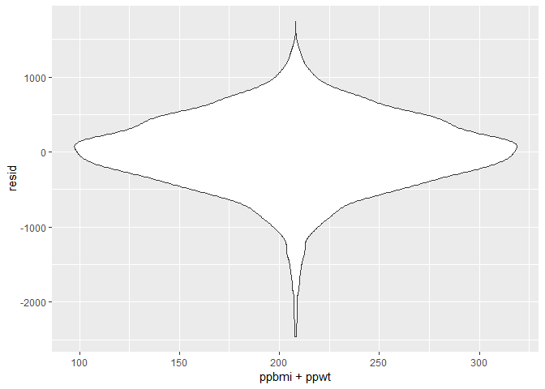

Homework 6
================
Vincent Tam
November 25, 2018

``` r
library(tidyverse)
```

    ## -- Attaching packages ----------------------------- tidyverse 1.2.1 --

    ## v ggplot2 3.0.0     v purrr   0.2.5
    ## v tibble  1.4.2     v dplyr   0.7.6
    ## v tidyr   0.8.1     v stringr 1.3.1
    ## v readr   1.1.1     v forcats 0.3.0

    ## -- Conflicts -------------------------------- tidyverse_conflicts() --
    ## x dplyr::filter() masks stats::filter()
    ## x dplyr::lag()    masks stats::lag()

``` r
library(janitor)
library(dplyr)
library(purrr)
hom_data <- read.csv(file = "./homicide-data.csv") 
hom_data = 
  hom_data %>%
  mutate(city_state = str_c(city, ",", state)) %>%
  filter(city_state != "Dallas,TX", city_state != "Phoenix,AZ", city_state != "Kansas City,MO", city_state != "Tulsa,AL") %>% 
  filter(victim_sex != "Unknown") %>%
  mutate(victim_sex = as.factor(victim_sex)) %>%
  mutate(victim_race = recode(victim_race, 'White' = "White", 'Hispanic' = "Non_white", 'Other' = "Non_white", 'Black' = "Non_white", 'Asian' = "Non_white", 'Unknown' = "Non_white")) %>% 
  mutate(solved = as.numeric(disposition == "Closed by arrest"),
         victim_age = as.numeric(victim_age),
         victim_race = fct_relevel(victim_race, "White", "Non_white")) %>% 
  mutate(victim_age = as.numeric(victim_age)) 
baltimore_data = 
  hom_data %>%
  filter(city_state == "Baltimore,MD")
baltimore_fit = 
  baltimore_data %>% 
  glm(solved ~ victim_age + victim_race + victim_sex, data = ., family = binomial()) %>% 
  broom::tidy() %>% 
  mutate(OR = boot::inv.logit(estimate)) %>%
  select(term, log_OR = estimate, OR, p.value) %>% 
  knitr::kable(digits = 3)
cities_glinmodel = 
  hom_data %>% 
  group_by(city_state) %>%
  select(city_state, solved, victim_age, victim_race, victim_sex) %>%
  nest() %>% 
  mutate(glinmodel = map(data, ~glm(solved ~ victim_age + victim_race + victim_sex, data = ., family = binomial()))) %>%
  mutate(glinmodel_tidy = map(glinmodel, ~broom::tidy(.))) %>%
  mutate(glinmodel_ci = map(glinmodel, ~broom::confint_tidy(.))) %>%
  select(city_state, glinmodel_tidy, glinmodel_ci) %>% 
  unnest() %>% 
  mutate(OR = exp(estimate)) %>%
  mutate(conf.low = exp(estimate - (1.96 * std.error)), conf.high = exp(estimate + (1.96 * std.error))) 
cities_plot =
  cities_glinmodel %>% 
  mutate(city_state = reorder(city_state, OR)) %>%
  ggplot(aes(x = city_state, y = OR)) +
  geom_errorbar(aes(ymin = conf.low, ymax = conf.high)) +
  geom_point() +
  labs(
    title = "Estimates and CIs for All Cities",
    x = "City",
    y = "Estimates"
  )  +
  theme(axis.text.x = element_text(angle = 90))
cities_plot
```

 \#\#\# Problem 2

``` r
birthweight = read.csv(file = "./birthweight.csv")
birthweight_data = 
  birthweight %>%
  mutate(babysex = as.factor(babysex), frace = as.factor(frace), malform = as.factor(malform), 
         mrace = as.factor(mrace))
mod_maternalfactors = 
  birthweight_data %>%
  select(bwt, ppbmi, ppwt)
lm_maternalfactors = lm(bwt ~ ppbmi + ppwt, mod_maternalfactors)
lm_maternalfactors %>% 
  broom::tidy() %>% 
  select(term, estimate, p.value) %>% 
  knitr::kable(digits = 3)
```

| term        |  estimate|  p.value|
|:------------|---------:|--------:|
| (Intercept) |  2722.294|        0|
| ppbmi       |   -36.777|        0|
| ppwt        |     9.599|        0|

``` r
modelr::add_residuals(mod_maternalfactors, lm_maternalfactors)
```

    ##       bwt    ppbmi ppwt         resid
    ## 1    3629 26.27184  148   452.2324700
    ## 2    3062 21.34485  128  -103.9849320
    ## 3    3345 23.56517  137   174.2794518
    ## 4    3062 21.84508  127   -75.9886474
    ## 5    3374 21.02642  130   177.1056585
    ## 6    3374 18.60030  115   231.8672635
    ## 7    2523 14.27034  105  -682.3850525
    ## 8    2778 21.81089  119  -284.4523377
    ## 9    3515 19.88106  105   515.9623614
    ## 10   3459 24.94123  145   262.0939313
    ## 11   3317 17.26446  110   173.7347882
    ## 12   3459 21.07775  115   407.9815819
    ## 13   3175 23.22115  135    10.8258319
    ## 14   3629 19.19829  126   403.2687109
    ## 15   3544 19.24491  105   521.5663813
    ## 16   2551 17.20085  100  -498.6125154
    ## 17   3232 21.44432  117   175.2646221
    ## 18   3629 23.73717  138   455.0062619
    ## 19   3374 19.23779  130   111.3243645
    ## 20   3345 17.82699  117   155.2285923
    ## 21   3203 22.72121  120   164.4274655
    ## 22   3175 22.01709  128    33.7381624
    ## 23   3175 18.92094  110    92.6555837
    ## 24   2977 20.16133  110   -59.7260182
    ## 25   3685 22.19744  150   339.1885932
    ## 26   3175 18.58882  122   -34.7490962
    ## 27   3629 23.07662  130   507.5063064
    ## 28   2948 13.07137  110  -349.4758359
    ## 29   3345 21.30149  120   254.2140398
    ## 30   3289 19.24726  119   132.2641640
    ## 31   3118 22.51215  135   -72.2493497
    ## 32   3629 16.49563   90   649.4435099
    ## 33   3402 22.64384  140   168.5978751
    ## 34   3827 19.88106  105   827.9623614
    ## 35   3799 21.50106  125   667.5577328
    ## 36   3062 19.84404  119   -72.7879042
    ## 37   3856 23.34593  140   648.4189838
    ## 38   3005 21.97295  140  -253.0756957
    ## 39   3175 19.78098  115    76.2896336
    ## 40   3345 20.41393  115   269.5679065
    ## 41   3600 19.60897  114   504.5628235
    ## 42   3232 31.80969  168    66.9158408
    ## 43   3232 17.71688  103   172.5679143
    ## 44   3175 20.01080  120    36.7457907
    ## 45   3147 20.29700  118    38.4700633
    ## 46   3317 22.53312  131   165.9185924
    ## 47   2948 22.91060  125  -131.6032171
    ## 48   3033 14.05838   95   -84.1881586
    ## 49   3345 19.78098  115   246.2896336
    ## 50   3232 21.02642  130    35.1056585
    ## 51   3317 19.70388  111   253.8509580
    ## 52   3147 21.18820  135   -91.9406148
    ## 53   3118 20.16133  110    81.2739818
    ## 54   3175 28.40151  150    57.3576739
    ## 55   2551 23.07662  130  -570.4936936
    ## 56   3289 21.83513  135    73.8517668
    ## 57   3402 20.40345  130   182.1944657
    ## 58   3487 18.87834  103   470.2832708
    ## 59   3203 18.74893  109   123.9287740
    ## 60   3515 21.47901  121   421.1432944
    ## 61   2920 18.92094  110  -162.3444163
    ## 62   2013 21.16156  143 -1303.7138484
    ## 63   3033 22.75770  145  -244.2107763
    ## 64   2381 21.99418  120  -684.3108176
    ## 65   3118 22.17863  133   -65.3166691
    ## 66   3600 18.99090  121   414.6375545
    ## 67   3402 21.67837  130   229.0823873
    ## 68   3459 19.63259   97   527.6179154
    ## 69   3203 21.15705  123    78.1041129
    ## 70   3289 24.61464  130   224.0708914
    ## 71   3544 17.79159  110   420.1211552
    ## 72   4224 22.51215  135  1033.7506503
    ## 73   3090 23.51269  141  -121.0473918
    ## 74   3912 22.36111  130   764.1917823
    ## 75   3459 20.34431  122   313.8131100
    ## 76   3374 21.65652  122   277.0724791
    ## 77   2778 21.81600  139  -476.2486934
    ## 78   2551 20.37946  126  -631.2912420
    ## 79   3232 19.79476  108   200.9909416
    ## 80   3544 20.16133  110   507.2739818
    ## 81   2920 21.07775  115  -131.0184181
    ## 82   3430 21.97295  140   171.9243043
    ## 83   3799 23.34593  140   591.4189838
    ## 84   2438 23.07662  130  -683.4936936
    ## 85   2977 21.67837  130  -195.9176127
    ## 86   3005 21.07775  115   -46.0184181
    ## 87   2977 23.66793  125   -74.7508565
    ## 88   3118 24.61464  130    53.0708914
    ## 89   3062 16.85683   98    18.9338647
    ## 90   3062 23.90918  139  -115.2669283
    ## 91   3969 18.52006  118   795.1186311
    ## 92   3090 30.84998  185  -273.5662968
    ## 93   3175 27.83348  147    65.2646809
    ## 94   2438 18.04921  115  -724.4002923
    ## 95   2211 16.65940  103  -887.3234384
    ## 96   3572 25.11194  160   237.3839817
    ## 97   3487 18.89356  124   269.2598423
    ## 98   3118 18.32848  100   109.8587105
    ## 99   2778 19.67728  118  -353.3215988
    ## 100  3515 21.45753  145   189.9725536
    ## 101  3487 22.89911  129   368.5771216
    ## 102  2722 21.25134   98  -159.4480739
    ## 103  3799 16.85683   98   755.9338647
    ## 104  3374 17.21871   97   353.8417428
    ## 105  2835 21.32906  124  -293.1690770
    ## 106  3487 27.33692  154   291.8078579
    ## 107  3685 19.40900  120   524.6133718
    ## 108  4791 19.17134  108  1737.0632640
    ## 109  2693 22.70512  132  -461.3545978
    ## 110  2722 20.12500  117  -383.2567465
    ## 111  3459 21.34991  132   254.8040737
    ## 112  3515 21.99418  120   449.6891824
    ## 113  2863 20.01080  120  -275.2542093
    ## 114  3629 20.84458  125   473.4140537
    ## 115  2637 19.52637  110  -423.0782967
    ## 116  3118 25.56136  135    39.8925695
    ## 117  2665 19.61870  125  -535.6704538
    ## 118  2211 21.81600  139 -1043.2486934
    ## 119  3317 22.72159  128   201.6478670
    ## 120  2580 23.34593  140  -627.5810162
    ## 121  3912 19.93260  127   703.6754720
    ## 122  3884 18.60030  115   741.8672635
    ## 123  2126 21.77449  115  -899.3942126
    ## 124  3175 21.77449  115   149.6057874
    ## 125  2778 27.45480  145  -326.4640042
    ## 126  3005 20.54928  105    30.5378663
    ## 127  2750 23.68055  117  -224.4931348
    ## 128  2892 20.82778  110  -120.2159605
    ## 129  3147 19.88106  105   147.9623614
    ## 130  3657 20.21771  125   478.3594800
    ## 131  3090 23.34593  140  -117.5810162
    ## 132  4082 24.26126  150   812.0900916
    ## 133  3090 20.01080  120   -48.2542093
    ## 134  2523 22.50636  115  -475.4782468
    ## 135  2977 22.26376  110    17.5957503
    ## 136  3742 21.03125  134   506.8863871
    ## 137  3090 22.50636  115    91.5217532
    ## 138  3374 19.51053  117   246.1447765
    ## 139  2750 23.22115  135  -414.1741681
    ## 140  3203 20.21771  125    24.3594800
    ## 141  3600 21.17809  127   437.4813730
    ## 142  3090 18.94182  128  -164.3621074
    ## 143  4082 26.68144  170   709.1138207
    ## 144  2098 18.69505  102  -915.8582493
    ## 145  2325 16.86368   95  -689.0166965
    ## 146  3317 19.26495  112   228.1092036
    ## 147  3515 20.08955  128   302.8484700
    ## 148  3685 19.14785  122   495.8105526
    ## 149  3969 21.47901  121   875.1432944
    ## 150  2977 21.99687  136  -241.7990254
    ## 151  3430 18.11507  112   298.8195704
    ## 152  3317 20.84458  125   161.4140537
    ## 153  3515 26.68144  170   142.1138207
    ## 154  3317 21.67307  126   182.2845425
    ## 155  3402 25.84728  155   142.4238434
    ## 156  3856 19.52637  110   795.9217033
    ## 157  3203 17.39622   98   179.7709974
    ## 158  2977 18.74500   99    -6.2236944
    ## 159  1049 22.36111  130 -2098.8082177
    ## 160  3544 18.93434  100   558.1406131
    ## 161  3685 28.27403  135   706.6571583
    ## 162  3799 23.82703  130   705.1043834
    ## 163  2778 20.23642  114  -294.3613481
    ## 164  3742 20.84883  145   394.5864123
    ## 165  3912 22.01154  124   808.9309185
    ## 166  3232 20.21771  125    53.3594800
    ## 167  3685 21.20646  112   667.5127245
    ## 168  3487 19.22779   95   559.9290557
    ## 169  2608 19.26495  112  -480.8907964
    ## 170  2665 20.70294  128  -524.5928268
    ## 171  3515 20.29700  118   406.4700633
    ## 172  2892 22.15318  117  -138.6655974
    ## 173  3175 20.67783  124    22.8804294
    ## 174  3742 17.97935  118   548.2330266
    ## 175  3515 19.60897  114   419.5628235
    ## 176  3033 24.74345  135   -75.1879462
    ## 177  2948 23.09990  122   -95.8438495
    ## 178  3147 19.43696  113    54.8360137
    ## 179  3005 20.17756  121  -136.7205849
    ## 180  3005 18.63881  105   -39.7244299
    ## 181  3232 20.16133  110   195.2739818
    ## 182  3629 17.74847   79   801.1107162
    ## 183  3685 21.65657  107   732.0624255
    ## 184  3430 20.37946  126   247.7087580
    ## 185  2948 19.17134  108  -105.9367360
    ## 186  4252 21.65657  107  1299.0624255
    ## 187  3090 20.82778  110    77.7840395
    ## 188  3203 18.69505  102   189.1417507
    ## 189  3742 20.05890  113   672.7093973
    ## 190  3062 22.17746  121    -6.1692975
    ## 191  3742 20.05890  113   672.7093973
    ## 192  2608 21.77449  115  -417.3942126
    ## 193  2892 21.07775  115  -159.0184181
    ## 194  2325 26.02645  142  -803.1973055
    ## 195  3459 20.29700  118   350.4700633
    ## 196  2693 22.36111  130  -454.8082177
    ## 197  3175 19.96216  102   207.7427003
    ## 198  3714 21.97295  140   455.9243043
    ## 199  3544 23.09348  118   538.3169894
    ## 200  3147 21.17809  127   -15.5186270
    ## 201  3005 18.60030  115  -137.1327365
    ## 202  3770 20.34431  122   624.8131100
    ## 203  3629 19.40900  120   468.6133718
    ## 204  3430 20.25975  107   425.6910465
    ## 205  3345 21.67837  130   172.0823873
    ## 206  3090 25.73930  145   -77.5552239
    ## 207  3969 19.34377  116   844.6110819
    ## 208  3033 17.50945  105   -53.2591390
    ## 209  3317 24.19360  132   217.3874236
    ## 210  3005 17.96191   98     2.5756707
    ## 211  2523 22.17746  121  -545.1692975
    ## 212  3884 19.06162  104   864.4248612
    ## 213  3827 20.01080  120   688.7457907
    ## 214  3317 22.64384  140    83.5978751
    ## 215  3515 20.16133  110   478.2739818
    ## 216  2977 25.44197  130   -57.5022758
    ## 217  2438 19.17933   98  -519.6509246
    ## 218  3714 26.12939  138   627.9856324
    ## 219  2948 19.24491  105   -74.4336187
    ## 220  3005 19.37504   99    44.9474641
    ## 221  3118 21.30149  120    27.2140398
    ## 222  3544 21.83513  135   328.8517668
    ## 223  3203 23.93777  148   -59.6083235
    ## 224  2722 18.34323  110  -381.5908761
    ## 225  2892 19.06162  104  -127.5751388
    ## 226  3544 20.94647  118   459.3556005
    ## 227  3572 40.29532  227   152.6415572
    ## 228  3515 22.87713  133   357.3722123
    ## 229  3402 19.17702  115   281.0774572
    ## 230  3572 20.41723  134   314.3044650
    ## 231  2211 25.97329  151 -1005.5452090
    ## 232  3175 22.64384  140   -58.4021249
    ## 233  3912 24.94123  145   715.0939313
    ## 234  3827 23.39316  136   659.5526420
    ## 235  2948 22.01154  124  -155.0690815
    ## 236  3459 19.57075  100   496.5458527
    ## 237  2778 18.27681  113  -356.8311516
    ## 238  3289 22.44380  143    19.4432281
    ## 239  3374 30.33466  155   279.4575115
    ## 240  3884 22.19744  150   538.1885932
    ## 241  3487 19.51053  117   359.1447765
    ## 242  2948 19.78098  115  -150.7103664
    ## 243  3770 18.87834  103   753.2832708
    ## 244  3005 23.47858  124   -44.1151641
    ## 245  3997 19.17933   98  1039.3490754
    ## 246  3742 24.17024  154   430.3460646
    ## 247  2835 15.57921   85  -130.2640906
    ## 248  3685 22.01709  128   543.7381624
    ## 249  2665 20.21771  125  -513.6405200
    ## 250  2920 20.21771  125  -258.6405200
    ## 251  3090 20.44909  108    83.0553541
    ## 252  4054 23.22115  135   889.8258319
    ## 253  2948 22.34252  118   -85.3012200
    ## 254  3487 18.92378  117   337.5656786
    ## 255  2353 20.84458  125  -802.5859463
    ## 256  1814 22.36111  130 -1333.8082177
    ## 257  3544 22.51215  135   353.7506503
    ## 258  3118 20.34431  122   -27.1868900
    ## 259  3033 26.01404  156  -230.0424617
    ## 260  3969 24.17971  145   744.0872468
    ## 261  2608 19.52637  110  -452.0782967
    ## 262  3827 21.99418  120   761.6891824
    ## 263  3374 16.67566  100   305.0725274
    ## 264  2580 18.57692  108  -495.7980358
    ## 265  3260 19.80776  130    18.2865881
    ## 266  4252 19.70388  111  1188.8509580
    ## 267  3374 19.08552  118   220.9149566
    ## 268  2892 23.01242  138  -308.6483355
    ## 269  3770 21.67837  130   597.0823873
    ## 270  3090 22.51215  135  -100.2493497
    ## 271  3118 19.84234  138  -199.2353416
    ## 272  3062 19.95299  116   -39.9835566
    ## 273  3770 27.49609  170   427.0745953
    ## 274  3175 23.82703  130    81.1043834
    ## 275  3544 22.36111  130   396.1917823
    ## 276  3289 28.64507  188  -184.4546140
    ## 277  3544 17.50945  105   457.7408610
    ## 278  3345 21.02642  130   148.1056585
    ## 279  3232 23.04914  134    71.0990221
    ## 280  3487 18.69505  102   473.1417507
    ## 281  2183 22.15318  117  -847.6655974
    ## 282  3289 21.67837  130   116.0823873
    ## 283  3203 21.99418  120   137.6891824
    ## 284  3997 17.75124  100   967.6294368
    ## 285  3147 19.79476  108   115.9909416
    ## 286  2495 19.88106  105  -504.0376386
    ## 287  3175 20.54120  127   -10.9420346
    ## 288  3487 22.89911  129   368.5771216
    ## 289  3714 22.34252  118   680.6987800
    ## 290  2580 22.15318  117  -450.6655974
    ## 291  3402 21.52782  110   415.5298099
    ## 292  3515 17.92876  101   482.5586914
    ## 293  4111 28.40915  155   945.6424554
    ## 294  3203 22.48210  139   -26.7513323
    ## 295  3005 20.40345  130  -214.8055343
    ## 296  3147 22.50636  115   148.5217532
    ## 297  3402 16.76041  110   240.1973423
    ## 298  3572 21.99418  120   506.6891824
    ## 299  3260 25.01350  150    17.7555804
    ## 300  3147 18.34323  110    43.4091239
    ## 301  3317 19.52637  110   256.9217033
    ## 302  3090 24.17971  145  -134.9127532
    ## 303  3799 20.51107  123   650.3467344
    ## 304  2637 20.44909  108  -369.9446459
    ## 305  3345 17.60894   93   377.5902500
    ## 306  3430 25.01350  150   187.7555804
    ## 307  3374 17.39622   98   350.7709974
    ## 308  2665 25.01350  150  -577.2444196
    ## 309  3005 32.04855  123   280.6643193
    ## 310  3969 20.01080  120   830.7457907
    ## 311  2750 21.26104  116  -303.8768980
    ## 312  3742 19.26495  112   653.1092036
    ## 313  3572 20.54928  105   597.5378663
    ## 314  3629 21.02642  130   432.1056585
    ## 315  3657 17.88889  104   594.2947244
    ## 316  2948 17.34269  104  -134.7928340
    ## 317  2948 20.64102  120  -167.0763168
    ## 318  3572 19.31303  102   580.8692986
    ## 319  2750 21.99687  136  -468.7990254
    ## 320  4082 21.97295  140   823.9243043
    ## 321  2637 21.07775  115  -414.0184181
    ## 322  2920 26.57630  145  -216.7727452
    ## 323  3714 20.71761  140   409.7564437
    ## 324  3487 19.43696  113   394.8360137
    ## 325  3827 21.84512  131   650.6160116
    ## 326  3402 25.01350  150   159.7555804
    ## 327  3685 21.32906  124   556.8309230
    ## 328  3175 22.91060  125    95.3967829
    ## 329  3317 21.99418  120   251.6891824
    ## 330  2977 37.52025  225  -525.2198407
    ## 331  2410 20.51107  123  -738.6532656
    ## 332  3629 19.78098  115   530.2896336
    ## 333  3912 19.50303  128   678.2776493
    ## 334  2637 21.50106  125  -494.4422672
    ## 335  3203 18.34323  110    99.4091239
    ## 336  3572 21.18820  135   333.0593852
    ## 337  2863 21.47901  121  -230.8567056
    ## 338  3260 19.78098  115   161.2896336
    ## 339  3175 23.93777  148   -87.6083235
    ## 340  2070 19.97770  135 -1213.4595959
    ## 341  3685 20.71735  132   457.5403915
    ## 342  3232 20.71119  113   186.6985421
    ## 343  3175 20.29700  118    66.4700633
    ## 344  2778 21.62761  118  -281.5938578
    ## 345  3544 21.63617  142   254.3401493
    ## 346  3714 22.09327  145   412.3535220
    ## 347  2948 23.82703  130  -145.8956166
    ## 348  3260 21.32906  124   131.8309230
    ## 349  3629 20.21771  125   450.3594800
    ## 350  3203 25.87867  160  -103.4176216
    ## 351  3459 18.84350  113   345.0101378
    ## 352  3827 22.93736  155   460.4047031
    ## 353  3232 26.31172  130   229.4847001
    ## 354  3260 20.98504  122   138.3773031
    ## 355  3203 27.51485  165   -91.2394899
    ## 356  1899 20.17756  121 -1242.7205849
    ## 357  3317 16.43943   84   392.9715633
    ## 358  3515 23.85727  126   460.6135210
    ## 359  3260 20.64102  120   144.9236832
    ## 360  3629 18.11507  112   497.8195704
    ## 361  3033 21.83513  135  -182.1482332
    ## 362  3289 22.17746  121   220.8307025
    ## 363  3402 21.67307  126   267.2845425
    ## 364  3856 20.70294  128   666.4071732
    ## 365  4111 23.38549  149   818.4811452
    ## 366  3090 24.17971  145  -134.9127532
    ## 367  2381 16.51282   96  -655.5197552
    ## 368  2608 20.71119  113  -437.3014579
    ## 369  2665 19.24491  105  -357.4336187
    ## 370  2665 18.84935   90  -227.9930405
    ## 371  3317 20.64102  120   201.9236832
    ## 372  3203 21.02642  130     6.1056585
    ## 373  3175 20.01080  120    36.7457907
    ## 374  2835 19.93260  127  -373.3245280
    ## 375  3289 26.57630  145   152.2272548
    ## 376  3232 27.48315  118   387.7572979
    ## 377  2863 19.67728  118  -268.3215988
    ## 378  3969 19.08552  118   815.9149566
    ## 379  3515 20.51107  123   366.3467344
    ## 380  2580 22.51215  135  -610.2493497
    ## 381  3033 22.18905  125   -73.1398269
    ## 382  3147 18.92094  110    64.6555837
    ## 383  2722 18.17648  109  -378.1245008
    ## 384  2920 17.22877   94   -70.9904097
    ## 385  3090 19.52637  110    29.9217033
    ## 386  3033 26.69742  141   -60.9213746
    ## 387  3289 19.26495  112   200.1092036
    ## 388  3289 23.34593  140    81.4189838
    ## 389  3459 22.75770  145   181.7892237
    ## 390  3572 22.28685  142   306.2702300
    ## 391  3033 20.16133  110    -3.7260182
    ## 392  2637 30.73092  190  -778.9409014
    ## 393  2863 20.35358  104  -109.0605224
    ## 394  2608 20.82778  110  -404.2159605
    ## 395  3600 20.16133  110   563.2739818
    ## 396  3090 20.01080  120   -48.2542093
    ## 397  3175 23.54244  150  -121.3458568
    ## 398  3232 19.95299  116   130.0164434
    ## 399  3232 23.82703  130   138.1043834
    ## 400  2126 21.99091  105  -795.4429974
    ## 401  3345 20.94647  118   260.3556005
    ## 402  3005 23.04914  134  -155.9009779
    ## 403  3062 22.34252  118    28.6987800
    ## 404  3799 21.10426  151   403.3850218
    ## 405  3374 21.18820  135   135.0593852
    ## 406  2920 24.65914  126  -104.8959010
    ## 407  3714 19.40900  120   553.6133718
    ## 408  3118 20.21771  125   -60.6405200
    ## 409  3912 20.21771  125   733.3594800
    ## 410  3090 21.84508  127   -47.9886474
    ## 411  2920 20.07040  106   -81.6733310
    ## 412  2977 21.97295  140  -281.0756957
    ## 413  3402 21.65905  138   151.5783086
    ## 414  3487 22.91060  125   407.3967829
    ## 415  3600 20.52790  112   557.5570220
    ## 416  3402 18.63881  105   357.2755701
    ## 417  3544 24.94123  145   347.0939313
    ## 418  2722 22.18905  125  -384.1398269
    ## 419  2750 24.85485  127  -277.2975124
    ## 420  3005 20.64102  120  -110.0763168
    ## 421  2466 23.22115  135  -698.1741681
    ## 422  3005 20.42165  138  -290.9299579
    ## 423  3005 21.30149  120   -85.7859602
    ## 424  3175 17.75796  120   -46.1077850
    ## 425  3515 20.41393  115   439.5679065
    ## 426  3515 17.26446  110   371.7347882
    ## 427  2523 21.99418  120  -542.3108176
    ## 428  3572 18.10627  102   536.4878761
    ## 429  4281 25.58279  163   934.9029055
    ## 430  3714 20.12500  117   608.7432535
    ## 431  3260 20.94647  118   175.3556005
    ## 432  3487 31.77473  179   215.0385942
    ## 433  2296 22.91060  125  -783.6032171
    ## 434  3232 21.15705  123   107.1041129
    ## 435  3402 19.61148  107   373.8494215
    ## 436  3118 20.21771  125   -60.6405200
    ## 437  4252 20.71735  132  1024.5403915
    ## 438  3232 21.44432  117   175.2646221
    ## 439  3742 18.23290  106   672.7483443
    ## 440  3402 21.26104  116   348.1231020
    ## 441  3289 22.11494  113   295.3249758
    ## 442  3997 22.18905  125   890.8601731
    ## 443  2325 19.22779   95  -602.0709443
    ## 444  3941 22.36075  122   869.9722226
    ## 445  3289 21.51161  129   119.5486923
    ## 446  2807 25.80128  150  -406.2720191
    ## 447  3459 28.40199  160   245.3832458
    ## 448  3118 23.04914  134   -42.9009779
    ## 449  3062 20.41393  115   -13.4320935
    ## 450  2778 26.68738  165  -546.6715133
    ## 451  3203 24.37878  160  -158.5795437
    ## 452  2835 18.32848  100  -173.1412895
    ## 453  3856 20.12991  140   530.1422725
    ## 454  3260 19.52637  110   199.9217033
    ## 455  3742 27.18134  163   454.6931908
    ## 456  3742 18.63881  105   697.2755701
    ## 457  2835 19.24491  105  -187.4336187
    ## 458  3884 17.73531  113   729.2537116
    ## 459  3402 29.11351  180    22.5668118
    ## 460  2041 17.50945  105 -1045.2591390
    ## 461  3062 20.46901  119   -49.8031269
    ## 462  3203 21.50106  125    71.5577328
    ## 463  3260 24.08119  140    79.4598818
    ## 464  3317 20.08955  128   104.8484700
    ## 465  2665 20.82778  110  -347.2159605
    ## 466  3062 18.34323  110   -41.5908761
    ## 467  3062 21.13641  108    80.3330322
    ## 468  2438 19.40900  120  -722.3866282
    ## 469  2722 19.60897  114  -373.4371765
    ## 470  3090 20.94372  100   178.0403216
    ## 471  3884 18.67674  112   773.4764432
    ## 472  3090 23.60915  133   -40.7059997
    ## 473  3374 20.64102  120   258.9236832
    ## 474  2977 20.21771  125  -201.6405200
    ## 475  3232 24.26126  150   -37.9099084
    ## 476  4054 18.57692  108   978.2019642
    ## 477  3147 24.74345  135    38.8120538
    ## 478  3629 21.83513  135   413.8517668
    ## 479  3827 21.50106  125   695.5577328
    ## 480  3515 21.50106  125   383.5577328
    ## 481  3260 19.04593  125    38.2642766
    ## 482  3289 23.07662  130   167.5063064
    ## 483  2495 20.51107  123  -653.6532656
    ## 484  2665 18.99383  107  -385.8659207
    ## 485  2637 21.99418  120  -428.3108176
    ## 486  3912 19.22779   95   984.9290557
    ## 487  3033 21.63617  142  -256.6598507
    ## 488  4026 23.45255  145   774.3439833
    ## 489  3969 19.61870  125   768.3295462
    ## 490  3714 22.85511  150   392.3758336
    ## 491  3203 20.34431  122    57.8131100
    ## 492  2381 18.55565   98  -599.5880719
    ## 493  3912 22.19744  150   566.1885932
    ## 494  3487 26.42051  135   440.4896674
    ## 495  3232 22.91060  125   152.3967829
    ## 496  3430 18.74119  123   216.2553381
    ## 497  2835 25.44197  130  -199.5022758
    ## 498  3459 24.08119  140   278.4598818
    ## 499  2778 21.83513  135  -437.1482332
    ## 500  3345 22.54403  123   271.1137427
    ## 501  3430 22.64384  140   196.5978751
    ## 502  3459 19.88139  112   392.7802126
    ## 503  3884 21.67837  130   711.0823873
    ## 504  3572 20.21771  125   393.3594800
    ## 505  2183 19.06162  104  -836.5751388
    ## 506  2948 22.36075  122  -123.0277774
    ## 507  3657 19.50237  103   663.2336760
    ## 508  3459 23.96418  135   322.1524396
    ## 509  3062 25.75009  169  -335.5393553
    ## 510  3629 20.16133  110   592.2739818
    ## 511  2778 25.01350  150  -464.2444196
    ## 512  3317 21.30149  120   226.2140398
    ## 513  3118 20.34431  122   -27.1868900
    ## 514  3572 21.51161  129   402.5486923
    ## 515  2466 23.39316  136  -701.4473580
    ## 516  3232 18.34323  110   128.4091239
    ## 517  3430 21.50106  125   298.5577328
    ## 518  3685 21.30149  120   594.2140398
    ## 519  3685 17.41206   95   691.1511104
    ## 520  2410 21.20646  112  -607.4872755
    ## 521  4167 24.71359  118  1220.9004292
    ## 522  4451 21.02642  130  1254.1056585
    ## 523  3260 20.23978  100   322.1513105
    ## 524  3685 20.98504  122   563.3773031
    ## 525  3572 22.64384  140   338.5978751
    ## 526  3260 24.58474  152   -17.2114226
    ## 527  3629 21.02670  138   355.3222720
    ## 528  2778 21.18820  135  -460.9406148
    ## 529  2835 20.64102  120  -280.0763168
    ## 530  2920 19.88106  105   -79.0376386
    ## 531  3430 25.73930  145   262.4447761
    ## 532  2750 17.61367   90  -188.4380342
    ## 533  3147 17.96191   98   144.5756707
    ## 534  2211 21.99418  120  -854.3108176
    ## 535  2410 20.23642  114  -662.3613481
    ## 536  3090 17.79159  110   -33.8788448
    ## 537  3941 18.92378  117   791.5656786
    ## 538  3459 20.16133  110   422.2739818
    ## 539  3317 23.29318  162  -103.7034836
    ## 540  2466 25.01350  150  -776.2444196
    ## 541  2835 22.87713  133  -322.6277877
    ## 542  3203 24.19360  132   103.3874236
    ## 543  3203 27.22684  130   234.1404773
    ## 544  3345 17.34269  104   262.2071660
    ## 545  3374 20.41393  115   298.5679065
    ## 546  3629 18.83396  120   447.4646268
    ## 547  3090 21.51165  133  -117.8467186
    ## 548  3912 20.29700  118   803.4700633
    ## 549  3572 23.54244  150   275.6541432
    ## 550  3572 18.92094  110   489.6555837
    ## 551  3685 24.74345  135   576.8120538
    ## 552  2892 24.61464  130  -172.9291086
    ## 553  3033 22.54403  123   -40.8862573
    ## 554  3714 29.24145  170   435.2641795
    ## 555  3827 20.08955  128   614.8484700
    ## 556  3685 22.36111  130   537.1917823
    ## 557  4026 31.68376  190   645.1019662
    ## 558  3685 18.28378  103   646.4171307
    ## 559  2948 20.89447  114  -100.1599382
    ## 560  3232 24.19360  132   132.3874236
    ## 561  2892 18.92094  110  -190.3444163
    ## 562  3289 24.61464  130   224.0708914
    ## 563  3515 21.50106  125   383.5577328
    ## 564  3317 18.40491  107   244.4751541
    ## 565  2948 22.50636  115   -50.4782468
    ## 566  2863 20.82778  110  -149.2159605
    ## 567  3289 22.89777  117   285.7186007
    ## 568  4196 19.52637  110  1135.9217033
    ## 569  3969 29.24145  170   690.2641795
    ## 570  2211 22.51215  135  -979.2493497
    ## 571  3600 20.21771  125   421.3594800
    ## 572  2977 22.72159  128  -138.3521330
    ## 573  3118 21.07775  115    66.9815819
    ## 574  3203 21.65652  122   106.0724791
    ## 575  3629 22.34539  134   442.2170259
    ## 576  3487 23.85354  110   586.0635690
    ## 577  3005 31.30555  182  -313.0141015
    ## 578  3005 20.23978  100    67.1513105
    ## 579  3487 25.14062  165   105.4427678
    ## 580  3770 19.93260  127   561.6754720
    ## 581  2835 19.06162  104  -184.5751388
    ## 582  4026 23.34593  140   818.4189838
    ## 583  3118 18.84350  113     4.0101378
    ## 584  3856 20.01080  120   717.7457907
    ## 585  3402 23.22115  135   237.8258319
    ## 586  2580 20.41393  115  -495.4320935
    ## 587  2920 20.23978  100   -17.8486895
    ## 588  2637 20.25975  107  -367.3089535
    ## 589  3742 27.49609  170   399.0745953
    ## 590  3203 18.34323  110    99.4091239
    ## 591  4252 22.09327  145   950.3535220
    ## 592  3742 19.61870  125   541.3295462
    ## 593  2750 18.34323  110  -353.5908761
    ## 594  3827 23.61695  155   485.3981447
    ## 595  3487 17.26446  110   343.7347882
    ## 596  4196 17.37286  101  1143.1142944
    ## 597  3175 22.28685  142   -90.7297700
    ## 598  3175 20.26486  133   -78.7000391
    ## 599  2948 31.99715  210  -613.3564297
    ## 600  3742 22.15861  137   519.5501819
    ## 601  2977 22.91055  121   -64.2082270
    ## 602  3232 22.72121  120   193.4274655
    ## 603  3232 21.63617  142   -57.6598507
    ## 604  3260 25.45726  148    53.2743610
    ## 605  3260 18.04921  115    97.5997077
    ## 606  3203 20.41393  115   127.5679065
    ## 607  3033 21.34485  128  -132.9849320
    ## 608  4252 19.95299  116  1150.0164434
    ## 609  3147 23.45255  145  -104.6560167
    ## 610  2580 20.52790  112  -462.4429780
    ## 611  3714 22.72732  124   637.2552628
    ## 612  2977 18.87834  103   -39.7167292
    ## 613  3430 24.17971  145   205.0872468
    ## 614  3062 21.81089  119    -0.4523377
    ## 615  3345 17.39622   98   321.7709974
    ## 616  2948 22.51215  135  -242.2493497
    ## 617  3685 21.67837  130   512.0823873
    ## 618  3629 34.09098  186   375.0296484
    ## 619  3459 23.34593  140   251.4189838
    ## 620  2495 19.52637  110  -565.0782967
    ## 621  3260 26.02909  133   218.2928901
    ## 622  3629 22.28685  142   363.2702300
    ## 623  3317 19.26495  112   228.1092036
    ## 624  3572 19.67728  118   440.6784012
    ## 625  3515 22.66856  112   551.2846803
    ## 626  2722 20.94647  118  -362.6443995
    ## 627  3685 20.67783  124   532.8804294
    ## 628  3685 20.54120  127   499.0579654
    ## 629  2948 21.17809  127  -214.5186270
    ## 630  3629 21.47901  121   535.1432944
    ## 631  3629 21.67837  130   456.0823873
    ## 632  3005 20.25975  107     0.6910465
    ## 633  3317 18.93434  100   331.1406131
    ## 634  3629 18.60030  115   486.8672635
    ## 635  3118 18.92378  117   -31.4343214
    ## 636  3600 22.36111  130   452.1917823
    ## 637  3289 24.17971  145    64.0872468
    ## 638  3515 23.09389  126   432.5383030
    ## 639  3147 21.58515  114   124.2414100
    ## 640  2665 19.09295  111  -420.6176062
    ## 641  3345 20.44909  108   338.0553541
    ## 642  2665 17.50945  105  -421.2591390
    ## 643  3969 16.27813  110   789.4600655
    ## 644  3232 22.01154  124   128.9309185
    ## 645  3685 21.18820  135   446.0593852
    ## 646  3742 26.66132  155   512.3620305
    ## 647  3827 22.36111  130   679.1917823
    ## 648  3572 23.54244  150   275.6541432
    ## 649  2948 21.83513  135  -267.1482332
    ## 650  3005 19.52637  110   -55.0782967
    ## 651  3770 22.18910  129   625.4649725
    ## 652  3685 20.16133  110   648.2739818
    ## 653  3260 18.63881  105   215.2755701
    ## 654  3912 25.83339  132   872.6945015
    ## 655  3289 23.85354  110   388.0635690
    ## 656  3799 18.51177  101   788.0002306
    ## 657  2495 19.61148  107  -533.1505785
    ## 658  3090 17.75124  100    60.6294368
    ## 659  3629 21.50106  125   497.5577328
    ## 660  3147 19.17134  108    93.0632640
    ## 661  2722 23.17917  139  -482.1147111
    ## 662  3487 27.49272  150   335.9348549
    ## 663  3856 22.64384  140   622.5978751
    ## 664  3459 18.69505  102   445.1417507
    ## 665  3827 21.99418  120   761.6891824
    ## 666  3515 22.36075  122   443.9722226
    ## 667  3005 25.56136  135   -73.1074305
    ## 668  3175 20.84458  125    19.4140537
    ## 669  3572 25.71693  159   269.2331008
    ## 670  3629 18.10627  102   593.4878761
    ## 671  3289 27.51485  165    -5.2394899
    ## 672  2977 19.22779   95    49.9290557
    ## 673  3147 21.47901  121    53.1432944
    ## 674  2863 23.01242  138  -337.6483355
    ## 675  2155 22.92904   88  -568.7546455
    ## 676  4054 19.73249  122   886.3118571
    ## 677  3374 21.67837  130   201.0823873
    ## 678  3203 19.17702  115    82.0774572
    ## 679  3232 24.41719  165  -176.1631478
    ## 680  3657 22.09327  145   355.3535220
    ## 681  2778 21.15705  123  -346.8958871
    ## 682  3459 20.64102  120   343.9236832
    ## 683  2948 18.69505  102   -65.8582493
    ## 684  3118 20.89447  114    69.8400618
    ## 685  3118 23.78667  134   -15.7767451
    ## 686  3317 20.01080  120   178.7457907
    ## 687  3118 19.88139  112    51.7802126
    ## 688  3685 17.71688  103   625.5679143
    ## 689  2693 27.33692  154  -502.1921421
    ## 690  3289 18.74893  109   209.9287740
    ## 691  2381 23.46458  154  -956.6062892
    ## 692  2381 19.97770  135  -902.4595959
    ## 693  3402 25.06996  155   113.8362002
    ## 694  3402 20.71735  132   174.5403915
    ## 695  3402 23.54244  150   105.6541432
    ## 696  3033 17.22877   94    42.0095903
    ## 697  3685 23.85727  126   630.6135210
    ## 698  2835 21.30149  120  -255.7859602
    ## 699  3629 19.04593  125   407.2642766
    ## 700  3714 29.82209  168   475.8170730
    ## 701  2920 21.83513  135  -295.1482332
    ## 702  3175 23.96418  135    38.1524396
    ## 703  2948 20.01080  120  -190.2542093
    ## 704  3515 21.02642  130   318.1056585
    ## 705  2920 17.98763   95   -52.6810649
    ## 706  2948 18.43645  121  -257.7536007
    ## 707  3515 29.28955  165   286.0293791
    ## 708  2977 22.51215  135  -213.2493497
    ## 709  3856 23.22115  135   691.8258319
    ## 710  3062 19.17702  115   -58.9225428
    ## 711  3572 19.04593  125   350.2642766
    ## 712  2948 19.78098  115  -150.7103664
    ## 713  3005 24.32719  155  -310.4809374
    ## 714  3147 23.46046  128    58.8213432
    ## 715  3260 20.70294  128    70.4071732
    ## 716  3147 19.78098  115    48.2896336
    ## 717  2835 19.78098  115  -263.7103664
    ## 718  3374 19.70388  111   310.8509580
    ## 719  1956 17.54487  102 -1100.1588955
    ## 720  3033 18.34323  110   -70.5908761
    ## 721  3203 26.12939  138   116.9856324
    ## 722  3515 22.34252  118   481.6987800
    ## 723  3203 19.17933   98   245.3490754
    ## 724  3289 20.71119  113   243.6985421
    ## 725  3062 20.23642  114   -10.3613481
    ## 726  2495 24.17024  154  -816.6539354
    ## 727  3033 21.33144  140  -248.6687892
    ## 728  2637 19.93260  127  -571.3245280
    ## 729  3118 19.57075  100   155.5458527
    ## 730  3997 21.50106  125   865.5577328
    ## 731  2126 18.92094  110  -956.3444163
    ## 732  1928 20.44909  108 -1078.9446459
    ## 733  3941 26.19298  177   482.9554038
    ## 734  3062 24.99333  132    -8.2004231
    ## 735  3203 21.94091  144   -94.6509123
    ## 736  3118 18.78792   96   165.1522978
    ## 737  2920 22.09327  145  -381.6464780
    ## 738  3515 21.33144  140   233.3312108
    ## 739  3317 30.29495  160   173.0010999
    ## 740  4252 20.41393  115  1176.5679065
    ## 741  3487 20.82778  110   474.7840395
    ## 742  3175 30.99671  148   172.0005849
    ## 743  3374 18.92094  110   291.6555837
    ## 744  3544 19.93260  127   335.6754720
    ## 745  3175 23.48490  120   164.5137670
    ## 746  3459 25.94005  137   375.6212549
    ## 747  3260 24.17971  145    35.0872468
    ## 748  4196 21.78854  143   902.3445836
    ## 749  3544 19.88139  112   477.7802126
    ## 750  3459 21.52782  110   472.5298099
    ## 751  2268 21.50106  125  -863.4422672
    ## 752  3430 19.61148  107   401.8494215
    ## 753  2977 17.73531  113  -177.7462884
    ## 754  3884 19.80776  130   642.2865881
    ## 755  3714 25.80128  150   500.7279809
    ## 756  3175 23.48490  120   164.5137670
    ## 757  3430 26.62687  150   247.0909094
    ## 758  3203 29.27480  135   261.4629652
    ## 759  3033 23.82703  130   -60.8956166
    ## 760  3317 20.98504  122   195.3773031
    ## 761  3856 19.17702  115   735.0774572
    ## 762  3118 21.34991  132   -86.1959263
    ## 763  3515 22.84566  137   317.8179696
    ## 764  2296 17.79159  110  -827.8788448
    ## 765  3515 24.56017  134   409.6705337
    ## 766  3600 21.50106  125   468.5577328
    ## 767  3289 21.07775  115   237.9815819
    ## 768  3090 23.66793  125    38.2491435
    ## 769  2778 23.45255  145  -473.6560167
    ## 770  3600 23.34593  140   392.4189838
    ## 771  3402 21.18820  135   163.0593852
    ## 772  3203 19.61870  125     2.3295462
    ## 773  2722 30.01620  180  -624.2346303
    ## 774  3515 28.84403  115   749.6045039
    ## 775  3260 18.20079   93   314.3571318
    ## 776  2381 19.61148  107  -647.1505785
    ## 777  3203 20.16133  110   166.2739818
    ## 778  3175 22.91060  125    95.3967829
    ## 779  2892 16.98288  105  -213.6249530
    ## 780  2722 19.40900  120  -438.3866282
    ## 781  2722 20.16133  110  -314.7260182
    ## 782  2523 16.75498   80  -351.0264724
    ## 783  2863 24.61464  130  -201.9291086
    ## 784  3317 21.67837  130   144.0823873
    ## 785  3175 17.06515  112     5.2062811
    ## 786  3090 19.34377  116   -34.3889181
    ## 787  4196 21.83513  135   980.8517668
    ## 788  3487 19.24491  105   464.5663813
    ## 789  3203 20.71119  113   157.6985421
    ## 790  3544 19.51053  117   416.1447765
    ## 791  3572 19.98615  143   212.0577388
    ## 792  2807 15.99679   93  -219.7001848
    ## 793  3515 21.50106  125   383.5577328
    ## 794  2126 18.92094  110  -956.3444163
    ## 795  3090 24.74345  135   -18.1879462
    ## 796  3600 19.12369  101   611.5049910
    ## 797  3317 19.70388  111   253.8509580
    ## 798  2977 22.01154  124  -126.0690815
    ## 799  4111 24.14169  136   971.0816942
    ## 800  2580 30.79185  168  -622.5177134
    ## 801  2608 22.87095  113  -357.8709249
    ## 802  3345 29.24145  170    66.2641795
    ## 803  2807 21.65652  122  -289.9275209
    ## 804  3515 22.50636  115   516.5217532
    ## 805  3033 21.34515  136  -209.7676871
    ## 806  2863 20.51107  123  -285.6532656
    ## 807  2551 19.95299  116  -550.9835566
    ## 808  3799 21.99418  120   733.6891824
    ## 809  3572 19.52637  110   511.9217033
    ## 810  3544 18.32848  100   535.8587105
    ## 811  3345 21.30149  120   254.2140398
    ## 812  3345 19.26495  112   256.1092036
    ## 813  3175 21.67837  130     2.0823873
    ## 814  3118 17.04549   93   129.8680702
    ## 815  2070 22.89911  129 -1048.4228784
    ## 816  3118 24.42521  142   -69.0864983
    ## 817  3260 20.84458  125   104.4140537
    ## 818  3232 20.54928  105   257.5378663
    ## 819  3118 21.07775  115    66.9815819
    ## 820  4082 19.06162  104  1062.4248612
    ## 821  2296 20.16133  110  -740.7260182
    ## 822  3175 19.52637  110   114.9217033
    ## 823  2948 20.84458  125  -207.5859463
    ## 824  3260 21.18820  135    21.0593852
    ## 825  3118 20.16133  110    81.2739818
    ## 826  3203 22.72121  120   164.4274655
    ## 827  2296 17.59534   96  -700.7073695
    ## 828  1814 18.84350  113 -1299.9898622
    ## 829  3515 22.84566  137   317.8179696
    ## 830  2750 24.85174  140  -402.2013572
    ## 831  3090 22.36111  130   -57.8082177
    ## 832  2750 22.75770  145  -527.2107763
    ## 833  3856 19.34886  109   798.9925186
    ## 834  3260 19.78098  115   161.2896336
    ## 835  3941 31.68376  190   560.1019662
    ## 836  2693 20.64102  120  -422.0763168
    ## 837  3544 25.01350  150   301.7555804
    ## 838  2722 23.43164  132  -405.6351844
    ## 839  3118 18.00972  108    21.3418046
    ## 840  3572 23.07662  130   450.5063064
    ## 841  3544 22.36111  130   396.1917823
    ## 842  3515 19.67728  118   383.6784012
    ## 843  3033 21.44432  117   -23.7353779
    ## 844  3175 24.31920  137    32.0109488
    ## 845  3289 20.12500  117   183.7432535
    ## 846  3572 21.99418  120   506.6891824
    ## 847  2693 20.94070  107  -286.2653564
    ## 848  3856 21.32906  124   727.8309230
    ## 849  3714 19.08552  118   560.9149566
    ## 850  3600 22.18905  125   493.8601731
    ## 851  2892 22.36075  122  -179.0277774
    ## 852  3118 23.28924  123    71.5204581
    ## 853  1474 25.45726  148 -1732.7256390
    ## 854  4139 19.06162  104  1119.4248612
    ## 855  3175 19.40900  120    14.6133718
    ## 856  3147 21.91924  175  -449.0232325
    ## 857  2580 19.61148  107  -448.1505785
    ## 858  2750 17.02884   99  -296.3393252
    ## 859  2580 20.76896  117  -501.5736542
    ## 860  3657 20.26486  133   403.2999609
    ## 861  3856 22.89911  129   737.5771216
    ## 862  3600 18.92094  110   517.6555837
    ## 863  3374 20.87430  133   142.7133891
    ## 864  1871 19.52637  110 -1189.0782967
    ## 865  3487 31.68376  190   106.1019662
    ## 866  1899 21.84508  127 -1238.9886474
    ## 867  2155 24.37688  133  -947.4710563
    ## 868  4139 20.64102  120  1023.9236832
    ## 869  3147 19.52637  110    86.9217033
    ## 870  4054 24.46343  125  1031.5057103
    ## 871  3742 21.33144  140   460.3312108
    ## 872  3629 21.83403  123   529.0017337
    ## 873  3572 19.23779  130   309.3243645
    ## 874  2693 24.56017  134  -412.3294663
    ## 875  3515 28.02283  148   402.6289885
    ## 876  3289 20.71761  140   -15.2435563
    ## 877  2608 20.64458  102  -334.1598297
    ## 878  3685 23.48490  120   674.5137670
    ## 879  3175 18.87834  103   158.2832708
    ## 880  2637 22.09327  145  -664.6464780
    ## 881  2637 20.25975  107  -367.3089535
    ## 882  3062 20.16133  110    25.2739818
    ## 883  3203 18.34323  110    99.4091239
    ## 884  2325 21.67307  126  -809.7154575
    ## 885  2920 21.33144  140  -361.6687892
    ## 886  3232 22.72732  124   155.2552628
    ## 887  4706 20.12991  140  1380.1422725
    ## 888  3374 24.26126  150   104.0900916
    ## 889  2296 20.41393  115  -779.4320935
    ## 890  2665 20.16133  110  -371.7260182
    ## 891  3260 24.28774  120   279.0402603
    ## 892  3629 20.64102  120   513.9236832
    ## 893  2835 15.44358   87  -154.4505587
    ## 894  3005 22.50636  115     6.5217532
    ## 895  3770 21.30149  120   679.2140398
    ## 896  3742 20.84458  125   586.4140537
    ## 897  3969 19.89423  123   797.6610649
    ## 898  2722 22.51215  135  -468.2493497
    ## 899  2750 16.32276  104  -370.3031289
    ## 900  3402 20.40345  130   182.1944657
    ## 901  3374 21.65652  122   277.0724791
    ## 902  3260 18.28409  120    58.2419650
    ## 903  3374 17.79159  110   250.1211552
    ## 904  2948 22.18905  125  -158.1398269
    ## 905  4026 22.24564  146   720.3579563
    ## 906  3742 22.64384  140   508.5978751
    ## 907  3005 22.28685  142  -260.7297700
    ## 908  2580 17.61367   90  -358.4380342
    ## 909  3317 20.21771  125   138.3594800
    ## 910  3260 19.40900  120    99.6133718
    ## 911  3175 16.34081   95   141.7534350
    ## 912  3430 22.91060  125   350.3967829
    ## 913  3402 20.84458  125   246.4140537
    ## 914  2353 25.23171  156  -938.8145221
    ## 915  3090 21.83513  135  -125.1482332
    ## 916  4026 22.36111  130   878.1917823
    ## 917  3090 25.44197  130    55.4977242
    ## 918  2551 21.45753  145  -774.0274464
    ## 919  3005 22.84566  137  -192.1820304
    ## 920  2410 19.52637  110  -650.0782967
    ## 921  3232 21.30149  120   141.2140398
    ## 922  3572 24.48414  156   252.6920603
    ## 923  3856 21.02642  130   659.1056585
    ## 924  3657 25.84728  155   397.4238434
    ## 925  3260 26.31730  153    36.9084106
    ## 926  3175 22.89911  129    56.5771216
    ## 927  3175 22.54403  123   101.1137427
    ## 928  3941 21.02642  130   744.1056585
    ## 929  2807 19.79476  108  -224.0090584
    ## 930  3487 18.92094  110   404.6555837
    ## 931  2920 19.17702  115  -200.9225428
    ## 932  3430 21.02642  130   233.1056585
    ## 933  3657 22.51215  135   466.7506503
    ## 934  3175 21.91924  112   183.7265872
    ## 935  2920 18.00972  108  -176.6581954
    ## 936  2977 21.99418  120   -88.3108176
    ## 937  2977 20.41393  115   -98.4320935
    ## 938  3118 22.01154  124    14.9309185
    ## 939  2892 20.12500  117  -213.2567465
    ## 940  3770 20.05597  124   595.0102726
    ## 941  2750 22.34539  134  -436.7829741
    ## 942  2580 19.52637  110  -480.0782967
    ## 943  3232 21.34991  132    27.8040737
    ## 944  3062 19.52637  110     1.9217033
    ## 945  3799 19.50303  128   565.2776493
    ## 946  3062 21.81089  119    -0.4523377
    ## 947  3289 22.32035  138    62.8993897
    ## 948  2211 20.63843  109  -798.5802681
    ## 949  2637 22.36075  122  -434.0277774
    ## 950  3657 21.07775  115   605.9815819
    ## 951  3884 24.74345  135   775.8120538
    ## 952  3232 21.01134  126    72.9477487
    ## 953  3459 20.64102  120   343.9236832
    ## 954  2778 19.97770  135  -505.4595959
    ## 955  3714 17.97313  125   452.8099222
    ## 956  3203 20.76896  117   121.4263458
    ## 957  2863 20.71119  113  -182.3014579
    ## 958  3147 22.17746  121    78.8307025
    ## 959  3203 19.24491  105   180.5663813
    ## 960  2920 20.05597  124  -254.9897274
    ## 961  2750 23.67727  160  -637.3792573
    ## 962  2778 29.59097  105   136.0668779
    ## 963  3005 20.81303  121  -113.3495070
    ## 964  2948 29.34823  155  -182.8205782
    ## 965  3459 22.51215  135   268.7506503
    ## 966  2948 20.84458  125  -207.5859463
    ## 967  2778 21.17809  127  -384.5186270
    ## 968  3969 18.00972  108   872.3418046
    ## 969  3430 19.73249  122   262.3118571
    ## 970  3714 20.01080  120   575.7457907
    ## 971  2155 19.67728  118  -976.3215988
    ## 972  4139 23.01242  138   938.3516645
    ## 973  3515 20.37946  126   332.7087580
    ## 974  3118 21.97295  140  -140.0756957
    ## 975  2920 24.74345  135  -188.1879462
    ## 976  3345 21.18820  135   106.0593852
    ## 977  3402 19.78098  115   303.2896336
    ## 978  4054 19.79476  108  1022.9909416
    ## 979  2948 18.67674  112  -162.5235568
    ## 980  4082 19.78098  115   983.2896336
    ## 981  4082 21.63617  142   792.3401493
    ## 982  3515 18.32848  100   506.8587105
    ## 983  3005 21.83513  135  -210.1482332
    ## 984  3402 21.52782  110   415.5298099
    ## 985  4167 20.56960  135   905.3088993
    ## 986  3884 27.52136  160   637.9960800
    ## 987  2977 19.17134  108   -76.9367360
    ## 988  2863 26.68738  165  -461.6715133
    ## 989  3629 20.37946  126   446.7087580
    ## 990  3487 19.17702  115   366.0774572
    ## 991  3402 18.67701  119   224.2916291
    ## 992  2892 18.84935   90    -0.9930405
    ## 993  2722 20.56960  135  -539.6911007
    ## 994  3657 21.99687  136   438.2009746
    ## 995  3289 20.56960  135    27.3088993
    ## 996  4139 20.52790  112  1096.5570220
    ## 997  3941 22.36111  130   793.1917823
    ## 998  3685 20.71735  132   457.5403915
    ## 999  2920 18.67674  112  -190.5235568
    ## 1000 4082 21.18820  135   843.0593852
    ## 1001 3515 21.52782  110   528.5298099
    ## 1002 2948 17.21871   97   -72.1582572
    ## 1003 3544 22.18905  125   437.8601731
    ## 1004 3402 23.00561  160   -10.0811676
    ## 1005 3487 26.68738  165   162.3284867
    ## 1006 3742 20.56960  135   480.3088993
    ## 1007 3345 20.37946  126   162.7087580
    ## 1008 3884 21.20646  112   866.5127245
    ## 1009 3544 19.17702  115   423.0774572
    ## 1010 3402 19.52637  110   341.9217033
    ## 1011 3203 22.32035  138   -23.1006103
    ## 1012 3260 21.77449  115   234.6057874
    ## 1013 3260 20.84458  125   104.4140537
    ## 1014 3289 21.18820  135    50.0593852
    ## 1015 4082 20.29700  118   973.4700633
    ## 1016 4224 20.87433  137   954.3178381
    ## 1017 3345 21.20646  112   327.5127245
    ## 1018 3515 22.72159  128   399.6478670
    ## 1019 3515 20.16133  110   478.2739818
    ## 1020 2693 18.99383  107  -357.8659207
    ## 1021 3232 19.40900  120    71.6133718
    ## 1022 3600 19.50303  128   366.2776493
    ## 1023 3600 24.08119  140   419.4598818
    ## 1024 1928 25.06996  155 -1360.1637998
    ## 1025 3147 29.34823  155    16.1794218
    ## 1026 4082 23.34593  140   874.4189838
    ## 1027 3289 18.06089  105   223.0215342
    ## 1028 3515 17.96191   98   512.5756707
    ## 1029 3118 20.94070  107   138.7346436
    ## 1030 2778 19.51053  117  -349.8552235
    ## 1031 3856 20.84458  125   700.4140537
    ## 1032 2381 22.72159  128  -734.3521330
    ## 1033 4026 19.34377  116   901.6110819
    ## 1034 3175 21.30149  120    84.2140398
    ## 1035 2948 20.21771  125  -230.6405200
    ## 1036 3856 21.02642  130   659.1056585
    ## 1037 3317 19.06162  104   297.4248612
    ## 1038 2637 19.50303  128  -596.7223507
    ## 1039 3033 19.31303  102    41.8692986
    ## 1040 2495 21.99418  120  -570.3108176
    ## 1041 3657 22.34543  151   307.0318292
    ## 1042 3232 33.72736  190   -73.7398846
    ## 1043 3742 18.87834  103   725.2832708
    ## 1044 3912 20.40345  130   692.1944657
    ## 1045 4281 23.34593  140  1073.4189838
    ## 1046 3884 19.80776  130   642.2865881
    ## 1047 3799 22.01188  132   619.1497066
    ## 1048 3289 18.34323  110   185.4091239
    ## 1049 3260 19.67728  118   128.6784012
    ## 1050 3657 21.30149  120   566.2140398
    ## 1051 3629 21.02642  130   432.1056585
    ## 1052 3345 19.42819  106   319.7079014
    ## 1053 3260 20.82778  110   247.7840395
    ## 1054 3770 26.68106  160   493.0921769
    ## 1055 3515 21.01134  126   355.9477487
    ## 1056 3005 20.94070  107    25.7346436
    ## 1057 3317 21.34991  132   112.8040737
    ## 1058 4139 19.89423  123   967.6610649
    ## 1059 3742 19.40900  120   581.6133718
    ## 1060 3714 24.17971  145   489.0872468
    ## 1061 3430 35.50249  200    93.5523816
    ## 1062 3203 18.34323  110    99.4091239
    ## 1063 3232 19.26720  134   -67.9906396
    ## 1064 3799 18.04921  115   636.5997077
    ## 1065 3714 17.80217   85   830.4902789
    ## 1066 2665 20.16133  110  -371.7260182
    ## 1067 3515 21.32906  124   386.8309230
    ## 1068 3317 16.98288  105   211.3750470
    ## 1069 3430 15.39023  104   275.4007550
    ## 1070 3884 20.74499  106   907.1362549
    ## 1071 3515 22.34252  118   481.6987800
    ## 1072 3260 18.81632  106   212.2048247
    ## 1073 2438 19.88139  112  -628.2197874
    ## 1074 2693 16.34081   95  -340.2465650
    ## 1075 3657 23.22115  135   492.8258319
    ## 1076 3799 19.17702  115   678.0774572
    ## 1077 3090 23.12906  143  -154.3544318
    ## 1078 3402 22.51215  135   211.7506503
    ## 1079 3629 21.30149  120   538.2140398
    ## 1080 2920 19.26495  112  -168.8907964
    ## 1081 2750 22.84566  137  -447.1820304
    ## 1082 3515 20.64102  120   399.9236832
    ## 1083 3799 18.92094  110   716.6555837
    ## 1084 2211 18.87834  103  -805.7167292
    ## 1085 2948 22.17746  121  -120.1692975
    ## 1086 3572 20.54120  127   386.0579654
    ## 1087 3118 18.92094  110    35.6555837
    ## 1088 3544 19.50303  128   310.2776493
    ## 1089 3203 22.64384  140   -30.4021249
    ## 1090 3232 26.57756  110   431.2456037
    ## 1091 3062 23.07662  130   -59.4936936
    ## 1092 4082 18.99383  107  1031.1340793
    ## 1093 3289 18.87834  103   272.2832708
    ## 1094 3317 21.07775  115   265.9815819
    ## 1095 3856 21.83513  135   640.8517668
    ## 1096 3147 23.34593  140   -60.5810162
    ## 1097 3629 22.72159  128   513.6478670
    ## 1098 2523 21.34991  132  -681.1959263
    ## 1099 2892 19.40900  120  -268.3866282
    ## 1100 3232 20.52790  112   189.5570220
    ## 1101 3969 20.25975  107   964.6910465
    ## 1102 2948 23.66793  125  -103.7508565
    ## 1103 3515 20.07040  106   513.3266690
    ## 1104 3629 19.61870  125   428.3295462
    ## 1105 3147 22.18905  125    40.8601731
    ## 1106 3345 16.17540   97   286.4715837
    ## 1107 3090 22.85511  150  -231.6241664
    ## 1108 3600 20.29700  118   491.4700633
    ## 1109 3459 19.52637  110   398.9217033
    ## 1110 3374 23.45255  145   122.3439833
    ## 1111 3289 18.40491  107   216.4751541
    ## 1112 3232 23.82703  130   138.1043834
    ## 1113 3969 22.18905  125   862.8601731
    ## 1114 2608 17.00918  102  -467.8601533
    ## 1115 3118 19.83499   98   184.4623805
    ## 1116 3005 20.52790  112   -37.4429780
    ## 1117 3515 21.67837  130   342.0823873
    ## 1118 3572 20.52790  112   529.5570220
    ## 1119 3572 21.02642  130   375.1056585
    ## 1120 2807 19.52637  110  -253.0782967
    ## 1121 3884 19.08552  118   730.9149566
    ## 1122 2722 21.67837  130  -450.9176127
    ## 1123 3430 19.26495  112   341.1092036
    ## 1124 3997 22.36111  130   849.1917823
    ## 1125 3997 21.30149  120   906.2140398
    ## 1126 3118 18.92094  110    35.6555837
    ## 1127 3600 19.17702  115   479.0774572
    ## 1128 3487 23.00561  160    74.9188324
    ## 1129 3969 30.61752  178   664.0786587
    ## 1130 3600 20.40345  130   380.1944657
    ## 1131 3260 20.16133  110   223.2739818
    ## 1132 3374 19.52637  110   313.9217033
    ## 1133 3742 20.29700  118   633.4700633
    ## 1134 3260 23.96418  135   123.1524396
    ## 1135 2807 22.36111  130  -340.8082177
    ## 1136 3685 20.37946  126   502.7087580
    ## 1137 3487 21.34991  132   282.8040737
    ## 1138 3147 20.21771  125   -31.6405200
    ## 1139 2750 19.88106  105  -249.0376386
    ## 1140 3260 21.30149  120   169.2140398
    ## 1141 2580 20.84458  125  -575.5859463
    ## 1142 2835 25.87867  160  -471.4176216
    ## 1143 2693 19.88139  112  -373.2197874
    ## 1144 3572 28.25093  180   160.8436592
    ## 1145 3515 22.75770  145   237.7892237
    ## 1146 3374 21.83513  135   158.8517668
    ## 1147 2948 20.21771  125  -230.6405200
    ## 1148 3969 22.24564  146   663.3579563
    ## 1149 2892 22.01154  124  -211.0690815
    ## 1150 3374 20.40345  130   154.1944657
    ## 1151 3232 20.46901  119   120.1968731
    ## 1152 3742 20.26486  133   488.2999609
    ## 1153 3430 20.34431  122   284.8131100
    ## 1154 3714 33.35133  200   298.4385628
    ## 1155 2863 20.64102  120  -252.0763168
    ## 1156 2381 21.85897  108  -574.0931095
    ## 1157 3459 19.04593  125   237.2642766
    ## 1158 3090 18.93434  100   104.1406131
    ## 1159 3515 34.52892  220   -49.2369156
    ## 1160 2580 17.96191   98  -422.4243293
    ## 1161 3175 21.02642  130   -21.8943415
    ## 1162 3856 22.36111  130   708.1917823
    ## 1163 2835 23.82703  130  -258.8956166
    ## 1164 3856 22.51215  135   665.7506503
    ## 1165 3033 22.32035  138  -193.1006103
    ## 1166 4054 20.84458  125   898.4140537
    ## 1167 3317 19.24491  105   294.5663813
    ## 1168 3345 20.21771  125   166.3594800
    ## 1169 4196 23.04914  134  1035.0990221
    ## 1170 3203 23.67945  142   -11.5136969
    ## 1171 2948 19.06162  104   -71.5751388
    ## 1172 3799 23.34593  140   591.4189838
    ## 1173 2523 20.41393  115  -552.4320935
    ## 1174 3203 22.51215  135    12.7506503
    ## 1175 3487 19.40900  120   326.6133718
    ## 1176 3062 19.73249  122  -105.6881429
    ## 1177 3374 20.94647  118   289.3556005
    ## 1178 3005 21.02670  138  -268.6777280
    ## 1179 3062 17.57836  112   -88.9192860
    ## 1180 3260 21.65652  122   163.0724791
    ## 1181 3175 20.56960  135   -86.6911007
    ## 1182 3203 25.06996  155   -85.1637998
    ## 1183 4196 22.91060  125  1116.3967829
    ## 1184 3515 19.79476  108   483.9909416
    ## 1185 3345 23.96418  135   208.1524396
    ## 1186 3997 19.61870  125   796.3295462
    ## 1187 3033 19.24726  119  -123.7358360
    ## 1188 3175 22.54403  123   101.1137427
    ## 1189 3884 21.97295  140   625.9243043
    ## 1190 2920 21.99418  120  -145.3108176
    ## 1191 3572 20.51107  123   423.3467344
    ## 1192 3289 20.34431  122   143.8131100
    ## 1193 3402 19.61870  125   201.3295462
    ## 1194 2722 21.99418  120  -343.3108176
    ## 1195 3544 22.36111  130   396.1917823
    ## 1196 3402 21.44432  117   345.2646221
    ## 1197 3260 19.63259   97   328.6179154
    ## 1198 3685 19.80776  130   443.2865881
    ## 1199 3289 24.42521  142   101.9135017
    ## 1200 2948 25.29973  125   -43.7374849
    ## 1201 3345 21.30149  120   254.2140398
    ## 1202 2778 18.74119  123  -435.7446619
    ## 1203 3118 21.30149  120    27.2140398
    ## 1204 3175 18.92378  117    25.5656786
    ## 1205 3430 19.88106  105   430.9623614
    ## 1206 3742 25.80128  150   528.7279809
    ## 1207 2920 21.67837  130  -252.9176127
    ## 1208 2977 21.99418  120   -88.3108176
    ## 1209 2892 23.09348  118  -113.6830106
    ## 1210 3657 21.18820  135   418.0593852
    ## 1211 3147 20.84458  125    -8.5859463
    ## 1212 2807 20.08955  128  -405.1515300
    ## 1213 3600 21.34485  128   434.0150680
    ## 1214 2807 20.72197  136  -458.6866664
    ## 1215 2948 23.07662  130  -173.4936936
    ## 1216 3657 20.29700  118   548.4700633
    ## 1217 3005 18.98362   97    49.7506864
    ## 1218 3175 21.52782  110   188.5298099
    ## 1219 4593 19.50303  128  1359.2776493
    ## 1220 4196 17.42141  111  1048.9077160
    ## 1221 2948 19.34886  109  -109.0074814
    ## 1222 3685 22.54408  127   572.7186124
    ## 1223 3289 24.26126  150    19.0900916
    ## 1224 2013 19.50237  103  -980.7663240
    ## 1225 3175 21.26104  116   121.1231020
    ## 1226 2977 18.60030  115  -165.1327365
    ## 1227 3175 19.88139  112   108.7802126
    ## 1228 2665 21.62761  118  -394.5938578
    ## 1229 3345 21.50106  125   213.5577328
    ## 1230 3969 21.97295  140   710.9243043
    ## 1231 2495 20.29700  118  -613.5299367
    ## 1232 3005 20.51107  123  -143.6532656
    ## 1233 3232 22.36111  130    84.1917823
    ## 1234 3203 22.28685  142   -62.7297700
    ## 1235 3714 19.73249  122   546.3118571
    ## 1236 3770 22.48210  139   540.2486677
    ## 1237 3260 21.30149  120   169.2140398
    ## 1238 3033 24.17971  145  -191.9127532
    ## 1239 2807 19.52637  110  -253.0782967
    ## 1240 3544 21.45753  145   218.9725536
    ## 1241 3799 21.50106  125   667.5577328
    ## 1242 3090 19.24491  105    67.5663813
    ## 1243 3175 28.02283  148    62.6289885
    ## 1244 3033 25.90246  170  -368.5349210
    ## 1245 3147 21.44432  117    90.2646221
    ## 1246 3175 21.99418  120   109.6891824
    ## 1247 2438 19.06162  104  -581.5751388
    ## 1248 3005 25.20677  142  -153.3429179
    ## 1249 2977 22.18905  125  -129.1398269
    ## 1250 3345 21.12398  119   257.2847852
    ## 1251 2835 19.78098  115  -263.7103664
    ## 1252 2778 22.64384  140  -455.4021249
    ## 1253 3515 20.52790  112   472.5570220
    ## 1254 3487 23.73717  138   313.0062619
    ## 1255 3260 20.84458  125   104.4140537
    ## 1256 3317 20.41748  142   -17.4800436
    ## 1257 3090 21.77449  115    64.6057874
    ## 1258 2948 23.96418  135  -188.8475604
    ## 1259 3033 28.33570  140     8.9292097
    ## 1260 3629 22.48210  139   399.2486677
    ## 1261 3175 23.43164  132    47.3648156
    ## 1262 2920 20.41393  115  -155.4320935
    ## 1263 3459 22.96732  142   218.2962906
    ## 1264 2807 21.18820  135  -431.9406148
    ## 1265 3742 22.93736  155   375.4047031
    ## 1266 3742 24.08119  140   561.4598818
    ## 1267 3289 21.83513  135    73.8517668
    ## 1268 2807 25.20677  142  -351.3429179
    ## 1269 3260 19.96216  102   292.7427003
    ## 1270 3374 24.17971  145   149.0872468
    ## 1271 3544 19.04593  125   322.2642766
    ## 1272 2948 20.54928  105   -26.4621337
    ## 1273 3175 18.81632  106   127.2048247
    ## 1274 3005 21.50106  125  -126.4422672
    ## 1275 3062 21.51165  133  -145.8467186
    ## 1276 3260 19.17702  115   139.0774572
    ## 1277 2381 17.20085  100  -668.6125154
    ## 1278 3203 19.08552  118    49.9149566
    ## 1279 2835 17.71688  103  -224.4320857
    ## 1280 3203 27.51443  155     4.7370426
    ## 1281 3402 31.38993  200   -85.6966633
    ## 1282 2750 20.64102  120  -365.0763168
    ## 1283 2948 24.32719  155  -367.4809374
    ## 1284 2551 18.84350  113  -562.9898622
    ## 1285 3033 41.28204  240  -474.8591256
    ## 1286 3175 20.01080  120    36.7457907
    ## 1287 3033 22.91464  146  -248.0378485
    ## 1288 3402 21.17809  127   239.4813730
    ## 1289 3147 18.83396  120   -34.5353732
    ## 1290 2098 17.71688  103  -961.4320857
    ## 1291 3430 22.01188  132   250.1497066
    ## 1292 2098 20.07040  106  -903.6733310
    ## 1293 3033 17.75124  100     3.6294368
    ## 1294 3005 23.22115  135  -159.1741681
    ## 1295 2807 19.52637  110  -253.0782967
    ## 1296 3033 21.51161  129  -136.4513077
    ## 1297 2665 19.78098  115  -433.7103664
    ## 1298 3487 21.30149  120   396.2140398
    ## 1299 1956 20.41393  115 -1119.4320935
    ## 1300 3742 33.96576  210   253.0436019
    ## 1301 3118 26.54579   98   431.2676740
    ## 1302 2835 19.17134  108  -218.9367360
    ## 1303 3657 24.74345  135   548.8120538
    ## 1304 2523 18.32848  100  -485.1412895
    ## 1305 3317 22.34252  118   283.6987800
    ## 1306 2551 18.93434  100  -434.8593869
    ## 1307 3005 21.67837  130  -167.9176127
    ## 1308 2977 17.98763   95     4.3189351
    ## 1309 2977 19.76645  101    12.1442414
    ## 1310 2920 21.99418  120  -145.3108176
    ## 1311 2665 19.01026  114  -452.4562374
    ## 1312 2438 19.31303  102  -553.1307014
    ## 1313 3062 17.59534   96    65.2926305
    ## 1314 2892 17.61367   90   -46.4380342
    ## 1315 2807 33.13510  175  -376.5337961
    ## 1316 2665 20.84458  125  -490.5859463
    ## 1317 2863 20.64102  120  -252.0763168
    ## 1318 3544 18.10627  102   508.4878761
    ## 1319 3799 19.34377  116   674.6110819
    ## 1320 1276 20.98504  122 -1845.6226969
    ## 1321 3090 19.88106  105    90.9623614
    ## 1322 2637 19.46175  124  -559.8434514
    ## 1323 3033 24.85485  127     5.7024876
    ## 1324 3175 20.56960  135   -86.6911007
    ## 1325 2211 19.78098  115  -887.7103664
    ## 1326 2523 18.92094  110  -559.3444163
    ## 1327 3572 21.33144  140   290.3312108
    ## 1328 2750 20.64102  120  -365.0763168
    ## 1329 2495 17.39622   98  -528.2290026
    ## 1330 3005 23.22854  148  -283.6918525
    ## 1331 3033 18.92094  110   -49.3444163
    ## 1332 3232 27.73087  182  -217.4813595
    ## 1333 1616 19.88106  105 -1383.0376386
    ## 1334 2835 23.61695  155  -506.6018553
    ## 1335 2977 19.88139  112   -89.2197874
    ## 1336 3232 20.03739   99   296.3068455
    ## 1337 2835 21.30149  120  -255.7859602
    ## 1338 3005 21.52782  110    18.5298099
    ## 1339 2835 22.36111  130  -312.8082177
    ## 1340 3515 21.58515  114   492.2414100
    ## 1341 2381 21.97295  140  -877.0756957
    ## 1342 2410 20.41393  115  -665.4320935
    ## 1343 1503 15.14747   80 -1430.1462039
    ## 1344 2155 18.92094  110  -927.3444163
    ## 1345 3203 19.88139  112   136.7802126
    ## 1346 2523 22.50636  115  -475.4782468
    ## 1347 3572 21.52782  110   585.5298099
    ## 1348 4082 21.84508  127   944.0113526
    ## 1349 3374 25.89669  165    20.2489012
    ## 1350 2693 17.60861   87  -216.8265243
    ## 1351 2325 17.04091   90  -634.5028128
    ## 1352 3175 19.52637  110   114.9217033
    ## 1353 2580 25.06996  155  -708.1637998
    ## 1354 2098 22.72159  128 -1017.3521330
    ## 1355 2381 18.59221   95  -569.4460909
    ## 1356 2580 19.88106  105  -419.0376386
    ## 1357 2268 20.15787  103  -701.6589111
    ## 1358 3005 24.17971  145  -219.9127532
    ## 1359 3203 22.91060  125   123.3967829
    ## 1360 3090 17.59534   96    93.2926305
    ## 1361 3487 19.53375  132   216.0107661
    ## 1362 1701 19.96216  102 -1266.2572997
    ## 1363 2722 27.46618  175  -670.0212599
    ## 1364 2920 20.23978  100   -17.8486895
    ## 1365 2750 22.91060  125  -329.6032171
    ## 1366 3430 20.29700  118   321.4700633
    ## 1367 3289 20.01080  120   150.7457907
    ## 1368 2722 17.71688  103  -337.4320857
    ## 1369 3147 18.14520   99   141.7171904
    ## 1370 2863 20.94647  118  -221.6443995
    ## 1371 3062 21.77449  115    36.6057874
    ## 1372 2551 16.00864   96  -504.0621112
    ## 1373 3033 18.60030  115  -109.1327365
    ## 1374 2438 19.24491  105  -584.4336187
    ## 1375 3203 29.18242  175  -125.9028933
    ## 1376 2948 18.50999  111  -159.0571815
    ## 1377 3941 21.02642  130   744.1056585
    ## 1378 2608 14.55675   90  -442.8633481
    ## 1379 3402 18.92094  110   319.6555837
    ## 1380 1758 21.62761  118 -1301.5938578
    ## 1381 2608 20.51107  123  -540.6532656
    ## 1382 2353 18.06089  105  -712.9784658
    ## 1383 2863 19.50237  103  -130.7663240
    ## 1384 3203 21.12398  119   115.2847852
    ## 1385 2863 19.43696  113  -229.1639863
    ## 1386 3402 15.85069   98   321.9304533
    ## 1387 3005 27.52136   90   430.9403241
    ## 1388 3118 20.16133  110    81.2739818
    ## 1389 2948 22.51215  135  -242.2493497
    ## 1390 3572 16.27813  110   392.4600655
    ## 1391 3345 23.07662  130   223.5063064
    ## 1392 2920 18.92094  110  -162.3444163
    ## 1393 3232 21.30149  120   141.2140398
    ## 1394 2523 18.28378  103  -515.5828693
    ## 1395 2693 17.37286  101  -359.8857056
    ## 1396 3685 23.96418  135   548.1524396
    ## 1397 2580 19.43019   96  -349.2264793
    ## 1398 3629 19.88106  105   629.9623614
    ## 1399 2665 18.04921  115  -497.4002923
    ## 1400 2155 32.29173  165  -963.5584611
    ## 1401 2098 22.15318  117  -932.6655974
    ## 1402 3260 20.64102  120   144.9236832
    ## 1403 2863 19.17933   98   -94.6509246
    ## 1404 2665 24.08119  140  -515.5401182
    ## 1405 3770 22.36111  130   622.1917823
    ## 1406 3487 21.52782  110   500.5298099
    ## 1407 2750 22.72732  124  -326.7447372
    ## 1408 3260 36.12179  210  -149.6634237
    ## 1409 2835 19.95299  116  -266.9835566
    ## 1410 2722 20.59144  116  -356.5029088
    ## 1411 3147 20.21771  125   -31.6405200
    ## 1412 2778 24.74345  135  -330.1879462
    ## 1413 2892 19.78098  115  -206.7103664
    ## 1414 3033 20.64102  120   -82.0763168
    ## 1415 2665 21.02642  130  -531.8943415
    ## 1416 2863 21.32906  124  -265.1690770
    ## 1417 3402 28.38140  165   139.6301299
    ## 1418 2920 18.83396  120  -261.5353732
    ## 1419 3600 23.82703  130   506.1043834
    ## 1420 3515 19.22779   95   587.9290557
    ## 1421 2948 24.67999  148  -287.3117389
    ## 1422 2410 18.60030  115  -732.1327365
    ## 1423 2410 19.17134  108  -643.9367360
    ## 1424 1928 16.86368   95 -1086.0166965
    ## 1425 2977 25.56136  135  -101.1074305
    ## 1426 2296 18.27681  113  -838.8311516
    ## 1427 2835 19.17702  115  -285.9225428
    ## 1428 2977 18.92094  110  -105.3444163
    ## 1429 3118 22.28685  142  -147.7297700
    ## 1430 3799 21.30149  120   708.2140398
    ## 1431 3714 15.69496  100   609.0049144
    ## 1432 2750 20.11250  132  -499.7044734
    ## 1433 3289 21.97295  140    30.9243043
    ## 1434 3459 17.26446  110   315.7347882
    ## 1435 3005 20.64458  102    62.8401703
    ## 1436 3374 21.20646  112   356.5127245
    ## 1437 3629 17.79159  110   505.1211552
    ## 1438 3345 17.79159  110   221.1211552
    ## 1439 2778 22.34252  118  -255.3012200
    ## 1440 3345 16.27813  110   165.4600655
    ## 1441 3799 21.30149  120   708.2140398
    ## 1442 2637 21.47901  121  -456.8567056
    ## 1443 2863 21.52782  110  -123.4701901
    ## 1444 1474 18.81632  106 -1573.7951753
    ## 1445 3118 23.29081  144  -130.0052240
    ## 1446 3232 20.82778  110   219.7840395
    ## 1447 2637 18.59221   95  -313.4460909
    ## 1448 3175 16.76041  110    13.1973423
    ## 1449 3033 18.16923  130  -268.9741930
    ## 1450 3203 24.09951  149   -63.2591158
    ## 1451 3289 21.50106  125   157.5577328
    ## 1452 3459 26.12939  138   372.9856324
    ## 1453 2750 21.44432  117  -306.7353779
    ## 1454 2551 20.54928  105  -423.4621337
    ## 1455 3912 22.87713  133   754.3722123
    ## 1456 2807 19.52637  110  -253.0782967
    ## 1457 2722 25.71693  159  -580.7668992
    ## 1458 2353 22.50636  115  -645.4782468
    ## 1459 2892 22.72121  120  -146.5725345
    ## 1460 2381 25.89669  165  -972.7510988
    ## 1461 2495 17.04091   90  -464.5028128
    ## 1462 3544 17.75124  100   514.6294368
    ## 1463 3289 21.99418  120   223.6891824
    ## 1464 2977 19.06162  104   -42.5751388
    ## 1465 2523 18.39650   94  -425.0444795
    ## 1466 3062 19.14785  122  -127.1894474
    ## 1467 3033 18.92094  110   -49.3444163
    ## 1468 3062 27.86538  162  -190.5503001
    ## 1469 2750 19.88106  105  -249.0376386
    ## 1470 2637 20.16133  110  -399.7260182
    ## 1471 2240 21.99418  120  -825.3108176
    ## 1472 2778 24.94123  145  -418.9060687
    ## 1473 3175 32.18838  170     4.6445262
    ## 1474 2750 18.34323  110  -353.5908761
    ## 1475 2835 21.34991  132  -369.1959263
    ## 1476 3544 18.93434  100   558.1406131
    ## 1477 2807 19.31303  102  -184.1307014
    ## 1478 3090 19.89423  123   -81.3389351
    ## 1479 3232 21.67837  130    59.0823873
    ## 1480 2126 17.75124  100  -903.3705632
    ## 1481 3260 20.23978  100   322.1513105
    ## 1482 3260 28.30480  175  -101.1792964
    ## 1483 3600 22.18910  129   455.4649725
    ## 1484 3147 18.46129  104   105.3463853
    ## 1485 3033 26.57630  145  -103.7727452
    ## 1486 3090 23.04914  134   -70.9009779
    ## 1487 3430 22.18905  125   323.8601731
    ## 1488 2580 20.01080  120  -558.2542093
    ## 1489 2722 19.57075  100  -240.4541473
    ## 1490 2665 25.80128  150  -548.2720191
    ## 1491 2807 18.17697   96  -168.3167573
    ## 1492 3232 17.75124  100   202.6294368
    ## 1493 2637 17.75124  100  -392.3705632
    ## 1494 3260 25.45726  148    53.2743610
    ## 1495 3289 21.30149  120   198.2140398
    ## 1496 3430 25.01350  150   187.7555804
    ## 1497 2807 22.18905  125  -299.1398269
    ## 1498 3232 23.96418  135    95.1524396
    ## 1499 3062 19.61870  125  -138.6704538
    ## 1500 2438 18.17697   96  -537.3167573
    ## 1501 3345 31.99358  186    13.8931383
    ## 1502 1701 19.88139  112 -1365.2197874
    ## 1503 1956 17.98763   95 -1016.6810649
    ## 1504 2155 20.16133  110  -881.7260182
    ## 1505 3175 20.56960  135   -86.6911007
    ## 1506 2608 22.15318  117  -422.6655974
    ## 1507 3175 19.09295  111    89.3823938
    ## 1508 3232 21.96384  116   203.9700950
    ## 1509 2807 19.52637  110  -253.0782967
    ## 1510 3203 17.75124  100   173.6294368
    ## 1511 2381 16.76041  110  -780.8026577
    ## 1512 3374 21.02642  130   177.1056585
    ## 1513 2637 24.28774  120  -343.9597397
    ## 1514 2608 17.37286  101  -444.8857056
    ## 1515 3289 19.24491  105   266.5663813
    ## 1516 3629 20.84458  125   473.4140537
    ## 1517 3374 21.83403  123   274.0017337
    ## 1518 3289 17.77863   97   289.4341506
    ## 1519 2495 19.23779  130  -767.6756355
    ## 1520 3175 23.09389  126    92.5383030
    ## 1521 4139 18.83396  120   957.4646268
    ## 1522 3175 20.16133  110   138.2739818
    ## 1523 2240 20.82778  110  -772.2159605
    ## 1524 3289 18.92094  110   206.6555837
    ## 1525 2296 18.92094  110  -786.3444163
    ## 1526 3487 21.97295  140   228.9243043
    ## 1527 3374 22.18905  125   267.8601731
    ## 1528 3175 18.63881  105   130.2755701
    ## 1529 2920 19.61870  125  -280.6704538
    ## 1530 2948 19.34886  109  -109.0074814
    ## 1531 2665 22.70207  116  -335.8797879
    ## 1532 3345 21.84508  127   207.0113526
    ## 1533 3062 24.26126  150  -207.9099084
    ## 1534 2523 24.61464  130  -541.9291086
    ## 1535 3260 15.84188   95   208.4042291
    ## 1536 3374 23.34593  140   166.4189838
    ## 1537 2863 21.99418  120  -202.3108176
    ## 1538 2977 20.94647  118  -107.6443995
    ## 1539 3203 19.61870  125     2.3295462
    ## 1540 3203 22.64384  140   -30.4021249
    ## 1541 2523 25.68052  154  -733.1097810
    ## 1542 2778 16.09419   85  -168.3244909
    ## 1543 1729 18.49787  125 -1512.8917454
    ## 1544 3430 19.78098  115   331.2896336
    ## 1545 2948 19.97805  109   -85.8675383
    ## 1546 2041 22.36075  122 -1030.0277774
    ## 1547 3232 22.91060  125   152.3967829
    ## 1548 3402 21.32906  124   273.8309230
    ## 1549 3487 21.50210  137   240.4053106
    ## 1550 2551 23.22115  135  -613.1741681
    ## 1551 2778 27.88323  183  -675.4769255
    ## 1552 3317 23.96418  135   180.1524396
    ## 1553 2325 23.07662  130  -796.4936936
    ## 1554 3345 21.77449  115   319.6057874
    ## 1555 2693 20.40345  130  -526.8055343
    ## 1556 3118 23.45255  145  -133.6560167
    ## 1557 4082 21.51161  129   912.5486923
    ## 1558 2693 22.91464  146  -588.0378485
    ## 1559 2523 21.15316  101  -390.8563702
    ## 1560 3402 26.83333  156   169.0888406
    ## 1561 2948 19.40900  120  -212.3866282
    ## 1562 2778 18.92094  110  -304.3444163
    ## 1563 3487 18.63881  105   442.2755701
    ## 1564 2608 20.23978  100  -329.8486895
    ## 1565 3005 20.56960  135  -256.6911007
    ## 1566 2523 16.63513   85  -403.4300480
    ## 1567 3317 21.18820  135    78.0593852
    ## 1568 3147 17.50945  105    60.7408610
    ## 1569 3544 20.21771  125   365.3594800
    ## 1570 2410 27.51443  155  -788.2629574
    ## 1571 2863 19.95299  116  -238.9835566
    ## 1572 3770 27.49272  150   618.9348549
    ## 1573 3289 21.12398  119   201.2847852
    ## 1574 3912 19.24491  105   889.5663813
    ## 1575 2863 24.46343  125  -159.4942897
    ## 1576 3090 27.37685  185  -401.2989190
    ## 1577 3515 42.65811  248   -19.0446464
    ## 1578 3714 21.91924  112   722.7265872
    ## 1579 3345 24.12122  163   -54.8496197
    ## 1580 2155 19.61870  125 -1045.6704538
    ## 1581 2438 17.57373   99  -588.2998178
    ## 1582 2778 23.82703  130  -315.8956166
    ## 1583 3090 19.88106  105    90.9623614
    ## 1584 3203 23.64374  129   111.9628633
    ## 1585 2778 16.86368   95  -236.0166965
    ## 1586 3345 16.76041  110   183.1973423
    ## 1587 2438 17.84296  107  -655.1918197
    ## 1588 2977 19.24491  105   -45.4336187
    ## 1589 2948 20.51107  123  -200.6532656
    ## 1590 2126 28.38140  165 -1136.3698701
    ## 1591 3515 20.41393  115   439.5679065
    ## 1592 3544 21.30149  120   453.2140398
    ## 1593 3317 19.67728  118   185.6784012
    ## 1594 3033 17.75124  100     3.6294368
    ## 1595 1843 34.61493  195 -1478.0937517
    ## 1596 3203 26.66132  155   -26.6379695
    ## 1597 3203 20.82778  110   190.7840395
    ## 1598 3203 18.92094  110   120.6555837
    ## 1599 3005 19.57075  100    42.5458527
    ## 1600 3459 18.06089  105   393.0215342
    ## 1601 3203 19.61870  125     2.3295462
    ## 1602 2778 19.78098  115  -320.7103664
    ## 1603 3118 19.41099  135  -186.3017974
    ## 1604 2013 20.41393  115 -1062.4320935
    ## 1605 3232 20.84883  145  -115.4135877
    ## 1606 3203 18.63881  105   158.2755701
    ## 1607 3374 19.40900  120   213.6133718
    ## 1608 2892 21.67837  130  -280.9176127
    ## 1609 2665 19.93260  127  -543.3245280
    ## 1610 3005 21.44432  117   -51.7353779
    ## 1611 2353 20.64102  120  -762.0763168
    ## 1612 2551 20.82778  110  -461.2159605
    ## 1613 2920 21.50210  137  -326.5946894
    ## 1614 2750 19.88106  105  -249.0376386
    ## 1615 3572 18.92378  117   422.5656786
    ## 1616 3742 28.95177  179   366.2176041
    ## 1617 2722 17.61367   90  -216.4380342
    ## 1618 2750 19.42819  106  -275.2920986
    ## 1619 2353 26.20216  162  -960.7192061
    ## 1620 2835 27.17261  168  -500.6238905
    ## 1621 3005 25.73930  145  -162.5552239
    ## 1622 2353 23.48490  120  -657.4862330
    ## 1623 3260 18.92094  110   177.6555837
    ## 1624 2892 25.80128  150  -321.2720191
    ## 1625 2892 30.10149  175  -403.1017710
    ## 1626 3118 17.46810  108     1.4226699
    ## 1627 3062 23.07662  130   -59.4936936
    ## 1628 2240 20.29700  118  -868.5299367
    ## 1629 2070 20.16133  110  -966.7260182
    ## 1630 3147 19.19829  126   -78.7312891
    ## 1631 3090 22.15861  137  -132.4498181
    ## 1632 2948 18.93434  100   -37.8593869
    ## 1633 2466 22.80558  141  -771.0529172
    ## 1634 2637 19.43696  113  -455.1639863
    ## 1635 3374 24.26126  150   104.0900916
    ## 1636 3203 25.30509  171  -230.1038718
    ## 1637 3118 23.82703  130    24.1043834
    ## 1638 3033 20.70294  128  -156.5928268
    ## 1639 3685 19.52637  110   624.9217033
    ## 1640 3118 17.41959   92   153.2258722
    ## 1641 3402 20.76896  117   320.4263458
    ## 1642 3600 22.33559  103   710.4317775
    ## 1643 3005 22.51215  135  -185.2493497
    ## 1644 3062 21.18820  135  -176.9406148
    ## 1645 2381 19.52637  110  -679.0782967
    ## 1646 3402 17.20382   85   496.4845456
    ## 1647 2948 25.44197  130   -86.5022758
    ## 1648 1956 19.95299  116 -1145.9835566
    ## 1649 3317 18.83396  120   135.4646268
    ## 1650 2466 20.29700  118  -642.5299367
    ## 1651 1673 28.33570  140 -1351.0707903
    ## 1652 2863 19.95299  116  -238.9835566
    ## 1653 3289 24.23596  128   229.3422064
    ## 1654 3147 21.65652  122    50.0724791
    ## 1655 3147 24.92674  136    35.9535739
    ## 1656 3515 25.44197  130   480.4977242
    ## 1657 3289 19.52637  110   228.9217033
    ## 1658 2665 19.17702  115  -455.9225428
    ## 1659 2211 21.77449  115  -814.3942126
    ## 1660 3005 20.64102  120  -110.0763168
    ## 1661 3487 23.34593  140   279.4189838
    ## 1662 2268 18.83396  120  -913.5353732
    ## 1663 2580 23.09348  118  -425.6830106
    ## 1664 3572 19.08552  118   418.9149566
    ## 1665 3118 16.76041  110   -43.8026577
    ## 1666 3345 19.26495  112   256.1092036
    ## 1667 3260 25.38428  143    98.5863367
    ## 1668 3260 19.88139  112   193.7802126
    ## 1669 2381 21.65652  122  -715.9275209
    ## 1670 3799 20.76896  117   717.4263458
    ## 1671 3629 26.88677  142   532.4430028
    ## 1672 3175 21.02642  130   -21.8943415
    ## 1673 2807 22.72121  120  -231.5725345
    ## 1674 3232 17.04091   90   272.4971872
    ## 1675 3289 24.32719  155   -26.4809374
    ## 1676 3827 17.95333  111   699.4703630
    ## 1677 2948 25.20677  142  -210.3429179
    ## 1678 3147 20.40345  130   -72.8055343
    ## 1679 2807 24.26126  150  -462.9099084
    ## 1680 2807 20.64102  120  -308.0763168
    ## 1681 1191 19.88106  105 -1808.0376386
    ## 1682 3515 27.51443  155   316.7370426
    ## 1683 2070 31.95224  180 -1205.0322214
    ## 1684 2466 23.54244  150  -830.3458568
    ## 1685 3289 28.09398  179  -118.3293384
    ## 1686 2098 20.01080  120 -1040.2542093
    ## 1687 2948 18.50999  111  -159.0571815
    ## 1688 3317 25.11194  160   -17.6160183
    ## 1689 3459 20.82778  110   446.7840395
    ## 1690 3714 22.17863  133   530.6833309
    ## 1691 2495 21.30149  120  -595.7859602
    ## 1692 2693 22.53187  119  -342.9369124
    ## 1693 3345 30.17711  170   100.6755124
    ## 1694 3402 19.40900  120   241.6133718
    ## 1695 3005 19.52637  110   -55.0782967
    ## 1696 3487 23.34593  140   279.4189838
    ## 1697 3827 22.18905  125   720.8601731
    ## 1698 3090 19.17933   98   132.3490754
    ## 1699 3600 21.50106  125   468.5577328
    ## 1700 2892 22.31065  114  -104.0766355
    ## 1701 3118 21.02642  130   -78.8943415
    ## 1702 3005 29.14529  144   -27.6930001
    ## 1703 2863 19.24491  105  -159.4336187
    ## 1704 2778 21.52782  110  -208.4701901
    ## 1705 3487 19.95299  116   385.0164434
    ## 1706 3033 21.02642  130  -163.8943415
    ## 1707 3118 29.06944  169  -157.4626306
    ## 1708 2778 24.93779  115  -131.0565097
    ## 1709 3090 22.09327  145  -211.6464780
    ## 1710 1503 21.99418  120 -1562.3108176
    ## 1711 2778 20.16709   93   -95.3279249
    ## 1712 2977 21.25177  105    28.3734954
    ## 1713 2778 23.07662  130  -343.4936936
    ## 1714 3374 23.00561  160   -38.0811676
    ## 1715 3090 24.26126  150  -179.9099084
    ## 1716 3260 22.36213  160  -175.7466531
    ## 1717 3374 22.36111  130   226.1917823
    ## 1718 3232 22.26376  110   272.5957503
    ## 1719 2353 20.05597  124  -821.9897274
    ## 1720 3147 19.67728  118    15.6784012
    ## 1721 1758 18.92094  110 -1324.3444163
    ## 1722 2296 19.17933   98  -661.6509246
    ## 1723 3289 18.17697   96   313.6832427
    ## 1724 3118 18.04921  115   -44.4002923
    ## 1725 2608 19.88139  112  -458.2197874
    ## 1726 2211 15.48077   90  -805.8806145
    ## 1727 3799 18.63881  105   754.2755701
    ## 1728 3203 20.84458  125    47.4140537
    ## 1729 2466 19.88106  105  -533.0376386
    ## 1730 2892 38.70192  225  -566.7612747
    ## 1731 3884 19.67728  118   752.6784012
    ## 1732 2580 23.22115  135  -584.1741681
    ## 1733 2722 17.92876  101  -310.4413086
    ## 1734 2637 22.91060  125  -442.6032171
    ## 1735 2637 19.04593  125  -584.7357234
    ## 1736 3289 20.84458  125   133.4140537
    ## 1737 2551 21.20646  112  -466.4872755
    ## 1738 3033 21.44432  117   -23.7353779
    ## 1739 2240 18.04921  115  -922.4002923
    ## 1740 2778 25.75071  136  -302.7430527
    ## 1741 2410 24.74345  135  -698.1879462
    ## 1742 3912 20.82778  110   899.7840395
    ## 1743 3459 19.57075  100   496.5458527
    ## 1744 2835 22.51215  135  -355.2493497
    ## 1745 3147 18.93434  100   161.1406131
    ## 1746 2892 19.67728  118  -239.3215988
    ## 1747 2070 18.17697   96  -905.3167573
    ## 1748  680 22.18905  125 -2426.1398269
    ## 1749 4337 22.72121  120  1298.4274655
    ## 1750 2608 19.69172  104  -388.4020164
    ## 1751 2722 19.52637  110  -338.0782967
    ## 1752 2637 22.36075  122  -434.0277774
    ## 1753 2013 17.57836  112 -1137.9192860
    ## 1754 1701 18.63881  105 -1343.7244299
    ## 1755 2013 22.18905  125 -1093.1398269
    ## 1756 2296 18.21581   90  -620.2931995
    ## 1757 3657 26.09433  147   483.3032154
    ## 1758 3203 20.64102  120    87.9236832
    ## 1759 3062 18.74500   99    78.7763056
    ## 1760 2920 19.51053  117  -207.8552235
    ## 1761 2750 20.41393  115  -325.4320935
    ## 1762 3799 17.88889  104   736.2947244
    ## 1763 2920 22.91060  125  -159.6032171
    ## 1764 1786 22.01709  128 -1355.2618376
    ## 1765 2807 20.21771  125  -371.6405200
    ## 1766 3260 23.96418  135   123.1524396
    ## 1767 2722 18.52006  118  -451.8813689
    ## 1768 3600 23.09348  118   594.3169894
    ## 1769 3062 18.87834  103    45.2832708
    ## 1770 2722 19.79476  108  -309.0090584
    ## 1771 2750 19.34886  109  -307.0074814
    ## 1772 3572 17.98763   95   599.3189351
    ## 1773 2920 26.09433  147  -253.6967846
    ## 1774 2183 29.24145  170 -1095.7358205
    ## 1775 1219 21.34485  128 -1946.9849320
    ## 1776 3203 21.50106  125    71.5577328
    ## 1777 3345 16.79361  107   213.2157945
    ## 1778 3033 17.20085  100   -16.6125154
    ## 1779 3544 20.63843  109   534.4197319
    ## 1780 2637 20.94647  118  -447.6443995
    ## 1781 2920 19.78098  115  -178.7103664
    ## 1782 2948 19.57075  121  -216.0374205
    ## 1783 3402 20.37946  126   219.7087580
    ## 1784 2863 13.18377   84  -180.7628417
    ## 1785 2523 23.09990  122  -520.8438495
    ## 1786 3459 19.24491  105   436.5663813
    ## 1787 3884 23.22115  135   719.8258319
    ## 1788 2551 21.32906  124  -577.1690770
    ## 1789 3459 18.93434  100   473.1406131
    ## 1790 2807 33.74417  215  -738.1019752
    ## 1791 2863 17.61367   90   -75.4380342
    ## 1792 3572 22.89911  129   453.5771216
    ## 1793 3260 18.32848  100   251.8587105
    ## 1794 2835 15.97612   90  -163.6628647
    ## 1795 2296 18.34323  110  -807.5908761
    ## 1796 3260 18.10627  102   224.4878761
    ## 1797 2863 23.39316  136  -304.4473580
    ## 1798 3005 19.97770  135  -278.4595959
    ## 1799 4224 19.84234  138   906.7646584
    ## 1800 3345 25.89669  165    -8.7510988
    ## 1801 2126 19.63259   97  -805.3820846
    ## 1802 2466 22.17746  121  -602.1692975
    ## 1803 2580 19.57075  121  -584.0374205
    ## 1804 3260 22.89911  129   141.5771216
    ## 1805 3487 19.34886  109   429.9925186
    ## 1806 2807 25.80128  150  -406.2720191
    ## 1807 3062 21.32906  124   -66.1690770
    ## 1808 3544 21.77449  115   518.6057874
    ## 1809 2637 21.58515  114  -385.7585900
    ## 1810 3600 22.28685  142   334.2702300
    ## 1811 2070 19.52637  110  -990.0782967
    ## 1812 2977 19.61870  125  -223.6704538
    ## 1813 1644 21.99418  120 -1421.3108176
    ## 1814 3629 20.76896  117   547.4263458
    ## 1815 3317 16.17540   97   258.4715837
    ## 1816 2637 24.67999  148  -598.3117389
    ## 1817 3260 18.34323  110   156.4091239
    ## 1818 2608 17.79159  110  -515.8788448
    ## 1819 1559 32.75641  173 -1619.2624109
    ## 1820 3459 22.34539  134   272.2170259
    ## 1821 3203 21.18820  135   -35.9406148
    ## 1822 1786 17.67620  106 -1303.7255147
    ## 1823 2523 24.85174  140  -629.2013572
    ## 1824 2750 17.77863   97  -249.5658494
    ## 1825 3118 17.77863   97   118.4341506
    ## 1826 2580 20.25975  107  -424.3089535
    ## 1827 3005 21.26104  116   -48.8768980
    ## 1828 3090 24.42521  142   -97.0864983
    ## 1829 3062 22.91060  125   -17.6032171
    ## 1830 1361 24.84674  149 -1877.7781146
    ## 1831 3062 21.67307  126   -72.7154575
    ## 1832 3345 25.84728  155    85.4238434
    ## 1833 3232 17.50945  105   145.7408610
    ## 1834 3742 22.70512  132   587.6454022
    ## 1835 3374 21.99418  120   308.6891824
    ## 1836 2892 17.96191   98  -110.4243293
    ## 1837 3260 18.06089  105   194.0215342
    ## 1838 3203 20.41723  134   -54.6955350
    ## 1839 3799 36.68646  220   314.1117559
    ## 1840 3147 23.12906  143   -97.3544318
    ## 1841 3203 20.84883  145  -144.4135877
    ## 1842 3090 23.34593  140  -117.5810162
    ## 1843 2863 24.67999  148  -372.3117389
    ## 1844 2863 18.32848  100  -145.1412895
    ## 1845 3232 21.18820  135    -6.9406148
    ## 1846 2750 19.57075  100  -212.4541473
    ## 1847 3657 23.39316  136   489.5526420
    ## 1848 3685 23.73717  138   511.0062619
    ## 1849 2863 31.15842  170  -345.2346732
    ## 1850 3289 30.17711  170    44.6755124
    ## 1851 2495 19.89654   95  -407.4763594
    ## 1852 2750 20.82778  110  -262.2159605
    ## 1853 3374 19.57075  121   209.9625795
    ## 1854 2892 18.28378  103  -146.5828693
    ## 1855 2722 20.64102  120  -393.0763168
    ## 1856 3289 20.46901  119   177.1968731
    ## 1857 2665 18.04921  115  -497.4002923
    ## 1858 2863 20.16133  110  -173.7260182
    ## 1859 1106 21.18820  135 -2132.9406148
    ## 1860 2835 21.99418  120  -230.3108176
    ## 1861 2948 21.02642  130  -248.8943415
    ## 1862 2722 21.01712  111  -292.8515831
    ## 1863 2155 18.63991   89  -736.0964186
    ## 1864 2892 21.81089  119  -170.4523377
    ## 1865 2438 19.17933   98  -519.6509246
    ## 1866 2296 26.62687  150  -886.9090906
    ## 1867 2551 18.69505  102  -462.8582493
    ## 1868 2835 21.30149  120  -255.7859602
    ## 1869 2778 19.52637  110  -282.0782967
    ## 1870 3515 23.88294  118   538.3513303
    ## 1871 3742 25.80128  150   528.7279809
    ## 1872 3459 23.96418  135   322.1524396
    ## 1873 2608 23.43657   97  -183.4817318
    ## 1874 2580 23.09348  118  -425.6830106
    ## 1875 2807 22.01709  128  -334.2618376
    ## 1876 2920 20.82778  110   -92.2159605
    ## 1877 3799 20.01080  120   660.7457907
    ## 1878 3969 26.62687  150   786.0909094
    ## 1879 2948 19.78098  115  -150.7103664
    ## 1880 2183 24.46343  125  -839.4942897
    ## 1881 3374 23.09389  126   291.5383030
    ## 1882 3600 23.27717  127   514.6798231
    ## 1883 3203 21.67307  126    68.2845425
    ## 1884 3033 21.67837  130  -139.9176127
    ## 1885 3289 25.91682  146   118.3740307
    ## 1886 4082 23.22115  135   917.8258319
    ## 1887 2722 27.01740  129  -244.9629008
    ## 1888 3090 18.92094  110     7.6555837
    ## 1889 2325 18.84935   90  -567.9930405
    ## 1890 2920 22.18905  125  -186.1398269
    ## 1891 4082 23.38549  149   789.4811452
    ## 1892 2608 23.48490  120  -402.4862330
    ## 1893 3175 20.37946  126    -7.2912420
    ## 1894 3203 22.72159  128    87.6478670
    ## 1895 3317 28.18797  185  -144.4679867
    ## 1896 3714 19.42819  106   688.7079014
    ## 1897 3232 24.19360  132   132.3874236
    ## 1898 3118 23.96418  135   -18.8475604
    ## 1899 3062 24.74345  135   -46.1879462
    ## 1900 3033 22.54408  127   -79.2813876
    ## 1901 3430 21.83403  123   330.0017337
    ## 1902 3147 18.14520   99   141.7171904
    ## 1903 2750 22.51215  135  -440.2493497
    ## 1904 3374 21.83513  135   158.8517668
    ## 1905 3317 28.40151  150   199.3576739
    ## 1906 3090 18.81632  106    42.2048247
    ## 1907 3090 18.81632  106    42.2048247
    ## 1908 3770 22.28685  142   504.2702300
    ## 1909 2920 23.07662  130  -201.4936936
    ## 1910 3544 19.40900  120   383.6133718
    ## 1911 3203 27.72850  137   185.3958849
    ## 1912 2977 16.51282   96   -59.5197552
    ## 1913 2807 26.22480  134  -237.1087212
    ## 1914 3459 28.13330  139   437.0847447
    ## 1915 3714 19.80776  130   472.2865881
    ## 1916 3317 23.07662  130   195.5063064
    ## 1917 2778 21.18820  135  -460.9406148
    ## 1918 2070 20.23978  100  -867.8486895
    ## 1919 2438 20.82778  110  -574.2159605
    ## 1920 2948 18.06089  105  -117.9784658
    ## 1921 2892 21.20646  112  -125.4872755
    ## 1922 3118 25.29973  125   126.2625151
    ## 1923 3175 21.99687  136   -43.7990254
    ## 1924 3232 23.27717  127   146.6798231
    ## 1925 3260 24.19360  132   160.3874236
    ## 1926 3317 23.82703  130   223.1043834
    ## 1927 2807 18.17648  109  -293.1245008
    ## 1928 3317 19.61148  107   288.8494215
    ## 1929 3317 22.53187  119   281.0630876
    ## 1930 3685 18.63881  105   640.2755701
    ## 1931 2580 25.56136  135  -498.1074305
    ## 1932 2211 15.23674  100  -910.8472804
    ## 1933 2268 21.99418  120  -797.3108176
    ## 1934 2665 19.88106  105  -334.0376386
    ## 1935 3600 24.04661  127   542.9778286
    ## 1936 2608 23.07662  130  -513.4936936
    ## 1937 2750 21.77449  115  -275.3942126
    ## 1938 1814 28.79744  189 -1663.4501095
    ## 1939 3232 33.27332  212  -301.6208990
    ## 1940 3260 21.58515  114   237.2414100
    ## 1941 2495 19.52637  110  -565.0782967
    ## 1942 3657 36.80982  214   234.2438161
    ## 1943 2750 19.24491  105  -272.4336187
    ## 1944 3147 19.78098  115    48.2896336
    ## 1945 2523 18.84350  113  -590.9898622
    ## 1946 1786 19.88139  112 -1280.2197874
    ## 1947 3062 18.67674  112   -48.5235568
    ## 1948 2126 17.75124  100  -903.3705632
    ## 1949 3203 20.25975  107   198.6910465
    ## 1950 3402 18.11507  112   270.8195704
    ## 1951 3459 24.56017  134   353.6705337
    ## 1952 2778 17.02884   99  -268.3393252
    ## 1953 2466 22.31065  114  -530.0766355
    ## 1954 3232 26.48931  154     5.6352207
    ## 1955 3544 24.41719  165   135.8368522
    ## 1956 3544 22.34539  134   357.2170259
    ## 1957 4026 23.56517  137   855.2794518
    ## 1958 3459 21.30149  120   368.2140398
    ## 1959 3430 19.26495  112   341.1092036
    ## 1960 3232 17.02884   99   185.6606748
    ## 1961 3827 24.08528  115   886.5903643
    ## 1962 3997 20.21771  125   818.3594800
    ## 1963 2977 22.51215  135  -213.2493497
    ## 1964 3374 17.75796  120   152.8922150
    ## 1965 3572 19.67728  118   440.6784012
    ## 1966 2948 18.34323  110  -155.5908761
    ## 1967 2778 18.00509   92  -165.2412569
    ## 1968 2750 23.82703  130  -343.8956166
    ## 1969 2722 18.92094  110  -360.3444163
    ## 1970 3374 21.07775  115   322.9815819
    ## 1971 2693 17.60894   93  -274.4097500
    ## 1972 3203 22.66856  112   239.2846803
    ## 1973 3260 18.93434  100   274.1406131
    ## 1974 1644 20.82778  110 -1368.2159605
    ## 1975 3260 21.01134  126   100.9477487
    ## 1976 2722 23.45697  112  -212.7196303
    ## 1977 2892 19.67728  118  -239.3215988
    ## 1978 2863 24.23596  128  -196.6577936
    ## 1979 3005 23.56517  137  -165.7205482
    ## 1980 2183 20.16133  110  -853.7260182
    ## 1981 2551 20.10597   96  -353.3730512
    ## 1982 2778 20.23978  100  -159.8486895
    ## 1983 3005 20.64458  102    62.8401703
    ## 1984 3487 22.18905  125   380.8601731
    ## 1985 2863 20.56960  135  -398.6911007
    ## 1986 2551 28.19055  130  -382.4169561
    ## 1987 3260 20.01080  120   121.7457907
    ## 1988 3033 19.89654   95   130.5236406
    ## 1989 3487 18.34323  110   383.4091239
    ## 1990 3232 19.40900  120    71.6133718
    ## 1991 3118 27.00763  138    64.2848334
    ## 1992 3685 28.74049  142   656.6180699
    ## 1993 2523 17.79828   94  -447.0454424
    ## 1994 2920 26.62687  150  -262.9090906
    ## 1995 2013 20.12568  136 -1274.6163599
    ## 1996 3289 23.56517  137   118.2794518
    ## 1997 2807 20.52790  112  -235.4429780
    ## 1998 3062 15.84621  104   -75.8294381
    ## 1999 3430 21.67307  126   295.2845425
    ## 2000 3175 21.84508  127    37.0113526
    ## 2001 3402 29.32557  160   222.3500559
    ## 2002 2920 20.41393  115  -155.4320935
    ## 2003 2722 19.17702  115  -398.9225428
    ## 2004 3090 20.63843  109    80.4197319
    ## 2005 3685 21.02642  130   488.1056585
    ## 2006 2892 17.98763   95   -80.6810649
    ## 2007 3118 21.77449  115    92.6057874
    ## 2008 3600 25.80128  150   386.7279809
    ## 2009 2325 23.54244  150  -971.3458568
    ## 2010 2778 21.50106  125  -353.4422672
    ## 2011 2722 19.52637  110  -338.0782967
    ## 2012 3147 23.96418  135    10.1524396
    ## 2013 2325 36.84025  201  -971.8475505
    ## 2014 3345 23.07662  130   223.5063064
    ## 2015 3345 19.69172  104   348.5979836
    ## 2016 2637 19.24491  105  -385.4336187
    ## 2017 1928 18.04921  115 -1234.4002923
    ## 2018 3402 18.55565   98   421.4119281
    ## 2019 2438 20.82778  110  -574.2159605
    ## 2020 3374 22.51215  135   183.7506503
    ## 2021 3118 20.05890  113    48.7093973
    ## 2022 3232 20.54120  127    46.0579654
    ## 2023 2637 18.93434  100  -348.8593869
    ## 2024 2211 16.49765  102  -883.6726462
    ## 2025 3005 23.96418  135  -131.8475604
    ## 2026 3062 26.31172  130    59.4847001
    ## 2027 1956 19.17702  115 -1164.9225428
    ## 2028 2835 21.77449  115  -190.3942126
    ## 2029 3118 23.07662  130    -3.4936936
    ## 2030 2778 26.22480  134  -266.1087212
    ## 2031 3175 22.34252  118   141.6987800
    ## 2032 3118 24.89493  123   130.5735851
    ## 2033 1446 19.78098  115 -1652.7103664
    ## 2034 3118 17.04091   90   158.4971872
    ## 2035 2240 16.49563   90  -739.5564901
    ## 2036 2920 21.99418  120  -145.3108176
    ## 2037 2155 20.94647  118  -929.6443995
    ## 2038 2041 17.61367   90  -897.4380342
    ## 2039 4054 25.01350  150   811.7555804
    ## 2040 3317 20.16133  110   280.2739818
    ## 2041 2466 20.64102  120  -649.0763168
    ## 2042 2495 20.70294  128  -694.5928268
    ## 2043 3005 20.29700  118  -103.5299367
    ## 2044 3657 21.17809  127   494.4813730
    ## 2045 2296 20.41393  115  -779.4320935
    ## 2046 2863 20.01080  120  -275.2542093
    ## 2047 2977 18.92094  110  -105.3444163
    ## 2048 3459 21.65905  138   208.5783086
    ## 2049 3685 20.35358  104   712.9394776
    ## 2050 2892 20.44909  108  -114.9446459
    ## 2051 2835 19.04593  125  -386.7357234
    ## 2052 3090 21.20646  112    72.5127245
    ## 2053 3685 17.59534   96   688.2926305
    ## 2054 2807 18.10627  102  -228.5121239
    ## 2055 3317 19.88139  112   250.7802126
    ## 2056 2863 21.50106  125  -268.4422672
    ## 2057 3487 18.87834  103   470.2832708
    ## 2058 3459 21.97295  140   200.9243043
    ## 2059 2750 19.78098  115  -348.7103664
    ## 2060 3629 23.96418  135   492.1524396
    ## 2061 3260 18.67674  112   149.4764432
    ## 2062 2835 20.40345  130  -384.8055343
    ## 2063 3289 19.40900  120   128.6133718
    ## 2064 3118 20.82778  110   105.7840395
    ## 2065 3572 19.06162  104   552.4248612
    ## 2066 3203 20.29700  118    94.4700633
    ## 2067 3402 20.94647  118   317.3556005
    ## 2068 3203 17.30636  107    90.0734621
    ## 2069 3402 17.06515  112   232.2062811
    ## 2070 2807 23.43164  132  -320.6351844
    ## 2071 4791 22.09327  145  1489.3535220
    ## 2072 3062 22.91060  125   -17.6032171
    ## 2073 3629 17.62985  109   508.7719475
    ## 2074 2580 16.34215   98  -481.9947919
    ## 2075 2580 26.57630  145  -556.7727452
    ## 2076 2665 19.97805  109  -368.8675383
    ## 2077 2325 20.16133  110  -711.7260182
    ## 2078 2835 19.73249  122  -332.6881429
    ## 2079 3912 22.54408  127   799.7186124
    ## 2080 2353 17.41959   92  -611.7741278
    ## 2081 2863 21.50210  137  -383.5946894
    ## 2082 2608 20.41393  115  -467.4320935
    ## 2083 3232 21.30149  120   141.2140398
    ## 2084 3600 20.21771  125   421.3594800
    ## 2085 3062 20.84458  125   -93.5859463
    ## 2086 3374 16.43943   84   449.9715633
    ## 2087 3657 21.02642  130   460.1056585
    ## 2088 3033 20.84458  125  -122.5859463
    ## 2089 3118 19.93260  127   -90.3245280
    ## 2090 3912 18.92094  110   829.6555837
    ## 2091 3118 22.17746  121    49.8307025
    ## 2092 3175 19.23779  130   -87.6756355
    ## 2093 3827 20.98504  122   705.3773031
    ## 2094 3629 22.19744  150   283.1885932
    ## 2095 3544 24.19360  132   444.3874236
    ## 2096 3430 19.52637  110   369.9217033
    ## 2097 2353 20.16133  110  -683.7260182
    ## 2098 3345 19.57075  100   382.5458527
    ## 2099 3799 18.34323  110   695.4091239
    ## 2100 3544 21.65652  122   447.0724791
    ## 2101 3856 21.67837  130   683.0823873
    ## 2102 2807 16.66222   88  -147.2314983
    ## 2103 3289 21.30149  120   198.2140398
    ## 2104 3203 20.12500  117    97.7432535
    ## 2105 3997 22.78938  154   634.5614672
    ## 2106 3629 21.83513  135   413.8517668
    ## 2107 3657 21.97295  140   398.9243043
    ## 2108 3062 22.36075  122    -9.0277774
    ## 2109 3147 19.80776  130   -94.7134119
    ## 2110 2807 24.08528  115  -133.4096357
    ## 2111 2268 20.84458  125  -887.5859463
    ## 2112 3402 20.56960  135   140.3088993
    ## 2113 3147 25.01350  150   -95.2444196
    ## 2114 3090 21.67837  130   -82.9176127
    ## 2115 4139 21.02670  138   865.3222720
    ## 2116 3742 22.36111  130   594.1917823
    ## 2117 4508 24.79804  158  1181.0379861
    ## 2118 3657 19.68173  133   381.8540025
    ## 2119 3203 22.91060  125   123.3967829
    ## 2120 3515 25.29973  125   523.2625151
    ## 2121 2892 18.67674  112  -218.5235568
    ## 2122 3714 23.34593  140   506.4189838
    ## 2123 3459 18.92378  117   309.5656786
    ## 2124 3742 21.34991  132   537.8040737
    ## 2125 3062 17.84296  107   -31.1918197
    ## 2126 3289 21.58515  114   266.2414100
    ## 2127 3912 22.64384  140   678.5978751
    ## 2128 3345 23.31221  153    11.3892063
    ## 2129 3289 19.79476  108   257.9909416
    ## 2130 2013 19.89423  123 -1158.3389351
    ## 2131 3657 19.40900  120   496.6133718
    ## 2132 3487 19.04593  125   265.2642766
    ## 2133 3459 23.48490  120   448.5137670
    ## 2134 3289 24.37878  160   -72.5795437
    ## 2135 3147 18.84350  113    33.0101378
    ## 2136 3232 23.96418  135    95.1524396
    ## 2137 3969 19.88139  112   902.7802126
    ## 2138 3260 26.57756  110   459.2456037
    ## 2139 3005 21.13641  108    23.3330322
    ## 2140 3402 20.64102  120   286.9236832
    ## 2141 3714 21.83513  135   498.8517668
    ## 2142 3232 16.63666  106   104.0427965
    ## 2143 3374 27.51443  155   175.7370426
    ## 2144 3289 20.71761  140   -15.2435563
    ## 2145 3402 23.56517  137   231.2794518
    ## 2146 3629 20.21771  125   450.3594800
    ## 2147 3912 20.21771  125   733.3594800
    ## 2148 3203 21.52782  110   216.5298099
    ## 2149 3260 19.80776  130    18.2865881
    ## 2150 3175 17.79159  110    51.1211552
    ## 2151 2977 20.40345  130  -242.8055343
    ## 2152 3430 20.54928  105   455.5378663
    ## 2153 3175 20.64102  120    59.9236832
    ## 2154 2948 21.07775  115  -103.0184181
    ## 2155 3799 21.02642  130   602.1056585
    ## 2156 3062 18.04921  115  -100.4002923
    ## 2157 2551 16.95056  108  -584.6112074
    ## 2158 3941 21.07775  115   889.9815819
    ## 2159 3912 21.50106  125   780.5577328
    ## 2160 3062 20.01080  120   -76.2542093
    ## 2161 3969 18.52006  118   795.1186311
    ## 2162 3317 20.71735  132    89.5403915
    ## 2163 2410 25.56136  135  -668.1074305
    ## 2164 3005 28.72542  167  -263.9162502
    ## 2165 2750 19.88106  105  -249.0376386
    ## 2166 3402 24.17971  145   177.0872468
    ## 2167 3515 20.05890  113   445.7093973
    ## 2168 3289 19.52637  110   228.9217033
    ## 2169 3430 27.94897  120   583.6903767
    ## 2170 2892 19.67728  118  -239.3215988
    ## 2171 2637 19.04593  125  -584.7357234
    ## 2172 3005 28.77572  157  -166.0745044
    ## 2173 2863 21.07775  115  -188.0184181
    ## 2174 4224 21.03125  134   988.8863871
    ## 2175 3487 20.40345  130   267.1944657
    ## 2176 3062 20.74499  106    85.1362549
    ## 2177 3260 18.97963  132   -31.3683235
    ## 2178 3572 21.97295  140   313.9243043
    ## 2179 3544 19.73249  122   376.3118571
    ## 2180 3572 21.25177  105   623.3734954
    ## 2181 3657 19.52637  110   596.9217033
    ## 2182 3033 18.92094  110   -49.3444163
    ## 2183 3515 20.82778  110   502.7840395
    ## 2184 3203 22.26376  110   243.5957503
    ## 2185 4309 20.51107  123  1160.3467344
    ## 2186 2835 19.26495  112  -253.8907964
    ## 2187 3515 20.98504  122   393.3773031
    ## 2188 3062 22.36075  122    -9.0277774
    ## 2189 3118 19.26495  112    29.1092036
    ## 2190 2438 23.67727  160  -949.3792573
    ## 2191 3629 20.29700  118   520.4700633
    ## 2192 4281 21.50106  125  1149.5577328
    ## 2193 2155 20.11250  132 -1094.7044734
    ## 2194 3232 17.61367   90   293.5619658
    ## 2195 3374 23.09348  118   368.3169894
    ## 2196 2495 24.74345  135  -613.1879462
    ## 2197 3884 19.73249  122   716.3118571
    ## 2198 3289 26.68106  160    12.0921769
    ## 2199 3515 19.61870  125   314.3295462
    ## 2200 3118 18.60030  115   -24.1327365
    ## 2201 3629 21.97295  140   370.9243043
    ## 2202 2977 22.01188  132  -202.8502934
    ## 2203 3033 20.12991  140  -292.8577275
    ## 2204 3232 20.21771  125    53.3594800
    ## 2205 2807 21.62761  118  -252.5938578
    ## 2206 3033 20.16133  110    -3.7260182
    ## 2207 3402 20.52790  112   359.5570220
    ## 2208 2580 19.17702  115  -540.9225428
    ## 2209 3969 21.18820  135   730.0593852
    ## 2210 3969 20.16133  110   932.2739818
    ## 2211 3459 22.50636  115   460.5217532
    ## 2212 3260 19.88139  112   193.7802126
    ## 2213 3232 18.63881  105   187.2755701
    ## 2214 3402 19.80776  130   160.2865881
    ## 2215 3969 21.18820  135   730.0593852
    ## 2216 3374 21.17809  127   211.4813730
    ## 2217 3345 30.91379  215  -304.1956272
    ## 2218 2807 20.41393  115  -268.4320935
    ## 2219 2155 21.99418  120  -910.3108176
    ## 2220 2466 16.19183   80  -428.7377092
    ## 2221 3459 21.18820  135   220.0593852
    ## 2222 3317 20.34431  122   171.8131100
    ## 2223 3600 19.61870  125   399.3295462
    ## 2224 2580 19.67728  118  -551.3215988
    ## 2225 3657 17.79159  110   533.1211552
    ## 2226 2750 22.36111  130  -397.8082177
    ## 2227 2296 20.82778  110  -716.2159605
    ## 2228 2835 17.79159  110  -288.8788448
    ## 2229 2778 20.16133  110  -258.7260182
    ## 2230 3402 23.34593  140   194.4189838
    ## 2231 2948 23.22115  135  -216.1741681
    ## 2232 2807 19.78098  115  -291.7103664
    ## 2233 3544 23.07662  130   422.5063064
    ## 2234 2920 17.79828   94   -50.0454424
    ## 2235 2722 20.21771  125  -456.6405200
    ## 2236 3685 21.50106  125   553.5577328
    ## 2237 2977 16.85683   98   -66.0661353
    ## 2238 2693 18.55565   98  -287.5880719
    ## 2239 2948 18.57692  108  -127.7980358
    ## 2240 3969 22.51215  135   778.7506503
    ## 2241 2551 17.21871   97  -469.1582572
    ## 2242 3544 19.17702  115   423.0774572
    ## 2243 3232 18.67674  112   121.4764432
    ## 2244 3090 22.18905  125   -16.1398269
    ## 2245 3856 25.80128  150   642.7279809
    ## 2246 4026 29.76047  184   631.9637123
    ## 2247 3118 16.86220   92   132.7265501
    ## 2248 2580 20.29700  118  -528.5299367
    ## 2249 4082 23.54244  150   785.6541432
    ## 2250 3572 21.32906  124   443.8309230
    ## 2251 3402 20.40345  130   182.1944657
    ## 2252 2466 21.30149  120  -624.7859602
    ## 2253 3289 21.01134  126   129.9477487
    ## 2254 3147 27.51443  155   -51.2629574
    ## 2255 2637 19.70388  111  -426.1490420
    ## 2256 2977 18.92094  110  -105.3444163
    ## 2257 3799 22.93736  155   432.4047031
    ## 2258 3799 20.01080  120   660.7457907
    ## 2259 3033 20.41393  115   -42.4320935
    ## 2260 3657 18.92094  110   574.6555837
    ## 2261 4082 22.64384  140   848.5978751
    ## 2262 3572 20.76896  117   490.4263458
    ## 2263 3827 22.34539  134   640.2170259
    ## 2264 3232 20.64102  120   116.9236832
    ## 2265 3402 18.60030  115   259.8672635
    ## 2266 4309 21.56776  150   940.0305524
    ## 2267 3742 18.40491  107   669.4751541
    ## 2268 3799 24.08119  140   618.4598818
    ## 2269 3090 19.97805  109    56.1324617
    ## 2270 3657 22.70512  132   502.6454022
    ## 2271 3260 18.60030  115   117.8672635
    ## 2272 3544 20.64102  120   428.9236832
    ## 2273 3203 19.67728  118    71.6784012
    ## 2274 3827 17.52225  115   645.2196539
    ## 2275 3572 20.41393  115   496.5679065
    ## 2276 2948 20.76896  117  -133.5736542
    ## 2277 2750 19.43019   96  -179.2264793
    ## 2278 3969 23.34593  140   761.4189838
    ## 2279 3147 18.36631   97   169.0476205
    ## 2280 3459 20.08955  128   246.8484700
    ## 2281 3714 21.99418  120   648.6891824
    ## 2282 4054 19.40900  120   893.6133718
    ## 2283 3912 22.64384  140   678.5978751
    ## 2284 3856 20.05890  113   786.7093973
    ## 2285 3487 20.70294  128   297.4071732
    ## 2286 3969 20.11250  132   719.2955266
    ## 2287 4224 23.25413  131  1099.4355610
    ## 2288 3657 18.36631   97   679.0476205
    ## 2289 3345 20.12500  117   239.7432535
    ## 2290 2892 25.29331  138  -224.7633859
    ## 2291 2296 19.17933   98  -661.6509246
    ## 2292 4054 20.16133  110  1017.2739818
    ## 2293 3629 17.20085  100   579.3874846
    ## 2294 3912 20.67783  124   759.8804294
    ## 2295 3827 17.52225  115   645.2196539
    ## 2296 3232 19.78098  115   133.2896336
    ## 2297 3487 20.01080  120   348.7457907
    ## 2298 3005 19.78098  115   -93.7103664
    ## 2299 3402 21.48380  141   116.3356451
    ## 2300 3459 30.19487  210  -168.6397674
    ## 2301 3912 21.33144  140   630.3312108
    ## 2302 3260 19.61148  107   231.8494215
    ## 2303 2693 21.20646  112  -324.4872755
    ## 2304 3714 20.70294  128   524.4071732
    ## 2305 3374 18.11507  112   242.8195704
    ## 2306 2778 19.78098  115  -320.7103664
    ## 2307 3714 25.06996  155   425.8362002
    ## 2308 2948 19.17702  115  -172.9225428
    ## 2309 3572 19.61870  125   371.3295462
    ## 2310 3685 19.60897  114   589.5628235
    ## 2311 3005 22.36075  122   -66.0277774
    ## 2312 3232 20.71735  132     4.5403915
    ## 2313 3345 25.68052  154    88.8902190
    ## 2314 2778 21.34485  128  -387.9849320
    ## 2315 3600 23.27717  127   514.6798231
    ## 2316 3799 20.87430  133   567.7133891
    ## 2317 2551 24.85174  140  -601.2013572
    ## 2318 3430 18.83396  120   248.4646268
    ## 2319 3685 21.51165  133   477.1532814
    ## 2320 2381 18.28378  103  -657.5828693
    ## 2321 3118 20.16133  110    81.2739818
    ## 2322 3260 20.64102  120   144.9236832
    ## 2323 3175 21.67307  126    40.2845425
    ## 2324 3600 17.04549   93   611.8680702
    ## 2325 3714 21.62761  118   654.4061422
    ## 2326 3317 21.50210  137    70.4053106
    ## 2327 3033 17.99858   83   175.9123023
    ## 2328 3260 18.32848  100   251.8587105
    ## 2329 3742 23.46046  128   653.8213432
    ## 2330 3487 21.47901  121   393.1432944
    ## 2331 3005 21.52782  110    18.5298099
    ## 2332 2977 19.78098  115  -121.7103664
    ## 2333 3856 22.12990  141   594.0972320
    ## 2334 3544 21.30149  120   453.2140398
    ## 2335 3600 20.94647  118   515.3556005
    ## 2336 3714 27.51443  155   515.7370426
    ## 2337 2807 24.37878  160  -554.5795437
    ## 2338 3317 18.67674  112   206.4764432
    ## 2339 3062 23.22115  135  -102.1741681
    ## 2340 3600 19.61148  107   571.8494215
    ## 2341 4366 19.26495  112  1277.1092036
    ## 2342 3430 23.34593  140   222.4189838
    ## 2343 4564 21.83513  135  1348.8517668
    ## 2344 3345 25.45726  148   138.2743610
    ## 2345 3742 26.57630  145   605.2272548
    ## 2346 3062 19.78098  115   -36.7103664
    ## 2347 2296 23.96418  135  -840.8475604
    ## 2348 3544 26.78443  115   702.8576799
    ## 2349 3402 24.46343  125   379.5057103
    ## 2350 4224 21.30149  120  1133.2140398
    ## 2351 2892 19.52637  110  -168.0782967
    ## 2352 3430 21.33144  140   148.3312108
    ## 2353 2977 19.51053  117  -150.8552235
    ## 2354 3005 21.39581  113   -15.1228976
    ## 2355 3685 19.67728  118   553.6784012
    ## 2356 3147 22.51215  135   -43.2493497
    ## 2357 3799 25.83339  132   759.6945015
    ## 2358 3742 20.52790  112   699.5570220
    ## 2359 3941 20.98504  122   819.3773031
    ## 2360 4649 34.52892  220  1084.7630844
    ## 2361 3402 20.29700  118   293.4700633
    ## 2362 3090 21.20646  112    72.5127245
    ## 2363 3487 20.64102  120   371.9236832
    ## 2364 4337 26.05364  166   979.4218992
    ## 2365 3062 19.73249  122  -105.6881429
    ## 2366 3317 18.93434  100   331.1406131
    ## 2367 3685 19.24491  105   662.5663813
    ## 2368 3090 18.92378  117   -59.4343214
    ## 2369 3402 19.52637  110   341.9217033
    ## 2370 3487 22.09327  145   185.3535220
    ## 2371 2410 20.54928  105  -564.4621337
    ## 2372 4026 23.54244  150   729.6541432
    ## 2373 3572 20.01080  120   433.7457907
    ## 2374 2296 23.25413  131  -828.5644390
    ## 2375 3799 19.31303  102   807.8692986
    ## 2376 3374 19.89423  123   202.6610649
    ## 2377 3118 21.33144  140  -163.6687892
    ## 2378 3232 18.34323  110   128.4091239
    ## 2379 3629 23.97324  162   233.3072146
    ## 2380 3856 20.56040  131   632.3673935
    ## 2381 2977 20.29700  118  -131.5299367
    ## 2382 2807 15.62109   88  -185.5213041
    ## 2383 2466 18.55565   98  -514.5880719
    ## 2384 2807 18.00972  108  -289.6581954
    ## 2385 3175 24.74345  135    66.8120538
    ## 2386 2948 18.06089  105  -117.9784658
    ## 2387 3062 21.15705  123   -62.8958871
    ## 2388 3714 21.84508  127   576.0113526
    ## 2389 3289 19.17702  115   168.0774572
    ## 2390 3572 19.40900  120   411.6133718
    ## 2391 3260 20.40345  130    40.1944657
    ## 2392 3742 21.83513  135   526.8517668
    ## 2393 3515 19.67728  118   383.6784012
    ## 2394 3374 18.92094  110   291.6555837
    ## 2395 3203 21.65652  122   106.0724791
    ## 2396 3629 19.17702  115   508.0774572
    ## 2397 3203 20.01080  120    64.7457907
    ## 2398 2863 21.30149  120  -227.7859602
    ## 2399 3629 20.01080  120   490.7457907
    ## 2400 3799 18.92378  117   649.5656786
    ## 2401 2778 15.94578   87  -192.9810504
    ## 2402 3090 16.68483   97    50.2070549
    ## 2403 2693 23.51269  141  -518.0473918
    ## 2404 3260 19.17702  115   139.0774572
    ## 2405 2835 23.82703  130  -258.8956166
    ## 2406 3487 25.01350  150   244.7555804
    ## 2407 3685 19.30480  123   491.9835506
    ## 2408 3430 18.17697   96   454.6832427
    ## 2409 3969 19.19829  126   743.2687109
    ## 2410 3175 22.18905  125    68.8601731
    ## 2411 3147 19.97805  109   113.1324617
    ## 2412 3629 17.20085  100   579.3874846
    ## 2413 2892 20.16133  110  -144.7260182
    ## 2414 3090 24.26126  150  -179.9099084
    ## 2415 2892 25.18267  133  -180.8361156
    ## 2416 3033 19.24491  105    10.5663813
    ## 2417 3175 17.79159  110    51.1211552
    ## 2418 2863 18.63881  105  -181.7244299
    ## 2419 2778 22.34252  118  -255.3012200
    ## 2420 3374 20.84698  103   429.6846353
    ## 2421 2523 20.81303  121  -595.3495070
    ## 2422 3685 22.82866  109   755.9703754
    ## 2423 2807 20.01080  120  -331.2542093
    ## 2424 2948 21.58515  114   -74.7585900
    ## 2425 3147 21.99418  120    81.6891824
    ## 2426 3232 29.11204  164     6.1001245
    ## 2427 2807 16.04801   82  -112.2252140
    ## 2428 3090 24.28774  120   109.0402603
    ## 2429 3033 30.13895  154   -59.1408772
    ## 2430 2977 20.35358  104     4.9394776
    ## 2431 3118 17.75796  120  -103.1077850
    ## 2432 3799 20.54928  105   824.5378663
    ## 2433 3629 22.15861  137   406.5501819
    ## 2434 2551 26.50808  140  -540.2856822
    ## 2435 3374 22.89777  117   370.7186007
    ## 2436 3118 21.07775  115    66.9815819
    ## 2437 3033 20.16133  110    -3.7260182
    ## 2438 3005 19.17134  108   -48.9367360
    ## 2439 2835 19.80776  130  -406.7134119
    ## 2440 3459 18.34757  135   115.5887618
    ## 2441 3402 26.09433  147   228.3032154
    ## 2442 3714 17.50945  105   627.7408610
    ## 2443 3062 21.72353  111    73.1281985
    ## 2444 3685 24.46343  125   662.5057103
    ## 2445 3912 21.30149  120   821.2140398
    ## 2446 3289 22.36111  130   141.1917823
    ## 2447 3090 22.36111  130   -57.8082177
    ## 2448 2722 23.22115  135  -442.1741681
    ## 2449 2580 19.24491  105  -442.4336187
    ## 2450 2920 21.57203  103     2.3503162
    ## 2451 3005 24.46343  125   -17.4942897
    ## 2452 3147 18.84350  113    33.0101378
    ## 2453 4026 21.13641  108  1044.3330322
    ## 2454 2948 19.40900  120  -212.3866282
    ## 2455 1417 21.77449  115 -1608.3942126
    ## 2456 4252 22.51215  135  1061.7506503
    ## 2457 3317 20.29700  118   208.4700633
    ## 2458 3459 20.38394   94   584.0480453
    ## 2459 3260 25.13247  120   310.1071156
    ## 2460 2977 20.40345  130  -242.8055343
    ## 2461 1758 21.83403  123 -1341.9982663
    ## 2462 3799 21.07775  115   747.9815819
    ## 2463 3997 21.52782  110  1010.5298099
    ## 2464 3203 17.34269  104   120.2071660
    ## 2465 3515 21.85897  108   559.9068905
    ## 2466 3997 24.74345  135   888.8120538
    ## 2467 2863 27.45480  145  -241.4640042
    ## 2468 3033 20.25975  107    28.6910465
    ## 2469 3374 19.88106  105   374.9623614
    ## 2470 3203 20.05597  124    28.0102726
    ## 2471 1786 18.43228   85 -1074.3357572
    ## 2472 2835 20.23978  100  -102.8486895
    ## 2473 3317 22.91060  125   237.3967829
    ## 2474 3175 24.42300  151   -98.5607006
    ## 2475 2835 21.30149  120  -255.7859602
    ## 2476 3118 24.08119  140   -62.5401182
    ## 2477 2693 16.09419   85  -253.3244909
    ## 2478 2892 27.45480  145  -212.4640042
    ## 2479 3374 23.66793  125   322.2491435
    ## 2480 2863 22.70512  132  -291.3545978
    ## 2481 2892 20.54928  105   -82.4621337
    ## 2482 3657 21.34991  132   452.8040737
    ## 2483 2835 21.67837  130  -337.9176127
    ## 2484 3289 20.01080  120   150.7457907
    ## 2485 2807 18.43048   88   -82.1997269
    ## 2486 3175 22.89911  129    56.5771216
    ## 2487 2637 19.89654   95  -265.4763594
    ## 2488 3232 21.99418  120   166.6891824
    ## 2489 2948 21.96384  116   -80.0299050
    ## 2490 2722 23.47815  116  -250.3375299
    ## 2491 2920 24.50409  113    14.1914797
    ## 2492 3062 21.99418  120    -3.3108176
    ## 2493 2977 19.40900  120  -183.3866282
    ## 2494 3118 25.09733  124   128.4180501
    ## 2495 3005 30.32966  135   102.2580061
    ## 2496 2523 21.99687  136  -695.7990254
    ## 2497 2863 18.10627  102  -172.5121239
    ## 2498 3062 16.19183   80   167.2622908
    ## 2499 3260 19.22779   95   332.9290557
    ## 2500 2523 24.07202  123  -494.6910670
    ## 2501 3572 19.51653   90   703.5440942
    ## 2502 1191 18.69505  102 -1822.8582493
    ## 2503 3033 26.57630  145  -103.7727452
    ## 2504 2778 22.01188  132  -401.8502934
    ## 2505 3062 24.59722  143  -128.3596886
    ## 2506 3515 22.34539  134   328.2170259
    ## 2507 3402 23.27575  115   431.8180051
    ## 2508 3203 25.65988  140    80.5196543
    ## 2509 3232 24.01031  131   135.2459035
    ## 2510 2722 21.97295  140  -536.0756957
    ## 2511 3345 19.52637  110   284.9217033
    ## 2512 2580 19.84404  119  -554.7879042
    ## 2513 3487 26.39301  144   353.0857347
    ## 2514 3260 27.93090  138   240.2402797
    ## 2515 3317 25.84728  155    57.4238434
    ## 2516 2778 18.92094  110  -304.3444163
    ## 2517 2807 28.30480  175  -554.1792964
    ## 2518 3714 21.99418  120   648.6891824
    ## 2519 3033 21.07775  115   -18.0184181
    ## 2520 3005 20.01080  120  -133.2542093
    ## 2521 2495 23.45697  112  -439.7196303
    ## 2522 2863 17.71688  103  -196.4320857
    ## 2523 2778 20.54928  105  -196.4621337
    ## 2524 3033 21.03449   97   153.1759559
    ## 2525 3544 20.01080  120   405.7457907
    ## 2526 2637 21.07775  115  -414.0184181
    ## 2527 3459 33.31879  206   -15.3533688
    ## 2528 2466 18.92094  110  -616.3444163
    ## 2529 4054 24.41719  165   645.8368522
    ## 2530 3600 24.92303  119   652.0037371
    ## 2531 2580 18.93434  100  -405.8593869
    ## 2532 3629 25.65988  140   506.5196543
    ## 2533 3118 19.24726  119   -38.7358360
    ## 2534 3345 19.88106  105   345.9623614
    ## 2535 2523 21.02642  130  -673.8943415
    ## 2536 2155 19.24491  105  -867.4336187
    ## 2537 3175 14.55602   82   200.9033081
    ## 2538 3260 21.99418  120   194.6891824
    ## 2539 3317 19.17933   98   359.3490754
    ## 2540 3657 19.26495  112   568.1092036
    ## 2541 3289 18.10627  102   253.4878761
    ## 2542 2637 18.93434  100  -348.8593869
    ## 2543 2495 15.34161   92  -546.1967499
    ## 2544 3402 18.99383  107   351.1340793
    ## 2545 3062 24.42521  142  -125.0864983
    ## 2546 3033 17.61367   90    94.5619658
    ## 2547 3345 21.07775  115   293.9815819
    ## 2548 3856 18.78792   96   903.1522978
    ## 2549 2722 21.32906  124  -406.1690770
    ## 2550 2892 18.74893  109  -187.0712260
    ## 2551 2977 28.38140  165  -285.3698701
    ## 2552 2863 37.18442  190  -315.5986738
    ## 2553 2892 22.51215  135  -298.2493497
    ## 2554 2495 18.78792   96  -457.8477022
    ## 2555 3175 20.86468  129   -18.2436191
    ## 2556 2807 19.78098  115  -291.7103664
    ## 2557 3487 27.00534  157   250.8156504
    ## 2558 2466 22.72121  120  -572.5725345
    ## 2559 2608 18.57692  108  -467.7980358
    ## 2560  907 17.67620  106 -2182.7255147
    ## 2561 2948 23.09389  126  -134.4616970
    ## 2562 3374 18.92094  110   291.6555837
    ## 2563 3147 22.36111  130    -0.8082177
    ## 2564 3997 23.96418  135   860.1524396
    ## 2565 3090 18.32848  100    81.8587105
    ## 2566 3232 23.66793  125   180.2491435
    ## 2567 2863 17.96191   98  -139.4243293
    ## 2568 3317 22.51215  135   126.7506503
    ## 2569 3345 23.22115  135   180.8258319
    ## 2570 1871 19.43019   96 -1058.2264793
    ## 2571 2892 22.50636  115  -106.4782468
    ## 2572 3600 23.48490  120   589.5137670
    ## 2573 2551 24.08119  140  -629.5401182
    ## 2574 3742 24.74345  135   633.8120538
    ## 2575 3062 26.57756  110   261.2456037
    ## 2576 3969 25.73930  145   801.4447761
    ## 2577 2325 24.71306  110  -544.3255842
    ## 2578 3402 25.58834  118   488.0714010
    ## 2579 2807 20.94070  107  -172.2653564
    ## 2580 3515 18.87834  103   498.2832708
    ## 2581 2325 19.17134  108  -728.9367360
    ## 2582 4054 17.04091   90  1094.4971872
    ## 2583 3175 21.51165  133   -32.8467186
    ## 2584 2665 21.62761  118  -394.5938578
    ## 2585 3147 21.25177  105   198.3734954
    ## 2586 2750 23.48490  120  -260.4862330
    ## 2587 2665 17.57373   99  -361.2998178
    ## 2588 3827 27.18134  163   539.6931908
    ## 2589 2948 24.14169  136  -191.9183058
    ## 2590 3175 21.07775  115   123.9815819
    ## 2591 3203 20.16133  110   166.2739818
    ## 2592 3317 21.99418  120   251.6891824
    ## 2593 3884 21.30149  120   793.2140398
    ## 2594 3572 20.16133  110   535.2739818
    ## 2595 3459 24.08528  115   518.5903643
    ## 2596 2438 23.66793  125  -613.7508565
    ## 2597 3629 22.01188  132   449.1497066
    ## 2598 2948 20.24650  129  -267.9785323
    ## 2599 4139 19.52637  110  1078.9217033
    ## 2600 3147 19.24491  105   124.5663813
    ## 2601 2948 20.56960  135  -313.6911007
    ## 2602 3515 21.07775  115   463.9815819
    ## 2603 3430 25.13247  120   480.1071156
    ## 2604 2722 27.34935  159  -520.7307298
    ## 2605 3033 19.17134  108   -20.9367360
    ## 2606 3147 24.74345  135    38.8120538
    ## 2607 2608 20.82778  110  -404.2159605
    ## 2608 2892 21.91924  112   -99.2734128
    ## 2609 3090 24.26126  150  -179.9099084
    ## 2610 2977 23.03810  110    46.0736833
    ## 2611 3232 18.63881  105   187.2755701
    ## 2612 2863 26.31874  139  -225.6500600
    ## 2613 3147 24.71359  118   200.9004292
    ## 2614 3289 24.37688  133   186.5289437
    ## 2615 3147 18.78792   96   194.1522978
    ## 2616 3430 28.38140  165   167.6301299
    ## 2617 2948 19.42819  106   -77.2920986
    ## 2618 3629 27.22684  130   660.1404773
    ## 2619 3402 21.30149  120   311.2140398
    ## 2620 2551 19.24491  105  -471.4336187
    ## 2621 3827 20.05890  113   757.7093973
    ## 2622 2920 19.17933   98   -37.6509246
    ## 2623 3770 26.57630  145   633.2272548
    ## 2624 3459 38.48981  210   136.4262705
    ## 2625 3515 22.89777  117   511.7186007
    ## 2626 3572 21.30149  120   481.2140398
    ## 2627 2438 21.12398  119  -649.7152148
    ## 2628 1871 23.66793  125 -1180.7508565
    ## 2629 3289 20.54120  127   103.0579654
    ## 2630 2580 19.26823   92  -316.7863541
    ## 2631 3062 17.50945  105   -24.2591390
    ## 2632 3005 25.44197  130   -29.5022758
    ## 2633 2948 22.72121  120   -90.5725345
    ## 2634 3402 23.61695  155    60.3981447
    ## 2635 2977 28.30480  175  -384.1792964
    ## 2636 3685 16.66222   88   730.7685017
    ## 2637 3090 19.63259   97   158.6179154
    ## 2638 3289 32.68162  190   -55.1996219
    ## 2639 3289 18.83396  120   107.4646268
    ## 2640 3799 21.18820  135   560.0593852
    ## 2641 3203 19.31303  102   211.8692986
    ## 2642 3175 20.21771  125    -3.6405200
    ## 2643 3657 23.82703  130   563.1043834
    ## 2644 3062 21.52782  110    75.5298099
    ## 2645 3232 21.18820  135    -6.9406148
    ## 2646 2551 20.34431  122  -594.1868900
    ## 2647 2410 21.33211  109  -574.0685788
    ## 2648 2551 18.23290  106  -518.2516557
    ## 2649 2863 19.79476  108  -168.0090584
    ## 2650 3118 25.56136  135    39.8925695
    ## 2651 2608 19.68710   94  -292.5797376
    ## 2652 3005 21.07775  115   -46.0184181
    ## 2653 3459 24.85174  140   306.7986428
    ## 2654 2551 21.34310   95  -298.2757523
    ## 2655 3402 25.56179  144   237.5155215
    ## 2656 3572 30.24200  165   378.0577266
    ## 2657 2637 22.66856  112  -326.7153197
    ## 2658 3175 24.74345  135    66.8120538
    ## 2659 3487 23.60915  133   356.2940003
    ## 2660 3289 24.58013   98   529.9761601
    ## 2661 2183 19.41099  135 -1121.3017974
    ## 2662 2835 23.45255  145  -416.6560167
    ## 2663 3317 22.17746  121   248.8307025
    ## 2664 1814 20.82778  110 -1198.2159605
    ## 2665 2466 18.69505  102  -547.8582493
    ## 2666 3459 22.50636  115   460.5217532
    ## 2667 3289 32.34834  200  -163.4487551
    ## 2668  595 23.47858  124 -2454.1151641
    ## 2669 3317 19.17933   98   359.3490754
    ## 2670 3203 21.18820  135   -35.9406148
    ## 2671 3175 22.50636  115   176.5217532
    ## 2672 3062 19.95299  116   -39.9835566
    ## 2673 2410 20.84698  103  -534.3153647
    ## 2674 3742 21.77449  115   716.6057874
    ## 2675 3289 17.61367   90   350.5619658
    ## 2676 3345 25.65988  140   222.5196543
    ## 2677 2608 19.57075  100  -354.4541473
    ## 2678 3685 25.01350  150   442.7555804
    ## 2679 3062 20.94647  118   -22.6443995
    ## 2680 3090 19.95299  116   -11.9835566
    ## 2681 3232 21.07775  115   180.9815819
    ## 2682 2495 18.21581   90  -421.2931995
    ## 2683 3374 23.85727  126   319.6135210
    ## 2684 3232 20.52790  112   189.5570220
    ## 2685 2863 20.98504  122  -258.6226969
    ## 2686 2835 24.69254  122  -150.2708799
    ## 2687 3317 26.42051  135   270.4896674
    ## 2688 3062 23.07662  130   -59.4936936
    ## 2689 2948 24.04661  127  -109.0221714
    ## 2690 1956 22.15318  117 -1074.6655974
    ## 2691  624 17.75124  100 -2405.3705632
    ## 2692 2977 19.40900  120  -183.3866282
    ## 2693 3118 20.41393  115    42.5679065
    ## 2694 3289 27.59475  141   228.0799997
    ## 2695 3685 19.83499   98   751.4623805
    ## 2696 2835 20.71735  132  -392.4596085
    ## 2697 3629 22.01188  132   449.1497066
    ## 2698 2665 17.34803   80  -187.2156083
    ## 2699 2722 26.27184  148  -454.7675300
    ## 2700 3402 18.93434  100   416.1406131
    ## 2701 1588 22.18905  125 -1518.1398269
    ## 2702 3402 23.22115  135   237.8258319
    ## 2703 3685 26.20216  162   371.2807939
    ## 2704 3005 20.54928  105    30.5378663
    ## 2705 3402 31.24166  165   244.8228482
    ## 2706 2892 20.16133  110  -144.7260182
    ## 2707 3175 19.17134  108   121.0632640
    ## 2708 2098 21.07775  115  -953.0184181
    ## 2709 3770 18.55565   98   789.4119281
    ## 2710 3402 21.07775  115   350.9815819
    ## 2711 3175 21.96384  116   146.9700950
    ## 2712 3062 19.69172  104    65.5979836
    ## 2713 3317 19.57075  121   152.9625795
    ## 2714 3289 21.96384  116   260.9700950
    ## 2715 2863 20.67783  124  -289.1195706
    ## 2716 2013 25.44197  130 -1021.5022758
    ## 2717 3487 27.51485  165   192.7605101
    ## 2718 2523 28.37758  145  -547.5263754
    ## 2719 2807 22.26376  110  -152.4042497
    ## 2720 3175 20.64102  120    59.9236832
    ## 2721 2863 22.84566  137  -334.1820304
    ## 2722 2948 22.26376  110   -11.4042497
    ## 2723 3770 21.83403  123   670.0017337
    ## 2724 3685 27.52136  160   438.9960800
    ## 2725 3090 23.20299  107   193.9356584
    ## 2726 4082 23.07662  130   960.5063064
    ## 2727 3203 18.40491  107   130.4751541
    ## 2728 1814 17.39622   98 -1209.2290026
    ## 2729 2495 22.72732  124  -581.7447372
    ## 2730 3430 27.39904  140   371.4816111
    ## 2731 3118 22.72732  124    41.2552628
    ## 2732 3033 29.24145  170  -245.7358205
    ## 2733 2920 20.64102  120  -195.0763168
    ## 2734 3232 23.27575  115   261.8180051
    ## 2735 3487 20.64458  102   544.8401703
    ## 2736 2977 18.63881  105   -67.7244299
    ## 2737 3175 23.03810  110   244.0736833
    ## 2738 3374 22.15318  117   343.3344026
    ## 2739 2722 19.68710   94  -178.5797376
    ## 2740 2948 20.23978  100    10.1513105
    ## 2741 3941 21.12398  119   853.2847852
    ## 2742 2296 21.34310   95  -553.2757523
    ## 2743 3062 18.69505  102    48.1417507
    ## 2744 3033 16.68617   94    22.0540489
    ## 2745 2977 20.16133  110   -59.7260182
    ## 2746 2523 21.62761  118  -536.5938578
    ## 2747 2693 24.08528  115  -247.4096357
    ## 2748 3260 20.54928  105   285.5378663
    ## 2749 2495 19.09645   85  -340.9092447
    ## 2750 3175 19.50237  103   181.2336760
    ## 2751 2495 21.25177  105  -453.6265046
    ## 2752 3714 24.74345  135   605.8120538
    ## 2753 3203 19.60897  114   107.5628235
    ## 2754 3062 19.17933   98   104.3490754
    ## 2755 2977 24.26126  150  -292.9099084
    ## 2756 3175 23.48490  120   164.5137670
    ## 2757 2155 23.47815  116  -817.3375299
    ## 2758 4082 20.82778  110  1069.7840395
    ## 2759 3147 24.74345  135    38.8120538
    ## 2760 3487 19.51053  117   359.1447765
    ## 2761 2325 27.34935  159  -917.7307298
    ## 2762 3175 26.02205  120   257.8233417
    ## 2763 2863 26.22480  134  -181.1087212
    ## 2764 2807 21.77449  115  -218.3942126
    ## 2765 2041 22.50636  115  -957.4782468
    ## 2766 2778 21.62761  118  -281.5938578
    ## 2767 2438 19.22779   95  -489.0709443
    ## 2768 2920 24.85174  140  -232.2013572
    ## 2769 3118 29.69214  162   -67.3669039
    ## 2770 3459 23.48490  120   448.5137670
    ## 2771 3175 29.92221  185  -222.6870799
    ## 2772 2863 25.45726  148  -343.7256390
    ## 2773 3175 24.23596  128   115.3422064
    ## 2774 3232 19.97805  109   198.1324617
    ## 2775 3799 19.09295  111   713.3823938
    ## 2776 2920 25.56179  144  -244.4844785
    ## 2777 2665 19.67728  118  -466.3215988
    ## 2778 3374 23.66793  125   322.2491435
    ## 2779 2778 22.70512  132  -376.3545978
    ## 2780 3402 22.93736  155    35.4047031
    ## 2781 2977 20.16133  110   -59.7260182
    ## 2782 3487 20.05597  124   312.0102726
    ## 2783 3005 29.24145  170  -273.7358205
    ## 2784 3629 20.59144  116   550.4970912
    ## 2785 2381 21.25177  105  -567.6265046
    ## 2786 3402 19.52637  110   341.9217033
    ## 2787 2892 22.17746  121  -176.1692975
    ## 2788 2863 23.82703  130  -230.8956166
    ## 2789 3090 22.18905  125   -16.1398269
    ## 2790 3175 18.83396  120    -6.5353732
    ## 2791 3005 21.30149  120   -85.7859602
    ## 2792 3289 25.18267  133   216.1638844
    ## 2793 3374 23.31221  153    40.3892063
    ## 2794 3203 21.26104  116   149.1231020
    ## 2795 3374 22.50636  115   375.5217532
    ## 2796 2977 20.89447  114   -71.1599382
    ## 2797 1332 20.74499  106 -1644.8637451
    ## 2798 3033 20.54928  105    58.5378663
    ## 2799 3969 35.22734  180   814.4174393
    ## 2800 3515 25.73930  145   347.4447761
    ## 2801 3374 18.32848  100   365.8587105
    ## 2802 3572 27.15940  153   379.8786033
    ## 2803 3374 22.26376  110   414.5957503
    ## 2804 3232 21.67307  126    97.2845425
    ## 2805 3515 21.99091  105   593.5570026
    ## 2806 2665 17.50945  105  -421.2591390
    ## 2807 2580 22.61922  108  -347.1330031
    ## 2808 2750 26.78443  115   -91.1423201
    ## 2809 2637 17.88889  104  -425.7052756
    ## 2810 3175 19.88106  105   175.9623614
    ## 2811 2920 22.91060  125  -159.6032171
    ## 2812 3374 21.07775  115   322.9815819
    ## 2813 3090 23.03810  110   159.0736833
    ## 2814 3260 23.27717  127   174.6798231
    ## 2815 3175 24.22244  104   345.2258165
    ## 2816 2608 18.67674  112  -502.5235568
    ## 2817 3629 17.20085  100   579.3874846
    ## 2818 2807 16.86220   92  -178.2734499
    ## 2819 3147 24.28774  120   166.0402603
    ## 2820 3118 20.82778  110   105.7840395
    ## 2821 3289 21.67837  130   116.0823873
    ## 2822 2892 25.23171  156  -399.8145221
    ## 2823 3175 23.48490  120   164.5137670
    ## 2824 2183 22.26376  110  -776.4042497
    ## 2825 4366 20.38619  150   953.5757042
    ## 2826 3856 28.38140  165   593.6301299
    ## 2827 2863 20.25975  107  -141.3089535
    ## 2828 3912 26.20216  162   598.2807939
    ## 2829 2863 20.41393  115  -212.4320935
    ## 2830 3033 18.93434  100    47.1406131
    ## 2831 3544 19.61870  125   343.3295462
    ## 2832 2778 19.51053  117  -349.8552235
    ## 2833 3374 27.49272  150   222.9348549
    ## 2834 3203 19.78098  115   104.2896336
    ## 2835 3487 19.40900  120   326.6133718
    ## 2836 4026 29.11351  180   646.5668118
    ## 2837 2778 16.51282   96  -258.5197552
    ## 2838 2835 19.23779  130  -427.6756355
    ## 2839 3657 28.37758  145   586.4736246
    ## 2840 3289 20.41748  142   -45.4800436
    ## 2841 3714 27.52136  160   467.9960800
    ## 2842 3317 26.57630  145   180.2272548
    ## 2843 3062 20.16133  110    25.2739818
    ## 2844 2892 17.30636  107  -220.9265379
    ## 2845 3317 21.26104  116   263.1231020
    ## 2846 2892 19.52637  110  -168.0782967
    ## 2847 3742 20.84458  125   586.4140537
    ## 2848 3459 17.88889  104   396.2947244
    ## 2849 2863 23.09389  126  -219.4616970
    ## 2850 2183 20.44909  108  -823.9446459
    ## 2851 3884 21.07775  115   832.9815819
    ## 2852 2551 21.25177  105  -397.6265046
    ## 2853 2778 23.85727  126  -276.3864790
    ## 2854 3033 19.96216  102    65.7427003
    ## 2855 2693 17.39622   98  -330.2290026
    ## 2856 2126 19.78098  115  -972.7103664
    ## 2857 3629 22.18905  125   522.8601731
    ## 2858 2750 26.48931  154  -476.3647793
    ## 2859 2551 20.98504  122  -570.6226969
    ## 2860 3005 31.95224  180  -270.0322214
    ## 2861 3345 19.78098  115   246.2896336
    ## 2862 3487 21.50106  125   355.5577328
    ## 2863 2807 21.84512  131  -369.3839884
    ## 2864 3374 17.79828   94   403.9545576
    ## 2865 3600 20.26486  133   346.2999609
    ## 2866 3459 23.54244  150   162.6541432
    ## 2867 2830 20.40345  130  -389.8055343
    ## 2868 2580 18.17697   96  -395.3167573
    ## 2869 3884 26.09433  147   710.3032154
    ## 2870 2948 25.73930  145  -219.5552239
    ## 2871 2722 18.93434  100  -263.8593869
    ## 2872 2381 20.84698  103  -563.3153647
    ## 2873 3884 27.49272  150   732.9348549
    ## 2874 3062 18.60030  115   -80.1327365
    ## 2875 3317 19.70388  111   253.8509580
    ## 2876 3402 21.63617  142   112.3401493
    ## 2877 3033 22.17746  121   -35.1692975
    ## 2878 4139 16.98288  105  1033.3750470
    ## 2879 2863 20.01080  120  -275.2542093
    ## 2880 2722 22.72121  120  -316.5725345
    ## 2881 3090 21.81089  119    27.5476623
    ## 2882 2551 22.91060  125  -528.6032171
    ## 2883 3005 19.19829  126  -220.7312891
    ## 2884 3402 22.36075  122   330.9722226
    ## 2885 3118 19.61870  125   -82.6704538
    ## 2886 2325 16.27813  110  -854.5399345
    ## 2887 4309 21.97295  140  1050.9243043
    ## 2888 3459 29.00466  196   -78.0235336
    ## 2889 4337 20.40345  130  1117.1944657
    ## 2890 2750 23.82703  130  -343.8956166
    ## 2891 3941 21.34991  132   736.8040737
    ## 2892 3430 22.51215  135   239.7506503
    ## 2893 3969 19.17702  115   848.0774572
    ## 2894 1049 24.26126  150 -2220.9099084
    ## 2895 2693 13.19651   72  -235.1038868
    ## 2896 2778 17.39622   98  -245.2290026
    ## 2897 2693 22.87713  133  -464.6277877
    ## 2898 3402 18.59221   95   451.5539091
    ## 2899 2920 24.31920  137  -222.9890512
    ## 2900 4196 20.98504  122  1074.3773031
    ## 2901 2863 18.52006  118  -310.8813689
    ## 2902 3033 21.15705  123   -91.8958871
    ## 2903 3572 20.26568  145   203.1395418
    ## 2904 3317 20.94647  118   232.3556005
    ## 2905 2240 20.74499  106  -736.8637451
    ## 2906 3685 28.40199  160   471.3832458
    ## 2907 2410 24.90822  154  -874.5130075
    ## 2908 3856 20.07040  106   854.3266690
    ## 2909 3033 21.58515  114    10.2414100
    ## 2910 3430 21.20646  112   412.5127245
    ## 2911 3062 29.99960  169  -179.2537426
    ## 2912 4593 23.34593  140  1385.4189838
    ## 2913 3345 20.34431  122   199.8131100
    ## 2914 2665 30.10149  175  -630.1017710
    ## 2915 3459 18.60030  115   316.8672635
    ## 2916 1644 17.40621   86 -1263.6709893
    ## 2917 2835 20.84458  125  -320.5859463
    ## 2918 2608 20.12500  117  -497.2567465
    ## 2919 2722 21.07775  115  -329.0184181
    ## 2920 3629 25.65988  140   506.5196543
    ## 2921 3430 22.44380  143   160.4432281
    ## 2922 3402 21.67837  130   229.0823873
    ## 2923 3289 22.54408  127   176.7186124
    ## 2924 2778 18.69505  102  -235.8582493
    ## 2925 3941 22.18905  125   834.8601731
    ## 2926 3487 18.32848  100   478.8587105
    ## 2927 3374 21.83513  135   158.8517668
    ## 2928 3657 21.67837  130   484.0823873
    ## 2929 3572 17.57373   99   545.7001822
    ## 2930 3544 20.71735  132   316.5403915
    ## 2931 3260 19.61870  125    59.3295462
    ## 2932 3062 26.31874  139   -26.6500600
    ## 2933 3374 16.47288   87   422.4041942
    ## 2934 2551 19.61870  125  -649.6704538
    ## 2935 3827 21.30149  120   736.2140398
    ## 2936 3941 24.74345  135   832.8120538
    ## 2937 3600 21.39581  113   579.8771024
    ## 2938 3203 23.67727  160  -184.3792573
    ## 2939 3147 20.64102  120    31.9236832
    ## 2940 2325 21.97295  140  -933.0756957
    ## 2941 3260 17.25421  120    20.3657824
    ## 2942 3459 24.26126  150   189.0900916
    ## 2943 3203 23.07662  130    81.5063064
    ## 2944 3203 38.68754  232  -323.4843283
    ## 2945 2665 21.01358  142  -647.5570844
    ## 2946 3544 17.41959   92   579.2258722
    ## 2947 3402 23.46458  154    64.3937108
    ## 2948 2807 18.21581   90  -109.2931995
    ## 2949 3090 18.60030  115   -52.1327365
    ## 2950 2948 18.92094  110  -134.3444163
    ## 2951 3459 24.08534  119   480.1957953
    ## 2952 2863 19.97770  135  -420.4595959
    ## 2953 3289 21.83403  123   189.0017337
    ## 2954 3600 17.00918  102   524.1398467
    ## 2955 2722 21.18820  135  -516.9406148
    ## 2956 3600 21.32906  124   471.8309230
    ## 2957 3544 29.32557  160   364.3500559
    ## 2958 2778 21.83513  135  -437.1482332
    ## 2959 2863 24.61464  130  -201.9291086
    ## 2960 2325 19.88139  112  -741.2197874
    ## 2961 3090 20.01080  120   -48.2542093
    ## 2962 3147 21.52782  110   160.5298099
    ## 2963 3232 21.17809  127    69.4813730
    ## 2964 3430 32.87885  168   304.2366346
    ## 2965 3033 19.51653   90   164.5440942
    ## 2966 2353 17.82699  117  -836.7714077
    ## 2967 2778 22.18905  125  -328.1398269
    ## 2968 2892 20.84698  103   -52.3153647
    ## 2969 2863 18.92094  110  -219.3444163
    ## 2970 4706 37.32585  217  1273.4242461
    ## 2971 3969 24.14169  136   829.0816942
    ## 2972 3232 20.70294  128    42.4071732
    ## 2973 3232 19.78098  115   133.2896336
    ## 2974 3090 30.24200  165  -103.9422734
    ## 2975 3203 22.32035  138   -23.1006103
    ## 2976 2410 18.92094  110  -672.3444163
    ## 2977 3317 18.92094  110   234.6555837
    ## 2978 2551 18.06089  105  -514.9784658
    ## 2979 3118 20.82778  110   105.7840395
    ## 2980 3005 20.44909  108    -1.9446459
    ## 2981 4394 46.09639  285   631.2353668
    ## 2982 3062 20.59144  116   -16.5029088
    ## 2983 2807 22.36213  160  -628.7466531
    ## 2984 3062 19.78098  115   -36.7103664
    ## 2985 4026 22.09327  145   724.3535220
    ## 2986 3714 21.33144  140   432.3312108
    ## 2987 3232 21.02642  130    35.1056585
    ## 2988 3005 18.46129  104   -36.6536147
    ## 2989 3969 23.09990  122   925.1561505
    ## 2990 3005 24.32719  155  -310.4809374
    ## 2991 4337 20.82778  110  1324.7840395
    ## 2992 2495 24.08119  140  -685.5401182
    ## 2993 2523 23.88294  118  -453.6486697
    ## 2994 2296 21.07775  115  -755.0184181
    ## 2995 3175 18.34323  110    71.4091239
    ## 2996 3402 23.17917  139   197.8852889
    ## 2997 3997 26.52449  169   627.9408226
    ## 2998 3260 17.54487  102   203.8411045
    ## 2999 3062 20.21771  125  -116.6405200
    ## 3000 2977 23.96418  135  -159.8475604
    ## 3001 3289 18.79384  127    38.7947265
    ## 3002 3118 19.77565  126   -86.4975260
    ## 3003 3544 20.40345  130   324.1944657
    ## 3004 2948 19.26495  112  -140.8907964
    ## 3005 3912 20.70294  128   722.4071732
    ## 3006 2863 26.63693  180  -607.5149586
    ## 3007 2948 16.63513   85    21.5699520
    ## 3008 2523 22.18905  125  -583.1398269
    ## 3009 3260 20.23978  100   322.1513105
    ## 3010 3033 23.54244  150  -263.3458568
    ## 3011 2863 21.67837  130  -309.9176127
    ## 3012 3118 21.07775  115    66.9815819
    ## 3013 3175 20.01080  120    36.7457907
    ## 3014 2523 23.22115  135  -641.1741681
    ## 3015 3572 22.51215  135   381.7506503
    ## 3016 3260 17.17594  103   180.6735417
    ## 3017 4252 24.17971  145  1027.0872468
    ## 3018 3459 16.17417  100   371.6288685
    ## 3019 2722 20.35358  104  -250.0605224
    ## 3020 3005 20.64102  120  -110.0763168
    ## 3021 2863 19.17933   98   -94.6509246
    ## 3022 4593 23.61695  155  1251.3981447
    ## 3023 2750 17.98763   95  -222.6810649
    ## 3024 2693 19.17933   98  -264.6509246
    ## 3025 3203 21.07775  115   151.9815819
    ## 3026 3997 20.56960  135   735.3088993
    ## 3027 4026 22.18905  125   919.8601731
    ## 3028 3345 21.18820  135   106.0593852
    ## 3029 3402 24.61464  130   337.0708914
    ## 3030 3487 25.47659  139   367.3781342
    ## 3031 3544 18.63881  105   499.2755701
    ## 3032 2977 24.79804  158  -349.9620139
    ## 3033 2948 22.91060  125  -131.6032171
    ## 3034 3487 25.94005  137   403.6212549
    ## 3035 2863 25.06996  155  -425.1637998
    ## 3036 3005 22.51215  135  -185.2493497
    ## 3037 2807 21.07775  115  -244.0184181
    ## 3038 2835 20.81303  121  -283.3495070
    ## 3039 2835 21.50106  125  -296.4422672
    ## 3040 2977 20.16133  110   -59.7260182
    ## 3041 2637 20.76896  117  -444.5736542
    ## 3042 2608 18.63881  105  -436.7244299
    ## 3043 3090 19.88106  105    90.9623614
    ## 3044 2778 18.83396  120  -403.5353732
    ## 3045 3118 20.01080  120   -20.2542093
    ## 3046 3714 20.40345  130   494.1944657
    ## 3047 3742 21.03125  134   506.8863871
    ## 3048 2693 25.11002  137  -420.9049060
    ## 3049 3147 22.28685  142  -118.7297700
    ## 3050 3487 23.96418  135   350.1524396
    ## 3051 3147 23.66793  125    95.2491435
    ## 3052 3090 24.08119  140   -90.5401182
    ## 3053 3005 23.78667  134  -128.7767451
    ## 3054 2551 22.18910  129  -593.5350275
    ## 3055 3175 22.26376  110   215.5957503
    ## 3056 2977 24.94123  145  -219.9060687
    ## 3057 3515 25.11002  137   401.0950940
    ## 3058 3515 22.64384  140   281.5978751
    ## 3059 2637 27.45480  145  -467.4640042
    ## 3060 3203 21.07775  115   151.9815819
    ## 3061 3459 21.50106  125   327.5577328
    ## 3062 2381 23.66793  125  -670.7508565
    ## 3063 1928 19.83499   98 -1005.5376195
    ## 3064 2807 18.00509   92  -136.2412569
    ## 3065 2863 20.59144  116  -215.5029088
    ## 3066 2948 18.10627  102   -87.5121239
    ## 3067 2977 17.89226  114  -181.5732903
    ## 3068 2977 20.17756  121  -164.7205849
    ## 3069 3175 23.09348  118   169.3169894
    ## 3070 2722 18.74893  109  -357.0712260
    ## 3071 3345 19.55477  136    36.3869745
    ## 3072 3430 25.20677  142   271.6570821
    ## 3073 3033 31.37166  155   -23.4040953
    ## 3074 3260 24.61464  130   195.0708914
    ## 3075 2325 19.52637  110  -735.0782967
    ## 3076 3232 21.67837  130    59.0823873
    ## 3077 2977 20.44218  101    36.9957053
    ## 3078 2353 23.07662  130  -768.4936936
    ## 3079 3090 22.50636  115    91.5217532
    ## 3080 3714 21.50106  125   582.5577328
    ## 3081 3459 23.07662  130   337.5063064
    ## 3082 2778 23.64374  129  -313.0371367
    ## 3083 2296 22.18905  125  -810.1398269
    ## 3084 3317 25.47659  139   197.3781342
    ## 3085 3289 20.41393  115   213.5679065
    ## 3086 3005 18.49787  125  -236.8917454
    ## 3087 2722 17.80938   91  -218.8396455
    ## 3088 2637 20.16133  110  -399.7260182
    ## 3089 2438 26.71651  132  -568.8263699
    ## 3090 1304 21.30149  120 -1786.7859602
    ## 3091 3232 19.52637  110   171.9217033
    ## 3092 2722 21.30149  120  -368.7859602
    ## 3093 2920 18.67701  119  -257.7083709
    ## 3094 3147 28.03739  163  -108.8234900
    ## 3095 2750 17.59534   96  -246.7073695
    ## 3096 2977 22.01709  128  -164.2618376
    ## 3097 1247 25.87867  160 -2059.4176216
    ## 3098 2948 22.70512  132  -206.3545978
    ## 3099 2268 19.17933   98  -689.6509246
    ## 3100 3005 22.18905  125  -101.1398269
    ## 3101 2665 20.17756  121  -476.7205849
    ## 3102 3260 24.74345  135   151.8120538
    ## 3103 3997 28.40788  181   582.0166572
    ## 3104 2693 21.44432  117  -363.7353779
    ## 3105 3175 23.82703  130    81.1043834
    ## 3106 2778 25.24626  129  -254.1006648
    ## 3107 3600 26.68106  160   323.0921769
    ## 3108 2948 17.84296  107  -145.1918197
    ## 3109 4054 22.51215  135   863.7506503
    ## 3110 2977 20.16133  110   -59.7260182
    ## 3111 3941 25.80128  150   727.7279809
    ## 3112 2920 20.05597  124  -254.9897274
    ## 3113 3005 25.01350  150  -237.2444196
    ## 3114 2750 23.77603  147  -508.9576012
    ## 3115 2665 17.97313   80  -164.2259209
    ## 3116 3515 18.63881  105   470.2755701
    ## 3117 3459 21.56776  150    90.0305524
    ## 3118 2495 25.38428  143  -666.4136633
    ## 3119 2722 22.18905  125  -384.1398269
    ## 3120 2807 20.23978  100  -130.8486895
    ## 3121 3515 28.04258  153   355.3594152
    ## 3122 3402 25.87867  160    95.5823784
    ## 3123 3742 20.82778  110   729.7840395
    ## 3124 2977 20.76896  117  -104.5736542
    ## 3125 3657 22.18905  125   550.8601731
    ## 3126 3062 31.95224  180  -213.0322214
    ## 3127  680 20.07040  106 -2321.6733310
    ## 3128 2665 20.16133  110  -371.7260182
    ## 3129 2268 23.43164  132  -859.6351844
    ## 3130 3033 21.07775  115   -18.0184181
    ## 3131 3515 26.62687  150   332.0909094
    ## 3132 3629 17.17594  103   549.6735417
    ## 3133 3062 23.73717  138  -111.9937381
    ## 3134 2920 24.99333  132  -150.2004231
    ## 3135 2778 21.67307  126  -356.7154575
    ## 3136 3203 19.61148  107   174.8494215
    ## 3137 3147 19.17933   98   189.3490754
    ## 3138 2920 19.24726  119  -236.7358360
    ## 3139 3260 24.74345  135   151.8120538
    ## 3140 3033 18.23290  106   -36.2516557
    ## 3141 3430 20.94647  118   345.3556005
    ## 3142 2863 24.08119  140  -317.5401182
    ## 3143 3118 21.07775  115    66.9815819
    ## 3144 2070 19.52637  110  -990.0782967
    ## 3145 3289 19.06162  104   269.4248612
    ## 3146 2977 23.48490  120   -33.4862330
    ## 3147 2807 19.08552  118  -346.0850434
    ## 3148 2608 17.96191   98  -394.4243293
    ## 3149 1729 19.80776  130 -1512.7134119
    ## 3150 2353 24.56017  134  -752.3294663
    ## 3151 2778 26.39301  144  -355.9142653
    ## 3152 1928 23.09990  122 -1115.8438495
    ## 3153 2722 18.36631   97  -255.9523795
    ## 3154 2948 20.17756  121  -193.7205849
    ## 3155 2750 17.38329   83  -129.7164079
    ## 3156 3515 23.96418  135   378.1524396
    ## 3157 3232 21.65652  122   135.0724791
    ## 3158 2551 20.41393  115  -524.4320935
    ## 3159 1106 20.17756  121 -2035.7205849
    ## 3160 2325 19.24491  105  -697.4336187
    ## 3161 3600 25.87867  160   293.5823784
    ## 3162 2920 24.85174  140  -232.2013572
    ## 3163 2778 23.66793  125  -273.7508565
    ## 3164 3402 19.88106  105   402.9623614
    ## 3165 3969 23.34593  140   761.4189838
    ## 3166 3544 21.99418  120   478.6891824
    ## 3167 3317 18.06089  105   251.0215342
    ## 3168 3147 20.94647  118    62.3556005
    ## 3169 3544 23.66793  125   492.2491435
    ## 3170 2722 17.61367   90  -216.4380342
    ## 3171 2041 23.03810  110  -889.9263167
    ## 3172 2778 20.82778  110  -234.2159605
    ## 3173 3317 19.95299  116   215.0164434
    ## 3174 3090 23.56517  137   -80.7205482
    ## 3175 2693 22.01154  124  -410.0690815
    ## 3176 2551 21.99091  105  -370.4429974
    ## 3177 2693 20.23642  114  -379.3613481
    ## 3178 2410 25.01350  150  -832.2444196
    ## 3179 2750 27.52136  160  -496.0039200
    ## 3180 3147 24.74345  135    38.8120538
    ## 3181 3345 23.96418  135   208.1524396
    ## 3182 3005 24.29472  116    62.6937428
    ## 3183 2665 28.03739  163  -590.8234900
    ## 3184 3374 20.41723  134   116.3044650
    ## 3185 3487 19.97770  135   203.5404041
    ## 3186 3430 24.09951  149   163.7408842
    ## 3187 3033 25.13247  120    83.1071156
    ## 3188 1729 21.07775  115 -1322.0184181
    ## 3189 2381 18.99383  107  -669.8659207
    ## 3190 2948 20.34431  122  -197.1868900
    ## 3191 2863 19.17702  115  -257.9225428
    ## 3192 3203 23.90918  139    25.7330717
    ## 3193 3033 27.39904  140   -25.5183889
    ## 3194 2750 33.13510  175  -433.5337961
    ## 3195 3487 19.52637  110   426.9217033
    ## 3196 3005 25.29973  125    13.2625151
    ## 3197 1474 18.00509   92 -1469.2412569
    ## 3198 3062 27.51443  155  -136.2629574
    ## 3199 3203 18.34323  110    99.4091239
    ## 3200 2296 19.57075  100  -666.4541473
    ## 3201 3232 23.82703  130   138.1043834
    ## 3202 3544 31.34171  171   332.9068469
    ## 3203 4224 19.88106  105  1224.9623614
    ## 3204 2892 21.58515  114  -130.7585900
    ## 3205 3033 18.55565   98    52.4119281
    ## 3206 3118 16.17417  100    30.6288685
    ## 3207 3402 23.04914  134   241.0990221
    ## 3208 3203 20.94070  107   223.7346436
    ## 3209 3118 26.20973  143   -13.0557854
    ## 3210 2835 27.45480  145  -269.4640042
    ## 3211 3345 22.50636  115   346.5217532
    ## 3212 2835 23.07662  130  -286.4936936
    ## 3213 3402 23.22115  135   237.8258319
    ## 3214 3345 19.30480  123   151.9835506
    ## 3215 2778 20.16133  110  -258.7260182
    ## 3216 3203 23.77603  147   -55.9576012
    ## 3217 2750 21.99418  120  -315.3108176
    ## 3218 4111 21.62761  118  1051.4061422
    ## 3219 3062 19.52637  110     1.9217033
    ## 3220 2296 18.51177  101  -714.9997694
    ## 3221 3600 22.34539  134   413.2170259
    ## 3222 3062 34.35187  206  -374.3594091
    ## 3223 2835 23.82703  130  -258.8956166
    ## 3224 2863 19.34886  109  -194.0074814
    ## 3225 3203 22.26376  110   243.5957503
    ## 3226 3629 20.01080  120   490.7457907
    ## 3227 2863 20.12500  117  -242.2567465
    ## 3228 3459 29.35612  150   376.4655682
    ## 3229 3402 18.23290  106   332.7483443
    ## 3230 2268 18.74500   99  -715.2236944
    ## 3231 3090 25.05055  128    60.3008766
    ## 3232 2948 19.51053  117  -179.8552235
    ## 3233 3544 21.30149  120   453.2140398
    ## 3234 2807 22.18905  125  -299.1398269
    ## 3235 3175 22.18910  129    30.4649725
    ## 3236 3203 19.52637  110   142.9217033
    ## 3237 2835 18.92094  110  -247.3444163
    ## 3238 1304 21.91924  112 -1687.2734128
    ## 3239 3260 22.75770  145   -17.2107763
    ## 3240 2778 20.82778  110  -234.2159605
    ## 3241 2778 20.71735  132  -449.4596085
    ## 3242 3005 18.06089  105   -60.9784658
    ## 3243 2920 26.83333  156  -312.9111594
    ## 3244 2892 23.07662  130  -229.4936936
    ## 3245 3884 22.72159  128   768.6478670
    ## 3246 3487 18.06089  105   421.0215342
    ## 3247 3289 21.25177  105   340.3734954
    ## 3248 2665 20.94070  107  -314.2653564
    ## 3249 3459 24.85174  140   306.7986428
    ## 3250 2410 19.95299  116  -691.9835566
    ## 3251 3090 20.25975  107    85.6910465
    ## 3252 3402 23.22115  135   237.8258319
    ## 3253 2863 18.93434  100  -122.8593869
    ## 3254 3941 25.44197  130   906.4977242
    ## 3255 2495 20.25975  107  -509.3089535
    ## 3256 1729 19.09295  111 -1356.6176062
    ## 3257 3317 23.45255  145    65.3439833
    ## 3258 3629 30.33651  205    54.5653800
    ## 3259 2948 31.06468  175  -311.6783547
    ## 3260 2863 22.18905  125  -243.1398269
    ## 3261 1871 22.84566  137 -1326.1820304
    ## 3262 2750 19.24726  119  -406.7358360
    ## 3263 2693 21.84508  127  -444.9886474
    ## 3264 3544 26.35956  173   130.4784517
    ## 3265 4337 17.30636  107  1224.0734621
    ## 3266 3147 22.91060  125    67.3967829
    ## 3267 2863 20.82778  110  -149.2159605
    ## 3268 2920 26.27184  148  -256.7675300
    ## 3269 3033 19.57075  100    70.5458527
    ## 3270 3289 20.35358  104   316.9394776
    ## 3271 2920 19.09295  111  -165.6176062
    ## 3272 3005 24.71359  118    58.9004292
    ## 3273 2693 23.82703  130  -400.8956166
    ## 3274 3345 20.67783  124   192.8804294
    ## 3275 3062 21.83513  135  -153.1482332
    ## 3276 2863 19.37504   99   -97.0525359
    ## 3277 2041 23.82703  130 -1052.8956166
    ## 3278 3685 20.37946  126   502.7087580
    ## 3279 2948 29.82043  190  -501.4265019
    ## 3280 3062 20.52790  112    19.5570220
    ## 3281 3289 17.75124  100   259.6294368
    ## 3282 3062 24.65914  126    37.1040990
    ## 3283 3118 23.67945  142   -96.5136969
    ## 3284 2580 27.34935  159  -662.7307298
    ## 3285 2495 18.28378  103  -543.5828693
    ## 3286 2665 19.52637  110  -395.0782967
    ## 3287 3033 19.76645  101    68.1442414
    ## 3288 2580 20.16133  110  -456.7260182
    ## 3289 2807 24.08119  140  -373.5401182
    ## 3290 3062 20.64102  120   -53.0763168
    ## 3291 3147 21.77449  115   121.6057874
    ## 3292 3203 22.15861  137   -19.4498181
    ## 3293 2948 21.83403  123  -151.9982663
    ## 3294 3203 26.09433  147    29.3032154
    ## 3295 2608 20.25975  107  -396.3089535
    ## 3296 3203 20.94647  118   118.3556005
    ## 3297 1474 25.83339  132 -1565.3054985
    ## 3298 3175 21.50210  137   -71.5946894
    ## 3299 2353 23.09990  122  -690.8438495
    ## 3300 3175 19.84404  119    40.2120958
    ## 3301 3005 25.65988  140  -117.4803457
    ## 3302 3118 24.49672  138   -28.0598664
    ## 3303 3657 24.85174  140   504.7986428
    ## 3304 2948 19.95299  116  -153.9835566
    ## 3305 2920 20.84458  125  -235.5859463
    ## 3306 3118 18.10627  102    82.4878761
    ## 3307 3374 23.22115  135   209.8258319
    ## 3308 3118 20.64102  120     2.9236832
    ## 3309 3260 25.01350  150    17.7555804
    ## 3310 2778 17.75124  100  -251.3705632
    ## 3311 3487 20.59144  116   408.4970912
    ## 3312 2977 19.52637  110   -83.0782967
    ## 3313 2807 20.52485   98  -101.1663648
    ## 3314 2438 21.52782  110  -548.4701901
    ## 3315 3118 25.84728  155  -141.5761566
    ## 3316 2892 19.61148  107  -136.1505785
    ## 3317 2807 20.29700  118  -301.5299367
    ## 3318 3090 21.13641  108   108.3330322
    ## 3319 2892 22.85511  150  -429.6241664
    ## 3320 3402 17.59534   96   405.2926305
    ## 3321 2722 18.69505  102  -291.8582493
    ## 3322 3005 22.54403  123   -68.8862573
    ## 3323 3033 17.79159  110   -90.8788448
    ## 3324 3770 23.01242  138   569.3516645
    ## 3325 1644 21.26104  116 -1409.8768980
    ## 3326 3459 18.34323  110   355.4091239
    ## 3327 2466 23.66793  125  -585.7508565
    ## 3328 3090 20.16133  110    53.2739818
    ## 3329 3090 33.72736  190  -215.7398846
    ## 3330 3232 21.99418  120   166.6891824
    ## 3331 3997 22.85511  150   675.3758336
    ## 3332 3260 23.67945  142    45.4863031
    ## 3333 2977 23.45255  145  -274.6560167
    ## 3334 3374 25.50213  126   380.1069099
    ## 3335 2835 22.34252  118  -198.3012200
    ## 3336 2920 23.64374  129  -171.0371367
    ## 3337 3005 24.31920  137  -137.9890512
    ## 3338 3827 24.74345  135   718.8120538
    ## 3339 2977 18.06089  105   -88.9784658
    ## 3340 3005 17.26446  110  -138.2652118
    ## 3341 2551 26.62687  150  -631.9090906
    ## 3342 3147 21.30149  120    56.2140398
    ## 3343 3572 19.73249  122   404.3118571
    ## 3344 1786 21.15705  123 -1338.8958871
    ## 3345 2722 21.81089  119  -340.4523377
    ## 3346 3430 21.02642  130   233.1056585
    ## 3347 2750 19.69172  104  -246.4020164
    ## 3348 2523 21.84508  127  -614.9886474
    ## 3349 3317 37.86868  200    67.5747343
    ## 3350 2155 21.07775  115  -896.0184181
    ## 3351 2693 19.78098  115  -405.7103664
    ## 3352 1843 23.46458  154 -1494.6062892
    ## 3353 2608 20.41393  115  -467.4320935
    ## 3354 2892 22.67891  136  -301.7156548
    ## 3355 2466 18.74500   99  -517.2236944
    ## 3356 3062 20.37946  126  -120.2912420
    ## 3357 1843 20.94070  107 -1136.2653564
    ## 3358 3175 22.18905  125    68.8601731
    ## 3359 3487 29.66348  189    41.4005001
    ## 3360 3062 21.77449  115    36.6057874
    ## 3361 2608 18.10627  102  -427.5121239
    ## 3362 3572 20.40345  130   352.1944657
    ## 3363 3033 29.34823  155   -97.8205782
    ## 3364 3487 17.41959   92   522.2258722
    ## 3365 3232 24.85174  140    79.7986428
    ## 3366 2807 21.39581  113  -213.1228976
    ## 3367 2948 20.23642  114  -124.3613481
    ## 3368 2948 21.84508  127  -189.9886474
    ## 3369 3289 17.20382   85   383.4845456
    ## 3370 3090 24.99333  132    19.7995769
    ## 3371 2750 19.52637  110  -310.0782967
    ## 3372 3062 19.83499   98   128.4623805
    ## 3373 3033 21.44432  117   -23.7353779
    ## 3374 3289 22.17863  133   105.6833309
    ## 3375 3430 23.04914  134   269.0990221
    ## 3376 3997 31.62035  167   834.5515332
    ## 3377 3232 21.26104  116   178.1231020
    ## 3378 2410 17.79828   94  -560.0454424
    ## 3379 3147 17.75124  100   117.6294368
    ## 3380 2523 22.91060  125  -556.6032171
    ## 3381 2608 21.32906  124  -520.1690770
    ## 3382 3544 18.63881  105   499.2755701
    ## 3383 2353 18.00972  108  -743.6581954
    ## 3384 3118 32.83980  185  -172.3860179
    ## 3385 2495 21.12398  119  -592.7152148
    ## 3386 3317 24.99333  132   246.7995769
    ## 3387 3629 19.57075  121   464.9625795
    ## 3388 3714 25.06996  155   425.8362002
    ## 3389 2296 22.36075  122  -775.0277774
    ## 3390 2013 18.78792   96  -939.8477022
    ## 3391 2778 25.11324  146  -422.1792589
    ## 3392 3289 30.76213  196  -183.3885848
    ## 3393 3969 21.18820  135   730.0593852
    ## 3394 4508 19.78098  115  1409.2896336
    ## 3395 4224 20.17756  121  1082.2794151
    ## 3396 3090 20.05890  113    20.7093973
    ## 3397 3005 25.01350  150  -237.2444196
    ## 3398 2835 20.82778  110  -177.2159605
    ## 3399 2410 24.32932   97  -348.6490613
    ## 3400 1417 20.64102  120 -1698.0763168
    ## 3401 3090 20.41393  115    14.5679065
    ## 3402 2750 17.88889  104  -312.7052756
    ## 3403 3459 26.62687  150   276.0909094
    ## 3404 2608 20.16133  110  -428.7260182
    ## 3405 2353 28.40151  150  -764.6423261
    ## 3406 3969 19.34886  109   911.9925186
    ## 3407 3827 20.41393  115   751.5679065
    ## 3408 3827 27.49272  150   675.9348549
    ## 3409 2211 21.25177  105  -737.6265046
    ## 3410 3515 21.07775  115   463.9815819
    ## 3411 2778 20.29700  118  -330.5299367
    ## 3412 3657 27.81957  172   306.7730104
    ## 3413 2920 21.91924  112   -71.2734128
    ## 3414 3062 21.96384  116    33.9700950
    ## 3415 3118 21.72353  111   129.1281985
    ## 3416 2892 19.37504   99   -68.0525359
    ## 3417 3544 23.38549  149   251.4811452
    ## 3418 2977 27.22684  130     8.1404773
    ## 3419 3600 24.26126  150   330.0900916
    ## 3420 2892 18.60030  115  -250.1327365
    ## 3421 2722 22.70512  132  -432.3545978
    ## 3422 2835 31.15842  170  -373.2346732
    ## 3423 3260 28.40199  160    46.3832458
    ## 3424 3260 21.25177  105   311.3734954
    ## 3425 3090 21.52782  110   103.5298099
    ## 3426 2438 22.36111  130  -709.8082177
    ## 3427 2183 25.05055  128  -846.6991234
    ## 3428 3459 23.09348  118   453.3169894
    ## 3429 3289 21.25177  105   340.3734954
    ## 3430 3005 18.79384  127  -245.2052735
    ## 3431 2977 22.15318  117   -53.6655974
    ## 3432 3770 25.62927  149   560.0011711
    ## 3433 3317 18.51177  101   306.0002306
    ## 3434 2863 23.85727  126  -191.3864790
    ## 3435 3317 22.54403  123   243.1137427
    ## 3436 3005 20.16133  110   -31.7260182
    ## 3437 2410 24.67423  139  -739.1306118
    ## 3438 1389 18.36631   97 -1588.9523795
    ## 3439 2183 28.11676  190 -1329.0828091
    ## 3440 3147 18.84935   90   254.0069595
    ## 3441 3033 23.17917  139  -171.1147111
    ## 3442 2920 24.08119  140  -260.5401182
    ## 3443 3430 25.73930  145   262.4447761
    ## 3444 3289 28.40151  150   171.3576739
    ## 3445 2948 17.17594  103  -131.3264583
    ## 3446 2438 17.61367   90  -500.4380342
    ## 3447 2807 28.27403  135  -171.3428417
    ## 3448 2778 20.82778  110  -234.2159605
    ## 3449 2637 24.85174  140  -515.2013572
    ## 3450 2693 23.48490  120  -317.4862330
    ## 3451 2750 22.26376  110  -209.4042497
    ## 3452 3260 26.31172  130   257.4847001
    ## 3453 2863 18.46129  104  -178.6536147
    ## 3454 2580 25.65988  140  -542.4803457
    ## 3455 2693 21.67837  130  -479.9176127
    ## 3456 3062 18.81632  106    14.2048247
    ## 3457 2920 21.99091  105    -1.4429974
    ## 3458 2041 18.55565   98  -939.5880719
    ## 3459 3232 26.68144  170  -140.8861793
    ## 3460 2863 26.57630  145  -273.7727452
    ## 3461 3147 34.05769  198  -223.3851427
    ## 3462 2722 18.55565   98  -258.5880719
    ## 3463 3289 20.05890  113   219.7093973
    ## 3464 2353 28.21217  149  -762.0066337
    ## 3465 2778 23.85727  126  -276.3864790
    ## 3466 2637 23.22115  135  -527.1741681
    ## 3467 2580 20.64458  102  -362.1598297
    ## 3468 2807 20.82778  110  -205.2159605
    ## 3469 2013 22.72159  128 -1102.3521330
    ## 3470 3459 24.31920  137   316.0109488
    ## 3471 2665 22.89911  129  -453.4228784
    ## 3472 3033 28.09398  179  -374.3293384
    ## 3473 2523 22.17746  121  -545.1692975
    ## 3474 3033 27.52136  160  -213.0039200
    ## 3475 3685 24.67423  139   535.8693882
    ## 3476 3374 24.14169  136   234.0816942
    ## 3477 2438 22.51215  135  -752.2493497
    ## 3478 3600 24.17971  145   375.0872468
    ## 3479 3147 20.10597   96   242.6269488
    ## 3480 2863 21.96384  116  -165.0299050
    ## 3481 3203 20.86468  129     9.7563809
    ## 3482 2807 27.49272  150  -344.0651451
    ## 3483 2892 22.54403  123  -181.8862573
    ## 3484 3402 17.75124  100   372.6294368
    ## 3485 2637 18.23290  106  -432.2516557
    ## 3486 2693 19.42819  106  -332.2920986
    ## 3487 3033 22.18905  125   -73.1398269
    ## 3488 3289 23.43164  132   161.3648156
    ## 3489 3005 22.67891  136  -188.7156548
    ## 3490 3430 23.07662  130   308.5063064
    ## 3491 3430 21.15705  123   305.1041129
    ## 3492 4082 21.47901  121   988.1432944
    ## 3493 1984 18.23290  106 -1085.2516557
    ## 3494 3232 18.83396  120    50.4646268
    ## 3495 2296 26.50808  140  -795.2856822
    ## 3496 2580 20.44909  108  -426.9446459
    ## 3497 2863 18.59221   95   -87.4460909
    ## 3498 3430 21.30149  120   339.2140398
    ## 3499 2466 19.84404  119  -668.7879042
    ## 3500 2608 22.17746  121  -460.1692975
    ## 3501 2637 23.09348  118  -368.6830106
    ## 3502 2495 19.88106  105  -504.0376386
    ## 3503 2325 21.13641  108  -656.6669678
    ## 3504 3997 24.94123  145   800.0939313
    ## 3505 2126 19.67728  118 -1005.3215988
    ## 3506 2551 25.80128  150  -662.2720191
    ## 3507 2551 19.52637  110  -509.0782967
    ## 3508 2750 18.74893  109  -329.0712260
    ## 3509 2041 20.05890  113 -1028.2906027
    ## 3510 1644 21.50106  125 -1487.4422672
    ## 3511 2892 20.84458  125  -263.5859463
    ## 3512 3203 32.83980  185   -87.3860179
    ## 3513 2155 17.20085  100  -894.6125154
    ## 3514 3459 32.80247  209   -63.1398224
    ## 3515 2977 23.96418  135  -159.8475604
    ## 3516 2977 23.22115  135  -187.1741681
    ## 3517 2495 20.17756  121  -646.7205849
    ## 3518 3260 19.61148  107   231.8494215
    ## 3519 2665 21.25177  105  -283.6265046
    ## 3520 3090 19.83499   98   156.4623805
    ## 3521 3827 22.91060  125   747.3967829
    ## 3522 2977 19.24491  105   -45.4336187
    ## 3523 3090 22.48210  139  -139.7513323
    ## 3524 3147 23.77603  147  -111.9576012
    ## 3525 3203 22.72732  124   126.2552628
    ## 3526 2693 23.34593  140  -514.5810162
    ## 3527 2863 23.96418  135  -273.8475604
    ## 3528 3090 19.97805  109    56.1324617
    ## 3529 3856 24.79804  158   529.0379861
    ## 3530 2892 22.18905  125  -214.1398269
    ## 3531 3033 22.51215  135  -157.2493497
    ## 3532 3062 20.63843  109    52.4197319
    ## 3533 2693 21.99418  120  -372.3108176
    ## 3534 3317 20.08955  128   104.8484700
    ## 3535 3487 19.93260  127   278.6754720
    ## 3536 2580 19.79476  108  -451.0090584
    ## 3537 2523 26.57630  145  -613.7727452
    ## 3538 3033 22.36111  130  -114.8082177
    ## 3539 2466 21.18820  135  -772.9406148
    ## 3540 2977 21.07775  115   -74.0184181
    ## 3541 2098 20.24650  129 -1117.9785323
    ## 3542 3629 20.71735  132   401.5403915
    ## 3543 2013 23.82703  130 -1080.8956166
    ## 3544 2778 17.75124  100  -251.3705632
    ## 3545 2608 22.31065  114  -388.0766355
    ## 3546 2863 20.54120  127  -322.9420346
    ## 3547 2523 23.66793  125  -528.7508565
    ## 3548 2863 18.00509   92   -80.2412569
    ## 3549 3203 27.00763  138   149.2848334
    ## 3550 3544 17.79159  110   420.1211552
    ## 3551 2693 25.45726  148  -513.7256390
    ## 3552 3203 23.39316  136    35.5526420
    ## 3553 3317 17.61367   90   378.5619658
    ## 3554 3033 22.32035  138  -193.1006103
    ## 3555 2637 20.16133  110  -399.7260182
    ## 3556 2948 21.84508  127  -189.9886474
    ## 3557 2977 29.41346  171  -305.0090107
    ## 3558 2892 19.97805  109  -141.8675383
    ## 3559 2637 20.56960  135  -624.6911007
    ## 3560 2807 27.49272  150  -344.0651451
    ## 3561 3374 18.93434  100   388.1406131
    ## 3562 2977 24.56017  134  -128.3294663
    ## 3563 3090 27.39904  140    31.4816111
    ## 3564 1701 20.01080  120 -1437.2542093
    ## 3565 3033 18.32848  100    24.8587105
    ## 3566 3430 20.16133  110   393.2739818
    ## 3567 3600 21.02642  130   403.1056585
    ## 3568 3402 18.63881  105   357.2755701
    ## 3569 3600 22.17863  133   416.6833309
    ## 3570 3487 20.01080  120   348.7457907
    ## 3571 3600 27.49272  150   448.9348549
    ## 3572 3062 26.31172  130    59.4847001
    ## 3573 2835 20.98504  122  -286.6226969
    ## 3574 2523 22.55037  148  -790.6331052
    ## 3575 3203 20.25975  107   198.6910465
    ## 3576 3090 19.88139  112    23.7802126
    ## 3577 3175 22.70207  116   174.1202121
    ## 3578 3317 32.68162  190   -27.1996219
    ## 3579 3062 19.69172  104    65.5979836
    ## 3580 4139 20.29700  118  1030.4700633
    ## 3581 3289 19.97805  109   255.1324617
    ## 3582 3118 21.30149  120    27.2140398
    ## 3583 2693 18.04921  115  -469.4002923
    ## 3584 2778 27.59475  141  -282.9200003
    ## 3585 2778 20.25975  107  -226.3089535
    ## 3586 3175 22.01709  128    33.7381624
    ## 3587 3005 20.23642  114   -67.3613481
    ## 3588 3289 22.91060  125   209.3967829
    ## 3589 2778 35.37397  193  -495.9797113
    ## 3590 2495 18.10627  102  -540.5121239
    ## 3591 2977 16.51282   96   -59.5197552
    ## 3592 3175 18.34323  110    71.4091239
    ## 3593 3827 19.42819  106   801.7079014
    ## 3594 2693 21.77449  115  -332.3942126
    ## 3595 2948 18.06089  105  -117.9784658
    ## 3596 2722 20.67783  124  -430.1195706
    ## 3597 2750 21.65652  122  -346.9275209
    ## 3598 2807 18.76204  116  -338.7835288
    ## 3599 3345 22.54408  127   232.7186124
    ## 3600 2268 20.21771  125  -910.6405200
    ## 3601 2495 17.02884   99  -551.3393252
    ## 3602 1531 20.82778  110 -1481.2159605
    ## 3603 1247 20.16133  110 -1789.7260182
    ## 3604 2268 19.96216  102  -699.2572997
    ## 3605 3827 22.01709  128   685.7381624
    ## 3606 3062 21.15705  123   -62.8958871
    ## 3607 2750 21.77449  115  -275.3942126
    ## 3608 2722 22.26376  110  -237.4042497
    ## 3609 2892 24.31920  137  -250.9890512
    ## 3610 2637 20.21771  125  -541.6405200
    ## 3611 2637 21.50106  125  -494.4422672
    ## 3612 2551 23.96418  135  -585.8475604
    ## 3613 3544 21.65657  107   591.0624255
    ## 3614 3402 19.52637  110   341.9217033
    ## 3615 3317 28.38140  165    54.6301299
    ## 3616 3600 21.33144  140   318.3312108
    ## 3617 2353 21.02642  130  -843.8943415
    ## 3618 2863 22.91060  125  -216.6032171
    ## 3619 3402 19.52637  110   341.9217033
    ## 3620 3345 21.47901  121   251.1432944
    ## 3621 2438 18.51177  101  -572.9997694
    ## 3622 2098 24.26126  150 -1171.9099084
    ## 3623 3317 20.01080  120   178.7457907
    ## 3624 2580 18.86598   87  -283.5838164
    ## 3625 2637 17.59534   96  -359.7073695
    ## 3626 1162 21.81600  139 -2092.2486934
    ## 3627 3515 23.60915  133   384.2940003
    ## 3628 2948 24.19360  132  -151.6125764
    ## 3629 3289 21.47901  121   195.1432944
    ## 3630 2693 19.52637  110  -367.0782967
    ## 3631 2977 16.67566  100   -91.9274726
    ## 3632  907 25.20677  142 -2251.3429179
    ## 3633 2438 19.01026  114  -679.4562374
    ## 3634 3515 19.52637  110   454.9217033
    ## 3635 3430 21.50106  125   298.5577328
    ## 3636 2722 16.63513   85  -204.4300480
    ## 3637 2665 23.28924  123  -381.4795419
    ## 3638 2126 23.68055  117  -848.4931348
    ## 3639 3062 18.04921  115  -100.4002923
    ## 3640 3487 21.47901  121   393.1432944
    ## 3641 3770 20.16133  110   733.2739818
    ## 3642 2665 19.09295  111  -420.6176062
    ## 3643 3033 22.54403  123   -40.8862573
    ## 3644 3572 23.48490  120   561.5137670
    ## 3645 3317 26.94287  147   174.5102950
    ## 3646 4252 18.23290  106  1182.7483443
    ## 3647 3005 21.83403  123   -94.9982663
    ## 3648 3203 19.17134  108   149.0632640
    ## 3649 2920 24.67423  139  -229.1306118
    ## 3650 3062 17.52225  115  -119.7803461
    ## 3651 3005 23.43164  132  -122.6351844
    ## 3652 2580 19.40900  120  -580.3866282
    ## 3653 3884 19.69172  104   887.5979836
    ## 3654 2325 20.82778  110  -687.2159605
    ## 3655 2523 19.88139  112  -543.2197874
    ## 3656 3147 20.76896  117    65.4263458
    ## 3657 3884 22.18905  125   777.8601731
    ## 3658 3033 20.29700  118   -75.5299367
    ## 3659 3062 23.48490  120    51.5137670
    ## 3660 2750 19.95299  116  -351.9835566
    ## 3661 2693 21.17809  127  -469.5186270
    ## 3662 2835 20.70294  128  -354.5928268
    ## 3663 3572 30.96153  180   260.5322786
    ## 3664 2977 29.41346  171  -305.0090107
    ## 3665 3912 22.15861  137   689.5501819
    ## 3666 3033 21.99418  120   -32.3108176
    ## 3667 3600 22.53312  131   448.9185924
    ## 3668 2722 19.52637  110  -338.0782967
    ## 3669 3289 22.64384  140    55.5978751
    ## 3670 2750 20.54928  105  -224.4621337
    ## 3671 3374 32.35079  194   -20.7633249
    ## 3672 3090 19.06162  104    70.4248612
    ## 3673 2807 21.83513  135  -408.1482332
    ## 3674 3175 15.48077   90   158.1193855
    ## 3675 3572 21.52782  110   585.5298099
    ## 3676 3629 28.38140  165   366.6301299
    ## 3677 3515 19.78098  115   416.2896336
    ## 3678 2665 19.08552  118  -488.0850434
    ## 3679 3402 20.35358  104   429.9394776
    ## 3680 3600 23.22115  135   435.8258319
    ## 3681 3997 22.44380  143   727.4432281
    ## 3682 2070 18.00509   92  -873.2412569
    ## 3683 3629 20.76896  117   547.4263458
    ## 3684 3544 21.07775  115   492.9815819
    ## 3685 2466 20.16133  110  -570.7260182
    ## 3686 2155 20.54928  105  -819.4621337
    ## 3687 2268 21.03125  134  -967.1136129
    ## 3688 3033 20.54928  105    58.5378663
    ## 3689 4366 23.96418  135  1229.1524396
    ## 3690 2722 21.30149  120  -368.7859602
    ## 3691 3118 21.25177  105   169.3734954
    ## 3692 4309 17.75124  100  1279.6294368
    ## 3693 2750 22.91060  125  -329.6032171
    ## 3694 3402 19.14785  122   212.8105526
    ## 3695 3515 18.74500   99   531.7763056
    ## 3696 3175 25.87867  160  -131.4176216
    ## 3697 3487 18.27681  113   352.1688484
    ## 3698 2637 22.72121  120  -401.5725345
    ## 3699 3062 20.23978  100   124.1513105
    ## 3700 2211 20.01080  120  -927.2542093
    ## 3701 3090 19.69172  104    93.5979836
    ## 3702 3090 22.34252  118    56.6987800
    ## 3703 3884 22.67891  136   690.2843452
    ## 3704 2466 20.01080  120  -672.2542093
    ## 3705 3600 21.51161  129   430.5486923
    ## 3706 3374 24.04661  127   316.9778286
    ## 3707 3714 21.30149  120   623.2140398
    ## 3708 3827 19.88139  112   760.7802126
    ## 3709 3544 17.50945  105   457.7408610
    ## 3710 3374 20.41393  115   298.5679065
    ## 3711 2835 20.16133  110  -201.7260182
    ## 3712 3175 19.24491  105   152.5663813
    ## 3713 3402 19.83499   98   468.4623805
    ## 3714 2920 21.77449  115  -105.3942126
    ## 3715 3118 21.30149  120    27.2140398
    ## 3716 3147 22.01709  128     5.7381624
    ## 3717 3487 20.82778  110   474.7840395
    ## 3718 3629 24.94123  145   432.0939313
    ## 3719 2438 18.43855  114  -700.4819443
    ## 3720 1503 25.56136  135 -1575.1074305
    ## 3721 3374 24.08119  140   193.4598818
    ## 3722 3005 20.87430  133  -226.2866109
    ## 3723 3515 27.64414  146   407.9003034
    ## 3724 3005 20.82778  110    -7.2159605
    ## 3725 2892 21.20646  112  -125.4872755
    ## 3726 3459 20.25975  107   454.6910465
    ## 3727 3118 17.04091   90   158.4971872
    ## 3728 3402 18.74500   99   418.7763056
    ## 3729 3317 29.32557  160   137.3500559
    ## 3730 3572 19.83499   98   638.4623805
    ## 3731 3232 20.98504  122   110.3773031
    ## 3732 3544 19.51053  117   416.1447765
    ## 3733 2948 23.48490  120   -62.4862330
    ## 3734 3799 24.19360  132   699.3874236
    ## 3735 3345 20.76896  117   263.4263458
    ## 3736 3600 21.26104  116   546.1231020
    ## 3737 2750 21.83513  135  -465.1482332
    ## 3738 4082 17.50945  105   995.7408610
    ## 3739 4082 20.25975  107  1077.6910465
    ## 3740 2608 21.67837  130  -564.9176127
    ## 3741 3090 22.51215  135  -100.2493497
    ## 3742 3402 20.01080  120   263.7457907
    ## 3743 3884 20.41393  115   808.5679065
    ## 3744 3572 21.58515  114   549.2414100
    ## 3745 3090 19.09295  111     4.3823938
    ## 3746 2466 21.07775  115  -585.0184181
    ## 3747 2892 15.69496  100  -212.9950856
    ## 3748 2381 18.59221   95  -569.4460909
    ## 3749 3289 16.17417  100   201.6288685
    ## 3750 3260 24.19360  132   160.3874236
    ## 3751 1049 23.09389  126 -2033.4616970
    ## 3752 3459 19.17134  108   405.0632640
    ## 3753 2722 20.29700  118  -386.5299367
    ## 3754 2892 22.91060  125  -187.6032171
    ## 3755 3062 20.64458  102   119.8401703
    ## 3756 3033 17.41206   95    39.1511104
    ## 3757 3657 24.08119  140   476.4598818
    ## 3758 2920 20.16133  110  -116.7260182
    ## 3759 2608 18.23290  106  -461.2516557
    ## 3760 3544 23.47858  124   494.8848359
    ## 3761 2126 24.08119  140 -1054.5401182
    ## 3762 3345 20.54928  105   370.5378663
    ## 3763 2892 22.01709  128  -249.2618376
    ## 3764 3345 22.26376  110   385.5957503
    ## 3765 3260 21.34485  128    94.0150680
    ## 3766 2920 22.26376  110   -39.4042497
    ## 3767 3487 17.71688  103   427.5679143
    ## 3768 3090 19.52637  110    29.9217033
    ## 3769 2722 23.22115  135  -442.1741681
    ## 3770 3203 21.07775  115   151.9815819
    ## 3771 3175 29.82043  190  -274.4265019
    ## 3772 3033 19.43696  113   -59.1639863
    ## 3773 3289 20.64102  120   173.9236832
    ## 3774 2438 21.91924  112  -553.2734128
    ## 3775 3827 21.30149  120   736.2140398
    ## 3776 3430 19.40900  120   269.6133718
    ## 3777 2778 19.67728  118  -353.3215988
    ## 3778 2608 22.72732  124  -468.7447372
    ## 3779 2240 20.12500  117  -865.2567465
    ## 3780 2778 18.32848  100  -230.1412895
    ## 3781 3827 22.75770  145   549.7892237
    ## 3782 2637 25.73974  164  -712.9240968
    ## 3783 2211 19.78098  115  -887.7103664
    ## 3784 2580 23.22115  135  -584.1741681
    ## 3785 2977 22.51215  135  -213.2493497
    ## 3786 2495 26.17966  125  -464.3762034
    ## 3787 2892 17.59534   96  -104.7073695
    ## 3788 3033 28.27403  135    54.6571583
    ## 3789 2070 15.17953   70  -765.9753457
    ## 3790 3487 22.53187  119   451.0630876
    ## 3791 3544 20.52790  112   501.5570220
    ## 3792 3317 24.26126  150    47.0900916
    ## 3793 2920 19.24491  105  -102.4336187
    ## 3794 2977 20.64102  120  -138.0763168
    ## 3795 3317 23.39316  136   149.5526420
    ## 3796 4082 19.80776  130   840.2865881
    ## 3797 3430 23.09348  118   424.3169894
    ## 3798 2410 24.74345  135  -698.1879462
    ## 3799 3345 18.34323  110   241.4091239
    ## 3800 1616 19.51653   90 -1252.4559058
    ## 3801 2892 19.52637  110  -168.0782967
    ## 3802 3260 20.63843  109   250.4197319
    ## 3803 3742 20.41393  115   666.5679065
    ## 3804 3487 19.52637  110   426.9217033
    ## 3805 2523 17.98763   95  -449.6810649
    ## 3806 3600 21.07775  115   548.9815819
    ## 3807 3459 22.70512  132   304.6454022
    ## 3808 3459 19.31303  102   467.8692986
    ## 3809 2977 27.98617  143   -88.7231527
    ## 3810 4026 19.57075  100  1063.5458527
    ## 3811 3118 20.35358  104   145.9394776
    ## 3812 2183 19.79476  108  -848.0090584
    ## 3813 3062 27.49272  150   -89.0651451
    ## 3814 3912 18.32848  100   903.8587105
    ## 3815 3317 19.67728  118   185.6784012
    ## 3816 3147 20.52790  112   104.5570220
    ## 3817 3260 22.60075  144   -13.3837743
    ## 3818 3062 25.91682  146  -108.6259693
    ## 3819 3260 21.57203  103   342.3503162
    ## 3820 3742 23.66793  125   690.2491435
    ## 3821 3374 20.34462  111   334.4155019
    ## 3822 3090 19.84404  119   -44.7879042
    ## 3823 3090 24.71359  118   143.9004292
    ## 3824 3005 23.66793  125   -46.7508565
    ## 3825 2807 18.93434  100  -178.8593869
    ## 3826 3799 22.53187  119   763.0630876
    ## 3827 3402 18.04921  115   239.5997077
    ## 3828 3487 21.12398  119   399.2847852
    ## 3829 3600 19.06162  104   580.4248612
    ## 3830 2977 16.86368   95   -37.0166965
    ## 3831 3345 28.40199  160   131.3832458
    ## 3832 3714 18.92094  110   631.6555837
    ## 3833 3600 28.06459  134   623.5538501
    ## 3834 3941 23.45255  145   689.3439833
    ## 3835 2523 18.93434  100  -462.8593869
    ## 3836 2835 20.52790  112  -207.4429780
    ## 3837 3062 23.47858  124    12.8848359
    ## 3838 3175 25.44197  130   140.4977242
    ## 3839 3175 20.25975  107   170.6910465
    ## 3840 3402 20.16133  110   365.2739818
    ## 3841 2438 21.99418  120  -627.3108176
    ## 3842 3260 18.57692  108   184.2019642
    ## 3843 3600 32.33760  188   262.3467582
    ## 3844 4423 21.83513  135  1207.8517668
    ## 3845 3175 23.34593  140   -32.5810162
    ## 3846 2580 21.33211  109  -404.0685788
    ## 3847 2750 17.41206   95  -243.8488896
    ## 3848 1616 15.68895   97 -1460.4187544
    ## 3849 3487 21.30149  120   396.2140398
    ## 3850 3487 20.16133  110   450.2739818
    ## 3851 3147 20.40345  130   -72.8055343
    ## 3852 2325 18.99383  107  -725.8659207
    ## 3853 3402 25.87867  160    95.5823784
    ## 3854 3657 18.46129  104   615.3463853
    ## 3855 3572 19.70388  111   508.8509580
    ## 3856 2693 19.79718   85  -117.1382914
    ## 3857 1814 32.34834  200 -1638.4487551
    ## 3858 3118 20.52790  112    75.5570220
    ## 3859 2977 20.29700  118  -131.5299367
    ## 3860 2863 19.88139  112  -203.2197874
    ## 3861 3374 25.01350  150   131.7555804
    ## 3862 2750 21.03449   97  -129.8240441
    ## 3863 3033 18.60030  115  -109.1327365
    ## 3864 3515 17.41959   92   550.2258722
    ## 3865 4054 20.21771  125   875.3594800
    ## 3866 3345 17.79828   94   374.9545576
    ## 3867 2438 29.35612  150  -644.5344318
    ## 3868 1956 21.51161  129 -1213.4513077
    ## 3869 2778 19.52637  110  -282.0782967
    ## 3870 3997 19.50237  103  1003.2336760
    ## 3871 3289 19.34886  109   231.9925186
    ## 3872 2807 24.26126  150  -462.9099084
    ## 3873 2580 21.15705  123  -544.8958871
    ## 3874 3033 20.01080  120  -105.2542093
    ## 3875 2920 21.63617  142  -369.6598507
    ## 3876 3629 34.22085  238  -119.3526115
    ## 3877 3005 16.09419   85    58.6755091
    ## 3878 2750 27.22684  130  -218.8595227
    ## 3879 3430 26.50808  140   338.7143178
    ## 3880 2835 25.87867  160  -471.4176216
    ## 3881 3912 31.68376  190   531.1019662
    ## 3882 3884 21.97295  140   625.9243043
    ## 3883 3544 19.42819  106   518.7079014
    ## 3884 2977 20.41393  115   -98.4320935
    ## 3885 3289 18.17648  109   188.8754992
    ## 3886 4593 27.52136  160  1346.9960800
    ## 3887 2353 24.04661  127  -704.0221714
    ## 3888 2693 18.28378  103  -345.5828693
    ## 3889 4026 22.87713  133   868.3722123
    ## 3890 2693 19.09295  111  -392.6176062
    ## 3891 3430 23.60915  133   299.2940003
    ## 3892 2948 18.92094  110  -134.3444163
    ## 3893 2438 21.77449  115  -587.3942126
    ## 3894 4111 22.91055  121  1069.7917730
    ## 3895 2835 28.40151  150  -282.6423261
    ## 3896 2466 20.23978  100  -471.8486895
    ## 3897 3714 18.93434  100   728.1406131
    ## 3898 2948 17.59534   96   -48.7073695
    ## 3899 1616 16.17417  100 -1471.3711315
    ## 3900 3062 17.79159  110   -61.8788448
    ## 3901 3374 30.10149  175    78.8982290
    ## 3902 1899 19.96216  102 -1068.2572997
    ## 3903 2693 25.56136  135  -385.1074305
    ## 3904 3147 21.99418  120    81.6891824
    ## 3905 3515 20.98504  122   393.3773031
    ## 3906 2722 20.76896  117  -359.5736542
    ## 3907 3090 23.54244  150  -206.3458568
    ## 3908 3685 22.01188  132   505.1497066
    ## 3909 2580 18.40491  107  -492.5248459
    ## 3910 2892 19.29968   89    25.1681240
    ## 3911 3175 19.52637  110   114.9217033
    ## 3912 2920 20.16133  110  -116.7260182
    ## 3913 3203 18.00509   92   259.7587431
    ## 3914 3005 23.27717  127   -80.3201769
    ## 3915 2240 18.40491  107  -832.5248459
    ## 3916 2098 20.29700  118 -1010.5299367
    ## 3917 3657 17.75124  100   627.6294368
    ## 3918 3033 21.67837  130  -139.9176127
    ## 3919 3657 21.65657  107   704.0624255
    ## 3920 3175 18.92094  110    92.6555837
    ## 3921 3118 17.57373   99    91.7001822
    ## 3922 3714 19.40900  120   553.6133718
    ## 3923 3175 17.41206   95   181.1511104
    ## 3924 3374 25.80128  150   160.7279809
    ## 3925 3685 30.97514  169   479.6238067
    ## 3926 3147 20.84458  125    -8.5859463
    ## 3927 3544 22.72121  120   505.4274655
    ## 3928 2778 18.34323  110  -325.5908761
    ## 3929 2920 22.36111  130  -227.8082177
    ## 3930 2835 20.01080  120  -303.2542093
    ## 3931 2750 18.92094  110  -332.3444163
    ## 3932 2948 24.37878  160  -413.5795437
    ## 3933 3770 18.83396  120   588.4646268
    ## 3934 3260 23.82703  130   166.1043834
    ## 3935 2948 23.84620  143  -269.9800725
    ## 3936 3203 36.65696  200   -90.9890706
    ## 3937 2892 19.96216  102   -75.2572997
    ## 3938 3317 19.08552  118   163.9149566
    ## 3939 3118 34.40763  170    29.2625993
    ## 3940 3884 18.06089  105   818.0215342
    ## 3941 3685 20.76896  117   603.4263458
    ## 3942 3345 20.40345  130   125.1944657
    ## 3943 3600 20.71735  132   372.5403915
    ## 3944 3629 21.50106  125   497.5577328
    ## 3945 2977 19.17933   98    19.3490754
    ## 3946 3629 19.35066  127   399.2732150
    ## 3947 3317 19.61870  125   116.3295462
    ## 3948 3033 20.17756  121  -108.7205849
    ## 3949 3459 23.96418  135   322.1524396
    ## 3950 3374 19.50303  128   140.2776493
    ## 3951 3600 19.89423  123   428.6610649
    ## 3952 3941 24.85174  140   788.7986428
    ## 3953 3033 16.85683   98   -10.0661353
    ## 3954 3600 18.34323  110   496.4091239
    ## 3955 3317 16.17417  100   229.6288685
    ## 3956 3374 18.34323  110   270.4091239
    ## 3957 3912 20.21771  125   733.3594800
    ## 3958 2977 21.32906  124  -151.1690770
    ## 3959 4423 21.67837  130  1250.0823873
    ## 3960 4252 19.83499   98  1318.4623805
    ## 3961 3317 19.97770  135    33.5404041
    ## 3962 3232 20.54120  127    46.0579654
    ## 3963 2920 21.17809  127  -242.5186270
    ## 3964 2296 19.67728  118  -835.3215988
    ## 3965 3941 21.03125  134   705.8863871
    ## 3966 3685 26.75958  146   545.3687749
    ## 3967 3062 21.50106  125   -69.4422672
    ## 3968 3685 19.80776  130   443.2865881
    ## 3969 3232 19.73249  122    64.3118571
    ## 3970 3147 19.69172  104   150.5979836
    ## 3971 3430 23.64374  129   338.9628633
    ## 3972 3345 22.36111  130   197.1917823
    ## 3973 3515 18.27681  113   380.1688484
    ## 3974 2410 19.46175  124  -786.8434514
    ## 3975 3459 20.21771  125   280.3594800
    ## 3976 3827 21.02642  130   630.1056585
    ## 3977 2665 23.07662  130  -456.4936936
    ## 3978 3544 20.01080  120   405.7457907
    ## 3979 3770 20.29700  118   661.4700633
    ## 3980 2948 19.77565  126  -256.4975260
    ## 3981 4111 21.02642  130   914.1056585
    ## 3982 3941 22.75770  145   663.7892237
    ## 3983 3090 18.34323  110   -13.5908761
    ## 3984 3175 21.62761  118   115.4061422
    ## 3985 3742 22.48210  139   512.2486677
    ## 3986 3062 24.08119  140  -118.5401182
    ## 3987 3090 23.34593  140  -117.5810162
    ## 3988 3118 17.50945  105    31.7408610
    ## 3989 3289 18.92094  110   206.6555837
    ## 3990 3770 20.84458  125   614.4140537
    ## 3991 2892 20.63843  109  -117.5802681
    ## 3992 3033 18.92094  110   -49.3444163
    ## 3993 2892 23.67945  142  -322.5136969
    ## 3994 3827 21.99418  120   761.6891824
    ## 3995 3175 20.25975  107   170.6910465
    ## 3996 3147 20.70294  128   -42.5928268
    ## 3997 2778 23.25413  131  -346.5644390
    ## 3998 3629 21.30149  120   538.2140398
    ## 3999 3544 20.01080  120   405.7457907
    ## 4000 3090 20.54928  105   115.5378663
    ## 4001 3742 22.01709  128   600.7381624
    ## 4002 2977 19.17933   98    19.3490754
    ## 4003 3317 20.98504  122   195.3773031
    ## 4004 3374 20.87433  137   104.3178381
    ## 4005 3912 21.65905  138   661.5783086
    ## 4006 3374 18.63881  105   329.2755701
    ## 4007 1814 19.30480  123 -1379.0164494
    ## 4008 4564 20.12500  117  1458.7432535
    ## 4009 3402 18.87834  103   385.2832708
    ## 4010 3572 22.36075  122   500.9722226
    ## 4011 2835 20.60079   95   -41.5759845
    ## 4012 3714 17.79159  110   590.1211552
    ## 4013 2637 21.50106  125  -494.4422672
    ## 4014 2807 19.88139  112  -259.2197874
    ## 4015 2665 21.83513  135  -550.1482332
    ## 4016 2948 20.64102  120  -167.0763168
    ## 4017 3147 23.12906  143   -97.3544318
    ## 4018 2863 20.64102  120  -252.0763168
    ## 4019 2920 20.74499  106   -56.8637451
    ## 4020 3118 20.82778  110   105.7840395
    ## 4021 2863 21.99418  120  -202.3108176
    ## 4022 3345 19.34886  109   287.9925186
    ## 4023 3317 20.84458  125   161.4140537
    ## 4024 3600 18.06089  105   534.0215342
    ## 4025 3827 19.52637  110   766.9217033
    ## 4026 3005 19.78098  115   -93.7103664
    ## 4027 2608 22.50636  115  -390.4782468
    ## 4028 2807 22.72121  120  -231.5725345
    ## 4029 2296 20.94647  118  -788.6443995
    ## 4030 2693 18.34323  110  -410.5908761
    ## 4031 3090 20.64102  120   -25.0763168
    ## 4032 3033 21.44432  117   -23.7353779
    ## 4033 2608 19.17702  115  -512.9225428
    ## 4034 2637 18.59221   95  -313.4460909
    ## 4035 3175 21.99418  120   109.6891824
    ## 4036 3572 19.24491  105   549.5663813
    ## 4037 3118 18.46129  104    76.3463853
    ## 4038 2551 19.09295  111  -534.6176062
    ## 4039 1162 22.50636  115 -1836.4782468
    ## 4040 2551 17.96191   98  -451.4243293
    ## 4041 2693 25.73930  145  -474.5552239
    ## 4042 3600 20.59144  116   521.4970912
    ## 4043 2835 24.51323  147  -396.8454339
    ## 4044 2693 23.22115  135  -471.1741681
    ## 4045 3203 19.17134  108   149.0632640
    ## 4046 3600 19.35066  127   370.2732150
    ## 4047 3685 25.84728  155   425.4238434
    ## 4048 3289 19.24491  105   266.5663813
    ## 4049 4508 22.49341  152  1153.8750651
    ## 4050 3062 15.57921   85    96.7359094
    ## 4051 2126 23.07662  130  -995.4936936
    ## 4052 3714 22.36111  130   566.1917823
    ## 4053 2778 19.78098  115  -320.7103664
    ## 4054 3033 28.37758  145   -37.5263754
    ## 4055 2551 20.98504  122  -570.6226969
    ## 4056 2353 21.26104  116  -700.8768980
    ## 4057 2722 21.91924  112  -269.2734128
    ## 4058 3033 20.16133  110    -3.7260182
    ## 4059 3600 18.11692  126   334.4986941
    ## 4060 2807 23.60915  133  -323.7059997
    ## 4061 2693 21.99418  120  -372.3108176
    ## 4062 2835 20.64102  120  -280.0763168
    ## 4063 3175 20.11250  132   -74.7044734
    ## 4064 2523 17.75124  100  -506.3705632
    ## 4065 3147 20.64102  120    31.9236832
    ## 4066 2438 20.12500  117  -667.2567465
    ## 4067 2438 21.33144  140  -843.6687892
    ## 4068 3232 23.82703  130   138.1043834
    ## 4069 2466 22.54408  127  -646.2813876
    ## 4070 3033 26.18079  157  -233.5088373
    ## 4071 2722 19.57075  100  -240.4541473
    ## 4072 3005 20.98504  122  -116.6226969
    ## 4073 2438 22.36657  126  -671.2105723
    ## 4074 2608 19.60897  114  -487.4371765
    ## 4075 2183 22.34539  134 -1003.7829741
    ## 4076 2608 18.34323  110  -495.5908761
    ## 4077 2863 19.04593  125  -358.7357234
    ## 4078 2523 21.84508  127  -614.9886474
    ## 4079 2211 20.01080  120  -927.2542093
    ## 4080 2778 23.39316  136  -389.4473580
    ## 4081 3402 19.61870  125   201.3295462
    ## 4082 2920 22.72121  120  -118.5725345
    ## 4083 2807 20.41393  115  -268.4320935
    ## 4084 3572 21.34485  128   406.0150680
    ## 4085 3487 18.63881  105   442.2755701
    ## 4086 3118 24.37878  160  -243.5795437
    ## 4087 3799 22.72159  128   683.6478670
    ## 4088 2892 21.65657  107   -60.9375745
    ## 4089 3118 23.45255  145  -133.6560167
    ## 4090 2948 20.94647  118  -136.6443995
    ## 4091 1984 16.17540   97 -1074.5284163
    ## 4092 2296 18.32848  100  -712.1412895
    ## 4093 2835 19.84404  119  -299.7879042
    ## 4094 3033 17.50945  105   -53.2591390
    ## 4095 2807 24.93779  115  -102.0565097
    ## 4096 3912 20.84458  125   756.4140537
    ## 4097 3260 20.03739   99   324.3068455
    ## 4098 2863 18.27681  113  -271.8311516
    ## 4099 3260 21.39581  113   239.8771024
    ## 4100 2296 21.99418  120  -769.3108176
    ## 4101 3317 18.60030  115   174.8672635
    ## 4102 3657 20.68497  148   274.7623171
    ## 4103 3147 21.67837  130   -25.9176127
    ## 4104 3090 25.73930  145   -77.5552239
    ## 4105 2750 20.16133  110  -286.7260182
    ## 4106 3005 19.52637  110   -55.0782967
    ## 4107 3459 23.45255  145   207.3439833
    ## 4108 3090 20.16133  110    53.2739818
    ## 4109 2835 24.56017  134  -270.3294663
    ## 4110 2778 20.64102  120  -337.0763168
    ## 4111 2410 19.61870  125  -790.6704538
    ## 4112 2325 18.34323  110  -778.5908761
    ## 4113 2325 19.17134  108  -728.9367360
    ## 4114 3714 20.40345  130   494.1944657
    ## 4115 2466 20.98504  122  -655.6226969
    ## 4116 3147 34.52892  220  -417.2369156
    ## 4117 3090 23.96418  135   -46.8475604
    ## 4118 2580 16.68617   94  -430.9459511
    ## 4119 2892 21.99418  120  -173.3108176
    ## 4120 2665 20.05890  113  -404.2906027
    ## 4121 3600 22.50636  115   601.5217532
    ## 4122 2381 22.64384  140  -852.4021249
    ## 4123 2920 18.67674  112  -190.5235568
    ## 4124 4139 28.25093  180   727.8436592
    ## 4125 2183 17.41206   95  -810.8488896
    ## 4126 3402 20.01080  120   263.7457907
    ## 4127 3005 19.06162  104   -14.5751388
    ## 4128 2722 24.74345  135  -386.1879462
    ## 4129 3033 21.99418  120   -32.3108176
    ## 4130 3203 21.12398  119   115.2847852
    ## 4131 3430 33.96576  210   -58.9563981
    ## 4132 3374 19.24491  105   351.5663813
    ## 4133 3827 22.01154  124   723.9309185
    ## 4134 2948 24.74345  135  -160.1879462
    ## 4135 2693 16.98288  105  -412.6249530
    ## 4136 3203 23.46046  128   114.8213432
    ## 4137 3203 30.57929  100   645.4107111
    ## 4138 3232 20.27366  137   -59.7731942
    ## 4139 3260 21.30149  120   169.2140398
    ## 4140 2693 22.91060  125  -386.6032171
    ## 4141 2722 21.30149  120  -368.7859602
    ## 4142 2098 18.04921  115 -1064.4002923
    ## 4143 2551 23.73717  138  -622.9937381
    ## 4144 2070 19.88139  112  -996.2197874
    ## 4145 3430 30.27805  130   573.3557004
    ## 4146 3430 20.41393  115   354.5679065
    ## 4147 4054 22.17746  121   985.8307025
    ## 4148 3799 24.08119  140   618.4598818
    ## 4149 2551 18.92094  110  -531.3444163
    ## 4150 2637 21.99418  120  -428.3108176
    ## 4151 3345 19.24491  105   322.5663813
    ## 4152 2863 29.87543  163  -325.2253136
    ## 4153 2268 20.05397   83  -513.4958287
    ## 4154 3600 24.32719  155   284.5190626
    ## 4155 2608 23.93777  148  -654.6083235
    ## 4156 2551 19.89423  123  -620.3389351
    ## 4157 3515 17.79159  110   391.1211552
    ## 4158 2722 20.29700  118  -386.5299367
    ## 4159 3005 18.06089  105   -60.9784658
    ## 4160 2580 21.99418  120  -485.3108176
    ## 4161 2495 18.34323  110  -608.5908761
    ## 4162 3487 19.17702  115   366.0774572
    ## 4163 3317 28.40199  160   103.3832458
    ## 4164 3714 18.60030  115   571.8672635
    ## 4165 3600 21.50106  125   468.5577328
    ## 4166 2183 18.28378  103  -855.5828693
    ## 4167 3090 21.17809  127   -72.5186270
    ## 4168 2580 21.30149  120  -510.7859602
    ## 4169 3402 23.61695  155    60.3981447
    ## 4170 2608 19.69172  104  -388.4020164
    ## 4171 3118 21.84508  127   -19.9886474
    ## 4172 2296 24.31920  137  -846.9890512
    ## 4173 3629 19.78098  115   530.2896336
    ## 4174 2948 18.64585  126  -298.0485094
    ## 4175 2608 17.61367   90  -330.4380342
    ## 4176 3402 22.85511  150    80.3758336
    ## 4177 3402 20.84458  125   246.4140537
    ## 4178 2948 23.34593  140  -259.5810162
    ## 4179 2523 18.32848  100  -485.1412895
    ## 4180 2693 21.17809  127  -469.5186270
    ## 4181 2523 21.26104  116  -530.8768980
    ## 4182 2353 16.27813  110  -826.5399345
    ## 4183 3345 21.63617  142    55.3401493
    ## 4184 3062 22.70512  132   -92.3545978
    ## 4185 2892 19.97770  135  -391.4595959
    ## 4186 1899 22.54403  123 -1174.8862573
    ## 4187 1503 16.17417  100 -1584.3711315
    ## 4188 1247 21.07775  115 -1804.0184181
    ## 4189 3459 19.52637  110   398.9217033
    ## 4190 3260 21.50106  125   128.5577328
    ## 4191 2722 29.35612  150  -360.5344318
    ## 4192 3515 22.36111  130   367.1917823
    ## 4193 3203 21.02642  130     6.1056585
    ## 4194 2807 30.86298  163  -344.9058373
    ## 4195 2807 19.14785  122  -382.1894474
    ## 4196 2722 18.63881  105  -322.7244299
    ## 4197 3090 25.65988  140   -32.4803457
    ## 4198 3374 18.28378  103   335.4171307
    ## 4199 2353 26.68738  165  -971.6715133
    ## 4200 3742 19.61870  125   541.3295462
    ## 4201 2381 19.17702  115  -739.9225428
    ## 4202 3175 23.48490  120   164.5137670
    ## 4203 2693 19.34886  109  -364.0074814
    ## 4204 2722 25.73930  145  -445.5552239
    ## 4205 3090 19.40900  120   -70.3866282
    ## 4206 3544 16.67566  100   475.0725274
    ## 4207 3118 19.52637  110    57.9217033
    ## 4208 2608 22.50636  115  -390.4782468
    ## 4209 3005 21.99418  120   -60.3108176
    ## 4210 2892 26.80438  151  -293.9798360
    ## 4211 3203 20.05597  124    28.0102726
    ## 4212 2466 18.13172  119  -731.7624689
    ## 4213 3062 21.99418  120    -3.3108176
    ## 4214 2977 21.45417  106    26.2179604
    ## 4215 3770 23.84620  143   552.0199275
    ## 4216 3203 20.84458  125    47.4140537
    ## 4217 3175 18.00972  108    78.3418046
    ## 4218 2580 19.52637  110  -480.0782967
    ## 4219 2977 20.82778  110   -35.2159605
    ## 4220 1361 19.67728  118 -1770.3215988
    ## 4221 2948 21.50106  125  -183.4422672
    ## 4222 2892 19.97805  109  -141.8675383
    ## 4223 2835 21.30149  120  -255.7859602
    ## 4224 3005 21.30149  120   -85.7859602
    ## 4225 2948 21.30149  120  -142.7859602
    ## 4226 3090 18.60030  115   -52.1327365
    ## 4227 2863 18.69505  102  -150.8582493
    ## 4228 2892 19.50237  103  -101.7663240
    ## 4229 2892 22.51215  135  -298.2493497
    ## 4230 3147 19.78098  115    48.2896336
    ## 4231 2750 18.67674  112  -360.5235568
    ## 4232 3289 19.40900  120   128.6133718
    ## 4233 2835 19.52637  110  -225.0782967
    ## 4234 2863 17.39622   98  -160.2290026
    ## 4235 2041 22.18905  125 -1065.1398269
    ## 4236 3232 17.26446  110    88.7347882
    ## 4237 3374 25.28525  147   170.5475512
    ## 4238 3203 22.64384  140   -30.4021249
    ## 4239 2977 23.82703  130  -116.8956166
    ## 4240 3118 20.52790  112    75.5570220
    ## 4241 2892 21.52782  110   -94.4701901
    ## 4242 3856 18.28378  103   817.4171307
    ## 4243 2608 25.01350  150  -634.2444196
    ## 4244 3402 25.45726  148   195.2743610
    ## 4245 3203 20.16133  110   166.2739818
    ## 4246 3657 24.34647  146   428.6209418
    ## 4247 2750 17.41206   95  -243.8488896
    ## 4248 3005 30.73092  190  -410.9409014
    ## 4249 2693 21.83513  135  -522.1482332
    ## 4250 3572 25.01350  150   329.7555804
    ## 4251 2948 23.07662  130  -173.4936936
    ## 4252 3147 19.24726  119    -9.7358360
    ## 4253 3345 23.39316  136   177.5526420
    ## 4254 2353 20.01080  120  -785.2542093
    ## 4255 1786 21.32906  124 -1342.1690770
    ## 4256 2807 22.01154  124  -296.0690815
    ## 4257 2948 20.84458  125  -207.5859463
    ## 4258 2977 19.40900  120  -183.3866282
    ## 4259 2722 21.02642  130  -474.8943415
    ## 4260 2778 20.44909  108  -228.9446459
    ## 4261 2807 20.71119  113  -238.3014579
    ## 4262 2551 22.91060  125  -528.6032171
    ## 4263 2523 18.34323  110  -580.5908761
    ## 4264 3657 27.49609  170   314.0745953
    ## 4265 2580 21.99418  120  -485.3108176
    ## 4266 2722 17.79159  110  -401.8788448
    ## 4267 2892 21.28019  148  -468.3470616
    ## 4268 3005 20.01080  120  -133.2542093
    ## 4269 3430 22.70512  132   275.6454022
    ## 4270 2920 18.92094  110  -162.3444163
    ## 4271 3033 18.67701  119  -144.7083709
    ## 4272 2948 19.84404  119  -186.7879042
    ## 4273 2920 22.72159  128  -195.3521330
    ## 4274 3033 19.52637  110   -27.0782967
    ## 4275 2580 17.26446  110  -563.2652118
    ## 4276 3005 18.67674  112  -105.5235568
    ## 4277 2665 19.84404  119  -469.7879042
    ## 4278 2551 18.60030  115  -591.1327365
    ## 4279 2665 24.93779  115  -244.0565097
    ## 4280 2580 17.26446  110  -563.2652118
    ## 4281 2495 21.30149  120  -595.7859602
    ## 4282 2098 18.63881  105  -946.7244299
    ## 4283 3005 20.67783  124  -147.1195706
    ## 4284 2863 17.98763   95  -109.6810649
    ## 4285 3118 21.30149  120    27.2140398
    ## 4286 2495 21.77449  115  -530.3942126
    ## 4287 2948 18.04921  115  -214.4002923
    ## 4288 2863 16.67566  100  -205.9274726
    ## 4289 2551 21.52782  110  -435.4701901
    ## 4290 3459 23.07662  130   337.5063064
    ## 4291 2637 20.72197  136  -628.6866664
    ## 4292 3232 24.26126  150   -37.9099084
    ## 4293 3118 23.45255  145  -133.6560167
    ## 4294 2920 24.94123  145  -276.9060687
    ## 4295 2608 20.16133  110  -428.7260182
    ## 4296 2948 18.92094  110  -134.3444163
    ## 4297 3118 23.96418  135   -18.8475604
    ## 4298 3402 24.61464  130   337.0708914
    ## 4299 2665 20.26486  133  -588.7000391
    ## 4300 2892 20.08955  128  -320.1515300
    ## 4301 3487 24.58474  152   209.7885774
    ## 4302 3345 20.21771  125   166.3594800
    ## 4303 2863 18.34323  110  -240.5908761
    ## 4304 3260 20.94372  100   348.0403216
    ## 4305 3487 19.88106  105   487.9623614
    ## 4306 3062 21.62761  118     2.4061422
    ## 4307 2722 21.62761  118  -337.5938578
    ## 4308 2268 17.17594  103  -811.3264583
    ## 4309 2495 20.34462  111  -544.5844981
    ## 4310 3203 21.16156  143  -113.7138484
    ## 4311 2551 22.50636  115  -447.4782468
    ## 4312 2580 17.75124  100  -449.3705632
    ## 4313 3402 18.28409  120   200.2419650
    ## 4314 3118 17.61367   90   179.5619658
    ## 4315 3005 20.94647  118   -79.6443995
    ## 4316 2693 26.14529  152  -526.8183992
    ## 4317 2807 19.43696  113  -285.1639863
    ## 4318 3487 19.61148  107   458.8494215
    ## 4319 3345 21.91924  112   353.7265872
    ## 4320 2438 31.53963  195  -996.1947931
    ## 4321 2268 20.16133  110  -768.7260182
    ## 4322 2863 22.36111  130  -284.8082177
    ## 4323 3714 20.16133  110   677.2739818
    ## 4324 3969 19.40900  120   808.6133718
    ## 4325 3203 18.40491  107   130.4751541
    ## 4326 3402 19.97770  135   118.5404041
    ## 4327 3090 17.82699  117   -99.7714077
    ## 4328 3005 20.86468  129  -188.2436191
    ## 4329 2183 41.26632  287 -1776.6001233
    ## 4330 3969 18.50999  111   861.9428185
    ## 4331 2495 22.61922  108  -432.1330031
    ## 4332 2155 19.88106  105  -844.0376386
    ## 4333 3062 20.41393  115   -13.4320935
    ## 4334 2948 27.52136  160  -298.0039200
    ## 4335 3147 19.17702  115    26.0774572
    ## 4336 3062 18.46129  104    20.3463853
    ## 4337 3657 21.30149  120   566.2140398
    ## 4338 3147 18.06089  105    81.0215342
    ## 4339 3430 19.73249  122   262.3118571
    ## 4340 3090 21.56776   96   239.3875407
    ## 4341 2268 19.24491  105  -754.4336187
    ## 4342 3232 23.43164  132   104.3648156

``` r
modelr::add_predictions(mod_maternalfactors, lm_maternalfactors)
```

    ##       bwt    ppbmi ppwt     pred
    ## 1    3629 26.27184  148 3176.768
    ## 2    3062 21.34485  128 3165.985
    ## 3    3345 23.56517  137 3170.721
    ## 4    3062 21.84508  127 3137.989
    ## 5    3374 21.02642  130 3196.894
    ## 6    3374 18.60030  115 3142.133
    ## 7    2523 14.27034  105 3205.385
    ## 8    2778 21.81089  119 3062.452
    ## 9    3515 19.88106  105 2999.038
    ## 10   3459 24.94123  145 3196.906
    ## 11   3317 17.26446  110 3143.265
    ## 12   3459 21.07775  115 3051.018
    ## 13   3175 23.22115  135 3164.174
    ## 14   3629 19.19829  126 3225.731
    ## 15   3544 19.24491  105 3022.434
    ## 16   2551 17.20085  100 3049.613
    ## 17   3232 21.44432  117 3056.735
    ## 18   3629 23.73717  138 3173.994
    ## 19   3374 19.23779  130 3262.676
    ## 20   3345 17.82699  117 3189.771
    ## 21   3203 22.72121  120 3038.573
    ## 22   3175 22.01709  128 3141.262
    ## 23   3175 18.92094  110 3082.344
    ## 24   2977 20.16133  110 3036.726
    ## 25   3685 22.19744  150 3345.811
    ## 26   3175 18.58882  122 3209.749
    ## 27   3629 23.07662  130 3121.494
    ## 28   2948 13.07137  110 3297.476
    ## 29   3345 21.30149  120 3090.786
    ## 30   3289 19.24726  119 3156.736
    ## 31   3118 22.51215  135 3190.249
    ## 32   3629 16.49563   90 2979.556
    ## 33   3402 22.64384  140 3233.402
    ## 34   3827 19.88106  105 2999.038
    ## 35   3799 21.50106  125 3131.442
    ## 36   3062 19.84404  119 3134.788
    ## 37   3856 23.34593  140 3207.581
    ## 38   3005 21.97295  140 3258.076
    ## 39   3175 19.78098  115 3098.710
    ## 40   3345 20.41393  115 3075.432
    ## 41   3600 19.60897  114 3095.437
    ## 42   3232 31.80969  168 3165.084
    ## 43   3232 17.71688  103 3059.432
    ## 44   3175 20.01080  120 3138.254
    ## 45   3147 20.29700  118 3108.530
    ## 46   3317 22.53312  131 3151.081
    ## 47   2948 22.91060  125 3079.603
    ## 48   3033 14.05838   95 3117.188
    ## 49   3345 19.78098  115 3098.710
    ## 50   3232 21.02642  130 3196.894
    ## 51   3317 19.70388  111 3063.149
    ## 52   3147 21.18820  135 3238.941
    ## 53   3118 20.16133  110 3036.726
    ## 54   3175 28.40151  150 3117.642
    ## 55   2551 23.07662  130 3121.494
    ## 56   3289 21.83513  135 3215.148
    ## 57   3402 20.40345  130 3219.806
    ## 58   3487 18.87834  103 3016.717
    ## 59   3203 18.74893  109 3079.071
    ## 60   3515 21.47901  121 3093.857
    ## 61   2920 18.92094  110 3082.344
    ## 62   2013 21.16156  143 3316.714
    ## 63   3033 22.75770  145 3277.211
    ## 64   2381 21.99418  120 3065.311
    ## 65   3118 22.17863  133 3183.317
    ## 66   3600 18.99090  121 3185.362
    ## 67   3402 21.67837  130 3172.918
    ## 68   3459 19.63259   97 2931.382
    ## 69   3203 21.15705  123 3124.896
    ## 70   3289 24.61464  130 3064.929
    ## 71   3544 17.79159  110 3123.879
    ## 72   4224 22.51215  135 3190.249
    ## 73   3090 23.51269  141 3211.047
    ## 74   3912 22.36111  130 3147.808
    ## 75   3459 20.34431  122 3145.187
    ## 76   3374 21.65652  122 3096.928
    ## 77   2778 21.81600  139 3254.249
    ## 78   2551 20.37946  126 3182.291
    ## 79   3232 19.79476  108 3031.009
    ## 80   3544 20.16133  110 3036.726
    ## 81   2920 21.07775  115 3051.018
    ## 82   3430 21.97295  140 3258.076
    ## 83   3799 23.34593  140 3207.581
    ## 84   2438 23.07662  130 3121.494
    ## 85   2977 21.67837  130 3172.918
    ## 86   3005 21.07775  115 3051.018
    ## 87   2977 23.66793  125 3051.751
    ## 88   3118 24.61464  130 3064.929
    ## 89   3062 16.85683   98 3043.066
    ## 90   3062 23.90918  139 3177.267
    ## 91   3969 18.52006  118 3173.881
    ## 92   3090 30.84998  185 3363.566
    ## 93   3175 27.83348  147 3109.735
    ## 94   2438 18.04921  115 3162.400
    ## 95   2211 16.65940  103 3098.323
    ## 96   3572 25.11194  160 3334.616
    ## 97   3487 18.89356  124 3217.740
    ## 98   3118 18.32848  100 3008.141
    ## 99   2778 19.67728  118 3131.322
    ## 100  3515 21.45753  145 3325.027
    ## 101  3487 22.89911  129 3118.423
    ## 102  2722 21.25134   98 2881.448
    ## 103  3799 16.85683   98 3043.066
    ## 104  3374 17.21871   97 3020.158
    ## 105  2835 21.32906  124 3128.169
    ## 106  3487 27.33692  154 3195.192
    ## 107  3685 19.40900  120 3160.387
    ## 108  4791 19.17134  108 3053.937
    ## 109  2693 22.70512  132 3154.355
    ## 110  2722 20.12500  117 3105.257
    ## 111  3459 21.34991  132 3204.196
    ## 112  3515 21.99418  120 3065.311
    ## 113  2863 20.01080  120 3138.254
    ## 114  3629 20.84458  125 3155.586
    ## 115  2637 19.52637  110 3060.078
    ## 116  3118 25.56136  135 3078.107
    ## 117  2665 19.61870  125 3200.670
    ## 118  2211 21.81600  139 3254.249
    ## 119  3317 22.72159  128 3115.352
    ## 120  2580 23.34593  140 3207.581
    ## 121  3912 19.93260  127 3208.325
    ## 122  3884 18.60030  115 3142.133
    ## 123  2126 21.77449  115 3025.394
    ## 124  3175 21.77449  115 3025.394
    ## 125  2778 27.45480  145 3104.464
    ## 126  3005 20.54928  105 2974.462
    ## 127  2750 23.68055  117 2974.493
    ## 128  2892 20.82778  110 3012.216
    ## 129  3147 19.88106  105 2999.038
    ## 130  3657 20.21771  125 3178.641
    ## 131  3090 23.34593  140 3207.581
    ## 132  4082 24.26126  150 3269.910
    ## 133  3090 20.01080  120 3138.254
    ## 134  2523 22.50636  115 2998.478
    ## 135  2977 22.26376  110 2959.404
    ## 136  3742 21.03125  134 3235.114
    ## 137  3090 22.50636  115 2998.478
    ## 138  3374 19.51053  117 3127.855
    ## 139  2750 23.22115  135 3164.174
    ## 140  3203 20.21771  125 3178.641
    ## 141  3600 21.17809  127 3162.519
    ## 142  3090 18.94182  128 3254.362
    ## 143  4082 26.68144  170 3372.886
    ## 144  2098 18.69505  102 3013.858
    ## 145  2325 16.86368   95 3014.017
    ## 146  3317 19.26495  112 3088.891
    ## 147  3515 20.08955  128 3212.152
    ## 148  3685 19.14785  122 3189.189
    ## 149  3969 21.47901  121 3093.857
    ## 150  2977 21.99687  136 3218.799
    ## 151  3430 18.11507  112 3131.180
    ## 152  3317 20.84458  125 3155.586
    ## 153  3515 26.68144  170 3372.886
    ## 154  3317 21.67307  126 3134.715
    ## 155  3402 25.84728  155 3259.576
    ## 156  3856 19.52637  110 3060.078
    ## 157  3203 17.39622   98 3023.229
    ## 158  2977 18.74500   99 2983.224
    ## 159  1049 22.36111  130 3147.808
    ## 160  3544 18.93434  100 2985.859
    ## 161  3685 28.27403  135 2978.343
    ## 162  3799 23.82703  130 3093.896
    ## 163  2778 20.23642  114 3072.361
    ## 164  3742 20.84883  145 3347.414
    ## 165  3912 22.01154  124 3103.069
    ## 166  3232 20.21771  125 3178.641
    ## 167  3685 21.20646  112 3017.487
    ## 168  3487 19.22779   95 2927.071
    ## 169  2608 19.26495  112 3088.891
    ## 170  2665 20.70294  128 3189.593
    ## 171  3515 20.29700  118 3108.530
    ## 172  2892 22.15318  117 3030.666
    ## 173  3175 20.67783  124 3152.120
    ## 174  3742 17.97935  118 3193.767
    ## 175  3515 19.60897  114 3095.437
    ## 176  3033 24.74345  135 3108.188
    ## 177  2948 23.09990  122 3043.844
    ## 178  3147 19.43696  113 3092.164
    ## 179  3005 20.17756  121 3141.721
    ## 180  3005 18.63881  105 3044.724
    ## 181  3232 20.16133  110 3036.726
    ## 182  3629 17.74847   79 2827.889
    ## 183  3685 21.65657  107 2952.938
    ## 184  3430 20.37946  126 3182.291
    ## 185  2948 19.17134  108 3053.937
    ## 186  4252 21.65657  107 2952.938
    ## 187  3090 20.82778  110 3012.216
    ## 188  3203 18.69505  102 3013.858
    ## 189  3742 20.05890  113 3069.291
    ## 190  3062 22.17746  121 3068.169
    ## 191  3742 20.05890  113 3069.291
    ## 192  2608 21.77449  115 3025.394
    ## 193  2892 21.07775  115 3051.018
    ## 194  2325 26.02645  142 3128.197
    ## 195  3459 20.29700  118 3108.530
    ## 196  2693 22.36111  130 3147.808
    ## 197  3175 19.96216  102 2967.257
    ## 198  3714 21.97295  140 3258.076
    ## 199  3544 23.09348  118 3005.683
    ## 200  3147 21.17809  127 3162.519
    ## 201  3005 18.60030  115 3142.133
    ## 202  3770 20.34431  122 3145.187
    ## 203  3629 19.40900  120 3160.387
    ## 204  3430 20.25975  107 3004.309
    ## 205  3345 21.67837  130 3172.918
    ## 206  3090 25.73930  145 3167.555
    ## 207  3969 19.34377  116 3124.389
    ## 208  3033 17.50945  105 3086.259
    ## 209  3317 24.19360  132 3099.613
    ## 210  3005 17.96191   98 3002.424
    ## 211  2523 22.17746  121 3068.169
    ## 212  3884 19.06162  104 3019.575
    ## 213  3827 20.01080  120 3138.254
    ## 214  3317 22.64384  140 3233.402
    ## 215  3515 20.16133  110 3036.726
    ## 216  2977 25.44197  130 3034.502
    ## 217  2438 19.17933   98 2957.651
    ## 218  3714 26.12939  138 3086.014
    ## 219  2948 19.24491  105 3022.434
    ## 220  3005 19.37504   99 2960.053
    ## 221  3118 21.30149  120 3090.786
    ## 222  3544 21.83513  135 3215.148
    ## 223  3203 23.93777  148 3262.608
    ## 224  2722 18.34323  110 3103.591
    ## 225  2892 19.06162  104 3019.575
    ## 226  3544 20.94647  118 3084.644
    ## 227  3572 40.29532  227 3419.358
    ## 228  3515 22.87713  133 3157.628
    ## 229  3402 19.17702  115 3120.923
    ## 230  3572 20.41723  134 3257.696
    ## 231  2211 25.97329  151 3216.545
    ## 232  3175 22.64384  140 3233.402
    ## 233  3912 24.94123  145 3196.906
    ## 234  3827 23.39316  136 3167.447
    ## 235  2948 22.01154  124 3103.069
    ## 236  3459 19.57075  100 2962.454
    ## 237  2778 18.27681  113 3134.831
    ## 238  3289 22.44380  143 3269.557
    ## 239  3374 30.33466  155 3094.542
    ## 240  3884 22.19744  150 3345.811
    ## 241  3487 19.51053  117 3127.855
    ## 242  2948 19.78098  115 3098.710
    ## 243  3770 18.87834  103 3016.717
    ## 244  3005 23.47858  124 3049.115
    ## 245  3997 19.17933   98 2957.651
    ## 246  3742 24.17024  154 3311.654
    ## 247  2835 15.57921   85 2965.264
    ## 248  3685 22.01709  128 3141.262
    ## 249  2665 20.21771  125 3178.641
    ## 250  2920 20.21771  125 3178.641
    ## 251  3090 20.44909  108 3006.945
    ## 252  4054 23.22115  135 3164.174
    ## 253  2948 22.34252  118 3033.301
    ## 254  3487 18.92378  117 3149.434
    ## 255  2353 20.84458  125 3155.586
    ## 256  1814 22.36111  130 3147.808
    ## 257  3544 22.51215  135 3190.249
    ## 258  3118 20.34431  122 3145.187
    ## 259  3033 26.01404  156 3263.042
    ## 260  3969 24.17971  145 3224.913
    ## 261  2608 19.52637  110 3060.078
    ## 262  3827 21.99418  120 3065.311
    ## 263  3374 16.67566  100 3068.927
    ## 264  2580 18.57692  108 3075.798
    ## 265  3260 19.80776  130 3241.713
    ## 266  4252 19.70388  111 3063.149
    ## 267  3374 19.08552  118 3153.085
    ## 268  2892 23.01242  138 3200.648
    ## 269  3770 21.67837  130 3172.918
    ## 270  3090 22.51215  135 3190.249
    ## 271  3118 19.84234  138 3317.235
    ## 272  3062 19.95299  116 3101.984
    ## 273  3770 27.49609  170 3342.925
    ## 274  3175 23.82703  130 3093.896
    ## 275  3544 22.36111  130 3147.808
    ## 276  3289 28.64507  188 3473.455
    ## 277  3544 17.50945  105 3086.259
    ## 278  3345 21.02642  130 3196.894
    ## 279  3232 23.04914  134 3160.901
    ## 280  3487 18.69505  102 3013.858
    ## 281  2183 22.15318  117 3030.666
    ## 282  3289 21.67837  130 3172.918
    ## 283  3203 21.99418  120 3065.311
    ## 284  3997 17.75124  100 3029.371
    ## 285  3147 19.79476  108 3031.009
    ## 286  2495 19.88106  105 2999.038
    ## 287  3175 20.54120  127 3185.942
    ## 288  3487 22.89911  129 3118.423
    ## 289  3714 22.34252  118 3033.301
    ## 290  2580 22.15318  117 3030.666
    ## 291  3402 21.52782  110 2986.470
    ## 292  3515 17.92876  101 3032.441
    ## 293  4111 28.40915  155 3165.358
    ## 294  3203 22.48210  139 3229.751
    ## 295  3005 20.40345  130 3219.806
    ## 296  3147 22.50636  115 2998.478
    ## 297  3402 16.76041  110 3161.803
    ## 298  3572 21.99418  120 3065.311
    ## 299  3260 25.01350  150 3242.244
    ## 300  3147 18.34323  110 3103.591
    ## 301  3317 19.52637  110 3060.078
    ## 302  3090 24.17971  145 3224.913
    ## 303  3799 20.51107  123 3148.653
    ## 304  2637 20.44909  108 3006.945
    ## 305  3345 17.60894   93 2967.410
    ## 306  3430 25.01350  150 3242.244
    ## 307  3374 17.39622   98 3023.229
    ## 308  2665 25.01350  150 3242.244
    ## 309  3005 32.04855  123 2724.336
    ## 310  3969 20.01080  120 3138.254
    ## 311  2750 21.26104  116 3053.877
    ## 312  3742 19.26495  112 3088.891
    ## 313  3572 20.54928  105 2974.462
    ## 314  3629 21.02642  130 3196.894
    ## 315  3657 17.88889  104 3062.705
    ## 316  2948 17.34269  104 3082.793
    ## 317  2948 20.64102  120 3115.076
    ## 318  3572 19.31303  102 2991.131
    ## 319  2750 21.99687  136 3218.799
    ## 320  4082 21.97295  140 3258.076
    ## 321  2637 21.07775  115 3051.018
    ## 322  2920 26.57630  145 3136.773
    ## 323  3714 20.71761  140 3304.244
    ## 324  3487 19.43696  113 3092.164
    ## 325  3827 21.84512  131 3176.384
    ## 326  3402 25.01350  150 3242.244
    ## 327  3685 21.32906  124 3128.169
    ## 328  3175 22.91060  125 3079.603
    ## 329  3317 21.99418  120 3065.311
    ## 330  2977 37.52025  225 3502.220
    ## 331  2410 20.51107  123 3148.653
    ## 332  3629 19.78098  115 3098.710
    ## 333  3912 19.50303  128 3233.722
    ## 334  2637 21.50106  125 3131.442
    ## 335  3203 18.34323  110 3103.591
    ## 336  3572 21.18820  135 3238.941
    ## 337  2863 21.47901  121 3093.857
    ## 338  3260 19.78098  115 3098.710
    ## 339  3175 23.93777  148 3262.608
    ## 340  2070 19.97770  135 3283.460
    ## 341  3685 20.71735  132 3227.460
    ## 342  3232 20.71119  113 3045.301
    ## 343  3175 20.29700  118 3108.530
    ## 344  2778 21.62761  118 3059.594
    ## 345  3544 21.63617  142 3289.660
    ## 346  3714 22.09327  145 3301.646
    ## 347  2948 23.82703  130 3093.896
    ## 348  3260 21.32906  124 3128.169
    ## 349  3629 20.21771  125 3178.641
    ## 350  3203 25.87867  160 3306.418
    ## 351  3459 18.84350  113 3113.990
    ## 352  3827 22.93736  155 3366.595
    ## 353  3232 26.31172  130 3002.515
    ## 354  3260 20.98504  122 3121.623
    ## 355  3203 27.51485  165 3294.239
    ## 356  1899 20.17756  121 3141.721
    ## 357  3317 16.43943   84 2924.028
    ## 358  3515 23.85727  126 3054.386
    ## 359  3260 20.64102  120 3115.076
    ## 360  3629 18.11507  112 3131.180
    ## 361  3033 21.83513  135 3215.148
    ## 362  3289 22.17746  121 3068.169
    ## 363  3402 21.67307  126 3134.715
    ## 364  3856 20.70294  128 3189.593
    ## 365  4111 23.38549  149 3292.519
    ## 366  3090 24.17971  145 3224.913
    ## 367  2381 16.51282   96 3036.520
    ## 368  2608 20.71119  113 3045.301
    ## 369  2665 19.24491  105 3022.434
    ## 370  2665 18.84935   90 2892.993
    ## 371  3317 20.64102  120 3115.076
    ## 372  3203 21.02642  130 3196.894
    ## 373  3175 20.01080  120 3138.254
    ## 374  2835 19.93260  127 3208.325
    ## 375  3289 26.57630  145 3136.773
    ## 376  3232 27.48315  118 2844.243
    ## 377  2863 19.67728  118 3131.322
    ## 378  3969 19.08552  118 3153.085
    ## 379  3515 20.51107  123 3148.653
    ## 380  2580 22.51215  135 3190.249
    ## 381  3033 22.18905  125 3106.140
    ## 382  3147 18.92094  110 3082.344
    ## 383  2722 18.17648  109 3100.125
    ## 384  2920 17.22877   94 2990.990
    ## 385  3090 19.52637  110 3060.078
    ## 386  3033 26.69742  141 3093.921
    ## 387  3289 19.26495  112 3088.891
    ## 388  3289 23.34593  140 3207.581
    ## 389  3459 22.75770  145 3277.211
    ## 390  3572 22.28685  142 3265.730
    ## 391  3033 20.16133  110 3036.726
    ## 392  2637 30.73092  190 3415.941
    ## 393  2863 20.35358  104 2972.061
    ## 394  2608 20.82778  110 3012.216
    ## 395  3600 20.16133  110 3036.726
    ## 396  3090 20.01080  120 3138.254
    ## 397  3175 23.54244  150 3296.346
    ## 398  3232 19.95299  116 3101.984
    ## 399  3232 23.82703  130 3093.896
    ## 400  2126 21.99091  105 2921.443
    ## 401  3345 20.94647  118 3084.644
    ## 402  3005 23.04914  134 3160.901
    ## 403  3062 22.34252  118 3033.301
    ## 404  3799 21.10426  151 3395.615
    ## 405  3374 21.18820  135 3238.941
    ## 406  2920 24.65914  126 3024.896
    ## 407  3714 19.40900  120 3160.387
    ## 408  3118 20.21771  125 3178.641
    ## 409  3912 20.21771  125 3178.641
    ## 410  3090 21.84508  127 3137.989
    ## 411  2920 20.07040  106 3001.673
    ## 412  2977 21.97295  140 3258.076
    ## 413  3402 21.65905  138 3250.422
    ## 414  3487 22.91060  125 3079.603
    ## 415  3600 20.52790  112 3042.443
    ## 416  3402 18.63881  105 3044.724
    ## 417  3544 24.94123  145 3196.906
    ## 418  2722 22.18905  125 3106.140
    ## 419  2750 24.85485  127 3027.298
    ## 420  3005 20.64102  120 3115.076
    ## 421  2466 23.22115  135 3164.174
    ## 422  3005 20.42165  138 3295.930
    ## 423  3005 21.30149  120 3090.786
    ## 424  3175 17.75796  120 3221.108
    ## 425  3515 20.41393  115 3075.432
    ## 426  3515 17.26446  110 3143.265
    ## 427  2523 21.99418  120 3065.311
    ## 428  3572 18.10627  102 3035.512
    ## 429  4281 25.58279  163 3346.097
    ## 430  3714 20.12500  117 3105.257
    ## 431  3260 20.94647  118 3084.644
    ## 432  3487 31.77473  179 3271.961
    ## 433  2296 22.91060  125 3079.603
    ## 434  3232 21.15705  123 3124.896
    ## 435  3402 19.61148  107 3028.151
    ## 436  3118 20.21771  125 3178.641
    ## 437  4252 20.71735  132 3227.460
    ## 438  3232 21.44432  117 3056.735
    ## 439  3742 18.23290  106 3069.252
    ## 440  3402 21.26104  116 3053.877
    ## 441  3289 22.11494  113 2993.675
    ## 442  3997 22.18905  125 3106.140
    ## 443  2325 19.22779   95 2927.071
    ## 444  3941 22.36075  122 3071.028
    ## 445  3289 21.51161  129 3169.451
    ## 446  2807 25.80128  150 3213.272
    ## 447  3459 28.40199  160 3213.617
    ## 448  3118 23.04914  134 3160.901
    ## 449  3062 20.41393  115 3075.432
    ## 450  2778 26.68738  165 3324.672
    ## 451  3203 24.37878  160 3361.580
    ## 452  2835 18.32848  100 3008.141
    ## 453  3856 20.12991  140 3325.858
    ## 454  3260 19.52637  110 3060.078
    ## 455  3742 27.18134  163 3287.307
    ## 456  3742 18.63881  105 3044.724
    ## 457  2835 19.24491  105 3022.434
    ## 458  3884 17.73531  113 3154.746
    ## 459  3402 29.11351  180 3379.433
    ## 460  2041 17.50945  105 3086.259
    ## 461  3062 20.46901  119 3111.803
    ## 462  3203 21.50106  125 3131.442
    ## 463  3260 24.08119  140 3180.540
    ## 464  3317 20.08955  128 3212.152
    ## 465  2665 20.82778  110 3012.216
    ## 466  3062 18.34323  110 3103.591
    ## 467  3062 21.13641  108 2981.667
    ## 468  2438 19.40900  120 3160.387
    ## 469  2722 19.60897  114 3095.437
    ## 470  3090 20.94372  100 2911.960
    ## 471  3884 18.67674  112 3110.524
    ## 472  3090 23.60915  133 3130.706
    ## 473  3374 20.64102  120 3115.076
    ## 474  2977 20.21771  125 3178.641
    ## 475  3232 24.26126  150 3269.910
    ## 476  4054 18.57692  108 3075.798
    ## 477  3147 24.74345  135 3108.188
    ## 478  3629 21.83513  135 3215.148
    ## 479  3827 21.50106  125 3131.442
    ## 480  3515 21.50106  125 3131.442
    ## 481  3260 19.04593  125 3221.736
    ## 482  3289 23.07662  130 3121.494
    ## 483  2495 20.51107  123 3148.653
    ## 484  2665 18.99383  107 3050.866
    ## 485  2637 21.99418  120 3065.311
    ## 486  3912 19.22779   95 2927.071
    ## 487  3033 21.63617  142 3289.660
    ## 488  4026 23.45255  145 3251.656
    ## 489  3969 19.61870  125 3200.670
    ## 490  3714 22.85511  150 3321.624
    ## 491  3203 20.34431  122 3145.187
    ## 492  2381 18.55565   98 2980.588
    ## 493  3912 22.19744  150 3345.811
    ## 494  3487 26.42051  135 3046.510
    ## 495  3232 22.91060  125 3079.603
    ## 496  3430 18.74119  123 3213.745
    ## 497  2835 25.44197  130 3034.502
    ## 498  3459 24.08119  140 3180.540
    ## 499  2778 21.83513  135 3215.148
    ## 500  3345 22.54403  123 3073.886
    ## 501  3430 22.64384  140 3233.402
    ## 502  3459 19.88139  112 3066.220
    ## 503  3884 21.67837  130 3172.918
    ## 504  3572 20.21771  125 3178.641
    ## 505  2183 19.06162  104 3019.575
    ## 506  2948 22.36075  122 3071.028
    ## 507  3657 19.50237  103 2993.766
    ## 508  3459 23.96418  135 3136.848
    ## 509  3062 25.75009  169 3397.539
    ## 510  3629 20.16133  110 3036.726
    ## 511  2778 25.01350  150 3242.244
    ## 512  3317 21.30149  120 3090.786
    ## 513  3118 20.34431  122 3145.187
    ## 514  3572 21.51161  129 3169.451
    ## 515  2466 23.39316  136 3167.447
    ## 516  3232 18.34323  110 3103.591
    ## 517  3430 21.50106  125 3131.442
    ## 518  3685 21.30149  120 3090.786
    ## 519  3685 17.41206   95 2993.849
    ## 520  2410 21.20646  112 3017.487
    ## 521  4167 24.71359  118 2946.100
    ## 522  4451 21.02642  130 3196.894
    ## 523  3260 20.23978  100 2937.849
    ## 524  3685 20.98504  122 3121.623
    ## 525  3572 22.64384  140 3233.402
    ## 526  3260 24.58474  152 3277.211
    ## 527  3629 21.02670  138 3273.678
    ## 528  2778 21.18820  135 3238.941
    ## 529  2835 20.64102  120 3115.076
    ## 530  2920 19.88106  105 2999.038
    ## 531  3430 25.73930  145 3167.555
    ## 532  2750 17.61367   90 2938.438
    ## 533  3147 17.96191   98 3002.424
    ## 534  2211 21.99418  120 3065.311
    ## 535  2410 20.23642  114 3072.361
    ## 536  3090 17.79159  110 3123.879
    ## 537  3941 18.92378  117 3149.434
    ## 538  3459 20.16133  110 3036.726
    ## 539  3317 23.29318  162 3420.703
    ## 540  2466 25.01350  150 3242.244
    ## 541  2835 22.87713  133 3157.628
    ## 542  3203 24.19360  132 3099.613
    ## 543  3203 27.22684  130 2968.860
    ## 544  3345 17.34269  104 3082.793
    ## 545  3374 20.41393  115 3075.432
    ## 546  3629 18.83396  120 3181.535
    ## 547  3090 21.51165  133 3207.847
    ## 548  3912 20.29700  118 3108.530
    ## 549  3572 23.54244  150 3296.346
    ## 550  3572 18.92094  110 3082.344
    ## 551  3685 24.74345  135 3108.188
    ## 552  2892 24.61464  130 3064.929
    ## 553  3033 22.54403  123 3073.886
    ## 554  3714 29.24145  170 3278.736
    ## 555  3827 20.08955  128 3212.152
    ## 556  3685 22.36111  130 3147.808
    ## 557  4026 31.68376  190 3380.898
    ## 558  3685 18.28378  103 3038.583
    ## 559  2948 20.89447  114 3048.160
    ## 560  3232 24.19360  132 3099.613
    ## 561  2892 18.92094  110 3082.344
    ## 562  3289 24.61464  130 3064.929
    ## 563  3515 21.50106  125 3131.442
    ## 564  3317 18.40491  107 3072.525
    ## 565  2948 22.50636  115 2998.478
    ## 566  2863 20.82778  110 3012.216
    ## 567  3289 22.89777  117 3003.281
    ## 568  4196 19.52637  110 3060.078
    ## 569  3969 29.24145  170 3278.736
    ## 570  2211 22.51215  135 3190.249
    ## 571  3600 20.21771  125 3178.641
    ## 572  2977 22.72159  128 3115.352
    ## 573  3118 21.07775  115 3051.018
    ## 574  3203 21.65652  122 3096.928
    ## 575  3629 22.34539  134 3186.783
    ## 576  3487 23.85354  110 2900.936
    ## 577  3005 31.30555  182 3318.014
    ## 578  3005 20.23978  100 2937.849
    ## 579  3487 25.14062  165 3381.557
    ## 580  3770 19.93260  127 3208.325
    ## 581  2835 19.06162  104 3019.575
    ## 582  4026 23.34593  140 3207.581
    ## 583  3118 18.84350  113 3113.990
    ## 584  3856 20.01080  120 3138.254
    ## 585  3402 23.22115  135 3164.174
    ## 586  2580 20.41393  115 3075.432
    ## 587  2920 20.23978  100 2937.849
    ## 588  2637 20.25975  107 3004.309
    ## 589  3742 27.49609  170 3342.925
    ## 590  3203 18.34323  110 3103.591
    ## 591  4252 22.09327  145 3301.646
    ## 592  3742 19.61870  125 3200.670
    ## 593  2750 18.34323  110 3103.591
    ## 594  3827 23.61695  155 3341.602
    ## 595  3487 17.26446  110 3143.265
    ## 596  4196 17.37286  101 3052.886
    ## 597  3175 22.28685  142 3265.730
    ## 598  3175 20.26486  133 3253.700
    ## 599  2948 31.99715  210 3561.356
    ## 600  3742 22.15861  137 3222.450
    ## 601  2977 22.91055  121 3041.208
    ## 602  3232 22.72121  120 3038.573
    ## 603  3232 21.63617  142 3289.660
    ## 604  3260 25.45726  148 3206.726
    ## 605  3260 18.04921  115 3162.400
    ## 606  3203 20.41393  115 3075.432
    ## 607  3033 21.34485  128 3165.985
    ## 608  4252 19.95299  116 3101.984
    ## 609  3147 23.45255  145 3251.656
    ## 610  2580 20.52790  112 3042.443
    ## 611  3714 22.72732  124 3076.745
    ## 612  2977 18.87834  103 3016.717
    ## 613  3430 24.17971  145 3224.913
    ## 614  3062 21.81089  119 3062.452
    ## 615  3345 17.39622   98 3023.229
    ## 616  2948 22.51215  135 3190.249
    ## 617  3685 21.67837  130 3172.918
    ## 618  3629 34.09098  186 3253.970
    ## 619  3459 23.34593  140 3207.581
    ## 620  2495 19.52637  110 3060.078
    ## 621  3260 26.02909  133 3041.707
    ## 622  3629 22.28685  142 3265.730
    ## 623  3317 19.26495  112 3088.891
    ## 624  3572 19.67728  118 3131.322
    ## 625  3515 22.66856  112 2963.715
    ## 626  2722 20.94647  118 3084.644
    ## 627  3685 20.67783  124 3152.120
    ## 628  3685 20.54120  127 3185.942
    ## 629  2948 21.17809  127 3162.519
    ## 630  3629 21.47901  121 3093.857
    ## 631  3629 21.67837  130 3172.918
    ## 632  3005 20.25975  107 3004.309
    ## 633  3317 18.93434  100 2985.859
    ## 634  3629 18.60030  115 3142.133
    ## 635  3118 18.92378  117 3149.434
    ## 636  3600 22.36111  130 3147.808
    ## 637  3289 24.17971  145 3224.913
    ## 638  3515 23.09389  126 3082.462
    ## 639  3147 21.58515  114 3022.759
    ## 640  2665 19.09295  111 3085.618
    ## 641  3345 20.44909  108 3006.945
    ## 642  2665 17.50945  105 3086.259
    ## 643  3969 16.27813  110 3179.540
    ## 644  3232 22.01154  124 3103.069
    ## 645  3685 21.18820  135 3238.941
    ## 646  3742 26.66132  155 3229.638
    ## 647  3827 22.36111  130 3147.808
    ## 648  3572 23.54244  150 3296.346
    ## 649  2948 21.83513  135 3215.148
    ## 650  3005 19.52637  110 3060.078
    ## 651  3770 22.18910  129 3144.535
    ## 652  3685 20.16133  110 3036.726
    ## 653  3260 18.63881  105 3044.724
    ## 654  3912 25.83339  132 3039.305
    ## 655  3289 23.85354  110 2900.936
    ## 656  3799 18.51177  101 3011.000
    ## 657  2495 19.61148  107 3028.151
    ## 658  3090 17.75124  100 3029.371
    ## 659  3629 21.50106  125 3131.442
    ## 660  3147 19.17134  108 3053.937
    ## 661  2722 23.17917  139 3204.115
    ## 662  3487 27.49272  150 3151.065
    ## 663  3856 22.64384  140 3233.402
    ## 664  3459 18.69505  102 3013.858
    ## 665  3827 21.99418  120 3065.311
    ## 666  3515 22.36075  122 3071.028
    ## 667  3005 25.56136  135 3078.107
    ## 668  3175 20.84458  125 3155.586
    ## 669  3572 25.71693  159 3302.767
    ## 670  3629 18.10627  102 3035.512
    ## 671  3289 27.51485  165 3294.239
    ## 672  2977 19.22779   95 2927.071
    ## 673  3147 21.47901  121 3093.857
    ## 674  2863 23.01242  138 3200.648
    ## 675  2155 22.92904   88 2723.755
    ## 676  4054 19.73249  122 3167.688
    ## 677  3374 21.67837  130 3172.918
    ## 678  3203 19.17702  115 3120.923
    ## 679  3232 24.41719  165 3408.163
    ## 680  3657 22.09327  145 3301.646
    ## 681  2778 21.15705  123 3124.896
    ## 682  3459 20.64102  120 3115.076
    ## 683  2948 18.69505  102 3013.858
    ## 684  3118 20.89447  114 3048.160
    ## 685  3118 23.78667  134 3133.777
    ## 686  3317 20.01080  120 3138.254
    ## 687  3118 19.88139  112 3066.220
    ## 688  3685 17.71688  103 3059.432
    ## 689  2693 27.33692  154 3195.192
    ## 690  3289 18.74893  109 3079.071
    ## 691  2381 23.46458  154 3337.606
    ## 692  2381 19.97770  135 3283.460
    ## 693  3402 25.06996  155 3288.164
    ## 694  3402 20.71735  132 3227.460
    ## 695  3402 23.54244  150 3296.346
    ## 696  3033 17.22877   94 2990.990
    ## 697  3685 23.85727  126 3054.386
    ## 698  2835 21.30149  120 3090.786
    ## 699  3629 19.04593  125 3221.736
    ## 700  3714 29.82209  168 3238.183
    ## 701  2920 21.83513  135 3215.148
    ## 702  3175 23.96418  135 3136.848
    ## 703  2948 20.01080  120 3138.254
    ## 704  3515 21.02642  130 3196.894
    ## 705  2920 17.98763   95 2972.681
    ## 706  2948 18.43645  121 3205.754
    ## 707  3515 29.28955  165 3228.971
    ## 708  2977 22.51215  135 3190.249
    ## 709  3856 23.22115  135 3164.174
    ## 710  3062 19.17702  115 3120.923
    ## 711  3572 19.04593  125 3221.736
    ## 712  2948 19.78098  115 3098.710
    ## 713  3005 24.32719  155 3315.481
    ## 714  3147 23.46046  128 3088.179
    ## 715  3260 20.70294  128 3189.593
    ## 716  3147 19.78098  115 3098.710
    ## 717  2835 19.78098  115 3098.710
    ## 718  3374 19.70388  111 3063.149
    ## 719  1956 17.54487  102 3056.159
    ## 720  3033 18.34323  110 3103.591
    ## 721  3203 26.12939  138 3086.014
    ## 722  3515 22.34252  118 3033.301
    ## 723  3203 19.17933   98 2957.651
    ## 724  3289 20.71119  113 3045.301
    ## 725  3062 20.23642  114 3072.361
    ## 726  2495 24.17024  154 3311.654
    ## 727  3033 21.33144  140 3281.669
    ## 728  2637 19.93260  127 3208.325
    ## 729  3118 19.57075  100 2962.454
    ## 730  3997 21.50106  125 3131.442
    ## 731  2126 18.92094  110 3082.344
    ## 732  1928 20.44909  108 3006.945
    ## 733  3941 26.19298  177 3458.045
    ## 734  3062 24.99333  132 3070.200
    ## 735  3203 21.94091  144 3297.651
    ## 736  3118 18.78792   96 2952.848
    ## 737  2920 22.09327  145 3301.646
    ## 738  3515 21.33144  140 3281.669
    ## 739  3317 30.29495  160 3143.999
    ## 740  4252 20.41393  115 3075.432
    ## 741  3487 20.82778  110 3012.216
    ## 742  3175 30.99671  148 3002.999
    ## 743  3374 18.92094  110 3082.344
    ## 744  3544 19.93260  127 3208.325
    ## 745  3175 23.48490  120 3010.486
    ## 746  3459 25.94005  137 3083.379
    ## 747  3260 24.17971  145 3224.913
    ## 748  4196 21.78854  143 3293.655
    ## 749  3544 19.88139  112 3066.220
    ## 750  3459 21.52782  110 2986.470
    ## 751  2268 21.50106  125 3131.442
    ## 752  3430 19.61148  107 3028.151
    ## 753  2977 17.73531  113 3154.746
    ## 754  3884 19.80776  130 3241.713
    ## 755  3714 25.80128  150 3213.272
    ## 756  3175 23.48490  120 3010.486
    ## 757  3430 26.62687  150 3182.909
    ## 758  3203 29.27480  135 2941.537
    ## 759  3033 23.82703  130 3093.896
    ## 760  3317 20.98504  122 3121.623
    ## 761  3856 19.17702  115 3120.923
    ## 762  3118 21.34991  132 3204.196
    ## 763  3515 22.84566  137 3197.182
    ## 764  2296 17.79159  110 3123.879
    ## 765  3515 24.56017  134 3105.329
    ## 766  3600 21.50106  125 3131.442
    ## 767  3289 21.07775  115 3051.018
    ## 768  3090 23.66793  125 3051.751
    ## 769  2778 23.45255  145 3251.656
    ## 770  3600 23.34593  140 3207.581
    ## 771  3402 21.18820  135 3238.941
    ## 772  3203 19.61870  125 3200.670
    ## 773  2722 30.01620  180 3346.235
    ## 774  3515 28.84403  115 2765.395
    ## 775  3260 18.20079   93 2945.643
    ## 776  2381 19.61148  107 3028.151
    ## 777  3203 20.16133  110 3036.726
    ## 778  3175 22.91060  125 3079.603
    ## 779  2892 16.98288  105 3105.625
    ## 780  2722 19.40900  120 3160.387
    ## 781  2722 20.16133  110 3036.726
    ## 782  2523 16.75498   80 2874.026
    ## 783  2863 24.61464  130 3064.929
    ## 784  3317 21.67837  130 3172.918
    ## 785  3175 17.06515  112 3169.794
    ## 786  3090 19.34377  116 3124.389
    ## 787  4196 21.83513  135 3215.148
    ## 788  3487 19.24491  105 3022.434
    ## 789  3203 20.71119  113 3045.301
    ## 790  3544 19.51053  117 3127.855
    ## 791  3572 19.98615  143 3359.942
    ## 792  2807 15.99679   93 3026.700
    ## 793  3515 21.50106  125 3131.442
    ## 794  2126 18.92094  110 3082.344
    ## 795  3090 24.74345  135 3108.188
    ## 796  3600 19.12369  101 2988.495
    ## 797  3317 19.70388  111 3063.149
    ## 798  2977 22.01154  124 3103.069
    ## 799  4111 24.14169  136 3139.918
    ## 800  2580 30.79185  168 3202.518
    ## 801  2608 22.87095  113 2965.871
    ## 802  3345 29.24145  170 3278.736
    ## 803  2807 21.65652  122 3096.928
    ## 804  3515 22.50636  115 2998.478
    ## 805  3033 21.34515  136 3242.768
    ## 806  2863 20.51107  123 3148.653
    ## 807  2551 19.95299  116 3101.984
    ## 808  3799 21.99418  120 3065.311
    ## 809  3572 19.52637  110 3060.078
    ## 810  3544 18.32848  100 3008.141
    ## 811  3345 21.30149  120 3090.786
    ## 812  3345 19.26495  112 3088.891
    ## 813  3175 21.67837  130 3172.918
    ## 814  3118 17.04549   93 2988.132
    ## 815  2070 22.89911  129 3118.423
    ## 816  3118 24.42521  142 3187.086
    ## 817  3260 20.84458  125 3155.586
    ## 818  3232 20.54928  105 2974.462
    ## 819  3118 21.07775  115 3051.018
    ## 820  4082 19.06162  104 3019.575
    ## 821  2296 20.16133  110 3036.726
    ## 822  3175 19.52637  110 3060.078
    ## 823  2948 20.84458  125 3155.586
    ## 824  3260 21.18820  135 3238.941
    ## 825  3118 20.16133  110 3036.726
    ## 826  3203 22.72121  120 3038.573
    ## 827  2296 17.59534   96 2996.707
    ## 828  1814 18.84350  113 3113.990
    ## 829  3515 22.84566  137 3197.182
    ## 830  2750 24.85174  140 3152.201
    ## 831  3090 22.36111  130 3147.808
    ## 832  2750 22.75770  145 3277.211
    ## 833  3856 19.34886  109 3057.007
    ## 834  3260 19.78098  115 3098.710
    ## 835  3941 31.68376  190 3380.898
    ## 836  2693 20.64102  120 3115.076
    ## 837  3544 25.01350  150 3242.244
    ## 838  2722 23.43164  132 3127.635
    ## 839  3118 18.00972  108 3096.658
    ## 840  3572 23.07662  130 3121.494
    ## 841  3544 22.36111  130 3147.808
    ## 842  3515 19.67728  118 3131.322
    ## 843  3033 21.44432  117 3056.735
    ## 844  3175 24.31920  137 3142.989
    ## 845  3289 20.12500  117 3105.257
    ## 846  3572 21.99418  120 3065.311
    ## 847  2693 20.94070  107 2979.265
    ## 848  3856 21.32906  124 3128.169
    ## 849  3714 19.08552  118 3153.085
    ## 850  3600 22.18905  125 3106.140
    ## 851  2892 22.36075  122 3071.028
    ## 852  3118 23.28924  123 3046.480
    ## 853  1474 25.45726  148 3206.726
    ## 854  4139 19.06162  104 3019.575
    ## 855  3175 19.40900  120 3160.387
    ## 856  3147 21.91924  175 3596.023
    ## 857  2580 19.61148  107 3028.151
    ## 858  2750 17.02884   99 3046.339
    ## 859  2580 20.76896  117 3081.574
    ## 860  3657 20.26486  133 3253.700
    ## 861  3856 22.89911  129 3118.423
    ## 862  3600 18.92094  110 3082.344
    ## 863  3374 20.87430  133 3231.287
    ## 864  1871 19.52637  110 3060.078
    ## 865  3487 31.68376  190 3380.898
    ## 866  1899 21.84508  127 3137.989
    ## 867  2155 24.37688  133 3102.471
    ## 868  4139 20.64102  120 3115.076
    ## 869  3147 19.52637  110 3060.078
    ## 870  4054 24.46343  125 3022.494
    ## 871  3742 21.33144  140 3281.669
    ## 872  3629 21.83403  123 3099.998
    ## 873  3572 19.23779  130 3262.676
    ## 874  2693 24.56017  134 3105.329
    ## 875  3515 28.02283  148 3112.371
    ## 876  3289 20.71761  140 3304.244
    ## 877  2608 20.64458  102 2942.160
    ## 878  3685 23.48490  120 3010.486
    ## 879  3175 18.87834  103 3016.717
    ## 880  2637 22.09327  145 3301.646
    ## 881  2637 20.25975  107 3004.309
    ## 882  3062 20.16133  110 3036.726
    ## 883  3203 18.34323  110 3103.591
    ## 884  2325 21.67307  126 3134.715
    ## 885  2920 21.33144  140 3281.669
    ## 886  3232 22.72732  124 3076.745
    ## 887  4706 20.12991  140 3325.858
    ## 888  3374 24.26126  150 3269.910
    ## 889  2296 20.41393  115 3075.432
    ## 890  2665 20.16133  110 3036.726
    ## 891  3260 24.28774  120 2980.960
    ## 892  3629 20.64102  120 3115.076
    ## 893  2835 15.44358   87 2989.451
    ## 894  3005 22.50636  115 2998.478
    ## 895  3770 21.30149  120 3090.786
    ## 896  3742 20.84458  125 3155.586
    ## 897  3969 19.89423  123 3171.339
    ## 898  2722 22.51215  135 3190.249
    ## 899  2750 16.32276  104 3120.303
    ## 900  3402 20.40345  130 3219.806
    ## 901  3374 21.65652  122 3096.928
    ## 902  3260 18.28409  120 3201.758
    ## 903  3374 17.79159  110 3123.879
    ## 904  2948 22.18905  125 3106.140
    ## 905  4026 22.24564  146 3305.642
    ## 906  3742 22.64384  140 3233.402
    ## 907  3005 22.28685  142 3265.730
    ## 908  2580 17.61367   90 2938.438
    ## 909  3317 20.21771  125 3178.641
    ## 910  3260 19.40900  120 3160.387
    ## 911  3175 16.34081   95 3033.247
    ## 912  3430 22.91060  125 3079.603
    ## 913  3402 20.84458  125 3155.586
    ## 914  2353 25.23171  156 3291.815
    ## 915  3090 21.83513  135 3215.148
    ## 916  4026 22.36111  130 3147.808
    ## 917  3090 25.44197  130 3034.502
    ## 918  2551 21.45753  145 3325.027
    ## 919  3005 22.84566  137 3197.182
    ## 920  2410 19.52637  110 3060.078
    ## 921  3232 21.30149  120 3090.786
    ## 922  3572 24.48414  156 3319.308
    ## 923  3856 21.02642  130 3196.894
    ## 924  3657 25.84728  155 3259.576
    ## 925  3260 26.31730  153 3223.092
    ## 926  3175 22.89911  129 3118.423
    ## 927  3175 22.54403  123 3073.886
    ## 928  3941 21.02642  130 3196.894
    ## 929  2807 19.79476  108 3031.009
    ## 930  3487 18.92094  110 3082.344
    ## 931  2920 19.17702  115 3120.923
    ## 932  3430 21.02642  130 3196.894
    ## 933  3657 22.51215  135 3190.249
    ## 934  3175 21.91924  112 2991.273
    ## 935  2920 18.00972  108 3096.658
    ## 936  2977 21.99418  120 3065.311
    ## 937  2977 20.41393  115 3075.432
    ## 938  3118 22.01154  124 3103.069
    ## 939  2892 20.12500  117 3105.257
    ## 940  3770 20.05597  124 3174.990
    ## 941  2750 22.34539  134 3186.783
    ## 942  2580 19.52637  110 3060.078
    ## 943  3232 21.34991  132 3204.196
    ## 944  3062 19.52637  110 3060.078
    ## 945  3799 19.50303  128 3233.722
    ## 946  3062 21.81089  119 3062.452
    ## 947  3289 22.32035  138 3226.101
    ## 948  2211 20.63843  109 3009.580
    ## 949  2637 22.36075  122 3071.028
    ## 950  3657 21.07775  115 3051.018
    ## 951  3884 24.74345  135 3108.188
    ## 952  3232 21.01134  126 3159.052
    ## 953  3459 20.64102  120 3115.076
    ## 954  2778 19.97770  135 3283.460
    ## 955  3714 17.97313  125 3261.190
    ## 956  3203 20.76896  117 3081.574
    ## 957  2863 20.71119  113 3045.301
    ## 958  3147 22.17746  121 3068.169
    ## 959  3203 19.24491  105 3022.434
    ## 960  2920 20.05597  124 3174.990
    ## 961  2750 23.67727  160 3387.379
    ## 962  2778 29.59097  105 2641.933
    ## 963  3005 20.81303  121 3118.350
    ## 964  2948 29.34823  155 3130.821
    ## 965  3459 22.51215  135 3190.249
    ## 966  2948 20.84458  125 3155.586
    ## 967  2778 21.17809  127 3162.519
    ## 968  3969 18.00972  108 3096.658
    ## 969  3430 19.73249  122 3167.688
    ## 970  3714 20.01080  120 3138.254
    ## 971  2155 19.67728  118 3131.322
    ## 972  4139 23.01242  138 3200.648
    ## 973  3515 20.37946  126 3182.291
    ## 974  3118 21.97295  140 3258.076
    ## 975  2920 24.74345  135 3108.188
    ## 976  3345 21.18820  135 3238.941
    ## 977  3402 19.78098  115 3098.710
    ## 978  4054 19.79476  108 3031.009
    ## 979  2948 18.67674  112 3110.524
    ## 980  4082 19.78098  115 3098.710
    ## 981  4082 21.63617  142 3289.660
    ## 982  3515 18.32848  100 3008.141
    ## 983  3005 21.83513  135 3215.148
    ## 984  3402 21.52782  110 2986.470
    ## 985  4167 20.56960  135 3261.691
    ## 986  3884 27.52136  160 3246.004
    ## 987  2977 19.17134  108 3053.937
    ## 988  2863 26.68738  165 3324.672
    ## 989  3629 20.37946  126 3182.291
    ## 990  3487 19.17702  115 3120.923
    ## 991  3402 18.67701  119 3177.708
    ## 992  2892 18.84935   90 2892.993
    ## 993  2722 20.56960  135 3261.691
    ## 994  3657 21.99687  136 3218.799
    ## 995  3289 20.56960  135 3261.691
    ## 996  4139 20.52790  112 3042.443
    ## 997  3941 22.36111  130 3147.808
    ## 998  3685 20.71735  132 3227.460
    ## 999  2920 18.67674  112 3110.524
    ## 1000 4082 21.18820  135 3238.941
    ## 1001 3515 21.52782  110 2986.470
    ## 1002 2948 17.21871   97 3020.158
    ## 1003 3544 22.18905  125 3106.140
    ## 1004 3402 23.00561  160 3412.081
    ## 1005 3487 26.68738  165 3324.672
    ## 1006 3742 20.56960  135 3261.691
    ## 1007 3345 20.37946  126 3182.291
    ## 1008 3884 21.20646  112 3017.487
    ## 1009 3544 19.17702  115 3120.923
    ## 1010 3402 19.52637  110 3060.078
    ## 1011 3203 22.32035  138 3226.101
    ## 1012 3260 21.77449  115 3025.394
    ## 1013 3260 20.84458  125 3155.586
    ## 1014 3289 21.18820  135 3238.941
    ## 1015 4082 20.29700  118 3108.530
    ## 1016 4224 20.87433  137 3269.682
    ## 1017 3345 21.20646  112 3017.487
    ## 1018 3515 22.72159  128 3115.352
    ## 1019 3515 20.16133  110 3036.726
    ## 1020 2693 18.99383  107 3050.866
    ## 1021 3232 19.40900  120 3160.387
    ## 1022 3600 19.50303  128 3233.722
    ## 1023 3600 24.08119  140 3180.540
    ## 1024 1928 25.06996  155 3288.164
    ## 1025 3147 29.34823  155 3130.821
    ## 1026 4082 23.34593  140 3207.581
    ## 1027 3289 18.06089  105 3065.978
    ## 1028 3515 17.96191   98 3002.424
    ## 1029 3118 20.94070  107 2979.265
    ## 1030 2778 19.51053  117 3127.855
    ## 1031 3856 20.84458  125 3155.586
    ## 1032 2381 22.72159  128 3115.352
    ## 1033 4026 19.34377  116 3124.389
    ## 1034 3175 21.30149  120 3090.786
    ## 1035 2948 20.21771  125 3178.641
    ## 1036 3856 21.02642  130 3196.894
    ## 1037 3317 19.06162  104 3019.575
    ## 1038 2637 19.50303  128 3233.722
    ## 1039 3033 19.31303  102 2991.131
    ## 1040 2495 21.99418  120 3065.311
    ## 1041 3657 22.34543  151 3349.968
    ## 1042 3232 33.72736  190 3305.740
    ## 1043 3742 18.87834  103 3016.717
    ## 1044 3912 20.40345  130 3219.806
    ## 1045 4281 23.34593  140 3207.581
    ## 1046 3884 19.80776  130 3241.713
    ## 1047 3799 22.01188  132 3179.850
    ## 1048 3289 18.34323  110 3103.591
    ## 1049 3260 19.67728  118 3131.322
    ## 1050 3657 21.30149  120 3090.786
    ## 1051 3629 21.02642  130 3196.894
    ## 1052 3345 19.42819  106 3025.292
    ## 1053 3260 20.82778  110 3012.216
    ## 1054 3770 26.68106  160 3276.908
    ## 1055 3515 21.01134  126 3159.052
    ## 1056 3005 20.94070  107 2979.265
    ## 1057 3317 21.34991  132 3204.196
    ## 1058 4139 19.89423  123 3171.339
    ## 1059 3742 19.40900  120 3160.387
    ## 1060 3714 24.17971  145 3224.913
    ## 1061 3430 35.50249  200 3336.448
    ## 1062 3203 18.34323  110 3103.591
    ## 1063 3232 19.26720  134 3299.991
    ## 1064 3799 18.04921  115 3162.400
    ## 1065 3714 17.80217   85 2883.510
    ## 1066 2665 20.16133  110 3036.726
    ## 1067 3515 21.32906  124 3128.169
    ## 1068 3317 16.98288  105 3105.625
    ## 1069 3430 15.39023  104 3154.599
    ## 1070 3884 20.74499  106 2976.864
    ## 1071 3515 22.34252  118 3033.301
    ## 1072 3260 18.81632  106 3047.795
    ## 1073 2438 19.88139  112 3066.220
    ## 1074 2693 16.34081   95 3033.247
    ## 1075 3657 23.22115  135 3164.174
    ## 1076 3799 19.17702  115 3120.923
    ## 1077 3090 23.12906  143 3244.354
    ## 1078 3402 22.51215  135 3190.249
    ## 1079 3629 21.30149  120 3090.786
    ## 1080 2920 19.26495  112 3088.891
    ## 1081 2750 22.84566  137 3197.182
    ## 1082 3515 20.64102  120 3115.076
    ## 1083 3799 18.92094  110 3082.344
    ## 1084 2211 18.87834  103 3016.717
    ## 1085 2948 22.17746  121 3068.169
    ## 1086 3572 20.54120  127 3185.942
    ## 1087 3118 18.92094  110 3082.344
    ## 1088 3544 19.50303  128 3233.722
    ## 1089 3203 22.64384  140 3233.402
    ## 1090 3232 26.57756  110 2800.754
    ## 1091 3062 23.07662  130 3121.494
    ## 1092 4082 18.99383  107 3050.866
    ## 1093 3289 18.87834  103 3016.717
    ## 1094 3317 21.07775  115 3051.018
    ## 1095 3856 21.83513  135 3215.148
    ## 1096 3147 23.34593  140 3207.581
    ## 1097 3629 22.72159  128 3115.352
    ## 1098 2523 21.34991  132 3204.196
    ## 1099 2892 19.40900  120 3160.387
    ## 1100 3232 20.52790  112 3042.443
    ## 1101 3969 20.25975  107 3004.309
    ## 1102 2948 23.66793  125 3051.751
    ## 1103 3515 20.07040  106 3001.673
    ## 1104 3629 19.61870  125 3200.670
    ## 1105 3147 22.18905  125 3106.140
    ## 1106 3345 16.17540   97 3058.528
    ## 1107 3090 22.85511  150 3321.624
    ## 1108 3600 20.29700  118 3108.530
    ## 1109 3459 19.52637  110 3060.078
    ## 1110 3374 23.45255  145 3251.656
    ## 1111 3289 18.40491  107 3072.525
    ## 1112 3232 23.82703  130 3093.896
    ## 1113 3969 22.18905  125 3106.140
    ## 1114 2608 17.00918  102 3075.860
    ## 1115 3118 19.83499   98 2933.538
    ## 1116 3005 20.52790  112 3042.443
    ## 1117 3515 21.67837  130 3172.918
    ## 1118 3572 20.52790  112 3042.443
    ## 1119 3572 21.02642  130 3196.894
    ## 1120 2807 19.52637  110 3060.078
    ## 1121 3884 19.08552  118 3153.085
    ## 1122 2722 21.67837  130 3172.918
    ## 1123 3430 19.26495  112 3088.891
    ## 1124 3997 22.36111  130 3147.808
    ## 1125 3997 21.30149  120 3090.786
    ## 1126 3118 18.92094  110 3082.344
    ## 1127 3600 19.17702  115 3120.923
    ## 1128 3487 23.00561  160 3412.081
    ## 1129 3969 30.61752  178 3304.921
    ## 1130 3600 20.40345  130 3219.806
    ## 1131 3260 20.16133  110 3036.726
    ## 1132 3374 19.52637  110 3060.078
    ## 1133 3742 20.29700  118 3108.530
    ## 1134 3260 23.96418  135 3136.848
    ## 1135 2807 22.36111  130 3147.808
    ## 1136 3685 20.37946  126 3182.291
    ## 1137 3487 21.34991  132 3204.196
    ## 1138 3147 20.21771  125 3178.641
    ## 1139 2750 19.88106  105 2999.038
    ## 1140 3260 21.30149  120 3090.786
    ## 1141 2580 20.84458  125 3155.586
    ## 1142 2835 25.87867  160 3306.418
    ## 1143 2693 19.88139  112 3066.220
    ## 1144 3572 28.25093  180 3411.156
    ## 1145 3515 22.75770  145 3277.211
    ## 1146 3374 21.83513  135 3215.148
    ## 1147 2948 20.21771  125 3178.641
    ## 1148 3969 22.24564  146 3305.642
    ## 1149 2892 22.01154  124 3103.069
    ## 1150 3374 20.40345  130 3219.806
    ## 1151 3232 20.46901  119 3111.803
    ## 1152 3742 20.26486  133 3253.700
    ## 1153 3430 20.34431  122 3145.187
    ## 1154 3714 33.35133  200 3415.561
    ## 1155 2863 20.64102  120 3115.076
    ## 1156 2381 21.85897  108 2955.093
    ## 1157 3459 19.04593  125 3221.736
    ## 1158 3090 18.93434  100 2985.859
    ## 1159 3515 34.52892  220 3564.237
    ## 1160 2580 17.96191   98 3002.424
    ## 1161 3175 21.02642  130 3196.894
    ## 1162 3856 22.36111  130 3147.808
    ## 1163 2835 23.82703  130 3093.896
    ## 1164 3856 22.51215  135 3190.249
    ## 1165 3033 22.32035  138 3226.101
    ## 1166 4054 20.84458  125 3155.586
    ## 1167 3317 19.24491  105 3022.434
    ## 1168 3345 20.21771  125 3178.641
    ## 1169 4196 23.04914  134 3160.901
    ## 1170 3203 23.67945  142 3214.514
    ## 1171 2948 19.06162  104 3019.575
    ## 1172 3799 23.34593  140 3207.581
    ## 1173 2523 20.41393  115 3075.432
    ## 1174 3203 22.51215  135 3190.249
    ## 1175 3487 19.40900  120 3160.387
    ## 1176 3062 19.73249  122 3167.688
    ## 1177 3374 20.94647  118 3084.644
    ## 1178 3005 21.02670  138 3273.678
    ## 1179 3062 17.57836  112 3150.919
    ## 1180 3260 21.65652  122 3096.928
    ## 1181 3175 20.56960  135 3261.691
    ## 1182 3203 25.06996  155 3288.164
    ## 1183 4196 22.91060  125 3079.603
    ## 1184 3515 19.79476  108 3031.009
    ## 1185 3345 23.96418  135 3136.848
    ## 1186 3997 19.61870  125 3200.670
    ## 1187 3033 19.24726  119 3156.736
    ## 1188 3175 22.54403  123 3073.886
    ## 1189 3884 21.97295  140 3258.076
    ## 1190 2920 21.99418  120 3065.311
    ## 1191 3572 20.51107  123 3148.653
    ## 1192 3289 20.34431  122 3145.187
    ## 1193 3402 19.61870  125 3200.670
    ## 1194 2722 21.99418  120 3065.311
    ## 1195 3544 22.36111  130 3147.808
    ## 1196 3402 21.44432  117 3056.735
    ## 1197 3260 19.63259   97 2931.382
    ## 1198 3685 19.80776  130 3241.713
    ## 1199 3289 24.42521  142 3187.086
    ## 1200 2948 25.29973  125 2991.737
    ## 1201 3345 21.30149  120 3090.786
    ## 1202 2778 18.74119  123 3213.745
    ## 1203 3118 21.30149  120 3090.786
    ## 1204 3175 18.92378  117 3149.434
    ## 1205 3430 19.88106  105 2999.038
    ## 1206 3742 25.80128  150 3213.272
    ## 1207 2920 21.67837  130 3172.918
    ## 1208 2977 21.99418  120 3065.311
    ## 1209 2892 23.09348  118 3005.683
    ## 1210 3657 21.18820  135 3238.941
    ## 1211 3147 20.84458  125 3155.586
    ## 1212 2807 20.08955  128 3212.152
    ## 1213 3600 21.34485  128 3165.985
    ## 1214 2807 20.72197  136 3265.687
    ## 1215 2948 23.07662  130 3121.494
    ## 1216 3657 20.29700  118 3108.530
    ## 1217 3005 18.98362   97 2955.249
    ## 1218 3175 21.52782  110 2986.470
    ## 1219 4593 19.50303  128 3233.722
    ## 1220 4196 17.42141  111 3147.092
    ## 1221 2948 19.34886  109 3057.007
    ## 1222 3685 22.54408  127 3112.281
    ## 1223 3289 24.26126  150 3269.910
    ## 1224 2013 19.50237  103 2993.766
    ## 1225 3175 21.26104  116 3053.877
    ## 1226 2977 18.60030  115 3142.133
    ## 1227 3175 19.88139  112 3066.220
    ## 1228 2665 21.62761  118 3059.594
    ## 1229 3345 21.50106  125 3131.442
    ## 1230 3969 21.97295  140 3258.076
    ## 1231 2495 20.29700  118 3108.530
    ## 1232 3005 20.51107  123 3148.653
    ## 1233 3232 22.36111  130 3147.808
    ## 1234 3203 22.28685  142 3265.730
    ## 1235 3714 19.73249  122 3167.688
    ## 1236 3770 22.48210  139 3229.751
    ## 1237 3260 21.30149  120 3090.786
    ## 1238 3033 24.17971  145 3224.913
    ## 1239 2807 19.52637  110 3060.078
    ## 1240 3544 21.45753  145 3325.027
    ## 1241 3799 21.50106  125 3131.442
    ## 1242 3090 19.24491  105 3022.434
    ## 1243 3175 28.02283  148 3112.371
    ## 1244 3033 25.90246  170 3401.535
    ## 1245 3147 21.44432  117 3056.735
    ## 1246 3175 21.99418  120 3065.311
    ## 1247 2438 19.06162  104 3019.575
    ## 1248 3005 25.20677  142 3158.343
    ## 1249 2977 22.18905  125 3106.140
    ## 1250 3345 21.12398  119 3087.715
    ## 1251 2835 19.78098  115 3098.710
    ## 1252 2778 22.64384  140 3233.402
    ## 1253 3515 20.52790  112 3042.443
    ## 1254 3487 23.73717  138 3173.994
    ## 1255 3260 20.84458  125 3155.586
    ## 1256 3317 20.41748  142 3334.480
    ## 1257 3090 21.77449  115 3025.394
    ## 1258 2948 23.96418  135 3136.848
    ## 1259 3033 28.33570  140 3024.071
    ## 1260 3629 22.48210  139 3229.751
    ## 1261 3175 23.43164  132 3127.635
    ## 1262 2920 20.41393  115 3075.432
    ## 1263 3459 22.96732  142 3240.704
    ## 1264 2807 21.18820  135 3238.941
    ## 1265 3742 22.93736  155 3366.595
    ## 1266 3742 24.08119  140 3180.540
    ## 1267 3289 21.83513  135 3215.148
    ## 1268 2807 25.20677  142 3158.343
    ## 1269 3260 19.96216  102 2967.257
    ## 1270 3374 24.17971  145 3224.913
    ## 1271 3544 19.04593  125 3221.736
    ## 1272 2948 20.54928  105 2974.462
    ## 1273 3175 18.81632  106 3047.795
    ## 1274 3005 21.50106  125 3131.442
    ## 1275 3062 21.51165  133 3207.847
    ## 1276 3260 19.17702  115 3120.923
    ## 1277 2381 17.20085  100 3049.613
    ## 1278 3203 19.08552  118 3153.085
    ## 1279 2835 17.71688  103 3059.432
    ## 1280 3203 27.51443  155 3198.263
    ## 1281 3402 31.38993  200 3487.697
    ## 1282 2750 20.64102  120 3115.076
    ## 1283 2948 24.32719  155 3315.481
    ## 1284 2551 18.84350  113 3113.990
    ## 1285 3033 41.28204  240 3507.859
    ## 1286 3175 20.01080  120 3138.254
    ## 1287 3033 22.91464  146 3281.038
    ## 1288 3402 21.17809  127 3162.519
    ## 1289 3147 18.83396  120 3181.535
    ## 1290 2098 17.71688  103 3059.432
    ## 1291 3430 22.01188  132 3179.850
    ## 1292 2098 20.07040  106 3001.673
    ## 1293 3033 17.75124  100 3029.371
    ## 1294 3005 23.22115  135 3164.174
    ## 1295 2807 19.52637  110 3060.078
    ## 1296 3033 21.51161  129 3169.451
    ## 1297 2665 19.78098  115 3098.710
    ## 1298 3487 21.30149  120 3090.786
    ## 1299 1956 20.41393  115 3075.432
    ## 1300 3742 33.96576  210 3488.956
    ## 1301 3118 26.54579   98 2686.732
    ## 1302 2835 19.17134  108 3053.937
    ## 1303 3657 24.74345  135 3108.188
    ## 1304 2523 18.32848  100 3008.141
    ## 1305 3317 22.34252  118 3033.301
    ## 1306 2551 18.93434  100 2985.859
    ## 1307 3005 21.67837  130 3172.918
    ## 1308 2977 17.98763   95 2972.681
    ## 1309 2977 19.76645  101 2964.856
    ## 1310 2920 21.99418  120 3065.311
    ## 1311 2665 19.01026  114 3117.456
    ## 1312 2438 19.31303  102 2991.131
    ## 1313 3062 17.59534   96 2996.707
    ## 1314 2892 17.61367   90 2938.438
    ## 1315 2807 33.13510  175 3183.534
    ## 1316 2665 20.84458  125 3155.586
    ## 1317 2863 20.64102  120 3115.076
    ## 1318 3544 18.10627  102 3035.512
    ## 1319 3799 19.34377  116 3124.389
    ## 1320 1276 20.98504  122 3121.623
    ## 1321 3090 19.88106  105 2999.038
    ## 1322 2637 19.46175  124 3196.843
    ## 1323 3033 24.85485  127 3027.298
    ## 1324 3175 20.56960  135 3261.691
    ## 1325 2211 19.78098  115 3098.710
    ## 1326 2523 18.92094  110 3082.344
    ## 1327 3572 21.33144  140 3281.669
    ## 1328 2750 20.64102  120 3115.076
    ## 1329 2495 17.39622   98 3023.229
    ## 1330 3005 23.22854  148 3288.692
    ## 1331 3033 18.92094  110 3082.344
    ## 1332 3232 27.73087  182 3449.481
    ## 1333 1616 19.88106  105 2999.038
    ## 1334 2835 23.61695  155 3341.602
    ## 1335 2977 19.88139  112 3066.220
    ## 1336 3232 20.03739   99 2935.693
    ## 1337 2835 21.30149  120 3090.786
    ## 1338 3005 21.52782  110 2986.470
    ## 1339 2835 22.36111  130 3147.808
    ## 1340 3515 21.58515  114 3022.759
    ## 1341 2381 21.97295  140 3258.076
    ## 1342 2410 20.41393  115 3075.432
    ## 1343 1503 15.14747   80 2933.146
    ## 1344 2155 18.92094  110 3082.344
    ## 1345 3203 19.88139  112 3066.220
    ## 1346 2523 22.50636  115 2998.478
    ## 1347 3572 21.52782  110 2986.470
    ## 1348 4082 21.84508  127 3137.989
    ## 1349 3374 25.89669  165 3353.751
    ## 1350 2693 17.60861   87 2909.827
    ## 1351 2325 17.04091   90 2959.503
    ## 1352 3175 19.52637  110 3060.078
    ## 1353 2580 25.06996  155 3288.164
    ## 1354 2098 22.72159  128 3115.352
    ## 1355 2381 18.59221   95 2950.446
    ## 1356 2580 19.88106  105 2999.038
    ## 1357 2268 20.15787  103 2969.659
    ## 1358 3005 24.17971  145 3224.913
    ## 1359 3203 22.91060  125 3079.603
    ## 1360 3090 17.59534   96 2996.707
    ## 1361 3487 19.53375  132 3270.989
    ## 1362 1701 19.96216  102 2967.257
    ## 1363 2722 27.46618  175 3392.021
    ## 1364 2920 20.23978  100 2937.849
    ## 1365 2750 22.91060  125 3079.603
    ## 1366 3430 20.29700  118 3108.530
    ## 1367 3289 20.01080  120 3138.254
    ## 1368 2722 17.71688  103 3059.432
    ## 1369 3147 18.14520   99 3005.283
    ## 1370 2863 20.94647  118 3084.644
    ## 1371 3062 21.77449  115 3025.394
    ## 1372 2551 16.00864   96 3055.062
    ## 1373 3033 18.60030  115 3142.133
    ## 1374 2438 19.24491  105 3022.434
    ## 1375 3203 29.18242  175 3328.903
    ## 1376 2948 18.50999  111 3107.057
    ## 1377 3941 21.02642  130 3196.894
    ## 1378 2608 14.55675   90 3050.863
    ## 1379 3402 18.92094  110 3082.344
    ## 1380 1758 21.62761  118 3059.594
    ## 1381 2608 20.51107  123 3148.653
    ## 1382 2353 18.06089  105 3065.978
    ## 1383 2863 19.50237  103 2993.766
    ## 1384 3203 21.12398  119 3087.715
    ## 1385 2863 19.43696  113 3092.164
    ## 1386 3402 15.85069   98 3080.070
    ## 1387 3005 27.52136   90 2574.060
    ## 1388 3118 20.16133  110 3036.726
    ## 1389 2948 22.51215  135 3190.249
    ## 1390 3572 16.27813  110 3179.540
    ## 1391 3345 23.07662  130 3121.494
    ## 1392 2920 18.92094  110 3082.344
    ## 1393 3232 21.30149  120 3090.786
    ## 1394 2523 18.28378  103 3038.583
    ## 1395 2693 17.37286  101 3052.886
    ## 1396 3685 23.96418  135 3136.848
    ## 1397 2580 19.43019   96 2929.226
    ## 1398 3629 19.88106  105 2999.038
    ## 1399 2665 18.04921  115 3162.400
    ## 1400 2155 32.29173  165 3118.558
    ## 1401 2098 22.15318  117 3030.666
    ## 1402 3260 20.64102  120 3115.076
    ## 1403 2863 19.17933   98 2957.651
    ## 1404 2665 24.08119  140 3180.540
    ## 1405 3770 22.36111  130 3147.808
    ## 1406 3487 21.52782  110 2986.470
    ## 1407 2750 22.72732  124 3076.745
    ## 1408 3260 36.12179  210 3409.663
    ## 1409 2835 19.95299  116 3101.984
    ## 1410 2722 20.59144  116 3078.503
    ## 1411 3147 20.21771  125 3178.641
    ## 1412 2778 24.74345  135 3108.188
    ## 1413 2892 19.78098  115 3098.710
    ## 1414 3033 20.64102  120 3115.076
    ## 1415 2665 21.02642  130 3196.894
    ## 1416 2863 21.32906  124 3128.169
    ## 1417 3402 28.38140  165 3262.370
    ## 1418 2920 18.83396  120 3181.535
    ## 1419 3600 23.82703  130 3093.896
    ## 1420 3515 19.22779   95 2927.071
    ## 1421 2948 24.67999  148 3235.312
    ## 1422 2410 18.60030  115 3142.133
    ## 1423 2410 19.17134  108 3053.937
    ## 1424 1928 16.86368   95 3014.017
    ## 1425 2977 25.56136  135 3078.107
    ## 1426 2296 18.27681  113 3134.831
    ## 1427 2835 19.17702  115 3120.923
    ## 1428 2977 18.92094  110 3082.344
    ## 1429 3118 22.28685  142 3265.730
    ## 1430 3799 21.30149  120 3090.786
    ## 1431 3714 15.69496  100 3104.995
    ## 1432 2750 20.11250  132 3249.704
    ## 1433 3289 21.97295  140 3258.076
    ## 1434 3459 17.26446  110 3143.265
    ## 1435 3005 20.64458  102 2942.160
    ## 1436 3374 21.20646  112 3017.487
    ## 1437 3629 17.79159  110 3123.879
    ## 1438 3345 17.79159  110 3123.879
    ## 1439 2778 22.34252  118 3033.301
    ## 1440 3345 16.27813  110 3179.540
    ## 1441 3799 21.30149  120 3090.786
    ## 1442 2637 21.47901  121 3093.857
    ## 1443 2863 21.52782  110 2986.470
    ## 1444 1474 18.81632  106 3047.795
    ## 1445 3118 23.29081  144 3248.005
    ## 1446 3232 20.82778  110 3012.216
    ## 1447 2637 18.59221   95 2950.446
    ## 1448 3175 16.76041  110 3161.803
    ## 1449 3033 18.16923  130 3301.974
    ## 1450 3203 24.09951  149 3266.259
    ## 1451 3289 21.50106  125 3131.442
    ## 1452 3459 26.12939  138 3086.014
    ## 1453 2750 21.44432  117 3056.735
    ## 1454 2551 20.54928  105 2974.462
    ## 1455 3912 22.87713  133 3157.628
    ## 1456 2807 19.52637  110 3060.078
    ## 1457 2722 25.71693  159 3302.767
    ## 1458 2353 22.50636  115 2998.478
    ## 1459 2892 22.72121  120 3038.573
    ## 1460 2381 25.89669  165 3353.751
    ## 1461 2495 17.04091   90 2959.503
    ## 1462 3544 17.75124  100 3029.371
    ## 1463 3289 21.99418  120 3065.311
    ## 1464 2977 19.06162  104 3019.575
    ## 1465 2523 18.39650   94 2948.044
    ## 1466 3062 19.14785  122 3189.189
    ## 1467 3033 18.92094  110 3082.344
    ## 1468 3062 27.86538  162 3252.550
    ## 1469 2750 19.88106  105 2999.038
    ## 1470 2637 20.16133  110 3036.726
    ## 1471 2240 21.99418  120 3065.311
    ## 1472 2778 24.94123  145 3196.906
    ## 1473 3175 32.18838  170 3170.355
    ## 1474 2750 18.34323  110 3103.591
    ## 1475 2835 21.34991  132 3204.196
    ## 1476 3544 18.93434  100 2985.859
    ## 1477 2807 19.31303  102 2991.131
    ## 1478 3090 19.89423  123 3171.339
    ## 1479 3232 21.67837  130 3172.918
    ## 1480 2126 17.75124  100 3029.371
    ## 1481 3260 20.23978  100 2937.849
    ## 1482 3260 28.30480  175 3361.179
    ## 1483 3600 22.18910  129 3144.535
    ## 1484 3147 18.46129  104 3041.654
    ## 1485 3033 26.57630  145 3136.773
    ## 1486 3090 23.04914  134 3160.901
    ## 1487 3430 22.18905  125 3106.140
    ## 1488 2580 20.01080  120 3138.254
    ## 1489 2722 19.57075  100 2962.454
    ## 1490 2665 25.80128  150 3213.272
    ## 1491 2807 18.17697   96 2975.317
    ## 1492 3232 17.75124  100 3029.371
    ## 1493 2637 17.75124  100 3029.371
    ## 1494 3260 25.45726  148 3206.726
    ## 1495 3289 21.30149  120 3090.786
    ## 1496 3430 25.01350  150 3242.244
    ## 1497 2807 22.18905  125 3106.140
    ## 1498 3232 23.96418  135 3136.848
    ## 1499 3062 19.61870  125 3200.670
    ## 1500 2438 18.17697   96 2975.317
    ## 1501 3345 31.99358  186 3331.107
    ## 1502 1701 19.88139  112 3066.220
    ## 1503 1956 17.98763   95 2972.681
    ## 1504 2155 20.16133  110 3036.726
    ## 1505 3175 20.56960  135 3261.691
    ## 1506 2608 22.15318  117 3030.666
    ## 1507 3175 19.09295  111 3085.618
    ## 1508 3232 21.96384  116 3028.030
    ## 1509 2807 19.52637  110 3060.078
    ## 1510 3203 17.75124  100 3029.371
    ## 1511 2381 16.76041  110 3161.803
    ## 1512 3374 21.02642  130 3196.894
    ## 1513 2637 24.28774  120 2980.960
    ## 1514 2608 17.37286  101 3052.886
    ## 1515 3289 19.24491  105 3022.434
    ## 1516 3629 20.84458  125 3155.586
    ## 1517 3374 21.83403  123 3099.998
    ## 1518 3289 17.77863   97 2999.566
    ## 1519 2495 19.23779  130 3262.676
    ## 1520 3175 23.09389  126 3082.462
    ## 1521 4139 18.83396  120 3181.535
    ## 1522 3175 20.16133  110 3036.726
    ## 1523 2240 20.82778  110 3012.216
    ## 1524 3289 18.92094  110 3082.344
    ## 1525 2296 18.92094  110 3082.344
    ## 1526 3487 21.97295  140 3258.076
    ## 1527 3374 22.18905  125 3106.140
    ## 1528 3175 18.63881  105 3044.724
    ## 1529 2920 19.61870  125 3200.670
    ## 1530 2948 19.34886  109 3057.007
    ## 1531 2665 22.70207  116 3000.880
    ## 1532 3345 21.84508  127 3137.989
    ## 1533 3062 24.26126  150 3269.910
    ## 1534 2523 24.61464  130 3064.929
    ## 1535 3260 15.84188   95 3051.596
    ## 1536 3374 23.34593  140 3207.581
    ## 1537 2863 21.99418  120 3065.311
    ## 1538 2977 20.94647  118 3084.644
    ## 1539 3203 19.61870  125 3200.670
    ## 1540 3203 22.64384  140 3233.402
    ## 1541 2523 25.68052  154 3256.110
    ## 1542 2778 16.09419   85 2946.324
    ## 1543 1729 18.49787  125 3241.892
    ## 1544 3430 19.78098  115 3098.710
    ## 1545 2948 19.97805  109 3033.868
    ## 1546 2041 22.36075  122 3071.028
    ## 1547 3232 22.91060  125 3079.603
    ## 1548 3402 21.32906  124 3128.169
    ## 1549 3487 21.50210  137 3246.595
    ## 1550 2551 23.22115  135 3164.174
    ## 1551 2778 27.88323  183 3453.477
    ## 1552 3317 23.96418  135 3136.848
    ## 1553 2325 23.07662  130 3121.494
    ## 1554 3345 21.77449  115 3025.394
    ## 1555 2693 20.40345  130 3219.806
    ## 1556 3118 23.45255  145 3251.656
    ## 1557 4082 21.51161  129 3169.451
    ## 1558 2693 22.91464  146 3281.038
    ## 1559 2523 21.15316  101 2913.856
    ## 1560 3402 26.83333  156 3232.911
    ## 1561 2948 19.40900  120 3160.387
    ## 1562 2778 18.92094  110 3082.344
    ## 1563 3487 18.63881  105 3044.724
    ## 1564 2608 20.23978  100 2937.849
    ## 1565 3005 20.56960  135 3261.691
    ## 1566 2523 16.63513   85 2926.430
    ## 1567 3317 21.18820  135 3238.941
    ## 1568 3147 17.50945  105 3086.259
    ## 1569 3544 20.21771  125 3178.641
    ## 1570 2410 27.51443  155 3198.263
    ## 1571 2863 19.95299  116 3101.984
    ## 1572 3770 27.49272  150 3151.065
    ## 1573 3289 21.12398  119 3087.715
    ## 1574 3912 19.24491  105 3022.434
    ## 1575 2863 24.46343  125 3022.494
    ## 1576 3090 27.37685  185 3491.299
    ## 1577 3515 42.65811  248 3534.045
    ## 1578 3714 21.91924  112 2991.273
    ## 1579 3345 24.12122  163 3399.850
    ## 1580 2155 19.61870  125 3200.670
    ## 1581 2438 17.57373   99 3026.300
    ## 1582 2778 23.82703  130 3093.896
    ## 1583 3090 19.88106  105 2999.038
    ## 1584 3203 23.64374  129 3091.037
    ## 1585 2778 16.86368   95 3014.017
    ## 1586 3345 16.76041  110 3161.803
    ## 1587 2438 17.84296  107 3093.192
    ## 1588 2977 19.24491  105 3022.434
    ## 1589 2948 20.51107  123 3148.653
    ## 1590 2126 28.38140  165 3262.370
    ## 1591 3515 20.41393  115 3075.432
    ## 1592 3544 21.30149  120 3090.786
    ## 1593 3317 19.67728  118 3131.322
    ## 1594 3033 17.75124  100 3029.371
    ## 1595 1843 34.61493  195 3321.094
    ## 1596 3203 26.66132  155 3229.638
    ## 1597 3203 20.82778  110 3012.216
    ## 1598 3203 18.92094  110 3082.344
    ## 1599 3005 19.57075  100 2962.454
    ## 1600 3459 18.06089  105 3065.978
    ## 1601 3203 19.61870  125 3200.670
    ## 1602 2778 19.78098  115 3098.710
    ## 1603 3118 19.41099  135 3304.302
    ## 1604 2013 20.41393  115 3075.432
    ## 1605 3232 20.84883  145 3347.414
    ## 1606 3203 18.63881  105 3044.724
    ## 1607 3374 19.40900  120 3160.387
    ## 1608 2892 21.67837  130 3172.918
    ## 1609 2665 19.93260  127 3208.325
    ## 1610 3005 21.44432  117 3056.735
    ## 1611 2353 20.64102  120 3115.076
    ## 1612 2551 20.82778  110 3012.216
    ## 1613 2920 21.50210  137 3246.595
    ## 1614 2750 19.88106  105 2999.038
    ## 1615 3572 18.92378  117 3149.434
    ## 1616 3742 28.95177  179 3375.782
    ## 1617 2722 17.61367   90 2938.438
    ## 1618 2750 19.42819  106 3025.292
    ## 1619 2353 26.20216  162 3313.719
    ## 1620 2835 27.17261  168 3335.624
    ## 1621 3005 25.73930  145 3167.555
    ## 1622 2353 23.48490  120 3010.486
    ## 1623 3260 18.92094  110 3082.344
    ## 1624 2892 25.80128  150 3213.272
    ## 1625 2892 30.10149  175 3295.102
    ## 1626 3118 17.46810  108 3116.577
    ## 1627 3062 23.07662  130 3121.494
    ## 1628 2240 20.29700  118 3108.530
    ## 1629 2070 20.16133  110 3036.726
    ## 1630 3147 19.19829  126 3225.731
    ## 1631 3090 22.15861  137 3222.450
    ## 1632 2948 18.93434  100 2985.859
    ## 1633 2466 22.80558  141 3237.053
    ## 1634 2637 19.43696  113 3092.164
    ## 1635 3374 24.26126  150 3269.910
    ## 1636 3203 25.30509  171 3433.104
    ## 1637 3118 23.82703  130 3093.896
    ## 1638 3033 20.70294  128 3189.593
    ## 1639 3685 19.52637  110 3060.078
    ## 1640 3118 17.41959   92 2964.774
    ## 1641 3402 20.76896  117 3081.574
    ## 1642 3600 22.33559  103 2889.568
    ## 1643 3005 22.51215  135 3190.249
    ## 1644 3062 21.18820  135 3238.941
    ## 1645 2381 19.52637  110 3060.078
    ## 1646 3402 17.20382   85 2905.515
    ## 1647 2948 25.44197  130 3034.502
    ## 1648 1956 19.95299  116 3101.984
    ## 1649 3317 18.83396  120 3181.535
    ## 1650 2466 20.29700  118 3108.530
    ## 1651 1673 28.33570  140 3024.071
    ## 1652 2863 19.95299  116 3101.984
    ## 1653 3289 24.23596  128 3059.658
    ## 1654 3147 21.65652  122 3096.928
    ## 1655 3147 24.92674  136 3111.046
    ## 1656 3515 25.44197  130 3034.502
    ## 1657 3289 19.52637  110 3060.078
    ## 1658 2665 19.17702  115 3120.923
    ## 1659 2211 21.77449  115 3025.394
    ## 1660 3005 20.64102  120 3115.076
    ## 1661 3487 23.34593  140 3207.581
    ## 1662 2268 18.83396  120 3181.535
    ## 1663 2580 23.09348  118 3005.683
    ## 1664 3572 19.08552  118 3153.085
    ## 1665 3118 16.76041  110 3161.803
    ## 1666 3345 19.26495  112 3088.891
    ## 1667 3260 25.38428  143 3161.414
    ## 1668 3260 19.88139  112 3066.220
    ## 1669 2381 21.65652  122 3096.928
    ## 1670 3799 20.76896  117 3081.574
    ## 1671 3629 26.88677  142 3096.557
    ## 1672 3175 21.02642  130 3196.894
    ## 1673 2807 22.72121  120 3038.573
    ## 1674 3232 17.04091   90 2959.503
    ## 1675 3289 24.32719  155 3315.481
    ## 1676 3827 17.95333  111 3127.530
    ## 1677 2948 25.20677  142 3158.343
    ## 1678 3147 20.40345  130 3219.806
    ## 1679 2807 24.26126  150 3269.910
    ## 1680 2807 20.64102  120 3115.076
    ## 1681 1191 19.88106  105 2999.038
    ## 1682 3515 27.51443  155 3198.263
    ## 1683 2070 31.95224  180 3275.032
    ## 1684 2466 23.54244  150 3296.346
    ## 1685 3289 28.09398  179 3407.329
    ## 1686 2098 20.01080  120 3138.254
    ## 1687 2948 18.50999  111 3107.057
    ## 1688 3317 25.11194  160 3334.616
    ## 1689 3459 20.82778  110 3012.216
    ## 1690 3714 22.17863  133 3183.317
    ## 1691 2495 21.30149  120 3090.786
    ## 1692 2693 22.53187  119 3035.937
    ## 1693 3345 30.17711  170 3244.324
    ## 1694 3402 19.40900  120 3160.387
    ## 1695 3005 19.52637  110 3060.078
    ## 1696 3487 23.34593  140 3207.581
    ## 1697 3827 22.18905  125 3106.140
    ## 1698 3090 19.17933   98 2957.651
    ## 1699 3600 21.50106  125 3131.442
    ## 1700 2892 22.31065  114 2996.077
    ## 1701 3118 21.02642  130 3196.894
    ## 1702 3005 29.14529  144 3032.693
    ## 1703 2863 19.24491  105 3022.434
    ## 1704 2778 21.52782  110 2986.470
    ## 1705 3487 19.95299  116 3101.984
    ## 1706 3033 21.02642  130 3196.894
    ## 1707 3118 29.06944  169 3275.463
    ## 1708 2778 24.93779  115 2909.057
    ## 1709 3090 22.09327  145 3301.646
    ## 1710 1503 21.99418  120 3065.311
    ## 1711 2778 20.16709   93 2873.328
    ## 1712 2977 21.25177  105 2948.627
    ## 1713 2778 23.07662  130 3121.494
    ## 1714 3374 23.00561  160 3412.081
    ## 1715 3090 24.26126  150 3269.910
    ## 1716 3260 22.36213  160 3435.747
    ## 1717 3374 22.36111  130 3147.808
    ## 1718 3232 22.26376  110 2959.404
    ## 1719 2353 20.05597  124 3174.990
    ## 1720 3147 19.67728  118 3131.322
    ## 1721 1758 18.92094  110 3082.344
    ## 1722 2296 19.17933   98 2957.651
    ## 1723 3289 18.17697   96 2975.317
    ## 1724 3118 18.04921  115 3162.400
    ## 1725 2608 19.88139  112 3066.220
    ## 1726 2211 15.48077   90 3016.881
    ## 1727 3799 18.63881  105 3044.724
    ## 1728 3203 20.84458  125 3155.586
    ## 1729 2466 19.88106  105 2999.038
    ## 1730 2892 38.70192  225 3458.761
    ## 1731 3884 19.67728  118 3131.322
    ## 1732 2580 23.22115  135 3164.174
    ## 1733 2722 17.92876  101 3032.441
    ## 1734 2637 22.91060  125 3079.603
    ## 1735 2637 19.04593  125 3221.736
    ## 1736 3289 20.84458  125 3155.586
    ## 1737 2551 21.20646  112 3017.487
    ## 1738 3033 21.44432  117 3056.735
    ## 1739 2240 18.04921  115 3162.400
    ## 1740 2778 25.75071  136 3080.743
    ## 1741 2410 24.74345  135 3108.188
    ## 1742 3912 20.82778  110 3012.216
    ## 1743 3459 19.57075  100 2962.454
    ## 1744 2835 22.51215  135 3190.249
    ## 1745 3147 18.93434  100 2985.859
    ## 1746 2892 19.67728  118 3131.322
    ## 1747 2070 18.17697   96 2975.317
    ## 1748  680 22.18905  125 3106.140
    ## 1749 4337 22.72121  120 3038.573
    ## 1750 2608 19.69172  104 2996.402
    ## 1751 2722 19.52637  110 3060.078
    ## 1752 2637 22.36075  122 3071.028
    ## 1753 2013 17.57836  112 3150.919
    ## 1754 1701 18.63881  105 3044.724
    ## 1755 2013 22.18905  125 3106.140
    ## 1756 2296 18.21581   90 2916.293
    ## 1757 3657 26.09433  147 3173.697
    ## 1758 3203 20.64102  120 3115.076
    ## 1759 3062 18.74500   99 2983.224
    ## 1760 2920 19.51053  117 3127.855
    ## 1761 2750 20.41393  115 3075.432
    ## 1762 3799 17.88889  104 3062.705
    ## 1763 2920 22.91060  125 3079.603
    ## 1764 1786 22.01709  128 3141.262
    ## 1765 2807 20.21771  125 3178.641
    ## 1766 3260 23.96418  135 3136.848
    ## 1767 2722 18.52006  118 3173.881
    ## 1768 3600 23.09348  118 3005.683
    ## 1769 3062 18.87834  103 3016.717
    ## 1770 2722 19.79476  108 3031.009
    ## 1771 2750 19.34886  109 3057.007
    ## 1772 3572 17.98763   95 2972.681
    ## 1773 2920 26.09433  147 3173.697
    ## 1774 2183 29.24145  170 3278.736
    ## 1775 1219 21.34485  128 3165.985
    ## 1776 3203 21.50106  125 3131.442
    ## 1777 3345 16.79361  107 3131.784
    ## 1778 3033 17.20085  100 3049.613
    ## 1779 3544 20.63843  109 3009.580
    ## 1780 2637 20.94647  118 3084.644
    ## 1781 2920 19.78098  115 3098.710
    ## 1782 2948 19.57075  121 3164.037
    ## 1783 3402 20.37946  126 3182.291
    ## 1784 2863 13.18377   84 3043.763
    ## 1785 2523 23.09990  122 3043.844
    ## 1786 3459 19.24491  105 3022.434
    ## 1787 3884 23.22115  135 3164.174
    ## 1788 2551 21.32906  124 3128.169
    ## 1789 3459 18.93434  100 2985.859
    ## 1790 2807 33.74417  215 3545.102
    ## 1791 2863 17.61367   90 2938.438
    ## 1792 3572 22.89911  129 3118.423
    ## 1793 3260 18.32848  100 3008.141
    ## 1794 2835 15.97612   90 2998.663
    ## 1795 2296 18.34323  110 3103.591
    ## 1796 3260 18.10627  102 3035.512
    ## 1797 2863 23.39316  136 3167.447
    ## 1798 3005 19.97770  135 3283.460
    ## 1799 4224 19.84234  138 3317.235
    ## 1800 3345 25.89669  165 3353.751
    ## 1801 2126 19.63259   97 2931.382
    ## 1802 2466 22.17746  121 3068.169
    ## 1803 2580 19.57075  121 3164.037
    ## 1804 3260 22.89911  129 3118.423
    ## 1805 3487 19.34886  109 3057.007
    ## 1806 2807 25.80128  150 3213.272
    ## 1807 3062 21.32906  124 3128.169
    ## 1808 3544 21.77449  115 3025.394
    ## 1809 2637 21.58515  114 3022.759
    ## 1810 3600 22.28685  142 3265.730
    ## 1811 2070 19.52637  110 3060.078
    ## 1812 2977 19.61870  125 3200.670
    ## 1813 1644 21.99418  120 3065.311
    ## 1814 3629 20.76896  117 3081.574
    ## 1815 3317 16.17540   97 3058.528
    ## 1816 2637 24.67999  148 3235.312
    ## 1817 3260 18.34323  110 3103.591
    ## 1818 2608 17.79159  110 3123.879
    ## 1819 1559 32.75641  173 3178.262
    ## 1820 3459 22.34539  134 3186.783
    ## 1821 3203 21.18820  135 3238.941
    ## 1822 1786 17.67620  106 3089.726
    ## 1823 2523 24.85174  140 3152.201
    ## 1824 2750 17.77863   97 2999.566
    ## 1825 3118 17.77863   97 2999.566
    ## 1826 2580 20.25975  107 3004.309
    ## 1827 3005 21.26104  116 3053.877
    ## 1828 3090 24.42521  142 3187.086
    ## 1829 3062 22.91060  125 3079.603
    ## 1830 1361 24.84674  149 3238.778
    ## 1831 3062 21.67307  126 3134.715
    ## 1832 3345 25.84728  155 3259.576
    ## 1833 3232 17.50945  105 3086.259
    ## 1834 3742 22.70512  132 3154.355
    ## 1835 3374 21.99418  120 3065.311
    ## 1836 2892 17.96191   98 3002.424
    ## 1837 3260 18.06089  105 3065.978
    ## 1838 3203 20.41723  134 3257.696
    ## 1839 3799 36.68646  220 3484.888
    ## 1840 3147 23.12906  143 3244.354
    ## 1841 3203 20.84883  145 3347.414
    ## 1842 3090 23.34593  140 3207.581
    ## 1843 2863 24.67999  148 3235.312
    ## 1844 2863 18.32848  100 3008.141
    ## 1845 3232 21.18820  135 3238.941
    ## 1846 2750 19.57075  100 2962.454
    ## 1847 3657 23.39316  136 3167.447
    ## 1848 3685 23.73717  138 3173.994
    ## 1849 2863 31.15842  170 3208.235
    ## 1850 3289 30.17711  170 3244.324
    ## 1851 2495 19.89654   95 2902.476
    ## 1852 2750 20.82778  110 3012.216
    ## 1853 3374 19.57075  121 3164.037
    ## 1854 2892 18.28378  103 3038.583
    ## 1855 2722 20.64102  120 3115.076
    ## 1856 3289 20.46901  119 3111.803
    ## 1857 2665 18.04921  115 3162.400
    ## 1858 2863 20.16133  110 3036.726
    ## 1859 1106 21.18820  135 3238.941
    ## 1860 2835 21.99418  120 3065.311
    ## 1861 2948 21.02642  130 3196.894
    ## 1862 2722 21.01712  111 3014.852
    ## 1863 2155 18.63991   89 2891.096
    ## 1864 2892 21.81089  119 3062.452
    ## 1865 2438 19.17933   98 2957.651
    ## 1866 2296 26.62687  150 3182.909
    ## 1867 2551 18.69505  102 3013.858
    ## 1868 2835 21.30149  120 3090.786
    ## 1869 2778 19.52637  110 3060.078
    ## 1870 3515 23.88294  118 2976.649
    ## 1871 3742 25.80128  150 3213.272
    ## 1872 3459 23.96418  135 3136.848
    ## 1873 2608 23.43657   97 2791.482
    ## 1874 2580 23.09348  118 3005.683
    ## 1875 2807 22.01709  128 3141.262
    ## 1876 2920 20.82778  110 3012.216
    ## 1877 3799 20.01080  120 3138.254
    ## 1878 3969 26.62687  150 3182.909
    ## 1879 2948 19.78098  115 3098.710
    ## 1880 2183 24.46343  125 3022.494
    ## 1881 3374 23.09389  126 3082.462
    ## 1882 3600 23.27717  127 3085.320
    ## 1883 3203 21.67307  126 3134.715
    ## 1884 3033 21.67837  130 3172.918
    ## 1885 3289 25.91682  146 3170.626
    ## 1886 4082 23.22115  135 3164.174
    ## 1887 2722 27.01740  129 2966.963
    ## 1888 3090 18.92094  110 3082.344
    ## 1889 2325 18.84935   90 2892.993
    ## 1890 2920 22.18905  125 3106.140
    ## 1891 4082 23.38549  149 3292.519
    ## 1892 2608 23.48490  120 3010.486
    ## 1893 3175 20.37946  126 3182.291
    ## 1894 3203 22.72159  128 3115.352
    ## 1895 3317 28.18797  185 3461.468
    ## 1896 3714 19.42819  106 3025.292
    ## 1897 3232 24.19360  132 3099.613
    ## 1898 3118 23.96418  135 3136.848
    ## 1899 3062 24.74345  135 3108.188
    ## 1900 3033 22.54408  127 3112.281
    ## 1901 3430 21.83403  123 3099.998
    ## 1902 3147 18.14520   99 3005.283
    ## 1903 2750 22.51215  135 3190.249
    ## 1904 3374 21.83513  135 3215.148
    ## 1905 3317 28.40151  150 3117.642
    ## 1906 3090 18.81632  106 3047.795
    ## 1907 3090 18.81632  106 3047.795
    ## 1908 3770 22.28685  142 3265.730
    ## 1909 2920 23.07662  130 3121.494
    ## 1910 3544 19.40900  120 3160.387
    ## 1911 3203 27.72850  137 3017.604
    ## 1912 2977 16.51282   96 3036.520
    ## 1913 2807 26.22480  134 3044.109
    ## 1914 3459 28.13330  139 3021.915
    ## 1915 3714 19.80776  130 3241.713
    ## 1916 3317 23.07662  130 3121.494
    ## 1917 2778 21.18820  135 3238.941
    ## 1918 2070 20.23978  100 2937.849
    ## 1919 2438 20.82778  110 3012.216
    ## 1920 2948 18.06089  105 3065.978
    ## 1921 2892 21.20646  112 3017.487
    ## 1922 3118 25.29973  125 2991.737
    ## 1923 3175 21.99687  136 3218.799
    ## 1924 3232 23.27717  127 3085.320
    ## 1925 3260 24.19360  132 3099.613
    ## 1926 3317 23.82703  130 3093.896
    ## 1927 2807 18.17648  109 3100.125
    ## 1928 3317 19.61148  107 3028.151
    ## 1929 3317 22.53187  119 3035.937
    ## 1930 3685 18.63881  105 3044.724
    ## 1931 2580 25.56136  135 3078.107
    ## 1932 2211 15.23674  100 3121.847
    ## 1933 2268 21.99418  120 3065.311
    ## 1934 2665 19.88106  105 2999.038
    ## 1935 3600 24.04661  127 3057.022
    ## 1936 2608 23.07662  130 3121.494
    ## 1937 2750 21.77449  115 3025.394
    ## 1938 1814 28.79744  189 3477.450
    ## 1939 3232 33.27332  212 3533.621
    ## 1940 3260 21.58515  114 3022.759
    ## 1941 2495 19.52637  110 3060.078
    ## 1942 3657 36.80982  214 3422.756
    ## 1943 2750 19.24491  105 3022.434
    ## 1944 3147 19.78098  115 3098.710
    ## 1945 2523 18.84350  113 3113.990
    ## 1946 1786 19.88139  112 3066.220
    ## 1947 3062 18.67674  112 3110.524
    ## 1948 2126 17.75124  100 3029.371
    ## 1949 3203 20.25975  107 3004.309
    ## 1950 3402 18.11507  112 3131.180
    ## 1951 3459 24.56017  134 3105.329
    ## 1952 2778 17.02884   99 3046.339
    ## 1953 2466 22.31065  114 2996.077
    ## 1954 3232 26.48931  154 3226.365
    ## 1955 3544 24.41719  165 3408.163
    ## 1956 3544 22.34539  134 3186.783
    ## 1957 4026 23.56517  137 3170.721
    ## 1958 3459 21.30149  120 3090.786
    ## 1959 3430 19.26495  112 3088.891
    ## 1960 3232 17.02884   99 3046.339
    ## 1961 3827 24.08528  115 2940.410
    ## 1962 3997 20.21771  125 3178.641
    ## 1963 2977 22.51215  135 3190.249
    ## 1964 3374 17.75796  120 3221.108
    ## 1965 3572 19.67728  118 3131.322
    ## 1966 2948 18.34323  110 3103.591
    ## 1967 2778 18.00509   92 2943.241
    ## 1968 2750 23.82703  130 3093.896
    ## 1969 2722 18.92094  110 3082.344
    ## 1970 3374 21.07775  115 3051.018
    ## 1971 2693 17.60894   93 2967.410
    ## 1972 3203 22.66856  112 2963.715
    ## 1973 3260 18.93434  100 2985.859
    ## 1974 1644 20.82778  110 3012.216
    ## 1975 3260 21.01134  126 3159.052
    ## 1976 2722 23.45697  112 2934.720
    ## 1977 2892 19.67728  118 3131.322
    ## 1978 2863 24.23596  128 3059.658
    ## 1979 3005 23.56517  137 3170.721
    ## 1980 2183 20.16133  110 3036.726
    ## 1981 2551 20.10597   96 2904.373
    ## 1982 2778 20.23978  100 2937.849
    ## 1983 3005 20.64458  102 2942.160
    ## 1984 3487 22.18905  125 3106.140
    ## 1985 2863 20.56960  135 3261.691
    ## 1986 2551 28.19055  130 2933.417
    ## 1987 3260 20.01080  120 3138.254
    ## 1988 3033 19.89654   95 2902.476
    ## 1989 3487 18.34323  110 3103.591
    ## 1990 3232 19.40900  120 3160.387
    ## 1991 3118 27.00763  138 3053.715
    ## 1992 3685 28.74049  142 3028.382
    ## 1993 2523 17.79828   94 2970.045
    ## 1994 2920 26.62687  150 3182.909
    ## 1995 2013 20.12568  136 3287.616
    ## 1996 3289 23.56517  137 3170.721
    ## 1997 2807 20.52790  112 3042.443
    ## 1998 3062 15.84621  104 3137.829
    ## 1999 3430 21.67307  126 3134.715
    ## 2000 3175 21.84508  127 3137.989
    ## 2001 3402 29.32557  160 3179.650
    ## 2002 2920 20.41393  115 3075.432
    ## 2003 2722 19.17702  115 3120.923
    ## 2004 3090 20.63843  109 3009.580
    ## 2005 3685 21.02642  130 3196.894
    ## 2006 2892 17.98763   95 2972.681
    ## 2007 3118 21.77449  115 3025.394
    ## 2008 3600 25.80128  150 3213.272
    ## 2009 2325 23.54244  150 3296.346
    ## 2010 2778 21.50106  125 3131.442
    ## 2011 2722 19.52637  110 3060.078
    ## 2012 3147 23.96418  135 3136.848
    ## 2013 2325 36.84025  201 3296.848
    ## 2014 3345 23.07662  130 3121.494
    ## 2015 3345 19.69172  104 2996.402
    ## 2016 2637 19.24491  105 3022.434
    ## 2017 1928 18.04921  115 3162.400
    ## 2018 3402 18.55565   98 2980.588
    ## 2019 2438 20.82778  110 3012.216
    ## 2020 3374 22.51215  135 3190.249
    ## 2021 3118 20.05890  113 3069.291
    ## 2022 3232 20.54120  127 3185.942
    ## 2023 2637 18.93434  100 2985.859
    ## 2024 2211 16.49765  102 3094.673
    ## 2025 3005 23.96418  135 3136.848
    ## 2026 3062 26.31172  130 3002.515
    ## 2027 1956 19.17702  115 3120.923
    ## 2028 2835 21.77449  115 3025.394
    ## 2029 3118 23.07662  130 3121.494
    ## 2030 2778 26.22480  134 3044.109
    ## 2031 3175 22.34252  118 3033.301
    ## 2032 3118 24.89493  123 2987.426
    ## 2033 1446 19.78098  115 3098.710
    ## 2034 3118 17.04091   90 2959.503
    ## 2035 2240 16.49563   90 2979.556
    ## 2036 2920 21.99418  120 3065.311
    ## 2037 2155 20.94647  118 3084.644
    ## 2038 2041 17.61367   90 2938.438
    ## 2039 4054 25.01350  150 3242.244
    ## 2040 3317 20.16133  110 3036.726
    ## 2041 2466 20.64102  120 3115.076
    ## 2042 2495 20.70294  128 3189.593
    ## 2043 3005 20.29700  118 3108.530
    ## 2044 3657 21.17809  127 3162.519
    ## 2045 2296 20.41393  115 3075.432
    ## 2046 2863 20.01080  120 3138.254
    ## 2047 2977 18.92094  110 3082.344
    ## 2048 3459 21.65905  138 3250.422
    ## 2049 3685 20.35358  104 2972.061
    ## 2050 2892 20.44909  108 3006.945
    ## 2051 2835 19.04593  125 3221.736
    ## 2052 3090 21.20646  112 3017.487
    ## 2053 3685 17.59534   96 2996.707
    ## 2054 2807 18.10627  102 3035.512
    ## 2055 3317 19.88139  112 3066.220
    ## 2056 2863 21.50106  125 3131.442
    ## 2057 3487 18.87834  103 3016.717
    ## 2058 3459 21.97295  140 3258.076
    ## 2059 2750 19.78098  115 3098.710
    ## 2060 3629 23.96418  135 3136.848
    ## 2061 3260 18.67674  112 3110.524
    ## 2062 2835 20.40345  130 3219.806
    ## 2063 3289 19.40900  120 3160.387
    ## 2064 3118 20.82778  110 3012.216
    ## 2065 3572 19.06162  104 3019.575
    ## 2066 3203 20.29700  118 3108.530
    ## 2067 3402 20.94647  118 3084.644
    ## 2068 3203 17.30636  107 3112.927
    ## 2069 3402 17.06515  112 3169.794
    ## 2070 2807 23.43164  132 3127.635
    ## 2071 4791 22.09327  145 3301.646
    ## 2072 3062 22.91060  125 3079.603
    ## 2073 3629 17.62985  109 3120.228
    ## 2074 2580 16.34215   98 3061.995
    ## 2075 2580 26.57630  145 3136.773
    ## 2076 2665 19.97805  109 3033.868
    ## 2077 2325 20.16133  110 3036.726
    ## 2078 2835 19.73249  122 3167.688
    ## 2079 3912 22.54408  127 3112.281
    ## 2080 2353 17.41959   92 2964.774
    ## 2081 2863 21.50210  137 3246.595
    ## 2082 2608 20.41393  115 3075.432
    ## 2083 3232 21.30149  120 3090.786
    ## 2084 3600 20.21771  125 3178.641
    ## 2085 3062 20.84458  125 3155.586
    ## 2086 3374 16.43943   84 2924.028
    ## 2087 3657 21.02642  130 3196.894
    ## 2088 3033 20.84458  125 3155.586
    ## 2089 3118 19.93260  127 3208.325
    ## 2090 3912 18.92094  110 3082.344
    ## 2091 3118 22.17746  121 3068.169
    ## 2092 3175 19.23779  130 3262.676
    ## 2093 3827 20.98504  122 3121.623
    ## 2094 3629 22.19744  150 3345.811
    ## 2095 3544 24.19360  132 3099.613
    ## 2096 3430 19.52637  110 3060.078
    ## 2097 2353 20.16133  110 3036.726
    ## 2098 3345 19.57075  100 2962.454
    ## 2099 3799 18.34323  110 3103.591
    ## 2100 3544 21.65652  122 3096.928
    ## 2101 3856 21.67837  130 3172.918
    ## 2102 2807 16.66222   88 2954.231
    ## 2103 3289 21.30149  120 3090.786
    ## 2104 3203 20.12500  117 3105.257
    ## 2105 3997 22.78938  154 3362.439
    ## 2106 3629 21.83513  135 3215.148
    ## 2107 3657 21.97295  140 3258.076
    ## 2108 3062 22.36075  122 3071.028
    ## 2109 3147 19.80776  130 3241.713
    ## 2110 2807 24.08528  115 2940.410
    ## 2111 2268 20.84458  125 3155.586
    ## 2112 3402 20.56960  135 3261.691
    ## 2113 3147 25.01350  150 3242.244
    ## 2114 3090 21.67837  130 3172.918
    ## 2115 4139 21.02670  138 3273.678
    ## 2116 3742 22.36111  130 3147.808
    ## 2117 4508 24.79804  158 3326.962
    ## 2118 3657 19.68173  133 3275.146
    ## 2119 3203 22.91060  125 3079.603
    ## 2120 3515 25.29973  125 2991.737
    ## 2121 2892 18.67674  112 3110.524
    ## 2122 3714 23.34593  140 3207.581
    ## 2123 3459 18.92378  117 3149.434
    ## 2124 3742 21.34991  132 3204.196
    ## 2125 3062 17.84296  107 3093.192
    ## 2126 3289 21.58515  114 3022.759
    ## 2127 3912 22.64384  140 3233.402
    ## 2128 3345 23.31221  153 3333.611
    ## 2129 3289 19.79476  108 3031.009
    ## 2130 2013 19.89423  123 3171.339
    ## 2131 3657 19.40900  120 3160.387
    ## 2132 3487 19.04593  125 3221.736
    ## 2133 3459 23.48490  120 3010.486
    ## 2134 3289 24.37878  160 3361.580
    ## 2135 3147 18.84350  113 3113.990
    ## 2136 3232 23.96418  135 3136.848
    ## 2137 3969 19.88139  112 3066.220
    ## 2138 3260 26.57756  110 2800.754
    ## 2139 3005 21.13641  108 2981.667
    ## 2140 3402 20.64102  120 3115.076
    ## 2141 3714 21.83513  135 3215.148
    ## 2142 3232 16.63666  106 3127.957
    ## 2143 3374 27.51443  155 3198.263
    ## 2144 3289 20.71761  140 3304.244
    ## 2145 3402 23.56517  137 3170.721
    ## 2146 3629 20.21771  125 3178.641
    ## 2147 3912 20.21771  125 3178.641
    ## 2148 3203 21.52782  110 2986.470
    ## 2149 3260 19.80776  130 3241.713
    ## 2150 3175 17.79159  110 3123.879
    ## 2151 2977 20.40345  130 3219.806
    ## 2152 3430 20.54928  105 2974.462
    ## 2153 3175 20.64102  120 3115.076
    ## 2154 2948 21.07775  115 3051.018
    ## 2155 3799 21.02642  130 3196.894
    ## 2156 3062 18.04921  115 3162.400
    ## 2157 2551 16.95056  108 3135.611
    ## 2158 3941 21.07775  115 3051.018
    ## 2159 3912 21.50106  125 3131.442
    ## 2160 3062 20.01080  120 3138.254
    ## 2161 3969 18.52006  118 3173.881
    ## 2162 3317 20.71735  132 3227.460
    ## 2163 2410 25.56136  135 3078.107
    ## 2164 3005 28.72542  167 3268.916
    ## 2165 2750 19.88106  105 2999.038
    ## 2166 3402 24.17971  145 3224.913
    ## 2167 3515 20.05890  113 3069.291
    ## 2168 3289 19.52637  110 3060.078
    ## 2169 3430 27.94897  120 2846.310
    ## 2170 2892 19.67728  118 3131.322
    ## 2171 2637 19.04593  125 3221.736
    ## 2172 3005 28.77572  157 3171.075
    ## 2173 2863 21.07775  115 3051.018
    ## 2174 4224 21.03125  134 3235.114
    ## 2175 3487 20.40345  130 3219.806
    ## 2176 3062 20.74499  106 2976.864
    ## 2177 3260 18.97963  132 3291.368
    ## 2178 3572 21.97295  140 3258.076
    ## 2179 3544 19.73249  122 3167.688
    ## 2180 3572 21.25177  105 2948.627
    ## 2181 3657 19.52637  110 3060.078
    ## 2182 3033 18.92094  110 3082.344
    ## 2183 3515 20.82778  110 3012.216
    ## 2184 3203 22.26376  110 2959.404
    ## 2185 4309 20.51107  123 3148.653
    ## 2186 2835 19.26495  112 3088.891
    ## 2187 3515 20.98504  122 3121.623
    ## 2188 3062 22.36075  122 3071.028
    ## 2189 3118 19.26495  112 3088.891
    ## 2190 2438 23.67727  160 3387.379
    ## 2191 3629 20.29700  118 3108.530
    ## 2192 4281 21.50106  125 3131.442
    ## 2193 2155 20.11250  132 3249.704
    ## 2194 3232 17.61367   90 2938.438
    ## 2195 3374 23.09348  118 3005.683
    ## 2196 2495 24.74345  135 3108.188
    ## 2197 3884 19.73249  122 3167.688
    ## 2198 3289 26.68106  160 3276.908
    ## 2199 3515 19.61870  125 3200.670
    ## 2200 3118 18.60030  115 3142.133
    ## 2201 3629 21.97295  140 3258.076
    ## 2202 2977 22.01188  132 3179.850
    ## 2203 3033 20.12991  140 3325.858
    ## 2204 3232 20.21771  125 3178.641
    ## 2205 2807 21.62761  118 3059.594
    ## 2206 3033 20.16133  110 3036.726
    ## 2207 3402 20.52790  112 3042.443
    ## 2208 2580 19.17702  115 3120.923
    ## 2209 3969 21.18820  135 3238.941
    ## 2210 3969 20.16133  110 3036.726
    ## 2211 3459 22.50636  115 2998.478
    ## 2212 3260 19.88139  112 3066.220
    ## 2213 3232 18.63881  105 3044.724
    ## 2214 3402 19.80776  130 3241.713
    ## 2215 3969 21.18820  135 3238.941
    ## 2216 3374 21.17809  127 3162.519
    ## 2217 3345 30.91379  215 3649.196
    ## 2218 2807 20.41393  115 3075.432
    ## 2219 2155 21.99418  120 3065.311
    ## 2220 2466 16.19183   80 2894.738
    ## 2221 3459 21.18820  135 3238.941
    ## 2222 3317 20.34431  122 3145.187
    ## 2223 3600 19.61870  125 3200.670
    ## 2224 2580 19.67728  118 3131.322
    ## 2225 3657 17.79159  110 3123.879
    ## 2226 2750 22.36111  130 3147.808
    ## 2227 2296 20.82778  110 3012.216
    ## 2228 2835 17.79159  110 3123.879
    ## 2229 2778 20.16133  110 3036.726
    ## 2230 3402 23.34593  140 3207.581
    ## 2231 2948 23.22115  135 3164.174
    ## 2232 2807 19.78098  115 3098.710
    ## 2233 3544 23.07662  130 3121.494
    ## 2234 2920 17.79828   94 2970.045
    ## 2235 2722 20.21771  125 3178.641
    ## 2236 3685 21.50106  125 3131.442
    ## 2237 2977 16.85683   98 3043.066
    ## 2238 2693 18.55565   98 2980.588
    ## 2239 2948 18.57692  108 3075.798
    ## 2240 3969 22.51215  135 3190.249
    ## 2241 2551 17.21871   97 3020.158
    ## 2242 3544 19.17702  115 3120.923
    ## 2243 3232 18.67674  112 3110.524
    ## 2244 3090 22.18905  125 3106.140
    ## 2245 3856 25.80128  150 3213.272
    ## 2246 4026 29.76047  184 3394.036
    ## 2247 3118 16.86220   92 2985.273
    ## 2248 2580 20.29700  118 3108.530
    ## 2249 4082 23.54244  150 3296.346
    ## 2250 3572 21.32906  124 3128.169
    ## 2251 3402 20.40345  130 3219.806
    ## 2252 2466 21.30149  120 3090.786
    ## 2253 3289 21.01134  126 3159.052
    ## 2254 3147 27.51443  155 3198.263
    ## 2255 2637 19.70388  111 3063.149
    ## 2256 2977 18.92094  110 3082.344
    ## 2257 3799 22.93736  155 3366.595
    ## 2258 3799 20.01080  120 3138.254
    ## 2259 3033 20.41393  115 3075.432
    ## 2260 3657 18.92094  110 3082.344
    ## 2261 4082 22.64384  140 3233.402
    ## 2262 3572 20.76896  117 3081.574
    ## 2263 3827 22.34539  134 3186.783
    ## 2264 3232 20.64102  120 3115.076
    ## 2265 3402 18.60030  115 3142.133
    ## 2266 4309 21.56776  150 3368.969
    ## 2267 3742 18.40491  107 3072.525
    ## 2268 3799 24.08119  140 3180.540
    ## 2269 3090 19.97805  109 3033.868
    ## 2270 3657 22.70512  132 3154.355
    ## 2271 3260 18.60030  115 3142.133
    ## 2272 3544 20.64102  120 3115.076
    ## 2273 3203 19.67728  118 3131.322
    ## 2274 3827 17.52225  115 3181.780
    ## 2275 3572 20.41393  115 3075.432
    ## 2276 2948 20.76896  117 3081.574
    ## 2277 2750 19.43019   96 2929.226
    ## 2278 3969 23.34593  140 3207.581
    ## 2279 3147 18.36631   97 2977.952
    ## 2280 3459 20.08955  128 3212.152
    ## 2281 3714 21.99418  120 3065.311
    ## 2282 4054 19.40900  120 3160.387
    ## 2283 3912 22.64384  140 3233.402
    ## 2284 3856 20.05890  113 3069.291
    ## 2285 3487 20.70294  128 3189.593
    ## 2286 3969 20.11250  132 3249.704
    ## 2287 4224 23.25413  131 3124.564
    ## 2288 3657 18.36631   97 2977.952
    ## 2289 3345 20.12500  117 3105.257
    ## 2290 2892 25.29331  138 3116.763
    ## 2291 2296 19.17933   98 2957.651
    ## 2292 4054 20.16133  110 3036.726
    ## 2293 3629 17.20085  100 3049.613
    ## 2294 3912 20.67783  124 3152.120
    ## 2295 3827 17.52225  115 3181.780
    ## 2296 3232 19.78098  115 3098.710
    ## 2297 3487 20.01080  120 3138.254
    ## 2298 3005 19.78098  115 3098.710
    ## 2299 3402 21.48380  141 3285.664
    ## 2300 3459 30.19487  210 3627.640
    ## 2301 3912 21.33144  140 3281.669
    ## 2302 3260 19.61148  107 3028.151
    ## 2303 2693 21.20646  112 3017.487
    ## 2304 3714 20.70294  128 3189.593
    ## 2305 3374 18.11507  112 3131.180
    ## 2306 2778 19.78098  115 3098.710
    ## 2307 3714 25.06996  155 3288.164
    ## 2308 2948 19.17702  115 3120.923
    ## 2309 3572 19.61870  125 3200.670
    ## 2310 3685 19.60897  114 3095.437
    ## 2311 3005 22.36075  122 3071.028
    ## 2312 3232 20.71735  132 3227.460
    ## 2313 3345 25.68052  154 3256.110
    ## 2314 2778 21.34485  128 3165.985
    ## 2315 3600 23.27717  127 3085.320
    ## 2316 3799 20.87430  133 3231.287
    ## 2317 2551 24.85174  140 3152.201
    ## 2318 3430 18.83396  120 3181.535
    ## 2319 3685 21.51165  133 3207.847
    ## 2320 2381 18.28378  103 3038.583
    ## 2321 3118 20.16133  110 3036.726
    ## 2322 3260 20.64102  120 3115.076
    ## 2323 3175 21.67307  126 3134.715
    ## 2324 3600 17.04549   93 2988.132
    ## 2325 3714 21.62761  118 3059.594
    ## 2326 3317 21.50210  137 3246.595
    ## 2327 3033 17.99858   83 2857.088
    ## 2328 3260 18.32848  100 3008.141
    ## 2329 3742 23.46046  128 3088.179
    ## 2330 3487 21.47901  121 3093.857
    ## 2331 3005 21.52782  110 2986.470
    ## 2332 2977 19.78098  115 3098.710
    ## 2333 3856 22.12990  141 3261.903
    ## 2334 3544 21.30149  120 3090.786
    ## 2335 3600 20.94647  118 3084.644
    ## 2336 3714 27.51443  155 3198.263
    ## 2337 2807 24.37878  160 3361.580
    ## 2338 3317 18.67674  112 3110.524
    ## 2339 3062 23.22115  135 3164.174
    ## 2340 3600 19.61148  107 3028.151
    ## 2341 4366 19.26495  112 3088.891
    ## 2342 3430 23.34593  140 3207.581
    ## 2343 4564 21.83513  135 3215.148
    ## 2344 3345 25.45726  148 3206.726
    ## 2345 3742 26.57630  145 3136.773
    ## 2346 3062 19.78098  115 3098.710
    ## 2347 2296 23.96418  135 3136.848
    ## 2348 3544 26.78443  115 2841.142
    ## 2349 3402 24.46343  125 3022.494
    ## 2350 4224 21.30149  120 3090.786
    ## 2351 2892 19.52637  110 3060.078
    ## 2352 3430 21.33144  140 3281.669
    ## 2353 2977 19.51053  117 3127.855
    ## 2354 3005 21.39581  113 3020.123
    ## 2355 3685 19.67728  118 3131.322
    ## 2356 3147 22.51215  135 3190.249
    ## 2357 3799 25.83339  132 3039.305
    ## 2358 3742 20.52790  112 3042.443
    ## 2359 3941 20.98504  122 3121.623
    ## 2360 4649 34.52892  220 3564.237
    ## 2361 3402 20.29700  118 3108.530
    ## 2362 3090 21.20646  112 3017.487
    ## 2363 3487 20.64102  120 3115.076
    ## 2364 4337 26.05364  166 3357.578
    ## 2365 3062 19.73249  122 3167.688
    ## 2366 3317 18.93434  100 2985.859
    ## 2367 3685 19.24491  105 3022.434
    ## 2368 3090 18.92378  117 3149.434
    ## 2369 3402 19.52637  110 3060.078
    ## 2370 3487 22.09327  145 3301.646
    ## 2371 2410 20.54928  105 2974.462
    ## 2372 4026 23.54244  150 3296.346
    ## 2373 3572 20.01080  120 3138.254
    ## 2374 2296 23.25413  131 3124.564
    ## 2375 3799 19.31303  102 2991.131
    ## 2376 3374 19.89423  123 3171.339
    ## 2377 3118 21.33144  140 3281.669
    ## 2378 3232 18.34323  110 3103.591
    ## 2379 3629 23.97324  162 3395.693
    ## 2380 3856 20.56040  131 3223.633
    ## 2381 2977 20.29700  118 3108.530
    ## 2382 2807 15.62109   88 2992.521
    ## 2383 2466 18.55565   98 2980.588
    ## 2384 2807 18.00972  108 3096.658
    ## 2385 3175 24.74345  135 3108.188
    ## 2386 2948 18.06089  105 3065.978
    ## 2387 3062 21.15705  123 3124.896
    ## 2388 3714 21.84508  127 3137.989
    ## 2389 3289 19.17702  115 3120.923
    ## 2390 3572 19.40900  120 3160.387
    ## 2391 3260 20.40345  130 3219.806
    ## 2392 3742 21.83513  135 3215.148
    ## 2393 3515 19.67728  118 3131.322
    ## 2394 3374 18.92094  110 3082.344
    ## 2395 3203 21.65652  122 3096.928
    ## 2396 3629 19.17702  115 3120.923
    ## 2397 3203 20.01080  120 3138.254
    ## 2398 2863 21.30149  120 3090.786
    ## 2399 3629 20.01080  120 3138.254
    ## 2400 3799 18.92378  117 3149.434
    ## 2401 2778 15.94578   87 2970.981
    ## 2402 3090 16.68483   97 3039.793
    ## 2403 2693 23.51269  141 3211.047
    ## 2404 3260 19.17702  115 3120.923
    ## 2405 2835 23.82703  130 3093.896
    ## 2406 3487 25.01350  150 3242.244
    ## 2407 3685 19.30480  123 3193.016
    ## 2408 3430 18.17697   96 2975.317
    ## 2409 3969 19.19829  126 3225.731
    ## 2410 3175 22.18905  125 3106.140
    ## 2411 3147 19.97805  109 3033.868
    ## 2412 3629 17.20085  100 3049.613
    ## 2413 2892 20.16133  110 3036.726
    ## 2414 3090 24.26126  150 3269.910
    ## 2415 2892 25.18267  133 3072.836
    ## 2416 3033 19.24491  105 3022.434
    ## 2417 3175 17.79159  110 3123.879
    ## 2418 2863 18.63881  105 3044.724
    ## 2419 2778 22.34252  118 3033.301
    ## 2420 3374 20.84698  103 2944.315
    ## 2421 2523 20.81303  121 3118.350
    ## 2422 3685 22.82866  109 2929.030
    ## 2423 2807 20.01080  120 3138.254
    ## 2424 2948 21.58515  114 3022.759
    ## 2425 3147 21.99418  120 3065.311
    ## 2426 3232 29.11204  164 3225.900
    ## 2427 2807 16.04801   82 2919.225
    ## 2428 3090 24.28774  120 2980.960
    ## 2429 3033 30.13895  154 3092.141
    ## 2430 2977 20.35358  104 2972.061
    ## 2431 3118 17.75796  120 3221.108
    ## 2432 3799 20.54928  105 2974.462
    ## 2433 3629 22.15861  137 3222.450
    ## 2434 2551 26.50808  140 3091.286
    ## 2435 3374 22.89777  117 3003.281
    ## 2436 3118 21.07775  115 3051.018
    ## 2437 3033 20.16133  110 3036.726
    ## 2438 3005 19.17134  108 3053.937
    ## 2439 2835 19.80776  130 3241.713
    ## 2440 3459 18.34757  135 3343.411
    ## 2441 3402 26.09433  147 3173.697
    ## 2442 3714 17.50945  105 3086.259
    ## 2443 3062 21.72353  111 2988.872
    ## 2444 3685 24.46343  125 3022.494
    ## 2445 3912 21.30149  120 3090.786
    ## 2446 3289 22.36111  130 3147.808
    ## 2447 3090 22.36111  130 3147.808
    ## 2448 2722 23.22115  135 3164.174
    ## 2449 2580 19.24491  105 3022.434
    ## 2450 2920 21.57203  103 2917.650
    ## 2451 3005 24.46343  125 3022.494
    ## 2452 3147 18.84350  113 3113.990
    ## 2453 4026 21.13641  108 2981.667
    ## 2454 2948 19.40900  120 3160.387
    ## 2455 1417 21.77449  115 3025.394
    ## 2456 4252 22.51215  135 3190.249
    ## 2457 3317 20.29700  118 3108.530
    ## 2458 3459 20.38394   94 2874.952
    ## 2459 3260 25.13247  120 2949.893
    ## 2460 2977 20.40345  130 3219.806
    ## 2461 1758 21.83403  123 3099.998
    ## 2462 3799 21.07775  115 3051.018
    ## 2463 3997 21.52782  110 2986.470
    ## 2464 3203 17.34269  104 3082.793
    ## 2465 3515 21.85897  108 2955.093
    ## 2466 3997 24.74345  135 3108.188
    ## 2467 2863 27.45480  145 3104.464
    ## 2468 3033 20.25975  107 3004.309
    ## 2469 3374 19.88106  105 2999.038
    ## 2470 3203 20.05597  124 3174.990
    ## 2471 1786 18.43228   85 2860.336
    ## 2472 2835 20.23978  100 2937.849
    ## 2473 3317 22.91060  125 3079.603
    ## 2474 3175 24.42300  151 3273.561
    ## 2475 2835 21.30149  120 3090.786
    ## 2476 3118 24.08119  140 3180.540
    ## 2477 2693 16.09419   85 2946.324
    ## 2478 2892 27.45480  145 3104.464
    ## 2479 3374 23.66793  125 3051.751
    ## 2480 2863 22.70512  132 3154.355
    ## 2481 2892 20.54928  105 2974.462
    ## 2482 3657 21.34991  132 3204.196
    ## 2483 2835 21.67837  130 3172.918
    ## 2484 3289 20.01080  120 3138.254
    ## 2485 2807 18.43048   88 2889.200
    ## 2486 3175 22.89911  129 3118.423
    ## 2487 2637 19.89654   95 2902.476
    ## 2488 3232 21.99418  120 3065.311
    ## 2489 2948 21.96384  116 3028.030
    ## 2490 2722 23.47815  116 2972.338
    ## 2491 2920 24.50409  113 2905.809
    ## 2492 3062 21.99418  120 3065.311
    ## 2493 2977 19.40900  120 3160.387
    ## 2494 3118 25.09733  124 2989.582
    ## 2495 3005 30.32966  135 2902.742
    ## 2496 2523 21.99687  136 3218.799
    ## 2497 2863 18.10627  102 3035.512
    ## 2498 3062 16.19183   80 2894.738
    ## 2499 3260 19.22779   95 2927.071
    ## 2500 2523 24.07202  123 3017.691
    ## 2501 3572 19.51653   90 2868.456
    ## 2502 1191 18.69505  102 3013.858
    ## 2503 3033 26.57630  145 3136.773
    ## 2504 2778 22.01188  132 3179.850
    ## 2505 3062 24.59722  143 3190.360
    ## 2506 3515 22.34539  134 3186.783
    ## 2507 3402 23.27575  115 2970.182
    ## 2508 3203 25.65988  140 3122.480
    ## 2509 3232 24.01031  131 3096.754
    ## 2510 2722 21.97295  140 3258.076
    ## 2511 3345 19.52637  110 3060.078
    ## 2512 2580 19.84404  119 3134.788
    ## 2513 3487 26.39301  144 3133.914
    ## 2514 3260 27.93090  138 3019.760
    ## 2515 3317 25.84728  155 3259.576
    ## 2516 2778 18.92094  110 3082.344
    ## 2517 2807 28.30480  175 3361.179
    ## 2518 3714 21.99418  120 3065.311
    ## 2519 3033 21.07775  115 3051.018
    ## 2520 3005 20.01080  120 3138.254
    ## 2521 2495 23.45697  112 2934.720
    ## 2522 2863 17.71688  103 3059.432
    ## 2523 2778 20.54928  105 2974.462
    ## 2524 3033 21.03449   97 2879.824
    ## 2525 3544 20.01080  120 3138.254
    ## 2526 2637 21.07775  115 3051.018
    ## 2527 3459 33.31879  206 3474.353
    ## 2528 2466 18.92094  110 3082.344
    ## 2529 4054 24.41719  165 3408.163
    ## 2530 3600 24.92303  119 2947.996
    ## 2531 2580 18.93434  100 2985.859
    ## 2532 3629 25.65988  140 3122.480
    ## 2533 3118 19.24726  119 3156.736
    ## 2534 3345 19.88106  105 2999.038
    ## 2535 2523 21.02642  130 3196.894
    ## 2536 2155 19.24491  105 3022.434
    ## 2537 3175 14.55602   82 2974.097
    ## 2538 3260 21.99418  120 3065.311
    ## 2539 3317 19.17933   98 2957.651
    ## 2540 3657 19.26495  112 3088.891
    ## 2541 3289 18.10627  102 3035.512
    ## 2542 2637 18.93434  100 2985.859
    ## 2543 2495 15.34161   92 3041.197
    ## 2544 3402 18.99383  107 3050.866
    ## 2545 3062 24.42521  142 3187.086
    ## 2546 3033 17.61367   90 2938.438
    ## 2547 3345 21.07775  115 3051.018
    ## 2548 3856 18.78792   96 2952.848
    ## 2549 2722 21.32906  124 3128.169
    ## 2550 2892 18.74893  109 3079.071
    ## 2551 2977 28.38140  165 3262.370
    ## 2552 2863 37.18442  190 3178.599
    ## 2553 2892 22.51215  135 3190.249
    ## 2554 2495 18.78792   96 2952.848
    ## 2555 3175 20.86468  129 3193.244
    ## 2556 2807 19.78098  115 3098.710
    ## 2557 3487 27.00534  157 3236.184
    ## 2558 2466 22.72121  120 3038.573
    ## 2559 2608 18.57692  108 3075.798
    ## 2560  907 17.67620  106 3089.726
    ## 2561 2948 23.09389  126 3082.462
    ## 2562 3374 18.92094  110 3082.344
    ## 2563 3147 22.36111  130 3147.808
    ## 2564 3997 23.96418  135 3136.848
    ## 2565 3090 18.32848  100 3008.141
    ## 2566 3232 23.66793  125 3051.751
    ## 2567 2863 17.96191   98 3002.424
    ## 2568 3317 22.51215  135 3190.249
    ## 2569 3345 23.22115  135 3164.174
    ## 2570 1871 19.43019   96 2929.226
    ## 2571 2892 22.50636  115 2998.478
    ## 2572 3600 23.48490  120 3010.486
    ## 2573 2551 24.08119  140 3180.540
    ## 2574 3742 24.74345  135 3108.188
    ## 2575 3062 26.57756  110 2800.754
    ## 2576 3969 25.73930  145 3167.555
    ## 2577 2325 24.71306  110 2869.326
    ## 2578 3402 25.58834  118 2913.929
    ## 2579 2807 20.94070  107 2979.265
    ## 2580 3515 18.87834  103 3016.717
    ## 2581 2325 19.17134  108 3053.937
    ## 2582 4054 17.04091   90 2959.503
    ## 2583 3175 21.51165  133 3207.847
    ## 2584 2665 21.62761  118 3059.594
    ## 2585 3147 21.25177  105 2948.627
    ## 2586 2750 23.48490  120 3010.486
    ## 2587 2665 17.57373   99 3026.300
    ## 2588 3827 27.18134  163 3287.307
    ## 2589 2948 24.14169  136 3139.918
    ## 2590 3175 21.07775  115 3051.018
    ## 2591 3203 20.16133  110 3036.726
    ## 2592 3317 21.99418  120 3065.311
    ## 2593 3884 21.30149  120 3090.786
    ## 2594 3572 20.16133  110 3036.726
    ## 2595 3459 24.08528  115 2940.410
    ## 2596 2438 23.66793  125 3051.751
    ## 2597 3629 22.01188  132 3179.850
    ## 2598 2948 20.24650  129 3215.979
    ## 2599 4139 19.52637  110 3060.078
    ## 2600 3147 19.24491  105 3022.434
    ## 2601 2948 20.56960  135 3261.691
    ## 2602 3515 21.07775  115 3051.018
    ## 2603 3430 25.13247  120 2949.893
    ## 2604 2722 27.34935  159 3242.731
    ## 2605 3033 19.17134  108 3053.937
    ## 2606 3147 24.74345  135 3108.188
    ## 2607 2608 20.82778  110 3012.216
    ## 2608 2892 21.91924  112 2991.273
    ## 2609 3090 24.26126  150 3269.910
    ## 2610 2977 23.03810  110 2930.926
    ## 2611 3232 18.63881  105 3044.724
    ## 2612 2863 26.31874  139 3088.650
    ## 2613 3147 24.71359  118 2946.100
    ## 2614 3289 24.37688  133 3102.471
    ## 2615 3147 18.78792   96 2952.848
    ## 2616 3430 28.38140  165 3262.370
    ## 2617 2948 19.42819  106 3025.292
    ## 2618 3629 27.22684  130 2968.860
    ## 2619 3402 21.30149  120 3090.786
    ## 2620 2551 19.24491  105 3022.434
    ## 2621 3827 20.05890  113 3069.291
    ## 2622 2920 19.17933   98 2957.651
    ## 2623 3770 26.57630  145 3136.773
    ## 2624 3459 38.48981  210 3322.574
    ## 2625 3515 22.89777  117 3003.281
    ## 2626 3572 21.30149  120 3090.786
    ## 2627 2438 21.12398  119 3087.715
    ## 2628 1871 23.66793  125 3051.751
    ## 2629 3289 20.54120  127 3185.942
    ## 2630 2580 19.26823   92 2896.786
    ## 2631 3062 17.50945  105 3086.259
    ## 2632 3005 25.44197  130 3034.502
    ## 2633 2948 22.72121  120 3038.573
    ## 2634 3402 23.61695  155 3341.602
    ## 2635 2977 28.30480  175 3361.179
    ## 2636 3685 16.66222   88 2954.231
    ## 2637 3090 19.63259   97 2931.382
    ## 2638 3289 32.68162  190 3344.200
    ## 2639 3289 18.83396  120 3181.535
    ## 2640 3799 21.18820  135 3238.941
    ## 2641 3203 19.31303  102 2991.131
    ## 2642 3175 20.21771  125 3178.641
    ## 2643 3657 23.82703  130 3093.896
    ## 2644 3062 21.52782  110 2986.470
    ## 2645 3232 21.18820  135 3238.941
    ## 2646 2551 20.34431  122 3145.187
    ## 2647 2410 21.33211  109 2984.069
    ## 2648 2551 18.23290  106 3069.252
    ## 2649 2863 19.79476  108 3031.009
    ## 2650 3118 25.56136  135 3078.107
    ## 2651 2608 19.68710   94 2900.580
    ## 2652 3005 21.07775  115 3051.018
    ## 2653 3459 24.85174  140 3152.201
    ## 2654 2551 21.34310   95 2849.276
    ## 2655 3402 25.56179  144 3164.484
    ## 2656 3572 30.24200  165 3193.942
    ## 2657 2637 22.66856  112 2963.715
    ## 2658 3175 24.74345  135 3108.188
    ## 2659 3487 23.60915  133 3130.706
    ## 2660 3289 24.58013   98 2759.024
    ## 2661 2183 19.41099  135 3304.302
    ## 2662 2835 23.45255  145 3251.656
    ## 2663 3317 22.17746  121 3068.169
    ## 2664 1814 20.82778  110 3012.216
    ## 2665 2466 18.69505  102 3013.858
    ## 2666 3459 22.50636  115 2998.478
    ## 2667 3289 32.34834  200 3452.449
    ## 2668  595 23.47858  124 3049.115
    ## 2669 3317 19.17933   98 2957.651
    ## 2670 3203 21.18820  135 3238.941
    ## 2671 3175 22.50636  115 2998.478
    ## 2672 3062 19.95299  116 3101.984
    ## 2673 2410 20.84698  103 2944.315
    ## 2674 3742 21.77449  115 3025.394
    ## 2675 3289 17.61367   90 2938.438
    ## 2676 3345 25.65988  140 3122.480
    ## 2677 2608 19.57075  100 2962.454
    ## 2678 3685 25.01350  150 3242.244
    ## 2679 3062 20.94647  118 3084.644
    ## 2680 3090 19.95299  116 3101.984
    ## 2681 3232 21.07775  115 3051.018
    ## 2682 2495 18.21581   90 2916.293
    ## 2683 3374 23.85727  126 3054.386
    ## 2684 3232 20.52790  112 3042.443
    ## 2685 2863 20.98504  122 3121.623
    ## 2686 2835 24.69254  122 2985.271
    ## 2687 3317 26.42051  135 3046.510
    ## 2688 3062 23.07662  130 3121.494
    ## 2689 2948 24.04661  127 3057.022
    ## 2690 1956 22.15318  117 3030.666
    ## 2691  624 17.75124  100 3029.371
    ## 2692 2977 19.40900  120 3160.387
    ## 2693 3118 20.41393  115 3075.432
    ## 2694 3289 27.59475  141 3060.920
    ## 2695 3685 19.83499   98 2933.538
    ## 2696 2835 20.71735  132 3227.460
    ## 2697 3629 22.01188  132 3179.850
    ## 2698 2665 17.34803   80 2852.216
    ## 2699 2722 26.27184  148 3176.768
    ## 2700 3402 18.93434  100 2985.859
    ## 2701 1588 22.18905  125 3106.140
    ## 2702 3402 23.22115  135 3164.174
    ## 2703 3685 26.20216  162 3313.719
    ## 2704 3005 20.54928  105 2974.462
    ## 2705 3402 31.24166  165 3157.177
    ## 2706 2892 20.16133  110 3036.726
    ## 2707 3175 19.17134  108 3053.937
    ## 2708 2098 21.07775  115 3051.018
    ## 2709 3770 18.55565   98 2980.588
    ## 2710 3402 21.07775  115 3051.018
    ## 2711 3175 21.96384  116 3028.030
    ## 2712 3062 19.69172  104 2996.402
    ## 2713 3317 19.57075  121 3164.037
    ## 2714 3289 21.96384  116 3028.030
    ## 2715 2863 20.67783  124 3152.120
    ## 2716 2013 25.44197  130 3034.502
    ## 2717 3487 27.51485  165 3294.239
    ## 2718 2523 28.37758  145 3070.526
    ## 2719 2807 22.26376  110 2959.404
    ## 2720 3175 20.64102  120 3115.076
    ## 2721 2863 22.84566  137 3197.182
    ## 2722 2948 22.26376  110 2959.404
    ## 2723 3770 21.83403  123 3099.998
    ## 2724 3685 27.52136  160 3246.004
    ## 2725 3090 23.20299  107 2896.064
    ## 2726 4082 23.07662  130 3121.494
    ## 2727 3203 18.40491  107 3072.525
    ## 2728 1814 17.39622   98 3023.229
    ## 2729 2495 22.72732  124 3076.745
    ## 2730 3430 27.39904  140 3058.518
    ## 2731 3118 22.72732  124 3076.745
    ## 2732 3033 29.24145  170 3278.736
    ## 2733 2920 20.64102  120 3115.076
    ## 2734 3232 23.27575  115 2970.182
    ## 2735 3487 20.64458  102 2942.160
    ## 2736 2977 18.63881  105 3044.724
    ## 2737 3175 23.03810  110 2930.926
    ## 2738 3374 22.15318  117 3030.666
    ## 2739 2722 19.68710   94 2900.580
    ## 2740 2948 20.23978  100 2937.849
    ## 2741 3941 21.12398  119 3087.715
    ## 2742 2296 21.34310   95 2849.276
    ## 2743 3062 18.69505  102 3013.858
    ## 2744 3033 16.68617   94 3010.946
    ## 2745 2977 20.16133  110 3036.726
    ## 2746 2523 21.62761  118 3059.594
    ## 2747 2693 24.08528  115 2940.410
    ## 2748 3260 20.54928  105 2974.462
    ## 2749 2495 19.09645   85 2835.909
    ## 2750 3175 19.50237  103 2993.766
    ## 2751 2495 21.25177  105 2948.627
    ## 2752 3714 24.74345  135 3108.188
    ## 2753 3203 19.60897  114 3095.437
    ## 2754 3062 19.17933   98 2957.651
    ## 2755 2977 24.26126  150 3269.910
    ## 2756 3175 23.48490  120 3010.486
    ## 2757 2155 23.47815  116 2972.338
    ## 2758 4082 20.82778  110 3012.216
    ## 2759 3147 24.74345  135 3108.188
    ## 2760 3487 19.51053  117 3127.855
    ## 2761 2325 27.34935  159 3242.731
    ## 2762 3175 26.02205  120 2917.177
    ## 2763 2863 26.22480  134 3044.109
    ## 2764 2807 21.77449  115 3025.394
    ## 2765 2041 22.50636  115 2998.478
    ## 2766 2778 21.62761  118 3059.594
    ## 2767 2438 19.22779   95 2927.071
    ## 2768 2920 24.85174  140 3152.201
    ## 2769 3118 29.69214  162 3185.367
    ## 2770 3459 23.48490  120 3010.486
    ## 2771 3175 29.92221  185 3397.687
    ## 2772 2863 25.45726  148 3206.726
    ## 2773 3175 24.23596  128 3059.658
    ## 2774 3232 19.97805  109 3033.868
    ## 2775 3799 19.09295  111 3085.618
    ## 2776 2920 25.56179  144 3164.484
    ## 2777 2665 19.67728  118 3131.322
    ## 2778 3374 23.66793  125 3051.751
    ## 2779 2778 22.70512  132 3154.355
    ## 2780 3402 22.93736  155 3366.595
    ## 2781 2977 20.16133  110 3036.726
    ## 2782 3487 20.05597  124 3174.990
    ## 2783 3005 29.24145  170 3278.736
    ## 2784 3629 20.59144  116 3078.503
    ## 2785 2381 21.25177  105 2948.627
    ## 2786 3402 19.52637  110 3060.078
    ## 2787 2892 22.17746  121 3068.169
    ## 2788 2863 23.82703  130 3093.896
    ## 2789 3090 22.18905  125 3106.140
    ## 2790 3175 18.83396  120 3181.535
    ## 2791 3005 21.30149  120 3090.786
    ## 2792 3289 25.18267  133 3072.836
    ## 2793 3374 23.31221  153 3333.611
    ## 2794 3203 21.26104  116 3053.877
    ## 2795 3374 22.50636  115 2998.478
    ## 2796 2977 20.89447  114 3048.160
    ## 2797 1332 20.74499  106 2976.864
    ## 2798 3033 20.54928  105 2974.462
    ## 2799 3969 35.22734  180 3154.583
    ## 2800 3515 25.73930  145 3167.555
    ## 2801 3374 18.32848  100 3008.141
    ## 2802 3572 27.15940  153 3192.121
    ## 2803 3374 22.26376  110 2959.404
    ## 2804 3232 21.67307  126 3134.715
    ## 2805 3515 21.99091  105 2921.443
    ## 2806 2665 17.50945  105 3086.259
    ## 2807 2580 22.61922  108 2927.133
    ## 2808 2750 26.78443  115 2841.142
    ## 2809 2637 17.88889  104 3062.705
    ## 2810 3175 19.88106  105 2999.038
    ## 2811 2920 22.91060  125 3079.603
    ## 2812 3374 21.07775  115 3051.018
    ## 2813 3090 23.03810  110 2930.926
    ## 2814 3260 23.27717  127 3085.320
    ## 2815 3175 24.22244  104 2829.774
    ## 2816 2608 18.67674  112 3110.524
    ## 2817 3629 17.20085  100 3049.613
    ## 2818 2807 16.86220   92 2985.273
    ## 2819 3147 24.28774  120 2980.960
    ## 2820 3118 20.82778  110 3012.216
    ## 2821 3289 21.67837  130 3172.918
    ## 2822 2892 25.23171  156 3291.815
    ## 2823 3175 23.48490  120 3010.486
    ## 2824 2183 22.26376  110 2959.404
    ## 2825 4366 20.38619  150 3412.424
    ## 2826 3856 28.38140  165 3262.370
    ## 2827 2863 20.25975  107 3004.309
    ## 2828 3912 26.20216  162 3313.719
    ## 2829 2863 20.41393  115 3075.432
    ## 2830 3033 18.93434  100 2985.859
    ## 2831 3544 19.61870  125 3200.670
    ## 2832 2778 19.51053  117 3127.855
    ## 2833 3374 27.49272  150 3151.065
    ## 2834 3203 19.78098  115 3098.710
    ## 2835 3487 19.40900  120 3160.387
    ## 2836 4026 29.11351  180 3379.433
    ## 2837 2778 16.51282   96 3036.520
    ## 2838 2835 19.23779  130 3262.676
    ## 2839 3657 28.37758  145 3070.526
    ## 2840 3289 20.41748  142 3334.480
    ## 2841 3714 27.52136  160 3246.004
    ## 2842 3317 26.57630  145 3136.773
    ## 2843 3062 20.16133  110 3036.726
    ## 2844 2892 17.30636  107 3112.927
    ## 2845 3317 21.26104  116 3053.877
    ## 2846 2892 19.52637  110 3060.078
    ## 2847 3742 20.84458  125 3155.586
    ## 2848 3459 17.88889  104 3062.705
    ## 2849 2863 23.09389  126 3082.462
    ## 2850 2183 20.44909  108 3006.945
    ## 2851 3884 21.07775  115 3051.018
    ## 2852 2551 21.25177  105 2948.627
    ## 2853 2778 23.85727  126 3054.386
    ## 2854 3033 19.96216  102 2967.257
    ## 2855 2693 17.39622   98 3023.229
    ## 2856 2126 19.78098  115 3098.710
    ## 2857 3629 22.18905  125 3106.140
    ## 2858 2750 26.48931  154 3226.365
    ## 2859 2551 20.98504  122 3121.623
    ## 2860 3005 31.95224  180 3275.032
    ## 2861 3345 19.78098  115 3098.710
    ## 2862 3487 21.50106  125 3131.442
    ## 2863 2807 21.84512  131 3176.384
    ## 2864 3374 17.79828   94 2970.045
    ## 2865 3600 20.26486  133 3253.700
    ## 2866 3459 23.54244  150 3296.346
    ## 2867 2830 20.40345  130 3219.806
    ## 2868 2580 18.17697   96 2975.317
    ## 2869 3884 26.09433  147 3173.697
    ## 2870 2948 25.73930  145 3167.555
    ## 2871 2722 18.93434  100 2985.859
    ## 2872 2381 20.84698  103 2944.315
    ## 2873 3884 27.49272  150 3151.065
    ## 2874 3062 18.60030  115 3142.133
    ## 2875 3317 19.70388  111 3063.149
    ## 2876 3402 21.63617  142 3289.660
    ## 2877 3033 22.17746  121 3068.169
    ## 2878 4139 16.98288  105 3105.625
    ## 2879 2863 20.01080  120 3138.254
    ## 2880 2722 22.72121  120 3038.573
    ## 2881 3090 21.81089  119 3062.452
    ## 2882 2551 22.91060  125 3079.603
    ## 2883 3005 19.19829  126 3225.731
    ## 2884 3402 22.36075  122 3071.028
    ## 2885 3118 19.61870  125 3200.670
    ## 2886 2325 16.27813  110 3179.540
    ## 2887 4309 21.97295  140 3258.076
    ## 2888 3459 29.00466  196 3537.024
    ## 2889 4337 20.40345  130 3219.806
    ## 2890 2750 23.82703  130 3093.896
    ## 2891 3941 21.34991  132 3204.196
    ## 2892 3430 22.51215  135 3190.249
    ## 2893 3969 19.17702  115 3120.923
    ## 2894 1049 24.26126  150 3269.910
    ## 2895 2693 13.19651   72 2928.104
    ## 2896 2778 17.39622   98 3023.229
    ## 2897 2693 22.87713  133 3157.628
    ## 2898 3402 18.59221   95 2950.446
    ## 2899 2920 24.31920  137 3142.989
    ## 2900 4196 20.98504  122 3121.623
    ## 2901 2863 18.52006  118 3173.881
    ## 2902 3033 21.15705  123 3124.896
    ## 2903 3572 20.26568  145 3368.860
    ## 2904 3317 20.94647  118 3084.644
    ## 2905 2240 20.74499  106 2976.864
    ## 2906 3685 28.40199  160 3213.617
    ## 2907 2410 24.90822  154 3284.513
    ## 2908 3856 20.07040  106 3001.673
    ## 2909 3033 21.58515  114 3022.759
    ## 2910 3430 21.20646  112 3017.487
    ## 2911 3062 29.99960  169 3241.254
    ## 2912 4593 23.34593  140 3207.581
    ## 2913 3345 20.34431  122 3145.187
    ## 2914 2665 30.10149  175 3295.102
    ## 2915 3459 18.60030  115 3142.133
    ## 2916 1644 17.40621   86 2907.671
    ## 2917 2835 20.84458  125 3155.586
    ## 2918 2608 20.12500  117 3105.257
    ## 2919 2722 21.07775  115 3051.018
    ## 2920 3629 25.65988  140 3122.480
    ## 2921 3430 22.44380  143 3269.557
    ## 2922 3402 21.67837  130 3172.918
    ## 2923 3289 22.54408  127 3112.281
    ## 2924 2778 18.69505  102 3013.858
    ## 2925 3941 22.18905  125 3106.140
    ## 2926 3487 18.32848  100 3008.141
    ## 2927 3374 21.83513  135 3215.148
    ## 2928 3657 21.67837  130 3172.918
    ## 2929 3572 17.57373   99 3026.300
    ## 2930 3544 20.71735  132 3227.460
    ## 2931 3260 19.61870  125 3200.670
    ## 2932 3062 26.31874  139 3088.650
    ## 2933 3374 16.47288   87 2951.596
    ## 2934 2551 19.61870  125 3200.670
    ## 2935 3827 21.30149  120 3090.786
    ## 2936 3941 24.74345  135 3108.188
    ## 2937 3600 21.39581  113 3020.123
    ## 2938 3203 23.67727  160 3387.379
    ## 2939 3147 20.64102  120 3115.076
    ## 2940 2325 21.97295  140 3258.076
    ## 2941 3260 17.25421  120 3239.634
    ## 2942 3459 24.26126  150 3269.910
    ## 2943 3203 23.07662  130 3121.494
    ## 2944 3203 38.68754  232 3526.484
    ## 2945 2665 21.01358  142 3312.557
    ## 2946 3544 17.41959   92 2964.774
    ## 2947 3402 23.46458  154 3337.606
    ## 2948 2807 18.21581   90 2916.293
    ## 2949 3090 18.60030  115 3142.133
    ## 2950 2948 18.92094  110 3082.344
    ## 2951 3459 24.08534  119 2978.804
    ## 2952 2863 19.97770  135 3283.460
    ## 2953 3289 21.83403  123 3099.998
    ## 2954 3600 17.00918  102 3075.860
    ## 2955 2722 21.18820  135 3238.941
    ## 2956 3600 21.32906  124 3128.169
    ## 2957 3544 29.32557  160 3179.650
    ## 2958 2778 21.83513  135 3215.148
    ## 2959 2863 24.61464  130 3064.929
    ## 2960 2325 19.88139  112 3066.220
    ## 2961 3090 20.01080  120 3138.254
    ## 2962 3147 21.52782  110 2986.470
    ## 2963 3232 21.17809  127 3162.519
    ## 2964 3430 32.87885  168 3125.763
    ## 2965 3033 19.51653   90 2868.456
    ## 2966 2353 17.82699  117 3189.771
    ## 2967 2778 22.18905  125 3106.140
    ## 2968 2892 20.84698  103 2944.315
    ## 2969 2863 18.92094  110 3082.344
    ## 2970 4706 37.32585  217 3432.576
    ## 2971 3969 24.14169  136 3139.918
    ## 2972 3232 20.70294  128 3189.593
    ## 2973 3232 19.78098  115 3098.710
    ## 2974 3090 30.24200  165 3193.942
    ## 2975 3203 22.32035  138 3226.101
    ## 2976 2410 18.92094  110 3082.344
    ## 2977 3317 18.92094  110 3082.344
    ## 2978 2551 18.06089  105 3065.978
    ## 2979 3118 20.82778  110 3012.216
    ## 2980 3005 20.44909  108 3006.945
    ## 2981 4394 46.09639  285 3762.765
    ## 2982 3062 20.59144  116 3078.503
    ## 2983 2807 22.36213  160 3435.747
    ## 2984 3062 19.78098  115 3098.710
    ## 2985 4026 22.09327  145 3301.646
    ## 2986 3714 21.33144  140 3281.669
    ## 2987 3232 21.02642  130 3196.894
    ## 2988 3005 18.46129  104 3041.654
    ## 2989 3969 23.09990  122 3043.844
    ## 2990 3005 24.32719  155 3315.481
    ## 2991 4337 20.82778  110 3012.216
    ## 2992 2495 24.08119  140 3180.540
    ## 2993 2523 23.88294  118 2976.649
    ## 2994 2296 21.07775  115 3051.018
    ## 2995 3175 18.34323  110 3103.591
    ## 2996 3402 23.17917  139 3204.115
    ## 2997 3997 26.52449  169 3369.059
    ## 2998 3260 17.54487  102 3056.159
    ## 2999 3062 20.21771  125 3178.641
    ## 3000 2977 23.96418  135 3136.848
    ## 3001 3289 18.79384  127 3250.205
    ## 3002 3118 19.77565  126 3204.498
    ## 3003 3544 20.40345  130 3219.806
    ## 3004 2948 19.26495  112 3088.891
    ## 3005 3912 20.70294  128 3189.593
    ## 3006 2863 26.63693  180 3470.515
    ## 3007 2948 16.63513   85 2926.430
    ## 3008 2523 22.18905  125 3106.140
    ## 3009 3260 20.23978  100 2937.849
    ## 3010 3033 23.54244  150 3296.346
    ## 3011 2863 21.67837  130 3172.918
    ## 3012 3118 21.07775  115 3051.018
    ## 3013 3175 20.01080  120 3138.254
    ## 3014 2523 23.22115  135 3164.174
    ## 3015 3572 22.51215  135 3190.249
    ## 3016 3260 17.17594  103 3079.326
    ## 3017 4252 24.17971  145 3224.913
    ## 3018 3459 16.17417  100 3087.371
    ## 3019 2722 20.35358  104 2972.061
    ## 3020 3005 20.64102  120 3115.076
    ## 3021 2863 19.17933   98 2957.651
    ## 3022 4593 23.61695  155 3341.602
    ## 3023 2750 17.98763   95 2972.681
    ## 3024 2693 19.17933   98 2957.651
    ## 3025 3203 21.07775  115 3051.018
    ## 3026 3997 20.56960  135 3261.691
    ## 3027 4026 22.18905  125 3106.140
    ## 3028 3345 21.18820  135 3238.941
    ## 3029 3402 24.61464  130 3064.929
    ## 3030 3487 25.47659  139 3119.622
    ## 3031 3544 18.63881  105 3044.724
    ## 3032 2977 24.79804  158 3326.962
    ## 3033 2948 22.91060  125 3079.603
    ## 3034 3487 25.94005  137 3083.379
    ## 3035 2863 25.06996  155 3288.164
    ## 3036 3005 22.51215  135 3190.249
    ## 3037 2807 21.07775  115 3051.018
    ## 3038 2835 20.81303  121 3118.350
    ## 3039 2835 21.50106  125 3131.442
    ## 3040 2977 20.16133  110 3036.726
    ## 3041 2637 20.76896  117 3081.574
    ## 3042 2608 18.63881  105 3044.724
    ## 3043 3090 19.88106  105 2999.038
    ## 3044 2778 18.83396  120 3181.535
    ## 3045 3118 20.01080  120 3138.254
    ## 3046 3714 20.40345  130 3219.806
    ## 3047 3742 21.03125  134 3235.114
    ## 3048 2693 25.11002  137 3113.905
    ## 3049 3147 22.28685  142 3265.730
    ## 3050 3487 23.96418  135 3136.848
    ## 3051 3147 23.66793  125 3051.751
    ## 3052 3090 24.08119  140 3180.540
    ## 3053 3005 23.78667  134 3133.777
    ## 3054 2551 22.18910  129 3144.535
    ## 3055 3175 22.26376  110 2959.404
    ## 3056 2977 24.94123  145 3196.906
    ## 3057 3515 25.11002  137 3113.905
    ## 3058 3515 22.64384  140 3233.402
    ## 3059 2637 27.45480  145 3104.464
    ## 3060 3203 21.07775  115 3051.018
    ## 3061 3459 21.50106  125 3131.442
    ## 3062 2381 23.66793  125 3051.751
    ## 3063 1928 19.83499   98 2933.538
    ## 3064 2807 18.00509   92 2943.241
    ## 3065 2863 20.59144  116 3078.503
    ## 3066 2948 18.10627  102 3035.512
    ## 3067 2977 17.89226  114 3158.573
    ## 3068 2977 20.17756  121 3141.721
    ## 3069 3175 23.09348  118 3005.683
    ## 3070 2722 18.74893  109 3079.071
    ## 3071 3345 19.55477  136 3308.613
    ## 3072 3430 25.20677  142 3158.343
    ## 3073 3033 31.37166  155 3056.404
    ## 3074 3260 24.61464  130 3064.929
    ## 3075 2325 19.52637  110 3060.078
    ## 3076 3232 21.67837  130 3172.918
    ## 3077 2977 20.44218  101 2940.004
    ## 3078 2353 23.07662  130 3121.494
    ## 3079 3090 22.50636  115 2998.478
    ## 3080 3714 21.50106  125 3131.442
    ## 3081 3459 23.07662  130 3121.494
    ## 3082 2778 23.64374  129 3091.037
    ## 3083 2296 22.18905  125 3106.140
    ## 3084 3317 25.47659  139 3119.622
    ## 3085 3289 20.41393  115 3075.432
    ## 3086 3005 18.49787  125 3241.892
    ## 3087 2722 17.80938   91 2940.840
    ## 3088 2637 20.16133  110 3036.726
    ## 3089 2438 26.71651  132 3006.826
    ## 3090 1304 21.30149  120 3090.786
    ## 3091 3232 19.52637  110 3060.078
    ## 3092 2722 21.30149  120 3090.786
    ## 3093 2920 18.67701  119 3177.708
    ## 3094 3147 28.03739  163 3255.823
    ## 3095 2750 17.59534   96 2996.707
    ## 3096 2977 22.01709  128 3141.262
    ## 3097 1247 25.87867  160 3306.418
    ## 3098 2948 22.70512  132 3154.355
    ## 3099 2268 19.17933   98 2957.651
    ## 3100 3005 22.18905  125 3106.140
    ## 3101 2665 20.17756  121 3141.721
    ## 3102 3260 24.74345  135 3108.188
    ## 3103 3997 28.40788  181 3414.983
    ## 3104 2693 21.44432  117 3056.735
    ## 3105 3175 23.82703  130 3093.896
    ## 3106 2778 25.24626  129 3032.101
    ## 3107 3600 26.68106  160 3276.908
    ## 3108 2948 17.84296  107 3093.192
    ## 3109 4054 22.51215  135 3190.249
    ## 3110 2977 20.16133  110 3036.726
    ## 3111 3941 25.80128  150 3213.272
    ## 3112 2920 20.05597  124 3174.990
    ## 3113 3005 25.01350  150 3242.244
    ## 3114 2750 23.77603  147 3258.958
    ## 3115 2665 17.97313   80 2829.226
    ## 3116 3515 18.63881  105 3044.724
    ## 3117 3459 21.56776  150 3368.969
    ## 3118 2495 25.38428  143 3161.414
    ## 3119 2722 22.18905  125 3106.140
    ## 3120 2807 20.23978  100 2937.849
    ## 3121 3515 28.04258  153 3159.641
    ## 3122 3402 25.87867  160 3306.418
    ## 3123 3742 20.82778  110 3012.216
    ## 3124 2977 20.76896  117 3081.574
    ## 3125 3657 22.18905  125 3106.140
    ## 3126 3062 31.95224  180 3275.032
    ## 3127  680 20.07040  106 3001.673
    ## 3128 2665 20.16133  110 3036.726
    ## 3129 2268 23.43164  132 3127.635
    ## 3130 3033 21.07775  115 3051.018
    ## 3131 3515 26.62687  150 3182.909
    ## 3132 3629 17.17594  103 3079.326
    ## 3133 3062 23.73717  138 3173.994
    ## 3134 2920 24.99333  132 3070.200
    ## 3135 2778 21.67307  126 3134.715
    ## 3136 3203 19.61148  107 3028.151
    ## 3137 3147 19.17933   98 2957.651
    ## 3138 2920 19.24726  119 3156.736
    ## 3139 3260 24.74345  135 3108.188
    ## 3140 3033 18.23290  106 3069.252
    ## 3141 3430 20.94647  118 3084.644
    ## 3142 2863 24.08119  140 3180.540
    ## 3143 3118 21.07775  115 3051.018
    ## 3144 2070 19.52637  110 3060.078
    ## 3145 3289 19.06162  104 3019.575
    ## 3146 2977 23.48490  120 3010.486
    ## 3147 2807 19.08552  118 3153.085
    ## 3148 2608 17.96191   98 3002.424
    ## 3149 1729 19.80776  130 3241.713
    ## 3150 2353 24.56017  134 3105.329
    ## 3151 2778 26.39301  144 3133.914
    ## 3152 1928 23.09990  122 3043.844
    ## 3153 2722 18.36631   97 2977.952
    ## 3154 2948 20.17756  121 3141.721
    ## 3155 2750 17.38329   83 2879.716
    ## 3156 3515 23.96418  135 3136.848
    ## 3157 3232 21.65652  122 3096.928
    ## 3158 2551 20.41393  115 3075.432
    ## 3159 1106 20.17756  121 3141.721
    ## 3160 2325 19.24491  105 3022.434
    ## 3161 3600 25.87867  160 3306.418
    ## 3162 2920 24.85174  140 3152.201
    ## 3163 2778 23.66793  125 3051.751
    ## 3164 3402 19.88106  105 2999.038
    ## 3165 3969 23.34593  140 3207.581
    ## 3166 3544 21.99418  120 3065.311
    ## 3167 3317 18.06089  105 3065.978
    ## 3168 3147 20.94647  118 3084.644
    ## 3169 3544 23.66793  125 3051.751
    ## 3170 2722 17.61367   90 2938.438
    ## 3171 2041 23.03810  110 2930.926
    ## 3172 2778 20.82778  110 3012.216
    ## 3173 3317 19.95299  116 3101.984
    ## 3174 3090 23.56517  137 3170.721
    ## 3175 2693 22.01154  124 3103.069
    ## 3176 2551 21.99091  105 2921.443
    ## 3177 2693 20.23642  114 3072.361
    ## 3178 2410 25.01350  150 3242.244
    ## 3179 2750 27.52136  160 3246.004
    ## 3180 3147 24.74345  135 3108.188
    ## 3181 3345 23.96418  135 3136.848
    ## 3182 3005 24.29472  116 2942.306
    ## 3183 2665 28.03739  163 3255.823
    ## 3184 3374 20.41723  134 3257.696
    ## 3185 3487 19.97770  135 3283.460
    ## 3186 3430 24.09951  149 3266.259
    ## 3187 3033 25.13247  120 2949.893
    ## 3188 1729 21.07775  115 3051.018
    ## 3189 2381 18.99383  107 3050.866
    ## 3190 2948 20.34431  122 3145.187
    ## 3191 2863 19.17702  115 3120.923
    ## 3192 3203 23.90918  139 3177.267
    ## 3193 3033 27.39904  140 3058.518
    ## 3194 2750 33.13510  175 3183.534
    ## 3195 3487 19.52637  110 3060.078
    ## 3196 3005 25.29973  125 2991.737
    ## 3197 1474 18.00509   92 2943.241
    ## 3198 3062 27.51443  155 3198.263
    ## 3199 3203 18.34323  110 3103.591
    ## 3200 2296 19.57075  100 2962.454
    ## 3201 3232 23.82703  130 3093.896
    ## 3202 3544 31.34171  171 3211.093
    ## 3203 4224 19.88106  105 2999.038
    ## 3204 2892 21.58515  114 3022.759
    ## 3205 3033 18.55565   98 2980.588
    ## 3206 3118 16.17417  100 3087.371
    ## 3207 3402 23.04914  134 3160.901
    ## 3208 3203 20.94070  107 2979.265
    ## 3209 3118 26.20973  143 3131.056
    ## 3210 2835 27.45480  145 3104.464
    ## 3211 3345 22.50636  115 2998.478
    ## 3212 2835 23.07662  130 3121.494
    ## 3213 3402 23.22115  135 3164.174
    ## 3214 3345 19.30480  123 3193.016
    ## 3215 2778 20.16133  110 3036.726
    ## 3216 3203 23.77603  147 3258.958
    ## 3217 2750 21.99418  120 3065.311
    ## 3218 4111 21.62761  118 3059.594
    ## 3219 3062 19.52637  110 3060.078
    ## 3220 2296 18.51177  101 3011.000
    ## 3221 3600 22.34539  134 3186.783
    ## 3222 3062 34.35187  206 3436.359
    ## 3223 2835 23.82703  130 3093.896
    ## 3224 2863 19.34886  109 3057.007
    ## 3225 3203 22.26376  110 2959.404
    ## 3226 3629 20.01080  120 3138.254
    ## 3227 2863 20.12500  117 3105.257
    ## 3228 3459 29.35612  150 3082.534
    ## 3229 3402 18.23290  106 3069.252
    ## 3230 2268 18.74500   99 2983.224
    ## 3231 3090 25.05055  128 3029.699
    ## 3232 2948 19.51053  117 3127.855
    ## 3233 3544 21.30149  120 3090.786
    ## 3234 2807 22.18905  125 3106.140
    ## 3235 3175 22.18910  129 3144.535
    ## 3236 3203 19.52637  110 3060.078
    ## 3237 2835 18.92094  110 3082.344
    ## 3238 1304 21.91924  112 2991.273
    ## 3239 3260 22.75770  145 3277.211
    ## 3240 2778 20.82778  110 3012.216
    ## 3241 2778 20.71735  132 3227.460
    ## 3242 3005 18.06089  105 3065.978
    ## 3243 2920 26.83333  156 3232.911
    ## 3244 2892 23.07662  130 3121.494
    ## 3245 3884 22.72159  128 3115.352
    ## 3246 3487 18.06089  105 3065.978
    ## 3247 3289 21.25177  105 2948.627
    ## 3248 2665 20.94070  107 2979.265
    ## 3249 3459 24.85174  140 3152.201
    ## 3250 2410 19.95299  116 3101.984
    ## 3251 3090 20.25975  107 3004.309
    ## 3252 3402 23.22115  135 3164.174
    ## 3253 2863 18.93434  100 2985.859
    ## 3254 3941 25.44197  130 3034.502
    ## 3255 2495 20.25975  107 3004.309
    ## 3256 1729 19.09295  111 3085.618
    ## 3257 3317 23.45255  145 3251.656
    ## 3258 3629 30.33651  205 3574.435
    ## 3259 2948 31.06468  175 3259.678
    ## 3260 2863 22.18905  125 3106.140
    ## 3261 1871 22.84566  137 3197.182
    ## 3262 2750 19.24726  119 3156.736
    ## 3263 2693 21.84508  127 3137.989
    ## 3264 3544 26.35956  173 3413.522
    ## 3265 4337 17.30636  107 3112.927
    ## 3266 3147 22.91060  125 3079.603
    ## 3267 2863 20.82778  110 3012.216
    ## 3268 2920 26.27184  148 3176.768
    ## 3269 3033 19.57075  100 2962.454
    ## 3270 3289 20.35358  104 2972.061
    ## 3271 2920 19.09295  111 3085.618
    ## 3272 3005 24.71359  118 2946.100
    ## 3273 2693 23.82703  130 3093.896
    ## 3274 3345 20.67783  124 3152.120
    ## 3275 3062 21.83513  135 3215.148
    ## 3276 2863 19.37504   99 2960.053
    ## 3277 2041 23.82703  130 3093.896
    ## 3278 3685 20.37946  126 3182.291
    ## 3279 2948 29.82043  190 3449.427
    ## 3280 3062 20.52790  112 3042.443
    ## 3281 3289 17.75124  100 3029.371
    ## 3282 3062 24.65914  126 3024.896
    ## 3283 3118 23.67945  142 3214.514
    ## 3284 2580 27.34935  159 3242.731
    ## 3285 2495 18.28378  103 3038.583
    ## 3286 2665 19.52637  110 3060.078
    ## 3287 3033 19.76645  101 2964.856
    ## 3288 2580 20.16133  110 3036.726
    ## 3289 2807 24.08119  140 3180.540
    ## 3290 3062 20.64102  120 3115.076
    ## 3291 3147 21.77449  115 3025.394
    ## 3292 3203 22.15861  137 3222.450
    ## 3293 2948 21.83403  123 3099.998
    ## 3294 3203 26.09433  147 3173.697
    ## 3295 2608 20.25975  107 3004.309
    ## 3296 3203 20.94647  118 3084.644
    ## 3297 1474 25.83339  132 3039.305
    ## 3298 3175 21.50210  137 3246.595
    ## 3299 2353 23.09990  122 3043.844
    ## 3300 3175 19.84404  119 3134.788
    ## 3301 3005 25.65988  140 3122.480
    ## 3302 3118 24.49672  138 3146.060
    ## 3303 3657 24.85174  140 3152.201
    ## 3304 2948 19.95299  116 3101.984
    ## 3305 2920 20.84458  125 3155.586
    ## 3306 3118 18.10627  102 3035.512
    ## 3307 3374 23.22115  135 3164.174
    ## 3308 3118 20.64102  120 3115.076
    ## 3309 3260 25.01350  150 3242.244
    ## 3310 2778 17.75124  100 3029.371
    ## 3311 3487 20.59144  116 3078.503
    ## 3312 2977 19.52637  110 3060.078
    ## 3313 2807 20.52485   98 2908.166
    ## 3314 2438 21.52782  110 2986.470
    ## 3315 3118 25.84728  155 3259.576
    ## 3316 2892 19.61148  107 3028.151
    ## 3317 2807 20.29700  118 3108.530
    ## 3318 3090 21.13641  108 2981.667
    ## 3319 2892 22.85511  150 3321.624
    ## 3320 3402 17.59534   96 2996.707
    ## 3321 2722 18.69505  102 3013.858
    ## 3322 3005 22.54403  123 3073.886
    ## 3323 3033 17.79159  110 3123.879
    ## 3324 3770 23.01242  138 3200.648
    ## 3325 1644 21.26104  116 3053.877
    ## 3326 3459 18.34323  110 3103.591
    ## 3327 2466 23.66793  125 3051.751
    ## 3328 3090 20.16133  110 3036.726
    ## 3329 3090 33.72736  190 3305.740
    ## 3330 3232 21.99418  120 3065.311
    ## 3331 3997 22.85511  150 3321.624
    ## 3332 3260 23.67945  142 3214.514
    ## 3333 2977 23.45255  145 3251.656
    ## 3334 3374 25.50213  126 2993.893
    ## 3335 2835 22.34252  118 3033.301
    ## 3336 2920 23.64374  129 3091.037
    ## 3337 3005 24.31920  137 3142.989
    ## 3338 3827 24.74345  135 3108.188
    ## 3339 2977 18.06089  105 3065.978
    ## 3340 3005 17.26446  110 3143.265
    ## 3341 2551 26.62687  150 3182.909
    ## 3342 3147 21.30149  120 3090.786
    ## 3343 3572 19.73249  122 3167.688
    ## 3344 1786 21.15705  123 3124.896
    ## 3345 2722 21.81089  119 3062.452
    ## 3346 3430 21.02642  130 3196.894
    ## 3347 2750 19.69172  104 2996.402
    ## 3348 2523 21.84508  127 3137.989
    ## 3349 3317 37.86868  200 3249.425
    ## 3350 2155 21.07775  115 3051.018
    ## 3351 2693 19.78098  115 3098.710
    ## 3352 1843 23.46458  154 3337.606
    ## 3353 2608 20.41393  115 3075.432
    ## 3354 2892 22.67891  136 3193.716
    ## 3355 2466 18.74500   99 2983.224
    ## 3356 3062 20.37946  126 3182.291
    ## 3357 1843 20.94070  107 2979.265
    ## 3358 3175 22.18905  125 3106.140
    ## 3359 3487 29.66348  189 3445.599
    ## 3360 3062 21.77449  115 3025.394
    ## 3361 2608 18.10627  102 3035.512
    ## 3362 3572 20.40345  130 3219.806
    ## 3363 3033 29.34823  155 3130.821
    ## 3364 3487 17.41959   92 2964.774
    ## 3365 3232 24.85174  140 3152.201
    ## 3366 2807 21.39581  113 3020.123
    ## 3367 2948 20.23642  114 3072.361
    ## 3368 2948 21.84508  127 3137.989
    ## 3369 3289 17.20382   85 2905.515
    ## 3370 3090 24.99333  132 3070.200
    ## 3371 2750 19.52637  110 3060.078
    ## 3372 3062 19.83499   98 2933.538
    ## 3373 3033 21.44432  117 3056.735
    ## 3374 3289 22.17863  133 3183.317
    ## 3375 3430 23.04914  134 3160.901
    ## 3376 3997 31.62035  167 3162.448
    ## 3377 3232 21.26104  116 3053.877
    ## 3378 2410 17.79828   94 2970.045
    ## 3379 3147 17.75124  100 3029.371
    ## 3380 2523 22.91060  125 3079.603
    ## 3381 2608 21.32906  124 3128.169
    ## 3382 3544 18.63881  105 3044.724
    ## 3383 2353 18.00972  108 3096.658
    ## 3384 3118 32.83980  185 3290.386
    ## 3385 2495 21.12398  119 3087.715
    ## 3386 3317 24.99333  132 3070.200
    ## 3387 3629 19.57075  121 3164.037
    ## 3388 3714 25.06996  155 3288.164
    ## 3389 2296 22.36075  122 3071.028
    ## 3390 2013 18.78792   96 2952.848
    ## 3391 2778 25.11324  146 3200.179
    ## 3392 3289 30.76213  196 3472.389
    ## 3393 3969 21.18820  135 3238.941
    ## 3394 4508 19.78098  115 3098.710
    ## 3395 4224 20.17756  121 3141.721
    ## 3396 3090 20.05890  113 3069.291
    ## 3397 3005 25.01350  150 3242.244
    ## 3398 2835 20.82778  110 3012.216
    ## 3399 2410 24.32932   97 2758.649
    ## 3400 1417 20.64102  120 3115.076
    ## 3401 3090 20.41393  115 3075.432
    ## 3402 2750 17.88889  104 3062.705
    ## 3403 3459 26.62687  150 3182.909
    ## 3404 2608 20.16133  110 3036.726
    ## 3405 2353 28.40151  150 3117.642
    ## 3406 3969 19.34886  109 3057.007
    ## 3407 3827 20.41393  115 3075.432
    ## 3408 3827 27.49272  150 3151.065
    ## 3409 2211 21.25177  105 2948.627
    ## 3410 3515 21.07775  115 3051.018
    ## 3411 2778 20.29700  118 3108.530
    ## 3412 3657 27.81957  172 3350.227
    ## 3413 2920 21.91924  112 2991.273
    ## 3414 3062 21.96384  116 3028.030
    ## 3415 3118 21.72353  111 2988.872
    ## 3416 2892 19.37504   99 2960.053
    ## 3417 3544 23.38549  149 3292.519
    ## 3418 2977 27.22684  130 2968.860
    ## 3419 3600 24.26126  150 3269.910
    ## 3420 2892 18.60030  115 3142.133
    ## 3421 2722 22.70512  132 3154.355
    ## 3422 2835 31.15842  170 3208.235
    ## 3423 3260 28.40199  160 3213.617
    ## 3424 3260 21.25177  105 2948.627
    ## 3425 3090 21.52782  110 2986.470
    ## 3426 2438 22.36111  130 3147.808
    ## 3427 2183 25.05055  128 3029.699
    ## 3428 3459 23.09348  118 3005.683
    ## 3429 3289 21.25177  105 2948.627
    ## 3430 3005 18.79384  127 3250.205
    ## 3431 2977 22.15318  117 3030.666
    ## 3432 3770 25.62927  149 3209.999
    ## 3433 3317 18.51177  101 3011.000
    ## 3434 2863 23.85727  126 3054.386
    ## 3435 3317 22.54403  123 3073.886
    ## 3436 3005 20.16133  110 3036.726
    ## 3437 2410 24.67423  139 3149.131
    ## 3438 1389 18.36631   97 2977.952
    ## 3439 2183 28.11676  190 3512.083
    ## 3440 3147 18.84935   90 2892.993
    ## 3441 3033 23.17917  139 3204.115
    ## 3442 2920 24.08119  140 3180.540
    ## 3443 3430 25.73930  145 3167.555
    ## 3444 3289 28.40151  150 3117.642
    ## 3445 2948 17.17594  103 3079.326
    ## 3446 2438 17.61367   90 2938.438
    ## 3447 2807 28.27403  135 2978.343
    ## 3448 2778 20.82778  110 3012.216
    ## 3449 2637 24.85174  140 3152.201
    ## 3450 2693 23.48490  120 3010.486
    ## 3451 2750 22.26376  110 2959.404
    ## 3452 3260 26.31172  130 3002.515
    ## 3453 2863 18.46129  104 3041.654
    ## 3454 2580 25.65988  140 3122.480
    ## 3455 2693 21.67837  130 3172.918
    ## 3456 3062 18.81632  106 3047.795
    ## 3457 2920 21.99091  105 2921.443
    ## 3458 2041 18.55565   98 2980.588
    ## 3459 3232 26.68144  170 3372.886
    ## 3460 2863 26.57630  145 3136.773
    ## 3461 3147 34.05769  198 3370.385
    ## 3462 2722 18.55565   98 2980.588
    ## 3463 3289 20.05890  113 3069.291
    ## 3464 2353 28.21217  149 3115.007
    ## 3465 2778 23.85727  126 3054.386
    ## 3466 2637 23.22115  135 3164.174
    ## 3467 2580 20.64458  102 2942.160
    ## 3468 2807 20.82778  110 3012.216
    ## 3469 2013 22.72159  128 3115.352
    ## 3470 3459 24.31920  137 3142.989
    ## 3471 2665 22.89911  129 3118.423
    ## 3472 3033 28.09398  179 3407.329
    ## 3473 2523 22.17746  121 3068.169
    ## 3474 3033 27.52136  160 3246.004
    ## 3475 3685 24.67423  139 3149.131
    ## 3476 3374 24.14169  136 3139.918
    ## 3477 2438 22.51215  135 3190.249
    ## 3478 3600 24.17971  145 3224.913
    ## 3479 3147 20.10597   96 2904.373
    ## 3480 2863 21.96384  116 3028.030
    ## 3481 3203 20.86468  129 3193.244
    ## 3482 2807 27.49272  150 3151.065
    ## 3483 2892 22.54403  123 3073.886
    ## 3484 3402 17.75124  100 3029.371
    ## 3485 2637 18.23290  106 3069.252
    ## 3486 2693 19.42819  106 3025.292
    ## 3487 3033 22.18905  125 3106.140
    ## 3488 3289 23.43164  132 3127.635
    ## 3489 3005 22.67891  136 3193.716
    ## 3490 3430 23.07662  130 3121.494
    ## 3491 3430 21.15705  123 3124.896
    ## 3492 4082 21.47901  121 3093.857
    ## 3493 1984 18.23290  106 3069.252
    ## 3494 3232 18.83396  120 3181.535
    ## 3495 2296 26.50808  140 3091.286
    ## 3496 2580 20.44909  108 3006.945
    ## 3497 2863 18.59221   95 2950.446
    ## 3498 3430 21.30149  120 3090.786
    ## 3499 2466 19.84404  119 3134.788
    ## 3500 2608 22.17746  121 3068.169
    ## 3501 2637 23.09348  118 3005.683
    ## 3502 2495 19.88106  105 2999.038
    ## 3503 2325 21.13641  108 2981.667
    ## 3504 3997 24.94123  145 3196.906
    ## 3505 2126 19.67728  118 3131.322
    ## 3506 2551 25.80128  150 3213.272
    ## 3507 2551 19.52637  110 3060.078
    ## 3508 2750 18.74893  109 3079.071
    ## 3509 2041 20.05890  113 3069.291
    ## 3510 1644 21.50106  125 3131.442
    ## 3511 2892 20.84458  125 3155.586
    ## 3512 3203 32.83980  185 3290.386
    ## 3513 2155 17.20085  100 3049.613
    ## 3514 3459 32.80247  209 3522.140
    ## 3515 2977 23.96418  135 3136.848
    ## 3516 2977 23.22115  135 3164.174
    ## 3517 2495 20.17756  121 3141.721
    ## 3518 3260 19.61148  107 3028.151
    ## 3519 2665 21.25177  105 2948.627
    ## 3520 3090 19.83499   98 2933.538
    ## 3521 3827 22.91060  125 3079.603
    ## 3522 2977 19.24491  105 3022.434
    ## 3523 3090 22.48210  139 3229.751
    ## 3524 3147 23.77603  147 3258.958
    ## 3525 3203 22.72732  124 3076.745
    ## 3526 2693 23.34593  140 3207.581
    ## 3527 2863 23.96418  135 3136.848
    ## 3528 3090 19.97805  109 3033.868
    ## 3529 3856 24.79804  158 3326.962
    ## 3530 2892 22.18905  125 3106.140
    ## 3531 3033 22.51215  135 3190.249
    ## 3532 3062 20.63843  109 3009.580
    ## 3533 2693 21.99418  120 3065.311
    ## 3534 3317 20.08955  128 3212.152
    ## 3535 3487 19.93260  127 3208.325
    ## 3536 2580 19.79476  108 3031.009
    ## 3537 2523 26.57630  145 3136.773
    ## 3538 3033 22.36111  130 3147.808
    ## 3539 2466 21.18820  135 3238.941
    ## 3540 2977 21.07775  115 3051.018
    ## 3541 2098 20.24650  129 3215.979
    ## 3542 3629 20.71735  132 3227.460
    ## 3543 2013 23.82703  130 3093.896
    ## 3544 2778 17.75124  100 3029.371
    ## 3545 2608 22.31065  114 2996.077
    ## 3546 2863 20.54120  127 3185.942
    ## 3547 2523 23.66793  125 3051.751
    ## 3548 2863 18.00509   92 2943.241
    ## 3549 3203 27.00763  138 3053.715
    ## 3550 3544 17.79159  110 3123.879
    ## 3551 2693 25.45726  148 3206.726
    ## 3552 3203 23.39316  136 3167.447
    ## 3553 3317 17.61367   90 2938.438
    ## 3554 3033 22.32035  138 3226.101
    ## 3555 2637 20.16133  110 3036.726
    ## 3556 2948 21.84508  127 3137.989
    ## 3557 2977 29.41346  171 3282.009
    ## 3558 2892 19.97805  109 3033.868
    ## 3559 2637 20.56960  135 3261.691
    ## 3560 2807 27.49272  150 3151.065
    ## 3561 3374 18.93434  100 2985.859
    ## 3562 2977 24.56017  134 3105.329
    ## 3563 3090 27.39904  140 3058.518
    ## 3564 1701 20.01080  120 3138.254
    ## 3565 3033 18.32848  100 3008.141
    ## 3566 3430 20.16133  110 3036.726
    ## 3567 3600 21.02642  130 3196.894
    ## 3568 3402 18.63881  105 3044.724
    ## 3569 3600 22.17863  133 3183.317
    ## 3570 3487 20.01080  120 3138.254
    ## 3571 3600 27.49272  150 3151.065
    ## 3572 3062 26.31172  130 3002.515
    ## 3573 2835 20.98504  122 3121.623
    ## 3574 2523 22.55037  148 3313.633
    ## 3575 3203 20.25975  107 3004.309
    ## 3576 3090 19.88139  112 3066.220
    ## 3577 3175 22.70207  116 3000.880
    ## 3578 3317 32.68162  190 3344.200
    ## 3579 3062 19.69172  104 2996.402
    ## 3580 4139 20.29700  118 3108.530
    ## 3581 3289 19.97805  109 3033.868
    ## 3582 3118 21.30149  120 3090.786
    ## 3583 2693 18.04921  115 3162.400
    ## 3584 2778 27.59475  141 3060.920
    ## 3585 2778 20.25975  107 3004.309
    ## 3586 3175 22.01709  128 3141.262
    ## 3587 3005 20.23642  114 3072.361
    ## 3588 3289 22.91060  125 3079.603
    ## 3589 2778 35.37397  193 3273.980
    ## 3590 2495 18.10627  102 3035.512
    ## 3591 2977 16.51282   96 3036.520
    ## 3592 3175 18.34323  110 3103.591
    ## 3593 3827 19.42819  106 3025.292
    ## 3594 2693 21.77449  115 3025.394
    ## 3595 2948 18.06089  105 3065.978
    ## 3596 2722 20.67783  124 3152.120
    ## 3597 2750 21.65652  122 3096.928
    ## 3598 2807 18.76204  116 3145.784
    ## 3599 3345 22.54408  127 3112.281
    ## 3600 2268 20.21771  125 3178.641
    ## 3601 2495 17.02884   99 3046.339
    ## 3602 1531 20.82778  110 3012.216
    ## 3603 1247 20.16133  110 3036.726
    ## 3604 2268 19.96216  102 2967.257
    ## 3605 3827 22.01709  128 3141.262
    ## 3606 3062 21.15705  123 3124.896
    ## 3607 2750 21.77449  115 3025.394
    ## 3608 2722 22.26376  110 2959.404
    ## 3609 2892 24.31920  137 3142.989
    ## 3610 2637 20.21771  125 3178.641
    ## 3611 2637 21.50106  125 3131.442
    ## 3612 2551 23.96418  135 3136.848
    ## 3613 3544 21.65657  107 2952.938
    ## 3614 3402 19.52637  110 3060.078
    ## 3615 3317 28.38140  165 3262.370
    ## 3616 3600 21.33144  140 3281.669
    ## 3617 2353 21.02642  130 3196.894
    ## 3618 2863 22.91060  125 3079.603
    ## 3619 3402 19.52637  110 3060.078
    ## 3620 3345 21.47901  121 3093.857
    ## 3621 2438 18.51177  101 3011.000
    ## 3622 2098 24.26126  150 3269.910
    ## 3623 3317 20.01080  120 3138.254
    ## 3624 2580 18.86598   87 2863.584
    ## 3625 2637 17.59534   96 2996.707
    ## 3626 1162 21.81600  139 3254.249
    ## 3627 3515 23.60915  133 3130.706
    ## 3628 2948 24.19360  132 3099.613
    ## 3629 3289 21.47901  121 3093.857
    ## 3630 2693 19.52637  110 3060.078
    ## 3631 2977 16.67566  100 3068.927
    ## 3632  907 25.20677  142 3158.343
    ## 3633 2438 19.01026  114 3117.456
    ## 3634 3515 19.52637  110 3060.078
    ## 3635 3430 21.50106  125 3131.442
    ## 3636 2722 16.63513   85 2926.430
    ## 3637 2665 23.28924  123 3046.480
    ## 3638 2126 23.68055  117 2974.493
    ## 3639 3062 18.04921  115 3162.400
    ## 3640 3487 21.47901  121 3093.857
    ## 3641 3770 20.16133  110 3036.726
    ## 3642 2665 19.09295  111 3085.618
    ## 3643 3033 22.54403  123 3073.886
    ## 3644 3572 23.48490  120 3010.486
    ## 3645 3317 26.94287  147 3142.490
    ## 3646 4252 18.23290  106 3069.252
    ## 3647 3005 21.83403  123 3099.998
    ## 3648 3203 19.17134  108 3053.937
    ## 3649 2920 24.67423  139 3149.131
    ## 3650 3062 17.52225  115 3181.780
    ## 3651 3005 23.43164  132 3127.635
    ## 3652 2580 19.40900  120 3160.387
    ## 3653 3884 19.69172  104 2996.402
    ## 3654 2325 20.82778  110 3012.216
    ## 3655 2523 19.88139  112 3066.220
    ## 3656 3147 20.76896  117 3081.574
    ## 3657 3884 22.18905  125 3106.140
    ## 3658 3033 20.29700  118 3108.530
    ## 3659 3062 23.48490  120 3010.486
    ## 3660 2750 19.95299  116 3101.984
    ## 3661 2693 21.17809  127 3162.519
    ## 3662 2835 20.70294  128 3189.593
    ## 3663 3572 30.96153  180 3311.468
    ## 3664 2977 29.41346  171 3282.009
    ## 3665 3912 22.15861  137 3222.450
    ## 3666 3033 21.99418  120 3065.311
    ## 3667 3600 22.53312  131 3151.081
    ## 3668 2722 19.52637  110 3060.078
    ## 3669 3289 22.64384  140 3233.402
    ## 3670 2750 20.54928  105 2974.462
    ## 3671 3374 32.35079  194 3394.763
    ## 3672 3090 19.06162  104 3019.575
    ## 3673 2807 21.83513  135 3215.148
    ## 3674 3175 15.48077   90 3016.881
    ## 3675 3572 21.52782  110 2986.470
    ## 3676 3629 28.38140  165 3262.370
    ## 3677 3515 19.78098  115 3098.710
    ## 3678 2665 19.08552  118 3153.085
    ## 3679 3402 20.35358  104 2972.061
    ## 3680 3600 23.22115  135 3164.174
    ## 3681 3997 22.44380  143 3269.557
    ## 3682 2070 18.00509   92 2943.241
    ## 3683 3629 20.76896  117 3081.574
    ## 3684 3544 21.07775  115 3051.018
    ## 3685 2466 20.16133  110 3036.726
    ## 3686 2155 20.54928  105 2974.462
    ## 3687 2268 21.03125  134 3235.114
    ## 3688 3033 20.54928  105 2974.462
    ## 3689 4366 23.96418  135 3136.848
    ## 3690 2722 21.30149  120 3090.786
    ## 3691 3118 21.25177  105 2948.627
    ## 3692 4309 17.75124  100 3029.371
    ## 3693 2750 22.91060  125 3079.603
    ## 3694 3402 19.14785  122 3189.189
    ## 3695 3515 18.74500   99 2983.224
    ## 3696 3175 25.87867  160 3306.418
    ## 3697 3487 18.27681  113 3134.831
    ## 3698 2637 22.72121  120 3038.573
    ## 3699 3062 20.23978  100 2937.849
    ## 3700 2211 20.01080  120 3138.254
    ## 3701 3090 19.69172  104 2996.402
    ## 3702 3090 22.34252  118 3033.301
    ## 3703 3884 22.67891  136 3193.716
    ## 3704 2466 20.01080  120 3138.254
    ## 3705 3600 21.51161  129 3169.451
    ## 3706 3374 24.04661  127 3057.022
    ## 3707 3714 21.30149  120 3090.786
    ## 3708 3827 19.88139  112 3066.220
    ## 3709 3544 17.50945  105 3086.259
    ## 3710 3374 20.41393  115 3075.432
    ## 3711 2835 20.16133  110 3036.726
    ## 3712 3175 19.24491  105 3022.434
    ## 3713 3402 19.83499   98 2933.538
    ## 3714 2920 21.77449  115 3025.394
    ## 3715 3118 21.30149  120 3090.786
    ## 3716 3147 22.01709  128 3141.262
    ## 3717 3487 20.82778  110 3012.216
    ## 3718 3629 24.94123  145 3196.906
    ## 3719 2438 18.43855  114 3138.482
    ## 3720 1503 25.56136  135 3078.107
    ## 3721 3374 24.08119  140 3180.540
    ## 3722 3005 20.87430  133 3231.287
    ## 3723 3515 27.64414  146 3107.100
    ## 3724 3005 20.82778  110 3012.216
    ## 3725 2892 21.20646  112 3017.487
    ## 3726 3459 20.25975  107 3004.309
    ## 3727 3118 17.04091   90 2959.503
    ## 3728 3402 18.74500   99 2983.224
    ## 3729 3317 29.32557  160 3179.650
    ## 3730 3572 19.83499   98 2933.538
    ## 3731 3232 20.98504  122 3121.623
    ## 3732 3544 19.51053  117 3127.855
    ## 3733 2948 23.48490  120 3010.486
    ## 3734 3799 24.19360  132 3099.613
    ## 3735 3345 20.76896  117 3081.574
    ## 3736 3600 21.26104  116 3053.877
    ## 3737 2750 21.83513  135 3215.148
    ## 3738 4082 17.50945  105 3086.259
    ## 3739 4082 20.25975  107 3004.309
    ## 3740 2608 21.67837  130 3172.918
    ## 3741 3090 22.51215  135 3190.249
    ## 3742 3402 20.01080  120 3138.254
    ## 3743 3884 20.41393  115 3075.432
    ## 3744 3572 21.58515  114 3022.759
    ## 3745 3090 19.09295  111 3085.618
    ## 3746 2466 21.07775  115 3051.018
    ## 3747 2892 15.69496  100 3104.995
    ## 3748 2381 18.59221   95 2950.446
    ## 3749 3289 16.17417  100 3087.371
    ## 3750 3260 24.19360  132 3099.613
    ## 3751 1049 23.09389  126 3082.462
    ## 3752 3459 19.17134  108 3053.937
    ## 3753 2722 20.29700  118 3108.530
    ## 3754 2892 22.91060  125 3079.603
    ## 3755 3062 20.64458  102 2942.160
    ## 3756 3033 17.41206   95 2993.849
    ## 3757 3657 24.08119  140 3180.540
    ## 3758 2920 20.16133  110 3036.726
    ## 3759 2608 18.23290  106 3069.252
    ## 3760 3544 23.47858  124 3049.115
    ## 3761 2126 24.08119  140 3180.540
    ## 3762 3345 20.54928  105 2974.462
    ## 3763 2892 22.01709  128 3141.262
    ## 3764 3345 22.26376  110 2959.404
    ## 3765 3260 21.34485  128 3165.985
    ## 3766 2920 22.26376  110 2959.404
    ## 3767 3487 17.71688  103 3059.432
    ## 3768 3090 19.52637  110 3060.078
    ## 3769 2722 23.22115  135 3164.174
    ## 3770 3203 21.07775  115 3051.018
    ## 3771 3175 29.82043  190 3449.427
    ## 3772 3033 19.43696  113 3092.164
    ## 3773 3289 20.64102  120 3115.076
    ## 3774 2438 21.91924  112 2991.273
    ## 3775 3827 21.30149  120 3090.786
    ## 3776 3430 19.40900  120 3160.387
    ## 3777 2778 19.67728  118 3131.322
    ## 3778 2608 22.72732  124 3076.745
    ## 3779 2240 20.12500  117 3105.257
    ## 3780 2778 18.32848  100 3008.141
    ## 3781 3827 22.75770  145 3277.211
    ## 3782 2637 25.73974  164 3349.924
    ## 3783 2211 19.78098  115 3098.710
    ## 3784 2580 23.22115  135 3164.174
    ## 3785 2977 22.51215  135 3190.249
    ## 3786 2495 26.17966  125 2959.376
    ## 3787 2892 17.59534   96 2996.707
    ## 3788 3033 28.27403  135 2978.343
    ## 3789 2070 15.17953   70 2835.975
    ## 3790 3487 22.53187  119 3035.937
    ## 3791 3544 20.52790  112 3042.443
    ## 3792 3317 24.26126  150 3269.910
    ## 3793 2920 19.24491  105 3022.434
    ## 3794 2977 20.64102  120 3115.076
    ## 3795 3317 23.39316  136 3167.447
    ## 3796 4082 19.80776  130 3241.713
    ## 3797 3430 23.09348  118 3005.683
    ## 3798 2410 24.74345  135 3108.188
    ## 3799 3345 18.34323  110 3103.591
    ## 3800 1616 19.51653   90 2868.456
    ## 3801 2892 19.52637  110 3060.078
    ## 3802 3260 20.63843  109 3009.580
    ## 3803 3742 20.41393  115 3075.432
    ## 3804 3487 19.52637  110 3060.078
    ## 3805 2523 17.98763   95 2972.681
    ## 3806 3600 21.07775  115 3051.018
    ## 3807 3459 22.70512  132 3154.355
    ## 3808 3459 19.31303  102 2991.131
    ## 3809 2977 27.98617  143 3065.723
    ## 3810 4026 19.57075  100 2962.454
    ## 3811 3118 20.35358  104 2972.061
    ## 3812 2183 19.79476  108 3031.009
    ## 3813 3062 27.49272  150 3151.065
    ## 3814 3912 18.32848  100 3008.141
    ## 3815 3317 19.67728  118 3131.322
    ## 3816 3147 20.52790  112 3042.443
    ## 3817 3260 22.60075  144 3273.384
    ## 3818 3062 25.91682  146 3170.626
    ## 3819 3260 21.57203  103 2917.650
    ## 3820 3742 23.66793  125 3051.751
    ## 3821 3374 20.34462  111 3039.584
    ## 3822 3090 19.84404  119 3134.788
    ## 3823 3090 24.71359  118 2946.100
    ## 3824 3005 23.66793  125 3051.751
    ## 3825 2807 18.93434  100 2985.859
    ## 3826 3799 22.53187  119 3035.937
    ## 3827 3402 18.04921  115 3162.400
    ## 3828 3487 21.12398  119 3087.715
    ## 3829 3600 19.06162  104 3019.575
    ## 3830 2977 16.86368   95 3014.017
    ## 3831 3345 28.40199  160 3213.617
    ## 3832 3714 18.92094  110 3082.344
    ## 3833 3600 28.06459  134 2976.446
    ## 3834 3941 23.45255  145 3251.656
    ## 3835 2523 18.93434  100 2985.859
    ## 3836 2835 20.52790  112 3042.443
    ## 3837 3062 23.47858  124 3049.115
    ## 3838 3175 25.44197  130 3034.502
    ## 3839 3175 20.25975  107 3004.309
    ## 3840 3402 20.16133  110 3036.726
    ## 3841 2438 21.99418  120 3065.311
    ## 3842 3260 18.57692  108 3075.798
    ## 3843 3600 32.33760  188 3337.653
    ## 3844 4423 21.83513  135 3215.148
    ## 3845 3175 23.34593  140 3207.581
    ## 3846 2580 21.33211  109 2984.069
    ## 3847 2750 17.41206   95 2993.849
    ## 3848 1616 15.68895   97 3076.419
    ## 3849 3487 21.30149  120 3090.786
    ## 3850 3487 20.16133  110 3036.726
    ## 3851 3147 20.40345  130 3219.806
    ## 3852 2325 18.99383  107 3050.866
    ## 3853 3402 25.87867  160 3306.418
    ## 3854 3657 18.46129  104 3041.654
    ## 3855 3572 19.70388  111 3063.149
    ## 3856 2693 19.79718   85 2810.138
    ## 3857 1814 32.34834  200 3452.449
    ## 3858 3118 20.52790  112 3042.443
    ## 3859 2977 20.29700  118 3108.530
    ## 3860 2863 19.88139  112 3066.220
    ## 3861 3374 25.01350  150 3242.244
    ## 3862 2750 21.03449   97 2879.824
    ## 3863 3033 18.60030  115 3142.133
    ## 3864 3515 17.41959   92 2964.774
    ## 3865 4054 20.21771  125 3178.641
    ## 3866 3345 17.79828   94 2970.045
    ## 3867 2438 29.35612  150 3082.534
    ## 3868 1956 21.51161  129 3169.451
    ## 3869 2778 19.52637  110 3060.078
    ## 3870 3997 19.50237  103 2993.766
    ## 3871 3289 19.34886  109 3057.007
    ## 3872 2807 24.26126  150 3269.910
    ## 3873 2580 21.15705  123 3124.896
    ## 3874 3033 20.01080  120 3138.254
    ## 3875 2920 21.63617  142 3289.660
    ## 3876 3629 34.22085  238 3748.353
    ## 3877 3005 16.09419   85 2946.324
    ## 3878 2750 27.22684  130 2968.860
    ## 3879 3430 26.50808  140 3091.286
    ## 3880 2835 25.87867  160 3306.418
    ## 3881 3912 31.68376  190 3380.898
    ## 3882 3884 21.97295  140 3258.076
    ## 3883 3544 19.42819  106 3025.292
    ## 3884 2977 20.41393  115 3075.432
    ## 3885 3289 18.17648  109 3100.125
    ## 3886 4593 27.52136  160 3246.004
    ## 3887 2353 24.04661  127 3057.022
    ## 3888 2693 18.28378  103 3038.583
    ## 3889 4026 22.87713  133 3157.628
    ## 3890 2693 19.09295  111 3085.618
    ## 3891 3430 23.60915  133 3130.706
    ## 3892 2948 18.92094  110 3082.344
    ## 3893 2438 21.77449  115 3025.394
    ## 3894 4111 22.91055  121 3041.208
    ## 3895 2835 28.40151  150 3117.642
    ## 3896 2466 20.23978  100 2937.849
    ## 3897 3714 18.93434  100 2985.859
    ## 3898 2948 17.59534   96 2996.707
    ## 3899 1616 16.17417  100 3087.371
    ## 3900 3062 17.79159  110 3123.879
    ## 3901 3374 30.10149  175 3295.102
    ## 3902 1899 19.96216  102 2967.257
    ## 3903 2693 25.56136  135 3078.107
    ## 3904 3147 21.99418  120 3065.311
    ## 3905 3515 20.98504  122 3121.623
    ## 3906 2722 20.76896  117 3081.574
    ## 3907 3090 23.54244  150 3296.346
    ## 3908 3685 22.01188  132 3179.850
    ## 3909 2580 18.40491  107 3072.525
    ## 3910 2892 19.29968   89 2866.832
    ## 3911 3175 19.52637  110 3060.078
    ## 3912 2920 20.16133  110 3036.726
    ## 3913 3203 18.00509   92 2943.241
    ## 3914 3005 23.27717  127 3085.320
    ## 3915 2240 18.40491  107 3072.525
    ## 3916 2098 20.29700  118 3108.530
    ## 3917 3657 17.75124  100 3029.371
    ## 3918 3033 21.67837  130 3172.918
    ## 3919 3657 21.65657  107 2952.938
    ## 3920 3175 18.92094  110 3082.344
    ## 3921 3118 17.57373   99 3026.300
    ## 3922 3714 19.40900  120 3160.387
    ## 3923 3175 17.41206   95 2993.849
    ## 3924 3374 25.80128  150 3213.272
    ## 3925 3685 30.97514  169 3205.376
    ## 3926 3147 20.84458  125 3155.586
    ## 3927 3544 22.72121  120 3038.573
    ## 3928 2778 18.34323  110 3103.591
    ## 3929 2920 22.36111  130 3147.808
    ## 3930 2835 20.01080  120 3138.254
    ## 3931 2750 18.92094  110 3082.344
    ## 3932 2948 24.37878  160 3361.580
    ## 3933 3770 18.83396  120 3181.535
    ## 3934 3260 23.82703  130 3093.896
    ## 3935 2948 23.84620  143 3217.980
    ## 3936 3203 36.65696  200 3293.989
    ## 3937 2892 19.96216  102 2967.257
    ## 3938 3317 19.08552  118 3153.085
    ## 3939 3118 34.40763  170 3088.737
    ## 3940 3884 18.06089  105 3065.978
    ## 3941 3685 20.76896  117 3081.574
    ## 3942 3345 20.40345  130 3219.806
    ## 3943 3600 20.71735  132 3227.460
    ## 3944 3629 21.50106  125 3131.442
    ## 3945 2977 19.17933   98 2957.651
    ## 3946 3629 19.35066  127 3229.727
    ## 3947 3317 19.61870  125 3200.670
    ## 3948 3033 20.17756  121 3141.721
    ## 3949 3459 23.96418  135 3136.848
    ## 3950 3374 19.50303  128 3233.722
    ## 3951 3600 19.89423  123 3171.339
    ## 3952 3941 24.85174  140 3152.201
    ## 3953 3033 16.85683   98 3043.066
    ## 3954 3600 18.34323  110 3103.591
    ## 3955 3317 16.17417  100 3087.371
    ## 3956 3374 18.34323  110 3103.591
    ## 3957 3912 20.21771  125 3178.641
    ## 3958 2977 21.32906  124 3128.169
    ## 3959 4423 21.67837  130 3172.918
    ## 3960 4252 19.83499   98 2933.538
    ## 3961 3317 19.97770  135 3283.460
    ## 3962 3232 20.54120  127 3185.942
    ## 3963 2920 21.17809  127 3162.519
    ## 3964 2296 19.67728  118 3131.322
    ## 3965 3941 21.03125  134 3235.114
    ## 3966 3685 26.75958  146 3139.631
    ## 3967 3062 21.50106  125 3131.442
    ## 3968 3685 19.80776  130 3241.713
    ## 3969 3232 19.73249  122 3167.688
    ## 3970 3147 19.69172  104 2996.402
    ## 3971 3430 23.64374  129 3091.037
    ## 3972 3345 22.36111  130 3147.808
    ## 3973 3515 18.27681  113 3134.831
    ## 3974 2410 19.46175  124 3196.843
    ## 3975 3459 20.21771  125 3178.641
    ## 3976 3827 21.02642  130 3196.894
    ## 3977 2665 23.07662  130 3121.494
    ## 3978 3544 20.01080  120 3138.254
    ## 3979 3770 20.29700  118 3108.530
    ## 3980 2948 19.77565  126 3204.498
    ## 3981 4111 21.02642  130 3196.894
    ## 3982 3941 22.75770  145 3277.211
    ## 3983 3090 18.34323  110 3103.591
    ## 3984 3175 21.62761  118 3059.594
    ## 3985 3742 22.48210  139 3229.751
    ## 3986 3062 24.08119  140 3180.540
    ## 3987 3090 23.34593  140 3207.581
    ## 3988 3118 17.50945  105 3086.259
    ## 3989 3289 18.92094  110 3082.344
    ## 3990 3770 20.84458  125 3155.586
    ## 3991 2892 20.63843  109 3009.580
    ## 3992 3033 18.92094  110 3082.344
    ## 3993 2892 23.67945  142 3214.514
    ## 3994 3827 21.99418  120 3065.311
    ## 3995 3175 20.25975  107 3004.309
    ## 3996 3147 20.70294  128 3189.593
    ## 3997 2778 23.25413  131 3124.564
    ## 3998 3629 21.30149  120 3090.786
    ## 3999 3544 20.01080  120 3138.254
    ## 4000 3090 20.54928  105 2974.462
    ## 4001 3742 22.01709  128 3141.262
    ## 4002 2977 19.17933   98 2957.651
    ## 4003 3317 20.98504  122 3121.623
    ## 4004 3374 20.87433  137 3269.682
    ## 4005 3912 21.65905  138 3250.422
    ## 4006 3374 18.63881  105 3044.724
    ## 4007 1814 19.30480  123 3193.016
    ## 4008 4564 20.12500  117 3105.257
    ## 4009 3402 18.87834  103 3016.717
    ## 4010 3572 22.36075  122 3071.028
    ## 4011 2835 20.60079   95 2876.576
    ## 4012 3714 17.79159  110 3123.879
    ## 4013 2637 21.50106  125 3131.442
    ## 4014 2807 19.88139  112 3066.220
    ## 4015 2665 21.83513  135 3215.148
    ## 4016 2948 20.64102  120 3115.076
    ## 4017 3147 23.12906  143 3244.354
    ## 4018 2863 20.64102  120 3115.076
    ## 4019 2920 20.74499  106 2976.864
    ## 4020 3118 20.82778  110 3012.216
    ## 4021 2863 21.99418  120 3065.311
    ## 4022 3345 19.34886  109 3057.007
    ## 4023 3317 20.84458  125 3155.586
    ## 4024 3600 18.06089  105 3065.978
    ## 4025 3827 19.52637  110 3060.078
    ## 4026 3005 19.78098  115 3098.710
    ## 4027 2608 22.50636  115 2998.478
    ## 4028 2807 22.72121  120 3038.573
    ## 4029 2296 20.94647  118 3084.644
    ## 4030 2693 18.34323  110 3103.591
    ## 4031 3090 20.64102  120 3115.076
    ## 4032 3033 21.44432  117 3056.735
    ## 4033 2608 19.17702  115 3120.923
    ## 4034 2637 18.59221   95 2950.446
    ## 4035 3175 21.99418  120 3065.311
    ## 4036 3572 19.24491  105 3022.434
    ## 4037 3118 18.46129  104 3041.654
    ## 4038 2551 19.09295  111 3085.618
    ## 4039 1162 22.50636  115 2998.478
    ## 4040 2551 17.96191   98 3002.424
    ## 4041 2693 25.73930  145 3167.555
    ## 4042 3600 20.59144  116 3078.503
    ## 4043 2835 24.51323  147 3231.845
    ## 4044 2693 23.22115  135 3164.174
    ## 4045 3203 19.17134  108 3053.937
    ## 4046 3600 19.35066  127 3229.727
    ## 4047 3685 25.84728  155 3259.576
    ## 4048 3289 19.24491  105 3022.434
    ## 4049 4508 22.49341  152 3354.125
    ## 4050 3062 15.57921   85 2965.264
    ## 4051 2126 23.07662  130 3121.494
    ## 4052 3714 22.36111  130 3147.808
    ## 4053 2778 19.78098  115 3098.710
    ## 4054 3033 28.37758  145 3070.526
    ## 4055 2551 20.98504  122 3121.623
    ## 4056 2353 21.26104  116 3053.877
    ## 4057 2722 21.91924  112 2991.273
    ## 4058 3033 20.16133  110 3036.726
    ## 4059 3600 18.11692  126 3265.501
    ## 4060 2807 23.60915  133 3130.706
    ## 4061 2693 21.99418  120 3065.311
    ## 4062 2835 20.64102  120 3115.076
    ## 4063 3175 20.11250  132 3249.704
    ## 4064 2523 17.75124  100 3029.371
    ## 4065 3147 20.64102  120 3115.076
    ## 4066 2438 20.12500  117 3105.257
    ## 4067 2438 21.33144  140 3281.669
    ## 4068 3232 23.82703  130 3093.896
    ## 4069 2466 22.54408  127 3112.281
    ## 4070 3033 26.18079  157 3266.509
    ## 4071 2722 19.57075  100 2962.454
    ## 4072 3005 20.98504  122 3121.623
    ## 4073 2438 22.36657  126 3109.211
    ## 4074 2608 19.60897  114 3095.437
    ## 4075 2183 22.34539  134 3186.783
    ## 4076 2608 18.34323  110 3103.591
    ## 4077 2863 19.04593  125 3221.736
    ## 4078 2523 21.84508  127 3137.989
    ## 4079 2211 20.01080  120 3138.254
    ## 4080 2778 23.39316  136 3167.447
    ## 4081 3402 19.61870  125 3200.670
    ## 4082 2920 22.72121  120 3038.573
    ## 4083 2807 20.41393  115 3075.432
    ## 4084 3572 21.34485  128 3165.985
    ## 4085 3487 18.63881  105 3044.724
    ## 4086 3118 24.37878  160 3361.580
    ## 4087 3799 22.72159  128 3115.352
    ## 4088 2892 21.65657  107 2952.938
    ## 4089 3118 23.45255  145 3251.656
    ## 4090 2948 20.94647  118 3084.644
    ## 4091 1984 16.17540   97 3058.528
    ## 4092 2296 18.32848  100 3008.141
    ## 4093 2835 19.84404  119 3134.788
    ## 4094 3033 17.50945  105 3086.259
    ## 4095 2807 24.93779  115 2909.057
    ## 4096 3912 20.84458  125 3155.586
    ## 4097 3260 20.03739   99 2935.693
    ## 4098 2863 18.27681  113 3134.831
    ## 4099 3260 21.39581  113 3020.123
    ## 4100 2296 21.99418  120 3065.311
    ## 4101 3317 18.60030  115 3142.133
    ## 4102 3657 20.68497  148 3382.238
    ## 4103 3147 21.67837  130 3172.918
    ## 4104 3090 25.73930  145 3167.555
    ## 4105 2750 20.16133  110 3036.726
    ## 4106 3005 19.52637  110 3060.078
    ## 4107 3459 23.45255  145 3251.656
    ## 4108 3090 20.16133  110 3036.726
    ## 4109 2835 24.56017  134 3105.329
    ## 4110 2778 20.64102  120 3115.076
    ## 4111 2410 19.61870  125 3200.670
    ## 4112 2325 18.34323  110 3103.591
    ## 4113 2325 19.17134  108 3053.937
    ## 4114 3714 20.40345  130 3219.806
    ## 4115 2466 20.98504  122 3121.623
    ## 4116 3147 34.52892  220 3564.237
    ## 4117 3090 23.96418  135 3136.848
    ## 4118 2580 16.68617   94 3010.946
    ## 4119 2892 21.99418  120 3065.311
    ## 4120 2665 20.05890  113 3069.291
    ## 4121 3600 22.50636  115 2998.478
    ## 4122 2381 22.64384  140 3233.402
    ## 4123 2920 18.67674  112 3110.524
    ## 4124 4139 28.25093  180 3411.156
    ## 4125 2183 17.41206   95 2993.849
    ## 4126 3402 20.01080  120 3138.254
    ## 4127 3005 19.06162  104 3019.575
    ## 4128 2722 24.74345  135 3108.188
    ## 4129 3033 21.99418  120 3065.311
    ## 4130 3203 21.12398  119 3087.715
    ## 4131 3430 33.96576  210 3488.956
    ## 4132 3374 19.24491  105 3022.434
    ## 4133 3827 22.01154  124 3103.069
    ## 4134 2948 24.74345  135 3108.188
    ## 4135 2693 16.98288  105 3105.625
    ## 4136 3203 23.46046  128 3088.179
    ## 4137 3203 30.57929  100 2557.589
    ## 4138 3232 20.27366  137 3291.773
    ## 4139 3260 21.30149  120 3090.786
    ## 4140 2693 22.91060  125 3079.603
    ## 4141 2722 21.30149  120 3090.786
    ## 4142 2098 18.04921  115 3162.400
    ## 4143 2551 23.73717  138 3173.994
    ## 4144 2070 19.88139  112 3066.220
    ## 4145 3430 30.27805  130 2856.644
    ## 4146 3430 20.41393  115 3075.432
    ## 4147 4054 22.17746  121 3068.169
    ## 4148 3799 24.08119  140 3180.540
    ## 4149 2551 18.92094  110 3082.344
    ## 4150 2637 21.99418  120 3065.311
    ## 4151 3345 19.24491  105 3022.434
    ## 4152 2863 29.87543  163 3188.225
    ## 4153 2268 20.05397   83 2781.496
    ## 4154 3600 24.32719  155 3315.481
    ## 4155 2608 23.93777  148 3262.608
    ## 4156 2551 19.89423  123 3171.339
    ## 4157 3515 17.79159  110 3123.879
    ## 4158 2722 20.29700  118 3108.530
    ## 4159 3005 18.06089  105 3065.978
    ## 4160 2580 21.99418  120 3065.311
    ## 4161 2495 18.34323  110 3103.591
    ## 4162 3487 19.17702  115 3120.923
    ## 4163 3317 28.40199  160 3213.617
    ## 4164 3714 18.60030  115 3142.133
    ## 4165 3600 21.50106  125 3131.442
    ## 4166 2183 18.28378  103 3038.583
    ## 4167 3090 21.17809  127 3162.519
    ## 4168 2580 21.30149  120 3090.786
    ## 4169 3402 23.61695  155 3341.602
    ## 4170 2608 19.69172  104 2996.402
    ## 4171 3118 21.84508  127 3137.989
    ## 4172 2296 24.31920  137 3142.989
    ## 4173 3629 19.78098  115 3098.710
    ## 4174 2948 18.64585  126 3246.049
    ## 4175 2608 17.61367   90 2938.438
    ## 4176 3402 22.85511  150 3321.624
    ## 4177 3402 20.84458  125 3155.586
    ## 4178 2948 23.34593  140 3207.581
    ## 4179 2523 18.32848  100 3008.141
    ## 4180 2693 21.17809  127 3162.519
    ## 4181 2523 21.26104  116 3053.877
    ## 4182 2353 16.27813  110 3179.540
    ## 4183 3345 21.63617  142 3289.660
    ## 4184 3062 22.70512  132 3154.355
    ## 4185 2892 19.97770  135 3283.460
    ## 4186 1899 22.54403  123 3073.886
    ## 4187 1503 16.17417  100 3087.371
    ## 4188 1247 21.07775  115 3051.018
    ## 4189 3459 19.52637  110 3060.078
    ## 4190 3260 21.50106  125 3131.442
    ## 4191 2722 29.35612  150 3082.534
    ## 4192 3515 22.36111  130 3147.808
    ## 4193 3203 21.02642  130 3196.894
    ## 4194 2807 30.86298  163 3151.906
    ## 4195 2807 19.14785  122 3189.189
    ## 4196 2722 18.63881  105 3044.724
    ## 4197 3090 25.65988  140 3122.480
    ## 4198 3374 18.28378  103 3038.583
    ## 4199 2353 26.68738  165 3324.672
    ## 4200 3742 19.61870  125 3200.670
    ## 4201 2381 19.17702  115 3120.923
    ## 4202 3175 23.48490  120 3010.486
    ## 4203 2693 19.34886  109 3057.007
    ## 4204 2722 25.73930  145 3167.555
    ## 4205 3090 19.40900  120 3160.387
    ## 4206 3544 16.67566  100 3068.927
    ## 4207 3118 19.52637  110 3060.078
    ## 4208 2608 22.50636  115 2998.478
    ## 4209 3005 21.99418  120 3065.311
    ## 4210 2892 26.80438  151 3185.980
    ## 4211 3203 20.05597  124 3174.990
    ## 4212 2466 18.13172  119 3197.762
    ## 4213 3062 21.99418  120 3065.311
    ## 4214 2977 21.45417  106 2950.782
    ## 4215 3770 23.84620  143 3217.980
    ## 4216 3203 20.84458  125 3155.586
    ## 4217 3175 18.00972  108 3096.658
    ## 4218 2580 19.52637  110 3060.078
    ## 4219 2977 20.82778  110 3012.216
    ## 4220 1361 19.67728  118 3131.322
    ## 4221 2948 21.50106  125 3131.442
    ## 4222 2892 19.97805  109 3033.868
    ## 4223 2835 21.30149  120 3090.786
    ## 4224 3005 21.30149  120 3090.786
    ## 4225 2948 21.30149  120 3090.786
    ## 4226 3090 18.60030  115 3142.133
    ## 4227 2863 18.69505  102 3013.858
    ## 4228 2892 19.50237  103 2993.766
    ## 4229 2892 22.51215  135 3190.249
    ## 4230 3147 19.78098  115 3098.710
    ## 4231 2750 18.67674  112 3110.524
    ## 4232 3289 19.40900  120 3160.387
    ## 4233 2835 19.52637  110 3060.078
    ## 4234 2863 17.39622   98 3023.229
    ## 4235 2041 22.18905  125 3106.140
    ## 4236 3232 17.26446  110 3143.265
    ## 4237 3374 25.28525  147 3203.452
    ## 4238 3203 22.64384  140 3233.402
    ## 4239 2977 23.82703  130 3093.896
    ## 4240 3118 20.52790  112 3042.443
    ## 4241 2892 21.52782  110 2986.470
    ## 4242 3856 18.28378  103 3038.583
    ## 4243 2608 25.01350  150 3242.244
    ## 4244 3402 25.45726  148 3206.726
    ## 4245 3203 20.16133  110 3036.726
    ## 4246 3657 24.34647  146 3228.379
    ## 4247 2750 17.41206   95 2993.849
    ## 4248 3005 30.73092  190 3415.941
    ## 4249 2693 21.83513  135 3215.148
    ## 4250 3572 25.01350  150 3242.244
    ## 4251 2948 23.07662  130 3121.494
    ## 4252 3147 19.24726  119 3156.736
    ## 4253 3345 23.39316  136 3167.447
    ## 4254 2353 20.01080  120 3138.254
    ## 4255 1786 21.32906  124 3128.169
    ## 4256 2807 22.01154  124 3103.069
    ## 4257 2948 20.84458  125 3155.586
    ## 4258 2977 19.40900  120 3160.387
    ## 4259 2722 21.02642  130 3196.894
    ## 4260 2778 20.44909  108 3006.945
    ## 4261 2807 20.71119  113 3045.301
    ## 4262 2551 22.91060  125 3079.603
    ## 4263 2523 18.34323  110 3103.591
    ## 4264 3657 27.49609  170 3342.925
    ## 4265 2580 21.99418  120 3065.311
    ## 4266 2722 17.79159  110 3123.879
    ## 4267 2892 21.28019  148 3360.347
    ## 4268 3005 20.01080  120 3138.254
    ## 4269 3430 22.70512  132 3154.355
    ## 4270 2920 18.92094  110 3082.344
    ## 4271 3033 18.67701  119 3177.708
    ## 4272 2948 19.84404  119 3134.788
    ## 4273 2920 22.72159  128 3115.352
    ## 4274 3033 19.52637  110 3060.078
    ## 4275 2580 17.26446  110 3143.265
    ## 4276 3005 18.67674  112 3110.524
    ## 4277 2665 19.84404  119 3134.788
    ## 4278 2551 18.60030  115 3142.133
    ## 4279 2665 24.93779  115 2909.057
    ## 4280 2580 17.26446  110 3143.265
    ## 4281 2495 21.30149  120 3090.786
    ## 4282 2098 18.63881  105 3044.724
    ## 4283 3005 20.67783  124 3152.120
    ## 4284 2863 17.98763   95 2972.681
    ## 4285 3118 21.30149  120 3090.786
    ## 4286 2495 21.77449  115 3025.394
    ## 4287 2948 18.04921  115 3162.400
    ## 4288 2863 16.67566  100 3068.927
    ## 4289 2551 21.52782  110 2986.470
    ## 4290 3459 23.07662  130 3121.494
    ## 4291 2637 20.72197  136 3265.687
    ## 4292 3232 24.26126  150 3269.910
    ## 4293 3118 23.45255  145 3251.656
    ## 4294 2920 24.94123  145 3196.906
    ## 4295 2608 20.16133  110 3036.726
    ## 4296 2948 18.92094  110 3082.344
    ## 4297 3118 23.96418  135 3136.848
    ## 4298 3402 24.61464  130 3064.929
    ## 4299 2665 20.26486  133 3253.700
    ## 4300 2892 20.08955  128 3212.152
    ## 4301 3487 24.58474  152 3277.211
    ## 4302 3345 20.21771  125 3178.641
    ## 4303 2863 18.34323  110 3103.591
    ## 4304 3260 20.94372  100 2911.960
    ## 4305 3487 19.88106  105 2999.038
    ## 4306 3062 21.62761  118 3059.594
    ## 4307 2722 21.62761  118 3059.594
    ## 4308 2268 17.17594  103 3079.326
    ## 4309 2495 20.34462  111 3039.584
    ## 4310 3203 21.16156  143 3316.714
    ## 4311 2551 22.50636  115 2998.478
    ## 4312 2580 17.75124  100 3029.371
    ## 4313 3402 18.28409  120 3201.758
    ## 4314 3118 17.61367   90 2938.438
    ## 4315 3005 20.94647  118 3084.644
    ## 4316 2693 26.14529  152 3219.818
    ## 4317 2807 19.43696  113 3092.164
    ## 4318 3487 19.61148  107 3028.151
    ## 4319 3345 21.91924  112 2991.273
    ## 4320 2438 31.53963  195 3434.195
    ## 4321 2268 20.16133  110 3036.726
    ## 4322 2863 22.36111  130 3147.808
    ## 4323 3714 20.16133  110 3036.726
    ## 4324 3969 19.40900  120 3160.387
    ## 4325 3203 18.40491  107 3072.525
    ## 4326 3402 19.97770  135 3283.460
    ## 4327 3090 17.82699  117 3189.771
    ## 4328 3005 20.86468  129 3193.244
    ## 4329 2183 41.26632  287 3959.600
    ## 4330 3969 18.50999  111 3107.057
    ## 4331 2495 22.61922  108 2927.133
    ## 4332 2155 19.88106  105 2999.038
    ## 4333 3062 20.41393  115 3075.432
    ## 4334 2948 27.52136  160 3246.004
    ## 4335 3147 19.17702  115 3120.923
    ## 4336 3062 18.46129  104 3041.654
    ## 4337 3657 21.30149  120 3090.786
    ## 4338 3147 18.06089  105 3065.978
    ## 4339 3430 19.73249  122 3167.688
    ## 4340 3090 21.56776   96 2850.612
    ## 4341 2268 19.24491  105 3022.434
    ## 4342 3232 23.43164  132 3127.635

``` r
mod_maternalfactors %>% 
  modelr::add_residuals(lm_maternalfactors) %>% 
  ggplot(aes(x = ppbmi + ppwt, y = resid)) + geom_violin()
```



``` r
birthweight_data %>%
  modelr::add_predictions(lm_maternalfactors) %>%
  modelr::add_residuals(lm_maternalfactors) %>%
  ggplot(aes(x = pred, y = resid)) + geom_point()
```


``` r
## One using length at birth and gestational age as predictors (main effects only)
## One using head circumference, length, sex, and all interactions (including the three-way interaction) between these
```
